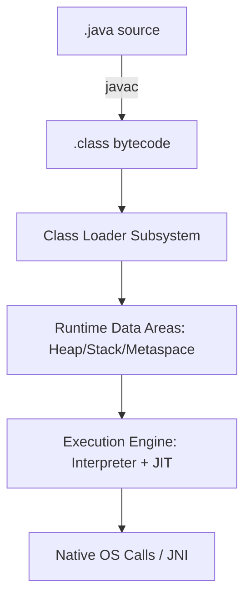
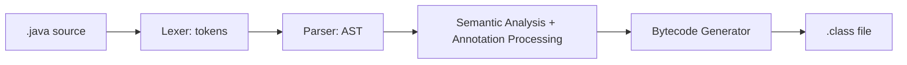
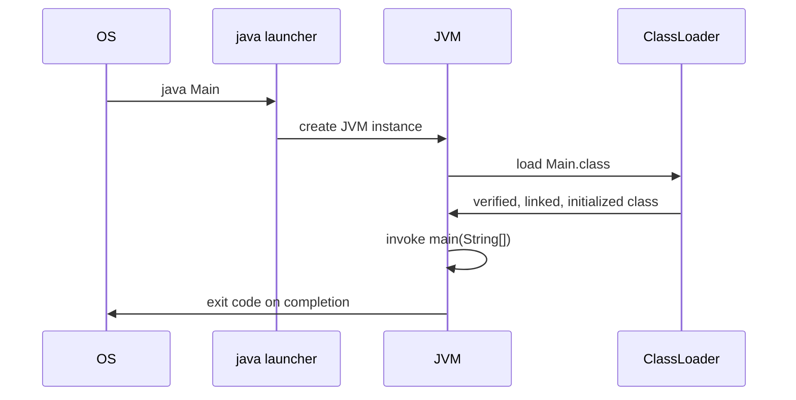
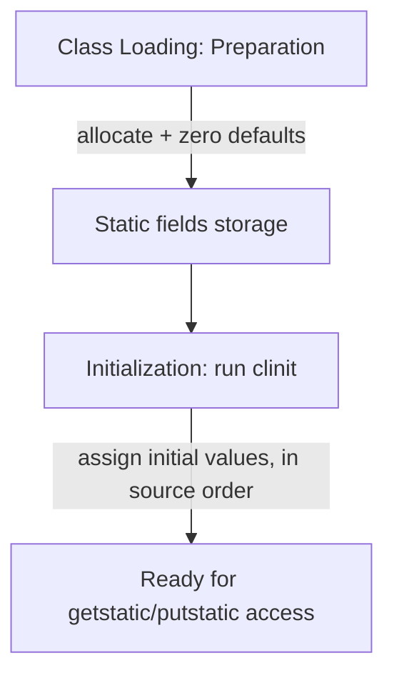
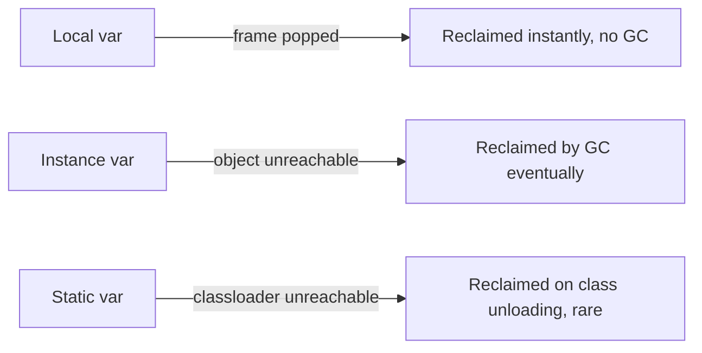
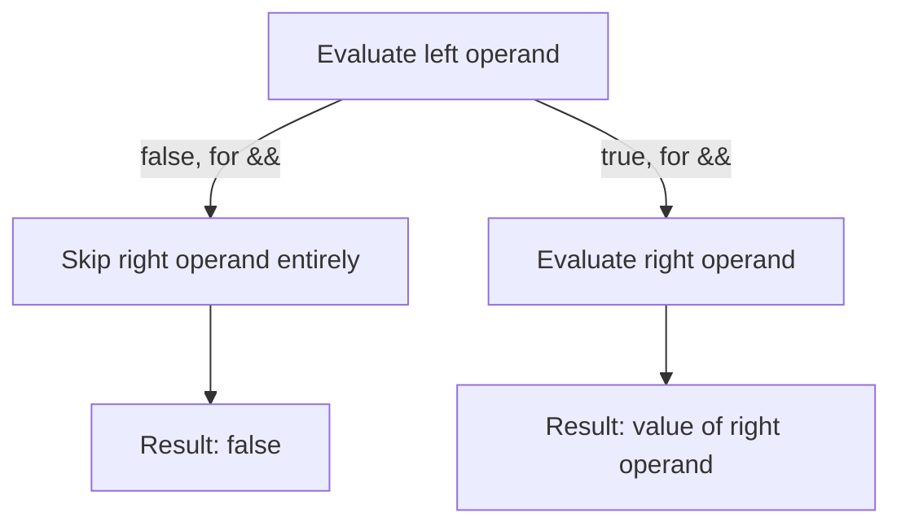

# 1. Java Language Fundamentals

## 1.1 Java Architecture

### JVM

#### Theory

- **Core Concepts**: The Java Virtual Machine (JVM) is an abstract computing machine that provides a runtime environment in which Java bytecode (`.class` files) can be executed. It is the cornerstone of Java's "write once, run anywhere" promise — the JVM, not the source code, is what is platform-specific. Every OS/architecture combination has its own JVM implementation (HotSpot, OpenJ9, GraalVM) that understands the same bytecode format.
- **Internal Working**: The JVM loads class files via the class loader subsystem, verifies and links them, allocates runtime memory areas (heap, stack, metaspace), and executes bytecode through an interpreter and JIT compilers (C1/C2), eventually handing hot code off to native machine code.
- **When to Use It**: You don't "use" the JVM directly as an API, but understanding it is essential when tuning GC, diagnosing `OutOfMemoryError`/`StackOverflowError`, choosing heap sizes, or reasoning about performance and concurrency (the Java Memory Model is defined in terms of the JVM).
- **Advantages**: Platform independence, automatic memory management, built-in security sandboxing (classloader + verifier + optional SecurityManager), mature JIT optimization, huge tooling ecosystem (profilers, debuggers via JVMTI/JDWP).
- **Limitations**: Startup latency and warm-up cost (JIT needs time to optimize hot paths), memory overhead compared to native binaries, GC pauses can affect latency-sensitive systems, and the abstraction can hide low-level performance characteristics from developers.

#### Internal Working

- **Step-by-Step Explanation**: (1) `java` launcher starts the JVM process; (2) Bootstrap/Platform/Application class loaders load `.class` files on demand; (3) Bytecode verifier checks type-safety; (4) Class linking (verification, preparation, resolution) and initialization run static initializers; (5) The execution engine interprets bytecode, profiling method invocations; (6) Hot methods are JIT-compiled by C1 then C2; (7) GC threads manage heap generations concurrently; (8) `main` thread runs until completion or JVM shutdown hooks fire.
- **Memory Layout**: JVM manages Heap (objects), Stack (per-thread frames), Metaspace (class metadata, native memory since Java 8), PC Registers (per-thread instruction pointer), and Native Method Stacks (for JNI calls).
- **Diagrams**:



- **JVM Behaviour**: The JVM specification (JVMS) defines bytecode semantics but not implementation details — HotSpot uses tiered compilation (interpreter → C1 → C2), generational garbage collectors (G1 default since Java 9), and a metaspace for class metadata instead of PermGen (removed in Java 8). JIT compilation is triggered by invocation counters and back-edge counters exceeding thresholds (`-XX:CompileThreshold`).

#### Interview Questions

**Basic**
1. What is the JVM and how does it relate to the JRE and JDK?
2. Is the JVM platform-independent?

**Intermediate**
3. How does the JVM achieve "write once, run anywhere"?
4. What are the main runtime data areas managed by the JVM?

**Advanced**
5. How does tiered JIT compilation work in HotSpot?
6. How does the JVM ensure type safety without a separate OS-level sandbox?

**Scenario-based**
7. Your application has long GC pauses in production. Which JVM subsystems and flags would you investigate first?

#### Detailed Answers

1. The JVM is the runtime engine that loads, verifies, and executes Java bytecode. The JRE bundles the JVM with core libraries needed to run applications; the JDK additionally bundles development tools (compiler `javac`, debugger, `jar`, etc.) on top of the JRE. In modern JDKs (9+), JRE is no longer a separately shipped bundle — the `jlink` tool can produce custom minimal runtimes instead.
2. The JVM itself is *not* platform-independent — each OS/CPU combination requires its own native JVM binary. What's platform-independent is the bytecode: the same `.class` file can run on any conforming JVM implementation.
3. By compiling Java source to an intermediate, platform-neutral bytecode format rather than native machine code. Each platform provides its own JVM that translates this bytecode to native instructions at runtime, so the same artifact runs unmodified everywhere a compliant JVM exists.
4. Heap (shared, object storage, GC-managed), Java stacks (one per thread, holding frames with local variables and operand stacks), PC registers (one per thread), native method stacks (for JNI), and Metaspace/method area (class metadata, constant pool, static fields).
5. HotSpot starts by interpreting bytecode while counting method invocations and loop back-edges. Once a method crosses a threshold it's compiled by C1 (client compiler) with light optimizations and profiling instrumentation; if it stays hot, C2 (server compiler) recompiles it with aggressive optimizations (inlining, escape analysis, loop unrolling) using the profiling data gathered by C1 — this is "tiered compilation," balancing fast startup with peak throughput.
6. Type safety is enforced statically at class-load time by the bytecode verifier, which walks every method's bytecode performing data-flow analysis to ensure operand stack types, local variable types, and control flow are consistent, without needing OS-level process isolation for type errors.
7. Check GC logs (`-Xlog:gc*`) to identify which collector and generation is pausing, review heap sizing (`-Xms`/`-Xmx`, young/old ratio), check for excessive object allocation/promotion rates, consider switching collectors (G1 → ZGC/Shenandoah for low pause), and profile with tools like async-profiler or JFR to correlate pauses with allocation hotspots.

#### Code Examples

```java
// Demonstrates JVM-managed lifecycle: class loading, heap allocation, GC eligibility
public class JvmLifecycleDemo {
    public static void main(String[] args) {
        // Triggers class loading of Worker the first time it's referenced
        Worker w = new Worker("task-1");
        w.run();
        w = null; // object now eligible for GC once no other references exist
        System.gc(); // hint only; JVM decides whether/when to actually collect

        // Query JVM runtime data area sizes
        Runtime rt = Runtime.getRuntime();
        System.out.printf("Max heap: %d MB, Free: %d MB%n",
                rt.maxMemory() / (1024 * 1024), rt.freeMemory() / (1024 * 1024));
    }
}

class Worker {
    private final String name;
    Worker(String name) { this.name = name; }
    void run() { System.out.println("Running " + name); }
}
```

```bash
# Inspect what the JVM actually loads/executes
java -verbose:class JvmLifecycleDemo | grep Worker
java -Xlog:gc*:stdout:time -Xmx64m JvmLifecycleDemo
```

### JRE

#### Theory

- **Core Concepts**: The Java Runtime Environment (JRE) is a distribution that bundles the JVM together with the core class libraries (`java.lang`, `java.util`, `java.io`, etc.) and supporting files needed to *run* compiled Java applications. It does not include development tools like `javac`.
- **Internal Working**: When you invoke `java MyApp`, the launcher inside the JRE starts a JVM instance, sets up the classpath/module path from the JRE's bundled libraries, and delegates execution to the JVM.
- **When to Use It**: End-user machines or deployment servers that only need to *run* Java applications, not compile them — though since JDK 11 Oracle stopped shipping a separate public JRE download, and `jlink` is now the recommended way to build custom minimal runtimes.
- **Advantages**: Smaller footprint than a full JDK, sufficient for running applications, simplifies end-user installs.
- **Limitations**: No compiler, no debugger, no `jar`/`javadoc` tools — can't build or package Java code; as of Java 11+, standalone JRE downloads were discontinued in favor of `jlink`-built custom images or full JDKs.

#### Internal Working

- **Step-by-Step Explanation**: (1) `java` launcher (part of JRE/JDK `bin`) parses arguments; (2) it locates the module/class path using bundled `rt.jar` (pre-Java 9) or the runtime module image `lib/modules` (Java 9+, via jlink/jimage format); (3) it starts the JVM with these libraries visible; (4) the target class's `main` method runs.
- **Memory Layout**: Not directly applicable beyond standard JVM runtime areas — the JRE itself is a set of binaries/libraries on disk, not a runtime memory structure.
- **Diagrams**:

```
JDK
 ├── bin/ (javac, javadoc, jar, jlink, ...)
 └── JRE-equivalent runtime
      ├── bin/ (java, keytool, ...)
      └── lib/ (modules image: java.base, java.sql, ...)
```

- **JVM Behaviour**: Since Java 9's Project Jigsaw, the monolithic `rt.jar` was replaced by a modular runtime image stored as `lib/modules`, read via the jimage file format for faster class lookup. `jlink` can produce a custom minimal "JRE-like" image containing only the modules an application needs, reducing size and attack surface.

#### Interview Questions

**Basic**
1. What's the difference between JRE and JDK?
2. Can you compile Java code using only the JRE?

**Intermediate**
3. Why did Oracle stop offering a separate JRE download starting with Java 11?

**Advanced**
4. How does `jlink` relate to the traditional concept of a JRE?

**Scenario-based**
5. You need to ship a minimal container image that only runs (never compiles) a Java 17 microservice. How would you construct the runtime?

#### Detailed Answers

1. The JRE contains the JVM plus the standard class libraries needed to execute Java bytecode. The JDK is a superset that adds development tooling — compiler (`javac`), debugger, `jar`, `javadoc`, `jshell`, etc. — on top of a JRE-equivalent runtime.
2. No. The JRE deliberately omits `javac` and other build tools; it can only execute already-compiled `.class`/`.jar` artifacts.
3. With the move to a modular JDK (Project Jigsaw, Java 9) and the introduction of `jlink`, the traditional fixed JRE bundle became redundant — developers can now generate purpose-built runtime images containing exactly the modules needed, making a generic one-size-fits-all JRE less useful; Oracle also unified release cadence and licensing around the JDK.
4. `jlink` assembles a custom, minimal runtime image (conceptually a tailored JRE) from a chosen set of modules plus the base module system, rather than relying on the general-purpose full JDK/JRE bundle — it is the modern successor to shipping a generic JRE.
5. Use a multi-stage Docker build: in the build stage use a full JDK to compile/package the app into a jar; then run `jlink --add-modules <needed modules> --output /custom-runtime --strip-debug --no-header-files --no-man-pages` to build a minimal runtime, and copy that runtime plus the jar into a slim final image (e.g., `distroless` or `alpine`) that only contains `java` from the custom image.

#### Code Examples

```bash
# Determine which modules an application actually needs
jdeps --print-module-deps --ignore-missing-deps MyApp.jar

# Build a minimal custom "JRE" containing only required modules
jlink --module-path $JAVA_HOME/jmods \
      --add-modules java.base,java.logging \
      --output custom-runtime --strip-debug --no-header-files --no-man-pages

# Run the app using only the custom runtime (no javac available in it)
./custom-runtime/bin/java -jar MyApp.jar
```

### JDK

#### Theory

- **Core Concepts**: The Java Development Kit (JDK) is the full software development kit for Java — it bundles a JRE-equivalent runtime plus development tools: `javac` (compiler), `jar` (archiver), `javadoc` (doc generator), `jdb` (debugger), `jshell` (REPL), `jlink`/`jpackage` (custom runtime/native packaging), and header files for JNI.
- **Internal Working**: `javac` parses `.java` source into an AST, performs semantic analysis and type checking, then emits `.class` bytecode files; other tools (jar, javadoc) operate on source/bytecode artifacts; the bundled runtime executes the result.
- **When to Use It**: Any machine where Java code is written, compiled, tested, packaged, or debugged — i.e., developer workstations and CI/CD build agents.
- **Advantages**: Complete toolchain in one distribution, consistent versioning between compiler and runtime, includes modern tools like `jshell` for quick experimentation and `jlink` for custom runtime images.
- **Limitations**: Larger download/footprint than a runtime-only image; not necessary (and often avoided for security/size reasons) in production runtime containers where only execution is needed.

#### Internal Working

- **Step-by-Step Explanation**: (1) Developer writes `.java` files; (2) `javac` performs lexical analysis, parsing to AST, semantic/type analysis, and bytecode generation; (3) resulting `.class` files can be packaged via `jar`; (4) `javadoc` extracts documentation comments to generate HTML docs; (5) `jlink`/`jpackage` can turn the app + JDK modules into a distributable runtime or native installer.
- **Memory Layout**: Not directly applicable — the JDK is a set of build-time tools and libraries on disk; runtime memory behavior is governed by the JVM once code executes.
- **Diagrams**:

```
JDK distribution
 ├── bin/javac, bin/java, bin/jar, bin/javadoc, bin/jshell, bin/jlink, bin/jpackage
 ├── lib/ (compiler support, modules)
 └── jmods/ (module definitions used by jlink)
```

- **JVM Behaviour**: `javac` is a pure source-to-bytecode compiler and does *not* perform JIT-style optimization — all runtime optimization (inlining, escape analysis) happens later inside the JVM's execution engine. `javac` does perform some compile-time transformations, e.g., constant folding, autoboxing insertion, generics type erasure, and synthetic bridge method generation.

#### Interview Questions

**Basic**
1. What tools does the JDK provide beyond the JRE's runtime?
2. What does `javac` actually produce?

**Intermediate**
3. Does `javac` perform any optimizations, or is that solely the JVM's job?

**Advanced**
4. How would you use JDK tools to produce a self-contained native installer for a desktop app?

**Scenario-based**
5. Your CI pipeline needs to both build and produce a minimal runtime image for deployment. Which JDK tools would you chain together?

#### Detailed Answers

1. `javac` (compiler), `jar` (archiving/packaging), `javadoc` (API documentation generation), `jdb` (command-line debugger), `jshell` (interactive REPL introduced in Java 9), `jlink` (custom runtime image linker, Java 9+), `jpackage` (native installer/packaging, Java 14+), plus header-file generation for native/JNI interop.
2. `javac` produces `.class` files containing JVM bytecode — a structured binary format with a constant pool, field/method descriptors, and bytecode instruction sequences per method, per the JVM class file specification.
3. `javac` performs limited compile-time transformations: constant folding (e.g., combining literal expressions), type erasure for generics, autoboxing/unboxing insertion, and generation of synthetic/bridge methods. It does **not** perform runtime optimizations like inlining or escape analysis — those are exclusively the JVM's JIT compiler's responsibility at runtime, informed by actual execution profiles.
4. Compile and package the app into a jar with `javac`/`jar`, use `jlink` to build a minimal custom runtime image containing only required modules, then run `jpackage --input . --main-jar app.jar --type dmg|msi|deb --runtime-image custom-runtime` to produce a native, self-contained installer bundling the app and its tailored JVM.
5. Typically: `javac` to compile, `jar` to package into an executable jar, `jdeps` to discover required modules, `jlink` to build a slim custom runtime, and optionally `jpackage` if a native OS-specific artifact (not just a jar+runtime) is required for deployment.

#### Code Examples

```bash
# Full JDK toolchain in action
javac -d out src/com/example/App.java          # compile
jar --create --file app.jar --main-class com.example.App -C out .   # package
javadoc -d docs -sourcepath src com.example      # generate docs
jshell --execution local                          # quick REPL experimentation
jlink --module-path $JAVA_HOME/jmods --add-modules java.base --output rt
jpackage --input . --main-jar app.jar --name MyApp --type app-image --runtime-image rt
```

### Bytecode

#### Theory

- **Core Concepts**: Bytecode is the compact, stack-oriented, platform-neutral instruction set that `.class` files contain. Each instruction (opcode) is one byte plus optional operands (hence "bytecode"). It sits between source code and native machine code as the JVM's portable intermediate representation.
- **Internal Working**: Bytecode instructions operate on a per-frame operand stack and local variable array, referencing symbolic entries in the class's constant pool for types, fields, methods, and literals.
- **When to Use It**: You rarely write bytecode by hand, but understanding it is critical for bytecode manipulation libraries (ASM, ByteBuddy, CGLIB), writing Java agents, debugging with `javap`, and understanding JIT behavior.
- **Advantages**: Compact, portable, verifiable for type-safety before execution, enables dynamic loading and hot code generation (proxies, AOP frameworks).
- **Limitations**: Slower than native code when merely interpreted (mitigated by JIT), reverse-engineerable (decompilers), and a layer of indirection that can obscure low-level performance reasoning.

#### Internal Working

- **Step-by-Step Explanation**: (1) `javac` emits opcodes such as `aload`, `invokevirtual`, `getfield`, `areturn` per method; (2) each method has a `Code` attribute with max stack/locals sizes and the instruction array; (3) at class-load time the verifier statically checks stack/type consistency; (4) the interpreter executes opcodes one by one, or the JIT compiles hot methods to native code.
- **Memory Layout**: Bytecode itself lives in the method area/Metaspace as part of loaded class metadata; execution uses the current thread's stack frame (operand stack + local variable array) for that method invocation.
- **Diagrams**:

```
int x = a + b;
            ↓ javac
0: iload_1        // push local var a
1: iload_2        // push local var b
2: iadd            // pop two ints, push sum
3: istore_3        // pop, store into local var x
```

- **JVM Behaviour**: Bytecode is portable across CPU architectures because the JVM — not the OS — interprets/compiles it. HotSpot's interpreter uses a template-based dispatch for speed, while C1/C2 JIT compilers translate hot bytecode sequences into optimized native machine code, guided by runtime profiling (branch frequencies, type feedback for virtual calls).

#### Interview Questions

**Basic**
1. What is Java bytecode and where is it stored?
2. Name a tool to inspect bytecode of a compiled class.

**Intermediate**
3. How does bytecode enable platform independence?

**Advanced**
4. How does the bytecode verifier ensure type safety before execution?

**Scenario-based**
5. You suspect a third-party library is using bytecode manipulation (e.g., for proxies). How would you confirm and inspect the generated bytecode at runtime?

#### Detailed Answers

1. Bytecode is the JVM's instruction set — a sequence of one-byte opcodes with operands, generated by `javac` from Java source and stored inside `.class` files as part of each method's `Code` attribute.
2. `javap -c ClassName` disassembles compiled bytecode into a human-readable mnemonic form; tools like ASM's `ASMifier` or `CFR`/`Procyon` decompilers can also inspect/reconstruct bytecode.
3. Because bytecode is CPU- and OS-agnostic, any conforming JVM implementation can load and execute the exact same `.class` file, translating it to whatever native instructions the host machine needs — the portability boundary moves from "source must be recompiled per platform" to "only the JVM needs a native build per platform."
4. The verifier performs a data-flow analysis pass over each method's bytecode at link time, tracking the type of every operand stack slot and local variable at every program point, ensuring no operation is applied to an incompatible type (e.g., no `iadd` on an object reference), that branches merge to consistent stack states, and that method/field references are used according to their declared descriptors — all without executing the code.
5. Dump the runtime-generated class with `-Djdk.proxy.ProxyGenerator.saveGeneratedFiles=true` (JDK proxies) or a Java agent using `ClassFileTransformer` to capture bytes before they're defined, then disassemble the captured `.class` bytes with `javap -c` or load them into a decompiler to inspect the generated methods.

#### Code Examples

```java
public class BytecodeDemo {
    public int sum(int a, int b) {
        return a + b;
    }
}
```

```bash
javac BytecodeDemo.java
javap -c BytecodeDemo
# Output (excerpt):
#   public int sum(int, int);
#     Code:
#        0: iload_1
#        1: iload_2
#        2: iadd
#        3: ireturn
```

### Java Compilation Process

#### Theory

- **Core Concepts**: The Java compilation process transforms human-readable `.java` source files into `.class` bytecode files via `javac`, and separately the JVM's class loader/execution engine transforms bytecode into running behavior (interpretation or JIT-compiled native code) — a clean two-stage compilation model (source→bytecode, then bytecode→native at runtime).
- **Internal Working**: `javac` performs lexical analysis (tokenizing), syntax analysis (building an AST via the Java Language Model), semantic analysis (type checking, generics resolution, annotation processing), and code generation (emitting constant pool entries and bytecode instructions).
- **When to Use It**: Understanding this pipeline matters for diagnosing compile errors, annotation-processor-based code generation (Lombok, Dagger, MapStruct), and reasoning about what's a compile-time vs. runtime concern (e.g., generics erasure).
- **Advantages**: Early error detection (type errors, missing symbols caught before running), enables tooling (IDEs, static analysis) to hook into a well-defined AST, supports pluggable annotation processors for compile-time code generation.
- **Limitations**: Compilation is a separate step from execution (no single native binary), some errors (e.g., `ClassCastException`, generics-erasure surprises) can only surface at runtime, and incremental/large multi-module builds can be slow without build-tool caching.

#### Internal Working

- **Step-by-Step Explanation**: (1) Lexer converts source text into tokens; (2) Parser builds an Abstract Syntax Tree; (3) Semantic analysis resolves symbols, checks types, applies generics/erasure rules, runs annotation processors (which may generate additional source to be recompiled); (4) Code generator emits bytecode instructions and populates the constant pool; (5) `.class` file(s) are written to disk.
- **Memory Layout**: Compilation is a build-time, off-JVM-runtime process running inside the `javac` tool's own JVM instance; it doesn't affect the target application's runtime heap/stack — "Not directly applicable" to the application's runtime memory areas.
- **Diagrams**:



- **JVM Behaviour**: `javac` itself runs on a JVM but the code it emits targets a *different* runtime execution — the `--release`/`-target` flag controls which bytecode major version is emitted, allowing cross-compilation for older JVMs. Annotation processing (JSR 269) runs in rounds: processors can generate new source files that get fed back into subsequent compilation rounds until no new files are produced.

#### Interview Questions

**Basic**
1. What are the main phases of Java compilation?
2. What file extension does `javac` produce?

**Intermediate**
3. How does annotation processing fit into the compilation pipeline?

**Advanced**
4. What is the difference between `-source`/`-target` and `--release`, and why does it matter for cross-compilation?

**Scenario-based**
5. Your build works locally on JDK 21 but fails at runtime on a JDK 11 production server with `UnsupportedClassVersionError`. How would you fix your build?

#### Detailed Answers

1. Lexical analysis (tokenizing raw text), syntax analysis (building the AST), semantic analysis (type-checking, scope/symbol resolution, generics erasure, annotation processing), and code generation (emitting the bytecode and constant pool into a `.class` file).
2. `.class`, containing the compiled bytecode representation defined by the JVM class file format.
3. Annotation processors (implementing `javax.annotation.processing.Processor`, JSR 269) are invoked by `javac` between semantic analysis rounds; they can inspect annotated elements via the `Elements`/`Types` APIs and generate new source files (e.g., Lombok-style boilerplate, Dagger component implementations), which are fed back for additional compilation rounds until a fixed point is reached, after which final code generation occurs.
4. `-source`/`-target` independently control the language-level syntax accepted and the bytecode version emitted, but they don't guarantee the emitted code only references APIs available in that target's standard library, which can cause runtime `NoSuchMethodError`s if you accidentally use a newer API against an older bootclasspath. `--release N` is safer: it sets source, target, *and* restricts the compiler to the official API surface of JDK N via bundled ct.sym symbol data, catching such API-level mismatches at compile time.
5. Recompile with `--release 11` (not just `-target 11`) to ensure both bytecode version and API usage are constrained to Java 11, update the build tool (Maven `maven.compiler.release`, Gradle `sourceCompatibility`/`options.release`) accordingly, and verify no JDK-17-only APIs are referenced; then redeploy the correctly targeted artifact.

#### Code Examples

```bash
# Cross-compile safely for an older runtime
javac --release 11 -d out src/com/example/App.java

# Inspect the emitted class file's target version (major version 55 = Java 11)
javap -verbose out/com/example/App.class | grep "major version"
```

```java
// Example annotation-processor-friendly code (Lombok-style, illustrative)
import java.util.Objects;

public final class Point {
    private final int x, y;
    public Point(int x, int y) { this.x = x; this.y = y; }
    public int getX() { return x; }
    public int getY() { return y; }
    @Override public boolean equals(Object o) {
        if (!(o instanceof Point p)) return false;
        return x == p.x && y == p.y;
    }
    @Override public int hashCode() { return Objects.hash(x, y); }
}
```

### Platform Independence

Java achieves platform independence at the bytecode level rather than the source or native-binary level; see WORA below for the mechanics.

#### Write Once Run Anywhere (WORA)

##### Theory

- **Core Concepts**: WORA is Java's founding design goal: source code compiled once into bytecode can run unmodified on any device with a conforming JVM, regardless of underlying OS/CPU. The portability contract is bytecode, not source or native binaries.
- **Internal Working**: `javac` compiles source into a standardized `.class` bytecode format; any certified JVM (Windows/Linux/macOS/ARM/x86) loads and executes that identical bytecode, translating it to native instructions internally.
- **When to Use It**: Whenever you need to ship one build artifact (a JAR) across heterogeneous deployment targets — cross-platform desktop apps, portable server workloads, or Android-adjacent (though Android uses its own DEX/ART runtime, not a standard JVM).
- **Advantages**: One build artifact for all platforms, simplified CI/CD (single compile step), reduced platform-specific bug surface for application logic.
- **Limitations**: Native interop (JNI), file system paths, line endings, and some OS-specific behaviors (process handling, native library loading) still require platform-aware code; performance characteristics can also vary subtly across JVM implementations/OS.

##### Internal Working

- **Step-by-Step Explanation**: (1) Developer compiles `.java` → `.class` once; (2) the same `.class`/`.jar` is copied to Windows, Linux, macOS machines; (3) each machine's locally installed, platform-native JVM binary loads the bytecode; (4) the JVM's interpreter/JIT translates bytecode to that machine's native instructions at runtime — no recompilation of the Java source is needed.
- **Memory Layout**: Not directly applicable — WORA is a portability property of the compiled artifact, not a runtime memory structure.
- **Diagrams**:

```
        MyApp.jar (bytecode) — identical on every OS
         /        |         \
   Windows JVM  Linux JVM   macOS JVM
   (native x64) (native x64/ARM) (native ARM/x64)
```

- **JVM Behaviour**: Each OS/architecture ships a separate native JVM build (HotSpot for Windows differs internally from HotSpot for Linux), but all implement the same JVM Specification, so the *bytecode* contract stays constant while implementation details (thread scheduling hooks, native memory allocation, default GC ergonomics) can differ.

##### Interview Questions

**Basic**
1. What does "Write Once, Run Anywhere" mean in practice?

**Intermediate**
2. What breaks WORA in real-world Java applications?

**Advanced**
3. How does WORA hold up when native libraries (JNI) are involved?

**Scenario-based**
4. Your cross-platform desktop app works on Linux/macOS but fails to find a native library on Windows. Is this a WORA violation, and how do you fix it?

##### Detailed Answers

1. It means a compiled Java artifact (bytecode in a `.class`/`.jar`) can be executed unchanged on any machine that has a conforming JVM installed, without recompiling for that machine's OS or CPU architecture.
2. Direct file system path assumptions (`/` vs `\`), reliance on OS-specific environment variables or native executables via `ProcessBuilder`, JNI calls to platform-specific native libraries, and assumptions about default charset/line separators can all break true portability even though the bytecode itself is portable.
3. JNI breaks pure WORA because native libraries (`.dll`/`.so`/`.dylib`) are platform- and architecture-specific; the Java-side bytecode remains portable, but you must ship or dynamically select the correct native binary per platform, effectively pushing the platform-dependency down into a native-library packaging concern rather than eliminating it.
4. It's not a WORA violation of the bytecode itself — it's a native-library packaging gap: you likely only bundled a `.so`/`.dylib` and not the Windows `.dll` equivalent, or your `System.loadLibrary` lookup doesn't handle Windows' `PATH`/working-directory resolution. Fix by bundling all required per-OS native binaries and using `System.mapLibraryName` plus OS detection (`os.name` system property) to load the correct one at runtime.

##### Code Examples

```java
// Portable code: relies only on JVM abstractions, no platform-specific assumptions
import java.nio.file.Path;
import java.nio.file.Paths;

public class PortablePaths {
    public static void main(String[] args) {
        // Path.of / Paths.get correctly handles OS-specific separators internally
        Path configDir = Paths.get(System.getProperty("user.home"), ".myapp", "config");
        System.out.println("Config path (portable): " + configDir);
        System.out.println("Running on: " + System.getProperty("os.name"));
    }
}
```

### Java Execution Flow

#### Theory

- **Core Concepts**: The end-to-end journey of a Java program from source code to running process: edit `.java` → compile to `.class` → package into `.jar` → launch via `java` → class loading/linking/initialization → bytecode execution (interpreted then JIT-compiled) → process termination.
- **Internal Working**: The `java` launcher starts a JVM instance, the bootstrap class loader loads core classes, the application class loader loads your classes on demand, `main()` is located and invoked via reflection-like lookup, and execution proceeds until `main` returns or `System.exit` is called.
- **When to Use It**: Understanding this flow is essential for diagnosing startup issues, class-not-found errors, classpath/module-path misconfigurations, and for reasoning about lazy class initialization semantics.
- **Advantages**: Clear separation of build-time and run-time concerns, lazy loading reduces startup memory/time by only loading classes that are actually used, JIT warm-up improves long-running throughput.
- **Limitations**: Lazy class loading can defer errors (e.g., `NoClassDefFoundError`) until a code path first executes, and cold-start latency (class loading + interpretation before JIT kicks in) can hurt short-lived processes (a key reason for GraalVM native-image / CRaC in serverless contexts).

#### Internal Working

- **Step-by-Step Explanation**: (1) `java -cp app.jar com.example.Main` starts the JVM; (2) Bootstrap loader loads `java.base` module classes; (3) Application class loader loads `Main` from the jar; (4) JVM verifies bytecode, links (prepare static fields with defaults, resolve symbolic references lazily), then initializes the class (runs static initializers in textual order); (5) JVM locates `public static void main(String[])` and invokes it in a new thread; (6) Program runs, spawning further class loads on demand; (7) JVM exits when all non-daemon threads finish or `System.exit()` is called, running shutdown hooks first.
- **Memory Layout**: Class metadata goes into Metaspace, `main` thread gets its own stack frame, objects created during execution go on the Heap.
- **Diagrams**:



- **JVM Behaviour**: Class initialization is lazy and triggered by specific "active use" events (first instantiation, static method/field access, reflection, subclass initialization) per JLS §12.4.1 — merely referencing a class type does not trigger initialization. The JIT compiler only starts optimizing methods after they cross invocation thresholds, so execution flow starts fully interpreted and gradually transitions hot paths to native code.

#### Interview Questions

**Basic**
1. Walk through what happens when you run `java Main`.
2. What triggers a class to be initialized in Java?

**Intermediate**
3. What's the difference between class loading, linking, and initialization?

**Advanced**
4. Why might a `NoClassDefFoundError` appear deep into a program's execution rather than immediately at startup?

**Scenario-based**
5. A serverless function has unacceptable cold-start latency due to JVM startup and class loading. What options would you consider?

#### Detailed Answers

1. The `java` launcher creates a JVM instance, the bootstrap/platform/application class loaders load the `Main` class (and its dependencies lazily), the class is verified and linked, static initializers run during initialization, then the JVM locates and invokes `public static void main(String[])`, running the program until completion or explicit exit, after which the JVM tears down (running shutdown hooks) and returns an exit code to the OS.
2. Per JLS §12.4.1, "active use" triggers initialization: creating an instance (`new`), invoking a static method, accessing/assigning a non-constant static field, reflectively invoking these, initializing a subclass (triggers superclass init first), or being designated as the startup class with `main`. Merely declaring a variable of the type, or accessing a `static final` compile-time constant, does not trigger initialization.
3. Loading reads the `.class` bytes and creates a `Class` object in memory. Linking has three sub-phases: verification (bytecode safety checks), preparation (allocating static fields with default zero/null values), and resolution (optionally lazily resolving symbolic references to other classes/methods/fields into direct references). Initialization is the final step that actually executes static initializer blocks and static field assignments in source order.
4. Because class loading is lazy — a class is only loaded when first actively used. If a rarely executed code path (e.g., an error-handling branch or a feature flag) references a class whose `.class` file is missing from the classpath, the program can run fine for a long time and only throw `NoClassDefFoundError` once that specific path finally executes.
5. Consider ahead-of-time compilation with GraalVM native-image (eliminates class loading/JIT warm-up by producing a native executable), Application Class Data Sharing/AppCDS (pre-parses and shares core class metadata across JVM starts), Coordinated Restore at Checkpoint (CRaC) to snapshot a warmed-up JVM, or simply keeping execution environments warm (provisioned concurrency) to amortize the one-time startup cost.

#### Code Examples

```java
public class ExecutionFlowDemo {
    static { System.out.println("Static initializer of ExecutionFlowDemo ran"); }

    public static void main(String[] args) {
        System.out.println("main() started");
        // Lazy Config not yet initialized until referenced below
        System.out.println(Config.NAME); // triggers Config's class initialization here
    }
}

class Config {
    static { System.out.println("Config class initialized (lazy, on first active use)"); }
    static final String NAME = "prod-config";
}
```

```bash
# Observe lazy class loading order at runtime
java -verbose:class ExecutionFlowDemo | grep -E "ExecutionFlowDemo|Config"
```

### Java Modules (JPMS)

#### Theory

- **Core Concepts**: The Java Platform Module System (JPMS, Project Jigsaw, Java 9+) introduces `module-info.java` descriptors that group packages into named modules with explicit `requires` (dependencies) and `exports` (public API surface) declarations, replacing the flat, all-public classpath model with strong encapsulation at the package level.
- **Internal Working**: At compile/link/run time, the module system builds a module graph, resolves `requires` edges, and enforces that only `exported` packages are accessible to other modules (even reflection is restricted unless `opens` is declared), readability and accessibility are checked by the JVM, not just conventions.
- **When to Use It**: Building large, layered applications needing genuine encapsulation, creating custom minimal runtimes with `jlink`, or when a library must hide internal packages from consumers.
- **Advantages**: True encapsulation (`public` no longer means "accessible everywhere" if the package isn't exported), reliable configuration (missing dependencies fail fast at startup, not with obscure `NoClassDefFoundError` later), smaller custom runtimes via `jlink`, explicit service provider declarations (`provides`/`uses`).
- **Limitations**: Migration friction for legacy classpath-based libraries (split packages, automatic modules), added ceremony (`module-info.java` per module), reflection-heavy frameworks (Spring, Hibernate, Jackson) often need explicit `opens` directives, and many real-world projects still run on the classpath rather than fully adopting modules.

#### Internal Working

- **Step-by-Step Explanation**: (1) Each module declares a `module-info.java` with `module name { requires ...; exports ...; opens ...; uses ...; provides ...; }`; (2) at compile time `javac` checks that referenced packages are actually exported by their declaring module; (3) at run time the JVM's module system builds a readability graph from the root module(s), resolving `requires` transitively; (4) strong encapsulation is enforced — accessing a non-exported package (even via reflection, unless `opens`) throws `IllegalAccessException`/`InaccessibleObjectException`.
- **Memory Layout**: Module metadata (readability graph, exports/opens tables) is held in the JVM's internal module system state alongside class metadata in Metaspace; no dedicated new heap regions are introduced.
- **Diagrams**:

```
module com.example.app {
    requires com.example.core;      // readability edge
    requires java.sql;
    exports com.example.app.api;    // only this package is visible externally
    opens com.example.app.model to com.fasterxml.jackson.databind; // reflection access
}
```

- **JVM Behaviour**: At startup, the JVM computes the module graph starting from the initial module (or unnamed module for classpath-based code), determines each module's readability set, and installs accessibility checks so that `setAccessible(true)` on a non-opened package throws at runtime instead of silently succeeding as it did pre-Java 9. Automatic modules (plain jars placed on the module path without `module-info.java`) are granted a derived name and implicit `requires`/`exports` of everything, as a migration aid.

#### Interview Questions

**Basic**
1. What problem does JPMS solve that the classpath didn't?
2. What does `exports` mean in a `module-info.java`?

**Intermediate**
3. What's the difference between `exports` and `opens`?

**Advanced**
4. What is an automatic module and why does it exist?

**Scenario-based**
5. You migrate a library to JPMS and a reflection-heavy framework (e.g., Jackson) suddenly throws `InaccessibleObjectException` on your model classes. How do you fix it?

#### Detailed Answers

1. The classpath offered no real encapsulation (all public classes across all jars were globally visible), no reliable dependency declarations (missing dependencies surfaced as runtime errors, e.g. `NoClassDefFoundError`, instead of clear failures), and no way to build minimal runtime images. JPMS adds explicit, verifiable module boundaries, strong encapsulation of internal packages, and reliable configuration checked at compile and launch time.
2. `exports <package>` makes all `public`/`protected` types in that package accessible to any module that `requires` this module; packages not listed in `exports` remain fully internal, inaccessible even with correct classpath-style imports.
3. `exports` grants normal compile-time and runtime access to a package's public API for other modules. `opens` additionally grants *deep reflective access* (e.g., `setAccessible(true)` on private members) to that package, which is required by frameworks that use reflection to serialize/inject into fields regardless of visibility, even though the package may or may not also be `exports`ed for normal use.
4. An automatic module is created when a plain (non-modularized) jar is placed on the module path instead of the classpath; the JVM derives a module name from the jar's filename (or `Automatic-Module-Name` manifest entry) and implicitly `requires` all other modules and `exports` all its packages, acting as a bridge so legacy libraries can participate in a modular application graph before they've been fully modularized themselves.
5. Add an `opens` directive for the affected package to the reflecting module (e.g., `opens com.example.model to com.fasterxml.jackson.databind;`), or if you don't control the descriptor, use `opens com.example.model;` (open to all) or launch with `--add-opens com.example.model/com.example.model=ALL-UNNAMED` as a stop-gap while planning a proper module descriptor fix.

#### Code Examples

```java
// module-info.java for an application module
module com.example.orders {
    requires java.sql;
    requires com.example.core;

    exports com.example.orders.api;
    opens com.example.orders.model to com.fasterxml.jackson.databind;
}
```

```bash
# Compile and run a modular application
javac -d out --module-source-path src $(find src -name "*.java")
java --module-path out -m com.example.orders/com.example.orders.Main

# Inspect module dependencies of an existing jar
java --describe-module --module-path libs -m com.example.orders
```

### Java Class File Structure

#### Theory

- **Core Concepts**: A `.class` file is a well-defined binary format specified by the JVM Specification (§4). It begins with a magic number (`0xCAFEBABE`), version info, a constant pool, access flags, references to this/super class, interfaces, fields, methods, and attributes.
- **Internal Working**: Every symbolic reference (class names, method signatures, string literals) is deduplicated into the constant pool and referenced by index elsewhere in the file, keeping the format compact and enabling lazy/late resolution.
- **When to Use It**: Understanding this format matters for bytecode manipulation (ASM, ByteBuddy), writing Java agents/class transformers, building custom class loaders, and deep debugging with `javap -v`.
- **Advantages**: Compact, self-describing, version-checked (so old JVMs reject newer bytecode with `UnsupportedClassVersionError` instead of misbehaving), supports incremental/lazy linking via symbolic constant pool references.
- **Limitations**: Fixed structure makes format evolution require careful versioning (major/minor version fields), manual construction/editing is error-prone and typically requires specialized libraries rather than hand-editing bytes.

#### Internal Working

- **Step-by-Step Explanation**: (1) Magic number `0xCAFEBABE` identifies the file as class bytecode; (2) minor/major version fields declare the target JVM version; (3) constant pool count + entries (UTF8 strings, class refs, method refs, field refs, name-and-type, etc.); (4) access flags (`public`, `final`, `abstract`, ...); (5) this-class/super-class constant pool indices; (6) interfaces table; (7) fields table (each with access flags, name/descriptor indices, attributes); (8) methods table (each with a `Code` attribute containing max stack/locals and bytecode array, plus optional `Exceptions`, `LineNumberTable`); (9) class-level attributes (`SourceFile`, `InnerClasses`, `BootstrapMethods` for invokedynamic, annotations).
- **Memory Layout**: Once loaded, this on-disk structure is parsed into internal JVM metadata objects stored in Metaspace (constant pool becomes a runtime constant pool with resolved/unresolved entries).
- **Diagrams**:

```
ClassFile {
    u4 magic;              // 0xCAFEBABE
    u2 minor_version;
    u2 major_version;      // e.g., 61 = Java 17
    u2 constant_pool_count;
    cp_info constant_pool[];
    u2 access_flags;
    u2 this_class;
    u2 super_class;
    u2 interfaces_count;
    u2 interfaces[];
    u2 fields_count;
    field_info fields[];
    u2 methods_count;
    method_info methods[];
    u2 attributes_count;
    attribute_info attributes[];
}
```

- **JVM Behaviour**: During class loading, the JVM parses this structure and, during verification, statically analyzes each method's `Code` attribute; the runtime constant pool starts with mostly symbolic (unresolved) entries that get resolved to direct references lazily (on first use) unless eager resolution is forced by JVM flags.

#### Interview Questions

**Basic**
1. What is the magic number at the start of every `.class` file?
2. What is the constant pool?

**Intermediate**
3. What information does the `major_version` field encode and why does it matter?

**Advanced**
4. How does the constant pool support lazy symbolic resolution?

**Scenario-based**
5. You get `UnsupportedClassVersionError: ... class file version 61.0`. What does this tell you and how do you resolve it?

#### Detailed Answers

1. `0xCAFEBABE` — a fixed 4-byte signature at the start of every valid `.class` file, used by the JVM to quickly confirm the file is bytecode before attempting to parse the rest of the structure.
2. The constant pool is a table of shared, indexed entries (numeric/string literals, class/interface names, field and method names with type descriptors, method handles) referenced by index throughout the rest of the class file, avoiding duplication and enabling compact symbolic references that get resolved at link/run time.
3. `major_version` (paired with `minor_version`) encodes which JVM specification version the bytecode targets (e.g., 52 = Java 8, 55 = Java 11, 61 = Java 17). The JVM checks this at class-load time and refuses to load class files whose major version exceeds what that JVM implementation supports, throwing `UnsupportedClassVersionError` rather than risking undefined behavior from unsupported instructions/attributes.
4. Symbolic references (e.g., a method call target) are stored as constant pool entries pointing to class/name/descriptor entries rather than direct memory addresses. The JVM resolves these lazily — typically on first actual use of that reference during execution — converting the symbolic entry into a direct reference (e.g., a resolved method pointer), which allows classes to be loaded/verified without requiring all referenced classes to be resolved immediately, supporting lazy class loading.
5. This means the class file was compiled for a newer JVM (major version 61 = Java 17) than the JVM currently trying to run it. Fix by either running the app on a JDK 17+ runtime, or recompiling the source with an older `--release` target (e.g., `--release 11`) matching the deployment JVM's version.

#### Code Examples

```bash
# Inspect full class file structure including constant pool
javac ClassFileDemo.java
javap -v ClassFileDemo | head -40

# Confirm the major version encoded in the file
xxd ClassFileDemo.class | head -1   # first bytes: cafe babe ... version
```

```java
public class ClassFileDemo {
    private static final String GREETING = "hello"; // becomes a constant pool UTF8 entry
    public String greet(String name) {
        return GREETING + ", " + name; // string concat compiles to invokedynamic (Java 9+)
    }
}
```

### Java Command-Line Tools *(new)*

#### Theory

- **Core Concepts**: The JDK ships a suite of command-line tools covering the full lifecycle of a Java application: `javac` (compiles `.java` → `.class`), `java` (launches the JVM and runs a class or jar), `jar` (creates/extracts/manages `.jar` archives), `javadoc` (generates HTML API documentation from doc comments), `jshell` (an interactive REPL for quick experimentation, Java 9+), `jlink` (assembles a custom, minimal runtime image from selected modules, Java 9+), and `jpackage` (packages an app plus a runtime image into a native installer/executable, Java 14+).
- **Internal Working**: Each tool is a thin CLI wrapper around JDK-internal APIs (`com.sun.tools.javac`, `jdk.jlink`, etc.); most can also be invoked programmatically via the `javax.tools.ToolProvider`/`JavaCompiler` API for in-process compilation.
- **When to Use It**: `javac`/`java` for everyday build/run; `jar` for packaging distributable artifacts; `javadoc` for publishing API docs; `jshell` for quick prototyping/teaching; `jlink` for building slim container runtime images; `jpackage` for shipping self-contained desktop/CLI installers without requiring users to have a JVM pre-installed.
- **Advantages**: Complete, consistent toolchain shipped with every JDK, scriptable for CI/CD, no need for third-party build tools for simple projects, `jlink`/`jpackage` enable modern minimal-footprint and native-feeling distribution.
- **Limitations**: For non-trivial multi-module projects, hand-driving these tools is tedious — real projects typically wrap them via Maven/Gradle; `jlink` requires a fully modularized dependency graph (or automatic modules) to work smoothly.

#### Internal Working

- **Step-by-Step Explanation**: A typical pipeline chains these tools: `javac` compiles sources → `jar` packages classes and resources into a distributable archive → `javadoc` (independently) generates documentation from the same sources → `jdeps`/`jlink` analyze and assemble a minimal runtime → `jpackage` wraps the jar and runtime into a native installer. `jshell` operates differently: it compiles and executes each snippet incrementally in a persistent session, evaluating expressions immediately.
- **Memory Layout**: Not directly applicable — these are build/packaging-time CLI tools; only `java`/`jshell` actually start a JVM runtime with standard memory areas.
- **Diagrams**:

```
src/*.java --javac--> out/*.class --jar--> app.jar --jlink--> custom-runtime
                                          |                        |
                                          +--jpackage(app.jar, custom-runtime)--> native installer
```

- **JVM Behaviour**: `java` is the only tool in this list that actually starts a full JVM runtime for the *target* application (with class loading, verification, GC, JIT); `javac`/`jar`/`javadoc`/`jlink`/`jpackage` run as their own short-lived JVM processes performing build-time tasks and do not affect the target app's runtime behavior, aside from `jlink` determining which modules/classes are bundled.

#### Interview Questions

**Basic**
1. What do `javac` and `java` each do?
2. What is `jshell` used for?

**Intermediate**
3. What problem does `jlink` solve?

**Advanced**
4. How does `jpackage` differ from `jlink`, and how do they work together?

**Scenario-based**
5. You need to give non-technical users a double-clickable app on Windows/macOS without asking them to install Java. Which tools would you use and in what order?

#### Detailed Answers

1. `javac` compiles `.java` source files into `.class` bytecode files. `java` is the launcher that starts a JVM instance, loads a specified class (or the main class in a jar/module), and invokes its `main` method to run the program.
2. `jshell` (introduced in Java 9) is an interactive Read-Eval-Print Loop (REPL) for Java: it lets you type expressions, statements, and even class/method declarations and see results immediately, without creating a full project/compiling files manually — useful for prototyping, learning, and quick API exploration.
3. Prior to `jlink`, distributing a Java app meant either bundling a full generic JRE (large, includes unused modules) or requiring users to install one separately. `jlink` solves this by assembling a custom runtime image containing only the JDK modules an application actually needs (determined via `jdeps`), producing a much smaller, self-contained, application-specific runtime.
4. `jlink` produces a minimal *runtime image* (a directory with a custom `java` launcher and only required modules) but the result is still "run via a folder + java command," not a native OS-integrated installer. `jpackage` (Java 14+) takes that further: it bundles your application jar together with a runtime image (often one built by `jlink`) into a native platform-specific package — `.msi`/`.exe` on Windows, `.dmg`/`.pkg` on macOS, `.deb`/`.rpm` on Linux — complete with icons, shortcuts, and no external Java dependency for the end user.
5. Compile and package the app with `javac`/`jar`; run `jdeps` to determine required modules; use `jlink` to build a minimal custom runtime image containing those modules; then run `jpackage --input . --main-jar app.jar --type dmg` (macOS) and `jpackage --input . --main-jar app.jar --type msi` (Windows) using that runtime image, producing native double-clickable installers with no separate Java installation required by the end user.

#### Code Examples

```bash
# javac + java: compile and run
javac -d out src/com/example/App.java
java -cp out com.example.App

# jar: package into an executable archive
jar --create --file app.jar --main-class com.example.App -C out .
java -jar app.jar

# javadoc: generate HTML API docs
javadoc -d docs -sourcepath src com.example

# jshell: quick REPL experimentation
# $ jshell
# jshell> int square(int n) { return n * n; }
# jshell> square(7)
# ==> 49

# jlink: build a minimal custom runtime
jdeps --print-module-deps app.jar
jlink --module-path $JAVA_HOME/jmods --add-modules java.base --output custom-rt

# jpackage: produce a native installer using the custom runtime
jpackage --input . --main-jar app.jar --name MyApp --type app-image --runtime-image custom-rt
```

## 1.2 Data Types

### Primitive Data Types

#### Theory

- **Core Concepts**: Java has 8 primitive types — `byte` (8-bit), `short` (16-bit), `int` (32-bit), `long` (64-bit), `float` (32-bit IEEE 754), `double` (64-bit IEEE 754), `char` (16-bit unsigned UTF-16 code unit), and `boolean` (JVM-implementation-defined size, conceptually 1 bit but typically stored as a byte/int). Unlike reference types, they are not objects and have no methods.
- **Internal Working**: Primitives are stored by value directly in the location that holds them — local variables live on the thread's stack frame, instance fields live inline within the object's header+field layout on the heap, and array elements of primitive type are packed contiguously.
- **When to Use It**: Whenever raw numeric/boolean/character performance and minimal memory overhead matter — tight loops, large numeric arrays, performance-critical computation — as opposed to using boxed wrapper types.
- **Advantages**: No object header overhead, no GC pressure from allocation, fast arithmetic via dedicated bytecode instructions (`iadd`, `dadd`, etc.), predictable fixed-size memory layout.
- **Limitations**: Cannot be used with generics (`List<int>` is illegal, must use `List<Integer>`), no null representation, no object methods (must use wrapper classes or utility classes like `Integer`/`Double` for parsing/formatting), and mixing types requires explicit understanding of promotion/casting rules.

#### Internal Working

- **Step-by-Step Explanation**: (1) `javac` maps each primitive type to a specific bytecode type category (`int`/`short`/`byte`/`char`/`boolean` all use the JVM's internal `int` computational type on the operand stack; `long`, `float`, `double` have their own categories); (2) local variable primitives are stored directly in the frame's local variable array slots (`long`/`double` take 2 slots); (3) instance/static primitive fields are stored inline in the object/class memory layout; (4) arithmetic uses dedicated opcodes per type (`iadd`, `ladd`, `fadd`, `dadd`).
- **Memory Layout**: Local primitives → stack frame local variable array. Instance field primitives → inline within the object's layout on the Heap (no separate allocation, no header). Static primitives → stored in the class's static area in Metaspace-referenced storage.
- **Diagrams**:

```
Type     Size      Bytecode category      Default value
byte     8-bit     int (computational)     0
short    16-bit    int                      0
int      32-bit    int                      0
long     64-bit    long (2 stack slots)     0L
float    32-bit    float                    0.0f
double   64-bit    double (2 stack slots)   0.0d
char     16-bit    int (unsigned)           '\u0000'
boolean  JVM-defined (often 1 byte/int)     false
```

- **JVM Behaviour**: On the operand stack and in bytecode instructions, `boolean`, `byte`, `short`, and `char` are all promoted to the JVM's `int` computational type — there are no dedicated `badd`/`sadd`/`badd` opcodes, only `iadd` etc. This is why, for example, `byte + byte` in Java source requires an explicit cast back to `byte` — the JVM/JLS computes it as `int` first.

#### Interview Questions

**Basic**
1. List Java's 8 primitive types and their sizes.
2. What is the default value of an uninitialized `int` instance field?

**Intermediate**
3. Why does `byte b = 1; byte c = 2; byte d = b + c;` fail to compile without a cast?

**Advanced**
4. How are `boolean` values actually represented internally by the JVM?

**Scenario-based**
5. You're storing millions of small counters and memory is tight. Would you use `int[]` or `Integer[]`, and why?

#### Detailed Answers

1. `byte` (8-bit, -128 to 127), `short` (16-bit, -32,768 to 32,767), `int` (32-bit, ~±2.1 billion), `long` (64-bit), `float` (32-bit single-precision IEEE 754), `double` (64-bit double-precision IEEE 754), `char` (16-bit unsigned, represents a UTF-16 code unit), `boolean` (true/false, size is JVM-implementation-defined).
2. `0`. Instance and static fields of primitive numeric types are always zero-initialized by the JVM during the preparation linking phase if no explicit initializer is given; local variables, in contrast, have no default and must be definitely assigned before use (compile-time checked).
3. Because the JVM promotes `byte` operands to `int` before performing arithmetic (there's no `badd` opcode, only `iadd`), so `b + c` yields an `int` result. Assigning that `int` back to a `byte` variable requires an explicit narrowing cast (`(byte)(b + c)`) since it could lose information, even though the actual values fit.
4. HotSpot typically represents `boolean` fields/array elements as a single byte internally (values 0 or 1), though the JVM specification leaves the exact representation up to the implementation; on the operand stack, `boolean` values are treated using the `int` computational type (0 = false, 1 = true) for bytecode instructions like `ifeq`/`ifne`.
5. Use `int[]` — a primitive array stores values contiguously with no per-element object header, giving roughly 4 bytes per element versus an `Integer[]` where each element is a separate heap object (typically 16 bytes of object overhead plus the 4-byte int, plus an 8-byte reference in the array itself, minus any Integer cache reuse for small values), making primitive arrays dramatically more memory- and cache-efficient for large counts.

#### Code Examples

```java
public class PrimitiveDemo {
    public static void main(String[] args) {
        byte b1 = 10, b2 = 20;
        // byte result = b1 + b2; // would not compile: int result needs narrowing cast
        byte sum = (byte) (b1 + b2); // explicit cast required due to int promotion

        // Memory-efficient primitive array vs boxed array
        int[] primitiveCounters = new int[1_000_000];   // ~4 MB
        Integer[] boxedCounters = new Integer[1_000_000]; // significantly more overhead per element

        System.out.println("sum=" + sum);
        System.out.println("primitive array length=" + primitiveCounters.length);
        System.out.println("boxed array length=" + boxedCounters.length);
    }
}
```

### Wrapper Classes

Each primitive type has a corresponding immutable wrapper class (`Integer`, `Long`, `Double`, `Character`, `Boolean`, etc.) in `java.lang` that boxes the primitive value into an object, enabling use with generics, collections, and reflection.

#### Autoboxing

##### Theory

- **Core Concepts**: Autoboxing is the compiler-inserted automatic conversion of a primitive value into its corresponding wrapper object (e.g., `int` → `Integer`) wherever a reference type is expected — introduced in Java 5 to reduce boilerplate when using primitives with generics/collections.
- **Internal Working**: `javac` rewrites `Integer i = 5;` into `Integer i = Integer.valueOf(5);` at compile time — there is no special bytecode instruction for boxing; it's purely a source-level/compiler transformation calling the wrapper's static factory method.
- **When to Use It**: Whenever primitives need to be stored in generic collections (`List<Integer>`), passed to APIs expecting `Object`, or used with `Optional<T>`. Prefer primitive collections (e.g., Eclipse Collections, `IntStream`) in hot paths to avoid boxing overhead.
- **Advantages**: Removes manual `new Integer(x)` boilerplate, seamless interop between primitives and generic/object-based APIs, integrates with the `Integer` cache for small values reducing allocations.
- **Limitations**: Implicit allocation cost (unless cache hit) in loops, subtle performance pitfalls (autoboxing inside loops creating many short-lived objects), and `NullPointerException` risk when unboxing a `null` wrapper.

##### Internal Working

- **Step-by-Step Explanation**: (1) Compiler sees a primitive value used where a reference type is required; (2) it inserts a call to the wrapper's `valueOf(primitive)` static factory (e.g., `Integer.valueOf(int)`, `Boolean.valueOf(boolean)`); (3) `valueOf` either returns a cached instance (for `Integer`/`Short`/`Byte`/`Long` in range -128..127, `Character` 0..127, `Boolean` true/false) or allocates a new wrapper object on the heap.
- **Memory Layout**: Boxed values are regular objects on the Heap (object header + the primitive field), referenced from wherever they're stored (a collection's backing array, a field, etc.); cached small values are shared singletons held by the JVM's cache classes.
- **Diagrams**:

```java
Integer i = 100;
// compiles to:
Integer i = Integer.valueOf(100);
```

```mermaid
flowchart LR
    A[int literal] --> B{javac inserts valueOf}
    B --> C[Integer.valueOf(int)]
    C -->|in cache range -128..127| D[return cached Integer]
    C -->|outside range| E[allocate new Integer on heap]
```

- **JVM Behaviour**: Autoboxing is entirely a `javac` source-level transformation — there is no dedicated "box" bytecode opcode; the emitted bytecode simply contains an `invokestatic Integer.valueOf(I)Ljava/lang/Integer;` call, so at the JVM level it's indistinguishable from an explicit manual call.

##### Interview Questions

**Basic**
1. What is autoboxing?
2. What method does the compiler insert for `Integer i = 5;`?

**Intermediate**
3. Why can autoboxing inside a loop hurt performance?

**Advanced**
4. Does autoboxing always allocate a new object?

**Scenario-based**
5. A hot loop does `Long sum = 0L; for (...) sum += someLong;`. What's wrong and how would you fix it?

##### Detailed Answers

1. Autoboxing is the automatic, compiler-inserted conversion of a primitive value into its corresponding wrapper object wherever a reference type is contextually required, e.g., assigning an `int` to an `Integer` variable or adding an `int` to a `List<Integer>`.
2. The compiler rewrites it to `Integer i = Integer.valueOf(5);` — it calls the wrapper class's static `valueOf` factory method rather than the deprecated public constructor.
3. Because each autoboxing operation may allocate a new wrapper object (for values outside the small-value cache range), repeated boxing inside a tight loop can generate large numbers of short-lived objects, increasing allocation rate and young-generation GC pressure, and adds pointer-chasing/indirection overhead compared to primitive arithmetic.
4. No — `valueOf` for `Integer`, `Short`, `Byte`, `Long` returns cached, shared instances for values in the range -128 to 127 (and `Character` 0-127, `Boolean` true/false always cached), avoiding allocation for common small values; values outside that range do allocate a new wrapper object each time.
5. The problem is that `sum += someLong` repeatedly unboxes `sum`, adds, then reboxes a new `Long` object every iteration (since `long` values outside a tiny cache range always allocate), causing O(n) allocations and unnecessary GC churn. Fix by using a primitive `long sum = 0L;` accumulator instead of the boxed `Long`, only boxing once at the end if a `Long` object is truly needed for an API boundary.

##### Code Examples

```java
public class AutoboxingDemo {
    public static void main(String[] args) {
        // Compiler inserts Integer.valueOf(...) here
        java.util.List<Integer> list = new java.util.ArrayList<>();
        for (int i = 0; i < 5; i++) {
            list.add(i); // autoboxing: int -> Integer.valueOf(i)
        }

        // Anti-pattern: boxed accumulator causes repeated allocation
        Long boxedSum = 0L;
        long primitiveSum = 0L; // preferred: no boxing per iteration
        for (long v = 0; v < 1_000_000; v++) {
            boxedSum += v;      // unboxes, adds, reboxes each iteration
            primitiveSum += v;  // pure primitive arithmetic, no allocation
        }
        System.out.println(boxedSum + " " + primitiveSum);
    }
}
```

#### Unboxing

##### Theory

- **Core Concepts**: Unboxing is the compiler-inserted automatic conversion of a wrapper object back into its primitive value (e.g., `Integer` → `int`) wherever a primitive is contextually required — the counterpart to autoboxing.
- **Internal Working**: `javac` rewrites `int x = someInteger;` into `int x = someInteger.intValue();`. If `someInteger` is `null`, this call throws `NullPointerException` at runtime because you cannot invoke an instance method on a null reference.
- **When to Use It**: Whenever a wrapper object needs to participate in primitive arithmetic, comparisons, or be passed to an API expecting a primitive — happens implicitly and pervasively when mixing boxed and unboxed types.
- **Advantages**: Transparent interop letting boxed values flow naturally into arithmetic/primitive contexts without manual `.intValue()`/`.doubleValue()` calls.
- **Limitations**: The single biggest pitfall — unboxing a `null` wrapper throws `NullPointerException`, often in non-obvious places like ternary expressions or ORM-mapped nullable database columns mapped to primitive fields.

##### Internal Working

- **Step-by-Step Explanation**: (1) Compiler detects a wrapper reference used in a primitive context (arithmetic operand, condition, primitive method parameter); (2) it inserts a call to the appropriate `xxxValue()` method (`intValue()`, `doubleValue()`, `booleanValue()`, etc.); (3) at runtime this dereferences the wrapper object and extracts its internal primitive field; (4) if the reference is `null`, the JVM throws `NullPointerException` when attempting the virtual method call.
- **Memory Layout**: No new memory is allocated during unboxing itself; it simply reads the primitive field out of an existing heap object.
- **Diagrams**:

```java
Integer boxed = getValue();
int x = boxed;
// compiles to:
int x = boxed.intValue(); // NPE here if boxed == null
```

- **JVM Behaviour**: The emitted bytecode contains an `invokevirtual Integer.intValue()I` call; there's no special "unbox" opcode. A classic gotcha: `Integer a = null; int b = (condition) ? a : 0;` — due to Java's ternary operator type rules (binary numeric promotion when one branch is primitive and the other is a boxed numeric type), the compiler unboxes `a` unconditionally as part of computing the ternary's result type, so this can throw NPE even if `condition` would otherwise "avoid" using `a`.

##### Interview Questions

**Basic**
1. What is unboxing?
2. What runtime exception can unboxing cause, and why?

**Intermediate**
3. Give a subtle real-world scenario where unboxing NPEs are common.

**Advanced**
4. Why can a ternary expression like `flag ? nullableInteger : 0` throw NPE even when `flag` is false and `nullableInteger` is never "used"?

**Scenario-based**
5. A JPA entity has `private Integer quantity;` mapped to a nullable DB column, and a service does `int total = order.getQuantity() * price;`. What bug class is lurking here?

##### Detailed Answers

1. Unboxing is the compiler-inserted conversion of a wrapper object back to its underlying primitive value, done automatically whenever a boxed type is used in a context requiring a primitive (arithmetic, primitive method parameters, conditions).
2. `NullPointerException` — because unboxing is implemented as an instance method call (e.g., `intValue()`) on the wrapper object; if that reference is `null`, invoking any instance method on it throws NPE at the point of unboxing, which can be far from where the null was originally introduced.
3. Common cases: comparing/arithmetic on nullable boxed fields from database entities or DTOs (`Integer count` that's `null` when absent), using boxed types as map values and unboxing without a null-check (`int x = map.get(key);` when the key is missing, `get` returns `null`), or mixing primitive and boxed types in ternary expressions.
4. Because Java's ternary operator determines a single static result type for both branches at compile time; when one branch is primitive (`int`) and the other is its wrapper (`Integer`), binary numeric promotion rules force the wrapper branch to be unboxed to match the primitive branch's type, and the compiler inserts that unboxing call unconditionally in the generated bytecode structure for the expression, regardless of which branch is dynamically chosen at runtime — well, more precisely, the unboxing call is only executed if that branch is actually selected, but the *type analysis* rule itself is a frequent source of confusion; the real danger is when `flag` is true and `nullableInteger` is null.
5. This is a latent `NullPointerException` risk: if `quantity` is `null` in the database, `order.getQuantity()` returns `null`, and multiplying it by `price` (a primitive context) triggers unboxing, throwing NPE at runtime. Fix by using `Optional`, explicit null checks, or defaulting (`Objects.requireNonNullElse(order.getQuantity(), 0)`) before performing primitive arithmetic.

##### Code Examples

```java
import java.util.HashMap;
import java.util.Map;

public class UnboxingDemo {
    public static void main(String[] args) {
        Map<String, Integer> inventory = new HashMap<>();
        inventory.put("apples", 10);

        // Dangerous: unboxing a missing key's null Integer throws NPE
        try {
            int missing = inventory.get("bananas"); // get() returns null -> NPE on unboxing
            System.out.println(missing);
        } catch (NullPointerException e) {
            System.out.println("Caught NPE from unboxing a missing map value");
        }

        // Safe pattern: provide a default before unboxing
        int safeCount = inventory.getOrDefault("bananas", 0);
        System.out.println("safeCount=" + safeCount);
    }
}
```

#### Integer Caching (`Integer` cache pool) *(new)*

##### Theory

- **Core Concepts**: `Integer.valueOf(int)` (and by extension autoboxing) returns a shared, cached `Integer` instance for values in the range **-128 to 127** instead of allocating a new object, implemented by the private static nested class `java.lang.Integer.IntegerCache`. Similar caches exist for `Short`, `Byte`, `Long` (-128..127), `Character` (0..127), and `Boolean` (`TRUE`/`FALSE` always).
- **Internal Working**: `IntegerCache` holds a pre-populated `Integer[]` array built once during class initialization (a static initializer), covering -128..127 by default; `Integer.valueOf(int i)` checks if `i` falls in that range and, if so, returns `cache[i + 128]` instead of `new Integer(i)`.
- **When to Use It**: You don't invoke the cache directly, but you should always use `.equals()` (never `==`) to compare boxed `Integer` values, and be aware of this cache when reasoning about reference equality in code review or debugging.
- **Advantages**: Reduces allocation and GC pressure for the very common case of small integer values (loop counters, small IDs, flags), improves memory locality by reusing shared immutable instances.
- **Limitations**: Creates a classic gotcha — `==` comparison of boxed `Integer`s works "by accident" for small cached values but fails for values outside -128..127, leading to subtle bugs if developers rely on reference equality; the cache upper bound can be raised (not lowered) via `-XX:AutoBoxCacheMax=<n>` (a HotSpot-specific option) but this is rarely relied upon in practice.

##### Internal Working

- **Step-by-Step Explanation**: (1) On first use of `Integer` class, its static initializer runs, populating `IntegerCache.cache` with `Integer` objects for -128 to 127 (low bound fixed by spec, high bound 127 by default, configurable higher via JVM option); (2) any call to `Integer.valueOf(int)` — whether explicit or inserted by autoboxing — checks the range and returns the cached reference if applicable; (3) values outside the range always allocate a fresh `Integer` object via `new Integer(i)` internally (deprecated as a *public* constructor since Java 9, but the private path is still used internally... actually valueOf uses `new Integer(i)` only for out-of-range in pre-9; conceptually it still allocates a new boxed instance).
- **Memory Layout**: The cache array itself is a `static` field of `IntegerCache`, living in the Heap (referenced from Metaspace-held static state), populated once and reused for the JVM's lifetime; cached `Integer` objects are effectively long-lived and get promoted to the old generation, which is fine since they're few and immutable.
- **Diagrams**:

```
Integer a = 100;   // in [-128,127] range
Integer b = 100;
a == b  -> true    // both refer to the SAME cached object

Integer c = 200;   // outside range
Integer d = 200;
c == d  -> false   // two DIFFERENT objects allocated
```

- **JVM Behaviour**: This is purely a `java.lang.Integer` library-level optimization, not a JVM bytecode feature — the bytecode for both cases is identical (`invokestatic Integer.valueOf(I)Ljava/lang/Integer;`); the differing behavior of `==` is a consequence of what `valueOf`'s internal logic returns, not different bytecode. The cache range can be increased via the undocumented `-XX:AutoBoxCacheMax=N` flag but the JLS only guarantees caching for -128..127.

##### Interview Questions

**Basic**
1. What is the `Integer` cache and what range does it cover by default?
2. Why does `Integer a = 100; Integer b = 100; a == b` return `true`?

**Intermediate**
3. Why does the same comparison for `200` return `false`?

**Advanced**
4. Which class implements the cache internally and how is it populated?

**Scenario-based**
5. A code reviewer flags `if (userId == cachedUserId)` where both are `Integer`. Why is this risky, and what's the fix?

##### Detailed Answers

1. The `Integer` cache is a pool of pre-allocated `Integer` objects for the range -128 to 127 (guaranteed by the JLS/JVM spec as a minimum), maintained by the private static nested class `Integer.IntegerCache`, used by `Integer.valueOf(int)` to avoid allocating a new object for common small values.
2. Because both `100` values fall within the cached range, `Integer.valueOf(100)` returns the *same* shared cached instance both times (whether via explicit `valueOf` calls or autoboxing), so `==` (reference equality) happens to be `true`.
3. `200` is outside the default -128..127 cache range, so each `Integer.valueOf(200)` call allocates a brand-new `Integer` object; `a` and `b` therefore reference two distinct objects, making `==` return `false` even though their values are equal — illustrating why `==` should never be used to compare boxed numeric wrapper values.
4. `java.lang.Integer.IntegerCache`, a private static nested class, populates a static `Integer[]` array in its static initializer block at class-load time, covering `Integer.MIN_VALUE` fixed low bound of -128 up to a high bound of 127 by default (configurable upward via the JVM flag `-XX:AutoBoxCacheMax`); `Integer.valueOf(int i)` checks `i` against this range and returns `cache[i - (-128)]` when applicable.
5. Comparing boxed `Integer` values with `==` compares object references, not numeric value; it will appear to "work" for small IDs within the cache range purely by accident but silently break once IDs exceed 127, producing intermittent, hard-to-reproduce bugs. The fix is to always use `.equals()` (`userId.equals(cachedUserId)`) or unbox to primitives first (`userId.intValue() == cachedUserId.intValue()`) for value comparison.

##### Code Examples

```java
public class IntegerCacheDemo {
    public static void main(String[] args) {
        Integer a = 100, b = 100;     // both within cache range -128..127
        Integer c = 200, d = 200;     // outside cache range

        System.out.println("a == b (cached): " + (a == b));   // true
        System.out.println("c == d (uncached): " + (c == d)); // false
        System.out.println("c.equals(d): " + c.equals(d));     // true, always correct

        // Correct comparison pattern regardless of cache boundary
        Integer userId = 500;
        Integer sessionUserId = 500;
        boolean sameUser = userId.equals(sessionUserId); // always use equals for boxed comparison
        System.out.println("sameUser=" + sameUser);
    }
}
```

### Numeric Promotion

#### Theory

- **Core Concepts**: Numeric promotion is the JLS-defined set of rules (§5.6) that automatically convert operand types in expressions to a common, wider type before an operation is performed. **Unary numeric promotion** widens `byte`/`short`/`char` operands to `int` for unary operators. **Binary numeric promotion** widens both operands of a binary numeric operator to the widest of the two types (following the hierarchy `int` → `long` → `float` → `double`).
- **Internal Working**: The compiler inserts implicit widening conversion bytecode instructions (`i2l`, `i2f`, `i2d`, etc.) as needed so both operands share a common computational type before the arithmetic opcode executes.
- **When to Use It**: Understanding promotion is essential when mixing types in expressions (`byte + int`, `int / double`), reasoning about overload resolution, and avoiding subtle bugs like integer division truncation before promotion to `double`.
- **Advantages**: Prevents silent data loss in mixed-type arithmetic by always widening rather than narrowing automatically, gives predictable, well-defined semantics for mixed-type expressions.
- **Limitations**: Can cause surprising results when the promotion order matters, e.g., `int / int` truncates *before* any subsequent promotion to `double` in an assignment, and byte/short arithmetic always yields `int`, requiring explicit narrowing casts to store back.

#### Internal Working

- **Step-by-Step Explanation**: (1) For unary operators (`-x`, `~x`) on `byte`/`short`/`char`, the operand is promoted to `int` first; (2) for binary numeric operators (`+`,`-`,`*`,`/`,`%`, comparisons), if either operand is `double`, the other is converted to `double`; else if either is `float`, the other to `float`; else if either is `long`, the other to `long`; else both are converted to `int`; (3) the compiler emits the appropriate widening conversion opcode before the arithmetic opcode.
- **Memory Layout**: Not directly applicable — promotion affects operand stack computational types during expression evaluation, not persistent memory layout.
- **Diagrams**:

```
byte b = 10;
int  i = 100000;
double d = 3.14;

b + i   -> b promoted to int -> int result
i + d   -> i promoted to double -> double result
b + d   -> b promoted to double -> double result
```

- **JVM Behaviour**: Promotion is realized via explicit conversion opcodes such as `i2l` (int to long), `i2f`, `i2d`, `l2f`, `l2d`, `f2d`, inserted by `javac` immediately before the arithmetic/comparison opcode; there is no implicit runtime promotion inside the JVM itself — the bytecode is fully explicit about every conversion.

#### Interview Questions

**Basic**
1. What is binary numeric promotion?
2. What type does `byte + byte` produce?

**Intermediate**
3. Why does `int / int` truncate even when the result is assigned to a `double`?

**Advanced**
4. What bytecode instructions implement numeric promotion?

**Scenario-based**
5. A calculation `double avg = sum / count;` where both `sum` and `count` are `int` gives a truncated integer-like result. How do you fix it correctly?

#### Detailed Answers

1. Binary numeric promotion is the JLS rule that, for binary numeric/relational operators, widens both operands to a common type following the order `double` > `float` > `long` > `int`, so mixed-type arithmetic always operates on two operands of the same (widest-needed) type.
2. `int`. There is no arithmetic operator that operates directly on `byte` — both unary and binary numeric promotion always widen `byte` (and `short`, `char`) to at least `int` before any operation, so the expression's type is `int`, requiring an explicit cast to store back into a `byte` variable.
3. Because promotion rules apply to *operators*, and `sum / count` is evaluated as `int / int` division (both already `int`, no promotion needed since neither is wider) *before* the resulting `int` is ever assigned to `double avg`; the assignment conversion to `double` happens strictly after the division has already produced a truncated `int` result.
4. `i2l`, `i2f`, `i2d` (from int), `l2f`, `l2d` (from long), `f2d` (from float to double), etc. — `javac` inserts the appropriate one immediately before the arithmetic opcode (`dadd`, `ladd`, etc.) whenever operand types differ from the operation's required common type.
5. Force at least one operand to be a floating-point type *before* the division occurs, e.g., `double avg = (double) sum / count;` or `double avg = sum / (double) count;` — casting either operand to `double` triggers binary numeric promotion of the other operand to `double` as well, so the division itself is performed as floating-point division rather than truncating integer division.

#### Code Examples

```java
public class NumericPromotionDemo {
    public static void main(String[] args) {
        int sum = 7, count = 2;
        double wrongAvg = sum / count;              // int division first (=3), then widened -> 3.0
        double correctAvg = (double) sum / count;   // sum promoted to double before division -> 3.5

        byte b1 = 10, b2 = 20;
        int byteSum = b1 + b2;        // byte + byte promotes to int
        byte narrowed = (byte) byteSum; // explicit narrowing required

        System.out.println("wrongAvg=" + wrongAvg + ", correctAvg=" + correctAvg);
        System.out.println("byteSum=" + byteSum + ", narrowed=" + narrowed);
    }
}
```

### Type Casting

Type casting converts a value from one type to another; Java distinguishes implicit widening conversions from explicit narrowing conversions, each with distinct rules for overflow/underflow behavior covered below.

#### Widening

##### Theory

- **Core Concepts**: Widening conversion changes a value to a type that can represent a broader range without loss of magnitude (though possibly with loss of precision for very large `long`→`float`/`double` conversions) — e.g., `byte`→`short`→`int`→`long`→`float`→`double`, or `char`→`int`. Widening happens implicitly, with no cast required.
- **Internal Working**: The compiler inserts a widening conversion opcode (`i2l`, `i2f`, `i2d`, `l2f`, `l2d`, `f2d`) at the point of assignment or as part of numeric promotion.
- **When to Use It**: Whenever assigning a smaller numeric type to a larger one, passing arguments to methods expecting a wider parameter type, or as part of automatic promotion in expressions.
- **Advantages**: Always safe from a magnitude-loss perspective (JLS guarantees no exception), requires no explicit syntax, enables natural mixed-type expressions.
- **Limitations**: `long`→`float`/`double` and `int`→`float` conversions can lose *precision* (not magnitude) because `float`/`double` have limited mantissa bits (e.g., a `long` value beyond 2^24 or 2^53 significant bits may not be exactly representable as `float`/`double` respectively).

##### Internal Working

- **Step-by-Step Explanation**: (1) Compiler identifies an assignment/expression context requiring a wider type; (2) it inserts the specific widening opcode matching the source→target type pair; (3) the JVM executes that single instruction at runtime, converting the operand stack value in place.
- **Memory Layout**: Not directly applicable — purely an operand stack computational-type conversion during execution.
- **Diagrams**:

```
byte -> short -> int -> long -> float -> double
                  \-> float (via int)
char -> int (also widening)
```

- **JVM Behaviour**: Implemented via single dedicated conversion opcodes (`i2l`, `i2f`, `i2d`, `l2f`, `l2d`, `f2d`) — cheap, single-instruction operations with no possibility of a runtime exception, unlike narrowing.

##### Interview Questions

**Basic**
1. What is widening conversion? Give an example.
2. Does widening require an explicit cast?

**Intermediate**
3. Can widening ever lose information?

**Advanced**
4. Why can converting a large `long` to `float` produce an inexact result even though it's a "widening" conversion?

**Scenario-based**
5. You store a high-precision `long` timestamp (epoch millis) into a `double` for a calculation and later notice off-by-a-few-millisecond discrepancies. Why?

##### Detailed Answers

1. Widening conversion automatically converts a value to a type with a broader range, e.g., `int i = 100; long l = i;` — no data loss in magnitude occurs and no cast is required.
2. No — widening is implicit; the compiler performs it automatically wherever a wider type is required by an assignment, method call, or promotion rule.
3. Yes, though not in magnitude — `long`→`float`, `long`→`double`, and `int`→`float` conversions can lose *precision* because `float` (24-bit mantissa) and `double` (53-bit mantissa) cannot exactly represent all integer values in the full range of `long`/`int`, so the converted value may be rounded to the nearest representable floating-point value.
4. Because `float` only has 24 bits of mantissa precision, so it can only exactly represent integers up to 2^24; a `long` value larger than that, when widened to `float`, gets rounded to the nearest representable float value, silently losing precision despite the conversion being classified as "widening" (which only guarantees no *overflow*, not exactness).
5. `double` has a 53-bit mantissa, so epoch millisecond timestamps (which can exceed 2^53 in the far future, and are already large enough today to strain precision when combined with further arithmetic) may not be exactly representable, and repeated arithmetic on the `double` representation can accumulate small rounding errors; the fix is to keep timestamps as `long` and only convert to `double` for the final numeric operation where minor precision loss is acceptable, or use `BigDecimal`/`Instant` arithmetic instead.

##### Code Examples

```java
public class WideningDemo {
    public static void main(String[] args) {
        long bigValue = 9_007_199_254_740_993L; // exceeds double's 2^53 exact-integer range
        double asDouble = bigValue; // widening: implicit, but loses precision here
        System.out.println("long:   " + bigValue);
        System.out.println("double: " + (long) asDouble); // may not round-trip exactly

        int smallInt = 42;
        double safeWiden = smallInt; // safe: well within double's exact integer range
        System.out.println("safeWiden=" + safeWiden);
    }
}
```

#### Narrowing

##### Theory

- **Core Concepts**: Narrowing conversion changes a value to a type that can represent a smaller range (e.g., `double`→`float`→`long`→`int`→`short`→`byte`, or `int`→`char`) and *requires an explicit cast* because it can lose magnitude and/or precision.
- **Internal Working**: The compiler emits a narrowing conversion opcode (`d2f`, `d2l`, `d2i`, `l2i`, `i2b`, `i2s`, `i2c`) at the cast site; for integral narrowing, the JVM keeps only the low-order bits of the source value, discarding the rest.
- **When to Use It**: When you deliberately need to fit a value into a smaller type and either know the value is in range, or intentionally accept truncation/wraparound (e.g., hashing, bit-manipulation tricks).
- **Advantages**: Gives explicit, deliberate control over potentially lossy conversions; the requirement for an explicit cast serves as a visible compile-time warning flag to reviewers.
- **Limitations**: Can silently produce wrapped-around/truncated values with no runtime exception (unlike some other languages), floating-point-to-integral narrowing has special-case rules for `NaN`/infinity/out-of-range values.

##### Internal Working

- **Step-by-Step Explanation**: (1) Explicit cast triggers the compiler to select a narrowing opcode matching the source/target type pair; (2) for integral narrowing (`long`→`int`→`short`/`byte`/`char`), the JVM discards the high-order bits, keeping only the low-order bits that fit the target width (two's complement truncation, so overflow "wraps around" silently); (3) for floating-point→integral narrowing (`d2i`, `d2l`, `f2i`), special JLS rules apply: `NaN` becomes 0, values too large become `Integer.MAX_VALUE`/`Long.MAX_VALUE` (or `MIN_VALUE` for very negative), rather than wrapping.
- **Memory Layout**: Not directly applicable — purely an operand-stack value transformation at the cast site.
- **Diagrams**:

```
int i = 300;
byte b = (byte) i;  // 300 = 0x0000012C -> low 8 bits 0x2C = 44

double d = 1e30;
int x = (int) d;    // out of int range -> clamps to Integer.MAX_VALUE (2147483647)
```

- **JVM Behaviour**: Integral narrowing opcodes (`i2b`, `i2s`, `i2c`, `l2i`) perform pure bit truncation (two's complement), which is why narrowing an out-of-range `int` to `byte` silently "wraps around" rather than throwing; floating-point-to-integral narrowing opcodes (`d2i`, `d2l`, `f2i`, `f2l`) instead saturate to the target type's min/max bounds per IEEE-754-adjacent JLS rules, and map `NaN` to zero — a deliberately different (non-wrapping) behavior developers often don't expect.

##### Interview Questions

**Basic**
1. What is narrowing conversion and why does it require an explicit cast?
2. Give an example of narrowing `int` to `byte`.

**Intermediate**
3. What happens when you narrow a `double` value that's too large to fit in an `int`?

**Advanced**
4. Why does integral narrowing wrap around silently but floating-point-to-integral narrowing clamp instead?

**Scenario-based**
5. A hashing function does `byte hash = (byte)(largeIntHash);` expecting values 0-255. What actually happens, and is this a bug?

##### Detailed Answers

1. Narrowing conversion targets a type with a smaller range/precision than the source, which can silently lose information (magnitude or precision); Java requires an explicit cast for narrowing so that any potential data loss is a deliberate, visible decision by the developer rather than an accidental implicit conversion.
2. `int i = 300; byte b = (byte) i;` — `300` in binary is `0x12C`; only the low 8 bits (`0x2C` = 44) are kept, so `b` becomes `44`, not `300` and not an error.
3. It does not throw; per JLS §5.1.3, narrowing a floating-point value to an integral type that's too large or too small saturates to the target type's `MAX_VALUE`/`MIN_VALUE` (e.g., `(int) 1e30` yields `Integer.MAX_VALUE`), and `NaN` converts to `0`.
4. This is a deliberate JLS design choice: integral-to-integral narrowing (`int`→`byte`, etc.) is defined as simple two's-complement bit truncation (fast, predictable, useful for bit-manipulation/hashing idioms), whereas floating-point-to-integral narrowing is defined to clamp/saturate because floating-point values can represent magnitudes far outside any integral type's range (and special values like `NaN`/Infinity), and silently truncating bits of a floating-point representation would produce meaningless, non-intuitive results rather than a "closest sensible integral value."
5. `(byte)` truncation keeps only the low 8 bits of the `int`, which naturally wraps values into the signed range **-128 to 127**, not 0-255 as the comment implies — this is intentional two's-complement truncation, not a JVM bug, but it *is* likely a logic bug in the code if the author expected an unsigned 0-255 range; fix by masking (`largeIntHash & 0xFF`) and storing in an `int` (since Java has no unsigned byte) if an unsigned 0-255 value is truly needed.

##### Code Examples

```java
public class NarrowingDemo {
    public static void main(String[] args) {
        int i = 300;
        byte b = (byte) i; // silent wraparound: 300 & 0xFF interpreted as signed byte -> 44
        System.out.println("narrowed byte: " + b);

        double huge = 1e30;
        int clamped = (int) huge; // clamps to Integer.MAX_VALUE, does not wrap
        System.out.println("clamped int: " + clamped);

        double nanValue = Double.NaN;
        int fromNaN = (int) nanValue; // special-cased to 0
        System.out.println("fromNaN: " + fromNaN);

        // Correct pattern for an unsigned-like 0-255 byte value
        int rawHash = 300;
        int unsignedByteLike = rawHash & 0xFF; // masks to 0-255, stored safely in an int
        System.out.println("unsignedByteLike: " + unsignedByteLike);
    }
}
```

#### Overflow

##### Theory

- **Core Concepts**: Integer overflow occurs when an arithmetic result exceeds the maximum value representable by its type; Java's integral types silently *wrap around* using two's-complement semantics rather than throwing an exception (unlike some languages that trap on overflow). Floating-point overflow instead produces `Infinity`.
- **Internal Working**: Integral arithmetic opcodes (`iadd`, `imul`, `ladd`, etc.) operate modulo 2^32 (`int`) or 2^64 (`long`) with no overflow check at the bytecode/hardware level; the result simply wraps using two's-complement rules.
- **When to Use It**: Awareness matters for hashing/bit-twiddling algorithms that deliberately rely on wraparound, and for defensive coding in financial/counting logic where overflow must be *prevented*, not silently tolerated.
- **Advantages**: Wraparound arithmetic is fast (no branch/check per operation) and is exploited intentionally in hash functions, checksums, and certain PRNG algorithms.
- **Limitations**: Silent overflow is a notorious source of subtle bugs (e.g., `Integer.MAX_VALUE + 1 == Integer.MIN_VALUE`), and unlike `ArithmeticException` for integer division by zero, plain overflow gives no runtime signal at all unless you use the `Math.addExact`/`multiplyExact` family, which throw `ArithmeticException` on overflow.

##### Internal Working

- **Step-by-Step Explanation**: (1) An arithmetic opcode (`iadd`, `imul`, etc.) computes the true mathematical result; (2) if that result exceeds the type's representable range, only the low-order bits (matching the type's bit width) are kept, per two's-complement wraparound, with no flag or trap raised; (3) `Math.addExact`, `Math.subtractExact`, `Math.multiplyExact`, `Math.toIntExact` instead explicitly check for overflow and throw `ArithmeticException` if it would occur.
- **Memory Layout**: Not directly applicable — purely a computational/bit-width property of the arithmetic operation.
- **Diagrams**:

```
Integer.MAX_VALUE       = 0x7FFFFFFF =  2147483647
Integer.MAX_VALUE + 1   = 0x80000000 = -2147483648  (wraps to MIN_VALUE)
```

- **JVM Behaviour**: HotSpot's `iadd`/`imul`/`ladd`/`lmul` opcodes map essentially directly to native CPU add/multiply instructions operating on fixed-width registers, which naturally wrap on overflow — there's no JVM-level overflow flag check unless the *source code* explicitly calls the `Math.*Exact` methods, which compile to an add/multiply followed by an explicit overflow-detection branch that throws `ArithmeticException`.

##### Interview Questions

**Basic**
1. What happens when you add 1 to `Integer.MAX_VALUE`?
2. Does Java throw an exception on integer overflow by default?

**Intermediate**
3. How can you detect overflow safely without manual bit-checking?

**Advanced**
4. Why is silent wraparound sometimes intentionally relied upon in real algorithms?

**Scenario-based**
5. A financial system computing `int totalCents = price * quantity;` occasionally shows a huge negative total. What's happening and how do you fix it robustly?

##### Detailed Answers

1. It wraps around to `Integer.MIN_VALUE` (`-2147483648`), because two's-complement `int` arithmetic simply discards the carry-out bit beyond 32 bits — there is no exception or special value produced.
2. No. Standard arithmetic operators (`+`, `-`, `*`) on `int`/`long` silently wrap on overflow with no exception; only explicit use of `Math.addExact`, `Math.subtractExact`, `Math.multiplyExact`, `Math.incrementExact`, etc. (added in Java 8) throws `ArithmeticException` when an overflow would occur.
3. Use the `Math.*Exact` static methods (`addExact`, `subtractExact`, `multiplyExact`, `negateExact`, `toIntExact`), which perform the operation and throw `ArithmeticException` immediately if the true mathematical result cannot be represented in the target type, avoiding manual range-checking logic.
4. Hash functions (e.g., `String.hashCode()`'s polynomial rolling hash, `31*h + c`), checksums, and certain PRNGs (linear congruential generators) deliberately use modular wraparound arithmetic as part of their mathematical definition — the wraparound *is* the intended modulo operation, not a bug, so using wrapping `int`/`long` arithmetic is both correct and efficient for these algorithms.
5. `price * quantity` computed as plain `int` arithmetic can silently overflow for large orders, producing a nonsensical (possibly negative) total with no error raised — a serious correctness risk in financial code. Fix by using `Math.multiplyExact(price, quantity)` to fail fast on overflow, or better, use `long`/`BigDecimal`/`BigInteger` for monetary calculations where overflow must be structurally impossible rather than merely detected.

##### Code Examples

```java
public class OverflowDemo {
    public static void main(String[] args) {
        int max = Integer.MAX_VALUE;
        System.out.println("MAX_VALUE + 1 = " + (max + 1)); // silently wraps to MIN_VALUE

        try {
            int safe = Math.addExact(max, 1); // throws instead of silently wrapping
            System.out.println(safe);
        } catch (ArithmeticException e) {
            System.out.println("Caught overflow via Math.addExact: " + e.getMessage());
        }

        // Financial-style calculation: prefer long or BigDecimal over raw int
        int priceCents = 2_000_000_00; // $2,000,000.00 in cents
        int quantity = 2000;
        long safeTotal = (long) priceCents * quantity; // widen before multiplying to avoid overflow
        System.out.println("safeTotal=" + safeTotal);
    }
}
```

#### Underflow

##### Theory

- **Core Concepts**: Underflow has two distinct meanings in Java: (1) **integral underflow** — wrapping below the minimum representable value (e.g., `Integer.MIN_VALUE - 1` wraps to `Integer.MAX_VALUE`), the mirror image of overflow; (2) **floating-point underflow** — a nonzero result so small in magnitude that it cannot be represented as a normalized `float`/`double` and becomes a subnormal value or rounds to zero, per IEEE 754.
- **Internal Working**: Integral underflow uses the same two's-complement wraparound as overflow, just at the lower bound. Floating-point underflow occurs when an operation's true mathematical result falls below the smallest positive normalized value for that type (`Double.MIN_NORMAL` ≈ 2.2E-308), transitioning into subnormal range or flushing to `0.0`/`-0.0`.
- **When to Use It**: Relevant when doing numeric simulations, scientific computing, or cryptographic code where tiny floating-point values matter, and when reasoning about boundary conditions in counters/decrementing loops using integral types.
- **Advantages**: IEEE 754 subnormal numbers provide "graceful underflow" — gradual precision loss near zero rather than an abrupt jump straight to zero, preserving some information.
- **Limitations**: Subnormal floating-point arithmetic can be significantly slower on some hardware/JIT paths, and silent integral underflow (like overflow) produces no runtime signal by default.

##### Internal Working

- **Step-by-Step Explanation**: (1) For integral types, a subtraction/decrement opcode (`isub`, `ladd` with negative) computes a result below the type's minimum, wrapping via two's-complement to the maximum end of the range; (2) for floating-point, when a computed value's magnitude falls below `MIN_NORMAL`, the IEEE 754 format represents it as a subnormal number (reduced mantissa precision, exponent field all zero) instead of throwing or immediately becoming zero; (3) if the magnitude is smaller still (below `MIN_VALUE`, the smallest subnormal), the result flushes to signed zero.
- **Memory Layout**: Not directly applicable — governed by the IEEE 754 bit-level encoding of the floating-point value itself, not memory structure.
- **Diagrams**:

```
Integer.MIN_VALUE       = 0x80000000 = -2147483648
Integer.MIN_VALUE - 1   = 0x7FFFFFFF =  2147483647   (wraps to MAX_VALUE)

double tiny = Double.MIN_NORMAL / 4; // subnormal: reduced precision, still nonzero
double zero = Double.MIN_VALUE / 2;  // flushes to 0.0
```

- **JVM Behaviour**: Integral underflow is handled identically to overflow at the bytecode/hardware level (two's-complement wraparound via `isub`/`lsub`). Floating-point underflow behavior follows IEEE 754 semantics implemented directly by the CPU's FPU/SIMD units that `dadd`/`dsub`/`dmul` opcodes map to; HotSpot does not intervene beyond issuing these native floating-point instructions.

##### Interview Questions

**Basic**
1. What is integral underflow? Give an example.
2. What is floating-point underflow?

**Intermediate**
3. What is a subnormal (denormalized) floating-point number?

**Advanced**
4. Why might subnormal arithmetic be slower on some CPUs, and how might that affect JIT-compiled numeric code?

**Scenario-based**
5. A scientific computation loop decrements a small `double` weight toward zero and results start behaving inconsistently across environments. What underflow-related issue should you investigate?

##### Detailed Answers

1. Integral underflow is when a computed value falls below a type's minimum representable value and wraps around to the top of its range, e.g., `int x = Integer.MIN_VALUE; x = x - 1;` results in `Integer.MAX_VALUE` due to two's-complement wraparound, with no exception thrown.
2. Floating-point underflow is when the true mathematical result of an operation is a nonzero value too small in magnitude to be represented as a normalized `float`/`double`; IEEE 754 handles this gracefully via subnormal numbers (reduced precision but still nonzero) before eventually flushing to zero for even smaller magnitudes.
3. A subnormal (denormalized) number is an IEEE 754 floating-point value with a biased exponent field of all zeros, representing magnitudes smaller than the smallest normalized value by sacrificing mantissa precision — it allows "gradual underflow," filling the gap between the smallest normal value and zero instead of an abrupt jump.
4. Many CPUs/FPUs don't have full hardware fast-paths for subnormal number arithmetic and fall back to microcoded or trapped slow paths, making operations on subnormal values orders of magnitude slower than normal floating-point arithmetic; in JIT-compiled hot loops that unexpectedly drift into subnormal ranges (e.g., iterative algorithms converging toward zero), this can cause surprising, hard-to-diagnose performance cliffs.
5. Investigate whether the `double` weight values are drifting into the subnormal range (below `Double.MIN_NORMAL`), which can cause both performance cliffs (slow subnormal arithmetic) and precision degradation as the values lose mantissa bits; mitigations include flushing very small values explicitly to zero once they're below a meaningful epsilon threshold for the domain, or restructuring the algorithm to avoid needing such extreme magnitudes.

##### Code Examples

```java
public class UnderflowDemo {
    public static void main(String[] args) {
        int min = Integer.MIN_VALUE;
        System.out.println("MIN_VALUE - 1 = " + (min - 1)); // wraps to MAX_VALUE

        double normalSmallest = Double.MIN_NORMAL;
        double subnormal = normalSmallest / 4;  // still nonzero: subnormal representation
        double flushedToZero = Double.MIN_VALUE / 2; // too small even for subnormal -> 0.0

        System.out.println("MIN_NORMAL:      " + normalSmallest);
        System.out.println("subnormal value: " + subnormal);
        System.out.println("flushed to zero: " + flushedToZero);
    }
}
```

### Literals *(new)*

Binary, octal, hex, and underscores in numeric literals.

#### Theory

- **Core Concepts**: A literal is source-code syntax representing a fixed value directly in code. Java supports decimal (`123`), octal (`0173`, leading zero), hexadecimal (`0x7B`, `0X7b`), and binary (`0b1111011`, Java 7+) integer literals, plus underscore separators in numeric literals for readability (Java 7+, e.g., `1_000_000`), and suffixes (`L`/`l` for `long`, `F`/`f` for `float`, `D`/`d` for `double`).
- **Internal Working**: `javac`'s lexer recognizes the literal's prefix/suffix/format during tokenization and converts it directly into the corresponding constant-pool numeric entry (or inlines it via `iconst`/`bipush`/`sipush`/`ldc` opcodes depending on magnitude) — underscores are stripped entirely at compile time and have zero runtime representation.
- **When to Use It**: Binary/hex literals are useful for bitmasks, flags, and low-level protocol/byte manipulation; underscores improve readability of large numeric constants (monetary amounts, byte counts, timestamps).
- **Advantages**: Improves source readability and intent (e.g., `0b1010_0101` clearly shows a bit pattern), reduces transcription errors in long numeric literals, no runtime cost since these are purely compile-time syntactic conveniences.
- **Limitations**: Underscores cannot be placed adjacent to a decimal point, at the start/end of a number, or next to a type suffix (e.g., `100_` or `_100` or `1_.5` are illegal); octal's leading-zero syntax (`0173`) is a frequent source of confusion/bugs when developers accidentally zero-pad a decimal number.

#### Internal Working

- **Step-by-Step Explanation**: (1) Lexer scans the literal's prefix (`0x`/`0X` for hex, `0b`/`0B` for binary, leading `0` for octal, none for decimal) and any embedded underscores; (2) underscores are removed and the remaining digits are parsed into the numeric value according to the given radix; (3) any type suffix (`L`, `F`, `D`) determines the literal's static type; (4) the compiler emits the most efficient opcode for the value (`iconst_<n>` for small ints -1..5, `bipush`/`sipush` for slightly larger, `ldc`/`ldc2_w` referencing a constant pool entry for larger values or all `long`/`float`/`double` literals).
- **Memory Layout**: Small integer literals may be encoded directly in the bytecode instruction stream (no constant pool entry needed); larger/other literals are stored as constant pool entries within the class file, loaded into Metaspace at class load time.
- **Diagrams**:

```
Decimal:      1_000_000
Hex:          0xFF
Octal:        0173      (== 123 decimal - note: NOT 173!)
Binary:       0b1010_0101
Long suffix:  100L
Float suffix: 3.14f
```

- **JVM Behaviour**: The class file format has no concept of "binary/octal/hex/underscore" literals — by the time bytecode is generated, all of these have already been resolved to the same underlying numeric representation (an `int`/`long`/`float`/`double` constant), so there is zero runtime distinction or overhead between `0xFF`, `0b11111111`, `0377`, and `255`.

#### Interview Questions

**Basic**
1. What numeric literal formats does Java support?
2. What does the suffix `L` on a numeric literal mean?

**Intermediate**
3. Why is `0173` not equal to `173`?

**Advanced**
4. Where and where not can underscores be placed in numeric literals?

**Scenario-based**
5. A developer writes an array size as `int SIZE = 0100;` intending "100" but tests fail with unexpected values. What's the bug?

#### Detailed Answers

1. Decimal (`123`), octal (leading `0`, e.g., `0173`), hexadecimal (`0x`/`0X` prefix, e.g., `0x7B`), and binary (`0b`/`0B` prefix, Java 7+, e.g., `0b1111011`), plus floating-point literals with optional exponent (`1.5e10`) and type suffixes (`L`, `F`, `D`).
2. It marks the literal as type `long` rather than the default `int` for integer literals; this matters because without it, a literal like `10000000000` (exceeding `int` range) fails to compile, and expressions mixing a plain `int` literal in a `long` context can behave unexpectedly if intermediate computation overflows as `int` before assignment.
3. Because a leading `0` denotes an **octal** literal in Java, so `0173` is interpreted in base 8: `1*64 + 7*8 + 3*1 = 123` in decimal, not `173`. This is a classic footgun when developers zero-pad numbers for alignment/formatting without realizing the semantic change.
4. Underscores may appear between digits anywhere within a numeric literal's digit sequence, but **not**: at the very start or end of the number, immediately adjacent to a decimal point, immediately before a type suffix (`L`/`F`/`D`), or immediately after a radix prefix (`0x`/`0b`) — e.g., `1_000` is legal, but `_1000`, `1000_`, `1_.0`, `100_L`, `0x_FF` are all illegal.
5. `0100` is parsed as an **octal** literal because of the leading zero, evaluating to `64` decimal (`1*64`), not `100` — the developer's intended zero-padding accidentally changed the literal's radix; the fix is to remove the leading zero (`int SIZE = 100;`) or, if octal was genuinely intended, be explicit and add a comment noting the octal interpretation.

#### Code Examples

```java
public class LiteralsDemo {
    public static void main(String[] args) {
        int decimal = 1_000_000;      // underscores aid readability
        int hex = 0xFF;                // 255
        int octalBug = 0173;           // NOT 173! evaluates to 123 (base 8)
        int binary = 0b1010_0101;      // 165, clear bit-pattern intent
        long bigNumber = 10_000_000_000L; // L suffix required beyond int range
        double pi = 3.14_159d;

        System.out.printf("decimal=%d hex=%d octalBug=%d binary=%d bigNumber=%d pi=%.5f%n",
                decimal, hex, octalBug, binary, bigNumber, pi);
    }
}
```

## 1.3 Variables

### Instance Variables

#### Theory

- **Core Concepts**: Instance variables (non-static fields) are declared within a class but outside any method, and each object instance gets its own independent copy. They represent the per-object state that defines an object's identity/data over its lifetime.
- **Internal Working**: Instance variables are laid out contiguously within each object's memory block on the heap, immediately following the object header; their offsets are fixed at class-load time by the JVM and accessed via `getfield`/`putfield` bytecode instructions.
- **When to Use It**: Whenever data belongs to and varies per individual object (e.g., a `Customer`'s `name`, an `Account`'s `balance`) rather than being shared across all instances.
- **Advantages**: Natural encapsulation of per-object state, enables true object-oriented modeling, garbage collected automatically along with the owning object when unreachable.
- **Limitations**: Adds memory overhead per instance (multiplied across many objects), field order/packing affects object size due to alignment/padding, and uncontrolled mutability can lead to inconsistent object state if not properly encapsulated.

#### Internal Working

- **Step-by-Step Explanation**: (1) At class-load time, the JVM computes each instance field's offset within the object layout, honoring alignment rules (grouping same-width fields, respecting object header size); (2) upon `new`, the JVM allocates a contiguous block on the heap sized to fit the header plus all instance fields (including inherited ones); (3) fields default to zero/null (int 0, boolean false, references null) at allocation before the constructor runs; (4) constructor body assignments compile to `putfield` instructions; (5) reads compile to `getfield`.
- **Memory Layout**: Heap-allocated: `[Object Header (mark word + klass pointer, ~12-16 bytes)] [Instance fields, superclass fields first, then subclass fields, subject to alignment/padding] [optional padding to 8-byte boundary]`.
- **Diagrams**:

```
Heap object layout for `class Account { long id; double balance; String owner; }`
+-------------------+
| Mark Word (8B)    |  <- header
| Klass Pointer (4/8B) |
+-------------------+
| id (long, 8B)     |  <- instance field
| balance (double,8B)|
| owner (ref, 4/8B) |
+-------------------+
```

- **JVM Behaviour**: Field access uses `getfield`/`putfield` opcodes that reference a constant-pool `Fieldref` resolved to a fixed byte offset within the object; the JIT can often inline and optimize repeated field accesses (e.g., via escape analysis enabling scalar replacement if the object never escapes a method).

#### Interview Questions

**Basic**
1. What is an instance variable and how does it differ from a static variable?
2. What is the default value of an instance variable if not explicitly initialized?

**Intermediate**
3. How does field ordering affect an object's memory footprint?

**Advanced**
4. How does the JIT's escape analysis interact with instance variables to avoid heap allocation entirely?

**Scenario-based**
5. You have millions of small objects each with several `boolean` instance fields, and memory is a concern. How could you reduce per-object overhead?

#### Detailed Answers

1. An instance variable belongs to each individual object created from a class — every instance has its own independent copy stored in its own heap allocation. A static variable belongs to the class itself, with exactly one shared copy referenced by all instances and accessible without an instance.
2. Primitives default to their zero-equivalent (`0`, `0.0`, `false`, `'\u0000'`), and reference types default to `null` — these defaults are applied at object allocation time before any constructor code executes.
3. Due to JVM/JIT memory alignment requirements, fields are typically reordered internally (regardless of declaration order) to minimize padding — grouping 8-byte fields, then 4-byte, then narrower types — so declaring fields in a "random" order rarely hurts, but the *number* and *width* of fields directly determines object size; excessive small `boolean`/`byte` fields still each typically consume at least their declared width plus potential padding to the next alignment boundary.
4. If the JIT's escape analysis proves an object never "escapes" the method (no reference is stored elsewhere, returned, or passed to unanalyzable code), it can perform scalar replacement — decomposing the object's instance fields into individual stack/register-resident values, entirely avoiding heap allocation and its associated GC overhead for that object.
5. Consider bit-packing multiple `boolean` flags into a single `int`/`EnumSet`/bitmask field instead of separate `boolean` fields (each of which typically costs at least a byte plus potential padding), or use a more memory-dense representation (e.g., a `BitSet` for many flags across many objects, or primitive arrays instead of one object per record) to reduce per-object header and padding overhead multiplied across millions of instances.

#### Code Examples

```java
public class Account {
    private final long id;       // instance variable: unique per Account object
    private double balance;      // instance variable: mutable per-object state
    private final String owner;

    public Account(long id, String owner, double initialBalance) {
        this.id = id;
        this.owner = owner;
        this.balance = initialBalance; // compiles to putfield
    }

    public void deposit(double amount) {
        this.balance += amount; // getfield + putfield
    }

    public double getBalance() { return balance; } // getfield
}
```

### Static Variables

#### Theory

- **Core Concepts**: A static variable (class variable) belongs to the class itself rather than any instance — exactly one copy exists regardless of how many objects are created, shared across the entire application (within one classloader's view of that class).
- **Internal Working**: Static variables are stored in the class's static storage area (part of the class metadata the JVM maintains, conceptually within Metaspace-referenced structures), allocated and default-initialized during the *preparation* linking phase, and explicitly assigned during *initialization* (static initializer blocks/inline initializers run in textual order).
- **When to Use It**: Shared constants, counters/caches shared across all instances, utility/factory state, or singleton-pattern implementation — any state that is conceptually per-class, not per-object.
- **Advantages**: Memory-efficient for truly shared data (one copy vs. N instance copies), accessible without needing an instance, natural home for constants and shared caches/utilities.
- **Limitations**: Introduces global mutable state (thread-safety concerns, hidden coupling between unrelated code paths), complicates unit testing (shared state can leak between tests), and can cause memory leaks if a static collection accumulates objects without bound (since static references are GC roots that live as long as the class is loaded).

#### Internal Working

- **Step-by-Step Explanation**: (1) During linking's preparation phase, the JVM allocates storage for all static fields and sets default zero/null values; (2) during initialization, the class's `<clinit>` method (synthesized by the compiler from static initializer blocks and static field initializers, in textual order) runs exactly once, the first time the class is actively used; (3) subsequent reads/writes reference this single shared storage via `getstatic`/`putstatic` bytecode.
- **Memory Layout**: Static fields live for the lifetime of the defining class's loaded representation (tied to its ClassLoader) — conceptually part of Metaspace-managed class metadata; static reference fields point to objects on the Heap that remain reachable (and thus non-collectible) as long as the class stays loaded.
- **Diagrams**:



- **JVM Behaviour**: `<clinit>` is guaranteed by the JVM to run exactly once per class per classloader, and the JVM guarantees thread-safe, exactly-once execution even under concurrent first-use from multiple threads (other threads block until initialization completes) — this underpins the "initialization-on-demand holder" idiom for lazy thread-safe singletons.

#### Interview Questions

**Basic**
1. What is a static variable and how many copies exist across instances?
2. When does a class's static initialization run?

**Intermediate**
3. Why can static mutable fields be a source of subtle bugs and test flakiness?

**Advanced**
4. How does the JVM guarantee thread safety during class initialization, and how does this enable the "initialization-on-demand holder" singleton pattern?

**Scenario-based**
5. A long-running application shows a slow memory leak traced to a static `HashMap` used as a cache. What's the root cause and how would you fix it?

#### Detailed Answers

1. A static variable has exactly one shared copy per class per classloader, regardless of how many instances of that class are created; all instances (and static context) reference the same underlying storage.
2. Static initialization runs during the class initialization linking phase, triggered lazily on the class's first "active use" (first instantiation, first static member access, reflective use, etc., per JLS §12.4.1) — not necessarily at JVM startup or class-loading time.
3. Because static fields are effectively global mutable state shared across the entire process, unrelated code paths (or concurrently running tests) can inadvertently read/modify the same field, causing hidden coupling, race conditions without proper synchronization, and test pollution where one test's side effects on static state affect another test's outcome, especially when tests run in the same JVM/classloader.
4. The JVM specification guarantees that class initialization (`<clinit>` execution) is atomic and performed at most once per class, with any other thread that triggers initialization concurrently blocking until the initializing thread completes — no explicit locking code is needed. The "initialization-on-demand holder" idiom exploits this by placing the singleton instance as a static field of a private nested class that's only loaded (and thus only initialized) on first access to it, giving lazy, thread-safe singleton initialization for free.
5. The static `HashMap` acts as a GC root reference that lives as long as the class remains loaded (typically the entire application lifetime), so entries added to it are never eligible for garbage collection unless explicitly removed — an unbounded cache growing over time is a classic static-field memory leak. Fix by using a bounded cache (LRU eviction), a `WeakHashMap`/`SoftReference`-based cache so entries can be reclaimed under memory pressure, or a proper caching library (Caffeine, Guava Cache) with size/time-based eviction policies.

#### Code Examples

```java
public class ConnectionPool {
    // Shared across the entire application - exactly one copy
    private static int activeConnections = 0;
    private static final int MAX_CONNECTIONS = 50;

    static {
        System.out.println("ConnectionPool class initialized once");
    }

    public static synchronized boolean tryAcquire() {
        if (activeConnections >= MAX_CONNECTIONS) return false;
        activeConnections++;
        return true;
    }

    public static synchronized void release() {
        activeConnections--;
    }

    // Thread-safe lazy singleton via initialization-on-demand holder
    public static ConnectionPool getInstance() {
        return Holder.INSTANCE;
    }
    private static class Holder {
        static final ConnectionPool INSTANCE = new ConnectionPool();
    }
}
```

### Local Variables

#### Theory

- **Core Concepts**: Local variables are declared within a method, constructor, or block, and exist only for the duration of that block's execution. They are stored per-invocation in the current thread's stack frame and have no default value — Java enforces "definite assignment" at compile time, requiring them to be assigned before use.
- **Internal Working**: Each method invocation gets its own stack frame containing a local variable array (indexed slots); the compiler assigns each local variable (and method parameter) a fixed slot index, with `long`/`double` occupying two consecutive slots.
- **When to Use It**: Any transient computation state scoped to a single method call — loop counters, intermediate results, temporary references — anything that doesn't need to outlive the method invocation.
- **Advantages**: Automatic cleanup (frame popped when method returns, no GC bookkeeping needed for the slots themselves), thread-safe by construction (each thread has its own stack, so local variables are never shared across threads), compiler-enforced definite assignment prevents use-before-initialization bugs.
- **Limitations**: Cannot outlive the method call (no way to persist state between invocations without fields), effectively final capture rules apply when referenced from anonymous classes/lambdas, and deeply nested/long methods with many locals can hurt readability.

#### Internal Working

- **Step-by-Step Explanation**: (1) At compile time, `javac` assigns each local variable/parameter a slot index in the method's local variable array, reusing slots for variables in non-overlapping scopes where possible; (2) at invocation, the JVM allocates a new stack frame sized per the method's `max_locals` value from its `Code` attribute; (3) `istore`/`aload` family opcodes read/write specific slot indices; (4) definite assignment analysis is purely a compile-time check — the bytecode itself has no "uninitialized" marker, so the compiler *must* reject any path where a local could be read before assignment.
- **Memory Layout**: Lives entirely within the current thread's Stack, specifically the current frame's local variable array; popped automatically when the frame is destroyed on method return (normal or exceptional).
- **Diagrams**:

```
Thread Stack (grows per call):
[frame: main()      | locals: args, i, sum]
[frame: helper(int) | locals: param, temp]  <- current top frame
```

- **JVM Behaviour**: Because each thread has its own stack, local variables are inherently thread-confined — there is no shared-memory visibility concern for genuinely local variables (as opposed to fields), which is a key reason well-written concurrent code favors minimizing shared mutable state in favor of local, per-thread computation.

#### Interview Questions

**Basic**
1. What is a local variable and where is it stored?
2. Does a local variable have a default value?

**Intermediate**
3. Why are local variables inherently thread-safe?

**Advanced**
4. Why must variables captured by a lambda/anonymous class be effectively final?

**Scenario-based**
5. A recursive method has deep recursion and throws `StackOverflowError`. How do local variables factor into this, and what are your mitigation options?

#### Detailed Answers

1. A local variable is declared within a method/constructor/block and stored in the current thread's stack frame, in a specific slot of that frame's local variable array; it exists only for the duration of that particular method invocation.
2. No. Unlike instance/static fields, local variables have no default value; the Java compiler performs "definite assignment" analysis and rejects any code path that could read a local variable before it's been explicitly assigned.
3. Because each thread has its own independent call stack, and local variables live exclusively within a specific thread's stack frame for a specific invocation — no other thread can ever see or access another thread's stack frame, so there's no possibility of a data race on a purely local variable (as opposed to shared heap state like instance/static fields).
4. Lambdas and anonymous inner classes may outlive the enclosing method's stack frame (e.g., a lambda stored and invoked later, or run on another thread) — since the enclosing method's local variables live only on its stack frame, which is destroyed on return, the compiler instead captures a *copy* of each referenced local variable's value at creation time. Requiring the variable to be effectively final ensures that copy can never diverge from what the enclosing scope "intended," avoiding the semantic ambiguity of a captured variable changing after capture.
5. Deep recursion means one new stack frame (with its own local variables array) is pushed per recursive call; if recursion depth exceeds the thread's stack size (`-Xss`), it throws `StackOverflowError`. Mitigations: increase `-Xss` (limited fix), refactor to an iterative algorithm using an explicit heap-allocated stack/queue instead of the call stack, or use tail-call-friendly restructuring (note the JVM does not guarantee tail-call optimization) to bound recursion depth.

#### Code Examples

```java
public class LocalVariableDemo {
    public static void main(String[] args) {
        int sum = 0; // local variable, must be assigned before use
        for (int i = 1; i <= 5; i++) { // i is local to the for-block
            sum += compute(i);
        }
        System.out.println("sum=" + sum);

        // Effectively final capture for a lambda
        int multiplier = 10;
        java.util.function.IntUnaryOperator scaled = x -> x * multiplier; // captures a copy
        System.out.println(scaled.applyAsInt(5));
    }

    private static int compute(int n) {
        int temp = n * n; // local to this invocation's stack frame
        return temp;
    }
}
```

### Final Variables

#### Theory

- **Core Concepts**: The `final` modifier on a variable (local, field, or parameter) prevents reassignment after its initial assignment — it does not make the referenced object immutable, only the variable's *reference/value binding* itself. `final` fields must be definitely assigned exactly once (in the declaration, an instance initializer block, or every constructor for instance fields; a static initializer for static fields).
- **Internal Working**: For local variables, `final` is purely a compile-time constraint (no distinct bytecode representation for genuinely local finals, aside from enabling lambda/inner-class capture). For instance `final` fields, the JVM/JMM gives special guarantees: correctly constructed final fields are guaranteed visible to all threads without extra synchronization, provided the reference to the object doesn't escape the constructor before it completes.
- **When to Use It**: Immutable value objects, defensive API design (parameters that shouldn't be reassigned), constants, thread-safety guarantees for shared immutable state, and enabling variable capture in lambdas/anonymous classes.
- **Advantages**: Prevents accidental reassignment bugs, documents intent clearly, enables the JMM's special final-field safe-publication guarantee (no need for extra synchronization to see a properly constructed immutable object's final fields), supports building genuinely immutable classes.
- **Limitations**: `final` on a reference variable does not prevent mutation of the referenced object's own internal state (`final List<String> list` still allows `list.add(...)`), and retrofitting `final` onto existing mutable-by-convention code can require broader refactoring.

#### Internal Working

- **Step-by-Step Explanation**: (1) Compiler enforces exactly-once assignment for `final` locals/fields via definite-assignment analysis; (2) for instance `final` fields, `javac` ensures every constructor path assigns them; (3) the JVM emits special memory-fence-like behavior around `final` field initialization in constructors (conceptually a "freeze" at the end of the constructor) so that once a reference to the object is published (safely, i.e., not leaked during construction), any thread that has that reference is guaranteed to see the correctly initialized final field value without needing further synchronization.
- **Memory Layout**: Same physical location as any other field/local (heap for instance fields, stack for locals) — the special guarantee is a *memory-ordering* one enforced by the JMM/JVM, not a distinct storage location.
- **Diagrams**:

```
Constructor execution:
  this.value = ...;      // final field write
  [implicit JMM freeze/fence at constructor exit for final fields]
Publish `this` reference (e.g., return from factory method, store in shared field)
  -> other threads reading the reference see the fully-initialized final field
```

- **JVM Behaviour**: The Java Memory Model (JLS §17.5) specifies that final field values, if the object is properly constructed (the `this` reference does not escape during construction), are guaranteed visible to any thread obtaining a reference to the object after construction completes, without requiring `volatile` or explicit synchronization — implemented via a memory barrier the JVM inserts after final field assignment in constructors.

#### Interview Questions

**Basic**
1. What does `final` mean for a variable?
2. Does `final` make an object immutable?

**Intermediate**
3. What special thread-safety guarantee does the JMM give for `final` fields?

**Advanced**
4. Why can that guarantee be violated if `this` "escapes" during construction?

**Scenario-based**
5. You're designing a value object (e.g., `Money`) to be safely shared across threads without synchronization. How does `final` help, and what else must you ensure?

#### Detailed Answers

1. `final` prevents a variable (local, field, or parameter) from being reassigned after its initial assignment — for a local variable, it can be assigned exactly once; for an instance field, it must be assigned exactly once by the time construction completes.
2. No. `final` only fixes the *binding* of the variable to a value/reference; if that value is a reference to a mutable object (e.g., a `final List<String>`), the object's internal state can still be freely mutated through that reference — only reassigning the variable itself to point elsewhere is prevented.
3. Per the Java Memory Model, if an object is "properly constructed" (its `this` reference is not leaked to another thread during the constructor), any thread that later obtains a reference to that object is guaranteed to see the correctly initialized values of its `final` fields without requiring any additional synchronization — this is the "safe publication via final fields" guarantee.
4. If a reference to `this` is published before the constructor finishes (e.g., passing `this` to another thread, registering it in a static collection, or starting a thread from within the constructor), other threads might observe the object in a partially constructed state — potentially seeing a `final` field's default value rather than its intended final value — because the JMM's guarantee only applies to references obtained *after* construction completes.
5. Declare all fields `final` and assign them fully within the constructor without ever leaking `this` during construction (no starting threads, no registering the object in shared collections/listeners from inside the constructor); combined with making the referenced field types themselves immutable (or defensively copied), this gives you a genuinely immutable value object that's safely publishable across threads without synchronization, relying on the JMM's final-field guarantee rather than needing `volatile`/locks.

#### Code Examples

```java
public final class Money {
    private final long cents; // final field, safely published once constructed
    private final String currency;

    public Money(long cents, String currency) {
        this.cents = cents;
        this.currency = currency;
        // IMPORTANT: no `this` escape here (no starting threads, no static registration)
    }

    public Money add(Money other) {
        if (!currency.equals(other.currency)) throw new IllegalArgumentException("currency mismatch");
        return new Money(cents + other.cents, currency); // returns a new immutable instance
    }

    @Override public String toString() { return cents + " " + currency; }
}
```

### Constant Variables

#### Theory

- **Core Concepts**: A "constant variable" in the strict JLS sense (§4.12.4) is a `final` variable of a primitive type or `String` that is initialized with a *compile-time constant expression*. These are special-cased by the compiler: uses of such constants are **inlined directly** into referencing bytecode at compile time (constant folding/propagation across compilation units), unlike ordinary `final` fields whose values are looked up at runtime.
- **Internal Working**: `javac` recognizes an expression like `static final int MAX = 100;` as a compile-time constant and, at every call site referencing `MAX`, embeds the literal `100` directly into the caller's bytecode rather than emitting a `getstatic` reference to the defining class.
- **When to Use It**: True unchanging constants known at compile time — mathematical constants, fixed configuration ceilings, protocol magic numbers — where the value will genuinely never need to change without recompilation of dependents.
- **Advantages**: Zero runtime field-access overhead (the value is inlined), enables aggressive compiler optimizations, clear signaling of "this will never change."
- **Limitations**: The infamous **binary compatibility trap** — if you change a constant's value in a library and only recompile the library (not its dependents), consumers keep using the *old inlined value* until they themselves are recompiled, silently causing version-skew bugs.

#### Internal Working

- **Step-by-Step Explanation**: (1) Compiler evaluates the initializer expression; if it qualifies as a compile-time constant expression (literals, other constants, and operators on them — no method calls, no non-constant field reads), the field is marked a "ConstantValue" in the class file; (2) at every *other* class's compile time that references this constant, `javac` inlines the literal value directly into that referencing class's bytecode/constant pool, rather than generating a `getstatic` bytecode reference to the original class; (3) at runtime, no lookup of the original field occurs at these call sites at all.
- **Memory Layout**: Not directly applicable at the referencing site (the value is embedded directly in bytecode, no runtime memory access); the original field itself still exists as a static field on the defining class (with a `ConstantValue` attribute in the class file), accessible via reflection or direct `ClassName.FIELD` access from *newly compiled* code.
- **Diagrams**:

```
Library v1: public static final int VERSION = 1;
Consumer.class (compiled against v1): ldc 1   // inlined literal, not getstatic Library.VERSION

Library v2: public static final int VERSION = 2; // library recompiled
Consumer.class (NOT recompiled): still contains ldc 1 -> stale value bug!
```

- **JVM Behaviour**: The class file format includes a `ConstantValue` attribute on qualifying static final fields, which `javac` (not the JVM at runtime) uses to perform this cross-compilation-unit inlining; the JVM itself has no special runtime behavior here beyond normal field storage — the inlining is entirely a `javac`-time decision baked into consumer bytecode.

#### Interview Questions

**Basic**
1. What qualifies as a "constant variable" per the JLS?
2. Why are constant variables inlined at compile time?

**Intermediate**
3. What is the binary compatibility hazard with public compile-time constants in a library?

**Advanced**
4. How would you detect that a consumer module still has a stale inlined constant value after a library update?

**Scenario-based**
5. You maintain a widely used library with `public static final int DEFAULT_TIMEOUT = 30;` and need to change it to 60 for all consumers without requiring them to recompile. What should you do instead?

#### Detailed Answers

1. A `final` variable of a primitive type or `String` whose initializer is a compile-time constant expression — i.e., composed only of literals, other constant variables, and operators, with no method calls or non-constant field references (JLS §4.12.4).
2. Because the compiler can prove the value can never change at runtime, it substitutes the literal value directly at every usage site as an optimization, eliminating a runtime field lookup (`getstatic`) in favor of a direct constant load, which is faster and enables further constant-folding optimizations in the surrounding expression.
3. If a library changes a public constant's value and only the library itself is recompiled (not its downstream consumers), those consumers' already-compiled bytecode still contains the *old* inlined literal value baked in from when they were last compiled against the library, causing them to silently use a stale value until they are recompiled against the new library version — a subtle, hard-to-detect version-skew bug.
4. Decompile or disassemble the consumer's `.class` files (`javap -c`) and check whether the bytecode at the usage site contains a direct `ldc <value>`/`bipush`/`sipush` embedding the old literal instead of a `getstatic` reference to the library's field; alternatively, compare behavior/output before and after a library upgrade without recompiling consumers to see if the old value persists.
5. Avoid `static final` compile-time constants for values that may need to change independently of consumer recompilation; instead expose the value via a non-constant mechanism — a `public static int getDefaultTimeout()` method (method calls are never inlined this way) or a non-final/lazily-computed field — so consumers always perform a genuine runtime lookup and automatically pick up the new value at their next execution against the updated library, without needing to recompile.

#### Code Examples

```java
// Library code
public class LibraryConfig {
    // TRUE compile-time constant: gets inlined into every consumer at their compile time
    public static final int MAX_RETRIES = 3;

    // Safer for values that may change: a method call is never inlined by callers
    public static int getMaxRetries() { return MAX_RETRIES; }
}
```

```bash
# Verify inlining behavior
javac LibraryConfig.java Consumer.java
javap -c Consumer | grep -A2 "MAX_RETRIES\|iconst\|bipush"
```

### Variable Scope

#### Theory

- **Core Concepts**: Scope defines the region of source code where a declared variable's name is visible and can be referenced. Java scopes are lexical (determined statically by nesting of blocks/classes), including class scope (fields), method scope (parameters and locals), block scope (`{}`, including `for`/`if`/`try` bodies), and the special scope-narrowing rules of pattern variables (`instanceof` patterns, Java 16+) and `catch` parameters.
- **Internal Working**: The compiler tracks scope purely as a static analysis concern to resolve identifiers and enforce definite assignment/shadowing rules; scope has no direct bytecode representation — it only affects which local variable slot index (if any) a given name resolves to at each point in the method.
- **When to Use It**: Minimizing scope (declaring variables as close as possible to first use, within the narrowest enclosing block) improves readability, reduces bugs from accidental reuse, and allows slot reuse by the compiler.
- **Advantages**: Enables shadowing/encapsulation, allows the compiler to safely reuse local variable array slots for variables in disjoint scopes (reducing frame size), and narrow scoping reduces cognitive load and the chance of using a stale value.
- **Limitations**: Overlapping or careless naming can cause shadowing confusion (an inner-scope variable hiding an outer/field one with the same name), and Java disallows re-declaring a local variable name already in an enclosing local scope within the same method (unlike some C-style scoping that allows full shadowing of locals) — though a local can shadow a field.

#### Internal Working

- **Step-by-Step Explanation**: (1) Compiler builds a symbol table per scope during semantic analysis; (2) when resolving an identifier, it searches innermost-to-outermost scope (block → method → class → superclass → package/import); (3) once resolved, the compiler emits the correct access opcode (`iload <slot>` for a local, `getfield`/`getstatic` for a field); (4) after a block scope ends, the compiler can reuse that slot index for an unrelated later local variable, reducing the method's `max_locals`.
- **Memory Layout**: Not directly applicable as a separate structure — scope only influences which local variable array slot index is assigned/reused within the existing stack frame.
- **Diagrams**:

```java
void method() {
    int x = 1;              // scope: rest of method()
    { int y = 2; }          // scope: this inner block only
    { int z = 3; }          // z can reuse y's old slot: disjoint scopes
    // y and z are NOT visible here
}
```

- **JVM Behaviour**: The `LocalVariableTable` optional class file attribute records the source-level scope (start/end bytecode offset) of each local variable purely for debugging purposes (so a debugger can show correct variable names/values at a given point); the JVM's actual execution does not enforce or use Java-level lexical scope at all — it only operates on raw indexed slots.

#### Interview Questions

**Basic**
1. What is variable scope?
2. Can a local variable in a method shadow an instance field of the same name?

**Intermediate**
3. Why can't you declare two local variables with the same name in nested but overlapping scopes in the same method?

**Advanced**
4. How does the compiler potentially reuse local variable slots based on scope, and why does this matter for stack frame size?

**Scenario-based**
5. A refactor extracts a large method's body into a shared helper, and after refactoring a rarely-hit bug related to a shadowed variable disappears. What might explain this?

#### Detailed Answers

1. Variable scope is the lexically-defined region of source code (block, method, class) within which a declared variable's name can be legally referenced; it's determined statically by the nesting structure of the code, not by runtime execution order.
2. Yes — a local variable (or parameter) can have the same name as an instance field; within that local's scope, unqualified references to the name resolve to the local variable (shadowing the field), while the field can still be accessed explicitly via `this.fieldName`.
3. Because Java, unlike some C-style languages, disallows a local variable declaration from shadowing another local variable (or parameter) already in scope within the same method, even in a nested block — this is a deliberate JLS restriction (§6.4) intended to prevent confusing accidental shadowing bugs among a method's own locals, though shadowing a *field* is still permitted.
4. Because two local variables declared in non-overlapping (sibling) scopes can never be "live" (in use) simultaneously, the compiler is free to assign them the same local variable array slot index, reducing the method's total `max_locals` count and thus the size of each stack frame allocated for that method — this is purely a size/scope-based bytecode optimization invisible at the source level.
5. If the original method had two variables with the same name shadowing each other across nested scopes (a field shadowed by a local, or subtly different variables reused across blocks), extracting a section into a separate helper method changes the effective scope boundaries — the helper method has its own fresh scope with no access to the outer method's locals unless explicitly passed as parameters, which can eliminate accidental shadowing-related bugs (or, conversely, introduce new bugs if a shadowed variable's specific value was relied upon) — careful review of what was actually being shadowed is warranted.

#### Code Examples

```java
public class ScopeDemo {
    private int value = 100; // instance field

    void demonstrateShadowing(int value) { // parameter shadows the field
        System.out.println("parameter value: " + value);      // refers to parameter
        System.out.println("field this.value: " + this.value); // explicit field access
    }

    void demonstrateBlockScope() {
        { int a = 1; System.out.println(a); } // a's scope ends here
        { int a = 2; System.out.println(a); } // legal: disjoint sibling scope, may reuse slot
    }
}
```

### Variable Lifetime

#### Theory

- **Core Concepts**: Lifetime (extent) refers to the period during program execution that a variable's storage actually exists, as distinct from scope (where its name is visible in source). Local variables live for the duration of their enclosing stack frame's existence; instance variables live as long as their owning object is reachable; static variables live as long as their defining class remains loaded.
- **Internal Working**: Local variable storage is reclaimed automatically and cheaply when a stack frame is popped (method return, normal or exceptional). Instance/static variable storage is reclaimed by the garbage collector once the containing object/class becomes unreachable (for classes, additionally requires the defining ClassLoader to become unreachable).
- **When to Use It**: Understanding lifetime is key to reasoning about memory leaks (a reference kept alive longer than intended extends the referenced object's lifetime), and about escape analysis eligibility (objects whose lifetime provably doesn't exceed a method's stack frame can be scalar-replaced/stack-allocated by the JIT).
- **Advantages**: Automatic, deterministic reclamation of stack-based storage (no GC involvement needed for the local variable slots themselves); heap object lifetime managed transparently by GC, freeing developers from manual memory management.
- **Limitations**: Unintentionally long-lived references (static caches, listener registrations never removed, inner-class implicit outer-instance references) extend object lifetime beyond what's intended, causing memory leaks even in a garbage-collected language.

#### Internal Working

- **Step-by-Step Explanation**: (1) Local variable's storage begins at its declaration point within the current stack frame and ends when that frame is popped (method exit); (2) instance variable storage begins at object allocation and ends only once the GC determines the object is unreachable from any GC root; (3) static variable storage begins at class initialization and persists until the defining class's ClassLoader becomes unreachable (relevant for dynamically loaded/unloaded classes, e.g., in application servers/OSGi).
- **Memory Layout**: Locals — Stack (frame-scoped). Instance fields — Heap (object-scoped, GC-managed). Static fields — effectively tied to Metaspace/class-metadata lifetime (classloader-scoped).
- **Diagrams**:



- **JVM Behaviour**: Escape analysis in the JIT (C2) can determine that an object's *effective* lifetime never exceeds the enclosing method's stack frame lifetime (it "doesn't escape"), enabling scalar replacement — decomposing the object into its fields as if they were ordinary local variables, entirely avoiding heap allocation and its GC lifetime tracking for that object.

#### Interview Questions

**Basic**
1. What's the difference between scope and lifetime?
2. How is a local variable's storage reclaimed?

**Intermediate**
3. How can an object's lifetime be unintentionally extended, causing a memory leak in a GC'd language?

**Advanced**
4. How does escape analysis use lifetime reasoning to avoid heap allocation?

**Scenario-based**
5. A long-running Swing/desktop application accumulates memory over time due to event listeners. How does variable lifetime explain this, and how do you fix it?

#### Detailed Answers

1. Scope is a *static, source-code* property — the textual region where a variable's name can be referenced. Lifetime (extent) is a *runtime* property — the actual period during execution that the variable's storage exists; a variable's lifetime can outlast its lexical scope (e.g., a local variable captured by a returned lambda keeps a copy alive in the lambda's own storage even after the original method's scope/frame ends).
2. Automatically and immediately when its enclosing stack frame is popped, which happens when the method returns (normally or via exception) — no garbage collection is involved for the local variable slot itself; it's simply part of the stack memory reclaimed as the frame is discarded.
3. Any lingering strong reference chain from a GC root (static field, active thread's stack, JNI global reference) to an otherwise "logically done" object keeps it reachable and thus alive — common culprits include static caches/collections never pruned, registered listeners/callbacks never unregistered, and inner classes implicitly holding a reference to their enclosing instance, extending the outer object's lifetime unexpectedly.
4. If C2's escape analysis proves an allocated object's reference never leaves the method (not stored in a field, not returned, not passed to code the JIT can't fully analyze), it concludes the object's lifetime is provably bounded by the method's own stack frame lifetime, and can therefore replace the heap allocation with equivalent local variables/registers (scalar replacement), or in some cases perform stack allocation — eliminating both the allocation cost and any GC tracking for that object.
5. Each registered listener typically holds (directly or via an inner/anonymous class) an implicit reference back to the component/model it's observing (and often to its enclosing outer instance); if listeners are added but never removed when a view/dialog is closed, those objects remain reachable through the listener registration, extending their lifetime indefinitely and causing a slow memory leak. Fix by explicitly unregistering listeners when the associated component is disposed, or using weak listener references where the framework supports them.

#### Code Examples

```java
import java.util.ArrayList;
import java.util.List;

public class LifetimeLeakDemo {
    interface Listener { void onEvent(String data); }
    private final List<Listener> listeners = new ArrayList<>(); // static-like leak risk if never cleared

    void subscribe(Listener l) { listeners.add(l); }
    void unsubscribe(Listener l) { listeners.remove(l); } // essential to bound listener lifetime

    void fire(String data) {
        for (Listener l : listeners) l.onEvent(data);
    }

    public static void main(String[] args) {
        LifetimeLeakDemo bus = new LifetimeLeakDemo();
        Listener logger = data -> System.out.println("Received: " + data);
        bus.subscribe(logger);
        bus.fire("hello");
        bus.unsubscribe(logger); // without this, logger (and its captured state) leaks indefinitely
    }
}
```

### Local Variable Type Inference (`var`) *(new)*

#### Theory

- **Core Concepts**: `var` (Java 10+) lets the compiler infer a local variable's static type from its initializer expression, rather than requiring an explicit type. It is purely syntactic sugar resolved entirely at compile time — `var` is not a keyword/type itself (it's a reserved type name), and the variable remains just as strongly and statically typed as if the type had been written explicitly.
- **Internal Working**: `javac` performs ordinary type inference on the initializer expression, determines the concrete static type, and emits bytecode identical to what an explicitly-typed declaration would produce — there is zero runtime difference or overhead.
- **When to Use It**: Local variables (only — not fields, method parameters, or return types) where the type is obvious from context (`var list = new ArrayList<String>();`) or verbose (complex generic types, builder chains), improving readability without sacrificing type safety.
- **Advantages**: Reduces boilerplate/redundant type repetition, can improve readability for verbose generic types, encourages more descriptive variable names (since the type is no longer visually present, developers tend to compensate with better naming).
- **Limitations**: Cannot be used for fields, method parameters/return types, or without an initializer; cannot infer `null` (no target type) or array initializer shorthand (`var arr = {1,2,3};` is illegal); overuse can reduce readability when the inferred type isn't obvious from the right-hand side, and it infers the *precise* type, which can be a supertype/implementation surprise (e.g., `var list = List.of(1,2,3);` infers `List<Integer>`, fine, but `var x = getSomething();` requires knowing what `getSomething()` returns).

#### Internal Working

- **Step-by-Step Explanation**: (1) Parser recognizes `var` in a local variable declaration context; (2) type inference engine evaluates the initializer expression's static type using standard Java type-inference rules (same machinery used for generic method type inference); (3) the inferred concrete type is substituted as if it had been explicitly written; (4) code generation proceeds identically to an explicitly-typed declaration — the compiled `.class` file contains the fully resolved type in its `LocalVariableTable` debug attribute (if present) and uses ordinary typed bytecode instructions.
- **Memory Layout**: Not directly applicable — `var` produces exactly the same bytecode and stack-frame slot allocation as an explicitly typed local variable declaration; there is no runtime representation of "var" itself.
- **Diagrams**:

```java
var names = new ArrayList<String>(); // inferred as ArrayList<String>, NOT List<String>
// compiles identically to:
ArrayList<String> names = new ArrayList<String>();
```

- **JVM Behaviour**: There is no `var` concept at the bytecode level whatsoever — by the time `javac` emits the class file, the variable's slot is typed exactly as its inferred concrete type, indistinguishable from an explicitly-typed declaration; `var` exists solely as a compile-time, source-level convenience.

#### Interview Questions

**Basic**
1. What is `var` and where can it be used?
2. Is `var` a keyword?

**Intermediate**
3. What type does `var list = new ArrayList<String>();` actually infer, and why might that matter?

**Advanced**
4. Why can't `var` be used for fields or method parameters?

**Scenario-based**
5. A code reviewer objects to `var result = process(input);` because the type isn't obvious. Is this a valid style concern, and how would you address it?

#### Detailed Answers

1. `var` allows the compiler to infer the static type of a **local variable** (in a method, constructor, or initializer block, including enhanced `for` loop and traditional `for` loop index variables, and try-with-resources variables) from its initializer expression, introduced in Java 10; it cannot be used for fields, parameters, return types, or catch clauses.
2. No — `var` is a "reserved type name," not a keyword. This distinction exists specifically so that existing code using `var` as an identifier (variable, method, or package name) predating Java 10 continues to compile without being broken by the introduction of `var`; it's only treated specially when used in a local variable declaration's type position.
3. It infers the *exact* declared type of the right-hand side expression, `ArrayList<String>` (not `List<String>`), because inference is based on the static type of the initializer, not any assumed interface abstraction — this matters because subsequent code can now call `ArrayList`-specific methods (`ensureCapacity`, `trimToSize`) that wouldn't be available if you'd explicitly declared the variable as `List<String>`, subtly widening the variable's effective API surface compared to what might have been intended.
4. Because inference for fields would need to consider potentially multiple assignment contexts (constructors, initializer blocks) and would blur a class's public API contract as documented by its declared field types; for parameters/return types, the type is part of the method's signature/contract visible to callers and must be explicit and stable for reliable API design, overload resolution, and separate compilation — `var`'s design was deliberately scoped to only local variables where the type is purely an internal implementation detail of the method body.
5. It's a legitimate style concern in some cases — `var` is best used when the type is obvious from the right-hand side (constructor calls, clearly-named factory methods) but can reduce readability when the initializer's return type isn't immediately clear from its name alone (e.g., `process` could return almost anything). Address it by either using a more descriptive variable name that compensates for the lost type visibility (`var validatedOrder = process(input);`), or reverting to an explicit type declaration if the inferred type is genuinely unclear or important for the reader to see at a glance.

#### Code Examples

```java
import java.util.ArrayList;
import java.util.List;
import java.util.Map;

public class VarDemo {
    public static void main(String[] args) {
        var count = 10;                       // inferred: int
        var name = "Alice";                    // inferred: String
        var scores = new ArrayList<Integer>(); // inferred: ArrayList<Integer>, not List<Integer>
        scores.add(95);

        // Particularly useful for verbose generic types
        var cache = new java.util.HashMap<String, List<Map.Entry<String, Integer>>>();

        for (var entry : scores) { // inferred: Integer
            System.out.println("score=" + entry);
        }

        System.out.println(name + " has " + count + " attempts, cache size=" + cache.size());
    }
}
```

## 1.4 Operators

### Arithmetic

#### Theory

- **Core Concepts**: Java's arithmetic operators are `+`, `-`, `*`, `/`, `%` (remainder), plus unary `+`/`-` and increment/decrement (`++`/`--`, prefix and postfix). They operate on numeric primitive types (with automatic promotion) and `+` is overloaded for `String` concatenation.
- **Internal Working**: Each operator compiles to a type-specific bytecode instruction family (`iadd`/`ladd`/`fadd`/`dadd`, `isub`/`lsub`/..., `imul`/..., `idiv`/..., `irem`/...); integer division/remainder by zero throws `ArithmeticException`, while floating-point division by zero produces `Infinity`/`NaN` per IEEE 754 rather than throwing.
- **When to Use It**: All numeric computation — core to virtually every algorithm; `%` is additionally useful for cyclic indexing, hashing, and bucketing.
- **Advantages**: Direct hardware-mapped operations (fast), well-defined promotion/overflow semantics (deterministic wraparound, not undefined behavior), operator overloading of `+` for `String` provides convenient concatenation syntax.
- **Limitations**: Silent integer overflow (no exception by default), integer division truncates toward zero (can surprise with negative operands), `%`'s sign follows the dividend (not always mathematical modulo), and floating-point arithmetic has inherent rounding-error limitations (avoid for exact monetary computation).

#### Internal Working

- **Step-by-Step Explanation**: (1) Operands are promoted per numeric promotion rules to a common type; (2) the appropriate typed opcode executes (`iadd`, `dmul`, etc.); (3) for integer `/`/`%`, the JVM checks the divisor for zero and throws `ArithmeticException: / by zero` if so; (4) for `String +`, since Java 9 the compiler typically emits an `invokedynamic` call bound to `StringConcatFactory` (rather than manual `StringBuilder` chains from earlier javac versions) to perform concatenation efficiently.
- **Memory Layout**: Not directly applicable — pure computation on operand stack values.
- **Diagrams**:

```
7 / 2   = 3   (int division truncates toward zero)
-7 / 2  = -3  (truncates toward zero, not floor: floor would be -4)
7 % 3   = 1
-7 % 3  = -1  (result takes the sign of the dividend, not a true mathematical mod)
```

- **JVM Behaviour**: `idiv`/`irem`/`ldiv`/`lrem` explicitly check for a zero divisor and throw `ArithmeticException` (the only arithmetic operators that can throw by default); `fdiv`/`ddiv` never throw — dividing by `0.0` yields `Infinity`/`-Infinity`/`NaN` per IEEE 754. String concatenation via `invokedynamic`/`StringConcatFactory` (JEP 280, Java 9+) lets the JVM choose/optimize the concatenation strategy without baking a specific `StringBuilder` chain into every call site's bytecode.

#### Interview Questions

**Basic**
1. List Java's arithmetic operators.
2. What exception does integer division by zero throw?

**Intermediate**
3. What does floating-point division by zero produce, and how does it differ from integer division by zero?

**Advanced**
4. Why is `-7 % 3` equal to `-1` rather than `2`?

**Scenario-based**
5. You need a strictly non-negative "wrap-around" index for a circular buffer using `%`, but negative inputs are possible. How do you compute it correctly?

#### Detailed Answers

1. `+` (addition, also string concatenation), `-` (subtraction, unary negation), `*` (multiplication), `/` (division), `%` (remainder), and increment/decrement `++`/`--` (prefix and postfix forms).
2. `ArithmeticException` with the message `"/ by zero"` (for `%` it's `"/ by zero"` too, referencing the underlying `idiv`/`irem` check) — this applies to integral (`int`/`long`) division and remainder only.
3. Integer division/remainder by zero throws `ArithmeticException` immediately, halting normal control flow. Floating-point division by zero does *not* throw — per IEEE 754 semantics it produces `Double.POSITIVE_INFINITY`/`NEGATIVE_INFINITY` (for nonzero numerator) or `NaN` (for `0.0/0.0`), allowing computation to continue with these special sentinel values that propagate through subsequent floating-point operations.
4. Java's `%` operator is defined such that `(a/b)*b + (a%b) == a` using truncating integer division; since `-7/3` truncates toward zero to `-2`, the remainder must satisfy `-2*3 + r == -7`, giving `r = -1`. Java's `%` therefore takes the sign of the dividend (`-7`), not the divisor, unlike a true mathematical modulo which would yield a non-negative result (`2`) for a positive modulus.
5. Compute `((value % modulus) + modulus) % modulus` to normalize a potentially negative `%` result into the mathematically-expected non-negative range `[0, modulus)`, since a single `%` alone can return a negative value when `value` is negative, which is unsuitable for direct use as an array/buffer index.

#### Code Examples

```java
public class ArithmeticDemo {
    public static void main(String[] args) {
        System.out.println(7 / 2);    // 3 (truncates toward zero)
        System.out.println(-7 / 2);   // -3
        System.out.println(-7 % 3);   // -1 (sign follows dividend)

        try {
            System.out.println(5 / 0); // ArithmeticException
        } catch (ArithmeticException e) {
            System.out.println("Caught: " + e.getMessage());
        }

        System.out.println(5.0 / 0);  // Infinity, no exception
        System.out.println(0.0 / 0);  // NaN

        // Correct non-negative circular index computation
        int size = 5;
        int rawIndex = -3;
        int circularIndex = ((rawIndex % size) + size) % size; // always in [0, size)
        System.out.println("circularIndex=" + circularIndex);
    }
}
```

### Relational

#### Theory

- **Core Concepts**: Relational operators (`<`, `<=`, `>`, `>=`) compare the relative ordering of two numeric (or `char`) values, always producing a `boolean` result. They are distinct from equality operators (`==`/`!=`), which compare either primitive values or reference identity.
- **Internal Working**: For primitives, comparisons compile to type-specific comparison/branch opcode pairs (e.g., `if_icmplt`, `if_icmpge` for `int`; `dcmpg`/`dcmpl` followed by a conditional branch for `double`/`float`, since floating-point comparison needs special handling for `NaN`).
- **When to Use It**: Any conditional logic based on numeric ordering — loop bounds, sorting comparators, validation ranges.
- **Advantages**: Direct, efficient hardware-backed comparison, unambiguous semantics for well-defined numeric values.
- **Limitations**: Relational operators cannot be used directly on `boolean` or object reference types (no `<`/`>` for objects unless you extract a `Comparable`-based value first); floating-point `NaN` comparisons are always `false` for `<`, `<=`, `>`, `>=` (and even `NaN < NaN` is `false`), a frequent source of subtle bugs in numeric code.

#### Internal Working

- **Step-by-Step Explanation**: (1) Both operands undergo binary numeric promotion to a common type; (2) for integral types, a direct compare-and-branch opcode executes (`if_icmplt`, etc.); (3) for `float`/`double`, a `fcmpl`/`fcmpg`/`dcmpl`/`dcmpg` opcode first produces a -1/0/1 (or a distinguished value if either operand is `NaN`) which a subsequent branch opcode interprets — the `g`/`l` variants differ in how they treat `NaN` to correctly implement `>`/`>=` versus `<`/`<=` semantics.
- **Memory Layout**: Not directly applicable — pure operand-stack computation.
- **Diagrams**:

```
double a = Double.NaN;
a < 5.0   -> false
a > 5.0   -> false
a == a    -> false  (NaN is never equal to anything, including itself)
```

- **JVM Behaviour**: The distinct `dcmpg`/`dcmpl` (and `fcmpg`/`fcmpl`) opcodes exist specifically to correctly implement Java's `NaN`-aware comparison semantics: `dcmpg` treats `NaN` as "greater" (used for `>`/`>=` comparisons so that comparisons involving `NaN` correctly evaluate to `false`), while `dcmpl` treats `NaN` as "less" (used for `<`/`<=`) — `javac` selects the correct variant per operator to guarantee any comparison involving `NaN` yields `false`.

#### Interview Questions

**Basic**
1. List Java's relational operators.
2. What type do relational operators always produce?

**Intermediate**
3. What does `Double.NaN < 5.0` evaluate to, and why?

**Advanced**
4. Why does the JVM have both `dcmpg` and `dcmpl` opcodes instead of one comparison instruction?

**Scenario-based**
5. A sorting comparator occasionally behaves inconsistently when `NaN` values are present in a `double[]`. What's the root cause and how do you handle it safely?

#### Detailed Answers

1. `<` (less than), `<=` (less than or equal), `>` (greater than), `>=` (greater than or equal) — usable on numeric primitive types (and `char`, which is numeric) but not directly on `boolean` or object references.
2. `boolean` — always exactly `true` or `false`, never any other type, regardless of the operand types compared.
3. `false`. Per IEEE 754, `NaN` is defined as unordered with respect to every value including itself, so every relational comparison (`<`, `<=`, `>`, `>=`) involving `NaN` evaluates to `false` — there is no value that `NaN` is considered less than, greater than, or equal to.
4. Because `<` and `>` (and their `=` variants) need opposite "tie-breaking" behavior when a `NaN` is involved to both correctly yield `false`: `dcmpg` treats `NaN` as if it were greater than any value (so `x > NaN`-style comparisons correctly compute to not-greater, yielding `false` after the branch), while `dcmpl` treats it as if less than any value (so `x < NaN`-style comparisons correctly yield `false`); using a single comparison semantic would make one of the two operator families produce incorrect results for `NaN` operands.
5. Standard comparators built on `<`/`>`/subtraction can behave inconsistently (violating the total-ordering contract required by `Comparator`/sorting algorithms) when `NaN` is present, because `NaN` compares as "not less, not greater, not equal" to everything, breaking transitivity assumptions sorting algorithms rely on. Use `Double.compare(a, b)` (or `Double.compareTo`) instead of raw relational operators for sorting/comparator logic — it defines a total, consistent ordering where `NaN` is treated as greater than all other values including `Double.POSITIVE_INFINITY`.

#### Code Examples

```java
public class RelationalDemo {
    public static void main(String[] args) {
        double nan = Double.NaN;
        System.out.println(nan < 5.0);   // false
        System.out.println(nan > 5.0);   // false
        System.out.println(nan == nan);  // false

        double[] values = {3.0, Double.NaN, 1.0, 2.0};
        java.util.Arrays.sort(values); // uses Double.compare semantics internally: total order
        System.out.println(java.util.Arrays.toString(values)); // NaN sorted to the end
    }
}
```

### Logical

#### Theory

- **Core Concepts**: Java's logical operators work on `boolean` operands: `&&` (conditional-AND, short-circuiting), `||` (conditional-OR, short-circuiting), `!` (logical NOT), and the non-short-circuiting boolean forms `&`, `|`, `^` (which also double as bitwise operators when applied to integral types).
- **Internal Working**: `&&`/`||` compile to conditional branch bytecode that skips evaluating the right operand entirely when the result is already determined by the left operand (`ifeq`/`ifne`-style branches), whereas `&`/`|` on booleans compile to unconditional evaluation of both operands followed by a bitwise-style boolean combination.
- **When to Use It**: `&&`/`||` for typical conditional logic, especially when the right operand has side effects, is expensive, or could throw (e.g., null-guard patterns: `obj != null && obj.isValid()`). Non-short-circuit `&`/`|` on booleans are rarely used deliberately except when you specifically want both sides evaluated regardless (e.g., to force a side effect on both branches).
- **Advantages**: Short-circuit evaluation improves performance (avoids unnecessary work) and enables safe guard patterns that prevent exceptions (null checks before dereferencing).
- **Limitations**: Overuse of complex boolean expressions harms readability; relying on `&`/`|` (non-short-circuit) by mistake where side effects matter can cause unwanted evaluation of the right operand (e.g., evaluating a method that would otherwise be skipped, potentially throwing).

#### Internal Working

- **Step-by-Step Explanation**: (1) For `a && b`: evaluate `a`; if `false`, the JVM branches around evaluating `b` entirely, and the result is `false`; if `true`, evaluate `b`, and the result is `b`'s value. (2) For `a || b`: evaluate `a`; if `true`, branch around `b`, result `true`; otherwise evaluate `b`. (3) For `a & b` (boolean & boolean): both operands are unconditionally evaluated, then combined via the `iand` opcode (booleans use `int` computational representation, 0/1).
- **Memory Layout**: Not directly applicable — pure control-flow/branching logic on the operand stack.
- **Diagrams**:

```
a && b:
  iload a
  ifeq L_false        // if a is false, skip b entirely, jump to false-result
  iload b
  goto L_end
L_false: iconst_0
L_end:
```

- **JVM Behaviour**: `&&`/`||` compile to genuine conditional branches (`ifeq`/`ifne` plus `goto`), meaning the right-hand operand's bytecode is not executed at all when short-circuited — this is directly observable (any side effects, including exceptions, in the skipped operand simply never occur). `&`/`|`/`^` on `boolean` operands instead use `iand`/`ior`/`ixor` after unconditionally evaluating both sides, with no branch skipping.

#### Interview Questions

**Basic**
1. What's the difference between `&&` and `&` when both operands are `boolean`?
2. Which logical operators short-circuit?

**Intermediate**
3. Why is `if (obj != null && obj.isValid())` safe but `if (obj != null & obj.isValid())` is not?

**Advanced**
4. How does the JVM bytecode differ between `&&` and `&` for boolean operands?

**Scenario-based**
5. A method with an important side effect is sometimes skipped unexpectedly: `if (isEnabled() && logAndReturnTrue())`. What's happening and is this a bug?

#### Detailed Answers

1. `&&` short-circuits: if the left operand is `false`, the right operand is never evaluated at all. `&` (used on booleans) does not short-circuit: both operands are always evaluated unconditionally before being combined, even though the final boolean result is identical when there are no side effects or exceptions in the right operand.
2. `&&` (conditional-AND) and `||` (conditional-OR) short-circuit; `&`, `|`, and `^` do not short-circuit (they always evaluate both operands) when used as boolean logical operators (as opposed to their bitwise use on integral types, which inherently has no concept of short-circuiting).
3. With `&&`, if `obj` is `null`, the left operand is `false`, so `obj.isValid()` is never evaluated, avoiding a `NullPointerException`. With `&`, both operands are always evaluated regardless of the left operand's result, so `obj.isValid()` is called even when `obj` is `null`, throwing `NullPointerException`.
4. `&&` compiles to a conditional branch (`ifeq`/`ifne`) that jumps around the right operand's evaluation code entirely when short-circuiting applies, so the right operand's bytecode instructions are simply not executed on that path. `&` compiles to straight-line bytecode that always evaluates both operand expressions fully, then combines their `int` (0/1) representations via the `iand` opcode — no conditional branch is used to skip evaluation.
5. This is expected/intentional short-circuit behavior, not a bug per se, but is a common source of *surprising* behavior: if `isEnabled()` returns `false`, `&&` ensures `logAndReturnTrue()` is never called at all — including any logging side effect it was meant to perform. If the side effect must always run regardless of `isEnabled()`'s result, the code should either call the logging method unconditionally before/outside the condition, or explicitly use non-short-circuiting `&` (clearly commented) to force both evaluations, though the clearer fix is usually to restructure the code so evaluation order/side effects aren't hidden inside a boolean condition.

#### Code Examples

```java
public class LogicalDemo {
    public static void main(String[] args) {
        String obj = null;
        // Safe: short-circuits, isValid() never called on null
        if (obj != null && isValid(obj)) {
            System.out.println("valid");
        } else {
            System.out.println("safely skipped due to short-circuit");
        }

        // Demonstrates non-short-circuit & evaluating both sides (would NPE if uncommented with null obj)
        boolean a = false;
        boolean b = sideEffect(); // always called regardless of `a`
        boolean result = a & b;
        System.out.println("result=" + result);
    }

    static boolean isValid(String s) { return !s.isEmpty(); }
    static boolean sideEffect() { System.out.println("side effect executed"); return true; }
}
```

### Bitwise

#### Theory

- **Core Concepts**: Bitwise operators (`&`, `|`, `^`, `~`) operate on the individual binary bits of integral types (`byte`, `short`, `char`, `int`, `long`). `&` (AND), `|` (OR), `^` (XOR) combine corresponding bits of two operands; `~` (bitwise complement/NOT) inverts every bit of a single operand.
- **Internal Working**: Operands undergo unary/binary numeric promotion (to at least `int`) before the corresponding opcode (`iand`, `ior`, `ixor`, and `~x` compiled as `x ^ -1`) executes bit-for-bit across the full 32-bit (or 64-bit for `long`) representation.
- **When to Use It**: Bitmask flags/permissions, low-level protocol/binary format parsing, performance-sensitive bit manipulation (hashing, compact set representations like `EnumSet`/`BitSet`), and toggling/testing individual bits.
- **Advantages**: Extremely fast (single CPU instruction), compact representation of multiple boolean flags in one primitive, foundational for many algorithms (hashing, compression, cryptography).
- **Limitations**: Reduces readability if not well-documented (magic bitmask constants), easy to make off-by-one/sign errors with two's-complement negative numbers under `~`, and mixing up bitwise (`&`/`|`) with logical (`&&`/`||`) operators is a classic bug source since both are valid on `boolean` too.

#### Internal Working

- **Step-by-Step Explanation**: (1) Operands are promoted to `int` (or kept as `long` if either is `long`); (2) `iand`/`ior`/`ixor` (or `land`/`lor`/`lxor`) perform the operation bit-by-bit across all 32 (or 64) bits simultaneously in hardware; (3) `~x` is defined by the JLS as equivalent to `-1 ^ x` (flips every bit, since XOR with all-1s inverts each bit), often directly supported by a native NOT instruction.
- **Memory Layout**: Not directly applicable — pure bit-level computation on operand stack/register values.
- **Diagrams**:

```
  0110 1010   (106)
& 0011 1100   (60)
-----------
  0010 1000   (40)

~5 (00000101) = 11111010 (in two's complement, this is -6, since ~x == -x - 1)
```

- **JVM Behaviour**: These map essentially 1:1 to native CPU bitwise instructions (AND/OR/XOR/NOT), making them among the cheapest possible operations; the JIT rarely needs to do anything beyond direct instruction selection for these opcodes.

#### Interview Questions

**Basic**
1. What do `&`, `|`, `^`, `~` do?
2. What is `~5` in Java, and why?

**Intermediate**
3. How would you use bitwise operators to implement a compact set of flags?

**Advanced**
4. Why does `~x` equal `-x - 1` in Java's two's-complement representation?

**Scenario-based**
5. A permission system uses `int` bitmasks (`READ=1, WRITE=2, EXECUTE=4`). How would you check if a user has both READ and WRITE, and how would you add EXECUTE to their existing permission set?

#### Detailed Answers

1. `&` (bitwise AND: 1 only where both bits are 1), `|` (bitwise OR: 1 where either bit is 1), `^` (bitwise XOR: 1 where exactly one bit is 1), `~` (bitwise complement: flips every bit of a single operand, 0→1 and 1→0).
2. `-6`. In Java's two's-complement representation, `~x` is defined as `-1 ^ x`, which is algebraically equivalent to `-(x+1)`; for `x=5`, that's `-(5+1) = -6`.
3. Assign each flag a distinct power-of-two bit position (`READ=1<<0, WRITE=1<<1, EXECUTE=1<<2`), combine flags into a single `int` using `|` (`permissions = READ | WRITE`), test for a flag with `&` (`(permissions & WRITE) != 0`), add a flag with `permissions |= EXECUTE`, and remove a flag with `permissions &= ~EXECUTE`.
4. Because two's-complement negative number representation is defined such that the bit pattern for `-n` is the bit pattern for `n` with all bits flipped, plus 1 (i.e., `-n = ~n + 1`); rearranging gives `~n = -n - 1`, which is exactly the mathematical relationship Java's `~` operator produces for any integral value.
5. Check both flags simultaneously with `(permissions & (READ | WRITE)) == (READ | WRITE)` (bitwise AND against the combined mask, then compare equality to that same mask) to confirm both bits are set; add EXECUTE to an existing permission set with `permissions |= EXECUTE;` (bitwise OR sets the bit without disturbing other existing bits).

#### Code Examples

```java
public class BitwiseDemo {
    static final int READ = 1;    // 0b001
    static final int WRITE = 2;   // 0b010
    static final int EXECUTE = 4; // 0b100

    public static void main(String[] args) {
        int permissions = READ | WRITE; // grant READ and WRITE

        boolean hasReadAndWrite = (permissions & (READ | WRITE)) == (READ | WRITE);
        System.out.println("hasReadAndWrite=" + hasReadAndWrite);

        permissions |= EXECUTE;       // add EXECUTE
        System.out.println("after grant execute: " + Integer.toBinaryString(permissions));

        permissions &= ~WRITE;        // revoke WRITE
        System.out.println("after revoke write: " + Integer.toBinaryString(permissions));

        System.out.println("~5 = " + (~5)); // -6
    }
}
```

### Shift Operators

#### Theory

- **Core Concepts**: Java has three shift operators: `<<` (left shift, fills vacated low bits with 0), `>>` (arithmetic/signed right shift, fills vacated high bits by sign-extending the original sign bit), and `>>>` (logical/unsigned right shift, always fills vacated high bits with 0 regardless of sign). All operate on `int`/`long` after promotion.
- **Internal Working**: The shift distance operand is implicitly masked — for `int` operands, only the low 5 bits of the shift amount are used (i.e., `shift mod 32`); for `long`, only the low 6 bits (`shift mod 64`) — so shifting by 32 on an `int` is a no-op (shift by 0), not undefined behavior, a frequent surprise.
- **When to Use It**: Fast multiplication/division by powers of two (`x << 3` for `x*8`), bit-packing/unpacking multiple values into one integer, implementing custom hash functions, working with binary protocols/flags.
- **Advantages**: Extremely fast (single CPU shift instruction), `>>>` provides a clean way to treat a signed integer's bits as unsigned for certain algorithms (e.g., unsigned right-shift division tricks, hash spreading as in `HashMap`'s `hash()` function).
- **Limitations**: The implicit shift-amount masking (`& 31` for int, `& 63` for long) is a common source of bugs when the intended shift amount is computed dynamically and could exceed the type's bit width; `>>` vs `>>>` confusion with negative numbers is a classic pitfall.

#### Internal Working

- **Step-by-Step Explanation**: (1) Left operand is promoted per unary numeric promotion (to `int` or `long`); (2) shift distance is taken modulo the type's bit width (`& 0x1F` for int via `ishl`/`ishr`/`iushr`, `& 0x3F` for long via `lshl`/`lshr`/`lushr`); (3) the corresponding opcode performs the shift in hardware, with `ishr`/`lshr` sign-extending and `iushr`/`lushr` zero-filling.
- **Memory Layout**: Not directly applicable — pure bit-manipulation on operand stack/register values.
- **Diagrams**:

```
int x = -8;                 // 11111111 11111111 11111111 11111000
x >> 1  = -4                // sign-extended: 11111111...11111100
x >>> 1 = 2147483644        // zero-filled: 01111111...11111100
x << 1  = -16                // 11111111...11110000

int shiftBy33 = 1 << 33;    // == 1 << (33 % 32) == 1 << 1 == 2  (NOT 0!)
```

- **JVM Behaviour**: `ishl`/`ishr`/`iushr` (and `lshl`/`lshr`/`lushr` for `long`) map directly to native shift instructions; the JVM specification mandates the shift-distance masking behavior (`amount & 31` / `amount & 63`) precisely so shift results are deterministic and portable across all conforming JVM implementations/hardware, rather than leaving over-wide shift amounts as undefined behavior (as in some lower-level languages).

#### Interview Questions

**Basic**
1. What's the difference between `>>` and `>>>`?
2. What does `x << 3` compute for an `int x`?

**Intermediate**
3. Why does `1 << 32` (on an `int`) not equal `0`?

**Advanced**
4. Why is `>>>` particularly useful in algorithms like hash-spreading functions?

**Scenario-based**
5. A bit-packing routine dynamically computes a shift amount from user input and occasionally produces unexpected results for large shift values. What's the likely cause?

#### Detailed Answers

1. `>>` is the arithmetic (signed) right shift: it fills vacated high-order bits with copies of the original sign bit, preserving the sign of negative numbers. `>>>` is the logical (unsigned) right shift: it always fills vacated high-order bits with `0`, regardless of the original value's sign, effectively treating the bit pattern as an unsigned quantity.
2. It's equivalent to multiplying `x` by $2^3 = 8$ (assuming no overflow), since each left shift by one position doubles the value — a fast bitwise alternative to multiplication by a power of two.
3. Because Java masks the shift distance to the operand's bit width: for `int` operands, only the low 5 bits of the shift amount are used, i.e., the effective shift is `32 % 32 = 0`, so `1 << 32` equals `1 << 0 = 1`, not `0` as naive intuition ("shifting all bits out") might suggest.
4. Because `>>>` treats the bit pattern purely as unsigned, it's useful when you want to "spread" or mix the high bits of a hash code down into the low bits without the sign bit corrupting the mixing (as `>>` would, by sign-extending negative hash codes with 1s instead of contributing their actual bit pattern) — exactly the technique `HashMap.hash()` uses (`h ^ (h >>> 16)`) to improve bucket distribution for hash codes with poor low-bit entropy.
5. The shift amount is likely being masked modulo the operand's bit width (32 for `int`, 64 for `long`) rather than being rejected or clamped as the developer expected — e.g., a computed shift of 40 on an `int` actually performs a shift of `40 % 32 = 8`, not saturating to 0 bits remaining; the fix is to explicitly validate/clamp the shift amount to the valid `[0, 31]`/`[0, 63]` range before shifting, or use `Integer`/`Long`'s `numberOfLeadingZeros`/rotate methods if the intent was different.

#### Code Examples

```java
public class ShiftDemo {
    public static void main(String[] args) {
        int x = -8;
        System.out.println(x >> 1);   // -4, sign-extended
        System.out.println(x >>> 1);  // 2147483644, zero-filled
        System.out.println(1 << 33);  // 2, because shift amount is masked: 33 % 32 == 1

        // HashMap-style hash spreading using >>>
        int rawHash = "example".hashCode();
        int spreadHash = rawHash ^ (rawHash >>> 16); // mixes high bits into low bits
        System.out.println("spreadHash=" + spreadHash);
    }
}
```

### Assignment

#### Theory

- **Core Concepts**: The simple assignment operator `=` binds a value to a variable. Java also provides compound assignment operators (`+=`, `-=`, `*=`, `/=`, `%=`, `&=`, `|=`, `^=`, `<<=`, `>>=`, `>>>=`) that combine an operation with assignment, and critically, **implicitly insert a narrowing cast** where a simple operator expression would not compile.
- **Internal Working**: `x += y` is defined by the JLS as equivalent to `x = (T)(x + y)` where `T` is `x`'s type — the compiler inserts an implicit cast back to `x`'s original type, unlike writing out `x = x + y` manually, which would require an explicit cast for narrowing conversions.
- **When to Use It**: Everyday variable mutation; compound operators are idiomatic for updating a variable based on its current value (accumulation, counters, flag toggling).
- **Advantages**: Compound operators reduce repetition (`x += y` vs `x = x + y`), and the implicit-cast behavior conveniently allows things like `byte b = 10; b += 5;` to compile without an explicit cast, unlike `b = b + 5;` which would fail to compile.
- **Limitations**: That same implicit narrowing cast is a double-edged sword — it can silently truncate/overflow data with no compiler warning, since the whole point of `+=` syntax masks the cast that would otherwise be a visible red flag in `x = (byte)(x + y)`.

#### Internal Working

- **Step-by-Step Explanation**: (1) For `x op= y`, the compiler computes `x op y` using normal promotion rules (typically widening to `int` or wider); (2) it then inserts an implicit cast back down to `x`'s declared type (if narrower than the computation's result type); (3) the result is stored back into `x` via the appropriate store opcode (`istore`, `putfield`, etc.).
- **Memory Layout**: Not directly applicable — pure computation plus a store into the variable's existing storage location (stack slot or field).
- **Diagrams**:

```java
byte b = 10;
b += 5;          // legal: equivalent to b = (byte)(b + 5)
b = b + 5;       // ILLEGAL: b + 5 is int, cannot assign to byte without explicit cast
```

- **JVM Behaviour**: There's no special "compound assignment" opcode — `x += y` compiles to ordinary load, arithmetic, (possible) narrowing conversion (`i2b`/`i2s`/`i2c`), and store opcodes, functionally identical to manually writing the equivalent cast-and-reassign expression; the difference exists purely at the source/compiler level in whether the cast is implicit or must be written explicitly.

#### Interview Questions

**Basic**
1. What's the difference between `=` and `+=`?
2. Why does `byte b = 10; b += 5;` compile but `b = b + 5;` does not?

**Intermediate**
3. What implicit operation does every compound assignment operator perform?

**Advanced**
4. Can the implicit cast in compound assignment silently cause data loss? Give an example.

**Scenario-based**
5. A code reviewer is suspicious of `total += someByteValue;` where `total` is an `int` accumulating many `byte` values that individually could be negative (signed). What should they verify?

#### Detailed Answers

1. `=` is simple assignment: it stores a value (of a compatible/assignable type) into a variable with no implicit conversion beyond a normal widening assignment conversion. `+=` (and other compound operators) perform the underlying operation (`x + y`) and then assign the result back to `x`, additionally inserting an *implicit narrowing cast* to `x`'s type if the computed result is a wider type.
2. Because `b += 5` is defined by the JLS as `b = (byte)(b + 5)` — the compiler automatically inserts the narrowing cast back to `byte`. `b = b + 5` has no such implicit cast: `b + 5` promotes to `int` (per numeric promotion), and assigning an `int` to a `byte` variable without an explicit cast is a compile error, since it's a potentially lossy narrowing conversion.
3. Every compound assignment operator `x op= y` implicitly performs `x = (T)(x op y)`, where `T` is the compile-time declared type of `x` — an automatic narrowing cast back to the variable's original type, which would otherwise need to be written explicitly.
4. Yes — e.g., `byte b = 127; b += 10;` computes `127 + 10 = 137` as an `int`, then implicitly casts back to `byte`, wrapping around to `-119` (two's-complement truncation) with no compiler warning or runtime exception, silently producing a nonsensical accumulated value if overflow wasn't anticipated.
5. They should verify whether byte values are meant to be treated as signed (-128..127, Java's default, since Java has no unsigned byte type) or as unsigned (0..255); if the intent is unsigned accumulation, each `byte` must be explicitly masked (`someByteValue & 0xFF`) before adding to `total`, because plain `total += someByteValue;` will sign-extend any byte value with its high bit set into a large negative `int` contribution, corrupting the accumulated total if unsigned semantics were intended.

#### Code Examples

```java
public class AssignmentDemo {
    public static void main(String[] args) {
        byte b = 127;
        b += 10; // implicit cast back to byte: 137 wraps to -119, no warning
        System.out.println("b after overflow-prone += : " + b);

        byte[] rawBytes = { (byte) 0xFF, 10, 20 }; // 0xFF as signed byte is -1
        int total = 0;
        for (byte value : rawBytes) {
            total += (value & 0xFF); // mask to treat as unsigned 0-255 before accumulating
        }
        System.out.println("unsigned-correct total=" + total);
    }
}
```

### Ternary

#### Theory

- **Core Concepts**: The ternary conditional operator `condition ? exprIfTrue : exprIfFalse` is Java's only three-operand operator, providing a compact inline if/else expression that evaluates to a single value (unlike an `if`/`else` statement, which cannot itself be used as an expression/value).
- **Internal Working**: The compiler determines a single static result type for the whole ternary expression based on JLS §15.25's fairly intricate type-conditional-expression rules, which can involve numeric promotion or unboxing of one branch to match the other branch's type — this is the source of several classic pitfalls.
- **When to Use It**: Simple, side-effect-free value selection (`int max = (a > b) ? a : b;`), especially inline within larger expressions, method arguments, or return statements where an `if`/`else` statement wouldn't be usable directly.
- **Advantages**: Concise, expression-oriented (usable anywhere a value is expected), often more readable than an equivalent multi-line `if`/`else` for simple value selection.
- **Limitations**: Nesting ternaries deeply harms readability; the type-unification rules can trigger unexpected unboxing (NPE risk) or numeric promotion (e.g., an `int` and a `Double` branch combining unexpectedly), and it should never be used for statements with meaningful side effects on both branches.

#### Internal Working

- **Step-by-Step Explanation**: (1) The condition (`boolean`) is evaluated first; (2) the compiler computes a single static "result type" for the entire expression by examining both branch types (identical types → that type; mixed primitive/boxed numeric → binary numeric promotion rules apply, potentially unboxing the wrapper branch; reference types → least upper bound); (3) bytecode uses a conditional branch (`ifeq`) to jump to one branch's evaluation code or the other, each producing a value of the unified static type on the operand stack.
- **Memory Layout**: Not directly applicable — pure control-flow branching over expression evaluation.
- **Diagrams**:

```java
Integer boxed = null;
int result = true ? 5 : boxed;   // static type analysis unboxes 'boxed' branch
// even though the true branch is chosen, javac's type unification can force
// unboxing-related bytecode consideration for the OTHER branch's static type
```

- **JVM Behaviour**: Only the *chosen* branch's expression is actually evaluated at runtime (true short-circuit-like branching, similar to `if`/`else`) — the risk of NPE from an unboxing-typed ternary arises specifically when the *chosen* branch itself is the `null`-valued wrapper, not merely from the other branch's presence; however, the static *type* of the whole expression (and thus which conversions are compiled in) is determined considering both branches together per JLS rules.

#### Interview Questions

**Basic**
1. What is the ternary operator and how does it differ from `if`/`else`?
2. Give a simple example computing the max of two ints.

**Intermediate**
3. Why can `flag ? 1 : someNullableInteger` throw `NullPointerException` even when `flag` is `true`?

**Advanced**
4. What determines the ternary expression's overall static type when branches have different numeric types?

**Scenario-based**
5. A reviewer sees deeply nested ternaries (`a ? b : c ? d : e ? f : g`) and asks for a rewrite. Why might this be a valid concern, and what's a cleaner alternative?

#### Detailed Answers

1. The ternary operator `cond ? a : b` is an *expression* that evaluates to a value (either `a` or `b`) and can be used anywhere a value is expected (assignments, arguments, return statements). `if`/`else` is a *statement* that controls execution flow but does not itself produce a usable value — you cannot write `int x = if (cond) { 1 } else { 2 };`.
2. `int max = (a > b) ? a : b;` — evaluates `a > b`; if true, the expression's value is `a`, otherwise `b`.
3. Per JLS §15.25, when one branch is a primitive (`int`, here the literal `1`) and the other is its wrapper type (`Integer`), the compiler applies binary numeric promotion which requires unboxing the `Integer` branch to determine the expression's unified primitive result type (`int`); this unboxing-related type analysis means that if the chosen branch at runtime happens to be the wrapper branch and it's `null`, unboxing it throws NPE — the danger is specifically when the `null`-valued branch is the one actually selected, but the *type unification rule itself* is what surprises many developers since they may not expect a primitive-typed result from an expression that visually includes an `Integer`.
4. If both branches have the same type, that's the result type. If one is primitive numeric and the other is its boxed wrapper (or another distinct numeric primitive), the JLS's binary numeric promotion rules apply (as in ordinary arithmetic), potentially widening or requiring unboxing to unify to a single numeric type for the whole expression, which is why mixing `int` and `Integer`/`Double` branches can produce unexpected boxing/unboxing and even surprising numeric promotion (e.g., an `int`/`double` mix unifies to `double`, converting an otherwise-intended integer value to floating-point).
5. Deeply nested ternaries are hard to read and easy to misparse (ternary is right-associative, so precedence/grouping can be non-obvious at a glance), and they conflate multiple independent conditions into a single dense expression. A cleaner alternative is a proper `if`/`else if`/`else` chain, a `switch` expression (Java 14+), or extracting a well-named helper method that encapsulates the branching logic with clear, readable structure.

#### Code Examples

```java
public class TernaryDemo {
    public static void main(String[] args) {
        int a = 7, b = 12;
        int max = (a > b) ? a : b;
        System.out.println("max=" + max);

        // Pitfall: unboxing NPE risk due to type unification with a boxed branch
        Integer nullableBonus = null;
        try {
            int result = true ? 100 : nullableBonus; // chosen branch is 100, but type unify still int
            System.out.println("result=" + result); // fine here since true branch chosen

            int danger = false ? 100 : nullableBonus; // chosen branch IS nullableBonus -> NPE
            System.out.println(danger);
        } catch (NullPointerException e) {
            System.out.println("Caught NPE from unboxing null branch of ternary");
        }
    }
}
```

### `instanceof`

#### Theory

- **Core Concepts**: `instanceof` tests whether an object reference is an instance of a specified type (class, interface, or array type) at runtime, returning `boolean`. Since Java 16 (JEP 394), **pattern matching for `instanceof`** allows binding the tested value directly to a typed pattern variable in the same expression (`if (obj instanceof String s)`), eliminating the redundant explicit cast that was previously required.
- **Internal Working**: Compiles to the `instanceof` bytecode opcode, which checks the object's runtime type against a constant-pool class/interface reference, consulting the class hierarchy/interface implementation table maintained by the JVM; pattern variables additionally get an implicit cast inserted by the compiler, scoped to the block where the pattern is statically known to have matched (flow-scoping).
- **When to Use It**: Runtime type checks before an unavoidable cast (though `instanceof` pattern matching largely eliminates the classic "check-then-cast" boilerplate), implementing `equals()` overrides, and type-based dispatch in code that doesn't use polymorphism/visitor patterns.
- **Advantages**: Type-safe alternative to blind casting (avoids `ClassCastException`), the modern pattern-variable form eliminates redundant casts and reduces boilerplate/bugs from mismatched cast types.
- **Limitations**: Overuse suggests a design that could benefit more from polymorphism (virtual dispatch) instead of explicit type-checking branches; `instanceof` against a generic type parameter (`obj instanceof T` where `T` is a type variable) is illegal/unchecked due to type erasure.

#### Internal Working

- **Step-by-Step Explanation**: (1) `x instanceof Type` compiles to the `instanceof` opcode referencing `Type` in the constant pool; (2) at runtime, the JVM walks the object's actual runtime class's hierarchy and implemented-interfaces set (cached for fast repeated lookups) to determine if it's assignment-compatible with `Type`; (3) `null instanceof AnyType` always evaluates to `false` (no NPE) since `instanceof` explicitly special-cases `null`; (4) for pattern matching (`obj instanceof String s`), the compiler additionally emits a conditional cast and binds `s` only within the scope where the boolean test is statically known true (including short-circuit-aware scoping across `&&` and negated `!(... instanceof ...)` with early return).
- **Memory Layout**: Not directly applicable — the check consults class metadata (Metaspace) rather than object instance memory.
- **Diagrams**:

```java
// Traditional pre-Java-16 style
if (obj instanceof String) {
    String s = (String) obj; // redundant, error-prone cast
}

// Java 16+ pattern matching
if (obj instanceof String s) {
    System.out.println(s.length()); // s is already bound and cast
}
```

- **JVM Behaviour**: The `instanceof` opcode itself has existed since Java 1.0; JEP 394's pattern-variable syntax is purely a `javac`-level convenience that emits the equivalent `instanceof` check plus an implicit `checkcast`, then scopes the resulting local variable using flow analysis — there's no new bytecode instruction, just smarter compiler-generated scoping and cast insertion.

#### Interview Questions

**Basic**
1. What does `instanceof` check, and what does it return for `null`?
2. What is `instanceof` pattern matching (Java 16+)?

**Intermediate**
3. Why is `obj instanceof T` (where `T` is a generic type parameter) problematic?

**Advanced**
4. How does the compiler scope a pattern variable introduced by `instanceof` across `&&` and early-return negation idioms?

**Scenario-based**
5. A method has a long `if/else if` chain of `instanceof` checks dispatching different behavior per subtype. What design smell does this suggest, and what's a more idiomatic alternative?

#### Detailed Answers

1. `instanceof` checks whether an object reference's runtime type is the specified type or a subtype/implementer of it, returning `true`/`false`. For `null`, it always returns `false` regardless of the target type, by explicit JLS definition — it never throws `NullPointerException`.
2. Introduced by JEP 394, pattern matching for `instanceof` lets you combine the type test and a cast-and-bind into one expression: `if (obj instanceof String s)` tests the type *and*, if true, binds `s` as a already-cast `String` reference usable within the scope where the match is guaranteed true, eliminating the previously-required separate explicit cast statement.
3. Due to Java generics' type erasure, the runtime has no reified information about what `T` actually is at that point in the code (it's erased to `Object` or its bound), so `obj instanceof T` cannot be meaningfully checked against the erased generic type parameter and is a compile error ("illegal generic type for instanceof") unless `T` is an unbounded wildcard-adjacent reifiable form; workarounds require passing a `Class<T>` token explicitly and using `clazz.isInstance(obj)`.
4. The compiler performs definite-assignment-style flow analysis: in `if (obj instanceof String s && s.length() > 0)`, `s` is in scope for the right side of `&&` because reaching that point statically guarantees the left side was true. In `if (!(obj instanceof String s)) { return; } // s in scope here`, `s` is scoped to the code *after* the early return, because reaching that point means the negated condition was false, i.e., the `instanceof` check succeeded.
5. A long `instanceof`-based dispatch chain is a classic sign that virtual dispatch (polymorphism) or the Visitor pattern would be more maintainable and extensible — each new subtype requires modifying this central chain (violating the Open/Closed Principle) rather than simply adding a new subtype implementation. A more idiomatic alternative is defining a common abstract method on the supertype/interface that each subtype overrides with its specific behavior, or using Java's modern `switch` pattern matching on sealed types (Java 21+) for exhaustive, compiler-checked dispatch when a closed type hierarchy is appropriate.

#### Code Examples

```java
sealed interface Shape permits Circle, Rectangle {}
record Circle(double radius) implements Shape {}
record Rectangle(double width, double height) implements Shape {}

public class InstanceofDemo {
    static double area(Shape shape) {
        // Pattern matching instanceof (Java 16+), avoids redundant casts
        if (shape instanceof Circle c) {
            return Math.PI * c.radius() * c.radius();
        } else if (shape instanceof Rectangle r) {
            return r.width() * r.height();
        }
        throw new IllegalArgumentException("Unknown shape");
    }

    public static void main(String[] args) {
        System.out.println(area(new Circle(2.0)));
        System.out.println(area(new Rectangle(3.0, 4.0)));
        System.out.println(null instanceof String); // false, never throws
    }
}
```

### Operator Precedence & Associativity *(new)*

### Short-Circuit Evaluation *(new)*

#### Theory

- **Core Concepts**: Short-circuit evaluation is the behavior of `&&` and `||` where the right-hand operand is evaluated only if necessary to determine the final result: `&&` skips the right operand if the left is `false`; `||` skips it if the left is `true`. This is distinct from (but related to) the non-short-circuiting `&`/`|` boolean operators.
- **Internal Working**: The compiler generates conditional branch bytecode (`ifeq`/`ifne` plus `goto`) that jumps around the right operand's evaluation code entirely on the short-circuit path, meaning that code is never executed (not merely its result discarded).
- **When to Use It**: Guard-clause patterns (`obj != null && obj.doSomething()`), avoiding expensive/side-effecting computations when unnecessary (`isCacheValid() || recomputeExpensiveValue()`), and preventing exceptions from evaluating an operand that's only safe under certain preconditions.
- **Advantages**: Performance (avoids unnecessary work), safety (avoids exceptions from operands that are only valid conditionally), and enables concise idiomatic guard patterns widely used throughout Java code.
- **Limitations**: Relying on evaluation order for correctness (rather than just performance) can make code harder to read/maintain if the side-effect dependency isn't obvious; mixing up short-circuit (`&&`/`||`) with non-short-circuit (`&`/`|`) forms is an easy, sometimes serious, mistake.

#### Internal Working

- **Step-by-Step Explanation**: (1) Left operand's bytecode executes and its boolean result is tested; (2) for `&&`, if the left result is `false`, control branches directly to the "false" result path, entirely skipping the right operand's bytecode; if `true`, execution falls through to evaluate the right operand, whose value becomes the final result; (3) for `||`, the logic mirrors this with `true` causing the skip.
- **Memory Layout**: Not directly applicable — pure control-flow branching.
- **Diagrams**:



- **JVM Behaviour**: Because the skip is implemented as a genuine conditional branch (not merely "ignoring" a computed value), any side effects, method calls, or exceptions in the skipped operand simply never occur at the bytecode/execution level — this is directly verifiable by observing that print statements or thrown exceptions in a short-circuited operand never manifest.

#### Interview Questions

**Basic**
1. What does short-circuit evaluation mean for `&&` and `||`?
2. Which Java operators support short-circuit evaluation?

**Intermediate**
3. Give a practical example where short-circuiting prevents a runtime exception.

**Advanced**
4. How is short-circuiting actually implemented at the bytecode level, and how does that guarantee skipped side effects never occur?

**Scenario-based**
5. A performance-sensitive validation chain does `isValidFormat(input) && isValidChecksum(input) && isNotBlacklisted(input)`. How does short-circuiting benefit this, and how would you order the checks for best performance?

#### Detailed Answers

1. For `&&` (conditional-AND), if the left operand evaluates to `false`, the overall result is already determined to be `false`, so the right operand is never evaluated at all. For `||` (conditional-OR), if the left operand evaluates to `true`, the result is already `true`, so the right operand is skipped.
2. `&&` and `||` — the "conditional" logical operators. Their non-short-circuit counterparts `&` and `|` (when applied to `boolean` operands) always evaluate both operands regardless of the left operand's value.
3. `if (obj != null && obj.getValue() > 0)` — if `obj` is `null`, the left operand is `false`, so `obj.getValue()` is never called, avoiding a `NullPointerException` that would otherwise occur from dereferencing a null reference.
4. The compiler emits a conditional branch instruction (`ifeq` for `&&`, `ifne` for `||`) immediately after evaluating the left operand, which jumps directly to the code computing the final boolean result, entirely bypassing the bytecode instructions that would evaluate the right operand; since those instructions are never reached by the instruction pointer on that execution path, any method calls, exceptions, or side effects they contain provably never execute.
5. Short-circuiting means as soon as any check in the `&&` chain fails, remaining (potentially more expensive) checks are skipped entirely, saving unnecessary work. For best performance, order the checks from cheapest/most-likely-to-fail to most expensive/least-likely-to-fail — e.g., a fast format check first, followed by a more expensive checksum computation, followed by the most expensive blacklist lookup (e.g., a database or network call) last, so the costliest check only runs when all cheaper checks have already passed.

#### Code Examples

```java
public class ShortCircuitDemo {
    public static void main(String[] args) {
        String input = null;
        // Safe: getValue() never called because left operand is false
        if (input != null && input.length() > 0) {
            System.out.println("non-empty");
        } else {
            System.out.println("safely handled null via short-circuit");
        }

        // Ordering cheap checks before expensive ones for performance
        String data = "ABC123";
        if (isValidFormat(data) && isValidChecksum(data) && isNotBlacklisted(data)) {
            System.out.println("accepted");
        }
    }

    static boolean isValidFormat(String s) { System.out.println("format check"); return s.matches("[A-Z0-9]+"); }
    static boolean isValidChecksum(String s) { System.out.println("checksum check (expensive)"); return true; }
    static boolean isNotBlacklisted(String s) { System.out.println("blacklist check (most expensive)"); return true; }
}
```
