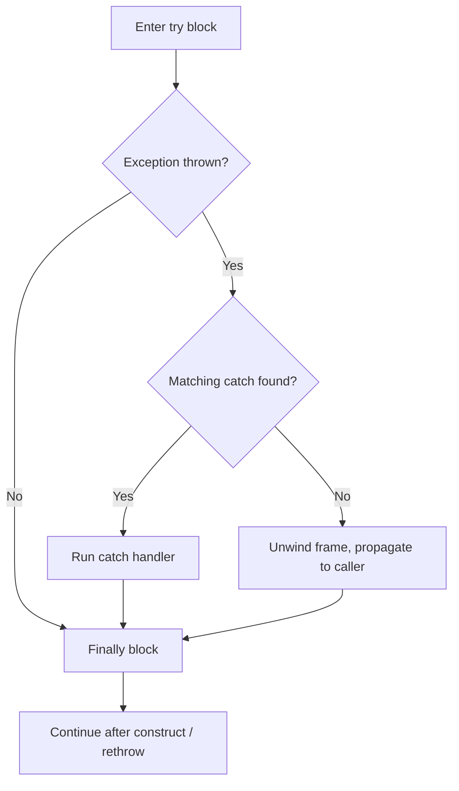
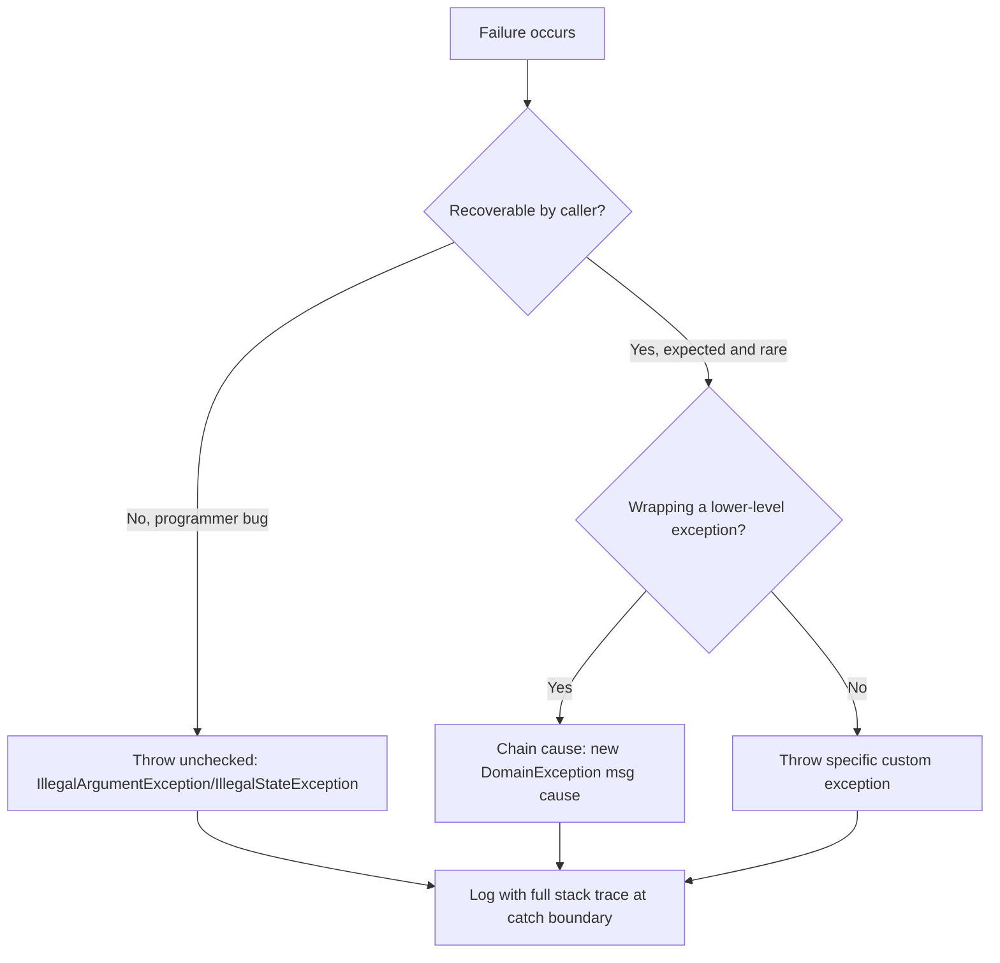

# 11. Exception Handling

## Throwable

`Throwable` is the root of Java's entire exception hierarchy — every object that can be thrown via `throw` and caught via `catch` must be an instance of `Throwable` or one of its subclasses. It splits into two direct subclasses, `Error` and `Exception`, described below.

### Error

**Theory**

- **Core Concepts**: `Error` represents serious problems that a reasonable application should not attempt to catch or recover from — conditions typically caused by the environment the JVM runs in (resource exhaustion, JVM internal failures) rather than application logic. Examples include `OutOfMemoryError`, `StackOverflowError`, and `LinkageError`.
- **Internal Working**: `Error` is a direct subclass of `Throwable`, deliberately kept out of the `Exception` hierarchy so it is *not* caught by a broad `catch (Exception e)` block — only an explicit `catch (Error e)` or `catch (Throwable t)` catches it.
- **When to Use It**: Application code should almost never throw a custom `Error` subclass; it's reserved for the JVM itself (or extremely low-level frameworks) to signal unrecoverable conditions.
- **Advantages**: Clearly separates "the JVM/environment is in serious trouble" from "the application encountered a normal, recoverable fault," letting well-designed code deliberately avoid trying to recover from what likely can't be recovered from.
- **Limitations**: Because `Error` is unchecked (extends `Throwable` directly, not requiring `throws` declarations or mandatory catching), it's easy to forget these can still propagate and terminate a thread if not anticipated; catching broad `Error`s (e.g., `OutOfMemoryError`) rarely leads to a safely recoverable state since the JVM may already be in a compromised condition.

**Internal Working**

- **Step-by-Step Explanation**: (1) A JVM-internal condition arises (e.g., heap allocation fails, native stack depth exceeded). (2) The JVM constructs the appropriate `Error` subclass instance (often without a full, expensive stack trace in hot paths, or occasionally reusing a preallocated instance for extremely common errors like `StackOverflowError` to avoid needing more stack/heap while already in trouble). (3) It throws this via the same `athrow` bytecode mechanism as any other throwable. (4) The exception propagates up the call stack, unwinding frames and running `finally` blocks, until either a matching `catch (Error ...)`/`catch (Throwable ...)` handles it, or it reaches the thread's top, triggering the `Thread.UncaughtExceptionHandler` (default: prints the stack trace and terminates that thread).
- **Memory Layout**: `OutOfMemoryError` specifically arises when the JVM cannot satisfy a heap/Metaspace allocation request within configured limits (`-Xmx`, `-XX:MaxMetaspaceSize`) even after a full GC; `StackOverflowError` arises when a thread's stack (sized via `-Xss`) is exhausted, typically from deep/unbounded recursion, since each frame consumes a fixed but non-trivial number of stack bytes.
- **Diagrams**:
```text
Throwable
├── Error                <- JVM/environment-level, unrecoverable
│   ├── OutOfMemoryError
│   ├── StackOverflowError
│   └── LinkageError
└── Exception             <- application-level, potentially recoverable
```
- **JVM Behaviour**: For performance, the JVM sometimes throws a preallocated (non-stack-trace-filled) `StackOverflowError`/`OutOfMemoryError` instance under `-XX:-StackTraceInThrowable` or particular fast-throw optimizations, since building a full stack trace while already out of stack/heap space could itself fail; JIT-compiled code includes implicit stack-bang checks near method entry to detect imminent stack overflow early and safely.

**Interview Questions**

*Basic*
1. What is the difference between `Error` and `Exception` at the top of the hierarchy?
2. Give two common JVM-thrown `Error` subclasses.

*Intermediate*
3. Should application code ever catch `OutOfMemoryError`? Why or why not?
4. Is `Error` checked or unchecked, and what does that mean practically?

*Advanced*
5. Why might the JVM throw a `StackOverflowError` instance without a full stack trace in some cases?
6. Can a `try-with-resources` block's resource-closing still run if the main block throws an `Error` (not an `Exception`)?

*Scenario-based*
7. Your application occasionally crashes with `OutOfMemoryError` under load. What's the correct engineering response, and why is "just catch it" not a real fix?

**Detailed Answers**

1. Both extend `Throwable`, but `Exception` represents conditions an application can reasonably anticipate and recover from (I/O failures, invalid input), while `Error` represents serious, typically unrecoverable conditions stemming from the JVM or execution environment itself (memory exhaustion, stack overflow, internal JVM linkage failures) that application logic generally cannot meaningfully fix.
2. `OutOfMemoryError` (heap/Metaspace exhaustion) and `StackOverflowError` (thread stack exhausted, typically via runaway recursion); other examples include `NoClassDefFoundError` and `ExceptionInInitializerError`.
3. Generally no — by the time `OutOfMemoryError` is thrown, the JVM may already be in a degraded state (other threads could be failing too, finalizers/cleanup might not run reliably), and catching it to "continue as normal" risks masking a real resource leak or undersized heap configuration; the recommended action is to let it propagate (crash-and-restart under process supervision, ideally with heap dumps enabled via `-XX:+HeapDumpOnOutOfMemoryError`) and fix the underlying resource usage or JVM sizing.
4. Unchecked — `Error` (like `RuntimeException`) does not require a `throws` clause or mandatory `catch`, since the compiler only enforces checked-exception handling for `Exception` subclasses that aren't `RuntimeException`. Practically, this means an `Error` can propagate silently through method signatures with no compiler warning, so developers must rely on documentation/experience rather than the compiler to know an `Error` might occur.
5. Building a full stack trace (`fillInStackTrace()`) walks and records every frame on the call stack, which itself requires additional stack space and object allocation — precisely the resources that may already be exhausted when a `StackOverflowError` is about to be thrown; some JVMs optimize this by reusing a preallocated `StackOverflowError` instance (without a fresh stack trace) specifically to avoid a secondary failure while already handling the first one.
6. Yes — try-with-resources' automatic resource closing (calling `close()` on each resource in reverse declaration order) is implemented via the same `finally`-like mechanism the JVM guarantees runs during any stack unwinding, whether triggered by an `Exception`, an `Error`, or any other `Throwable`; the resource cleanup runs as the `Error` propagates up through that block, unless the JVM itself is in such a compromised state (e.g., truly out of stack space) that even running the cleanup code fails.
7. Catching `OutOfMemoryError` around the failing operation doesn't fix the root cause and risks leaving the JVM in an inconsistent state (partially-completed operations, corrupted caches); the correct response is to profile actual memory usage (heap dumps, `jcmd GC.heap_info`, container memory limits vs. `-Xmx`), identify and fix leaks or oversized in-memory structures, right-size heap/container memory limits, and consider a supervisor/orchestrator (e.g., Kubernetes liveness probes) to restart a truly wedged process rather than trying to "recover" in-process from a memory-exhaustion state.

**Code Examples**

```java
public class StackOverflowDemo {
    static int depth = 0;

    static void recurse() {
        depth++;
        recurse(); // unbounded recursion, no base case -> StackOverflowError
    }

    public static void main(String[] args) {
        try {
            recurse();
        } catch (StackOverflowError e) {
            // Demonstration only: in real code, fix the recursion, don't "handle" this
            System.out.println("Stack overflow at depth ~" + depth);
        }
    }
}
```

### Exception

`Exception` is the branch of `Throwable` representing conditions an application is expected to anticipate and handle. It splits further into *checked* exceptions (verified by the compiler) and *unchecked* exceptions (`RuntimeException` and its subclasses), covered below.

#### Checked

**Theory**

- **Core Concepts**: A checked exception is any subclass of `Exception` that is *not* a subclass of `RuntimeException` — the compiler enforces that any method which can throw one either handles it (`try/catch`) or declares it in a `throws` clause, forcing callers up the chain to acknowledge the possibility of failure. Examples: `IOException`, `SQLException`, `ParseException`.
- **Internal Working**: This is purely a compile-time (`javac`) enforcement mechanism — the JVM itself makes no distinction between checked and unchecked exceptions at the bytecode level; the `throws` clause is recorded in the classfile's `Exceptions` attribute solely for compiler-level checking and documentation/reflection purposes.
- **When to Use It**: Recoverable conditions where the caller genuinely has (or should have) a meaningful way to respond differently — e.g., a file-not-found situation where the caller could prompt for a different path — as opposed to programming errors.
- **Advantages**: Makes a method's failure modes an explicit, compiler-checked part of its public contract, encouraging callers to consciously handle or propagate specific recoverable failures rather than silently ignoring them.
- **Limitations**: Widely criticized (notably by the Java designers of later APIs, and prominently avoided in languages like C#) for encouraging boilerplate `try/catch` blocks, exception-swallowing anti-patterns, and awkward interactions with functional interfaces/streams (a checked exception cannot be thrown from a lambda implementing `Function`, for instance, without wrapping).

**Internal Working**

- **Step-by-Step Explanation**: (1) `javac` performs a static analysis over each method body determining every checked exception type that could propagate out of it (from explicit `throw` statements, called methods' `throws` clauses, etc.). (2) It compares this set against the method's own declared `throws` clause. (3) If a checked exception type isn't handled internally (via a matching `catch`) or declared, compilation fails with "unreported exception ... must be caught or declared to be thrown." (4) The compiler also records the resolved `throws` types in the classfile's `Exceptions` attribute (used by reflection's `Method.getExceptionTypes()` and by the compiler when checking *callers* of this method).
- **Memory Layout**: Not directly applicable — this is a purely static, compile-time analysis with no runtime memory implications beyond the exception object itself when actually thrown (same as any other `Throwable`).
- **Diagrams**:
```text
public void readFile() throws IOException {  // declared: compiler-checked contract
    Files.readAllBytes(path);                 // can throw IOException (checked)
}

public void caller() {
    try {
        readFile();                            // must catch or re-declare IOException
    } catch (IOException e) {
        // handle or wrap
    }
}
```
- **JVM Behaviour**: At the bytecode level, throwing and catching a checked exception uses the exact same `athrow` instruction and exception table mechanism as an unchecked exception — there is no runtime distinction whatsoever; checked-vs-unchecked is entirely a `javac`-enforced, source-level and classfile-metadata-level concept, meaning bytecode manipulation tools (or other JVM languages like Kotlin/Scala, which don't enforce checked exceptions) can freely throw checked exceptions without any `throws` declaration.

**Interview Questions**

*Basic*
1. What defines a checked exception versus an unchecked one?
2. Give three checked exceptions from the JDK standard library.

*Intermediate*
3. Why can't you throw a checked exception directly from inside a `Runnable.run()` implementation without wrapping it?
4. What compile-time enforcement does `javac` perform for checked exceptions, exactly?

*Advanced*
5. If checked exceptions are a purely compile-time concept, how can a checked exception cross a boundary compiled by a different language/tool that doesn't enforce them (e.g., via bytecode manipulation)?
6. What is "exception chaining," and why is it important when wrapping a checked exception in an unchecked one?

*Scenario-based*
7. You're designing a `PaymentGateway.charge(...)` method that can fail due to network issues (recoverable, should retry) or invalid card data (recoverable, different handling) or a programming bug (unrecoverable). How would you model these using checked vs. unchecked exceptions?

**Detailed Answers**

1. A checked exception is any `Throwable` subtype that extends `Exception` but not `RuntimeException` — the compiler requires it to be either caught or declared via `throws` at every point it could propagate. An unchecked exception (`RuntimeException`/`Error` subtypes) has no such compiler enforcement; it may propagate freely without any `throws` declaration.
2. `IOException` (I/O failures), `SQLException` (database access failures), and `ClassNotFoundException` (reflective class loading failures) are all checked exceptions requiring explicit handling or declaration.
3. `Runnable.run()`'s signature is `void run()` with no `throws` clause, and functional interfaces cannot be altered by implementing lambdas/methods — a lambda or method reference assigned to a `Runnable` must have a compatible signature, so it cannot declare (or let propagate) any checked exception not already permitted by `run()`'s signature; the compiler forces you to catch the checked exception inside the lambda and either handle it or rethrow it wrapped in an unchecked exception (e.g., `RuntimeException`).
4. For every method body, the compiler statically determines the complete set of checked exception types reachable via `throw` statements or calls to other methods/constructors that declare checked exceptions; it then verifies every one of those types is either caught by an enclosing `try/catch` within that method or explicitly listed in the method's own `throws` clause — any checked exception type satisfying neither condition causes a compile error.
5. Since checked-exception enforcement lives entirely in `javac`'s front-end analysis and has no corresponding bytecode-level restriction, any tool that generates bytecode directly (ASM, bytecode-manipulation libraries) or any JVM language without this feature (Kotlin, Scala, Groovy — none of which enforce checked exceptions) can throw a checked exception from a method with no `throws` declaration; a caller of that method compiled by `javac` may then have a checked exception thrown at them at runtime with no compiler-enforced expectation of it (this is a known technique, e.g., "sneaky throws," to bypass checked-exception ceremony even within pure Java using generic type-parameter tricks that exploit erasure).
6. Exception chaining means passing the original exception as the `cause` (via a constructor accepting `Throwable cause`, or `initCause()`) when wrapping it in a new exception type — e.g., wrapping a checked `IOException` in an unchecked `RuntimeException`. This preserves the original stack trace and root cause information (visible via `getCause()` and included in the printed stack trace as "Caused by: ..."), which is essential for debugging; failing to chain (throwing a brand-new exception with no reference to the original) silently discards the actual root cause, making production issue diagnosis significantly harder.
7. Model network/transient failures as a checked `PaymentGatewayException` (or a specific `PaymentTimeoutException` checked subtype) since the caller has a clear, meaningful recovery action (retry with backoff); model invalid card data as a checked `InvalidCardException` carrying details the caller can present to the end user; model unexpected internal programming errors (e.g., a null configuration that should never be null) as an unchecked `IllegalStateException`/custom `RuntimeException`, since there's no meaningful per-call recovery for a genuine bug — it should surface loudly (e.g., logged and alerted) rather than being silently caught.

**Code Examples**

```java
public class FileReaderService {
    // Checked exception declared explicitly: caller must handle or propagate
    public String readConfig(String path) throws java.io.IOException {
        return java.nio.file.Files.readString(java.nio.file.Path.of(path));
    }
}

public class ConfigLoader {
    public String loadOrDefault(String path, String fallback) {
        try {
            return new FileReaderService().readConfig(path);
        } catch (java.io.IOException e) {
            // Chained: wrap in unchecked only if there's truly no recovery path here
            return fallback;
        }
    }
}
```

#### Unchecked

**Theory**

- **Core Concepts**: An unchecked exception is any subclass of `RuntimeException` (or `Error`, though that's a separate branch) — the compiler places no requirement on catching or declaring it via `throws`. Examples: `NullPointerException`, `IllegalArgumentException`, `IndexOutOfBoundsException`, `IllegalStateException`.
- **Internal Working**: `RuntimeException` extends `Exception` but is treated specially by `javac`'s checked-exception analysis: any exception type that is `RuntimeException` or a subtype is excluded from the "must catch or declare" rule, even though at the JVM bytecode level it is thrown and propagated identically to a checked exception.
- **When to Use It**: Programming errors and violated preconditions/invariants that the immediate caller typically cannot meaningfully recover from at the call site — invalid arguments, illegal state, null dereferences — where forcing every caller up the stack to declare/catch would add ceremony without real value.
- **Advantages**: Keeps method signatures clean (no `throws` clause pollution for conditions that are essentially bugs, not expected control flow); aligns with the common industry view (championed by frameworks like Spring, and languages like C#/Kotlin) that most exceptions should be unchecked by default, reserving checked exceptions for a narrow set of truly recoverable, expected failure conditions.
- **Limitations**: Precisely because there's no compiler enforcement, it's easy for a caller to be unaware a method can throw a particular unchecked exception, relying entirely on documentation (Javadoc `@throws`) for discoverability; overuse of generic unchecked exceptions (`throw new RuntimeException("something failed")`) without a specific subtype loses valuable semantic information for callers who might want to catch specific failure categories.

**Internal Working**

- **Step-by-Step Explanation**: (1) An unchecked exception is constructed and thrown (either by the JVM itself, e.g., `NullPointerException` from a `getfield`/`invokevirtual` on a null reference, or explicitly by application code via `throw`). (2) The JVM's `athrow` bytecode instruction triggers a search up the current method's exception table for a matching `catch` handler based on the runtime type of the thrown object; if none matches within the current frame, the frame is popped (running `finally` blocks along the way) and the search continues in the caller's frame. (3) Since `javac` doesn't require this exception type to appear in any `throws` clause, the propagation can silently cross many method boundaries with no textual signal in any of their signatures. (4) If no handler is found all the way up the thread's call stack, the thread's uncaught exception handler runs (default: stack trace printed to `System.err`, thread terminates).
- **Memory Layout**: Not directly applicable beyond the exception object itself being heap-allocated like any object, plus the (potentially costly) captured stack trace array populated by `fillInStackTrace()` at construction time, which walks the current thread's stack frames.
- **Diagrams**:
```text
void process(String input) {          // no throws clause needed
    if (input == null) {
        throw new IllegalArgumentException("input required"); // unchecked
    }
    ...
}

void caller() {
    process(null); // compiles fine even without try/catch; fails at RUNTIME
}
```
- **JVM Behaviour**: Identical bytecode-level mechanism (`athrow`, per-method exception tables mapping bytecode ranges to handler types and offsets) as checked exceptions — the JVM itself has no notion of "checked" at all; the `NullPointerException` "helpful NPE messages" feature (Java 14+, `-XX:+ShowCodeDetailsInExceptionMessages`, default-on since 15) analyzes bytecode to identify exactly which variable in a chained field/method access was null, without changing the fundamental unchecked nature of the exception.

**Interview Questions**

*Basic*
1. What is the defining characteristic of an unchecked exception?
2. Name three common unchecked exceptions and what typically causes each.

*Intermediate*
3. Why does `RuntimeException` extend `Exception` rather than being a completely separate hierarchy alongside it?
4. Is it good practice to catch `NullPointerException` to handle expected null values? Why or why not?

*Advanced*
5. How does the JVM's bytecode-level exception handling mechanism treat checked and unchecked exceptions differently, if at all?
6. What is the industry debate around checked vs. unchecked exceptions, and what position do modern frameworks/languages tend to take?

*Scenario-based*
7. You're reviewing a pull request where a colleague wraps every possible failure in a bare `throw new RuntimeException(e)`. What's problematic about this, and what would you recommend instead?

**Detailed Answers**

1. It's any exception type that is a subclass of `RuntimeException` (or `Error`, in the separate `Error` branch) — the Java compiler does not require it to be caught or declared in a `throws` clause anywhere along its propagation path, unlike checked exceptions.
2. `NullPointerException` — dereferencing a null reference (field access, method call, array access); `IllegalArgumentException` — a method received an argument violating its documented preconditions (e.g., a negative value where only non-negative is valid); `IndexOutOfBoundsException` — an array/list/string index outside the valid `[0, length)` range was accessed.
3. Historically, Java's designers wanted `RuntimeException` to still be a genuine kind of `Exception` conceptually (an application-level, potentially-informative failure, as opposed to `Error`'s JVM/environment-level failures) while giving `javac` a simple, single-class-based rule ("is it a `RuntimeException` or not?") to decide whether to enforce the checked-exception contract — this let unchecked exceptions still participate meaningfully in `catch (Exception e)` blocks that are meant to catch all "normal" application-level failures, while being excluded from the stricter checked-declaration requirement.
4. Generally no — catching `NullPointerException` to detect "was this null" is considered poor practice compared to an explicit `if (value == null)` check (or `Optional`), because exceptions are relatively expensive (stack trace capture) and NPEs can originate from many different expressions within a `try` block, making it unclear and fragile which specific null caused the catch to trigger; explicit null checks are clearer, faster, and more precise about intent.
5. No difference whatsoever at the bytecode level — both use the identical `athrow` instruction and the same per-method exception table structure (mapping try-block bytecode ranges to catch-handler types and offsets) for propagation and handling; "checked" versus "unchecked" is purely a `javac` front-end, compile-time concept enforced via static analysis of the `throws` clause and `Exceptions` classfile attribute, with zero runtime behavioral difference.
6. Checked exceptions were intended to force callers to consciously handle recoverable failures, but in practice they're widely criticized for encouraging boilerplate `try/catch`/rethrow chains, breaking functional-interface composability (lambdas can't throw checked exceptions unless the functional interface declares them), and often being "handled" via exception-swallowing anti-patterns just to satisfy the compiler. Many modern frameworks (Spring wraps most checked exceptions like `SQLException` into its unchecked `DataAccessException` hierarchy) and languages (Kotlin, Scala, C# have no checked exceptions at all) have moved toward preferring unchecked exceptions by default, reserving checked exceptions (if used at all) for a small number of truly recoverable conditions.
7. Wrapping every failure in a generic `RuntimeException(e)` destroys the original exception's specific type information for any caller that might want to catch a particular failure category (e.g., distinguishing a retryable `IOException` from a non-retryable `IllegalArgumentException`), and if done without passing `e` as the cause it also discards the original stack trace/root cause entirely. The recommendation: define a specific custom unchecked exception type (or a small hierarchy) relevant to the domain (e.g., `PaymentProcessingException extends RuntimeException`), always chain the original exception via the `cause` constructor parameter, and only wrap checked exceptions that genuinely have no meaningful recovery path at that layer of the call stack.

**Code Examples**

```java
public class OrderValidator {
    public void validate(Order order) {
        if (order == null) {
            throw new IllegalArgumentException("order must not be null"); // unchecked
        }
        if (order.getItems().isEmpty()) {
            throw new IllegalStateException("order must contain at least one item"); // unchecked
        }
    }
}
```

## `try` / `catch` / `finally`

**Theory**

- **Core Concepts**: `try` delimits a block of code that might throw an exception; `catch` blocks (zero or more) declare handlers for specific exception types thrown within the `try`; `finally` (optional) declares a block that executes regardless of whether the `try` completed normally, threw an exception, or exited via `return`/`break`/`continue` — used for guaranteed cleanup.
- **Internal Working**: The compiler builds a per-method exception table mapping bytecode address ranges of the `try` block to handler entry points for each declared `catch` type; `finally` code is duplicated (or, historically, invoked via the deprecated `jsr`/`ret` instructions pre-Java 6) into every possible exit path of the `try`/`catch` block at compile time so it reliably executes exactly once regardless of exit route.
- **When to Use It**: Any operation that might fail in a recoverable way needing specific handling logic per exception type, combined with `finally` for cleanup (e.g., closing resources) that must happen unconditionally — though `try-with-resources` is now preferred over manual `finally`-based closing.
- **Advantages**: Centralizes error handling logic near the code that can fail; `finally` guarantees cleanup code isn't skipped even if a `return` or exception occurs mid-block, which manual sequential code cannot guarantee.
- **Limitations**: A `return` inside `finally` silently discards any exception or return value from the `try`/`catch` block (a notorious pitfall); deeply nested try/catch/finally blocks harm readability; multiple catch blocks must be ordered from most-specific to least-specific exception type or the compiler rejects unreachable catch clauses.

**Internal Working**

- **Step-by-Step Explanation**: (1) Execution enters the `try` block. (2) If no exception occurs, control falls through to `finally` (if present), then continues after the whole construct. (3) If an exception is thrown, the JVM searches the current method's exception table for the first `catch` entry whose bytecode range covers the throwing instruction and whose exception type matches (via `instanceof`-style checking against the thrown object's actual runtime class) the thrown exception's type. (4) If found, control transfers to that handler; after it completes (or itself throws), `finally` still executes before propagating further. (5) If no matching `catch` exists in this method, the frame unwinds (still running `finally`) and the JVM continues searching in the caller's frame, and so on up the call stack.
- **Memory Layout**: Not directly applicable beyond ordinary stack-frame unwinding — each frame popped during exception propagation is deallocated from the thread's stack; local variables in that frame become unreachable (eligible for GC once the frame is gone, if they were the only heap references).
- **Diagrams**:
```text
try {
    riskyOperation();      // (1) throws IOException here
} catch (IOException e) {   // (2) matching handler runs
    log(e);
} finally {
    cleanup();               // (3) always runs, exception or not
}
```

- **JVM Behaviour**: Modern JVMs (since Java 6, JSR 202) inline/duplicate `finally` code at each exit point of the `try`/`catch` at compile time rather than using the older `jsr`/`ret` subroutine bytecode instructions (which were removed from the classfile verifier's supported instruction set specifically because they complicated verification); the JIT can then optimize each inlined copy of the `finally` block independently based on its calling context.

**Interview Questions**

*Basic*
1. What is the purpose of the `finally` block, and when does it execute?
2. Can a `try` block exist without any `catch`, using only `finally`?

*Intermediate*
3. What happens if both the `try` block and the `finally` block throw an exception?
4. What happens if `finally` contains a `return` statement?

*Advanced*
5. How does the compiler order multiple `catch` blocks, and what error occurs if a more general exception type is listed before a more specific one?
6. How did the JVM's implementation of `finally` change after Java 6, and why?

*Scenario-based*
7. You have a `try` block that opens a database connection manually (not via try-with-resources) and a `finally` block that closes it. What subtle bug can occur if closing the connection itself throws, and how would you fix it?

**Detailed Answers**

1. `finally` executes a block of cleanup code that is guaranteed to run regardless of how the `try`/`catch` completes — normally, via an exception (caught or not), or via `return`/`break`/`continue` — making it the appropriate place for resource cleanup or other must-always-happen logic.
2. Yes — `try { ... } finally { ... }` (with no `catch` at all) is valid syntax, used purely to guarantee cleanup runs while letting any exception propagate unhandled to the caller.
3. The exception thrown by `finally` *replaces* (supersedes) whichever exception was propagating from the `try`/`catch` block — the original exception is silently lost unless explicitly captured, which is exactly the problem `try-with-resources`' suppressed-exception mechanism (`addSuppressed`) was designed to solve for resource-closing scenarios.
4. It unconditionally overrides any pending `return` value or in-flight exception from the `try`/`catch` block — control exits via the `finally`'s `return` instead, silently discarding the original exception or return value; this is a well-known anti-pattern and most static analysis tools (and linters) flag `return` inside `finally` as a bug risk.
5. The compiler requires catch blocks to be ordered from most specific exception type to least specific (e.g., `IOException` before `Exception`), since catch clauses are evaluated top-to-bottom and the first matching type wins; if a broader exception type is listed before a narrower one it "shadows" it, making the narrower catch unreachable, which the compiler flags as an error ("exception X has already been caught").
6. Before Java 6, `finally` blocks were compiled using the `jsr` (jump subroutine) and `ret` bytecode instructions, treating `finally` as a shared subroutine jumped to from multiple exit points. This complicated bytecode verification significantly (the verifier had to reason about a subroutine being entered from multiple contexts with potentially different local variable types) and was error-prone; since Java 6 (JSR 202, the new verifier), `javac` instead duplicates the `finally` block's actual bytecode inline at each exit point of the `try`/`catch`, producing larger but far simpler-to-verify and easier-to-JIT-optimize bytecode, and `jsr`/`ret` were formally deprecated/disallowed in classfiles from version 51 (Java 7) onward.
7. If the operation inside `try` throws an exception and then `connection.close()` in `finally` *also* throws, the `close()`'s exception silently replaces and discards the original, more informative exception, making the real root cause invisible in logs/stack traces. The fix: use try-with-resources instead (if the connection type implements `AutoCloseable`), which correctly attaches the closing exception as a *suppressed* exception on the original rather than replacing it — or, if manual handling is unavoidable, wrap the `close()` call in its own try/catch inside `finally` that logs (rather than throws) any secondary failure.

**Code Examples**

```java
public class ResourceHandler {
    public String readFirstLine(String path) throws java.io.IOException {
        java.io.BufferedReader reader = null;
        try {
            reader = new java.io.BufferedReader(new java.io.FileReader(path));
            return reader.readLine();
        } finally {
            if (reader != null) {
                try {
                    reader.close(); // secondary failure handled separately, not thrown raw
                } catch (java.io.IOException closeEx) {
                    System.err.println("Failed to close reader: " + closeEx.getMessage());
                }
            }
        }
    }
}
```

## `throw` / `throws`

**Theory**

- **Core Concepts**: `throw` is a statement that actually raises an exception instance at a specific point in code (`throw new IllegalArgumentException("bad input")`); `throws` is a method/constructor signature clause declaring which checked exception types may propagate out of it, informing callers and satisfying the compiler's checked-exception verification.
- **Internal Working**: `throw` compiles directly to the `athrow` bytecode instruction, which immediately begins exception-table-based handler search in the current frame; `throws` has no bytecode instruction at all — it exists solely as compile-time metadata (recorded in the classfile's `Exceptions` attribute) consulted by `javac` when checking callers, and by reflection (`Method.getExceptionTypes()`).
- **When to Use It**: `throw` whenever code detects a condition it cannot proceed past normally; `throws` on any method whose body (or the checked exceptions of methods/constructors it calls) can propagate a checked exception that isn't fully handled internally.
- **Advantages**: `throw` provides a single, uniform mechanism for signaling failure across the entire language (versus historical alternatives like error codes/`errno`, which are easy to ignore); `throws` documents a method's checked failure modes directly in its signature, enforced by the compiler for all callers.
- **Limitations**: `throw` immediately transfers control, so it must be used carefully to avoid leaving shared mutable state inconsistent mid-operation; `throws` clauses for checked exceptions can proliferate through call chains ("throws pollution"), and `throws` for unchecked exceptions is purely documentation (optional, unenforced, sometimes omitted even when helpful).

**Internal Working**

- **Step-by-Step Explanation**: (1) `throw expr;` evaluates `expr` (which must be assignable to `Throwable`) and executes the `athrow` bytecode instruction with a reference to that object on the operand stack. (2) The JVM immediately halts normal sequential execution and begins searching the *current* method frame's exception table for a matching handler based on bytecode offset and exception type. (3) `throws` in a method declaration causes `javac`, when compiling *any caller* of that method, to add the declared checked types to the set of exceptions that caller must itself handle or re-declare — this check happens purely in the compiler front-end and produces the `Exceptions` classfile attribute, which carries no runtime enforcement.
- **Memory Layout**: The thrown object is heap-allocated (like any object) at the `new` expression preceding `throw` (or reused if a preallocated/cached exception instance is thrown); its stack trace array (populated by `fillInStackTrace()`, called from the `Throwable` constructor by default) captures references to frame/method/line metadata at the moment of construction, not at the moment of `throw` (which matters if an exception object is constructed once and thrown from multiple places, as its trace reflects only the original construction point).
- **Diagrams**:
```text
public void withdraw(double amount) throws InsufficientFundsException {  // throws: compiler contract
    if (amount > balance) {
        throw new InsufficientFundsException("Insufficient balance");     // throw: actual raise
    }
    balance -= amount;
}
```
- **JVM Behaviour**: `athrow` triggers exception-table lookup which is essentially a linear/interval scan over `(start_pc, end_pc, handler_pc, catch_type)` entries generated per try/catch region — the JIT can often precompute/cache this resolution once a method is hot, since exception tables are static per-method metadata; `throws` declarations contribute zero bytecode and zero runtime behavior — they are entirely erased from the perspective of actual execution, existing only in the `Exceptions` attribute for tooling/compiler use.

**Interview Questions**

*Basic*
1. What is the difference between `throw` and `throws`?
2. Can you use `throws` to declare an unchecked exception? Is it required?

*Intermediate*
3. What must the expression after `throw` evaluate to?
4. Can a method's `throws` clause declare a broader exception type than what it actually ever throws?

*Advanced*
5. Does the `throws` clause have any effect on the generated bytecode or runtime behavior?
6. If a `Throwable` instance is created once (e.g., as a cached/static instance) and thrown from multiple call sites, what does its stack trace actually reflect?

*Scenario-based*
7. You need to rethrow a caught checked exception as a different, unchecked exception type while preserving full debuggability. Show how to do this correctly.

**Detailed Answers**

1. `throw` is an executable statement that actually raises a specific exception instance at that point in the code, transferring control immediately; `throws` is a non-executable part of a method/constructor's signature declaring which checked exception types might propagate out of it, purely for compiler verification and documentation — it doesn't itself raise anything.
2. Yes, syntactically you can write `throws NullPointerException` even though it's unchecked — it's entirely optional and has zero compiler-enforcement effect for unchecked types, but some teams use it anyway purely as documentation to signal an important expected failure mode to callers reading the signature.
3. Any expression whose static type is `Throwable` or a subtype (i.e., ultimately an `Error`, `Exception`, or custom subclass of either) — attempting to `throw` a non-`Throwable` object is a compile-time type error.
4. Yes — a method can declare `throws IOException` even if, in its current implementation, it only ever throws the narrower `FileNotFoundException` (a subtype); this is legal and sometimes intentional for API evolution flexibility (allowing future implementation changes to throw other `IOException` subtypes without changing the method's signature and breaking callers), though overly broad `throws Exception` is generally discouraged as it hides specific failure information from callers.
5. For checked exceptions, `throws` produces the classfile's `Exceptions` attribute — pure metadata read by `javac` (for caller-side compile-time checking) and by reflective APIs (`Method.getExceptionTypes()`), but it inserts absolutely no bytecode instructions and has zero effect on runtime behavior; the JVM's exception dispatch mechanism (`athrow` + exception tables) works identically whether or not a `throws` clause exists or matches what's actually thrown.
6. Its stack trace reflects the call stack at the moment the exception object was *constructed* (specifically, when `fillInStackTrace()` ran, by default inside `Throwable`'s constructor), not the moment(s) it was later thrown via `throw`; if a single cached/static exception instance is thrown from several different call sites, all of those throws report the *same*, potentially misleading stack trace pointing back to wherever the instance was originally constructed — a subtle pitfall of "singleton exception" performance optimizations, which is why they're used sparingly and usually only for extremely hot, high-frequency exception paths where stack trace detail is deliberately sacrificed for speed.
7. Catch the checked exception, construct the new unchecked exception type passing the original as the `cause` argument (preserving the full original stack trace and message via chaining), and throw that — e.g., `catch (SQLException e) { throw new DataAccessException("Query failed", e); }`; calling `getCause()` on the new exception (or reading "Caused by:" in a printed stack trace) then reveals the original root cause for debugging.

**Code Examples**

```java
public class BankAccount {
    private double balance;

    public void withdraw(double amount) throws InsufficientFundsException {
        if (amount > balance) {
            throw new InsufficientFundsException(
                "Requested " + amount + " but balance is only " + balance);
        }
        balance -= amount;
    }
}

class InsufficientFundsException extends Exception { // checked, since caller can retry with less
    public InsufficientFundsException(String message) { super(message); }
}
```

```java
// Rethrowing a checked exception as unchecked, with proper cause chaining
public class ConfigService {
    public String loadValue(String key) {
        try {
            return java.nio.file.Files.readString(java.nio.file.Path.of("config", key));
        } catch (java.io.IOException e) {
            throw new ConfigLoadException("Failed to load config key: " + key, e); // chained cause
        }
    }
}

class ConfigLoadException extends RuntimeException { // unchecked: no meaningful per-call recovery
    public ConfigLoadException(String message, Throwable cause) { super(message, cause); }
}
```

## try-with-resources

**Theory**

- **Core Concepts**: Try-with-resources (Java 7+) is special `try` syntax — `try (Resource r = ...; Resource r2 = ...) { ... }` — where each declared resource must implement `AutoCloseable`, and the compiler guarantees `close()` is called automatically at the end of the block (in reverse declaration order), whether the block completes normally or via exception, without needing a manual `finally`.
- **Internal Working**: The compiler desugars a try-with-resources statement into an equivalent (but far more careful) nested try/finally structure that calls `close()` on each resource, correctly handling the case where both the main block *and* a `close()` call throw by attaching the `close()` exception as a *suppressed* exception on the primary one rather than discarding either.
- **When to Use It**: Any time working with a resource implementing `AutoCloseable`/`Closeable` — file streams, database connections/statements/result sets, sockets, locks (via wrapper adapters) — replacing manual `finally`-based closing entirely.
- **Advantages**: Eliminates the classic bug where a `finally`-block `close()` call throws and silently discards the original exception (now preserved as "suppressed"); significantly less boilerplate than manual try/finally; correctly closes multiple resources in proper reverse order even amid exceptions from earlier closes.
- **Limitations**: Only works with types implementing `AutoCloseable` (or the stricter `Closeable`); resources declared in the try-with-resources header are implicitly `final` (or effectively final) and scoped only to the try block, unusable afterward; doesn't help with non-`AutoCloseable` cleanup needs.

**Internal Working**

- **Step-by-Step Explanation**: (1) Compiler encounters `try (Resource r = init())`. (2) It generates code to evaluate `init()` and assign to a compiler-managed local. (3) It wraps the body in a try/catch/finally: the `finally` calls `r.close()`. (4) Crucially, if the main body throws exception `E1` and then `r.close()` throws `E2`, the compiler-generated code catches `E2` and calls `E1.addSuppressed(E2)` rather than letting `E2` replace `E1` — then rethrows `E1` (now carrying `E2` as a suppressed exception). (5) For multiple resources, they are closed in the reverse of their declaration order, each wrapped in its own nested try/finally following this same suppression-safe pattern.
- **Memory Layout**: Not directly applicable beyond normal object/exception allocation; suppressed exceptions are stored in a `List<Throwable>` field internal to `Throwable` (lazily initialized), adding a small, bounded amount of extra memory only when suppression actually occurs.
- **Diagrams**:
```text
try (var in = new FileInputStream("a.txt");
     var out = new FileOutputStream("b.txt")) {
    in.transferTo(out);
}
// Desugars conceptually to:
var in = new FileInputStream("a.txt");
try {
    var out = new FileOutputStream("b.txt");
    try {
        in.transferTo(out);
    } finally {
        out.close(); // closed first (reverse of declaration order)
    }
} finally {
    in.close();       // closed second
}
```
- **JVM Behaviour**: No special JVM support is needed — the entire feature is implemented via ordinary `try/catch/finally` bytecode (exception tables) generated by `javac`'s desugaring; `Throwable.addSuppressed()`/`getSuppressed()` are ordinary library methods (`java.lang.Throwable`, since Java 7) with no JVM-intrinsic behavior, storing suppressed throwables in an internal list retrievable later for full diagnostic printing (`printStackTrace()` includes "Suppressed:" sections).

**Interview Questions**

*Basic*
1. What interface must a resource implement to be used in try-with-resources?
2. In what order are multiple resources closed?

*Intermediate*
3. What happens to the exception thrown by `close()` if the main try block also threw an exception?
4. Can you use try-with-resources without any `catch` or `finally` clause at all?

*Advanced*
5. How does try-with-resources differ from manually writing a `finally` block that calls `close()`, in terms of exception information preserved?
6. Since Java 9, can you use an already-declared effectively-final variable directly in the try-with-resources header without redeclaring it?

*Scenario-based*
7. You have a legacy class that has a `close()` method but doesn't implement `AutoCloseable`. Can you still use it in try-with-resources? How would you adapt it if not?

**Detailed Answers**

1. `java.lang.AutoCloseable` (or its stricter sub-interface `java.io.Closeable`, which narrows `close()`'s declared exception to just `IOException`) — any type implementing either can be declared as a resource in a try-with-resources header.
2. In the reverse of their declaration order — the last resource declared is closed first, mirroring typical dependency ordering (e.g., an output stream wrapping another stream should be closed before the underlying stream it wraps).
3. It is *not* discarded — the compiler-generated code catches the `close()`-thrown exception and attaches it to the original (primary) exception via `addSuppressed()`, then rethrows the original exception (now carrying the secondary one in its suppressed-exceptions list, retrievable via `getSuppressed()` and shown in printed stack traces under "Suppressed:").
4. Yes — `try (Resource r = ...) { ... }` alone is valid; `catch`/`finally` clauses remain fully optional and can still be added after the resource-closing behavior if additional handling or cleanup logic beyond resource closing is needed.
5. A manual `finally { resource.close(); }` block, if `close()` throws, has that exception *replace* whatever the main `try` block threw, entirely losing the original exception's information; try-with-resources' compiler-generated desugaring instead preserves both, attaching the `close()` exception as suppressed on the original rather than replacing it, so no diagnostic information from either failure is lost.
6. Yes — Java 9 relaxed the syntax so an already-declared effectively-final local variable can be used directly, e.g., `Resource r = openResource(); try (r) { ... }`, without needing to redeclare it as `try (Resource r2 = r)`; this is purely a syntactic convenience (avoiding a redundant redeclaration) and behaves identically to redeclaring it inside the header.
7. No — try-with-resources requires the declared resource type to implement `AutoCloseable`/`Closeable` at compile time; a class with only a same-named `close()` method but no interface implementation cannot be used directly in the header. The fix is to wrap it in a small adapter class that implements `AutoCloseable` and delegates `close()` to the legacy object's method, then use that adapter in the try-with-resources statement.

**Code Examples**

```java
public class FileCopier {
    public void copy(String source, String dest) throws java.io.IOException {
        try (var in = new java.io.FileInputStream(source);
             var out = new java.io.FileOutputStream(dest)) {
            in.transferTo(out);
        } // 'out' closed first, then 'in' — suppressed exceptions preserved automatically
    }
}
```

```java
// Adapting a legacy non-AutoCloseable class for try-with-resources
class LegacyConnection {
    void close() { System.out.println("Legacy connection closed"); }
}

class LegacyConnectionAdapter implements AutoCloseable {
    private final LegacyConnection delegate;
    LegacyConnectionAdapter(LegacyConnection delegate) { this.delegate = delegate; }

    @Override
    public void close() { delegate.close(); }
}

// Usage: try (var adapter = new LegacyConnectionAdapter(new LegacyConnection())) { ... }
```

## Multi-Catch Blocks *(new)*

**Theory**

- **Core Concepts**: A multi-catch block (Java 7+) catches several unrelated exception types in one `catch` clause using `|` as a separator — `catch (IOException | SQLException e)` — running one shared handler instead of duplicating identical logic across multiple `catch` blocks.
- **Internal Working**: The compiler generates exception-table entries covering all the listed types pointing to the same handler; the caught variable's static type is inferred as the *least upper bound* (most specific common supertype) of the alternatives, but the variable is implicitly `final`, and the compiler additionally performs more precise bytecode-level type analysis so that rethrowing `e` preserves the ability to declare only the original specific types in the enclosing method's `throws` clause (more precise rethrow, Java 7+).
- **When to Use It**: When multiple distinct exception types genuinely warrant identical handling logic (e.g., logging and rethrowing, or converting to a common wrapper exception) — avoiding copy-pasted catch blocks.
- **Advantages**: Eliminates duplicated handler code; keeps the caught exception's usable API surface honest (limited to the common supertype's methods) rather than falsely implying access to type-specific methods; combined with Java 7's more precise rethrow analysis, allows a method to declare only the specific checked types actually caught rather than a broad common supertype in its own `throws` clause.
- **Limitations**: The caught variable's static type is only as specific as the common supertype of the alternatives, so type-specific methods aren't callable without an explicit `instanceof` check and cast; the listed alternative types must not be subtypes of one another (a compile error — listing both a type and its supertype in the same multi-catch is redundant and rejected).

**Internal Working**

- **Step-by-Step Explanation**: (1) Compiler parses `catch (IOException | SQLException e)`, verifying neither type is a subtype of the other (redundancy check). (2) It computes the caught variable `e`'s static type as `lub(IOException, SQLException)` — conceptually the most specific common ancestor, typically surfacing as `Exception` unless a more specific shared supertype exists. (3) It emits exception-table entries such that either exception type's occurrence transfers control to the same handler bytecode. (4) Because the variable is implicitly final, and because Java 7 introduced *more precise rethrow* type analysis, if this caught variable is simply rethrown (`throw e;`) without reassignment, the compiler can still track that only the originally listed specific types are actually possible, letting the enclosing method's `throws` clause list just those specific types rather than the broader inferred common supertype.
- **Memory Layout**: Not directly applicable — purely a compile-time/bytecode-structure concern, no runtime memory implications beyond the caught exception object itself.
- **Diagrams**:
```text
try {
    riskyIo();       // may throw IOException
    riskyDb();       // may throw SQLException
} catch (IOException | SQLException e) {   // one handler, two possible types
    logger.error("Operation failed", e);    // only Exception-level methods usable on e
}
```
- **JVM Behaviour**: At the bytecode level, this compiles to an exception table with (typically) two separate entries — one per listed type — both pointing to the *same* handler bytecode offset, so there's no special "OR" instruction needed; the JVM's existing per-type exception matching mechanism naturally supports "multiple types, one handler" without any new bytecode features being introduced for this language change.

**Interview Questions**

*Basic*
1. What syntax is used to catch multiple exception types in one block?
2. What is the static type of the caught variable in a multi-catch block?

*Intermediate*
3. Why can't you list a type and its supertype together in the same multi-catch clause?
4. Is the caught variable in a multi-catch block implicitly final? What does that prevent?

*Advanced*
5. What is "more precise rethrow" (Java 7), and how does it interact with multi-catch blocks and a method's `throws` clause?
6. Does multi-catch introduce any new bytecode instructions, or is it purely a compiler-level convenience?

*Scenario-based*
7. You have three checked exceptions (`IOException`, `ParseException`, `SQLException`) all handled identically by logging and converting to a custom unchecked `DataIngestException`. Show how multi-catch simplifies this.

**Detailed Answers**

1. The pipe `|` character between exception type names within a single `catch` clause's parentheses, e.g., `catch (IOException | SQLException e) { ... }`.
2. The least upper bound (most specific common supertype) of all the listed alternative types — e.g., for `IOException | SQLException`, since neither is a supertype of the other, it resolves to `Exception` (their common ancestor), meaning only methods available on `Exception` (like `getMessage()`) are directly callable without a cast.
3. Because it would be entirely redundant — if you list both a supertype and its subtype, the supertype alone already covers every case the subtype would also match, so the compiler rejects it as a compile error ("this exception is already caught by the alternative to its left") to prevent meaningless/misleading code.
4. Yes, implicitly final — you cannot reassign the caught variable within the catch block (e.g., `e = new RuntimeException();` would be a compile error). This restriction, combined with the compiler's static analysis of "more precise rethrow," is what allows the compiler to safely narrow the effective set of exception types when the variable is simply rethrown unmodified.
5. Java 7 introduced more precise analysis so that if a caught (possibly multi-catch) exception variable is rethrown without modification, the compiler tracks the *actual* set of types that could have been caught (based on what the try block can actually throw) rather than just the caught variable's declared static type; this means a method can declare only the specific checked exception types it might actually propagate in its own `throws` clause, rather than being forced to declare the broader common-supertype type that the multi-catch variable's static type alone would suggest — improving precision for callers of that method.
6. Purely a compiler-level convenience — no new bytecode instructions were introduced; `javac` simply emits an exception table with multiple `(type, handler)` entries pointing at the same handler code location, which the pre-existing JVM exception-dispatch mechanism (per-type table lookup on `athrow`) already fully supports without any JVM specification changes.
7. Replace three separate, near-identical `catch (IOException e) { ... } catch (ParseException e) { ... } catch (SQLException e) { ... }` blocks with a single `catch (IOException | ParseException | SQLException e) { logger.error("Ingestion failed", e); throw new DataIngestException("Ingestion failed", e); }`, eliminating duplicated logging/wrapping logic across three blocks while still correctly chaining the original cause into the new unchecked exception.

**Code Examples**

```java
public class DataIngestService {
    public void ingest(String path) {
        try {
            parseAndStore(path);
        } catch (java.io.IOException | java.text.ParseException | java.sql.SQLException e) {
            // One shared handler for three unrelated checked exception types
            throw new DataIngestException("Failed to ingest data from " + path, e);
        }
    }

    private void parseAndStore(String path)
            throws java.io.IOException, java.text.ParseException, java.sql.SQLException {
        // ... real implementation would read, parse, and persist data
    }
}

class DataIngestException extends RuntimeException {
    public DataIngestException(String message, Throwable cause) { super(message, cause); }
}
```

## Custom Exceptions

**Theory**

- **Core Concepts**: A custom exception is a user-defined class extending `Exception` (checked), `RuntimeException` (unchecked), or an existing more specific exception type, created to represent a domain-specific failure mode with precise semantics, additional contextual fields, and a clear place in `catch` clause type matching — rather than reusing generic JDK exceptions like `RuntimeException` or `IllegalStateException` for everything.
- **Internal Working**: Custom exceptions are ordinary classes participating in the normal `Throwable` inheritance-based dispatch mechanism; they typically provide constructors mirroring `Throwable`'s (`(String message)`, `(String message, Throwable cause)`, sometimes a no-arg one) via `super(...)` calls, and may add extra fields (e.g., an error code, the offending value) accessible to catching code for richer, structured error handling.
- **When to Use It**: Whenever generic JDK exceptions don't communicate enough domain-specific meaning, when callers need to catch a specific failure category distinctly from other failures, or when additional structured data about the failure (not just a message string) needs to travel with the exception.
- **Advantages**: Improves readability and catch-clause precision (`catch (InsufficientFundsException e)` is far clearer than `catch (RuntimeException e)`); allows attaching structured metadata (error codes, offending values, retryability flags) beyond a message string; supports building a coherent exception hierarchy for a subsystem (e.g., a common `PaymentException` base with specific subtypes).
- **Limitations**: Overusing checked custom exceptions reintroduces the checked-exception boilerplate/ceremony problem; creating too many overly-granular exception types can fragment `catch` logic unnecessarily; must be designed thoughtfully regarding serializability (`serialVersionUID`) if used across JVM/network boundaries (e.g., RMI) or with frameworks relying on Java serialization.

**Internal Working**

- **Step-by-Step Explanation**: (1) Declare `class InsufficientFundsException extends Exception` (or `RuntimeException`). (2) Provide constructors delegating to `super(message)` / `super(message, cause)` so the standard `getMessage()`/`getCause()`/stack-trace machinery works correctly. (3) Optionally add extra fields (e.g., `private final double shortfall;`) with accessor methods, populated via the constructor, giving catching code richer diagnostic/recovery information than a plain string message. (4) At the point of failure, construct and `throw` an instance; at a `catch` site, the specific type match (`catch (InsufficientFundsException e)`) allows both generic (`getMessage()`) and custom (`e.getShortfall()`) information to be used to decide on recovery action.
- **Memory Layout**: A custom exception instance is an ordinary heap-allocated object; it carries whatever extra fields were declared (occupying additional memory beyond the base `Throwable` fields like `detailMessage`, `cause`, `stackTrace`), plus the captured stack trace array from `fillInStackTrace()` at construction time.
- **Diagrams**:
```text
Throwable
└── Exception
    └── PaymentException          (custom base, checked)
        ├── InsufficientFundsException
        └── CardDeclinedException
```
- **JVM Behaviour**: No special JVM treatment — a custom exception class is loaded, verified, and dispatched exactly like any JDK exception class; the only consideration is that if instances cross a serialization boundary (RMI, some messaging/session frameworks), the class must properly implement `Serializable` (inherited from `Throwable`) with a stable `serialVersionUID` to avoid `InvalidClassException` on version mismatches between JVMs.

**Interview Questions**

*Basic*
1. What are the two main base classes you'd extend to create a custom exception, and how does the choice affect callers?
2. What constructors should a well-designed custom exception typically provide?

*Intermediate*
3. Why would you add custom fields (like an error code or offending value) to a custom exception rather than just encoding that information into the message string?
4. Should custom exceptions form their own hierarchy (e.g., a common `PaymentException` base) or all directly extend `Exception`/`RuntimeException`?

*Advanced*
5. What is `serialVersionUID`, and why does it matter for custom exceptions used across JVM boundaries?
6. What's a common design mistake when creating custom exceptions related to the `cause` chain?

*Scenario-based*
7. Design a small custom exception hierarchy for an e-commerce checkout flow that needs to distinguish between "payment declined" (retryable with a different card) and "inventory unavailable" (not retryable) failures.

**Detailed Answers**

1. Extending `Exception` creates a checked custom exception, forcing every caller up the chain to catch or declare it explicitly (used when callers genuinely have a recovery action); extending `RuntimeException` creates an unchecked one, propagating freely without compiler-enforced handling (used for programming errors or failures with no realistic per-call recovery). The choice directly shapes whether calling code is compiler-forced to acknowledge the failure mode.
2. At minimum, a `(String message)` constructor and a `(String message, Throwable cause)` constructor (mirroring `Throwable`'s own constructors via `super(...)`) so both simple and exception-chaining use cases work naturally; some also add a no-arg constructor and a `(Throwable cause)`-only constructor for completeness, matching the conventions of JDK exceptions.
3. Structured fields let catching code make programmatic decisions (e.g., `if (e.getErrorCode() == RETRYABLE) retry();`) without fragile string-parsing of a human-readable message, which can change wording over time and shouldn't be relied upon as a machine-readable contract; it also allows richer, localized, or differently-formatted user-facing messages to be constructed later from the structured data.
4. For any non-trivial subsystem, a shared abstract or concrete base exception (e.g., `PaymentException`) with specific subtypes is usually preferable — it lets callers choose their catch granularity (catch the broad base to handle "any payment problem" generically, or a specific subtype for precise handling) without duplicating unrelated top-level `Exception`/`RuntimeException` catches everywhere; it also documents the subsystem's failure taxonomy clearly in the type hierarchy itself.
5. `serialVersionUID` is a `private static final long` field used by Java's built-in serialization mechanism to verify that a serialized object's class version matches the deserializing JVM's class definition; without an explicitly declared one, the JVM computes it implicitly from the class's structure (fields, methods, etc.), meaning any seemingly innocuous change (adding a field) can change the computed UID and cause deserialization to fail with `InvalidClassException` for objects serialized by an older version — declaring it explicitly and stably avoids this fragility for exceptions that might cross JVM/version boundaries (e.g., via RMI).
6. Forgetting to accept and forward a `cause` parameter (only providing a `(String message)` constructor, with no `(String, Throwable)` overload) — this forces callers who need to wrap an underlying exception to either lose the original cause entirely or resort to `initCause()` after construction; a well-designed custom exception should always offer a cause-accepting constructor so root-cause chaining is preserved end-to-end for debugging.
7. Define an abstract base `CheckoutException extends RuntimeException` with a `boolean isRetryable()` method; `PaymentDeclinedException extends CheckoutException` overrides `isRetryable()` to return `true` (and might carry a `declineReasonCode` field); `InventoryUnavailableException extends CheckoutException` overrides `isRetryable()` to return `false` (carrying the unavailable SKU). Calling code can then either catch the specific subtype for precise UI messaging, or catch the common `CheckoutException` base and branch on `isRetryable()` for generic retry-vs-fail handling.

**Code Examples**

```java
public abstract class CheckoutException extends RuntimeException {
    protected CheckoutException(String message) { super(message); }
    protected CheckoutException(String message, Throwable cause) { super(message, cause); }
    public abstract boolean isRetryable();
}

public class PaymentDeclinedException extends CheckoutException {
    private final String declineReasonCode;

    public PaymentDeclinedException(String declineReasonCode) {
        super("Payment declined: " + declineReasonCode);
        this.declineReasonCode = declineReasonCode;
    }

    @Override public boolean isRetryable() { return true; } // caller can prompt a new card
    public String getDeclineReasonCode() { return declineReasonCode; }
}

public class InventoryUnavailableException extends CheckoutException {
    private final String sku;

    public InventoryUnavailableException(String sku) {
        super("Item unavailable: " + sku);
        this.sku = sku;
    }

    @Override public boolean isRetryable() { return false; }
    public String getSku() { return sku; }
}
```

## Suppressed Exceptions

**Theory**

- **Core Concepts**: A suppressed exception is a secondary exception (typically thrown by a resource's `close()` method) that occurs while another (primary) exception is already propagating, and which try-with-resources (or manual code) attaches to the primary exception via `Throwable.addSuppressed(Throwable)` rather than letting it silently discard the primary — retrievable later via `getSuppressed()`.
- **Internal Working**: `Throwable` maintains an internal, lazily-initialized `List<Throwable>` for suppressed exceptions; try-with-resources' compiler-generated desugaring automatically calls `addSuppressed()` when a `close()` call throws while an exception from the main block is already in flight; `printStackTrace()` (and its friends) automatically renders suppressed exceptions in a "Suppressed:" section nested under the primary exception's trace.
- **When to Use It**: Automatically leveraged by try-with-resources whenever multiple failures could occur (main operation plus resource closing); can also be used manually via `addSuppressed()` when implementing custom multi-step cleanup logic that shouldn't lose earlier failure information.
- **Advantages**: Preserves complete diagnostic information from every failure that occurred during a single logical operation, instead of the pre-Java-7 pattern where a `finally`-block exception silently overwrote/discarded the original; fully integrated into standard stack trace printing, requiring no extra developer effort to see suppressed details.
- **Limitations**: Suppressed exceptions are easy to overlook if code only calls `e.getMessage()`/`e.printStackTrace()` selectively rather than the full default rendering; some logging frameworks/tools historically didn't surface suppressed exceptions clearly, requiring explicit `getSuppressed()` iteration to guarantee visibility.

**Internal Working**

- **Step-by-Step Explanation**: (1) A try-with-resources block's main body throws exception `E1`. (2) As the compiler-generated cleanup code runs `close()` on each resource (in reverse order), suppose `resource.close()` throws `E2`. (3) Rather than letting `E2` propagate and replace `E1`, the generated code catches `E2` and calls `E1.addSuppressed(E2)`, appending it to `E1`'s internal suppressed-exceptions list. (4) This process repeats for any additional resources whose `close()` also throws (all get suppressed onto `E1`). (5) Finally, `E1` (now carrying zero or more suppressed exceptions) propagates to the caller, and `E1.getSuppressed()` returns an array of everything that was suppressed, with `printStackTrace()` rendering them nested for full visibility.
- **Memory Layout**: The suppressed-exceptions list is a lazily-allocated `ArrayList<Throwable>` field on `Throwable` (only allocated the first time `addSuppressed()` is actually called), so exceptions that never suppress anything incur no extra memory overhead beyond the (unused) reference field itself.
- **Diagrams**:
```text
try (var res = openResource()) {
    doWork(); // throws E1 (primary)
} // res.close() throws E2 -> E1.addSuppressed(E2), E1 propagates carrying E2

Exception in thread "main" E1: primary failure
    at ...
    Suppressed: E2: close() failed
        at ...
```
- **JVM Behaviour**: `addSuppressed()`/`getSuppressed()` are ordinary `java.lang.Throwable` instance methods with no JVM intrinsic support — the entire mechanism is a library + compiler-desugaring feature added in Java 7; the JVM's exception dispatch (`athrow`, exception tables) is entirely unaware of suppression, since only one exception object is ever actually "in flight" on the stack at a time — the suppressed ones are just additional data referenced from the primary exception object.

**Interview Questions**

*Basic*
1. What is a suppressed exception, and which method retrieves them from an exception instance?
2. In what scenario does try-with-resources automatically create a suppressed exception?

*Intermediate*
3. How is suppression different from exception chaining (`getCause()`)?
4. Does `printStackTrace()` automatically show suppressed exceptions, or do you need extra code to see them?

*Advanced*
5. Can you manually add a suppressed exception outside of try-with-resources? Give a use case.
6. What is the memory/performance overhead of the suppressed-exceptions mechanism for exceptions that never actually suppress anything?

*Scenario-based*
7. You're debugging a production incident where only the "close() failed" message was logged, but the actual root-cause exception is missing. What's likely wrong with the logging code, and how would you fix it?

**Detailed Answers**

1. A suppressed exception is a secondary exception that occurred (typically during resource cleanup) while a primary exception was already propagating, retained rather than discarded; it's retrieved via `Throwable.getSuppressed()`, which returns a `Throwable[]` of everything suppressed onto that exception instance.
2. When a try-with-resources block's main body throws an exception, and subsequently closing one or more of the declared resources (via their `close()` methods) *also* throws — the resource-closing exception(s) are suppressed onto the primary (main-body) exception instead of replacing it.
3. Chaining (`getCause()`) represents a *causal* relationship — "exception B occurred because of exception A," typically used when wrapping a lower-level exception in a higher-level, more meaningful one, and there's exactly one cause per exception (though a chain of causes can exist). Suppression represents *concurrent, independent* secondary failures that happened alongside the primary one (not caused by it) — most commonly multiple resources failing to close — and an exception can have any number of suppressed exceptions, each entirely independent of one another and of the primary's cause chain.
4. Yes, automatically — `Throwable.printStackTrace()` (and its overloads) has printed suppressed exceptions in a nested "Suppressed:" section since Java 7 with zero extra code required; however, some custom logging frameworks that only extract `getMessage()` or reformat stack traces manually may need to explicitly call `getSuppressed()` themselves to ensure this information isn't lost in their particular output format.
5. Yes — `Throwable.addSuppressed(Throwable)` is a public instance method usable in any code, not just compiler-generated try-with-resources desugaring; a use case is custom multi-step batch/cleanup logic (e.g., closing several unrelated resources manually in a loop, or running several independent validation/cleanup steps) where you want to continue attempting all steps despite an earlier failure, but still surface every failure that occurred rather than only the last one.
6. Essentially negligible for the common case — the suppressed-exceptions list is lazily allocated only the first time `addSuppressed()` is actually invoked on a given `Throwable` instance, so an exception that's never involved in any suppression scenario incurs no extra list allocation, only an unused (null) reference field, which is a negligible per-object memory cost.
7. Most likely the logging/cleanup code has a manual `finally` block whose `close()` (or similar cleanup) call throws, and that new exception is propagating in place of (replacing) the original one — rather than using try-with-resources (which would correctly suppress the secondary exception onto the primary) or manually catching the secondary exception and calling `original.addSuppressed(secondary)` before rethrowing `original`. The fix is to migrate the resource-closing logic to try-with-resources, or, if that's not possible, to explicitly catch and suppress the `close()` failure onto the original exception rather than letting it propagate and overwrite it.

**Code Examples**

```java
public class MultiResourceCloser implements AutoCloseable {
    private final java.util.List<AutoCloseable> resources = new java.util.ArrayList<>();

    public void register(AutoCloseable resource) { resources.add(resource); }

    @Override
    public void close() throws Exception {
        Exception primary = null;
        for (int i = resources.size() - 1; i >= 0; i--) { // reverse order, like try-with-resources
            try {
                resources.get(i).close();
            } catch (Exception e) {
                if (primary == null) {
                    primary = e;
                } else {
                    primary.addSuppressed(e); // preserve every failure, don't discard any
                }
            }
        }
        if (primary != null) throw primary;
    }
}
```

## Exception Handling Best Practices *(new)*

**Theory**

- **Core Concepts**: A distilled set of senior-engineering conventions for exception handling in production Java systems: prefer specific exception types over generic ones, always preserve cause chains when wrapping, never swallow exceptions silently, use unchecked exceptions for unrecoverable/programmer errors and checked (sparingly) only for truly recoverable conditions, and always clean up resources deterministically (try-with-resources).
- **Internal Working**: These aren't a single language feature but a synthesis of how the JVM's exception propagation, stack-trace capture, and suppressed/chained exception mechanisms (covered above) are meant to be used together to maximize debuggability and correctness in real systems.
- **When to Use It**: Universally, in any non-trivial Java codebase — these practices directly affect production incident response time (via log/stack-trace quality), correctness under partial failure, and API usability for other developers.
- **Advantages**: Faster incident diagnosis (full cause chains and suppressed exceptions visible in logs); fewer silent data-corruption bugs (no swallowed exceptions); cleaner APIs (specific exception types communicate intent); safer resource management (guaranteed cleanup).
- **Limitations**: Following every best practice rigorously (e.g., defining a custom exception type for every failure mode) can add verbosity/ceremony if taken to an extreme; teams must agree on and consistently apply conventions (e.g., checked vs. unchecked policy) since exception design is part of a codebase's overall API contract.

**Internal Working**

- **Step-by-Step Explanation** (the core practices, each grounded in mechanisms covered earlier in this document): (1) *Catch specific types, not broad ones* — `catch (Exception e)` or `catch (Throwable t)` at random points risks accidentally catching unrelated bugs (like `NullPointerException` from a typo) alongside the intended recoverable failure, masking real defects. (2) *Never swallow silently* — an empty `catch (Exception e) {}` block discards all diagnostic information the JVM captured (message, stack trace, cause); at minimum, log it, or better, handle/rethrow it meaningfully. (3) *Always chain causes* when wrapping — pass the original exception to the new one's constructor so `getCause()`/"Caused by:" preserves the full failure history. (4) *Use try-with-resources* for anything `AutoCloseable`, leveraging the suppressed-exception mechanism instead of manual `finally`. (5) *Fail fast for programmer errors* — use unchecked exceptions (`IllegalArgumentException`, `IllegalStateException`) for precondition violations, since these represent bugs that shouldn't be "handled" per-call-site but should surface immediately. (6) *Avoid using exceptions for ordinary control flow* — exceptions are relatively expensive (stack trace capture) and their use for expected, high-frequency conditions (e.g., "not found" in a hot loop) both hurts performance and obscures intent; prefer `Optional`/sentinel returns for expected absence.
- **Memory Layout**: Not directly applicable as a single concept, but relevant: every `new SomeException()` call captures a full stack trace via `fillInStackTrace()` by default, which is relatively expensive (walking every frame on the thread's stack) — a best practice for extremely hot-path, high-frequency non-exceptional-flow exceptions (rare) is overriding `fillInStackTrace()` to no-op or using the protected `Throwable(String, Throwable, boolean, boolean)` constructor with `writableStackTrace=false`.
- **Diagrams**:

- **JVM Behaviour**: Stack trace capture (`fillInStackTrace()`) is the single most JVM-relevant performance cost tied to these practices — it involves walking the thread's execution stack at construction time; the JIT cannot eliminate this cost for exceptions actually constructed on hot paths, which is precisely why "exceptions for control flow" is discouraged, and why disabling stack traces (`writableStackTrace=false`) is a legitimate, JVM-aware optimization for very specific, extremely-high-frequency internal signaling exceptions (used, for example, internally by some high-performance libraries).

**Interview Questions**

*Basic*
1. Why is `catch (Exception e) {}` (an empty catch block) considered a serious anti-pattern?
2. What's the recommended way to wrap a lower-level exception in a higher-level one?

*Intermediate*
3. Why is using exceptions for ordinary, expected control flow (e.g., signaling "not found" in a hot loop) discouraged?
4. Why should you generally catch the most specific exception type applicable, rather than a broad `Exception`/`Throwable`?

*Advanced*
5. What is the performance cost of exception construction, specifically, and what mechanism causes it?
6. How would you design a high-frequency internal "fast-fail" signal that behaves like an exception but avoids most of the performance cost of a normal one?

*Scenario-based*
7. A code review reveals a method that catches `Exception`, logs `e.getMessage()` only (not the full exception), and returns `null` on failure, with callers not null-checking consistently. Identify every anti-pattern here and propose fixes.

**Detailed Answers**

1. An empty catch block silently discards all information about the failure — the message, exception type, and stack trace are simply gone, and the program continues as if nothing happened, potentially leaving shared state inconsistent or masking a real, unaddressed bug that will resurface confusingly later, often far from its actual root cause; at an absolute minimum, the exception should be logged, and ideally it should be handled meaningfully or rethrown.
2. Use exception chaining — pass the original exception as the `cause` argument to the new exception's constructor (`new HigherLevelException("context message", originalException)`), which preserves the full original stack trace and message, retrievable via `getCause()` and automatically rendered in printed stack traces under "Caused by:", ensuring no diagnostic information is lost when translating between abstraction layers.
3. Constructing an exception captures a full stack trace by default (`fillInStackTrace()` walks the entire call stack), which is measurably expensive compared to a simple conditional check or returning a sentinel/`Optional` value; using exceptions for routine, expected outcomes (not actual errors) both incurs unnecessary performance overhead in hot paths and semantically misuses exceptions, which are meant to signal exceptional, generally low-frequency conditions — obscuring code intent for readers who now must distinguish "real" failures from routine control flow disguised as exceptions.
4. Catching a broad type like `Exception` or `Throwable` risks silently catching and mishandling completely unrelated failures — including genuine bugs like a stray `NullPointerException` from an unrelated typo — as if they were the specific, anticipated failure the catch block was designed for, potentially suppressing or mis-recovering from real defects; catching the most specific applicable type ensures the handler's recovery logic is only invoked for the failure modes it was actually designed to address.
5. The primary cost is `fillInStackTrace()`, invoked by default from `Throwable`'s constructor, which walks every frame currently on the calling thread's stack and records enough metadata (class, method, file, line) to reconstruct a human-readable trace later; this cost scales with stack depth and is paid at *construction* time regardless of whether the exception is ever thrown, caught, or its trace ever actually printed/inspected — making exception construction (not just throwing) the expensive part.
6. Use the protected `Throwable(String message, Throwable cause, boolean enableSuppression, boolean writableStackTrace)` constructor with `writableStackTrace=false` (and typically also disabling suppression if irrelevant) in a custom exception subclass, avoiding the `fillInStackTrace()` cost entirely since no trace is ever captured; this trades away debuggability (no stack trace on this specific exception type) for raw throw/catch performance, which is only appropriate for very high-frequency, well-understood internal signaling where the "where did this come from" information isn't actually needed (the call site itself is typically obvious or irrelevant).
7. Anti-patterns present: (a) catching overly broad `Exception` instead of specific types, risking masking unrelated bugs; (b) logging only `getMessage()` instead of the full exception (losing the stack trace and any chained cause, making root-cause diagnosis far harder); (c) returning `null` to signal failure, which pushes an implicit, easy-to-forget contract onto every caller and is a classic `NullPointerException` source; (d) inconsistent caller-side null-checking compounds (c) into likely-latent bugs. Fixes: catch the specific expected exception type(s) only; log the full exception object (`logger.error("...", e)`, not just its message) so the framework captures the complete stack trace and any chained cause; replace the `null`-return failure signal with either a checked/unchecked exception (if failure should propagate) or an `Optional<T>` return type (if absence is a normal, expected outcome), making the contract explicit and compiler/IDE-visible rather than an implicit tribal-knowledge convention.

**Code Examples**

```java
public class OrderService {
    private static final org.slf4j.Logger log = org.slf4j.LoggerFactory.getLogger(OrderService.class);

    // Good: specific catch, full exception logged, cause chained, Optional instead of null
    public java.util.Optional<Order> findOrder(String orderId) {
        try {
            return java.util.Optional.of(repository.findById(orderId));
        } catch (OrderNotFoundException e) { // specific, expected condition
            return java.util.Optional.empty(); // absence modeled explicitly, not via null
        } catch (java.sql.SQLException e) {
            log.error("Database error while looking up order {}", orderId, e); // full exception logged
            throw new OrderServiceException("Failed to look up order " + orderId, e); // cause chained
        }
    }

    // Illustrative repository/exception types referenced above
    interface Repository { Order findById(String id) throws OrderNotFoundException, java.sql.SQLException; }
    Repository repository;
}

class OrderNotFoundException extends Exception { // checked: caller has a clear recovery (treat as absent)
    public OrderNotFoundException(String message) { super(message); }
}

class OrderServiceException extends RuntimeException { // unchecked: infra failure, not per-call recoverable
    public OrderServiceException(String message, Throwable cause) { super(message, cause); }
}
```
