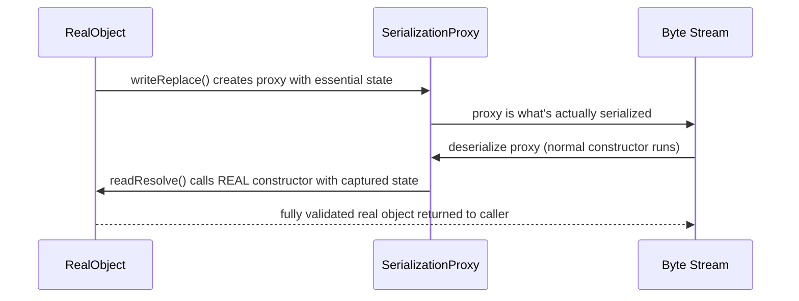

# 13. Serialization

## Serializable

### Theory
- **Core Concepts** - `Serializable` is a marker interface (no methods) signaling to the JVM that instances of a class may be converted to/from a byte stream via `ObjectOutputStream`/`ObjectInputStream`, enabling persistence, deep-copying, or transmission across a network/process boundary.
- **Internal Working** - The default serialization mechanism uses reflection to walk the object's non-transient, non-static fields and writes their values (recursively serializing referenced objects) to the stream, tagged with class metadata for later reconstruction.
- **When to Use It** - Use for DTOs/value objects that need to cross JVM boundaries (RMI, distributed caches, session replication) or be persisted to disk; avoid for classes with sensitive data, complex invariants, or singleton/security-sensitive semantics without extra safeguards.
- **Advantages** - Built into the JDK with zero boilerplate for simple classes (just implement the marker interface); integrates with many frameworks (RMI, `HttpSession` replication, some caching solutions).
- **Limitations** - Reflection-based (slow, bypasses constructors), a well-known security liability (deserialization of untrusted data can enable RCE via gadget chains), fragile to class evolution unless `serialVersionUID` is managed carefully, and serialized form leaks the internal field layout as a de facto public API.

### Internal Working
- **Step-by-Step Explanation** - On `writeObject(obj)`: the stream writes class metadata (name, `serialVersionUID`), then reflectively reads each non-transient, non-static field's value, recursively serializing any referenced object graph (handling cycles via an internal handle table so shared/circular references are written only once). On `readObject()`: the JVM allocates the object WITHOUT calling any constructor of the serializable class (it calls the no-arg constructor of the first non-serializable superclass, if any, then uses reflection to set fields directly from the stream data), reconstructing the object graph from the handle table.
- **Memory Layout** - Deserialized objects are heap-allocated normally, but bypass the class's own constructors entirely - fields are set via low-level reflective mechanisms (`sun.reflect`/`Unsafe`-based field setting internally), which is why constructor invariants aren't automatically enforced.
- **Diagrams**
```
Object graph --writeObject--> [classname, serialVersionUID, field values, nested object handles] --> byte stream
byte stream  --readObject-->  new object (no constructor run) with fields set reflectively
```
- **JVM Behaviour** - Serialization/deserialization is implemented mostly in the `java.io` library using reflection (`Field.setAccessible(true)` internally) rather than special bytecode instructions; deserializing untrusted input is a well-documented attack vector because `readObject()` can trigger arbitrary code execution via crafted object graphs exploiting classes with dangerous `readObject()`/`finalize()` side effects ("gadget chains").

### Interview Questions
**Basic**
1. What is the `Serializable` interface, and what methods does it require you to implement?
2. What happens if a class has a non-serializable field and you try to serialize it?

**Intermediate**
1. Why does deserialization bypass the class's normal constructors?
2. How does the JVM handle circular references during serialization?

**Advanced**
1. Why is deserializing untrusted data considered a serious security risk, and what are "gadget chains"?

**Scenario-based**
1. A class implementing `Serializable` has a field referencing a non-serializable third-party type you can't modify - how do you handle this?

### Detailed Answers
1. **Q: What is `Serializable`?** A: A marker interface (`java.io.Serializable`) with zero methods; implementing it simply opts the class into the JVM's default reflection-based serialization mechanism.
2. **Q: Non-serializable field?** A: `NotSerializableException` is thrown at runtime when the stream encounters a non-transient field whose declared runtime object doesn't implement `Serializable` - unless that field is marked `transient` (excluded from serialization) or the containing class provides custom `writeObject()`/`readObject()` logic to handle it manually.
3. **Q: Why bypass constructors?** A: Deserialization needs to reconstruct the EXACT prior state of the object (including private/invariant-violating intermediate states in theory), and calling the normal constructor (which may run validation, generate IDs, or have side effects) could change or reject that state, or duplicate side effects that already happened once during the original construction - so the JVM restores fields directly instead.
4. **Q: Circular references?** A: The stream maintains an internal handle table mapping already-serialized objects to a reference handle; when the same object is encountered again (including via a cycle), only the handle is written instead of re-serializing the object, and deserialization reconstructs the same shared/circular structure using those handles.
5. **Q: Why is untrusted deserialization risky?** A: `readObject()` (and related methods like `readResolve()`, `hashCode()`/`equals()` called incidentally during reconstruction, e.g., inside a `HashMap`) can execute arbitrary application code as objects are reconstructed; attackers craft a serialized byte stream referencing a chain of existing classes on the classpath whose side effects, when composed ("gadget chain"), achieve arbitrary code execution - a class of vulnerability that has caused real-world RCEs (e.g., Apache Commons Collections gadget chains).
6. **Q: Non-serializable third-party field?** A: Mark the field `transient` and provide custom `writeObject()`/`readObject()` methods that manually serialize/deserialize a substitute representation (e.g., convert the third-party object to a serializable form before writing, and reconstruct it after reading), or wrap it and implement the Serialization Proxy Pattern.

### Code Examples
```java
import java.io.*;

class User implements Serializable {
    private static final long serialVersionUID = 1L;
    private final String username;
    private final int age;
    User(String username, int age) { this.username = username; this.age = age; }
    @Override public String toString() { return username + " (" + age + ")"; }
}

public class SerializableDemo {
    public static void main(String[] args) throws Exception {
        User user = new User("alice", 30);
        // Serialize to a byte array
        ByteArrayOutputStream bos = new ByteArrayOutputStream();
        try (ObjectOutputStream oos = new ObjectOutputStream(bos)) { oos.writeObject(user); }

        // Deserialize back - note: no constructor of User runs during this
        try (ObjectInputStream ois = new ObjectInputStream(new ByteArrayInputStream(bos.toByteArray()))) {
            User restored = (User) ois.readObject();
            System.out.println(restored); // alice (30)
        }
    }
}
```

## Externalizable

### Theory
- **Core Concepts** - `Externalizable` extends `Serializable` but requires the class to implement `writeExternal(ObjectOutput)`/`readExternal(ObjectInput)` explicitly, giving the developer complete manual control over the serialized format instead of relying on reflection-based defaults.
- **Internal Working** - Unlike default serialization, `Externalizable` classes MUST have a public no-arg constructor (called by the JVM during deserialization before `readExternal()` populates the state), since the JVM has no reflective knowledge of the fields to restore automatically.
- **When to Use It** - Use when you need full control over serialized format/versioning (e.g., a compact custom binary format, cross-language interoperability, or performance-critical serialization avoiding reflection overhead).
- **Advantages** - Faster than default reflection-based serialization (direct field writes, no reflective field enumeration), full control over exact byte format and versioning strategy, smaller serialized payloads possible.
- **Limitations** - Entirely manual - every field must be explicitly written/read in the correct order, error-prone to keep in sync as the class evolves; requires a public no-arg constructor (breaks immutability/complicates classes designed to always be fully constructed).

### Internal Working
- **Step-by-Step Explanation** - On serialization: the stream calls the class's `writeExternal(ObjectOutput out)` method, where the developer explicitly writes each field via `out.writeInt()`, `out.writeObject()`, etc., in a chosen order. On deserialization: the JVM first invokes the class's public no-arg constructor (unlike default `Serializable`, which skips constructors entirely), then calls `readExternal(ObjectInput in)`, where the developer reads fields back in the exact same order they were written.
- **Memory Layout** - The object IS constructed via its normal constructor first (unlike default serialization), then its fields are subsequently overwritten by `readExternal()` - a hybrid of normal construction plus manual field population.
- **Diagrams**
```
Serialize:   obj.writeExternal(out)  -> out.writeUTF(name); out.writeInt(age);  (developer-controlled order)
Deserialize: new Obj() (no-arg ctor runs!) -> obj.readExternal(in) -> name = in.readUTF(); age = in.readInt();
```
- **JVM Behaviour** - Because the JVM must invoke a real constructor for `Externalizable` classes, standard object initialization semantics apply (any constructor-time invariant checks run), unlike default `Serializable`'s reflection-only field restoration - this is a deliberate design trade-off for control versus convenience.

### Interview Questions
**Basic**
1. What two methods must an `Externalizable` class implement?
2. What constructor requirement does `Externalizable` impose that `Serializable` does not?

**Intermediate**
1. Why is `Externalizable` typically faster than default `Serializable`?
2. What happens if `writeExternal`/`readExternal` read/write fields in inconsistent order?

**Advanced**
1. How does `Externalizable`'s constructor-calling behaviour change security/invariant considerations compared to default serialization?

**Scenario-based**
1. You need extremely compact, high-throughput serialization for a high-frequency trading message class - would you choose default `Serializable` or `Externalizable`, and why?

### Detailed Answers
1. **Q: Required methods?** A: `void writeExternal(ObjectOutput out) throws IOException` and `void readExternal(ObjectInput in) throws IOException, ClassNotFoundException`.
2. **Q: Constructor requirement?** A: A public no-arg constructor is mandatory - the JVM calls it during deserialization before `readExternal()` populates fields; default `Serializable` requires no such constructor since it bypasses constructors entirely via reflection.
3. **Q: Why faster?** A: It avoids the reflective field-enumeration and per-field metadata overhead of default serialization, writing/reading only the exact bytes the developer specifies, often in a more compact custom format.
4. **Q: Inconsistent read/write order?** A: Deserialization silently reads garbage/wrong values into the wrong fields (since the stream is just a sequence of bytes with no self-describing field names) - a subtle, hard-to-detect bug requiring careful discipline (and often a version field) to avoid across code changes.
5. **Q: Security/invariant implications of constructor calling?** A: Since a real constructor runs, any validation/invariant-establishing logic in it executes normally before `readExternal()` overwrites fields - somewhat safer than default serialization's total constructor bypass, though `readExternal()` itself can still set fields to arbitrary values afterward, so it's not a complete guarantee against invalid states from untrusted input.
6. **Q: High-frequency trading message?** A: `Externalizable` - the ability to hand-control the exact byte layout (avoiding reflection overhead and unnecessary metadata) is valuable for minimizing latency and payload size in a performance-critical, high-throughput context.

### Code Examples
```java
import java.io.*;

class TradeMessage implements Externalizable {
    private String symbol;
    private double price;

    public TradeMessage() {} // required public no-arg constructor
    TradeMessage(String symbol, double price) { this.symbol = symbol; this.price = price; }

    @Override public void writeExternal(ObjectOutput out) throws IOException {
        out.writeUTF(symbol); // developer controls exact order/format
        out.writeDouble(price);
    }
    @Override public void readExternal(ObjectInput in) throws IOException {
        symbol = in.readUTF(); // must match writeExternal's order exactly
        price = in.readDouble();
    }
    @Override public String toString() { return symbol + "@" + price; }
}
public class ExternalizableDemo {
    public static void main(String[] args) throws Exception {
        TradeMessage msg = new TradeMessage("AAPL", 185.23);
        ByteArrayOutputStream bos = new ByteArrayOutputStream();
        try (ObjectOutputStream oos = new ObjectOutputStream(bos)) { oos.writeObject(msg); }
        try (ObjectInputStream ois = new ObjectInputStream(new ByteArrayInputStream(bos.toByteArray()))) {
            System.out.println(ois.readObject()); // AAPL@185.23
        }
    }
}
```

## serialVersionUID

### Theory
- **Core Concepts** - `serialVersionUID` is a `private static final long` field that acts as a version identifier for a serializable class, checked during deserialization to ensure the sender's and receiver's class definitions are compatible.
- **Internal Working** - If not declared explicitly, the JVM computes one automatically via a hash of the class's structure (name, fields, methods, interfaces) - a computation sensitive to nearly any change, making implicit UIDs fragile across recompilation/evolution.
- **When to Use It** - Always declare it explicitly for any long-lived serializable class (especially ones persisted to disk or sent across versions of an application) to control exactly when changes are considered compatible.
- **Advantages** - Explicit declaration gives control over compatibility - you decide which class changes are considered compatible (bump the UID) versus safely additive (leave it unchanged).
- **Limitations** - Doesn't validate actual field compatibility beyond the UID match - a mismatched non-UID structural change (e.g., changed field type) can still cause `readObject()` to throw or produce incorrect data if not paired with custom serialization logic.

### Internal Working
- **Step-by-Step Explanation** - During deserialization, the stream's embedded `serialVersionUID` (written by the serializing JVM) is compared against the loaded class's `serialVersionUID` (either explicitly declared or computed via `ObjectStreamClass`'s SHA-based algorithm over the class's structure); a mismatch immediately throws `InvalidClassException`, aborting deserialization before any field data is even processed.
- **Memory Layout** - Not directly applicable - purely a metadata field checked before any object construction/field restoration occurs.
- **Diagrams**
```
Sender class serialVersionUID = 1L   -->  written into stream
Receiver class serialVersionUID = 2L (changed) --> MISMATCH --> InvalidClassException, deserialization aborted
```
- **JVM Behaviour** - Computing the default (implicit) UID requires reflecting over the class's full structure via `ObjectStreamClass`, which is why even a trivial change like adding a method can alter the computed hash if not pinned explicitly - a classic "worked in dev, broke in prod after redeploy" gotcha.

### Interview Questions
**Basic**
1. What is `serialVersionUID` used for?
2. What happens if the sender's and receiver's `serialVersionUID` don't match?

**Intermediate**
1. Why is it best practice to always declare `serialVersionUID` explicitly?
2. What warning does the compiler give if you omit it, and why?

**Advanced**
1. Does a matching `serialVersionUID` guarantee the object will deserialize correctly? What else can go wrong?

**Scenario-based**
1. After adding a new field to a class deployed across multiple service versions, deserialization between old and new versions starts throwing `InvalidClassException` - what likely happened, and how do you prevent this going forward?

### Detailed Answers
1. **Q: What is it for?** A: A version identifier embedded in the serialized stream, compared against the current class definition's UID during deserialization to detect and reject incompatible class changes.
2. **Q: Mismatch consequence?** A: `InvalidClassException` is thrown immediately, and deserialization of that object fails entirely.
3. **Q: Why declare explicitly?** A: The implicit, compiler-computed UID is derived from the class's full structure and can change with seemingly unrelated edits (adding a method, changing compiler versions), causing unnecessary `InvalidClassException`s for changes that were actually meant to remain compatible; an explicit value gives you deliberate control over compatibility.
4. **Q: Compiler warning?** A: `serializable class ... does not declare a static final serialVersionUID field` - it warns because relying on the computed default is fragile and non-portable across compiler/JVM implementations.
5. **Q: Does matching UID guarantee correctness?** A: No - the UID only gates a coarse compatibility check; if fields were added/removed/changed type without corresponding custom `readObject()`/`writeObject()` handling, deserialization can still fail (missing field) or silently default missing fields (e.g., to 0/null), potentially causing subtle bugs even though the UID matched.
6. **Q: `InvalidClassException` after adding a field?** A: Since no `serialVersionUID` was explicitly declared, the compiler-computed UID changed due to the class structure changing, causing the version mismatch; prevent this by always declaring an explicit `serialVersionUID` and only changing it deliberately when you intend to break backward compatibility, while relying on default serialization's ability to handle newly-added fields gracefully (they'll just default to 0/null when reading old streams) as long as the UID itself stays pinned.

### Code Examples
```java
import java.io.Serializable;

class Config implements Serializable {
    private static final long serialVersionUID = 42L; // explicit, deliberately controlled
    private String name;
    private int version; // added later - old streams (lacking this field) will default it to 0
}
```

## transient

### Theory
- **Core Concepts** - The `transient` keyword marks a field to be EXCLUDED from default Java serialization - it's skipped when writing the object and restored to its default value (0/null/false) upon deserialization, unless custom `readObject()` logic repopulates it.
- **Internal Working** - The serialization machinery (`ObjectOutputStream`) simply skips transient fields when reflectively enumerating fields to write; on the way back, the field is left at its Java default since there's no data in the stream for it.
- **When to Use It** - Use for fields that shouldn't/can't be serialized: derived/cacheable values recomputable from other state, non-serializable resources (sockets, threads, file handles), or sensitive data (passwords, keys) that shouldn't be persisted/transmitted.
- **Advantages** - Avoids `NotSerializableException` for non-serializable field types, reduces serialized payload size, prevents leaking sensitive data into the serialized form.
- **Limitations** - The field must be manually repopulated after deserialization (via custom `readObject()`, lazy recomputation, or a `readResolve()`), otherwise code relying on it post-deserialization will see a default (often null) value, a common source of `NullPointerException` bugs.

### Internal Working
- **Step-by-Step Explanation** - `ObjectOutputStream.writeObject()` reflects over the class's declared fields and skips any marked `transient` (and any `static` field, which is a class-level not instance-level concern anyway) when writing values; `ObjectInputStream.readObject()` allocates the object (without transient field data available) and leaves those fields at their type's default value, unless a custom `readObject()` method explicitly recomputes/reassigns them afterward.
- **Memory Layout** - Not directly applicable - purely affects which fields participate in the byte stream, not the object's in-memory layout (the field still exists as a normal field slot on every instance, just uninitialized by the stream).
- **Diagrams**
```
class Session { String userId; transient Connection dbConnection; }
Serialize:   writes userId only, skips dbConnection
Deserialize: userId restored; dbConnection == null (must be reopened manually)
```
- **JVM Behaviour** - No special JVM-level mechanism - purely handled by the `java.io` serialization library's reflective field-processing logic checking each `Field`'s modifiers for the `TRANSIENT` bit before including it in the stream.

### Interview Questions
**Basic**
1. What does the `transient` keyword do?
2. What value does a transient field have immediately after deserialization?

**Intermediate**
1. Give two practical reasons to mark a field `transient`.
2. How would you repopulate a transient field's value after deserialization?

**Advanced**
1. Are `static` fields serialized by default, and how does that relate conceptually to `transient`?

**Scenario-based**
1. A `UserSession` class has a `transient Connection dbConnection` field; after deserializing a session from a distributed cache, code immediately throws `NullPointerException` when using the connection - what's the fix?

### Detailed Answers
1. **Q: What does `transient` do?** A: Excludes the field from default serialization - its value is not written to the stream and not restored on deserialization.
2. **Q: Value after deserialization?** A: The field's type default - `null` for objects, `0`/`0.0` for numeric primitives, `false` for boolean - unless custom logic (e.g., overridden `readObject()`) explicitly sets it.
3. **Q: Two reasons to use it?** A: (1) The field's type isn't serializable (e.g., a `Socket`, `Thread`, file handle) and would otherwise throw `NotSerializableException`; (2) the field holds sensitive data (password, API key) that shouldn't be persisted or transmitted in the serialized form.
4. **Q: Repopulating after deserialization?** A: Override `readObject(ObjectInputStream in)`, call `in.defaultReadObject()` to restore the normal fields, then manually recompute/reinitialize the transient field (e.g., reopen a connection, recompute a cache) before the method returns.
5. **Q: Are static fields serialized by default?** A: No - `static` fields belong to the class, not the instance, so default serialization never includes them regardless of `transient`; conceptually similar in effect to `transient` (excluded from the instance's serialized data) but for an entirely different reason (class-level vs. explicitly-excluded instance-level state).
6. **Q: `dbConnection` NPE after deserialization?** A: The transient `Connection` field was never re-established after deserialization; fix by implementing a custom `readObject()` that calls `in.defaultReadObject()` then reopens/re-acquires the connection (e.g., from a connection pool) before the object is used, or lazily reconnect on first use via a null-check-and-reconnect pattern in the accessor method.

### Code Examples
```java
import java.io.*;
import java.sql.Connection;

class UserSession implements Serializable {
    private static final long serialVersionUID = 1L;
    private final String userId;
    private transient Connection dbConnection; // excluded from serialization

    UserSession(String userId) { this.userId = userId; }

    // Custom hook to re-establish the transient resource after deserialization
    private void readObject(ObjectInputStream in) throws IOException, ClassNotFoundException {
        in.defaultReadObject(); // restores userId
        this.dbConnection = null; // would normally reacquire from a pool here
    }
}
```

## `readObject()`

### Theory
- **Core Concepts** - `private void readObject(ObjectInputStream in)` is an optional, specially-named hook a `Serializable` class can declare to customize how it's reconstructed from a stream, invoked reflectively by the serialization machinery (not a normal override - no interface declares it).
- **Internal Working** - If present, it's called instead of the default field-restoration logic; typically calls `in.defaultReadObject()` first to restore standard fields, then adds custom logic (validation, transient field recomputation, defensive copying).
- **When to Use It** - Use to validate invariants on untrusted/external input, recompute transient fields, perform defensive copying of mutable fields read from the stream, or handle backward-compatible field evolution.
- **Advantages** - Lets you enforce the same invariants a constructor would, even though deserialization normally bypasses constructors; central point to guard against malicious/malformed serialized data.
- **Limitations** - Easy to forget (silently falls back to unsafe defaults if omitted), must be kept manually in sync with the class's fields, and is itself a common target for deserialization-based attacks if not carefully validated.

### Internal Working
- **Step-by-Step Explanation** - The JVM's serialization framework uses reflection to detect a `private void readObject(ObjectInputStream)` method with the exact signature; if found, it's invoked (via reflection, bypassing normal access control) instead of the default field-by-field restoration; inside it, calling `in.defaultReadObject()` performs the standard reflective restoration of non-transient fields, after which the method can add validation or custom logic before returning.
- **Memory Layout** - The object has already been allocated (without running its constructor) before `readObject()` executes; the method operates on that already-allocated instance, populating/validating its fields directly.
- **Diagrams**
```
ObjectInputStream.readObject()
  -> allocate object (no constructor)
  -> reflectively finds custom readObject(ObjectInputStream) if present
  -> in.defaultReadObject() restores standard fields
  -> custom validation / transient field setup
  -> return fully constructed (and validated) object
```
- **JVM Behaviour** - Because `readObject()` is invoked via reflection based purely on its exact private method signature (a "magic method", not from any interface), it runs even though it's `private`, bypassing normal Java access-control expectations - this is a JDK-specific serialization convention, not a general language feature.

### Interview Questions
**Basic**
1. What is the exact signature of the custom `readObject()` hook?
2. What does `in.defaultReadObject()` do?

**Intermediate**
1. Why would you add validation logic inside `readObject()`?
2. Can `readObject()` be `public`? Why is it conventionally `private`?

**Advanced**
1. How does defining `readObject()` help defend against deserialization attacks that try to construct invalid object states?

**Scenario-based**
1. A `Range` class has an invariant `min <= max` enforced in its constructor, but this invariant can be violated via a maliciously crafted serialized stream - how would you use `readObject()` to close this gap?

### Detailed Answers
1. **Q: Exact signature?** A: `private void readObject(java.io.ObjectInputStream in) throws IOException, ClassNotFoundException`.
2. **Q: What does `in.defaultReadObject()` do?** A: Performs the JVM's standard reflective restoration of the object's non-transient, non-static fields from the stream - the same behaviour that would happen automatically if no custom `readObject()` were defined at all.
3. **Q: Why add validation?** A: Deserialization bypasses the normal constructor (which would normally validate arguments), so a crafted/corrupted byte stream could otherwise produce an object in an invalid state; validating inside `readObject()` (after `defaultReadObject()`) re-establishes the same guarantees the constructor provides.
4. **Q: Can it be public? Why private?** A: It's conventionally `private` because the serialization mechanism finds and invokes it via reflection based on exact signature match, regardless of access modifier, and there's no reason for other code to call it directly - keeping it private prevents misuse/direct invocation from application code.
5. **Q: Defending against invalid states?** A: By validating invariants immediately after `in.defaultReadObject()` and throwing an `InvalidObjectException` (or similar) if they don't hold, you prevent a maliciously or accidentally corrupted stream from producing an object that violates its class's fundamental guarantees, closing off a class of deserialization-based attacks that rely on constructing "impossible" objects.
6. **Q: `Range` invariant fix?** A: Add `private void readObject(ObjectInputStream in) { in.defaultReadObject(); if (min > max) throw new InvalidObjectException("min > max"); }` so any deserialized `Range` is guaranteed to satisfy the same invariant the constructor enforces.

### Code Examples
```java
import java.io.*;

class Range implements Serializable {
    private static final long serialVersionUID = 1L;
    private final int min, max;
    Range(int min, int max) {
        if (min > max) throw new IllegalArgumentException("min > max");
        this.min = min; this.max = max;
    }
    // Re-validate the invariant since deserialization bypasses the constructor
    private void readObject(ObjectInputStream in) throws IOException, ClassNotFoundException {
        in.defaultReadObject();
        if (min > max) throw new InvalidObjectException("min > max after deserialization");
    }
}
```

## `writeObject()`

### Theory
- **Core Concepts** - `private void writeObject(ObjectOutputStream out)` is the write-side counterpart to `readObject()` - an optional, specially-named hook letting a `Serializable` class customize exactly what gets written to the stream.
- **Internal Working** - If declared, it's invoked instead of the default field-serialization logic; typically calls `out.defaultWriteObject()` first (writing standard non-transient fields), then writes any additional custom data (e.g., a manually-serialized transient field).
- **When to Use It** - Use to serialize a transient field manually (writing a substitute/derived representation), omit/mask sensitive data selectively, or write extra versioning metadata alongside the standard fields.
- **Advantages** - Gives fine-grained control over exactly what's persisted/transmitted, letting you handle otherwise-non-serializable fields or reduce payload size by writing a compact custom representation.
- **Limitations** - Must be paired with a matching `readObject()` that reads data back in the exact same order/format, or deserialization breaks; adds maintenance burden to keep both methods in sync as the class evolves.

### Internal Working
- **Step-by-Step Explanation** - The framework detects a `private void writeObject(ObjectOutputStream)` method via reflection; if present, it's called instead of default serialization; inside, `out.defaultWriteObject()` writes the standard non-transient fields (in the same reflective manner as if no custom hook existed), after which the method can write additional data via `out.writeObject()`/`out.writeInt()`/etc., which the corresponding `readObject()` must read back in the identical order.
- **Memory Layout** - Not directly applicable - this operates on the byte stream representation, not the in-memory object layout.
- **Diagrams**
```
writeObject(out):
  out.defaultWriteObject();          // writes normal fields
  out.writeObject(computeExtra());   // custom extra data (e.g., derived from a transient field)

readObject(in) (matching):
  in.defaultReadObject();
  Object extra = in.readObject();    // must read in the SAME order
```
- **JVM Behaviour** - Like `readObject()`, this is a reflection-discovered "magic method" convention specific to the `java.io` serialization framework, not a general Java language override mechanism - it works despite being `private` because the framework explicitly looks for and invokes it by exact signature.

### Interview Questions
**Basic**
1. What is the exact signature of the custom `writeObject()` hook?
2. What does `out.defaultWriteObject()` do?

**Intermediate**
1. Why must `writeObject()` and `readObject()` be kept in sync?
2. Give an example of when you'd write extra data beyond `defaultWriteObject()`.

**Advanced**
1. How would you use `writeObject()` to redact a sensitive field before it's persisted, while still keeping the field usable in-memory?

**Scenario-based**
1. A class has a transient `Map<String, CachedValue>` cache field; you want the serialized form to include a lightweight, recomputable summary instead of the full cache - how would you implement this with `writeObject()`/`readObject()`?

### Detailed Answers
1. **Q: Exact signature?** A: `private void writeObject(java.io.ObjectOutputStream out) throws IOException`.
2. **Q: What does `out.defaultWriteObject()` do?** A: Writes the object's standard non-transient, non-static fields to the stream using the JVM's normal reflective serialization logic - the same thing that would happen automatically without a custom `writeObject()`.
3. **Q: Why must they stay in sync?** A: The stream format is a raw, unlabeled sequence of bytes/values - `readObject()` must read back exactly what `writeObject()` wrote, in the same order and format, or deserialization will read garbage or throw an exception (e.g., `EOFException`/`OptionalDataException`).
4. **Q: Example of extra data?** A: Serializing a derived/summary value in place of a large or non-serializable transient field, e.g., writing just a cache's size or a checksum instead of the entire (transient) cache contents.
5. **Q: Redacting a sensitive field?** A: Declare the field normally (usable in-memory as usual), but in `writeObject()`, call `out.defaultWriteObject()` for the safe fields, then explicitly write a masked placeholder (e.g., `out.writeObject("***")`) instead of the real value for the sensitive field (which itself should be marked `transient` so `defaultWriteObject()` doesn't also serialize the real value).
6. **Q: Transient cache summary?** A: In `writeObject()`: call `out.defaultWriteObject()` then `out.writeInt(cache.size())`; in `readObject()`: call `in.defaultReadObject()` then `int cachedSize = in.readInt();` and reinitialize `cache = new HashMap<>()` (empty, to be repopulated lazily), using `cachedSize` only for logging/diagnostics if needed.

### Code Examples
```java
import java.io.*;
import java.util.HashMap;
import java.util.Map;

class ReportCache implements Serializable {
    private static final long serialVersionUID = 1L;
    private final String reportName;
    private transient Map<String, String> cache = new HashMap<>(); // not serialized directly

    ReportCache(String reportName) { this.reportName = reportName; }

    private void writeObject(ObjectOutputStream out) throws IOException {
        out.defaultWriteObject();       // writes reportName
        out.writeInt(cache.size());     // custom: write only a summary of the transient cache
    }
    private void readObject(ObjectInputStream in) throws IOException, ClassNotFoundException {
        in.defaultReadObject();         // restores reportName
        int previousCacheSize = in.readInt(); // read in the SAME order as written
        this.cache = new HashMap<>();   // reinitialize transient field fresh
        System.out.println("Previous cache had " + previousCacheSize + " entries (not restored)");
    }
}
```

## Serialization Proxy Pattern

### Theory
- **Core Concepts** - The Serialization Proxy Pattern replaces a class's actual serialized form with a separate, simpler "proxy" class that captures its logical state; the original class writes a proxy via `writeReplace()`, and the proxy reconstructs the real object via its own `readResolve()`, using the real constructor (restoring invariant checks).
- **Internal Working** - `writeReplace()` on the original class returns an instance of a private static nested proxy class holding the essential state; that proxy is what actually gets serialized; on deserialization, the proxy's `readResolve()` calls the original class's public constructor/factory to build a fully-validated real instance, which replaces the proxy transparently in the returned object graph.
- **When to Use It** - Recommended (Effective Java) for classes with complex invariants, singleton/enum-like classes, or immutable classes where you want serialization to go through the same validation path as normal construction, rather than bypassing it as default serialization does.
- **Advantages** - Serialized objects are ALWAYS constructed via real constructors (full invariant enforcement), defends against most deserialization attacks targeting invalid internal states, decouples the serialized format from the class's internal field layout (can freely refactor internals without breaking the wire format).
- **Limitations** - More boilerplate (an extra nested class, `writeReplace()`/`readResolve()`), doesn't work for classes designed to be extensible by untrusted subclasses in certain ways, and adds a small serialization/deserialization overhead (an extra intermediate object).

### Internal Working
- **Step-by-Step Explanation** - (1) The outer class implements `writeReplace()` returning `new SerializationProxy(this)` (the proxy class holds copies of the outer object's essential fields); (2) the JVM serializes the PROXY instead of the outer object; (3) on deserialization, the JVM reconstructs the proxy (a normal, simple object with a normal constructor), then calls the proxy's `readResolve()`, which invokes the outer class's real public constructor/factory using the proxy's captured state, producing a fully-validated real instance that's substituted into the final object graph in place of the proxy.
- **Memory Layout** - Two short-lived intermediate objects (the proxy on each side) are created during the round-trip, in addition to the final reconstructed real object; not significant overhead for typical use cases.
- **Diagrams**

- **JVM Behaviour** - `writeReplace()`/`readResolve()` are both reflection-discovered "magic methods" (like `readObject()`/`writeObject()`) recognized by the `java.io` serialization framework by exact signature, letting the framework substitute a different object into the stream/graph transparently to the caller of `readObject()`.

### Interview Questions
**Basic**
1. What two special methods implement the Serialization Proxy Pattern?
2. What problem with default serialization does this pattern solve?

**Intermediate**
1. Why does using the real constructor via `readResolve()` improve security compared to default deserialization?
2. Why is the proxy class typically declared `private static` and nested inside the outer class?

**Advanced**
1. How does this pattern decouple the serialized wire format from the class's internal implementation, and why is that valuable?

**Scenario-based**
1. An immutable `ImmutableRange(min, max)` class with a `min <= max` invariant needs to be safely serializable against untrusted input - design it using the Serialization Proxy Pattern.

### Detailed Answers
1. **Q: Two special methods?** A: `Object writeReplace()` on the original class (returns the proxy to serialize instead) and `Object readResolve()` on the proxy class (returns the real reconstructed object).
2. **Q: Problem solved?** A: Default deserialization bypasses constructors entirely, allowing invalid/malicious byte streams to produce objects that violate class invariants; this pattern forces every deserialized instance to go through the real, validating constructor.
3. **Q: Why more secure via `readResolve()`?** A: Because the actual object the caller receives is built by calling the class's normal constructor (with the proxy's captured field values as arguments), any validation logic in that constructor runs exactly as it would for normal object creation - a forged/corrupted byte stream can't produce an object that skips this validation.
4. **Q: Why `private static` nested?** A: `private` hides the proxy as a pure implementation detail invisible outside the outer class; `static` avoids an implicit reference to an outer instance (which isn't needed and would complicate/undermine serialization of the proxy itself).
5. **Q: Decoupling wire format from implementation?** A: Since only the proxy's simple, stable fields are actually serialized (not the outer class's real internal fields/layout), you can freely refactor the outer class's internal representation across versions without breaking compatibility with previously serialized data, as long as the proxy's captured essential state and the constructor it calls remain compatible.
6. **Q: `ImmutableRange` design?** A: Implement `writeReplace()` returning a nested `SerializationProxy` holding `min`/`max`; the proxy's `readResolve()` calls `new ImmutableRange(min, max)` (running the real constructor's `min <= max` validation); never implement `readObject()` directly on `ImmutableRange` itself (or make it throw, to prevent bypassing the proxy).

### Code Examples
```java
import java.io.*;

final class ImmutableRange implements Serializable {
    private static final long serialVersionUID = 1L;
    private final int min, max;

    ImmutableRange(int min, int max) {
        if (min > max) throw new IllegalArgumentException("min > max");
        this.min = min; this.max = max;
    }

    // Substitute a proxy for actual serialization
    private Object writeReplace() { return new SerializationProxy(this); }

    // Defend against a forged stream bypassing writeReplace()
    private void readObject(ObjectInputStream in) throws InvalidObjectException {
        throw new InvalidObjectException("Proxy required");
    }

    private static class SerializationProxy implements Serializable {
        private static final long serialVersionUID = 1L;
        private final int min, max;
        SerializationProxy(ImmutableRange range) { this.min = range.min; this.max = range.max; }
        // Reconstructs via the REAL constructor, re-running validation
        private Object readResolve() { return new ImmutableRange(min, max); }
    }
}
```

## Record Serialization *(new)*

### Theory
- **Core Concepts** - Records (Java 16+) can implement `Serializable` like any class, but their serialization is canonical: the JVM serializes/deserializes based on the record's component values, and deserialization ALWAYS goes through the record's canonical constructor, unlike ordinary classes which bypass constructors entirely.
- **Internal Working** - `readObject()`/`readObjectNoData()` cannot be customized for records (they're ignored if declared, or disallowed) - deserialization reads each component's value and invokes the canonical constructor directly, meaning compact-constructor validation/normalization ALWAYS runs.
- **When to Use It** - Ideal for simple, immutable serializable data-carrier types (DTOs, value objects) where you want serialization safety (constructor validation) with minimal boilerplate, without needing the Serialization Proxy Pattern's manual setup.
- **Advantages** - Automatically as safe as the Serialization Proxy Pattern (always validated via the canonical/compact constructor) with none of that pattern's boilerplate; serialized form is tied to the record's components, which is usually exactly the class's public API surface anyway.
- **Limitations** - You cannot customize the serialized field layout via custom `writeObject()`/`readObject()` the way ordinary classes can (the mechanism is intentionally fixed/canonical for records); still requires implementing `Serializable` explicitly and still subject to `serialVersionUID` version-compatibility concerns across component changes.

### Internal Working
- **Step-by-Step Explanation** - Serialization writes each record component's value (by name, similar to default field serialization) to the stream; deserialization reads back each named component's value and then calls the record's canonical constructor with those values as arguments - meaning any validation/normalization logic in a compact constructor executes for EVERY deserialized instance, exactly as it would for `new MyRecord(...)` in normal code.
- **Memory Layout** - Standard heap allocation for the reconstructed record instance, but critically, unlike ordinary class deserialization, the constructor genuinely runs as part of this process rather than being bypassed.
- **Diagrams**
```
record Range(int min, int max) { Range { if (min > max) throw new IllegalArgumentException(); } }

Deserialize: read min, max from stream -> new Range(min, max)  <-- compact constructor validation ALWAYS runs
```
- **JVM Behaviour** - The JDK's serialization mechanism special-cases records (`ObjectStreamClass` recognizes record classes) to always reconstruct via `invokedynamic`-based canonical constructor invocation rather than the reflective bypass-constructor path used for ordinary classes, making unsafe deserialization (skipping validation) structurally impossible for records.

### Interview Questions
**Basic**
1. Can a `record` implement `Serializable`?
2. Does record deserialization call the canonical constructor?

**Intermediate**
1. Why does this make records inherently safer to deserialize than ordinary classes, without needing extra patterns?
2. Can you customize record serialization with a custom `readObject()`?

**Advanced**
1. How does this relate to the Serialization Proxy Pattern - do records need it?

**Scenario-based**
1. You're designing a network message DTO with a `min <= max` invariant and want it to be safely serializable against untrusted senders with minimal code - would you use a record or the Serialization Proxy Pattern with a regular class?

### Detailed Answers
1. **Q: Can records implement `Serializable`?** A: Yes - simply add `implements Serializable` to the record declaration, exactly as with a normal class.
2. **Q: Does deserialization call the canonical constructor?** A: Yes - unlike ordinary classes (which bypass all constructors), record deserialization is specified to always invoke the canonical (or compact) constructor with the deserialized component values.
3. **Q: Why inherently safer?** A: Since the canonical/compact constructor's validation logic always runs during deserialization, invalid states that violate the record's invariants are rejected automatically, achieving the same safety the Serialization Proxy Pattern provides for ordinary classes, but without any extra proxy class or `writeReplace()`/`readResolve()` boilerplate.
4. **Q: Can you customize with `readObject()`?** A: No - the JLS/serialization spec for records does not allow overriding the deserialization process via `readObject()`/`readObjectNoData()`/`writeObject()` in the traditional sense; the mechanism is fixed to always go through the canonical constructor (you CAN still customize via a compact constructor for validation/normalization, which is the intended customization point).
5. **Q: Relation to Serialization Proxy Pattern - needed?** A: No - records get the pattern's core safety benefit (constructor-validated deserialization) built into the language/runtime automatically, making the manual Serialization Proxy Pattern largely unnecessary for record types specifically (it remains relevant for ordinary classes).
6. **Q: Record vs Proxy Pattern for network DTO?** A: Prefer a `record` with a compact constructor validating `min <= max` and `implements Serializable` - it achieves the same safety guarantee as the Serialization Proxy Pattern with drastically less code, making it the clearly better choice for a new, simple immutable DTO.

### Code Examples
```java
import java.io.*;

record Range(int min, int max) implements Serializable {
    // Compact constructor: validation ALWAYS runs on deserialization too
    Range {
        if (min > max) throw new IllegalArgumentException("min > max");
    }
}

public class RecordSerializationDemo {
    public static void main(String[] args) throws Exception {
        Range range = new Range(1, 10);
        ByteArrayOutputStream bos = new ByteArrayOutputStream();
        try (ObjectOutputStream oos = new ObjectOutputStream(bos)) { oos.writeObject(range); }
        try (ObjectInputStream ois = new ObjectInputStream(new ByteArrayInputStream(bos.toByteArray()))) {
            Range restored = (Range) ois.readObject(); // canonical constructor runs, validation enforced
            System.out.println(restored); // Range[min=1, max=10]
        }
    }
}
```
