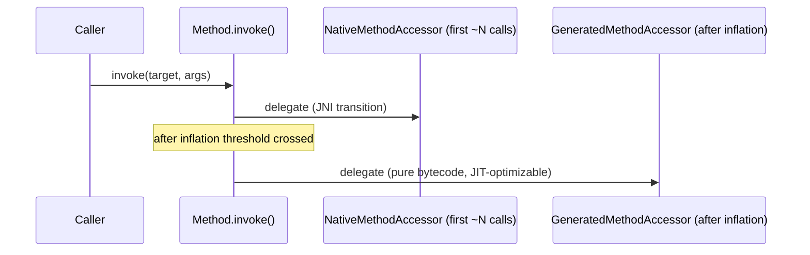
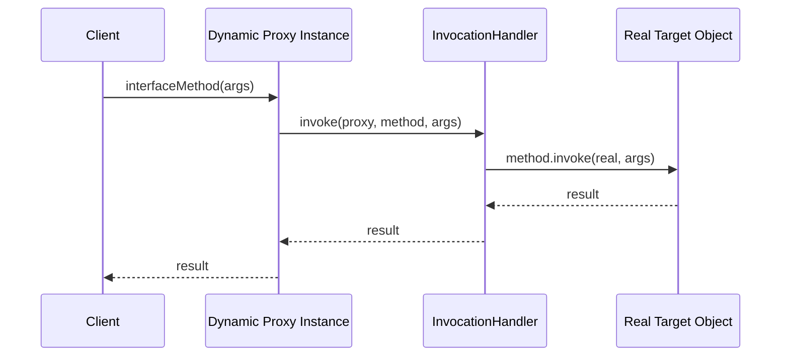
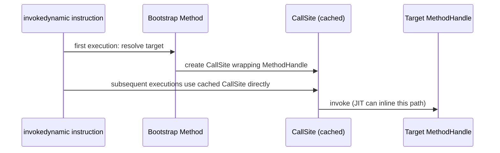

# 14. Reflection

## Class API

### Theory

**Core Concepts**: The `java.lang.Class<T>` object is the runtime metadata representation of every type in the JVM (classes, interfaces, arrays, primitives, and even `void`). Reflection begins with obtaining a `Class` object — via `obj.getClass()`, `MyType.class`, or `Class.forName("fully.qualified.Name")` — and then querying it for constructors, methods, fields, annotations, superclass/interfaces, and modifiers.

**Internal Working**: Each loaded class has exactly one corresponding `Class` instance per defining `ClassLoader`, created and populated by the JVM during class loading; `Class` itself exposes native methods (backed by JVM internal structures like the `Klass`/`InstanceKlass` metadata in HotSpot) that reflectively expose this metadata to Java code.

**When to Use It**: Frameworks (Spring, Hibernate, Jackson) that need to inspect arbitrary user classes at runtime to wire dependencies, map fields to columns, or serialize/deserialize objects generically; plugin systems that load classes by name; testing frameworks (JUnit) that discover and invoke test methods.

**Advantages**: Enables highly generic, extensible frameworks that operate on arbitrary types without compile-time knowledge of them; supports dynamic class loading and inspection scenarios impossible with purely static code.

**Limitations**: Reflective calls bypass normal compile-time type checking (errors surface as runtime exceptions like `NoSuchMethodException`); historically slower than direct calls (though JIT and modern JDK optimizations narrow this gap significantly); since Java 9's module system and Java 17's strong encapsulation by default, reflective access to non-public/non-exported JDK internals is restricted unless explicitly opened via `--add-opens` or module directives.

### Internal Working

**Step-by-Step Explanation**:
1. During class loading (specifically the "loading" phase), the JVM constructs an internal metadata structure (HotSpot's `InstanceKlass`) representing the class's structure — fields, methods, constant pool, superclass, interfaces.
2. A corresponding `java.lang.Class` object is created and forever associated 1:1 with that `InstanceKlass` for the lifetime of the classloader that loaded it (this is why `Class` objects are natural, safe keys for classloader-scoped caches).
3. Calling `getClass()` on an instance simply returns the object header's stored `Class` reference (extracted from the object's internal klass pointer) — an extremely cheap, effectively O(1) operation.
4. `Class.forName(name)` triggers the classloader lookup-and-initialize path if the class isn't already loaded: it delegates to the appropriate `ClassLoader`, performing the full loading/linking/initialization sequence if needed, then returns the resulting `Class` object.
5. Methods like `getDeclaredMethods()`, `getFields()` walk the `InstanceKlass`'s metadata tables (native, JVM-internal arrays) and wrap each entry in a corresponding `java.lang.reflect.Method`/`Field`/`Constructor` Java object on demand (these wrapper objects are typically cached internally by the JDK to avoid re-creating them on every call).

**Memory Layout**: `Class` objects live in the heap but are associated with Metaspace-resident class metadata (`InstanceKlass`) — the `Class` object is a thin heap-side handle/proxy, while the bulk of structural metadata (method tables, constant pool, field layout) lives in Metaspace, off the main heap, managed by its own memory pool distinct from GC-collected object heap regions (though `Class` objects themselves, and unloaded-class cleanup, do interact with GC when classloaders become unreachable).

**Diagrams**:
```
Heap                                Metaspace
+----------------+                  +----------------------------+
| Class<Foo> obj |----------------->| InstanceKlass for Foo      |
| (heap handle)  |                  |  - method table            |
+----------------+                  |  - field table             |
                                     |  - constant pool           |
                                     |  - superclass/interfaces   |
                                     +----------------------------+
```

**JVM Behaviour**: `Class.forName` participates in normal class-loading/linking/initialization semantics (triggering static initializers if the `initialize` flag is true, the default for the 1-arg overload). Reflective member lookups (`getMethod`, `getField`) perform linear/hash-based search over the class's metadata and are more expensive than a direct virtual/static call resolved at compile time via `invokevirtual`/`invokestatic`, though the JIT can still optimize the *invocation* once a `Method`/reflective handle is obtained and reused (see Reflection Performance below).

### Interview Questions

**Basic**
1. What are the three common ways to obtain a `Class` object for a type?
2. What is the difference between `Class.forName("X")` and `X.class`?

**Intermediate**
1. How many `Class` objects exist for a given class name if it's loaded by two different classloaders?
2. Does calling `Class.forName("com.example.Foo")` always run `Foo`'s static initializer?

**Advanced**
1. Where does a `Class` object's structural metadata actually live in memory, and how does that relate to Metaspace?

**Scenario-based**
1. A plugin system loads the same class name from different JAR files via separate classloaders per plugin. Two plugins report a `ClassCastException` even though both reference "the same" class name. Explain why.

### Detailed Answers

1. **Three ways to get a `Class` object**: (a) `SomeType.class` — a compile-time literal, resolved via the constant pool, doesn't require an instance and works even for primitives/arrays/interfaces; (b) `instance.getClass()` — returns the actual runtime class of an object (useful when you only have a reference typed as a supertype/interface); (c) `Class.forName("fully.qualified.Name")` — dynamically loads/looks up a class purely from its String name at runtime, the mechanism frameworks use when the type isn't known at compile time.

2. **`Class.forName` vs `.class`**: `X.class` is resolved at compile time and does not, by itself, force class initialization — it merely references the constant-pool entry for the class's `Class` object (linking may still occur lazily). `Class.forName("X")` (the single-argument overload) performs classloading *and* initialization (running static initializers) if not already done, and does so purely dynamically based on the string name — it can throw a checked `ClassNotFoundException` at runtime, unlike `.class` which is checked at compile time.

3. **Multiple classloaders, multiple `Class` objects**: Yes — `Class` identity in the JVM is defined by the pair (fully qualified name, defining classloader). If the same class name/bytecode is loaded independently by two different classloaders, you get two distinct, unrelated `Class` objects; instances created by one are not assignable to/from the other's type (`instanceof` fails, casting throws `ClassCastException`) even though the source code and bytecode are identical — this is the classic "classloader visibility"/parallel-class-hierarchy problem seen in app servers and plugin systems.

4. **Does `forName` always run static initializers?** By default, yes — the single-argument `Class.forName(String)` initializes the class (running static initializer blocks and static field initializers) if it hasn't been initialized already. The three-argument overload `Class.forName(name, initialize, classLoader)` lets you pass `initialize=false` to load and link the class without triggering initialization, deferring that until first actual use (e.g., first static method call or instantiation).

5. **Where metadata lives**: The `Class` object itself is an ordinary heap object (small, mostly a handle), but the bulk of the class's structural data — method/field tables, constant pool, bytecode, superclass/interface relationships — lives in Metaspace, a native-memory-backed region (allocated from the OS, not the garbage-collected Java heap, since Java 8 replaced PermGen with Metaspace). This separation lets classes be unloaded (freeing Metaspace) independently of ordinary heap GC cycles, but tied specifically to their defining classloader becoming unreachable.

6. **Plugin classloader scenario**: Because each plugin's classes were loaded by distinct `ClassLoader` instances, the JVM treats "the same" class name loaded by two different classloaders as two entirely separate, incompatible types (per the (name, classloader) identity rule) — even if the exact same `.class` bytes were used. An object created in Plugin A's classloader context has type `Foo` (loaded by Plugin A's loader), and when passed to Plugin B and cast to `Foo` (loaded by Plugin B's loader), the JVM correctly rejects the cast as invalid (`ClassCastException: Foo cannot be cast to Foo`, confusingly showing identical names), because they are structurally identical but nominally distinct runtime types — the standard fix is to share such cross-plugin types via a common parent/shared classloader.

### Code Examples

```java
public class ClassApiDemo {
    static class Widget {
        private int id;
        Widget(int id) { this.id = id; }
    }

    public static void main(String[] args) throws ClassNotFoundException {
        // Three ways to obtain a Class object
        Class<Widget> byLiteral = Widget.class;
        Widget instance = new Widget(1);
        Class<?> byInstance = instance.getClass();
        Class<?> byName = Class.forName("io.reflectdemo.ClassApiDemo$Widget");

        System.out.println(byLiteral == byInstance); // true — same classloader, same name
        System.out.println(byLiteral.getName());
        System.out.println(byLiteral.getSuperclass());
        System.out.println(java.util.Arrays.toString(byLiteral.getDeclaredFields()));

        // forName with deferred initialization (does not trigger static init)
        Class<?> lazy = Class.forName("io.reflectdemo.ClassApiDemo$Widget", false,
                ClassApiDemo.class.getClassLoader());
        System.out.println("Loaded without forcing init: " + lazy.getName());
    }
}
```

## Method API

### Theory

**Core Concepts**: `java.lang.reflect.Method` represents a single method of a class (excluding constructors, which use `Constructor` instead), obtained via `Class.getMethod(name, paramTypes)` (public methods, including inherited) or `getDeclaredMethod(name, paramTypes)` (any declared method regardless of access modifier, but not inherited). Invocation is performed via `method.invoke(target, args...)`.

**Internal Working**: `invoke()` performs runtime access checks (unless `setAccessible(true)` has been called to bypass Java language access control), boxes/unboxes primitive arguments as needed, and dispatches to the underlying method — for the first several invocations this typically goes through a JNI-based native accessor, after which the JVM (since JDK 8's inflation mechanism) generates a specialized bytecode-based accessor class for faster subsequent calls.

**When to Use It**: Frameworks needing to invoke arbitrary methods discovered by name/annotation at runtime (dependency injection calling setter methods, test runners invoking `@Test`-annotated methods, serialization libraries calling getters/setters generically).

**Advantages**: Enables fully generic method invocation without compile-time knowledge of the target type; combined with annotations, forms the backbone of most Java frameworks' "convention over configuration" and declarative programming models.

**Limitations**: `invoke()` wraps checked exceptions from the target method inside `InvocationTargetException`, requiring unwrapping (`getCause()`) to inspect the real failure; reflective calls carry more overhead than direct calls (mitigated but not eliminated by the accessor-generation optimization); accessing non-public methods requires `setAccessible(true)`, which can throw `InaccessibleObjectException` under the Java Platform Module System if the target module doesn't open the package.

### Internal Working

**Step-by-Step Explanation**:
1. `clazz.getMethod("name", paramTypes)` searches the class's (and superclasses'/interfaces') public method metadata for a matching signature, returning a `Method` object wrapping that metadata (or throwing `NoSuchMethodException`).
2. `method.setAccessible(true)` (if needed for non-public methods) disables the standard Java language access check performed during `invoke()`, subject to the module system's `InaccessibleObjectException` restrictions for JDK-internal or unopened packages.
3. `method.invoke(target, args)` — for the first ~15 or so invocations by default (`-Dsun.reflect.inflationThreshold`, or JDK-version-specific equivalents) — delegates to a `NativeMethodAccessorImpl` that calls into the JVM via JNI to perform the actual invocation, which has relatively high per-call overhead due to the native transition and argument marshaling.
4. After the inflation threshold is crossed, the JVM "inflates" the accessor: it dynamically generates a specialized bytecode class (a `GeneratedMethodAccessor`, produced via `MethodAccessorGenerator`) that directly invokes the target method using ordinary bytecode instructions (`invokevirtual`/`invokestatic`), which the JIT can subsequently optimize/inline like any other Java code, dramatically closing the performance gap versus non-reflective calls for hot reflective call sites.
5. Checked exceptions thrown by the invoked method are caught by the JVM's invocation machinery and re-wrapped in an unchecked `InvocationTargetException`, whose `getCause()` holds the original exception.

**Memory Layout**: Not directly applicable beyond ordinary object allocation for `Method` instances (cached by the JDK per class to avoid repeated re-wrapping) and the dynamically generated accessor classes, which themselves occupy Metaspace like any other loaded class.

**Diagrams**:


**JVM Behaviour**: The inflation mechanism is a deliberate JVM-level optimization trading upfront bytecode-generation cost for much faster steady-state reflective invocation; frameworks that call the same reflective `Method` repeatedly (e.g., a getter invoked once per serialized object) benefit significantly once inflation kicks in, while one-off reflective calls pay only the (relatively modest) native-accessor path cost.

### Interview Questions

**Basic**
1. What's the difference between `getMethod` and `getDeclaredMethod`?
2. What exception wraps a checked exception thrown by a reflectively invoked method?

**Intermediate**
1. Why might the first few calls to `method.invoke()` be slower than the hundredth call to the same `Method` object?
2. What does `setAccessible(true)` actually do, and what can prevent it from working?

**Advanced**
1. Explain the reflection "inflation" mechanism and why it exists.

**Scenario-based**
1. A dependency-injection framework caches `Method` objects for setter injection and calls them millions of times across the app's lifetime. What reflective-performance characteristics would you expect, and would you change anything?

### Detailed Answers

1. **`getMethod` vs `getDeclaredMethod`**: `getMethod(name, params)` searches only *public* methods, but includes those inherited from superclasses and implemented interfaces. `getDeclaredMethod(name, params)` returns a method declared directly in that class (any access modifier — private, protected, package-private, public) but does *not* include inherited methods; to reflectively access a private inherited method you must call `getDeclaredMethod` on the specific class that declares it, not a subclass.

2. **Exception wrapping**: `InvocationTargetException` — a checked exception thrown by `Method.invoke()` whenever the underlying invoked method itself throws any exception (checked or unchecked); the actual original exception is retrievable via `getCause()`. This wrapping exists because `invoke()`'s own declared throws clause can't enumerate every possible checked exception the arbitrary target method might throw.

3. **First calls slower**: The JVM's reflection implementation initially uses a native (JNI-based) accessor for each `Method`, which carries meaningful per-call overhead (native transition, argument boxing/marshaling). After a configurable number of invocations (the "inflation threshold"), the JVM generates a specialized bytecode-based accessor class specifically for that method, which executes as ordinary Java bytecode and can be JIT-compiled/inlined — making later calls substantially faster than the initial native-path calls.

4. **`setAccessible(true)` mechanics**: It suppresses the standard Java language access-control check (private/protected/package-private restrictions) that would otherwise cause `invoke()`/`get()`/`set()` to throw `IllegalAccessException`. It can fail (throwing `InaccessibleObjectException`) under the Java Platform Module System (Java 9+) if the target class's package is in a named module that hasn't been "opened" (via `opens` in `module-info.java`, or `--add-opens` on the command line) to the calling module — a deliberate strong-encapsulation boundary that plain classpath code doesn't have but named modules enforce by default.

5. **Inflation mechanism explained**: Reflection historically had a reputation for being slow primarily due to the native-call overhead of the JNI-based accessor path used for every invocation. The JVM's inflation mechanism addresses this by starting with the cheaper-to-create-but-slower-to-run native accessor for infrequently-called methods (avoiding the cost of generating and loading a whole new class for a one-off reflective call), then automatically switching ("inflating") to a purpose-built, JIT-friendly bytecode accessor class once a method is called often enough to justify that generation cost — balancing startup cost versus steady-state throughput automatically per call site.

6. **DI framework scenario**: For millions of repeated invocations of the same cached `Method` objects, you'd expect the JVM to inflate essentially all of them to generated bytecode accessors quickly, after which invocation cost approaches that of a normal virtual call (especially if the JIT can inline through the generated accessor for monomorphic call sites) — meaning raw reflective invocation overhead is unlikely to be the dominant cost at that scale. I would still avoid unnecessary repeated `getMethod`/`setAccessible` lookups (cache the `Method` object once, which the framework already does), and consider `MethodHandle`s (`java.lang.invoke`) as an alternative offering potentially lower steady-state overhead and better JIT integration for extremely hot reflective call sites, since `MethodHandle` invocation is designed from the ground up to be inlinable by the JIT via `invokedynamic`-style linkage, unlike core reflection's simulate-then-inflate model.

### Code Examples

```java
import java.lang.reflect.InvocationTargetException;
import java.lang.reflect.Method;

public class MethodApiDemo {
    static class Account {
        private double balance = 100.0;

        private void withdraw(double amount) {
            if (amount > balance) {
                throw new IllegalStateException("Insufficient funds");
            }
            balance -= amount;
        }

        double getBalance() { return balance; }
    }

    public static void main(String[] args) throws NoSuchMethodException, IllegalAccessException {
        Account account = new Account();

        // Reflectively invoke a private method (simulating framework-style dynamic dispatch)
        Method withdraw = Account.class.getDeclaredMethod("withdraw", double.class);
        withdraw.setAccessible(true); // bypass private access control

        try {
            withdraw.invoke(account, 30.0);
            System.out.println("Balance after withdrawal: " + account.getBalance());

            withdraw.invoke(account, 1000.0); // triggers IllegalStateException inside target
        } catch (InvocationTargetException e) {
            // Must unwrap to get the real exception thrown by the target method
            System.out.println("Underlying failure: " + e.getCause().getMessage());
        }
    }
}
```

## Constructor API

### Theory

**Core Concepts**: `java.lang.reflect.Constructor<T>` represents a class's constructor, obtained via `Class.getConstructor(paramTypes)` (public) or `getDeclaredConstructor(paramTypes)` (any access level), and invoked via `constructor.newInstance(args...)` to reflectively create new object instances, bypassing the need to know the concrete type at compile time.

**Internal Working**: `newInstance()` performs access checks (unless `setAccessible(true)`), allocates a new object of the target type, and invokes the corresponding constructor body — internally, similarly to `Method.invoke`, it goes through a native-then-inflated-bytecode-accessor path for performance.

**When to Use It**: Frameworks that instantiate arbitrary user-defined classes generically — dependency injection containers building beans, deserialization libraries (Jackson, Gson) reconstructing objects from JSON, ORM frameworks materializing entities from database rows.

**Advantages**: Enables truly generic object factories independent of concrete types; supports invoking non-public constructors (e.g., singleton enforcement bypass in tests, or accessing package-private/private constructors used by builder-style internal APIs).

**Limitations**: Like `Method.invoke`, checked exceptions thrown from within the constructor are wrapped in `InvocationTargetException`; reflective instantiation cannot invoke a class's constructor if the class is abstract or an interface; `newInstance()` on `Class` itself (the older, deprecated `Class.newInstance()` API) only supported no-arg public constructors and propagated checked exceptions unwrapped (a design flaw), which is why `Constructor.newInstance()` (with proper `InvocationTargetException` wrapping) has been the recommended API since Java 1.1's reflection API expanded, and `Class.newInstance()` was formally deprecated in Java 9.

### Internal Working

**Step-by-Step Explanation**:
1. `clazz.getDeclaredConstructor(paramTypes)` searches the class's metadata for a constructor matching the given parameter types, returning a `Constructor` wrapper (or throwing `NoSuchMethodException`).
2. If the constructor isn't public (or the class itself isn't public/accessible from the caller), `setAccessible(true)` is required to bypass the language-level access check during invocation.
3. `constructor.newInstance(args)` triggers object allocation (a new instance of the target type, uninitialized fields at their default values) followed by invocation of the actual constructor body with the supplied arguments, running exactly the same instance-initializer and constructor logic as a normal `new` expression would.
4. Exceptions from within the constructor body (including from `this()`/`super()` chained calls) are wrapped in `InvocationTargetException`.

**Memory Layout**: Object allocation via reflective construction follows identical heap allocation semantics as compiled `new` bytecode (`new` + `dup` + `invokespecial <init>` sequence) — there is no different memory layout for reflectively constructed objects; the JVM's actual allocation and constructor-invocation mechanics are the same underlying operations, merely reached via the reflection API's indirection layer instead of directly compiled bytecode.

**Diagrams**:
```
Reflective construction vs compiled new:

Compiled:  new Foo(args)     -> [new Foo] [dup] [push args] [invokespecial Foo.<init>]
Reflective: ctor.newInstance(args) -> JVM native/generated accessor -> same <init> invocation
```

**JVM Behaviour**: Just as with `Method`, `Constructor` invocation is subject to the same native-accessor-then-inflated-bytecode-accessor optimization, so repeatedly reflectively constructing instances of the same class (e.g., a JSON deserializer creating millions of DTOs) benefits from inflation to a JIT-friendly generated accessor after the threshold is crossed.

### Interview Questions

**Basic**
1. How do you reflectively create an instance of a class that has a non-default constructor?
2. Why is `Class.newInstance()` deprecated in favor of `Constructor.newInstance()`?

**Intermediate**
1. Can `newInstance()` invoke a private constructor? What's required?
2. What happens if the target class is abstract?

**Advanced**
1. How does a deserialization library like Jackson typically construct objects when there's no no-arg constructor available?

**Scenario-based**
1. A DI container needs to instantiate a class annotated `@Component` that has a single constructor taking three collaborator dependencies. Describe how reflection is used end-to-end to resolve and construct it.

### Detailed Answers

1. **Non-default constructor instantiation**: Obtain the specific `Constructor` via `clazz.getDeclaredConstructor(paramTypes...)` matching the desired parameter signature, then call `constructor.newInstance(actualArgs...)`, supplying arguments matching those parameter types (boxed appropriately for primitives) — the JVM performs the equivalent of `new ClassName(actualArgs)` reflectively.

2. **Why `Class.newInstance()` is deprecated**: It only supported public, no-argument constructors (unusable for classes without such a constructor), and — critically — it propagated any checked exception thrown by the constructor *unwrapped*, silently violating normal Java checked-exception compile-time enforcement (callers could be surprised by checked exceptions they never declared/caught). `Constructor.newInstance()` fixes both issues: it works with any constructor signature/access level (with `setAccessible`), and properly wraps checked exceptions in `InvocationTargetException`, consistent with `Method.invoke`'s behavior.

3. **Private constructor access**: Yes — `getDeclaredConstructor` retrieves constructors of any access level, but invoking a non-public one via `newInstance()` requires first calling `constructor.setAccessible(true)` to bypass the Java language access check, subject to the same module-system `InaccessibleObjectException` restrictions that apply to reflective field/method access on unopened packages.

4. **Abstract class target**: `newInstance()` throws `InstantiationException` if the target type is abstract (or an interface), since there is no valid, complete object layout/constructor body to execute for an abstract type — reflection cannot conjure a concrete implementation out of an abstract declaration.

5. **Deserialization without no-arg constructor**: Libraries like Jackson typically look for (in order of preference, configurable): a `@JsonCreator`-annotated constructor or static factory method explicitly designated for deserialization, matching JSON properties to constructor parameters by name (using parameter-name reflection, sometimes requiring `-parameters` compiler flag or annotations like `@JsonProperty` since parameter names aren't always retained in bytecode by default); alternatively, when using records (Java 16+), Jackson can automatically map JSON fields to the canonical record constructor's components, since records guarantee a canonical, all-args constructor and expose accessible component accessors reflectively.

6. **DI container instantiation scenario**: (1) Discover the `@Component`-annotated class via classpath scanning (often ASM/reflection-based bytecode scanning to find annotations without necessarily fully loading every class up front); (2) reflectively obtain its (usually single, or `@Autowired`-annotated) constructor via `getDeclaredConstructor`; (3) inspect that constructor's parameter types (`getParameterTypes()`) to determine what dependencies to resolve/inject, recursively resolving/instantiating each dependency (or fetching from the existing bean registry if already created — this recursive resolution is also how circular-dependency detection is implemented); (4) once all dependency arguments are resolved, call `constructor.setAccessible(true)` (if needed) and `constructor.newInstance(resolvedArgs...)` to produce the fully-wired bean instance, which is then registered in the container's bean registry (often as a singleton, cached for future lookups).

### Code Examples

```java
import java.lang.reflect.Constructor;
import java.lang.reflect.InvocationTargetException;

public class ConstructorApiDemo {
    static class Employee {
        private final String name;
        private final double salary;

        private Employee(String name, double salary) { // private constructor
            if (salary < 0) throw new IllegalArgumentException("Salary cannot be negative");
            this.name = name;
            this.salary = salary;
        }

        @Override
        public String toString() { return name + ": " + salary; }
    }

    public static void main(String[] args) throws NoSuchMethodException,
            InstantiationException, IllegalAccessException {
        Constructor<Employee> ctor = Employee.class.getDeclaredConstructor(String.class, double.class);
        ctor.setAccessible(true); // required since the constructor is private

        try {
            Employee e = ctor.newInstance("Grace Hopper", 95000.0);
            System.out.println("Constructed: " + e);

            ctor.newInstance("Invalid", -100.0); // triggers IllegalArgumentException
        } catch (InvocationTargetException e) {
            System.out.println("Constructor rejected input: " + e.getCause().getMessage());
        }
    }
}
```

## Field API

### Theory

**Core Concepts**: `java.lang.reflect.Field` represents a class's field (member variable), obtained via `Class.getField(name)` (public, including inherited) or `getDeclaredField(name)` (any access level, declared directly), and read/written reflectively via `field.get(instance)` / `field.set(instance, value)`.

**Internal Working**: Field access checks Java language access rules (unless bypassed via `setAccessible(true)`), then reads/writes the field's raw memory slot within the object's layout — primitive fields have type-specific accessor methods (`getInt`, `setInt`, etc.) to avoid boxing overhead where the caller knows the static type.

**When to Use It**: Serialization frameworks reading/writing object state directly (bypassing getters/setters, e.g., Gson's default field-based (de)serialization), test frameworks/mocking libraries injecting mock dependencies into private fields, ORM frameworks populating entity fields directly from result sets.

**Advantages**: Provides access to an object's actual state regardless of encapsulation (useful for frameworks that must remain agnostic to whether an API author chose to expose getters), works even for `final` instance fields in some contexts (with caveats — see limitations).

**Limitations**: Direct field access bypasses any validation/business logic in getters/setters, which is exactly why some frameworks prefer property (getter/setter)-based reflection instead; mutating `static final` fields whose values are compile-time constants (inlined by `javac` at all call sites) has no effect on already-compiled callers even if the field's reflective mutation "succeeds," since those call sites read the inlined literal, not the field, at runtime; reflective field mutation of genuinely `final` instance fields, while historically possible via `setAccessible`, is increasingly restricted and its behavior is explicitly documented as unpredictable/unsafe (the JIT may have already assumed immutability for optimization).

### Internal Working

**Step-by-Step Explanation**:
1. `clazz.getDeclaredField("name")` looks up the field's metadata (name, type, modifiers, declaring class) from the class's internal field table, returning a `Field` wrapper object.
2. For non-public fields, `field.setAccessible(true)` must be called to bypass the standard access check that `get`/`set` would otherwise enforce.
3. `field.get(instance)` computes the field's memory offset within the object's layout (precomputed at class-loading time) and reads the raw value, boxing it into an `Object` if it's a primitive type (unless a type-specific accessor like `getInt` is used, avoiding the box).
4. `field.set(instance, value)` similarly writes to that offset, performing an unboxing/type-compatibility check first, throwing `IllegalArgumentException` on type mismatch.

**Memory Layout**: Every object instance has a fixed field layout determined at class-loading time (each field assigned a specific byte offset within the object's memory block, following the object header). Reflective field access computes/uses this same offset — it does not change the object's memory layout, merely accesses it through an extra indirection layer instead of direct bytecode field access (`getfield`/`putfield`).

**Diagrams**:
```
Object memory layout (conceptual):
+----------------+  <- object header (mark word + klass pointer)
| header (12-16B)|
+----------------+
| field: id (int)|  <- offset 12
+----------------+
| field: name(ref)| <- offset 16
+----------------+
Field.get()/set() reads/writes at the precomputed offset, same as compiled getfield/putfield bytecode.
```

**JVM Behaviour**: Reflective field get/set also goes through the native-accessor-then-inflated-bytecode-accessor optimization path (analogous to `Method`/`Constructor`), so repeated access to the same `Field` object benefits from JIT-friendly generated accessors after enough invocations; however, unlike direct field access compiled into bytecode, reflective access can never be as aggressively inlined/optimized by escape analysis since the JIT typically cannot prove as much about reflective call sites as it can about direct, statically-typed field access.

### Interview Questions

**Basic**
1. What's the difference between `getField` and `getDeclaredField`?
2. What must you call before reading/writing a private field reflectively?

**Intermediate**
1. Can you reflectively modify a `static final` field, and will the change be visible to other code?
2. What exception is thrown if you try to `set()` a value of the wrong type onto a field?

**Advanced**
1. Why is mutating a genuinely `final` instance field via reflection considered unsafe even when `setAccessible` technically permits it?

**Scenario-based**
1. A unit test uses reflection to inject a mock object into a private field of the class under test instead of using a constructor or setter. Discuss the trade-offs of this testing approach.

### Detailed Answers

1. **`getField` vs `getDeclaredField`**: `getField(name)` returns only public fields, including those inherited from superclasses/interfaces. `getDeclaredField(name)` returns a field declared directly in that specific class regardless of access modifier, but does not search superclasses — to reflectively access a private inherited field you must call `getDeclaredField` on the actual declaring class.

2. **Before accessing a private field**: You must call `field.setAccessible(true)` to suppress the Java language access check; without it, `get()`/`set()` throw `IllegalAccessException`. This can itself fail with `InaccessibleObjectException` if the field's package resides in a named module that hasn't been opened to the caller's module.

3. **Modifying `static final` fields**: It's technically possible via reflection (bypassing the `final` modifier's write protection using `setAccessible` plus, in older JDKs, additional tricks to strip the `FINAL` modifier flag — largely closed off in modern JDKs), but if the field is a compile-time constant (a `static final` primitive or `String` initialized with a constant expression), `javac` inlines its value directly at every call site referencing it during compilation. Reflectively changing the field's runtime value afterward has no effect on already-compiled code reading that inlined constant — only code that dynamically re-reads the field via reflection, or code compiled after the change and re-run, would observe the new value, making this an unreliable and generally inadvisable technique.

4. **Wrong-type `set()`**: Throws `IllegalArgumentException`, indicating the supplied value's type is not assignment-compatible with the field's declared type (and cannot be automatically widened/unboxed to match).

5. **Why final-field mutation is unsafe**: The JVM and JIT compiler are permitted to assume `final` instance fields never change after the constructor completes (this is part of the Java Memory Model's guarantees around safe publication of immutable objects), and may cache/hoist reads of such fields across threads without re-checking, or apply other optimizations premised on that invariant. Reflectively mutating a `final` field after construction can violate these assumptions, leading to inconsistent or stale values being observed by other threads/optimized code paths — the behavior is explicitly documented as unspecified in such cases, which is why this technique should never be used in production code, only (rarely) in test harnesses with full awareness of the risk.

6. **Reflective field injection in tests trade-offs**: Advantages include being able to test classes that weren’t designed with test-friendly constructors/setters, without changing production code just for testability. Disadvantages: tests become tightly coupled to private implementation details (a refactor renaming the field breaks the test even if behavior is unchanged), it bypasses any invariant-establishing logic that a constructor/setter might normally enforce (risking constructing an object into an inconsistent state the class never intends to allow), and it generally signals a design smell — favoring constructor injection (or package-private setters designed for testability) is usually preferable, reserving reflective field injection for edge cases like legacy code that can't easily be refactored.

### Code Examples

```java
import java.lang.reflect.Field;

public class FieldApiDemo {
    static class Service {
        private String environment = "production"; // no setter exposed intentionally
    }

    public static void main(String[] args) throws NoSuchFieldException, IllegalAccessException {
        Service service = new Service();

        Field envField = Service.class.getDeclaredField("environment");
        envField.setAccessible(true); // bypass private access, e.g., for test injection

        System.out.println("Before: " + envField.get(service));
        envField.set(service, "test"); // simulate injecting a test-specific value
        System.out.println("After: " + envField.get(service));

        try {
            envField.set(service, 42); // wrong type: int instead of String
        } catch (IllegalArgumentException e) {
            System.out.println("Rejected: " + e.getMessage());
        }
    }
}
```

## Dynamic Object Creation

### Theory

**Core Concepts**: Beyond invoking a known `Constructor` reflectively, Java offers several mechanisms for fully dynamic object creation where even the "shape" of what to construct is decided at runtime: `Class.getDeclaredConstructor().newInstance()` for ordinary types, `java.lang.reflect.Proxy.newProxyInstance()` for synthesizing dynamic proxy implementations of interfaces at runtime, and `Array.newInstance(componentType, length)` for constructing arrays of a runtime-determined component type.

**Internal Working**: `Proxy.newProxyInstance` dynamically generates (and caches) an actual bytecode class implementing the requested interfaces at runtime, whose methods all delegate to a supplied `InvocationHandler`; `Array.newInstance` calls into JVM-native array-allocation logic parameterized by a runtime `Class` rather than a compile-time-known type.

**When to Use It**: Dynamic proxies underlie declarative frameworks (Spring AOP proxies, JDK dynamic proxies for interface-based mocking, RPC/remote-stub generation); `Array.newInstance` is essential whenever you must create an array whose element type is only known as a runtime `Class<?>` (e.g., generic collection-to-array conversion utilities).

**Advantages**: Enables entirely runtime-driven object graphs and cross-cutting behavior injection (logging, transactions, security) without generating/compiling actual source code for every combination; dynamic proxies specifically let you intercept every interface method call through a single handler.

**Limitations**: JDK dynamic proxies (`java.lang.reflect.Proxy`) can only proxy interfaces, not concrete classes (for class proxying, tools like CGLIB/Byte Buddy generate a real subclass at runtime instead); dynamically generated proxy classes still incur classloading/generation cost on first use per unique interface combination (though cached thereafter); reflective array creation via `Array.newInstance` returns `Object`, requiring an unchecked cast back to the specific array type, which can raise unchecked-cast warnings.

### Internal Working

**Step-by-Step Explanation**:
1. `Proxy.newProxyInstance(classLoader, interfaces, handler)` checks an internal proxy-class cache keyed by the classloader and requested interface set; if no matching generated class exists yet, it synthesizes actual bytecode for a new class implementing all specified interfaces, with every method body simply forwarding the call (along with method + args) to `handler.invoke(proxy, method, args)`.
2. That generated proxy class is then loaded via the specified classloader (a genuine, JVM-loaded class — not a "fake" simulated object), and a new instance of it is constructed reflectively, wrapping the `InvocationHandler`.
3. Every subsequent call to any interface method on that proxy instance is compiled (in the generated class) as a direct call into `InvocationHandler.invoke`, which the handler author implements to decide what actually happens (delegate to a real object, add logging, throw, etc.).
4. `Array.newInstance(componentType, length)` calls into the JVM's native array-allocation routine, parameterized by a `Class` object representing the component type determined only at runtime, producing a properly-typed array object (verified against the JVM's own array-type system, e.g., `int[].class` vs `Integer[].class` are handled distinctly).

**Memory Layout**: A dynamic proxy instance is an ordinary heap object of a genuinely loaded (Metaspace-resident) generated class — no different in memory-layout terms from any other object once created; the "dynamic" part is the runtime class generation step, not the resulting instance's storage.

**Diagrams**:


**JVM Behaviour**: Generated proxy classes are real, loaded classes participating fully in normal classloading/Metaspace/GC lifecycle; once loaded, their generated methods are subject to ordinary JIT compilation just like any hand-written class, so steady-state proxy method call overhead beyond the `InvocationHandler.invoke` dispatch itself is minimal.

### Interview Questions

**Basic**
1. What's the difference between reflectively constructing a concrete class and creating a JDK dynamic proxy?
2. Can `java.lang.reflect.Proxy` create a proxy for a concrete class (not an interface)?

**Intermediate**
1. How would you create an array of a component type only known as a `Class<?>` at runtime?
2. What gets executed when a method is called on a JDK dynamic proxy instance?

**Advanced**
1. How does Spring AOP decide between JDK dynamic proxies and CGLIB-style subclass proxies for a given bean?

**Scenario-based**
1. You need to add logging around every method call of a third-party interface-based API client without modifying its source. Describe how you'd implement this with a JDK dynamic proxy.

### Detailed Answers

1. **Concrete construction vs dynamic proxy**: Reflectively constructing a concrete class (via `Constructor.newInstance`) creates an instance of an already-existing, compiled class using a known constructor. A JDK dynamic proxy, in contrast, synthesizes an entirely new class at runtime (implementing one or more specified interfaces) whose method implementations are generic forwarding stubs delegating to a supplied `InvocationHandler` — there is no pre-existing "proxy class" source; it's generated on demand.

2. **Concrete class proxying**: No — `java.lang.reflect.Proxy` can only generate proxies implementing interfaces, because its generated class extends `Proxy` itself and additionally implements the requested interfaces (Java doesn't support extending multiple concrete classes, so it can't simultaneously extend `Proxy` and an arbitrary target concrete class). To proxy concrete classes, libraries like CGLIB or Byte Buddy generate an actual runtime subclass overriding the target class's methods instead.

3. **Runtime-typed array creation**: Use `Array.newInstance(componentTypeClass, length)`, then cast the returned `Object` to the specific array type (e.g., `(String[]) Array.newInstance(String.class, 10)`), since generics erase type parameters and you cannot write `new T[length]` directly when `T` is a runtime-only type parameter.

4. **What executes on proxy method call**: The generated proxy class's method implementation (for whichever interface method was called) simply packages up the `Method` object and argument array and calls `invocationHandler.invoke(proxyInstance, method, args)` — all actual behavior is defined by whatever the `InvocationHandler` implementation does with that call (commonly: delegate to a real backing object via reflection, add cross-cutting behavior like logging/timing/transactions around that delegation, or throw/return a canned response for testing/mocking).

5. **Spring AOP proxy selection**: Spring AOP defaults to JDK dynamic proxies when the target bean implements at least one interface (proxying those interfaces) unless explicitly configured to force CGLIB (`proxyTargetClass=true`); if the bean does not implement any interface, Spring automatically falls back to CGLIB-style subclass proxying (or, in newer Spring versions integrating with the more actively maintained Byte Buddy library) since JDK dynamic proxies fundamentally cannot proxy classes without interfaces.

6. **Logging proxy scenario**: Implement `InvocationHandler` wrapping the real API client instance; in its `invoke(proxy, method, args)` method, log the method name/arguments before delegating (`method.invoke(realClient, args)`), log the result/exception after, and return/re-throw accordingly; then construct the proxy via `Proxy.newProxyInstance(classLoader, realClient.getClass().getInterfaces(), handler)`, and substitute this proxy instance wherever the real client would have been injected/used — all call sites remain unaware they're calling through a proxy since it satisfies the same interface type.

### Code Examples

```java
import java.lang.reflect.Array;
import java.lang.reflect.InvocationHandler;
import java.lang.reflect.Method;
import java.lang.reflect.Proxy;

public class DynamicObjectCreationDemo {
    interface PaymentGateway {
        boolean charge(String accountId, double amount);
    }

    static class RealPaymentGateway implements PaymentGateway {
        public boolean charge(String accountId, double amount) {
            System.out.println("Charging " + accountId + " $" + amount);
            return true;
        }
    }

    public static void main(String[] args) {
        // Dynamic proxy adding logging around every interface method call
        PaymentGateway real = new RealPaymentGateway();
        InvocationHandler loggingHandler = (proxy, method, methodArgs) -> {
            System.out.println("[LOG] Invoking " + method.getName());
            Object result = method.invoke(real, methodArgs);
            System.out.println("[LOG] Result: " + result);
            return result;
        };

        PaymentGateway proxied = (PaymentGateway) Proxy.newProxyInstance(
                PaymentGateway.class.getClassLoader(),
                new Class<?>[]{PaymentGateway.class},
                loggingHandler);

        proxied.charge("acct-123", 49.99);

        // Runtime-typed array creation
        Class<?> componentType = String.class;
        Object dynamicArray = Array.newInstance(componentType, 3);
        Array.set(dynamicArray, 0, "alpha");
        String[] typedArray = (String[]) dynamicArray;
        System.out.println(java.util.Arrays.toString(typedArray));
    }
}
```

## Annotations (via Reflection)

### Theory

**Core Concepts**: Reflection is the primary mechanism by which runtime-retained annotations (`@Retention(RetentionPolicy.RUNTIME)`) are actually discovered and read by frameworks — `AnnotatedElement` (implemented by `Class`, `Method`, `Field`, `Constructor`, `Parameter`) exposes methods like `getAnnotation(Type.class)`, `getAnnotations()`, and `isAnnotationPresent(Type.class)`.

**Internal Working**: The JVM stores runtime-visible annotations as structured attribute data in the class file (`RuntimeVisibleAnnotations` attribute and friends); reflective annotation-query methods parse/materialize this data into dynamic proxy instances implementing the annotation's interface, generated on demand similarly to the `Proxy` mechanism described above.

**When to Use It**: Any framework implementing declarative, annotation-driven behavior — dependency injection (`@Autowired`, `@Inject`), ORM mapping (`@Entity`, `@Column`), validation (`@NotNull`, `@Size`), test discovery (`@Test`), REST routing (`@GetMapping`) — all rely on reflectively scanning classes/methods/fields for annotations and reacting accordingly.

**Advantages**: Enables declarative, metadata-driven configuration that keeps business logic classes clean of framework-specific imperative wiring code; annotations plus reflection form the foundation of "convention over configuration" frameworks.

**Limitations**: Only annotations with `RetentionPolicy.RUNTIME` are visible via reflection at all — `SOURCE` and `CLASS` retention annotations are stripped before or after compilation respectively and are invisible to runtime reflection; annotation scanning across a large classpath can be relatively expensive if done naively (many frameworks cache scan results or use build-time/compile-time processing to mitigate this — see Annotation Processing).

### Internal Working

**Step-by-Step Explanation**:
1. At compile time, `javac` embeds annotations with `RetentionPolicy.CLASS` or `RUNTIME` into the compiled class file as attributes (`RuntimeVisibleAnnotations` for `RUNTIME`, `RuntimeInvisibleAnnotations` for `CLASS`), encoding the annotation type and its element values.
2. `SOURCE`-retention annotations (like `@Override`, `@SuppressWarnings`) are used only by the compiler/annotation processors and are discarded entirely — never written to the class file at all.
3. When reflective code calls `element.getAnnotation(MyAnnotation.class)`, the JVM/reflection API parses the relevant `RuntimeVisibleAnnotations` attribute bytes for that element, and dynamically constructs a proxy object (via the same `java.lang.reflect.Proxy` machinery) implementing the annotation's interface, whose methods return the specific element values encoded in the class file.
4. Repeated calls for the same element/annotation type typically hit an internal cache maintained by the JDK reflection implementation, avoiding repeated attribute re-parsing.

**Memory Layout**: Annotation metadata is stored as part of a class's Metaspace-resident class-file attribute data; each queried annotation instance (the dynamic proxy object representing it) is an ordinary heap object like any other reflective wrapper.

**Diagrams**:
```
Class file structure (conceptual):
+---------------------------+
| ... class metadata ...    |
| RuntimeVisibleAnnotations |  <- @Entity, @Table(name="users"), etc. (RUNTIME retention)
| RuntimeInvisibleAnnotations| <- CLASS retention annotations (present in bytecode, reflection-invisible)
+---------------------------+
(SOURCE retention annotations: not present in class file at all)
```

**JVM Behaviour**: Annotation values that are themselves compile-time constants are stored directly in the attribute's constant-pool references; reflective annotation proxy generation reuses the same dynamic-proxy class-generation infrastructure discussed for `Proxy.newProxyInstance`, meaning repeated queries for the same annotated element benefit from JVM-level caching to avoid regenerating identical proxy classes.

### Interview Questions

**Basic**
1. What retention policy must an annotation have to be visible via reflection at runtime?
2. Which method checks whether an element has a specific annotation without retrieving it?

**Intermediate**
1. Why are `@Override` and `@SuppressWarnings` never visible via reflection?
2. How does `getAnnotation()` return something you can call methods on if annotations are just metadata, not classes with implementations?

**Advanced**
1. What's the performance concern with naive classpath-wide annotation scanning, and how do frameworks typically mitigate it?

**Scenario-based**
1. You're building a lightweight test runner that must discover all `@Test`-annotated methods in a class, including inherited ones from an abstract base test class. Describe the reflective approach.

### Detailed Answers

1. **Required retention for reflection visibility**: `RetentionPolicy.RUNTIME` — only annotations declared with `@Retention(RetentionPolicy.RUNTIME)` are retained in the compiled class file's `RuntimeVisibleAnnotations` attribute and thus queryable via the reflection API at runtime; `CLASS` retention (the default if unspecified) keeps the annotation in the bytecode but reflection cannot see it, and `SOURCE` retention discards it entirely after compilation.

2. **Presence-check method**: `AnnotatedElement.isAnnotationPresent(Class<? extends Annotation> annotationType)` returns a boolean without materializing/returning the actual annotation instance, useful as a cheap existence check before doing more expensive processing.

3. **Why `@Override`/`@SuppressWarnings` aren't reflectively visible**: Both are declared with `@Retention(RetentionPolicy.SOURCE)` — they exist purely to inform the compiler (catch override mistakes, suppress specific compiler warnings) and serve no purpose after compilation, so the compiler deliberately omits them from the class file entirely, making them permanently invisible to any runtime reflection-based tooling.

4. **How `getAnnotation()` returns a callable object**: Although an annotation type is declared like an interface with no implementation, the JDK reflection API dynamically generates a proxy implementation of that annotation interface (via the same mechanism as `java.lang.reflect.Proxy`) at the moment it's requested, whose methods are implemented to simply return the specific element values that were encoded in the class file's annotation attribute for that particular usage — so `getAnnotation()` returns a genuine, callable object even though you never wrote an implementing class yourself.

5. **Classpath-wide scanning performance**: Naively iterating and reflectively inspecting every class on a large classpath (especially loading each class just to check its annotations) is slow and memory-intensive at startup, scaling poorly with codebase/dependency size. Frameworks mitigate this via: build-time classpath indexing (e.g., generating a manifest of annotated classes during compilation, as Jandex/Spring's `spring.factories`/component-index mechanisms do), lazy/targeted scanning restricted to specific configured base packages rather than the entire classpath, and caching scan results (in-memory or persisted) across application restarts where feasible.

6. **Test runner scenario**: To discover `@Test` methods including inherited ones, you must walk the class hierarchy explicitly — calling `getDeclaredMethods()` (not `getMethods()`, if you also want to include package-private/protected test methods, which `getMethods()` would miss) on the target class, then repeating on `getSuperclass()` up the chain until reaching `Object`, collecting methods annotated `@Test` at each level while typically de-duplicating overridden methods (matching by name + parameter types) so an overriding subclass method isn't counted twice alongside the overridden parent version.

### Code Examples

```java
import java.lang.annotation.ElementType;
import java.lang.annotation.Retention;
import java.lang.annotation.RetentionPolicy;
import java.lang.annotation.Target;
import java.lang.reflect.Method;
import java.util.ArrayList;
import java.util.List;

public class AnnotationReflectionDemo {
    @Retention(RetentionPolicy.RUNTIME)
    @Target(ElementType.METHOD)
    @interface Test {
        String value() default "";
    }

    static class BaseTests {
        @Test("base-case")
        protected void baseCheck() { }
    }

    static class UserServiceTests extends BaseTests {
        @Test("creates-user")
        void testCreateUser() { System.out.println("running testCreateUser"); }

        @Test
        void testDeleteUser() { System.out.println("running testDeleteUser"); }

        void notATest() { }
    }

    public static void main(String[] args) throws Exception {
        List<Method> discovered = new ArrayList<>();
        Class<?> current = UserServiceTests.class;
        while (current != null && current != Object.class) {
            for (Method m : current.getDeclaredMethods()) {
                if (m.isAnnotationPresent(Test.class)) {
                    discovered.add(m);
                }
            }
            current = current.getSuperclass();
        }

        for (Method m : discovered) {
            Test testAnno = m.getAnnotation(Test.class);
            System.out.println("Found test: " + m.getName() + " label=" + testAnno.value());
        }
    }
}
```

## Reflection Performance

### Theory

**Core Concepts**: Reflective operations (`Method.invoke`, `Field.get/set`, `Constructor.newInstance`, annotation queries) are inherently more expensive per call than their direct, compile-time-bound equivalents due to access checks, argument boxing/marshaling, and the extra indirection layer — but modern JVMs substantially narrow this gap through the "inflation" optimization (native accessor to generated bytecode accessor) and JIT compilation of the generated accessors themselves.

**Internal Working**: The dominant costs are: (1) member lookup (`getMethod`/`getField`, which does a metadata search — expensive if repeated, cheap if cached), (2) the access-check overhead on each `invoke`/`get`/`set` call (partially avoidable via `setAccessible(true)`, which also skips the per-call security check), and (3) for `invoke`, boxing of primitive arguments/return values into `Object`/`Object[]`.

**When to Use It (i.e., when the performance concerns matter)**: High-frequency reflective call sites — e.g., a serialization library invoking getters for every field of every object serialized, potentially millions of times per second — is where reflection overhead can become a measurable bottleneck; occasional/one-off reflective usage (e.g., framework startup wiring) is essentially never a performance concern.

**Advantages of the JVM's approach**: The inflation mechanism specifically targets the "few calls: keep it cheap to set up; many calls: pay compilation cost once, then run fast" trade-off automatically per reflective call site, without requiring developer intervention.

**Limitations**: Even after inflation, reflective calls typically cannot be inlined by the JIT as aggressively as direct calls (particularly for megamorphic call sites, i.e., a single reflective call site invoking many different underlying methods across different types) since the JIT's inlining heuristics for `Method.invoke` are more conservative than for regular virtual dispatch; caching `Method`/`Field`/`Constructor` objects (looked up once, reused many times) is essential — repeated `getMethod`/`getField` lookups defeat much of the possible optimization and add redundant metadata-search cost every time.

### Internal Working

**Step-by-Step Explanation**:
1. Member lookup (`getDeclaredMethod`, etc.) searches the class's metadata tables — an O(number of members) or hash-assisted operation depending on JVM internals — ideally performed once and the resulting `Method`/`Field`/`Constructor` object cached (e.g., as a `static final` field) rather than re-looked-up on every use.
2. On first several invocations of a given reflective member, the JVM uses a native (JNI) accessor path, which has fixed per-call overhead from the native transition and argument marshaling — this is the "cold" performance for infrequently-used reflective call sites.
3. After crossing the inflation threshold (default typically in the low teens of invocation count, configurable via internal `sun.reflect.inflationThreshold` or JDK-equivalent system property, though not guaranteed API), the JVM generates a dedicated bytecode accessor class calling the target member directly via ordinary bytecode (`invokevirtual`, `getfield`, etc.), which the JIT can then compile/optimize/potentially inline like any hand-written code.
4. Argument/return-value boxing for primitives remains an unavoidable overhead of the `Object`/`Object[]`-based `invoke`/`get`/`set` signatures themselves (this is a large part of why `MethodHandle`s, with their more precisely-typed call signatures, can outperform core reflection for extremely hot paths).

**Memory Layout**: Not directly applicable beyond the Metaspace cost of generated accessor classes (one per reflectively-inflated member, a modest, bounded cost) and ordinary heap allocation for boxed primitive arguments/`Object[]` argument arrays on each `invoke` call (a real, if usually small, allocation/GC-pressure source in extremely hot reflective loops).

**Diagrams**:
```
Reflective call cost profile over invocation count:

cost
 |***                              (native accessor: higher fixed per-call cost)
 |   *
 |    *                            <- inflation threshold crossed
 |     *****................       (generated + JIT-compiled accessor: near-direct-call cost)
 +----------------------------------- invocation count
```

**JVM Behaviour**: Beyond inflation, some JVMs/JIT configurations impose limits on how deeply/aggressively they'll inline through `Method.invoke` (since the actual target method is determined dynamically via the `Method` object's internal state, not statically known at the call site the way a direct call is), meaning even hot, inflated reflective call sites may retain modestly higher overhead than the equivalent direct call — this residual gap is exactly the niche `MethodHandle`/`invokedynamic` linkage is designed to close further.

### Interview Questions

**Basic**
1. Why is `Method.invoke()` generally slower than a direct method call?
2. What's a simple, high-value optimization when using reflection repeatedly for the same member?

**Intermediate**
1. What is the reflection "inflation" mechanism and how does it improve steady-state performance?
2. Does calling `setAccessible(true)` improve performance, and if so, why?

**Advanced**
1. Why can't the JIT typically inline through `Method.invoke()` as effectively as a direct virtual call, even after inflation?

**Scenario-based**
1. A JSON serialization library is showing significant CPU time attributed to reflection in a profiler for a high-throughput service. What concrete steps would you take to reduce this overhead?

### Detailed Answers

1. **Why `invoke()` is slower**: Each call involves (at minimum) an access-control check, argument marshaling into an `Object[]` (boxing primitives), and an extra layer of indirection through the reflection machinery (native accessor or generated accessor) rather than a direct, statically-resolved `invokevirtual`/`invokestatic` bytecode instruction — even after JVM-level optimizations narrow this gap, some inherent overhead from the generic, type-erased `invoke(Object, Object...)` signature remains.

2. **Simple high-value optimization**: Look up the `Method`/`Field`/`Constructor` object exactly once (e.g., cache it in a `static final` field or a class-keyed cache map) and reuse that same reflective object for every subsequent call, rather than repeating `getMethod`/`getField` lookups on every invocation — this alone eliminates the redundant metadata-search cost that's often larger than the invocation overhead itself for infrequently-changing reflective targets.

3. **Inflation mechanism recap**: For a given `Method`/`Field`/`Constructor` object, the first several calls go through a native (JNI-based) accessor, which is quick to set up but has meaningful per-call overhead. Once invocation count crosses an internal threshold, the JVM dynamically generates and loads a small bytecode class that directly invokes the target member via ordinary bytecode, letting the JIT compile and optimize it like regular code — meaning steady-state (post-inflation) performance approaches that of non-reflective code far more closely than the initial native-accessor calls would suggest.

4. **Does `setAccessible(true)` help performance?** Yes, modestly — beyond enabling access to non-public members, it also causes the JVM to skip the standard Java language access-control check on every subsequent `invoke`/`get`/`set` call (since the check would otherwise be redundantly re-verified per call), removing a small but real per-call overhead; this is a legitimate secondary reason frameworks call `setAccessible(true)` even on already-public members in some performance-sensitive internal implementations.

5. **Why JIT can't inline through `invoke()` as well**: A direct virtual call's target can often be devirtualized/inlined by the JIT based on observed/profiled receiver types at that specific call site (classic monomorphic/polymorphic inline caching). `Method.invoke()`, however, is a single call site potentially invoked with many different underlying `Method` objects representing entirely different target methods across different types — the JIT's speculative inlining heuristics are far more conservative (or simply inapplicable) for such effectively megamorphic dispatch through a generic API, so even a JIT-compiled generated accessor typically executes as a real (if fast) call rather than being fully inlined away at the original call site.

6. **JSON library optimization scenario**: (1) Ensure all `Method`/`Field` objects used for (de)serializing a given class's properties are looked up once (e.g., at class-registration/first-use time) and cached per class, never re-queried per serialized instance; (2) call `setAccessible(true)` once during that caching step to also skip the recurring access check; (3) where the getter/setter method signatures are simple and stable, consider migrating to `MethodHandle`s (obtained via `MethodHandles.Lookup.unreflect`), which the JIT can often inline more effectively through `invokedynamic`-based call sites, especially when combined with `LambdaMetafactory`-generated functional interfaces for near-direct-call performance; (4) as a more invasive but often decisive fix for genuinely reflection-bottlenecked hot paths, consider a build-time code-generation approach (annotation-processor-generated serializers, as libraries like DSL-JSON do) that eliminates runtime reflection for the hot path entirely, falling back to reflection only for less common/uncommon types.

### Code Examples

```java
import java.lang.reflect.Method;
import java.util.Map;
import java.util.concurrent.ConcurrentHashMap;

public class ReflectionPerformanceDemo {
    static class User {
        private String name = "Ada";
        public String getName() { return name; }
    }

    // Cache reflective Method lookups per class instead of repeating getMethod() on every call
    private static final Map<Class<?>, Method> GETTER_CACHE = new ConcurrentHashMap<>();

    static Object invokeGetter(Object target, String propertyName) throws Exception {
        Method method = GETTER_CACHE.computeIfAbsent(target.getClass(), clazz -> {
            try {
                Method m = clazz.getMethod("get" + Character.toUpperCase(propertyName.charAt(0))
                        + propertyName.substring(1));
                m.setAccessible(true); // also skips repeated access checks on every invoke()
                return m;
            } catch (NoSuchMethodException e) {
                throw new RuntimeException(e);
            }
        });
        return method.invoke(target);
    }

    public static void main(String[] args) throws Exception {
        User user = new User();
        // Repeated calls reuse the cached, already-accessible Method — benefits from JVM inflation
        for (int i = 0; i < 5; i++) {
            System.out.println(invokeGetter(user, "name"));
        }
    }
}
```

## Method Handles & `invokedynamic` *(new)*

### Theory

**Core Concepts**: `java.lang.invoke.MethodHandle` is a lower-level, more directly typed alternative to core reflection for representing and invoking methods, constructors, and field accessors, introduced in Java 7 (JSR 292) alongside the `invokedynamic` bytecode instruction. Unlike `Method.invoke(Object, Object...)`'s generic, boxing-heavy signature, a `MethodHandle` has a precise, static `MethodType` (parameter and return types), enabling far better JIT integration.

**Internal Working**: `MethodHandle`s are obtained via `MethodHandles.Lookup` (which enforces the same access-control model as reflection, scoped to the caller's context) and invoked via `invokeExact`/`invoke`. The `invokedynamic` bytecode instruction (used by `javac` for lambda expressions, string concatenation since Java 9, and dynamic language implementations) defers the choice of what to actually call to a runtime "bootstrap method," which returns a `CallSite` wrapping a `MethodHandle` — critically, this linkage can be cached and later *inlined* by the JIT much like a regular call, unlike core reflection's `Method.invoke`.

**When to Use It**: JVM-hosted dynamic language implementations (JRuby, Groovy) needing efficient dynamic dispatch; library authors implementing lambda-like functional behavior or extremely performance-sensitive reflective-style APIs (e.g., serialization frameworks) who need reflection-like flexibility without reflection's inlining limitations; the compiler itself uses `invokedynamic` for lambda expressions (`LambdaMetafactory`) and (Java 9+) string concatenation.

**Advantages**: Better performance than core reflection for hot call sites, since `MethodHandle` invocation is designed from the ground up to be recognized and optimized (including inlining) by the JIT; `invokedynamic` call sites can be relinked to a different target at runtime (supporting dynamic language semantics like Ruby's duck typing) while still allowing the JIT to optimize the common case via inline caching.

**Limitations**: The API is lower-level and more verbose/unforgiving than reflection — `invokeExact` requires the exact static `MethodType` match (a `WrongMethodTypeException` results from any mismatch, including primitive-vs-boxed mismatches that reflection would silently handle), making it less ergonomic for typical application-level frameworks that don't need the performance edge; understanding `invokedynamic`/bootstrap methods requires deeper JVM linkage knowledge than most application developers ever need directly.

### Internal Working

**Step-by-Step Explanation**:
1. `MethodHandles.lookup()` (called from within the accessing class) produces a `Lookup` object capturing the caller's access permissions — critical for security, since a `MethodHandle` obtained this way carries the access rights of the class that created it, not the eventual caller invoking the handle.
2. `lookup.findVirtual(class, name, methodType)` (or `findStatic`, `findConstructor`, `findGetter`, etc.) resolves a specific, precisely-typed `MethodHandle` for the target member.
3. Invocation via `handle.invokeExact(args)` requires the compile-time static types of the arguments/return value to exactly match the handle's `MethodType` (no autoboxing leniency); `handle.invoke(args)` is a more permissive variant that performs some automatic type adaptation.
4. For `invokedynamic` call sites (generated by `javac` for lambdas, string concatenation, etc.), the first execution of that bytecode instruction triggers a call to a compile-time-specified "bootstrap method," which computes and returns a `CallSite` object wrapping the actual target `MethodHandle`; the JVM caches this linkage at the call site, so subsequent executions skip the bootstrap step entirely and invoke the cached target directly — and, crucially, the JIT can treat this cached, monomorphic-in-practice call site similarly to an ordinary direct call for inlining purposes.

**Memory Layout**: `MethodHandle` and `CallSite` objects are ordinary heap objects; the linkage/bootstrap machinery interacts with Metaspace only insofar as any dynamically generated supporting classes (e.g., `LambdaMetafactory`-generated lambda implementation classes) are loaded there, same as any other class.

**Diagrams**:


**JVM Behaviour**: `invokedynamic` moves the "what gets called" decision from compile time (fixed at `javac` time for ordinary `invokevirtual`/`invokestatic`) to link time (decided by the bootstrap method, potentially per-callsite and even re-decidable later via `CallSite.setTarget` for mutable call sites) — this is precisely how Java lambdas avoid generating a new named class per lambda at compile time; instead, `LambdaMetafactory`'s bootstrap method dynamically generates (once, cached) a lightweight implementation class backing the functional interface at first use.

### Interview Questions

**Basic**
1. What is a `MethodHandle`, and how does it differ from `java.lang.reflect.Method`?
2. What JVM bytecode instruction underlies `MethodHandle`-based dynamic dispatch?

**Intermediate**
1. What's the difference between `invokeExact` and `invoke` on a `MethodHandle`?
2. How are Java lambda expressions compiled, and what role does `invokedynamic` play?

**Advanced**
1. Why can the JIT typically optimize/inline through a cached `invokedynamic` call site better than through `Method.invoke()`?

**Scenario-based**
1. You're implementing a high-performance object mapper and want reflection-like flexibility (discover getters/setters by name at runtime) but need call performance close to direct method calls in the hot serialization path. Would you use core reflection or `MethodHandle`s, and why?

### Detailed Answers

1. **`MethodHandle` vs `Method`**: Both let you dynamically obtain a reference to a method and invoke it, but `MethodHandle` carries a precise, statically-typed `MethodType` (specific parameter/return types, no generic `Object`/`Object[]` erasure) and is designed for efficient JIT-level optimization/inlining, whereas `java.lang.reflect.Method` uses a generic, boxing-heavy `invoke(Object, Object...)` signature oriented toward flexibility and ease of use over raw performance, with a different (native-then-inflated) internal optimization strategy that still typically can't be inlined as aggressively.

2. **Underlying bytecode instruction**: `invokedynamic`, introduced in Java 7 (JSR 292) specifically to support efficient dynamic method dispatch — both for JVM-hosted dynamic languages and (starting Java 8) for the compiler's own implementation of lambda expressions and (Java 9+) string concatenation.

3. **`invokeExact` vs `invoke`**: `invokeExact` requires the call site's static argument and return types to match the handle's `MethodType` exactly (character-for-character type match, including boxed-vs-primitive distinctions) or it throws `WrongMethodTypeException` — no implicit conversions are performed. `invoke` is a more forgiving variant that automatically performs certain type adaptations (like boxing/unboxing, widening reference conversions) to bridge minor mismatches between the caller's apparent types and the handle's actual `MethodType`.

4. **Lambda compilation and `invokedynamic`**: `javac` compiles a lambda expression not into a traditional named inner class (as anonymous classes are) but into an `invokedynamic` call site whose bootstrap method is `LambdaMetafactory.metafactory` (or `altMetafactory`). At first execution, this bootstrap dynamically generates a small, purpose-built class implementing the target functional interface (backed by a private synthetic method containing the lambda body) and returns a `CallSite` targeting a constructor for that class; subsequent executions of the same lambda expression reuse the cached linkage, avoiding repeated class generation.

5. **Why `invokedynamic` inlines better**: Once a `CallSite`'s target `MethodHandle` is linked and cached (typically stabilizing to a single, monomorphic target in most real programs, e.g., a specific lambda implementation), the JIT can treat that call site much like an ordinary, statically-resolved call for inlining purposes, since the underlying `MethodHandle` linkage machinery was specifically designed (with dedicated JIT/interpreter support) to be transparent to escape analysis and inlining heuristics. `Method.invoke()`, in contrast, is a single, ordinary Java method whose internal dispatch to wildly different target methods across calls looks megamorphic/opaque to the JIT's normal inlining heuristics, even after reflection's own inflation optimization generates a fast accessor.

6. **High-performance object mapper scenario**: `MethodHandle`s are the more appropriate choice here — you'd use `MethodHandles.Lookup.unreflect(method)` to convert discovered `Method` objects (found via ordinary reflection for the one-time discovery phase) into `MethodHandle`s, then invoke those handles (via `invoke`, accepting the minor flexibility cost over `invokeExact`) on the hot serialization path; this preserves the "discover by name/annotation at runtime" flexibility of reflection for setup, while giving the JIT a much better chance of optimizing/inlining the actual repeated invocation path, which is exactly the design point `MethodHandle`s were created to address relative to core reflection.

### Code Examples

```java
import java.lang.invoke.MethodHandle;
import java.lang.invoke.MethodHandles;
import java.lang.invoke.MethodType;

public class MethodHandleDemo {
    static class Product {
        private final String name;
        private final double price;
        Product(String name, double price) { this.name = name; this.price = price; }
        public String getName() { return name; }
        public double getPrice() { return price; }
    }

    public static void main(String[] args) throws Throwable {
        MethodHandles.Lookup lookup = MethodHandles.lookup();

        // Precisely typed MethodHandle for Product.getName() -> String
        MethodHandle getName = lookup.findVirtual(Product.class, "getName",
                MethodType.methodType(String.class));

        // Precisely typed MethodHandle for Product.getPrice() -> double
        MethodHandle getPrice = lookup.findVirtual(Product.class, "getPrice",
                MethodType.methodType(double.class));

        Product product = new Product("Keyboard", 49.99);

        // invokeExact requires exact static type match at the call site
        String name = (String) getName.invokeExact(product);
        double price = (double) getPrice.invokeExact(product);

        System.out.println(name + ": $" + price);
    }
}
```
