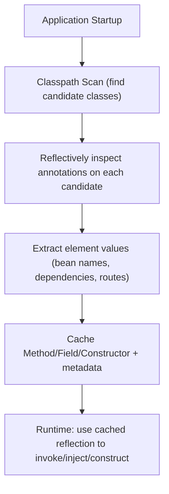
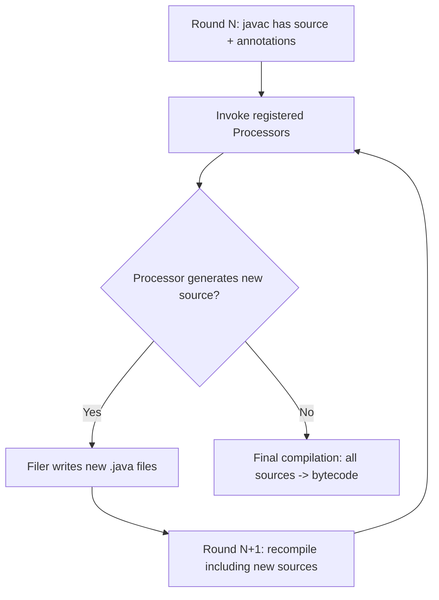

# 15. Annotations

## Built-in

### Theory

**Core Concepts**: Java ships a set of standard annotations in `java.lang` (`@Override`, `@Deprecated`, `@SuppressWarnings`, `@SafeVarargs`, `@FunctionalInterface`) and `java.lang.annotation` (the meta-annotations covered separately) that the compiler and/or JVM understand and act upon without any external framework, representing the language's own built-in use of the annotation mechanism.

**Internal Working**: Each built-in annotation has a specific retention policy matched to its purpose — `@Override`, `@SuppressWarnings`, and `@SafeVarargs` are `SOURCE`-retained (compiler-only, discarded after compilation), while `@Deprecated` is `RUNTIME`-retained (so reflection and tooling can detect deprecated APIs at runtime, e.g., IDEs and API-usage-scanning tools), and `@FunctionalInterface` is `RUNTIME`-retained but purely documentary/validating at compile time.

**When to Use It**: `@Override` on every method intended to override/implement a supertype/interface method (safety net against typos or signature drift); `@Deprecated` (paired with the `@deprecated` Javadoc tag) to mark APIs scheduled for removal/replacement; `@SuppressWarnings` narrowly scoped to suppress specific, justified compiler warnings; `@SafeVarargs` on `final`/`static`/`private` varargs methods that are provably safe from heap pollution; `@FunctionalInterface` on any interface intended for lambda/method-reference use.

**Advantages**: Catch real bugs at compile time (`@Override` catches signature mismatches that would otherwise silently create an unrelated overload instead of an override); communicate intent clearly to other developers and tooling; `@FunctionalInterface` locks an interface's single-abstract-method contract, preventing accidental addition of a second abstract method that would break lambda compatibility.

**Limitations**: These annotations don't change runtime behavior (except `@Deprecated`'s reflective visibility, which itself has no behavioral effect, only informational value plus a compiler warning at use sites); over-broad `@SuppressWarnings` (e.g., suppressing at the class level instead of the specific statement) can hide genuinely important warnings elsewhere in the same scope.

### Internal Working

**Step-by-Step Explanation**:
1. `@Override`: purely a compile-time check — `javac` verifies the annotated method actually overrides/implements a method from a supertype or interface with a compatible signature; if it doesn't (e.g., due to a typo in the method name or a parameter-type mismatch), compilation fails with an error, catching what would otherwise be a silent, hard-to-detect overloading bug.
2. `@Deprecated`: recorded with `RUNTIME` retention (and additionally as a distinct `Deprecated` attribute in the class file predating the annotation itself, for backward compatibility with pre-annotation deprecation marking) — the compiler emits a warning at every *use site* of a `@Deprecated`-marked API, and reflection can query `isAnnotationPresent(Deprecated.class)` to detect deprecated members at runtime (used by API-linting/migration tools). Since Java 9, `@Deprecated` gained `since` and `forRemoval` elements for finer-grained deprecation lifecycle tracking.
3. `@SuppressWarnings("...")`: purely compile-time — instructs `javac` to suppress specific categories of warnings (e.g., `"unchecked"`, `"deprecation"`, `"rawtypes"`) within the annotated element's scope; the exact set of recognized warning names isn't formally standardized across compilers but is broadly consistent for `javac`.
4. `@SafeVarargs`: compile-time-only — asserts to the compiler that a varargs method with a generic varargs parameter (e.g., `T... args`) does not perform unsafe operations on the underlying array (like storing an incompatible type into it), suppressing the "unchecked generic array creation" warning at call sites; usable only on `static`, `final`, `private` (Java 9+), or constructor methods, since only those can't be overridden in a way that would violate the safety guarantee.
5. `@FunctionalInterface`: compile-time-only — `javac` verifies the annotated interface has exactly one abstract method (default/static/private interface methods don't count), failing compilation if a second abstract method is added, protecting the interface's suitability as a lambda/method-reference target.

**Memory Layout**: Not directly applicable — these are metadata annotations with no runtime object-layout impact; only `@Deprecated`'s attribute presence occupies a small amount of Metaspace-resident class-file metadata.

**Diagrams**:
```
@Override        -> compile-time signature check only (SOURCE retention)
@SuppressWarnings -> compile-time warning suppression only (SOURCE retention)
@SafeVarargs      -> compile-time unchecked-warning suppression only (SOURCE retention)
@FunctionalInterface -> compile-time single-abstract-method validation (RUNTIME retention, rarely queried)
@Deprecated       -> RUNTIME retention: reflective tools + compiler use-site warnings
```

**JVM Behaviour**: None of the compiler-only built-in annotations affect generated bytecode or JIT behavior at all — they exist purely to shift certain classes of bugs/warnings earlier (to compile time) rather than leaving them as runtime surprises; `@Deprecated`'s runtime visibility is purely informational and has zero effect on method dispatch, JIT compilation, or class loading.

### Interview Questions

**Basic**
1. What does `@Override` actually verify, and when does compilation fail because of it?
2. What's the retention policy of `@Override` versus `@Deprecated`, and why does that difference matter?

**Intermediate**
1. What restrictions apply to where `@SafeVarargs` can be used, and why?
2. What are the `since` and `forRemoval` elements added to `@Deprecated` in Java 9?

**Advanced**
1. Why does `@FunctionalInterface` need `RUNTIME` retention if its validation happens entirely at compile time?

**Scenario-based**
1. A teammate removes `@Override` from a method because "it's just documentation." Explain why this is a meaningful risk, using a concrete example.

### Detailed Answers

1. **What `@Override` verifies**: It instructs `javac` to confirm the annotated method genuinely overrides (or implements) a method declared in a supertype or interface with a matching signature (name, parameter types, and a covariant-compatible return type). Compilation fails if no such supertype/interface method exists — this most commonly catches accidental "overloads" created by a typo'd method name or subtly mismatched parameter types, which without the annotation would silently compile as an unrelated new method rather than failing loudly.

2. **Retention policy difference**: `@Override` is `SOURCE`-retained (pure compiler check, discarded after compilation, since nothing at runtime needs to know a method was marked as an override). `@Deprecated` is `RUNTIME`-retained specifically so that tools operating on compiled bytecode or via reflection (IDEs performing "find deprecated API usage," runtime API-governance/migration scanners) can programmatically detect deprecation status without access to source code — the difference reflects that one is purely a compile-time developer aid, while the other has legitimate runtime/tooling consumers.

3. **`@SafeVarargs` restrictions**: It's only permitted on methods that are `static`, `final`, `private` (allowed since Java 9), or constructors — i.e., methods that cannot be overridden. This restriction exists because the annotation's safety guarantee (the method doesn't perform unsafe writes into the generic varargs array, which could otherwise cause heap pollution/`ClassCastException`s elsewhere) is a property of that specific method body; if the method were overridable, a subclass could override it with unsafe behavior while still "inheriting" the safety annotation's suppression of the compiler warning, defeating the guarantee's purpose.

4. **Java 9 `@Deprecated` enhancements**: `since` (a `String` element) documents which version introduced the deprecation, useful for tracking deprecation timelines across a large API surface. `forRemoval` (a `boolean` element) explicitly signals whether the API is planned for actual removal in a future release (as opposed to being deprecated but likely to remain indefinitely for compatibility) — `javac` emits a stronger warning for `forRemoval = true` usages, helping consumers correctly prioritize which deprecated APIs need urgent migration versus which can be deprioritized.

5. **Why `@FunctionalInterface` needs `RUNTIME` retention**: Although its primary validation (single-abstract-method check) happens entirely at compile time, `RUNTIME` retention allows reflective tools, IDEs, and documentation generators to programmatically identify which interfaces are intended as functional interfaces without re-deriving that fact by re-parsing the interface's method set themselves — a convenience and API-discoverability benefit that a `SOURCE`-only retention would preclude for anything operating purely on compiled artifacts.

6. **Removing `@Override` risk scenario**: Without `@Override`, if a subclass method intended to override `toString()` were accidentally declared as `toString(int)` or `tostring()` (typo) or with a subtly wrong parameter type, the compiler would happily accept it as a brand-new, unrelated overloaded/renamed method rather than flagging the mismatch — the original supertype method remains un-overridden, meaning polymorphic dispatch silently continues calling the *original* (unintended) implementation everywhere the object is used via its supertype reference, a bug that can go undetected for a long time since the code compiles and often even partially "works" until the specific override-dependent behavior is exercised. `@Override` converts this into an immediate, loud compile-time error.

### Code Examples

```java
import java.util.ArrayList;
import java.util.List;

public class BuiltInAnnotationsDemo {

    static class Shape {
        public String describe() { return "generic shape"; }
    }

    static class Circle extends Shape {
        @Override // catches typos/signature drift at compile time — try renaming to "descirbe"
        public String describe() { return "circle"; }
    }

    @Deprecated(since = "2.0", forRemoval = true)
    static void legacyCalculate() {
        System.out.println("legacy calculation path");
    }

    @SafeVarargs // only legal on static/final/private methods/constructors
    static <T> List<T> listOf(T... items) {
        List<T> result = new ArrayList<>();
        for (T item : items) result.add(item); // no unsafe writes into the varargs array
        return result;
    }

    @SuppressWarnings("deprecation") // narrowly scoped suppression, justified by migration timeline
    public static void main(String[] args) {
        Shape s = new Circle();
        System.out.println(s.describe()); // "circle" — correct override dispatch

        legacyCalculate(); // would normally warn; suppressed here deliberately

        List<String> names = listOf("Ada", "Grace", "Katherine");
        System.out.println(names);
    }
}
```

## Custom

### Theory

**Core Concepts**: Custom annotations are user-defined annotation types declared with `@interface`, optionally carrying elements (annotation "members," which look like abstract methods but are actually typed configuration slots with optional `default` values). They're the foundation of virtually every declarative Java framework feature (`@Entity`, `@Autowired`, `@Test`, `@RequestMapping`, etc.).

**Internal Working**: A custom annotation type is compiled into an actual interface bytecode-wise (implicitly extending `java.lang.annotation.Annotation`), with each declared element compiled as an abstract method; annotation usages store their element values as structured data in the class file's annotation attributes (subject to the type's meta-annotation-declared retention policy).

**When to Use It**: Whenever you want to attach structured, declarative metadata to code elements (classes, methods, fields, parameters) that either your own reflection-based logic, a build-time annotation processor, or a third-party framework will act upon — replacing what would otherwise require verbose XML configuration or repetitive boilerplate marker interfaces.

**Advantages**: Keeps metadata co-located with the code it describes (better locality/discoverability than external configuration files); strongly typed (annotation elements have declared types, validated at compile time, unlike loosely-typed string-keyed config maps); supports default values, reducing boilerplate at annotation use sites.

**Limitations**: Annotation elements can only be of a restricted set of types — primitives, `String`, `Class`, enums, other annotations, or arrays of these (notably, arbitrary objects and generics are *not* allowed as element types); annotations cannot express complex conditional logic themselves (they're pure declarative data, with all actual behavior implemented externally in whatever reads them); overuse can lead to "magic" behavior that's hard to trace without deep framework knowledge (the classic trade-off of declarative vs. imperative code).

### Internal Working

**Step-by-Step Explanation**:
1. `@interface MyAnnotation { String value(); int priority() default 0; }` compiles to an actual class-file-level interface extending `java.lang.annotation.Annotation`, with `value()` and `priority()` as abstract methods (the `default 0` becomes part of the annotation's metadata, used when generating the runtime proxy for usages that omit that element).
2. When a class/method/field is annotated `@MyAnnotation("x")`, `javac` records this in the appropriate `RuntimeVisibleAnnotations` (or `RuntimeInvisibleAnnotations`/nothing, per the type's own `@Retention`) attribute of that element's class-file entry, encoding the annotation type and each explicitly-provided (or defaulted) element value.
3. At runtime, `getAnnotation(MyAnnotation.class)` parses that attribute and generates a dynamic proxy implementing the `MyAnnotation` interface (via the same mechanism underlying `java.lang.reflect.Proxy`), whose `value()`/`priority()` method implementations simply return the specific values recorded for that usage.
4. Annotations themselves also get sensible auto-generated `equals()`/`hashCode()`/`toString()` semantics per the `Annotation` interface's documented contract (two annotation instances of the same type with equal element values are `.equals()`), implemented as part of the generated proxy's behavior.

**Memory Layout**: Annotation type metadata (like any class) resides in Metaspace; per-usage element-value data is stored compactly in the class file's annotation attributes (referencing the constant pool for literal values), and materialized proxy instances (when queried reflectively) are ordinary, typically short-lived or JDK-cached heap objects.

**Diagrams**:
```
@interface Retryable {
    int maxAttempts() default 3;
    Class<? extends Exception>[] retryOn() default {};
}

@Retryable(maxAttempts = 5, retryOn = {java.io.IOException.class})
void fetchRemoteData() { ... }

Class file attribute (conceptual):
RuntimeVisibleAnnotations:
  Retryable(maxAttempts=5, retryOn=[IOException.class])
```

**JVM Behaviour**: Custom annotations impose zero runtime overhead unless something actually queries them reflectively (or an annotation processor consumes them at compile time) — an annotated-but-never-inspected class behaves identically, performance-wise, to an unannotated one, since the annotation data is purely passive metadata sitting in the class file until explicitly read.

### Interview Questions

**Basic**
1. What keyword declares a custom annotation type, and what does it implicitly extend?
2. What types can an annotation element have?

**Intermediate**
1. How do you provide a default value for an annotation element, and what happens if a required (no-default) element is omitted at a usage site?
2. Why can't annotation elements be arbitrary generic types?

**Advanced**
1. How does the JVM/JDK actually produce a usable, callable object when you call `getAnnotation()`, given that `@interface` types have no explicit implementation?

**Scenario-based**
1. You're designing a `@Retryable(maxAttempts = 3, retryOn = {IOException.class})` annotation for a resilience framework. Discuss the design considerations for its element types and defaults.

### Detailed Answers

1. **Declaration keyword**: `@interface`. It implicitly compiles to a type extending `java.lang.annotation.Annotation`, meaning every custom annotation automatically inherits that interface's contract (including documented `equals`/`hashCode`/`toString`/`annotationType()` semantics), even though you never write `extends Annotation` explicitly — the language forbids explicit extension since the compiler synthesizes this relationship itself.

2. **Allowed element types**: Primitive types (`int`, `boolean`, etc.), `String`, `Class` (or `Class<? extends SomeType>`), enum types, other annotation types (nested annotations), and one-dimensional arrays of any of the preceding — notably excluding arbitrary reference types, generics (beyond bounded `Class<?>` references), and multi-dimensional arrays.

3. **Default values and omission**: A `default` clause after an element's declaration (`int priority() default 0;`) supplies the value used whenever a usage site doesn't explicitly specify that element. If an element has no default and a usage omits it, compilation fails with an error requiring that element to be explicitly provided — annotations enforce this "required unless defaulted" contract at compile time, unlike, say, an optional map key that would simply be absent at runtime.

4. **Why not arbitrary generics**: Annotation element values must be representable as compile-time constants storable directly in the class file's constant pool / annotation attribute structure (so they can be fully resolved without running arbitrary code) — arbitrary generic types could reference type parameters not resolvable at compile time in this constant, self-contained way, and arbitrary object element values would require object construction/serialization logic the annotation attribute format doesn't support; restricting to primitives/String/Class/enum/nested-annotation/arrays keeps every element value expressible as pure, self-contained, compile-time-resolvable data.

5. **How `getAnnotation()` produces a callable object**: Since the annotation type is compiled as an interface (with element declarations becoming abstract methods), the JDK's reflection implementation dynamically generates (via the same proxy-generation infrastructure as `java.lang.reflect.Proxy`) a concrete implementation class at the moment it's first requested, whose methods simply return the exact values that were encoded for that particular annotated element in the class file — you never write or see this generated implementation class directly, but it's a genuine, loaded class satisfying the annotation interface, not a special JVM-magic value.

6. **`@Retryable` design scenario**: `maxAttempts` as a primitive `int` with a sensible `default 3` keeps the common case terse (`@Retryable` alone works) while allowing overriding when needed; `retryOn` as `Class<? extends Exception>[]` (defaulting to an empty array, conventionally interpreted by the consuming framework as "retry on any exception" or "retry on none," a decision that must be clearly documented) lets callers specify exactly which exception types should trigger a retry, using `Class` references rather than, say, `String` class names, since `Class` element values are type-checked at compile time (catching typos immediately) versus a string that would only fail at runtime reflection time if misspelled.

### Code Examples

```java
import java.lang.annotation.ElementType;
import java.lang.annotation.Retention;
import java.lang.annotation.RetentionPolicy;
import java.lang.annotation.Target;
import java.io.IOException;

public class CustomAnnotationDemo {

    @Retention(RetentionPolicy.RUNTIME)
    @Target(ElementType.METHOD)
    @interface Retryable {
        int maxAttempts() default 3;
        Class<? extends Exception>[] retryOn() default {};
    }

    static class RemoteClient {
        @Retryable(maxAttempts = 5, retryOn = {IOException.class})
        void fetchRemoteData() throws IOException {
            throw new IOException("simulated transient network failure");
        }
    }

    public static void main(String[] args) throws Exception {
        var method = RemoteClient.class.getDeclaredMethod("fetchRemoteData");
        Retryable retryable = method.getAnnotation(Retryable.class);

        System.out.println("Max attempts configured: " + retryable.maxAttempts());
        for (Class<? extends Exception> ex : retryable.retryOn()) {
            System.out.println("Will retry on: " + ex.getSimpleName());
        }
    }
}
```

## Meta Annotations

### Theory

**Core Concepts**: Meta-annotations are annotations whose target is other annotation type declarations, used to configure how a custom annotation itself behaves — chiefly `@Retention` (how long the annotation is retained: SOURCE/CLASS/RUNTIME), `@Target` (which kinds of program elements it may annotate), `@Inherited` (whether subclasses inherit a class-level annotation), `@Documented` (whether it appears in generated Javadoc), and `@Repeatable` (Java 8+, allowing multiple instances of the same annotation on one element).

**Internal Working**: Each meta-annotation is itself just an ordinary annotation type (with `RUNTIME` retention) defined in `java.lang.annotation`, applied to `@interface` declarations; the compiler reads these meta-annotations to enforce/encode the corresponding constraints (valid targets, retention level) directly into how the custom annotation type and its usages are compiled.

**When to Use It**: `@Retention(RUNTIME)` whenever reflection needs to see the annotation; `@Target` to restrict/document valid usage locations and catch misapplication at compile time; `@Inherited` for class-level annotations meant to propagate down a class hierarchy automatically (note: does NOT apply to interfaces or methods, only classes); `@Repeatable` when a single element may need multiple instances of the same conceptual annotation (e.g., multiple `@Schedule` cron triggers on one method).

**Advantages**: Gives annotation designers precise control over their annotation's applicability and lifecycle without writing any enforcement code themselves — `javac` and the reflection API handle it uniformly based on these declarative meta-annotation settings.

**Limitations**: `@Inherited` only affects class-level annotation inheritance via `getAnnotation()`-style superclass lookup, and explicitly does *not* apply to interfaces (an implementing class does not "inherit" an interface's annotations this way) or to methods/fields; `@Repeatable` requires an additional explicit "container" annotation type to be declared to hold the repeated instances, adding a small amount of boilerplate to set up.

### Internal Working

**Step-by-Step Explanation**:
1. `@Retention(RetentionPolicy.X)` on a custom `@interface` tells `javac` which class-file attribute (if any) to emit for usages of that annotation type: `SOURCE` emits nothing (discarded after compilation), `CLASS` emits a `RuntimeInvisibleAnnotations` entry (present in bytecode but reflection-invisible, the implicit default if `@Retention` is omitted), `RUNTIME` emits a `RuntimeVisibleAnnotations` entry (reflection-visible).
2. `@Target({ElementType.METHOD, ElementType.FIELD, ...})` restricts which kinds of declarations the annotation may legally be placed on; `javac` rejects (compile error) any usage on a disallowed element kind — omitting `@Target` entirely permits the annotation almost anywhere (all element types).
3. `@Inherited` on a custom annotation type means that if a class `A` is annotated and class `B extends A` doesn't repeat the annotation, then `B.class.getAnnotation(TheAnnotation.class)` will still find it by walking up the superclass chain — this lookup logic is implemented within `Class.getAnnotation()` itself, checking the `@Inherited` meta-annotation on the queried annotation type.
4. `@Repeatable(ContainerAnnotation.class)` (Java 8+) lets a single element carry multiple `@X` usages; the compiler actually stores them by implicitly wrapping them in the declared container annotation (`ContainerAnnotation` holding a `TheAnnotation[] value()`), and reflective APIs like `getAnnotationsByType()` transparently unwrap this container to present the repeated annotations as if they were a natural array, hiding the container-wrapping mechanism from most callers.

**Memory Layout**: Not directly applicable — meta-annotations only influence class-file attribute generation and compiler validation; no distinct runtime memory structures beyond ordinary annotation-attribute storage already discussed.

**Diagrams**:
```
@Retention(RUNTIME) @Target(METHOD) @Repeatable(Schedules.class)
@interface Schedule { String cron(); }

@interface Schedules { Schedule[] value(); } // required container for @Repeatable

Usage:
@Schedule(cron = "0 0 * * *")
@Schedule(cron = "0 12 * * *")
void job() { ... }

Compiled as (transparently):
@Schedules({ @Schedule(cron="0 0 * * *"), @Schedule(cron="0 12 * * *") })
```

**JVM Behaviour**: None of this affects bytecode execution or JIT behavior — meta-annotations are entirely a compile-time-enforcement and class-file-metadata-shaping mechanism, with reflective consumption (`getAnnotationsByType`, inherited lookup) being ordinary library-level logic layered on top of the stored metadata, not special JVM instructions.

### Interview Questions

**Basic**
1. What does `@Retention(RetentionPolicy.RUNTIME)` control?
2. What is the default retention policy if `@Retention` is omitted?

**Intermediate**
1. Does `@Inherited` cause annotation inheritance across interfaces or for methods/fields?
2. What extra annotation type must you declare to use `@Repeatable`?

**Advanced**
1. How does `Class.getAnnotation()` implement `@Inherited` lookup internally?

**Scenario-based**
1. You mark a custom annotation `@Inherited` and apply it to an interface, expecting implementing classes to "inherit" it reflectively — but `getAnnotation()` on the implementing class returns `null`. Explain why.

### Detailed Answers

1. **What `@Retention(RUNTIME)` controls**: It instructs `javac` to retain usages of the annotated custom annotation type all the way into the compiled class file as a `RuntimeVisibleAnnotations` attribute entry, and further guarantees the JVM/reflection API keeps this data available for runtime queries via `getAnnotation()`/`getAnnotations()` — without `RUNTIME` retention, reflective code cannot see the annotation at all, regardless of how it's used at the language level.

2. **Default retention**: `RetentionPolicy.CLASS` — if `@Retention` is omitted entirely, the annotation is retained in the compiled bytecode (as `RuntimeInvisibleAnnotations`) but is not visible to runtime reflection, only to tools that directly parse class files (like some bytecode-manipulation libraries or certain annotation processors operating in later rounds).

3. **`@Inherited` scope limits**: No — `@Inherited` explicitly only affects annotations placed on *classes*, propagating them to direct/indirect *subclasses* via the standard superclass chain lookup in `getAnnotation()`. It explicitly does not apply when the annotated type is an interface (implementing classes do not inherit interface-level annotations this way) nor to method or field annotations (those are never "inherited" by overriding methods or shadowing fields regardless of this meta-annotation) — a frequently-tested distinction in interviews.

4. **`@Repeatable` container requirement**: You must declare a separate "containing" annotation type with a `value()` element that's an array of the repeatable annotation type (e.g., `@interface Schedules { Schedule[] value(); }`), and reference that container type in the repeatable annotation's own `@Repeatable(Schedules.class)` meta-annotation — the compiler uses this container to actually store multiple usages under the hood, even though calling code can mostly ignore the container's existence when using `getAnnotationsByType()`.

5. **`getAnnotation()` inherited-lookup implementation**: When queried for an annotation type that is itself meta-annotated `@Inherited`, `Class.getAnnotation()` first checks the class itself for a direct usage; if absent, it walks up the `getSuperclass()` chain (not interfaces), checking each ancestor class in turn for a direct usage of that annotation type, returning the first one found (or `null` if none exists anywhere up the chain) — this walk is implemented directly in the JDK's `Class`/annotation-parsing internals, conditioned specifically on the target annotation type carrying `@Inherited` itself (an annotation without `@Inherited` never triggers this superclass walk at all).

6. **Interface `@Inherited` scenario**: The bug is a fundamental misunderstanding of `@Inherited`'s documented scope — it applies only to class-to-subclass inheritance via `getSuperclass()`, and explicitly does *not* apply to interface-to-implementing-class relationships. An annotation placed on an interface is never "inherited" (in this reflective sense) by any class that implements that interface, regardless of the `@Inherited` meta-annotation being present — to detect such interface-level annotations on an implementing class, you'd need to manually walk `getInterfaces()` (and their super-interfaces) yourself and check each one directly, since the JDK provides no built-in reflective inheritance mechanism for interface annotations.

### Code Examples

```java
import java.lang.annotation.*;

public class MetaAnnotationsDemo {

    @Retention(RetentionPolicy.RUNTIME)
    @Target(ElementType.METHOD)
    @Repeatable(Schedules.class)
    @interface Schedule {
        String cron();
    }

    @Retention(RetentionPolicy.RUNTIME)
    @Target(ElementType.METHOD)
    @interface Schedules {
        Schedule[] value(); // required container for @Repeatable
    }

    @Retention(RetentionPolicy.RUNTIME)
    @Target(ElementType.TYPE)
    @Inherited
    @interface AuditedComponent { }

    @AuditedComponent
    static class BaseService { }

    static class OrderService extends BaseService {
        @Schedule(cron = "0 0 * * *")
        @Schedule(cron = "0 12 * * *")
        void runDailyReconciliation() { }
    }

    public static void main(String[] args) throws Exception {
        // @Inherited: subclass reflectively "sees" the superclass's class-level annotation
        System.out.println(OrderService.class.getAnnotation(AuditedComponent.class));

        // @Repeatable: transparently unwrapped into an array despite the Schedules container
        var method = OrderService.class.getDeclaredMethod("runDailyReconciliation");
        for (Schedule schedule : method.getAnnotationsByType(Schedule.class)) {
            System.out.println("Cron trigger: " + schedule.cron());
        }
    }
}
```

## Runtime Processing

### Theory

**Core Concepts**: "Runtime processing" refers to the pattern of a framework using reflection at application runtime to discover annotated classes/methods/fields and act on that metadata dynamically — as opposed to acting on annotations at compile time (annotation processing/APT). This is how Spring's component scanning, JUnit's test discovery, and Jackson's field-based (de)serialization all fundamentally operate.

**Internal Working**: A runtime annotation processor typically: (1) obtains a set of candidate classes (via classpath scanning, explicit registration, or a pre-built index), (2) reflectively inspects each for annotations of interest via `AnnotatedElement` methods, (3) reads annotation element values to configure some behavior, and (4) uses further reflection (`Method.invoke`, `Field.set`, `Constructor.newInstance`) to actually apply that behavior (invoke methods, inject values, construct objects).

**When to Use It**: When the framework's behavior genuinely needs to adapt to runtime information unavailable at compile time (e.g., which specific beans exist in a given running application context, conditional bean creation based on runtime configuration/profiles) — this flexibility is exactly why most dependency-injection and testing frameworks use runtime processing despite its performance cost relative to compile-time code generation.

**Advantages**: Maximum flexibility — logic can depend on runtime-only information (system properties, active profiles, dynamically loaded plugins); no separate build step required beyond normal compilation; easier to iterate on during development (no annotation-processor recompilation step needed to see metadata changes take effect).

**Limitations**: Startup cost — classpath scanning and reflective analysis at application boot can be a meaningful contributor to startup latency for large applications (a major motivation behind ahead-of-time-compilation-friendly frameworks like Spring's Native/GraalVM support, which shift much of this analysis to build time); errors in annotation configuration (e.g., a typo in a referenced bean name) surface only at runtime, not compile time, unlike compile-time-validated annotation processing.

### Internal Working

**Step-by-Step Explanation**:
1. Candidate discovery: frameworks typically scan the classpath (via mechanisms like ASM-based lightweight bytecode scanning to avoid fully loading every class just to check annotations, or via a pre-built index generated at build time as an optimization) to build a list of classes potentially relevant to a given annotation type.
2. Reflective inspection: for each candidate, the framework calls `isAnnotationPresent`/`getAnnotation` (as covered under "Annotations via Reflection") on the class itself and/or its methods/fields/constructors to extract relevant configuration metadata.
3. Metadata-driven action: using the extracted annotation element values (e.g., a bean name, a required dependency type, a test method name), the framework performs the actual runtime action — constructing an object (`Constructor.newInstance`), injecting a dependency (`Field.set`), invoking a lifecycle/test method (`Method.invoke`), or registering a route/handler mapping.
4. Caching: because this reflective discovery/inspection process is relatively expensive, most frameworks perform it once at startup (or on first access) and cache the resulting metadata/`Method`/`Field` objects for the application's remaining lifetime, avoiding repeating the expensive scan-and-inspect cycle on every subsequent use.

**Memory Layout**: Not directly applicable beyond the ordinary heap cost of caching discovered `Method`/`Field`/`Constructor` reflective objects and associated framework-internal metadata structures (bean definitions, route tables, etc.) for the application's lifetime.

**Diagrams**:


**JVM Behaviour**: The classpath-scanning phase itself often involves loading many classes solely to inspect their annotations, which contributes real classloading (Metaspace population) and reflective-inspection cost at startup — a well-known JVM-application-startup-time concern that's a primary driver behind newer approaches (GraalVM native image, Spring AOT processing) that move this work to build time entirely, producing a startup-time-optimized artifact at the cost of build-time complexity and reduced runtime dynamism.

### Interview Questions

**Basic**
1. Give an example of a framework feature that relies on runtime annotation processing.
2. Why is startup time often slower in frameworks that rely heavily on runtime classpath scanning?

**Intermediate**
1. How do frameworks typically mitigate the cost of repeated reflective annotation inspection?
2. What's the fundamental trade-off between runtime processing and compile-time annotation processing?

**Advanced**
1. How does classpath scanning actually work under the hood without fully initializing every scanned class?

**Scenario-based**
1. Your Spring Boot application's startup time has grown significantly as the codebase expanded, and profiling shows a large portion of startup time in classpath scanning/bean definition processing. What architectural options would you consider?

### Detailed Answers

1. **Example of runtime annotation processing**: Spring's component scanning (`@ComponentScan` discovering `@Component`/`@Service`/`@Repository`-annotated classes at application startup, reflectively inspecting constructors for `@Autowired` dependencies to wire up the application context) is a canonical example; JUnit discovering and invoking `@Test`-annotated methods, and Jackson reflectively discovering `@JsonProperty`-annotated fields for (de)serialization, are others.

2. **Why classpath scanning slows startup**: Scanning potentially requires loading or at least parsing (via bytecode-scanning libraries) every candidate class file to check for relevant annotations — for large applications with many classes/dependencies, this represents a genuinely large amount of I/O (reading class files), parsing, and (for classes that must be fully loaded rather than just bytecode-scanned) classloading/linking work concentrated entirely at application boot, directly extending time-to-first-request-served.

3. **Mitigating repeated inspection cost**: Frameworks perform the expensive discovery/inspection pass once (typically at startup) and cache the resulting metadata and reflective objects (`Method`, `Field`, `Constructor` references, bean definitions, route tables) for reuse throughout the application's remaining lifetime — later requests/operations consult this cached metadata rather than re-scanning/re-inspecting from scratch, converting an O(runtime calls) cost into an O(1) startup cost plus fast cached lookups thereafter.

4. **Fundamental trade-off**: Runtime processing offers maximum flexibility (behavior can depend on genuinely runtime-only information like active profiles, conditionally-present classes/beans, dynamically loaded plugins) at the cost of startup latency and only-discoverable-at-runtime configuration errors. Compile-time annotation processing (APT) shifts that discovery/validation work to the build step, producing faster-starting artifacts and earlier error detection, but sacrifices the ability to react to information that's genuinely unavailable until the application actually runs.

5. **Classpath scanning internals**: Rather than fully loading (via a `ClassLoader`, which triggers full verification and potential static initialization) every candidate class just to inspect its annotations, frameworks commonly use lightweight bytecode-parsing libraries (e.g., ASM, or Spring's own `ASM`-based `MetadataReader`) that read and parse just enough of the raw `.class` file structure (the constant pool and annotation attributes specifically) to answer "does this class have annotation X" without triggering full class loading/linking/initialization — this is significantly cheaper per-candidate than reflectively loading every class purely to check annotations, especially when the vast majority of scanned classes won't actually match the annotations of interest.

6. **Spring Boot startup optimization scenario**: Reasonable options include: (1) narrowing `@ComponentScan` base packages to avoid scanning irrelevant parts of the classpath/dependencies; (2) enabling Spring's build-time indexing (`spring-context-indexer`), which generates a `META-INF/spring.components` index at compile time listing annotated classes, letting the runtime skip full classpath scanning in favor of reading this pre-built index; (3) evaluating Spring AOT processing / GraalVM native image compilation, which performs the bulk of reflective bean-definition analysis at build time, producing a startup-optimized (and potentially natively-compiled) artifact at the cost of some runtime dynamism and a more complex/slower build pipeline; (4) lazy initialization of beans not needed for the first request, deferring their construction cost past the initial startup measurement.

### Code Examples

```java
import java.lang.annotation.*;
import java.lang.reflect.*;
import java.util.*;

public class RuntimeProcessingDemo {

    @Retention(RetentionPolicy.RUNTIME)
    @Target(ElementType.TYPE)
    @interface Component { String value() default ""; }

    @Retention(RetentionPolicy.RUNTIME)
    @Target(ElementType.FIELD)
    @interface Inject { }

    @Component("orderRepository")
    static class OrderRepository {
        void save() { System.out.println("Order saved"); }
    }

    @Component("orderService")
    static class OrderService {
        @Inject
        private OrderRepository repository;

        void placeOrder() {
            repository.save();
        }
    }

    // Minimal illustrative container performing runtime annotation-driven wiring
    static Object instantiateAndWire(Class<?> componentClass, Map<Class<?>, Object> registry)
            throws Exception {
        Constructor<?> ctor = componentClass.getDeclaredConstructor();
        Object instance = ctor.newInstance();

        for (Field field : componentClass.getDeclaredFields()) {
            if (field.isAnnotationPresent(Inject.class)) {
                Object dependency = registry.get(field.getType());
                field.setAccessible(true);
                field.set(instance, dependency);
            }
        }
        return instance;
    }

    public static void main(String[] args) throws Exception {
        Map<Class<?>, Object> registry = new HashMap<>();
        registry.put(OrderRepository.class, instantiateAndWire(OrderRepository.class, registry));
        OrderService service = (OrderService) instantiateAndWire(OrderService.class, registry);

        service.placeOrder(); // dependency was wired purely via runtime annotation inspection
    }
}
```

## Annotation Processing (APT) *(new)*

### Theory

**Core Concepts**: Annotation Processing (formally the `javax.annotation.processing` API, historically called "APT" for the older standalone Annotation Processing Tool that predated its integration into `javac`) lets you hook into the *compilation* process itself: a `Processor` implementation is invoked by `javac` during compilation to inspect annotated source elements and generate new source files (or resources), entirely at build time, before bytecode even exists.

**Internal Working**: `javac` compilation proceeds in rounds; after each round, it invokes any registered annotation processors (discovered via `META-INF/services/javax.annotation.processing.Processor` or `@AutoService`) with a `RoundEnvironment` describing annotated elements found so far, letting processors generate additional source files via a `Filer`, which then participate in a subsequent compilation round — this repeats until no processor generates further new sources.

**When to Use It**: Compile-time code generation to avoid runtime reflection cost entirely — Dagger (dependency injection) generating factory classes, Lombok generating boilerplate getters/setters/constructors, MapStruct generating type-mapping implementation classes, Room (Android) generating DAO implementations — all rely on annotation processing to produce ordinary, fully-typed, reflection-free Java source at build time.

**Advantages**: Zero runtime reflection cost for the generated code path (it's just ordinary compiled Java, JIT-optimizable like any other code); compile-time error reporting for misconfigured annotations (a processor can call `Messager.printMessage(ERROR, ...)` to fail the build with a clear message, far preferable to a confusing runtime `NullPointerException` or misbehavior); works well with tools requiring full static analyzability (like GraalVM native-image, which struggles with unpredictable runtime reflection).

**Limitations**: Annotation processors can only *add* new source files/resources — they cannot modify existing source files' AST in place (a deliberate design constraint to keep the compilation model well-defined and avoid processor-ordering chaos; tools like Lombok that appear to "modify" existing classes technically achieve this via non-standard, JDK-internal-API hacks rather than the public annotation processing contract, which is precisely why Lombok has historically been fragile across JDK version upgrades); writing a processor requires working with the somewhat verbose `javax.lang.model` AST API rather than ordinary reflection; build times increase due to the additional compilation rounds.

### Internal Working

**Step-by-Step Explanation**:
1. `javac` discovers registered `Processor` implementations (via the `ServiceLoader` mechanism, reading `META-INF/services/javax.annotation.processing.Processor`, or increasingly via Google's `@AutoService` annotation which itself is an annotation processor generating that service file).
2. For each compilation round, `javac` calls each processor's `process(annotations, roundEnv)` method, passing the set of annotation types the processor declared interest in (via `@SupportedAnnotationTypes` or the `getSupportedAnnotationTypes()` override) and a `RoundEnvironment` exposing all elements annotated with those types found in this round's source set.
3. The processor inspects these elements using the `javax.lang.model.element`/`javax.lang.model.type` AST-like API (representing source structure abstractly, independent of whether it came from source or already-compiled binaries) and, if it needs to generate output, requests a `Writer`/`JavaFileObject` from the provided `Filer` and writes new Java source (or other resource files) to it.
4. Any newly generated source files become part of the input for a subsequent compilation round — `javac` repeats the process-and-generate cycle until a round produces no new files, at which point normal compilation of everything (original + all generated sources) proceeds to bytecode.
5. Processors can report errors/warnings via a `Messager`, which `javac` surfaces as ordinary compiler diagnostics tied to specific source positions, failing the build for `ERROR`-kind messages.

**Memory Layout**: Not directly applicable — annotation processing is purely a build-time, javac-internal activity; it has no runtime memory footprint of its own (only the eventually-compiled generated code has ordinary runtime memory characteristics, identical to hand-written code of the same shape).

**Diagrams**:


**JVM Behaviour**: None directly — this entire mechanism executes inside `javac` before any class files/bytecode exist; its only JVM-relevant effect is indirect, via the *additional, generated source files* that ultimately get compiled into ordinary bytecode subject to normal classloading/JIT behavior like any other code, with the key benefit being that this generated code needs no runtime reflection to do its job (e.g., a Dagger-generated factory class calls `new Foo(dep1, dep2)` directly rather than reflectively).

### Interview Questions

**Basic**
1. What is the fundamental capability an annotation processor has that a runtime-reflection-based framework does not?
2. Name a well-known library that relies on annotation processing for compile-time code generation.

**Intermediate**
1. Can an annotation processor modify an existing source file's contents in place?
2. What triggers a new "round" of annotation processing?

**Advanced**
1. Why is Lombok considered technically fragile/unusual compared to "proper" annotation processors like Dagger or MapStruct?

**Scenario-based**
1. You're deciding between implementing a dependency-injection mechanism via runtime reflection (like classic Spring) versus compile-time annotation processing (like Dagger). What factors would drive the choice, especially considering a deployment target like a serverless function with strict cold-start latency requirements?

### Detailed Answers

1. **Fundamental capability**: An annotation processor can *generate new, ordinary Java source code at build time*, which is then compiled normally — meaning the final runtime artifact contains no reflection at all for that generated logic, just plain, statically-typed, JIT-friendly method calls; a runtime-reflection-based framework, in contrast, must perform its metadata inspection and dynamic dispatch every time the application runs (or at least once per process lifetime at startup), always paying some reflective overhead and always being somewhat opaque to static analysis tools.

2. **Well-known example**: Dagger (compile-time dependency injection, generating factory/component implementation classes with zero runtime reflection) is a canonical example; others include Lombok (generating boilerplate accessors/constructors), MapStruct (generating object-mapping implementation classes), and Room (Android's SQLite ORM, generating DAO implementations).

3. **In-place modification?** No — the standard `javax.annotation.processing` contract only allows generating *new* source files/resources via the `Filer`; it does not support modifying the AST of an already-existing source file in place. This is a deliberate design decision to keep the multi-round compilation model deterministic and avoid processor-ordering conflicts. (Lombok's apparent in-place modification of classes is achieved through non-standard, JDK-internal API access rather than the sanctioned processor contract, which is exactly why it has repeatedly broken across major JDK version upgrades and requires special compiler flags/workarounds on newer JDKs.)

4. **What triggers a new round**: Whenever any processor, during the current round, generates at least one new source file (or resource) via the `Filer`, `javac` schedules another processing round including that newly generated content as part of the source set available for (re-)inspection by all registered processors — this continues iteratively until an entire round completes with no processor generating anything new, signaling processing is complete and final compilation to bytecode can proceed.

5. **Why Lombok is fragile**: "Proper" annotation processors (Dagger, MapStruct) strictly follow the public contract of generating brand-new source files that are then compiled normally alongside the original, unmodified sources. Lombok, however, needs to *modify the existing class* you're annotating (e.g., inject generated getters directly into the same class rather than a separate generated class) — something the standard API doesn't support — so it reaches into `javac`'s internal, explicitly-unsupported implementation classes (the internal AST/`com.sun.tools.javac.*` packages) to mutate the compiler's in-memory representation of your source directly. Because these are internal APIs never intended for external use, they can (and have) changed or become inaccessible across JDK versions (especially post-Java 9's strong module encapsulation), requiring Lombok to release frequent compatibility patches and sometimes requiring explicit `--add-opens`-style JVM flags to keep working on newer JDKs.

6. **DI mechanism choice scenario**: For a serverless function with strict cold-start latency requirements, compile-time annotation processing (Dagger-style) is strongly favored: since there's no runtime classpath scanning or reflective bean-discovery/wiring cost at all (all dependency graphs are resolved and generated as plain constructor-call chains at build time), cold-start time is dramatically reduced compared to a runtime-reflection-heavy framework like classic Spring, which must perform its component scan and bean-graph resolution fresh on every cold start. The trade-off is reduced runtime flexibility (harder to support genuinely dynamic, runtime-conditional wiring decisions) and a somewhat less familiar/more verbose developer experience compared to Spring's implicit, reflection-driven conventions — but for a latency-sensitive, relatively static dependency graph typical of a serverless function, this trade-off strongly favors the compile-time approach (and is precisely why frameworks like Micronaut and Quarkus, explicitly designed for serverless/cloud-native use cases, similarly emphasize compile-time processing over runtime reflection wherever possible).

### Code Examples

```java
// Simplified illustration of a minimal annotation processor (build-time, not runtime code).
// Demonstrates the shape of a real processor like Dagger/MapStruct would follow.

import javax.annotation.processing.*;
import javax.lang.model.SourceVersion;
import javax.lang.model.element.Element;
import javax.lang.model.element.TypeElement;
import javax.tools.Diagnostic;
import java.io.PrintWriter;
import java.util.Set;

@SupportedAnnotationTypes("io.reflectdemo.GenerateFactory")
@SupportedSourceVersion(SourceVersion.RELEASE_17)
public class FactoryGeneratingProcessor extends AbstractProcessor {

    @Override
    public boolean process(Set<? extends javax.lang.model.element.TypeElement> annotations,
                            RoundEnvironment roundEnv) {
        for (Element element : roundEnv.getElementsAnnotatedWith(GenerateFactory.class)) {
            TypeElement typeElement = (TypeElement) element;
            String className = typeElement.getSimpleName().toString();
            String factoryName = className + "Factory";

            try {
                var file = processingEnv.getFiler().createSourceFile(factoryName);
                try (PrintWriter writer = new PrintWriter(file.openWriter())) {
                    // Generates plain Java source with a direct constructor call —
                    // no reflection needed at runtime for the generated factory.
                    writer.println("public class " + factoryName + " {");
                    writer.println("    public static " + className + " create() {");
                    writer.println("        return new " + className + "();");
                    writer.println("    }");
                    writer.println("}");
                }
            } catch (Exception e) {
                processingEnv.getMessager().printMessage(
                        Diagnostic.Kind.ERROR, "Failed to generate factory: " + e.getMessage(), element);
            }
        }
        return true; // claim these annotations
    }
}

@interface GenerateFactory { }
```
