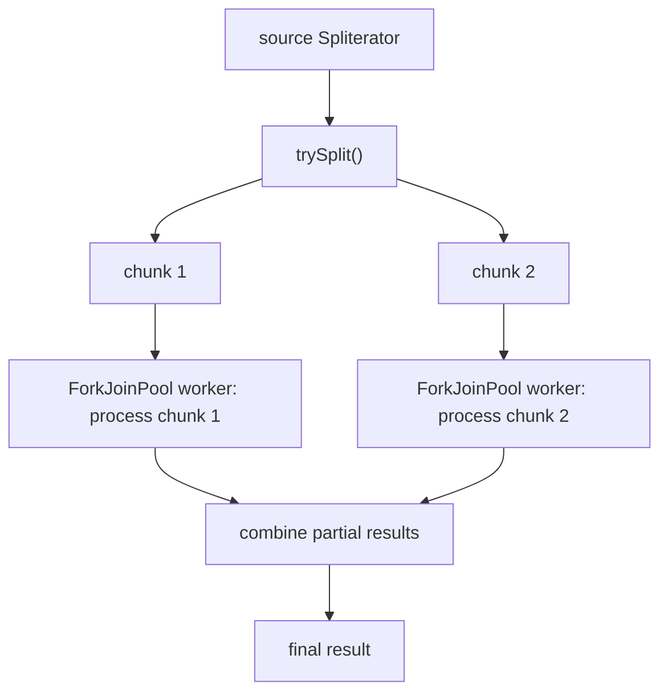

# 17. Streams API

## Stream Creation

### Theory

- **Core Concepts**: A `Stream` is a sequence of elements supporting functional-style, declarative operations computed lazily. Stream creation refers to the various ways to obtain a `Stream` instance: from collections (`Collection.stream()`), arrays (`Arrays.stream()`), static factory methods (`Stream.of()`, `Stream.generate()`, `Stream.iterate()`), primitive specializations (`IntStream.range()`), or I/O sources (`Files.lines()`).
- **Internal Working**: Every stream is backed internally by a `Spliterator` (splittable iterator) that describes how to traverse (and, for parallel streams, how to split) the underlying data source; creating a stream just wraps a data source in a `Spliterator`-backed pipeline head with no traversal happening yet (streams are lazy - nothing executes until a terminal operation is invoked).
- **When to Use It**: Whenever you want to process a sequence of data declaratively - iterating a collection, generating a bounded/unbounded sequence of values, or streaming lines from a file - instead of writing manual loops.
- **Advantages**: Unifies many different data sources (collections, arrays, generators, I/O) behind one consistent, composable API; enables both sequential and parallel execution from the same pipeline definition; integrates with `try-with-resources` for I/O-backed streams that need closing.
- **Limitations**: A `Stream` can only be consumed (traversed via a terminal operation) once - reusing a stream after a terminal operation throws `IllegalStateException`; infinite streams (`Stream.generate`/`Stream.iterate` without a bound) require a `limit()` or short-circuiting terminal operation or they'll run forever; I/O-backed streams (`Files.lines()`) must be closed to release the underlying resource.

### Internal Working

- **Step-by-Step Explanation**: (1) `list.stream()` creates a `Stream` wrapping a `Spliterator` over the list's elements, characterized by properties like `SIZED`, `ORDERED`, `SUBSIZED` depending on the source (a `Spliterator` from an `ArrayList` knows its exact size; one from a `LinkedHashSet` knows ordering but perhaps not efficient splitting). (2) `Stream.of(a, b, c)` wraps the varargs array directly. (3) `Stream.iterate(seed, next)` creates an infinite stream generator applying `next` repeatedly; `Stream.generate(supplier)` calls a `Supplier` indefinitely, useful for random values or constant streams. (4) No actual element processing happens at creation time - the returned `Stream` object is just a pipeline description (a chain of stages) that will be executed only once a terminal operation triggers traversal.
- **Memory Layout**: A stream pipeline object itself is small (a chain of stage descriptors on the heap); it does not eagerly materialize a separate copy of the source data - elements are pulled from the underlying `Spliterator`/source on demand as the pipeline executes (except for stateful intermediate operations like `sorted()` which must buffer).
- **Diagrams**:
```
List<T> ---stream()---> Spliterator<T> ---wrapped by---> Stream<T> (lazy pipeline head)
Stream.of(a,b,c)         --> Spliterator over array
Stream.iterate(0, n->n+1) --> Spliterator generating infinite sequence
Files.lines(path)         --> Spliterator reading lines lazily, must be closed
```
- **JVM Behaviour**: Because nothing executes until a terminal operation, the JIT sees the actual work only when the terminal operation runs the pipeline; lambda expressions passed to `Stream.generate`/`.map()`/etc. are compiled via `invokedynamic`/`LambdaMetafactory` just like any other lambda, and the JIT can often inline small stream pipelines effectively once warmed up, though highly polymorphic pipelines (many different lambda shapes) can hinder inlining.

### Interview Questions

**Basic**
1. Name three different ways to create a `Stream`.
2. Can a `Stream` be reused after a terminal operation has been called on it?

**Intermediate**
3. What is a `Spliterator` and what role does it play in stream creation?
4. What's the difference between `Stream.of()` and `Stream.generate()`?

**Advanced**
5. Why must infinite streams created via `Stream.iterate`/`Stream.generate` always be paired with a bound or short-circuiting operation?

**Scenario-based**
6. You need to stream lines from a potentially very large log file for processing without loading it entirely into memory. How would you create this stream, and what precaution must you take?

### Detailed Answers

1. Common ways: `collection.stream()` (from any `Collection`), `Arrays.stream(array)` or `Stream.of(a, b, c)` (from arrays/varargs), and `Stream.iterate(seed, fn)` / `Stream.generate(supplier)` (programmatic generation); additionally `IntStream.range(0, n)` for primitive numeric ranges and `Files.lines(path)` for reading a file's lines lazily.
2. No - a `Stream` is designed for one-time traversal. Once a terminal operation (`forEach`, `collect`, `reduce`, etc.) has consumed it, attempting to reuse the same `Stream` instance (calling another operation on it) throws `IllegalStateException: stream has already been operated upon or closed`. If you need to traverse the same logical data again, you must create a fresh stream from the source (e.g. call `.stream()` again on the collection).
3. A `Spliterator` ("splittable iterator") is the abstraction streams use internally to traverse elements; unlike a plain `Iterator`, it also supports `trySplit()`, which attempts to partition the remaining elements into two roughly-equal sub-spliterators - this splitting capability is exactly what enables parallel streams to divide work across the ForkJoinPool. Every stream source (collections, arrays, generators, I/O) provides its own `Spliterator` implementation describing how its data can be traversed and split, along with characteristic flags (`SIZED`, `ORDERED`, `DISTINCT`, `SORTED`, etc.) that let the stream pipeline optimize certain operations.
4. `Stream.of(a, b, c, ...)` creates a finite stream from a fixed, known set of elements (effectively wrapping a small array). `Stream.generate(supplier)` instead creates a conceptually infinite stream where each element is produced by repeatedly invoking a `Supplier<T>` with no inherent notion of a fixed size or termination - it must be paired with `.limit(n)` (or another short-circuiting operation) to ever terminate.
5. Because `Stream.iterate`/`Stream.generate` (without a `limit` overload specifying a predicate/bound) produce a logically unbounded sequence - the pipeline has no way of knowing when to stop pulling more elements from the generator. Without a bounding operation (`.limit(n)`) or a short-circuiting terminal operation (`.findFirst()`, `.anyMatch()`, which can stop early once satisfied), a terminal operation like `.forEach()` or `.collect()` that must exhaust the entire stream would attempt to pull an infinite number of elements, running forever (or until an `OutOfMemoryError` from stateful buffering operations if inadvertently combined with something like `.sorted()`).
6. Use `try (Stream<String> lines = Files.lines(path)) { lines.filter(...).forEach(...); }` - `Files.lines()` returns a lazily-populated stream reading the file line-by-line on demand (via an underlying `BufferedReader`), so the whole file is never loaded into memory at once, making it suitable for very large files. The critical precaution is that this stream is backed by an open file handle/reader, so it *must* be used within a `try-with-resources` block (or explicitly `.close()`'d) to ensure the underlying file resource is released even if an exception occurs during processing - forgetting this leaks file descriptors, unlike in-memory stream sources which need no explicit closing.

### Code Examples

```java
import java.util.*;
import java.util.stream.*;
import java.io.IOException;
import java.nio.file.*;

public class StreamCreationDemo {
    public static void main(String[] args) throws IOException {
        // From a collection
        List<String> names = List.of("alice", "bob", "carol");
        Stream<String> fromCollection = names.stream();
        System.out.println(fromCollection.map(String::toUpperCase).toList());

        // From varargs / array
        Stream<Integer> fromValues = Stream.of(1, 2, 3, 4);
        System.out.println(fromValues.mapToInt(Integer::intValue).sum());

        // Bounded generator stream
        List<Long> powersOfTwo = Stream.iterate(1L, n -> n * 2)
                                        .limit(10)
                                        .toList();
        System.out.println(powersOfTwo);

        // Primitive numeric range stream
        int sumOfSquares = IntStream.rangeClosed(1, 5)
                                     .map(n -> n * n)
                                     .sum();
        System.out.println("Sum of squares 1..5: " + sumOfSquares);

        // File-backed stream, must be closed via try-with-resources
        Path tempFile = Files.createTempFile("stream-demo", ".txt");
        Files.write(tempFile, List.of("line one", "line two", "line three"));
        try (Stream<String> lines = Files.lines(tempFile)) {
            long count = lines.filter(l -> l.contains("two")).count();
            System.out.println("Matching lines: " + count);
        } finally {
            Files.deleteIfExists(tempFile);
        }
    }
}
```

## Intermediate Operations

### Theory

- **Core Concepts**: Intermediate operations (`filter`, `map`, `sorted`, `distinct`, `peek`, `flatMap`, `limit`, `skip`, etc.) are lazy transformations that return a new `Stream`, describing additional pipeline stages without executing anything themselves. They're categorized as stateless (each element processed independently: `filter`, `map`) or stateful (require knowledge of other elements: `sorted`, `distinct`, `limit`).
- **Internal Working**: Each intermediate operation call simply appends a new stage descriptor to the pipeline and returns a new `Stream` wrapper referencing the previous stage - no traversal happens until a terminal operation triggers execution, at which point the entire pipeline executes element-by-element in as few passes as possible (operation fusion).
- **When to Use It**: Composing a data transformation/filtering pipeline declaratively - filtering out unwanted elements, transforming element types/shapes, flattening nested structures, sorting, deduplicating, or limiting the amount of data before a terminal operation consumes it.
- **Advantages**: Laziness enables short-circuiting (e.g. `filter().findFirst()` can stop as soon as one match is found, never processing the rest of the source) and operation fusion (stateless operations for a given element are all applied in one pass rather than materializing an intermediate collection per stage), which is more memory- and CPU-efficient than manually chaining loops with temporary lists.
- **Limitations**: Stateful operations (`sorted`, `distinct`) may need to buffer the entire stream before producing any output, defeating some laziness benefits and making them incompatible with genuinely infinite streams unless bounded first; `peek()` is intended for debugging only and its execution isn't guaranteed if the pipeline can optimize it away (e.g. if no terminal operation actually needs every element).

### Internal Working

- **Step-by-Step Explanation**: (1) `stream.filter(p1).map(f1).filter(p2)` builds a chain of stage objects, each wrapping the previous, without processing any data. (2) When a terminal operation runs, the stream pipeline is realized as a single traversal: for each element pulled from the source `Spliterator`, it's pushed through *all* stateless stages in sequence (filter -> map -> filter) before moving to the next element - this is "operation fusion," avoiding the creation of intermediate per-stage collections. (3) A stateful operation like `sorted()` breaks this fusion: it must first pull *all* elements through the preceding stages, buffer them, sort the buffer, and only then feed them one-by-one into subsequent stages. (4) Short-circuiting terminal operations (`findFirst`, `anyMatch`) can cause the whole pipeline to stop pulling further elements from the source as soon as a satisfying result is found, provided no un-bypassable stateful operation (like a preceding `sorted()`) forces full consumption first.
- **Memory Layout**: Stateless operations require no extra buffering (elements flow through one at a time); stateful operations like `sorted()`/`distinct()` require an internal buffer (typically an array or hash-based structure) sized to the stream's element count, which can be a memory concern for very large streams.
- **Diagrams**:
```
source -> [filter p1] -> [map f1] -> [filter p2] -> ... -> terminal op
                (element-by-element pipeline, one pass, no fused intermediate lists)

source -> [filter p1] -> [BUFFER ALL for sorted()] -> [map f1] -> terminal op
                (stateful op breaks fusion, forces full materialization first)
```
- **JVM Behaviour**: Lambdas passed to intermediate operations compile via `invokedynamic`/`LambdaMetafactory`; the JIT, once the pipeline is warmed up (invoked many times with stable lambda shapes), can often inline the fused per-element pipeline into efficient machine code comparable to a hand-written loop, though megamorphic call sites (many different lambda implementations at one call site) can degrade this.

### Interview Questions

**Basic**
1. Give three examples of stateless intermediate operations and one stateful one.
2. Why don't intermediate operations execute immediately when called?

**Intermediate**
3. What is "operation fusion" and why does it matter for performance?
4. Why is `distinct()` more expensive on an unordered stream's parallel execution compared to `filter()`?

**Advanced**
5. Why can't `sorted()` be applied meaningfully to a genuinely infinite stream?

**Scenario-based**
6. You have `list.stream().filter(...).sorted().map(...).findFirst()`. Explain exactly how many elements get processed and why, contrasting it with `list.stream().sorted().filter(...).map(...).findFirst()`.

### Detailed Answers

1. Stateless: `filter(predicate)`, `map(function)`, `peek(consumer)` - each processes one element at a time with no dependency on other elements. Stateful: `sorted()` (needs to see all elements to establish order), also `distinct()` and `limit()`/`skip()` (position/uniqueness-dependent) are stateful.
2. Because `Stream` operations are designed around a lazy pipeline model: an intermediate operation just records a new processing stage and returns a new stream wrapper; actual traversal and computation only happens once a terminal operation is invoked, which is what allows the pipeline to be optimized as a whole (fusing stages, short-circuiting) rather than executing each stage eagerly and independently.
3. Operation fusion means that for stateless intermediate operations, the entire chain of stages is applied to each element in a single pass as it's pulled from the source, rather than materializing a new list/collection after every stage. This avoids the overhead of `n` intermediate collection allocations for a chain of `n` operations (as you would get if you manually wrote `list.stream().filter(p).toList()` then `.stream().map(f).toList()` etc. separately), reducing both memory allocation and the number of full traversals needed.
4. `distinct()` must track which elements have already been seen (typically via a `HashSet`-like structure) to filter out duplicates, which requires either coordinating a shared, thread-safe seen-set across parallel splits (expensive due to synchronization) or partition-then-merge strategies that still require additional bookkeeping to reconcile duplicates across partitions - especially costly if the stream isn't ordered, since deduplication has to consider elements across the whole dataset rather than being trivially parallelizable per-partition like a stateless `filter()`, which independently decides to keep/drop each element with no cross-element coordination needed at all.
5. `sorted()` needs to know the complete set of elements before it can determine any element's correct sorted position (since a later, smaller/larger element could always change the required order) - for a genuinely infinite stream, this means `sorted()` would need to buffer infinitely many elements before producing even the first output element, which never completes; it can only be applied meaningfully after bounding the stream first (e.g. `.limit(n)` before `.sorted()`).
6. For `filter(...).sorted().map(...).findFirst()`: `filter` runs on every source element (stateless, fused with nothing before it), producing a filtered subset; then `sorted()` must consume the *entire* filtered subset (buffering all of it) before it can emit anything, since it needs full knowledge to know which element is smallest/comes first; only after the full sort is computed does `map` run on the first sorted element and `findFirst` short-circuits, having only mapped one element but having filtered/sorted the *whole* filtered set. For `sorted().filter(...).map(...).findFirst()`: `sorted()` must first buffer and sort the *entire original* source (a potentially larger, unfiltered set) before any element flows to `filter`, then `filter`/`map`/`findFirst` proceed lazily/fused per-element until the first match is found - meaning this ordering (`sorted` before `filter`) does strictly more sorting work (full unfiltered dataset) than the first ordering (`filter` before `sorted`, which only sorts the already-reduced subset), so operation ordering has real, sometimes significant, performance implications even though both produce the same "first sorted element matching the filter" result semantically.

### Code Examples

```java
import java.util.*;
import java.util.stream.*;

public class IntermediateOperationsDemo {
    record Employee(String name, String department, double salary) {}

    public static void main(String[] args) {
        List<Employee> employees = List.of(
            new Employee("Alice", "Engineering", 120_000),
            new Employee("Bob", "Sales", 85_000),
            new Employee("Carol", "Engineering", 135_000),
            new Employee("Dave", "Sales", 90_000),
            new Employee("Eve", "Engineering", 110_000)
        );

        // filter -> sorted -> map -> collect: filter first minimizes what sorted() must buffer
        List<String> topEngineeringEarners = employees.stream()
            .filter(e -> e.department().equals("Engineering"))
            .sorted(Comparator.comparingDouble(Employee::salary).reversed())
            .map(Employee::name)
            .toList();
        System.out.println(topEngineeringEarners);

        // flatMap: flatten nested structures into a single stream
        List<List<Integer>> nested = List.of(List.of(1, 2), List.of(3, 4, 5), List.of());
        List<Integer> flattened = nested.stream()
            .flatMap(List::stream)
            .toList();
        System.out.println(flattened);

        // distinct + limit + short-circuit demonstration
        Optional<Employee> firstHighEarner = employees.stream()
            .distinct()
            .filter(e -> e.salary() > 100_000)
            .findFirst(); // stops as soon as one match found
        firstHighEarner.ifPresent(e -> System.out.println("First high earner: " + e.name()));
    }
}
```

## Terminal Operations

### Theory

- **Core Concepts**: Terminal operations (`forEach`, `collect`, `reduce`, `count`, `toList`, `findFirst`, `anyMatch`, etc.) trigger actual execution of the entire stream pipeline and produce a non-stream result (a value, a collection, or a side effect). After a terminal operation runs, the stream is considered consumed and cannot be reused.
- **Internal Working**: Invoking a terminal operation causes the JVM to walk the chain of pipeline stages, pulling elements from the source `Spliterator` and pushing each through every stateless stage (fused) or through stateful buffering stages as needed, applying the terminal operation's logic (accumulating, matching, counting) as elements arrive.
- **When to Use It**: Whenever you need to actually produce a concrete result from a stream pipeline - collecting into a collection, reducing to a single aggregate value, checking a condition across elements, or performing a side-effecting action per element.
- **Advantages**: Provides a rich vocabulary of common result-producing patterns (collect to list/map/set, reduce to a sum/max, boolean matching, counting) without hand-writing loops, and many are short-circuiting (`findFirst`, `anyMatch`, `limit`-bounded operations) for efficiency.
- **Limitations**: Can only be invoked once per stream instance; `forEach` on parallel streams doesn't guarantee encounter order (use `forEachOrdered` if order matters); some terminal operations (`reduce` without an identity, `min`/`max`) return `Optional` and must be handled accordingly for empty streams.

### Internal Working

- **Step-by-Step Explanation**: (1) Calling e.g. `.collect(Collectors.toList())` triggers pipeline evaluation: the stream's `Spliterator` is traversed (either via `forEachRemaining` for sequential execution, or split recursively across a `ForkJoinPool` for parallel execution). (2) Each element flows through every preceding intermediate stage in the chain. (3) The terminal operation's accumulator logic processes each arriving element - for `collect`, this means invoking the `Collector`'s accumulator function to add the element into a mutable container (e.g. an `ArrayList`); for `reduce`, combining the running accumulated value with the current element via the provided `BinaryOperator`. (4) Once traversal completes (or a short-circuiting condition is met), the terminal operation returns its final result and the stream pipeline is marked as consumed.
- **Memory Layout**: Depends on the specific terminal operation - `collect(toList())` allocates a result collection sized roughly to the stream's element count; `reduce`/`count`/`anyMatch` require only O(1) extra space (a running accumulator/counter/boolean) beyond whatever buffering upstream stateful intermediate operations already required.
- **Diagrams**:
```
Pipeline: source -> filter -> map -> [terminal: collect(toList())]
Execution: pull element -> filter? -> map -> accumulate into result list -> repeat -> return list
```
- **JVM Behaviour**: Terminal operations that are short-circuiting (`findFirst`, `anyMatch`, `noneMatch`) compile to pipeline execution that can abort traversal early once the pipeline signals a match/short-circuit condition, avoiding unnecessary work on the remainder of the source - this is enforced at the pipeline-execution level (`AbstractPipeline`/`ReferencePipeline` internals), not something the JIT infers on its own.

### Interview Questions

**Basic**
1. What distinguishes a terminal operation from an intermediate operation?
2. What happens if you call a second operation on a stream after a terminal operation has already run?

**Intermediate**
3. What's the difference between `forEach` and `forEachOrdered`, and when does it matter?
4. When would `reduce` return an `Optional` versus a plain value?

**Advanced**
5. How does a short-circuiting terminal operation like `anyMatch` interact with an infinite stream created via `Stream.generate`?

**Scenario-based**
6. You need to both count how many elements satisfy a condition and collect the matching elements into a list, from the same logical dataset. Can you do this with a single stream instance? Explain your approach.

### Detailed Answers

1. A terminal operation triggers actual pipeline execution and produces a final, non-stream result (a value, collection, or side effect), whereas an intermediate operation merely returns a new lazy `Stream` describing an additional pipeline stage with no execution happening yet. A stream pipeline can have any number of intermediate operations but exactly one terminal operation, which is what actually "runs" the whole chain.
2. It throws `IllegalStateException: stream has already been operated upon or closed`. Streams model a single, one-time traversal of a data source; once consumed by a terminal operation, the pipeline object cannot be re-executed - you must create a brand-new stream from the original source (e.g. `collection.stream()` again) if you need to process the same data a second time.
3. `forEach` does not guarantee processing (or, for parallel streams, callback invocation) in encounter order - for a parallel stream this can significantly improve performance since threads aren't forced to coordinate ordering. `forEachOrdered` guarantees the action is applied in the stream's defined encounter order (the same order a sequential stream would use), which is necessary when the side effect's order matters (e.g. writing lines to a file in original order) but can eliminate much of the parallelism benefit since it may require additional coordination/buffering to preserve order across parallel worker threads.
4. `reduce(BinaryOperator<T> accumulator)` (the single-argument overload, with no identity value provided) returns `Optional<T>`, because if the stream is empty there is no meaningful result to return and no identity value to fall back on. `reduce(T identity, BinaryOperator<T> accumulator)` (the two-argument overload) returns a plain `T` directly, because the provided identity value serves as the well-defined result for an empty stream, so there's no ambiguity requiring `Optional`.
5. A short-circuiting terminal operation like `anyMatch(predicate)` can safely operate on an infinite stream from `Stream.generate()` as long as it eventually finds an element satisfying the predicate, since `anyMatch` is designed to stop pulling further elements from the source the instant a match is found - it does not need to exhaust the entire (infinite) stream. However, if no element ever satisfies the predicate, `anyMatch` will run forever, since it has no other way to conclude "no match exists" without having checked every element, and there is no upper bound on an infinite generator stream.
6. Not cleanly with a single stream instance and two separate terminal operations (since the stream can only be consumed once) - but you can achieve both results from one traversal using `Collectors.partitioningBy` (which splits elements into a `Map<Boolean, List<T>>` of matching/non-matching in a single pass) or, more directly, just collect the matching elements into a list via `.filter(condition).toList()` and then call `.size()` on the resulting list to get the count - since filtering and then sizing the result list only requires one stream traversal (the count is simply "how many entries ended up in the collected list"), avoiding the need to run the source stream twice.

### Code Examples

```java
import java.util.*;
import java.util.stream.*;

public class TerminalOperationsDemo {
    record Order(String id, double amount, boolean fulfilled) {}

    public static void main(String[] args) {
        List<Order> orders = List.of(
            new Order("O1", 250.0, true),
            new Order("O2", 99.5, false),
            new Order("O3", 430.0, true),
            new Order("O4", 12.0, false)
        );

        // collect: gather matching elements into a List
        List<Order> fulfilledOrders = orders.stream()
            .filter(Order::fulfilled)
            .toList();
        System.out.println("Fulfilled: " + fulfilledOrders.size());

        // reduce: sum amounts with an explicit identity (avoids Optional)
        double totalAmount = orders.stream()
            .reduce(0.0, (sum, order) -> sum + order.amount(), Double::sum);
        System.out.println("Total amount: " + totalAmount);

        // short-circuiting match checks
        boolean anyOverThreshold = orders.stream().anyMatch(o -> o.amount() > 400);
        boolean allFulfilled = orders.stream().allMatch(Order::fulfilled);
        System.out.println("Any over 400: " + anyOverThreshold + ", all fulfilled: " + allFulfilled);

        // partitioningBy: count + group in one pass
        Map<Boolean, List<Order>> partitioned = orders.stream()
            .collect(Collectors.partitioningBy(Order::fulfilled));
        System.out.println("Fulfilled count: " + partitioned.get(true).size()
            + ", unfulfilled count: " + partitioned.get(false).size());
    }
}
```

## Collectors

### Theory

- **Core Concepts**: `Collectors` is a factory class providing pre-built `Collector` implementations for the most common stream-reduction patterns: accumulating into collections (`toList`, `toSet`, `toMap`), grouping (`groupingBy`), partitioning (`partitioningBy`), joining strings (`joining`), and computing summary statistics (`summarizingInt`/`counting`/`averagingDouble`).
- **Internal Working**: A `Collector<T,A,R>` bundles four functions - a `supplier` (creates the mutable accumulation container of type `A`), an `accumulator` (folds one element `T` into the container), a `combiner` (merges two containers, used in parallel execution), and a `finisher` (converts the container `A` into the final result `R`) - which `Stream.collect()` invokes as it traverses the pipeline.
- **When to Use It**: Any time you need to reduce a stream into a collection, map, grouped structure, or aggregate statistic rather than a single reduced value via `reduce()`.
- **Advantages**: Covers the overwhelming majority of common reduction needs out of the box, composes well (collectors can be nested, e.g. `groupingBy(dept, counting())`), and correctly handles parallel-safe merging via the `combiner` function without the caller needing to reason about thread safety.
- **Limitations**: `Collectors.toMap()` throws `IllegalStateException` on duplicate keys unless a merge function is supplied; `groupingBy`'s default downstream collector is `toList()`, requiring an explicit downstream collector for other aggregations; some collectors (`toUnmodifiableList` etc.) trade a bit of flexibility for immutability guarantees.

### Internal Working

- **Step-by-Step Explanation**: (1) `stream.collect(Collectors.toList())` invokes the collector's `supplier` once to create a new `ArrayList` (the accumulation container). (2) For each stream element, the `accumulator` function (`(list, item) -> list.add(item)`) is called to fold that element into the container. (3) In a parallel stream, multiple sub-containers are built independently by different threads processing different partitions, then merged together using the `combiner` function (`(list1, list2) -> { list1.addAll(list2); return list1; }`). (4) Finally, the `finisher` function transforms the (possibly merged) container into the collector's declared result type - for many collectors (like `toList`) the finisher is simply an identity function since the container *is* the result type.
- **Memory Layout**: The accumulation container(s) are ordinary heap-allocated collections/maps sized dynamically as elements arrive; parallel execution temporarily creates multiple partial containers (one per active parallel task/thread) before they're merged into one final result, briefly using more memory than sequential collection would.
- **Diagrams**:
```
Collector<T, A, R>:
  supplier:    () -> A            (new mutable container)
  accumulator: (A, T) -> void      (fold element into container)
  combiner:    (A, A) -> A         (merge two containers, parallel only)
  finisher:    (A) -> R            (container -> final result)

stream.collect(toList()):
  supplier=ArrayList::new, accumulator=List::add, combiner=addAll, finisher=identity
```
- **JVM Behaviour**: Collector method references (`List::add`, constructor references like `ArrayList::new`) are compiled the same way as lambdas (`invokedynamic`/`LambdaMetafactory`); nested/composed collectors (`groupingBy` with a downstream collector) build a chain of `Collector` objects at pipeline construction time, all resolved and invoked during the single traversal triggered by `collect()`.

### Interview Questions

**Basic**
1. What four functions make up a `Collector`, and what does each do?
2. What's the difference between `Collectors.toList()` and `Collectors.toUnmodifiableList()`?

**Intermediate**
3. How does `Collectors.groupingBy` work, and how do you specify a downstream aggregation per group?
4. Why does `Collectors.toMap()` throw an exception on duplicate keys by default, and how do you fix it?

**Advanced**
5. How is `Collectors.groupingBy` made safe for parallel streams, given multiple threads might produce entries for the same key concurrently?

**Scenario-based**
6. You need to group a stream of `Order` objects by `region`, and for each region compute both the total revenue and the count of orders, in a single pass. How would you express this with `Collectors`?

### Detailed Answers

1. `supplier: () -> A` creates a new, empty mutable accumulation container; `accumulator: (A, T) -> void` folds a single stream element into that container; `combiner: (A, A) -> A` merges two partially-accumulated containers into one (used specifically during parallel stream execution to combine per-thread partial results); `finisher: (A) -> R` transforms the (fully accumulated/merged) container into the collector's final declared result type, which may differ from the intermediate accumulation type (e.g. `Collectors.averagingInt` accumulates a running sum/count pair internally but finishes as a `Double`).
2. `Collectors.toList()` returns a mutable list (typically backed by `ArrayList`, though the exact implementation is unspecified) that permits further modification, whereas `Collectors.toUnmodifiableList()` (Java 10+) returns a genuinely immutable list that throws `UnsupportedOperationException` on any attempted mutation, providing a stronger guarantee when the collected result should never be changed after creation.
3. `groupingBy(classifier)` partitions stream elements into a `Map<K, List<T>>` keyed by the result of applying the classifier function to each element, with each key's value being a list of all elements that mapped to that key (using the default downstream collector, `toList()`). To aggregate differently per group (sum, count, average, or even a nested `groupingBy` for multi-level grouping), you pass a second "downstream" collector argument: `groupingBy(Order::region, Collectors.summingDouble(Order::amount))` produces `Map<String, Double>` (total amount per region) instead of `Map<String, List<Order>>`.
4. `toMap(keyMapper, valueMapper)` (the two-argument overload) throws `IllegalStateException` because, without an explicit instruction for what to do about a key collision, silently overwriting or silently discarding one of the conflicting values could hide a real data-modeling bug (two elements you didn't expect to share a key). The fix is to supply a third argument, a merge function: `toMap(keyMapper, valueMapper, (existing, replacement) -> existing)` (or whatever conflict-resolution policy makes sense, e.g. summing values, keeping the max, or concatenating).
5. For parallel-safe grouping, `Collectors.groupingBy`'s implementation internally uses a `ConcurrentHashMap`-backed variant (`Collectors.groupingByConcurrent`, or `groupingBy` combined with the stream's concurrent-safe collection strategy when run via `collect()`'s parallel-aware invocation path) so that multiple threads can safely insert/merge entries for potentially the same key concurrently; the standard (non-concurrent) `groupingBy` collector, when used on a parallel stream via ordinary `collect()`, instead relies on the `combiner` function to safely merge separately-built per-thread `HashMap`s afterward (rather than sharing one mutable map across threads during accumulation), whereas `groupingByConcurrent` allows genuinely concurrent, shared-map accumulation directly for potentially better parallel performance on very large datasets.
6. Use a nested/composed collector: `Map<String, DoubleSummaryStatistics> stats = orders.stream().collect(Collectors.groupingBy(Order::region, Collectors.summarizingDouble(Order::amount)));` - `Collectors.summarizingDouble` as the downstream collector computes count, sum, min, max, and average for each group's amounts in a single pass, giving you both total revenue (`stats.get(region).getSum()`) and order count (`stats.get(region).getCount()`) per region without needing two separate stream traversals or two separate collectors.

### Code Examples

```java
import java.util.*;
import java.util.stream.*;

public class CollectorsDemo {
    record Order(String region, String customer, double amount) {}

    public static void main(String[] args) {
        List<Order> orders = List.of(
            new Order("EU", "Alice", 250.0),
            new Order("US", "Bob", 99.5),
            new Order("EU", "Carol", 430.0),
            new Order("US", "Dave", 12.0),
            new Order("EU", "Eve", 75.0)
        );

        // groupingBy with a downstream summing collector
        Map<String, Double> revenueByRegion = orders.stream()
            .collect(Collectors.groupingBy(Order::region, Collectors.summingDouble(Order::amount)));
        System.out.println(revenueByRegion);

        // groupingBy with summarizingDouble: count + sum + avg in one pass
        Map<String, DoubleSummaryStatistics> statsByRegion = orders.stream()
            .collect(Collectors.groupingBy(Order::region, Collectors.summarizingDouble(Order::amount)));
        statsByRegion.forEach((region, stats) ->
            System.out.printf("%s: count=%d sum=%.2f avg=%.2f%n",
                region, stats.getCount(), stats.getSum(), stats.getAverage()));

        // toMap with an explicit merge function to resolve key collisions
        Map<String, Double> firstOrderAmountByRegion = orders.stream()
            .collect(Collectors.toMap(Order::region, Order::amount, (first, second) -> first));
        System.out.println(firstOrderAmountByRegion);

        // joining: build a formatted summary string
        String summary = orders.stream()
            .map(o -> o.customer() + "=" + o.amount())
            .collect(Collectors.joining(", ", "[", "]"));
        System.out.println(summary);
    }
}
```

## Parallel Streams

### Theory

- **Core Concepts**: A parallel stream (`collection.parallelStream()` or `.stream().parallel()`) splits its source data into chunks processed concurrently across multiple threads drawn from the common `ForkJoinPool`, then combines partial results, aiming to reduce wall-clock time for large, CPU-bound, parallelizable workloads.
- **Internal Working**: Execution uses the fork/join framework: the stream's `Spliterator.trySplit()` recursively divides the data source until chunks are small enough (or unsplittable), each chunk is processed by a worker thread from `ForkJoinPool.commonPool()`, and results are combined bottom-up via the relevant `Collector`'s combiner or the `reduce` operation's combining function.
- **When to Use It**: Large datasets, CPU-intensive per-element processing (not I/O-bound work), a data source that splits efficiently (arrays, `ArrayList`, ranges), and a genuinely multi-core environment where the overhead of splitting/merging is outweighed by parallel processing gains.
- **Advantages**: Can substantially reduce wall-clock processing time for large, embarrassingly-parallel, CPU-bound workloads with minimal code change (just call `.parallel()`); leverages existing common `ForkJoinPool` infrastructure without requiring manual thread management.
- **Limitations**: Uses a shared, application-wide `ForkJoinPool.commonPool()` by default, so parallel streams elsewhere in the same JVM (including unrelated libraries) compete for the same limited thread pool, and a slow/blocking task in one parallel stream can starve others; overhead of splitting/merging can make parallel streams *slower* than sequential for small datasets or cheap per-element work; not suitable for I/O-bound operations (blocking calls tie up pool threads meant for CPU work); results can differ in ordering behaviour unless `forEachOrdered` or an inherently order-preserving terminal operation is used; side-effecting lambdas can introduce race conditions if not carefully designed to be thread-safe.

### Internal Working

- **Step-by-Step Explanation**: (1) Calling `.parallel()` marks the stream pipeline for parallel execution; nothing splits yet since streams are lazy. (2) On the terminal operation, the underlying `Spliterator` is recursively split via `trySplit()` until chunks are below a target size threshold (roughly balancing parallelism against per-task overhead). (3) Each leaf chunk is submitted as a task to `ForkJoinPool.commonPool()`, processed through the fused pipeline of intermediate operations sequentially within that chunk. (4) Partial results (e.g. partial `List`s from a `collect`, or partial sums from a `reduce`) are combined pairwise as fork/join tasks complete, following the fork/join "divide and conquer" pattern, until a single final result remains.
- **Memory Layout**: Multiple worker threads each process their own chunk with their own local pipeline state/buffers simultaneously; stateful intermediate operations (`sorted`, `distinct`) may still require full materialization of the affected subset (per chunk, then merged), increasing peak memory usage compared to sequential processing of the same data.
- **Diagrams**:

- **JVM Behaviour**: All parallel streams in a single JVM process share `ForkJoinPool.commonPool()` by default (sized to `Runtime.availableProcessors() - 1` worker threads); a blocking I/O call inside a parallel stream's lambda occupies one of these limited common-pool threads for the duration of the block, which can starve unrelated parallel stream usage elsewhere in the same JVM (a well-known operational gotcha, mitigated by wrapping the parallel stream's execution in a custom `ForkJoinPool` via `customPool.submit(() -> stream.parallel()....).get()` when isolation is needed).

### Interview Questions

**Basic**
1. What thread pool do parallel streams use by default?
2. What's the simplest way to convert a sequential stream into a parallel one?

**Intermediate**
3. Why might a parallel stream actually be *slower* than its sequential equivalent for a given workload?
4. Why should you avoid blocking/I/O calls inside a parallel stream's lambda?

**Advanced**
5. How would you isolate a parallel stream's execution to a custom thread pool instead of the common `ForkJoinPool`, and why might you need to?

**Scenario-based**
6. A colleague adds `.parallel()` to a stream processing a list of 20 elements with a cheap `map()` transformation, expecting a speedup, but benchmarks show it's slower than sequential. Explain why, and what heuristic should guide the decision to parallelize.

### Detailed Answers

1. By default, parallel streams execute using `ForkJoinPool.commonPool()`, a JVM-wide shared thread pool automatically sized to (`Runtime.availableProcessors() - 1`) worker threads (reserving the calling thread itself as an additional participant), used across the entire application unless explicitly overridden.
2. Call `.parallel()` on an existing stream (`stream.parallel()...`), or obtain the stream directly in parallel mode via `collection.parallelStream()` instead of `collection.stream()` - both produce a stream that will execute its terminal operation using the fork/join-based parallel machinery.
3. If the dataset is small, or the per-element work is cheap (e.g. a trivial arithmetic `map`), the fixed overhead of splitting the source, dispatching tasks to worker threads, coordinating fork/join task boundaries, and merging partial results can easily exceed the actual computational savings gained from parallel execution - for small/cheap workloads, this overhead dominates and sequential execution (a single tight loop with no coordination overhead) is faster.
4. Parallel stream worker threads are drawn from the shared `ForkJoinPool.commonPool()`, whose thread count is tuned for CPU-bound work (typically `availableProcessors() - 1`). A blocking I/O call occupies one of these limited threads for the duration of the wait, doing no useful CPU work during that time - and because the pool is shared application-wide, this can starve *other, unrelated* parallel streams (or any other code relying on the common pool, such as `CompletableFuture.supplyAsync` without an explicit executor) elsewhere in the same JVM, causing seemingly unrelated performance degradation or even deadlock-like stalls under heavy concurrent blocking usage.
5. Submit the parallel stream's terminal operation as a task to a custom `ForkJoinPool`: `ForkJoinPool customPool = new ForkJoinPool(4); customPool.submit(() -> data.parallelStream().map(...).collect(...)).get();` - because of an internal implementation detail, a parallel stream invoked from within a `ForkJoinPool.submit()` task runs using *that* pool rather than the common pool. This isolation is useful when you need to bound/dedicate a separate worker pool for parallel stream workloads that involve blocking calls or need independent concurrency limits from the rest of the application's common-pool usage, preventing cross-contamination/starvation between unrelated features.
6. For only 20 elements with a cheap `map()` operation, the actual per-element computational work is trivial - likely a few CPU cycles - while parallelizing incurs fixed overhead: splitting the source via `Spliterator.trySplit()`, scheduling multiple fork/join tasks, thread coordination/synchronization to merge results, and potential cache-locality loss from moving work across cores. This overhead, roughly constant regardless of how cheap the work is, dominates when the total work is small, making parallel execution net slower. The general heuristic (informally, drawing on Doug Lea's fork/join guidance) is that parallel streams pay off only when both the dataset is large (typically many thousands of elements or more) *and* the per-element computation is non-trivial (meaningful CPU work per element) - for small collections or cheap transformations, sequential streams (or plain loops) are almost always faster and should be the default choice, with parallelism reserved for measured, genuine bottlenecks.

### Code Examples

```java
import java.util.*;
import java.util.concurrent.*;
import java.util.stream.*;

public class ParallelStreamsDemo {
    public static void main(String[] args) throws Exception {
        List<Integer> largeDataset = IntStream.rangeClosed(1, 5_000_000)
            .boxed()
            .toList();

        // Parallel stream for a genuinely CPU-intensive, large workload
        long start = System.nanoTime();
        long primeCount = largeDataset.parallelStream()
            .filter(ParallelStreamsDemo::isPrimeExpensive)
            .count();
        long parallelMillis = (System.nanoTime() - start) / 1_000_000;
        System.out.println("Primes found: " + primeCount + " in " + parallelMillis + "ms (parallel)");

        // Isolating parallel execution to a custom ForkJoinPool (avoids common pool contention)
        ForkJoinPool customPool = new ForkJoinPool(4);
        try {
            long customCount = customPool.submit(() ->
                largeDataset.parallelStream().filter(ParallelStreamsDemo::isPrimeExpensive).count()
            ).get();
            System.out.println("Primes found via custom pool: " + customCount);
        } finally {
            customPool.shutdown();
        }
    }

    static boolean isPrimeExpensive(int n) {
        if (n < 2) return false;
        for (int i = 2; i * i <= n; i++) {
            if (n % i == 0) return false;
        }
        return true;
    }
}
```

## Custom Collectors

### Theory

- **Core Concepts**: When the built-in `Collectors` factory methods don't express a needed reduction, you can build a custom `Collector<T, A, R>` either via `Collector.of(supplier, accumulator, combiner, finisher, characteristics...)` or by implementing the `Collector` interface directly, giving full control over accumulation logic.
- **Internal Working**: A custom collector supplies the same four building blocks the framework expects (`supplier`, `accumulator`, `combiner`, `finisher`) plus a set of `Characteristics` (`CONCURRENT`, `UNORDERED`, `IDENTITY_FINISH`) that let the stream framework apply optimizations (e.g. skip calling the finisher if `IDENTITY_FINISH` is declared and `A` equals `R`).
- **When to Use It**: Multi-value aggregations not covered by built-ins (e.g. computing several statistics in one pass into a custom result record), building a custom immutable data structure from stream elements, or performance-sensitive custom accumulation logic that off-the-shelf collectors can't express efficiently.
- **Advantages**: Full control over the exact accumulation/merge/finishing semantics; can produce arbitrary custom result types (not just standard collections/maps); reusable and composable just like built-in collectors once defined.
- **Limitations**: More verbose and error-prone than composing built-in collectors (must correctly implement thread-safe merging for parallel use, respect declared `Characteristics` truthfully); getting the `combiner` wrong silently breaks parallel-stream correctness without necessarily throwing an obvious exception at development time.

### Internal Working

- **Step-by-Step Explanation**: (1) `Collector.of(MyAccumulator::new, MyAccumulator::add, MyAccumulator::merge, MyAccumulator::finish)` registers the four functions. (2) During `collect()`, the framework calls `supplier.get()` once (per parallel chunk, for parallel streams) to create a fresh accumulator instance. (3) For each element in that chunk, `accumulator.accept(container, element)` folds it in. (4) For parallel execution, multiple chunk-local accumulators are merged pairwise via `combiner.apply(a1, a2)` as fork/join tasks complete. (5) Finally `finisher.apply(mergedContainer)` produces the declared result type `R` - if `Characteristics.IDENTITY_FINISH` is declared and `A`/`R` are the same type, the framework can skip calling a (potentially identity) finisher function as an optimization.
- **Memory Layout**: The custom accumulator type `A` is whatever the developer designs it to be - anything from a simple wrapper around a couple of primitive counters to a full custom mutable data structure - allocated fresh per parallel chunk (for parallel execution) before being merged.
- **Diagrams**:
```
Collector.of(supplier, accumulator, combiner, finisher, characteristics)
   supplier()      -> new Accumulator()
   accumulator(A,T)-> A.add(T)
   combiner(A,A)   -> A.mergeWith(A) -> A
   finisher(A)     -> R (final result, e.g. a custom Statistics record)
```
- **JVM Behaviour**: Method references passed as the four collector functions compile via `invokedynamic`/`LambdaMetafactory` exactly like any other functional interface implementation; there's no special JVM support for "custom" versus "built-in" collectors - `Collectors.toList()` etc. are themselves implemented via the exact same `Collector.of`-style construction internally.

### Interview Questions

**Basic**
1. What four core functions must a custom `Collector` provide?
2. What's the simplest way to construct a custom `Collector` without writing a full class implementing the interface?

**Intermediate**
3. What do the `Collector.Characteristics` values (`CONCURRENT`, `UNORDERED`, `IDENTITY_FINISH`) signal to the stream framework?
4. Why must the `combiner` function correctly merge two partial accumulators for a custom collector to be parallel-safe?

**Advanced**
5. When would you choose to implement the `Collector` interface directly rather than use `Collector.of(...)`?

**Scenario-based**
6. You want to collect a stream of numeric measurements into a custom `Statistics` record holding min, max, sum, and count, computed in a single pass, usable with both sequential and parallel streams. Sketch the custom collector.

### Detailed Answers

1. A `supplier: Supplier<A>` (creates a new mutable accumulation container), an `accumulator: BiConsumer<A, T>` (folds one element into the container), a `combiner: BinaryOperator<A>` (merges two containers, used during parallel execution), and a `finisher: Function<A, R>` (converts the final container into the declared result type `R`).
2. Use the static factory method `Collector.of(supplier, accumulator, combiner, finisher, characteristics...)`, which builds an anonymous `Collector` implementation from the four lambda/method-reference arguments without requiring you to write a full class that implements `Collector<T, A, R>` and its methods manually.
3. `CONCURRENT` signals that the accumulator container can safely be shared and mutated concurrently by multiple threads (allowing the framework to skip creating separate per-chunk containers and merging them, instead accumulating directly into one shared container) - only safe to declare if the accumulator type is genuinely thread-safe (e.g. backed by a `ConcurrentHashMap`). `UNORDERED` signals the collector doesn't care about encounter order, letting the framework apply certain optimizations for unordered sources/parallel execution. `IDENTITY_FINISH` signals that the finisher function is simply the identity function (i.e., `A` and `R` are the same type and no transformation is needed), letting the framework skip an unnecessary finisher call as a minor optimization.
4. In parallel execution, the stream source is split across multiple threads, each independently accumulating its own local partial container via `supplier`+`accumulator`. These partial containers must then be combined into a single final result, which is exactly what `combiner` does - if `combiner` doesn't correctly and completely merge the state of two partial containers (e.g. it only keeps one and discards the other's accumulated data), the final parallel result will be silently incorrect (missing data from whichever partial container was mishandled), even though no exception is thrown - a subtle and dangerous class of bug specific to parallel collector usage.
5. Implementing the `Collector` interface directly (rather than `Collector.of(...)`) is useful when the collector needs additional configuration/state beyond the four standard functions, when you want a proper named, reusable, testable class (rather than an inline lambda-based construction scattered across call sites), or when you need finer control over how `characteristics()` is computed dynamically (e.g. varying based on constructor parameters) rather than a fixed, statically-declared set.
6. 
```java
record Statistics(double min, double max, double sum, long count) {
    Statistics merge(Statistics other) {
        return new Statistics(
            Math.min(min, other.min), Math.max(max, other.max),
            sum + other.sum, count + other.count);
    }
}
class StatsAccumulator {
    double min = Double.POSITIVE_INFINITY, max = Double.NEGATIVE_INFINITY, sum = 0;
    long count = 0;
    void add(double value) {
        min = Math.min(min, value); max = Math.max(max, value);
        sum += value; count++;
    }
    StatsAccumulator merge(StatsAccumulator other) {
        min = Math.min(min, other.min); max = Math.max(max, other.max);
        sum += other.sum; count += other.count;
        return this;
    }
    Statistics finish() { return new Statistics(min, max, sum, count); }
}
Collector<Double, StatsAccumulator, Statistics> statsCollector = Collector.of(
    StatsAccumulator::new, StatsAccumulator::add, StatsAccumulator::merge, StatsAccumulator::finish);
```
This works identically for sequential and parallel streams because `merge` correctly combines every field from both partial accumulators (min/max via comparison, sum/count via addition), satisfying the combiner contract needed for parallel correctness.

### Code Examples

```java
import java.util.*;
import java.util.function.*;
import java.util.stream.*;

public class CustomCollectorDemo {

    record Statistics(double min, double max, double sum, long count) {
        double average() { return count == 0 ? 0 : sum / count; }
    }

    static class StatsAccumulator {
        double min = Double.POSITIVE_INFINITY;
        double max = Double.NEGATIVE_INFINITY;
        double sum = 0;
        long count = 0;

        void add(double value) {
            min = Math.min(min, value);
            max = Math.max(max, value);
            sum += value;
            count++;
        }

        StatsAccumulator merge(StatsAccumulator other) {
            min = Math.min(min, other.min);
            max = Math.max(max, other.max);
            sum += other.sum;
            count += other.count;
            return this;
        }

        Statistics finish() {
            return new Statistics(min, max, sum, count);
        }
    }

    static Collector<Double, StatsAccumulator, Statistics> toStatistics() {
        return Collector.of(StatsAccumulator::new, StatsAccumulator::add,
                             StatsAccumulator::merge, StatsAccumulator::finish);
    }

    public static void main(String[] args) {
        List<Double> measurements = List.of(23.5, 19.8, 31.2, 27.0, 15.4, 29.9);

        Statistics stats = measurements.stream().collect(toStatistics());
        System.out.printf("min=%.1f max=%.1f avg=%.2f count=%d%n",
            stats.min(), stats.max(), stats.average(), stats.count());

        // Same custom collector works transparently with a parallel stream
        Statistics parallelStats = measurements.parallelStream().collect(toStatistics());
        System.out.println("Parallel result matches: " + (parallelStats.sum() == stats.sum()));
    }
}
```

## Stream Gatherers *(new, Java 22+)*

### Theory

- **Core Concepts**: Stream Gatherers (JEP 461, preview in Java 22, finalized in Java 24) introduce a new `Stream.gather(Gatherer)` intermediate operation that lets developers define custom *intermediate* stream operations - something the existing API couldn't do (custom terminal operations were possible via `Collector`, but custom intermediate transformations like windowing, stateful mapping, or fusing were not).
- **Internal Working**: A `Gatherer<T, A, R>` bundles an `initializer` (creates mutable state), an `integrator` (consumes one input element, optionally emits zero/one/many output elements, and can signal early termination), a `combiner` (merges state for parallel execution), and a `finisher` (emits any final trailing elements based on remaining state).
- **When to Use It**: Operations that need to look at multiple elements together (sliding/fixed windows), maintain running state across elements (custom stateful `distinct`-like behaviour, running totals emitted per element), or need to conditionally stop early mid-stream based on custom logic not covered by `takeWhile`/`limit`.
- **Advantages**: Fills a genuine architectural gap - before Gatherers, achieving windowing or custom multi-element stateful transformations required breaking out of the Stream API entirely (manual iteration, or collecting to a list first); provides several built-in gatherers (`Gatherers.windowFixed`, `windowSliding`, `fold`, `scan`, `mapConcurrent`) covering the most common cases out of the box.
- **Limitations**: New API (preview in 22/23, finalized Java 24) so codebases must target a sufficiently recent JDK; correctly implementing a custom `Gatherer`'s `combiner` for parallel correctness has the same subtlety/pitfalls as writing a custom `Collector`'s combiner; adds another concept for teams to learn alongside `Collector`.

### Internal Working

- **Step-by-Step Explanation**: (1) `stream.gather(Gatherers.windowFixed(3))` inserts a new intermediate pipeline stage. (2) The gatherer's `initializer` creates internal state (e.g. a buffer list for windowing). (3) For each incoming element, the `integrator` is invoked with the current state and the element, and can push zero, one, or multiple output elements downstream via a provided `Downstream` sink, and can also signal the pipeline to stop early (returning `false` from the integrator halts further processing, similar in spirit to short-circuiting). (4) After all input elements are exhausted, the `finisher` is invoked to flush any remaining buffered state as final output elements (e.g. a partial trailing window). (5) For parallel streams, per-partition gatherer state is merged via the `combiner`, analogous to a `Collector`'s combiner.
- **Memory Layout**: Depends entirely on the specific gatherer's internal state design - windowing gatherers buffer a bounded number of recent elements (proportional to window size), while simple stateless-per-element gatherers need negligible extra memory beyond the current element being processed.
- **Diagrams**:
```
stream.gather(windowFixed(3)):
  input:  1,2,3,4,5,6,7
  output: [1,2,3], [4,5,6], [7]   (fixed non-overlapping windows, trailing partial window flushed by finisher)

stream.gather(windowSliding(3)):
  input:  1,2,3,4,5
  output: [1,2,3], [2,3,4], [3,4,5]   (overlapping windows)
```
- **JVM Behaviour**: Like `Collector`, `Gatherer` is purely a library-level abstraction (no new bytecode instructions); the JIT treats the integrator/combiner/finisher lambdas exactly like any other functional interface implementation compiled via `invokedynamic`, and the stream pipeline machinery is extended internally to support the new "may emit zero/many elements and may halt early" contract that intermediate operations previously couldn't express.

### Interview Questions

**Basic**
1. What new capability does `Stream.gather()` add compared to the existing intermediate/terminal operation model?
2. Name two built-in gatherers provided in `java.util.stream.Gatherers`.

**Intermediate**
3. How does a `Gatherer`'s `integrator` differ in capability from a `Function` passed to `map()`?
4. What problem does `Gatherers.windowFixed`/`windowSliding` solve that was awkward to express with the pre-existing Stream API?

**Advanced**
5. How can a `Gatherer` cause early termination of a stream pipeline, and how does this differ from `takeWhile`?

**Scenario-based**
6. You need to process a stream of sensor readings and emit a running average over the last 5 readings (a sliding window average) as a new stream of doubles. How would you express this using Gatherers?

### Detailed Answers

1. Prior to Gatherers, the Stream API's intermediate operations (`map`, `filter`, etc.) were limited to stateless, one-input-one-output (or input-to-zero-via-filter) transformations; custom multi-element-aware or genuinely stateful intermediate transformations (windowing, custom scanning/folding that emits per-element, early-stopping custom logic) simply weren't expressible as a reusable, composable intermediate operation - you had to fall back to manual iteration or collecting to an intermediate list first. `Stream.gather(Gatherer)` closes this gap by allowing a custom intermediate operation with full control: it can consume one input and emit zero, one, or many outputs, maintain arbitrary state across elements, and even terminate the stream early.
2. `Gatherers.windowFixed(size)` (splits the stream into fixed, non-overlapping windows of the given size), `Gatherers.windowSliding(size)` (produces overlapping sliding windows), `Gatherers.fold(initial, accumulator)` (a stateful running fold, similar to `reduce` but as an intermediate operation), and `Gatherers.mapConcurrent(maxConcurrency, mapper)` (bounded-concurrency asynchronous mapping) are among the built-in gatherers provided.
3. A `Function` passed to `map()` must consume exactly one input element and produce exactly one output element, with no memory of previous elements and no ability to influence whether the pipeline continues. A `Gatherer`'s `integrator`, by contrast, receives mutable state alongside each input element, can push any number of output elements (zero, one, or many) to the downstream sink per input, can retain and update information across multiple elements (true statefulness), and can return a boolean signal to request the pipeline stop processing further input entirely - none of which `map()`'s single-input-single-output `Function` contract permits.
4. Before Gatherers, producing sliding or fixed-size windows over a stream (e.g. "give me every consecutive group of 3 elements") required either collecting the entire stream to a `List` first and then manually iterating with index arithmetic (defeating streaming/laziness benefits and requiring the whole dataset materialized in memory), or writing bespoke, non-reusable iterator logic outside the Stream API entirely. `Gatherers.windowFixed`/`windowSliding` express this directly as a reusable, composable intermediate stream operation that can be chained with other stream operations and still benefit from the pipeline's laziness for the parts before/after windowing.
5. A `Gatherer`'s `integrator` function can return `false` (instead of `true`) from its invocation to signal that the pipeline should stop pulling further input elements immediately, functioning as a fully custom, arbitrarily-conditioned short-circuit mechanism. This differs from `takeWhile(predicate)`, which can only stop based on a simple, stateless per-element predicate evaluated independently for each element with no access to accumulated state across elements - a custom `Gatherer` can decide to stop based on arbitrarily complex accumulated state (e.g. "stop once the running sum of elements seen so far exceeds some threshold," which `takeWhile` alone cannot express since it has no memory of prior elements).
6. Use `Gatherers.windowSliding(5)` to produce overlapping windows of 5 consecutive readings, then `map` each window (a `List<Double>`) to its average: `sensorReadings.stream().gather(Gatherers.windowSliding(5)).map(window -> window.stream().mapToDouble(Double::doubleValue).average().orElse(0.0))` - this produces a new stream of `Double` running averages, one per sliding window position, entirely within the standard Stream API pipeline (lazy, composable with further operations) rather than requiring manual buffer management.

### Code Examples

```java
import java.util.*;
import java.util.stream.*;

public class StreamGatherersDemo {
    public static void main(String[] args) {
        List<Double> sensorReadings = List.of(21.0, 22.5, 23.1, 22.8, 24.0, 25.2, 24.7, 23.9);

        // Fixed, non-overlapping windows of size 3
        List<List<Double>> fixedWindows = sensorReadings.stream()
            .gather(Gatherers.windowFixed(3))
            .toList();
        System.out.println("Fixed windows: " + fixedWindows);

        // Sliding window of size 4, mapped to a running average
        List<Double> slidingAverages = sensorReadings.stream()
            .gather(Gatherers.windowSliding(4))
            .map(window -> window.stream().mapToDouble(Double::doubleValue).average().orElseThrow())
            .toList();
        System.out.println("Sliding 4-window averages: " + slidingAverages);

        // fold: stateful running maximum-so-far emitted per element
        List<Double> runningMax = sensorReadings.stream()
            .gather(Gatherers.fold(() -> Double.NEGATIVE_INFINITY, (max, next) -> Math.max(max, next)))
            .toList();
        System.out.println("Running max (final fold result): " + runningMax);
    }
}
```

## Additional Resources

### Videos

- [Java Stream Gatherers Explained 🚀 | The Next Evolution of Streams](https://www.youtube.com/watch?v=If6wFkY8ux4)
- [Java Stream Interview Questions](https://www.youtube.com/playlist?list=PL-bgVzzRdaPjJoMRvpCLpusTTIvi3v342)

### Courses

- [Java Streams API Developer Guide](https://udemy.com/course/java-streams/)

### Interview Question Resources

- [Java Stream API Interview Questions and Answer](https://www.naukri.com/code360/library/stream-api-interview-questions)


### Medium Resources

- [50 Hands-On Java Stream Examples You Can’t Miss (Interview Style)](https://medium.com/@gainilaxman5/50-hands-on-java-stream-examples-you-cant-miss-interview-style-856c50e4423b)
- [The Senior Java Stream API Ultimate Interview Handbook](https://medium.com/@basukinath/the-senior-java-stream-api-ultimate-interview-handbook-47fb4536cba6)
- [Tricky and interesting Java Streams interview questions](https://codefarm0.medium.com/tricky-and-interesting-java-streams-interview-questions-b86d1306bbcf)
- [Java Stream API Interview Questions for 3–10 Years Experience](https://medium.com/@umesh382.kushwaha/java-stream-api-interview-questions-for-3-10-years-experience-19d1d3a9b8de)
- [40 Moderate to Difficult Java Stream API Interview Questions (With Short Answers) — Asked in Top Tech Interviews](https://codefarm0.medium.com/40-moderate-to-difficult-java-stream-api-interview-questions-with-short-answers-asked-in-top-fb9e3e861cd1)

- [Java Stream Coding Interview Questions: Part 1](https://medium.com/@mehar.chand.cloud/java-stream-coding-interview-questions-part-1-dc39e3575727)
- [Java Stream Coding Interview Questions: Part 2](https://medium.com/@mehar.chand.cloud/java-stream-coding-interview-questions-part-2-9f3aad0025f3)

- [Avoid These 5 Common Java Stream Mistakes for Efficient Development](https://medium.com/javarevisited/avoid-these-5-common-java-stream-mistakes-for-efficient-development-7aefce097ac3)
- [Top 10 Java Stream API Coding Questions for your next interview](https://rathod-ajay.medium.com/top-10-java-stream-api-coding-questions-for-your-next-interview-5b96c22da6f7)

- [100 Java Streams Interview Questions with Solutions and Outputs](https://medium.com/@bhangalekunal2631996/100-java-streams-interview-questions-with-solutions-and-outputs-2afb0713ceec)

- [Java Stream Hard Interview Questions](https://medium.com/@mehar.chand.cloud/java-stream-hard-interview-questions-54ea0de40acc)