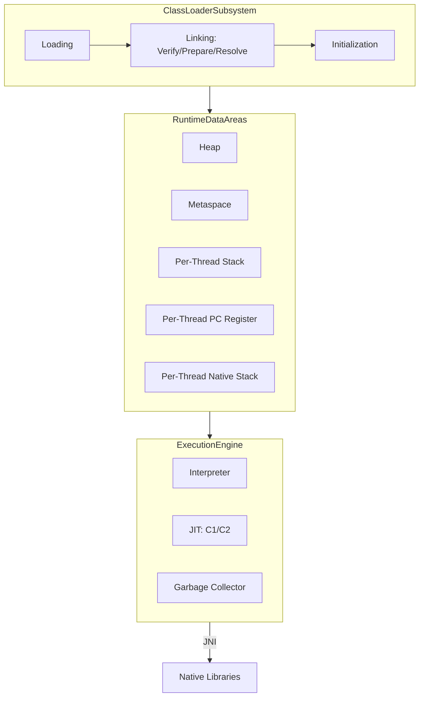
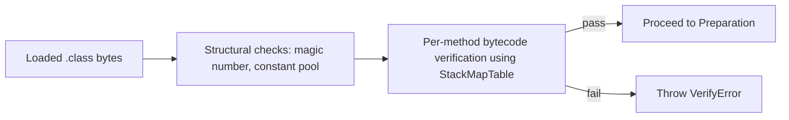
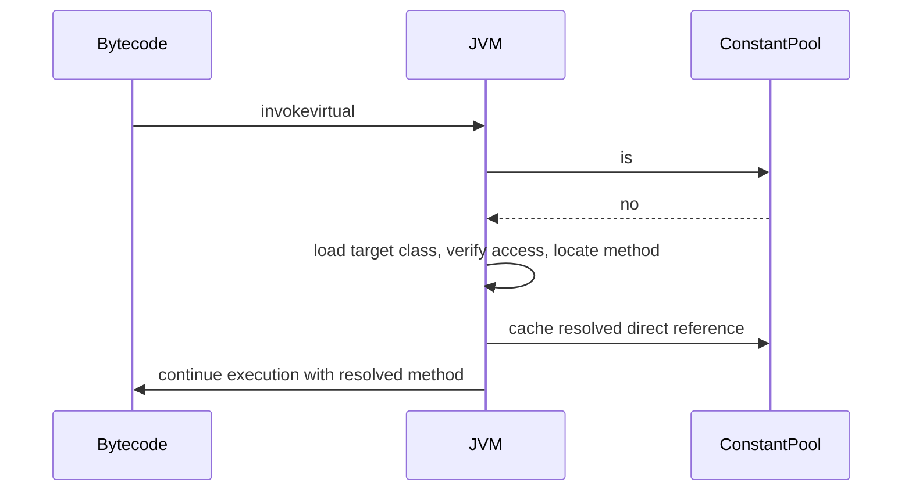
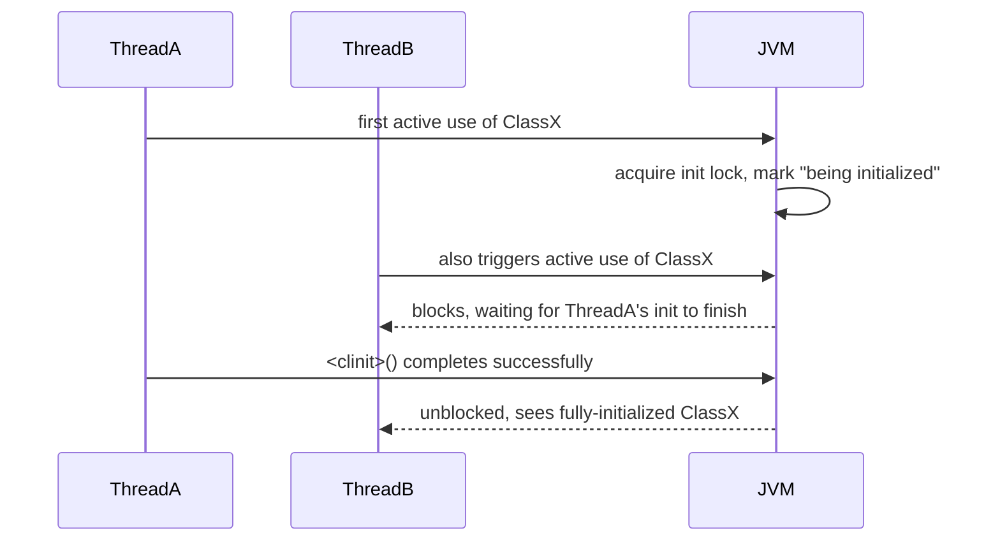
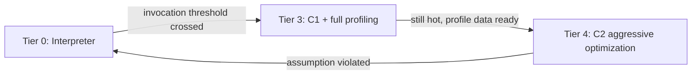

# 19. JVM Internals

## JVM Architecture

### Theory

- **Core Concepts**: The JVM architecture comprises three major subsystems: the **Class Loader Subsystem** (loads, links, initializes `.class` files), the **Runtime Data Areas** (Heap, Stack, PC Register, Native Method Stack, Metaspace — memory regions the JVM manages during execution), and the **Execution Engine** (interpreter, JIT compilers, garbage collector) that actually runs bytecode. Supporting these is the **Native Method Interface (JNI)** and **Native Method Libraries** for interop with platform-specific code.
- **Internal Working**: A `.class` file flows through the class loader subsystem into the method area/Metaspace as loaded class metadata; objects instantiated from these classes live in the Heap; each thread gets its own Stack, PC Register, and Native Method Stack; the Execution Engine reads bytecode from loaded classes and either interprets it directly or JIT-compiles hot methods to native code, with the GC concurrently managing heap memory.
- **When to Use It**: Foundational knowledge for any performance tuning, memory diagnostics, troubleshooting `OutOfMemoryError`/`StackOverflowError`, or understanding how language features (generics erasure, autoboxing, lambdas/`invokedynamic`) ultimately execute.
- **Advantages**: Clean separation of concerns (loading vs. memory vs. execution) enables independent evolution of each subsystem (e.g., swapping GC algorithms, adding new JIT tiers) without changing the class file format or language semantics.
- **Limitations**: The abstraction adds indirection/overhead versus a purely native-compiled program (though JIT narrows this gap significantly for long-running processes), and understanding performance requires reasoning across multiple interacting subsystems simultaneously.

### Internal Working

- **Step-by-Step Explanation**: (1) `java` launcher starts a JVM process; (2) Class Loader Subsystem loads `.class` bytecode (bootstrap → platform → application loaders), verifies, links (prepare + resolve), and initializes classes lazily on first active use; (3) Runtime Data Areas are established: one shared Heap and Metaspace/method area for the whole JVM instance, and per-thread Stack/PC Register/Native Method Stack for each thread created; (4) the Execution Engine's interpreter begins executing bytecode method-by-method, profiling invocation counts; (5) hot methods are progressively JIT-compiled (C1 then C2 under tiered compilation) into native machine code cached for reuse; (6) the Garbage Collector runs concurrently/interleaved, reclaiming unreachable Heap objects; (7) JNI bridges calls to/from native libraries when needed.
- **Memory Layout**: Heap (shared, GC-managed objects) + Metaspace (shared, class metadata, native memory since Java 8) + per-thread Stacks (frames: local variables + operand stack) + per-thread PC Registers + per-thread Native Method Stacks (for JNI call frames).
- **Diagrams**:



- **JVM Behaviour**: HotSpot implements tiered compilation (interpreter → C1 with light profiling → C2 aggressive optimization), generational garbage collection (G1 default since Java 9, with ZGC/Shenandoah available for ultra-low-pause needs), and a modular class-metadata store (Metaspace, native-memory-backed, replacing the fixed-size PermGen removed in Java 8) — all coordinated so that class loading, memory management, and execution can evolve independently while conforming to the JVM Specification's externally observable behavior.

### Interview Questions

**Basic**
1. What are the three main subsystems of the JVM architecture?
2. Which runtime data areas are shared across all threads, and which are per-thread?

**Intermediate**
3. How do the Class Loader Subsystem, Runtime Data Areas, and Execution Engine interact during program execution?

**Advanced**
4. How does the JVM architecture support pluggable garbage collectors and JIT compilers without changing the class file format?

**Scenario-based**
5. An application exhibits both high GC pause times and slow startup. Which JVM architectural subsystems would you investigate for each symptom?

### Detailed Answers

1. The Class Loader Subsystem (loading, linking, initialization of classes), the Runtime Data Areas (Heap, Stack, PC Register, Native Method Stack, Metaspace/method area), and the Execution Engine (interpreter, JIT compiler(s), garbage collector), supported by the Native Method Interface/Libraries for native interop.
2. The Heap and Metaspace/method area are shared across the entire JVM instance (all threads). The Stack, PC Register, and Native Method Stack are created fresh per thread, private to that thread.
3. The Class Loader Subsystem populates the method area/Metaspace with class metadata (which the Execution Engine reads to know what bytecode to run); as classes are instantiated, the Execution Engine allocates objects in the Heap; each thread's execution progresses through its own Stack (pushing/popping frames per method call) while the PC Register tracks the current bytecode instruction; the Execution Engine (interpreter/JIT) continuously reads from and writes to these Runtime Data Areas as it executes bytecode loaded by the Class Loader Subsystem.
4. Because the JVM Specification defines only the *external contract* — the class file format, bytecode semantics, and required behavioral guarantees (e.g., the Java Memory Model) — without mandating a specific GC algorithm or compilation strategy; this lets implementations like HotSpot swap in different garbage collectors (Serial, Parallel, G1, ZGC, Shenandoah) via JVM flags, or evolve JIT compilation strategies (interpreter-only → tiered C1/C2 → potentially AOT/GraalVM) without any change required to compiled `.class` files or the language itself.
5. High GC pause times point to the Runtime Data Areas (Heap sizing, generation ratios) and the Execution Engine's garbage collector configuration — investigate `-Xmx`/`-Xms`, GC algorithm choice, and allocation/promotion rates via GC logs. Slow startup points to the Class Loader Subsystem (number/size of classes loaded, verification overhead) and the Execution Engine's JIT warm-up behavior — investigate class loading counts (`-verbose:class`), consider Application Class Data Sharing (AppCDS) to speed up class loading, and consider whether tiered compilation settings or a lighter startup profile (e.g., `-XX:TieredStopAtLevel=1`) would help.

### Code Examples

```bash
# Inspect and tune JVM architecture-level behavior
java -Xms256m -Xmx512m -XX:+UseG1GC -Xlog:gc*:stdout:time -jar app.jar
java -verbose:class -jar app.jar | wc -l          # count classes loaded (Class Loader Subsystem)
java -XX:+PrintCompilation -jar app.jar | head -20 # observe JIT tiering (Execution Engine)
```

```java
public class ArchitectureDemo {
    public static void main(String[] args) {
        // Query Heap (Runtime Data Area) sizing via the Execution Engine's managed runtime
        Runtime rt = Runtime.getRuntime();
        System.out.printf("Available processors: %d, Max heap: %dMB%n",
                rt.availableProcessors(), rt.maxMemory() / (1024 * 1024));
    }
}
```

## Class Loader

The Class Loader Subsystem is responsible for locating, loading, linking, and initializing classes; its stages are detailed in the leaves below.

### Class Loading Process

#### Linking

Linking has three sub-phases — Verification, Preparation, and Resolution — each detailed below.

##### Verification

###### Theory

- **Core Concepts**: Verification is the linking sub-phase where the JVM's bytecode verifier statically checks that loaded class files are structurally correct and type-safe *before* any code executes — ensuring bytecode cannot violate the JVM's memory/type safety guarantees regardless of whether it came from a trusted compiler or was hand-crafted/malicious.
- **Internal Working**: The verifier performs a data-flow analysis pass over every method's bytecode, tracking the inferred type of each operand stack slot and local variable at every program point, checking that every instruction's operand types are valid, that branches merge into consistent states, and that access modifiers/final constraints are respected.
- **When to Use It**: Always happens automatically during class loading; understanding it matters when debugging `VerifyError`, writing bytecode-generating tools (ASM, ByteBuddy), or reasoning about why the JVM is a comparatively safe sandbox for running untrusted/dynamically-generated code.
- **Advantages**: Prevents entire classes of memory-corruption and type-confusion bugs (e.g., treating an `int` as a reference, stack underflow/overflow, jumping into the middle of an instruction) before execution begins, making the JVM a much safer execution environment for dynamically loaded/generated bytecode than an unchecked native code loader.
- **Limitations**: Adds class-loading-time CPU overhead (mitigated since Java 6+ by `StackMapTable` attributes that let the verifier work in a single linear pass instead of full data-flow fixpoint iteration), and can reject legitimately-intended-but-unusual bytecode patterns that don't fit its conservative type-safety proofs.

###### Internal Working

- **Step-by-Step Explanation**: (1) Verifier checks structural constraints on the class file itself (correct magic number, well-formed constant pool, valid method/field descriptors); (2) for each method's bytecode, it performs type-checking using the `StackMapTable` attribute (Java 6+) which records the expected verification type state at each branch target, letting the verifier confirm consistency in one linear pass rather than iterative data-flow analysis; (3) it checks operand stack never underflows/overflows `max_stack`, that local variable accesses match `max_locals` and expected types, that final classes aren't subclassed, final methods aren't overridden, and that all code paths through non-void methods properly return a value of the correct type.
- **Memory Layout**: Not directly applicable — verification is a static analysis over class metadata (in Metaspace once loaded) before any object/stack execution occurs.
- **Diagrams**:



- **JVM Behaviour**: If verification fails at any point, the JVM throws `VerifyError` (a subclass of `LinkageError`) and the class is never initialized or used; trusted bootstrap classes (`java.base` module classes loaded by the bootstrap loader) may receive reduced/skipped verification in some HotSpot configurations as a startup optimization, since they're assumed trustworthy, though this is an implementation detail, not a spec requirement.

###### Interview Questions

**Basic**
1. What does the bytecode verifier check?
2. What exception is thrown when verification fails?

**Intermediate**
3. What is a `StackMapTable` and why was it introduced?

**Advanced**
4. Why is verification important for security when loading untrusted or dynamically-generated bytecode?

**Scenario-based**
5. A bytecode-generation library (e.g., ASM) produces a class that throws `VerifyError` at load time. What kinds of mistakes commonly cause this?

###### Detailed Answers

1. It checks that a class file is structurally well-formed and that every method's bytecode is type-safe: operand stack and local variable types are consistent at every instruction and at every control-flow merge point, branches target valid instruction boundaries, final classes/methods aren't illegally overridden/subclassed, and access control constraints are respected.
2. `VerifyError` (a subclass of `LinkageError`), thrown during the linking phase before the class can be initialized or used, indicating the bytecode failed one or more safety/type-consistency checks.
3. `StackMapTable` is a class file attribute (introduced in Java 6, mandatory for class files targeting Java 7+) that records, for each branch target in a method, the expected types of the operand stack and local variables at that point; it was introduced to let the verifier perform a single linear-time pass through the bytecode instead of the older, more expensive iterative data-flow fixpoint algorithm needed to infer these types from scratch, significantly speeding up class verification.
4. Because the JVM is designed to safely execute bytecode from untrusted or dynamically-generated sources (applets historically, but also modern bytecode manipulation libraries, scripting engines, and remotely loaded code), verification acts as a mandatory gatekeeper ensuring that bytecode cannot violate type safety to escape its sandbox — e.g., forging object references, corrupting the operand stack, or bypassing access control — without which malicious or buggy bytecode could potentially crash the JVM or violate memory safety.
5. Common causes: incorrect stack map frames when branches merge (mismatched types on different paths reaching the same instruction), miscounting `max_stack`/`max_locals`, generating a return instruction not matching the method's declared return type, referencing a field/method with an incorrect descriptor, or violating access modifiers (e.g., calling a private method from outside its class in the generated bytecode) — tools like ASM's `CheckClassAdapter` or enabling `-Xverify` with detailed error output help pinpoint these issues.

###### Code Examples

```bash
# Force verification even for bootstrap classes, and get verbose diagnostics on failure
java -Xverify:all -cp . MyGeneratedClass

# Inspect the StackMapTable of a compiled class
javap -v MyClass | grep -A5 "StackMapTable"
```

```java
// Illustrative: a class that would pass verification cleanly
public class VerifiedExample {
    public int classify(int code) {
        int result; // must be definitely assigned on every path before use
        if (code > 0) {
            result = 1;
        } else if (code < 0) {
            result = -1;
        } else {
            result = 0;
        }
        return result; // verifier confirms 'result' is assigned on every path, and type matches int return
    }
}
```

##### Preparation

###### Theory

- **Core Concepts**: Preparation is the linking sub-phase where the JVM allocates memory for a class's static fields and initializes them to their default (zero-equivalent) values — `0`, `0L`, `0.0f`, `0.0d`, `false`, or `null` — *not* the values specified in the source code's initializers, which happen later during Initialization.
- **Internal Working**: For each static field declared in the class, the JVM creates storage in the class's static area (part of class metadata) sized per the field's descriptor, and zero-fills it; `static final` fields with constant expressions are a special case, potentially receiving their actual constant value directly here via the class file's `ConstantValue` attribute, since the compiler already resolved that value at compile time.
- **When to Use It**: You don't directly invoke preparation, but understanding it explains why static fields never appear "uninitialized" (they're always at least zero-valued) and clarifies the precise distinction between linking and initialization phases often conflated together.
- **Advantages**: Guarantees no static field ever holds garbage/undefined memory content, even before explicit initializer code runs — a foundational memory-safety guarantee.
- **Limitations**: Because preparation only sets *defaults*, code that (rarely, via cunning static initialization ordering or reflection) reads a static field before its explicit initializer runs will observe the zero/null default rather than the "intended" value — a subtle source of initialization-order bugs.

###### Internal Working

- **Step-by-Step Explanation**: (1) After successful verification, the JVM allocates storage for the class's static fields within its internal class metadata representation; (2) each static field is set to its type's default value (numeric zero, `false`, or `null`); (3) fields with a compile-time-constant initializer (`static final` primitives/`String`s, per JLS §4.12.4) are additionally marked with a `ConstantValue` attribute in the class file, which the JVM can use to set the actual constant value directly during preparation rather than waiting for `<clinit>`; (4) non-constant static field initializers and static initializer blocks are deferred to the later Initialization phase.
- **Memory Layout**: Static field storage lives within the class's metadata footprint (Metaspace-managed native memory), separate from any per-instance object storage on the Heap.
- **Diagrams**:

```
class Config {
    static int retries = 5;       // default 0 during Preparation, set to 5 later in Initialization
    static final int MAX = 100;   // ConstantValue: may be set to 100 directly during Preparation
}
```

- **JVM Behaviour**: Preparation runs for every class exactly once, prior to Initialization, and is distinct from it: a static field with a non-constant initializer genuinely holds its zero/null default value if inspected (e.g., via a carefully crafted circular class-initialization dependency) at any point between Preparation completing and the corresponding assignment executing during Initialization's `<clinit>` method.

###### Interview Questions

**Basic**
1. What happens during the Preparation phase of linking?
2. What values are static fields set to during Preparation?

**Intermediate**
3. How does Preparation differ from Initialization for static fields?

**Advanced**
4. Why might a `static final` field's actual constant value already be set during Preparation rather than waiting for `<clinit>`?

**Scenario-based**
5. A circular class-initialization dependency causes one class to read another's static field before its explicit initializer has run. What value would it observe, and why?

###### Detailed Answers

1. The JVM allocates memory for all of the class's static fields and initializes each one to its type's default value (zero-equivalent), based purely on field descriptors from the class file — no source-level initializer expressions are evaluated yet.
2. Their default zero-equivalent values: `0` for integral types, `0.0f`/`0.0d` for floating-point types, `false` for `boolean`, and `null` for reference types — regardless of what initializer expression appears in the source code.
3. Preparation only allocates storage and assigns default zero/null values based on type, requiring no code execution. Initialization is the subsequent phase that actually executes the class's `<clinit>` method — synthesized from static field initializers and static initializer blocks in source-code order — assigning the "real" intended values; Preparation always completes for a class before its Initialization begins.
4. Because such fields qualify as JLS-defined "constant variables" (final, primitive or `String`, initialized with a compile-time constant expression), the compiler can already determine their value with certainty at compile time and stores it in the class file's `ConstantValue` attribute; the JVM can therefore assign this known value during Preparation as an optimization, without needing to defer to and execute `<clinit>` bytecode for these specific fields.
5. It would observe the field's default zero/null value (e.g., `0` for an `int`, `null` for a reference), not the value from its intended initializer expression — because Preparation (which sets defaults) for that class has necessarily completed, but if a circular dependency causes another class's `<clinit>` to run first and read this field before this class's own `<clinit>` has reached the point of assigning the real value, only the Preparation-phase default is visible at that moment, a classic Java static initialization order pitfall.

###### Code Examples

```java
public class PreparationDemo {
    static class A {
        static int value = B.getValueFromA(); // triggers B's initialization, circular reference risk
    }
    static class B {
        static int shared = 42;
        static int getValueFromA() {
            // If A is being initialized first and triggers B's initialization circularly,
            // 'shared' might still be its Preparation-phase default (0) here in edge cases.
            return shared;
        }
    }

    public static void main(String[] args) {
        System.out.println("A.value = " + A.value);
        System.out.println("B.shared = " + B.shared);
    }
}
```

##### Resolution

###### Theory

- **Core Concepts**: Resolution is the linking sub-phase where symbolic references in the constant pool (to classes, interfaces, fields, methods) are optionally converted into direct references (e.g., resolved memory offsets/method table entries). The JVM specification permits resolution to happen either **eagerly** (at link time) or **lazily** (deferred until the reference is actually used) — HotSpot predominantly uses lazy resolution.
- **Internal Working**: When a symbolic reference is first actually used (e.g., an `invokevirtual` instruction referencing a method), the JVM looks up the target class (loading it if not already loaded), locates the specific field/method, performs access control checks, and caches a direct reference (or an equivalent resolved constant pool entry) so subsequent uses skip the lookup.
- **When to Use It**: Understanding lazy resolution explains why referencing a class that doesn't exist on the classpath doesn't fail until that specific code path executes (`NoClassDefFoundError` at first use, not at class load time), and matters for diagnosing intermittent, path-dependent classloading errors.
- **Advantages**: Lazy resolution avoids the cost (and potential unnecessary failure) of resolving every symbolic reference in a class up front, many of which might never actually be exercised at runtime, improving startup performance and avoiding needless `NoClassDefFoundError`s for unused code paths.
- **Limitations**: Because resolution failures (missing classes/methods, `IllegalAccessError`) can be deferred arbitrarily late into execution, they can surface unexpectedly deep into a program's runtime rather than immediately, complicating diagnosis and testing coverage of rarely-hit paths.

###### Internal Working

- **Step-by-Step Explanation**: (1) The constant pool initially holds purely symbolic references (class/interface names, method/field name-and-descriptor pairs); (2) upon first actual use of a given reference during execution (e.g., executing an `invokestatic`/`getfield`/`new` instruction), the JVM triggers resolution: it loads (if necessary) the referenced class, verifies accessibility (public/protected/private/package rules), locates the exact field/method matching the descriptor, and replaces the symbolic entry's resolved state with a direct reference; (3) subsequent executions of the same instruction reuse the already-resolved reference, avoiding repeated lookup cost.
- **Memory Layout**: Resolved references are cached within the class's runtime constant pool structure held in Metaspace, alongside other class metadata.
- **Diagrams**:



- **JVM Behaviour**: HotSpot performs resolution lazily by default for most reference kinds (deferring the cost and any resulting `LinkageError`/`NoSuchMethodError`/`NoClassDefFoundError` until the specific instruction actually executes), which is why a class can be successfully loaded and even partially run even if it symbolically references a class or method that doesn't actually exist on the classpath, as long as that specific code path is never taken.

###### Interview Questions

**Basic**
1. What is Resolution in the class linking process?
2. Is resolution required to happen eagerly by the JVM specification?

**Intermediate**
3. Why can a `NoClassDefFoundError` occur deep into program execution rather than at startup?

**Advanced**
4. What kinds of errors can occur during resolution, and what triggers each?

**Scenario-based**
5. You want to fail fast at application startup if any referenced class is missing, rather than discovering it deep in production traffic. What approach would you take?

###### Detailed Answers

1. Resolution is the process of converting symbolic references in a class's constant pool (references to other classes, interfaces, fields, or methods by name/descriptor) into direct, resolved references (e.g., an actual method table slot or field offset), performed by locating and verifying access to the referenced entity.
2. No — the JVM specification explicitly allows implementations to resolve symbolic references either eagerly (at link time, before the class is used) or lazily (deferred until first actual use); HotSpot, the reference/most common implementation, predominantly resolves lazily for performance reasons.
3. Because resolution (and the class loading it may trigger) for a given symbolic reference is deferred until the specific bytecode instruction using that reference actually executes; if that instruction is on a rarely-exercised code path (an error-handling branch, an optional feature), the class can run successfully for a long time before that path is finally taken, at which point resolution is attempted and fails if the referenced class truly isn't available, throwing `NoClassDefFoundError` at that late point rather than at class load time.
4. `NoClassDefFoundError` (referenced class cannot be found/loaded at resolution time, despite having compiled successfully against it originally), `NoSuchMethodError`/`NoSuchFieldError` (the referenced class exists but no longer has the expected method/field signature, typically from a binary-incompatible library version mismatch), and `IllegalAccessError` (the referenced member exists but access control rules forbid this call site from using it) — all are subclasses of `LinkageError`, triggered when resolution's lookup/verification step fails.
5. Use eager class loading/resolution verification tools as part of a startup health check or CI step — e.g., run a static bytecode analysis tool (`jdeps`) to verify all referenced classes exist on the classpath, or explicitly force-load and reference critical classes during application startup (a common pattern in frameworks: eagerly instantiating key beans/services at boot rather than lazily on first request) so missing-class failures surface immediately at startup instead of silently waiting for a specific user request to trigger the failing code path.

###### Code Examples

```bash
# Detect missing classes ahead of time rather than relying on lazy resolution failures
jdeps -verbose:class --class-path libs/*.jar MyApp.jar
```

```java
public class ResolutionDemo {
    public static void main(String[] args) {
        System.out.println("App starting");
        // This reference is only RESOLVED the first time this branch actually executes
        if (args.length > 0 && args[0].equals("legacy")) {
            LegacyFeature.run(); // resolution (and potential NoClassDefFoundError) deferred until here
        }
        System.out.println("App running normally, legacy path never resolved");
    }
}

class LegacyFeature {
    static void run() { System.out.println("Legacy feature executed"); }
}
```

#### Initialization

##### Theory

- **Core Concepts**: Initialization is the final step of class preparation for use — the JVM executes the class's `<clinit>` method (a synthesized "class or interface initialization method" combining all static field initializers and static initializer blocks in textual source order), assigning static fields their "real" intended values. It runs exactly once per class per classloader, triggered lazily by specific "active use" events.
- **Internal Working**: `javac` compiles all static initializer blocks and non-constant static field initializer expressions, in the order they appear in the source file, into a single special method named `<clinit>` with no parameters and `void` return type; the JVM invokes this method automatically at the appropriate trigger point, guaranteeing thread-safe, exactly-once, and (for superclasses) properly-ordered execution.
- **When to Use It**: Understanding this explains static field initialization order bugs, the timing of static blocks relative to first use, and how the "initialization-on-demand holder" thread-safe lazy singleton idiom works.
- **Advantages**: Guarantees deterministic, single-threaded-appearing execution of static setup code exactly once, with the JVM handling all necessary synchronization/blocking of concurrent initializing threads internally at no extra cost to the developer.
- **Limitations**: Circular class initialization dependencies can result in a class observing another's static fields still at their Preparation-phase defaults (not yet the "real" initializer value); initialization order bugs across multiple classes/static blocks are subtle and can be hard to trace; a `<clinit>` that throws an exception causes the class to permanently enter an erroneous state (`ExceptionInInitializerError` wrapping the original cause, and `NoClassDefFoundError` on all subsequent use attempts).

##### Internal Working

- **Step-by-Step Explanation**: (1) Per JLS §12.4.2, before initializing a class, the JVM first (recursively) ensures its direct superclass is initialized (interfaces with default methods are also initialized as needed); (2) the JVM acquires an internal per-class initialization lock, checks if another thread is already initializing this class (if so, the current thread waits, unless it's the same thread which would indicate a circular initialization dependency, in which case it proceeds without re-blocking) or if it's already been initialized (no-op) or previously failed (throws `NoClassDefFoundError` immediately); (3) if none of those apply, it marks the class "being initialized," executes `<clinit>`; (4) on successful completion, marks the class "fully initialized" and releases waiting threads; (5) if `<clinit>` throws, the JVM marks the class "erroneous," throws `ExceptionInInitializerError` (wrapping the original exception, unless it was already an `Error`), and all future attempts to use the class throw `NoClassDefFoundError`.
- **Memory Layout**: `<clinit>` executes like any other method, using a temporary stack frame; the values it computes are written into the class's static field storage in Metaspace-managed class metadata (already allocated during Preparation).
- **Diagrams**:



- **JVM Behaviour**: This locking/blocking protocol is guaranteed directly by the JVM specification (not merely a HotSpot implementation detail), which is precisely what allows the "initialization-on-demand holder" idiom to provide thread-safe lazy singleton initialization with zero explicit synchronization code — the JVM's own class-initialization guarantees do all the necessary locking.

##### Interview Questions

**Basic**
1. What is `<clinit>` and when does it run?
2. What triggers class initialization?

**Intermediate**
3. What happens if two threads simultaneously trigger initialization of the same class for the first time?

**Advanced**
4. What happens if a static initializer block throws an exception?

**Scenario-based**
5. How does the "initialization-on-demand holder" idiom achieve thread-safe lazy singleton initialization without any explicit synchronization?

##### Detailed Answers

1. `<clinit>` is a synthetic, JVM-recognized static initialization method the compiler generates from a class's static field initializers and static initializer blocks, combined in the exact textual order they appear in the source file; it runs automatically, exactly once per class per classloader, the first time the class undergoes "active use" (JLS §12.4.1).
2. Active use events: creating an instance of the class, invoking one of its static methods, using/assigning a non-constant static field, reflectively performing any of these, initializing a subclass (which first requires initializing the superclass), or the class being the designated entry point containing `main`.
3. The JVM's built-in initialization locking ensures the first thread to trigger it proceeds to execute `<clinit>`, while any other thread that concurrently triggers initialization of the *same* class blocks until the first thread's `<clinit>` completes (successfully or with error) — this is a JVM specification guarantee requiring no explicit developer-written synchronization.
4. The JVM catches the exception, wraps it in an `ExceptionInInitializerError` (unless the original exception was already an `Error`, in which case it propagates as-is) if it isn't itself an `Error`, marks the class as permanently "erroneous," and throws `ExceptionInInitializerError` at the triggering call site; all subsequent attempts anywhere in the program to actively use that class will immediately throw `NoClassDefFoundError`, since the class can never be successfully initialized after a failed attempt.
5. The pattern places the singleton instance as a `static final` field of a private static nested class; because nested classes are only loaded and initialized when first actively referenced (not automatically when the outer class loads), the nested holder class — and thus the singleton field's initialization — is deferred until `getInstance()` first references it, at which point the JVM's guaranteed thread-safe, exactly-once class initialization semantics ensure the singleton is created safely exactly once, even under concurrent first-time access from multiple threads, with no explicit locks needed.

##### Code Examples

```java
public class InitializationDemo {
    static class Holder {
        static final InitializationDemo INSTANCE = new InitializationDemo(); // <clinit> runs once, lazily
        static { System.out.println("Holder class initialized -> singleton created"); }
    }

    public static InitializationDemo getInstance() {
        return Holder.INSTANCE; // first call triggers Holder's <clinit>, thread-safely, exactly once
    }

    public static void main(String[] args) throws InterruptedException {
        Runnable task = () -> System.out.println(getInstance().hashCode());
        Thread t1 = new Thread(task), t2 = new Thread(task);
        t1.start(); t2.start();
        t1.join(); t2.join(); // both threads safely see the same singleton instance
    }
}
```

## Runtime Data Areas

The JVM manages several distinct memory regions during execution, each with a specific purpose and lifecycle, detailed below.

### Heap

#### Theory

- **Core Concepts**: The Heap is the single shared runtime memory area where all objects and arrays are allocated (regardless of which thread created them), and is the primary target of garbage collection. It's typically subdivided generationally: Young Generation (Eden + two Survivor spaces, for newly allocated, short-lived objects) and Old Generation/Tenured (long-lived objects promoted after surviving multiple GC cycles), though exact regions depend on the active GC algorithm (e.g., G1's region-based layout differs from the classic contiguous generational model).
- **Internal Working**: New objects are typically allocated in Eden (often via a fast, lock-free "bump-the-pointer" allocation within a thread's Thread-Local Allocation Buffer, TLAB); Minor GC collects Eden+Survivor, promoting surviving objects; Major/Full GC collects the Old Generation (and often the whole heap) when it fills up.
- **When to Use It**: Central to virtually all object-oriented Java programs; direct tuning relevance for `-Xms`/`-Xmx`/generation ratio flags, diagnosing `OutOfMemoryError: Java heap space`, and GC pause/throughput tuning.
- **Advantages**: Automatic memory management (no manual free()), generational collection exploits the "weak generational hypothesis" (most objects die young) for efficient collection, shared across threads enabling straightforward object sharing.
- **Limitations**: GC pauses can affect latency-sensitive applications, memory overhead per object (header, alignment padding), and heap sizing/tuning requires understanding allocation patterns to avoid excessive promotion or GC overhead.

#### Internal Working

- **Step-by-Step Explanation**: (1) `new` allocates an object, typically bump-pointer-allocated within the current thread's TLAB inside Eden (fast, no locking needed in the common case); (2) when Eden fills, a Minor GC (usually stop-the-world but very short) copies surviving objects to a Survivor space, incrementing their age; (3) objects surviving several Minor GCs (age threshold, `-XX:MaxTenuringThreshold`) are promoted to the Old Generation; (4) when Old Generation fills, a Major/Full GC runs (typically more expensive, potentially longer pauses), reclaiming unreachable objects across the whole heap.
- **Memory Layout**: `[Young Gen: Eden | Survivor S0 | Survivor S1] [Old Generation]` (classic layout); G1 instead divides the heap into many equal-sized regions, each dynamically assigned a role (Eden/Survivor/Old/Humongous) rather than fixed contiguous generations.
- **Diagrams**:

```
Heap (classic generational layout)
+------------------- Young Generation -------------------+---- Old Generation ----+
| Eden            | Survivor S0    | Survivor S1          | Tenured objects        |
+------------------------------------------------------------------------------------+
  new objects ->     Minor GC copies survivors      ->     promoted after N GCs
```

- **JVM Behaviour**: The default collector since Java 9, G1GC, aims for predictable pause times by collecting the regions with the most garbage first ("garbage-first"), incrementally, rather than collecting the entire Old Generation at once; ZGC and Shenandoah (available in modern JDKs) push pause times down further (sub-millisecond, largely concurrent) by doing almost all collection work concurrently with application threads using colored pointers/load barriers.

#### Interview Questions

**Basic**
1. What is stored on the Heap, and is it shared across threads?
2. What are the Young and Old generations?

**Intermediate**
3. What is a TLAB and why does it improve allocation performance?

**Advanced**
4. How does G1GC's region-based approach differ from the classic contiguous generational heap layout?

**Scenario-based**
5. An application shows frequent, short Minor GC pauses but healthy overall throughput, then occasional very long Full GC pauses. How would you approach tuning this?

#### Detailed Answers

1. All objects and arrays, regardless of the thread that created them; the Heap is a single memory area shared across the entire JVM instance (all threads), unlike per-thread Stacks.
2. The Young Generation holds newly allocated, typically short-lived objects (subdivided into Eden and two Survivor spaces used for copying-collector semantics); the Old Generation holds objects that have survived enough Minor GC cycles to be "promoted," based on the empirical observation that most objects die young (weak generational hypothesis) while a smaller set live much longer.
3. A Thread-Local Allocation Buffer is a chunk of Eden space pre-reserved exclusively for a specific thread; because it's exclusive to that thread, allocating a new object within it just requires bumping a pointer with no synchronization/locking against other threads, dramatically speeding up the extremely common "allocate a small short-lived object" case compared to a globally-synchronized allocation pointer.
4. The classic layout has fixed, contiguous Young/Old generation regions requiring a full-generation scan/collection each time. G1GC instead partitions the heap into many equal-sized regions (each independently assignable as Eden, Survivor, Old, or Humongous for very large objects), letting it selectively collect only the regions containing the most reclaimable garbage ("garbage-first") to meet a target pause-time goal, rather than always collecting an entire fixed generation at once.
5. Frequent short Minor GCs are generally healthy (indicating efficient young-generation collection), but occasional very long Full GC pauses suggest the Old Generation is filling up and requiring expensive full collections — investigate: whether too many objects are being promoted too quickly (increase young generation size or `MaxTenuringThreshold` to let more objects die in Young Gen), whether there's a slow memory leak growing Old Gen over time, or whether switching to a low-pause collector (G1 tuned via `-XX:MaxGCPauseMillis`, or ZGC/Shenandoah for near-elimination of long pauses) better fits the latency requirements.

#### Code Examples

```bash
# Observe generational GC behavior directly
java -Xms512m -Xmx512m -Xlog:gc+heap=debug:stdout:time -XX:+UseG1GC MyApp

# Force a heap dump on OutOfMemoryError for post-mortem analysis
java -XX:+HeapDumpOnOutOfMemoryError -XX:HeapDumpPath=./heap.hprof -Xmx256m MyApp
```

```java
public class HeapDemo {
    public static void main(String[] args) {
        java.util.List<byte[]> retained = new java.util.ArrayList<>();
        for (int i = 0; i < 1000; i++) {
            byte[] shortLived = new byte[1024]; // most die immediately in Eden -> cheap Minor GC
            if (i % 100 == 0) {
                retained.add(new byte[1024 * 1024]); // survives, eventually promoted to Old Gen
            }
        }
        System.out.println("Retained large arrays: " + retained.size());
    }
}
```

### Stack

#### Theory

- **Core Concepts**: Each thread gets its own private Java Virtual Machine Stack, created at thread creation, storing a sequence of **frames** — one per active (not-yet-returned) method invocation. Each frame holds that invocation's local variable array, operand stack, and a reference to the runtime constant pool of its class, for supporting dynamic linking, method return, and exception dispatch.
- **Internal Working**: A method call pushes a new frame sized according to that method's `max_locals`/`max_stack` (from its `Code` attribute); the frame is popped when the method returns (normally or via an uncaught exception propagating through it).
- **When to Use It**: Not directly manipulated by developers, but critical to understanding recursion limits, `StackOverflowError`, thread memory overhead (`-Xss`), and why local variables are inherently thread-confined/thread-safe.
- **Advantages**: Extremely fast allocation/deallocation (simple pointer bump on push, decrement on pop — no GC involvement), inherent thread isolation for local variables, straightforward, deterministic LIFO lifecycle matching method call/return semantics.
- **Limitations**: Fixed maximum size per thread (`-Xss`, default varies by platform, often ~512KB-1MB) — deep/unbounded recursion throws `StackOverflowError`; many threads each with sizable stacks can consume significant aggregate memory in highly concurrent applications.

#### Internal Working

- **Step-by-Step Explanation**: (1) Thread creation allocates a new JVM stack (size configurable via `-Xss`); (2) each method invocation pushes a new frame containing the local variable array (parameters + locals, sized per `max_locals`), the operand stack (a working area for intermediate computation values, sized per `max_stack`), and a reference to the current class's runtime constant pool; (3) bytecode instructions manipulate the operand stack directly (push/pop values) and read/write local variable slots; (4) on method return (`return`/`ireturn`/`areturn`/etc.) or an uncaught exception unwinding past this frame, the frame is popped and control returns to the caller's frame, resuming at the caller's next instruction (or propagating the exception further).
- **Memory Layout**: `[Frame N: locals | operand stack | constant pool ref] [Frame N-1: ...] ... [Frame 0: main()]` — grows with each nested call, shrinks on return; entirely separate per thread, never shared.
- **Diagrams**:

```mermaid
flowchart TB
    A[Thread starts: empty stack] --> B[main() frame pushed]
    B --> C[helper() frame pushed on call]
    C --> D[deeper() frame pushed on call]
    D -->|return| C
    C -->|return| B
    B -->|main returns| E[Thread stack empty, thread ends]
```

- **JVM Behaviour**: If a thread requires a stack larger than its configured size (typically from deep/unbounded recursion), the JVM throws `StackOverflowError`; if the JVM cannot create a new thread's stack at all due to insufficient native memory, it throws `OutOfMemoryError: unable to create new native thread` — both are distinct failure modes tied to this Runtime Data Area.

#### Interview Questions

**Basic**
1. What is stored in a JVM stack frame?
2. Is the JVM stack shared across threads?

**Intermediate**
3. What causes `StackOverflowError`?

**Advanced**
4. How does stack size (`-Xss`) trade off against the maximum number of threads a process can support?

**Scenario-based**
5. A highly concurrent server application with thousands of threads runs out of native memory, though heap usage looks fine. What Runtime Data Area should you investigate, and what are your options?

#### Detailed Answers

1. Each frame contains that method invocation's local variable array (parameters and local variables), its operand stack (used as working space for bytecode instruction operands during computation), and a reference to the runtime constant pool of the frame's defining class (used for dynamic linking of symbolic references).
2. No — each thread has its own private JVM stack, created when the thread starts and destroyed when it terminates; stacks are never shared between threads, which is precisely why local variables are inherently thread-confined and safe from cross-thread data races.
3. Exceeding the configured maximum stack size for a thread, typically from excessively deep or unbounded/infinite recursion (each recursive call pushes another frame), though it can also occur from extremely deep non-recursive call chains or very large per-frame local variable arrays in constrained stack-size configurations.
4. A larger per-thread stack size (`-Xss`) allows deeper recursion/call chains before `StackOverflowError` but consumes more native memory per thread, reducing the total number of threads the process can create before exhausting available (often OS-limited virtual/native) memory; a smaller `-Xss` supports more concurrent threads but increases the risk of `StackOverflowError` for recursion-heavy code — this trade-off is especially relevant for thread-per-request server architectures with very high thread counts.
5. Investigate the (per-thread) JVM Stack Runtime Data Area — each of the thousands of threads consumes native memory for its stack (`-Xss` × thread count can dominate native memory usage independent of heap size). Options: reduce `-Xss` if recursion depth requirements allow, reduce the number of concurrently live threads (e.g., adopt a bounded thread pool, or migrate to virtual threads/Project Loom which use much smaller, dynamically-growable stacks and can support vastly more concurrent units of work per unit of memory), or increase available native/OS memory limits.

#### Code Examples

```java
public class StackDemo {
    static int depth = 0;

    static void recurse() {
        depth++;
        recurse(); // unbounded recursion: each call pushes a new frame
    }

    public static void main(String[] args) {
        try {
            recurse();
        } catch (StackOverflowError e) {
            System.out.println("StackOverflowError after depth ~" + depth);
        }
    }
}
```

```bash
# Tune per-thread stack size
java -Xss256k StackDemo   # smaller stack -> lower depth before overflow, supports more threads
java -Xss8m StackDemo     # larger stack -> higher depth before overflow, fewer threads possible
```

### PC Register

#### Theory

- **Core Concepts**: The Program Counter (PC) Register is a small, per-thread runtime data area holding the address of the JVM instruction currently being executed by that thread. Each thread has exactly one, private to it. If the thread is executing a native method (via JNI), the PC register's value is undefined per the JVM specification (since native code isn't tracked in terms of JVM bytecode offsets).
- **Internal Working**: After each bytecode instruction executes, the PC register is updated to point to the next instruction to execute (accounting for branches/jumps, method calls pushing/popping frames, and exception handler dispatch redirecting it to a handler's start offset).
- **When to Use It**: Not directly manipulated by application code, but foundational to understanding how the interpreter/JIT tracks execution position, how exceptions redirect control flow, and how debuggers/profilers report the "current line" being executed per thread.
- **Advantages**: Trivially small memory footprint (essentially a single pointer-sized value per thread), enables straightforward per-thread independent instruction sequencing.
- **Limitations**: Being per-thread and holding only a single instruction address, it offers no direct application-level utility beyond what the JVM/tooling (debuggers, profilers, exception mechanisms) use it for internally.

#### Internal Working

- **Step-by-Step Explanation**: (1) When a thread begins executing a method's bytecode, its PC register is set to that method's first instruction offset; (2) after each instruction executes, the interpreter (or JIT-compiled code's equivalent tracking) advances the PC to the next sequential instruction, or to a branch/jump target if the instruction was a conditional/unconditional jump; (3) on a method call, a new frame is pushed and the PC is set to the callee's first instruction; on return, the PC is restored to the instruction immediately following the original call in the caller's frame; (4) if an exception is thrown, the JVM consults the current method's exception table to find a matching handler and, if found, sets the PC to that handler's start offset (unwinding frames as needed if no handler is found locally).
- **Memory Layout**: A minimal per-thread structure (conceptually just a machine word holding an instruction address/offset), not part of the Heap, Stack, or Metaspace — its own small dedicated area.
- **Diagrams**:

```
Thread A: PC -> bytecode offset 14 of method foo()
Thread B: PC -> bytecode offset 42 of method bar()   (independent, private per thread)
```

- **JVM Behaviour**: Debuggers (via JDWP/JVMTI) and profilers query each thread's current PC-equivalent state (mapped back to source line numbers via the `LineNumberTable` class file attribute) to report "where" a thread is currently executing; JIT-compiled native code maintains an analogous mechanism (safepoint/return-address bookkeeping) even though it no longer executes raw interpreted bytecode instruction-by-instruction.

#### Interview Questions

**Basic**
1. What does the PC Register store?
2. Is the PC Register shared across threads?

**Intermediate**
3. What happens to the PC Register's value when a thread is executing a native method?

**Advanced**
4. How does the PC Register interact with exception handling and the exception table?

**Scenario-based**
5. A debugger shows a specific "current line" for each paused thread in a multi-threaded application. What underlying JVM mechanism makes this possible?

#### Detailed Answers

1. The address (offset) of the JVM instruction currently being executed by its owning thread — essentially a pointer to "where execution is right now" within the current method's bytecode.
2. No — each thread has its own private PC Register, since each thread executes independently and needs to track its own current instruction position separately from every other thread.
3. Per the JVM specification, the PC Register's value is undefined while the thread is executing a native method (since native code execution isn't expressed in terms of JVM bytecode instruction offsets) — the JVM doesn't track a bytecode-offset-based program counter during that portion of execution.
4. When an exception is thrown, the JVM uses the current PC to determine which instruction raised it, then consults that method's exception table (which maps bytecode ranges to handler start offsets and the exception types they catch) to find an applicable handler; if found, the PC Register is updated to point to that handler's starting instruction, effectively redirecting control flow; if no handler is found in the current frame, the frame is popped (unwound) and the search continues in the caller's frame using the caller's own PC/exception table.
5. Each thread's PC Register (or its JIT-compiled-code equivalent) tracks the currently executing instruction offset; the JVMTI/debugger interface can query this per-thread state and, combined with the `LineNumberTable` class file attribute (which maps bytecode offsets back to original source line numbers), translate that raw instruction position into a human-readable "currently executing source line" for each independently-paused thread.

#### Code Examples

```java
public class PcRegisterDemo {
    public static void main(String[] args) throws InterruptedException {
        Thread t1 = new Thread(() -> loop("t1"));
        Thread t2 = new Thread(() -> loop("t2"));
        t1.start();
        t2.start();
        // Each thread independently tracks its own PC as it executes loop() at its own pace
        t1.join();
        t2.join();
    }

    static void loop(String name) {
        for (int i = 0; i < 3; i++) {
            System.out.println(name + " iteration " + i); // each thread's PC advances independently here
        }
    }
}
```

### Native Method Stack

#### Theory

- **Core Concepts**: The Native Method Stack is a per-thread memory area used when a thread executes native (non-Java) code via the Java Native Interface (JNI) — e.g., calling into a C/C++ library. It plays a role analogous to the JVM Stack, but for native call frames rather than Java bytecode frames; the JVM specification permits implementations to combine it with the regular JVM Stack (HotSpot does exactly this on most platforms).
- **Internal Working**: When a Java thread calls a `native` method, control transfers to native code, which uses this stack area (following the host platform's native calling convention, not JVM frame conventions) for its own local variables, call frames, and return addresses, exactly as any native C/C++ program would use its OS-level stack.
- **When to Use It**: Relevant whenever JNI is involved — calling native libraries for performance-critical code, OS-specific APIs, or legacy native code integration; understanding it matters for diagnosing native-stack-related crashes (`fatal error` native stack overflows) distinct from ordinary Java `StackOverflowError`.
- **Advantages**: Allows Java applications to interoperate with existing native libraries/OS APIs without needing a separate execution model; reuses standard native calling conventions for efficient interop.
- **Limitations**: Native stack overflows or corruption typically crash the entire JVM process (a native SIGSEGV-style fatal error) rather than throwing a catchable Java exception like `StackOverflowError`, making native-side bugs harder to diagnose and recover from; adds complexity/fragility at the JNI boundary (manual memory/reference management, platform-specific binaries).

#### Internal Working

- **Step-by-Step Explanation**: (1) Java code calls a method declared `native`; (2) the JVM transitions the thread from "in Java" to "in native" state and transfers control to the corresponding native (JNI) implementation, typically a C function looked up via `System.loadLibrary`-registered native libraries; (3) the native function executes using the platform's native stack conventions (which HotSpot typically implements as literally the same OS thread stack used for the JVM stack, rather than a wholly separate memory region); (4) native code can call back into Java via JNI functions (`CallXMethod`, etc.), which pushes new ordinary JVM frames on top; (5) on native function return, control transfers back to the JVM, resuming Java-side execution.
- **Memory Layout**: On most HotSpot platforms, this is implemented as the *same* underlying OS thread stack as the regular JVM Stack (a JVM specification-permitted implementation choice), rather than a distinct memory region — conceptually distinct per spec, but practically unified in common implementations.
- **Diagrams**:

```
Thread's OS stack (HotSpot's common implementation choice):
[Java frame: main()] -> [native frame: JNI call into libfoo.so] -> [native frame: internal C calls] -> [Java frame: JNI callback into Java]
```

- **JVM Behaviour**: The JVM specification explicitly allows (JVMS §2.5.6) merging the Native Method Stack with the ordinary JVM Stack, or making the size of the Native Method Stack fixed/dynamically expanding — HotSpot's typical approach uses one combined native OS thread stack for both, meaning `-Xss` effectively also governs available native call depth for that thread in practice, and severe native stack overflows manifest as a JVM crash (fatal native error) rather than a recoverable `StackOverflowError`.

#### Interview Questions

**Basic**
1. What is the Native Method Stack used for?
2. Does every JVM implementation keep it as a physically separate memory region from the JVM Stack?

**Intermediate**
3. What typically happens if native code causes a stack overflow, versus a Java-only `StackOverflowError`?

**Advanced**
4. How does control flow transition between the JVM Stack and Native Method Stack during a JNI call and callback?

**Scenario-based**
5. A JVM process crashes with a native fatal error signal instead of throwing a catchable Java exception, and JNI is in use. What area should you suspect, and what diagnostic approach would you take?

#### Detailed Answers

1. It's used when a thread executes native code invoked via JNI (e.g., a `native` method backed by a C/C++ library implementation), providing the call-frame storage (local variables, return addresses) that native code needs, analogous to what the JVM Stack provides for Java bytecode execution.
2. No — the JVM specification explicitly permits implementations to combine the Native Method Stack with the regular JVM Stack rather than keeping them as separate memory regions; HotSpot, the dominant implementation, typically does combine them, using a single native OS thread stack for both Java and native frames.
3. A pure Java stack overflow (exceeding `-Xss` while executing only Java bytecode) is caught by the JVM and thrown as a recoverable `StackOverflowError`, which application code can catch. A native-side stack overflow (deep/runaway native recursion or excessive native stack usage) typically isn't caught by the JVM's managed exception mechanism at all — it usually corrupts the process's memory/stack guard page, causing an unrecoverable native crash (e.g., a JVM fatal error log and process termination), not a catchable Java exception.
4. When Java code calls a `native` method, the JVM transfers control to the native implementation, which begins pushing native-convention call frames onto the (often shared) thread stack; if that native code calls back into Java (via JNI `CallXMethod` functions), the JVM pushes ordinary Java frames on top of the current native frames on that same stack, and execution proceeds interleaved between native and Java frame types on one continuous per-thread stack (in HotSpot's common combined implementation) until each frame returns in LIFO order back down the chain.
5. Suspect the Native Method Stack / combined native thread stack, particularly deep or runaway recursion within the native library code itself (outside the JVM's own bytecode-level stack tracking, so it can't be caught as `StackOverflowError`). Diagnose via native crash logs (`hs_err_pid*.log` on HotSpot, which includes native stack traces at the point of the fatal error), core dumps analyzed with native debuggers (gdb/lldb), and review of the native library's own recursion/stack usage patterns, since this is outside pure-Java tooling's visibility.

#### Code Examples

```java
public class NativeMethodStackDemo {
    // Declares a native method; requires a corresponding JNI implementation in a loaded native library
    static native int nativeFibonacci(int n);

    static {
        // System.loadLibrary("fibnative"); // would load a compiled native library implementing this
    }

    public static void main(String[] args) {
        System.out.println("This class demonstrates the native method declaration pattern.");
        System.out.println("Deep recursion inside nativeFibonacci's C implementation would consume");
        System.out.println("the Native Method Stack, potentially crashing the JVM natively rather");
        System.out.println("than throwing a catchable Java StackOverflowError.");
    }
}
```

### Metaspace

#### Theory

- **Core Concepts**: Metaspace (introduced in Java 8, replacing PermGen) is the memory area storing class metadata — loaded class structures, method bytecode, runtime constant pools, field/method data, and annotations. Unlike the old PermGen (a fixed-size region within the Heap-adjacent space), Metaspace is allocated from **native (off-heap) memory**, growing dynamically by default.
- **Internal Working**: When a class is loaded, its metadata is allocated in Metaspace, organized into per-classloader arenas (chunks); when a classloader becomes unreachable (typically because all classes it loaded are no longer referenced), its associated Metaspace chunks can be reclaimed during a GC cycle.
- **When to Use It**: Relevant for applications that dynamically generate/load many classes (application servers, OSGi, frameworks using heavy bytecode generation/proxying, hot-reloading dev tools), where Metaspace growth/leaks (from classloaders never becoming eligible for collection) are a common production issue.
- **Advantages**: Removed the fixed-size PermGen bottleneck (`OutOfMemoryError: PermGen space` was a notorious Java 7-and-earlier pain point), grows dynamically by default (bounded only by available native memory unless `-XX:MaxMetaspaceSize` is set), and its native-memory-backed design integrates better with modern GC algorithms.
- **Limitations**: Unbounded default growth can consume all available native memory if class metadata leaks (classloader leaks are the classic culprit — e.g., repeated hot-redeployment in application servers without properly discarding old classloaders), and metadata garbage collection is tied to classloader unreachability, which can be less frequent/predictable than object GC.

#### Internal Working

- **Step-by-Step Explanation**: (1) During class loading, the JVM allocates space in Metaspace for the class's metadata (constant pool, method bytecode, field/method descriptors, etc.), organized per-classloader into chunks drawn from the native heap; (2) Metaspace grows on demand as more classes are loaded, up to `-XX:MaxMetaspaceSize` if configured (unlimited by default); (3) class metadata for a given classloader is only eligible for reclamation once that classloader itself (and everything it loaded) becomes unreachable — this typically happens during a Full GC that determines classloader reachability; (4) reclaimed chunks are returned to the Metaspace's free-chunk pool, potentially reused by future class loading or (less commonly) returned to the OS.
- **Memory Layout**: Off-heap (native) memory, organized as classloader-specific metaspace "chunks" allocated from a shared pool; distinct from the object Heap, though conceptually still part of the JVM's overall managed memory footprint.
- **Diagrams**:

```
Native Memory
+------------------- Metaspace -------------------+
| ClassLoader A chunks: [ClassX meta][ClassY meta] |
| ClassLoader B chunks: [ClassZ meta]               |
+---------------------------------------------------+
(reclaimed only when the owning ClassLoader becomes unreachable)
```

- **JVM Behaviour**: `-XX:MetaspaceSize` sets an initial high-water-mark trigger for the first GC aimed at reclaiming class metadata (a sizing hint, not a hard cap), while `-XX:MaxMetaspaceSize` sets an actual upper bound, beyond which `OutOfMemoryError: Metaspace` is thrown; the switch from PermGen to Metaspace (Java 8, JEP 122) was specifically designed to decouple class metadata storage from the fixed-size, Heap-adjacent PermGen model that plagued long-running app-server deployments with class metadata leaks.

#### Interview Questions

**Basic**
1. What is stored in Metaspace?
2. How does Metaspace differ from the old PermGen?

**Intermediate**
3. When is class metadata in Metaspace eligible for garbage collection?

**Advanced**
4. What commonly causes a "Metaspace leak," and how does it typically arise in application servers?

**Scenario-based**
5. A long-running application server that supports hot-redeployment gradually accumulates Metaspace usage across each redeploy cycle until it throws `OutOfMemoryError: Metaspace`. What's the likely root cause and how would you fix it?

#### Detailed Answers

1. Class metadata: the structure of loaded classes and interfaces (field/method descriptors), method bytecode, runtime constant pools, and other class-level information the JVM needs to execute code referencing those classes — it does not store object instances (those live on the Heap).
2. PermGen was a fixed-size region conceptually part of the Heap's memory model with a hard size limit set at JVM startup; Metaspace (Java 8+) is allocated from native (off-heap) memory and grows dynamically by default (unless explicitly capped via `-XX:MaxMetaspaceSize`), removing the notorious fixed-size `OutOfMemoryError: PermGen space` failure mode common in earlier Java versions.
3. Only once the classloader that loaded those classes becomes entirely unreachable (no live references to the classloader itself, any of the classes it defined, or any instances of those classes) — the JVM then can reclaim that classloader's associated Metaspace chunks during a GC cycle that checks classloader reachability, typically a Full GC.
4. A "Metaspace leak" typically arises when classloaders (and thus all classes/metadata they loaded) are kept unintentionally reachable, most commonly from hot-redeployment scenarios in application servers: if any thread, static reference, JNI global reference, or unclosed resource (e.g., a lingering thread started by the old deployment, or a static field in a shared/system classloader referencing a class from the redeployed app's classloader) keeps a reference alive, the entire old classloader (and all its loaded class metadata) cannot be collected, and each redeploy cycle adds another leaked classloader's worth of Metaspace.
5. The root cause is almost certainly a classloader leak: something from a previous deployment's classloader isn't being released after redeployment, likely a non-daemon thread started by application code and never stopped, a `ThreadLocal` not cleared, a static reference held by a shared framework class, or a JDBC driver/JNDI resource registered globally and never deregistered. Fix by ensuring proper application lifecycle shutdown hooks (stop custom threads, deregister drivers/listeners, clear static caches) on undeploy, and use heap-dump-based classloader leak analysis tools (Eclipse MAT's classloader leak detection) to pinpoint the exact retaining reference chain.

#### Code Examples

```bash
# Configure and monitor Metaspace
java -XX:MetaspaceSize=64m -XX:MaxMetaspaceSize=256m -Xlog:gc+metaspace=debug:stdout:time MyApp

# Inspect current Metaspace usage at runtime
jcmd <pid> VM.native_memory summary | grep -A3 Class
```

```java
public class MetaspaceDemo {
    public static void main(String[] args) throws Exception {
        // Dynamically generating and loading many classes grows Metaspace usage
        for (int i = 0; i < 5; i++) {
            ClassLoader isolated = new java.net.URLClassLoader(new java.net.URL[0]);
            // In real scenarios, classes loaded by 'isolated' occupy Metaspace until
            // 'isolated' itself becomes unreachable and is collected.
            System.out.println("Created isolated classloader #" + i + ": " + isolated);
        }
        System.gc(); // hint: allow unreachable classloaders' metadata to be reclaimed
    }
}
```

### Direct Memory

#### Theory

- **Core Concepts**: Direct memory refers to native (off-heap) memory allocated via `java.nio.ByteBuffer.allocateDirect()` (and similar APIs) rather than ordinary heap-based byte arrays. It's used to avoid an extra data copy between JVM heap memory and native OS buffers during I/O operations (file/socket I/O), at the cost of more explicit lifecycle/allocation overhead.
- **Internal Working**: A `DirectByteBuffer` object itself is a small heap object, but it holds a pointer to a separately allocated block of native memory (outside the Heap, not managed/moved by the GC's normal object-copying mechanisms); this native block is freed either via an internal `Cleaner`/`PhantomReference`-based mechanism when the `DirectByteBuffer` object becomes unreachable, or (Java 9+) more directly, but never via ordinary heap GC compaction.
- **When to Use It**: High-performance I/O (NIO channels, network servers, memory-mapped files) where avoiding the extra heap-to-native copy for every read/write meaningfully improves throughput/latency; not recommended for general-purpose small/short-lived buffers due to higher allocation/deallocation overhead than heap buffers.
- **Advantages**: Enables zero-copy-style I/O (the OS can read/write directly to/from this native buffer without an intermediate heap-array copy), reduces GC pressure on the regular Heap since these large buffers live outside it, and can be more efficient for memory-mapped file access.
- **Limitations**: Allocation/deallocation of direct buffers is comparatively expensive (real OS-level memory mapping calls), the total amount is capped by `-XX:MaxDirectMemorySize` (defaulting to `-Xmx` if unset) and throws `OutOfMemoryError: Direct buffer memory` if exceeded, and because reclamation depends on GC-triggered `Cleaner`/phantom-reference processing (tied to object unreachability, not immediate on last use), it's easy to inadvertently accumulate direct memory faster than it's reclaimed if buffers aren't explicitly managed/pooled.

#### Internal Working

- **Step-by-Step Explanation**: (1) `ByteBuffer.allocateDirect(size)` requests a block of native memory from the OS (e.g., via `malloc`/`mmap`-equivalent internal calls) and wraps it in a `DirectByteBuffer` Java object living on the regular Heap; (2) I/O operations (`FileChannel.read`/`write`, socket channels) can operate on this native buffer directly, letting the OS's I/O syscalls read/write without an intermediate JVM-heap-array copy; (3) when the `DirectByteBuffer` object itself becomes unreachable, the GC detects this and (via an internal `Cleaner` mechanism, historically `sun.misc.Cleaner`, now built on `java.lang.ref.Cleaner`/phantom references) triggers freeing of the underlying native memory block; (4) if allocation would exceed `-XX:MaxDirectMemorySize`, the JVM first attempts a GC to reclaim unreachable direct buffers, and if still insufficient, throws `OutOfMemoryError: Direct buffer memory`.
- **Memory Layout**: Off-heap native memory block (outside the Heap and Metaspace), referenced by a small heap-resident `DirectByteBuffer` wrapper object holding the native pointer/address.
- **Diagrams**:

```
Heap:  [DirectByteBuffer wrapper object (small, holds native address)]
                     |
                     v
Native memory: [large off-heap buffer, e.g., 64KB-1MB, used directly by OS I/O syscalls]
```

- **JVM Behaviour**: Direct memory deallocation is tied to GC-driven phantom-reference cleanup of the wrapper object, *not* deterministic/immediate freeing — a common production pitfall is direct memory usage climbing because the Heap (and thus the small wrapper objects) isn't under enough GC pressure to trigger collection promptly, even though the *off-heap* memory footprint is large; explicit pooling (e.g., Netty's `PooledByteBufAllocator`) or manual invocation of cleanup mechanisms is often used to manage this more deterministically in high-throughput systems.

#### Interview Questions

**Basic**
1. What is direct memory and how do you allocate it?
2. What JVM flag limits total direct memory usage?

**Intermediate**
3. Why is direct memory useful for I/O-heavy applications?

**Advanced**
4. Why can direct memory usage grow unexpectedly even when Heap usage looks healthy?

**Scenario-based**
5. A network server using direct `ByteBuffer`s for socket I/O occasionally throws `OutOfMemoryError: Direct buffer memory` even though heap usage is low. How would you diagnose and fix this?

#### Detailed Answers

1. Direct memory is off-heap native memory allocated outside the ordinary JVM Heap, typically via `ByteBuffer.allocateDirect(int capacity)`, which returns a `DirectByteBuffer` object whose actual byte storage lives in native memory rather than as a heap-resident `byte[]`.
2. `-XX:MaxDirectMemorySize` (defaulting to the value of `-Xmx` if not explicitly set) caps the total amount of direct memory the JVM will allow to be allocated; exceeding it throws `OutOfMemoryError: Direct buffer memory`.
3. Because I/O operations (file/socket reads and writes) performed by the OS can operate directly on the native buffer, avoiding an extra copy step that would otherwise be needed to move data between a heap-resident `byte[]` and a native OS buffer during every I/O syscall — this "zero-copy-style" benefit can meaningfully improve throughput and reduce CPU overhead for I/O-intensive workloads.
4. Because reclamation of a direct buffer's native memory is triggered by the garbage collector detecting the small heap-resident `DirectByteBuffer` wrapper object has become unreachable (via `Cleaner`/phantom reference processing) — if the application's Heap usage pattern doesn't generate enough GC activity to promptly notice these small wrapper objects are dead (since the *wrapper* itself is tiny and might not trigger a GC on its own), the much larger *off-heap* memory they reference can accumulate faster than it's reclaimed, even while Heap occupancy metrics look entirely normal.
5. Diagnose using `-XX:NativeMemoryTracking` / `jcmd <pid> VM.native_memory` to confirm direct memory growth and correlate with buffer allocation patterns, and check whether direct buffers are being explicitly released/pooled versus solely relying on GC-triggered cleanup. Fix by explicitly reusing/pooling direct buffers (rather than allocating fresh ones per request), calling any available explicit release mechanism if the framework provides one, ensuring sufficient/regular GC activity occurs to trigger cleaner-based reclamation (or explicitly invoking `System.gc()` as a last resort in constrained scenarios), and/or increasing `-XX:MaxDirectMemorySize` if the workload's legitimate steady-state direct memory need is simply larger than the current cap.

#### Code Examples

```java
import java.nio.ByteBuffer;
import java.nio.channels.FileChannel;
import java.nio.file.Paths;
import java.nio.file.StandardOpenOption;

public class DirectMemoryDemo {
    public static void main(String[] args) throws Exception {
        // Direct buffer: native memory, efficient for channel I/O, avoids heap-array copy
        ByteBuffer direct = ByteBuffer.allocateDirect(64 * 1024);

        try (FileChannel channel = FileChannel.open(Paths.get("demo.tmp"),
                StandardOpenOption.CREATE, StandardOpenOption.WRITE)) {
            direct.put("Direct buffer I/O example".getBytes());
            direct.flip();
            channel.write(direct); // OS writes directly from native buffer, no extra heap copy
        }

        System.out.println("isDirect: " + direct.isDirect());
    }
}
```

```bash
# Cap and monitor direct memory usage
java -XX:MaxDirectMemorySize=128m -XX:NativeMemoryTracking=summary DirectMemoryDemo
jcmd <pid> VM.native_memory summary
```

## JIT Compilation (C1/C2 Compilers, Tiered Compilation) *(new)*

### Theory

- **Core Concepts**: Just-In-Time (JIT) compilation is HotSpot's mechanism for translating frequently-executed ("hot") bytecode into optimized native machine code at runtime, rather than ahead-of-time. HotSpot ships two JIT compilers: **C1 (client compiler)** — fast to compile, lighter optimizations, adds profiling instrumentation; **C2 (server compiler)** — slower to compile, much more aggressive optimizations (inlining, loop unrolling, escape analysis). **Tiered compilation** (default since Java 8) uses both together in stages for the best balance of startup speed and peak throughput.
- **Internal Working**: Bytecode starts fully interpreted; method invocation counters and loop back-edge counters are tracked; once thresholds are crossed, C1 compiles the method (level 3, with profiling), and if it stays hot, C2 later recompiles it using the profiling data gathered by C1 (level 4, aggressive optimization) — five tiers total (0: interpreter, 1: C1 no profiling, 2: C1 limited profiling, 3: C1 full profiling, 4: C2 full optimization).
- **When to Use It**: You don't invoke JIT directly, but understanding it is essential for warm-up-sensitive benchmarking (JMH exists partly to handle this correctly), diagnosing performance cliffs in short-lived processes, and tuning flags for specific latency/throughput trade-offs.
- **Advantages**: Combines fast startup (interpreter/C1) with excellent steady-state throughput (C2), adapts optimizations to *actual* runtime behavior/profiles (impossible for a purely ahead-of-time compiler that can't see real invocation patterns), supports advanced runtime-informed optimizations like inlining based on observed call-site monomorphism and speculative optimizations with deoptimization fallback.
- **Limitations**: Requires a "warm-up" period before peak performance is reached (a real cost for short-lived processes/serverless functions), can cause micro-benchmarking pitfalls if not accounted for, and deoptimization (falling back to the interpreter when a speculative optimization's assumption is violated) adds complexity and occasional latency spikes.

### Internal Working

- **Step-by-Step Explanation**: (1) Method starts executing via the bytecode interpreter (tier 0); (2) HotSpot increments per-method invocation and loop-back-edge counters; (3) upon crossing a threshold (`-XX:CompileThreshold`, though tiered compilation uses more nuanced thresholds per tier), C1 compiles the method with instrumentation (tiers 1-3, collecting type-profile and branch-frequency data); (4) if the method remains hot, C2 compiles it (tier 4) using C1's gathered profile data to make aggressive, sometimes *speculative* optimizations (e.g., assuming a call site is monomorphic, inlining aggressively, eliminating null/bounds checks provably redundant); (5) if a speculative assumption is later violated (e.g., a previously-monomorphic call site suddenly sees a new type), the JVM **deoptimizes** — discards the compiled code, falls back to the interpreter for that method, and may recompile later with updated assumptions.
- **Memory Layout**: Compiled native code is stored in the **Code Cache** (a dedicated off-heap native memory region, size controlled via `-XX:ReservedCodeCacheSize`), separate from Heap/Metaspace; profiling data collected by C1 is stored inline with method metadata in Metaspace.
- **Diagrams**:



- **JVM Behaviour**: `-XX:+PrintCompilation` shows real-time compilation events per method with tier annotations; `-XX:TieredStopAtLevel=1` forces C1-only compilation (faster startup, lower peak throughput, sometimes used for short-lived CLI tools); GraalVM's native-image takes a fundamentally different ahead-of-time approach, eliminating JIT warm-up entirely at the cost of losing profile-guided runtime optimization and some dynamic features (reflection/dynamic class loading need explicit configuration).

### Interview Questions

**Basic**
1. What is JIT compilation and why does the JVM use it instead of only interpreting bytecode?
2. What's the difference between C1 and C2?

**Intermediate**
3. What is tiered compilation and why is it the default?

**Advanced**
4. What is deoptimization, and why is it necessary for C2's aggressive optimizations to be safe?

**Scenario-based**
5. A microbenchmark shows a method running 10x slower in its first few thousand iterations than afterward. What JVM behavior explains this, and how should you correctly benchmark it?

### Detailed Answers

1. JIT compilation translates frequently-executed bytecode into native machine code at runtime, combining the fast startup of pure interpretation (no upfront compilation delay) with the much higher steady-state execution speed of native code for the "hot" portions of a program that actually matter for overall throughput — purely interpreting everything would be far slower for long-running/CPU-intensive code, while purely ahead-of-time compiling everything would lose the ability to optimize based on actual observed runtime behavior.
2. C1 (client compiler) compiles quickly with lighter optimizations and adds profiling instrumentation to gather runtime data; C2 (server compiler) takes longer to compile but performs much more aggressive optimizations (deep inlining, loop transformations, escape analysis) using the profiling data C1 gathered, aiming for maximum steady-state throughput at the cost of higher compilation latency.
3. Tiered compilation runs code through progressively more optimizing tiers (interpreter → C1 variants with increasing profiling → C2), giving both fast initial responsiveness (via quick C1 compilation) and eventual peak throughput (via C2's aggressive, profile-informed optimization) — it's the default because it captures the practical benefits of both compilers rather than forcing a single trade-off for the entire application lifetime.
4. Deoptimization is the process of discarding previously JIT-compiled native code and falling back to interpreting a method (potentially recompiling later with updated assumptions), triggered when a speculative optimization's underlying assumption is invalidated at runtime (e.g., C2 inlined a virtual call assuming monomorphism, but a new, different implementing type is now being passed to that call site). It's necessary because C2's most powerful optimizations rely on assumptions that are only *usually* true based on profile data, not guaranteed by the language semantics — deoptimization is the safety valve that lets the JVM exploit these assumptions for speed while still preserving full program correctness if they turn out to be wrong.
5. This is classic JIT warm-up: the first several thousand invocations run interpreted (or under lightly-optimized C1), while the method accumulates enough invocation count to trigger C2 compilation, after which subsequent calls run dramatically faster on the fully-optimized native code. Correct benchmarking requires a dedicated warm-up phase before measurement (exactly what frameworks like JMH automate), explicitly running the code enough iterations to reach steady-state JIT-compiled performance before recording timing results, rather than measuring raw wall-clock time from a cold JVM start.

### Code Examples

```java
public class JitWarmupDemo {
    static long compute(long n) {
        long sum = 0;
        for (long i = 0; i < n; i++) sum += i * i;
        return sum;
    }

    public static void main(String[] args) {
        // Warm-up phase: let the JIT compile compute() to native code
        for (int i = 0; i < 20_000; i++) compute(10_000);

        long start = System.nanoTime();
        compute(10_000_000);
        long warmElapsed = System.nanoTime() - start;
        System.out.println("Warmed-up elapsed ns: " + warmElapsed);
    }
}
```

```bash
# Observe real JIT tiering behavior for this class
java -XX:+PrintCompilation JitWarmupDemo | grep compute
# Force C1-only (faster startup, lower peak throughput) for comparison
java -XX:TieredStopAtLevel=1 JitWarmupDemo
```

## Bytecode Instructions Overview *(new)*

### Theory

- **Core Concepts**: JVM bytecode instructions (opcodes) are the atomic operations the JVM executes, organized into families: load/store (`iload`, `astore`), stack manipulation (`dup`, `pop`, `swap`), arithmetic (`iadd`, `dmul`), type conversion (`i2l`, `d2f`), object creation/manipulation (`new`, `getfield`, `putfield`, `invokevirtual`, `invokestatic`, `invokespecial`, `invokeinterface`, `invokedynamic`), control flow (`ifeq`, `goto`, `tableswitch`, `lookupswitch`), and array operations (`newarray`, `arraylength`, `iaload`/`iastore`).
- **Internal Working**: Each opcode is one byte (allowing up to 256 possible instructions, roughly 200 defined) optionally followed by operand bytes (e.g., a 2-byte constant pool index for `invokevirtual`); execution is stack-based (most instructions pop operands from and push results to the current frame's operand stack) rather than register-based.
- **When to Use It**: Understanding opcodes is essential for reading `javap -c` disassembly, writing bytecode manipulation tools/agents (ASM, ByteBuddy), understanding what high-level Java constructs compile to (e.g., how `invokedynamic` powers lambdas and string concatenation), and deep performance/correctness debugging.
- **Advantages**: A compact, well-specified, portable instruction set that any conforming JVM can execute identically regardless of underlying hardware; stack-based design keeps the instruction encoding simple and compact (no register allocation needed at the bytecode level, that's deferred to JIT compilation).
- **Limitations**: Being one level of abstraction removed from native code, raw bytecode execution (interpreted) is slower than an equivalent hand-written native program until JIT compilation kicks in; the instruction set's genericity (e.g., `invokevirtual` always doing a virtual dispatch lookup) requires the JIT to perform further optimization (inlining, devirtualization) to approach truly optimal native performance.

### Internal Working

- **Step-by-Step Explanation**: (1) `javac` emits one or more opcodes per source-level expression/statement, targeting the operand stack and local variable array of the current method's frame; (2) load instructions (`iload_0`, `aload_1`) push values onto the operand stack; (3) operation instructions (`iadd`, `invokevirtual`) pop their required operands, perform the operation (possibly involving a method call pushing a *new* frame), and push results; (4) store instructions (`istore_2`, `astore_3`) pop the top of the stack into a local variable slot; (5) control-flow instructions (`ifeq`, `goto`) conditionally or unconditionally alter which instruction executes next by changing the PC Register's target offset.
- **Memory Layout**: Opcodes and their operand bytes are stored as part of a method's `Code` attribute in the class file (loaded into Metaspace); execution reads/writes the current frame's operand stack and local variable array on the thread's Stack.
- **Diagrams**:

```
Source: int result = (a + b) * c;
Bytecode:
  0: iload_1     // push a
  1: iload_2     // push b
  2: iadd        // pop a,b; push a+b
  3: iload_3     // push c
  4: imul        // pop (a+b), c; push (a+b)*c
  5: istore 4    // pop result of imul; store into local slot 4 (result)
```

- **JVM Behaviour**: `invokedynamic` (Java 7+, heavily used since Java 8 for lambdas and Java 9 for string concatenation) is unique among the invoke family: rather than a fixed symbolic method reference resolved via normal class/method lookup, it defers to a **bootstrap method** the first time it executes, which computes and caches a `CallSite` (an indirection holding the actual target `MethodHandle`) — allowing the JVM/language runtime to implement flexible, even language-specific dynamic dispatch semantics without needing a new bytecode instruction per use case.

### Interview Questions

**Basic**
1. Is JVM bytecode execution stack-based or register-based?
2. Name the four families of `invoke*` instructions used for method calls (pre-`invokedynamic`).

**Intermediate**
3. What's the difference between `invokevirtual`, `invokespecial`, `invokestatic`, and `invokeinterface`?

**Advanced**
4. How does `invokedynamic` differ fundamentally from the other invoke instructions, and what modern Java features rely on it?

**Scenario-based**
5. You're reviewing `javap -c` output and see a chain of `dup`, `invokespecial`, and `astore` instructions right after a `new` instruction. What Java source construct does this typically correspond to?

### Detailed Answers

1. Stack-based — most JVM instructions operate by popping operands from and pushing results onto the current frame's operand stack, rather than referencing named registers as in typical CPU/register-based instruction set architectures; this trades some potential execution efficiency for a simpler, more compact, and highly portable instruction encoding.
2. `invokevirtual` (normal instance method calls, dynamic/virtual dispatch), `invokespecial` (constructors, private methods, and superclass method calls — non-virtual dispatch), `invokestatic` (static methods, no receiver object), and `invokeinterface` (calls through an interface reference, requiring an interface method table lookup).
3. `invokevirtual` performs standard dynamic (virtual) dispatch based on the actual runtime class of the receiver object, used for normal instance method calls. `invokespecial` performs a direct, non-virtual call used for constructors (`<init>`), private instance methods, and explicit superclass method invocations (`super.method()`) — cases where dynamic dispatch is neither needed nor desired. `invokestatic` calls a static method directly with no receiver object/dispatch at all. `invokeinterface` is like `invokevirtual` but for calls made through an interface-typed reference, requiring a different (historically more expensive) lookup mechanism against the interface method table rather than a class vtable, since the concrete implementing class isn't statically known from the interface type alone.
4. Unlike the other `invoke*` instructions, which resolve to a fixed target based on standard class-hierarchy/interface lookup rules at resolution time, `invokedynamic` defers the decision of what to actually call to a **bootstrap method**, executed once per call site the first time it's reached, which computes and installs a `CallSite`/`MethodHandle` that subsequent invocations of that call site reuse (until/unless explicitly relinked) — this flexible, pluggable dispatch mechanism underlies Java 8+ lambda expressions and method references (bootstrapped via `LambdaMetafactory`) and Java 9+ string concatenation (bootstrapped via `StringConcatFactory`), letting the JVM implement these features without dedicated new bytecode instructions per language feature.
5. This is the standard pattern for object instantiation with a constructor call: `new` allocates (but does not yet initialize) an object and pushes its reference; `dup` duplicates that reference on the stack (one copy will be consumed by the constructor call, the other remains for further use); `invokespecial` calls the object's `<init>` constructor method (consuming one of the duplicated references plus any constructor arguments); and the remaining reference is then stored into a local variable via `astore` — corresponding to Java source like `MyClass obj = new MyClass(args);`.

### Code Examples

```java
public class BytecodeOverviewDemo {
    public int compute(int a, int b, int c) {
        return (a + b) * c;
    }

    public String greet(String name) {
        return "Hello, " + name; // Java 9+: compiles to invokedynamic + StringConcatFactory
    }
}
```

```bash
javac BytecodeOverviewDemo.java
javap -c BytecodeOverviewDemo
# compute: iload_1, iload_2, iadd, iload_3, imul, ireturn
# greet:   likely a single invokedynamic call to StringConcatFactory.makeConcat
```

## Additional Resources

### Videos

- [The JVM Secret That Makes Code Faster!](https://www.youtube.com/watch?v=-QHsVHziSZQ)

### GraalVM & Native Image

#### Introduction

- [AOT vs JIT compilation in Java](https://www.youtube.com/watch?v=sJVenujWGjs)
- [GraalVM Native Image: Hello World](https://www.youtube.com/watch?v=UWxiO78Pev8)
- [Introduction to GraalVM in under 10 minutes](https://www.youtube.com/watch?v=XEldixvyRS4)
- [Building Native Images in Java with GraalVM with dynamic metadata required for reflections](https://www.youtube.com/watch?v=Rk4zfvVvRks)
  - [danvega/graalvm-dynamic](https://github.com/danvega/graalvm-dynamic)

#### Seminar Talks

- [GraalVM Native Image — Faster, Smarter, Leaner](https://www.youtube.com/watch?v=sI-zXYLKzfk)
- [GraalVM In a Nutshell by Alina Yurenko & Shaun Smith](https://www.youtube.com/watch?v=R9m_HpmbquY)
- [Java In The Cloud with GraalVM • Alina Yurenko • GOTO 2023](https://www.youtube.com/watch?v=1QeLcJN0QLc)
- [GraalVM: The Journey from Research to Product by Thomas Wuerthinger](https://www.youtube.com/watch?v=HyHUOoJi8nU)

#### Spring Boot with GraalVM

- [Getting started with Spring Boot AOT + GraalVM Native Images](https://www.youtube.com/watch?v=FjRBHKUP-NA)
- [GraalVM & Spring Boot: Building a Native Executable | Marco Reacts](https://www.youtube.com/watch?v=soqw1cPHMEE)
- [Spring Boot and GraalVM Native Images: A Match Made in Heaven?](https://www.youtube.com/watch?v=s9dNoPUmi6E)
- [Going Native: Fast and Lightweight Spring Boot Applications with GraalVM by Alina Yurenko](https://www.youtube.com/watch?v=8umoZWj6UcU)


### Medium Resources

- [Understanding JVM Memory Structure (Heap, Stack, Metaspace & More)](https://medium.com/@milon.istiyak/understanding-jvm-memory-structure-heap-stack-metaspace-more-ab4254197965)
- [Understanding JVM Memory architecture and guidelines and tools for troubleshooting](https://medium.com/javarevisited/understanding-jvm-memory-architecture-and-guidelines-and-tools-for-troubleshooting-f8b33d28d393)
- [Introduction to Java’s Memory Model — Heap, Stack, and Metaspace](https://medium.com/@AlexanderObregon/introduction-to-javas-memory-model-heap-stack-and-metaspace-ceaeb565921c)
- [Java Virtual Machine (JVM): Deep Dive into Its Architecture and Performance](https://medium.com/@AlexanderObregon/java-virtual-machine-jvm-deep-dive-into-its-architecture-and-performance-9f8f209b30e7)
- [Java Interview Questions : Java Memory Model](https://medium.com/@priyasrivastava18official/java-interview-questions-java-memory-model-b0c2695244a9)