# 2. Object-Oriented Programming

## Core Concepts

### Class

#### Theory
- **Core Concepts** — A class is a blueprint/template that defines the state (fields) and behaviour (methods) shared by all its instances. In Java, every class is itself represented at runtime by a `java.lang.Class` object, making the type system reflectively introspectable.
- **Internal Working** — When a class is first referenced, the JVM loads its `.class` file, verifies bytecode, and stores the class metadata (constant pool, field/method layout, vtable) in the Metaspace.
- **When to Use It** — Use a class whenever you need to model an entity with both data and behaviour, or when you need a template for creating many similar objects.
- **Advantages** — Encapsulates related data/behaviour together; enables reuse via inheritance/composition; supports polymorphism.
- **Limitations** — Java classes support only single inheritance of implementation; over-modeling with classes for simple data leads to boilerplate (mitigated by `record`).

#### Internal Working
- **Step-by-Step Explanation** — Class loading happens in three phases: (1) *Loading* — the `ClassLoader` reads the `.class` file bytes and creates a `Class` object; (2) *Linking* — verification (bytecode safety), preparation (static fields get default values), and resolution (symbolic references resolved to direct references); (3) *Initialization* — static initializers and static field assignments run in textual order, guarded by the JVM to run exactly once per classloader.
- **Memory Layout** — Class metadata (method table, constant pool, static variables) lives in **Metaspace** (native memory, off-heap since Java 8). Instance data created from the class lives on the **heap**; method bytecode is shared across all instances, not duplicated per object.
- **Diagrams**
```
.class file --> ClassLoader --> [Loading] --> [Linking: verify/prepare/resolve] --> [Initialization] --> Class object ready
                                                              |
                                                       Metaspace (metadata)
```
- **JVM Behaviour** — The JVM caches a single `Class` object per classloader/class-name pair. Method calls are dispatched via invokevirtual/invokestatic/invokespecial bytecodes; the JIT compiler later inlines and optimizes hot methods once invocation counters cross a threshold (C1/C2 tiers).

#### Interview Questions
**Basic**
1. What is the difference between a class and an object?
2. Can a Java file contain more than one top-level class?

**Intermediate**
1. What happens during class loading (loading/linking/initialization)?
2. Where is class metadata stored in the JVM memory model?

**Advanced**
1. How does the JVM guarantee thread-safe, one-time static initialization?
2. How does the `Class` object relate to reflection APIs?

**Scenario-based**
1. You see a `NoClassDefFoundError` only under high concurrency at startup — what class-loading behaviour might explain this?

#### Detailed Answers
1. **Q: Difference between class and object?** A: A class is a compile-time blueprint (no memory allocated for instance data); an object is a runtime instance of that blueprint allocated on the heap, with its own copy of instance fields but sharing the class's method code.
2. **Q: Multiple top-level classes per file?** A: Yes, but only one may be `public`, and its name must match the filename; package-private top-level classes can share a file.
3. **Q: What happens during class loading?** A: Loading reads bytecode and creates the `Class` object; linking verifies bytecode safety, prepares static fields with default values, and resolves symbolic references; initialization executes static initializer blocks and static field assignments in source order.
4. **Q: Where is class metadata stored?** A: In Metaspace (native/off-heap memory since Java 8, replacing PermGen), while instances live on the heap.
5. **Q: How does the JVM guarantee one-time static init?** A: The JVM uses an internal per-class initialization lock; a thread that finds the class "being initialized" by another thread blocks until it completes, per the JLS class initialization procedure — this is guaranteed thread-safe without extra synchronization from the developer.
6. **Q: Class object and reflection?** A: `Class<T>` is the entry point for reflection — `getDeclaredMethods()`, `getFields()`, `newInstance()`/`getConstructor().newInstance()` all operate off the `Class` object obtained via `.class`, `getClass()`, or `Class.forName()`.
7. **Q: NoClassDefFoundError under concurrency?** A: If a class's static initializer throws an exception on first load, the JVM marks the class as erroneous; every subsequent attempt to use it (even from other threads) throws `NoClassDefFoundError`, even though the original failure was an `ExceptionInInitializerError`.

#### Code Examples
```java
// A simple class showing fields, constructor, and instance/static methods
public class BankAccount {
    private final String accountId;
    private double balance;
    private static int accountsCreated = 0; // shared across all instances

    public BankAccount(String accountId, double initialBalance) {
        this.accountId = accountId;
        this.balance = initialBalance;
        accountsCreated++;
    }

    public void deposit(double amount) {
        if (amount <= 0) throw new IllegalArgumentException("Amount must be positive");
        balance += amount;
    }

    public double getBalance() { return balance; }

    public static int getAccountsCreated() { return accountsCreated; }

    public static void main(String[] args) {
        BankAccount acc1 = new BankAccount("ACC-1", 100.0);
        BankAccount acc2 = new BankAccount("ACC-2", 250.0);
        acc1.deposit(50);
        System.out.println(acc1.getBalance());        // 150.0
        System.out.println(BankAccount.getAccountsCreated()); // 2
    }
}
```

### Object

#### Theory
- **Core Concepts** — An object is a runtime instance of a class, allocated on the heap, holding its own copy of instance fields plus a reference to the class metadata (used for dynamic dispatch).
- **Internal Working** — `new` triggers allocation (bump-the-pointer in Eden or TLAB), field initialization to defaults, then constructor execution top-down (implicit `super()` first).
- **When to Use It** — Any time you need a distinct, stateful entity; each object has its own identity separate from its equality/value.
- **Advantages** — Models real-world entities with encapsulated state and identity; supports reference semantics (pass-by-reference-value).
- **Limitations** — Heap allocation has GC overhead; excessive short-lived object creation can pressure the young generation.

#### Internal Working
- **Step-by-Step Explanation** — `new Foo()` resolves the class (loading if needed), allocates memory (object header + fields) typically in a Thread-Local Allocation Buffer (TLAB) for speed, zeroes fields to default values, then invokes the constructor chain from `Object` down to the most-derived class.
- **Memory Layout** — Every object has a header (mark word for hashcode/lock state/GC age, plus a klass pointer to its `Class` metadata) followed by instance field data; arrays additionally store a length word. Objects live on the heap; references to them live on the stack or in other heap objects.
- **Diagrams**
```
Stack frame            Heap
+-----------+          +----------------------+
| ref -------+-------->| Object Header        |
+-----------+          | (mark word, klass*)  |
                        | field1 = ...         |
                        | field2 = ...         |
                        +----------------------+
```
- **JVM Behaviour** — `new` compiles to `new` + `dup` + `invokespecial <init>` bytecodes. Escape analysis may let the JIT allocate short-lived, non-escaping objects on the stack (scalar replacement) instead of the heap, avoiding GC entirely.

#### Interview Questions
**Basic**
1. What is the difference between an object and a reference variable?
2. How is object equality (`==`) different from logical equality (`equals`)?

**Intermediate**
1. Where exactly is an object allocated and what does its header contain?
2. What is a TLAB and why does it matter for performance?

**Advanced**
1. What is escape analysis and how does it avoid heap allocation?
2. How does the JVM decide object layout/field ordering?

**Scenario-based**
1. A hot loop creates millions of short-lived helper objects; profiling shows low GC pause impact — how might the JIT be helping here?

#### Detailed Answers
1. **Q: Object vs reference variable?** A: The object is the actual data structure on the heap; the reference variable is a pointer-like handle stored on the stack (or in another object) that points to it. Multiple references can point to the same object.
2. **Q: `==` vs `equals`?** A: `==` compares reference identity (same memory location); `equals()` (when overridden) compares logical/value equality as defined by the class.
3. **Q: Object allocation location and header?** A: Objects are allocated on the heap (usually via a TLAB bump-pointer for speed); the header holds a mark word (hash code, GC age, lock state) and a pointer to the class metadata (klass word).
4. **Q: What is a TLAB?** A: A Thread-Local Allocation Buffer is a private chunk of Eden space assigned to each thread so that allocation can happen via simple pointer-bumping without synchronization, avoiding contention in multi-threaded allocation.
5. **Q: Escape analysis?** A: The JIT analyzes whether an object's reference "escapes" the method/thread; if not, it can perform scalar replacement (decompose the object into local variables/registers) or stack allocation, eliminating heap allocation and GC pressure entirely.
6. **Q: Object layout/field ordering?** A: The JVM (HotSpot) reorders fields for optimal packing/alignment (e.g., grouping doubles/longs, then ints, then references, then booleans) to minimize padding, subject to superclass field layout constraints.
7. **Q: Millions of short-lived objects, low GC impact?** A: Escape analysis likely determined the helper objects never escape the method scope, so the JIT applied scalar replacement, keeping data in registers/stack instead of allocating on the heap.

#### Code Examples
```java
public class ObjectIdentityDemo {
    public static void main(String[] args) {
        String a = new String("hello");
        String b = new String("hello");
        System.out.println(a == b);       // false: different objects
        System.out.println(a.equals(b));  // true: same logical value

        // Two references to the same object
        StringBuilder sb1 = new StringBuilder("data");
        StringBuilder sb2 = sb1;
        sb2.append("-modified");
        System.out.println(sb1); // "data-modified" - both refs see the same object
    }
}
```

### Constructor

#### Theory
- **Core Concepts** — A constructor is a special method-like block, named after the class, invoked via `new`, responsible for initializing an object's state. It has no return type (not even `void`) and can be overloaded.
- **Internal Working** — Compiles to an `<init>` method; every constructor implicitly (or explicitly) calls a superclass constructor via `super(...)` as its first statement before running its own body.
- **When to Use It** — Use constructors to establish class invariants at creation time — required fields, validation, and immutability setup.
- **Advantages** — Guarantees objects start in a valid state; supports overloading for flexible creation; enables constructor chaining (`this(...)`) to reduce duplication.
- **Limitations** — Cannot be inherited or overridden; complex construction logic (many optional params) leads to telescoping constructors (mitigated by Builder pattern).

#### Internal Working
- **Step-by-Step Explanation** — On `new`, memory is allocated and fields zeroed, then the constructor chain executes top-down: `Object`'s constructor runs first (implicitly), then each superclass constructor, then the subclass's own field initializers and constructor body, in that nesting order.
- **Memory Layout** — No separate layout — constructors execute against the already-allocated object header+fields on the heap, mutating field slots in place.
- **Diagrams**
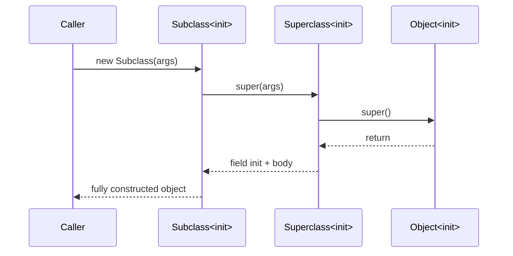
- **JVM Behaviour** — Constructors compile to methods named `<init>` in the class file; bytecode verifier enforces that `super()`/`this()` is the first instruction and that `this` isn't used before the super constructor completes.

#### Interview Questions
**Basic**
1. Can a constructor be `private`? Why would you do that?
2. What is constructor chaining?

**Intermediate**
1. What is the default constructor and when does the compiler NOT generate one?
2. Can a constructor call an overridable method safely?

**Advanced**
1. Why can't constructors be `static`, `final`, or `abstract`?
2. How does constructor execution order work in a deep inheritance hierarchy?

**Scenario-based**
1. A subclass constructor throws an NPE when calling an overridden method — what design flaw is likely present?

#### Detailed Answers
1. **Q: Private constructor use case?** A: Yes — used in Singleton pattern, utility classes (all-static members), or to force object creation via static factory methods for more control/naming flexibility.
2. **Q: Constructor chaining?** A: Calling one constructor from another using `this(...)` (same class) or `super(...)` (parent class) to avoid duplicating initialization logic.
3. **Q: Default constructor rules?** A: The compiler auto-generates a no-arg constructor only if the class declares no constructors at all; once you define any constructor, the default is not generated.
4. **Q: Calling overridable methods from constructor?** A: It's unsafe — if a subclass overrides that method and the subclass's own fields aren't initialized yet (since super() runs first), the override may operate on partially-constructed state, causing subtle bugs.
5. **Q: Why not static/final/abstract constructors?** A: Constructors aren't inherited or polymorphically dispatched like normal methods, so `final`/`abstract` (which control overriding) are meaningless; `static` conflicts with the concept of initializing a specific instance (`this`).
6. **Q: Constructor execution order?** A: Starts from `Object` down to the most derived class — each level's `super()` call completes fully (including that level's field initializers and constructor body) before returning control to the subclass constructor body.
7. **Q: NPE from constructor calling overridden method?** A: Classic "constructor calls overridable method" anti-pattern — the base constructor invokes a method the subclass overrides, but the subclass's fields referenced in the override haven't been initialized yet, causing NPEs. Fix: mark the method `final` or avoid calling overridable methods from constructors.

#### Code Examples
```java
public class Employee {
    private final String name;
    private final String department;

    // Primary constructor
    public Employee(String name, String department) {
        this.name = name;
        this.department = department;
    }

    // Overloaded constructor chaining to the primary one
    public Employee(String name) {
        this(name, "Unassigned");
    }

    @Override
    public String toString() {
        return name + " (" + department + ")";
    }

    public static void main(String[] args) {
        System.out.println(new Employee("Ravi", "Engineering"));
        System.out.println(new Employee("Meera")); // uses chained constructor
    }
}
```

### Method

#### Theory
- **Core Concepts** — A method is a named, reusable block of behaviour associated with a class, operating on instance state (instance method) or independent of it (`static` method). Methods define a signature (name + parameter types) and are the unit of dynamic dispatch for polymorphism.
- **Internal Working** — Compiled into the class file with a descriptor encoding parameter/return types; instance methods are invoked via `invokevirtual` (dynamic dispatch through the vtable), while `static`/`private`/constructors use `invokestatic`/`invokespecial` (direct dispatch).
- **When to Use It** — Extract any reusable, testable unit of behaviour; prefer instance methods when behaviour depends on object state, `static` when it doesn't.
- **Advantages** — Encapsulates behaviour, enables code reuse, supports polymorphic dispatch, improves testability.
- **Limitations** — Overloading resolution is compile-time only and can be surprising with autoboxing/varargs; excessive parameters hurt readability (mitigated by parameter objects/builders).

#### Internal Working
- **Step-by-Step Explanation** — When a method is called, the JVM pushes an operand-stack frame, resolves the target via the method's invocation bytecode, and (for virtual calls) looks up the actual method in the runtime type's virtual method table (vtable) rather than the compile-time reference type — this is what enables overriding/polymorphism.
- **Memory Layout** — Each method invocation gets its own stack frame (local variable array + operand stack) on the calling thread's stack; the method's bytecode itself is stored once in Metaspace, shared by all instances.
- **Diagrams**
```
Thread Stack                     Metaspace
+-------------------+            +------------------+
| frame: main()      |            | Class metadata   |
|  locals, op-stack  |   calls -->|  vtable: [m1,m2] |
+-------------------+            +------------------+
| frame: someMethod()|
+-------------------+
```
- **JVM Behaviour** — `invokevirtual`/`invokeinterface` perform dynamic dispatch each call (vtable/itable lookup); the JIT compiler devirtualizes calls (inlining) when it can prove a monomorphic call site, then deoptimizes if a new subtype later violates that assumption.

#### Interview Questions
**Basic**
1. What is a method signature and what is NOT part of it?
2. Difference between a method and a function in Java's context?

**Intermediate**
1. How does the JVM choose which overload to call vs which override to call?
2. What is method overloading resolution order with autoboxing and varargs?

**Advanced**
1. What is a vtable and how does it enable runtime polymorphism?
2. What is JIT devirtualization/inlining and when does deoptimization happen?

**Scenario-based**
1. Adding a new subclass overload unexpectedly changes which method gets called at a call site that previously worked correctly — explain why.

#### Detailed Answers
1. **Q: What's in a method signature?** A: Name + parameter types (and their order); the return type and `throws` clause are NOT part of the signature for overload resolution purposes (though return type participates in covariant override checks).
2. **Q: Method vs function?** A: Java has no free-standing functions — all methods belong to a class/interface; "function" is often used loosely for `static` methods or functional-interface lambdas.
3. **Q: Overload vs override resolution?** A: Overload resolution happens at **compile time** based on the static/reference type and best-matching parameter types; override resolution (dynamic dispatch) happens at **runtime** based on the actual object's class, looked up via the vtable.
4. **Q: Overload resolution order?** A: The compiler prefers, in order: (1) exact match without boxing/varargs, (2) match via widening primitive conversion, (3) match via autoboxing/unboxing, (4) match via varargs — the most specific applicable method wins.
5. **Q: What is a vtable?** A: A per-class array of method pointers indexed consistently across a hierarchy; overriding a method replaces its slot, so calling through a superclass reference still jumps to the subclass's implementation at runtime — the mechanism underlying dynamic dispatch.
6. **Q: JIT devirtualization/deoptimization?** A: When a call site has observed only one concrete receiver type, C2 can inline the call directly (devirtualize) skipping vtable lookup; if a new subtype is loaded later that could target that call site, the JVM deoptimizes back to the interpreter/vtable dispatch and may re-profile.
7. **Q: New overload changes call resolution?** A: Because overload resolution is static and based on compile-time argument types, adding a more-specific overload can cause previously-compiled call sites (once recompiled) to bind to the new overload instead of the old one — a classic overload-ambiguity/binary-compatibility pitfall.

#### Code Examples
```java
public class Shape {
    double area() { return 0; }
}
class Circle extends Shape {
    private final double radius;
    Circle(double r) { radius = r; }
    @Override double area() { return Math.PI * radius * radius; } // overriding: runtime dispatch
}
class Calculator {
    // Overloading: compile-time resolution based on parameter types
    int add(int a, int b) { return a + b; }
    double add(double a, double b) { return a + b; }

    public static void main(String[] args) {
        Shape s = new Circle(2.0);
        System.out.println(s.area()); // dispatches to Circle.area() at runtime

        Calculator c = new Calculator();
        System.out.println(c.add(2, 3));       // int overload
        System.out.println(c.add(2.5, 3.5));   // double overload
    }
}
```

### Object Lifecycle

#### Theory
- **Core Concepts** — The object lifecycle covers the phases an object passes through: allocation, initialization, active use, becoming unreachable, and garbage collection (reclaiming memory).
- **Internal Working** — Allocation occurs on `new` (TLAB bump-pointer); the object survives as long as it's reachable from GC roots; once unreachable, it becomes eligible for collection by the chosen GC algorithm, potentially after finalization/cleaner hooks run.
- **When to Use It** — Understanding this lifecycle matters for resource management (try-with-resources vs relying on finalizers), performance tuning, and diagnosing memory leaks.
- **Advantages** — Automatic memory management removes manual `free()`-style bugs (dangling pointers, double frees).
- **Limitations** — GC timing is non-deterministic; relying on `finalize()`/timely collection for critical cleanup (e.g., closing file handles) is unsafe — explicit resource management (`AutoCloseable`) is required.

#### Internal Working
- **Step-by-Step Explanation** — (1) Allocation: `new` reserves heap space, typically in Eden via TLAB; (2) Initialization: fields default-zeroed then constructor chain runs; (3) In-use: object referenced from GC roots (stack locals, static fields, active threads); (4) Unreachable: no live reference path from any GC root; (5) Collection: GC identifies it as garbage (mark phase) and reclaims space (sweep/compact/copy), potentially promoting surviving neighbors between generations.
- **Memory Layout** — Young generation (Eden + two Survivor spaces) hosts new objects; objects surviving multiple minor GCs are promoted to the Old generation; Metaspace holds class metadata for the object's type, separate from instance data.
- **Diagrams**
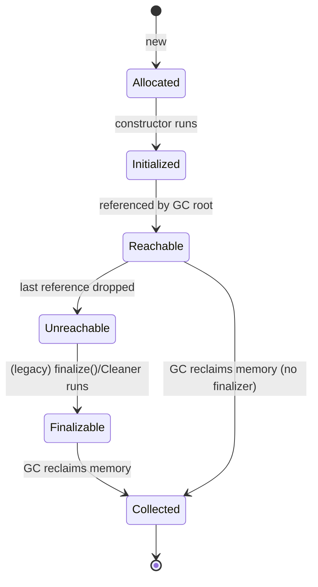
- **JVM Behaviour** — Minor GCs use a copying collector between Eden/Survivor spaces (cheap because most objects die young — "weak generational hypothesis"); Major/Full GCs handle the Old generation with mark-sweep-compact (or region-based, e.g., G1). `finalize()` is deprecated/removed emphasis in favor of `java.lang.ref.Cleaner` and try-with-resources.

#### Interview Questions
**Basic**
1. What are the main phases of an object's life in Java?
2. What makes an object eligible for garbage collection?

**Intermediate**
1. Why is `finalize()` discouraged, and what replaces it?
2. What's the difference between minor and major/full GC in relation to object lifecycle?

**Advanced**
1. What is the generational hypothesis and how does it shape object promotion?
2. How do soft/weak/phantom references interact with the object lifecycle?

**Scenario-based**
1. Objects are being promoted to Old Gen too quickly, causing frequent full GCs — what lifecycle-related tuning would you investigate?

#### Detailed Answers
1. **Q: Main lifecycle phases?** A: Allocation → initialization → reachable/in-use → unreachable → garbage collected (memory reclaimed).
2. **Q: Eligibility for GC?** A: An object is eligible once it's no longer reachable via any chain of references from a GC root (local variables on active thread stacks, static fields, JNI handles, etc.).
3. **Q: Why avoid `finalize()`?** A: It runs at an unpredictable time (or never), can resurrect objects, slows GC, and can hide exceptions — replaced by `AutoCloseable`/try-with-resources for deterministic cleanup and `java.lang.ref.Cleaner` for safety-net cleanup.
4. **Q: Minor vs major GC?** A: Minor GC collects the young generation only (fast, frequent, copying collector); major/full GC collects the old generation (and often the whole heap), is more expensive, and directly affects long-lived object lifecycles.
5. **Q: Generational hypothesis?** A: Most objects die young; therefore the heap is split into young (cheap, frequent collection) and old (rare, expensive collection) generations, and objects surviving several minor GCs are promoted to old gen via tenuring thresholds.
6. **Q: Reference types and lifecycle?** A: Soft references are cleared only under memory pressure (good for caches); weak references are cleared as soon as the object is otherwise unreachable (good for canonicalizing maps); phantom references are enqueued only after finalization, used for precise post-mortem cleanup via `ReferenceQueue`.
7. **Q: Premature promotion causing full GCs?** A: Investigate survivor space sizing (`-XX:SurvivorRatio`), tenuring threshold (`-XX:MaxTenuringThreshold`), and whether object lifetimes genuinely exceed young-gen capacity (e.g., large temporary collections) — undersized young gen forces premature promotion.

#### Code Examples
```java
import java.lang.ref.WeakReference;

public class LifecycleDemo {
    static class Resource {
        private final String name;
        Resource(String name) { this.name = name; }
        @Override protected void finalize() { /* discouraged - shown for illustration only */ }
    }

    public static void main(String[] args) throws InterruptedException {
        Resource r = new Resource("file-handle");
        WeakReference<Resource> weakRef = new WeakReference<>(r);

        r = null; // drop the strong reference -> object becomes unreachable
        System.gc(); // request (not guarantee) collection
        Thread.sleep(100);

        System.out.println("Collected: " + (weakRef.get() == null));
    }
}
```

## Encapsulation

### Data Hiding

#### Theory
- **Core Concepts** — Data hiding restricts direct external access to an object's internal state, typically via `private` fields, exposing behaviour through a controlled public API.
- **Internal Working** — Enforced purely at compile time by the access-modifier checks in `javac`/JVM bytecode verifier; there is no runtime cost to hiding a field.
- **When to Use It** — Always default fields to `private` unless there's a specific reason for wider visibility; expose only what callers legitimately need.
- **Advantages** — Protects invariants, allows internal representation to change without breaking callers, reduces coupling.
- **Limitations** — Reflection can bypass `private` access (`setAccessible(true)`), so it's not a security boundary, only a design discipline.

#### Internal Working
- **Step-by-Step Explanation** — At compile time, `javac` checks every field/method access against the declaring class's access modifier and the accessing code's location (same class, package, subclass, or anywhere); violations are compile errors. The compiled class file still records the modifier as an access flag on the field/method.
- **Memory Layout** — Not directly applicable — access modifiers affect only visibility/compile-time checks, not memory placement (private and public fields are stored identically in the object's memory layout).
- **Diagrams**
```
External code  --X-->  private field (compile error)
External code  ---->  public getter() ----> reads private field internally
```
- **JVM Behaviour** — Access flags (`ACC_PRIVATE`, `ACC_PUBLIC`, etc.) are stored in the field/method table of the class file; the JVM verifier double-checks access rules at link time too (defense in depth beyond javac), rejecting illegally-crafted bytecode that violates access control.

#### Interview Questions
**Basic**
1. Why make fields `private` instead of `public`?
2. Does data hiding have any runtime performance cost?

**Intermediate**
1. Can reflection bypass data hiding? How?
2. How does data hiding relate to the concept of an invariant?

**Advanced**
1. How is access control enforced at the bytecode/JVM level, not just by the compiler?

**Scenario-based**
1. A library exposes a public mutable field for a "balance"; users report inconsistent state after concurrent updates — how would encapsulating it fix this?

#### Detailed Answers
1. **Q: Why private fields?** A: To prevent external code from directly setting fields to invalid values, so the class alone controls how/when its state changes, preserving invariants.
2. **Q: Runtime cost?** A: None — access control is a compile-time/verification-time check; getter/setter calls may be inlined by the JIT to have zero overhead versus direct field access.
3. **Q: Reflection bypassing hiding?** A: Yes, via `field.setAccessible(true)` (subject to module/security-manager restrictions), which disables the normal access checks — meaning data hiding is a design contract, not an absolute security guarantee.
4. **Q: Relation to invariants?** A: An invariant is a condition that must always hold for valid objects (e.g., balance >= 0); hiding fields ensures the only way to mutate state is through methods that can validate/maintain that invariant.
5. **Q: Bytecode-level enforcement?** A: Field/method access flags are embedded in the class file; both `javac` and the JVM's bytecode verifier check accessing code against the declaring type's package/class/subclass relationship at link time, rejecting bytecode that violates them even if hand-crafted.
6. **Q: Public mutable balance field?** A: Hiding it behind private state + synchronized/atomic mutator methods (e.g., `deposit()`/`withdraw()`) lets the class enforce atomicity and validation centrally, instead of relying on every caller to coordinate correctly.

#### Code Examples
```java
public class Account {
    private double balance; // hidden: cannot be set directly from outside

    public synchronized void deposit(double amount) {
        if (amount <= 0) throw new IllegalArgumentException("amount must be positive");
        balance += amount;
    }

    public synchronized double getBalance() { return balance; }
}
```

### Getters/Setters

#### Theory
- **Core Concepts** — Getters and setters are public accessor/mutator methods providing controlled read/write access to private fields, forming the standard JavaBeans convention (`getX()`/`setX()`/`isX()`).
- **Internal Working** — Plain method calls; the JIT typically inlines trivial getters/setters so there's no overhead versus direct field access once hot.
- **When to Use It** — Use when you need validation, computed values, lazy initialization, or a stable API surface that can evolve independently of internal representation.
- **Advantages** — Allows validation/logic on mutation, supports future refactoring without breaking callers, enables read-only (getter-only) fields.
- **Limitations** — Blind auto-generation of getters/setters for every field can leak mutability and break encapsulation ("anemic" objects); overused, they just add boilerplate without real behaviour.

#### Internal Working
- **Step-by-Step Explanation** — A getter/setter is compiled like any other method (`invokevirtual`); when the JIT identifies a hot, monomorphic call site calling a trivial one-line accessor, it inlines the accessor body directly at the call site, eliminating the call overhead entirely.
- **Memory Layout** — Not directly applicable — no additional memory beyond the underlying field; the methods themselves live once in Metaspace as bytecode.
- **Diagrams**
```
caller.getBalance()  --(JIT inlining)-->  caller reads field directly (no call overhead)
```
- **JVM Behaviour** — Before JIT warm-up, calls go through normal virtual dispatch; after profiling identifies the method as hot and monomorphic, C2 inlines it, effectively making a getter as fast as direct field access.

#### Interview Questions
**Basic**
1. What is the JavaBeans naming convention for getters/setters?
2. Should every private field automatically get a public getter and setter?

**Intermediate**
1. How can a setter enforce a class invariant that a public field cannot?
2. What's the performance difference between calling a getter and accessing a field directly?

**Advanced**
1. How does exposing a mutable object via a getter break encapsulation even if the field itself is private?

**Scenario-based**
1. A `getAddresses()` getter returns the internal `List` directly, and a caller mutates it, corrupting internal state — how do you fix this?

#### Detailed Answers
1. **Q: JavaBeans convention?** A: `getFoo()`/`setFoo(value)` for regular fields, `isFoo()` for booleans, all public, no-arg getters and single-arg setters, enabling frameworks (reflection-based tools, serializers) to discover properties by convention.
2. **Q: Auto-generate for every field?** A: No — blindly doing so defeats encapsulation (equivalent to public fields); expose only what's needed, and prefer immutability (getter-only) unless mutation is truly required.
3. **Q: Setter enforcing invariant?** A: A setter can validate input (`if (age < 0) throw ...`) before assignment, something a public field cannot do since any code can assign it directly, bypassing validation.
4. **Q: Performance difference?** A: Negligible once JIT-warmed — trivial getters are typically inlined; a cold/first-few calls pay virtual-dispatch overhead, which is usually irrelevant.
5. **Q: Getter exposing mutable object?** A: If a getter returns a direct reference to an internal mutable object (e.g., a `List` or `Date`), callers can mutate the internals despite the field being `private` — true encapsulation requires returning defensive copies or immutable views.
6. **Q: Fixing `getAddresses()` leak?** A: Return an unmodifiable view (`Collections.unmodifiableList(addresses)`) or a defensive copy, so external mutation cannot affect the internal list.

#### Code Examples
```java
import java.util.ArrayList;
import java.util.Collections;
import java.util.List;

public class Person {
    private String name;
    private final List<String> addresses = new ArrayList<>();

    public String getName() { return name; }
    public void setName(String name) {
        if (name == null || name.isBlank()) throw new IllegalArgumentException("name required");
        this.name = name;
    }

    // Returns an unmodifiable view to prevent external mutation of internal state
    public List<String> getAddresses() { return Collections.unmodifiableList(addresses); }

    public void addAddress(String address) { addresses.add(address); }
}
```

### Immutable Objects

#### Theory
- **Core Concepts** — An immutable object's state cannot change after construction — all fields are set once (typically `final`) and never reassigned; `String`, `Integer`, and `LocalDate` are canonical JDK examples.
- **Internal Working** — Achieved by making the class `final` (or otherwise preventing subclassing that adds mutability), all fields `private final`, no setters, and defensive copies of any mutable inputs/outputs.
- **When to Use It** — Ideal for value objects, keys in hash-based collections, objects shared across threads, and any data that represents a fixed fact (money amounts, coordinates, dates).
- **Advantages** — Inherently thread-safe (no synchronization needed), safe to share/cache, simplifies reasoning (no aliasing bugs), safe as `HashMap` keys.
- **Limitations** — Every "change" requires creating a new object, which can increase allocation/GC pressure for high-frequency mutation scenarios.

#### Internal Working
- **Step-by-Step Explanation** — The constructor fully initializes all `final` fields (defensively copying any mutable arguments); no method thereafter modifies them; any "mutator" method instead returns a new instance with the updated state (e.g., `LocalDate.plusDays()`).
- **Memory Layout** — Immutable objects live on the heap like any object; because `final` fields are guaranteed fully initialized before the constructor returns (JMM "final field" semantics), other threads are guaranteed to see a fully-constructed, consistent object without extra synchronization, as long as the reference doesn't escape during construction.
- **Diagrams**
```
new Money(100, "USD")  -->  Money{amount=100, currency=USD} (fixed forever)
money.add(50)          -->  returns NEW Money{amount=150, currency=USD}; original untouched
```
- **JVM Behaviour** — The Java Memory Model gives special guarantees for `final` fields: once the constructor finishes, any thread that obtains a reference to the object sees the correctly initialized `final` fields without needing a happens-before edge via locks — this is why immutable objects are safely publishable across threads.

#### Interview Questions
**Basic**
1. What makes an object immutable in Java?
2. Name three immutable classes in the JDK.

**Intermediate**
1. Why are immutable objects inherently thread-safe?
2. How do you make a class truly immutable if it has a mutable field like a `List` or `Date`?

**Advanced**
1. How does the Java Memory Model's treatment of `final` fields make safe publication possible without synchronization?
2. Why should an immutable class be declared `final` (or use another technique) to prevent subclass mutability?

**Scenario-based**
1. You need a `Point` class used as a `HashMap` key across many threads — justify why immutability is the right design.

#### Detailed Answers
1. **Q: What makes a class immutable?** A: All fields `private final`, set only in the constructor, no setters, the class is `final` or constructors are the only way to build it, and any mutable field references are defensively copied in and out.
2. **Q: Three immutable JDK classes?** A: `String`, `Integer` (and other boxed primitives), `LocalDate`/`LocalDateTime` (`java.time` types), `BigDecimal`.
3. **Q: Why thread-safe?** A: Since state never changes after construction, there's no possible data race on mutation — multiple threads reading the same fields concurrently is always safe with no locking needed.
4. **Q: Making truly immutable with mutable fields?** A: Defensively copy mutable inputs in the constructor (`this.dates = new ArrayList<>(dates)`) and return defensive copies or unmodifiable views from getters, so no external code can hold a reference to and mutate the internal state.
5. **Q: JMM `final` field guarantee?** A: The JMM inserts an implicit "freeze" barrier at the end of the constructor for `final` fields, ensuring that once a reference to the object is visible to another thread (safe publication), that thread is guaranteed to see the fully initialized final field values, without needing locks.
6. **Q: Why declare immutable class `final`?** A: If not final, a subclass could add mutable state or override methods to break the immutability contract; sealing the class (or making constructors private with static factories) prevents that.
7. **Q: `Point` as thread-shared `HashMap` key?** A: Immutability guarantees the key's `hashCode()`/`equals()` never change after insertion (avoiding "lost" entries in the map) and requires no synchronization for concurrent reads across threads.

#### Code Examples
```java
import java.util.Collections;
import java.util.List;
import java.util.ArrayList;

public final class Money {
    private final long cents;
    private final String currency;

    public Money(long cents, String currency) {
        this.cents = cents;
        this.currency = currency;
    }

    // "Mutation" returns a new instance instead of changing state
    public Money add(Money other) {
        if (!currency.equals(other.currency)) throw new IllegalArgumentException("currency mismatch");
        return new Money(this.cents + other.cents, currency);
    }

    public long getCents() { return cents; }

    public static void main(String[] args) {
        Money price = new Money(1000, "USD");
        Money discount = new Money(-200, "USD");
        Money finalPrice = price.add(discount);
        System.out.println(price.getCents());      // 1000 - unchanged
        System.out.println(finalPrice.getCents());  // 800 - new object
    }
}
```

### Defensive Copying

#### Theory
- **Core Concepts** — Defensive copying means creating a new copy of a mutable object when it enters or leaves a class's boundary (constructor argument, getter return value) so external code cannot mutate the class's internal state through an aliased reference.
- **Internal Working** — Implemented by copying the mutable object (e.g., `new ArrayList<>(input)`, `(Date) date.clone()`) rather than storing/returning the original reference.
- **When to Use It** — Whenever a class accepts or exposes mutable types (collections, arrays, `Date`) and must preserve its own invariants/immutability guarantees.
- **Advantages** — Preserves encapsulation and immutability guarantees even when working with inherently mutable types; prevents "temporal coupling" bugs where external mutation silently corrupts internal state.
- **Limitations** — Adds allocation and copying overhead (O(n) for collections/arrays); can be forgotten easily, silently reintroducing aliasing bugs.

#### Internal Working
- **Step-by-Step Explanation** — On input: copy the caller-supplied mutable object into a new instance before storing it as a field. On output: return a copy (or unmodifiable wrapper) instead of the live field reference. This severs the aliasing chain between caller and callee's internal state.
- **Memory Layout** — Not directly applicable at the JVM level — this is a design-pattern-level concern; the only memory effect is additional heap allocations for the copies.
- **Diagrams**
```
Caller's List  --(constructor copies)-->  Internal List (separate memory)
Caller mutates their List afterward   --X-->  Internal List unaffected
```
- **JVM Behaviour** — No special JVM behaviour; simply additional object allocations subject to normal GC (often short-lived, collected quickly in young gen if the copy itself isn't retained long-term, but here the copy IS the retained state).

#### Interview Questions
**Basic**
1. What problem does defensive copying solve?
2. Give an example of a JDK type that commonly needs defensive copying.

**Intermediate**
1. What's the difference between defensive copying and returning an unmodifiable view?
2. Where in a class's lifecycle should defensive copies be made?

**Advanced**
1. Is defensive copying necessary for immutable elements like `String` stored in a `List`? Why or why not?
2. How does defensive copying interact with deep vs shallow copy semantics?

**Scenario-based**
1. A `DateRange` class stores `java.util.Date start/end` fields directly from constructor args, and later callers mutate the original `Date` objects, silently changing the range — how do you fix this with defensive copying?

#### Detailed Answers
1. **Q: What problem does it solve?** A: It prevents external code from retaining a reference to a mutable object passed into (or returned from) a class and later mutating it to corrupt the class's internal state without going through the class's own API.
2. **Q: Example JDK type needing it?** A: `java.util.Date` (mutable, unlike `java.time` types) and mutable collections (`ArrayList`, `HashMap`) passed into constructors.
3. **Q: Defensive copy vs unmodifiable view?** A: A defensive copy creates an entirely separate object (safe from mutation of the original AND prevents callers from mutating the copy affecting internals); an unmodifiable view (`Collections.unmodifiableList`) wraps the same underlying list — it stops the caller from mutating via the view, but the underlying list can still change if the original owner mutates it, and it's read-only, not immune to underlying changes.
4. **Q: Where to copy?** A: On the way in (constructor/setter, copying the caller's argument) and on the way out (getter, copying or wrapping the internal field) — both boundaries need protection.
5. **Q: Needed for immutable elements?** A: Copying individual immutable elements (like `String`s) is unnecessary since they can't be mutated; however, the **collection/container itself** (e.g., the `List`) is often mutable and still needs copying/wrapping even if its elements are immutable.
6. **Q: Deep vs shallow interaction?** A: A shallow defensive copy (`new ArrayList<>(list)`) protects against the container being mutated (add/remove) but not against mutation of the contained mutable elements themselves; a deep copy also clones each mutable element, needed when elements themselves are mutable.
7. **Q: Fixing mutable `Date` fields?** A: Copy the `Date` on the way in (`this.start = new Date(start.getTime())`) and return copies from getters (`return new Date(start.getTime())`), or better, migrate to immutable `java.time.LocalDate`.

#### Code Examples
```java
import java.util.ArrayList;
import java.util.Collections;
import java.util.Date;
import java.util.List;

public class DateRange {
    private final Date start;
    private final Date end;

    public DateRange(Date start, Date end) {
        // Defensive copy on input: caller can't mutate our internal state later
        this.start = new Date(start.getTime());
        this.end = new Date(end.getTime());
    }

    // Defensive copy on output: caller can't mutate our internal state via the getter
    public Date getStart() { return new Date(start.getTime()); }
    public Date getEnd() { return new Date(end.getTime()); }
}

class Roster {
    private final List<String> members = new ArrayList<>();
    public void addMember(String name) { members.add(name); }
    // Return an unmodifiable view instead of the live reference
    public List<String> getMembers() { return Collections.unmodifiableList(members); }
}
```

## Inheritance

### Single

#### Theory
- **Core Concepts** - Single inheritance means a class extends exactly one direct superclass, inheriting its accessible fields/methods, forming a simple two-level (or deeper linear) hierarchy.
- **Internal Working** - The subclass's `Class` metadata stores a pointer to its single superclass; the vtable is built by extending the superclass's vtable with new/overridden slots.
- **When to Use It** - Use when a subclass is genuinely a specialized form of one parent ("is-a" relationship), e.g., `SavingsAccount extends Account`.
- **Advantages** - Simple, unambiguous method resolution; avoids the diamond problem entirely.
- **Limitations** - A class can only specialize one type; combining behaviours from multiple unrelated sources requires composition or interfaces instead.

#### Internal Working
- **Step-by-Step Explanation** - The subclass's constructor implicitly/explicitly calls `super()` first; its vtable is derived by copying the parent's vtable and overwriting entries for overridden methods, appending new slots for new methods.
- **Memory Layout** - An instance's memory contains the superclass's fields followed by the subclass's own fields, laid out contiguously in the object on the heap; there's exactly one "copy" of inherited state per object (no diamond duplication).
- **Diagrams**
```
Account (balance)
   |
   v  extends
SavingsAccount (interestRate)  -- object layout: [balance][interestRate]
```
- **JVM Behaviour** - `invokevirtual` on a `SavingsAccount` reference calls through the merged vtable; if `SavingsAccount` doesn't override a method, the inherited slot still points to `Account`'s implementation.

#### Interview Questions
**Basic**
1. What does "is-a" relationship mean in the context of single inheritance?
2. Can a Java class extend more than one class?

**Intermediate**
1. How are inherited fields laid out in a subclass instance?
2. What happens if a subclass doesn't override a superclass method?

**Advanced**
1. How does single inheritance simplify vtable construction compared to multiple inheritance?

**Scenario-based**
1. You need a `SavingsAccount` to behave like an `Account` but also need auditable behaviour shared with unrelated classes - how do you achieve this without multiple class inheritance?

#### Detailed Answers
1. **Q: "Is-a" meaning?** A: The subclass is a more specific kind of the superclass and can be used anywhere the superclass is expected (Liskov substitutability), e.g., a `SavingsAccount` is an `Account`.
2. **Q: Extend more than one class?** A: No - Java classes support only single inheritance of implementation (`extends` takes exactly one class); multiple interface implementation is allowed instead.
3. **Q: Inherited field layout?** A: Superclass fields occupy the earlier portion of the object's memory layout, followed by the subclass's own declared fields, forming one contiguous object.
4. **Q: Subclass doesn't override?** A: The inherited vtable slot still points to the superclass's method implementation, so calling it on the subclass instance executes the superclass's code unchanged.
5. **Q: Simplifies vtable construction?** A: With one parent, the vtable is a straightforward linear extension (copy + append/override); multiple inheritance would require resolving ambiguous slots when two parents define conflicting methods (the diamond problem), needing complex resolution rules.
6. **Q: Combining unrelated behaviours?** A: Implement multiple interfaces (optionally with default methods) or use composition (delegate to helper objects) instead of trying to extend multiple classes.

#### Code Examples
```java
class Account {
    protected double balance;
    Account(double balance) { this.balance = balance; }
    void withdraw(double amt) { balance -= amt; }
}

class SavingsAccount extends Account { // single inheritance
    private final double interestRate;
    SavingsAccount(double balance, double rate) {
        super(balance);
        this.interestRate = rate;
    }
    void applyInterest() { balance += balance * interestRate; }

    public static void main(String[] args) {
        SavingsAccount sa = new SavingsAccount(1000, 0.05);
        sa.applyInterest();
        sa.withdraw(50); // inherited method
        System.out.println(sa.balance);
    }
}
```

### Multilevel

#### Theory
- **Core Concepts** - Multilevel inheritance is a chain where a class extends a class that itself extends another class (A -> B -> C), forming a hierarchy deeper than two levels.
- **Internal Working** - Each level's constructor chains via `super()` up to `Object`; the vtable accumulates overrides/additions at every level.
- **When to Use It** - Use to model progressively more specialized abstractions, e.g., `Vehicle -> Car -> ElectricCar`.
- **Advantages** - Enables incremental specialization and reuse across multiple levels of abstraction.
- **Limitations** - Deep chains increase coupling and fragility ("fragile base class" problem) - a change at the top can ripple through every descendant; harder to reason about which level defines a given behaviour.

#### Internal Working
- **Step-by-Step Explanation** - Construction proceeds top-down: `Object() -> A() -> B() -> C()`; each constructor's body runs only after its direct superclass constructor completes. Method resolution walks the merged vtable which may have been overridden at any intermediate level.
- **Memory Layout** - The instance's fields are the union of fields declared at every level (A's fields, then B's, then C's), all part of one contiguous object on the heap.
- **Diagrams**
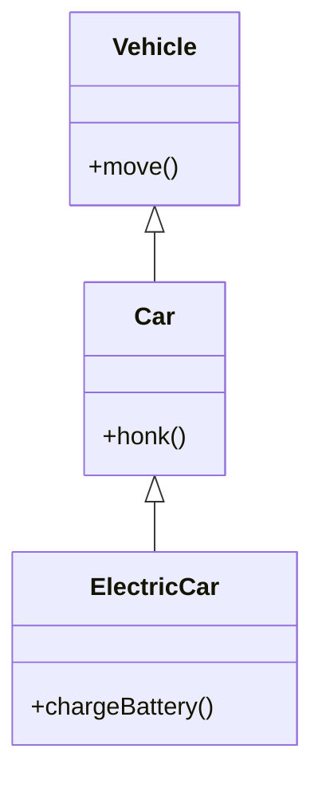
- **JVM Behaviour** - A call to `move()` on an `ElectricCar` reference resolves via the vtable to whichever level last overrode it (could be `Vehicle`, `Car`, or `ElectricCar`); `super.method()` calls use `invokespecial` to bypass dynamic dispatch and directly target the immediate parent's implementation.

#### Interview Questions
**Basic**
1. Give an example of a 3-level inheritance chain.
2. In what order do constructors run in a multilevel hierarchy?

**Intermediate**
1. What is the "fragile base class" problem and how does multilevel inheritance make it worse?
2. How does `super.method()` differ from a normal virtual call in a multilevel chain?

**Advanced**
1. How would you refactor a deep, fragile inheritance chain using composition?

**Scenario-based**
1. `ElectricCar extends Car extends Vehicle`; a change to `Vehicle.move()` breaks `ElectricCar` behaviour unexpectedly - what does this indicate about the design, and how would you fix it?

#### Detailed Answers
1. **Q: Example 3-level chain?** A: `Animal -> Mammal -> Dog`, each level adding more specific state/behaviour.
2. **Q: Constructor order?** A: Top-down - `Object`, then the topmost user class, down through each intermediate level, to the most-derived class, each completing its own body before returning to the caller level.
3. **Q: Fragile base class problem?** A: Changes to a base class's implementation can unintentionally break subclasses that depend on its exact prior behaviour; multilevel inheritance compounds this because a change at the top can ripple through multiple intermediate levels, each of which may have made assumptions about the one above.
4. **Q: `super.method()` vs virtual call?** A: `super.method()` compiles to `invokespecial`, statically binding to the immediate parent's implementation regardless of the actual runtime type, whereas a normal call (`this.method()` or via a reference) uses `invokevirtual`, dispatching dynamically based on the runtime type's vtable.
5. **Q: Refactoring deep chains?** A: Replace inheritance with composition - have `ElectricCar` hold a `Vehicle`/`Engine` object and delegate to it, or extract shared behaviour into interfaces with default methods, reducing rigid coupling to a fixed class chain.
6. **Q: Unexpected breakage from `Vehicle.move()` change?** A: Indicates tight coupling from over-reliance on implementation inheritance; the fix is to depend on abstractions (interfaces) or use composition/delegation so intermediate levels aren't silently affected by base class internals changing.

#### Code Examples
```java
class Vehicle {
    void move() { System.out.println("Vehicle moving"); }
}
class Car extends Vehicle {
    @Override void move() { super.move(); System.out.println("Car driving on road"); }
}
class ElectricCar extends Car {
    @Override void move() { super.move(); System.out.println("ElectricCar silently gliding"); }

    public static void main(String[] args) {
        Vehicle v = new ElectricCar();
        v.move();
    }
}
```

### Hierarchical

#### Theory
- **Core Concepts** - Hierarchical inheritance is when multiple subclasses independently extend the same single superclass (one parent, many children), e.g., `Dog` and `Cat` both extend `Animal`.
- **Internal Working** - Each subclass has its own independent vtable derived from the same parent vtable; siblings share no direct relationship other than the common ancestor.
- **When to Use It** - Use when several distinct types share common state/behaviour but diverge in specialization, enabling polymorphic treatment via the shared supertype.
- **Advantages** - Promotes code reuse of common logic in the parent; enables polymorphic collections (`List<Animal>`) holding mixed subtypes.
- **Limitations** - Siblings can't share code with each other directly (only through the common parent); overly generic parents accumulate unrelated logic ("god class" risk) trying to serve all children.

#### Internal Working
- **Step-by-Step Explanation** - Each sibling subclass independently extends the parent, gets its own `Class` object/vtable, and can override parent methods without affecting other siblings; instances of different siblings are entirely separate objects, only unified by the shared supertype reference type.
- **Memory Layout** - Each sibling's instances contain the parent's fields plus their own; a `Dog` object and a `Cat` object have different total sizes/layouts despite sharing the `Animal` portion's structure.
- **Diagrams**
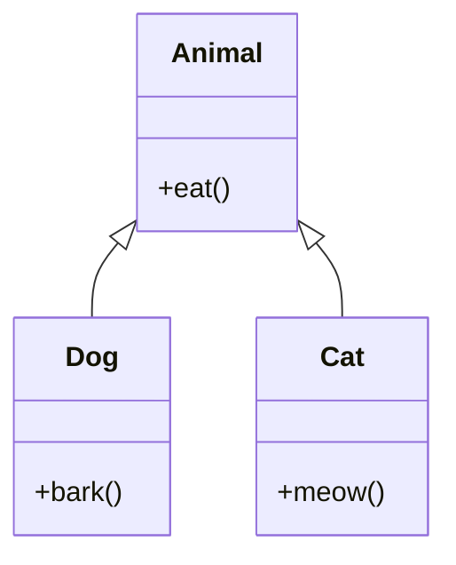
- **JVM Behaviour** - A `List<Animal>` holding both `Dog` and `Cat` instances dispatches `eat()`/overridden methods via each object's own vtable at runtime (`invokevirtual`), so mixed-type polymorphic iteration works transparently.

#### Interview Questions
**Basic**
1. What is hierarchical inheritance? Give an example.
2. Can two sibling subclasses call each other's methods directly?

**Intermediate**
1. How does hierarchical inheritance enable polymorphic collections?
2. What risk does a shared parent class introduce as more siblings are added?

**Advanced**
1. How would you refactor a hierarchical inheritance tree where the parent has accumulated many sibling-specific conditional branches?

**Scenario-based**
1. You have `Dog`, `Cat`, `Bird` all extending `Animal`; a new requirement needs `Bird`-specific `fly()` behaviour usable polymorphically - how do you design this cleanly?

#### Detailed Answers
1. **Q: What is hierarchical inheritance?** A: Multiple subclasses extend the same single parent class independently, e.g., `Car` and `Motorcycle` both extending `Vehicle`.
2. **Q: Siblings calling each other?** A: Not directly through inheritance - they'd need an explicit reference to one another (composition) since inheritance only creates a parent-child relationship, not a sibling one.
3. **Q: Enabling polymorphic collections?** A: Since all siblings share the common supertype, a collection typed to that supertype (`List<Animal>`) can hold any mix of siblings, and calling shared/overridden methods dispatches correctly per actual object type.
4. **Q: Risk of accumulating siblings?** A: The parent class can become bloated with conditional logic (`if (this instanceof Dog) ...`) trying to accommodate every sibling's special case, violating single-responsibility and open/closed principles.
5. **Q: Refactoring conditional-laden parent?** A: Push sibling-specific behaviour down into each subclass via method overriding (replace conditionals with polymorphism), or extract shared behaviour into composable strategy objects/interfaces instead of one bloated parent.
6. **Q: `Bird`-specific `fly()` used polymorphically?** A: Introduce a `Flyable` interface implemented only by `Bird` (not forced onto `Dog`/`Cat`), then use `instanceof`/pattern matching or visitor-style dispatch when flying behaviour specifically is needed, keeping `Animal` free of irrelevant methods for non-flying siblings.

#### Code Examples
```java
abstract class Animal {
    protected final String name;
    Animal(String name) { this.name = name; }
    abstract String sound();
}
class Dog extends Animal {
    Dog(String name) { super(name); }
    @Override String sound() { return "Woof"; }
}
class Cat extends Animal {
    Cat(String name) { super(name); }
    @Override String sound() { return "Meow"; }
}
public class HierarchicalDemo {
    public static void main(String[] args) {
        java.util.List<Animal> animals = java.util.List.of(new Dog("Rex"), new Cat("Milo"));
        for (Animal a : animals) {
            System.out.println(a.name + " says " + a.sound());
        }
    }
}
```

### Why Java doesn't support multiple inheritance of classes

#### Theory
- **Core Concepts** - Java deliberately disallows a class from extending more than one class to avoid the "diamond problem" - ambiguity when two parents define the same method/field and a common grandparent is involved.
- **Internal Working** - The class file format and vtable-building algorithm assume exactly one superclass per class; interfaces avoid this because (pre-Java 8) they contributed no implementation, and even now default method conflicts must be explicitly resolved by the programmer.
- **When to Use It** - N/A (a design constraint) - instead use interfaces (multiple allowed) or composition to combine behaviours from multiple sources.
- **Advantages** - Eliminates ambiguous state/method resolution entirely, simplifying the language, the vtable model, and object layout.
- **Limitations** - Forces reliance on interfaces/composition when behaviour from multiple "lineages" is genuinely needed, which requires more boilerplate than C++-style multiple inheritance in some cases.

#### Internal Working
- **Step-by-Step Explanation** - If multiple class inheritance were allowed and two parents both defined field `x` or method `m()`, the compiler/runtime would face genuine ambiguity about which slot/implementation `this.x`/`this.m()` refers to (the classic diamond: `D extends B, C` where `B` and `C` both extend `A` and override `A.m()`). Java sidesteps this by capping `extends` to one class.
- **Memory Layout** - Single-superclass-only design keeps object layout simple and deterministic - each field has one unambiguous location, with no virtual-base-class offset adjustments needed as in C++.
- **Diagrams**
```
      A
     / \
    B   C      <-- if D extends B, C: which A.m() does D inherit? AMBIGUOUS
     \ /
      D
```
- **JVM Behaviour** - Since Java 8, interfaces CAN carry default method implementations, reintroducing a limited diamond scenario for behaviour (not state); if a class implements two interfaces with conflicting default methods, `javac` forces an explicit override to resolve the conflict - it never silently picks one.

#### Interview Questions
**Basic**
1. What is the diamond problem?
2. Does Java support multiple inheritance at all?

**Intermediate**
1. How do default methods in interfaces reintroduce a diamond-like scenario, and how does Java resolve it?
2. What alternatives does Java provide to achieve the benefits of multiple inheritance?

**Advanced**
1. Why is diamond ambiguity for state fundamentally worse than for behaviour (methods)?

**Scenario-based**
1. Two interfaces `Flyable` and `Swimmable` both declare a default `move()` method; a `Duck` class implements both - what happens at compile time and how do you fix it?

#### Detailed Answers
1. **Q: Diamond problem?** A: When a class inherits from two classes that share a common ancestor, and both parents override the same method (or declare the same field), there's ambiguity about which version the subclass should get.
2. **Q: Does Java support multiple inheritance at all?** A: Yes, of type (a class can implement multiple interfaces) and, since Java 8, partially of behaviour via default methods - but never multiple inheritance of class implementation/state.
3. **Q: Default methods and diamond?** A: If two implemented interfaces provide conflicting default methods, the implementing class must explicitly override the method (optionally calling `InterfaceName.super.method()` to pick one) - the compiler refuses to guess, forcing an unambiguous resolution.
4. **Q: Alternatives to multiple inheritance?** A: Interfaces (multiple implementable, optionally with default methods) and composition/delegation (holding instances of multiple helper classes and forwarding calls to them).
5. **Q: Why is state ambiguity worse?** A: Conflicting fields create genuine duplicate/ambiguous storage problems (which copy of `x` is "the" value, and how do writes to one affect the other?) - a structural/memory issue; conflicting methods are just a dispatch decision (which implementation to call), resolvable by explicit override, with no memory-layout consequence.
6. **Q: `Duck` implementing conflicting `move()` defaults?** A: Compile error ("class Duck inherits unrelated defaults for move() from Flyable and Swimmable"); fixed by `Duck` overriding `move()` itself, optionally delegating: `default void move() { Flyable.super.move(); }`.

#### Code Examples
```java
interface Flyable { default void move() { System.out.println("Flying"); } }
interface Swimmable { default void move() { System.out.println("Swimming"); } }

class Duck implements Flyable, Swimmable {
    @Override public void move() {
        Flyable.super.move();
        Swimmable.super.move();
    }

    public static void main(String[] args) {
        new Duck().move();
    }
}
```

### Method Hiding vs. Overriding (static methods) *(new)*

#### Theory
- **Core Concepts** - Method hiding applies to `static` methods: a subclass declaring a static method with the same signature as a superclass static method hides it rather than overriding it - resolution is based on the reference's compile-time type, not the runtime object type.
- **Internal Working** - Static methods are resolved via `invokestatic` at compile time (no vtable lookup), so which method runs is determined entirely by the declared (static) type of the reference used to call it.
- **When to Use It** - Rarely intentional - understanding it matters mainly to avoid the common bug of "overriding" a static method and being surprised by non-polymorphic behaviour.
- **Advantages** - Static dispatch is fast (no vtable indirection) and predictable once understood.
- **Limitations** - Easily confused with true overriding, leading to subtle bugs when static methods are called through a superclass-typed reference expecting polymorphic behaviour.

#### Internal Working
- **Step-by-Step Explanation** - At compile time, `javac` binds a static method call to the method defined in (or inherited by) the static type of the expression, embedding a direct `invokestatic` reference to that specific class's method; the actual runtime class of the object referenced (if any) is irrelevant.
- **Memory Layout** - Not directly applicable - static methods aren't part of any per-object structure; they're pure class-level bytecode in Metaspace, unrelated to instance memory layout.
- **Diagrams**
```
Parent p = new Child();
p.staticMethod();  // compiles to invokestatic Parent.staticMethod (NOT Child's!)
```
- **JVM Behaviour** - `invokestatic` bypasses dynamic dispatch entirely - there is no vtable lookup, so "hiding" is purely a compile-time name-resolution phenomenon, unlike `invokevirtual` used for true overriding.

#### Interview Questions
**Basic**
1. Can static methods be overridden in Java?
2. What is method hiding?

**Intermediate**
1. If `Parent p = new Child();` and both declare a static method `foo()`, which one runs on `p.foo()`?
2. Why doesn't polymorphism apply to static methods?

**Advanced**
1. How does the bytecode instruction used for static calls (`invokestatic`) explain why hiding, not overriding, occurs?

**Scenario-based**
1. A developer "overrides" a static factory-like method in a subclass and is confused why a loop over a `List<Parent>` calling that static method via instances always uses the parent's version - explain the bug.

#### Detailed Answers
1. **Q: Can static methods be overridden?** A: No - they can only be hidden by a same-signature static method in a subclass; there's no dynamic dispatch for static methods.
2. **Q: What is method hiding?** A: When a subclass declares a static method matching a superclass static method's signature, the subclass version "hides" the parent's for calls made through the subclass type, but this is resolved statically, not polymorphically.
3. **Q: Which `foo()` runs for `Parent p = new Child(); p.foo();`?** A: `Parent.foo()` runs, because static method calls are resolved based on the compile-time/declared type of the reference (`Parent`), not the actual runtime object (`Child`).
4. **Q: Why no polymorphism for static methods?** A: Polymorphism relies on dynamic dispatch through an object's vtable, which only applies to instance methods; static methods belong to the class itself, not to any instance, so there's no vtable entry or `this` to dispatch on.
5. **Q: Bytecode explanation?** A: `invokestatic` hardcodes the target class and method at compile time directly into the bytecode instruction; there is no runtime lookup based on an object's actual class the way `invokevirtual` performs vtable lookup.
6. **Q: Confusing static "override" bug?** A: Since static method calls (even written as `instance.staticMethod()`) are resolved by the declared type at each call site, iterating a `List<Parent>` and calling the static method via each element still binds to `Parent`'s implementation everywhere, because the loop variable's declared type is `Parent` - the fix is to call the static method explicitly via `Child.method()` where `Child`-specific behavior is intended, or convert to an instance (overridable) method.

#### Code Examples
```java
class Parent {
    static String label() { return "Parent"; }
}
class Child extends Parent {
    static String label() { return "Child"; } // hides, does not override
}
public class HidingDemo {
    public static void main(String[] args) {
        Parent p = new Child();
        System.out.println(p.label());
        System.out.println(Child.label());
    }
}
```

### Covariant Return Types *(new)*

#### Theory
- **Core Concepts** - A covariant return type lets an overriding method declare a more specific (subtype) return type than the method it overrides, as long as that subtype is assignable to the original return type.
- **Internal Working** - The JVM supports this via bridge methods generated by the compiler: a synthetic bridge method with the original erased signature delegates to the real overriding method, preserving binary compatibility with code compiled against the supertype.
- **When to Use It** - Use in factory-style overriding methods (e.g., `clone()`, builder `self()`/`build()` patterns) where the subclass wants to return its own more specific type without forcing callers to cast.
- **Advantages** - Removes the need for explicit downcasting at call sites; improves type safety and fluent API ergonomics.
- **Limitations** - Only the return type can narrow - parameter types must match exactly (or it becomes an overload, not an override); adds a hidden bridge method that can slightly confuse reflection-based code (`getDeclaredMethods()` sees both).

#### Internal Working
- **Step-by-Step Explanation** - When a subclass overrides a method with a narrower return type, `javac` emits the real method with the narrow return type PLUS a synthetic bridge method matching the original erased signature/return type, which simply calls the real method and (if needed) casts the result - this keeps `invokevirtual` call sites compiled against the supertype working unchanged.
- **Memory Layout** - Not directly applicable - this is purely a method-resolution/bytecode-generation concern, no special instance memory layout implications.
- **Diagrams**
```
Animal reproduce() -- overridden by --> Dog reproduce()

Generated bytecode in Dog:
  Dog reproduce()             <- actual covariant method
  Animal reproduce() [bridge] -> calls Dog reproduce(), returns as Animal
```
- **JVM Behaviour** - Bridge methods are marked with the `ACC_BRIDGE` and `ACC_SYNTHETIC` flags in the class file; they're invisible in normal source-level use but appear in reflection unless filtered with `Method.isBridge()`.

#### Interview Questions
**Basic**
1. What is a covariant return type?
2. Give a canonical JDK example of covariant return types.

**Intermediate**
1. What is a bridge method and why does the compiler generate one for covariant returns?
2. Can parameter types also be covariant when overriding?

**Advanced**
1. How does `Object.clone()`'s covariant override in subclasses interact with bridge method generation?

**Scenario-based**
1. Using reflection, `getDeclaredMethods()` on a class with a covariant-return override shows two methods with the same name - why, and how do you filter it correctly?

#### Detailed Answers
1. **Q: What is a covariant return type?** A: When overriding a method, the subclass version may declare a return type that is a subtype of the original method's declared return type, instead of matching exactly.
2. **Q: JDK example?** A: `Object.clone()` returns `Object`; many classes (e.g., `ArrayList.clone()`) override it to return their own type instead, avoiding a cast for callers who call `clone()` on the concrete type.
3. **Q: Bridge methods and why generated?** A: A bridge method is a compiler-synthesized method matching the original (erased) signature that delegates to the actual overriding method; it exists so that code compiled/linked against the supertype's method signature continues to resolve correctly via `invokevirtual`, since the JVM's method-matching is based on exact signature, not covariance rules (which are a `javac`-level concept, also used for generic type erasure bridges).
4. **Q: Can parameters be covariant on override?** A: No - overriding requires an exact parameter-type match; a "covariant" parameter would instead create a separate overloaded method, not a true override.
5. **Q: `clone()` covariant override + bridge?** A: When a subclass overrides `clone()` to return, say, `MyList` instead of `Object`, the compiler generates a bridge `Object clone()` that calls the real `MyList clone()` and returns its result as `Object`, preserving compatibility with any code calling `clone()` through an `Object`/`Cloneable` reference.
6. **Q: Two methods with same name via reflection?** A: One is the real covariant-return method, the other is the compiler-generated bridge method; filter with `method.isBridge() == false` (or `isSynthetic()`) to get only the real, source-level method.

#### Code Examples
```java
class Animal {
    Animal reproduce() { return new Animal(); }
}
class Dog extends Animal {
    @Override
    Dog reproduce() { return new Dog(); } // covariant return type: Dog instead of Animal
}
public class CovariantDemo {
    public static void main(String[] args) throws Exception {
        Dog puppy = new Dog().reproduce(); // no cast needed thanks to covariance
        System.out.println(puppy.getClass().getSimpleName());

        for (var m : Dog.class.getDeclaredMethods()) {
            System.out.println(m.getName() + " bridge=" + m.isBridge());
        }
    }
}
```

## Polymorphism

### Compile Time

#### Method Overloading

#### Theory
- **Core Concepts** - Method overloading (compile-time/static polymorphism) allows multiple methods in the same class to share a name but differ in parameter list (number, type, or order of parameters).
- **Internal Working** - The compiler resolves which overload to call based purely on the static types of the arguments at the call site, embedding a direct method reference into the bytecode.
- **When to Use It** - Use to provide convenient variations of an operation (e.g., `print(String)`, `print(int)`) without inventing distinct method names.
- **Advantages** - Improves API readability/ergonomics; supports flexible argument types without runtime cost.
- **Limitations** - Overload resolution with autoboxing/varargs/null arguments can be surprising and ambiguous; overloading cannot vary by return type alone.

#### Internal Working
- **Step-by-Step Explanation** - At compile time, `javac` collects all applicable overloads (based on arity and assignability), then picks the most specific one using a three-phase process: (1) strict invocation (no boxing/varargs), (2) loose invocation (allows boxing/unboxing), (3) variable-arity invocation (varargs) - the first phase with exactly one applicable match wins.
- **Memory Layout** - Not directly applicable - overloads are simply distinct compiled methods in Metaspace, each with a distinct descriptor (parameter type signature).
- **Diagrams**
```
calc.add(2, 3)      -> resolved at compile time to add(int, int)
calc.add(2.0, 3.0)  -> resolved at compile time to add(double, double)
```
- **JVM Behaviour** - Each overload is a distinct method in the class file with its own descriptor (e.g., `(II)I` vs `(DD)D`); the compiler emits `invokevirtual`/`invokestatic` referencing the exact chosen descriptor - there is no runtime ambiguity because resolution already happened at compile time.

#### Interview Questions
**Basic**
1. What is method overloading?
2. Can you overload a method by changing only its return type?

**Intermediate**
1. How does the compiler resolve which overload to call when autoboxing is involved?
2. What role do varargs play in overload resolution priority?

**Advanced**
1. Why is overloading called "compile-time polymorphism" while overriding is "runtime polymorphism"?

**Scenario-based**
1. Calling `process(null)` with overloads `process(String)` and `process(StringBuilder)` fails to compile with "ambiguous method call" - explain why and how to fix it.

#### Detailed Answers
1. **Q: What is method overloading?** A: Defining multiple methods with the same name in a class (or hierarchy) that differ in parameter type, count, or order, letting one name serve multiple related operations.
2. **Q: Overload by return type alone?** A: No - return type is not part of a method's signature for overload purposes; two methods differing only in return type with identical parameters is a compile error.
3. **Q: Resolution with autoboxing?** A: The compiler tries an exact/widening-only match first; only if no such match exists does it consider boxing/unboxing conversions, and only after that does it consider varargs - autoboxing is a lower-priority match than exact/widening.
4. **Q: Varargs priority?** A: Varargs methods are considered last, after exact and boxing-based matches, because they are the most "permissive" (any number of trailing args), so the compiler prefers more specific fixed-arity overloads first.
5. **Q: Why compile-time vs runtime polymorphism?** A: Overloading is resolved entirely by the compiler using static argument types before the program even runs (fixed at compile time); overriding is resolved at runtime by inspecting the actual object's class via the vtable, hence "dynamic" dispatch.
6. **Q: `process(null)` ambiguous?** A: `null` is assignable to both `String` and `StringBuilder`, and neither parameter type is more specific than the other from the compiler's perspective, so it can't pick one - fix by casting: `process((String) null)`.

#### Code Examples
```java
class Printer {
    void print(int i) { System.out.println("int: " + i); }
    void print(double d) { System.out.println("double: " + d); }
    void print(String s) { System.out.println("String: " + s); }
    void print(Object... items) { System.out.println("varargs: " + items.length); } // lowest priority

    public static void main(String[] args) {
        Printer p = new Printer();
        p.print(5);       // int overload
        p.print(5.0);     // double overload
        p.print("hi");    // String overload
        p.print(1, 2, 3); // varargs overload
    }
}
```

### Runtime

#### Method Overriding

#### Theory
- **Core Concepts** - Method overriding (runtime/dynamic polymorphism) lets a subclass provide a specific implementation of a method already defined (with the same signature) in its superclass/interface, dispatched based on the object's actual runtime type.
- **Internal Working** - Enforced via `invokevirtual`, which looks up the method in the runtime object's vtable rather than the reference's compile-time type.
- **When to Use It** - Use whenever subclasses need to specialize inherited behaviour while remaining substitutable for the base type (Liskov Substitution Principle).
- **Advantages** - Enables extensible, polymorphic designs (strategy-like dispatch without conditionals); central to frameworks (template method, callbacks).
- **Limitations** - Requires the overriding method to honor the base contract (pre/postconditions) or LSP violations occur; overuse of deep override chains can hurt readability ("which implementation actually runs?").

#### Internal Working
- **Step-by-Step Explanation** - At class-load time, the JVM builds each class's vtable by copying the superclass's vtable and replacing the slot for any overridden method with the subclass's implementation pointer; at call time, `invokevirtual` looks up the method slot using the object's actual class metadata (found via the object header's klass pointer), not the reference's static type.
- **Memory Layout** - No separate memory for overriding itself; the vtable lives in the class metadata in Metaspace, shared by all instances of that class - only one vtable per class, not per object.
- **Diagrams**
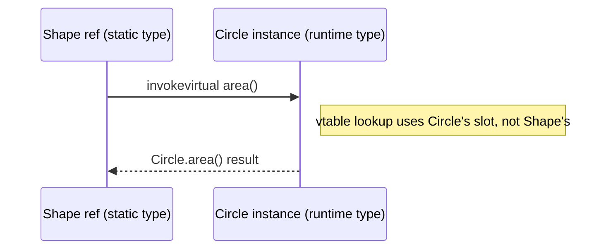
- **JVM Behaviour** - The JIT can "devirtualize" (inline directly) a virtual call once profiling shows the call site is monomorphic (always the same concrete type); if a new subtype is later loaded that could target the same call site, the JVM deoptimizes back to full vtable dispatch.

#### Interview Questions
**Basic**
1. What are the rules for a valid method override (signature, access modifier, exceptions)?
2. What annotation helps catch override mistakes at compile time?

**Intermediate**
1. Can an overriding method narrow the checked exceptions it throws? Widen them?
2. How does access modifier visibility interact with overriding (can you reduce visibility)?

**Advanced**
1. How does the JVM implement dynamic dispatch efficiently (vtable) rather than searching the class hierarchy at every call?

**Scenario-based**
1. A subclass overrides `equals()` but violates symmetry with the superclass's `equals()`, breaking `HashSet` behaviour - what's the LSP violation here and how do you fix it?

#### Detailed Answers
1. **Q: Valid override rules?** A: Same method name and parameter types (signature); return type must be the same or covariant; access modifier must be same or wider (cannot reduce visibility); it must not throw new or broader checked exceptions than the overridden method.
2. **Q: Annotation for override safety?** A: `@Override` - it causes a compile error if the method doesn't actually override/implement a supertype method, catching typos in signature.
3. **Q: Checked exceptions on override?** A: The override can throw the same, narrower, or no checked exceptions, or unchecked exceptions freely, but it cannot throw new or broader checked exceptions than the method it overrides (this preserves caller's try/catch guarantees).
4. **Q: Access modifier rules?** A: The override must be equally or more visible than the overridden method (e.g., `protected` can become `public`, but not `private`); this preserves substitutability - callers relying on the wider access in the supertype must still have that access on the subtype.
5. **Q: Efficient dynamic dispatch?** A: HotSpot builds a per-class vtable (array of method pointers) at class-load/linking time; a virtual call is just an indexed lookup into the runtime object's vtable (O(1)), avoiding a linear search up the class hierarchy at every call.
6. **Q: `equals()` override breaking symmetry?** A: If subclass `equals()` adds extra field comparisons asymmetrically (e.g., `sub.equals(base)` true but `base.equals(sub)` false), it violates the `equals()` contract's symmetry requirement, corrupting `HashSet`/`HashMap` behavior; fix by using `canEqual()` pattern, favoring composition over inheritance for value types, or comparing `getClass()` equality instead of `instanceof` when strict symmetry is required.

#### Code Examples
```java
abstract class Shape {
    abstract double area();
    @Override public String toString() { return getClass().getSimpleName() + " area=" + area(); }
}
class Rectangle extends Shape {
    private final double w, h;
    Rectangle(double w, double h) { this.w = w; this.h = h; }
    @Override double area() { return w * h; } // overriding: runtime polymorphism
}
class Square extends Rectangle {
    Square(double side) { super(side, side); }
}
public class OverrideDemo {
    public static void main(String[] args) {
        Shape[] shapes = { new Rectangle(3, 4), new Square(5) };
        for (Shape s : shapes) System.out.println(s); // dispatches area() per actual runtime type
    }
}
```

## Abstraction

### Abstract Classes

#### Theory
- **Core Concepts** - An abstract class is a class that cannot be instantiated directly and may declare abstract methods (no body, must be implemented by concrete subclasses) alongside concrete methods and state.
- **Internal Working** - Compiled like a normal class but flagged `ACC_ABSTRACT`; the JVM refuses to `new` it directly (compile-time check, reinforced at the bytecode level); abstract methods have no `Code` attribute in the class file.
- **When to Use It** - Use when you want to share common state/implementation across related subclasses while forcing them to fill in specific behaviour (partial implementation template).
- **Advantages** - Combines code reuse (concrete methods/fields) with a mandatory contract (abstract methods); supports constructors, fields, and non-public members unlike interfaces.
- **Limitations** - Still limited to single inheritance (a class can extend only one abstract class); less flexible than interfaces for multiple-contract composition.

#### Internal Working
- **Step-by-Step Explanation** - The class file for an abstract class is generated normally except it's marked `ACC_ABSTRACT` and any abstract methods carry `ACC_ABSTRACT` with no bytecode body; the verifier and `javac` prevent `new AbstractClass()`; concrete subclasses must implement all inherited abstract methods or themselves be declared abstract.
- **Memory Layout** - No instances of the abstract class itself exist on the heap; subclass instances include the abstract class's fields laid out first, same as any single-inheritance layout.
- **Diagrams**
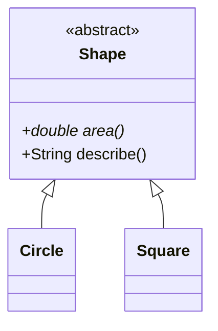
- **JVM Behaviour** - Attempting `new` on an abstract class is rejected by `javac`; if bytecode were hand-crafted to attempt it, the verifier would reject it too, since the class's `ACC_ABSTRACT` flag makes instantiation illegal at the bytecode level, not just the source level.

#### Interview Questions
**Basic**
1. Can an abstract class have a constructor? Why would it need one?
2. Can you instantiate an abstract class?

**Intermediate**
1. What's the difference between an abstract class with all abstract methods and an interface?
2. Can an abstract class have zero abstract methods?

**Advanced**
1. How does an abstract class support the Template Method design pattern?

**Scenario-based**
1. You need shared field state (e.g., a logger, a config) plus a mandatory contract across a family of related classes - would you choose an abstract class or an interface, and why?

#### Detailed Answers
1. **Q: Abstract class constructor?** A: Yes - it runs when a concrete subclass is instantiated (via `super()`), used to initialize shared state common to all subclasses even though the abstract class itself is never directly `new`'d.
2. **Q: Can you instantiate an abstract class?** A: No, directly; but you can instantiate an anonymous subclass that implements the remaining abstract methods.
3. **Q: Abstract class (all abstract) vs interface?** A: Even with all-abstract methods, an abstract class still supports non-public members, instance fields, constructors, and single-inheritance-only semantics; an interface (traditionally) has no instance fields or constructors and supports multiple implementation.
4. **Q: Zero abstract methods?** A: Yes - a class can be marked `abstract` purely to prevent direct instantiation (e.g., a base class meant only to be extended), even with all methods concrete.
5. **Q: Template Method pattern?** A: The abstract class defines a concrete "template" method that calls one or more abstract "hook" methods in a fixed algorithm skeleton; subclasses override only the hooks, letting the abstract class control the overall algorithm structure.
6. **Q: Shared state + mandatory contract?** A: Choose an abstract class when you need shared instance fields/constructors/protected helper methods in addition to a contract; choose an interface (possibly with default methods) if you only need a behavioural contract and want multiple inheritance of type.

#### Code Examples
```java
abstract class DataExporter {
    protected final String targetName;
    DataExporter(String targetName) { this.targetName = targetName; }

    // Template method: fixed algorithm, delegates specific steps to subclasses
    public final void export(String data) {
        String formatted = format(data);
        write(formatted);
        System.out.println("Exported to " + targetName);
    }

    protected abstract String format(String data);
    protected abstract void write(String formatted);
}
class CsvExporter extends DataExporter {
    CsvExporter() { super("report.csv"); }
    @Override protected String format(String data) { return data.replace(",", ";"); }
    @Override protected void write(String formatted) { System.out.println("CSV: " + formatted); }
}
public class AbstractClassDemo {
    public static void main(String[] args) {
        DataExporter exporter = new CsvExporter();
        exporter.export("a,b,c");
    }
}
```

### Interfaces

#### Functional Interfaces

#### Theory
- **Core Concepts** - A functional interface declares exactly one abstract method (SAM - Single Abstract Method), making it a valid target type for lambda expressions and method references; annotated (optionally) with `@FunctionalInterface`.
- **Internal Working** - Lambdas targeting a functional interface are compiled using the `invokedynamic` bytecode instruction, which lazily generates an implementation class at runtime via `LambdaMetafactory`, rather than the compiler generating a named inner class per lambda.
- **When to Use It** - Use for passing behaviour as data - callbacks, strategies, event handlers, stream operations (`Function`, `Predicate`, `Consumer`, `Supplier`, custom SAM types).
- **Advantages** - Enables concise functional-style code; `invokedynamic`-based lambdas avoid class-loading overhead of many small named classes; integrates with Streams/Optional APIs.
- **Limitations** - Only one abstract method allowed (default/static methods don't count); overuse can hurt stack-trace readability and debuggability compared to named classes.

#### Internal Working
- **Step-by-Step Explanation** - At compile time, a lambda expression is NOT compiled into an anonymous class; instead the lambda body is compiled into a private synthetic method, and an `invokedynamic` call site is emitted with a bootstrap method pointing to `LambdaMetafactory.metafactory`. At first invocation, the bootstrap method uses `MethodHandle`s to spin up (via hidden classes) a lightweight implementation of the functional interface, and the call site is linked to it thereafter.
- **Memory Layout** - The generated lambda implementation class is a "hidden class" (not stored in Metaspace the same way as regular classes historically loaded by `ClassLoader`, though still off-heap metadata); captured variables become fields of the generated instance if the lambda captures state (capturing lambda), or a cached singleton instance is reused if it captures nothing.
- **Diagrams**
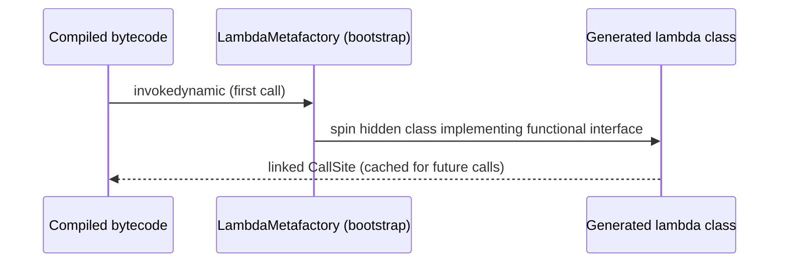
- **JVM Behaviour** - Because linking happens once per call site (cached), repeated invocation of the same lambda expression is fast; the JIT can inline through the generated implementation just like any other virtual call once warmed up.

#### Interview Questions
**Basic**
1. What defines a functional interface?
2. Name three functional interfaces from `java.util.function`.

**Intermediate**
1. Why doesn't `@FunctionalInterface` matter for compilation correctness, and what does it actually do?
2. How are lambdas different from anonymous inner classes under the hood?

**Advanced**
1. What is `invokedynamic` and how does `LambdaMetafactory` use it?

**Scenario-based**
1. Adding a second abstract method to an existing functional interface breaks all lambda usages across a codebase at compile time - explain why, and how default methods could have avoided this.

#### Detailed Answers
1. **Q: What defines a functional interface?** A: Exactly one abstract method (default/static/private methods and methods inherited from `Object` like `equals`/`toString` don't count toward the SAM count).
2. **Q: Three `java.util.function` interfaces?** A: `Function<T,R>`, `Predicate<T>`, `Consumer<T>`, `Supplier<T>`, `BiFunction<T,U,R>` (any three).
3. **Q: `@FunctionalInterface` purpose?** A: It's purely a compile-time safety check - the compiler errors out if the annotated interface does NOT have exactly one abstract method; it's not required for lambda compatibility, just documentation + safety net.
4. **Q: Lambdas vs anonymous classes?** A: Anonymous classes are compiled into a separate named `.class` file at compile time (e.g., `Outer$1.class`) and instantiated via `new`; lambdas defer implementation generation to runtime via `invokedynamic`/`LambdaMetafactory`, avoiding a class file per lambda and enabling potential future optimizations (e.g., reusing non-capturing lambda instances as singletons).
5. **Q: `invokedynamic` and `LambdaMetafactory`?** A: `invokedynamic` is a bytecode instruction whose target isn't resolved until first execution; for lambdas, its bootstrap method is `LambdaMetafactory.metafactory`, which dynamically creates (via `MethodHandle`s) a hidden implementation class of the functional interface wrapping the lambda body, then caches the linkage for subsequent calls.
6. **Q: Adding second abstract method breaks lambdas?** A: A functional interface must have exactly one abstract method for lambda targeting to be unambiguous; adding a second abstract method means the compiler can no longer determine which method the lambda body implements, breaking every lambda call site - default methods (with a body) can be added freely without breaking this, since they don't count as unimplemented abstract methods.

#### Code Examples
```java
import java.util.function.Function;
import java.util.function.Predicate;

@FunctionalInterface
interface Validator<T> {
    boolean isValid(T input);
}

public class FunctionalInterfaceDemo {
    public static void main(String[] args) {
        Validator<String> notEmpty = s -> s != null && !s.isBlank(); // lambda -> invokedynamic
        System.out.println(notEmpty.isValid(""));   // false
        System.out.println(notEmpty.isValid("ok")); // true

        Function<Integer, Integer> square = x -> x * x;
        Predicate<Integer> isEven = x -> x % 2 == 0;
        System.out.println(square.andThen(x -> x + 1).apply(4)); // 17
        System.out.println(isEven.negate().test(3));             // true
    }
}
```

#### Default Methods *(new)*

#### Theory
- **Core Concepts** - A default method is a concrete, inheritable method body defined directly in an interface (Java 8+), letting interfaces evolve without breaking existing implementers.
- **Internal Working** - Compiled as a regular method in the interface's class file (not abstract); implementing classes inherit it into their vtable unless they override it, and conflicts between multiple interfaces' default methods must be explicitly resolved.
- **When to Use It** - Use to add new capability to an existing interface while providing sensible default behaviour, or to share small reusable logic across unrelated implementers (a limited form of multiple inheritance of behaviour).
- **Advantages** - Enables interface evolution without breaking binary/source compatibility for existing implementers; supports mixin-like behaviour sharing.
- **Limitations** - Can introduce diamond-like conflicts requiring explicit resolution; overuse blurs the line between interfaces (contracts) and abstract classes (partial implementations).

#### Internal Working
- **Step-by-Step Explanation** - The interface's class file stores the default method with an actual `Code` attribute (unlike abstract methods); when a class implements the interface without overriding, the class's vtable slot for that method points to the interface's default implementation; if the class overrides it, its own implementation takes the slot instead.
- **Memory Layout** - Not directly applicable - default method bytecode lives once in the interface's Metaspace entry, shared across all implementers that don't override it.
- **Diagrams**
```
interface Greetable { default void greet() { System.out.println("Hello"); } }
class Person implements Greetable {} // inherits default greet() unchanged
```
- **JVM Behaviour** - Interface default methods use `invokeinterface` for dispatch (or `invokespecial` when explicitly calling `Interface.super.method()`); the JVM resolves the most specific default when a class implements multiple interfaces without conflict, and requires the compiler to force explicit resolution when a genuine conflict exists.

#### Interview Questions
**Basic**
1. Why were default methods introduced in Java 8?
2. Can a default method be `static`?

**Intermediate**
1. What happens if a class implements two interfaces with conflicting default methods?
2. Can a default method be overridden by an implementing class?

**Advanced**
1. How do default methods interact with abstract classes when both provide implementations for the same method during multiple inheritance scenarios (class wins vs interface)?

**Scenario-based**
1. The JDK added `forEach()` as a default method on `Iterable` in Java 8 - why was a default method the right tool here instead of adding an abstract method?

#### Detailed Answers
1. **Q: Why introduced?** A: To allow the JDK (and library authors) to add new methods to existing interfaces (like `Iterable.forEach`, `Comparator.thenComparing`) without breaking every existing implementation that would otherwise fail to compile (missing method implementation).
2. **Q: Can default methods be static?** A: No - `static` interface methods are a separate category; `default` specifically means an inheritable **instance** method with a body.
3. **Q: Conflicting default methods from two interfaces?** A: Compile error - the implementing class must override the method to explicitly resolve which (or a combined) behaviour to use, e.g. `default void m(){ InterfaceA.super.m(); }`.
4. **Q: Can default methods be overridden?** A: Yes, normally, just like any inherited instance method.
5. **Q: Class vs interface default conflict?** A: The "class wins" rule applies - if a superclass provides a concrete implementation of a method, it always takes precedence over any interface default with the same signature, regardless of hierarchy depth.
6. **Q: `Iterable.forEach()` as default?** A: Adding it as a default method let every existing `Iterable` implementation across the ecosystem automatically gain `forEach()` behaviour without needing recompilation/modification - a mandatory abstract method would have broken source compatibility for every pre-existing implementer.

#### Code Examples
```java
interface Notifier {
    void sendCore(String message); // abstract - must implement
    default void send(String message) { // default - optional to override
        System.out.println("[INFO] Sending: " + message);
        sendCore(message);
    }
}
class EmailNotifier implements Notifier {
    @Override public void sendCore(String message) { System.out.println("Email: " + message); }
}
public class DefaultMethodDemo {
    public static void main(String[] args) {
        new EmailNotifier().send("Server down"); // uses inherited default + overridden core
    }
}
```

#### Static Methods in Interfaces *(new)*

#### Theory
- **Core Concepts** - Since Java 8, interfaces can declare `static` methods - utility/helper methods namespaced to the interface, callable only via `InterfaceName.method()`, not inherited by implementing classes.
- **Internal Working** - Compiled exactly like a class's static method (`invokestatic`), but scoped to the interface's namespace; not part of any implementing class's vtable or inherited API.
- **When to Use It** - Use for factory methods, validation helpers, or common utilities logically related to the interface (e.g., `Comparator.comparing()`, `List.of()`).
- **Advantages** - Keeps related helper/factory logic co-located with the interface instead of a separate `*Utils` class; avoids polluting implementers' inherited method sets.
- **Limitations** - Not inherited/overridable, so cannot be part of polymorphic dispatch; easy to confuse with default methods for newcomers.

#### Internal Working
- **Step-by-Step Explanation** - The interface's class file stores the static method just like a class would; calling it requires the interface name explicitly (`Comparator.comparing(...)`), compiled to `invokestatic InterfaceName.method`.
- **Memory Layout** - Not directly applicable - static interface methods are pure Metaspace bytecode, unrelated to any instance.
- **Diagrams**
```
Comparator.comparing(Person::getAge)  // invokestatic on the interface itself, no instance involved
```
- **JVM Behaviour** - No vtable/itable involvement at all (unlike default/abstract methods) since there's no dynamic dispatch for static calls; resolved entirely at compile time to a fixed method reference.

#### Interview Questions
**Basic**
1. How do you call a static method declared in an interface?
2. Are static interface methods inherited by implementing classes?

**Intermediate**
1. Give a JDK example of a static interface method used as a factory.
2. Why can't you call a static interface method via an implementing instance (`myImpl.staticMethod()`)?

**Advanced**
1. Why would you choose a static interface method over a separate utility class?

**Scenario-based**
1. You want to provide `Shape.unitCircle()` as a convenient factory tied conceptually to the `Shape` interface - how and why would you implement this as a static interface method?

#### Detailed Answers
1. **Q: How to call?** A: Only via the interface name directly: `InterfaceName.staticMethod(args)`.
2. **Q: Inherited by implementers?** A: No - unlike default methods, static interface methods are not inherited and don't appear as members of implementing classes.
3. **Q: JDK factory example?** A: `Comparator.comparing(keyExtractor)`, `List.of(...)`, `Map.entry(k, v)` are all static interface methods acting as factories.
4. **Q: Why not callable via instance?** A: Static methods belong to the type itself, not instances, and Java intentionally disallows calling them via an instance reference for interfaces (and discourages it for classes) to avoid confusing static calls with polymorphic instance calls.
5. **Q: Why static interface method over utility class?** A: It keeps the factory/helper logic conceptually and physically co-located with the type it constructs/relates to (discoverability, cohesion), avoiding a separate `ShapeUtils`/`Shapes` class purely for one or two helpers.
6. **Q: `Shape.unitCircle()` factory?** A: Implement as `static Shape unitCircle() { return new Circle(1.0); }` inside the `Shape` interface - callers write `Shape.unitCircle()` directly, keeping the factory next to the abstraction it constructs, consistent with JDK conventions like `List.of()`.

#### Code Examples
```java
interface Shape {
    double area();
    static Shape unitCircle() { return new Circle(1.0); } // static factory method
}
class Circle implements Shape {
    private final double radius;
    Circle(double radius) { this.radius = radius; }
    @Override public double area() { return Math.PI * radius * radius; }
}
public class StaticInterfaceMethodDemo {
    public static void main(String[] args) {
        Shape unit = Shape.unitCircle(); // called via interface name, not an instance
        System.out.println(unit.area());
    }
}
```

#### Private Methods in Interfaces *(new)*

#### Theory
- **Core Concepts** - Since Java 9, interfaces can declare `private` (and `private static`) methods - helper methods usable only internally by the interface's own default/static methods, not exposed to implementers or callers.
- **Internal Working** - Compiled like normal methods but flagged `ACC_PRIVATE`; invoked via `invokespecial` from within the interface's other methods, never part of the public API surface.
- **When to Use It** - Use to deduplicate shared logic between multiple default methods (or between static methods) in the same interface without exposing that logic publicly.
- **Advantages** - Reduces duplication across default methods; keeps internal helper logic properly encapsulated (not inherited/overridable/callable externally).
- **Limitations** - Only usable within the same interface; doesn't solve cross-interface code sharing (still need composition or default methods for that).

#### Internal Working
- **Step-by-Step Explanation** - A private interface method is compiled with `ACC_PRIVATE`; any default (or static) method in the same interface calling it compiles to `invokespecial`, which - like private class methods - is resolved directly at compile time without any dynamic dispatch, and cannot be seen or called by implementing classes or external code.
- **Memory Layout** - Not directly applicable - lives as ordinary Metaspace bytecode scoped to the interface only.
- **Diagrams**
```
interface Validator {
  default boolean isValidEmail(String s) { return matches(s, EMAIL_REGEX); }
  default boolean isValidPhone(String s) { return matches(s, PHONE_REGEX); }
  private boolean matches(String s, String regex) { return s != null && s.matches(regex); } // shared helper
}
```
- **JVM Behaviour** - `invokespecial` is used both for private methods and for `super`/constructor calls because all are statically resolved (non-virtual); this guarantees a private interface method cannot be polymorphically overridden by an implementer, preserving true encapsulation within the interface.

#### Interview Questions
**Basic**
1. What Java version introduced private interface methods?
2. Can implementing classes call a private interface method?

**Intermediate**
1. Why were private interface methods needed given that default methods already existed since Java 8?
2. Can a private interface method be `static`? What's the difference from a non-static private interface method?

**Advanced**
1. What bytecode instruction is used to invoke private interface methods and why does that matter for encapsulation?

**Scenario-based**
1. Two default methods in an interface duplicate a validation routine - refactor using a private interface method and explain the benefit.

#### Detailed Answers
1. **Q: Which Java version?** A: Java 9 (JEP 213).
2. **Q: Can implementers call it?** A: No - it's only accessible from within the other methods of the same interface, never from implementing classes or external callers.
3. **Q: Why needed given default methods?** A: Without private interface methods, sharing common logic between multiple default methods required either duplicating code or exposing the shared logic as another (public) default/static method, unnecessarily widening the public API - private methods let you factor out helpers cleanly.
4. **Q: Private static interface methods?** A: Yes, they're allowed - a `private static` method can be called from other static methods AND default methods in the interface; a non-static `private` method can only be called from default (instance-context) methods, since it may implicitly need `this`.
5. **Q: Bytecode instruction?** A: `invokespecial`, the same non-virtual dispatch instruction used for constructors, `super` calls, and private methods generally - it resolves the target directly at compile time, guaranteeing no subclass/implementer can override or intercept the call, preserving encapsulation.
6. **Q: Refactor duplicated validation?** A: Extract the shared regex/validation logic into a `private boolean matches(String value, String pattern)` method inside the interface, then have both public-facing default methods call it - removes duplication while keeping the helper hidden from the public contract.

#### Code Examples
```java
interface Validator {
    default boolean isValidEmail(String s) { return matches(s, "^[\\w.]+@[\\w.]+$"); }
    default boolean isValidUsPhone(String s) { return matches(s, "^\\d{10}$"); }

    private boolean matches(String value, String regex) { // hidden helper, not part of public API
        return value != null && value.matches(regex);
    }
}
class ContactForm implements Validator {}
public class PrivateInterfaceMethodDemo {
    public static void main(String[] args) {
        ContactForm form = new ContactForm();
        System.out.println(form.isValidEmail("a@b.com")); // true
        System.out.println(form.isValidUsPhone("1234567890")); // true
    }
}
```

#### Marker Interfaces

##### Theory

A marker interface in Java is an interface that does not contain any methods, fields, or constants. In other words, an empty interface is known as a marker interface or tag interface.

**Purpose and Functionality:**
- It provides run-time type information about an object
- It allows the JVM and compiler to have additional information about an object
- It acts as a signal or command to the JVM to perform specific operations

**Examples:**
The `Serializable` and `Cloneable` interfaces are examples of marker interfaces.

## Relationships

### Association

#### One-to-One

##### Theory
- **Core Concepts** - A one-to-one association means one instance of a class is linked to exactly one instance of another, each holding a reference to the other (or one-directional). Example: `Person` has exactly one `Passport`. Modeled with a single field reference (`private Passport passport;`), not a collection.
- **Internal Working** - At runtime this is just an object reference field connecting two independently-allocated heap objects.
- **When to Use It** - Use it when the domain genuinely enforces a strict 1:1 cardinality; enforce it via constructor injection and validation, not just convention.
- **Advantages** - Simplest, most direct association, easy to reason about.
- **Limitations** - Real-world cardinality can change (e.g., a person might later have zero or multiple passports), requiring a model migration to a collection-based association.

##### Internal Working
- **Step-by-Step Explanation** - Both objects live independently on the heap connected by a pointer. If bidirectional, each object holds a reference to the other, which can create retention cycles that only a tracing GC (not naive reference counting) can collect correctly.
- **Memory Layout** - Not directly applicable beyond a standard object reference field occupying one word in the owning object's layout.
- **Diagrams**
```
Person --passport--> Passport
Passport --owner-->  Person   (if bidirectional)
```
- **JVM Behaviour** - The reference field is a normal object pointer in the object's memory layout; the GC's reachability tracing walks both directions of a bidirectional link without issue (cycles are fine for a tracing collector).

##### Interview Questions
**Basic**
1. How do you model a 1:1 association in Java?
2. What field type distinguishes a 1:1 association from a 1:N association?

**Intermediate**
1. What's the risk of making a bidirectional 1:1 association?

**Advanced**
1. How would you enforce 1:1 cardinality strictly at the language level?

**Scenario-based**
1. A `Person`-`Passport` 1:1 model later needs to support zero-or-multiple passports per person - how do you migrate the model safely?

##### Detailed Answers
1. **Q: How do you model a 1:1 association?** A: A single non-collection reference field on one or both sides, e.g., `private Passport passport;` in `Person`, optionally with a back-reference in `Passport`.
2. **Q: Field type distinguishing 1:1 from 1:N?** A: 1:1 uses a plain single-object reference field; 1:N uses a collection field (`List`/`Set`/`Map`) referencing many instances.
3. **Q: Risk of bidirectional 1:1?** A: Keeping both sides in sync manually (if you change `person.setPassport(p)`, you must also set `p.setOwner(person)`), otherwise the model becomes inconsistent; encapsulate this synchronization inside a single method.
4. **Q: Enforcing 1:1 cardinality strictly?** A: Require the associated object in the constructor (not a setter) so an instance can never exist without its counterpart, and avoid exposing a way to null it out if the domain forbids that.
5. **Q: Migrating to zero-or-multiple passports?** A: Replace the single `Passport` field with a `List<Passport>`, update the constructor/accessors to accept and expose a collection, and audit all callers that assumed exactly one passport.

##### Code Examples
```java
class Passport { private final String number; Passport(String number) { this.number = number; } }
class Person {
    private final String name;
    private final Passport passport; // enforced 1:1 via constructor
    Person(String name, Passport passport) { this.name = name; this.passport = passport; }
}
```

#### One-to-Many

##### Theory
- **Core Concepts** - A one-to-many association links one instance to a collection of instances of another class, e.g., `Department` has many `Employee`s. Modeled with a `List`/`Set`/`Map` field on the "one" side.
- **Internal Working** - The parent holds a reference to a collection object that in turn holds references to each child.
- **When to Use It** - Use when a single parent legitimately references multiple children conceptually (ownership/lifecycle is a separate concept - see Aggregation/Composition).
- **Advantages** - Naturally models real-world one-to-many domain relationships and supports iteration/queries.
- **Limitations** - Needs defensive copying/unmodifiable views on the collection getter to preserve encapsulation.

##### Internal Working
- **Step-by-Step Explanation** - The "one" side holds a reference to a collection object (itself heap-allocated, e.g., an `ArrayList` backed by an array), which in turn holds references to each "many" object; three levels of indirection exist (parent -> collection -> children).
- **Memory Layout** - Parent object -> collection object header + backing array -> individual child object references.
- **Diagrams**
```
Department --employees--> ArrayList --[0]--> Employee1
                                    --[1]--> Employee2
```
- **JVM Behaviour** - Iterating the collection uses the collection's own iterator machinery (fail-fast `modCount` checks for `ArrayList`); the GC treats the collection and its elements as ordinary reachable objects - no special-casing.

##### Interview Questions
**Basic**
1. How do you model one-to-many in Java?
2. What collection types are commonly used for the "many" side?

**Intermediate**
1. How do you prevent external code from corrupting the internal collection?

**Advanced**
1. Should the "many" side hold a back-reference to the "one" side? What are the trade-offs?

**Scenario-based**
1. A `Department.getEmployees()` getter returns the live internal `List`, and external code accidentally clears it - how do you prevent this?

##### Detailed Answers
1. **Q: How do you model one-to-many?** A: A collection field (`List<Employee> employees`) on the "one" side, populated via an `addEmployee()` method rather than exposing the raw mutable list.
2. **Q: Common collection types?** A: `List` for ordered/duplicate-allowed children, `Set` when duplicates should be rejected, `Map` when children are keyed/looked-up by an identifier.
3. **Q: Preventing corruption of the internal collection?** A: Return `Collections.unmodifiableList(employees)` from the getter, or a defensive copy, so callers can't `add`/`remove` directly.
4. **Q: Back-reference trade-offs?** A: A back-reference enables navigating from child to parent but requires keeping both sides in sync on every add/remove; a unidirectional association keeps the model simpler and avoids synchronization bugs when bidirectional navigation isn't needed.
5. **Q: Preventing external mutation of getEmployees()?** A: Wrap the returned list in `Collections.unmodifiableList(...)` (or return a defensive copy), so calling `.clear()`/`.add()` on the returned reference either throws `UnsupportedOperationException` or has no effect on the real internal state.

##### Code Examples
```java
import java.util.*;
class Employee { final String name; Employee(String name) { this.name = name; } }
class Department {
    private final String name;
    private final List<Employee> employees = new ArrayList<>();
    Department(String name) { this.name = name; }
    void addEmployee(Employee e) { employees.add(e); }
    List<Employee> getEmployees() { return Collections.unmodifiableList(employees); }
}
```

#### Many-to-Many

##### Theory
- **Core Concepts** - A many-to-many association means instances on both sides can relate to multiple instances of the other, e.g., `Student` enrolls in many `Course`s, and each `Course` has many `Student`s. Modeled with a collection field on both sides, or via a dedicated join/link class holding extra relationship data (like a JPA `@ManyToMany` join table).
- **Internal Working** - Both sides hold collections of references to the other type.
- **When to Use It** - Use when the domain genuinely has bidirectional multiplicity.
- **Advantages** - Accurately models complex real-world relationships.
- **Limitations** - Bidirectional many-to-many is the hardest to keep consistent - easy to create sync bugs or memory leaks from uncollectible growth if not managed carefully.

##### Internal Working
- **Step-by-Step Explanation** - Without care, keeping both collections in sync requires updating both sides on every add/remove, ideally centralized in one method (e.g., `enroll(student, course)` updates both collections atomically).
- **Memory Layout** - Each side holds a `HashSet`/`ArrayList` whose backing storage references the other side's instances - no fundamentally different memory shape from other collection-backed associations, just doubled (one collection per side).
- **Diagrams**
```
Student1 --courses--> {CourseA, CourseB}
CourseA  --students--> {Student1, Student2}
```
- **JVM Behaviour** - No special runtime behaviour beyond standard collection/object reachability; care is needed at the design level (not JVM level) to avoid inconsistent bidirectional state.

##### Interview Questions
**Basic**
1. How do you model many-to-many in plain Java (no ORM)?
2. Give a real-world example of a many-to-many relationship.

**Intermediate**
1. How does JPA typically represent many-to-many at the database level, and how does that map to the Java model?

**Advanced**
1. What issue arises if you only update one side of a bidirectional many-to-many association?

**Scenario-based**
1. A many-to-many `Student`/`Course` model needs to also track an enrollment date per pairing - how would you redesign it?

##### Detailed Answers
1. **Q: Modeling many-to-many in plain Java?** A: Each side holds a collection referencing the other type, updated together via a single relationship-management method (e.g., a static `enroll(Student, Course)` helper) to avoid partial/inconsistent updates.
2. **Q: Real-world example?** A: Students enrolling in courses, or actors appearing in multiple movies while movies have multiple actors.
3. **Q: JPA's database representation?** A: Via a join table with two foreign keys; in Java this often maps to `@ManyToMany` collections on both entities, sometimes backed by an explicit join entity if extra attributes (e.g., enrollment date) are needed on the relationship itself.
4. **Q: Issue with one-sided updates?** A: The model becomes inconsistent (e.g., `student.getCourses()` shows the course but `course.getStudents()` doesn't show the student), causing subtle bugs in code that navigates from either direction.
5. **Q: Adding enrollment-date attribute?** A: Introduce an explicit `Enrollment` join entity holding `student`, `course`, and `enrollmentDate` fields, replacing the direct `Set<Course>`/`Set<Student>` references with `Set<Enrollment>` on each side - mirroring how JPA models many-to-many-with-attributes via an explicit join entity.

##### Code Examples
```java
import java.util.*;
class Course { final String title; final Set<Student> students = new HashSet<>(); Course(String t){title=t;} }
class Student { final String name; final Set<Course> courses = new HashSet<>(); Student(String n){name=n;} }
class Enrollment {
    // Centralizes the bidirectional update to keep both sides consistent
    static void enroll(Student s, Course c) { s.courses.add(c); c.students.add(s); }
}
```

### Aggregation

#### Weak Relationship

##### Theory
- **Core Concepts** - Aggregation is a "weak" has-a relationship where the contained object's lifecycle is independent of the container - the part can exist before, after, or without the whole (e.g., a `Team` has `Player`s, but players exist independently of any one team).
- **Internal Working** - Modeled by storing a reference to an object created/owned externally (passed in, not `new`'d internally).
- **When to Use It** - Use when the child object is shared or can outlive the parent.
- **Advantages** - Promotes reuse (same object can belong to multiple aggregates) and independent lifecycle management.
- **Limitations** - Because ownership is unclear, it's easy to create dangling references or unclear responsibility for cleanup.

##### Internal Working
- **Step-by-Step Explanation** - Purely a reference-holding relationship at runtime - no special construct in Java distinguishes aggregation from any other reference field; it's a UML/design-level distinction based on lifecycle ownership, not a language feature.
- **Memory Layout** - Not directly applicable beyond a standard object reference field; the referenced object's storage is unaffected by which "aggregate" holds a pointer to it.
- **Diagrams**
```
Team --players--> [Player1, Player2]   (players created/passed in externally, outlive the Team)
```
- **JVM Behaviour** - The GC has no concept of aggregation vs composition - both are just references; an aggregated object remains reachable (alive) as long as ANY reference to it exists, including references held outside the "aggregate" container.

##### Interview Questions
**Basic**
1. How is aggregation different from composition at the language level?
2. How do you typically construct an aggregation relationship in code?

**Intermediate**
1. Give a practical example distinguishing aggregation from composition.

**Advanced**
1. How does the GC's reachability analysis treat an aggregated object once the aggregate container itself becomes unreachable?

**Scenario-based**
1. A `Team` holds `Player` references; a player leaves the team and joins another, but the first team's roster still references them - how do you correctly model removal?

##### Detailed Answers
1. **Q: Aggregation vs composition at the language level?** A: Java has no syntactic distinction - both are just reference fields; the difference is purely conceptual/design-level (lifecycle ownership and whether the part can exist independently).
2. **Q: Constructing aggregation in code?** A: The contained object is created outside the container and passed in (e.g., via a constructor parameter or setter/add method), rather than being `new`'d inside the container's constructor.
3. **Q: Practical example?** A: A `Team` aggregates `Player`s (players exist independently, can join another team) versus a `Car` composes `Engine` (the specific engine instance is created with and destroyed with that car).
4. **Q: GC treatment after container becomes unreachable?** A: The GC does not distinguish aggregation from any other reference - if the `Player` is still referenced elsewhere (e.g., a league-wide roster), it remains reachable and alive even though the `Team` that aggregated it is now garbage.
5. **Q: Correctly modeling player removal/transfer?** A: Explicitly remove the player reference from the old team's collection (`oldTeam.removePlayer(p)`) and add it to the new team's collection (`newTeam.addPlayer(p)`) - since aggregation doesn't imply exclusive ownership, both operations must be performed explicitly.

##### Code Examples
```java
class Player { final String name; Player(String name) { this.name = name; } }
class Team {
    private final List<Player> players = new ArrayList<>();
    // Players are created externally and passed in - weak, independent lifecycle
    void addPlayer(Player p) { players.add(p); }
    void removePlayer(Player p) { players.remove(p); }
}
```

#### HAS-A

##### Theory
- **Core Concepts** - "HAS-A" is the general umbrella term for any association where one class holds a reference to another as a field (as opposed to "IS-A" for inheritance), covering both aggregation and composition as more specific sub-forms.
- **Internal Working** - A HAS-A relationship is simply an instance field referencing another object, with method calls potentially delegated to it.
- **When to Use It** - Use HAS-A (composition-favoring design) instead of inheritance whenever the relationship is about capability delegation rather than true type substitutability ("favor composition over inheritance").
- **Advantages** - More flexible than inheritance - relationships can be reassigned/swapped at runtime, and avoids fragile base class problems.
- **Limitations** - Requires explicit delegation code (forwarding calls to the held object) which inheritance would have given "for free" via the vtable.

##### Internal Working
- **Step-by-Step Explanation** - A HAS-A relationship is simply an instance field referencing another object; method calls on the outer object may delegate to the held object's methods explicitly written by the developer, rather than relying on automatic vtable inheritance.
- **Memory Layout** - Not directly applicable beyond a standard object reference field holding the collaborator's heap address.
- **Diagrams**
```
Car --engine--> Engine   (Car HAS-A Engine; Car delegates start() to engine.start())
```
- **JVM Behaviour** - Delegation compiles to an ordinary method call on the held reference (`invokevirtual`/`invokeinterface`); no different from any other object graph traversal.

##### Interview Questions
**Basic**
1. What does "favor composition over inheritance" mean and why?
2. How do you implement delegation in a HAS-A relationship?

**Intermediate**
1. Can HAS-A relationships be swapped at runtime, unlike inheritance?

**Advanced**
1. How does the JVM bytecode for delegated calls differ (if at all) from calls made via inheritance-based polymorphism?

**Scenario-based**
1. A `Car` class was originally designed to `extends Engine` to reuse its `start()` logic, but this creates an awkward "is-a" relationship - how would you refactor it to HAS-A?

##### Detailed Answers
1. **Q: "Favor composition over inheritance"?** A: Prefer HAS-A (holding and delegating to another object) over IS-A (extending a class) when you just need to reuse behaviour, because composition avoids tight coupling to a fixed superclass hierarchy, allows swapping implementations at runtime, and avoids fragile base class issues.
2. **Q: Implementing delegation?** A: The containing class holds a reference to the collaborator and its methods forward calls to it, optionally adding extra logic (decorator-like), e.g., `void start() { engine.start(); }`.
3. **Q: Runtime swappability?** A: Yes - since it's just a field reference, you can reassign it (e.g., `car.setEngine(newEngine)`) to change behaviour dynamically, which is impossible with static inheritance relationships.
4. **Q: Bytecode difference for delegated calls?** A: A delegated call compiles to a normal `invokevirtual`/`invokeinterface` on the field's reference, identical to any other method call on a held object - there is no special "delegation" bytecode; it's indistinguishable from any other object collaboration at the JVM level.
5. **Q: Refactoring `Car extends Engine` to HAS-A?** A: Replace `extends Engine` with a `private Engine engine` field, add a constructor/setter to inject it, and rewrite `Car`'s methods to explicitly delegate to `engine` (e.g., `engine.start()`) instead of inheriting `Engine`'s methods directly - removing the incorrect IS-A relationship (a `Car` is not literally an `Engine`).

##### Code Examples
```java
interface Engine { void start(); }
class PetrolEngine implements Engine { public void start() { System.out.println("Vroom"); } }
class Car {
    private Engine engine; // HAS-A: composition-style delegation, swappable at runtime
    Car(Engine engine) { this.engine = engine; }
    void setEngine(Engine engine) { this.engine = engine; }
    void drive() { engine.start(); System.out.println("Driving..."); }
}
```

### Composition

#### Strong Relationship

##### Theory
- **Core Concepts** - Composition is a "strong" has-a relationship where the contained object's lifecycle is bound to the container - the part cannot exist meaningfully without the whole and is typically created and destroyed together with it (e.g., a `House` composes `Room`s that don't exist independently of that house).
- **Internal Working** - Modeled by instantiating the contained object inside the container's constructor.
- **When to Use It** - Use when the part has no independent existence/identity outside the whole.
- **Advantages** - Strong encapsulation, clear single ownership, simplifies reasoning about object lifetimes.
- **Limitations** - Makes the contained object harder to reuse/share or substitute (e.g., for testing) unless designed with injectable dependencies.

##### Internal Working
- **Step-by-Step Explanation** - The composed object is typically created via `new` directly inside the owning object's constructor and stored in a `final` field with no external setter, so no other code can obtain or replace that specific instance.
- **Memory Layout** - When the containing object becomes unreachable, if nothing else references the composed part, it becomes garbage in the same GC cycle - the two effectively share a lifetime on the heap.
- **Diagrams**
```
new House() --constructs--> new Room() for each room (rooms cannot outlive/leave the house)
```
- **JVM Behaviour** - No different from any object reference at the bytecode level; the "strength" of the relationship is a design convention (no public constructor/setter access to the inner object) rather than a JVM-enforced rule.

##### Interview Questions
**Basic**
1. How do you enforce composition (strong ownership) in Java code?
2. What's the GC lifecycle implication of composition vs aggregation?

**Intermediate**
1. What's a downside of strict composition for testability?

**Advanced**
1. How would you allow constructor injection for testability while still conceptually preserving composition semantics?

**Scenario-based**
1. A `House` composes `Room` objects created internally, but a unit test needs to verify behavior with a mock `Room` - how do you reconcile this with strict composition?

##### Detailed Answers
1. **Q: Enforcing composition in code?** A: Instantiate the part directly inside the owner's constructor, store it in a `private final` field, and do not provide a setter or a way to inject an externally-created instance.
2. **Q: GC lifecycle implication?** A: In composition, once the owner is unreachable and nothing else references the parts, both owner and parts become garbage together in the same reachability analysis; in aggregation, the parts may remain reachable (alive) via other references even after the owner is collected.
3. **Q: Downside for testability?** A: It's harder to substitute a mock/stub for the composed object in unit tests since it's not injectable - mitigated by allowing constructor injection while still conceptually "owning" the lifecycle.
4. **Q: Allowing injection while preserving semantics?** A: Provide a constructor overload that accepts a pre-built part (useful for tests) while the default/primary constructor still creates it internally for normal production use, keeping the field `private final` either way so external code can't replace it after construction.
5. **Q: Reconciling composition with mock-based testing?** A: Add a package-private or test-only constructor overload that accepts an injected `Room` (or a factory/interface abstraction for `Room` creation), preserving the public API's composition semantics for production code while enabling test doubles.

##### Code Examples
```java
class Room { private final String name; Room(String name) { this.name = name; } }
class House {
    private final List<Room> rooms = new ArrayList<>();
    House(int roomCount) {
        for (int i = 1; i <= roomCount; i++) rooms.add(new Room("Room " + i)); // owns creation
    }
}
```

#### Part-of Relationship

##### Theory
- **Core Concepts** - "Part-of" describes composition from the semantic angle: the contained object is conceptually and structurally a piece of the whole, without independent identity outside it (e.g., an `Engine` is part-of a specific `Car`, not a general-purpose reusable engine object shared across cars).
- **Internal Working** - Same underlying mechanism as "Strong Relationship" composition, viewed from the UML "whole/part" terminology.
- **When to Use It** - Use it to model structural decomposition of a complex object into smaller cohesive pieces.
- **Advantages** - Improves cohesion/single-responsibility by delegating sub-behaviour to focused part classes.
- **Limitations** - If a "part" needs to be shared across multiple "wholes", it's actually aggregation, not true part-of composition - misclassifying this leads to design errors (e.g., accidentally letting two cars reference the same `Engine` instance).

##### Internal Working
- **Step-by-Step Explanation** - Identical at the bytecode/runtime level to composition - a reference field populated internally at construction, with the part's lifetime tied to the whole via exclusive ownership (no external references retained elsewhere).
- **Memory Layout** - Not directly applicable beyond standard composition memory semantics (part's storage is reachable only through the whole).
- **Diagrams**
```
Car {  Engine (part-of Car, created with this Car, filled with this car's VIN etc.) }
```
- **JVM Behaviour** - Same as composition - no special JVM support; ownership/part-of semantics are purely a design-level contract enforced by not leaking references to the part.

##### Interview Questions
**Basic**
1. How is "part-of" different from generic composition, if at all?
2. Give an example of a part-of relationship.

**Intermediate**
1. How would you detect that a supposed "part-of" relationship is actually aggregation in disguise?

**Advanced**
1. Why does exclusive ownership matter for encapsulation in a part-of relationship?

**Scenario-based**
1. A `Car`'s `Engine` (modeled as part-of) is accidentally exposed via a public getter and another class starts holding onto it after the car is sold/destroyed - what design flaw does this expose and how do you fix it?

##### Detailed Answers
1. **Q: "Part-of" vs generic composition?** A: They describe the same underlying mechanism (exclusive ownership, tied lifecycle); "part-of" emphasizes the structural/semantic view (the object is literally a piece of a larger whole) while "composition" emphasizes the lifecycle-binding aspect.
2. **Q: Example of part-of?** A: A `Car`'s `Engine`, a `House`'s `Room`s, or a `Document`'s `Paragraph`s - each part has no independent identity or use outside its specific whole.
3. **Q: Detecting aggregation-in-disguise?** A: If the same instance of the "part" needs to be referenced by more than one "whole" simultaneously, or needs to survive the whole's destruction, it isn't exclusively owned and should be modeled as aggregation instead.
4. **Q: Why exclusive ownership matters?** A: It guarantees the whole's invariants over its parts (e.g., a `Car`'s `Engine` always matches its `Car`'s specs) since no external code can substitute or independently mutate the part outside the whole's control.
5. **Q: Fixing leaked Engine reference?** A: Remove the public getter that exposes the mutable `Engine` reference (or return an immutable/defensive view of only the data needed), keeping the actual `Engine` instance encapsulated so external code cannot retain a reference that outlives the `Car`.

##### Code Examples
```java
class Engine { private final int horsepower; Engine(int hp) { this.horsepower = hp; } }
class Car {
    private final Engine engine; // part-of: exclusively owned, created with this Car
    Car(int horsepower) { this.engine = new Engine(horsepower); }
}
```

### Dependency

#### Theory
- **Core Concepts** - A dependency is the weakest relationship - one class uses another only transiently (e.g., as a method parameter, local variable, or return type) without holding a persistent reference as a field. Example: a `ReportGenerator` method takes a `Formatter` parameter and uses it just for that call.
- **Internal Working** - The collaborator exists only as a local variable/parameter reference during the method call.
- **When to Use It** - Use dependency (rather than association/field reference) when the collaboration is limited to a single method invocation.
- **Advantages** - Minimal coupling - the depending class doesn't need to know about the dependency outside that method's scope, easing testing/mocking per call.
- **Limitations** - If the same collaborator is needed repeatedly, passing it on every call becomes repetitive versus storing it as a field (association).

#### Internal Working
- **Step-by-Step Explanation** - At runtime this is just a local variable/parameter reference on the stack frame during the method's execution, with no persistent field holding it after the method returns - the object becomes eligible for GC once no other references remain after the call.
- **Memory Layout** - The reference occupies a slot in the method's local variable array on the calling thread's stack frame; it is discarded when that stack frame is popped.
- **Diagrams**
```
void generate(Formatter formatter) { ... uses formatter only within this call ... }
```
- **JVM Behaviour** - The parameter occupies a slot in the method's local variable array on the calling thread's stack frame; once the method returns, that stack frame (and its local reference) is discarded - no lasting reachability from this method call alone.

#### Interview Questions
**Basic**
1. How is a dependency different from an association in UML/OOP terms?
2. Give an example of a dependency relationship in Java code.

**Intermediate**
1. Why is minimizing dependencies (low coupling) valuable?

**Advanced**
1. How would you visualize a dependency vs association in a UML class diagram?

**Scenario-based**
1. A method's `Formatter` dependency is needed by three different methods in the same class - should you keep passing it as a parameter or promote it to a field (association)? Justify your choice.

#### Detailed Answers
1. **Q: Dependency vs association?** A: An association is a persistent structural relationship (typically a field reference lasting the object's lifetime); a dependency is transient, usually just a method parameter or local variable used within a single operation.
2. **Q: Example?** A: A `ReportGenerator.generate(String data, Formatter formatter)` method that receives a `Formatter` purely to format output for that one call, without storing it.
3. **Q: Why minimize dependencies?** A: Classes with fewer/narrower dependencies are easier to test (fewer collaborators to mock), easier to change independently, and less likely to ripple-break when a dependency changes.
4. **Q: UML visualization?** A: Association is a solid line (often with an arrow showing navigability and multiplicity); dependency is a dashed arrow, signifying a weaker, non-persistent "uses" relationship.
5. **Q: Parameter vs field promotion?** A: If the same `Formatter` is needed across many methods/calls, promoting it to a field (constructor-injected association) reduces repetitive parameter passing and clarifies that the class has a standing collaborator; keep it as a per-call parameter only if different calls genuinely need different formatters.

#### Code Examples
```java
interface Formatter { String format(String data); }
class ReportGenerator {
    // Formatter is a dependency: used only within this method call, not stored as a field
    String generate(String rawData, Formatter formatter) {
        return "Report: " + formatter.format(rawData);
    }
}
```

### Realization

#### Theory
- **Core Concepts** - Realization is the relationship between an interface (contract) and the class that implements it, distinct from inheritance (which extends a concrete/abstract class). In Java it's expressed via the `implements` keyword.
- **Internal Working** - The implementing class's constant pool/interfaces table records which interface(s) it realizes.
- **When to Use It** - Use realization whenever a class must fulfill a contract/capability defined independently of any concrete class hierarchy (enabling multiple, unrelated classes to satisfy the same contract).
- **Advantages** - Enables polymorphism across unrelated class hierarchies and multiple contract fulfillment (a class can `implements` many interfaces).
- **Limitations** - Interfaces (pre-default-methods) provide no shared implementation, so common logic across realizations must be duplicated or factored into default methods/helper classes.

#### Internal Working
- **Step-by-Step Explanation** - The class file for an implementing class lists the interface(s) it realizes in its `interfaces` table; the JVM builds an itable (interface method table) in addition to the class's vtable, used for `invokeinterface` dispatch when the reference's static type is the interface rather than a concrete class.
- **Memory Layout** - Not directly applicable to instance memory layout - the itable is metadata maintained per-class in the method area/metaspace, not per-instance.
- **Diagrams**
```
interface Drawable { void draw(); }
class Circle implements Drawable { public void draw() { ... } }  // realization
```
- **JVM Behaviour** - `invokeinterface` historically required a linear/itable-based search for the implementing method (slightly costlier than `invokevirtual`'s direct vtable index), though modern JVMs optimize this heavily via caching and JIT inlining once a call site proves monomorphic/bimorphic.

#### Interview Questions
**Basic**
1. How is realization different from inheritance in Java syntax?
2. Can a class realize (implement) more than one interface?

**Intermediate**
1. What JVM structure supports interface method dispatch, and how does it differ from vtable dispatch?

**Advanced**
1. Why can a single class realize multiple interfaces but extend only one class?

**Scenario-based**
1. A hot code path repeatedly calls a method through an interface reference (`Drawable d = ...; d.draw();`) inside a tight loop with only one concrete implementing class ever used at that call site - how does the JIT typically optimize this over time?

#### Detailed Answers
1. **Q: Realization vs inheritance syntax?** A: Realization uses `implements` against an interface (a contract with no state and, traditionally, no implementation); inheritance uses `extends` against a class (which can carry state and concrete implementation), and only one `extends` is allowed versus multiple `implements`.
2. **Q: Multiple interface realization?** A: Yes - a class can `implements` any number of interfaces, since interfaces carry no state and (pre-default-methods) no implementation, avoiding the diamond-inheritance ambiguity that limits `extends` to one superclass.
3. **Q: JVM dispatch structure?** A: An itable (interface method table), used with `invokeinterface`; unlike a class's vtable (a fixed per-class array indexed identically across the hierarchy), itables historically required searching for the right interface's method table within a class implementing multiple interfaces, since interface method slot numbering isn't uniform across unrelated interfaces.
4. **Q: Why multiple implements but single extends?** A: Interfaces (without default method conflicts) impose no ambiguous state/implementation, avoiding the diamond problem that motivated restricting class inheritance to a single parent.
5. **Q: JIT optimization for monomorphic interface call sites?** A: The JIT profiles the call site; if it observes only one concrete type (`Circle`) is ever used through the `Drawable` reference, it performs monomorphic inline caching (and potentially speculative inlining with a guard check), effectively making the `invokeinterface` call nearly as fast as a direct call, while still falling back to the general itable lookup path if a different implementing type appears later (deoptimizing the speculation).

#### Code Examples
```java
interface Drawable { void draw(); }
interface Resizable { void resize(double factor); }
class Square implements Drawable, Resizable { // realizes two contracts
    private double side;
    Square(double side) { this.side = side; }
    public void draw() { System.out.println("Square side=" + side); }
    public void resize(double factor) { side *= factor; }
}
```

## SOLID Principles

### SRP

#### Theory
- **Core Concepts** - The Single Responsibility Principle states a class should have only one reason to change - one cohesive responsibility, not a bundle of unrelated concerns.
- **Internal Working** - Not a runtime mechanism but a design discipline enforced through code review/refactoring; violated classes typically accumulate unrelated methods/fields serving different actors/stakeholders.
- **When to Use It** - Apply when designing any class: ask "what is this class's one job, and who is the one actor that would request a change to it?"
- **Advantages** - Smaller, more focused, more testable classes; changes to one concern don't risk breaking unrelated behaviour.
- **Limitations** - Overzealous splitting can lead to excessive tiny classes and indirection ("anemic"/fragmented design) if responsibilities are sliced too finely.

#### Internal Working
- **Step-by-Step Explanation** - Identify the distinct "actors" (stakeholders/reasons for change) a class currently serves; if more than one, extract each concern into its own class, wiring them together via composition/delegation.
- **Memory Layout** - Not directly applicable - this is a design-time principle with no direct JVM memory implication (though smaller classes may marginally affect object header count/allocation patterns, this is not the point of SRP).
- **Diagrams**
```
BEFORE: InvoiceService { calculateTotal(); saveToDb(); sendEmail(); formatPdf(); }
AFTER:  InvoiceCalculator | InvoiceRepository | EmailNotifier | InvoicePdfFormatter
```
- **JVM Behaviour** - No special JVM behaviour; purely affects class file count/organization and coupling, not execution semantics.

#### Interview Questions
**Basic**
1. What does "one reason to change" mean in SRP?
2. Give a simple example of an SRP violation.

**Intermediate**
1. How do you identify whether a class violates SRP?
2. How does SRP relate to high cohesion / low coupling?

**Advanced**
1. Can SRP be over-applied? What's the risk?

**Scenario-based**
1. A `UserService` class validates input, persists to the database, and sends a welcome email - refactor it according to SRP.

#### Detailed Answers
1. **Q: "One reason to change"?** A: A class should be responsible for a single actor/concern such that only changes related to that concern would require modifying it; if two unrelated business rules both force changes to the same class, it has more than one responsibility.
2. **Q: Simple SRP violation example?** A: A `Report` class that both computes report data AND formats it as HTML AND writes it to a file - three unrelated reasons to change (business logic, presentation, I/O) bundled together.
3. **Q: How to identify violations?** A: Look for classes with low cohesion (methods operating on unrelated subsets of fields), names containing "and"/"manager"/"utils" hinting at multiple jobs, or classes that change for multiple unrelated business reasons across different sprints/tickets.
4. **Q: Relation to cohesion/coupling?** A: SRP directly promotes high cohesion (all members of a class relate to one responsibility) and indirectly reduces coupling (focused classes have narrower, more stable dependencies on collaborators).
5. **Q: Can SRP be over-applied?** A: Yes - splitting into excessively granular classes for trivial distinctions increases indirection, boilerplate, and cognitive overhead without meaningful benefit; the responsibility boundary should align with genuine independent reasons to change, not arbitrary method grouping.
6. **Q: Refactor `UserService`?** A: Split into `UserValidator` (validation), `UserRepository` (persistence), and `WelcomeEmailSender` (notification), with a thin orchestrating `UserRegistrationService` coordinating the three - each has exactly one reason to change.

#### Code Examples
```java
// Violates SRP: validation + persistence + notification bundled together
class UserServiceBad {
    void register(String email) {
        if (!email.contains("@")) throw new IllegalArgumentException("invalid");
        System.out.println("Saving " + email + " to DB");
        System.out.println("Emailing welcome message to " + email);
    }
}

// SRP-compliant: each class has one responsibility
class UserValidator { void validate(String email) { if (!email.contains("@")) throw new IllegalArgumentException("invalid"); } }
class UserRepository { void save(String email) { System.out.println("Saving " + email + " to DB"); } }
class WelcomeEmailSender { void send(String email) { System.out.println("Emailing welcome message to " + email); } }
class UserRegistrationService {
    private final UserValidator validator = new UserValidator();
    private final UserRepository repository = new UserRepository();
    private final WelcomeEmailSender emailSender = new WelcomeEmailSender();
    void register(String email) {
        validator.validate(email);
        repository.save(email);
        emailSender.send(email);
    }
}
```

### OCP

#### Theory
- **Core Concepts** - The Open/Closed Principle states software entities should be open for extension but closed for modification - new behaviour should be added via new code (new classes/implementations), not by editing existing, tested code.
- **Internal Working** - Typically achieved through polymorphism (interfaces/abstract classes) and dependency injection - new behaviour plugs in as a new implementation of an existing abstraction rather than an `if`/`switch` added to existing logic.
- **When to Use It** - Apply when a class's behaviour is likely to grow with new variants (payment methods, discount strategies, exporters) to avoid touching stable, tested code for every new variant.
- **Advantages** - Reduces regression risk (existing code untouched), supports plugin-style extensibility, aligns with the Strategy design pattern.
- **Limitations** - Requires upfront abstraction design; over-applying it prematurely ("speculative generality") adds unnecessary complexity for behaviour that never actually varies.

#### Internal Working
- **Step-by-Step Explanation** - Define an abstraction (interface/abstract class) capturing the varying behaviour; existing client code depends only on the abstraction; new variants are added by creating new implementing classes, wired in via configuration/DI/factory, without modifying the client or existing implementations.
- **Memory Layout** - Not directly applicable - purely a design-time/polymorphism-based technique; at runtime it's ordinary dynamic dispatch (vtable/itable lookups) among interchangeable implementations.
- **Diagrams**
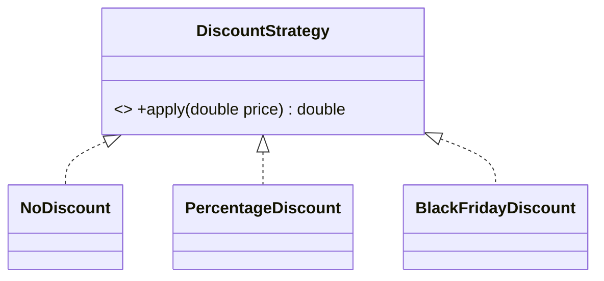
- **JVM Behaviour** - New implementations are simply new classes loaded by the classloader; the existing call sites (`invokeinterface`) require no recompilation - they dispatch dynamically to whichever implementation is provided at runtime.

#### Interview Questions
**Basic**
1. What does "open for extension, closed for modification" mean?
2. What OOP feature primarily enables OCP?

**Intermediate**
1. How does adding a new `if/else` branch for every new type violate OCP?
2. How does the Strategy pattern relate to OCP?

**Advanced**
1. What is "speculative generality" and how does it relate to over-applying OCP?

**Scenario-based**
1. A `DiscountCalculator` has a growing `switch` statement for discount types added every quarter - refactor it to comply with OCP.

#### Detailed Answers
1. **Q: "Open/closed" meaning?** A: A module's behaviour can be extended (new functionality added) without changing its existing, already-tested source code - extension happens by adding new code, not editing old code.
2. **Q: Enabling OOP feature?** A: Polymorphism (interfaces/abstract classes + dynamic dispatch) - it lets client code depend on an abstraction while concrete behaviour varies via different implementations plugged in.
3. **Q: `if/else` per type violation?** A: Every new type requires editing the existing conditional logic (risking regressions in already-tested branches) instead of adding an isolated new class - this is precisely what OCP forbids ("closed for modification").
4. **Q: Strategy pattern relation?** A: Strategy is the canonical implementation of OCP for behavioural variation - client code holds a reference to a `Strategy` interface, and new algorithms are added as new `Strategy` implementations without touching the client.
5. **Q: Speculative generality?** A: Introducing abstraction/extensibility points for variation that never materializes, adding needless indirection/complexity; OCP should be applied where change is genuinely anticipated (informed by actual requirements/history), not everywhere by default.
6. **Q: Refactor growing `switch`?** A: Introduce a `DiscountStrategy` interface with an `apply(price)` method; implement one class per discount type; the calculator holds a `Map<String, DiscountStrategy>` or receives a `DiscountStrategy` via DI, so adding a new discount type means adding a new class, not editing the switch.

#### Code Examples
```java
interface DiscountStrategy { double apply(double price); }
class NoDiscount implements DiscountStrategy { public double apply(double price) { return price; } }
class PercentageDiscount implements DiscountStrategy {
    private final double pct;
    PercentageDiscount(double pct) { this.pct = pct; }
    public double apply(double price) { return price * (1 - pct); }
}
class DiscountCalculator {
    // Closed for modification: never edited when a new discount type is added
    double calculate(double price, DiscountStrategy strategy) { return strategy.apply(price); }
}
public class OcpDemo {
    public static void main(String[] args) {
        DiscountCalculator calc = new DiscountCalculator();
        System.out.println(calc.calculate(100, new PercentageDiscount(0.2))); // 80.0
        System.out.println(calc.calculate(100, new NoDiscount()));            // 100.0
    }
}
```

### LSP

#### Theory
- **Core Concepts** - The Liskov Substitution Principle states subtypes must be substitutable for their base types without altering the correctness of the program - callers using the base type shouldn't need to know or care which subtype they actually received.
- **Internal Working** - Enforced by ensuring overriding methods honor the base method's contract: preconditions cannot be strengthened, postconditions cannot be weakened, and invariants must be preserved.
- **When to Use It** - Apply whenever designing an inheritance hierarchy - verify every subclass genuinely behaves as a valid, substitutable specialization of the parent, not just a syntactic reuse of code.
- **Advantages** - Guarantees polymorphic code (`List<Base>` processed uniformly) behaves correctly regardless of actual subtype; prevents surprising runtime behaviour changes when substituting subtypes.
- **Limitations** - Detecting violations often requires careful contract specification (pre/postconditions), which Java doesn't enforce at compile time - violations are only caught by tests or careful review.

#### Internal Working
- **Step-by-Step Explanation** - When overriding a method, verify: the override accepts at least as much input as the base (no added restrictions), returns results consistent with what the base's contract promises (no weaker guarantees), doesn't throw new unexpected exceptions, and doesn't violate any invariant the base type's callers rely upon.
- **Memory Layout** - Not directly applicable - LSP is a behavioural/contractual design principle, not a memory-layout concern.
- **Diagrams**
```
List<Bird> birds = ...;
for (Bird b : birds) b.fly();  // LSP requires EVERY Bird subtype to genuinely support fly() correctly
```
- **JVM Behaviour** - No special JVM behaviour; LSP violations manifest as runtime logic errors or unexpected exceptions (e.g., `UnsupportedOperationException`) rather than JVM-level failures, since the JVM only enforces type compatibility, not behavioural contracts.

#### Interview Questions
**Basic**
1. State the Liskov Substitution Principle in your own words.
2. Give the classic Square/Rectangle example of an LSP violation.

**Intermediate**
1. What does it mean to "strengthen preconditions" in an override, and why does that violate LSP?
2. How does throwing `UnsupportedOperationException` in an override typically violate LSP?

**Advanced**
1. How does LSP relate to Design by Contract (pre/postconditions, invariants)?

**Scenario-based**
1. `ImmutableList` extends `ArrayList` and overrides `add()` to throw `UnsupportedOperationException` - explain why this violates LSP and how you'd redesign it.

#### Detailed Answers
1. **Q: State LSP?** A: If `S` is a subtype of `T`, objects of type `T` in a program may be replaced with objects of type `S` without altering any of the desirable properties (correctness, tasks performed) of that program.
2. **Q: Square/Rectangle example?** A: Making `Square extends Rectangle` and overriding `setWidth()`/`setHeight()` to keep both sides equal breaks the Rectangle's assumed invariant (that width and height can vary independently) - code that does `rect.setWidth(5); rect.setHeight(10); assert area == 50` fails for a `Square`, violating substitutability.
3. **Q: Strengthening preconditions?** A: If an overriding method demands stricter input requirements than the base method promised (e.g., base accepts any int, override throws for negative ints), callers relying on the base contract may pass previously-valid arguments that now fail - violating LSP, since the subtype is no longer safely substitutable.
4. **Q: `UnsupportedOperationException` violation?** A: If a subtype throws for an operation the base type's contract guarantees works (e.g., a "read-only" list overriding `add()` to throw, while `List.add()` is documented to succeed), callers written against the base type break unexpectedly when given this subtype - a classic LSP violation.
5. **Q: Relation to Design by Contract?** A: LSP formalizes as: overriding methods may only weaken preconditions (accept a superset of valid inputs) or strengthen postconditions (guarantee at least as much as the base), and must preserve class invariants - directly mirroring Design by Contract's rules for behavioural subtyping.
6. **Q: `ImmutableList extends ArrayList`?** A: Violates LSP because code expecting a working `List.add()` (per `List`'s contract) breaks at runtime for this subtype; redesign by NOT extending a mutable collection at all - instead implement `List` directly (or wrap/delegate) and only support the read operations, or use `Collections.unmodifiableList()` composition instead of inheritance.

#### Code Examples
```java
class Rectangle {
    protected int width, height;
    void setWidth(int w) { width = w; }
    void setHeight(int h) { height = h; }
    int area() { return width * height; }
}
// LSP violation: Square secretly changes Rectangle's contract (independent width/height)
class Square extends Rectangle {
    @Override void setWidth(int w) { width = w; height = w; }
    @Override void setHeight(int h) { width = h; height = h; }
}
public class LspDemo {
    static void resize(Rectangle r) { r.setWidth(5); r.setHeight(10); assert r.area() == 50; }
    public static void main(String[] args) {
        resize(new Rectangle()); // works: area == 50
        // resize(new Square()); // fails assertion: area == 100, violates LSP
    }
}
```

### ISP

#### Theory
- **Core Concepts** - The Interface Segregation Principle states clients should not be forced to depend on methods they don't use - prefer several small, focused interfaces over one large, general-purpose interface.
- **Internal Working** - Enforced through interface design: split a "fat" interface into role-specific interfaces, and have classes implement only the ones relevant to their actual capabilities.
- **When to Use It** - Apply when an interface accumulates methods relevant only to a subset of its implementers, forcing others to provide dummy/no-op/exception-throwing implementations.
- **Advantages** - Reduces coupling (clients depend only on what they use), avoids forcing meaningless implementations, improves interface cohesion.
- **Limitations** - Excessive segregation can lead to interface explosion, requiring classes to implement many small interfaces, which can add boilerplate for simple cases.

#### Internal Working
- **Step-by-Step Explanation** - Identify distinct roles/capabilities currently mixed into one interface (e.g., `Worker` with `work()` and `eat()`); split into role interfaces (`Workable`, `Eatable`); classes implement only the interfaces matching their real capabilities (e.g., a `RobotWorker` implements only `Workable`).
- **Memory Layout** - Not directly applicable - a design-time principle; at runtime, each interface simply contributes additional entries to a class's itable.
- **Diagrams**
```
BEFORE: interface Worker { work(); eat(); }        // RobotWorker forced to implement eat() meaninglessly
AFTER:  interface Workable { work(); }  interface Eatable { eat(); }
        class RobotWorker implements Workable {}    // only implements what it needs
        class HumanWorker implements Workable, Eatable {}
```
- **JVM Behaviour** - No special JVM behaviour; smaller interfaces simply mean fewer itable entries per implementing class and looser coupling between class files (fewer interface dependencies to resolve/link).

#### Interview Questions
**Basic**
1. State the Interface Segregation Principle.
2. What's a symptom that an interface violates ISP?

**Intermediate**
1. How does ISP relate to the Single Responsibility Principle, applied to interfaces instead of classes?
2. Give an example of an ISP violation and its fix.

**Advanced**
1. How can excessive interface segregation itself become a design smell?

**Scenario-based**
1. A `Printer` interface has `print()`, `scan()`, and `fax()`; a simple `BasicPrinter` class can only `print()` and is forced to throw `UnsupportedOperationException` for the rest - fix this using ISP.

#### Detailed Answers
1. **Q: State ISP?** A: Clients should not be forced to depend upon interfaces/methods they do not use; many specific, client-focused interfaces are better than one general-purpose interface.
2. **Q: Symptom of violation?** A: Implementing classes that throw `UnsupportedOperationException`, leave methods empty/no-op, or otherwise can't meaningfully implement some methods of the interface they're forced to implement.
3. **Q: Relation to SRP?** A: SRP is about a class having one reason to change; ISP is the analogous idea applied to interfaces - an interface should represent one cohesive role/capability, not bundle unrelated responsibilities that force unrelated implementers together.
4. **Q: Example violation and fix?** A: A `Vehicle` interface with `drive()` and `fly()` forces a `Car` to implement a meaningless `fly()`; fix by splitting into `Drivable` and `Flyable`, and having `Car implements Drivable` while `FlyingCar implements Drivable, Flyable`.
5. **Q: Excessive segregation smell?** A: Splitting into too many single-method interfaces can fragment a cohesive capability unnecessarily, forcing classes to implement a long list of trivial interfaces and callers to juggle many types for what's conceptually one role - balance is needed between cohesion and granularity.
6. **Q: Fix `Printer` interface?** A: Split into `Printer { print(); }`, `Scanner { scan(); }`, `Fax { fax(); }`; `BasicPrinter implements Printer` only, while a full `AllInOnePrinter implements Printer, Scanner, Fax` - no class is forced into unsupported methods.

#### Code Examples
```java
// Fat interface forces unrelated implementations
interface PrinterBad { void print(); void scan(); void fax(); }
class BasicPrinterBad implements PrinterBad {
    public void print() { System.out.println("Printing"); }
    public void scan() { throw new UnsupportedOperationException(); } // forced, meaningless
    public void fax() { throw new UnsupportedOperationException(); }  // forced, meaningless
}

// ISP-compliant: segregated, role-specific interfaces
interface Printer { void print(); }
interface Scanner { void scan(); }
interface Fax { void fax(); }
class BasicPrinter implements Printer { public void print() { System.out.println("Printing"); } }
class AllInOnePrinter implements Printer, Scanner, Fax {
    public void print() { System.out.println("Printing"); }
    public void scan() { System.out.println("Scanning"); }
    public void fax() { System.out.println("Faxing"); }
}
```

### DIP

#### Theory
- **Core Concepts** - The Dependency Inversion Principle states high-level modules should not depend on low-level modules; both should depend on abstractions, and abstractions should not depend on details - details should depend on abstractions.
- **Internal Working** - Achieved by having classes depend on interfaces (injected via constructor/setter) rather than directly instantiating concrete implementation classes, inverting the natural source-code dependency direction.
- **When to Use It** - Apply when a high-level policy/business-logic class would otherwise directly `new` up and depend on a specific low-level implementation (a database driver, an HTTP client), coupling business logic to infrastructure details.
- **Advantages** - Decouples business logic from infrastructure, enabling swapping implementations (e.g., for testing with mocks, or changing databases) without touching high-level code; underlies Dependency Injection frameworks (Spring, Guice).
- **Limitations** - Adds indirection (extra interfaces, wiring) that can feel like overhead for very simple applications; requires a composition root/DI container to wire concrete implementations at startup.

#### Internal Working
- **Step-by-Step Explanation** - Define an abstraction (interface) owned conceptually by the high-level module capturing what it needs; the low-level module implements that abstraction; the high-level module receives an instance of the abstraction via constructor/setter injection rather than instantiating the concrete class itself, so source-code dependencies point from low-level to the abstraction (inverted from the traditional high-depends-on-low direction).
- **Memory Layout** - Not directly applicable - purely a compile-time dependency-direction and runtime object-graph wiring concern (typically resolved once at application startup by a DI container or manual composition root).
- **Diagrams**
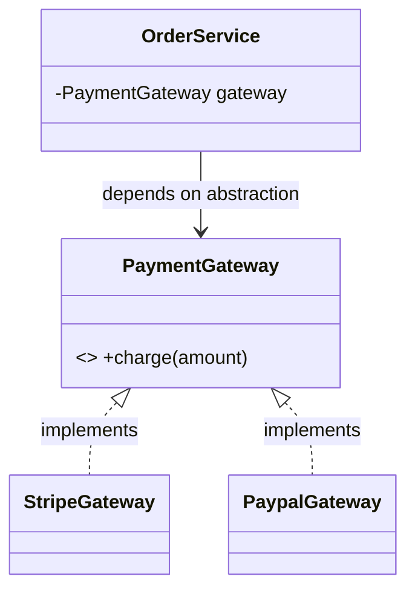
- **JVM Behaviour** - No special JVM behaviour beyond normal `invokeinterface` dispatch; the "inversion" is purely about which class file references which at compile time (import/dependency direction) - the JVM just sees ordinary polymorphic calls at runtime.

#### Interview Questions
**Basic**
1. State the Dependency Inversion Principle.
2. What's the difference between Dependency Inversion and Dependency Injection?

**Intermediate**
1. How does constructor injection support DIP?
2. What role does a DI framework (like Spring) play in relation to DIP?

**Advanced**
1. Why is DIP called "inversion" - inversion of what, exactly?

**Scenario-based**
1. An `OrderService` directly instantiates `new StripeGateway()` inside its methods, making it impossible to unit test without hitting the real Stripe API - refactor using DIP.

#### Detailed Answers
1. **Q: State DIP?** A: High-level modules should not depend on low-level modules - both should depend on abstractions; abstractions should not depend on details - details should depend on abstractions.
2. **Q: DIP vs DI?** A: DIP is the design **principle** (depend on abstractions, invert the natural dependency direction); Dependency Injection is a **technique/pattern** (supplying an object's dependencies from outside, e.g., via constructor) commonly used to implement DIP in practice.
3. **Q: How does constructor injection support DIP?** A: The class declares a constructor parameter typed to an interface/abstraction; the caller (or a DI container) supplies the concrete implementation, so the class's source code never directly references or instantiates a specific low-level class.
4. **Q: Role of a DI framework?** A: It acts as the "composition root", automatically wiring concrete implementations into classes that depend on abstractions (via constructor/field injection), removing the need for manual wiring code and enabling easy swapping of implementations (e.g., for different environments/tests) via configuration.
5. **Q: Why "inversion"?** A: Traditionally, high-level policy code directly depends on (and thus is coupled to) low-level implementation details; DIP inverts this so that the low-level details depend on (implement) an abstraction defined/owned by the high-level policy, flipping the natural top-down dependency arrow.
6. **Q: Refactor `OrderService`/`StripeGateway`?** A: Define a `PaymentGateway` interface with a `charge(amount)` method; have `StripeGateway implements PaymentGateway`; `OrderService` takes a `PaymentGateway` via its constructor instead of `new`-ing `StripeGateway` directly - tests can now inject a mock/fake `PaymentGateway`.

#### Code Examples
```java
interface PaymentGateway { void charge(double amount); }
class StripeGateway implements PaymentGateway {
    public void charge(double amount) { System.out.println("Charging $" + amount + " via Stripe"); }
}
class FakePaymentGateway implements PaymentGateway { // easy to substitute for tests
    public void charge(double amount) { System.out.println("Fake charge: $" + amount); }
}
class OrderService {
    private final PaymentGateway gateway; // depends on abstraction, not concrete Stripe class
    OrderService(PaymentGateway gateway) { this.gateway = gateway; }
    void placeOrder(double total) { gateway.charge(total); }
}
public class DipDemo {
    public static void main(String[] args) {
        OrderService prod = new OrderService(new StripeGateway());
        OrderService test = new OrderService(new FakePaymentGateway());
        prod.placeOrder(50.0);
        test.placeOrder(50.0);
    }
}
```

## Object Class

Every class implicitly extends `Object`, which exposes:

### `equals()`

#### Theory
- **Core Concepts** - `equals(Object)` defines logical equality between two objects; the default `Object` implementation is reference equality (`this == obj`), which classes override to provide value-based comparison.
- **Internal Working** - An overriding `equals()` typically checks `null`, type compatibility (`instanceof`/`getClass()`), then compares relevant fields.
- **When to Use It** - Override whenever instances should be compared by value/content (e.g., DTOs, value objects, keys in hash-based collections).
- **Advantages** - Enables correct behaviour in collections (`contains`, `remove`, `HashSet`/`HashMap` lookups) and intuitive `==`-like comparisons via `.equals()`.
- **Limitations** - Must be overridden together with `hashCode()` or hash-based collections break; easy to violate the equals contract (symmetry, transitivity) especially with inheritance.

#### Internal Working
- **Step-by-Step Explanation** - Default `Object.equals()` compiles to a simple reference comparison; an override replaces this with field-by-field comparison, usually guarded by a type check to avoid `ClassCastException`/incorrect comparisons across unrelated types.
- **Memory Layout** - Not directly applicable - `equals()` reads field values from the heap-allocated objects being compared; no special layout requirement.
- **Diagrams**
```
a.equals(b):
  if (a == b) return true;
  if (b == null || getClass() != b.getClass()) return false;
  return this.field1.equals(b.field1) && this.field2 == b.field2;
```
- **JVM Behaviour** - `equals()` is an ordinary virtual method dispatched via `invokevirtual`; the JIT can inline/devirtualize it like any hot method once a call site proves monomorphic.

#### Interview Questions
**Basic**
1. What does `Object.equals()` do by default?
2. Why should you override `equals()` for value-like classes?

**Intermediate**
1. What's the difference between using `instanceof` and `getClass()` in an `equals()` implementation?
2. What are the formal contract requirements of `equals()` (reflexive, symmetric, transitive, consistent)?

**Advanced**
1. Why is it notoriously hard to correctly implement `equals()` in an inheritance hierarchy?

**Scenario-based**
1. Two `Point` objects with identical x/y fail `.equals()` inside a `HashSet.contains()` check even after overriding `equals()` - what's likely missing?

#### Detailed Answers
1. **Q: Default behaviour?** A: Reference equality - `a.equals(b)` returns `a == b`, true only if both refer to the exact same object instance.
2. **Q: Why override for value classes?** A: So that two distinct instances representing the same logical value (e.g., two `Money(100, "USD")` objects) are considered equal, enabling correct use in collections and comparisons.
3. **Q: `instanceof` vs `getClass()`?** A: `instanceof` allows subclass instances to be considered equal to superclass instances (looser, can violate symmetry across a hierarchy); `getClass()` requires the exact same runtime class (stricter, preserves symmetry/transitivity but disallows meaningful equality across subclasses).
4. **Q: Formal contract requirements?** A: Reflexive (`x.equals(x)` true), symmetric (`x.equals(y) == y.equals(x)`), transitive (`x.equals(y) && y.equals(z)` implies `x.equals(z)`), consistent (repeated calls return the same result absent field changes), and `x.equals(null)` must return false.
5. **Q: Hard with inheritance?** A: Adding fields in a subclass and using `instanceof` typically breaks symmetry (superclass instance vs subclass instance comparisons disagree) - Josh Bloch's guidance is to favor composition over extending a concrete class when you need value equality, or use `getClass()` equality plus a `canEqual()` helper method.
6. **Q: `HashSet.contains()` fails despite `equals()` override?** A: `hashCode()` almost certainly wasn't overridden consistently, so the two equal objects hash to different buckets and `HashSet` never even calls `equals()` between them - the equals/hashCode contract requires overriding both together.

#### Code Examples
```java
import java.util.Objects;
final class Point {
    private final int x, y;
    Point(int x, int y) { this.x = x; this.y = y; }
    @Override public boolean equals(Object o) {
        if (this == o) return true;
        if (!(o instanceof Point)) return false;
        Point p = (Point) o;
        return x == p.x && y == p.y;
    }
    @Override public int hashCode() { return Objects.hash(x, y); } // must accompany equals()
}
```

### `hashCode()`

#### Theory
- **Core Concepts** - `hashCode()` returns an integer used by hash-based collections (`HashMap`, `HashSet`) to bucket objects for O(1) average lookup; the default `Object` implementation typically derives from the object's identity/memory address.
- **Internal Working** - Hash-based collections compute `hashCode() & (capacity-1)` (roughly) to pick a bucket, then use `equals()` to disambiguate collisions within that bucket.
- **When to Use It** - Always override alongside `equals()` so that equal objects produce equal hash codes, satisfying the equals/hashCode contract.
- **Advantages** - Enables efficient average-case O(1) hash-table operations; combined with a good distribution, minimizes collisions.
- **Limitations** - A poor hash function (e.g., constant value) degrades a hash table to O(n) lookup (all entries in one bucket); mutable fields used in `hashCode()` can "lose" objects in a `HashSet` if mutated after insertion.

#### Internal Working
- **Step-by-Step Explanation** - `HashMap`/`HashSet` call `hashCode()` on insertion/lookup, apply an internal spreading function (XOR-shift, since Java 8: `h ^ (h >>> 16)`) to reduce clustering, then mask with `(table.length - 1)` to select a bucket index; within a bucket, entries are compared via `equals()` (linked list or, since Java 8, a red-black tree for large buckets).
- **Memory Layout** - The default identity-based hash is often derived from (but not guaranteed to equal) the object's memory address, and once computed and stored in the mark word for some JVMs, it doesn't change even if the object is later moved by a compacting GC.
- **Diagrams**
```
key.hashCode() --> spread(h) --> index = spread(h) & (capacity-1) --> bucket[index] --> equals() to find exact match
```
- **JVM Behaviour** - HotSpot computes the default identity hash code lazily on first use (via `System.identityHashCode()`/default `hashCode()`) and caches it in the object header's mark word so it stays stable across the object's lifetime, even though the object's physical address may change due to compaction.

#### Interview Questions
**Basic**
1. What is the purpose of `hashCode()`?
2. What is the contract between `equals()` and `hashCode()`?

**Intermediate**
1. What happens if two unequal objects have the same `hashCode()`?
2. Why does mutating a field used in `hashCode()` after inserting an object into a `HashSet` cause bugs?

**Advanced**
1. How does `HashMap` use `hashCode()` internally to compute a bucket index (spreading function)?

**Scenario-based**
1. A `HashMap<Key, Value>` shows severely degraded performance under load testing - what `hashCode()`-related issue would you investigate first?

#### Detailed Answers
1. **Q: Purpose of `hashCode()`?** A: To provide a fast, deterministic integer used by hash-based collections to bucket objects, enabling average O(1) insertion/lookup instead of scanning every element.
2. **Q: equals/hashCode contract?** A: If two objects are equal per `equals()`, they MUST have the same `hashCode()`; the converse isn't required (unequal objects may share a hash code - a "collision", which `equals()` then resolves).
3. **Q: Same hash code, unequal objects?** A: That's a normal, allowed collision - both objects land in the same bucket, and the collection uses `equals()` to distinguish between them within that bucket; performance degrades only if collisions become excessive.
4. **Q: Mutating a field used in `hashCode()`?** A: The object's bucket location was computed at insertion time using the old hash code; after mutation, looking it up (or even `remove()`) recomputes the hash and looks in the WRONG bucket, effectively "losing" the object even though it's still in the set - a classic HashSet/HashMap bug, mitigated by never mutating fields used in equals/hashCode after insertion.
5. **Q: HashMap spreading function?** A: Since Java 8, `HashMap` applies `h ^ (h >>> 16)` to the raw hash code to mix higher bits into the lower bits (improving distribution for table sizes that are powers of two), then computes the bucket index as `spreadHash & (table.length - 1)`.
6. **Q: Degraded HashMap performance?** A: Likely a poor/constant `hashCode()` implementation (or a bug bucketing everything into one/few buckets), causing most lookups to degrade toward O(n) linked-list traversal within a single bucket (or O(log n) if Java 8's treeification of large buckets has kicked in) instead of average O(1).

#### Code Examples
```java
import java.util.Objects;
final class Employee {
    private final String id; // immutable - safe to use in hashCode()
    Employee(String id) { this.id = id; }
    @Override public boolean equals(Object o) {
        return o instanceof Employee && ((Employee) o).id.equals(this.id);
    }
    @Override public int hashCode() { return Objects.hash(id); } // consistent with equals()
}
```

### `clone()`

#### Theory
- **Core Concepts** - `clone()` (inherited from `Object`, protected) creates and returns a field-by-field copy of an object; usable only if the class implements the `Cloneable` marker interface, otherwise it throws `CloneNotSupportedException`.
- **Internal Working** - The default `Object.clone()` performs a shallow copy via native memory duplication of the object's fields, not through the constructor.
- **When to Use It** - Rarely recommended in modern Java - prefer copy constructors or static factory "copy" methods; use `clone()` mainly when required by legacy APIs or `Cloneable`-based frameworks.
- **Advantages** - Built into the language/JVM, can be faster than manual field-by-field copying for simple cases (native `memcpy`-like duplication).
- **Limitations** - `Cloneable` is a broken/awkward design (marker interface with no methods, `clone()` is `protected` in `Object`, default is shallow copy risking shared mutable state, checked exception even though most classes are cloneable); widely discouraged by Effective Java.

#### Internal Working
- **Step-by-Step Explanation** - Calling `super.clone()` in an overriding `clone()` method triggers a native JVM operation that allocates a new object of the same runtime class and copies all field values byte-for-byte from the original - if `Cloneable` isn't implemented, `Object.clone()` throws `CloneNotSupportedException` instead.
- **Memory Layout** - The clone is a distinct heap allocation with its own object header (fresh identity hash slot, potentially different lock state) but field values (including references) identical to the source - reference-type fields point to the SAME referenced objects as the original (shallow copy).
- **Diagrams**
```
original --fields--> [name="A", tags-ref--> TagsList@123]
clone    --fields--> [name="A", tags-ref--> TagsList@123]   <- SAME list instance (shallow)
```
- **JVM Behaviour** - `Object.clone()` is a native method implemented directly by the JVM (not plain Java bytecode); it bypasses the class's constructors entirely, which is one reason it's considered dangerous (invariants normally established in constructors are not re-run).

#### Interview Questions
**Basic**
1. What must a class implement to support `clone()`?
2. Is the default `clone()` a shallow or deep copy?

**Intermediate**
1. Why is `clone()` widely considered a poorly designed API in Java?
2. What alternative to `clone()` does Effective Java recommend?

**Advanced**
1. Why does `clone()` bypass constructors, and why is that risky for classes with invariants?

**Scenario-based**
1. After cloning an object containing a `List` field, mutating the list via the clone also affects the original - explain why and how to fix it.

#### Detailed Answers
1. **Q: Requirement for `clone()`?** A: The class must implement the `Cloneable` marker interface; otherwise calling `Object.clone()` throws `CloneNotSupportedException`.
2. **Q: Shallow or deep?** A: Shallow - primitive fields are copied by value, but reference-type fields are copied by reference, so the clone and original share the same referenced objects.
3. **Q: Why poorly designed?** A: `Cloneable` has no methods of its own (it just flags `Object.clone()`'s behaviour), `clone()` itself is `protected` in `Object` (requiring every subclass to re-expose it as `public`), it throws a checked exception unnecessarily for classes that never fail, and its default shallow-copy semantics silently share mutable state - a combination widely criticized (Josh Bloch: "clone architecture is fundamentally broken").
4. **Q: Recommended alternative?** A: A copy constructor (`new Foo(existingFoo)`) or a static factory copy method (`Foo.copyOf(existingFoo)`), which can fully control deep-vs-shallow copying and doesn't bypass normal constructor invariant checks.
5. **Q: Why bypass constructors, and why risky?** A: `Object.clone()` is a native operation that duplicates memory directly rather than calling any constructor, so any invariant-establishing logic in constructors (validation, defensive copying, derived field computation) is skipped entirely - a cloned object could violate invariants the class assumes are always true post-construction.
6. **Q: Shared list after cloning?** A: `clone()` performed a shallow copy, so the clone's `List` field points to the exact same `List` instance as the original; fix by overriding `clone()` to also clone the mutable field: `cloned.list = new ArrayList<>(this.list);` (a deep-enough copy for that field).

#### Code Examples
```java
import java.util.ArrayList;
import java.util.List;
class Team implements Cloneable {
    private String name;
    private List<String> members = new ArrayList<>();
    Team(String name) { this.name = name; }
    void addMember(String m) { members.add(m); }
    @Override public Team clone() {
        try {
            Team copy = (Team) super.clone(); // shallow copy via native duplication
            copy.members = new ArrayList<>(this.members); // manual deep-enough fix for the list field
            return copy;
        } catch (CloneNotSupportedException e) { throw new AssertionError(e); }
    }
}
```

### `finalize()` *(deprecated since Java 9)*

#### Theory
- **Core Concepts** - `finalize()` was a hook the GC could call on an object before reclaiming its memory, intended for last-chance resource cleanup; deprecated since Java 9 (JEP 421 proposes removal) due to fundamental unreliability.
- **Internal Working** - If overridden, the GC enqueues unreachable finalizable objects onto a special finalization queue, processed by a dedicated low-priority `Finalizer` thread, delaying actual memory reclamation until after `finalize()` runs.
- **When to Use It** - Essentially never in new code - use `try-with-resources`/`AutoCloseable` for deterministic cleanup, or `java.lang.ref.Cleaner` for a safety-net.
- **Advantages** - Historically provided *some* safety net against forgotten resource cleanup - now considered obsolete given better alternatives.
- **Limitations** - No timing/ordering guarantees (may run late or never), can resurrect objects (making them reachable again), significantly slows GC of affected objects (extra generation of GC passes), and swallowed exceptions inside `finalize()` are silently ignored.

#### Internal Working
- **Step-by-Step Explanation** - When an object with a non-trivial `finalize()` becomes unreachable, instead of being reclaimed immediately, the GC marks it "finalizable" and adds it to a reference queue; the JVM's `Finalizer` daemon thread pops entries off this queue and invokes `finalize()`; only after that (and if the object is still unreachable) does a subsequent GC cycle actually reclaim its memory - requiring potentially two GC cycles instead of one.
- **Memory Layout** - Finalizable objects survive at least one extra GC cycle compared to normal objects, effectively getting promoted/lingering longer than necessary, which can increase memory pressure in applications with many finalizable objects.
- **Diagrams**
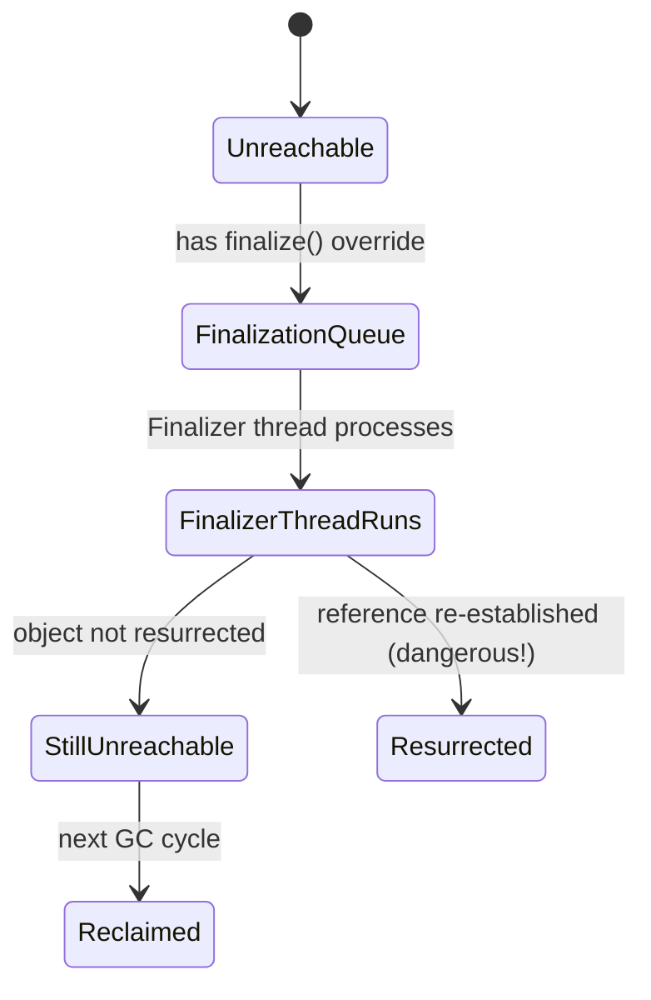
- **JVM Behaviour** - The single `Finalizer` thread processes the queue serially; if `finalize()` methods are slow or the queue backs up, objects can accumulate faster than they're finalized, leading to `OutOfMemoryError` in extreme cases - one of the concrete reasons it's deprecated.

#### Interview Questions
**Basic**
1. What was `finalize()` originally intended for?
2. What replaces `finalize()` in modern Java?

**Intermediate**
1. Why can't you rely on `finalize()` running promptly (or at all)?
2. What is "object resurrection" in the context of `finalize()`?

**Advanced**
1. Why does relying on `finalize()` heavily risk `OutOfMemoryError`?

**Scenario-based**
1. A legacy class overrides `finalize()` to close a file handle; under memory pressure, the application still runs out of file descriptors before OOM - explain why and how to fix it.

#### Detailed Answers
1. **Q: Original intent?** A: A last-resort hook for releasing native/external resources (file handles, sockets) if the programmer forgot to close them explicitly, run just before the GC reclaims an object's memory.
2. **Q: Modern replacement?** A: `try-with-resources` with `AutoCloseable` for deterministic, guaranteed cleanup, and `java.lang.ref.Cleaner` (or `PhantomReference` + `ReferenceQueue`) as a non-deprecated safety net for missed explicit cleanup.
3. **Q: Why unreliable timing?** A: `finalize()` only runs after the GC determines the object is unreachable AND the `Finalizer` thread gets around to processing it from its queue - there's no guarantee on when (or that) a GC cycle will even run, and under normal JVM shutdown paths it might never run at all.
4. **Q: Object resurrection?** A: Inside `finalize()`, code could accidentally (or deliberately) store `this` into a reachable field/static variable, making the "dying" object reachable again - the JVM allows this but it's fragile and confusing, and such objects are NOT finalized a second time even if they become unreachable again later.
5. **Q: Why risk OOM?** A: The single-threaded `Finalizer` queue can become a bottleneck if `finalize()` methods are slow (e.g., blocking I/O) or numerous; unreachable-but-not-yet-finalized objects pile up, consuming heap memory faster than they're reclaimed, eventually exhausting the heap.
6. **Q: File descriptor exhaustion?** A: File descriptors are a native OS resource with a low limit (often far lower than the heap can hold in objects); relying on `finalize()`/GC timing to close them means many open descriptors can accumulate faster than the GC decides to collect the objects, exhausting the OS limit long before heap memory becomes a problem - fix by using `try-with-resources` to close deterministically instead of relying on `finalize()`.

#### Code Examples
```java
// Modern replacement: AutoCloseable + try-with-resources instead of finalize()
class FileResource implements AutoCloseable {
    FileResource(String path) { System.out.println("Opened " + path); }
    void write(String data) { System.out.println("Writing: " + data); }
    @Override public void close() { System.out.println("Closed deterministically"); } // guaranteed, not GC-dependent
}
public class FinalizeAlternativeDemo {
    public static void main(String[] args) {
        try (FileResource fr = new FileResource("data.txt")) {
            fr.write("hello");
        } // close() guaranteed to run here, unlike finalize()
    }
}
```

### `wait()`

#### Theory
- **Core Concepts** - `wait()` causes the current thread to release the monitor lock on the object and suspend until another thread calls `notify()`/`notifyAll()` on the same object (or the timeout elapses); it must be called while holding the object's intrinsic lock.
- **Internal Working** - The thread is moved from the monitor's owner slot into the object's wait-set; the lock is released atomically as part of entering the wait state, and reacquired atomically before `wait()` returns.
- **When to Use It** - Use for low-level thread coordination (producer/consumer, condition waiting) inside a `synchronized` block, always in a loop checking the actual condition (to guard against spurious wakeups).
- **Advantages** - Built into every object (no extra allocation), integrates directly with `synchronized` monitors.
- **Limitations** - Low-level and error-prone (must be called inside `synchronized`, must loop on the condition, easy to cause missed signals/deadlocks); modern code generally prefers `java.util.concurrent` (`Condition`, `BlockingQueue`, `CountDownLatch`).

#### Internal Working
- **Step-by-Step Explanation** - Calling `wait()` while holding the monitor: (1) atomically releases the lock and adds the thread to the object's wait-set, (2) suspends the thread (not runnable, consuming no CPU), (3) upon `notify()`/`notifyAll()`/timeout/interrupt, moves the thread to the "blocked on reacquiring lock" state, (4) once the lock is available again, the thread reacquires it and `wait()` returns.
- **Memory Layout** - Not directly applicable at the heap level - the wait-set is part of the JVM's internal monitor (lock) data structure associated with the object, tracked by the runtime, not part of the object's field layout.
- **Diagrams**
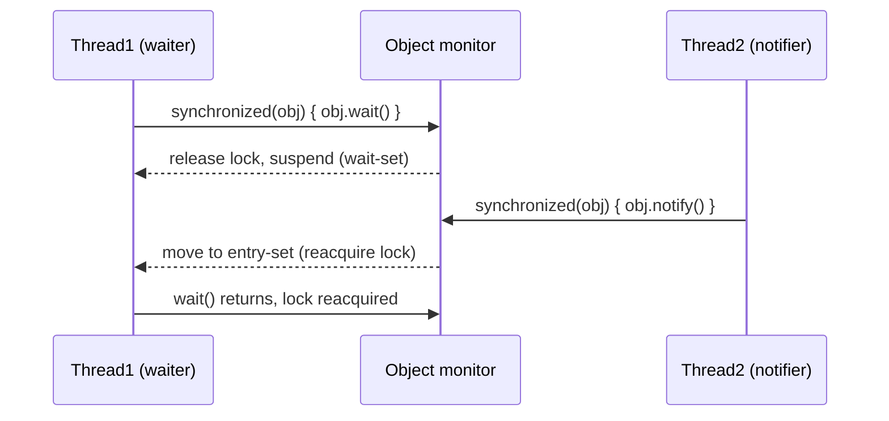
- **JVM Behaviour** - `wait()` is a native method implemented by the JVM's monitor subsystem; calling it without holding the lock throws `IllegalMonitorStateException`, enforced at runtime by checking the current thread against the monitor's recorded owner.

#### Interview Questions
**Basic**
1. What does `wait()` do, and what must you hold before calling it?
2. What exception is thrown if you call `wait()` without owning the object's monitor?

**Intermediate**
1. Why should `wait()` always be called inside a `while` loop checking the condition, not an `if`?
2. What is a "spurious wakeup"?

**Advanced**
1. How does `wait()` atomically release the lock and suspend the thread, avoiding a race with a concurrent `notify()`?

**Scenario-based**
1. A producer/consumer implementation using `wait()`/`notify()` occasionally deadlocks under load - what common mistakes would you check for?

#### Detailed Answers
1. **Q: What does `wait()` do?** A: Releases the object's monitor lock and suspends the calling thread until notified (or timed out/interrupted); you must hold the object's intrinsic lock (be inside a `synchronized(obj)` block) before calling `obj.wait()`.
2. **Q: Exception without owning monitor?** A: `IllegalMonitorStateException`.
3. **Q: Why loop, not `if`?** A: Because of spurious wakeups and because multiple waiters might be notified via `notifyAll()` but only some should proceed - re-checking the condition in a `while` loop after waking up ensures the thread only proceeds when the actual condition truly holds, re-waiting otherwise.
4. **Q: Spurious wakeup?** A: A `wait()` call can return even without an explicit `notify()`/timeout, due to underlying OS/JVM implementation details - the JLS explicitly permits this, which is why condition-checking in a loop is mandatory, not optional.
5. **Q: Atomic release+suspend?** A: The JVM's monitor implementation performs the "release lock and enqueue on wait-set" step as a single atomic operation with respect to other threads trying to acquire the same lock, guaranteeing no notify can be "lost" between checking the condition and actually starting to wait, as long as the check-and-wait happens entirely within the same synchronized block.
6. **Q: Producer/consumer deadlocks?** A: Common mistakes: calling `wait()`/`notify()` on different lock objects than intended, using `if` instead of `while` around the condition check, calling `notify()` instead of `notifyAll()` when multiple distinct waiter types exist (waking the wrong kind of waiter, leaving others stuck), or not synchronizing the state check/mutation consistently with the wait/notify calls.

#### Code Examples
```java
class BoundedBuffer {
    private final java.util.LinkedList<Integer> queue = new java.util.LinkedList<>();
    private final int capacity = 5;

    synchronized void put(int value) throws InterruptedException {
        while (queue.size() == capacity) wait(); // loop guards against spurious wakeups
        queue.add(value);
        notifyAll(); // wake any waiting consumers
    }

    synchronized int take() throws InterruptedException {
        while (queue.isEmpty()) wait();
        int value = queue.removeFirst();
        notifyAll(); // wake any waiting producers
        return value;
    }
}
```

### `notify()`

#### Theory
- **Core Concepts** - `notify()` wakes up a single arbitrary thread currently waiting on the object's monitor (in its wait-set), moving it to the entry-set to compete for the lock once the notifying thread releases it.
- **Internal Working** - Must be called while holding the object's monitor; if the wait-set is empty, `notify()` is a no-op (the "signal" is not stored/queued for a future waiter).
- **When to Use It** - Use only when you're certain any waiting thread can handle being woken (all waiters are interchangeable/equivalent) and exactly one should proceed; otherwise prefer `notifyAll()` for safety.
- **Advantages** - Slightly more efficient than `notifyAll()` when correctness allows it (avoids waking threads that would just re-check and go back to waiting).
- **Limitations** - Choosing which waiting thread wakes is unspecified/arbitrary; using it when waiters aren't interchangeable can cause missed signals/starvation (the "wrong" thread wakes and the intended one waits forever).

#### Internal Working
- **Step-by-Step Explanation** - `notify()` selects one thread from the object's wait-set (JVM-implementation-defined selection, not guaranteed FIFO) and moves it to the entry-set (competing to reacquire the lock); the woken thread doesn't actually run until the notifying thread exits the `synchronized` block/releases the lock, and even then must win the lock re-acquisition race against other threads.
- **Memory Layout** - Not directly applicable - purely monitor/wait-set bookkeeping maintained by the JVM runtime, not object field data.
- **Diagrams**
```
Wait-set: [T1, T2, T3]  --notify()-->  one arbitrary thread (say T2) moves to entry-set
Wait-set: [T1, T3]                    T2 competes for the lock once released
```
- **JVM Behaviour** - Implemented as a native method tightly coupled to the JVM's monitor implementation (often backed by OS-level mutex/condition variable primitives); throws `IllegalMonitorStateException` if the calling thread doesn't hold the object's monitor.

#### Interview Questions
**Basic**
1. What does `notify()` do?
2. What happens if `notify()` is called when no thread is waiting?

**Intermediate**
1. How is the woken thread chosen, and can you rely on any particular order?
2. Why might using `notify()` instead of `notifyAll()` cause a bug?

**Advanced**
1. Does the notified thread start running immediately? Explain the handoff between notifier and waiter.

**Scenario-based**
1. A pool of worker threads all wait on the same object for different kinds of "work available" signals, and the producer calls `notify()` - occasionally the wrong worker wakes up and finds no work for it, then goes back to waiting, leaving actual work unprocessed - diagnose and fix.

#### Detailed Answers
1. **Q: What does `notify()` do?** A: Wakes exactly one thread waiting in the object's wait-set (chosen arbitrarily by the JVM), moving it to compete for the object's monitor lock.
2. **Q: No thread waiting?** A: It's a no-op - the notification is not queued/remembered for a thread that calls `wait()` later; that thread will simply wait until a future `notify()`/`notifyAll()` call.
3. **Q: How is the thread chosen?** A: Unspecified by the JLS - implementation-defined and not guaranteed to be FIFO or fair; you cannot rely on any particular waiting thread being chosen.
4. **Q: Why can `notify()` cause bugs?** A: If multiple threads are waiting for different conditions/reasons on the same object, `notify()` might wake a thread that isn't the one that should proceed for the current signal, leaving the intended waiter asleep indefinitely (a missed-signal/starvation bug) - `notifyAll()` avoids this by waking everyone to re-check their own condition.
5. **Q: Does woken thread run immediately?** A: No - it moves from the wait-set to the entry-set and must still acquire the monitor lock, which only becomes available once the notifying thread exits its `synchronized` block (or itself calls `wait()`); it then competes with any other threads also trying to acquire that lock.
6. **Q: Wrong worker wakes bug?** A: Since waiters aren't interchangeable (different work types), `notify()` picks an arbitrary one which may not match the available work; fix by switching to `notifyAll()` (all workers re-check the shared work queue/condition) or using per-condition `Lock`/`Condition` objects (`java.util.concurrent.locks`) so each condition has its own targeted signal.

#### Code Examples
```java
class SingleSlot {
    private String item;
    private boolean available = false;

    synchronized void produce(String value) throws InterruptedException {
        while (available) wait();
        item = value;
        available = true;
        notify(); // safe here: exactly one kind of waiter (a single consumer type) exists
    }

    synchronized String consume() throws InterruptedException {
        while (!available) wait();
        available = false;
        notify();
        return item;
    }
}
```

### `notifyAll()`

#### Theory
- **Core Concepts** - `notifyAll()` wakes every thread currently waiting on the object's monitor, moving all of them to the entry-set to compete for the lock once released; each then re-checks its own wait condition (in its `while` loop).
- **Internal Working** - Functionally identical to `notify()` except it empties the entire wait-set instead of picking one thread; still requires the calling thread to hold the monitor.
- **When to Use It** - Use as the safe default whenever waiters may be waiting for different conditions, or when you're not 100% certain all waiters are interchangeable - correctness first, optimize to `notify()` only when proven safe.
- **Advantages** - Eliminates the missed-signal/starvation risk inherent in `notify()`'s arbitrary single-thread selection; simpler to reason about correctness.
- **Limitations** - Can cause a "thundering herd" - many threads wake, re-acquire the lock one at a time, find their condition still false, and go back to waiting, wasting CPU/context-switch overhead versus a more targeted signaling mechanism.

#### Internal Working
- **Step-by-Step Explanation** - `notifyAll()` moves every thread from the object's wait-set into the entry-set; they each then serially acquire the lock (one at a time, since only one thread can hold a monitor at once), re-check their condition in the `while (!condition) wait();` loop, and either proceed (condition true) or call `wait()` again (condition still false).
- **Memory Layout** - Not directly applicable - purely JVM monitor/wait-set bookkeeping.
- **Diagrams**
```
Wait-set: [T1, T2, T3]  --notifyAll()-->  entry-set: [T1, T2, T3] (all compete for the lock serially)
```
- **JVM Behaviour** - Like `notify()`, implemented natively via the JVM's monitor machinery; the "thundering herd" cost is a real but usually acceptable trade-off for correctness in most application-level synchronization scenarios (vs. highly tuned concurrent primitives).

#### Interview Questions
**Basic**
1. How does `notifyAll()` differ from `notify()`?
2. Do woken threads all run in parallel immediately after `notifyAll()`?

**Intermediate**
1. Why is `notifyAll()` generally considered the "safe default" over `notify()`?
2. What's the "thundering herd" problem in this context?

**Advanced**
1. In what scenario is `notify()` provably safe to use instead of `notifyAll()`, and how would you justify that choice in a code review?

**Scenario-based**
1. Multiple consumer threads and multiple producer threads share one lock/condition using `wait()`/`notifyAll()`; performance under high contention is worse than expected - what alternative from `java.util.concurrent` would you consider, and why?

#### Detailed Answers
1. **Q: `notifyAll()` vs `notify()`?** A: `notifyAll()` wakes every waiting thread on that monitor; `notify()` wakes only one, arbitrarily chosen.
2. **Q: Do they run in parallel?** A: No - they're all moved to the entry-set but still must acquire the same monitor lock one at a time (mutual exclusion), so they effectively run their re-check/proceed logic serially, not concurrently.
3. **Q: Why the safe default?** A: Because it guarantees every waiter gets a chance to re-check its condition after any state change, eliminating the risk that `notify()`'s arbitrary choice wakes the "wrong" (non-matching) thread while the correct one sleeps forever.
4. **Q: Thundering herd?** A: The phenomenon where many threads wake simultaneously in response to one event, but only one (or a few) can actually make progress, wasting CPU/scheduling overhead as the rest immediately re-block - a known cost of `notifyAll()`'s broad wake-up.
5. **Q: When is `notify()` provably safe?** A: When all waiters on the object wait for the exact same condition, are functionally interchangeable (any one of them can correctly handle being woken), and each `notify()` call corresponds to exactly one unit of work/state change becoming available - a narrow, easily-violated condition, which is why it needs careful justification/documentation in review.
6. **Q: Better alternative for high contention?** A: `java.util.concurrent.BlockingQueue` (e.g., `LinkedBlockingQueue`) or explicit `Lock`/`Condition` pairs, which offer more efficient, purpose-built signaling (potentially per-condition `Condition` objects avoiding unnecessary wake-ups) and better scalability than raw `wait()`/`notifyAll()` on a single monitor.

#### Code Examples
```java
import java.util.LinkedList;
class MultiConditionBuffer {
    private final LinkedList<Integer> queue = new LinkedList<>();
    private final int capacity = 3;

    // Multiple distinct waiter types (producers waiting for space, consumers waiting for items)
    // share this monitor, so notifyAll() is the safe choice, not notify().
    synchronized void put(int value) throws InterruptedException {
        while (queue.size() == capacity) wait();
        queue.add(value);
        notifyAll(); // wakes both idle producers and consumers to re-check their own condition
    }

    synchronized int take() throws InterruptedException {
        while (queue.isEmpty()) wait();
        int v = queue.removeFirst();
        notifyAll();
        return v;
    }
}
```

### `getClass()`

#### Theory
- **Core Concepts** - `getClass()` returns the runtime `Class<?>` object representing the object's actual (most-derived) type, forming the entry point into the Reflection API; it's `final` and cannot be overridden.
- **Internal Working** - Reads the object header's klass pointer (the metadata reference embedded in every object) and returns the corresponding cached `Class` instance.
- **When to Use It** - Use for runtime type inspection, strict type-equality checks in `equals()`, reflection-based frameworks (serialization, DI containers, ORMs), and dynamic class loading scenarios.
- **Advantages** - O(1) access to full runtime type metadata (methods, fields, annotations, superclass, interfaces); foundation for frameworks that operate generically over arbitrary types.
- **Limitations** - `getClass() != SomeType.class` distinctions can be a source of `equals()` bugs across subclasses (see LSP/equals discussion); reflection via the returned `Class` object has performance overhead relative to direct calls, and can be restricted by the module system (`setAccessible` limits).

#### Internal Working
- **Step-by-Step Explanation** - Every object's header contains a pointer to its class's metadata ("klass word"); `getClass()` simply dereferences that pointer and returns the JVM's single cached `Class` instance for that runtime type (one instance per classloader+name pair, ensuring `==` comparison between `Class` objects works correctly for identity).
- **Memory Layout** - The klass pointer lives in the object header (alongside the mark word) on the heap; the `Class` object itself, along with the rest of the type's metadata, lives in Metaspace.
- **Diagrams**
```
Object header: [mark word][klass pointer] --> Metaspace: Class<Dog> metadata (methods, fields, superclass...)
```
- **JVM Behaviour** - `getClass()` is effectively a native/intrinsic method - extremely cheap (a header field read plus a return), often further optimized/inlined by the JIT since it has no branching logic.

#### Interview Questions
**Basic**
1. What does `getClass()` return?
2. Can `getClass()` be overridden?

**Intermediate**
1. What's the difference between `obj.getClass() == Foo.class` and `obj instanceof Foo`?
2. How does `getClass()` relate to the Reflection API?

**Advanced**
1. How does the JVM guarantee `Class` object identity (`==` works correctly) across multiple calls to `getClass()` for the same type?

**Scenario-based**
1. An `equals()` implementation uses `instanceof` and works fine until a new subclass is introduced, at which point equality becomes asymmetric across the hierarchy - how would switching to `getClass()` comparison change this, and what's the trade-off?

#### Detailed Answers
1. **Q: What does `getClass()` return?** A: The `Class<?>` object representing the object's actual runtime type (the most-derived class), regardless of the static/reference type used to call it.
2. **Q: Can it be overridden?** A: No - it's declared `final` in `Object`, guaranteeing it always reflects the true runtime type and cannot be spoofed by subclasses.
3. **Q: `getClass() == Foo.class` vs `instanceof Foo`?** A: `getClass() == Foo.class` is true only if the object's EXACT runtime type is `Foo` (excludes subclasses); `instanceof Foo` is true for `Foo` and any subclass of `Foo` - a strict-vs-lenient type check distinction.
4. **Q: Relation to Reflection API?** A: `getClass()` is the standard entry point to obtain a `Class<?>` object for an existing instance, from which you can call `getDeclaredMethods()`, `getFields()`, `getAnnotations()`, etc. - the foundation of most reflection-based code.
5. **Q: `Class` object identity guarantee?** A: The JVM maintains a single `Class` instance per (classloader, fully-qualified-name) pair internally; every `getClass()` call (or `.class` literal, or `Class.forName()`) for that same type/classloader combination returns the exact same cached object, so reference equality (`==`) correctly reflects type identity.
6. **Q: Switching `instanceof` to `getClass()` in `equals()`?** A: Using `getClass()` restores symmetry (an instance of a subclass is never considered equal to a superclass instance, and vice versa, preserving LSP-safe equals contracts), at the cost of disallowing meaningful cross-hierarchy equality (a subclass instance can never equal a superclass instance even if all shared fields match) - appropriate when subclasses represent genuinely distinct "kinds", less appropriate for simple extension without adding distinguishing state.

#### Code Examples
```java
public class GetClassDemo {
    static class Animal {}
    static class Dog extends Animal {}

    public static void main(String[] args) {
        Animal a = new Dog();
        System.out.println(a.getClass());              // class GetClassDemo$Dog (runtime type)
        System.out.println(a.getClass() == Animal.class); // false
        System.out.println(a instanceof Animal);          // true
        System.out.println(a.getClass().getSuperclass()); // class GetClassDemo$Animal
    }
}
```

### `toString()`

#### Theory
- **Core Concepts** - `toString()` returns a human-readable string representation of an object; the default `Object` implementation returns `getClass().getName() + "@" + Integer.toHexString(hashCode())`.
- **Internal Working** - An overriding implementation typically concatenates key field values into a readable format, invoked implicitly by string concatenation (`"" + obj`), `println`, string formatting, and debuggers/loggers.
- **When to Use It** - Override for virtually every domain/value class to aid debugging, logging, and diagnostics.
- **Advantages** - Dramatically improves debuggability (readable logs/exception messages) versus the cryptic default hash-based representation.
- **Limitations** - Easy to forget to update when adding fields; including sensitive data (passwords, PII) in `toString()` can leak it into logs - a real security concern.

#### Internal Working
- **Step-by-Step Explanation** - String concatenation with a non-`String` operand compiles (since Java 9) to an `invokedynamic` call to `StringConcatFactory`, which internally calls `toString()` on the object; `println(Object)` and most logging frameworks likewise call `toString()` directly.
- **Memory Layout** - Not directly applicable - `toString()` allocates a new `String` object on the heap representing the formatted output; no special layout concern for the source object.
- **Diagrams**
```
System.out.println(order);  -->  order.toString()  -->  "Order{id=42, total=99.99}"
```
- **JVM Behaviour** - Like any virtual method, dispatched via `invokevirtual`; string concatenation using `+` with objects is compiled via `invokedynamic`/`StringConcatFactory` (Java 9+), which may use different strategies (`StringBuilder`-based or `MethodHandle`-based) chosen by the JIT/runtime for efficiency.

#### Interview Questions
**Basic**
1. What does the default `Object.toString()` return?
2. Why should you override `toString()` for domain classes?

**Intermediate**
1. What security concern arises from including sensitive fields in `toString()`?
2. How do IDEs/records auto-generate `toString()`, and what format do records use?

**Advanced**
1. How does string concatenation (`+`) with a custom object compile since Java 9, and how does that relate to `toString()`?

**Scenario-based**
1. A `User` class's `toString()` includes the plaintext password field, and it later shows up in production logs after an exception - what's the fix and broader lesson?

#### Detailed Answers
1. **Q: Default `toString()`?** A: `getClass().getName() + "@" + Integer.toHexString(hashCode())`, e.g., `com.example.Order@1b6d3586` - not useful for debugging without an override.
2. **Q: Why override?** A: To produce meaningful, human-readable output showing key state, which is invaluable in log messages, exception traces, debugger "watch" views, and quick `System.out.println` diagnostics.
3. **Q: Security concern?** A: Sensitive data (passwords, tokens, PII) included in `toString()` can inadvertently leak into application logs, exception messages, or monitoring tools whenever the object is logged or printed - exclude such fields or mask them (e.g., print `"***"` instead of the real password).
4. **Q: Records' `toString()` format?** A: Records auto-generate a `toString()` in the format `RecordName[field1=value1, field2=value2, ...]`, derived automatically from the record's components; IDEs commonly generate a similar `ClassName{field1=value1, ...}` style for regular classes.
5. **Q: String concat compilation since Java 9?** A: `"Order: " + order` compiles to an `invokedynamic` call targeting `StringConcatFactory.makeConcatWithConstants`, which at runtime builds the concatenated string (internally calling `toString()` on the `order` object) using a strategy chosen/optimized by the JVM, rather than the older Java 8-and-earlier approach of explicit `StringBuilder.append()` calls compiled directly into the bytecode.
6. **Q: Password leak fix?** A: Remove the password (or any secret) from `toString()` entirely, or explicitly mask it (`"password=***"`); broader lesson: treat `toString()` as effectively public-facing output (logs, monitoring) and audit it the same way you'd audit any external data exposure surface.

#### Code Examples
```java
class Order {
    private final int id;
    private final double total;
    Order(int id, double total) { this.id = id; this.total = total; }
    @Override public String toString() {
        return "Order{id=" + id + ", total=" + total + "}"; // readable, safe (no sensitive fields)
    }
    public static void main(String[] args) {
        Order o = new Order(42, 99.99);
        System.out.println(o);          // uses overridden toString()
        System.out.println("Placed: " + o); // invokedynamic StringConcatFactory calls toString()
    }
}
```

### `equals()` / `hashCode()` Contract *(new)*

#### Theory
- **Core Concepts** - The formal contract linking `equals()` and `hashCode()`: if `a.equals(b)` is true, then `a.hashCode() == b.hashCode()` MUST also be true; the converse is not required (unequal objects may share a hash code).
- **Internal Working** - Hash-based collections rely on this contract to first narrow a lookup to a single bucket (via `hashCode()`), then use `equals()` only within that bucket - violating the contract makes lookups silently fail even though the object is "in" the collection.
- **When to Use It** - Always override both together, never just one; use `Objects.hash(fields...)`/`Objects.equals()` helpers or IDE/`record`-generated implementations to keep them consistent automatically.
- **Advantages** - Correct adherence guarantees predictable behaviour in every hash-based collection (`HashMap`, `HashSet`, `Hashtable`, `ConcurrentHashMap`).
- **Limitations** - No compiler enforcement of the contract - violations are only caught by careful review/testing, often manifesting as subtle, hard-to-reproduce bugs ("missing" entries in sets/maps).

#### Internal Working
- **Step-by-Step Explanation** - On `HashMap.put()`/`get()`, the key's `hashCode()` determines the bucket; within that bucket, `equals()` distinguishes between potentially multiple colliding keys. If two equal objects (per `equals()`) produced different hash codes, they'd land in different buckets, and a `get()` using one "equal" instance would never even attempt to compare against the other, silently returning the wrong result (or `null`).
- **Memory Layout** - Not directly applicable - purely an API-contract concern spanning both methods' implementations.
- **Diagrams**
```
CORRECT: equal objects -> same hashCode -> same bucket -> equals() finds match
BROKEN:  equal objects -> different hashCode -> different buckets -> equals() NEVER even called -> "lost" entry
```
- **JVM Behaviour** - No JVM-level enforcement; this is purely an API-level contract documented in `Object`'s Javadoc that well-behaved classes and collection implementations rely on cooperatively.

#### Interview Questions
**Basic**
1. State the equals/hashCode contract precisely.
2. What collection classes rely on this contract?

**Intermediate**
1. What concretely breaks if you override `equals()` but not `hashCode()`?
2. Is it required that unequal objects have different hash codes?

**Advanced**
1. How would you use `Objects.hash()` and `Objects.equals()` to implement both methods consistently and correctly?

**Scenario-based**
1. A `Set<Employee>.contains(employee)` returns `false` for an employee that was definitely added earlier, and `equals()` looks correct when tested directly - what's the likely root cause?

#### Detailed Answers
1. **Q: State the contract?** A: Equal objects (per `equals()`) MUST produce equal `hashCode()` values; the reverse isn't required - unequal objects MAY (and often do, via collision) share a hash code.
2. **Q: Which collections rely on it?** A: `HashMap`, `HashSet`, `Hashtable`, `LinkedHashMap`/`LinkedHashSet`, `ConcurrentHashMap` - any hash-table-based structure.
3. **Q: What breaks with `equals()` but no `hashCode()` override?** A: Two "equal" objects can produce different default (identity-based) hash codes, landing in different buckets; a `HashSet`/`HashMap` will treat them as distinct even though `.equals()` says they're the same, so `contains()`/`get()` can return false negatives.
4. **Q: Must unequal objects differ in hash code?** A: No - collisions are explicitly allowed and normal; the contract only constrains the equal-implies-equal-hash direction.
5. **Q: Using `Objects.hash()`/`Objects.equals()`?** A: `Objects.hash(field1, field2, ...)` computes a combined hash consistent with a matching `equals()` that uses `Objects.equals(this.field1, other.field1) && ...` for each field - as long as both methods reference the exact same set of fields, the contract is automatically satisfied.
6. **Q: `contains()` returns false despite correct `equals()`?** A: Almost certainly `hashCode()` wasn't overridden (or was overridden inconsistently with `equals()`), so the object's bucket location doesn't match between insertion and lookup - fix by ensuring `hashCode()` uses exactly the same fields as `equals()`.

#### Code Examples
```java
import java.util.Objects;
final class Employee {
    private final String id;
    private final String department;
    Employee(String id, String department) { this.id = id; this.department = department; }
    @Override public boolean equals(Object o) {
        if (this == o) return true;
        if (!(o instanceof Employee)) return false;
        Employee e = (Employee) o;
        return Objects.equals(id, e.id) && Objects.equals(department, e.department);
    }
    @Override public int hashCode() { return Objects.hash(id, department); } // same fields as equals()
}
```

### Shallow vs. Deep Cloning *(new)*

#### Theory
- **Core Concepts** - Shallow cloning copies an object's fields as-is (primitives by value, references by reference, so nested mutable objects are shared); deep cloning recursively copies every referenced mutable object too, so the clone shares no mutable state with the original.
- **Internal Working** - `Object.clone()`/copy constructors performing a straightforward field copy give shallow semantics by default; deep cloning requires explicitly cloning each mutable field (recursively, for nested structures).
- **When to Use It** - Shallow cloning suffices when nested objects are immutable or intentionally shared; deep cloning is required when the clone must be fully independent (safe to mutate without affecting the original).
- **Advantages** - Shallow: fast, cheap, simple. Deep: guarantees true independence, preventing subtle aliasing bugs.
- **Limitations** - Shallow: mutations through shared nested references leak between original and clone unexpectedly. Deep: more expensive (recursive copying), and complex object graphs with cycles require careful handling (tracking already-copied objects) to avoid infinite recursion.

#### Internal Working
- **Step-by-Step Explanation** - Shallow: copy each field's bit pattern (primitive value or reference address) directly - result: two objects, but any mutable referenced object is the exact same instance for both. Deep: for each mutable reference field, recursively create a new copy of the referenced object (and its own mutable fields, and so on), typically via recursive `clone()`/copy-constructor calls, or via serialization round-trip for complex graphs.
- **Memory Layout** - Shallow copy: two separate objects on the heap sharing pointers to the same nested objects. Deep copy: entirely separate object graphs on the heap with no shared mutable nodes (aside from deliberately shared immutables like interned `String`s).
- **Diagrams**
```
SHALLOW:  original --list--> ListA        DEEP:  original --list--> ListA
          clone    --list--> ListA (same)         clone    --list--> ListB (new copy)
```
- **JVM Behaviour** - No special JVM support for deep cloning; it's purely application-level recursive object construction. Serialization-based deep copy (serialize then deserialize) relies on the JVM's serialization machinery to reconstruct an entirely new, disconnected object graph.

#### Interview Questions
**Basic**
1. What is the difference between shallow and deep cloning?
2. Which does `Object.clone()` perform by default?

**Intermediate**
1. When is shallow cloning perfectly safe despite having reference fields?
2. What's a simple (if inefficient) way to achieve deep cloning using serialization?

**Advanced**
1. How do you handle deep cloning of an object graph containing cycles without infinite recursion?

**Scenario-based**
1. A `Configuration` object is shallow-cloned per request to allow per-request overrides, but changes made to one request's config unexpectedly appear in another request's - diagnose and fix.

#### Detailed Answers
1. **Q: Shallow vs deep?** A: Shallow copies top-level fields only (nested mutable objects remain shared references); deep recursively copies nested mutable objects too, producing a fully independent object graph.
2. **Q: Default `Object.clone()` behaviour?** A: Shallow - it copies field values directly, so reference-type fields in the clone point to the same objects as in the original.
3. **Q: When is shallow safe?** A: When all referenced fields are immutable (e.g., `String`, boxed primitives, immutable value objects) - since they can't be mutated, sharing them between original and clone causes no aliasing bugs.
4. **Q: Serialization-based deep copy?** A: Serialize the object to a byte stream (`ObjectOutputStream`) then deserialize it back (`ObjectInputStream`) into a brand-new object graph - simple to implement generically but requires all involved classes to be `Serializable` and is relatively slow/heavy compared to manual deep-copy code.
5. **Q: Handling cycles in deep cloning?** A: Maintain a map from original object references to their already-created clones (an identity map, e.g., `IdentityHashMap<Object,Object>`); before deep-copying a referenced object, check if it's already been cloned and reuse that clone instead of recursing again, breaking the cycle.
6. **Q: `Configuration` shallow-clone bug?** A: The shallow clone shares a nested mutable field (e.g., a `Map<String,String> settings`) with the original; mutating that map via one "clone" affects all others sharing the same map instance - fix by deep-copying the mutable `settings` map (`new HashMap<>(original.settings)`) as part of the clone operation.

#### Code Examples
```java
import java.util.HashMap;
import java.util.Map;
class Address { String city; Address(String city) { this.city = city; } }
class PersonShallow implements Cloneable {
    Address address; // mutable, shared on shallow clone
    PersonShallow(Address address) { this.address = address; }
    @Override public PersonShallow clone() {
        try { return (PersonShallow) super.clone(); } catch (CloneNotSupportedException e) { throw new AssertionError(e); }
    }
}
class PersonDeep implements Cloneable {
    Address address;
    PersonDeep(Address address) { this.address = address; }
    @Override public PersonDeep clone() {
        PersonDeep copy;
        try { copy = (PersonDeep) super.clone(); } catch (CloneNotSupportedException e) { throw new AssertionError(e); }
        copy.address = new Address(this.address.city); // deep copy of the mutable nested field
        return copy;
    }
}
public class CloningDemo {
    public static void main(String[] args) {
        PersonShallow p1 = new PersonShallow(new Address("NYC"));
        PersonShallow p2 = p1.clone();
        p2.address.city = "LA";
        System.out.println(p1.address.city); // "LA" - unintended sharing!

        PersonDeep d1 = new PersonDeep(new Address("NYC"));
        PersonDeep d2 = d1.clone();
        d2.address.city = "LA";
        System.out.println(d1.address.city); // "NYC" - correctly independent
    }
}
```
