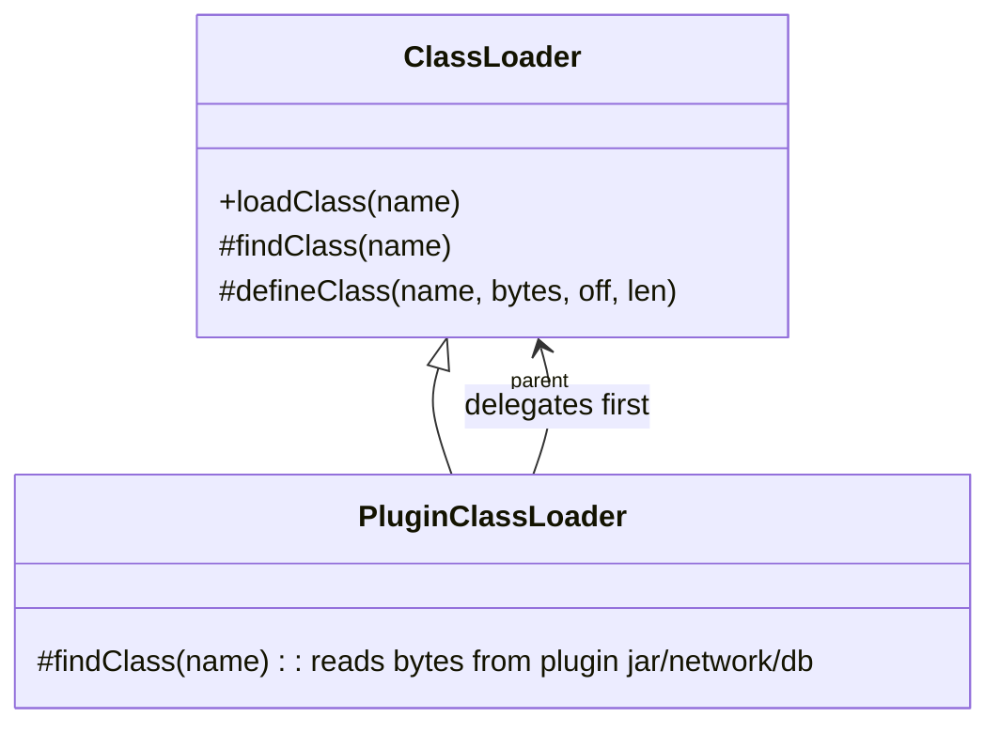

# 20. Class Loader

## Bootstrap

### Theory

- **Core Concepts**: The Bootstrap Class Loader is the root/top-most class loader in the JVM's hierarchy, responsible for loading the core Java platform classes essential to running the JVM itself - primarily classes from `java.base` (`java.lang.Object`, `java.lang.String`, `java.util.*` core classes, etc.).
- **Internal Working**: Unlike every other class loader, the Bootstrap Class Loader is implemented natively (in C/C++ as part of the JVM itself, not as a Java object) and loads classes directly from the modular runtime image (`jrt:` filesystem / `lib/modules` file in the JDK installation, replacing the old `rt.jar` since Java 9's module system).
- **When to Use It**: Not user-invoked directly - it's automatically the loader for any class in the platform's core modules; relevant to understand when reasoning about classloading hierarchy, `getClassLoader()` returning `null`, or diagnosing `NoClassDefFoundError`/module-related issues.
- **Advantages**: Extremely fast and secure since it's a fixed, trusted, natively-implemented loader for the platform's own foundational classes - no Java-level security manager/verification overhead is needed for classes the JVM itself depends on to bootstrap execution.
- **Limitations**: Cannot be extended, replaced, or instantiated by application code (it's not represented as an ordinary Java `ClassLoader` object you can subclass); calling `getClassLoader()` on a class it loaded returns `null` (not a genuine loader instance), which can surprise developers doing reflection-based classloader introspection.

### Internal Working

- **Step-by-Step Explanation**: (1) JVM startup invokes the native bootstrap loading mechanism before any Java code runs. (2) It loads the fundamental classes needed to get the JVM into a runnable state: `java.lang.Object`, `java.lang.Class`, `java.lang.ClassLoader` itself, `String`, and other `java.base` module classes. (3) These classes are read directly from the JDK's module image (`$JAVA_HOME/lib/modules`, a specially indexed, compressed file introduced by Project Jigsaw/JEP 220 in Java 9, replacing the older `rt.jar`). (4) Once enough of the core runtime is loaded, the JVM proceeds to initialize the Platform and Application class loaders, which then load everything else following the delegation model.
- **Memory Layout**: Class metadata for bootstrap-loaded classes lives in Metaspace exactly like any other loaded class, but is considered part of the JVM's foundational, always-resident state for the lifetime of the process (these classes are essentially never unloaded, since the bootstrap loader itself never becomes unreachable during normal execution).
- **Diagrams**:
```
JVM Startup
   |
   v
Bootstrap Class Loader (native, C/C++, part of the JVM)
   loads: java.lang.Object, java.lang.String, java.lang.Class, java.util core, ...
   source: $JAVA_HOME/lib/modules (jrt: filesystem)
   |
   v
Platform Class Loader (Java object) -- parent = Bootstrap
   |
   v
Application/System Class Loader (Java object) -- parent = Platform
```
- **JVM Behaviour**: Because the Bootstrap Class Loader is written in native code rather than as a Java `ClassLoader` subclass, `SomeCoreClass.class.getClassLoader()` for a class it loaded (e.g. `Object.class.getClassLoader()`) returns `null` by convention, representing "loaded by the bootstrap loader" - this is a common gotcha in classloader-introspection code that assumes every class has a non-null `ClassLoader` reference.

### Interview Questions

**Basic**
1. What classes does the Bootstrap Class Loader load?
2. What does `SomeClass.class.getClassLoader()` return for a class loaded by the Bootstrap Class Loader?

**Intermediate**
3. Why is the Bootstrap Class Loader implemented natively rather than as a Java class?
4. Where does the Bootstrap Class Loader read its classes from since Java 9?

**Advanced**
5. Can application code influence or replace the Bootstrap Class Loader?

**Scenario-based**
6. You're debugging a `NoSuchMethodError` involving `java.lang.String` after adding a shaded/relocated dependency to your classpath that includes its own copy of core JDK classes. How does the Bootstrap Class Loader's role/precedence relate to this issue?

### Detailed Answers

1. It loads the foundational classes of the Java platform itself - everything in the `java.base` module (and historically, pre-modules, the core of `rt.jar`): `java.lang.Object`, `java.lang.String`, `java.lang.Class`, `java.lang.ClassLoader`, core `java.util`/`java.io` classes, and other classes the JVM needs to bootstrap and run any Java program at all.
2. It returns `null`. This is a JVM/language-specified convention meaning "this class was loaded by the bootstrap class loader," since the bootstrap loader isn't represented as an actual instantiable `ClassLoader` object accessible from Java code - there's no real object reference to return, so `null` is used as the sentinel.
3. Because the Bootstrap Class Loader must be operational before any Java bytecode can be executed at all - including the bytecode that would define the `ClassLoader` class hierarchy itself. It's a chicken-and-egg problem: you can't use Java objects/classes to load the very first classes needed to make Java objects/classes work, so this initial bootstrapping step is implemented directly in the JVM's native (C/C++) startup code.
4. Since Java 9 (Project Jigsaw, JEP 220), the Bootstrap Class Loader reads classes from the JDK's modular runtime image, a specially indexed and compressed file at `$JAVA_HOME/lib/modules`, accessed via the JVM's internal `jrt:` virtual filesystem scheme - replacing the older `rt.jar`/`lib/rt.jar` approach used in Java 8 and earlier, which stored all core classes as a plain jar file on disk.
5. No - application code cannot subclass, replace, or otherwise directly customize the Bootstrap Class Loader, since it isn't represented as a regular, extensible Java `ClassLoader` object at all (it's native JVM code). What application code *can* do is influence which classes it's asked to load via JVM startup flags like the deprecated/restricted `-Xbootclasspath` mechanisms (largely superseded and constrained since the module system's introduction), but this is a JVM configuration option, not runtime customization of loader behaviour via Java code.
6. Because of the delegation model, when your application code references `java.lang.String`, the request is delegated all the way up to the Bootstrap Class Loader first, which will always resolve and return *its own* trusted copy of `String` from the JDK's module image - your shaded dependency's bundled copy of core JDK classes on the application classpath is effectively ignored/shadowed for any class that the Bootstrap (or Platform) loader already provides, because delegation means a child loader only attempts to load a class itself if none of its ancestors could. If the shaded copy has a different method signature/version than the genuine `java.lang.String` your code was compiled against elsewhere, you can get subtle `NoSuchMethodError`s at runtime - a classic manifestation of "classpath shadowing conflicts with core JDK classes," and a strong argument for why bundling/relocating java.* classes yourself is unsupported and actively disallowed by the JVM's security/sealing rules for the `java.*` package namespace.

### Code Examples

```java
public class BootstrapLoaderDemo {
    public static void main(String[] args) {
        // Classes from java.base are loaded by the Bootstrap Class Loader -> getClassLoader() is null
        System.out.println("String's loader: " + String.class.getClassLoader());
        System.out.println("Object's loader: " + Object.class.getClassLoader());

        // Contrast with an application-defined class, loaded by the Application/System loader
        System.out.println("This class's loader: " + BootstrapLoaderDemo.class.getClassLoader());

        // Walking up the delegation chain from the Application loader eventually reaches "null"
        ClassLoader loader = BootstrapLoaderDemo.class.getClassLoader();
        while (loader != null) {
            System.out.println("Loader in chain: " + loader);
            loader = loader.getParent();
        }
        System.out.println("Reached the Bootstrap Class Loader (represented as null)");
    }
}
```

## Platform

### Theory

- **Core Concepts**: The Platform Class Loader (renamed from "Extension Class Loader" in Java 9, JEP 261) loads classes from platform modules that are part of the JDK but not part of the core `java.base` module - e.g. `java.sql`, `java.desktop`/AWT-Swing, `java.xml`, and other standard-but-non-base platform modules.
- **Internal Working**: It is a genuine Java `ClassLoader` instance (unlike the native Bootstrap loader), sits directly below the Bootstrap loader in the delegation hierarchy, and is obtainable via `ClassLoader.getPlatformClassLoader()`.
- **When to Use It**: Relevant when reasoning about where a given JDK-provided (but non-`java.base`) class comes from, or when configuring/inspecting module-related classloading; not something application code typically instantiates or extends directly.
- **Advantages**: Cleanly separates "must always be present, foundational" (`java.base`, bootstrap-loaded) classes from "standard but optional/pluggable" platform modules, supporting the modular JDK's more granular structure introduced in Java 9; being a real `ClassLoader` object (unlike Bootstrap) makes it programmatically inspectable via standard reflection APIs.
- **Limitations**: Historically (pre-Java 9) this role was filled by the "Extension Class Loader," which loaded jars from the `lib/ext` directory - a mechanism now removed; applications relying on the old extension mechanism needed to migrate to the module system or explicit classpath/module-path entries.

### Internal Working

- **Step-by-Step Explanation**: (1) During JVM startup, after the Bootstrap Class Loader has loaded enough of `java.base` to get going, the JVM instantiates the Platform Class Loader as its child. (2) It's configured to resolve classes from the set of platform modules bundled with the JDK that aren't part of `java.base` (e.g. `java.sql`, `java.naming`, `java.desktop`). (3) It delegates upward to the Bootstrap loader first for any class request (per the parent-delegation model), only attempting to load the class itself if the Bootstrap loader couldn't find/provide it. (4) The Application Class Loader is then created as the Platform Class Loader's child, continuing the hierarchy.
- **Memory Layout**: Standard Metaspace class metadata storage, no special memory characteristics beyond being a distinct loader identity used for module/class provenance and the delegation chain.
- **Diagrams**:
```
Bootstrap Class Loader (native)
        |
        v
Platform Class Loader (java.lang.ClassLoader instance)
   loads: java.sql, java.desktop, java.xml, other non-base platform modules
        |
        v
Application/System Class Loader
```
- **JVM Behaviour**: `ClassLoader.getPlatformClassLoader()` provides programmatic access to this loader instance (introduced in Java 9 alongside the module system, replacing the old, JDK-8-and-earlier concept of `getSystemClassLoader().getParent()` returning the Extension Class Loader); code can use it e.g. to construct a `ServiceLoader` scoped specifically to platform-provided service implementations.

### Interview Questions

**Basic**
1. What did the Platform Class Loader replace, and in which Java version?
2. How do you obtain a reference to the Platform Class Loader programmatically?

**Intermediate**
3. What kinds of classes does the Platform Class Loader load, as distinct from the Bootstrap Class Loader?
4. Where does the Platform Class Loader sit in the classloader hierarchy relative to Bootstrap and Application loaders?

**Advanced**
5. Why did the JDK move away from the old `lib/ext` Extension Class Loader mechanism?

**Scenario-based**
6. Your application uses `java.sql.Driver` implementations and you want to understand which loader is responsible if you see a `ClassNotFoundException` for a JDK-provided SQL class. How would you investigate?

### Detailed Answers

1. It replaced the "Extension Class Loader" (which loaded JAR files dropped into the JDK's `lib/ext` directory), as part of the Java Platform Module System introduced in Java 9 (JEP 261, JEP 220). The rename and conceptual shift reflect that the JDK's own optional-but-standard modules (like `java.sql`, `java.desktop`) are now loaded by a well-defined "Platform" loader rather than an ad hoc extension-directory mechanism.
2. Via the static method `ClassLoader.getPlatformClassLoader()`, introduced in Java 9 specifically to give a stable, documented way to reference this loader (previously, pre-modules, you might indirectly reach the analogous Extension loader via `ClassLoader.getSystemClassLoader().getParent()`, which is no longer a reliable pattern under the new naming/hierarchy).
3. The Bootstrap Class Loader loads only the `java.base` module - the absolute minimum foundational classes the JVM needs to run at all. The Platform Class Loader loads classes from other standard JDK platform modules that ship with the JDK but aren't part of that essential base - things like `java.sql` (JDBC), `java.desktop` (AWT/Swing), `java.naming`, `java.xml`, etc. - modules that are part of the standard Java SE platform but logically separable from the absolute core runtime.
4. It sits directly below the Bootstrap Class Loader and directly above the Application (System) Class Loader: Bootstrap (root, native) -> Platform (Java object, loads standard-but-non-base JDK modules) -> Application/System (Java object, loads your application's classpath/module-path classes).
5. The old `lib/ext` mechanism (dropping arbitrary JARs into a special directory to have them automatically loaded with elevated classpath precedence) was considered fragile and poorly integrated with proper dependency management - it encouraged implicit, hard-to-track "magic" extensions to the runtime classpath outside of normal build/dependency tooling, complicated security reasoning (jars silently gained broad visibility), and didn't fit cleanly into the new, more explicit and controllable module system's philosophy of clearly declared module dependencies and boundaries introduced by Project Jigsaw.
6. Use `java.sql.Driver.class.getClassLoader()` (or the class loader of the specific driver implementation class in question) to directly identify which loader is responsible - since `java.sql` is a standard (non-base) platform module, its core interfaces should be Platform-Class-Loader-provided (`ClassLoader.getPlatformClassLoader()`), so comparing the two references confirms whether the class actually came from the expected JDK module. If a specific third-party JDBC driver implementation isn't found, that's a separate issue relating to the Application Class Loader/module-path or `ServiceLoader` configuration for that particular driver JAR, not the Platform Class Loader's responsibility, since the driver *implementation* (as opposed to the standard `java.sql` API classes) is application-supplied, not JDK-supplied.

### Code Examples

```java
public class PlatformLoaderDemo {
    public static void main(String[] args) {
        // java.sql.Connection is part of the java.sql platform module -> Platform Class Loader
        ClassLoader sqlLoader = java.sql.Connection.class.getClassLoader();
        System.out.println("java.sql.Connection loader: " + sqlLoader);
        System.out.println("Is Platform Class Loader? " + (sqlLoader == ClassLoader.getPlatformClassLoader()));

        // java.lang.String is part of java.base -> Bootstrap Class Loader (represented as null)
        System.out.println("java.lang.String loader: " + String.class.getClassLoader());

        // This application class is loaded by the Application/System Class Loader, a child of Platform
        System.out.println("This class's loader: " + PlatformLoaderDemo.class.getClassLoader());
        System.out.println("Its parent (Platform loader): "
            + PlatformLoaderDemo.class.getClassLoader().getParent());
    }
}
```

## Application

### Theory

- **Core Concepts**: The Application Class Loader (also called the System Class Loader) is the loader responsible for loading classes found on the application's classpath or module-path - your own application code and any third-party library JARs/dependencies. It's the default loader used to load the class containing your `main` method.
- **Internal Working**: A genuine Java `ClassLoader` instance, obtainable via `ClassLoader.getSystemClassLoader()`, whose parent is the Platform Class Loader; it resolves classes by searching the paths specified via the `-classpath`/`-cp` flag (or `-p`/`--module-path` for modules) and the `CLASSPATH` environment variable.
- **When to Use It**: This is the loader most application code implicitly uses; explicitly relevant when writing frameworks/tools that need to dynamically load application classes, or when diagnosing classpath-related `ClassNotFoundException`/`NoClassDefFoundError` issues.
- **Advantages**: Provides the natural, expected behaviour for typical application execution (classes on the classpath "just work" without any custom loader code); serves as the default parent for any custom class loaders an application creates, ensuring they still see all standard application/library classes unless explicitly designed otherwise.
- **Limitations**: A single flat classpath can suffer "JAR hell"/dependency version conflicts since all classpath entries are visible in one loader's namespace with no isolation between different JARs' potentially conflicting transitive dependencies (a key motivation for OSGi, module systems, and custom classloader-based isolation in application servers).

### Internal Working

- **Step-by-Step Explanation**: (1) After the Bootstrap and Platform loaders are initialized, the JVM creates the Application Class Loader as the Platform loader's child. (2) It's configured with the effective classpath (from `-cp`/`-classpath`, `CLASSPATH` env var, or module-path equivalents) as its source of class bytes. (3) When your program's `main` method is invoked, the class containing it (and everything it transitively references that isn't already resolved by an ancestor loader) is loaded through this Application loader. (4) Any custom class loader your application creates, unless explicitly given a different parent, defaults to using the Application Class Loader as its parent, preserving the delegation chain up through Platform and Bootstrap.
- **Memory Layout**: Standard Metaspace-resident class metadata; no special memory characteristics beyond being the typical, expected "home" loader identity for the vast majority of classes in a running application.
- **Diagrams**:
```
Bootstrap Class Loader (native, java.base)
        |
        v
Platform Class Loader (java.sql, java.desktop, ...)
        |
        v
Application/System Class Loader (your app + third-party JARs on classpath/module-path)
        |
        v
[optional] custom application class loaders (parent = Application, by default)
```
- **JVM Behaviour**: `ClassLoader.getSystemClassLoader()` returns this loader; frameworks doing dynamic class loading/reflection (dependency injection containers, plugin systems, ORMs generating proxy classes) frequently reference `Thread.currentThread().getContextClassLoader()` (which typically defaults to the Application Class Loader unless explicitly overridden) to resolve application classes correctly even when the framework code itself was loaded by a different (e.g. custom/parent) loader.

### Interview Questions

**Basic**
1. What does the Application Class Loader load, and how do you obtain a reference to it?
2. What is another common name for the Application Class Loader?

**Intermediate**
3. What determines which classpath entries the Application Class Loader searches?
4. What is the "context class loader" and why does it matter for frameworks?

**Advanced**
5. What classic problem arises from all application/library JARs sharing one flat Application Class Loader namespace, and how do systems like OSGi or the Java Module System address it?

**Scenario-based**
6. Your application throws `NoClassDefFoundError` for a class you know exists in a JAR file, but only when run via a certain launcher script. What classpath-related aspects would you check regarding the Application Class Loader?

### Detailed Answers

1. It loads classes and resources found on the application's classpath (or module-path), which includes your own compiled classes and any third-party dependency JARs specified via `-cp`/`-classpath` or the `CLASSPATH` environment variable. You obtain a reference to it via the static method `ClassLoader.getSystemClassLoader()`.
2. It's also commonly called the "System Class Loader," and `getSystemClassLoader()` is indeed the standard JDK API method name used to retrieve it - the two names ("Application" and "System" Class Loader) refer to the exact same loader instance and are used interchangeably in JDK documentation and general usage.
3. The classpath entries it searches are determined by the `-classpath`/`-cp` command-line flag passed to the `java` launcher (or `-p`/`--module-path` for module-based applications), falling back to the `CLASSPATH` environment variable if no explicit flag is given, plus any additional entries added programmatically via build/launch tooling (e.g. a fat/uber JAR's manifest `Class-Path` attribute, or a framework that manipulates the effective classpath before invoking `main`).
4. The "context class loader" (`Thread.getContextClassLoader()`) is a per-thread reference to a class loader that frameworks/libraries can use to resolve application-specific classes even when the framework's own code was itself loaded by a different (often more ancestral, e.g. the Bootstrap or Platform, or a shared library) class loader. This matters because a naive framework class, if it simply used its *own* defining class loader to look up application classes, might fail to find them (since the framework's loader may sit above/apart from the application's loader in the delegation hierarchy and doesn't automatically see classes visible only to descendant loaders) - the context class loader gives frameworks an explicit, settable reference to "the loader that knows about the application's classes," typically defaulting to the Application Class Loader for the main thread unless something (a container, a plugin system) has deliberately overridden it.
5. The classic problem is often called "JAR hell" or "dependency hell": since every JAR on the classpath shares one single, flat Application Class Loader namespace, if two different dependencies (or a dependency and the application itself) require different, incompatible versions of the same class (same fully-qualified name), only one version can actually be loaded and used application-wide - whichever is found first on the classpath - silently breaking whichever code expected the other version's behaviour/API, often producing confusing `NoSuchMethodError`/`ClassCastException` at runtime rather than a clear conflict message. OSGi addresses this by giving each bundle its own class loader with fine-grained, explicitly declared import/export visibility between bundles (allowing multiple versions of the same package to coexist in different isolated bundle namespaces). The Java Platform Module System (Project Jigsaw, Java 9+) addresses a related but distinct problem - reliable configuration and strong encapsulation of module boundaries/dependencies - though it does not by itself solve the "multiple versions of the same module simultaneously" problem as thoroughly as OSGi's bundle isolation does.
6. Check exactly what classpath the launcher script actually constructs and passes to the `java` command (echo/print the resolved classpath argument, since launcher scripts sometimes build it dynamically and can silently omit a directory/JAR due to a glob pattern not matching, a relative-path working-directory mismatch, or an environment variable not being set as expected in that particular execution context); verify the JAR file in question is genuinely present in one of those exact classpath entries (not just "exists somewhere on disk"); and check for classpath ordering conflicts where an earlier, different version of a same-named class might shadow the expected one (relevant if `NoClassDefFoundError` is actually masking a `NoSuchMethodError`/version-mismatch scenario rather than a pure "class truly missing" scenario) - comparing `System.getProperty("java.class.path")` printed at runtime against your expectations is a quick, direct way to confirm exactly what the Application Class Loader was actually configured to search.

### Code Examples

```java
public class ApplicationLoaderDemo {
    public static void main(String[] args) {
        ClassLoader systemLoader = ClassLoader.getSystemClassLoader();
        System.out.println("System/Application Class Loader: " + systemLoader);
        System.out.println("Its parent (Platform Class Loader): " + systemLoader.getParent());

        // The classpath actually being searched by the Application Class Loader
        System.out.println("Effective classpath: " + System.getProperty("java.class.path"));

        // Context class loader typically defaults to the Application Class Loader on the main thread
        ClassLoader contextLoader = Thread.currentThread().getContextClassLoader();
        System.out.println("Context class loader matches system loader? "
            + (contextLoader == systemLoader));

        // This class itself was loaded by the Application Class Loader
        System.out.println("This class's loader: " + ApplicationLoaderDemo.class.getClassLoader());
    }
}
```

## Custom Class Loader

### Theory

- **Core Concepts**: A custom class loader is a user-defined subclass of `java.lang.ClassLoader` (typically overriding `findClass(String name)`, and sometimes `loadClass` for special delegation semantics) that loads class bytes from a non-standard source - a database, network location, encrypted/obfuscated storage, or a dynamically generated in-memory byte array - or that provides isolation between groups of classes (plugin systems, hot-reload frameworks, application servers hosting multiple deployed apps).
- **Internal Working**: Extending `ClassLoader` and overriding `findClass()` lets you supply raw class bytes to the JVM via the protected `defineClass(name, bytes, offset, length)` method, which the JVM then verifies, links, and makes available as a genuine `Class` object - while typically still honoring (or, if desired, deliberately breaking) the standard parent-delegation model for the "check parent first" step.
- **When to Use It**: Building plugin architectures where each plugin needs its own isolated classpath/version of dependencies, application servers that need to isolate multiple deployed web applications from each other, hot-reloading frameworks that need to load a fresh version of a modified class, or loading classes from non-file sources (network, database, dynamically generated bytecode e.g. via ASM/ByteBuddy).
- **Advantages**: Enables full control over where/how class bytes are sourced and how classloading isolation boundaries are drawn; supports scenarios (multiple versions of the same class coexisting, hot-swap/reload, sandboxing) impossible with the standard flat Application Class Loader alone.
- **Limitations**: Two classes with the same fully-qualified name loaded by two *different* class loaders are considered completely distinct types by the JVM (`instanceof`/casting between them fails, even if the bytecode is identical) - a frequent source of confusing `ClassCastException`s in multi-classloader systems; incorrect custom loaders that skip proper parent delegation can inadvertently break security/consistency guarantees (e.g. loading a rogue `java.lang.String` if not carefully guarded, though the JVM's "sealed" `java.*` package protections prevent user-defined classes from actually being placed in the `java.*` namespace).

### Internal Working

- **Step-by-Step Explanation**: (1) Subclass `ClassLoader`, typically calling `super(parentLoader)` in the constructor to establish its place in the delegation chain. (2) Override `findClass(String name)`: locate/read the raw `.class` bytes from your custom source (file, network, decrypted blob, generated bytecode) into a `byte[]`. (3) Call the inherited `protected final Class<?> defineClass(String name, byte[] b, int off, int len)` method, which hands the bytes to the JVM for verification (bytecode verifier checks structural/type safety) and returns a `Class` object representing the newly defined class. (4) The JVM caches this `Class` object against this specific loader instance - if the same custom loader is asked for the same class name again, it will return the cached (already-linked) `Class`, but a *different* loader instance asked for the same class name will independently define a brand-new, distinct `Class` object even from identical bytes.
- **Memory Layout**: Each distinct classloader instance's loaded classes get separate Metaspace entries (even for identical bytecode loaded by two different loader instances - the JVM does not deduplicate class metadata across loader identities), and when a custom loader instance becomes unreachable (along with everything it loaded), its entire Metaspace footprint becomes eligible for bulk reclamation.
- **Diagrams**:

- **JVM Behaviour**: Class identity in the JVM is defined as the pair (fully-qualified class name, defining class loader instance) - this is why two structurally identical classes loaded by two different loader instances are treated as entirely unrelated types at the bytecode/verifier level, enabling legitimate use cases like hot-reload (define a "new version" of a class under a fresh loader instance, since a class, once loaded, cannot be redefined/reloaded in place under the *same* loader) but also being the classic root cause of confusing multi-classloader `ClassCastException`s.

### Interview Questions

**Basic**
1. Which method do you typically override to implement a custom class loader, and what does it return?
2. Why can't you simply "reload" an already-loaded class using the same class loader instance?

**Intermediate**
3. What does it mean that class identity in the JVM includes the defining class loader, not just the class name?
4. What's the difference between overriding `findClass()` versus overriding `loadClass()` in a custom loader?

**Advanced**
5. How would a hot-reload framework use custom class loaders to load a modified version of a class while the application keeps running?

**Scenario-based**
6. Two plugins, each loaded via its own dedicated custom class loader, both depend on different (incompatible) versions of the same third-party library. Explain how custom class loaders solve this, and what pitfall to watch for if the plugins need to exchange objects with each other.

### Detailed Answers

1. Typically you override `protected Class<?> findClass(String name) throws ClassNotFoundException`, whose job is to locate the raw bytecode for the requested class name (from whatever custom source you're implementing) and call the inherited `defineClass(...)` method to actually turn those bytes into a `Class` object, which `findClass` then returns.
2. Once a class has been loaded (defined) by a particular class loader instance, that `Class` object is permanently associated with that loader and cannot be redefined in place under the same loader (attempting to define another class with the same name under the same loader instance throws `LinkageError: duplicate class definition`). To load a "new version" of a class's bytecode, you must use a *different* class loader instance - this is precisely the technique hot-reload frameworks use.
3. It means the JVM's notion of "what class is this" is the combined identity of (fully-qualified class name + the specific `ClassLoader` instance that defined it) - not the class name alone. Consequently, `com.example.Foo` loaded by loader instance A and `com.example.Foo` loaded by loader instance B, even from byte-for-byte identical `.class` file contents, are two completely distinct, unrelated types as far as the JVM is concerned: an object of "A's Foo" fails `instanceof` and casting checks against "B's Foo", even though they look identical in source.
4. Overriding `findClass()` is the recommended, narrower customization point: it's only invoked by the default `loadClass()` implementation *after* parent delegation has already been attempted and failed, meaning you get correct standard delegation behaviour "for free" and only customize *where bytes come from* when the class isn't found via ancestors. Overriding `loadClass()` directly instead gives you full control over the *entire* loading algorithm, including whether/how parent delegation happens at all - necessary for advanced scenarios like child-first delegation (checking your own custom source before asking the parent, used in some plugin/isolation systems to intentionally override/shadow a parent-provided class), but riskier since you must correctly reimplement caching and delegation semantics yourself.
5. A hot-reload framework, upon detecting a source file change, recompiles the modified class and creates a *brand-new* custom class loader instance, using it to define the newly compiled bytecode as a fresh `Class` object (distinct in JVM identity from the previous version, even though it shares the same fully-qualified name) - since redefining a class under the *same* loader instance isn't permitted. The framework then swaps references so that new work uses instances of this new class, while care must be taken with any existing objects created from the *old* class version (they remain instances of the old `Class` identity and typically cannot simply be cast/reused as the new version without additional state-migration logic) - this is why hot-reload approaches often only fully support method-body-level changes cleanly, and struggle with structural changes.
6. Each plugin gets its own custom class loader that loads that plugin's own bundled copy of the third-party library's classes; because class identity includes the defining loader, "LibraryX version 1.0 classes loaded by Plugin A's loader" and "LibraryX version 2.0 classes loaded by Plugin B's loader" coexist independently in the same JVM without conflict, each plugin only ever seeing its own version - solving the classic single-flat-classpath "only one version can win" problem. The pitfall: if Plugin A tries to pass an object of a shared-library type directly to Plugin B (e.g. calling a method on Plugin B expecting a `LibraryX.SomeType` parameter), the JVM will throw a `ClassCastException` (or the call simply won't type-check across the two systems) because "Plugin A's LibraryX.SomeType" and "Plugin B's LibraryX.SomeType" are, despite the identical name, entirely different types from the JVM's perspective - cross-plugin communication in such isolated-classloader architectures typically requires using shared, common-ancestor-loaded interface types (defined once, by a shared parent loader both plugins delegate to) for any objects that need to cross the isolation boundary.

### Code Examples

```java
import java.io.*;
import java.nio.file.*;

public class CustomClassLoaderDemo extends ClassLoader {
    private final String classDirectory;

    public CustomClassLoaderDemo(String classDirectory, ClassLoader parent) {
        super(parent); // preserve normal parent-delegation chain
        this.classDirectory = classDirectory;
    }

    @Override
    protected Class<?> findClass(String name) throws ClassNotFoundException {
        try {
            String path = classDirectory + "/" + name.replace('.', '/') + ".class";
            byte[] bytes = Files.readAllBytes(Path.of(path));
            // Hand raw bytecode to the JVM for verification/linking, producing a Class object
            return defineClass(name, bytes, 0, bytes.length);
        } catch (IOException e) {
            throw new ClassNotFoundException("Could not load " + name, e);
        }
    }

    public static void main(String[] args) throws Exception {
        // A custom loader defining a class from a directory of .class files on disk,
        // useful for plugin systems or hot-reload scenarios needing isolated class identities.
        CustomClassLoaderDemo pluginLoader = new CustomClassLoaderDemo(
            "target/classes", CustomClassLoaderDemo.class.getClassLoader());

        Class<?> loadedClass = pluginLoader.loadClass(CustomClassLoaderDemo.class.getName());
        System.out.println("Loaded via custom loader: " + loadedClass.getName()
            + ", loader=" + loadedClass.getClassLoader());
        System.out.println("Same Class object as normally loaded? "
            + (loadedClass == CustomClassLoaderDemo.class));
    }
}
```

## Parent Delegation Model
