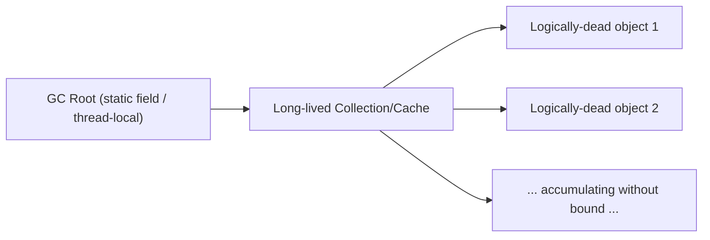

# 21. Memory Management

## Heap

### Young Generation

#### Eden

##### Theory

- **Core Concepts**: Eden is the region of the Young Generation where nearly all new objects are initially allocated (via bump-pointer/TLAB allocation). It is the "nursery" - most objects die here without ever being promoted, exploiting the generational hypothesis that most objects are short-lived.
- **Internal Working**: Threads allocate into their own Thread-Local Allocation Buffer (TLAB) carved out of Eden, avoiding synchronization on the common allocation pointer for the common case; when Eden fills, a Minor GC (copying collector) runs.
- **When to Use It**: Not a user-configurable "use" per se - it's an automatic JVM memory region, but its size can be tuned (`-Xmn`, `-XX:NewRatio`, `-XX:SurvivorRatio`) to influence Minor GC frequency and pause characteristics.
- **Advantages**: Extremely fast allocation (simple pointer bump within a TLAB, no free-list search), and because most objects die young, Minor GCs that only scan live objects in a small region are cheap relative to a full heap scan.
- **Limitations**: Too-small an Eden causes frequent Minor GCs (throughput overhead); too-large an Eden increases the pause duration of each Minor GC (more live data to copy, though still typically far less than Old Gen) and delays promotion signal timing.

##### Internal Working

- **Step-by-Step Explanation**: (1) `new Object()` allocates from the current thread's TLAB inside Eden via a simple pointer-bump (`top += size`). (2) If the TLAB is exhausted, the thread requests a new TLAB from Eden (still just a pointer bump at the Eden level) or, if Eden itself is full, triggers a Minor GC. (3) During Minor GC (typically a copying/Scavenge collector), all objects in Eden are scanned from GC roots; live objects are copied to a Survivor space (or directly promoted to Old Gen if surviving objects exceed the Survivor's capacity or the object is deemed too large); dead objects are simply left behind - Eden is then wiped/reset by moving the allocation pointer back to the start, no per-object free necessary. (4) This copy step also implicitly compacts memory, eliminating fragmentation in Eden/Survivor.
- **Memory Layout**: Eden is a contiguous sub-region of the Young Generation on the heap, typically the largest fraction (default 8x each Survivor's size, i.e. `SurvivorRatio=8`), subdivided further at runtime into per-thread TLABs.
- **Diagrams**:
```
Young Generation
+------------------------------+----------+----------+
|             Eden             |  S0      |   S1     |
| [TLAB1][TLAB2][TLAB3]...     | (empty)  | (empty)  |
+------------------------------+----------+----------+
      new objects allocated here via bump pointer
```
- **JVM Behaviour**: Minor GC pauses are "stop-the-world" for the application threads involved (though modern collectors like G1/ZGC/Shenandoah minimize this further); the JIT compiler is aware of TLAB allocation and inlines the fast-path bump-pointer allocation directly into compiled code, falling back to a slow-path VM call only when a new TLAB/GC is needed.

##### Interview Questions

**Basic**
1. Where are new objects allocated in the JVM heap by default?
2. What is a TLAB and why does it exist?

**Intermediate**
3. What triggers a Minor GC, and what happens to objects that survive it?
4. How does Eden's size affect GC pause frequency versus pause duration?

**Advanced**
5. Why is bump-pointer allocation in Eden so much faster than a general-purpose heap allocator's free-list search?

**Scenario-based**
6. Your application shows very frequent, short Minor GC pauses. What Eden-related tuning would you consider, and what trade-off does it introduce?

##### Detailed Answers

1. By default, nearly all new objects are allocated in Eden, the largest sub-region of the Young Generation, using fast bump-pointer allocation (with escape-analysis-based stack/scalar allocation as a further JIT optimization for objects proven not to escape a method).
2. A Thread-Local Allocation Buffer (TLAB) is a chunk of Eden reserved exclusively for one thread's allocations. Because each thread has its own TLAB, allocating an object within it requires no synchronization with other threads (just a local pointer bump), eliminating a major contention point that would otherwise exist if all threads shared one global Eden allocation pointer.
3. A Minor GC is triggered when Eden fills up (a new allocation, or new TLAB request, cannot be satisfied). The collector traces live objects reachable from GC roots within the Young Generation; objects that survive are copied into a Survivor space (their age counter incremented), and objects that have survived enough Minor GCs (reaching the tenuring threshold) or don't fit in Survivor are promoted directly to the Old Generation. Dead objects in Eden are not individually freed - Eden is simply reset since nothing points to them anymore.
4. A smaller Eden fills up faster, causing more frequent but typically shorter Minor GCs (less live data to trace/copy each time); a larger Eden fills up less often, causing fewer but potentially longer Minor GCs (more objects may be live at collection time, more copying work). Tuning is a throughput-vs-latency trade-off: larger Eden generally improves throughput (fewer GC events, more allocation between them) at the cost of occasionally longer individual pauses.
5. A general-purpose allocator must search a free list for a suitably sized free block, handle fragmentation, and often synchronize across threads - all relatively expensive per-allocation costs. Bump-pointer allocation in a TLAB, by contrast, is just "read current top pointer, add object size, return old top as the new object's address, update top" - a handful of CPU instructions with no search, no fragmentation handling (since Eden is wiped wholesale after each Minor GC rather than freed object-by-object), and no cross-thread synchronization since each thread owns its TLAB exclusively.
6. Consider increasing Eden's size, either directly via `-Xmn`/`-XX:NewSize` or indirectly via `-XX:NewRatio` (lowering the ratio to give more heap to the Young Generation), which reduces Minor GC frequency by letting more objects die before Eden fills. The trade-off is that each individual Minor GC pause may become somewhat longer (more surviving objects to trace and copy) and the overall heap dedicates more space to Young Gen, potentially leaving less headroom for Old Gen unless the total heap (`-Xmx`) is also increased - so this must be balanced against overall memory budget and acceptable pause-time SLAs.

##### Code Examples

```java
public class EdenAllocationDemo {
    // Demonstrates how short-lived objects rapidly fill Eden, triggering Minor GCs.
    // Run with: java -Xmn20m -Xlog:gc -verbose:gc EdenAllocationDemo
    public static void main(String[] args) {
        long allocated = 0;
        for (int i = 0; i < 5_000_000; i++) {
            // Each iteration allocates a short-lived object that dies almost immediately -
            // classic Eden churn: allocate in TLAB, become garbage before next Minor GC.
            byte[] shortLived = new byte[256];
            allocated += shortLived.length;
            if (i % 1_000_000 == 0) {
                System.out.println("Allocated so far: " + allocated + " bytes");
            }
        }
        System.out.println("Done, total bytes touched: " + allocated);
    }
}
```

#### Survivor

##### Theory

- **Core Concepts**: The Survivor space consists of two equally-sized sub-regions (commonly called S0/"From" and S1/"To") within the Young Generation, used as an intermediate holding area for objects that survived at least one Minor GC but have not yet been promoted to the Old Generation.
- **Internal Working**: At any point in time exactly one Survivor half is "active"/in-use (holding currently-surviving objects) and the other is empty, ready to receive the next Minor GC's copied survivors; the two halves swap roles ("from" becomes "to" and vice versa) after every Minor GC, a technique known as a semi-space copying collector.
- **When to Use It**: Automatically managed by the JVM; tunable via `-XX:SurvivorRatio` (Eden-to-each-Survivor ratio) and `-XX:MaxTenuringThreshold` (how many Minor GCs an object survives in Survivor before being promoted to Old Gen).
- **Advantages**: Gives short-to-medium-lived objects a chance to die before incurring the cost of promotion to (and eventual Old Gen collection from) the Old Generation; the copying design keeps Survivor space always compacted (no fragmentation).
- **Limitations**: If Survivor space is too small relative to the surviving-object volume, objects get prematurely promoted to Old Gen ("premature promotion"), increasing Old Gen occupancy and triggering more (expensive) Major/Full GCs; too large a Survivor wastes heap space that could otherwise be Eden or Old Gen.

##### Internal Working

- **Step-by-Step Explanation**: (1) Minor GC scans Eden plus the currently active ("From") Survivor half for live objects reachable from GC roots. (2) Live objects are copied into the other ("To") Survivor half, and each object's age counter is incremented. (3) Objects whose age reaches `MaxTenuringThreshold` (or whose cumulative size exceeds the `TargetSurvivorRatio` occupancy of the "To" survivor, causing dynamic age computation to lower the effective threshold) are instead copied directly to the Old Generation. (4) After the copy, Eden and the old "From" survivor are considered fully empty (their contents were either copied out or were garbage) and are reset for future allocation; the "To" survivor becomes the new "From" for the next cycle.
- **Memory Layout**: Two equally-sized contiguous sub-regions within the Young Generation (default ratio `Eden:S0:S1 = 8:1:1` via `SurvivorRatio=8`); only one half holds live data at any given moment, the other is always kept empty as the copy destination.
- **Diagrams**:
```mermaid
sequenceDiagram
    participant Eden
    participant From as Survivor (From)
    participant To as Survivor (To)
    participant Old as Old Generation
    Note over Eden,From: Before Minor GC
    Eden->>To: copy live objects (age++)
    From->>To: copy live objects (age++)
    Note over To,Old: objects at MaxTenuringThreshold promoted
    To-->>Old: promote aged objects
    Note over Eden,From: Eden & old From reset/emptied; To becomes new From
```
- **JVM Behaviour**: This copying approach means Minor GC pause time is roughly proportional to the *live* data volume in Eden+Survivor, not to Eden's total capacity - a key reason generational GC is efficient when the generational hypothesis holds (most objects die young, so live data at Minor GC time is small).

##### Interview Questions

**Basic**
1. Why are there two Survivor spaces instead of one?
2. What happens to an object's "age" each time it survives a Minor GC?

**Intermediate**
3. What is "premature promotion" and what causes it?
4. What does `-XX:MaxTenuringThreshold` control?

**Advanced**
5. Why does a semi-space (copying) design keep Survivor space free of fragmentation, unlike a mark-sweep-only approach?

**Scenario-based**
6. You observe rapidly increasing Old Generation occupancy alongside a workload that mostly creates medium-lived caches (living slightly longer than typical Minor GC cycles but not permanently). What Survivor-related tuning might reduce pressure on Old Gen?

##### Detailed Answers

1. Two equally-sized Survivor spaces let the JVM implement a semi-space copying collector: at every Minor GC, live objects are copied from Eden *and* the currently occupied Survivor half into the other, currently-empty Survivor half. This guarantees the destination is always contiguous and compacted, and it lets the source half be wholesale-reset afterward instead of requiring per-object freeing or in-place compaction.
2. Each time an object is found live during a Minor GC and copied to (or retained within) a Survivor space, its age counter (stored typically in the object header) is incremented by one. Once the age reaches the tenuring threshold (or dynamic age computation decides it should be promoted earlier due to Survivor occupancy pressure), the object is promoted to the Old Generation instead of being copied to Survivor again.
3. Premature promotion happens when Survivor space is too small to hold all objects that are still alive after a Minor GC, forcing the JVM to promote them directly to the Old Generation before they've truly proven to be long-lived. This inflates Old Gen occupancy with objects that would have died shortly after, triggering Old Gen/Major GCs more often than necessary and increasing overall GC overhead; it's typically caused by an undersized Survivor ratio relative to the allocation/survival rate of the workload.
4. `-XX:MaxTenuringThreshold` sets the maximum number of Minor GC cycles an object can survive while remaining in Survivor space before it is unconditionally promoted to the Old Generation (default is typically 15, though many collectors compute a dynamic, often lower, effective threshold at runtime based on Survivor occupancy via `TargetSurvivorRatio`).
5. A copying collector only ever touches *live* objects, moving them to a completely empty destination region and never leaving "holes" from dead objects since dead objects are simply not copied over - the source region is then discarded/reset in bulk. A mark-sweep-only collector, by contrast, must free individual dead objects in place, which can leave a scattered patchwork of free and occupied slots (fragmentation) unless a separate, more expensive compaction pass is also run.
6. Increasing the Survivor space size (lowering `-XX:SurvivorRatio`, e.g. from the default 8 to 4 or 6) gives these medium-lived cache objects more Minor GC cycles to either die or accumulate age before being promoted, reducing how often they get shunted into Old Gen prematurely; alternatively/additionally, raising `-XX:MaxTenuringThreshold` extends how many cycles an object can survive in Survivor before forced promotion, giving the workload's natural object lifetime more room to resolve within the Young Generation rather than polluting Old Gen and triggering more Major GCs.

##### Code Examples

```java
import java.util.*;

public class SurvivorTuningDemo {
    // Simulates medium-lived objects (short-term caches) that outlive one Minor GC
    // but should ideally die before being promoted to Old Gen.
    // Run with: java -Xmn40m -XX:SurvivorRatio=4 -XX:MaxTenuringThreshold=10 -Xlog:gc+age=trace SurvivorTuningDemo
    public static void main(String[] args) throws InterruptedException {
        Deque<byte[]> mediumLivedCache = new ArrayDeque<>();
        for (int cycle = 0; cycle < 50; cycle++) {
            // Add a batch of medium-lived entries
            for (int i = 0; i < 2000; i++) {
                mediumLivedCache.addLast(new byte[512]);
            }
            // Evict the oldest entries after a few cycles, simulating a bounded cache
            while (mediumLivedCache.size() > 4000) {
                mediumLivedCache.removeFirst();
            }
            if (cycle % 10 == 0) {
                System.out.println("Cycle " + cycle + ", cache size=" + mediumLivedCache.size());
            }
        }
    }
}
```

### Old Generation

#### Theory

- **Core Concepts**: The Old (Tenured) Generation holds objects that have survived enough Minor GC cycles in the Young Generation to be promoted, and generally holds longer-lived or large objects. It's collected far less frequently but the collections (Major/Full GCs) are typically far more expensive per cycle.
- **Internal Working**: Depending on the collector, Old Gen is managed either as a single contiguous mark-sweep(-compact) region (Serial, Parallel, CMS) or as a set of independently-collected regions (G1's "old regions", chosen based on garbage density) or handled with concurrent, mostly-non-moving/relocating algorithms (ZGC, Shenandoah).
- **When to Use It**: Not directly user-selected - objects arrive here via promotion; sizing (`-Xmx`, ratio to Young Gen) and choice of collector are the tunable levers.
- **Advantages**: Amortizes collection cost by only scanning Old Gen infrequently, since most short-lived garbage was already filtered out in Young Gen - exploiting the generational hypothesis for overall throughput.
- **Limitations**: Old Gen collections (especially Full GCs on older collectors like Serial/Parallel/CMS-with-fallback) can cause long stop-the-world pauses proportional to Old Gen's live-object volume; fragmentation can occur in non-compacting or partially-compacting collectors, potentially causing promotion failures even when nominal free space exists.

#### Internal Working

- **Step-by-Step Explanation**: (1) An object is promoted into Old Gen either after exceeding `MaxTenuringThreshold` in Survivor, or immediately if it's larger than a size threshold the Young Gen can't accommodate ("humongous"/large object direct allocation, e.g. G1's humongous object handling for objects >= half a region size), or if Survivor space overflow forces early promotion. (2) Old Gen fills up over time as the application runs. (3) When Old Gen occupancy crosses a threshold (or an allocation/promotion cannot be satisfied), a Major GC (often but not always accompanied by a full Young Gen collection too, hence commonly conflated with "Full GC") runs: it identifies live objects via mark phase, then reclaims/compacts space via sweep and/or compact phases (or, in G1, evacuates chosen high-garbage regions rather than the whole space). (4) Since Old Gen isn't reset/wiped wholesale like Young Gen (too much live data to copy cheaply), most mature collectors use mark-sweep-compact rather than pure copying for this generation.
- **Memory Layout**: A large contiguous (or, for G1/ZGC/Shenandoah, region-based) portion of the heap, typically several times larger than the combined Young Generation, holding long-lived application state: caches, session data, loaded configuration, connection pools, and any object that has proven itself long-lived by surviving Young Gen.
- **Diagrams**:
```
Heap
+---------------------- Old Generation ----------------------+------ Young Gen ------+
| live long-lived objects ... (mark-sweep-compact or region-  | Eden | S0 | S1        |
| based evacuation, collected infrequently but expensively)    |      |    |           |
+---------------------------------------------------------------+-----------------------+
```
- **JVM Behaviour**: Old Gen GCs (Major/Full GC) are the primary source of noticeable application pause times in traditional collectors; modern low-latency collectors (G1 mostly, ZGC and Shenandoah almost entirely) perform the bulk of Old Gen collection work concurrently with running application threads, dramatically shrinking (or, for ZGC/Shenandoah, nearly eliminating) stop-the-world pause duration regardless of Old Gen size.

#### Interview Questions

**Basic**
1. How does an object end up in the Old Generation?
2. Why are Old Gen collections generally more expensive than Young Gen collections?

**Intermediate**
3. What is the difference between a "Major GC" and a "Full GC"?
4. Why might a large object be allocated directly into Old Gen, bypassing Young Gen entirely?

**Advanced**
5. Why do many Old Gen collectors use mark-sweep-compact rather than the pure copying approach used for Young Gen?

**Scenario-based**
6. Your service experiences occasional multi-second GC pauses under the default Parallel/Serial-style collector as heap size has grown to 16 GB. What collector change would you evaluate, and why?

#### Detailed Answers

1. An object is promoted to Old Gen when it survives enough Minor GC cycles in the Young Generation to reach the tenuring threshold, or when Survivor space cannot accommodate all currently-live survivors (forcing earlier promotion), or immediately upon allocation if the object is large enough to be handled as a "humongous"/large-object allocation that Young Gen mechanisms aren't suited for.
2. Old Gen typically holds far more live data than Young Gen at any given time (since it accumulates longer-lived objects over the application's lifetime), so a full trace of Old Gen's live object graph, plus whatever sweep/compact work is needed, touches proportionally far more memory than a Minor GC's typical small live-set in Eden/Survivor - making each Old Gen collection inherently costlier in both scan time and (if compacting) move time.
3. Terminology varies by collector, but generally a "Major GC" refers to a collection of the Old Generation specifically, while a "Full GC" refers to a collection of the entire heap (Young + Old, and often Metaspace too) - in many traditional collectors (Serial, Parallel) a Major GC of Old Gen is typically accompanied by a full Young Gen collection as well, which is why the terms are frequently (if imprecisely) used interchangeably in casual discussion and tooling output.
4. Objects above a certain size threshold aren't well-suited to Young Gen's copying mechanism (copying a very large object on every surviving Minor GC would be wasteful and could even exceed Survivor space capacity outright), so many collectors (notably G1, which defines "humongous objects" as those >= 50% of a region size) allocate such objects directly into Old Gen (or dedicated humongous regions) from the start, skipping the Young Gen lifecycle entirely.
5. Young Gen's copying approach works well because most objects there are expected to die (making the "live set to copy" small relative to the region size), so wholesale-resetting the source region after copying survivors is cheap and gives compaction "for free." Old Gen, however, typically has a much higher live-object ratio (most objects there have already proven long-lived), so copying nearly all of Old Gen's contents on every collection would be prohibitively expensive; mark-sweep(-compact) instead only moves objects when compaction is explicitly needed to fight fragmentation, and can reclaim dead space via sweeping without touching (copying) every live object each time.
6. Evaluate migrating to G1 GC (if not already the default, which it has been since Java 9) or, for very large heaps and strict low-latency requirements, ZGC or Shenandoah. G1 divides the heap into many small regions and prioritizes collecting the regions with the most garbage first ("garbage-first"), giving much more predictable, configurable pause targets (`-XX:MaxGCPauseMillis`) than Serial/Parallel's monolithic Old Gen collection. For a 16 GB heap with multi-second pause complaints, ZGC or Shenandoah would be worth evaluating specifically because their pause times are largely decoupled from heap size (sub-millisecond to low-single-digit-millisecond pauses even at very large heap sizes), trading some throughput and additional CPU/memory overhead (for concurrent marking/relocation bookkeeping) for drastically reduced worst-case pause latency.

#### Code Examples

```java
import java.util.*;

public class OldGenerationPressureDemo {
    // Simulates long-lived state accumulating in Old Generation: a growing session cache
    // that is never evicted, eventually forcing Major/Full GC activity.
    // Run with: java -Xmx256m -Xmn32m -Xlog:gc*:file=gc.log OldGenerationPressureDemo
    public static void main(String[] args) {
        Map<String, byte[]> longLivedSessionCache = new HashMap<>();
        for (int i = 0; i < 200_000; i++) {
            // Each entry survives indefinitely (referenced by the map) -> promoted to Old Gen
            longLivedSessionCache.put("session-" + i, new byte[512]);
            if (i % 50_000 == 0) {
                System.out.println("Cache size: " + longLivedSessionCache.size());
            }
        }
        System.out.println("Final cache size: " + longLivedSessionCache.size());
    }
}
```

## Metaspace

### Theory

- **Core Concepts**: Metaspace (introduced in Java 8, replacing PermGen) is a native-memory region storing class metadata - method bytecode, constant pools, field/method descriptors, annotations, and other per-class structures created during class loading.
- **Internal Working**: Unlike the heap, Metaspace is allocated out of native (off-heap) memory managed directly by the JVM via its own arena/chunk allocator, growing dynamically as classes are loaded, and shrinking (returning memory to the OS) when classloaders (and all classes they defined) become unreachable and are unloaded.
- **When to Use It**: Not directly used by application code; relevant when tuning class-loading-heavy applications (large frameworks, many dynamically generated classes/proxies, application servers hosting many deployed apps) via `-XX:MetaspaceSize` and `-XX:MaxMetaspaceSize`.
- **Advantages**: Not capped by a fixed heap-relative size by default (unlike PermGen, which had a fixed max size prone to `OutOfMemoryError: PermGen space`), grows on demand up to available native memory (or an explicit cap if set), and is automatically reclaimed on classloader unloading without needing a full GC pass over heap-resident metadata.
- **Limitations**: Uncapped Metaspace can still exhaust native/system memory if an application leaks classloaders (e.g. repeatedly redeploying without ever letting old classloaders become unreachable), producing `OutOfMemoryError: Metaspace`; still requires GC involvement to detect and unload dead classloaders (they aren't reclaimed purely by native allocation bookkeeping).

### Internal Working

- **Step-by-Step Explanation**: (1) When a class is loaded, the JVM allocates space in Metaspace for its runtime constant pool, method bytecode, field/method metadata, and related structures. (2) This memory is carved from native memory in "chunks," managed per classloader (each classloader gets its own metaspace arena to simplify bulk reclamation). (3) When a classloader becomes unreachable (all classes it defined are no longer referenced and it's not reachable from GC roots), a GC cycle detects this and the entire classloader's Metaspace arena can be reclaimed in bulk. (4) If Metaspace usage exceeds current committed size, the JVM requests more native memory from the OS (up to `-XX:MaxMetaspaceSize` if set, else limited only by available system memory) and may trigger a GC first to try reclaiming unused classloader metadata before expanding.
- **Memory Layout**: Native (off-heap) memory, not part of the `-Xmx` heap sizing at all; organized as per-classloader chunks/arenas rather than one monolithic region, which is why aggressively creating and discarding classloaders (dynamic proxies, scripting engines, hot-redeploy application servers) is the classic Metaspace-leak scenario.
- **Diagrams**:
```
Process native memory (outside -Xmx heap)
+------------------- Metaspace -------------------+
| ClassLoader A arena: [ClassX meta][ClassY meta]  |
| ClassLoader B arena: [ClassZ meta]               |
+---------------------------------------------------+
   (reclaimed in bulk when a classloader becomes unreachable)
```
- **JVM Behaviour**: Class metadata is read extremely frequently during method invocation (vtable/itable lookups, bytecode fetch for interpretation/JIT compilation), so Metaspace access patterns matter for JIT warm-up performance; growth of Metaspace can also trigger a Full GC in some JVM configurations if it needs to check for reclaimable classloaders before expanding, which is a subtle source of unexpected GC pauses in class-loading-heavy applications.

### Interview Questions

**Basic**
1. What replaced PermGen in Java 8, and what does it store?
2. Is Metaspace part of the heap governed by `-Xmx`?

**Intermediate**
3. What can cause `OutOfMemoryError: Metaspace`, and how does it differ from a heap `OutOfMemoryError`?
4. How does the JVM reclaim Metaspace memory?

**Advanced**
5. Why was PermGen removed in favor of Metaspace - what specific pain points did it solve?

**Scenario-based**
6. An application server that hot-redeploys web applications frequently shows steadily increasing Metaspace usage across redeployments, eventually throwing `OutOfMemoryError: Metaspace`. What's the likely root cause and how would you diagnose it?

### Detailed Answers

1. Metaspace replaced PermGen (Permanent Generation) starting in Java 8 (JEP 122). It stores class metadata: method bytecode, constant pools, annotations, field/method descriptors, and other structures the JVM needs to describe and execute loaded classes - conceptually similar data to what PermGen stored, but relocated to native memory with different sizing/GC characteristics.
2. No - Metaspace lives in native memory, entirely separate from the Java heap that `-Xmx`/`-Xms` govern. Its size is controlled independently via `-XX:MetaspaceSize` (initial high-water mark that triggers a GC to attempt reclamation before expanding) and `-XX:MaxMetaspaceSize` (hard cap, unlimited by default).
3. `OutOfMemoryError: Metaspace` occurs when class metadata can't fit within `-XX:MaxMetaspaceSize` (if set) or, if unset, when available native/system memory is exhausted - typically caused by loading an ever-growing number of classes without ever unloading their classloaders (a "classloader leak"), common with dynamic proxies, scripting/reflection-heavy frameworks, or repeated hot-redeployment. This differs from a heap `OutOfMemoryError` (which reflects live *object* data exceeding heap capacity) in that it reflects excessive *class metadata* volume, usually pointing to a classloading/classloader-lifecycle problem rather than an object-retention problem.
4. Metaspace memory is organized per classloader; when a classloader (along with every class it defined) becomes unreachable from GC roots, a GC cycle detects this and the classloader's entire Metaspace arena can be reclaimed in bulk (rather than needing fine-grained per-class-metadata garbage collection), returning the underlying native memory chunks for reuse or back to the OS.
5. PermGen had a fixed maximum size (set via `-XX:MaxPermSize`) carved out similarly to heap generations, which frequently caused `OutOfMemoryError: PermGen space` in applications that loaded many classes (large frameworks, extensive use of reflection/dynamic proxies, application servers with hot redeployment) even when heap memory itself was ample. Additionally, PermGen's fixed sizing required guessing an appropriate value upfront, was awkward to resize, and mixed class metadata with some other data (like interned strings, in older JVMs) in a way that complicated GC tuning. Metaspace decouples class metadata from the heap, grows dynamically using native memory (removing the need to pre-guess a fixed size), and by default has effectively no cap (bounded only by system memory), directly eliminating the most common PermGen exhaustion complaints.
6. The likely root cause is a classloader leak: each hot redeployment should create a new classloader for the redeployed application and let the previous one (and all classes/class metadata it defined) become unreachable and eligible for reclamation, but something is retaining a reference to the old classloader (or one of its loaded classes/instances) across redeployments - common culprits include static fields in shared/parent classloaders holding references to instances from the child classloader, un-shutdown thread pools/threads whose `Thread` objects retain a `contextClassLoader` reference, JDBC driver registrations left in a shared `DriverManager`, or listeners/caches registered globally that hold onto old classloader-scoped objects. Diagnosis: take heap dumps before/after several redeploy cycles and use a tool (Eclipse MAT, VisualVM) to search for duplicate classloader instances and trace the GC-root reference chain keeping the old classloader (or its defined classes) reachable - the "leak suspects" report in MAT is specifically designed to surface this pattern.

### Code Examples

```java
import java.net.URLClassLoader;
import java.net.URL;

public class MetaspacePressureDemo {
    // Simulates repeated classloading pressure similar to hot-redeploy scenarios.
    // Run with: java -XX:MaxMetaspaceSize=64m -Xlog:class+unload MetaspacePressureDemo
    public static void main(String[] args) throws Exception {
        for (int i = 0; i < 20; i++) {
            // Each iteration creates a fresh, isolated classloader and loads a class through it;
            // once this loader (and its classes) become unreachable, its Metaspace arena is reclaimable.
            try (URLClassLoader loader = new URLClassLoader(new URL[0], MetaspacePressureDemo.class.getClassLoader())) {
                Class<?> loaded = Class.forName("java.util.ArrayList", true, loader);
                System.out.println("Iteration " + i + " loaded via: " + loaded.getClassLoader());
            }
            // Explicitly drop the reference and hint at collection so old loaders become eligible
            System.gc();
        }
    }
}
```

## Direct Memory

### Theory

- **Core Concepts**: Direct memory refers to native (off-heap) memory allocated via `java.nio.ByteBuffer.allocateDirect()` (or `MemorySegment`/Foreign Memory API in modern Java), used primarily for I/O operations where the OS/native code can operate on the buffer without an intermediate copy through the Java heap.
- **Internal Working**: A `DirectByteBuffer` object itself is a small heap object, but it holds a native pointer to a block of memory allocated outside the heap (via `malloc`-like native allocation); this native block is freed either through a `Cleaner`/`PhantomReference`-based mechanism when the `DirectByteBuffer` becomes unreachable, or explicitly (in newer APIs) via an `Arena`.
- **When to Use It**: High-throughput I/O (NIO channels, network servers, memory-mapped files) where avoiding a heap-to-native copy on every read/write meaningfully reduces CPU/GC overhead - e.g. Netty, database drivers, file I/O libraries.
- **Advantages**: Avoids the extra copy that would otherwise be needed to move data from a heap-resident byte array into native memory for a system call (and back), reduces GC pressure since the large data payload itself doesn't live in heap-managed regions subject to Minor/Major GC scanning, can be more efficient for memory-mapped file access.
- **Limitations**: Allocation/deallocation is more expensive than a simple heap allocation (native `malloc`/`free`-equivalent calls have higher fixed overhead), sized/tracked separately from the heap (`-XX:MaxDirectMemorySize`) so misconfiguration can cause native OOM even while heap looks healthy, harder to profile/observe than heap objects with standard heap profilers, and cleanup timing is tied to GC detecting the wrapper object's unreachability (not immediate, unless using the newer deterministic `Arena.close()`).

### Internal Working

- **Step-by-Step Explanation**: (1) `ByteBuffer.allocateDirect(size)` calls into native code to `malloc` (or platform equivalent) a block of `size` bytes outside the JVM heap. (2) A small `DirectByteBuffer` Java object is created on the heap, holding the native memory address and size, plus a `Cleaner` registration (a `PhantomReference`-based mechanism) that will free the native block once the `DirectByteBuffer` object itself becomes unreachable and is collected. (3) I/O operations (`FileChannel.read/write`, socket I/O) can pass the native address directly to OS system calls, avoiding an extra heap-to-native copy that would be required for a heap-backed (non-direct) buffer. (4) When the `DirectByteBuffer` becomes unreachable, GC eventually processes its `Cleaner`'s phantom reference, invoking native `free()` on the underlying block - meaning native memory release is deferred to GC's schedule, not immediate upon "no more Java references."
- **Memory Layout**: The actual data buffer lives entirely in native (off-heap) memory, invisible to `-Xmx` heap sizing and to heap-based GC scanning; only the small `DirectByteBuffer` wrapper object (holding the address, capacity, and cleanup registration) resides on the heap.
- **Diagrams**:
```
Java Heap                              Native (off-heap) memory
+----------------------+               +--------------------------+
| DirectByteBuffer obj |  address ---> | raw byte buffer (size N)  |
| (small wrapper)      |               | allocated via malloc()   |
+----------------------+               +--------------------------+
   collected by GC -> Cleaner runs -> native free() invoked
```
- **JVM Behaviour**: Direct memory is bounded independently by `-XX:MaxDirectMemorySize`; exceeding it throws `OutOfMemoryError: Direct buffer memory` even if the heap has ample free space, since direct memory allocation failures are tracked and enforced separately from heap allocation failures.

### Interview Questions

**Basic**
1. How do you allocate a direct (off-heap) `ByteBuffer`?
2. Why would I/O code prefer a direct buffer over a heap buffer?

**Intermediate**
3. How and when is direct memory actually freed?
4. What JVM flag controls the maximum amount of direct memory allowed, and what happens if it's exceeded?

**Advanced**
5. Why can `DirectByteBuffer` cleanup lag behind when you'd expect, and what problems can this cause in practice?

**Scenario-based**
6. A service using Netty (heavy direct-buffer user) reports native memory usage steadily climbing (visible via OS-level tools) even though heap usage and heap GC logs look completely normal. What would you investigate?

### Detailed Answers

1. Via `ByteBuffer buf = ByteBuffer.allocateDirect(sizeInBytes);` (or, using the modern Foreign Function & Memory API, `Arena arena = Arena.ofConfined(); MemorySegment segment = arena.allocate(sizeInBytes);`), both of which allocate the backing storage in native memory outside the JVM heap rather than as a `byte[]` on the heap.
2. Because system calls for I/O (reading from a socket/file into a buffer, or writing a buffer out) operate at the OS level on native memory addresses; a heap-backed (non-direct) `ByteBuffer` must first be copied into a temporary native buffer before the OS call and copied back afterward (the JVM does this transparently), whereas a direct buffer's native address can be passed straight through, eliminating that extra copy - meaningful for high-throughput I/O workloads.
3. The underlying native memory block is registered with a `Cleaner` (a `PhantomReference`-based cleanup mechanism) at allocation time. Once the `DirectByteBuffer` Java wrapper object becomes unreachable and is collected by the garbage collector, the JVM processes the corresponding cleaner action, which invokes native `free()` on the block. This means the native memory isn't released the instant your code drops its last reference - it's released whenever GC next determines the wrapper is unreachable and runs its cleaner, which can be delayed if GC isn't triggered for a while (e.g. low heap allocation rate).
4. `-XX:MaxDirectMemorySize` sets the cap on total direct memory that can be allocated via `ByteBuffer.allocateDirect()` (default, if unset, is typically tied to `-Xmx`). Exceeding it throws `OutOfMemoryError: Direct buffer memory` at the point of attempted allocation, independent of how much heap memory is actually free, since direct memory accounting is tracked and enforced separately from the heap.
5. Because native memory release is tied to the `DirectByteBuffer` wrapper object's *heap* reachability and the GC's own scheduling (it only runs when GC decides to collect, typically driven by heap allocation pressure, not direct memory pressure), an application that allocates large direct buffers but has low heap churn may not trigger GC often enough to promptly reclaim direct memory, leading to native memory usage climbing well beyond what "logical" outstanding buffers would suggest - sometimes to the point of native OOM - even though the heap itself looks perfectly healthy. This is why direct-buffer-heavy libraries (e.g. Netty) often implement explicit reference counting and manual release (`ReferenceCounted.release()`) rather than relying purely on GC-driven cleanup.
6. Investigate whether direct buffers are being explicitly released (Netty's `ByteBuf.release()` reference-counting contract) versus being leaked - a missed `release()` call (e.g. an exception path that skips cleanup, or a buffer handed off between threads without proper ownership transfer) keeps the underlying native memory alive indefinitely regardless of GC activity, since Netty's pooled/direct buffers rely on explicit reference counting rather than solely on GC-triggered `Cleaner`-based reclamation. Enable Netty's resource leak detection (`-Dio.netty.leakDetection.level=paranoid` temporarily) to get stack traces of buffers that were never released, and cross-check `-XX:MaxDirectMemorySize` / `Runtime` direct-memory metrics against actual OS-reported process memory to confirm the direct-memory pool (not some other native allocation) is the source.

### Code Examples

```java
import java.io.RandomAccessFile;
import java.nio.ByteBuffer;
import java.nio.channels.FileChannel;

public class DirectBufferIODemo {
    // Demonstrates direct buffer usage for efficient file I/O, avoiding heap<->native copies.
    public static void main(String[] args) throws Exception {
        String path = "direct-buffer-demo.tmp";
        try (RandomAccessFile file = new RandomAccessFile(path, "rw");
             FileChannel channel = file.getChannel()) {

            ByteBuffer directBuffer = ByteBuffer.allocateDirect(1024);
            directBuffer.put("Direct memory demo payload".getBytes());
            directBuffer.flip();

            channel.write(directBuffer); // OS writes directly from native memory, no extra copy

            directBuffer.clear();
            channel.position(0);
            channel.read(directBuffer);
            directBuffer.flip();

            byte[] readBytes = new byte[directBuffer.remaining()];
            directBuffer.get(readBytes);
            System.out.println("Read back: " + new String(readBytes));
        } finally {
            new java.io.File(path).delete();
        }
    }
}
```

## Native Memory

### Theory

- **Core Concepts**: Native memory encompasses all memory the JVM process uses outside the Java heap - Metaspace, thread stacks, JIT-compiled code cache, GC internal bookkeeping structures, direct buffers, JNI/native library allocations, and the JVM's own internal data structures. It's memory managed by the OS/C-runtime allocator, not the Java garbage collector.
- **Internal Working**: The JVM tracks much of its own native memory usage internally via Native Memory Tracking (NMT, enabled with `-XX:NativeMemoryTracking=summary|detail`), categorizing usage into buckets like Thread, Code Cache, GC, Compiler, Symbol, Class, and Internal.
- **When to Use It**: Relevant whenever total process memory (as seen by the OS, e.g. via `top`/container memory limits) needs to be understood or bounded - especially critical in containerized deployments where a container's memory limit encompasses heap *plus* all native memory, and exceeding it triggers an OOM-kill by the container runtime, not a graceful Java `OutOfMemoryError`.
- **Advantages**: Enables features that must live outside GC-managed heap: thread stacks (must be contiguous, fixed-purpose per-thread memory), JIT-compiled native code (Code Cache), JNI interop with native libraries, and low-copy I/O via direct buffers.
- **Limitations**: Not covered by `-Xmx`, so a correctly-sized heap doesn't guarantee the process fits within a container's memory limit; harder to observe/tune than heap (requires NMT, OS tools, or native profilers rather than standard heap profilers); native leaks (e.g. in JNI code, or a JVM bug) can be much harder to diagnose than Java heap leaks since standard heap-dump tooling doesn't cover them.

### Internal Working

- **Step-by-Step Explanation**: (1) At JVM startup and throughout execution, the JVM allocates native memory for numerous subsystems: each Java thread gets a native OS thread stack (`-Xss` sized), the JIT compiler's output goes into the Code Cache (`-XX:ReservedCodeCacheSize`), GC maintains its own bookkeeping (card tables, remembered sets, mark bitmaps) outside the heap, and class metadata goes to Metaspace. (2) If NMT is enabled, the JVM instruments its internal allocators to record category, call-site, and size information for every native allocation/deallocation. (3) Total process RSS (Resident Set Size) as reported by the OS equals heap + Metaspace + Code Cache + thread stacks + GC native structures + direct buffers + any JNI-allocated native memory + JVM/glibc allocator overhead. (4) In containers, cgroup memory limits apply to this entire RSS total, not just the Java heap, so a container can be OOM-killed by the kernel even while the JVM reports plenty of free heap.
- **Memory Layout**: Entirely outside the `-Xmx`-governed heap; scattered across OS-level allocations for thread stacks (one per thread, contiguous), the Code Cache (one or a few large regions), Metaspace (per-classloader arenas), and various smaller allocator-managed native blocks for GC/compiler/JNI purposes.
- **Diagrams**:
```
OS Process Memory (RSS)
+------------------------------------------------------+
| Java Heap (-Xmx bounded)                              |
+------------------------------------------------------+
| Metaspace | Code Cache | Thread Stacks | GC internals |
| Direct Buffers | JNI native allocations | Misc         |
+------------------------------------------------------+
   (container memory limit applies to the WHOLE box above)
```
- **JVM Behaviour**: Because native memory isn't subject to the same GC-driven reclamation as heap objects, native memory growth (from thread creation, JIT compilation activity, or JNI code) is comparatively "invisible" to standard heap-focused monitoring - which is precisely why NMT and OS-level memory tools are essential complements to heap profiling in production diagnostics, especially for container "OOM-killed" incidents.

### Interview Questions

**Basic**
1. Name three categories of native (off-heap) memory the JVM uses besides direct buffers.
2. Why doesn't a correctly-sized `-Xmx` guarantee a container won't hit its memory limit?

**Intermediate**
3. What is Native Memory Tracking (NMT) and how do you enable it?
4. How does thread creation contribute to native memory usage, and what JVM flag influences it?

**Advanced**
5. Why can a JVM process be OOM-killed by a container orchestrator even while `jstat`/heap dumps show the Java heap is healthy?

**Scenario-based**
6. A containerized service with `-Xmx2g` is running in a pod with a 2.5 GB memory limit, and gets OOM-killed periodically under load with many concurrent requests spinning up threads. What's the likely native-memory contributor, and how would you fix it?

### Detailed Answers

1. Thread stacks (native OS stack memory per Java thread, sized via `-Xss`), the JIT Code Cache (compiled native machine code for hot methods, sized via `-XX:ReservedCodeCacheSize`), and Metaspace (class metadata) are three major non-direct-buffer native memory consumers; GC-internal bookkeeping structures (card tables, remembered sets) are a fourth common category.
2. Because `-Xmx` only bounds the Java heap; total process memory as enforced by a container's cgroup limit includes the heap *plus* Metaspace, thread stacks, Code Cache, GC internal structures, direct buffers, and any JNI-allocated native memory - so even a heap that never exceeds its cap can coexist with a process that exceeds the container's overall memory limit due to these other native consumers, resulting in an OS/kernel-level OOM-kill rather than a JVM-level `OutOfMemoryError`.
3. Native Memory Tracking is a built-in JVM diagnostic facility that instruments the JVM's internal native allocators to record memory usage by category (Thread, Code Cache, GC, Compiler, Symbol, Class, Internal, and more). It's enabled by adding `-XX:NativeMemoryTracking=summary` (coarse category totals) or `=detail` (finer-grained, including call sites) at JVM startup, and results are then queried via `jcmd <pid> VM.native_memory summary` (or `detail`) while the process is running.
4. Every Java `Thread` corresponds to a native OS thread, which requires the OS to allocate a native stack for it - by default typically 512 KB to 1 MB depending on platform/JVM defaults, configurable via `-Xss<size>`. Creating a very large number of threads (e.g. an unbounded thread-per-request model under high concurrency) can therefore consume substantial native memory purely for stacks, independent of heap usage, which is one reason bounded thread pools (or virtual threads, which use much smaller, dynamically-sized stack footprints) are preferred at scale.
5. Because the container orchestrator's memory limit (enforced via the cgroup) applies to the process's total RSS - heap plus every category of native memory - not just to whatever the JVM itself considers "the heap." A JVM can report ample free heap via `jstat`/heap dumps precisely because heap usage genuinely is fine, while some other native consumer (thread stacks from an unbounded thread pool, Code Cache filling up from excessive JIT compilation, a native library leaking memory via JNI, or even just Metaspace growth from dynamic class generation) pushes total RSS past the container's limit, triggering a kernel OOM-kill that bypasses the JVM's own OutOfMemoryError handling entirely (the process is killed externally, often with no Java-level stack trace or log message at all).
6. The likely contributor is native memory consumed by thread stacks: many concurrent requests spinning up threads (especially if using an unbounded or very large thread pool, or a thread-per-request model) each require a native OS stack (default ~1 MB), so thousands of concurrent threads alone could consume several hundred MB to multiple GB of native memory, on top of the 2 GB heap, easily exceeding the 2.5 GB container limit. Fixes: bound the thread pool size explicitly (rather than unbounded thread creation), reduce `-Xss` if stacks are deeper than necessary, or - the more modern solution - migrate the concurrency model to virtual threads (Project Loom, stable since Java 21), whose stacks are far smaller and grow/shrink dynamically on the heap rather than requiring a fixed-size native OS stack per thread, dramatically reducing native memory pressure under high concurrency.

### Code Examples

```java
public class ThreadStackMemoryDemo {
    // Demonstrates how naive unbounded thread creation consumes native memory (stacks)
    // independent of heap usage. Run with: java -Xmx256m -Xss1m ThreadStackMemoryDemo
    public static void main(String[] args) throws InterruptedException {
        int threadCount = 2000;
        Thread[] threads = new Thread[threadCount];
        for (int i = 0; i < threadCount; i++) {
            // Each platform thread reserves a native stack (~1MB here), consumed regardless
            // of how little heap memory the thread's own work actually uses.
            threads[i] = new Thread(() -> {
                try {
                    Thread.sleep(2000);
                } catch (InterruptedException ignored) {
                }
            });
            threads[i].start();
        }
        for (Thread t : threads) {
            t.join();
        }
        System.out.println("All " + threadCount + " threads completed - observe native RSS via OS tools during the run.");
    }
}
```

## Memory Leaks

### Theory

- **Core Concepts**: A Java "memory leak" is not memory becoming unrecoverable in the C/C++ sense (the GC always reclaims truly unreachable objects) - it's unintended object retention: objects remain reachable from GC roots (via a reference chain the developer didn't intend to keep alive) long after they're logically no longer needed, causing heap usage to grow unboundedly over time.
- **Internal Working**: Because reachability, not "logical need," determines whether GC collects an object, any long-lived reference holder (static fields, caches without eviction, listener/callback registries, ThreadLocals on pooled threads, unclosed resources) that keeps accumulating references to otherwise-dead objects will prevent their collection indefinitely.
- **When to Use It**: N/A (this is a failure mode to detect and prevent, not a feature to use) - but understanding common leak patterns is essential for designing long-lived caches, listener systems, and thread-pool-based code correctly.
- **Advantages**: N/A.
- **Limitations/Symptoms**: Gradually increasing Old Generation occupancy across GC cycles that never returns to baseline, increasingly frequent/longer Major GCs, eventually `OutOfMemoryError: Java heap space`; often only manifests after extended uptime, making it easy to miss in short-lived testing.

### Internal Working

- **Step-by-Step Explanation (typical leak lifecycle)**: (1) An object is created and, at some point, logically becomes unnecessary to the application. (2) However, a reference to it remains reachable through some long-lived holder - e.g. a `static` collection that's only ever added to and never pruned, a registered listener never unregistered, a `ThreadLocal` value never removed from a thread that's returned to a pool and reused indefinitely, or a resource (stream/connection) never closed whose internal buffers stay referenced. (3) Each Minor GC cycle finds the object still reachable (via that holder) and promotes it to Old Gen (or it was already there). (4) Over time, more and more such objects accumulate in Old Gen, since nothing ever removes the reference keeping them alive, until Major GCs become frequent/expensive and eventually the JVM cannot reclaim enough space to satisfy an allocation, throwing `OutOfMemoryError`.
- **Memory Layout**: Leaked objects typically accumulate in the Old Generation (since they survive long enough to be promoted, precisely because nothing ever un-references them); heap dumps analyzed post-mortem typically show a dominant retained-size path pointing to the true "leak suspect" holder (a specific static field, cache, or collection).
- **Diagrams**:

- **JVM Behaviour**: The GC does exactly what it's supposed to do throughout - correctly keeps every reachable object alive; a "leak" is purely an application-level bug in reference management, not a GC malfunction, which is why leak diagnosis focuses on heap dump/reference-chain analysis (finding *why* something is reachable) rather than GC log analysis (which just shows the growing symptom).

### Interview Questions

**Basic**
1. What does "memory leak" mean in a garbage-collected language like Java, given the GC reclaims all unreachable objects?
2. Name two common causes of Java memory leaks.

**Intermediate**
3. How can `ThreadLocal` cause a memory leak, particularly with thread pools?
4. What symptoms in GC logs or monitoring would suggest a memory leak versus normal memory pressure?

**Advanced**
5. How would you use a heap dump to pinpoint the root cause of a suspected leak?

**Scenario-based**
6. A long-running service's Old Gen occupancy climbs steadily over days and eventually triggers `OutOfMemoryError`, while load remains constant. Walk through your diagnostic approach.

### Detailed Answers

1. It means objects remain *reachable* (and therefore ineligible for collection) via some reference chain from a GC root, even though the application logically no longer needs them - the GC is behaving correctly by keeping every reachable object alive; the bug is that the application inadvertently kept a reference around (in a static collection, cache, listener registry, etc.) longer than intended, not that the GC failed to do its job.
2. (a) Unbounded caches or collections (e.g. a `static Map` used as a cache with no eviction policy, or entries never removed as their corresponding "real" data is deleted) that grow forever; (b) listener/callback registries where objects register themselves (e.g. `addListener(this)`) but never call the corresponding `removeListener(this)` when they're done, keeping them reachable from the registry indefinitely. Other common causes: `ThreadLocal` values not removed on pooled threads, unclosed resources (streams, connections) whose internal buffers stay referenced, and inner classes (implicit outer references) outliving their intended scope.
3. A `ThreadLocal` associates a value with a specific `Thread` object via an internal `ThreadLocalMap` owned by that thread. In a thread pool, threads are long-lived and reused across many tasks; if a task sets a `ThreadLocal` value and never calls `remove()` when done, that value remains attached to the pooled thread indefinitely (since the thread itself never dies and gets reused for future, unrelated tasks) - each subsequent task on that thread keeps the old value reachable via the thread's `ThreadLocalMap`, and if many different values/large objects get set this way across many pooled threads, this constitutes a slow, steady leak that's easy to overlook since no code explicitly "keeps" the object - the leak is via the pooled thread's internal state.
4. A genuine leak shows Old Generation occupancy that keeps trending upward across many consecutive GC cycles and never returns to a stable baseline even after Major/Full GCs (a healthy application's Old Gen occupancy should stabilize at some plateau after GC, reflecting genuinely long-lived state); a leak instead shows the post-GC "floor" itself rising release over release, cycle over cycle, eventually leading to GC pauses becoming more frequent and longer as the collector works harder to find shrinking headroom, culminating in `OutOfMemoryError: Java heap space` once no further reclamation is possible.
5. Capture a heap dump (via `jmap -dump` or automatically on OOM via `-XX:+HeapDumpOnOutOfMemoryError`) and load it into a heap analysis tool like Eclipse MAT or VisualVM. Use the tool's "dominator tree" / "leak suspects" report to identify which objects/collections have the largest *retained size* (i.e., how much memory would be freed if that object became unreachable) - this typically surfaces the actual leaking collection or cache directly. Then use "path to GC roots" analysis on a sample of the accumulating objects to see exactly which reference chain (static field, thread-local, listener list) is keeping them alive, which points directly at the code needing a fix (add eviction, call `remove()`/`unregister()`, etc.).
6. First, confirm it's a genuine leak rather than expected growth (compare Old Gen occupancy trend across days via GC logs/monitoring - a real leak shows a steadily rising post-GC floor, not just high but stable usage). Next, capture two or more heap dumps spaced hours/days apart under the same load conditions and use a tool like Eclipse MAT's comparison feature (or simply compare "leak suspects"/dominator trees) to identify which object types/collections are growing in count and retained size between the two snapshots. Once the growing collection is identified, use "path to GC roots" to trace exactly what's holding a reference to it (a static cache field, an un-cleared `ThreadLocal`, an ever-growing listener list), then fix the specific reference-management bug (add size-bounded eviction/LRU policy, ensure `remove()`/`close()`/`unregister()` calls happen on the relevant lifecycle event) and verify occupancy stabilizes in subsequent monitoring.

### Code Examples

```java
import java.util.*;

public class MemoryLeakPatternsDemo {
    // ANTI-PATTERN: unbounded static cache with no eviction -> classic memory leak
    private static final Map<String, byte[]> UNBOUNDED_CACHE = new HashMap<>();

    static void leakyCacheInsert(String key, byte[] data) {
        UNBOUNDED_CACHE.put(key, data); // never removed -> grows forever
    }

    // FIX: bounded LRU cache using LinkedHashMap's removeEldestEntry hook
    static final int MAX_ENTRIES = 1000;
    private static final Map<String, byte[]> BOUNDED_CACHE =
        new LinkedHashMap<>(16, 0.75f, true) {
            @Override
            protected boolean removeEldestEntry(Map.Entry<String, byte[]> eldest) {
                return size() > MAX_ENTRIES; // evicts least-recently-used entry automatically
            }
        };

    static void safeCacheInsert(String key, byte[] data) {
        BOUNDED_CACHE.put(key, data);
    }

    // ANTI-PATTERN vs FIX: ThreadLocal leak on pooled threads
    private static final ThreadLocal<byte[]> REQUEST_CONTEXT = new ThreadLocal<>();

    static void handleRequestOnPooledThread(byte[] contextData) {
        REQUEST_CONTEXT.set(contextData);
        try {
            // ... process request using REQUEST_CONTEXT.get() ...
        } finally {
            REQUEST_CONTEXT.remove(); // ESSENTIAL on pooled threads to avoid leaking across tasks
        }
    }

    public static void main(String[] args) {
        for (int i = 0; i < 5000; i++) {
            safeCacheInsert("key-" + i, new byte[128]);
        }
        System.out.println("Bounded cache size (capped): " + BOUNDED_CACHE.size());
    }
}
```

## Memory Profiling Tools *(new)*

### Theory

- **Core Concepts**: A family of tools for observing JVM memory behaviour in real time or post-mortem: JVisualVM (GUI heap/CPU/thread monitor bundled historically with the JDK, now a separate download), async-profiler (low-overhead sampling profiler supporting CPU, allocation, and lock profiling via perf_events/JFR), and JFR/Java Flight Recorder (built-in, low-overhead, always-available event recording framework), often paired with Eclipse MAT for heap dump analysis.
- **Internal Working**: These tools work at different levels - JFR/async-profiler use low-overhead sampling and JVM-internal event hooks (often via `JVMTI` or JFR's native event system) to record data continuously with minimal application impact; JVisualVM and Eclipse MAT instead operate on point-in-time snapshots (heap dumps) or via JMX polling, which is heavier-weight but gives a complete object graph.
- **When to Use It**: JFR for always-on, low-overhead production monitoring and later analysis (works well combined with JDK Mission Control for visualization); async-profiler for targeted, short-duration deep-dive profiling (CPU hotspots, allocation hotspots, lock contention) with minimal overhead in both dev and production; JVisualVM for quick, ad-hoc local/dev inspection; Eclipse MAT specifically for analyzing a captured heap dump to find leak suspects and dominator trees.
- **Advantages**: JFR's overhead is low enough (~1% or less) to leave enabled permanently in production, providing a rolling recording buffer to inspect after an incident even without having proactively started profiling beforehand; async-profiler avoids the JVM safepoint bias that plagued older profilers (which could only sample at safepoints, skewing results); Eclipse MAT's automated leak-suspect and dominator-tree reports dramatically speed up root-causing a memory leak from a raw heap dump.
- **Limitations**: Heap dumps (used by JVisualVM/MAT) are expensive to capture (can pause the JVM briefly and are large on disk) and only represent a single instant, not a "growth over time" view/full request-scoped tracing; JFR data requires JDK Mission Control (or manual/CLI analysis via `jfr print`) for full interpretability; async-profiler requires OS-level permissions (perf_events access) on some platforms/containers and isn't bundled with the JDK by default (separate install).

### Internal Working

- **Step-by-Step Explanation**: (1) JFR is enabled either at JVM startup (`-XX:StartFlightRecording=...`) or dynamically at runtime via `jcmd <pid> JFR.start`; it continuously records low-level JVM events (allocations above a threshold, GC pauses, lock contention, thread starts, exceptions, and more) into an efficient binary buffer with minimal instrumentation overhead, periodically flushing to disk if configured, or kept purely in-memory as a rolling buffer for on-demand dumping. (2) async-profiler attaches to a running JVM (via `-agentpath` or dynamically) and uses `perf_events` (Linux) or equivalent OS facilities, combined with JVMTI's `AsyncGetCallTrace`, to sample stack traces at high frequency with very low overhead, avoiding safepoint bias. (3) JVisualVM connects to a running JVM via JMX/Attach API to show live heap/thread/CPU graphs and can trigger an on-demand heap dump. (4) Eclipse MAT loads a heap dump file (`.hprof`), builds an in-memory index of the entire object graph, computes dominator trees (which object, if removed, would free the most retained memory) and runs heuristic "leak suspect" reports.
- **Memory Layout**: Not directly applicable to the tools themselves; they observe/report on the heap/Metaspace/native memory layout described in the other sections of this document rather than introducing new memory regions.
- **Diagrams**:
```
Production JVM  --JFR events (always-on, low overhead)--> .jfr recording file
                --async-profiler (on-demand attach)------> flamegraph / collapsed stacks
                --heap dump (jmap / -XX:+HeapDumpOnOutOfMemoryError)--> .hprof file
                                                                          |
                                                                          v
                                                              Eclipse MAT / JVisualVM analysis
```
- **JVM Behaviour**: JFR is integrated directly into the JVM (originally a commercial feature, open-sourced and available in all OpenJDK builds since JDK 11) and shares infrastructure with GC/JIT/thread subsystems to record events with minimal instrumentation cost; async-profiler's low overhead comes specifically from avoiding safepoint-biased sampling (a known flaw in older `hprof`/JVM-TI-only profilers that could only sample when the JVM happened to be at a safepoint, systematically over- or under-representing certain code paths).

### Interview Questions

**Basic**
1. What is JFR (Java Flight Recorder) and why is its overhead low enough for production use?
2. What is a heap dump and which tools are commonly used to analyze one?

**Intermediate**
3. What problem does async-profiler solve that traditional safepoint-based sampling profilers had?
4. How would you capture a heap dump automatically when an `OutOfMemoryError` occurs?

**Advanced**
5. How does Eclipse MAT's "dominator tree" help identify the root cause of a memory leak?

**Scenario-based**
6. Production is experiencing intermittent CPU spikes correlated with unclear causes, and you cannot easily reproduce it in a test environment. Which tool would you reach for first, and how would you use it with minimal risk to the running service?

### Detailed Answers

1. JFR (Java Flight Recorder) is a built-in JVM framework for recording detailed runtime events - object allocations (sampled, above configurable thresholds), GC pauses, thread lifecycle events, lock contention, exceptions, and more - into a compact binary format. Its overhead is low (typically well under 1-2%) because it's implemented deep inside the JVM using efficient, purpose-built event-recording infrastructure (shared with existing GC/JIT/thread bookkeeping) rather than bolted-on instrumentation, low enough that Oracle/OpenJDK explicitly recommend leaving it continuously enabled in production for "always have data available after an incident" diagnostics.
2. A heap dump is a complete snapshot of every object on the Java heap at a point in time (typically an `.hprof` file), including their field values, class information, and reference relationships to every other object - essentially a serialized graph of the entire heap. Eclipse MAT (Memory Analyzer Tool) and JVisualVM are the two most commonly used tools for analyzing one, with MAT generally preferred for deep leak analysis due to its dominator-tree and automated leak-suspect reports, and JVisualVM favored for quick, lighter-weight ad hoc inspection.
3. Older profilers relying purely on JVMTI's synchronous stack-sampling APIs could only capture a stack trace when the JVM happened to be at a safepoint (a state where all threads are paused for GC/other coordinated operations), which systematically biases sampled results toward code that naturally reaches safepoints frequently and under-represents tight loops or code that avoids safepoint checks - a well-documented flaw ("safepoint bias") in tools like the original `hprof`. async-profiler instead uses OS-level `perf_events` (on Linux) combined with JVMTI's `AsyncGetCallTrace`, allowing it to sample stack traces asynchronously at arbitrary points, not just at safepoints, producing far more statistically accurate CPU/allocation profiles.
4. Add the JVM flag `-XX:+HeapDumpOnOutOfMemoryError` (optionally paired with `-XX:HeapDumpPath=/path/to/dumps`) at startup; when the JVM throws an `OutOfMemoryError` (heap space, Metaspace, etc.), it automatically writes a full heap dump to disk before/at the point of the error, capturing the exact memory state that led to the failure without requiring you to have manually triggered a dump in advance (which is impossible to do reactively once the process has already crashed or been restarted).
5. The dominator tree models the object graph such that object A "dominates" object B if every path from any GC root to B necessarily passes through A - meaning if A were removed/became unreachable, B (and everything else A dominates) would also become collectible. MAT's dominator tree report ranks objects by *retained size* (total memory that would be freed if that object were removed), which directly surfaces the single object/collection responsible for holding the largest chunk of memory alive - typically the actual leaking cache, list, or map - rather than requiring you to manually trace potentially thousands of individual reference chains to find the common root cause.
6. async-profiler is the best first choice for this scenario: it can be attached to the already-running production JVM (dynamically, via its agent, with no restart required) with very low overhead and run for a short, bounded duration (e.g. 30-60 seconds during a spike) to capture a CPU flamegraph showing exactly which methods/call stacks are consuming CPU during that window, then detached - minimizing risk since it doesn't require restarting the service, changing startup flags, or leaving heavyweight instrumentation running continuously. If JFR is already enabled (as recommended for production), its always-on recording can also be dumped and inspected retroactively for the exact time window of a past spike without needing to catch it live at all, which is an even lower-risk complementary approach.

### Code Examples

```java
public class ProfilingTargetDemo {
    // A workload with an intentional CPU hotspot and allocation churn, useful for
    // demonstrating profiling tools. Run alongside:
    //   java -XX:StartFlightRecording=duration=60s,filename=demo.jfr ProfilingTargetDemo
    //   or attach async-profiler: ./profiler.sh -d 30 -f flamegraph.html <pid>
    public static void main(String[] args) throws InterruptedException {
        long total = 0;
        for (int round = 0; round < 20; round++) {
            total += cpuIntensiveHotspot(2_000_000);
            allocateChurn(50_000);
            Thread.sleep(200);
        }
        System.out.println("Total: " + total);
    }

    // Deliberately inefficient hotspot (nested loop, no early exit) for CPU profiling demos
    static long cpuIntensiveHotspot(int n) {
        long sum = 0;
        for (int i = 0; i < n; i++) {
            for (int j = 0; j < 10; j++) {
                sum += (long) Math.sqrt(i * j + 1);
            }
        }
        return sum;
    }

    // Allocation churn to observe in an allocation-profiling / JFR allocation view
    static void allocateChurn(int count) {
        java.util.List<byte[]> temp = new java.util.ArrayList<>();
        for (int i = 0; i < count; i++) {
            temp.add(new byte[64]); // short-lived, dies right after this method returns
        }
    }
}
```

## Additional Resources

### Articles

- [Memory Leaks in Java (Real-Time Use Case & Fixes)](https://medium.com/@gaddamnaveen192/memory-leaks-in-java-real-time-use-case-fixes-29f92faa99e0)
