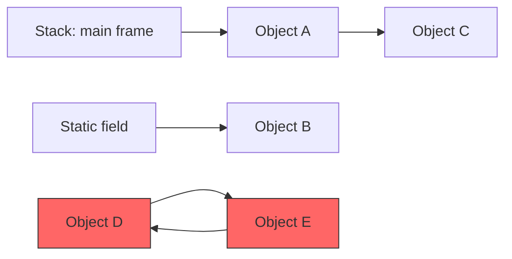
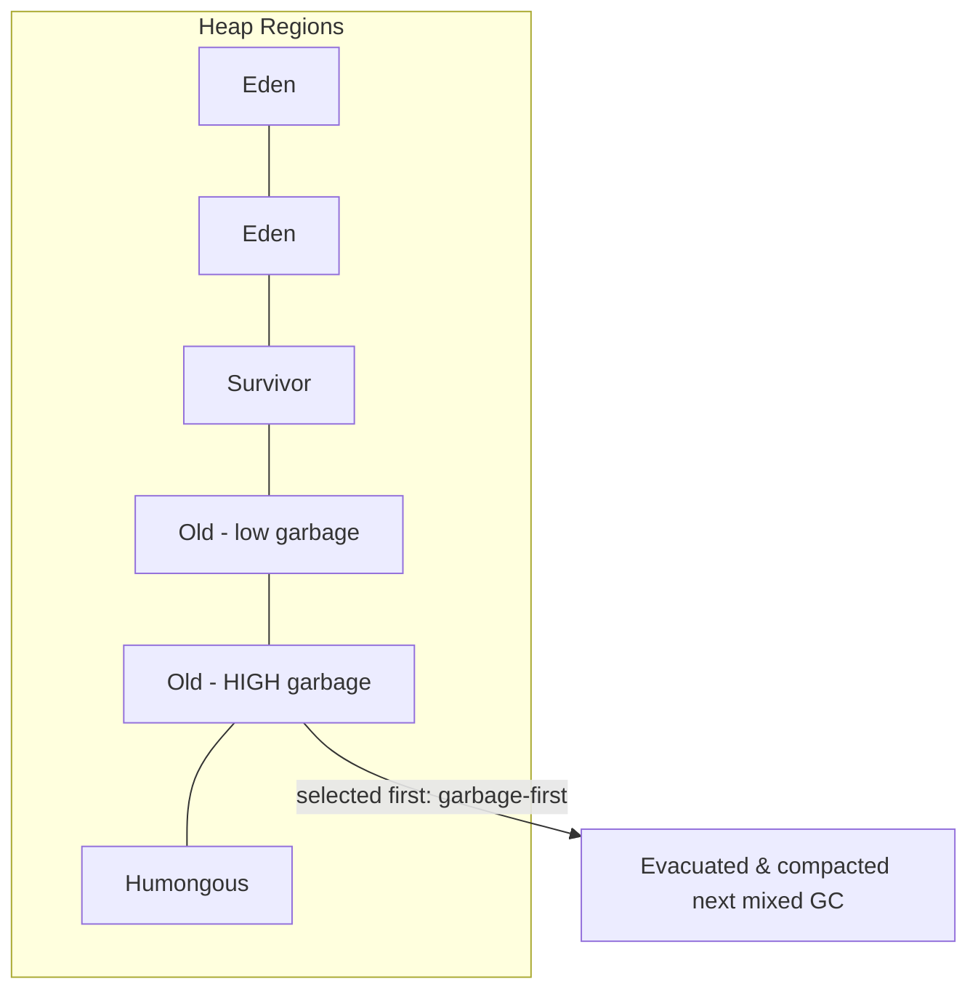
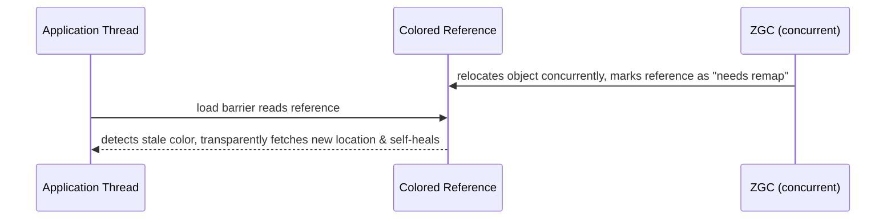
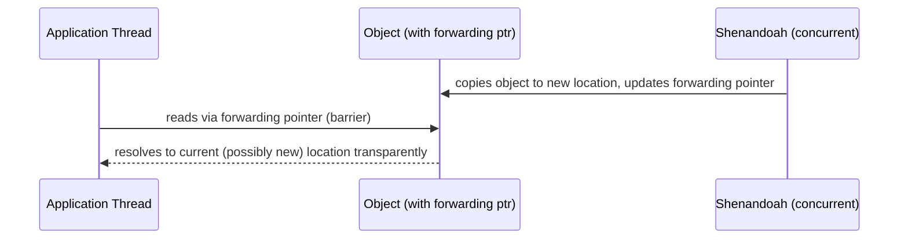

# 22. Garbage Collection

## Reference Counting

### Theory
- **Core Concepts** - Reference counting is a garbage collection strategy where each object maintains a count of active references to it; when the count drops to zero, the object is immediately reclaimed. Java's HotSpot JVM does NOT use pure reference counting for its main heap - it uses tracing (reachability-based) collection instead.
- **Internal Working** - Every `assign`/`unassign` of a reference increments/decrements a counter stored with the object; reclamation happens synchronously and immediately at the point the count hits zero.
- **When to Use It** - Relevant conceptually for understanding alternatives (e.g., `PhantomReference`/native interop reference counting, or other languages like Python/Objective-C which use it), and for understanding why Java chose tracing GC instead.
- **Advantages** - Immediate reclamation (no stop-the-world pause for detecting garbage), simple to reason about locally, spreads collection cost evenly rather than in bursts.
- **Limitations** - Cannot detect cyclic garbage (two objects referencing each other with no external reference are never reclaimed, since neither count reaches zero); counter updates add overhead to every reference assignment, even in single-threaded hot paths.

### Internal Working
- **Step-by-Step Explanation** - On every pointer assignment, the runtime decrements the old target's count (freeing it immediately if it reaches zero, potentially cascading to its own referents) and increments the new target's count; this happens synchronously as part of normal program execution, not as a separate GC pass.
- **Memory Layout** - Each object would need an embedded counter field (extra per-object memory overhead); Java's actual object header does NOT include a reference count field, since HotSpot doesn't use this scheme for heap objects.
- **Diagrams**
```
A --ref--> C (count=1)
B --ref--> C (count=2)
B loses its reference to C --> C count=1 (not collected)
A loses its reference to C --> C count=0 --> C reclaimed immediately

Cycle problem: X --> Y --> X (both count=1 forever, never collected, even if unreachable externally)
```
- **JVM Behaviour** - HotSpot uses tracing garbage collectors (mark-sweep-compact, generational copying, region-based like G1/ZGC) precisely to correctly handle cycles, which reference counting cannot do without extra cycle-detection machinery; some JVM-adjacent technologies (e.g., native `std::shared_ptr` interop, COM/JNI reference counting) do use reference counting at the native boundary.

### Interview Questions
**Basic**
1. What is reference counting as a GC strategy?
2. Does the JVM use reference counting for the heap?

**Intermediate**
1. What is the fundamental flaw of pure reference counting?
2. What overhead does reference counting add compared to tracing GC?

**Advanced**
1. How do languages/runtimes that use reference counting (e.g., Python, Swift) address the cyclic reference problem?

**Scenario-based**
1. You're integrating Java with a native library that uses reference-counted objects (via JNI) - what precautions must you take around object lifecycle across the JNI boundary?

### Detailed Answers
1. **Q: What is reference counting?** A: A GC technique where each object tracks how many active references point to it; the object is freed the instant that count reaches zero.
2. **Q: Does JVM use it?** A: No - HotSpot's heap is managed by tracing collectors (reachability analysis from GC roots), not reference counting.
3. **Q: Fundamental flaw?** A: It cannot reclaim cyclic garbage - if object A references B and B references A, and nothing external references either, both counts stay above zero forever, leaking memory.
4. **Q: Overhead vs tracing?** A: Every single reference assignment (even a local variable reassignment) requires an increment/decrement operation (often needing atomic operations in multi-threaded contexts), adding continuous overhead throughout program execution, versus tracing GC's overhead being concentrated in periodic collection cycles.
5. **Q: How do RC languages handle cycles?** A: Python has a supplementary cycle detector that periodically runs a mark-and-sweep-like pass specifically to find and collect reference cycles that pure refcounting misses; Swift requires developers to manually mark one side of a potential cycle as `weak`/`unowned` to break it.
6. **Q: JNI native reference-counted objects?** A: You must carefully manage native reference count increments/decrements matching Java object lifecycle (e.g., via `NewGlobalRef`/`DeleteGlobalRef`), ensure cleanup happens even on exceptional paths (try/finally or `Cleaner`), and be aware the JVM's GC has no visibility into native refcounts, so a native cycle or leak isn't fixed by Java-side GC at all.

### Code Examples
```java
// Conceptual illustration: manual reference-count-like tracking (NOT how Java's GC actually works)
class RefCounted {
    private int refCount = 0;
    void retain() { refCount++; }
    void release() { if (--refCount == 0) System.out.println("Freed!"); }
}
public class RefCountingDemo {
    public static void main(String[] args) {
        RefCounted obj = new RefCounted();
        obj.retain();  // simulate a reference being taken
        obj.retain();  // a second reference
        obj.release(); // one reference dropped
        obj.release(); // last reference dropped -> "freed"
        // Real Java objects are managed by the JVM's tracing GC, not this pattern.
    }
}
```

## Reachability Analysis

### Theory
- **Core Concepts** - Reachability analysis is the algorithm HotSpot's tracing garbage collectors use to determine which objects are alive: starting from a set of GC roots, the collector traverses the object graph; anything reachable is live, everything else is garbage.
- **Internal Working** - A mark phase walks all reference chains from GC roots, marking visited objects; unmarked objects after the traversal completes are unreachable and eligible for reclamation.
- **When to Use It** - This is the fundamental mechanism underlying all of Java's garbage collectors (Serial, Parallel, G1, ZGC, Shenandoah) - understanding it explains GC pause behaviour, memory leak causes, and reference-type semantics.
- **Advantages** - Correctly reclaims cyclic garbage (unlike reference counting), since cycles with no path from a GC root are still found unreachable.
- **Limitations** - Requires a full (or incremental/concurrent) traversal of the live object graph, which can be expensive for very large heaps unless done concurrently/incrementally (motivating G1/ZGC/Shenandoah's region-based and concurrent designs).

### Internal Working
- **Step-by-Step Explanation** - (1) Identify GC roots (stack locals, static fields, JNI handles, active monitors); (2) traverse outward from each root following every reference field, marking each newly-visited object as "reachable"; (3) once traversal is exhausted, any object not marked is unreachable garbage; (4) the collector then reclaims (sweep/compact/copy) the unmarked objects' memory.
- **Memory Layout** - The mark bit is often stored in the object header or a separate bitmap (depending on collector); reachable objects may subsequently be moved (compacted/copied) to reduce fragmentation, updating all references that pointed to them.
- **Diagrams**

(D and E reference each other but have no path from any root - both are garbage, correctly detected.)
- **JVM Behaviour** - Modern collectors (G1, ZGC, Shenandoah) perform most of this marking concurrently with application threads to minimize stop-the-world pauses, using techniques like SATB (snapshot-at-the-beginning) or colored pointers to handle objects that change reachability mid-collection.

### Interview Questions
**Basic**
1. What is reachability analysis in the context of GC?
2. What are GC roots (briefly)?

**Intermediate**
1. Why does reachability analysis correctly handle cyclic references, unlike reference counting?
2. What's the difference between "marking" and "sweeping"/"compacting"?

**Advanced**
1. How do concurrent collectors perform reachability analysis while the application is still mutating the object graph?

**Scenario-based**
1. An object is stored in a static `Map` cache and never removed, causing a memory leak despite the app never directly referencing it again - explain this in reachability terms.

### Detailed Answers
1. **Q: What is reachability analysis?** A: The algorithm that determines object liveness by traversing reference chains starting from GC roots; objects reachable via any chain are alive, everything else is garbage.
2. **Q: What are GC roots?** A: The fixed starting points for reachability traversal - active thread stack locals/parameters, static fields of loaded classes, JNI global references, and a few JVM-internal references (see "GC Roots" topic for full detail).
3. **Q: Why handle cycles correctly?** A: Liveness is determined by an actual path from a root, not by internal reference counts between objects - two objects referencing only each other, with no path from any root, are correctly identified as unreachable regardless of their mutual references.
4. **Q: Marking vs sweeping/compacting?** A: Marking is the traversal phase that identifies live objects; sweeping reclaims memory occupied by unmarked (dead) objects by adding it to a free list; compacting additionally relocates surviving objects to eliminate fragmentation, updating all references to the moved objects.
5. **Q: Concurrent reachability analysis?** A: Techniques like SATB (Snapshot-At-The-Beginning, used by G1/Shenandoah) record a logical snapshot of the object graph at the start of marking and use write barriers to track concurrent mutations, ensuring no live object is missed even though the application keeps running and modifying references during the marking phase; ZGC uses colored pointers and load barriers for a similar purpose.
6. **Q: Static map cache leak?** A: The cached object remains reachable via the static field (a permanent GC root) even though application logic no longer "needs" it - reachability analysis correctly (but unhelpfully, from the app's intent) considers it alive forever unless explicitly removed from the map; fixed via `WeakHashMap`, explicit eviction, or a bounded cache (e.g., Caffeine/LRU).

### Code Examples
```java
import java.util.HashMap;
import java.util.Map;
public class ReachabilityDemo {
    // Static field is a GC root - anything referenced here is always reachable
    static final Map<String, byte[]> CACHE = new HashMap<>();

    public static void main(String[] args) {
        CACHE.put("key", new byte[1024 * 1024]); // 1MB, reachable forever via CACHE (a leak if never removed)

        Object local = new Object(); // reachable only via this stack local
        local = null; // no more references -> unreachable -> eligible for GC
        System.gc(); // request collection (not guaranteed timing)
    }
}
```

## GC Roots

### Theory
- **Core Concepts** - GC roots are the fixed, always-reachable starting points from which the garbage collector's reachability traversal begins; any object with no path from any GC root is garbage.
- **Internal Working** - The JVM enumerates roots at the start of a GC cycle (a "stop-the-world" root-scanning phase, even in mostly-concurrent collectors) by scanning active thread stacks, static fields, and JNI references.
- **When to Use It** - Understanding GC roots is essential for diagnosing memory leaks (heap dump analysis tools show "paths to GC roots" for suspect objects) and for reasoning about object lifetime.
- **Advantages** - Provides an unambiguous, well-defined basis for liveness, enabling correct and complete garbage detection including cycles.
- **Limitations** - Root-scanning itself (especially thread stack scanning) requires briefly pausing threads (a "safepoint") to get a consistent snapshot, contributing to GC pause time even in largely concurrent collectors.

### Internal Working
- **Step-by-Step Explanation** - At a JVM safepoint, the collector enumerates: (1) local variables/parameters on every live thread's stack frames, (2) static fields of all loaded classes, (3) JNI global/local references held by native code, (4) objects used for synchronization (monitors currently locked), and (5) a few JVM-internal roots (e.g., objects referenced by the class loader data, interned strings' roots in some contexts). Traversal then proceeds outward from this root set.
- **Memory Layout** - Roots themselves aren't heap objects - they're pointers living in thread stacks (native/Java stack frames) or in the Metaspace's static field storage area, pointing INTO the heap.
- **Diagrams**
```
GC Roots:
  [Thread1 stack frame locals] ---\
  [Thread2 stack frame locals] ----+--> traversal begins here --> heap objects marked reachable
  [Static fields]              ---/
  [JNI global refs]           -/
```
- **JVM Behaviour** - Bringing all threads to a safepoint to scan stacks accurately is a key source of GC-related latency; JIT compilers cooperate by emitting "safepoint poll" checks in compiled code (especially at loop back-edges and method returns) so threads can pause promptly when a GC needs to start root scanning.

### Interview Questions
**Basic**
1. Name three categories of GC roots.
2. Why can't an object referenced only by another (non-root) object ever be a "root" itself?

**Intermediate**
1. Why does root-scanning require a safepoint/stop-the-world moment even in "concurrent" collectors?
2. How do heap dump analysis tools (e.g., Eclipse MAT) use the concept of GC roots?

**Advanced**
1. What is a JVM safepoint and how does compiled (JIT) code cooperate to reach one quickly?

**Scenario-based**
1. A heap dump shows a large retained object with a "path to GC root" going through a `ThreadLocal` in a thread-pool thread that's never terminated - explain the leak and the fix.

### Detailed Answers
1. **Q: Three categories of GC roots?** A: Local variables/parameters on thread stacks, static fields of loaded classes, and JNI (native code) references (also: currently-locked monitor objects, and certain JVM-internal roots).
2. **Q: Why can't a non-root object be a root?** A: By definition, GC roots are the JVM's fixed, externally-anchored starting points (thread state, static state, native handles) - any other object's "root-ness" would depend on being reachable FROM one of these, i.e., it's a regular heap object, not an anchor point itself.
3. **Q: Why safepoints needed even for concurrent GCs?** A: Accurately enumerating thread stack roots requires threads to be at a consistent, known state (not mid-instruction with ambiguous register/stack contents); even G1/ZGC/Shenandoah require a brief safepoint to snapshot roots before proceeding with the bulk of marking/relocation concurrently.
4. **Q: Heap dump tools and GC roots?** A: Tools like Eclipse MAT compute "paths to GC roots" for a selected object, showing exactly which root (e.g., a specific thread's stack, or a static field) is keeping it alive - essential for diagnosing why an object that should be garbage is still retained.
5. **Q: What is a safepoint?** A: A point during execution where all thread states are consistent and safe for the JVM to inspect/modify (e.g., for GC root scanning or deoptimization); JIT-compiled code inserts lightweight "safepoint poll" checks at strategic points (loop back-edges, method exits) so a thread can voluntarily pause quickly when the JVM signals a safepoint request, rather than the JVM needing to forcibly interrupt it.
6. **Q: ThreadLocal leak via pooled thread?** A: Thread-pool threads are long-lived (never terminate normally), so any `ThreadLocal` value they hold remains reachable via that thread's root for the pool's entire lifetime, even after the logical "task" that set it has finished - fix by explicitly calling `threadLocal.remove()` when the task completes (e.g., in a `finally` block).

### Code Examples
```java
public class GcRootsDemo {
    static Object staticRoot = new Object(); // reachable via static field root for the program's lifetime

    public static void main(String[] args) {
        Object localRoot = new Object(); // reachable via this thread's stack frame while main() runs
        System.out.println(staticRoot + " " + localRoot);
        // Once main() returns, localRoot's stack frame is gone, so that root disappears;
        // staticRoot remains reachable as long as the class stays loaded.
    }
}
```

## Reference Types (Strong, Soft, Weak, Phantom) *(new)*

### Theory
- **Core Concepts** - Java's `java.lang.ref` package defines four reference strengths controlling how eagerly the GC reclaims an object: **Strong** (default, never collected while reachable), **Soft** (collected only under memory pressure, good for caches), **Weak** (collected as soon as no strong/soft references remain, good for canonicalizing maps/metadata), **Phantom** (already finalized; the reference itself never gives you the object, only signals post-mortem via a `ReferenceQueue`).
- **Internal Working** - Each reference type is a wrapper object (`SoftReference<T>`, `WeakReference<T>`, `PhantomReference<T>`) holding a `get()`-accessible referent (except Phantom), which the GC treats with different reachability rules during its analysis.
- **When to Use It** - Soft: memory-sensitive caches; Weak: canonicalizing/interning maps (`WeakHashMap`), avoiding memory leaks in listener registrations; Phantom: precise post-GC cleanup coordination (safer alternative to `finalize()`), often paired with `ReferenceQueue`.
- **Advantages** - Gives fine-grained control over GC eagerness without manual object lifecycle management; enables memory-sensitive caches and leak-resistant designs.
- **Limitations** - Adds complexity/indirection (`get()` may return `null` at any time for Soft/Weak); Phantom references require queue polling/cleanup code, they're not "automatic".

### Internal Working
- **Step-by-Step Explanation** - During GC reachability analysis, an object reachable ONLY via soft references is left alone unless the collector decides to free memory (JVM-defined heuristic, generally under heap pressure, often preferring to clear soft references in LRU-ish order before throwing `OutOfMemoryError`); an object reachable only via weak references is cleared at the very next GC cycle regardless of memory pressure; an object referenced by a phantom reference is already dead (finalized), and `PhantomReference.get()` always returns `null` - phantom references exist purely to be enqueued onto a `ReferenceQueue` after the referent's memory is about to be reclaimed, letting cleanup code run precisely then.
- **Memory Layout** - Reference objects (`SoftReference`, etc.) are themselves ordinary heap objects with a special internal pointer to the referent that the GC treats specially (not counted as a strong reachability edge); a `ReferenceQueue` is a normal queue data structure the GC enqueues cleared references into.
- **Diagrams**
```mermaid
graph TD
    Root --> StrongRef --> ObjA[Object A - never collected while reachable]
    SoftRef -.->|cleared only under memory pressure| ObjB[Object B]
    WeakRef -.->|cleared at next GC if no strong/soft refs| ObjC[Object C]
    PhantomRef -.->|enqueued after finalization, get() always null| ObjD[Object D]
```
- **JVM Behaviour** - The GC processes reference objects in a defined order during each collection (strong reachability determined first, then soft, then weak, then phantom/finalizable), clearing and optionally enqueuing them onto their associated `ReferenceQueue` as appropriate for that reference type's semantics.

### Interview Questions
**Basic**
1. List the four reference types from strongest to weakest.
2. What's the default reference type for a normal Java variable assignment?

**Intermediate**
1. When would you use a `SoftReference` versus a `WeakReference`?
2. What does `PhantomReference.get()` always return, and why?

**Advanced**
1. How does `WeakHashMap` use weak references internally to avoid memory leaks?

**Scenario-based**
1. An image-caching library needs to keep decoded images around as long as memory allows but must never cause an `OutOfMemoryError` - which reference type fits, and how would you implement the cache?

### Detailed Answers
1. **Q: Four reference types, strongest to weakest?** A: Strong > Soft > Weak > Phantom.
2. **Q: Default reference type?** A: Strong - a normal `Object obj = new Object();` assignment is a strong reference; the object is never collected while any strong reference path from a GC root exists.
3. **Q: Soft vs Weak use case?** A: `SoftReference` for memory-sensitive caches where you want the JVM to hold onto cached data as long as possible, clearing it only when memory is genuinely needed; `WeakReference` for cases where the referent's real lifecycle is owned elsewhere and you just want a non-owning handle (e.g., canonicalizing maps, listener registries) that doesn't prevent collection at all once no strong references remain.
4. **Q: `PhantomReference.get()` always returns null - why?** A: By design - by the time an object is only phantom-reachable, it has already been finalized and its memory is essentially already gone/inaccessible; phantom references exist purely as a notification mechanism (via `ReferenceQueue`) for precise cleanup timing, not for resurrecting or accessing the object.
5. **Q: `WeakHashMap` internals?** A: Its keys are wrapped in `WeakReference`s; once a key object has no other strong references, the GC clears the weak reference and the map lazily removes the now-stale entry (typically on subsequent operations that poll the internal `ReferenceQueue`), preventing the map from being the sole reason a key (and its associated value) stays alive forever.
6. **Q: Image cache avoiding OOM?** A: Use `SoftReference<Bitmap>` values in the cache map; the JVM will clear soft references before throwing `OutOfMemoryError` under memory pressure, so the cache naturally shrinks instead of causing a crash - implement by wrapping cached values in `new SoftReference<>(image)` and checking `ref.get() != null` before use, re-decoding if it's been cleared.

### Code Examples
```java
import java.lang.ref.PhantomReference;
import java.lang.ref.ReferenceQueue;
import java.lang.ref.SoftReference;
import java.lang.ref.WeakReference;
import java.util.HashMap;
import java.util.Map;

public class ReferenceTypesDemo {
    public static void main(String[] args) throws InterruptedException {
        // Soft reference: good for a memory-sensitive cache
        Map<String, SoftReference<byte[]>> cache = new HashMap<>();
        cache.put("blob", new SoftReference<>(new byte[10 * 1024 * 1024]));

        // Weak reference: doesn't keep the object alive
        Object target = new Object();
        WeakReference<Object> weakRef = new WeakReference<>(target);
        target = null; // drop the only strong reference
        System.gc();
        Thread.sleep(100);
        System.out.println("Weak cleared: " + (weakRef.get() == null));

        // Phantom reference: notified via queue after finalization, get() always null
        ReferenceQueue<Object> queue = new ReferenceQueue<>();
        Object phantomTarget = new Object();
        PhantomReference<Object> phantomRef = new PhantomReference<>(phantomTarget, queue);
        System.out.println("Phantom get() is always null: " + (phantomRef.get() == null));
    }
}
```

## Collectors

### Serial GC

#### Theory
- **Core Concepts** - Serial GC (`-XX:+UseSerialGC`) is the simplest collector: it uses a single thread for both minor (young gen) and major (old gen) collections, stopping all application threads during each collection (full stop-the-world).
- **Internal Working** - Young gen uses a copying collector (Eden -> Survivor); old gen uses mark-sweep-compact, both executed single-threaded.
- **When to Use It** - Best for small heaps (client-side apps, containers with 1 CPU, or very small services) where pause times of tens of milliseconds are acceptable and the simplicity/low overhead of a single GC thread outweighs parallelism benefits.
- **Advantages** - Lowest memory/CPU overhead of any collector (no coordination between GC threads), simplest to reason about, best raw throughput per GC cycle on single-core environments.
- **Limitations** - Pause times scale linearly with live-set size since only one thread does the work - unsuitable for large heaps or latency-sensitive multi-core server applications.

#### Internal Working
- **Step-by-Step Explanation** - On a minor GC: stop all application threads, copy live objects from Eden+one Survivor to the other Survivor (or promote to Old Gen if they've survived enough cycles or Survivor is full), reclaim the rest of Eden. On a major/full GC: stop all threads, mark live objects across the whole heap, sweep dead ones, compact the old generation to eliminate fragmentation - all using exactly one thread throughout.
- **Memory Layout** - Classic generational layout: Young Gen (Eden + 2 Survivor spaces) and Old Gen, both within the heap; Metaspace is separate (off-heap) for class metadata.
- **Diagrams**
```
[Eden][S0][S1]   Young Gen (copying collector)
[   Old Gen   ]  (mark-sweep-compact)
All collections: single GC thread, full STW pause
```
- **JVM Behaviour** - Because everything is single-threaded and fully stop-the-world, Serial GC has the most predictable (if not necessarily shortest) pause characteristics and the least implementation complexity/overhead of any HotSpot collector, making it a good default for constrained environments (e.g., small containers).

#### Interview Questions
**Basic**
1. How do you enable Serial GC and what's its defining characteristic?
2. In what environment is Serial GC typically the best choice?

**Intermediate**
1. Why doesn't Serial GC scale well to multi-core, large-heap server workloads?
2. What algorithm does Serial GC use for young vs old generation collection?

**Advanced**
1. Why might Serial GC sometimes outperform a parallel/concurrent collector on a single-core or heavily resource-constrained container?

**Scenario-based**
1. A microservice runs in a container limited to 1 CPU core and 256MB heap; which collector would you pick and why?

#### Detailed Answers
1. **Q: Enabling and characteristic?** A: `-XX:+UseSerialGC`; its defining trait is using a single thread for all GC work (both young and old generation), with full stop-the-world pauses.
2. **Q: Best environment?** A: Small heaps and/or single-CPU environments (small microservices, CLI tools, constrained containers) where coordination overhead of multi-threaded GC isn't worth it.
3. **Q: Why doesn't it scale?** A: Pause duration is proportional to the amount of live data processed by a single thread; on large heaps with many cores available but unused, this wastes parallel hardware capacity and produces unacceptably long pauses for server workloads.
4. **Q: Algorithms used?** A: Young generation: copying collector (Eden/Survivor semispace copying); old generation: mark-sweep-compact.
5. **Q: Why sometimes outperform parallel collectors?** A: On a single core (or very few cores), a parallel collector's worker-thread coordination/synchronization overhead provides no real parallelism benefit and just adds bookkeeping cost - Serial GC's simplicity avoids that overhead entirely.
6. **Q: 1-CPU, 256MB container?** A: Serial GC - with only one core available, parallel/concurrent collectors gain no real speedup from extra GC threads (which don't exist) while still incurring coordination overhead; Serial GC's low footprint and simplicity best match this constrained environment.

#### Code Examples
```java
// Run with: java -XX:+UseSerialGC -Xmx128m SerialGcDemo
public class SerialGcDemo {
    public static void main(String[] args) {
        for (int i = 0; i < 2_000_000; i++) {
            byte[] chunk = new byte[128]; // generates young-gen garbage rapidly
            if (i % 500_000 == 0) System.out.println("Allocated batch " + i);
        }
        System.out.println("Done - observe GC logs with -Xlog:gc");
    }
}
```

### Parallel GC

#### Theory
- **Core Concepts** - Parallel GC (`-XX:+UseParallelGC`, the default in Java 8) uses multiple threads for both young and old generation collection, still fully stop-the-world, optimizing for maximum **throughput** (total application work done per unit time) rather than minimizing individual pause times.
- **Internal Working** - Same generational copying/mark-sweep-compact algorithms as Serial GC, but each phase is parallelized across multiple GC worker threads.
- **When to Use It** - Best for batch-processing/throughput-oriented workloads (data pipelines, batch jobs) where occasional longer pauses are acceptable in exchange for maximizing overall throughput, on multi-core machines.
- **Advantages** - Higher throughput than Serial GC on multi-core hardware (same total work split across threads); simple generational design with well-understood behaviour.
- **Limitations** - Still fully stop-the-world - pause times, while shorter than Serial GC's for the same heap size, still scale with live-set size and can be substantial for large heaps, making it unsuitable for latency-sensitive services.

#### Internal Working
- **Step-by-Step Explanation** - On a GC cycle, the JVM divides the marking/copying/compacting work into chunks distributed across a configurable number of GC threads (`-XX:ParallelGCThreads`); all application threads are still paused for the entire duration, but the GC work itself completes faster due to parallel execution, reducing (though not eliminating) pause time compared to Serial GC for the same heap size.
- **Memory Layout** - Same generational Young (Eden+2 Survivor) / Old generation layout as Serial GC.
- **Diagrams**

```mermaid
gantt
    dateFormat X
    axisFormat %s
    section Serial GC (1 thread)
    GC work : 0, 100
    section Parallel GC (4 threads)
    GC work : 0, 30
```

(Illustrative: same total GC work completes faster with more threads, shortening the STW pause.)
- **JVM Behaviour** - The JVM's `-XX:+UseAdaptiveSizePolicy` (on by default with Parallel GC) dynamically tunes generation sizes and tenuring thresholds based on observed pause times and throughput goals (`-XX:GCTimeRatio`), aiming for the configured throughput target automatically.

#### Interview Questions
**Basic**
1. What is Parallel GC optimized for: throughput or latency?
2. How do you enable Parallel GC and control the number of GC threads?

**Intermediate**
1. How does Parallel GC differ from Serial GC given they use similar algorithms?
2. What does `-XX:GCTimeRatio` control?

**Advanced**
1. Why does parallelizing GC work reduce pause time but not eliminate stop-the-world pauses entirely?

**Scenario-based**
1. A nightly batch ETL job processing millions of records runs on a 16-core machine and cares only about total completion time, not individual pauses - would you choose Parallel GC or G1/ZGC, and why?

#### Detailed Answers
1. **Q: Throughput or latency?** A: Throughput - it aims to maximize the percentage of total time spent running application code versus GC, accepting individually longer (but less frequent, ideally) pauses.
2. **Q: Enabling and thread control?** A: `-XX:+UseParallelGC`; the number of GC worker threads is controlled via `-XX:ParallelGCThreads=N` (defaults based on available CPU cores).
3. **Q: Difference from Serial GC?** A: Both use generational copying (young) and mark-sweep-compact (old) algorithms, but Parallel GC executes each phase using multiple worker threads simultaneously instead of one, reducing wall-clock pause duration for the same amount of GC work on multi-core hardware.
4. **Q: `-XX:GCTimeRatio`?** A: Sets the target ratio of application time to GC time (e.g., a value of 99 means the JVM aims for GC to take no more than 1/(1+99) = 1% of total time), used by the adaptive sizing policy to tune heap/generation sizes automatically.
5. **Q: Why still STW despite parallelism?** A: All application threads are still paused for the ENTIRE GC cycle regardless of how many GC threads work on it in parallel - parallelism only shortens how long that pause lasts, it doesn't make the collection concurrent with application execution (unlike G1/ZGC/Shenandoah which run much of their work concurrently).
6. **Q: 16-core nightly ETL job?** A: Parallel GC is a reasonable, often ideal choice here - the workload explicitly prioritizes total throughput over pause latency, and Parallel GC's fully-parallelized, throughput-optimized design (with no concurrent-marking overhead competing with application threads) typically achieves the best total completion time for such batch workloads.

#### Code Examples
```java
// Run with: java -XX:+UseParallelGC -XX:ParallelGCThreads=4 -Xmx512m ParallelGcDemo
import java.util.ArrayList;
import java.util.List;
public class ParallelGcDemo {
    public static void main(String[] args) {
        List<byte[]> retained = new ArrayList<>();
        for (int i = 0; i < 100_000; i++) {
            byte[] chunk = new byte[1024];
            if (i % 10 == 0) retained.add(chunk); // some survive to old gen
        }
        System.out.println("Retained batches: " + retained.size());
    }
}
```

### CMS

#### Theory
- **Core Concepts** - CMS (Concurrent Mark Sweep, `-XX:+UseConcMarkSweepGC`) was HotSpot's original low-latency collector, performing most of the old-generation marking concurrently with application threads to minimize stop-the-world pauses; **deprecated in Java 9 and removed in Java 14**, superseded by G1 (and later ZGC/Shenandoah).
- **Internal Working** - Uses a mostly-concurrent mark-sweep algorithm for the old generation (young gen still uses a parallel copying collector), with brief STW pauses only for initial-mark and remark phases.
- **When to Use It** - Historically used when low pause times mattered more than throughput, before G1 became the default and mature enough to replace it; on modern JDKs, use G1 (or ZGC/Shenandoah for even lower pauses) instead.
- **Advantages** - Significantly lower pause times than Serial/Parallel GC for old-gen collection by overlapping marking work with application execution.
- **Limitations** - Does NOT compact the old generation (sweep-only), leading to fragmentation over time that can force a fallback full (Serial-style, fully STW) GC; susceptible to "concurrent mode failure" if the old gen fills up before concurrent collection finishes; officially removed from the JDK (Java 14+).

#### Internal Working
- **Step-by-Step Explanation** - CMS old-gen cycle: (1) Initial Mark (brief STW - marks objects directly reachable from GC roots), (2) Concurrent Mark (traverses the object graph concurrently with the application), (3) Remark (brief STW - catches up on mutations made during concurrent marking, often using multiple threads to be fast), (4) Concurrent Sweep (reclaims dead objects' space concurrently, without compaction).
- **Memory Layout** - Same generational Young/Old split; because CMS doesn't compact, the old generation can become fragmented into non-contiguous free chunks, similar to a general-purpose heap allocator's fragmentation issue.
- **Diagrams**
```
Initial Mark (STW, short) -> Concurrent Mark (app runs) -> Remark (STW, short) -> Concurrent Sweep (app runs)
```
- **JVM Behaviour** - If the old generation fills up before a concurrent cycle completes ("concurrent mode failure"), the JVM falls back to a full, fully-stop-the-world Serial-style collection with compaction - a notorious CMS worst-case pause; this fragility, plus fragmentation, motivated its replacement by G1.

#### Interview Questions
**Basic**
1. What does CMS stand for and what problem was it designed to solve?
2. What is the status of CMS in current JDK versions?

**Intermediate**
1. Why doesn't CMS compact the old generation, and what problem does that cause?
2. What is "concurrent mode failure"?

**Advanced**
1. What replaced CMS, and what key architectural difference lets the replacement avoid CMS's main weaknesses?

**Scenario-based**
1. A legacy service still specifies `-XX:+UseConcMarkSweepGC` on JDK 17 - what happens, and what should you do?

#### Detailed Answers
1. **Q: What does CMS stand for/solve?** A: Concurrent Mark Sweep; designed to reduce old-generation GC pause times by doing most marking/sweeping work concurrently with running application threads, instead of Parallel GC's fully stop-the-world old-gen collection.
2. **Q: Current status?** A: Deprecated in Java 9 (JEP 291) and completely removed in Java 14 (JEP 363); it no longer exists in modern JDKs.
3. **Q: Why no compaction, and the problem?** A: CMS's design prioritized concurrency/low pause time over compaction (compacting requires moving objects and updating all references, which is harder to do concurrently); the resulting fragmentation can eventually make it impossible to satisfy a large allocation even though total free memory is sufficient, forcing an expensive full GC.
4. **Q: Concurrent mode failure?** A: When the old generation fills up faster than the concurrent cycle can reclaim space (e.g., due to a high allocation rate or fragmentation), CMS cannot keep up and falls back to a full, stop-the-world, compacting collection - typically the worst-case pause scenario for CMS-based applications.
5. **Q: What replaced it, and key difference?** A: G1 (Garbage First) replaced CMS as the default (Java 9+); G1's key architectural difference is region-based heap division with incremental, predictable evacuation (copying live objects out of a subset of regions each cycle), which lets it compact incrementally and avoid CMS's fragmentation problem entirely.
6. **Q: `-XX:+UseConcMarkSweepGC` on JDK 17?** A: The JVM fails to start (an unrecognized/removed option error) since CMS was removed in Java 14; the fix is to migrate to G1 (default) or evaluate ZGC/Shenandoase for very low pause requirements, adjusting relevant tuning flags accordingly.

#### Code Examples
```java
// Historical illustration only - CMS is removed since JDK 14; shown for interview/reference purposes.
// Run (JDK 9-13 only): java -XX:+UseConcMarkSweepGC -Xmx512m CmsDemo
public class CmsDemo {
    public static void main(String[] args) {
        java.util.List<Object> longLived = new java.util.ArrayList<>();
        for (int i = 0; i < 50_000; i++) {
            longLived.add(new byte[512]); // fills old gen over time, exercising concurrent marking
        }
        System.out.println("Long-lived objects: " + longLived.size());
    }
}
```

### G1

#### Theory
- **Core Concepts** - G1 (Garbage First, `-XX:+UseG1GC`, default since Java 9) divides the heap into many equally-sized regions (not fixed contiguous young/old spaces) and prioritizes collecting the regions with the most garbage first, balancing throughput and pause-time predictability via a user-specified pause-time goal (`-XX:MaxGCPauseMillis`).
- **Internal Working** - Performs mostly-concurrent marking (similar in spirit to CMS) but collects/compacts via incremental, evacuation-based (copying) collection of a chosen subset of regions each cycle, achieving both compaction AND concurrency, unlike CMS.
- **When to Use It** - Default choice for most modern server applications, especially with heaps from a few GB up to hundreds of GB, where you want a configurable balance between throughput and low, predictable pause times.
- **Advantages** - Compacts incrementally (no CMS-style fragmentation), predictable pauses tunable via `-XX:MaxGCPauseMillis`, scales well to large heaps, good general-purpose default.
- **Limitations** - More CPU/memory bookkeeping overhead than simpler collectors (remembered sets per region); can still have occasional longer pauses (e.g., "mixed" collections or if the pause goal is unrealistic for the allocation rate); not as low-latency as ZGC/Shenandoase for extremely large heaps.

#### Internal Working
- **Step-by-Step Explanation** - The heap is split into (typically 1-32MB) regions, each dynamically designated Eden, Survivor, Old, or Humongous (for very large objects). A cycle involves: (1) young-only collections (evacuate live objects from Eden/Survivor regions), (2) concurrent marking of the old generation regions (similar to CMS's concurrent mark), (3) "mixed" collections that evacuate both young regions and the old regions identified as having the most garbage ("garbage first"), copying survivors into fresh regions - this copying IS the compaction, done incrementally region-by-region rather than all at once.
- **Memory Layout** - Heap divided into many fixed-size regions rather than two large contiguous generations; each region tracks a "remembered set" (RSet) of cross-region references pointing into it, enabling a region to be collected independently without scanning the entire heap for incoming references.
- **Diagrams**

- **JVM Behaviour** - G1 uses SATB (snapshot-at-the-beginning) write barriers during concurrent marking to correctly track live objects despite concurrent mutation, and pause-time predictions based on historical region evacuation costs to select which regions to include in each collection while trying to honor `-XX:MaxGCPauseMillis`.

#### Interview Questions
**Basic**
1. What does "G1" stand for and what's its defining heap structure?
2. What JDK version made G1 the default collector?

**Intermediate**
1. How does G1 achieve compaction without CMS's fragmentation problem?
2. What is a "humongous" object/region in G1?

**Advanced**
1. What is a remembered set (RSet) and why is it necessary for G1's region-based collection?

**Scenario-based**
1. A service configures `-XX:MaxGCPauseMillis=50` but still observes occasional 500ms pauses under load spikes - what G1 behaviour would you investigate?

#### Detailed Answers
1. **Q: "G1" meaning and structure?** A: "Garbage First" - it always prioritizes collecting the regions containing the most garbage first; the heap is divided into many equally-sized regions instead of two large contiguous young/old generations.
2. **Q: Default since which version?** A: Java 9.
3. **Q: Compaction without fragmentation?** A: G1 collects via evacuation (copying) - live objects from selected regions are copied into fresh, empty regions, and the old (now-empty) regions are reclaimed wholesale; because copying inherently compacts (no gaps left behind), G1 avoids the sweep-only fragmentation problem CMS had.
4. **Q: Humongous objects/regions?** A: Objects larger than 50% of a region size are classified "humongous" and allocated directly into one or more contiguous special regions, bypassing normal young-gen allocation - excessive humongous allocation can fragment the region space and trigger more frequent full GCs.
5. **Q: Remembered sets?** A: Each region maintains a set of references pointing INTO it from other regions (tracked via write barriers as the program runs); this lets G1 collect a subset of regions without having to scan the ENTIRE heap for incoming references, making partial/incremental collection tractable.
6. **Q: Occasional 500ms pauses despite 50ms goal?** A: `-XX:MaxGCPauseMillis` is a goal/target, not a hard guarantee - investigate: very large "mixed" collections including many old regions at once, humongous object allocation/fragmentation forcing full GCs, an allocation rate too high for the configured young-gen sizing to keep young collections small/fast, or an actual full GC (G1's fallback) being triggered by a concurrent-marking failure to keep pace.

#### Code Examples
```java
// Run with: java -XX:+UseG1GC -XX:MaxGCPauseMillis=100 -Xmx1g G1Demo
import java.util.ArrayList;
import java.util.List;
public class G1Demo {
    public static void main(String[] args) {
        List<byte[]> cache = new ArrayList<>();
        for (int i = 0; i < 200_000; i++) {
            byte[] entry = new byte[2048];
            if (i % 5 == 0) cache.add(entry); // creates a realistic mix of short and long-lived garbage
            if (cache.size() > 20_000) cache.remove(0); // bounded cache, generates old-gen garbage too
        }
        System.out.println("Final cache size: " + cache.size());
    }
}
```

### ZGC

#### Theory
- **Core Concepts** - ZGC (`-XX:+UseZGC`) is a scalable, low-latency collector designed to keep pause times under ~1ms regardless of heap size (tested up to multi-terabyte heaps), by performing nearly all GC work (including relocation/compaction) concurrently with application threads.
- **Internal Working** - Uses colored pointers (metadata bits embedded in unused bits of 64-bit object references) and load barriers to allow concurrent relocation of objects while application threads keep running and even accessing objects mid-move.
- **When to Use It** - Best for applications with very large heaps and/or strict low-latency SLAs (e.g., trading systems, large in-memory caches, real-time services) where even G1's tens-of-milliseconds pauses are unacceptable.
- **Advantages** - Pause times largely independent of heap size or live-set size; scales to extremely large heaps while maintaining sub-millisecond (production-proven single-digit ms in practice) pauses.
- **Limitations** - Higher CPU/memory overhead than G1 for the concurrency machinery (colored pointers, load barriers); historically had somewhat lower raw throughput than G1/Parallel for throughput-only workloads (gap has narrowed significantly in recent JDKs); requires 64-bit pointers (colored pointer scheme).

#### Internal Working
- **Step-by-Step Explanation** - ZGC performs marking, relocation-set selection, and relocation almost entirely concurrently: colored pointers embed metadata (marked/remapped/finalizable bits) directly in each reference; when application code loads a reference, a lightweight "load barrier" checks these bits and, if the object has moved, transparently redirects the read to the object's new location and self-heals the reference in-place - all without stopping the application thread performing that access.
- **Memory Layout** - Requires a large virtual address space reservation (multiple views of the same heap mapped at different virtual addresses corresponding to different colored-pointer states); physical memory usage still corresponds to actual live data, but virtual memory reservation is much larger than the heap size (a normal, expected characteristic, not a leak).
- **Diagrams**

- **JVM Behaviour** - Nearly all phases (mark, relocate) run concurrently with only very brief STW pauses to initiate each phase (root scanning); the load barrier's overhead (a few extra machine instructions per reference load) is the main runtime cost trade-off for near-zero pause times.

#### Interview Questions
**Basic**
1. What is ZGC's primary design goal?
2. What JDK version(s) introduced ZGC and made it production-ready/default-eligible?

**Intermediate**
1. What is a "colored pointer" and what problem does it solve?
2. Why does ZGC's pause time stay roughly constant regardless of heap size?

**Advanced**
1. What is a load barrier and how does it enable concurrent object relocation?

**Scenario-based**
1. A financial trading application requires GC pauses consistently under 10ms on a 128GB heap - which collector would you pick, and what trade-off are you accepting?

#### Detailed Answers
1. **Q: Primary design goal?** A: Ultra-low, largely heap-size-independent pause times (target sub-millisecond to low-single-digit milliseconds) even for very large heaps, by doing nearly all work concurrently with the application.
2. **Q: Introduction timeline?** A: Introduced as experimental in Java 11 (Linux/x64), matured and made production-ready with generational support added later; broadly considered production-grade from Java 15-17 onward depending on platform, with Generational ZGC becoming the default ZGC mode in newer releases (21+).
3. **Q: Colored pointers?** A: Reserved bits within a 64-bit object reference encode metadata about the object's GC state (e.g., marked, remapped, needing relocation); this lets the GC track state per-reference without a separate side table, and lets load barriers cheaply detect stale references needing remapping.
4. **Q: Why constant pause time?** A: Because marking AND relocation/compaction happen concurrently with the application (not stop-the-world), the pauses are limited to brief root-scanning/initiation phases whose cost doesn't scale with total live-set size, unlike collectors that must pause for the entire mark or copy phase.
5. **Q: Load barrier mechanism?** A: A load barrier is a small piece of code inserted by the JIT at every reference load that checks the colored bits of the loaded reference; if it indicates the referenced object has been (or is being) relocated, the barrier transparently follows a forwarding pointer to the object's new location and updates ("self-heals") the original reference field, all without requiring a stop-the-world pause for that thread.
6. **Q: 128GB heap, sub-10ms pauses?** A: ZGC (or Shenandoah, similarly concurrent) - both are designed for exactly this scenario; the trade-off accepted is somewhat higher baseline CPU overhead (load/write barriers running on every reference access) and possibly marginally lower peak throughput compared to G1/Parallel GC, in exchange for near-heap-size-independent low pause times.

#### Code Examples
```java
// Run with: java -XX:+UseZGC -Xmx2g ZgcDemo
import java.util.ArrayList;
import java.util.List;
public class ZgcDemo {
    public static void main(String[] args) throws InterruptedException {
        List<byte[]> retained = new ArrayList<>();
        for (int i = 0; i < 500_000; i++) {
            retained.add(new byte[1024]); // steadily grows the live set, exercising concurrent relocation
            if (i % 100_000 == 0) System.out.println("Allocated: " + i);
        }
        System.out.println("Total retained: " + retained.size());
    }
}
```

### Shenandoah

#### Theory
- **Core Concepts** - Shenandoah (`-XX:+UseShenandoahGC`, developed by Red Hat) is, like ZGC, a low-latency collector aiming for pause times independent of heap size, achieved via concurrent evacuation (compaction) using a different mechanism: Brooks forwarding pointers (an extra indirection word per object) instead of ZGC's colored-pointer scheme.
- **Internal Working** - Each object has a forwarding pointer field; during concurrent evacuation, readers/writers use this pointer to always reach the current (possibly relocated) copy of the object, with a read/write barrier resolving it on every access.
- **When to Use It** - Similar use case to ZGC - large heaps and/or strict low-latency requirements; choice between the two is often based on JDK distribution availability (Shenandoah originated in OpenJDK builds from Red Hat, e.g., available in many OpenJDK 11+ distributions) and specific workload benchmarking.
- **Advantages** - Pause times largely independent of heap size, similar to ZGC; mature and available on more platforms/architectures historically than early ZGC versions.
- **Limitations** - The forwarding-pointer indirection adds a per-object memory overhead (extra word) and a barrier cost on every access, similar in spirit to ZGC's trade-offs; like ZGC, generally somewhat lower raw throughput than G1/Parallel for pure-throughput workloads.

#### Internal Working
- **Step-by-Step Explanation** - Shenandoah adds a forwarding pointer to every object's header; during concurrent evacuation, the collector copies live objects to new locations and updates their forwarding pointer to point to the new copy; a read barrier on every object access resolves through this forwarding pointer (cheaply, if not yet moved - pointer just points to itself) ensuring both application threads and the GC always see a consistent, up-to-date view even while copying is in progress concurrently.
- **Memory Layout** - Every object gets one extra pointer-sized field in its header for the forwarding pointer, a modest but real per-object memory overhead compared to collectors without this indirection.
- **Diagrams**

- **JVM Behaviour** - Like ZGC, most phases (marking, evacuation, reference updating) run concurrently with only brief STW pauses for initiation (init-mark) and final reference updates (final-update-refs in some modes); barrier overhead on reads/writes is the main steady-state cost.

#### Interview Questions
**Basic**
1. What is Shenandoah's primary design goal, and how does it compare to ZGC's goal?
2. What mechanism does Shenandoah use to enable concurrent compaction?

**Intermediate**
1. What is a Brooks forwarding pointer and what per-object cost does it add?
2. How does Shenandoah's approach differ mechanically from ZGC's colored pointers?

**Advanced**
1. Why do both ZGC and Shenandoah accept a throughput/memory-overhead trade-off in exchange for low pause times?

**Scenario-based**
1. You're choosing between ZGC and Shenandoah for a low-latency service on a specific OpenJDK distribution - what factors would drive the decision?

#### Detailed Answers
1. **Q: Primary goal vs ZGC?** A: Both aim for pause times that don't scale with heap/live-set size via concurrent compaction; they're conceptually equivalent in goal, differing mainly in their concurrent-relocation implementation mechanism.
2. **Q: Mechanism for concurrent compaction?** A: Brooks-style forwarding pointers - an extra indirection field added to every object, resolved via read/write barriers, allowing objects to be relocated while still being safely accessed by concurrently running application threads.
3. **Q: Forwarding pointer cost?** A: Adds one extra word per object (a per-object memory overhead) and requires a barrier check on relevant accesses; the object header effectively includes this forwarding slot in addition to the usual mark word/klass pointer.
4. **Q: Difference from ZGC's colored pointers?** A: ZGC encodes state directly in spare bits of the reference itself (no extra per-object field, but requires large virtual-address-space tricks and specific pointer-width assumptions); Shenandoah instead adds an explicit forwarding-pointer field to each object's header, a more straightforward but per-object-memory-costlier approach.
5. **Q: Why accept the trade-off?** A: Achieving pause times independent of heap size fundamentally requires doing marking AND compaction concurrently with the application, which necessitates some form of indirection/barrier on every access to detect and handle concurrently-relocated objects - this barrier and bookkeeping overhead is the unavoidable cost of near-zero-pause concurrent compaction.
6. **Q: Choosing ZGC vs Shenandoah?** A: Consider: JDK vendor/distribution support (Shenandoah originated with Red Hat's OpenJDK builds, though both are now mainline OpenJDK features on modern LTS versions), platform/architecture support, actual benchmarked throughput and pause behaviour under your specific workload (both should be load-tested), and organizational familiarity/operational experience with one or the other.

#### Code Examples
```java
// Run with: java -XX:+UseShenandoahGC -Xmx2g ShenandoahDemo
import java.util.ArrayList;
import java.util.List;
public class ShenandoahDemo {
    public static void main(String[] args) {
        List<byte[]> retained = new ArrayList<>();
        for (int i = 0; i < 500_000; i++) {
            retained.add(new byte[1024]); // continuous allocation exercises concurrent evacuation
        }
        System.out.println("Total retained: " + retained.size());
    }
}
```

## GC Tuning

### Theory
- **Core Concepts** - GC tuning is the process of configuring heap sizes, generation ratios, collector choice, and pause-time goals to balance throughput, latency, and memory footprint for a specific application's allocation patterns.
- **Internal Working** - Involves setting JVM flags (`-Xms`/`-Xmx`, `-XX:NewRatio`, `-XX:MaxGCPauseMillis`, collector selection flags) informed by GC log analysis (`-Xlog:gc*`) and profiling of allocation rate, object lifetimes, and pause/throughput requirements.
- **When to Use It** - Apply when default GC behaviour doesn't meet application SLAs (too-frequent pauses, too-long pauses, excessive memory footprint, or throughput below target) - always driven by measurement, not guesswork.
- **Advantages** - Can dramatically improve latency (fewer/shorter pauses), throughput, or memory efficiency when tuned correctly for the actual workload.
- **Limitations** - Highly workload-specific - tuning parameters that help one application can hurt another; over-tuning based on synthetic benchmarks rather than production traffic patterns often backfires; modern collectors (G1+) are designed to need less manual tuning than older ones.

### Internal Working
- **Step-by-Step Explanation** - (1) Establish a baseline using GC logs (`-Xlog:gc*:file=gc.log:time,uptime,level,tags`) to measure pause frequency/duration and throughput; (2) identify the bottleneck (too many minor GCs -> increase young gen size; long pauses -> switch collector or lower pause-time goal; premature promotion -> increase survivor space/tenuring threshold); (3) adjust specific flags incrementally; (4) re-measure under realistic (ideally production-like) load; (5) repeat.
- **Memory Layout** - Tuning directly manipulates generation/region sizing (`-Xmn`, `-XX:NewRatio`, `-XX:G1HeapRegionSize`), survivor space ratios (`-XX:SurvivorRatio`), and overall heap bounds (`-Xms`, `-Xmx` - setting them equal avoids costly heap resize events).
- **Diagrams**
```
Measure (GC logs) -> Diagnose (which phase/pause dominates?) -> Adjust flag(s) -> Re-measure -> Iterate
```
- **JVM Behaviour** - Most modern collectors (Parallel, G1) include adaptive sizing policies that self-tune generation sizes toward configured goals (`-XX:GCTimeRatio`, `-XX:MaxGCPauseMillis`) automatically; manual tuning typically targets scenarios where the adaptive defaults don't match a specific workload's characteristics (e.g., very bursty allocation, huge live sets, strict SLA requirements).

### Interview Questions
**Basic**
1. What JVM flags control minimum and maximum heap size?
2. Why is it often recommended to set `-Xms` equal to `-Xmx`?

**Intermediate**
1. What GC log metrics would you look at first when diagnosing a latency problem?
2. How would you address frequent minor GCs versus infrequent but long major GCs?

**Advanced**
1. How does `-XX:MaxGCPauseMillis` interact with G1's region selection, and what happens if the goal is unrealistic for the workload?

**Scenario-based**
1. An application shows healthy throughput but occasional multi-second pauses correlating with traffic spikes - walk through your tuning/diagnosis approach.

### Detailed Answers
1. **Q: Heap size flags?** A: `-Xms` (initial/minimum heap size), `-Xmx` (maximum heap size).
2. **Q: Why `-Xms == -Xmx`?** A: Prevents the JVM from performing potentially expensive heap resize operations at runtime (which can themselves cause pauses) as it grows the heap from the initial size toward the maximum under load - fixing the size upfront gives more predictable, stable behaviour.
3. **Q: First GC log metrics to check?** A: Pause frequency and duration per collection type (minor vs major/mixed), time-to-safepoint, and the ratio of application time to GC time (throughput) - these quickly indicate whether the problem is pause length, pause frequency, or overall GC overhead.
4. **Q: Frequent minor GCs vs infrequent long major GCs?** A: Frequent minor GCs suggest an undersized young generation relative to allocation rate - increase `-Xmn`/young gen size or survivor ratio; infrequent but long major/full GCs suggest the old generation is being stressed (too much promotion, fragmentation, or an undersized heap overall) - investigate promotion rate, consider a concurrent/region-based collector (G1/ZGC/Shenandoah), or increase overall heap size.
5. **Q: `-XX:MaxGCPauseMillis` with G1?** A: G1 uses historical evacuation-cost data per region to estimate how many regions it can collect within the pause goal and selects that many (prioritizing highest-garbage regions); if the goal is set unrealistically low for the actual allocation rate/live-set size, G1 will still exceed it when necessary (it's a best-effort goal, not a hard cap) and may fall back to more frequent or larger collections trying to keep up, or eventually a full GC if it truly can't keep pace.
6. **Q: Multi-second pauses during traffic spikes?** A: Enable/review GC logs first to confirm whether these are minor, mixed, or full GCs; check for promotion failures or humongous allocations (G1) coinciding with the spikes; check if allocation rate during spikes outpaces the young generation's capacity (forcing premature promotion or frequent full/mixed GCs); consider increasing young-gen size, adjusting `-XX:InitiatingHeapOccupancyPercent` (G1's concurrent-cycle trigger) to start marking earlier, or evaluating ZGC/Shenandoah if consistent low-latency under bursty load is a hard requirement.

### Code Examples
```java
// Example: comparing GC behaviour under different flags
// java -Xms512m -Xmx512m -XX:+UseG1GC -XX:MaxGCPauseMillis=100 -Xlog:gc*:file=gc.log GcTuningDemo
import java.util.ArrayList;
import java.util.List;
public class GcTuningDemo {
    public static void main(String[] args) {
        List<byte[]> cache = new ArrayList<>();
        long start = System.currentTimeMillis();
        for (int i = 0; i < 1_000_000; i++) {
            byte[] entry = new byte[512];
            if (i % 3 == 0) cache.add(entry);
            if (cache.size() > 50_000) cache.remove(0); // bounded, realistic churn
        }
        System.out.println("Elapsed ms: " + (System.currentTimeMillis() - start));
        // Analyze gc.log afterward to correlate pause times with allocation behaviour.
    }
}
```

## Additional Resources

### Videos

- [Garbage Collection in Java | What is GC and How does it Work in the JVM? | Types of GCs | Geekific](https://www.youtube.com/watch?v=XXOaCV5xm9s)
- [Java 21 JVM & GC Improvements](https://www.youtube.com/watch?v=LXWbyf8SUjI)
- [Z Garbage Collector: The Next Generation](https://www.youtube.com/watch?v=OnodHoNYE1Y)
