# 23. Concurrency

## Java Memory Model

### Happens Before

#### Theory
**Core Concepts**: The happens-before relation is the formal ordering guarantee defined by the Java Memory Model (JMM, JLS §17.4) that determines when the effects of one thread's actions (writes to memory) are guaranteed to be visible to another thread. If action A happens-before action B, then A's results are visible to and ordered before B — without a happens-before edge, the JVM and hardware are free to reorder, cache, or never propagate writes across threads. It is the foundation that `synchronized`, `volatile`, `Thread.start()/join()`, locks, and `java.util.concurrent` utilities all rely on to make concurrency correct.

**Internal Working**: The JMM defines a partial order over program actions built from program order (within a thread) plus specific synchronization actions (monitor lock/unlock, volatile write/read, thread start/join) that create cross-thread edges; the transitive closure of these edges is the happens-before order.

**When to Use It**: You don't "use" happens-before directly — you reason about it when designing shared mutable state, deciding whether a field needs `volatile`, or verifying that a publish/subscribe pattern between threads is safe.

**Advantages**: Gives a precise, hardware-independent contract so code that respects it is portable and correct on any JVM/CPU (x86, ARM, etc.) regardless of instruction reordering or cache behavior.

**Limitations**: It is easy to violate accidentally (e.g., publishing an object reference through a non-volatile field, or relying on timing instead of an explicit happens-before edge); violations are typically silent — they surface as intermittent, hard-to-reproduce bugs.

#### Internal Working
**Step-by-Step Explanation**: 1) Program order: each action in a single thread happens-before every subsequent action in that same thread's program order. 2) Monitor lock rule: an unlock on a monitor happens-before every subsequent lock on that same monitor. 3) Volatile rule: a write to a volatile field happens-before every subsequent read of that field. 4) Thread start rule: `Thread.start()` happens-before any action in the started thread. 5) Thread termination rule: every action in a thread happens-before another thread successfully returns from `Thread.join()` on it. 6) Transitivity: if A happens-before B and B happens-before C, then A happens-before C — chains of these rules let you reason about complex handoffs.

**Memory Layout**: Each thread has its own stack and may keep values in CPU registers or per-core caches; the heap is shared. Without a happens-before edge, a write made in one core's cache/store-buffer is not guaranteed to be flushed to main memory or invalidate another core's cache line before that other thread reads it — the reader may observe a stale heap value indefinitely.

**Diagrams**:
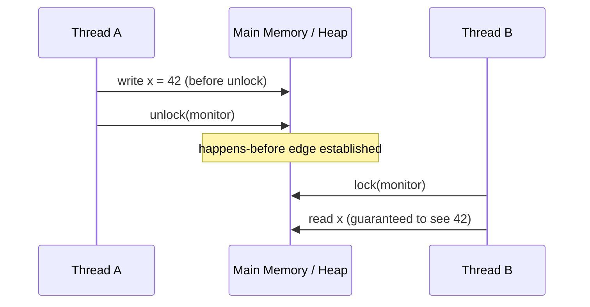

**JVM Behaviour**: The JIT compiler and CPU are permitted to reorder independent instructions for performance as long as no happens-before edge is violated; `volatile` reads/writes and monitor enter/exit are compiled with memory barriers (e.g., `StoreLoad`, `LoadLoad` fences on x86) that block specific reorderings and force cache coherence traffic.

#### Interview Questions
**Basic**
1. What is the happens-before relation and why does Java need it?
2. Does happens-before imply that actions occur in real wall-clock time order?

**Intermediate**
1. Name three rules that establish happens-before edges in the JMM.
2. How does the transitivity of happens-before help with the safe-publication idiom?

**Advanced**
1. Why is `Thread.start()` sufficient to publish an object safely to a new thread without further synchronization?
2. How do memory barriers implement happens-before at the CPU level?

**Scenario-based**
1. Two threads share a plain (non-volatile) boolean flag; thread A sets it true, thread B spins reading it. Why might B loop forever, and how do you fix it using happens-before rules?

#### Detailed Answers
1. **What is happens-before and why is it needed?** It's a JLS-defined partial ordering of actions across threads guaranteeing visibility and ordering of memory effects; Java needs it because the JMM allows compilers/CPUs to reorder and cache instructions for performance, so without an explicit contract, multi-threaded visibility would be undefined and non-portable.
2. **Does it imply real-time ordering?** No — happens-before is about visibility guarantees, not physical timing. Two actions can satisfy happens-before while executing arbitrarily far apart in wall-clock time; conversely, an action can finish earlier in real time yet have no happens-before relation to another, meaning its effects aren't guaranteed visible.
3. **Three rules**: program order rule (same thread), monitor lock/unlock rule, and volatile write/read rule. Others include thread start/join and transitivity.
4. **Transitivity and safe publication**: If thread A writes fields then writes a volatile reference happens-before B reads that volatile reference which happens-before B reads the fields, transitivity guarantees B sees all of A's writes made before the volatile write — this is the basis of the "safe publication via volatile/final" idiom.
5. **Why Thread.start() is sufficient**: The JLS explicitly defines a happens-before edge from every action preceding `start()` in the parent thread to every action in the new thread, so the JVM guarantees all state set up before `start()` is visible in the new thread without any extra lock or volatile.
6. **Memory barriers**: Volatile writes are compiled with a `StoreStore`+`StoreLoad` barrier preventing the write from being reordered after subsequent stores/loads and forcing the store buffer to flush; volatile reads use `LoadLoad`+`LoadStore` barriers. Monitor enter/exit map to acquire/release fences with similar cache-coherence effects (e.g., MESI protocol invalidation).
7. **Spinning flag scenario**: With a plain field, the JIT may cache B's read in a register (never re-reading heap) and there's no happens-before edge, so B may never observe `true`. Fix: declare the flag `volatile`, or use `AtomicBoolean`, establishing the volatile write/read happens-before edge.

#### Code Examples
```java
public class SafePublication {
    private int configValue; // plain field
    private volatile boolean ready; // establishes happens-before

    public void producer() {
        configValue = 42;       // (1) plain write
        ready = true;           // (2) volatile write - happens-before edge
    }

    public void consumer() {
        if (ready) {             // (3) volatile read
            // (4) guaranteed to see configValue == 42 due to transitivity of (1)->(2)->(3)->(4)
            System.out.println(configValue);
        }
    }
}
```

### Visibility

#### Theory
**Core Concepts**: Visibility is the guarantee that a write made by one thread to a shared variable is observable by another thread that subsequently reads it. Java does not guarantee visibility by default because of CPU caches, store buffers, and compiler optimizations (register allocation, instruction reordering) — a write can sit invisibly in one core's cache indefinitely unless a synchronization mechanism forces propagation.

**Internal Working**: Visibility is achieved by establishing a happens-before edge (via `volatile`, `synchronized`, `Atomic*`, or higher-level `j.u.c` constructs) between the writer and reader; the JVM inserts memory barriers at those points to flush/invalidate CPU caches.

**When to Use It**: Whenever more than one thread reads a variable that another thread writes — flags, configuration objects, cached computed results, double-checked-locking singletons.

**Advantages**: Correctly handled visibility eliminates an entire class of "works on my machine" bugs that only appear under specific CPU architectures, JIT optimization levels, or load.

**Limitations**: Visibility alone does not guarantee atomicity — a visible but non-atomic compound operation (like `count++`) can still race; visibility fixes (volatile) also don't provide mutual exclusion.

#### Internal Working
**Step-by-Step Explanation**: 1) Thread A writes variable `x` — without synchronization, the value may live in a CPU register or store buffer. 2) Thread B reads `x` — without synchronization, the JIT may have hoisted the read out of a loop or cached it in a register, and the CPU cache may hold a stale line. 3) Adding `volatile` (or a lock) forces A's write through a `StoreStore`/`StoreLoad` barrier to main memory and invalidates other cores' cache lines; it forces B's read through a `LoadLoad` barrier to re-fetch from memory. 4) Result: B reliably observes A's latest write.

**Memory Layout**: Modern CPUs have per-core L1/L2 caches with a shared L3 and coherence protocol (e.g., MESI); a non-synchronized write may only update a core-local cache line. `volatile` fields bypass this optimization opportunity by forcing coherence traffic on every access.

**Diagrams**:
```
Thread A (Core 1)          Main Memory/Cache Coherence         Thread B (Core 2)
  write x=1 (register) ----X (never flushed)                   read x --> stale 0 (cached)

With volatile:
  write x=1 --> StoreStore/StoreLoad barrier --> flush to memory --> cache invalidate
                                                                     read x --> LoadLoad barrier --> 1
```

**JVM Behaviour**: The bytecode for a volatile field access is identical (`getfield`/`putfield`) to a normal field, but the JIT-generated machine code inserts fences (e.g. `lock addl $0,(%rsp)` on x86 for volatile writes) and disables certain reordering optimizations for that field specifically.

#### Interview Questions
**Basic**
1. What does "visibility" mean in the context of Java concurrency?
2. Why might a loop reading a shared boolean flag never terminate without `volatile`?

**Intermediate**
1. Does `volatile` guarantee atomicity as well as visibility? Explain with an example.
2. How does `synchronized` provide visibility beyond just mutual exclusion?

**Advanced**
1. Explain how CPU cache coherence protocols relate to Java's visibility guarantees.
2. Why can two reads of the same volatile variable in the same thread still see different values across calls, and is that a bug?

**Scenario-based**
1. A monitoring dashboard reads a `long` counter updated by a background thread without any synchronization on a 32-bit JVM. What visibility and atomicity issues could arise, and how would you fix them?

#### Detailed Answers
1. **What is visibility?** It's the guarantee that once one thread writes a shared variable, other threads will observe that new value rather than a stale cached copy, once a proper happens-before edge exists between the write and the read.
2. **Loop never terminating**: The JIT may prove the flag is never modified within the reading thread and hoist the read outside the loop (or cache it in a register), plus there's no cache-coherence guarantee — so the thread can spin forever even though another thread flipped the flag, because there is no happens-before edge forcing re-read.
3. **Volatile and atomicity**: `volatile` guarantees visibility and ordering but not atomicity for compound actions. `volatile int count; count++;` is NOT atomic — it's a read-modify-write of three bytecode steps (`getfield`, `iadd`, `putfield`) and two threads can interleave and lose an update, even though each individual read/write is visible.
4. **Synchronized and visibility**: Entering a `synchronized` block performs a lock-acquire (memory barrier that invalidates the cache, forcing fresh reads), and exiting performs a lock-release (flushes writes to memory) — so it provides both mutual exclusion AND the same visibility guarantee as volatile, for everything touched inside the block, not just one field.
5. **CPU cache coherence**: Protocols like MESI keep per-core caches consistent by invalidating or updating other cores' copies of a cache line when one core writes it; Java's volatile/lock memory barriers are essentially instructions that trigger and wait on this coherence traffic, translating JMM guarantees into concrete CPU behavior.
6. **Same-thread volatile reads differing**: Not a bug — if another thread is concurrently writing that volatile field, each read in the same thread can legitimately observe a newer value than the previous read, since volatile provides freshness/visibility per access, not a snapshot for the duration of a method.
7. **32-bit JVM long scenario**: On a 32-bit JVM, a non-volatile `long`/`double` write is not guaranteed atomic — it can be split into two 32-bit writes, so a reader could see a "torn" value (half old, half new) in addition to the general visibility problem of never seeing updates at all. Fix: mark the field `volatile` (JLS guarantees volatile long/double writes are atomic) or use `AtomicLong`.

#### Code Examples
```java
public class VisibilityDemo {
    // Without volatile, the JIT may cache 'stop' in a register in run()
    private volatile boolean stop = false;

    public void run() {
        int iterations = 0;
        while (!stop) {
            iterations++; // busy work
        }
        System.out.println("Stopped after " + iterations + " iterations");
    }

    public void requestStop() {
        stop = true; // volatile write is guaranteed visible to the running thread
    }
}
```

### Atomicity

#### Theory
**Core Concepts**: Atomicity means an operation (or sequence of operations) executes as a single, indivisible unit from the perspective of other threads — no other thread can observe a partially-completed intermediate state, and no other thread's interleaved operation can corrupt the result. In Java, single reads/writes of `int`, references, and (with `volatile`) `long`/`double` are atomic, but compound actions like `i++`, `if (x==null) x = new X()`, or multi-field invariants are not atomic unless explicitly protected.

**Internal Working**: Achieved either via mutual exclusion (`synchronized`/`Lock` serializing access) or via lock-free CPU-level atomic instructions (compare-and-swap, CAS) exposed through `java.util.concurrent.atomic` classes.

**When to Use It**: Any time multiple threads perform read-modify-write operations on shared state — counters, ID generators, cache population, statistics aggregation.

**Advantages**: Eliminates lost-update and torn-read race conditions; lock-free atomics (CAS-based) can offer much higher throughput than locking under contention.

**Limitations**: Locking has throughput/contention costs and risk of deadlock; CAS-based atomics can suffer from the ABA problem and only atomically update a single variable (or a small group via `VarHandle`/`AtomicReference` to an immutable composite).

#### Internal Working
**Step-by-Step Explanation**: 1) A compound action like `count++` compiles to load, add, store. 2) Under `synchronized`, the whole sequence is wrapped so only one thread executes it at a time — enforced by monitor entry/exit. 3) Under `AtomicInteger.incrementAndGet()`, the JVM instead issues a CAS loop: read current value, compute new value, attempt an atomic hardware compare-and-swap; if another thread changed the value in between, retry.
4) Either way, the net effect appears indivisible to observers.

**Memory Layout**: `Atomic*` classes typically wrap a single volatile field (visible in the heap) and use `Unsafe`/`VarHandle` intrinsics to perform the CAS directly on that memory location, avoiding OS-level lock/monitor overhead (no thread blocking, no monitor object header manipulation).

**Diagrams**:
```
CAS loop (AtomicInteger.incrementAndGet):
  loop:
    old = value            (volatile read)
    new = old + 1
    if CAS(value, old, new) succeeds -> return new
    else -> retry loop (another thread won the race)
```

**JVM Behaviour**: CAS compiles down to a single hardware instruction (`cmpxchg` on x86, `LL/SC` on ARM) exposed via `Unsafe.compareAndSwapInt`/`VarHandle.compareAndSet`; this is lock-free (no OS mutex, no thread suspension) but still requires a memory fence for visibility, so it's not "free" — it's just cheaper than blocking under typical contention levels.

#### Interview Questions
**Basic**
1. Why is `count++` not atomic even for a `volatile int`?
2. Name two ways Java gives you atomicity for a single counter.

**Intermediate**
1. How does `AtomicInteger` achieve atomicity without locking?
2. What is the ABA problem and which class helps solve it?

**Advanced**
1. Compare the throughput characteristics of CAS-based atomics vs. `synchronized` under high contention.
2. How would you atomically update two related fields together, and what class would you use?

**Scenario-based**
1. A `Map<String, AtomicLong>` is used to count hits per URL. Under high concurrency, is `computeIfAbsent(url, k -> new AtomicLong()).incrementAndGet()` fully correct? Discuss.

#### Detailed Answers
1. **Why count++ isn't atomic**: Even with `volatile`, `count++` decomposes into three separate steps (read, increment, write); two threads can both read the same old value before either writes back, causing a lost update. `volatile` only guarantees each of those three steps is visible/ordered, not that the triplet is indivisible.
2. **Two atomicity mechanisms**: (a) `synchronized`/`ReentrantLock` around the increment to serialize access, or (b) `AtomicInteger`/`AtomicLong` using lock-free CAS.
3. **How AtomicInteger works**: Internally it holds the value in a field accessed via `VarHandle`/`Unsafe`; `incrementAndGet()` loops reading the current value and issuing a hardware CAS instruction that atomically replaces the value only if it still equals the previously read value, retrying on failure — this avoids OS mutex overhead entirely.
4. **ABA problem**: If a value changes from A to B and back to A between a thread's read and its CAS, the CAS succeeds even though the value was modified in between, which can be incorrect for algorithms relying on "value unchanged" (e.g., lock-free stacks). `AtomicStampedReference` (adds a version stamp) or `AtomicMarkableReference` solve this by pairing the value with a monotonically changing stamp/mark.
5. **CAS vs synchronized under contention**: Under low-to-moderate contention, CAS-based atomics are faster because there's no thread blocking/context switch, just a tight retry loop. Under very high contention, CAS retry storms can waste CPU (many threads spinning and failing), and `synchronized` (which since Java 6 uses adaptive spinning + OS park/unpark) may become competitive or better because contending threads park instead of spinning.
6. **Atomically updating two fields**: Use `AtomicReference<ImmutableRecord>` where the record holds both fields immutably, and update via `compareAndSet` on the whole reference (or `updateAndGet`), rather than two separate atomics — this guarantees the pair is updated together as one atomic unit.
7. **computeIfAbsent + incrementAndGet scenario**: `ConcurrentHashMap.computeIfAbsent` guarantees the mapping function runs at most once per key atomically, so only one `AtomicLong` instance is created per URL even under contention; `incrementAndGet()` on it is atomic. So this pattern IS correct — the key subtlety interviewees miss is that `computeIfAbsent`'s atomicity is what prevents duplicate `AtomicLong` instances (which would silently split the counts).

#### Code Examples
```java
import java.util.concurrent.atomic.AtomicInteger;
import java.util.concurrent.atomic.AtomicStampedReference;

public class AtomicityDemo {
    private final AtomicInteger requestCount = new AtomicInteger(0);
    // stamped reference guards against ABA when popping/pushing a lock-free stack node
    private final AtomicStampedReference<Node> top = new AtomicStampedReference<>(null, 0);

    public int recordRequest() {
        return requestCount.incrementAndGet(); // atomic CAS loop internally
    }

    static class Node {
        final int value;
        final Node next;
        Node(int value, Node next) { this.value = value; this.next = next; }
    }

    public void push(int value) {
        int[] stampHolder = new int[1];
        Node oldTop, newTop;
        do {
            oldTop = top.get(stampHolder);
            newTop = new Node(value, oldTop);
        } while (!top.compareAndSet(oldTop, newTop, stampHolder[0], stampHolder[0] + 1));
    }
}
```

### Ordering

#### Theory
**Core Concepts**: Ordering concerns whether the sequence in which memory operations appear to execute (from another thread's perspective) matches program order. Both compilers (JIT) and CPUs are free to reorder independent instructions for performance as long as single-threaded semantics are preserved ("as-if-serial") — but this reordering can break multi-threaded code that implicitly assumes program order is visible across threads. The JMM's happens-before rules are precisely what constrains legal reorderings.

**Internal Working**: Reordering can happen at three levels — compiler/JIT instruction scheduling, CPU out-of-order execution, and store-buffer/cache reordering; `volatile`, locks, and final-field semantics insert barriers that forbid specific reorderings around them.

**When to Use It**: Whenever the correctness of concurrent code depends on one write being observed before another (e.g., publishing an object's fields before publishing its reference), you need an explicit ordering guarantee, not just individual visibility.

**Advantages**: Correct use of ordering guarantees (volatile, final fields, locks) enables lock-free and low-overhead publication patterns (like the safe-publication idiom) that are both fast and correct.

**Limitations**: Reasoning about reordering is notoriously error-prone; it's why the classic "double-checked locking" was broken pre-Java 5 until `volatile` semantics were strengthened in JSR-133.

#### Internal Working
**Step-by-Step Explanation**: 1) Compiler/JIT may reorder two independent, non-synchronized memory writes if it doesn't change single-threaded outcome. 2) CPU may execute instructions out of order and use store buffers, delaying when a write becomes visible to other cores. 3) A `volatile` write acts as a `StoreStore` barrier (all earlier writes must complete before it) and `StoreLoad` barrier (it must complete before later loads) — this prevents reordering across that write. 4) A `volatile` read acts as a `LoadLoad`+`LoadStore` barrier, preventing later reads/writes from moving before it. 5) `final` fields get special treatment: writes to final fields in a constructor are guaranteed visible to any thread that sees the reference, as long as the reference didn't escape during construction.

**Memory Layout**: Reordering effects live at the boundary between a thread's execution pipeline/store buffer and the shared cache-coherent heap; barriers force explicit synchronization points between these layers instead of allowing lazy propagation.

**Diagrams**:
```
JSR-133 broken double-checked locking (pre-fix intuition):
Thread A: instance = new Singleton();
  Step 1: allocate memory
  Step 2: run constructor (write fields)
  Step 3: assign reference to 'instance'
  Reordering could let Step 3 happen before Step 2 completes!
Thread B: if (instance != null) return instance.field; // could read half-constructed object

Fix: declare 'instance' volatile -> forbids reordering Step 3 ahead of Step 2
```

**JVM Behaviour**: The JIT's instruction scheduler and the CPU's out-of-order engine both respect memory-barrier instructions emitted for volatile/synchronized/final; the JIT will not hoist, sink, or eliminate accesses across these barriers, even though it aggressively does so for plain fields.

#### Interview Questions
**Basic**
1. What does "instruction reordering" mean and why does the JVM do it?
2. Give an example of a Java idiom that breaks without correct ordering guarantees.

**Intermediate**
1. How does `volatile` prevent reordering, specifically?
2. Why are `final` fields relevant to safe publication and ordering?

**Advanced**
1. Explain why double-checked locking was broken before Java 5 and how JSR-133 fixed it.
2. What's the difference between compiler reordering and CPU/hardware reordering, and does `volatile` address both?

**Scenario-based**
1. You see a bug report where a singleton occasionally returns an object with an uninitialized field, but only on a heavily multi-core server. Diagnose and fix.

#### Detailed Answers
1. **Why reordering happens**: The JIT and CPU reorder independent instructions to exploit pipelining, caching, and instruction-level parallelism for performance, as long as it preserves the results a single thread would observe running alone ("as-if-serial" semantics) — multi-threaded visibility isn't part of that single-threaded contract, hence the need for explicit ordering rules.
2. **Example idiom**: Double-checked locking singleton initialization is the classic example — without `volatile` on the instance field, another thread can see a non-null reference to a partially constructed object.
3. **How volatile prevents reordering**: A volatile write inserts a `StoreStore` barrier before it (ensuring prior writes are committed first) and a `StoreLoad` barrier after it (ensuring it's visible before any subsequent load); a volatile read inserts `LoadLoad`/`LoadStore` barriers preventing subsequent reads/writes from being reordered before it — together these prevent reordering the volatile access with surrounding code.
4. **Final fields and safe publication**: The JLS guarantees that if a constructor fully initializes an object's `final` fields without letting `this` escape, any thread that later obtains a reference to that object (through any means) is guaranteed to see the correctly initialized final field values — this is a special ordering guarantee independent of volatile/locks, which is why immutable objects with final fields are inherently safe to publish across threads.
5. **Double-checked locking history**: Pre-Java 5, `instance = new Singleton()` could be reordered so the reference was assigned before the constructor finished (JIT/CPU could split allocate-construct-assign), so another thread checking `if (instance != null)` outside the lock could get a half-built object. JSR-133 (Java 5) strengthened volatile semantics to include a `StoreStore`/`StoreLoad` barrier, so declaring `instance` as `volatile` now forbids that reordering, making the idiom safe again.
6. **Compiler vs hardware reordering**: Compiler reordering happens when the JIT rearranges bytecode/machine instructions at compile time; hardware reordering happens at runtime via CPU out-of-order execution and store buffers. `volatile` in the JMM addresses both — the JIT won't reorder around volatile accesses, and it emits the correct CPU fence instructions to block hardware-level reordering too.
7. **Diagnosis**: This is the classic broken double-checked-locking symptom, more visible on multi-core/NUMA hardware where store buffers and cache propagation delays are more pronounced. Fix: declare the singleton reference field `volatile`, or better, use the initialization-on-demand holder idiom (a static inner class relying on class-loading guarantees) or an `enum` singleton.

#### Code Examples
```java
public class Singleton {
    // volatile is required: forbids reordering of allocate/construct/assign
    private static volatile Singleton instance;
    private final int[] expensiveData;

    private Singleton() {
        expensiveData = computeExpensiveData();
    }

    public static Singleton getInstance() {
        Singleton result = instance;
        if (result == null) {
            synchronized (Singleton.class) {
                result = instance;
                if (result == null) {
                    instance = result = new Singleton();
                }
            }
        }
        return result;
    }

    private int[] computeExpensiveData() {
        return new int[]{1, 2, 3};
    }
}
```

## Thread

### Lifecycle

#### Theory
**Core Concepts**: A Java `Thread`'s lifecycle is the sequence of states it moves through from creation to termination, modeled by the `Thread.State` enum: `NEW`, `RUNNABLE`, `BLOCKED`, `WAITING`, `TIMED_WAITING`, `TERMINATED`. Creating a `Thread` object does not start OS-level execution — only `start()` does; the lifecycle is managed jointly by the JVM's thread scheduler and the underlying OS scheduler.

**Internal Working**: `start()` allocates an OS thread (native stack, kernel thread control block) and registers it with the OS scheduler; from then on the JVM's `Thread.State` is a coarse view derived from the actual OS-level thread state and monitor/lock bookkeeping.

**When to Use It**: Understanding lifecycle matters for debugging thread dumps, diagnosing deadlocks/livelocks, and correctly using `join()`, interrupts, and thread pools instead of manual thread management.

**Advantages**: A well-defined lifecycle model lets tools (`jstack`, VisualVM, Java Flight Recorder) give actionable diagnostics for stuck or leaked threads.

**Limitations**: Once `TERMINATED`, a `Thread` object cannot be restarted (`start()` again throws `IllegalThreadStateException`) — you must create a new instance; also OS thread creation is relatively expensive, motivating pooled reuse via `ExecutorService`.

#### Internal Working
**Step-by-Step Explanation**: 1) `new Thread(...)` → state `NEW`, only a Java-level object exists, no OS thread yet. 2) `start()` → JVM asks the OS to create a native thread (allocates a thread stack, typically ~512KB-1MB by default, registers with the kernel scheduler) → state becomes `RUNNABLE`. 3) While running, if it tries to enter a `synchronized` block held by another thread → `BLOCKED`. 4) If it calls `Object.wait()`, `Thread.join()` (no timeout), or `LockSupport.park()` → `WAITING`. 5) If it calls `sleep(ms)`, `wait(ms)`, `join(ms)` → `TIMED_WAITING`. 6) When `run()` returns (normally or via uncaught exception) → `TERMINATED`, OS thread resources are reclaimed.

**Memory Layout**: Each thread gets its own call stack (thread stack, holding frames, local variables, partial results) separate from the shared heap; stack size is configurable via `-Xss`. The `NEW` state has no stack allocated; `TERMINATED` threads have their stack reclaimed but the `Thread` object itself may remain reachable (e.g., held for `getState()`/`join()` inspection) until garbage collected.

**Diagrams**:
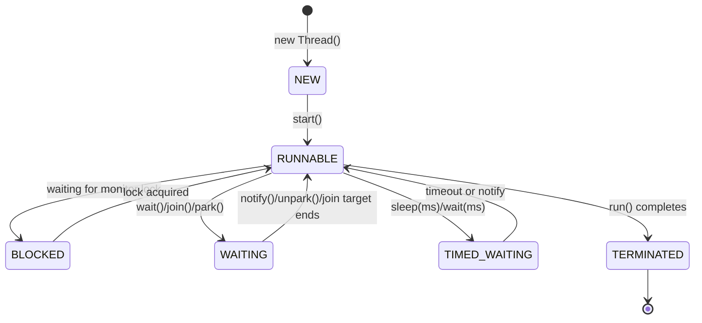

**JVM Behaviour**: `Thread.State` is a JVM-maintained abstraction layered on top of the real OS scheduling state (which has more granular states like running-on-CPU vs. ready-to-run); the JVM updates this state at well-defined points (monitor operations, `Object.wait`, `park`/`unpark`) so tools like `jstack` can produce meaningful thread dumps without querying the kernel directly.

#### Interview Questions
**Basic**
1. What are the six thread states in `Thread.State`, and what triggers each transition?
2. What's the difference between creating a `Thread` object and calling `start()` on it?

**Intermediate**
1. Can you call `start()` twice on the same `Thread` object? What happens?
2. What's the difference between `WAITING` and `TIMED_WAITING`?

**Advanced**
1. How does a thread dump (`jstack`) use the lifecycle model to help diagnose deadlocks?
2. Why is creating a new native `Thread` per task considered expensive, and how do thread pools mitigate it?

**Scenario-based**
1. A thread dump shows a thread stuck in `BLOCKED` state indefinitely. What would you investigate next?

#### Detailed Answers
1. **Six states**: `NEW` (created, not started), `RUNNABLE` (executing or ready to execute), `BLOCKED` (waiting to acquire a monitor lock), `WAITING` (waiting indefinitely for another thread's action via `wait()`/`join()`/`park()`), `TIMED_WAITING` (same but with a timeout via `sleep`/`wait(ms)`/`join(ms)`), `TERMINATED` (run() completed). Transitions are driven by `start()`, monitor contention, explicit wait/notify calls, timeouts, and `run()` completion.
2. **Object vs start()**: `new Thread(...)` merely creates a Java object describing the thread (in `NEW` state) with no underlying OS thread; `start()` is what actually asks the JVM/OS to allocate a native thread and begin executing `run()` concurrently.
3. **Calling start() twice**: Not allowed — the second call throws `IllegalThreadStateException` because a `Thread` object can only transition out of `NEW` once; you must create a fresh `Thread` instance to run the same logic again.
4. **WAITING vs TIMED_WAITING**: `WAITING` means the thread will remain blocked until another thread explicitly wakes it (notify, interrupt, thread completion) with no automatic timeout; `TIMED_WAITING` is the same concept but the thread will automatically resume after a specified duration even without external action.
5. **Thread dump for deadlocks**: `jstack` prints each thread's state, its stack trace, and (crucially) which monitor/lock it's `BLOCKED` on and who currently owns it; by cross-referencing "waiting to lock X, owned by thread T2" chains, you can detect a cycle (T1 waits for lock held by T2, T2 waits for lock held by T1) which `jstack` even auto-detects and reports as "Found one Java-level deadlock".
6. **Cost of native threads**: Each OS thread requires kernel data structures and a dedicated stack (often ~512KB-1MB reserved address space), plus context-switch overhead when the OS scheduler swaps CPU time between threads; creating/destroying thousands of them is costly in both memory and CPU. Thread pools (`ExecutorService`) amortize this cost by reusing a bounded set of long-lived threads across many short-lived tasks.
7. **Diagnosing stuck BLOCKED thread**: Take a full thread dump and look at what monitor it's blocked on and which thread currently holds it; then check that owning thread's stack — if it's waiting on a lock held (directly or transitively) by the first thread, you have a deadlock; if not, the owner may simply be stuck in a long-running or hung operation (e.g., blocked I/O) while holding the lock, which is a different problem (lock-held-too-long) rather than a true deadlock.

#### Code Examples
```java
public class LifecycleDemo {
    public static void main(String[] args) throws InterruptedException {
        Object lock = new Object();
        Thread worker = new Thread(() -> {
            synchronized (lock) {
                try {
                    lock.wait(2000); // TIMED_WAITING for up to 2s
                } catch (InterruptedException e) {
                    Thread.currentThread().interrupt();
                }
            }
        }, "worker");

        System.out.println(worker.getState()); // NEW
        worker.start();
        Thread.sleep(100);
        System.out.println(worker.getState()); // TIMED_WAITING (inside lock.wait)
        worker.join(); // main thread WAITING until worker terminates
        System.out.println(worker.getState()); // TERMINATED
    }
}
```

### States

#### Theory
**Core Concepts**: `Thread.State` is the public enum (`NEW`, `RUNNABLE`, `BLOCKED`, `WAITING`, `TIMED_WAITING`, `TERMINATED`) returned by `Thread.getState()`, giving a JVM-level snapshot of what a thread is doing right now. It's distinct from the *lifecycle* (the transition graph) — `State` is the queryable API/data model used for introspection, monitoring, and tooling.

**Internal Working**: `getState()` reads internal JVM bookkeeping (not raw OS thread state) that the JVM updates whenever a thread enters/exits a monitor, calls `wait`/`sleep`/`join`/`park`, or finishes execution.

**When to Use It**: Diagnostics/monitoring (custom health checks, thread-dump analyzers), rarely for control flow (checking state to decide program logic is an anti-pattern due to race conditions between check and use).

**Advantages**: Cheap, standardized, tool-friendly (JMX `ThreadMXBean`, `jconsole`, `jstack`, Java Flight Recorder all expose it) way to observe concurrency health without invasive instrumentation.

**Limitations**: `RUNNABLE` is ambiguous — it doesn't distinguish "actually running on a CPU core" from "ready but waiting for the OS scheduler to give it a core"; also state can change the instant after you read it (inherent TOCTOU race), so it's observational only, never safe to branch program logic on.

#### Internal Working
**Step-by-Step Explanation**: 1) JVM maintains internal per-thread status flags updated at synchronization points (monitorenter/exit, `Object.wait`, `LockSupport.park`, `Thread` completion). 2) `Thread.getState()` reads this flag and maps it to the public enum value. 3) Tools like `ThreadMXBean.dumpAllThreads()` or `jstack` aggregate this across all live threads, additionally resolving lock ownership graphs for `BLOCKED` threads to detect deadlocks.

**Memory Layout**: The state flag itself is a small piece of per-`Thread`-object metadata (not the thread's execution stack); reading it doesn't require pausing or synchronizing with the target thread — it's a best-effort read that can be stale by the time it's consumed.

**Diagrams**:
```
jstack output snippet:
"worker-1" #14 prio=5 os_prio=0 tid=0x... nid=0x... waiting on condition [0x...]
   java.lang.Thread.State: TIMED_WAITING (sleeping)
        at java.lang.Thread.sleep(Native Method)
        at com.example.Worker.run(Worker.java:22)
```

**JVM Behaviour**: `getState()` is implemented as a native call that reads JVM-internal thread state without requiring a safepoint pause of the target thread in most implementations, making it low-overhead enough to poll periodically for health monitoring, though it's still inherently racy/approximate.

#### Interview Questions
**Basic**
1. How do you query a thread's current state programmatically?
2. Is it safe to use `getState()` to decide whether it's safe to call a method on a thread?

**Intermediate**
1. Why is `RUNNABLE` considered an imprecise state?
2. What JVM tools surface `Thread.State` information, and for what purpose?

**Advanced**
1. How does `jstack` use per-thread state plus lock ownership metadata to auto-detect deadlocks?
2. Why can `getState()`'s result already be outdated by the time your code reads the return value?

**Scenario-based**
1. You want a lightweight health-check endpoint that reports whether background workers appear stuck. How would you use `Thread.State` responsibly, and what pitfalls would you avoid?

#### Detailed Answers
1. **Querying state**: Call `thread.getState()`, which returns a `Thread.State` enum value; for a broader view of all threads, `ThreadMXBean` (via `ManagementFactory.getThreadMXBean().dumpAllThreads(...)`) exposes `ThreadInfo` including state, stack trace, and lock info for every live thread.
2. **Safety for decisions**: No — state can change the instant after you read it (check-then-act race), so you should never branch critical logic ("if RUNNABLE, do X") based on it; it's for observability/diagnostics only, not synchronization control flow.
3. **Why RUNNABLE is imprecise**: The JVM's `RUNNABLE` conflates "currently executing on a CPU" with "ready and waiting in the OS scheduler's run queue for a CPU slice" — the JVM doesn't have (or expose) enough insight into OS scheduling internals to distinguish the two, so a `RUNNABLE` thread might be actively burning CPU or sitting idle waiting for its turn.
4. **Tools using Thread.State**: `jstack`/thread dumps (SIGQUIT or `jcmd Thread.print`) show each thread's state plus stack trace for post-mortem debugging; `jconsole`/VisualVM's Threads tab visualizes states live; Java Flight Recorder records state transitions over time for profiling contention; JMX `ThreadMXBean` lets custom monitoring code query state and detect programmatic deadlocks via `findDeadlockedThreads()`.
5. **jstack deadlock detection**: For each `BLOCKED` thread, the JVM tracks which monitor it's waiting to acquire and which thread currently owns that monitor; `jstack` builds a wait-for graph from these owner/waiter relationships and reports a cycle as "Found one Java-level deadlock", printing the participating threads and the locks involved.
6. **Staleness of getState()**: Reading state is not synchronized with the actual thread's execution — by definition, in a concurrent system, any observation of another thread's status is a snapshot that can be superseded by the time the observing thread acts on it; this is inherent to concurrent introspection, not a bug.
7. **Health-check scenario**: Periodically sample `getState()` for each worker thread combined with a separate "last heartbeat timestamp" the worker updates itself; flag as "stuck" only if BOTH state looks like it's not making progress (e.g., `RUNNABLE` for a very long time with no heartbeat change, or repeatedly `BLOCKED`) AND the heartbeat hasn't advanced — avoid making irreversible decisions (like killing the thread) purely from a single `getState()` snapshot.

#### Code Examples
```java
import java.lang.management.ManagementFactory;
import java.lang.management.ThreadInfo;
import java.lang.management.ThreadMXBean;

public class ThreadStateMonitor {
    public static void reportStuckThreads() {
        ThreadMXBean bean = ManagementFactory.getThreadMXBean();
        long[] deadlocked = bean.findDeadlockedThreads();
        if (deadlocked != null) {
            ThreadInfo[] infos = bean.getThreadInfo(deadlocked, true, true);
            for (ThreadInfo info : infos) {
                System.out.printf("Deadlocked: %s state=%s lock=%s owner=%s%n",
                        info.getThreadName(), info.getThreadState(),
                        info.getLockName(), info.getLockOwnerName());
            }
        }
    }
}
```

## Synchronization

### `synchronized`

#### Theory
**Core Concepts**: `synchronized` is Java's built-in mutual-exclusion keyword, usable on methods (instance or static) or as a block `synchronized (obj) { ... }`. It ensures only one thread at a time executes the protected code while holding the associated monitor, and simultaneously provides a happens-before edge (visibility) for everything accessed inside the block.

**Internal Working**: Every object has an implicit monitor (lock); entering a `synchronized` region attempts to acquire that monitor (blocking if already held by another thread), and exiting releases it.

**When to Use It**: Protecting compound/critical operations on shared mutable state where you need both mutual exclusion and simplicity, and don't need advanced features like tryLock/fairness/interruptible acquisition.

**Advantages**: Built into the language (no imports), automatically released on exception (structured, can't forget to unlock), JIT-optimized (biased/lightweight/heavyweight locking, adaptive spinning) so cheap in the uncontended case.

**Limitations**: No tryLock/timeout, no interruptible lock acquisition, no fairness guarantee, cannot be used across multiple independent conditions (only one implicit wait-set), can't span multiple methods without holding across calls, coarse-grained if used carelessly, and blocked threads cannot be interrupted out of waiting for the lock itself.

#### Internal Working
**Step-by-Step Explanation**: 1) Compiler emits `monitorenter`/`monitorexit` bytecode instructions for a synchronized block (synchronized methods use an `ACC_SYNCHRONIZED` flag instead, handled implicitly by the JVM's method invocation). 2) `monitorenter` checks the object header's lock word: if unlocked, the thread acquires it (records itself as owner, increments recursion count for reentrancy). 3) If already held by another thread, the JVM escalates through lock states — biased → lightweight (thin, via CAS on a stack-allocated lock record) → heavyweight (inflated to an OS-level monitor, via `ObjectMonitor`, using OS mutex/condvars, causing the waiting thread to actually block/park). 4) `monitorexit` releases the lock, waking one blocked thread if any (OS-level notify).

**Memory Layout**: The lock state lives in the object's header (mark word) on the heap — typically encoding biased/lightweight/heavyweight state; heavyweight locks get an associated native `ObjectMonitor` structure (off-heap, in native/C++ memory) tracking owner thread, recursion count, entry list (blocked threads), and wait set (threads that called `wait()`).

**Diagrams**:
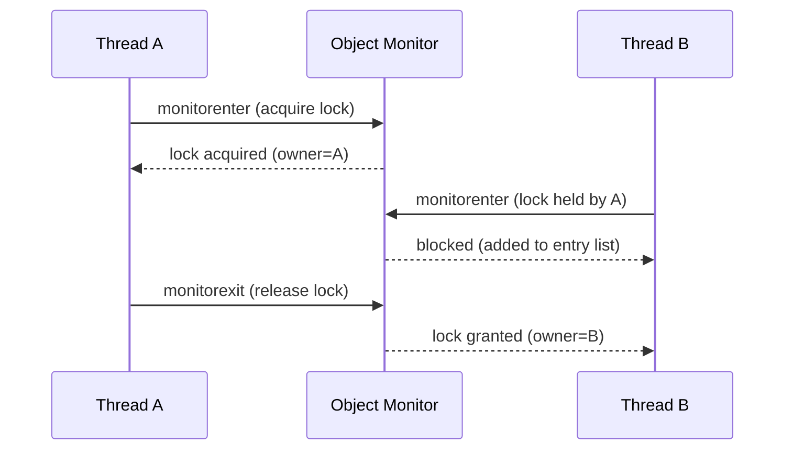

**JVM Behaviour**: The JIT can eliminate synchronization entirely via escape analysis if it proves an object never leaves the current thread (lock elision), and uses biased locking (pre-Java 15 default, since deprecated/disabled by default in newer JVMs) to make repeated single-threaded re-entry nearly free; under contention it inflates to a heavyweight OS-backed monitor with real blocking (thread parked, removed from CPU run queue) rather than busy-spinning indefinitely.

#### Interview Questions
**Basic**
1. What does the `synchronized` keyword guarantee?
2. What is the difference between synchronizing on `this` vs. a dedicated private lock object?

**Intermediate**
1. Is `synchronized` reentrant? Give an example of why that matters.
2. What happens to the lock if an exception is thrown inside a synchronized block?

**Advanced**
1. Explain the biased → lightweight → heavyweight lock escalation the JVM performs.
2. Why can synchronizing on a `String` literal or boxed `Integer` be dangerous?

**Scenario-based**
1. A class has two independent pieces of mutable state, each mutated by different, unrelated threads, but both protected by `synchronized` on `this`. What's the problem and how would you fix it?

#### Detailed Answers
1. **What synchronized guarantees**: Mutual exclusion (only one thread executes the guarded code/holds the monitor at a time) plus visibility (a happens-before edge from unlock to the next lock on the same monitor, so writes made inside are visible to the next thread that enters).
2. **this vs private lock object**: Synchronizing on `this` exposes your lock to external code (anyone with a reference to your object can `synchronized(yourObject)` and interfere/deadlock with your internal locking); using a private, final, dedicated lock object encapsulates the locking so external code cannot accidentally (or maliciously) contend on/interfere with your internal synchronization.
3. **Reentrancy**: Yes, intrinsic locks are reentrant — if a thread already holds the monitor, it can enter another synchronized block/method guarded by the same monitor without blocking on itself (the JVM tracks a recursion count). This matters because a synchronized method calling another synchronized method on the same object (common in overridden methods calling `super.method()`) would otherwise self-deadlock.
4. **Exception during synchronized block**: The JVM guarantees `monitorexit` runs even on abrupt exit via exception (compiled as an implicit exception handler around the block that ensures the lock is released), so the lock is always released — you can't leak a held intrinsic lock due to an exception, unlike manually calling `Lock.unlock()` which requires an explicit try/finally.
5. **Lock escalation**: Biased locking optimistically assumes a lock is only ever acquired by one thread and "biases" it toward that thread with a cheap header check (no CAS) for repeated re-entry; on contention from a second thread it revokes the bias and upgrades to lightweight locking, which uses a CAS on a stack-allocated lock record (spin-based, cheap, no OS involvement) assuming contention is brief; if a thread still fails to get the lock quickly, it inflates to a heavyweight monitor backed by an OS mutex/condition variable, where losing threads actually block (are descheduled) rather than spin, trading CPU spinning for context-switch overhead appropriate under real contention. (Note: biased locking is disabled by default since JDK 15.)
6. **Synchronizing on interned objects**: String literals are interned and may be shared across unrelated parts of the JVM (or even different libraries) that happen to use the same literal value, and boxed `Integer`/`Long` for small values are cached/shared (`Integer.valueOf` cache -128..127) — synchronizing on these can cause completely unrelated code to unintentionally contend on or deadlock via the same lock object, since you don't actually control who else holds a reference to that literal/cached instance.
7. **Two independent states under one lock**: Using a single monitor (`this`) for two logically unrelated pieces of state creates false contention — threads mutating state A block threads mutating unrelated state B even though there's no real conflict, hurting throughput. Fix: use two separate, dedicated private lock objects (one per independent piece of state) so unrelated operations don't serialize against each other, or use `java.util.concurrent` structures (e.g., separate `AtomicReference`s, or `ConcurrentHashMap` for independent keyed state) which naturally support fine-grained concurrency.

#### Code Examples
```java
public class BankAccount {
    private final Object balanceLock = new Object(); // dedicated lock, not exposed
    private double balance;

    public void deposit(double amount) {
        synchronized (balanceLock) {
            balance += amount; // compound read-modify-write protected
        }
    }

    public boolean withdraw(double amount) {
        synchronized (balanceLock) {
            if (balance < amount) {
                return false;
            }
            balance -= amount;
            return true;
        }
    }

    // Reentrant: calling deposit() from within another synchronized method on
    // balanceLock would not deadlock the current thread.
    public synchronized double getBalanceSynchronizedMethod() {
        return balance; // NOTE: this uses 'this' as lock - shown for contrast only
    }
}
```

### Monitor

#### Theory
**Core Concepts**: A monitor is the conceptual synchronization construct (originating from Hoare/Brinch Hansen's work) that combines mutual exclusion with condition variables for waiting/signaling. Every Java object implicitly has an associated monitor, accessed via `synchronized` and the `Object.wait()/notify()/notifyAll()` methods — together these implement the full monitor pattern: lock + wait-set.

**Internal Working**: A monitor tracks an owner thread, a recursion (entry) count, an entry list of threads blocked trying to acquire it, and a wait set of threads that called `wait()` and are waiting to be notified.

**When to Use It**: Any producer-consumer, condition-based coordination where threads must wait for a state change (queue non-empty, resource available) rather than just mutual exclusion of a critical section.

**Advantages**: Combines locking and condition-waiting in one cohesive, built-in construct without extra imports; `wait()` atomically releases the lock while waiting, avoiding missed-signal races that naive spin-and-sleep code would suffer from.

**Limitations**: Only one implicit condition (wait set) per object — you can't wait on "queue not full" separately from "queue not empty" without extra logic; must always call `wait()` in a loop (spurious wakeups, and `notifyAll` wakes everyone); no fairness or timeout-with-interruption granularity that `Lock`/`Condition` offer.

#### Internal Working
**Step-by-Step Explanation**: 1) Thread acquires monitor via `synchronized`. 2) Thread calls `obj.wait()` — this atomically releases the monitor and moves the thread to the wait set, suspending it. 3) Another thread acquires the same monitor, changes the shared condition, and calls `obj.notify()` (wakes one waiting thread, moved from wait set to entry list) or `notifyAll()` (wakes all). 4) The notifying thread eventually releases the monitor (exits synchronized block). 5) The woken thread re-acquires the monitor (competing with any other entrants) before `wait()` returns, then must re-check its condition in a loop (spurious wakeup protection).

**Memory Layout**: Backed by an `ObjectMonitor` native structure (once inflated) holding: `_owner`, `_recursions`, `_EntryList`/`_cxq` (blocked-on-entry threads), and `_WaitSet` (threads that called wait()) — these are off-heap JVM runtime structures associated with the object's header, not part of the object's own field layout.

**Diagrams**:
```mermaid
sequenceDiagram
    participant P as Producer
    participant M as Monitor (queue)
    participant C as Consumer
    C->>M: synchronized(queue); while(empty) queue.wait()
    Note over C: released lock, moved to wait set, suspended
    P->>M: synchronized(queue); queue.add(item); queue.notify()
    Note over M: consumer moved from wait set to entry list
    P->>M: exit synchronized (release lock)
    C->>M: re-acquire lock, wait() returns, re-check condition, proceed
```

**JVM Behaviour**: `wait`/`notify`/`notifyAll` are native methods on `Object` that directly manipulate the `ObjectMonitor`'s wait set using OS-level condition variables under the hood (once the lock is inflated to heavyweight); calling them outside a `synchronized` block on that object throws `IllegalMonitorStateException` because there's no monitor ownership to atomically release/reacquire.

#### Interview Questions
**Basic**
1. What is a monitor in the Java concurrency model?
2. Why must `wait()`/`notify()` be called from within a synchronized block?

**Intermediate**
1. Why should `wait()` always be called in a `while` loop rather than an `if`?
2. What's the difference between `notify()` and `notifyAll()`, and when would using `notify()` be risky?

**Advanced**
1. Explain the "lost wakeup" and "spurious wakeup" problems and how the monitor pattern guards against the former.
2. How does `wait()` avoid a race between releasing the lock and being notified?

**Scenario-based**
1. Design a bounded blocking queue using only `synchronized`/`wait`/`notifyAll` (no `java.util.concurrent`), and explain each synchronization decision.

#### Detailed Answers
1. **What is a monitor**: It's the combination of a mutual-exclusion lock plus an associated wait-set/condition mechanism that every Java object has implicitly; `synchronized` provides the lock, and `wait()/notify()/notifyAll()` provide the condition-signaling half, together forming the classic "monitor" concurrency construct.
2. **Why inside synchronized**: `wait()`/`notify()` operate on the object's monitor's internal wait set, which is only safely mutable while you hold that same monitor — calling them without holding the lock would race with other threads modifying the wait set concurrently, so the JVM enforces this by throwing `IllegalMonitorStateException` if you're not the current owner.
3. **while vs if for wait()**: Between being notified and actually resuming execution (re-acquiring the lock), another thread could have run first and changed the condition back (e.g., another consumer already consumed the item), or the thread could experience a "spurious wakeup" (JVM/OS allowed to wake a thread without any notify at all, per the JLS) — so you must re-check the actual condition in a loop after waking, not assume it's still true.
4. **notify() vs notifyAll()**: `notify()` wakes exactly one arbitrary waiting thread; `notifyAll()` wakes all of them (they then compete for the lock and re-check their condition). Using `notify()` is risky when there are multiple different logical conditions/consumer types waiting on the same monitor — you might wake a thread whose specific condition still isn't satisfiable while a thread that could actually proceed remains asleep, causing a form of missed-signal/starvation; `notifyAll()` is safer by default unless you can prove only one specific kind of waiter exists.
5. **Lost wakeup / spurious wakeup**: A "lost wakeup" happens if a notify occurs before the corresponding wait (naive code checks condition, then calls notify separately, then wait) causing the waiter to sleep forever, missing the signal; the monitor pattern guards against this because `wait()` and the condition check happen atomically within the same held lock as the update+notify, so the notifying thread cannot slip its `notify()` in between the waiter's check and its actual suspension. "Spurious wakeup" is when `wait()` returns without any notify at all (JLS explicitly permits this for some JVM/OS implementations), which is why the while-loop re-check pattern is mandatory regardless.
6. **Avoiding the wait/notify race**: `wait()` is specified to atomically release the monitor and add the thread to the wait set as one indivisible operation (from the JVM's perspective) — there's no window where the lock is released but the thread isn't yet registered as waiting, so a concurrent `notify()` from another thread (which must itself hold the lock to call notify) can never be missed between "releasing the lock" and "starting to wait".
7. **Bounded blocking queue design**: Guard both "full" and "empty" conditions with the same monitor; `put()` synchronizes, loops `while (queue.size() == capacity) wait();` then adds and calls `notifyAll()` (to wake any consumers); `take()` synchronizes, loops `while (queue.isEmpty()) wait();` then removes and calls `notifyAll()` (to wake any blocked producers). Using `notifyAll()` (not `notify()`) is important here since both producers and consumers share one wait set, and only `notifyAll` reliably wakes the right kind of waiter regardless of who's asleep.

#### Code Examples
```java
import java.util.LinkedList;
import java.util.Queue;

public class SimpleBlockingQueue<T> {
    private final Queue<T> queue = new LinkedList<>();
    private final int capacity;

    public SimpleBlockingQueue(int capacity) {
        this.capacity = capacity;
    }

    public synchronized void put(T item) throws InterruptedException {
        while (queue.size() == capacity) {
            wait(); // releases lock, waits for consumer to make room
        }
        queue.add(item);
        notifyAll(); // wake any waiting consumers (and producers, harmlessly)
    }

    public synchronized T take() throws InterruptedException {
        while (queue.isEmpty()) {
            wait(); // releases lock, waits for a producer
        }
        T item = queue.poll();
        notifyAll(); // wake any waiting producers
        return item;
    }
}
```

### Intrinsic Lock

#### Theory
**Core Concepts**: The intrinsic lock (a.k.a. monitor lock) is the built-in lock every Java object possesses implicitly, acquired/released via `synchronized` without any explicit `Lock` object. "Intrinsic" distinguishes it from the explicit `java.util.concurrent.locks.Lock` API introduced in Java 5 — both provide mutual exclusion, but the intrinsic lock is language-level (keyword-based) while `Lock` is library/API-level.

**Internal Working**: Stored/tracked via the object header's mark word (lock state bits) plus, when contended, an inflated native `ObjectMonitor`; acquisition/release is structured (block-scoped) rather than explicit method calls.

**When to Use It**: Default choice for simple mutual exclusion needs; prefer explicit `Lock` only when you need tryLock, timed/interruptible acquisition, multiple condition variables, or non-block-structured locking.

**Advantages**: Simpler syntax, cannot be forgotten to release (compiler-enforced via `monitorexit` in all exit paths including exceptions), reentrant by default, historically very well JIT-optimized (biased/lightweight locking).

**Limitations**: No fairness policy, no interruption while blocked waiting for the lock, no way to attempt-and-back-off (tryLock), single implicit condition variable, cannot lock across method boundaries without nested synchronized blocks referencing the same object.

#### Internal Working
**Step-by-Step Explanation**: 1) Every object has a mark word in its header encoding its current lock state (unlocked, biased, lightweight/thin, heavyweight/fat, or being GC'd). 2) On `synchronized` entry, the JVM attempts a fast-path CAS to record the acquiring thread (lightweight locking) using a lock record on the acquiring thread's stack. 3) On contention, the JVM inflates the lock to a heavyweight monitor with an OS-backed mutex, so losing threads block via the OS instead of spinning. 4) On exit, the JVM reverses this — releasing ownership and, for heavyweight locks, waking a waiting thread via the OS.

**Memory Layout**: Lock state lives in the 64/32-bit object header (mark word) on the heap; lightweight lock records are allocated on the acquiring thread's own stack frame (fast, no heap allocation, no OS call); heavyweight monitors are backed by native (off-heap) `ObjectMonitor` C++ objects managed by the JVM runtime.

**Diagrams**:
```
Object Header (mark word) states:
[ unlocked | biased(threadID) | lightweight(ptr to lock record) | heavyweight(ptr to ObjectMonitor) | GC ]
         start -> biased (uncontended, single-thread reentry)
         biased -> lightweight (second thread attempts CAS acquisition)
         lightweight -> heavyweight (spin/CAS fails repeatedly -> inflate, OS blocking)
```

**JVM Behaviour**: The HotSpot JIT applies escape analysis to eliminate synchronization entirely (lock elision) when it can prove an object is thread-confined; it also applies lock coarsening (merging adjacent synchronized blocks on the same object to reduce repeated lock/unlock overhead) as a JIT optimization pass.

#### Interview Questions
**Basic**
1. What's the difference between the intrinsic lock and `java.util.concurrent.locks.Lock`?
2. Is the intrinsic lock reentrant?

**Intermediate**
1. What information does the object header store regarding locking?
2. Name a scenario where you'd need `Lock` instead of the intrinsic lock.

**Advanced**
1. Explain lock coarsening and lock elision as JIT optimizations related to intrinsic locks.
2. Why can't you interrupt a thread that's blocked waiting to acquire an intrinsic lock?

**Scenario-based**
1. A service needs a lock with a timeout so it can fail fast instead of blocking forever under contention. Can you do this with `synchronized`? What would you use instead?

#### Detailed Answers
1. **Intrinsic lock vs Lock API**: The intrinsic lock is baked into the language via `synchronized` (block-structured, implicit release even on exceptions, one lock+one condition per object); `Lock`/`ReentrantLock` is an explicit API object requiring manual `lock()`/`unlock()` (typically in try/finally) but offering `tryLock()`, timed acquisition, interruptible acquisition, fairness policies, and multiple `Condition` objects per lock.
2. **Reentrancy**: Yes — if the owning thread re-enters a synchronized region guarded by the same monitor, the JVM just increments an internal recursion counter rather than blocking the thread on itself.
3. **Header locking info**: The object's mark word encodes the current lock state — whether unlocked, biased toward a specific thread ID, lightweight-locked (pointing to a lock record on some thread's stack), or heavyweight/inflated (pointing to a native `ObjectMonitor`) — plus (when unlocked) the object's identity hash code and GC age bits.
4. **Scenario needing Lock**: Needing to avoid indefinite blocking — e.g., `tryLock(timeout, unit)` to fail fast under contention, or `lockInterruptibly()` so a thread can be cancelled while waiting for a lock, both impossible with plain `synchronized`.
5. **Lock coarsening/elision**: Lock elision uses escape analysis to detect that a synchronized object never escapes the current thread (e.g., a local `StringBuffer` never shared) and removes the lock/unlock calls entirely since no other thread could ever contend for it; lock coarsening merges multiple adjacent `synchronized` blocks on the same object/lock (e.g., in a loop) into one larger critical section to reduce the overhead of repeatedly acquiring/releasing the same lock.
6. **Cannot interrupt blocked-on-monitor**: A thread blocked trying to enter a `synchronized` block (state `BLOCKED`) does not respond to `Thread.interrupt()` — the interrupt flag is set, but the thread remains blocked until it actually acquires the lock; this is a deliberate JVM design limitation of intrinsic locking that `Lock.lockInterruptibly()` was specifically created to solve.
7. **Timeout scenario**: Not possible with `synchronized` — use `ReentrantLock` with `tryLock(timeout, TimeUnit)`, which returns false if the lock isn't acquired within the deadline, letting the service fail fast, log/circuit-break, or apply backpressure instead of blocking indefinitely.

#### Code Examples
```java
import java.util.concurrent.locks.Lock;
import java.util.concurrent.locks.ReentrantLock;
import java.util.concurrent.TimeUnit;

public class TimeoutGuardedResource {
    private final Lock lock = new ReentrantLock();

    public boolean tryUpdate(Runnable criticalSection) {
        try {
            // Fails fast instead of blocking forever like synchronized would
            if (lock.tryLock(200, TimeUnit.MILLISECONDS)) {
                try {
                    criticalSection.run();
                    return true;
                } finally {
                    lock.unlock();
                }
            }
            return false; // gave up after timeout
        } catch (InterruptedException e) {
            Thread.currentThread().interrupt();
            return false;
        }
    }
}
```

### Volatile

#### Theory
**Core Concepts**: `volatile` is a field modifier that guarantees every read sees the most recent write from any thread (visibility) and prevents the compiler/CPU from reordering accesses around that field (ordering), by establishing a happens-before edge between a volatile write and every subsequent volatile read of that same field. It does NOT provide atomicity for compound operations and does NOT provide mutual exclusion.

**Internal Working**: Reads/writes of a volatile field are compiled with memory barriers that force the write to be flushed to main memory immediately and force reads to always fetch the latest value rather than a cached/register copy.

**When to Use It**: Simple flags (shutdown signals, ready flags), the classic double-checked-locking singleton reference, publishing an immutable object reference after construction, or a single independently-updated status variable that doesn't require compound read-modify-write.

**Advantages**: Much cheaper than locking (no mutual exclusion, no blocking, no OS involvement) while still solving visibility bugs; simple, no boilerplate.

**Limitations**: Does not make `x++` or `if (x == null) x = new X()` atomic; cannot coordinate multiple related fields as one unit; provides no queuing/fairness/blocking semantics.

#### Internal Working
**Step-by-Step Explanation**: 1) On write, the JIT emits a `StoreStore` barrier before the store (ensures earlier normal writes are committed first) and a `StoreLoad` barrier after (ensures the volatile write is visible before any subsequent load by any thread — the most expensive barrier, since it must drain the store buffer). 2) On read, the JIT emits a `LoadLoad`+`LoadStore` barrier (ensures subsequent reads/writes aren't reordered before this read, and forces re-fetching from memory rather than a stale cached/register value).

**Memory Layout**: The field itself lives in the object on the heap exactly like a normal field (no extra memory overhead structurally); the difference is purely in the generated machine code around accesses to it — no register caching of its value across accesses, and explicit CPU fence instructions forcing cache-coherence traffic.

**Diagrams**:
```
Normal field:  write -> may stay in register/store buffer -> read may see stale cached value
Volatile field: write -> StoreStore+StoreLoad barrier -> flushed to memory immediately
                read  -> LoadLoad+LoadStore barrier -> always re-fetched from memory
```

**JVM Behaviour**: On x86, a volatile write is often compiled as a regular `mov` followed by an `mfence` or a `lock`-prefixed no-op instruction (e.g., `lock addl $0,(%rsp)`) which acts as a full memory fence; on architectures with weaker memory models (ARM), explicit `dmb` (data memory barrier) instructions are emitted — volatile access cost is therefore architecture-dependent but always non-zero, unlike a plain field access.

#### Interview Questions
**Basic**
1. What two guarantees does `volatile` provide?
2. Does `volatile` replace the need for `synchronized`?

**Intermediate**
1. Why is `volatile int counter; counter++;` still not thread-safe?
2. Are volatile `long`/`double` writes atomic? Why does this matter historically?

**Advanced**
1. Explain the memory barriers volatile reads and writes insert, and why `StoreLoad` is considered the most expensive.
2. When is `volatile` a fully sufficient substitute for locking, and when is it not?

**Scenario-based**
1. You need a lazily-initialized, immutable, expensive-to-build cache object shared across threads, without full locking on every read. How would you use `volatile` correctly here?

#### Detailed Answers
1. **Two guarantees**: Visibility (writes are immediately visible to subsequent reads by any thread) and ordering (prevents reordering of code around the volatile access, establishing a happens-before edge) — explicitly NOT atomicity of compound operations.
2. **Does it replace synchronized?** No — it replaces synchronized only for the narrow case of simple, independent, single-variable visibility needs; it cannot provide mutual exclusion for compound/multi-step operations or coordinate multiple related fields as one atomic unit.
3. **Why counter++ still unsafe**: `counter++` is read-modify-write, i.e., three separate steps (read current, compute new value, write back); volatile guarantees each individual read/write step is immediately visible, but doesn't prevent two threads from both reading the same pre-increment value before either writes back, causing a lost update — you'd need `AtomicInteger` or `synchronized` for the compound operation.
4. **Volatile long/double atomicity**: Before Java 5 (JMM prior to JSR-133), 64-bit fields (`long`/`double`) were NOT guaranteed to be written atomically even without concurrency issues — a non-volatile 64-bit write could be split into two 32-bit writes on some JVMs, causing "word tearing" where a reader could see a corrupted mix of old and new halves. JSR-133 (Java 5+) fixed this specifically for `volatile long`/`double`, guaranteeing atomic 64-bit writes; plain (non-volatile) long/double technically still permit tearing per spec on some platforms, though virtually no modern JVM/hardware actually does this in practice.
5. **Memory barriers detail**: A volatile write needs `StoreStore` (ensures prior plain writes commit before this one, preserving program order for observers) and `StoreLoad` (ensures this write is fully visible/flushed before any subsequent load anywhere proceeds) — `StoreLoad` is the most expensive because it typically requires fully draining the CPU's store buffer to memory, which can stall the pipeline, whereas the other barrier types can often be satisfied more cheaply within a core's local ordering.
6. **When volatile suffices vs not**: Sufficient when you have one independently-read-or-written variable acting as a signal/flag/reference publication (e.g., a `volatile boolean shutdown`, or a `volatile ImmutableConfig config` reference swapped wholesale). Insufficient when: (a) the update is compound (increment, add-then-check), (b) you need to keep multiple fields consistent as one unit, or (c) you need any waiting/blocking coordination — those require `Atomic*`, `synchronized`, or `Lock`.
7. **Lazy immutable cache scenario**: Use a `volatile` reference field initialized via the double-checked locking pattern: check the volatile reference without locking (fast path for the common case once built), only synchronize to actually build it the first time, and re-check inside the lock before assigning to the volatile field — this gives cheap, lock-free reads after first initialization while remaining correct because the object being published is immutable and the reference publication happens through the volatile write/read happens-before edge.

#### Code Examples
```java
public class ExpensiveConfigCache {
    private volatile ImmutableConfig cachedConfig; // may be null initially

    public ImmutableConfig getConfig() {
        ImmutableConfig result = cachedConfig; // single volatile read (fast path)
        if (result == null) {
            synchronized (this) {
                result = cachedConfig;
                if (result == null) {
                    result = buildExpensiveConfig(); // expensive, only runs once
                    cachedConfig = result; // volatile write publishes safely
                }
            }
        }
        return result;
    }

    private ImmutableConfig buildExpensiveConfig() {
        return new ImmutableConfig(/* ... */);
    }

    static final class ImmutableConfig {
        // all fields final -> safely published once constructed
    }
}
```

### Atomic Classes

#### Theory
**Core Concepts**: `java.util.concurrent.atomic` provides lock-free, thread-safe wrapper classes (`AtomicInteger`, `AtomicLong`, `AtomicBoolean`, `AtomicReference`, `AtomicIntegerArray`, `AtomicStampedReference`, `LongAdder`, etc.) for performing atomic compound operations (increment, compare-and-set, update) on single variables without explicit locking, built on hardware compare-and-swap (CAS) instructions.

**Internal Working**: Each atomic class wraps a volatile-like field accessed through `VarHandle`/`Unsafe` intrinsics, and compound methods (`incrementAndGet`, `compareAndSet`, `updateAndGet`) are implemented as CAS retry loops rather than acquiring a lock.

**When to Use It**: High-frequency counters, statistics, flags, single-reference swaps, non-blocking algorithm building blocks (lock-free stacks/queues), whenever you'd otherwise reach for a lock just to protect one variable's compound update.

**Advantages**: No blocking/context-switching under moderate contention, avoids deadlock risk entirely (no lock ordering issues), often significantly faster than `synchronized` for simple counters, especially with `LongAdder` under heavy write contention.

**Limitations**: Only atomic for a single variable (or one reference to an immutable composite) — can't atomically update multiple independent atomics together; CAS retry storms can hurt performance under very high contention (mitigated by striping in `LongAdder`); susceptible to the ABA problem unless using stamped/markable variants.

#### Internal Working
**Step-by-Step Explanation**: 1) `incrementAndGet()` reads the current value. 2) Computes `current + 1`. 3) Issues a CAS: atomically compare memory to `current` and, if unchanged, swap in the new value; this is one indivisible hardware instruction. 4) If another thread modified the value between steps 1 and 3, the CAS fails and the loop retries from step 1. 5) `LongAdder` instead stripes updates across multiple internal cells to reduce CAS contention, summing them only when `sum()` is called, trading read-time cost for much better write-time scalability.

**Memory Layout**: The wrapped value is a plain field (often padded/cache-line-aligned in high-performance variants to avoid false sharing) on the heap; CAS operates directly on that memory location via `Unsafe.compareAndSwapInt/Long/Object` or `VarHandle.compareAndSet`, with no separate lock object or monitor involved.

**Diagrams**:
```
CAS retry loop (conceptual):
  do {
      oldValue = atomicField.get();      // volatile read
      newValue = f(oldValue);
  } while (!atomicField.compareAndSet(oldValue, newValue)); // hardware CAS
```

**JVM Behaviour**: CAS compiles to a single non-blocking hardware instruction (`lock cmpxchg` on x86, load-linked/store-conditional on ARM); no OS mutex, no thread parking, no context switch on the fast path — contention only costs extra retry iterations (pure CPU spinning), which the JVM/hardware handles far more cheaply than lock inflation and OS-level blocking for short critical sections.

#### Interview Questions
**Basic**
1. Name three classes in `java.util.concurrent.atomic` and what each protects.
2. How is `AtomicInteger.incrementAndGet()` different from `volatile int` plus `count++`?

**Intermediate**
1. Explain how CAS (compare-and-swap) works at the hardware level.
2. What is `LongAdder` and when would you prefer it over `AtomicLong`?

**Advanced**
1. Describe the ABA problem and how `AtomicStampedReference` solves it.
2. Why can CAS-based retry loops degrade under very high contention, and how does `LongAdder`'s striping mitigate this?

**Scenario-based**
1. You're building a high-throughput metrics counter incremented by hundreds of threads per second, only read once per minute for reporting. Which atomic class would you choose and why?

#### Detailed Answers
1. **Three classes**: `AtomicInteger`/`AtomicLong` (atomic numeric counters supporting increment/add/CAS), `AtomicBoolean` (atomic flag toggling), `AtomicReference<T>` (atomic swap/CAS of an object reference, useful for lock-free algorithms and immutable-object publication).
2. **AtomicInteger vs volatile+count++**: `volatile int` only guarantees visibility of each individual read/write, not atomicity of the compound increment (two threads can race and lose an update); `AtomicInteger.incrementAndGet()` performs the entire read-compute-CAS sequence as an effectively atomic unit via a retry loop, guaranteeing no lost updates even under concurrent access.
3. **CAS at hardware level**: CAS is a single atomic CPU instruction (e.g., x86's `cmpxchg` with a `lock` prefix, or ARM's load-linked/store-conditional pair) that compares a memory location's current value to an expected value and, only if they match, swaps in a new value — all as one indivisible, hardware-guaranteed operation that no other core can interleave with, backed by the cache-coherence protocol locking that cache line during the operation.
4. **LongAdder**: A specialized accumulator that internally maintains an array of separate `Cell` counters (one or more per thread/core, resized adaptively under contention) instead of a single shared value; writes (`increment()`/`add()`) go to a thread-local-ish cell, avoiding CAS contention on one hot memory location, while `sum()` walks and adds all cells together (an eventually-consistent, not instantaneous, total). Prefer it over `AtomicLong` when writes vastly outnumber reads and you don't need the read to be perfectly linearizable at every instant (e.g., metrics/counters), since it scales far better under many-threaded contention.
5. **ABA problem and fix**: A thread reads value A, gets preempted; meanwhile other threads change it A→B→A; the original thread's CAS then succeeds because the value "looks unchanged" even though it actually changed and changed back — this can corrupt algorithms that assumed "unchanged value" implies "nothing happened" (e.g., lock-free stack node reuse). `AtomicStampedReference` pairs the reference with an integer stamp that's incremented on every update, so CAS compares both the reference AND the stamp, detecting the intermediate change even if the reference value itself cycled back.
6. **CAS degradation and LongAdder mitigation**: Under very high contention, many threads simultaneously CAS-ing the same memory location causes most attempts to fail and retry, wasting CPU cycles and generating heavy cache-coherence traffic (the cache line ping-pongs between cores' caches, a phenomenon called "cache line contention"/false sharing on a hot variable). `LongAdder` mitigates this by spreading updates across multiple independent memory locations (cells), so concurrent threads mostly CAS different cells in parallel with far fewer collisions, at the cost of needing to aggregate cells when reading the total.
7. **High-throughput counter scenario**: Use `LongAdder` — writes vastly outnumber reads, and `LongAdder`'s striped-cell design scales far better under many concurrent incrementers than a single `AtomicLong`, while the occasional `sum()` read (once a minute) can tolerate the extra aggregation cost and doesn't need per-nanosecond precision.

#### Code Examples
```java
import java.util.concurrent.atomic.LongAdder;
import java.util.concurrent.atomic.AtomicReference;

public class MetricsCounter {
    // Scales far better than AtomicLong under many concurrent writer threads
    private final LongAdder requestCount = new LongAdder();
    private final AtomicReference<String> lastEndpoint = new AtomicReference<>("none");

    public void recordRequest(String endpoint) {
        requestCount.increment();
        lastEndpoint.set(endpoint); // simple atomic reference swap, no lock needed
    }

    public long getTotalRequests() {
        return requestCount.sum(); // aggregates striped cells; eventually consistent
    }
}
```

## Locks

### ReentrantLock

#### Theory
**Core Concepts**: `ReentrantLock` (in `java.util.concurrent.locks`) is an explicit, reentrant mutual-exclusion lock implementing the `Lock` interface, offering everything `synchronized` provides plus `tryLock()`, timed acquisition, interruptible acquisition, an optional fairness policy, and support for multiple `Condition` variables per lock.

**Internal Working**: Built on `AbstractQueuedSynchronizer` (AQS), which manages an internal atomic `state` integer (0 = unlocked, >0 = held with recursion count) and a CLH-variant wait queue of blocked threads.

**When to Use It**: Whenever you need tryLock/timeouts, interruptible lock acquisition, fairness, multiple wait conditions, or need to hold a lock across non-block-structured code paths (lock in one method, unlock in another).

**Advantages**: Far more flexible than `synchronized`; non-fair mode (default) offers better throughput; supports polling and diagnostics (`getQueueLength()`, `isLocked()`, `hasQueuedThreads()`).

**Limitations**: Not automatically released — you MUST manually `unlock()` in a `finally` block or you leak the lock forever; more verbose than `synchronized`; slightly higher baseline overhead in the totally uncontended case historically (though modern JVMs largely closed this gap).

#### Internal Working
**Step-by-Step Explanation**: 1) `lock()` attempts a CAS on AQS's `state` field from 0 to 1. 2) If successful, the calling thread becomes the owner (state=1); a reentrant call from the same owner just increments state further. 3) If the CAS fails (already held), the thread is wrapped in a `Node` and appended to the internal FIFO wait queue (a variant of the CLH lock queue), then parked (`LockSupport.park`) rather than busy-spinning indefinitely. 4) `unlock()` decrements state; when it reaches 0, the head of the wait queue is unparked to retry acquisition. 5) Fair locks additionally check whether the queue is non-empty before attempting acquisition (even for a fresh, uncontended call), ensuring FIFO ordering at the cost of throughput; non-fair (default) locks allow "barging" — a new arriving thread may acquire the lock before queued threads are woken, improving throughput at the cost of potential (rare, bounded) unfairness.

**Memory Layout**: AQS's `state` is a volatile int field on the heap; the wait queue is a doubly-linked list of `Node` objects (also heap-allocated) each referencing a parked `Thread`; parking/unparking is implemented via `sun.misc.Unsafe`/`LockSupport`, which under the hood use per-thread OS-level primitives (e.g., a semaphore associated with the thread) rather than a monitor.

**Diagrams**:
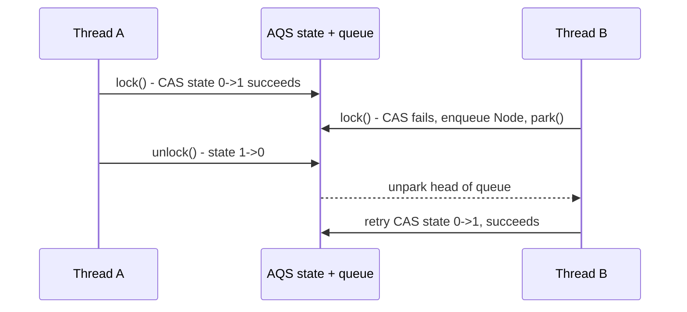

**JVM Behaviour**: `LockSupport.park()`/`unpark()` are thin wrappers over platform-specific primitives (e.g., POSIX semaphores or futex-like mechanisms on Linux) that let a thread block without holding any Java monitor, meaning parked threads don't count toward the JVM's synchronized-monitor bookkeeping and are reported distinctly (`WAITING`/`TIMED_WAITING` with a `parking to wait for` stack frame) in thread dumps.

#### Interview Questions
**Basic**
1. What does `ReentrantLock` offer beyond `synchronized`?
2. Why must `unlock()` always be called in a `finally` block?

**Intermediate**
1. What is the difference between fair and non-fair `ReentrantLock`, and which is the default?
2. How does `tryLock()` differ from `lock()`?

**Advanced**
1. Explain how `AbstractQueuedSynchronizer` (AQS) implements `ReentrantLock` internally.
2. Why might a fair lock have significantly lower throughput than a non-fair one despite "fairness" sounding desirable?

**Scenario-based**
1. Multiple threads periodically need to acquire a lock but should give up and do fallback work if they can't get it within 50ms. How would you implement this, and why can't `synchronized` do it?

#### Detailed Answers
1. **Beyond synchronized**: `tryLock()` (non-blocking attempt), `tryLock(timeout, unit)` (bounded wait), `lockInterruptibly()` (abortable via interrupt while waiting), a configurable fairness policy, multiple independent `Condition` objects (vs. one implicit wait-set), and introspection methods (`isLocked()`, `getHoldCount()`, `hasQueuedThreads()`).
2. **Why finally is mandatory**: Unlike `synchronized`, which the JVM guarantees to release even on exception via compiler-generated exception handling around `monitorexit`, `ReentrantLock.unlock()` is just a regular method call — if an exception propagates out of the critical section before `unlock()` executes, the lock is never released, permanently blocking every other thread that needs it, unless you explicitly wrap the critical section in try/finally.
3. **Fair vs non-fair**: A fair lock grants access strictly in FIFO order relative to the wait queue (even a brand-new arriving thread must queue behind already-waiting threads); a non-fair lock (the default, `new ReentrantLock()`) allows "barging" — a newly arriving thread may acquire an available lock immediately even if other threads are already queued, which usually yields much higher throughput because it avoids the overhead of always context-switching to wake the exact next queued thread.
4. **tryLock() vs lock()**: `lock()` blocks (possibly indefinitely) until the lock is acquired; `tryLock()` immediately returns `true`/`false` without blocking, letting the caller decide on a fallback if the lock isn't free; `tryLock(timeout, unit)` is the middle ground, blocking up to a bounded duration before giving up.
5. **AQS internals**: AQS maintains a single volatile `int state` (0 = free, N = held with N reentrant acquisitions) updated via CAS, plus an intrusive doubly-linked queue of `Node`s representing blocked threads (CLH-lock-derived design); `ReentrantLock`'s `Sync` inner class (extending `AbstractQueuedSynchronizer`) implements `tryAcquire`/`tryRelease` to define exactly what "acquire"/"release" mean for a mutual-exclusion lock (as opposed to, say, a semaphore or countdown latch, which reuse the same AQS machinery with different acquire/release semantics).
6. **Fair lock lower throughput**: Enforcing strict FIFO ordering means the lock must always hand off to the specific next-queued thread (via an OS-level unpark and context switch) even when another thread is already running and could grab the lock immediately with zero context-switch cost; non-fair locking lets a running thread "steal" the lock opportunistically, avoiding unnecessary context switches and dramatically improving throughput, at the cost of the (bounded, since a lock will eventually be granted to waiting threads) risk of some threads waiting longer than others.
7. **50ms fallback scenario**: Use `ReentrantLock` with `tryLock(50, TimeUnit.MILLISECONDS)`, executing the fallback path if it returns false; `synchronized` cannot do this because entering a synchronized block blocks indefinitely with no timeout mechanism and no way to abort the wait.

#### Code Examples
```java
import java.util.concurrent.locks.ReentrantLock;
import java.util.concurrent.TimeUnit;

public class RateLimitedCache {
    private final ReentrantLock lock = new ReentrantLock(); // non-fair by default
    private String cachedValue;

    public String getOrFallback(String fallback) {
        boolean acquired = false;
        try {
            acquired = lock.tryLock(50, TimeUnit.MILLISECONDS);
            if (acquired) {
                return cachedValue != null ? cachedValue : recompute();
            }
            return fallback; // give up fast rather than blocking indefinitely
        } catch (InterruptedException e) {
            Thread.currentThread().interrupt();
            return fallback;
        } finally {
            if (acquired) {
                lock.unlock(); // MUST be in finally - not automatic like synchronized
            }
        }
    }

    private String recompute() {
        cachedValue = "computed-" + System.nanoTime();
        return cachedValue;
    }
}
```

### ReadWriteLock

#### Theory
**Core Concepts**: `ReadWriteLock` (typically `ReentrantReadWriteLock`) splits locking into a shared read lock (multiple readers can hold it concurrently) and an exclusive write lock (only one writer, and no concurrent readers, may hold it). This exploits the common access pattern where reads vastly outnumber writes, allowing far more concurrency than a single mutual-exclusion lock.

**Internal Working**: Built on AQS using a single 32-bit `state` field split into two 16-bit halves — the upper bits count active readers (shared mode), the lower bits represent write-lock hold count (exclusive mode, reentrant).

**When to Use It**: Read-heavy shared data structures (caches, configuration objects, in-memory indexes) where write operations are rare but reads are frequent and would otherwise unnecessarily serialize under a plain `synchronized`/`ReentrantLock`.

**Advantages**: Multiple readers proceed truly in parallel (no contention among readers), still fully safe against reader/writer and writer/writer races; `ReentrantReadWriteLock` supports lock downgrading (acquire write, then read, then release write, retaining the read lock).

**Limitations**: Write lock acquisition must wait for ALL current readers to finish (can starve writers under continuous read load, though `ReentrantReadWriteLock` provides a fair mode to mitigate this); cannot upgrade a read lock to a write lock without releasing it first (upgrade attempts risk deadlock if two readers try simultaneously); more overhead than a single lock for genuinely write-heavy workloads.

#### Internal Working
**Step-by-Step Explanation**: 1) `readLock().lock()` performs a CAS-based shared acquire (AQS `tryAcquireShared`), incrementing the reader count portion of `state`, succeeding as long as no writer holds the lock. 2) Multiple threads can hold the read lock simultaneously since each just increments the shared counter. 3) `writeLock().lock()` requires the entire `state` to be zero (no readers, no writer) via exclusive CAS — it must wait for all current readers to release. 4) While a writer holds the lock, new read-lock or write-lock attempts block (queued in AQS) until the writer releases, restoring `state` to zero and waking waiters (readers together, or one writer, depending on fairness policy).

**Memory Layout**: A single volatile `int state` field encodes both counts (e.g., upper 16 bits = shared/reader hold count, lower 16 bits = exclusive/writer hold count) — clever bit-packing lets AQS's existing CAS-based state management support this dual-mode lock without separate synchronization structures.

**Diagrams**:
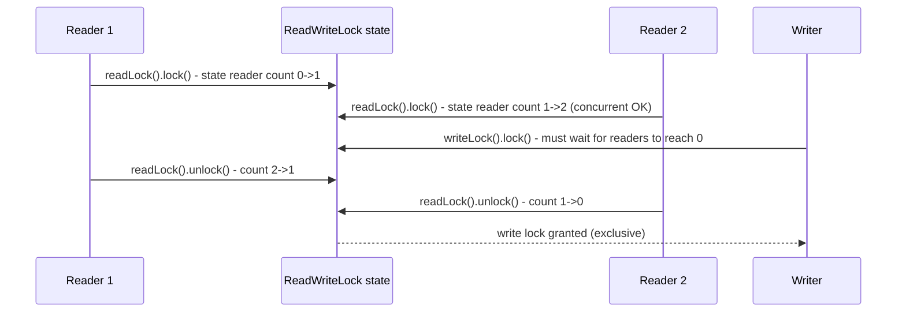

**JVM Behaviour**: Both read and write acquisitions go through the same AQS park/unpark machinery as `ReentrantLock`; the JIT has no special-case optimization here beyond what it already does for AQS-based synchronizers — the performance win is purely architectural (allowing true reader parallelism) rather than a JIT trick.

#### Interview Questions
**Basic**
1. What problem does `ReadWriteLock` solve compared to a single `ReentrantLock`?
2. Can multiple threads hold the read lock at the same time? Can a thread hold both read and write locks simultaneously?

**Intermediate**
1. What is "lock downgrading" and why is it supported but "upgrading" is not (safely)?
2. What is writer starvation in the context of `ReadWriteLock`, and how can it be mitigated?

**Advanced**
1. Explain how `ReentrantReadWriteLock` packs reader count and writer hold count into a single AQS `state` field.
2. When would a `ReadWriteLock` actually perform *worse* than a plain `ReentrantLock`?

**Scenario-based**
1. A configuration object is read thousands of times per second by request-handling threads and reloaded from disk roughly once a minute. Design the locking strategy.

#### Detailed Answers
1. **Problem solved**: A single exclusive lock forces even read-only operations to serialize against each other unnecessarily; `ReadWriteLock` allows many concurrent readers (since they don't mutate shared state and can't conflict with each other) while still fully serializing writers against both other writers and all readers, improving throughput dramatically for read-dominated workloads.
2. **Concurrent holding**: Yes, multiple threads can hold the read lock concurrently (shared mode). A single thread CAN hold both if it acquires the write lock and then, while still holding it, acquires the read lock too (this is the "downgrading" pattern) — but a thread cannot hold the write lock concurrently with OTHER threads holding read or write locks.
3. **Lock downgrading vs upgrading**: Downgrading (hold write lock → acquire read lock → release write lock, now holding only the read lock) is safe because the thread never gives up exclusive access before regaining some form of lock — it transitions atomically without a gap. Upgrading (hold read lock → try to acquire write lock) is not directly supported because if two threads both hold the read lock and both try to upgrade to the write lock simultaneously, neither can proceed since each is waiting for the other's read lock to be released — a guaranteed deadlock; you must release the read lock first and then re-acquire the write lock (with no atomicity guarantee across that gap).
4. **Writer starvation**: Under continuous/steady read load, new readers can keep arriving and acquiring the read lock while a waiting writer never sees a moment when the reader count reaches zero, potentially waiting indefinitely. `ReentrantReadWriteLock`'s fair mode mitigates this by making new readers queue behind an already-waiting writer instead of barging ahead, ensuring the writer eventually gets its turn.
5. **State packing**: `ReentrantReadWriteLock`'s `Sync` class splits the 32-bit AQS `state` field via bit-shifting — the upper 16 bits represent the shared (reader) hold count and the lower 16 bits represent the exclusive (writer) hold count; acquiring a read lock does `state += (1 << 16)` conceptually (via CAS), while acquiring the write lock does `state += 1` on the lower bits, letting one atomic field track both without separate locks.
6. **When it's worse**: If writes are frequent (comparable to or more common than reads), the extra bookkeeping/overhead of read-write lock logic (and the fact that writers must wait for a fully-drained reader count) outperforms nothing over a plain `ReentrantLock`, while adding complexity; in write-heavy or roughly-balanced workloads, a single lock is simpler and can be just as fast or faster since there's little reader-parallelism benefit to capture.
7. **Config object scenario**: Use `ReentrantReadWriteLock` — request-handling threads call `readLock().lock()` to read the config (allowing massive read parallelism since reads vastly dominate), while the reload task calls `writeLock().lock()` once a minute to atomically swap in the new configuration, briefly blocking readers only during that rare update; optionally use a fair `ReadWriteLock` if reload latency must be bounded despite continuous read traffic.

#### Code Examples
```java
import java.util.concurrent.locks.ReadWriteLock;
import java.util.concurrent.locks.ReentrantReadWriteLock;

public class ConfigCache {
    private final ReadWriteLock rwLock = new ReentrantReadWriteLock();
    private Config currentConfig = Config.loadFromDisk();

    public Config getConfig() {
        rwLock.readLock().lock(); // many threads can hold this concurrently
        try {
            return currentConfig;
        } finally {
            rwLock.readLock().unlock();
        }
    }

    public void reload() {
        Config fresh = Config.loadFromDisk(); // expensive I/O done outside the lock
        rwLock.writeLock().lock(); // exclusive: waits for all readers to finish
        try {
            currentConfig = fresh;
        } finally {
            rwLock.writeLock().unlock();
        }
    }

    static class Config {
        static Config loadFromDisk() { return new Config(); }
    }
}
```

### StampedLock

#### Theory
**Core Concepts**: `StampedLock` (Java 8+) is a capability-based lock offering three modes: exclusive write, pessimistic (blocking) read, and optimistic read — the latter being its key innovation: an optimistic read does not block writers at all and only validates afterward whether a write occurred concurrently, avoiding lock overhead entirely in the common uncontended case. It is NOT reentrant, unlike `ReentrantLock`/`ReentrantReadWriteLock`.

**Internal Working**: Every successful acquisition returns a `long` "stamp" encoding lock mode/version; optimistic reads grab a stamp without blocking, do their work, then call `validate(stamp)` to check whether a write happened in between — if so, the caller must fall back to a full (pessimistic) read lock and retry.

**When to Use It**: Extremely read-hot data structures (e.g., geometric/point coordinates, high-frequency read caches) where you want to eliminate even the reader-side CAS/memory-barrier cost of `ReentrantReadWriteLock` for the common case.

**Advantages**: Optimistic reads have near-zero overhead (no CAS, no blocking) when uncontended; often significantly outperforms `ReentrantReadWriteLock` under heavy read concurrency; supports lock mode conversion via `tryConvertToWriteLock`/`tryConvertToReadLock`.

**Limitations**: Not reentrant (re-acquiring within the same thread can deadlock); doesn't support `Condition`; more complex and error-prone API (must remember to validate optimistic reads, and to correctly release the exact stamp obtained); not interruptible in the same way as `Lock`; misuse can silently produce subtly wrong results if validation is skipped.

#### Internal Working
**Step-by-Step Explanation**: 1) `tryOptimisticRead()` returns a non-zero stamp representing the current lock "version" if no writer currently holds the lock (no blocking, no CAS — just reads a version counter). 2) The caller reads shared fields into local variables (without any lock held). 3) The caller calls `validate(stamp)` — if no write lock was acquired/released during that window, it returns true and the locally-read values are safe to use as a consistent snapshot. 4) If validation fails (a writer intervened), the caller falls back to `readLock()` (a real, blocking pessimistic read lock) and re-reads the data. 5) `writeLock()` acquires an exclusive stamp, incrementing the internal version/state so concurrent optimistic readers' subsequent `validate()` calls will fail.

**Memory Layout**: Internally tracks a `state` similar to AQS-style synchronizers, encoding a version stamp plus lock mode bits; unlike AQS-based locks it does not extend `AbstractQueuedSynchronizer` directly — it has a custom internal implementation with its own wait queue for blocking modes, while optimistic reads never touch the queue at all.

**Diagrams**:
```mermaid
sequenceDiagram
    participant R as Reader (optimistic)
    participant L as StampedLock
    participant W as Writer
    R->>L: stamp = tryOptimisticRead()
    R->>R: read x, y into locals (no lock held)
    W->>L: writeLock() - acquires exclusive, bumps version
    W->>L: mutate x, y; unlock()
    R->>L: validate(stamp) - FALSE (writer intervened)
    R->>L: fallback: readLock() (blocking), re-read x, y, unlock()
```

**JVM Behaviour**: The optimistic-read fast path involves just a plain volatile-like read of the version stamp with no CAS and no memory barrier pair beyond that single read, making it extremely cheap and highly amenable to CPU branch prediction/pipelining when writes are rare; the pessimistic fallback path behaves similarly to other AQS-style locks (park/unpark on contention).

#### Interview Questions
**Basic**
1. What are the three locking modes `StampedLock` supports?
2. Is `StampedLock` reentrant? What's the practical implication?

**Intermediate**
1. What is an "optimistic read" and why is it faster than a pessimistic read lock?
2. What must you always do after an optimistic read before trusting the data you read?

**Advanced**
1. Walk through what happens if `validate()` fails after an optimistic read — what should the calling code do?
2. Why is `StampedLock` generally faster than `ReentrantReadWriteLock` under very high read concurrency?

**Scenario-based**
1. You're implementing a mutable 2D point class accessed by a physics simulation with a single writer thread and many reader threads reading (x, y) every frame. Design the locking using `StampedLock`.

#### Detailed Answers
1. **Three modes**: Exclusive write lock (`writeLock()`), pessimistic (blocking) read lock (`readLock()`), and optimistic read (`tryOptimisticRead()`) which doesn't block at all and requires post-hoc validation.
2. **Reentrancy**: No, `StampedLock` is NOT reentrant — if a thread already holding a lock tries to acquire it again (even the same mode), it can deadlock (pessimistic modes) or simply get useless/incorrect stamps; this is a critical difference from `ReentrantLock`/`ReentrantReadWriteLock` and a common source of bugs when migrating code.
3. **Optimistic read speed**: It never blocks and never uses CAS or acquires any actual lock state — it just reads a version stamp (a plain read), lets the caller read the data without any synchronization overhead, and defers the "was this safe?" check to a cheap post-hoc comparison (`validate()`); this avoids all the cost of coordinating with potential writers up front, which is why it's faster than even a `ReadWriteLock`'s read lock (which still does CAS-based bookkeeping) in the uncontended common case.
4. **After optimistic read**: You MUST call `validate(stamp)` before trusting any data read during the optimistic window — if it returns false, the values you read may be inconsistent/torn because a writer ran concurrently, and you must discard them and retry (typically falling back to a full pessimistic read lock).
5. **Validation failure handling**: If `validate()` returns false, the calling code should NOT use the locally read values (they may reflect a partially-updated or torn state); it should fall back by calling `readLock()` to acquire a real blocking read lock, re-read the fields under that lock's protection, then `unlockRead()` — guaranteeing a consistent read even though it cost more in the (rare) contended case.
6. **Why faster than ReadWriteLock at scale**: `ReentrantReadWriteLock`'s read lock still requires a CAS to increment the shared reader count (real synchronization state mutation, with associated cache-coherence traffic across cores as many readers all CAS the same state field), while `StampedLock`'s optimistic read only performs a plain read of a version stamp with no CAS at all — under many concurrent readers, avoiding that shared CAS point entirely removes a significant contention/cache-line-bouncing bottleneck.
7. **2D point scenario**: Store x/y as plain (non-volatile is fine here since access is mediated by the lock) fields; readers call `tryOptimisticRead()`, read x and y into locals, then `validate(stamp)` — if valid, use the values (near-zero overhead, ideal since there are many readers per frame); if invalid (rare, since there's a single writer), fall back to `readLock()` to safely re-read; the single writer thread simply calls `writeLock()`, updates x/y, then `unlockWrite()` each frame.

#### Code Examples
```java
import java.util.concurrent.locks.StampedLock;

public class Point {
    private final StampedLock lock = new StampedLock();
    private double x, y;

    public void move(double dx, double dy) { // single writer thread
        long stamp = lock.writeLock();
        try {
            x += dx;
            y += dy;
        } finally {
            lock.unlockWrite(stamp);
        }
    }

    public double distanceFromOrigin() { // many concurrent reader threads
        long stamp = lock.tryOptimisticRead(); // non-blocking, near-zero cost
        double currentX = x, currentY = y;
        if (!lock.validate(stamp)) { // writer intervened - fall back safely
            stamp = lock.readLock();
            try {
                currentX = x;
                currentY = y;
            } finally {
                lock.unlockRead(stamp);
            }
        }
        return Math.sqrt(currentX * currentX + currentY * currentY);
    }
}
```

## Executors

### Executor

#### Theory
**Core Concepts**: `Executor` is the simplest interface in `java.util.concurrent`, defining a single method `execute(Runnable command)` that decouples task *submission* from task *execution* mechanics (thread creation, pooling, scheduling). It's the root abstraction that `ExecutorService`, `ScheduledExecutorService`, and thread pool implementations all build upon.

**Internal Working**: An `Executor` implementation decides how/when/where to run the submitted `Runnable` — synchronously in the caller's thread, on a new thread, or on a pooled worker thread — the interface itself makes no guarantees about this.

**When to Use It**: As the abstraction type in APIs that submit work but shouldn't care about threading details, or for the simplest possible "fire and forget" task submission when you don't need futures, shutdown lifecycle, or scheduling.

**Advantages**: Minimal, decouples calling code from execution policy (you can swap a direct-call executor for a pooled one without changing callers), foundational for the Java concurrency utilities.

**Limitations**: No return value/`Future`, no way to know when a task completes, no shutdown/lifecycle management, no batch submission — for anything beyond simple fire-and-forget, you need `ExecutorService`.

#### Internal Working
**Step-by-Step Explanation**: 1) Calling code obtains an `Executor` reference (often via dependency injection, decoupled from the concrete implementation). 2) It calls `execute(runnable)`. 3) The concrete `Executor` implementation decides execution policy — e.g., `Executors.newFixedThreadPool()`'s underlying `ThreadPoolExecutor` enqueues the task and a worker thread picks it up, while a naive custom `Executor` might just call `new Thread(runnable).start()` or even `runnable.run()` synchronously.

**Memory Layout**: The `Runnable` task object itself is heap-allocated (often a lambda capturing enclosing variables, which the compiler turns into a synthetic class instance holding captured references); depending on the implementation, it may be temporarily held in an internal queue (heap) before a worker thread's stack executes it.

**Diagrams**:
```
caller -> Executor.execute(task) -> [implementation-specific] -> task.run() executes somewhere
                                        |-> direct executor: runs on caller's thread, synchronously
                                        |-> new-thread executor: spawns a new Thread per call
                                        |-> pooled executor: enqueues, worker thread dequeues+runs
```

**JVM Behaviour**: No special JVM-level behavior beyond ordinary method dispatch and (for pooled implementations) the same thread-scheduling/lock/queue machinery used elsewhere in `java.util.concurrent`; the interface itself is just a functional interface (single abstract method), so lambdas can be passed directly to `execute`.

#### Interview Questions
**Basic**
1. What single method does the `Executor` interface define?
2. How does `Executor` differ from directly calling `new Thread(runnable).start()`?

**Intermediate**
1. Why is decoupling task submission from execution policy valuable in API design?
2. Give an example of a trivial custom `Executor` implementation and what it would be useful for (e.g., testing).

**Advanced**
1. How does `Executor` relate to and differ from `ExecutorService` in the interface hierarchy?
2. Why is `Executor` a functional interface, and what benefit does that give callers in modern Java?

**Scenario-based**
1. You're writing a library that needs to run callback code but shouldn't dictate whether it runs on a background thread pool or the calling thread. How would you design the API using `Executor`?

#### Detailed Answers
1. **Single method**: `void execute(Runnable command)` — submits a task for eventual execution, with no return value and no guarantee of when/how it runs.
2. **vs new Thread(...).start()**: Directly spawning a thread ties the caller to thread-creation cost and lifecycle management every single time; `Executor` abstracts this away so the caller doesn't know or care whether the task runs on a new thread, a pooled thread, or synchronously — letting the execution policy be swapped independently (e.g., replacing an ad-hoc thread-per-task approach with a bounded pool without touching calling code).
3. **Value of decoupling**: It follows the dependency-inversion/single-responsibility principles — code that needs "something to run this task eventually" shouldn't also need to know about thread pool sizing, queuing policy, or thread naming; injecting an `Executor` lets you tune/replace execution strategy (e.g., swap a fixed pool for a work-stealing pool) without touching business logic.
4. **Trivial custom Executor example**: A "direct" executor `Runnable::run` (run synchronously on the calling thread) is extremely useful in unit tests to make asynchronous code deterministic and easy to assert on, without needing to coordinate with real background threads or add sleeps/latches.
5. **Executor vs ExecutorService**: `Executor` is the minimal root interface (just `execute`); `ExecutorService` extends it, adding lifecycle management (`shutdown()`, `shutdownNow()`, `awaitTermination()`) and richer submission methods that return `Future` (`submit()`, `invokeAll()`, `invokeAny()`) — essentially, `Executor` is submission-only, `ExecutorService` is a full-featured managed task execution service.
6. **Functional interface benefit**: Since `Executor` has exactly one abstract method, it's a valid target for a lambda expression, so callers can pass `task -> new Thread(task).start()` or `Runnable::run` directly as an `Executor` without writing a full anonymous class — concise and expressive, particularly handy for tests or simple custom policies.
7. **Library API scenario**: Accept an `Executor` as a constructor/method parameter (dependency injection) with a sensible default (e.g., a shared pool), and internally call `executor.execute(() -> invokeCallback(...))` — this lets consumers of the library supply their own `Executor` (a real thread pool in production, a direct/synchronous executor in tests) without the library needing any conditional logic.

#### Code Examples
```java
import java.util.concurrent.Executor;
import java.util.concurrent.Executors;

public class NotificationService {
    private final Executor executor;

    public NotificationService(Executor executor) {
        this.executor = executor; // caller decides the execution policy
    }

    public void notifyAsync(String message) {
        executor.execute(() -> sendNotification(message)); // fire and forget
    }

    private void sendNotification(String message) {
        System.out.println("Sending: " + message);
    }

    public static void main(String[] args) {
        // Production: background pooled execution
        NotificationService prodService = new NotificationService(Executors.newCachedThreadPool());
        prodService.notifyAsync("Order shipped");

        // Testing: synchronous, deterministic execution on the calling thread
        NotificationService testService = new NotificationService(Runnable::run);
        testService.notifyAsync("Test notification");
    }
}
```

### ExecutorService

#### Theory
**Core Concepts**: `ExecutorService` extends `Executor` with full task-execution lifecycle management: submitting tasks that return results (`submit()` returning `Future<T>`), batch submission (`invokeAll`/`invokeAny`), and orderly/forced shutdown (`shutdown()`/`shutdownNow()`/`awaitTermination()`). It's the standard, idiomatic way to run asynchronous/concurrent work in Java rather than managing raw `Thread` objects.

**Internal Working**: Concrete implementations (most commonly `ThreadPoolExecutor` or `ForkJoinPool`) maintain a pool of worker threads pulling tasks from an internal queue; `submit()` wraps the task in a `FutureTask` that tracks completion/result/exception.

**When to Use It**: Virtually all application-level concurrent task execution — request handling, background jobs, parallel batch processing — instead of manually creating/managing `Thread` objects.

**Advantages**: Reuses threads (avoiding costly repeated OS thread creation), provides `Future`-based result/exception handling, supports graceful shutdown, decouples task submission from thread management policy, integrates with `CompletableFuture` for composition.

**Limitations**: Must be shut down explicitly (forgetting `shutdown()` leaks threads and can prevent JVM exit for non-daemon pools); unbounded queues can cause OOM under sustained overload; exceptions thrown in `execute()`-submitted tasks are swallowed/logged to the default handler rather than propagated, unlike `submit()` which captures them in the `Future`.

#### Internal Working
**Step-by-Step Explanation**: 1) `submit(Callable/Runnable)` wraps the task in a `FutureTask`, which is both a `Runnable` (so the pool can execute it) and a `Future` (so the caller can retrieve the result/exception later). 2) The `FutureTask` is handed to the underlying `Executor.execute()`, which enqueues it. 3) A worker thread dequeues and runs it, capturing the return value or any thrown exception inside the `FutureTask`'s internal state. 4) Calling `future.get()` blocks (or times out) until the task completes, then returns the result or rethrows the exception wrapped in `ExecutionException`. 5) `shutdown()` stops accepting new tasks but lets queued/running tasks finish; `shutdownNow()` attempts to cancel running tasks (via interrupt) and returns unexecuted tasks; `awaitTermination()` blocks until all tasks finish or the timeout elapses.

**Memory Layout**: The task queue (heap-allocated, e.g., `LinkedBlockingQueue`) holds pending `Runnable`/`FutureTask` objects; each worker thread has its own OS thread stack; the `ExecutorService` object itself holds references to the thread pool's worker `Thread` objects and the queue, keeping them alive as long as the service isn't shut down and garbage collected.

**Diagrams**:
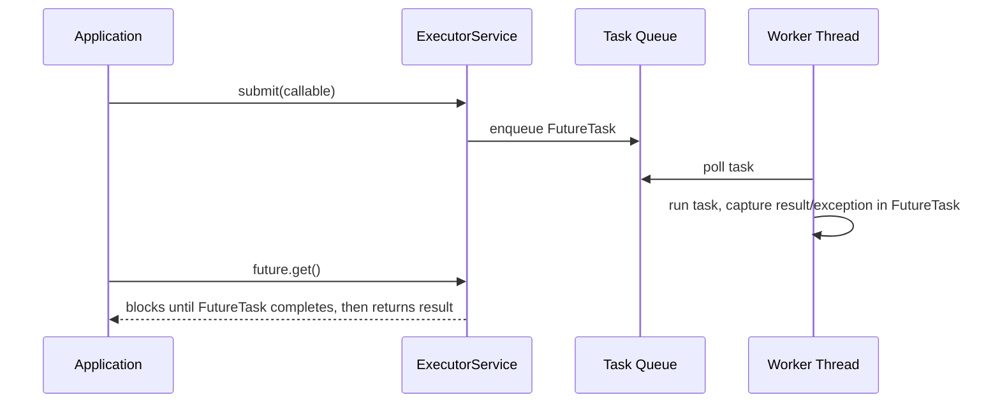

**JVM Behaviour**: Worker threads are ordinary JVM threads (can be made daemon via a custom `ThreadFactory`, important because non-daemon threads in a pool will prevent JVM shutdown until `shutdown()`+termination); exceptions thrown inside `Callable`/`Runnable` tasks submitted via `submit()` do not propagate to any uncaught-exception handler — they're captured silently inside the `Future` until `get()` is called, a common source of "swallowed exception" bugs when developers forget to call `get()` or check for failures.

#### Interview Questions
**Basic**
1. What's the difference between `execute()` and `submit()` on `ExecutorService`?
2. What's the difference between `shutdown()` and `shutdownNow()`?

**Intermediate**
1. What happens to an exception thrown inside a task submitted via `submit()` if you never call `get()` on the returned `Future`?
2. How does `invokeAll()` differ from submitting each task individually and collecting futures yourself?

**Advanced**
1. Why must you always shut down an `ExecutorService`, and what happens if you don't?
2. How would you implement a graceful shutdown that gives in-flight tasks a bounded time to finish before forcefully cancelling them?

**Scenario-based**
1. A web service dispatches request-handling tasks to an `ExecutorService` backed by a bounded queue. Under a traffic spike, the queue fills up. What happens next, and what strategies mitigate this?

#### Detailed Answers
1. **execute() vs submit()**: `execute(Runnable)` (inherited from `Executor`) is fire-and-forget with no return value — any uncaught exception goes to the thread's `UncaughtExceptionHandler` (often just printed to stderr); `submit()` (Runnable or Callable) returns a `Future`, capturing both the result and any thrown exception for later retrieval via `get()`, but that exception will NOT surface anywhere unless you call `get()`.
2. **shutdown() vs shutdownNow()**: `shutdown()` initiates an orderly shutdown — no new tasks accepted, but previously submitted (queued and running) tasks are allowed to complete; `shutdownNow()` attempts to stop all actively executing tasks (via `Thread.interrupt()`, which only works if the task honors interruption), halts processing of queued tasks, and returns the list of tasks that were never started.
3. **Silent exception loss**: If a task submitted via `submit()` throws and you never call `get()` (or `isDone()`+`get()`), the exception is simply stored inside the `Future`/`FutureTask` and never surfaces anywhere — it's effectively silently swallowed, which is a very common production bug ("my background task is failing but nothing logs it"). Best practice: always check/log the result of submitted futures, or use `execute()` with an explicit try/catch + logging inside the task itself.
4. **invokeAll() vs manual futures**: `invokeAll(Collection<Callable<T>>)` submits all tasks and blocks until ALL complete (or the optional timeout elapses), returning a `List<Future<T>>` in the same order as the input — it handles the submission and "wait for all" bookkeeping atomically/conveniently for you; manually submitting each task and collecting `Future`s yourself requires you to loop and call `get()` on each, and gives you more flexibility (e.g., to process results as they complete rather than waiting for all) but more boilerplate.
5. **Why shutdown is mandatory**: An `ExecutorService`'s worker threads are typically non-daemon by default, meaning the JVM will not exit while they're alive; forgetting to call `shutdown()` leaks a thread pool indefinitely (threads sit parked waiting for more work forever), which both wastes resources and can prevent your application (or, notably, unit test JVMs) from terminating.
6. **Graceful shutdown pattern**: Call `shutdown()` (stop accepting new work), then `awaitTermination(timeout, unit)` to give in-flight tasks a bounded grace period to finish; if it returns false (timeout elapsed with tasks still running), call `shutdownNow()` to forcibly interrupt remaining tasks, then optionally call `awaitTermination()` again briefly to confirm they actually stopped.
7. **Bounded queue overload scenario**: Once the bounded queue is full, further `submit()`/`execute()` calls trigger the configured `RejectedExecutionHandler` (default `AbortPolicy` throws `RejectedExecutionException`); mitigation strategies include: using `CallerRunsPolicy` to apply backpressure by running the task on the submitting thread (naturally throttling the request rate), scaling the pool size/queue capacity appropriately, shedding load with a custom rejection handler that returns a fast "503 busy" response, or adding an upstream rate limiter/circuit breaker.

#### Code Examples
```java
import java.util.concurrent.*;
import java.util.List;
import java.util.ArrayList;

public class ExecutorServiceDemo {
    public static void main(String[] args) throws InterruptedException {
        ExecutorService pool = Executors.newFixedThreadPool(4);
        List<Callable<Integer>> tasks = new ArrayList<>();
        for (int i = 1; i <= 5; i++) {
            int n = i;
            tasks.add(() -> n * n); // simulate CPU work
        }

        List<Future<Integer>> results = pool.invokeAll(tasks); // waits for all to complete
        for (Future<Integer> f : results) {
            try {
                System.out.println("Result: " + f.get());
            } catch (ExecutionException e) {
                System.err.println("Task failed: " + e.getCause());
            }
        }

        // Graceful shutdown with bounded grace period, then force cancel
        pool.shutdown();
        if (!pool.awaitTermination(5, TimeUnit.SECONDS)) {
            pool.shutdownNow();
        }
    }
}
```

### ScheduledExecutor

#### Theory
**Core Concepts**: `ScheduledExecutorService` extends `ExecutorService` to support delayed and periodic task execution (`schedule()`, `scheduleAtFixedRate()`, `scheduleWithFixedDelay()`), replacing the legacy `java.util.Timer`/`TimerTask` with a pool-backed, exception-resilient alternative.

**Internal Working**: Backed by `ScheduledThreadPoolExecutor`, which uses a `DelayedWorkQueue` (a priority heap ordered by next-execution time) instead of a plain FIFO queue — worker threads block until the earliest-scheduled task's delay expires.

**When to Use It**: Recurring background jobs (cache eviction sweeps, health checks, metrics flushing, retry-with-backoff) within an application, replacing `Timer` entirely.

**Advantages**: Multiple worker threads (unlike single-threaded `Timer`, so one slow/stuck task doesn't block other scheduled tasks); an uncaught exception in one scheduled task doesn't kill the whole scheduler (unlike `Timer`, where an uncaught exception in one `TimerTask` terminates the entire timer thread, silently cancelling all future tasks).

**Limitations**: `scheduleAtFixedRate`/`scheduleWithFixedDelay` do not "catch up" missed executions by running multiple times back-to-back — if a task overruns its period, the next execution is simply delayed, not queued in parallel; still needs explicit `shutdown()` like any `ExecutorService`; exceptions thrown from a periodic task silently cancel that specific task's future recurrences unless caught internally.

#### Internal Working
**Step-by-Step Explanation**: 1) `schedule(task, delay, unit)` wraps the task in a `ScheduledFutureTask` recording its target execution time, and inserts it into the `DelayedWorkQueue` (a heap ordered by that time). 2) Worker threads call `queue.take()`, which blocks until the head element's delay has elapsed. 3) For `scheduleAtFixedRate`, after each execution the task re-computes its next trigger time as `initialTime + N * period` (so it tries to maintain a constant rate regardless of individual execution duration, but never overlaps executions — if an execution overruns the period, the next one starts immediately after, not concurrently). 4) For `scheduleWithFixedDelay`, the next trigger time is computed as `completionTime + delay` (a constant gap after each execution finishes) — fundamentally different scheduling semantics.

**Memory Layout**: The `DelayedWorkQueue` is a heap-allocated binary heap array (like `PriorityQueue`) of `ScheduledFutureTask` objects, reordered on insertion/removal by next-execution timestamp; worker threads' stacks briefly execute each task's `run()` method before returning to poll the queue again.

**Diagrams**:
```
DelayedWorkQueue (min-heap by next execution time):
  [task@t=100ms, task@t=250ms, task@t=400ms, ...]
Worker thread: take() blocks until earliest time reached -> execute -> if periodic, reinsert with new time

scheduleAtFixedRate(task, initialDelay=0, period=100ms):
  runs at t=0, t=100, t=200, t=300 ... (attempts constant rate; a slow run just delays the next start)
scheduleWithFixedDelay(task, initialDelay=0, delay=100ms):
  runs, waits 100ms after completion, runs again, waits 100ms, ... (constant gap after each run)
```

**JVM Behaviour**: Worker threads park (via the queue's internal `Condition.awaitNanos`) rather than busy-wait for the next scheduled time, so idle scheduled executors consume negligible CPU; an uncaught `RuntimeException` inside a scheduled task causes that specific `ScheduledFutureTask` to be silently cancelled (future recurrences stop) without affecting other tasks or worker threads, unlike `Timer`'s single-thread-kills-everything failure mode.

#### Interview Questions
**Basic**
1. What are the two main scheduling methods on `ScheduledExecutorService` and how do they differ?
2. Why is `ScheduledExecutorService` generally preferred over `java.util.Timer`?

**Intermediate**
1. If a task scheduled with `scheduleAtFixedRate` takes longer than the period to run, what happens to subsequent executions?
2. What happens to future recurrences of a periodic task if it throws an uncaught exception?

**Advanced**
1. Explain the internal `DelayedWorkQueue` data structure and why it's suited for scheduling.
2. How would you implement exponential backoff retry logic using `ScheduledExecutorService`?

**Scenario-based**
1. You need a cache-eviction sweep to run every 30 seconds, and the sweep itself sometimes takes 45 seconds under load. Which scheduling method should you use, and what are the implications?

#### Detailed Answers
1. **Two scheduling methods**: `scheduleAtFixedRate(task, initialDelay, period, unit)` targets a constant *rate* — executions are meant to start every `period` regardless of how long each execution takes (though it won't run overlapping executions concurrently); `scheduleWithFixedDelay(task, initialDelay, delay, unit)` targets a constant *gap* — the next execution starts `delay` after the previous one *finishes*, so total cycle time grows if execution time grows.
2. **Why preferred over Timer**: `Timer` uses a single background thread for all `TimerTask`s — one long-running or exception-throwing task delays or permanently kills scheduling for everything else on that `Timer`. `ScheduledExecutorService` uses a pool of threads (configurable size) and isolates failures per task, so it's both more scalable and more resilient.
3. **Overrunning fixed-rate task**: The scheduler does not run overlapping instances concurrently — if an execution takes longer than the period, the next execution is simply delayed until the current one finishes (it starts immediately after, rather than running in parallel or "catching up" with multiple queued runs), so the effective rate silently degrades but no concurrent overlap ever occurs for a single scheduled task's recurrences.
4. **Exception in periodic task**: An uncaught exception thrown from the task's `run()` causes that specific scheduled task's future executions to be silently cancelled — `isDone()` becomes true and `get()` would throw `ExecutionException`, but there's no automatic logging, so the recurring job simply stops running with no visible error unless you wrap the task body in a try/catch that logs internally.
5. **DelayedWorkQueue internals**: It's essentially a binary min-heap (array-backed, like `PriorityQueue`) ordered by each task's next scheduled execution time (`compareTo` on `ScheduledFutureTask`); worker threads call a blocking `take()` that computes how long until the head element is due and parks for exactly that duration (or wakes early if a new, earlier-due task is inserted), efficiently supporting an arbitrary number of pending scheduled tasks without polling/busy-waiting.
6. **Exponential backoff implementation**: Instead of using a fixed-rate/fixed-delay method, use single-shot `schedule(task, delay, unit)` recursively — after each attempt fails, compute the next delay (e.g., `baseDelay * 2^attempt`, capped at a max) and call `schedule()` again with that new delay from within the task's completion/failure handling, effectively chaining single-shot schedules rather than using a fixed periodic schedule.
7. **Cache eviction scenario**: Use `scheduleWithFixedDelay` (not `scheduleAtFixedRate`) — since the sweep can take longer than the nominal period, `scheduleWithFixedDelay` guarantees at least 30 seconds of idle gap between sweeps regardless of how long any individual sweep takes, preventing sweeps from queuing up or overlapping; `scheduleAtFixedRate` would instead try to maintain the nominal cadence and could end up running sweeps back-to-back with almost no gap if execution time regularly exceeds the period.

#### Code Examples
```java
import java.util.concurrent.*;

public class ScheduledEvictionSweep {
    private final ScheduledExecutorService scheduler = Executors.newScheduledThreadPool(2);

    public void start() {
        // fixed delay: guarantees >=30s gap between sweep completions, even if a sweep is slow
        scheduler.scheduleWithFixedDelay(this::safeSweep, 0, 30, TimeUnit.SECONDS);
    }

    private void safeSweep() {
        try {
            evictExpiredEntries();
        } catch (RuntimeException e) {
            // Must catch here - an uncaught exception silently cancels future recurrences
            System.err.println("Eviction sweep failed: " + e);
        }
    }

    private void evictExpiredEntries() {
        // simulate cache scanning/eviction work
    }

    public void stop() throws InterruptedException {
        scheduler.shutdown();
        scheduler.awaitTermination(10, TimeUnit.SECONDS);
    }
}
```

### ThreadPoolExecutor

#### Theory
**Core Concepts**: `ThreadPoolExecutor` is the concrete, highly configurable implementation underlying most `Executors` factory methods, managing a pool of worker threads governed by core pool size, maximum pool size, keep-alive time, a work queue, a `ThreadFactory`, and a `RejectedExecutionHandler`. Understanding its exact pool-sizing algorithm is essential for correctly tuning production thread pools.

**Internal Working**: New tasks are handled by a specific, often-misunderstood decision sequence: run on a new thread if under `corePoolSize`; otherwise queue the task; only if the queue is full does it create a new thread up to `maximumPoolSize`; if still full, invoke the `RejectedExecutionHandler`.

**When to Use It**: Whenever you need precise control beyond the `Executors` convenience factories — production systems almost always should configure `ThreadPoolExecutor` directly rather than using `Executors.newFixedThreadPool`/`newCachedThreadPool` due to their unbounded-queue/unbounded-thread pitfalls.

**Advantages**: Fully tunable (bounded queue to avoid OOM, bounded max threads to avoid resource exhaustion, custom rejection policy for backpressure, custom `ThreadFactory` for naming/priority/daemon status).

**Limitations**: Misconfiguration is easy and dangerous — e.g., `Executors.newFixedThreadPool` uses an unbounded `LinkedBlockingQueue`, meaning `maximumPoolSize` is effectively never reached and memory can grow unbounded under sustained overload instead of applying backpressure.

#### Internal Working
**Step-by-Step Explanation**: 1) Task submitted via `execute()`. 2) If current pool size < `corePoolSize`, start a new thread to run the task immediately (even if other threads are idle, by default — unless `allowCoreThreadTimeOut` is set). 3) Else, try to enqueue the task in the work queue; if the queue accepts it (has room), the task waits for an available worker. 4) If the queue rejects it (full, e.g., bounded `ArrayBlockingQueue`), and current pool size < `maximumPoolSize`, create a new (non-core) thread to run the task directly. 5) If pool is already at `maximumPoolSize` and queue is full, the configured `RejectedExecutionHandler` runs (default `AbortPolicy` throws; `CallerRunsPolicy` runs it on the submitting thread; `DiscardPolicy`/`DiscardOldestPolicy` drop tasks). 6) Idle non-core threads beyond `corePoolSize` are terminated after `keepAliveTime` with no new work.

**Memory Layout**: The work queue (heap-allocated) holds pending `Runnable`/`FutureTask` references; each worker `Thread` has its own native stack; the executor tracks worker threads in an internal `HashSet<Worker>` guarded by its own lock, plus atomic counters for pool size and run state (RUNNING/SHUTDOWN/STOP/TIDYING/TERMINATED) packed into a single control field (`ctl`) for lock-free reads.

**Diagrams**:
```
submit task
   |
   v
poolSize < corePoolSize? --yes--> start new core thread, run task
   | no
   v
queue.offer(task) succeeds? --yes--> task waits in queue for a free worker
   | no (queue full)
   v
poolSize < maximumPoolSize? --yes--> start new (extra) thread, run task
   | no
   v
RejectedExecutionHandler.rejectedExecution(task, executor)
```

**JVM Behaviour**: Pool state and size are packed into a single `AtomicInteger ctl` field so state transitions and worker-count changes can be observed/CAS'd together without separate locks in the hot path; worker threads loop calling `queue.take()`/`poll(keepAliveTime)`, parking when idle, so an idle pool consumes negligible CPU.

#### Interview Questions
**Basic**
1. What are the core configuration parameters of `ThreadPoolExecutor`?
2. Why are `Executors.newFixedThreadPool`/`newCachedThreadPool` often discouraged in production?

**Intermediate**
1. Explain the exact order in which `ThreadPoolExecutor` decides to use a core thread, queue a task, or spawn an extra thread.
2. What are the four built-in `RejectedExecutionHandler` policies and when would you use each?

**Advanced**
1. Why won't a `ThreadPoolExecutor` with an unbounded queue ever exceed `corePoolSize` threads, even if `maximumPoolSize` is much larger?
2. How would you size a thread pool for a CPU-bound vs. an I/O-bound workload?

**Scenario-based**
1. Your production service's thread pool is configured with `Executors.newFixedThreadPool(50)` and an unbounded default queue. Under a sudden traffic surge, memory usage spikes and eventually OOMs. Diagnose and redesign.

#### Detailed Answers
1. **Core parameters**: `corePoolSize` (threads kept alive even when idle, unless core timeout enabled), `maximumPoolSize` (hard cap on total threads), `keepAliveTime` (how long excess/idle non-core threads live before termination), `workQueue` (holds tasks waiting for a worker), `threadFactory` (customizes thread creation — naming, daemon status, priority), and `RejectedExecutionHandler` (backpressure policy when both pool and queue are saturated).
2. **Why discouraged**: `newFixedThreadPool`/`newSingleThreadExecutor` use an unbounded `LinkedBlockingQueue`, meaning tasks queue indefinitely under overload instead of triggering backpressure/rejection — this can lead to unbounded memory growth and eventual `OutOfMemoryError` well before threads become the bottleneck. `newCachedThreadPool` uses an unbounded `maximumPoolSize` (`Integer.MAX_VALUE`) with a zero-capacity `SynchronousQueue`, meaning it can spawn effectively unlimited threads under load, exhausting OS/memory resources instead.
3. **Decision order**: (1) if fewer than `corePoolSize` threads exist, always start a new thread rather than queueing, even if idle threads exist; (2) otherwise, attempt to enqueue; (3) only if the queue is full/rejects the task does the executor consider starting an additional thread beyond core, up to `maximumPoolSize`; (4) only if that also fails (already at max threads and full queue) does the rejection handler run. The key subtlety: extra threads beyond core are a last resort that only trigger via queue rejection, not simply "queue getting long".
4. **Four rejection policies**: `AbortPolicy` (default) throws `RejectedExecutionException`, forcing the caller to explicitly handle failure; `CallerRunsPolicy` runs the rejected task synchronously on the submitting thread, providing natural backpressure by slowing down the producer; `DiscardPolicy` silently drops the rejected task (use only when losing tasks is acceptable, e.g., best-effort metrics); `DiscardOldestPolicy` drops the oldest queued task and retries submission (useful when newer tasks are more valuable than older ones, e.g., latest-price-wins scenarios).
5. **Unbounded queue never exceeding core**: Because the executor only creates threads beyond `corePoolSize` when the queue REJECTS a task (i.e., `queue.offer()` returns false); an unbounded queue's `offer()` essentially never fails (it always has "room"), so the executor never reaches the branch that would spawn extra threads — `maximumPoolSize` becomes irrelevant/dead configuration in that setup.
6. **Sizing for CPU-bound vs I/O-bound**: For CPU-bound work, size the pool close to `Runtime.getRuntime().availableProcessors()` (or +1) since more threads than cores just adds context-switching overhead without more parallel throughput; for I/O-bound work (threads spend much time blocked waiting on network/disk), a much larger pool size is appropriate since threads aren't consuming CPU while blocked — a common formula is `threads = cores * (1 + waitTime/computeTime)` to keep CPUs busy while enough threads are in-flight to cover I/O latency.
7. **Diagnosis and redesign**: The unbounded queue lets tasks accumulate indefinitely during the surge (each queued task/lambda holds memory) since the pool is capped at 50 threads and the queue never applies backpressure, leading to OOM. Redesign: construct a `ThreadPoolExecutor` explicitly with a *bounded* `ArrayBlockingQueue` (e.g., capacity 200), a reasonable `maximumPoolSize` above `corePoolSize` to absorb bursts, and a `CallerRunsPolicy` (or a custom handler returning a 503/backoff signal) so that once both threads and the bounded queue are saturated, the system applies backpressure to callers instead of accepting unbounded work.

#### Code Examples
```java
import java.util.concurrent.*;

public class TunedThreadPool {
    public static ThreadPoolExecutor create() {
        int cores = Runtime.getRuntime().availableProcessors();
        return new ThreadPoolExecutor(
                cores,                              // corePoolSize
                cores * 2,                          // maximumPoolSize (absorbs bursts)
                60L, TimeUnit.SECONDS,               // keepAliveTime for excess threads
                new ArrayBlockingQueue<>(200),        // BOUNDED queue - avoids OOM under overload
                new ThreadFactory() {
                    private int count = 0;
                    @Override public Thread newThread(Runnable r) {
                        Thread t = new Thread(r, "worker-" + count++);
                        t.setDaemon(true);
                        return t;
                    }
                },
                new ThreadPoolExecutor.CallerRunsPolicy() // backpressure instead of OOM/drop
        );
    }
}
```

### ForkJoinPool

#### Theory
**Core Concepts**: `ForkJoinPool` is a specialized `ExecutorService` implementing the fork/join parallelism model — recursively splitting ("forking") a task into smaller subtasks executed in parallel, then combining ("joining") their results. It powers `Stream.parallel()`, `Arrays.parallelSort()`, and is used directly via `RecursiveTask<V>`/`RecursiveAction`. Its key innovation is **work-stealing**: idle worker threads steal tasks from the tails of busy threads' queues instead of contending on one shared queue.

**Internal Working**: Each worker thread maintains its own double-ended queue (deque) of tasks; a worker pushes/pops its own subtasks from the head (LIFO, cache-friendly) while idle workers steal from the tail (FIFO) of other workers' deques, minimizing contention.

**When to Use It**: Recursive, divide-and-conquer, CPU-bound parallel algorithms (parallel sort, parallel tree/graph traversal, parallel reduction) where work can be split into independent, roughly-equal-sized subtasks.

**Advantages**: Work-stealing achieves excellent load balancing across cores even with highly uneven subtask sizes; the common pool (`ForkJoinPool.commonPool()`) is shared JVM-wide, avoiding the overhead of creating dedicated pools for every parallel stream operation.

**Limitations**: Not suited for I/O-bound/blocking tasks (a blocked worker thread can starve the pool of parallelism unless using `ManagedBlocker`); the shared common pool means unrelated parts of an application (including parallel streams from libraries) can contend for the same limited worker threads, a subtle source of production issues; recursive splitting has overhead, so tasks must be split down to a sensible threshold, not infinitely.

#### Internal Working
**Step-by-Step Explanation**: 1) A task's `compute()` method checks if the work is small enough to solve directly (below a threshold); if so, solves it directly. 2) Otherwise, it splits the work into two (or more) subtasks, calls `fork()` on one (pushing it onto the current worker's own deque for potential stealing by others) and directly computes the other (or calls `fork()`+`join()` on both) recursively. 3) `join()` waits for a forked subtask's result; if the subtask hasn't been stolen yet, the joining thread may execute it directly itself (helping, avoiding a wasted wait) rather than blocking. 4) Idle worker threads with an empty deque attempt to "steal" a task from the tail of another busy worker's deque (the busy worker pushes/pops from its own head, so stealing from the tail minimizes contention between the owner and thieves).

**Memory Layout**: Each worker thread's deque is a heap-allocated resizable array (not a linked structure) supporting lock-free push/pop at one end (owner) and steal at the other (thieves) via CAS operations; task objects (`ForkJoinTask` subclasses) themselves are ordinary heap objects holding intermediate results.

**Diagrams**:
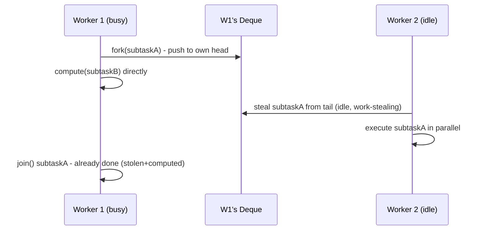

**JVM Behaviour**: `ForkJoinPool` threads are managed distinctly from regular `ThreadPoolExecutor` threads — the pool can dynamically compensate for blocked worker threads (via `ManagedBlocker`) by temporarily spawning extra compensating threads to maintain target parallelism; `Stream.parallel()` and `CompletableFuture`'s async methods (without an explicit executor) both default to `ForkJoinPool.commonPool()`, meaning heavy parallel-stream usage in one part of an app can starve `CompletableFuture` callbacks elsewhere that share the same common pool.

#### Interview Questions
**Basic**
1. What problem does work-stealing solve compared to a single shared task queue?
2. What are `RecursiveTask` and `RecursiveAction`, and how do they differ?

**Intermediate**
1. Explain the fork/join cycle: what do `fork()` and `join()` actually do?
2. Why is `ForkJoinPool.commonPool()` sometimes a hidden source of contention across unrelated parts of an application?

**Advanced**
1. Why does a busy worker push/pop from the head of its deque while thieves steal from the tail?
2. What happens if you run a blocking I/O call inside a `ForkJoinPool` task, and how does `ManagedBlocker` help?

**Scenario-based**
1. You use `list.parallelStream()` inside a web request handler that's already running inside a `ForkJoinPool`-backed `CompletableFuture` callback. What subtle problem could arise?

#### Detailed Answers
1. **Work-stealing vs shared queue**: A single shared task queue becomes a serialization/contention bottleneck as every worker thread must synchronize on it to get work; work-stealing gives each worker its own deque (mostly lock-free, uncontended for its owner) and only pays synchronization cost on the relatively rare occasions an idle thread steals from another's deque, dramatically improving scalability across many cores especially with uneven task sizes.
2. **RecursiveTask vs RecursiveAction**: Both are `ForkJoinTask` subclasses for implementing divide-and-conquer algorithms via `compute()`; `RecursiveTask<V>` returns a result (`V`), used when you need a computed value (e.g., parallel sum); `RecursiveAction` returns no result (`void`), used for tasks performed purely for side effects (e.g., parallel in-place array modification).
3. **fork()/join() semantics**: `fork()` asynchronously schedules the subtask for execution by submitting it to the current worker's own deque (not necessarily starting it immediately) so other threads (including the forking thread itself later, or thieves) can pick it up; `join()` waits for that forked subtask to complete and returns its result — but critically, if the subtask hasn't been stolen yet, the calling thread can execute it directly itself (this is why `join()` isn't purely a blocking wait; it can do useful work while "waiting").
4. **Common pool hidden contention**: `ForkJoinPool.commonPool()` is a single JVM-wide pool shared by default by `Stream.parallel()`, `Arrays.parallelSort`, and `CompletableFuture`'s async methods (`thenApplyAsync` without an explicit executor); if one part of an application saturates the common pool with long-running parallel-stream computations, unrelated `CompletableFuture` callbacks elsewhere in the same JVM can be delayed/starved because they're competing for the same limited (by default, `availableProcessors()-1`) set of worker threads — a classic hard-to-diagnose production issue.
5. **Head/tail asymmetry**: The owning worker operates at the head of its own deque using simple, mostly-uncontended operations (since only it ever touches the head in the common case), while thieves operate at the tail using CAS-based steals; this asymmetry means the common, hot-path operations (a worker managing its own work) are cheap and rarely contended, while the comparatively rare cross-thread steal operations bear the synchronization cost, which is the right trade-off since most work is done locally, not stolen.
6. **Blocking calls in ForkJoinPool**: A task blocking on I/O ties up a worker thread without doing useful CPU work, reducing effective parallelism (fewer workers available to actually compute) since the pool's target parallelism assumes threads are usually CPU-busy, not blocked; `ManagedBlocker` lets you tell the pool "this thread is about to block", allowing the pool to temporarily spawn a compensating worker thread to maintain the target level of active parallelism while the blocked thread waits, avoiding starvation of other tasks.
7. **Nested parallelStream scenario**: Since both the outer `CompletableFuture` async callback and the inner `parallelStream()` default to `ForkJoinPool.commonPool()`, you can end up with nested fork/join work all contending for the same limited common-pool threads; in the worst case, if the pool's threads are all blocked waiting on nested `join()` calls with no thread available to actually execute the innermost stolen tasks, you risk significant slowdowns or (rarely, with blocking operations mixed in) pool starvation/deadlock-like stalls. Mitigation: use a dedicated, appropriately-sized custom `ForkJoinPool` for latency-sensitive parallel streams, invoking them via `customPool.submit(() -> list.parallelStream()...).get()`.

#### Code Examples
```java
import java.util.concurrent.RecursiveTask;
import java.util.concurrent.ForkJoinPool;

public class ParallelSum extends RecursiveTask<Long> {
    private static final int THRESHOLD = 10_000;
    private final long[] array;
    private final int start, end;

    ParallelSum(long[] array, int start, int end) {
        this.array = array; this.start = start; this.end = end;
    }

    @Override
    protected Long compute() {
        int length = end - start;
        if (length <= THRESHOLD) {
            long sum = 0;
            for (int i = start; i < end; i++) sum += array[i];
            return sum;
        }
        int mid = start + length / 2;
        ParallelSum left = new ParallelSum(array, start, mid);
        ParallelSum right = new ParallelSum(array, mid, end);
        left.fork();                       // schedule left for potential stealing
        long rightResult = right.compute(); // compute right directly on this thread
        long leftResult = left.join();      // wait for (or help compute) left
        return leftResult + rightResult;
    }

    public static void main(String[] args) {
        long[] data = new long[1_000_000];
        java.util.Arrays.fill(data, 1L);
        long total = ForkJoinPool.commonPool().invoke(new ParallelSum(data, 0, data.length));
        System.out.println("Sum: " + total);
    }
}
```

## Future

### Future

#### Theory
**Core Concepts**: `Future<V>` represents the result of an asynchronous computation that may not have completed yet, providing methods to check completion (`isDone()`), cancel (`cancel()`), and block for the result (`get()`/`get(timeout, unit)`). It's the return type of `ExecutorService.submit()`, decoupling task submission from result retrieval.

**Internal Working**: Implementations (typically `FutureTask`) hold an internal state machine (NEW → COMPLETING → NORMAL/EXCEPTIONAL/CANCELLED) and use a wait-queue of threads blocked in `get()`, unparked when the task completes.

**When to Use It**: Whenever you dispatch work asynchronously and need to retrieve its result or exception later, or need the ability to cancel work in flight.

**Advantages**: Decouples "start the work" from "wait for the result", allowing useful work to happen on the calling thread in between; standardized cancellation and exception propagation (`ExecutionException` wraps the task's actual thrown exception).

**Limitations**: `get()` is blocking — there's no built-in way to register a non-blocking callback for completion or to compose multiple futures (chaining, combining) with the plain `Future` interface; `cancel()` on a running task only works if the task itself checks `Thread.interrupted()`/responds to interruption; these limitations motivated `CompletableFuture`.

#### Internal Working
**Step-by-Step Explanation**: 1) `submit()` wraps the task in a `FutureTask`, whose internal `state` field starts as `NEW`. 2) A worker thread runs the task; on completion it transitions state to `COMPLETING` then `NORMAL` (success, storing the result) or `EXCEPTIONAL` (storing the thrown exception). 3) Calling `get()` while state is still `NEW`/`COMPLETING` parks the calling thread in an internal wait list (implemented via `Unsafe`/`LockSupport`, a Treiber-stack-like structure inside `FutureTask`). 4) Once the task completes, all waiting threads are unparked and `get()` returns the result or throws `ExecutionException` (wrapping the task's exception) or `CancellationException` if cancelled.

**Memory Layout**: `FutureTask`'s internal `state` is a plain `int` accessed via `VarHandle`/`Unsafe` volatile semantics; the result/exception is stored in an `Object outcome` field (heap); waiting threads are tracked via a simple linked list of `WaitNode`s (heap-allocated), each holding a `Thread` reference, pushed via CAS.

**Diagrams**:
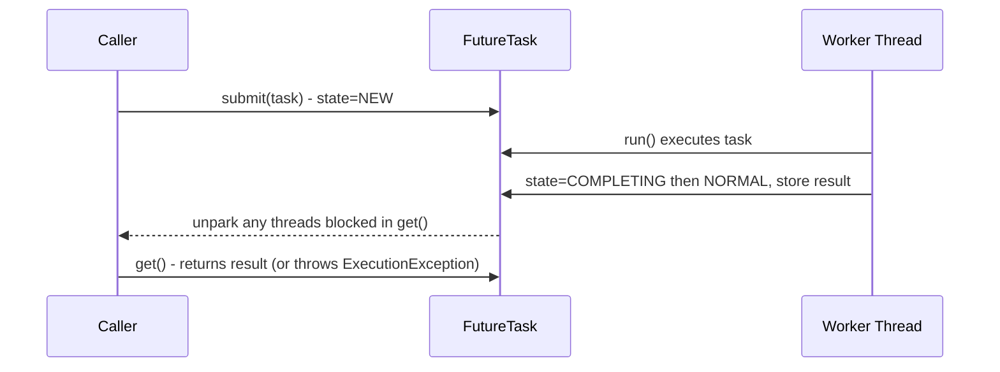

**JVM Behaviour**: Threads blocked in `get()` show as `WAITING`/`TIMED_WAITING` in thread dumps (parked via `LockSupport`), not `BLOCKED` on a monitor — since `FutureTask` uses its own lock-free wait-node structure rather than `synchronized`; cancellation of a running task relies entirely on cooperative interruption (`Thread.interrupt()` is called on the worker thread, but the task's code must check `isInterrupted()` or let a blocking call throw `InterruptedException` for cancellation to actually take effect).

#### Interview Questions
**Basic**
1. What does `Future.get()` do if the task hasn't completed yet?
2. What exception does `get()` throw if the underlying task threw an exception?

**Intermediate**
1. Can `cancel(true)` reliably stop any running task? Why or why not?
2. Why is plain `Future` considered insufficient for composing multiple asynchronous operations?

**Advanced**
1. Describe `FutureTask`'s internal state machine and why it needs distinct `COMPLETING` and `NORMAL`/`EXCEPTIONAL` states.
2. How would you implement a timeout for waiting on multiple futures without blocking longer than the total budget?

**Scenario-based**
1. You submit 10 independent tasks and need to process each result as soon as it's ready, not necessarily in submission order, while also imposing an overall 5-second deadline. How would you approach this using `Future`?

#### Detailed Answers
1. **get() on incomplete task**: It blocks the calling thread until the task completes (successfully, exceptionally, or via cancellation); `get(timeout, unit)` instead blocks up to the given duration and throws `TimeoutException` if the task hasn't finished by then.
2. **Exception propagation**: `get()` throws `ExecutionException`, whose `getCause()` returns the actual exception thrown inside the task — this wrapping lets `Future` uniformly represent "the task itself failed" distinctly from `InterruptedException` (calling thread was interrupted while waiting) or `CancellationException` (task was cancelled).
3. **cancel(true) reliability**: Not reliably — `cancel(true)` calls `Thread.interrupt()` on the executing thread, but Java's cooperative interruption model means the running code must itself periodically check `Thread.isInterrupted()` or be blocked in an interruptible call (`sleep`, `wait`, blocking I/O implementing `InterruptedIOException`, etc.) for the interruption to actually halt execution; a tight CPU-bound loop that never checks the flag will simply ignore the interrupt and keep running to completion.
4. **Why plain Future is insufficient**: It offers no way to register a callback for "when this completes, do X" (you must block on `get()`), no built-in way to chain ("when this completes, feed its result into another async operation") or combine multiple futures ("wait for both A and B, then combine") without manual, error-prone thread coordination — `CompletableFuture` was introduced specifically to add functional composition (`thenApply`, `thenCombine`, `allOf`, etc.) on top of the `Future` contract.
5. **FutureTask state machine**: States are `NEW`, `COMPLETING`, `NORMAL`, `EXCEPTIONAL`, `CANCELLED`, `INTERRUPTING`, `INTERRUPTED`. The `COMPLETING` transitional state exists because setting the outcome (result or exception) and finally moving to a fully-completed state (`NORMAL`/`EXCEPTIONAL`) isn't a single atomic step — `COMPLETING` marks "the outcome field is being written right now", preventing a race where a `get()` call could observe a state that looks "done" before the outcome value is actually fully visible/written.
6. **Bounded overall timeout across multiple futures**: Track a deadline (`System.nanoTime() + totalBudget`); for each future in sequence, call `future.get(remainingNanos, TimeUnit.NANOSECONDS)` where `remainingNanos = deadline - System.nanoTime()`, decreasing for each subsequent call, so the cumulative wait across all futures never exceeds the original total budget, rather than naively giving each future its own full timeout.
7. **10-task, complete-as-ready scenario**: Plain `Future` doesn't support "whichever completes first" ordering well (you'd have to poll `isDone()` in a loop, which is inefficient) — the better tool here is actually `ExecutorCompletionService`, which wraps an executor and offers a `take()`/`poll()` method returning whichever submitted task's future completes next, letting you process results as they arrive; combine this with tracking a deadline and using `poll(remainingTime, unit)` per iteration to respect the overall 5-second budget.

#### Code Examples
```java
import java.util.concurrent.*;

public class FutureCompletionOrderDemo {
    public static void main(String[] args) throws InterruptedException {
        ExecutorService pool = Executors.newFixedThreadPool(4);
        CompletionService<Integer> completionService = new ExecutorCompletionService<>(pool);

        for (int i = 1; i <= 10; i++) {
            int taskId = i;
            completionService.submit(() -> {
                Thread.sleep((long) (Math.random() * 1000));
                return taskId * taskId;
            });
        }

        long deadline = System.nanoTime() + TimeUnit.SECONDS.toNanos(5);
        for (int i = 0; i < 10; i++) {
            long remaining = deadline - System.nanoTime();
            if (remaining <= 0) break; // overall budget exhausted
            try {
                Future<Integer> completed = completionService.poll(remaining, TimeUnit.NANOSECONDS);
                if (completed != null) {
                    System.out.println("Got result: " + completed.get());
                }
            } catch (ExecutionException e) {
                System.err.println("Task failed: " + e.getCause());
            }
        }
        pool.shutdown();
    }
}
```

### CompletableFuture

#### Theory
**Core Concepts**: `CompletableFuture<T>` (Java 8+) implements both `Future<T>` and `CompletionStage<T>`, providing a rich, composable API for asynchronous programming — chaining transformations (`thenApply`), side effects (`thenAccept`), combining independent futures (`thenCombine`), waiting on multiple (`allOf`/`anyOf`), and handling errors (`exceptionally`/`handle`) without ever manually blocking on `get()`.

**Internal Working**: Maintains an internal result field plus a lock-free stack of dependent "action" nodes; when the future completes (or is manually completed via `complete()`), it triggers execution of all registered dependent actions, either on the completing thread or on a specified `Executor` (for `*Async` variants).

**When to Use It**: Composing multiple asynchronous operations (calling several services and combining results, chaining dependent async calls, implementing timeouts/fallbacks) — the default choice for asynchronous programming in modern Java over raw `Future`.

**Advantages**: Non-blocking composition (build entire async pipelines without ever calling `get()` until the very end, if at all), built-in exception handling propagation through the chain, can be manually completed (`complete()`/`completeExceptionally()`) making it useful as a bridge for callback-based APIs.

**Limitations**: Default (non-`Async`) callback methods may run on the *completing* thread — potentially the caller's own thread if already complete, or an unrelated worker thread — which can be surprising; overuse of `join()`/`get()` mid-chain defeats the purpose; error handling requires deliberate use of `exceptionally`/`handle`/`whenComplete` or exceptions silently propagate to the end of the chain unhandled.

#### Internal Working
**Step-by-Step Explanation**: 1) `supplyAsync(supplier, executor)` submits the supplier to the given executor (or `ForkJoinPool.commonPool()` by default) and immediately returns an incomplete `CompletableFuture`. 2) Calling `.thenApply(fn)` registers a dependent action; if the future is already complete, `fn` runs immediately (often on the calling thread); if not yet complete, the action is pushed onto an internal lock-free stack (via CAS) to be triggered later. 3) When the async computation finishes, the completing thread walks the stack of registered dependent actions and triggers each (running them itself for the plain `then*` variants, or dispatching to an executor for `then*Async` variants). 4) `thenCombine`/`allOf` register listeners on multiple futures and only fire once all required inputs are complete, combining results per the supplied function.

**Memory Layout**: Internally similar in spirit to `FutureTask` — an `Object result` field (heap) plus a `volatile Completion stack` (a Treiber-stack-style singly linked list of `Completion` nodes, each heap-allocated, representing a pending dependent action) manipulated via CAS for lock-free registration/triggering.

**Diagrams**:
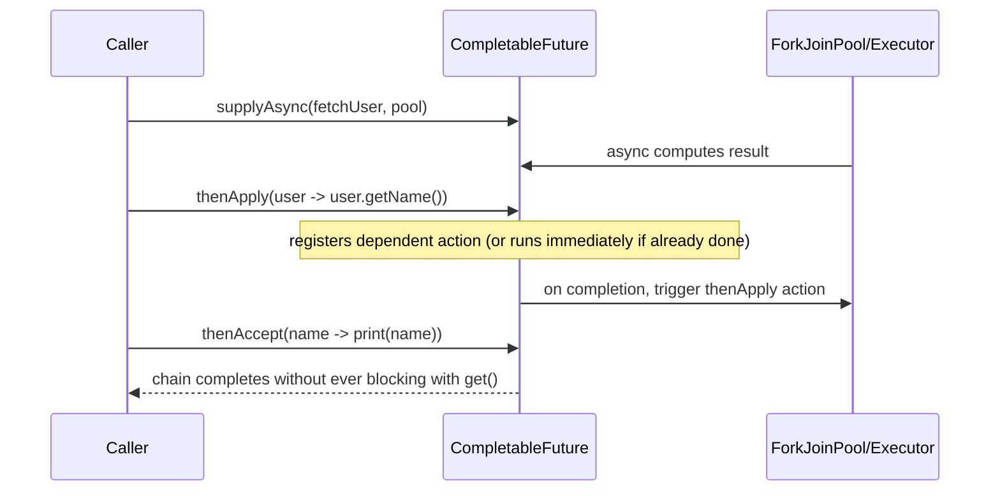

**JVM Behaviour**: `*Async` methods without an explicit `Executor` argument default to `ForkJoinPool.commonPool()`, meaning heavy `CompletableFuture` usage across an application implicitly shares that pool with parallel streams — a subtle capacity-planning consideration; non-async `then*` methods execute on whichever thread completes the preceding stage, which could be a request thread, a pool thread, or even the main thread if the future was already complete when the callback was registered, so callback code must not assume a particular thread identity (e.g., avoid relying on ThreadLocal context there).

#### Interview Questions
**Basic**
1. What's the difference between `thenApply` and `thenApplyAsync`?
2. How do you handle an exception that occurs earlier in a `CompletableFuture` chain?

**Intermediate**
1. What's the difference between `thenCompose` and `thenCombine`?
2. What does `CompletableFuture.allOf()` return, and how do you actually get the combined results out of it?

**Advanced**
1. On which thread does a non-async `thenApply` callback run, and why can this be surprising/dangerous?
2. How would you implement a timeout for a `CompletableFuture` that isn't natively supported in your target Java version?

**Scenario-based**
1. You need to call three independent microservices in parallel, combine their results into one response, and apply a 2-second overall timeout with a fallback value on failure. Design this with `CompletableFuture`.

#### Detailed Answers
1. **thenApply vs thenApplyAsync**: `thenApply(fn)` may execute `fn` on whichever thread completes the previous stage (potentially the calling thread itself, if already complete, or the async task's worker thread); `thenApplyAsync(fn)` (or with an explicit executor argument) always submits `fn` to an executor (default `ForkJoinPool.commonPool()`) for execution, guaranteeing it never runs synchronously on the completing thread — useful to avoid tying up a latency-sensitive thread (e.g., an I/O completion thread) with additional CPU work.
2. **Handling exceptions**: Use `exceptionally(throwable -> fallbackValue)` (recovers with a value, only invoked on failure), `handle((result, throwable) -> ...)` (invoked in both success and failure cases, letting you inspect both), or `whenComplete((result, throwable) -> ...)` (side-effect only, doesn't change the outcome, still propagates the original exception if not otherwise handled) — any of these placed after the failing stage in the chain will catch/react to exceptions thrown anywhere earlier in the chain.
3. **thenCompose vs thenCombine**: `thenCompose(fn)` is for sequential dependency — `fn` returns ANOTHER `CompletionStage`, and the result is "flattened" (avoiding nested `CompletableFuture<CompletableFuture<T>>`), used when stage B depends on stage A's result to even start. `thenCombine(other, fn)` is for independent, parallel composition — it waits for both this future AND a separate, independently-started future to complete, then combines their two results with `fn`, used when both operations can run concurrently with no dependency between them.
4. **allOf() and getting results**: `CompletableFuture.allOf(cf1, cf2, cf3)` returns a `CompletableFuture<Void>` that completes only once ALL given futures complete — it does NOT directly expose their individual results. To actually retrieve combined results, you typically chain `.thenApply(v -> Stream.of(cf1, cf2, cf3).map(CompletableFuture::join).collect(toList()))` (safe to call `join()` inside since all futures are guaranteed already complete at that point).
5. **Thread for non-async callbacks**: It runs on whichever thread happens to complete the preceding stage — if the stage is already complete when you register the callback, it runs synchronously on the *calling* thread (right there, inline); if not yet complete, it runs on whatever thread ultimately completes that stage (e.g., an executor's worker thread, or even a completely unrelated thread that calls `complete()` on it). This is dangerous because it's non-deterministic which thread executes your code — you can't safely assume request-scoped `ThreadLocal` context, transaction context, or security context propagates correctly unless explicitly re-established, and accidentally running expensive logic on a latency-critical I/O thread can cause unexpected slowdowns.
6. **Manual timeout implementation** (pre-Java 9, which lacks `orTimeout`/`completeOnTimeout`): Create a second `CompletableFuture` that completes exceptionally after a delay using a `ScheduledExecutorService` (`scheduler.schedule(() -> future.completeExceptionally(new TimeoutException()), timeout, unit)`), then combine it with the original future via `future.applyToEither(timeoutFuture, Function.identity())` or by racing them with `CompletableFuture.anyOf`, ensuring the original future is effectively "raced" against the timeout trigger.
7. **Three-service fan-out scenario**: `CompletableFuture<A> a = supplyAsync(this::callServiceA, pool); CompletableFuture<B> b = supplyAsync(this::callServiceB, pool); CompletableFuture<C> c = supplyAsync(this::callServiceC, pool);` then combine via `CompletableFuture.allOf(a, b, c).thenApply(v -> combine(a.join(), b.join(), c.join()))`; apply the 2-second deadline via `.orTimeout(2, TimeUnit.SECONDS)` (Java 9+) or the manual scheduled-timeout pattern above, and attach `.exceptionally(ex -> fallbackResponse())` at the end to supply the fallback on any failure or timeout.

#### Code Examples
```java
import java.util.concurrent.*;

public class FanOutServiceCaller {
    private final ExecutorService pool = Executors.newFixedThreadPool(8);

    public String getCombinedResult() {
        CompletableFuture<String> userInfo = CompletableFuture.supplyAsync(this::callUserService, pool);
        CompletableFuture<String> orderInfo = CompletableFuture.supplyAsync(this::callOrderService, pool);
        CompletableFuture<String> inventoryInfo = CompletableFuture.supplyAsync(this::callInventoryService, pool);

        return CompletableFuture.allOf(userInfo, orderInfo, inventoryInfo)
                .orTimeout(2, TimeUnit.SECONDS)
                .thenApply(v -> userInfo.join() + "|" + orderInfo.join() + "|" + inventoryInfo.join())
                .exceptionally(ex -> "fallback-response") // handles timeout or any service failure
                .join();
    }

    private String callUserService() { return "user-data"; }
    private String callOrderService() { return "order-data"; }
    private String callInventoryService() { return "inventory-data"; }
}
```

### CompletionStage

#### Theory
**Core Concepts**: `CompletionStage<T>` is the interface defining the composable, functional-style API (`thenApply`, `thenCompose`, `thenCombine`, `exceptionally`, etc.) that `CompletableFuture` implements — it represents one stage of a possibly-multi-stage asynchronous computation pipeline, without necessarily exposing blocking methods like `get()` (those live on `Future`, which `CompletableFuture` separately also implements).

**Internal Working**: Each method returns a NEW `CompletionStage` representing the result of applying the given function/action once the current stage completes — stages form a directed graph/chain of dependent computations, each triggered upon completion of its predecessor(s).

**When to Use It**: As the abstraction type in APIs when you want to expose "a composable async result" to callers without necessarily granting them the ability to block (`get()`) or manually complete/cancel the underlying future — encourages a non-blocking style throughout a codebase.

**Advantages**: Separates the "composition" contract from the "blocking retrieval"/"manual completion" contract of `Future`/`CompletableFuture`, letting API designers expose a narrower, safer surface; encourages purely reactive/non-blocking pipelines.

**Limitations**: In practice, almost everyone uses the concrete `CompletableFuture` class directly rather than programming against the `CompletionStage` interface, partly because `CompletionStage` alone can't be blocked on or manually completed — so the abstraction, while conceptually clean, sees limited real-world adoption as a declared type.

#### Internal Working
**Step-by-Step Explanation**: 1) A stage is created (e.g., via `CompletableFuture.supplyAsync`). 2) Calling any `then*` method registers a dependent computation and returns a new stage representing that computation's eventual outcome. 3) Internally, `CompletableFuture` (the sole practical implementation) manages a chain/graph of such dependent stages using its lock-free completion-stack mechanism, triggering each stage's registered action once its dependencies resolve. 4) Multiple `CompletionStage`s can be combined (`thenCombine`) or composed sequentially (`thenCompose`), building an arbitrarily complex computation graph, not just a linear chain.

**Memory Layout**: Not directly applicable beyond what's already true of `CompletableFuture`'s internal `Completion` node stack — `CompletionStage` is purely an interface/contract with no independent runtime memory representation of its own.

**Diagrams**:
```
CompletionStage graph (not just a linear chain):

  stageA --thenApply--> stageB --\
                                  thenCombine --> stageD
  stageC ------------------------/
```

**JVM Behaviour**: No JVM-specific behavior beyond that of the concrete `CompletableFuture` implementation backing virtually all real usage; the interface itself carries no runtime semantics of its own.

#### Interview Questions
**Basic**
1. What is the relationship between `CompletionStage` and `CompletableFuture`?
2. Why might an API expose a return type of `CompletionStage<T>` instead of `CompletableFuture<T>`?

**Intermediate**
1. Can you call `get()` on a `CompletionStage` reference? Why or why not?
2. What does it mean for `CompletionStage`s to form a "graph" rather than strictly a linear chain?

**Advanced**
1. Why did Java separate the composition contract (`CompletionStage`) from the blocking/mutable contract (`Future`, and completion methods on `CompletableFuture`)?
2. What are the practical downsides of programming strictly against `CompletionStage` rather than `CompletableFuture`?

**Scenario-based**
1. You're designing a public library API for an async HTTP client. Would you return `CompletionStage<Response>` or `CompletableFuture<Response>` from your `get(url)` method, and why?

#### Detailed Answers
1. **Relationship**: `CompletionStage<T>` is an interface describing composable async transformation/combination methods; `CompletableFuture<T>` is the (essentially only widely-used) concrete class that implements both `CompletionStage<T>` AND `Future<T>`, adding blocking retrieval (`get()`) and manual completion (`complete()`, `completeExceptionally()`) on top of the pure composition contract.
2. **Why expose CompletionStage**: To communicate via the type system that callers should NOT block on the result (no `get()` available) and should NOT be able to manually complete/cancel the underlying future (no `complete()`/`cancel()` available) — it narrows the API surface to purely composable, non-blocking usage, which can prevent misuse in library code.
3. **Calling get() on CompletionStage**: No — `CompletionStage` does not declare `get()` (that's on the separate `Future` interface); a variable declared as `CompletionStage<T>` only has access to the composition methods (`thenApply`, `thenCombine`, etc.), even if the underlying runtime object happens to also implement `Future` (as `CompletableFuture` does) — you'd need to cast or already hold a reference typed as `CompletableFuture` to call `get()`.
4. **Graph, not just chain**: Because stages can be combined from multiple independent predecessors (`thenCombine`, `allOf`, `anyOf`), the overall structure of dependent computations can branch and merge — e.g., stage D might depend on both stage B and stage C, which themselves derive independently from stage A — forming a general dependency graph (DAG) of asynchronous computations, not merely a straight-line sequence.
5. **Why separate the contracts**: This follows the interface segregation principle — "compose async results" (functional, safe, doesn't require blocking) is conceptually a different capability from "block until done" or "force-complete/cancel externally" (imperative, can introduce blocking/threading hazards); keeping them as separate interfaces lets code that only needs composition avoid coupling to (and callers avoid the temptation of) blocking or mutating operations.
6. **Practical downsides**: You lose the ability to call `get()`/`join()` to actually retrieve a final result at the end of a pipeline (you'd need to cast back to `CompletableFuture` or otherwise expose a terminal blocking mechanism), and you lose manual completion capabilities useful for bridging callback-based legacy APIs into the `CompletableFuture` world — in practice, most codebases just use `CompletableFuture` directly since Java never introduced a widely-adopted alternative concrete `CompletionStage`-only implementation.
7. **Async HTTP client scenario**: Return `CompletionStage<Response>` if you want to strongly encourage non-blocking usage and prevent consumers from calling `.get()`/`.join()` and accidentally blocking a reactive/event-loop thread; however, many real-world libraries (including the JDK's own `java.net.http.HttpClient`, which returns `CompletableFuture<HttpResponse<T>>`) choose to return the concrete `CompletableFuture` for maximum flexibility and to match ubiquitous developer expectations, accepting the small risk that some callers might block inappropriately — the choice is a genuine API design trade-off between safety and flexibility.

#### Code Examples
```java
import java.util.concurrent.CompletableFuture;
import java.util.concurrent.CompletionStage;

public class AsyncHttpClientFacade {
    // Exposes only composition methods - callers cannot block or manually complete
    public CompletionStage<String> fetch(String url) {
        return CompletableFuture.supplyAsync(() -> performHttpGet(url));
    }

    public static void main(String[] args) {
        AsyncHttpClientFacade client = new AsyncHttpClientFacade();
        client.fetch("https://example.com/api")
              .thenApply(String::toUpperCase)
              .thenAccept(System.out::println); // pure composition, no get()/join() needed
    }

    private String performHttpGet(String url) {
        return "response-body-from-" + url;
    }
}
```

## Concurrent Collections

### ConcurrentHashMap

#### Theory
**Core Concepts**: `ConcurrentHashMap` is a thread-safe hash map allowing high-concurrency reads and writes without locking the entire map (unlike `Collections.synchronizedMap` or legacy `Hashtable`, both of which serialize on a single lock). Since Java 8, it uses per-bucket (per-node) locking via CAS and synchronized blocks on individual bin head nodes, plus lock-free reads.

**Internal Working**: Reads (`get()`) are entirely lock-free (volatile reads of node fields); writes (`put()`) use CAS for inserting into an empty bucket, or synchronize only on the specific bucket's head node when appending/updating within a non-empty bin — never locking the whole table.

**When to Use It**: Any shared, mutable map accessed by multiple threads — caches, registries, counters keyed by identifier — essentially the default replacement for `HashMap` whenever thread-safety is needed.

**Advantages**: Massively better concurrent throughput than a globally-locked map; `computeIfAbsent`/`compute`/`merge` provide atomic check-then-act semantics per key; iterators are weakly consistent (never throw `ConcurrentModificationException`, reflect some but not necessarily all concurrent modifications).

**Limitations**: Does not allow `null` keys or values (unlike `HashMap`) — deliberately, because `null` would be ambiguous with "key not present" in a concurrent context where another thread could be racing to insert; aggregate operations (`size()`, `isEmpty()` under heavy concurrent modification) are approximate/eventually-consistent, not a true atomic snapshot; compound operations across multiple keys still require external coordination.

#### Internal Working
**Step-by-Step Explanation**: 1) The map is backed by an array of bins (`Node<K,V>[] table`), each bin holding a linked list (or, once a bin exceeds a threshold of 8 entries with a large enough table, a red-black tree for O(log n) worst-case lookup instead of O(n)). 2) `get(key)` computes the hash, locates the bin, and traverses it with plain volatile reads — no locking at all. 3) `put(key, value)`: if the target bin is empty, CAS-insert the new node directly (lock-free fast path); if the bin is non-empty, `synchronized` is used but only on that specific bin's head node (fine-grained locking, unrelated bins remain fully concurrent). 4) Resizing (`table` growth) is itself parallelized — multiple threads can cooperatively help transfer nodes from the old table to the new one when triggered concurrently, rather than one thread blocking everyone else.

**Memory Layout**: The bin array and `Node` objects live on the heap; treeified bins use `TreeNode`/`TreeBin` wrapper structures (heap-allocated red-black tree nodes) once a bin's chain grows long enough (default threshold 8) AND the table itself is large enough (default 64) — otherwise it just resizes the table instead of treeifying, since a small table experiencing hash collisions may just need more bins.

**Diagrams**:
```
table: [bin0] [bin1] [bin2] [bin3] ...
         |      |
       node->node   node (CAS insert if bin empty; synchronized(bin head) if appending)

get(key): compute hash -> locate bin -> traverse via volatile reads (NO LOCK)
put(key): compute hash -> locate bin -> 
            bin empty? CAS insert new node (lock-free)
            bin non-empty? synchronized(binHeadNode) { append/update; treeify if long chain }
```

**JVM Behaviour**: Fine-grained per-bin `synchronized` blocks benefit from the same JIT lock optimizations (biased/lightweight locking, lock elision) as any other monitor use, but because contention is spread across many independent bin locks instead of one global lock, real contention (and thus expensive lock inflation) is rare even under heavy concurrent access; the CAS fast path for empty-bin insertion avoids monitor overhead entirely for the common case of a well-distributed hash table.

#### Interview Questions
**Basic**
1. Why is `ConcurrentHashMap` preferred over `Collections.synchronizedMap(new HashMap<>())`?
2. Why doesn't `ConcurrentHashMap` allow null keys or values?

**Intermediate**
1. How does `ConcurrentHashMap` achieve fine-grained concurrency internally (Java 8+ design)?
2. What does "weakly consistent" mean for `ConcurrentHashMap`'s iterators, and how does that compare to `ConcurrentModificationException` in `HashMap`?

**Advanced**
1. Explain treeification of bins — when does it happen and what problem does it solve?
2. Is `computeIfAbsent` truly atomic per key? What guarantee does it provide, and what's a common misuse?

**Scenario-based**
1. You need to maintain a shared cache where multiple threads may race to compute an expensive value for the same missing key, but you must guarantee the expensive computation runs at most once per key. How do you implement this correctly with `ConcurrentHashMap`?

#### Detailed Answers
1. **Why preferred over synchronizedMap**: `Collections.synchronizedMap` wraps every single method (`get`, `put`, etc.) with one shared lock, fully serializing all access regardless of which keys/buckets are involved — a global bottleneck under concurrent load. `ConcurrentHashMap` uses lock-free reads and per-bin locking for writes, allowing many threads to operate on different parts of the map fully in parallel, giving dramatically higher throughput under contention.
2. **Why no null**: If `get(key)` returned `null`, callers couldn't distinguish "key maps to null" from "key isn't present" — in a single-threaded `HashMap` you can disambiguate with `containsKey()`, but in a concurrent map another thread could insert/remove the key between your `get()` and your `containsKey()` check, making that check-then-act pattern inherently racy; disallowing null entirely sidesteps this ambiguity by design.
3. **Fine-grained concurrency design**: Reads are lock-free (plain volatile-like reads of node references); writes CAS-insert into empty bins or synchronize only on the specific bin's head node being modified (not a global lock), so operations on different bins proceed fully in parallel; resizing is also cooperatively parallelized across threads rather than single-threaded-blocking.
4. **Weakly consistent iterators**: `ConcurrentHashMap`'s iterators reflect the state of the map at some point at or since the iterator's creation — they may or may not show later concurrent modifications, but they never throw `ConcurrentModificationException` and are guaranteed not to throw even if the map is modified during iteration (unlike `HashMap`, whose fail-fast iterator throws `ConcurrentModificationException` if it detects a structural modification via a modCount check during iteration).
5. **Treeification**: When a single bin's linked list grows to a configurable threshold (default 8 entries) AND the overall table size is at least a minimum capacity (default 64 — otherwise the table is resized/expanded instead), that bin is converted from a linked list to a small red-black tree, changing worst-case lookup within that bin from O(n) to O(log n) — this defends against pathological hash collisions (e.g., adversarial or poorly-distributed keys) degrading performance to linear scans.
6. **computeIfAbsent atomicity**: Yes, for a single key, `computeIfAbsent` guarantees the mapping function is invoked at most once and the whole check-and-insert is atomic with respect to that specific key (achieved via the same per-bin locking used for `put`). A common misuse/pitfall: calling `map.computeIfAbsent` (or any compute* method) recursively on the SAME map from within the mapping function can cause a deadlock or `ConcurrentModificationException`-like corruption, since the bin lock is already held during the callback.
7. **Compute-once-per-key cache scenario**: Use `map.computeIfAbsent(key, k -> expensiveComputation(k))` — this guarantees the expensive computation runs at most once per key even under concurrent access from many threads racing on the same missing key, because `computeIfAbsent` atomically locks the relevant bin for the duration of checking absence and inserting the computed value.

#### Code Examples
```java
import java.util.concurrent.ConcurrentHashMap;

public class ExpensiveComputationCache {
    private final ConcurrentHashMap<String, Double> cache = new ConcurrentHashMap<>();

    public double getOrCompute(String key) {
        // Guaranteed at-most-once execution of expensiveComputation per key,
        // even if many threads call this concurrently for the same missing key.
        return cache.computeIfAbsent(key, this::expensiveComputation);
    }

    private double expensiveComputation(String key) {
        // simulate costly work (e.g., remote lookup, heavy calculation)
        return key.hashCode() * 1.0;
    }
}
```

### BlockingQueue

#### Theory
**Core Concepts**: `BlockingQueue<E>` extends `Queue` with blocking insertion (`put()`) and removal (`take()`) operations — producers block when the queue is full (for bounded implementations), and consumers block when the queue is empty, until space/an element becomes available. It's the foundation of the producer-consumer pattern in Java and backs `ThreadPoolExecutor`'s internal work queue.

**Internal Working**: Common implementations include `ArrayBlockingQueue` (fixed-size circular array, single lock with two `Condition`s for not-full/not-empty), `LinkedBlockingQueue` (linked nodes, optionally bounded, can use separate put/take locks for higher throughput), `PriorityBlockingQueue` (unbounded heap-ordered), and `SynchronousQueue` (zero-capacity direct handoff).

**When to Use It**: Producer-consumer pipelines, task queues (thread pool backing), work distribution between stages of a pipeline, natural backpressure mechanism between fast producers and slower consumers.

**Advantages**: Eliminates manual `wait()`/`notify()` boilerplate for producer-consumer coordination; bounded implementations provide natural backpressure (producers block/slow down instead of unbounded memory growth); thread-safe by design.

**Limitations**: `put()`/`take()` block indefinitely by default (though `offer(timeout)`/`poll(timeout)` provide bounded alternatives); choosing the wrong implementation (e.g., unbounded `LinkedBlockingQueue`) reintroduces unbounded-memory risk; `SynchronousQueue` has no internal capacity at all, requiring a consumer to be actively waiting for a `put()` to succeed.

#### Internal Working
**Step-by-Step Explanation**: 1) `ArrayBlockingQueue` uses one `ReentrantLock` guarding the whole queue, with two associated `Condition` objects: `notEmpty` (consumers wait on this when queue is empty) and `notFull` (producers wait on this when queue is at capacity). 2) `put(item)`: acquire lock, while queue is full await `notFull`, insert item, signal `notEmpty`, release lock. 3) `take()`: acquire lock, while queue is empty await `notEmpty`, remove item, signal `notFull`, release lock. 4) `LinkedBlockingQueue` can use two SEPARATE locks (`putLock`/`takeLock`) since head and tail operations touch different parts of the linked structure, allowing a producer and a consumer to proceed truly concurrently (unlike `ArrayBlockingQueue`'s single lock, which serializes puts against takes too).

**Memory Layout**: `ArrayBlockingQueue` pre-allocates a fixed-size `Object[]` array (heap) used as a circular buffer; `LinkedBlockingQueue` allocates a new `Node` per element (heap, more GC pressure per operation but flexible sizing); `SynchronousQueue` has essentially no internal element storage at all — it directly hands off a reference from the producer's stack frame to a waiting consumer's stack frame via internal synchronization structures.

**Diagrams**:
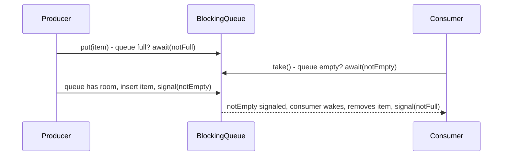

**JVM Behaviour**: Blocked producer/consumer threads show as `WAITING` (via `Condition.await()`, itself built on `LockSupport.park()`) in thread dumps, not busy-spinning — so an idle producer-consumer pipeline with a `BlockingQueue` consumes negligible CPU; `ArrayBlockingQueue`'s single-lock design means put/take operations are mutually exclusive at the JVM level even though conceptually they touch different ends of the buffer, a deliberate simplicity/throughput trade-off compared to `LinkedBlockingQueue`'s dual-lock design.

#### Interview Questions
**Basic**
1. What's the difference between `put()`/`take()` and `offer()`/`poll()` on a `BlockingQueue`?
2. Name two concrete `BlockingQueue` implementations and one key difference between them.

**Intermediate**
1. Why does `LinkedBlockingQueue` generally have better producer-consumer throughput than `ArrayBlockingQueue` under concurrent load?
2. What is `SynchronousQueue` and how is a "capacity of zero" implemented conceptually?

**Advanced**
1. How does `BlockingQueue` internally use `Condition` variables to avoid busy-waiting for full/empty states?
2. Why would you choose a bounded `BlockingQueue` over an unbounded one for a `ThreadPoolExecutor`'s work queue?

**Scenario-based**
1. A producer thread occasionally needs to give up and log an error if the queue stays full for more than 500ms rather than blocking forever. How would you implement this?

#### Detailed Answers
1. **put()/take() vs offer()/poll()**: `put(item)`/`take()` block indefinitely until the operation can succeed (space available / an element available); `offer(item)` returns immediately with `false` if the queue is full instead of blocking (or `offer(item, timeout, unit)` blocks up to a bound), and `poll()` returns `null` immediately if empty (or `poll(timeout, unit)` blocks up to a bound) — giving callers control over whether/how long to wait.
2. **Two implementations and a difference**: `ArrayBlockingQueue` (fixed-capacity array, single lock for both ends) vs `LinkedBlockingQueue` (optionally unbounded, linked nodes, can use separate locks for put/take ends) — the key difference is `ArrayBlockingQueue` always requires an explicit bound at construction and uses one lock (simpler, more predictable memory footprint), while `LinkedBlockingQueue` can be unbounded by default (risk of unbounded growth if not explicitly capped) but generally allows higher producer-consumer concurrency via its dual-lock design.
3. **Why LinkedBlockingQueue has better throughput**: It uses two independent locks — a `putLock` guarding insertions at the tail and a `takeLock` guarding removals at the head — so a producer and a consumer can operate simultaneously without contending on the same lock (as long as the queue isn't transitioning between empty/full, which needs some cross-coordination via signals); `ArrayBlockingQueue`'s single lock means even a put and a take happening "at the same time" conceptually must fully serialize through one lock.
4. **SynchronousQueue**: It's a `BlockingQueue` with effectively zero internal capacity — every `put()` must wait for a matching `take()` (and vice versa) to occur essentially simultaneously; internally it doesn't store elements at all, instead directly transferring the object reference from the producer's `put()` call to the consumer's `take()` call via an internal (stack-based, in `SynchronousQueue`'s non-fair mode using a Treiber-stack-like structure, or a queue in fair mode) hand-off mechanism, essentially a rendezvous point rather than a buffer.
5. **Condition variables to avoid busy-waiting**: Instead of the caller spinning in a loop checking "is the queue full/empty" repeatedly (wasting CPU), the queue's `put()`/`take()` implementations call `condition.await()` on a dedicated `notFull`/`notEmpty` `Condition` (built on `AbstractQueuedSynchronizer`'s condition-queue mechanism) which parks the calling thread using `LockSupport.park()` — truly blocking (zero CPU usage) until explicitly `signal()`-ed by a put/take on the other side, at which point the parked thread is woken and re-checks its condition.
6. **Bounded queue for ThreadPoolExecutor**: An unbounded queue means the executor will never invoke its `RejectedExecutionHandler` or grow beyond `corePoolSize` threads (since `queue.offer()` never fails) — under sustained overload, tasks simply accumulate in memory indefinitely, risking `OutOfMemoryError`; a bounded queue caps memory usage and, combined with `maximumPoolSize` and a sensible rejection policy (e.g., `CallerRunsPolicy`), gives the system a deliberate, tunable backpressure mechanism instead of silent unbounded growth.
7. **500ms timeout-then-log scenario**: Use `queue.offer(item, 500, TimeUnit.MILLISECONDS)` instead of `put(item)` — it returns `false` if it couldn't insert within the timeout, letting the producer log an error/apply a fallback (e.g., drop the item, retry, or alert) rather than blocking indefinitely.

#### Code Examples
```java
import java.util.concurrent.*;

public class ProducerConsumerPipeline {
    private final BlockingQueue<String> queue = new ArrayBlockingQueue<>(100);

    public void produce(String item) throws InterruptedException {
        if (!queue.offer(item, 500, TimeUnit.MILLISECONDS)) {
            System.err.println("Queue full after 500ms, dropping/logging: " + item);
            return;
        }
    }

    public void consume() {
        while (!Thread.currentThread().isInterrupted()) {
            try {
                String item = queue.take(); // blocks until an item is available
                process(item);
            } catch (InterruptedException e) {
                Thread.currentThread().interrupt();
            }
        }
    }

    private void process(String item) {
        System.out.println("Processing: " + item);
    }
}
```

### ConcurrentLinkedQueue

#### Theory
**Core Concepts**: `ConcurrentLinkedQueue<E>` is an unbounded, non-blocking, thread-safe FIFO queue based on Michael-Scott's lock-free linked-node algorithm using CAS operations exclusively — no locks, no blocking, ever. It implements `Queue`, not `BlockingQueue` (no `put()`/`take()`), offering only non-blocking `offer()`/`poll()`.

**Internal Working**: Both enqueue and dequeue operations use CAS loops on head/tail pointers and node "next" references, allowing multiple threads to insert/remove concurrently without ever blocking (though a thread may retry its CAS if it loses a race).

**When to Use It**: High-throughput scenarios needing a simple, unbounded, thread-safe queue without producer-consumer blocking semantics — e.g., a work-item queue drained by a polling loop, or a lock-free event buffer.

**Advantages**: No lock/monitor overhead at all — excellent scalability under high concurrency since threads never block each other (only brief CAS retries); `size()` is available but documented as an O(n) traversal (not O(1)), since maintaining an exact live count would itself require synchronization that defeats the lock-free design.

**Limitations**: Unbounded — no backpressure mechanism, risking unbounded memory growth under sustained producer/consumer imbalance; no blocking `take()`, so consumers wanting to "wait for an item" must poll in a loop (often combined with sleeping or a separate signaling mechanism) rather than parking efficiently; `size()` being O(n) and only a momentary estimate under concurrent modification is a common surprise.

#### Internal Working
**Step-by-Step Explanation**: 1) The queue is a singly-linked list of nodes with atomic (CAS-updatable) `head` and `tail` references. 2) `offer(item)`: create a new node, then CAS the current tail node's `next` reference from null to the new node; if the CAS fails (another thread beat it to updating `next`), retry by re-reading the current tail and trying again. 3) After successfully linking the new node, attempt to CAS-advance the `tail` pointer itself to the new node (this can lazily lag behind by design — the algorithm tolerates `tail` being slightly stale since traversal via `next` pointers can always find the true end). 4) `poll()`: read `head`, CAS the `head` pointer to `head.next`, returning the old head's item; retries similarly on CAS failure from concurrent pollers.

**Memory Layout**: Each element is wrapped in a heap-allocated `Node<E>` holding the item and a volatile `next` reference; `head`/`tail` are volatile fields on the queue object itself, all manipulated via `VarHandle`/`Unsafe` CAS operations rather than any lock/monitor structure.

**Diagrams**:
```
head -> [A]->[B]->[C]->null <- tail (lags, may point to C or slightly behind)

offer(D):
  1. newNode = [D]
  2. CAS(tail.next, null, newNode)   // link into the list
  3. CAS(tail, oldTail, newNode)     // best-effort advance tail (may be done by a helper thread if this one is slow)

poll():
  1. CAS(head, oldHead, oldHead.next) // advance head, oldHead's item is returned
```

**JVM Behaviour**: Every operation compiles down to CAS instructions (`VarHandle.compareAndSet`) with no `synchronized`/monitor involvement at all, so threads never enter `BLOCKED` state contending for this queue — under contention, competing threads simply retry their CAS in a tight loop (visible as high CPU usage under extreme contention, unlike lock-based structures where losing threads park and consume no CPU).

#### Interview Questions
**Basic**
1. Is `ConcurrentLinkedQueue` blocking or non-blocking? What methods does it lack compared to `BlockingQueue`?
2. Is `ConcurrentLinkedQueue` bounded or unbounded?

**Intermediate**
1. Why is `size()` on `ConcurrentLinkedQueue` an O(n) operation, and why can't it be made O(1) cheaply?
2. How would you implement a "wait for an item" consumer loop using `ConcurrentLinkedQueue` given it has no `take()`?

**Advanced**
1. Explain how the Michael-Scott lock-free queue algorithm allows the `tail` pointer to lag behind the actual last node without breaking correctness.
2. Under very high contention, how does `ConcurrentLinkedQueue`'s CAS-retry behavior differ from a lock-based queue's behavior, in terms of CPU usage?

**Scenario-based**
1. You need an extremely high-throughput, multi-producer multi-consumer queue where consumers can tolerate occasionally polling rather than blocking instantly, and you want to avoid any lock contention. Would `ConcurrentLinkedQueue` or `LinkedBlockingQueue` be preferable, and why?

#### Detailed Answers
1. **Blocking vs non-blocking**: `ConcurrentLinkedQueue` is entirely non-blocking — it implements `Queue`, not `BlockingQueue`, so it lacks `put()` (blocking insert, though it's actually unbounded so this wouldn't apply anyway) and `take()` (blocking removal); it only offers `offer()` (always succeeds, unbounded) and `poll()` (returns null immediately if empty, never blocks).
2. **Bounded or unbounded**: Unbounded — there is no capacity limit, so `offer()` essentially always succeeds (barring running out of heap memory), unlike `ArrayBlockingQueue`.
3. **Why size() is O(n)**: Maintaining an exact, always-correct live element count under a fully lock-free, highly concurrent design would require additional synchronized bookkeeping on every enqueue/dequeue (effectively re-introducing contention/locking that the whole design is trying to avoid); instead, `size()` simply traverses the linked list counting nodes at call time, giving an approximate, momentary count that could already be stale by the time it returns, especially under concurrent modification.
4. **Wait-for-item without take()**: Implement a spin-poll loop with adaptive backoff — `while ((item = queue.poll()) == null) { Thread.onSpinWait(); /* or a short sleep, or exponential backoff */ }` — or, more efficiently, pair the queue with a separate signaling mechanism (e.g., a `Semaphore` incremented on offer and acquired before polling) so consumers can park efficiently rather than busy-polling.
5. **Tail lagging correctness**: The algorithm never relies on `tail` being perfectly up to date for correctness — `tail` is only a hint/optimization to quickly locate roughly where the end of the list is; any thread that discovers `tail.next` is non-null (meaning `tail` is stale) will "help" by advancing `tail` itself via CAS before proceeding with its own operation, so the true end of the list is always reachable by following `next` references from `tail`, guaranteeing correctness regardless of how stale `tail` temporarily becomes.
6. **CAS retry vs lock-based CPU behavior**: Under very high contention, `ConcurrentLinkedQueue`'s losing threads spin and retry their CAS repeatedly (actively consuming CPU cycles while retrying), whereas a lock-based queue's losing threads block/park (consuming essentially zero CPU while waiting, but incurring context-switch and wake-up latency instead) — lock-free structures trade potentially higher CPU usage under extreme contention for the complete avoidance of blocking, context switches, and priority-inversion-style scheduling delays.
7. **High-throughput queue choice**: `ConcurrentLinkedQueue` is preferable here — with fully non-blocking CAS-based operations, it avoids all lock contention/context-switch overhead between many producers and consumers; since consumers can tolerate occasional polling (rather than needing instant blocking wake-up), the lack of a `take()` method isn't a practical drawback, and the throughput benefits of a lock-free design typically outweigh `LinkedBlockingQueue`'s lock-based (even if dual-lock) approach under very heavy concurrent load.

#### Code Examples
```java
import java.util.concurrent.ConcurrentLinkedQueue;
import java.util.concurrent.Semaphore;

public class LockFreeEventBuffer {
    private final ConcurrentLinkedQueue<String> queue = new ConcurrentLinkedQueue<>();
    private final Semaphore available = new Semaphore(0); // signals item availability

    public void publish(String event) {
        queue.offer(event);   // never blocks, unbounded
        available.release();  // wake a consumer without busy-polling
    }

    public String consume() throws InterruptedException {
        available.acquire();  // efficiently parks until an event is signaled
        return queue.poll();  // lock-free removal
    }
}
```

### CopyOnWrite Collections

#### Theory
**Core Concepts**: `CopyOnWriteArrayList` and `CopyOnWriteArraySet` provide thread safety by copying the entire underlying array on every mutating operation (`add`, `remove`, `set`) while leaving existing iterators/readers referencing the OLD, unchanged array — reads never block, never throw `ConcurrentModificationException`, and never see partial mutations, at the cost of expensive writes.

**Internal Working**: A `volatile Object[] array` field holds the current snapshot; every write acquires an internal lock, copies the array, applies the modification to the copy, then atomically replaces the volatile reference — readers always see a fully consistent (if possibly stale) snapshot without any locking on their part.

**When to Use It**: Read-heavy, write-rare collections, especially where iteration is common and you want to avoid `ConcurrentModificationException` entirely — classic use case: a list of event listeners/observers that's iterated frequently (on every event) but modified rarely (only when a listener registers/unregisters).

**Advantages**: Iteration never throws `ConcurrentModificationException` and requires no external synchronization; reads are extremely fast (no locking, no CAS, just a volatile array reference read); iterators give a consistent, immutable snapshot as of their creation time.

**Limitations**: Every write copies the ENTIRE underlying array — O(n) time and space per mutation, making it a poor fit for write-heavy or large collections; iterators do NOT reflect modifications made after their creation (by design) which can surprise developers expecting `ConcurrentHashMap`-style weak consistency; memory churn (repeated full-array allocation) increases GC pressure under frequent writes.

#### Internal Working
**Step-by-Step Explanation**: 1) The list holds one `volatile Object[] array` reference. 2) A read (`get(index)`) simply reads the current `array` reference and indexes into it — no lock, no CAS, just a plain volatile read followed by array access. 3) An iterator created via `iterator()` captures a reference to the array AT THAT MOMENT and will only ever see that exact snapshot, regardless of subsequent modifications (its `remove()` method even throws `UnsupportedOperationException`, since mutating a point-in-time snapshot makes no sense). 4) A write (`add(item)`) acquires an internal `ReentrantLock` (to serialize writers against each other), allocates a NEW array one element longer, copies all existing elements plus the new one, then assigns this new array to the volatile `array` field — that single volatile reference swap is what atomically "publishes" the change to future readers.

**Memory Layout**: Each write allocates a brand-new array on the heap sized for the post-mutation element count; the old array remains referenced by any in-flight iterators until they're done, then becomes eligible for garbage collection — under high write frequency with long-lived iterators, this can transiently hold multiple array generations in memory simultaneously.

**Diagrams**:
```
Initial: array (v1) -> [A, B, C]
Iterator1 created, references array v1: [A, B, C] (frozen forever for Iterator1)

Writer calls add(D):
  1. lock()
  2. newArray = copy of v1 + D -> [A, B, C, D]  (v2, new allocation)
  3. this.array = newArray (volatile write, atomically visible to new readers)
  4. unlock()

New readers/get(index) now see v2: [A, B, C, D]
Iterator1 still sees only v1: [A, B, C] (unaffected, no ConcurrentModificationException)
```

**JVM Behaviour**: The volatile array-reference swap is the sole synchronization point for readers (a single memory-barrier-backed pointer read/write, extremely cheap); writers pay the real cost — an O(n) array copy (a `System.arraycopy` intrinsic, which the JIT/CPU can execute quickly per-element but is still linear in collection size) plus lock acquisition to serialize against other writers.

#### Interview Questions
**Basic**
1. What does "copy-on-write" mean for `CopyOnWriteArrayList`?
2. Why don't `CopyOnWriteArrayList` iterators throw `ConcurrentModificationException`?

**Intermediate**
1. What is the time complexity of `add()` on a `CopyOnWriteArrayList`, and why?
2. Why would `remove()` on a `CopyOnWriteArrayList`'s iterator throw `UnsupportedOperationException`?

**Advanced**
1. Describe the exact synchronization mechanism that lets reads be completely lock-free while writes are serialized.
2. In what scenario would using `CopyOnWriteArrayList` actually degrade performance compared to a `synchronized`/`ConcurrentHashMap`-backed alternative?

**Scenario-based**
1. You maintain a list of event listeners registered rarely (on startup/config change) but iterated on every single incoming event (thousands per second). Is `CopyOnWriteArrayList` a good fit? Justify.

#### Detailed Answers
1. **Copy-on-write meaning**: Every mutating operation creates an entirely new copy of the underlying array with the modification applied, then atomically swaps the collection's internal reference to point to this new array — existing readers/iterators continue referencing the old array unaffected, while new reads see the updated array.
2. **No ConcurrentModificationException**: Because iterators capture a fixed reference to the array as it existed at iterator-creation time and never re-read the collection's live (possibly-changed) array — since the snapshot they hold can never structurally change underneath them (the original array object is never mutated in place, only replaced by a new array object at the collection level), there's nothing to detect as a "concurrent modification" from the iterator's perspective.
3. **add() time complexity**: O(n) — it must allocate a new array of size n+1 and copy all n existing elements into it before appending the new element and swapping the reference; this is fundamentally more expensive than a regular `ArrayList`'s amortized O(1) `add()` (which only occasionally needs to resize/copy).
4. **Why iterator.remove() unsupported**: The iterator represents an immutable, frozen snapshot of the collection as of its creation — there's no meaningful way to "remove an element from a snapshot" that would actually affect anything, since the snapshot array itself is meant to be immutable once captured; supporting removal would require silently mutating the live collection through what's conceptually meant to be a read-only view, which the API deliberately disallows to avoid confusing semantics.
5. **Read/write synchronization mechanism**: Reads rely purely on the `volatile` modifier on the internal array reference — a plain volatile read guarantees visibility of whatever the most recently completed write published, with no locking needed on the reader's side; writes acquire an internal `ReentrantLock` solely to serialize concurrent WRITERS against each other (preventing two writers from racing to copy-modify-swap based on a stale array), while the actual "publish" step (assigning the new array to the volatile field) is what makes the change visible to readers via the standard volatile happens-before guarantee.
6. **When it degrades performance**: For collections that are frequently mutated (especially large collections, since each write is O(n)) — e.g., a shared queue/list receiving thousands of inserts per second — the constant full-array copying dominates and vastly underperforms a properly designed concurrent structure like `ConcurrentLinkedQueue` or a lock-striped structure, both in raw CPU cost and in GC churn from constantly discarding old arrays.
7. **Event listener list scenario**: Yes, an excellent fit — registration/unregistration (writes) is rare, so the O(n) copy cost on those infrequent events is negligible in aggregate; iteration (reads, happening on every incoming event, potentially thousands per second) is essentially free (a volatile reference read plus normal array iteration, no locking at all), which is exactly the profile `CopyOnWriteArrayList` is optimized for — this is in fact its textbook canonical use case.

#### Code Examples
```java
import java.util.List;
import java.util.concurrent.CopyOnWriteArrayList;

public class EventBus {
    // Rare writes (listener registration), frequent reads (iteration per event)
    private final List<EventListener> listeners = new CopyOnWriteArrayList<>();

    public void register(EventListener listener) {
        listeners.add(listener); // O(n) copy, but happens rarely
    }

    public void publish(String event) {
        // Lock-free iteration - safe even if a listener registers mid-iteration
        for (EventListener listener : listeners) {
            listener.onEvent(event);
        }
    }

    interface EventListener {
        void onEvent(String event);
    }
}
```

## Synchronizers

### CountDownLatch

#### Theory
**Core Concepts**: `CountDownLatch` is a one-shot synchronization barrier that lets one or more threads wait (`await()`) until a set of operations being performed in other threads completes (each signaled via `countDown()`). The count decreases monotonically to zero and can never be reset — once it reaches zero, all waiting threads are released permanently and any future `countDown()`/`await()` calls are no-ops.

**Internal Working**: Built on `AbstractQueuedSynchronizer` (AQS) in shared mode, using the AQS `state` field as the remaining count; `countDown()` decrements it via CAS, and `await()` blocks (parks) until `state` reaches zero, at which point all waiting threads are released together.

**When to Use It**: "Wait for N things to finish before proceeding" patterns — e.g., a main thread waiting for several worker threads to complete initialization before starting, or a startup sequence waiting for multiple subsystems to become ready.

**Advantages**: Very simple API compared to manually coordinating with `wait`/`notify`; naturally supports both "wait for multiple workers to finish" and "release multiple waiters simultaneously once a condition is met" patterns.

**Limitations**: Single-use/one-shot — cannot be reset or reused once it reaches zero (use `CyclicBarrier` for repeatable barrier semantics); `countDown()` can be called more times than the initial count with no effect/error (silently ignored below zero), which can mask a logic bug where you expected exactly N calls.

#### Internal Working
**Step-by-Step Explanation**: 1) Constructed with an initial `count` (e.g., `new CountDownLatch(3)`), stored as AQS's shared `state`. 2) Each call to `countDown()` performs a CAS loop decrementing `state` by 1 (only if greater than zero); when it reaches exactly zero, it triggers release of ALL threads currently parked in `await()`. 3) `await()` checks `state`; if non-zero, the calling thread is enqueued in AQS's shared wait mechanism and parked; once `state` hits zero, every parked thread is unparked and returns from `await()` (or the timed variant returns `true`/`false` on timeout). 4) Any further `countDown()` calls after reaching zero are no-ops; any further `await()` calls return immediately since `state == 0` already.

**Memory Layout**: The count lives in a single volatile `int state` field (inherited from AQS) on the heap; waiting threads are tracked via AQS's standard wait-queue `Node` structures (heap-allocated), each referencing a parked `Thread` — no per-thread locking objects needed beyond this shared structure.

**Diagrams**:
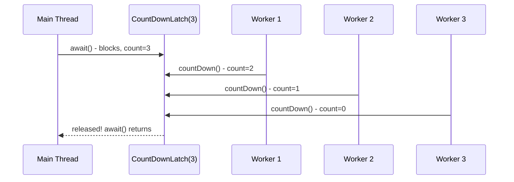

**JVM Behaviour**: Threads parked in `await()` show as `WAITING`/`TIMED_WAITING` (via `LockSupport.park`), consuming no CPU while blocked; the release of multiple waiting threads when count hits zero happens via AQS's shared-mode release logic, which efficiently wakes all queued waiters (not just one, as exclusive-mode locks would) in a single release operation.

#### Interview Questions
**Basic**
1. What does `CountDownLatch` do, and what are its two primary operations?
2. Can a `CountDownLatch` be reused/reset after it reaches zero?

**Intermediate**
1. What happens if `countDown()` is called more times than the initial count?
2. What's the difference between using `CountDownLatch` for "wait for N workers to finish" vs. "release N threads to start simultaneously"?

**Advanced**
1. Explain how `CountDownLatch` is implemented on top of `AbstractQueuedSynchronizer`'s shared mode.
2. What happens if a worker thread that's supposed to call `countDown()` throws an exception before doing so?

**Scenario-based**
1. You want to start 10 threads simultaneously to stress-test a piece of code (all beginning execution at nearly the same instant) and then wait for all 10 to finish before reporting aggregate results. Design this with `CountDownLatch`.

#### Detailed Answers
1. **What it does**: It's a synchronization aid initialized with a count; `await()` blocks the calling thread(s) until the count reaches zero, and `countDown()` decrements the count by one each time it's called (typically once per completing worker/event) — once zero, all waiting threads are released.
2. **Reusable?**: No — once the count reaches zero, the latch is permanently "open"; there's no `reset()` method, and constructing a new latch is required for another round of coordination. This is a deliberate design distinction from `CyclicBarrier`, which IS designed to be reused across multiple phases.
3. **Excess countDown() calls**: They're silently ignored/no-ops — `countDown()` only decrements while count is greater than zero, so calling it extra times beyond the initial count has no effect and throws no exception, which can mask a bug if you expected precisely N calls and accidentally called it more (or fewer) times than intended without realizing.
4. **Two usage patterns**: "Wait for N workers to finish" — initialize with count N, each worker calls `countDown()` upon completion, and a coordinating thread calls `await()` to block until all are done. "Release N threads to start simultaneously" — initialize with count 1, have all N threads call `await()` and block, then a single controlling thread calls `countDown()` once, releasing all N waiting threads at nearly the same instant (a common technique for concurrency stress tests to maximize contention).
5. **AQS shared-mode implementation**: `CountDownLatch.Sync` extends `AbstractQueuedSynchronizer` and overrides `tryAcquireShared` (used by `await()`: succeeds immediately if `state == 0`, otherwise the calling thread is queued) and `tryReleaseShared` (used by `countDown()`: CAS-decrements `state`, and returns true only when it reaches exactly zero, triggering AQS to walk the wait queue and unpark ALL blocked threads in shared-release fashion, rather than the one-at-a-time release used by exclusive locks).
6. **Exception before countDown()**: The count never reaches zero (assuming no other path calls it), so any thread(s) blocked in `await()` will wait forever (or until their timeout, if using the timed overload) — this is a common production bug, mitigated by always calling `countDown()` in a `finally` block so it executes regardless of whether the worker's task succeeded or threw an exception.
7. **Simultaneous-start stress test scenario**: Use two latches — a "start gate" `CountDownLatch(1)` that all 10 threads `await()` on before beginning their work (a single `countDown()` call from the controller releases all 10 essentially simultaneously, maximizing contention), and a "finish gate" `CountDownLatch(10)` that each thread calls `countDown()` on when done, with the main thread calling `await()` on it to know when all 10 have finished before aggregating results.

#### Code Examples
```java
import java.util.concurrent.CountDownLatch;
import java.util.concurrent.atomic.AtomicInteger;

public class ConcurrentStressTest {
    public static void main(String[] args) throws InterruptedException {
        int threadCount = 10;
        CountDownLatch startGate = new CountDownLatch(1);   // releases all threads at once
        CountDownLatch doneGate = new CountDownLatch(threadCount); // waits for all to finish
        AtomicInteger successCount = new AtomicInteger();

        for (int i = 0; i < threadCount; i++) {
            new Thread(() -> {
                try {
                    startGate.await(); // all threads block here until released together
                    performOperationUnderTest();
                    successCount.incrementAndGet();
                } catch (InterruptedException e) {
                    Thread.currentThread().interrupt();
                } finally {
                    doneGate.countDown(); // always signal, even on failure
                }
            }).start();
        }

        startGate.countDown();   // release all 10 threads simultaneously
        doneGate.await();        // wait for all 10 to complete
        System.out.println("Successful runs: " + successCount.get());
    }

    private static void performOperationUnderTest() {
        // simulate work under test
    }
}
```

### CyclicBarrier

#### Theory
**Core Concepts**: `CyclicBarrier` lets a fixed number of threads wait for each other to reach a common barrier point (`await()`), then releases them all simultaneously to proceed — and unlike `CountDownLatch`, it automatically RESETS after release, allowing it to be reused across multiple synchronization phases ("cyclic"). It optionally runs a single "barrier action" (on one of the arriving threads) once all parties have arrived, before releasing everyone.

**Internal Working**: Internally uses a `ReentrantLock` and `Condition` (not AQS directly) to track how many parties have arrived for the current "generation"; when the last party arrives, it runs the optional barrier action, then signals the condition to release all waiting threads and resets the count for the next generation.

**When to Use It**: Multi-phase parallel algorithms where all threads must complete phase N before any can begin phase N+1 (e.g., iterative simulations, parallel matrix operations processed in rounds), or coordinating a fixed group of worker threads that repeatedly need to rendezvous.

**Advantages**: Reusable across multiple synchronization points (unlike the one-shot `CountDownLatch`); the optional barrier action provides a convenient single point to perform aggregation/cleanup work exactly once per phase, executed by whichever thread happens to arrive last.

**Limitations**: If any participating thread is interrupted, times out, or throws an exception while waiting, the barrier becomes "broken" (`BrokenBarrierException` is thrown to all other waiting/subsequently-arriving threads), requiring an explicit `reset()` to recover — a single failing thread can disrupt the entire cohort; fixed party count set at construction (though `getParties()`/`getNumberWaiting()` allow introspection, you can't change the required party count without creating a new barrier).

#### Internal Working
**Step-by-Step Explanation**: 1) Constructed with `parties` count and an optional `Runnable barrierAction`. 2) Each thread calls `await()`, which acquires the internal lock, decrements a "threads still needed" counter for the current generation, and, if not yet zero, awaits on a `Condition` (releasing the lock while waiting). 3) When the last thread arrives (counter reaches zero), it (that specific last-arriving thread) executes the barrier action synchronously if one was provided, then calls `nextGeneration()` — which resets the counter to `parties` for the next cycle and signals ALL threads waiting on the condition to wake up and return from `await()`. 4) If a thread is interrupted or times out while waiting, the barrier transitions to a "broken" state, and every other thread currently or subsequently calling `await()` on that generation immediately throws `BrokenBarrierException`, until someone calls `reset()`.

**Memory Layout**: A `count` field (number of parties still to arrive in the current generation) and a `generation` object (marking the current cycle, replaced on each successful pass or break) live on the heap as part of the barrier's internal `ReentrantLock`-guarded state; waiting threads block via the lock's associated `Condition`, parked using the same underlying `LockSupport` mechanism as any other AQS-based condition wait.

**Diagrams**:
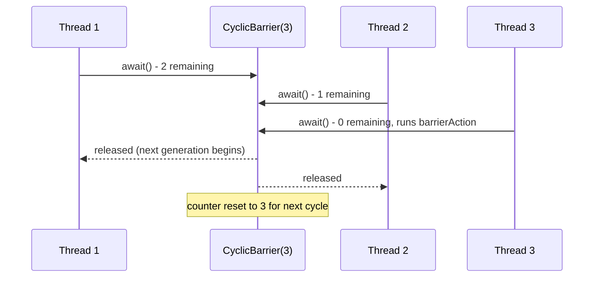

**JVM Behaviour**: Same as other lock/condition-based synchronizers — waiting threads park (`WAITING` state, negligible CPU) rather than spin; the barrier action runs synchronously on the thread that happened to arrive last (an important detail — that thread bears the cost of the action, and any exception thrown by the barrier action itself breaks the barrier for everyone).

#### Interview Questions
**Basic**
1. What's the core difference between `CyclicBarrier` and `CountDownLatch`?
2. What is the "barrier action" and when does it run?

**Intermediate**
1. What happens to other waiting threads if one thread times out or is interrupted while waiting at the barrier?
2. Can you reuse a `CyclicBarrier` after all parties have passed through it? How is this different from `CountDownLatch`?

**Advanced**
1. Which thread executes the barrier action, and what are the implications if that action throws an exception?
2. How would you use `CyclicBarrier` to synchronize the rounds of an iterative parallel algorithm (e.g., each round depends on all threads finishing the previous round)?

**Scenario-based**
1. A parallel simulation runs in rounds; each of 4 worker threads computes its portion of the round, then all must wait for each other before starting the next round, with one thread merging partial results after each round. Design this with `CyclicBarrier`.

#### Detailed Answers
1. **Core difference from CountDownLatch**: `CountDownLatch` is a one-shot gate counted down by potentially DIFFERENT threads than those waiting (any thread can call `countDown()`, and it can't be reused); `CyclicBarrier` requires the SAME fixed set of participating threads to each call `await()` themselves (there's no separate `countDown()` caller), and importantly it automatically resets for reuse across multiple rounds/generations, which `CountDownLatch` cannot do.
2. **Barrier action**: An optional `Runnable` supplied at construction that runs exactly once per generation/cycle, executed synchronously by whichever thread happens to be the LAST one to call `await()` for that cycle, after all parties have arrived but before any of them are released — commonly used to merge/aggregate results from that round before the next round begins.
3. **Effect of one thread failing**: The barrier becomes "broken" for the current generation — any other thread currently blocked in `await()` (or one that calls `await()` afterward, before a `reset()`) immediately throws `BrokenBarrierException`, since the barrier can no longer guarantee all parties will actually rendezvous; recovering requires explicitly calling `reset()`, which itself will cause any threads still waiting to also see a `BrokenBarrierException` (they're forcibly released with an exception rather than a normal return).
4. **Reusability**: Yes — as soon as the last party arrives and the barrier releases everyone, it automatically starts a new "generation" with the counter reset to the original party count, ready to be used again immediately for another round of synchronization; `CountDownLatch`, by contrast, is permanently exhausted once its count reaches zero and requires constructing a brand-new instance for another coordination round.
5. **Which thread runs barrier action / exception implications**: The thread that arrives last (i.e., whichever `await()` call causes the internal count to reach zero) executes the barrier action synchronously, meaning the other threads are still blocked waiting during that time; if the barrier action itself throws an exception, the barrier breaks (transitions to broken state) and that exception propagates out of the last thread's `await()` call, while all other waiting threads receive `BrokenBarrierException` instead of a normal return.
6. **Synchronizing algorithm rounds**: Have each of the N worker threads perform its round-N computation, then call `barrier.await()`; because all N must arrive before any proceeds, no thread can start round N+1's computation until every thread has finished round N, naturally enforcing the round-by-round dependency; supply a barrier action that merges/validates the round's combined results (executed once per round, by whichever thread arrives last) before the next round's `await()` releases everyone to continue.
7. **Simulation rounds scenario**: Create `new CyclicBarrier(4, () -> mergePartialResults())`; each of the 4 worker threads runs a loop: compute its portion for the round, call `barrier.await()`, repeat for the next round; the supplied barrier action automatically runs once per round (executed by the last-arriving thread) to merge results before the barrier releases all 4 threads to begin the next round — the same `CyclicBarrier` instance is reused unchanged across all rounds due to its automatic generation reset.

#### Code Examples
```java
import java.util.concurrent.CyclicBarrier;
import java.util.concurrent.BrokenBarrierException;

public class IterativeSimulation {
    private static final int WORKERS = 4;
    private static final double[] partialResults = new double[WORKERS];

    public static void main(String[] args) {
        CyclicBarrier barrier = new CyclicBarrier(WORKERS, () -> {
            double sum = 0;
            for (double r : partialResults) sum += r;
            System.out.println("Round merged total: " + sum); // runs once per round
        });

        for (int i = 0; i < WORKERS; i++) {
            int workerId = i;
            new Thread(() -> {
                try {
                    for (int round = 0; round < 3; round++) {
                        partialResults[workerId] = computeRound(workerId, round);
                        barrier.await(); // wait for all workers to finish this round
                    }
                } catch (InterruptedException | BrokenBarrierException e) {
                    Thread.currentThread().interrupt();
                }
            }).start();
        }
    }

    private static double computeRound(int workerId, int round) {
        return (workerId + 1) * (round + 1); // simulated partial computation
    }
}
```

### Phaser

#### Theory
**Core Concepts**: `Phaser` (Java 7+) is a more flexible reusable synchronization barrier than `CyclicBarrier`, supporting a DYNAMICALLY changing number of registered parties (parties can register and deregister at runtime via `register()`/`bulkRegister()`/`arriveAndDeregister()`), and can be organized in a tree of parent/child phasers to reduce contention for very large numbers of participants.

**Internal Working**: Tracks phase number, registered party count, and arrived party count all packed into a single internal `long` state, advanced atomically; `arriveAndAwaitAdvance()` combines "signal my arrival" and "wait for this phase to complete" in one call, analogous to `CyclicBarrier.await()` but supporting dynamic membership.

**When to Use It**: Complex multi-phase parallel workflows where the number of participating threads/tasks can grow or shrink between phases (e.g., a fork-join style computation where subtasks dynamically spawn more subtasks that also need to participate in phase synchronization), or when you need one thread to monitor phase completion without itself being a full "waiting party".

**Advantages**: Supports dynamic registration/deregistration (impossible with `CyclicBarrier`'s fixed party count); supports tiered/hierarchical phasers for scalability with very large numbers of parties; provides non-blocking `arrive()` (signal without waiting) in addition to blocking `arriveAndAwaitAdvance()`; termination can be explicitly controlled (`forceTermination()`), and phases automatically increment (wrapping) rather than needing manual reset.

**Limitations**: More complex API than `CyclicBarrier`/`CountDownLatch`, with more subtle failure modes (forgetting to deregister a party that will never arrive stalls the phaser for everyone, similar to a stuck `CountDownLatch`); less commonly used/understood by most Java developers, so team familiarity may be lower.

#### Internal Working
**Step-by-Step Explanation**: 1) Threads/tasks call `register()` to join as a party (increasing the registered-parties count) before participating. 2) Each registered party calls `arrive()` (signal arrival without blocking, useful for a "fire and forget" participant) or `arriveAndAwaitAdvance()` (signal arrival AND block until all currently registered parties have arrived for this phase). 3) Once the last registered party arrives, the phaser advances to the next phase number, resets the arrived-count to zero, and releases/wakes any threads blocked in `arriveAndAwaitAdvance()`. 4) A party that will not participate in future phases calls `arriveAndDeregister()` instead, decrementing the registered-parties count so the phaser doesn't wait on it going forward. 5) Optionally, overriding `onAdvance(phase, registeredParties)` lets you run custom logic between phases and even decide when the phaser should terminate (returning `true` terminates it).

**Memory Layout**: State (current phase number, registered party count, and unarrived party count) is packed into a single volatile `long` field on the heap, updated via CAS — similar in spirit to AQS's single-int-field packing trick but Phaser doesn't actually extend AQS, it has its own custom wait-queue implementation (a `QNode` linked structure) to support tiered/hierarchical phaser trees.

**Diagrams**:
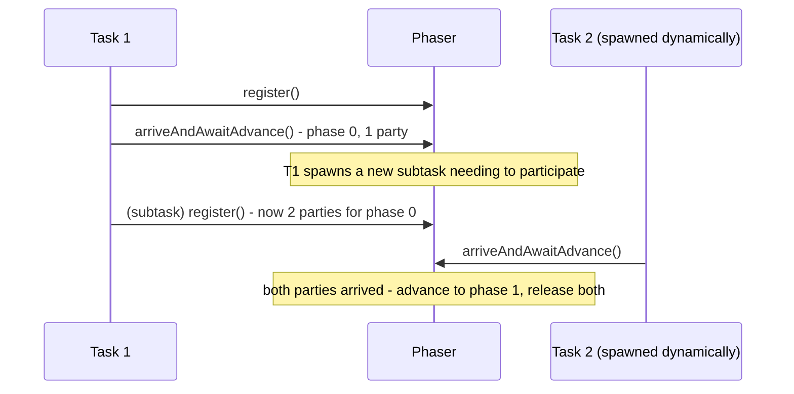

**JVM Behaviour**: Similar park/unpark mechanics as other `j.u.c` synchronizers for blocked waiters; the ability to dynamically register/deregister parties means the JVM-level bookkeeping (the packed state field) must handle concurrent registration changes alongside arrival signals, requiring careful CAS-based updates to avoid races between "a new party registers" and "the last known party arrives", which `Phaser`'s implementation handles internally.

#### Interview Questions
**Basic**
1. What key capability does `Phaser` offer that `CyclicBarrier` does not?
2. What's the difference between `arrive()` and `arriveAndAwaitAdvance()`?

**Intermediate**
1. What does `arriveAndDeregister()` do and when would you use it instead of just calling `arrive()`?
2. How does overriding `onAdvance()` let you control phaser termination?

**Advanced**
1. Why does `Phaser` support hierarchical (tiered) structures, and what problem does that solve?
2. What happens if a registered party never calls `arrive()` and never deregisters?

**Scenario-based**
1. You have a recursive parallel task where each task, upon starting, may spawn additional subtasks that also need to synchronize at the same phase boundary before any of them proceeds to the next phase. Would `CyclicBarrier` or `Phaser` be appropriate, and how would you use it?

#### Detailed Answers
1. **Key capability over CyclicBarrier**: Dynamic party registration/deregistration — `CyclicBarrier`'s party count is fixed forever at construction, while `Phaser` allows threads/tasks to join (`register()`) or leave (`arriveAndDeregister()`) between or even during phases, making it suitable for workloads where the set of participants changes dynamically (e.g., recursively spawned subtasks).
2. **arrive() vs arriveAndAwaitAdvance()**: `arrive()` signals this party's arrival for the current phase WITHOUT blocking — useful for a party that doesn't need to wait for others (e.g., a monitoring/logging participant, or the last action a thread performs before exiting entirely); `arriveAndAwaitAdvance()` signals arrival AND blocks the calling thread until the phase actually advances (i.e., until all currently registered parties have also arrived), analogous to `CyclicBarrier.await()`.
3. **arriveAndDeregister()**: Signals this party's arrival for the current phase AND simultaneously reduces the registered-party count by one, meaning the phaser will no longer wait for this party in future phases; use it when a participant has finished all the phases it needs to take part in and is exiting, so it doesn't accidentally stall future phase advancement by remaining "registered" without ever arriving again.
4. **onAdvance() and termination control**: `Phaser` calls `onAdvance(phase, registeredParties)` internally after each phase completes (all registered parties arrived); the default implementation terminates the phaser once `registeredParties` reaches zero, but you can override it to implement custom termination logic — e.g., terminate after a fixed number of phases regardless of registered parties, by checking `phase >= maxPhases` and returning `true` (terminate) or `false` (continue).
5. **Why hierarchical/tiered phasers**: With very large numbers of parties, having every single arrival/registration contend on one shared state field (via CAS) becomes a scalability bottleneck; organizing phasers into a tree (each child phaser synchronizes a subset of parties and reports up to a parent phaser) spreads contention across multiple independent state fields, similar in spirit to why `LongAdder` stripes counters — it trades a bit of coordination complexity for much better scalability at high party counts.
6. **Stuck registered party**: If a party registers but never calls `arrive()`/`arriveAndDeregister()`, the phaser can never advance past the current phase (it's permanently waiting for that one party), causing every other thread blocked in `arriveAndAwaitAdvance()` for that phase to wait indefinitely — functionally identical to the "stuck latch" problem with `CountDownLatch`, so registered parties must reliably arrive or explicitly deregister, ideally in a `finally` block to guard against exceptions.
7. **Recursive dynamic-subtask scenario**: `Phaser` is the appropriate choice, precisely because `CyclicBarrier` cannot accommodate a changing number of participants after construction; each task calls `phaser.register()` before spawning a subtask that will also participate, the subtask itself also registers, and each task calls `arriveAndAwaitAdvance()` at the phase boundary — as new subtasks register dynamically, the phaser correctly waits for the growing set of parties before advancing to the next phase, which a fixed-party `CyclicBarrier` fundamentally cannot support.

#### Code Examples
```java
import java.util.concurrent.Phaser;

public class DynamicParallelPhaseTask implements Runnable {
    private final Phaser phaser;
    private final int depth;

    public DynamicParallelPhaseTask(Phaser phaser, int depth) {
        this.phaser = phaser;
        this.depth = depth;
        phaser.register(); // dynamically join as a new party
    }

    @Override
    public void run() {
        try {
            doPhaseOneWork(depth);
            if (depth < 2) {
                // spawn a subtask that also registers and must sync at this phase
                Thread child = new Thread(new DynamicParallelPhaseTask(phaser, depth + 1));
                child.start();
            }
            phaser.arriveAndAwaitAdvance(); // wait for all currently registered parties
            doPhaseTwoWork(depth);
        } finally {
            phaser.arriveAndDeregister(); // leave cleanly so future phases don't wait on us
        }
    }

    private void doPhaseOneWork(int depth) { /* phase 1 logic */ }
    private void doPhaseTwoWork(int depth) { /* phase 2 logic */ }
}
```

### Semaphore

#### Theory
**Core Concepts**: `Semaphore` maintains a set of internal "permits" — threads call `acquire()` to take a permit (blocking if none are available) and `release()` to return one. It generalizes mutual exclusion (a `Semaphore(1)` behaves like a simple lock, called a "binary semaphore") to bounded concurrency control (`Semaphore(N)` allows up to N concurrent holders), commonly used to limit access to a finite resource pool.

**Internal Working**: Built on AQS in shared mode, using `state` as the current available-permit count; `acquire()` performs a CAS-decrement (blocking/parking if the count would go negative), `release()` performs a CAS-increment and wakes a waiting thread if one exists.

**When to Use It**: Limiting concurrent access to a finite resource (database connection pool sizing, limiting concurrent outbound HTTP calls to a rate-limited API, bounding the number of threads processing a specific expensive operation simultaneously).

**Advantages**: Simple, flexible API for both mutual exclusion (permits=1) and bounded-concurrency throttling (permits=N); unlike a lock, permits don't have to be released by the same thread that acquired them, which enables patterns like "one thread signals availability, another consumes it" (useful for producer-style signaling).

**Limitations**: Not automatically tied to any specific resource — it's purely a counter, so nothing prevents a thread from forgetting to `release()` (permanently shrinking the effective pool) or calling `release()` without a matching `acquire()` (inflating the pool beyond its intended size) if used incorrectly; no built-in tracking of "who holds which permit".

#### Internal Working
**Step-by-Step Explanation**: 1) Constructed with an initial permit count representing available capacity. 2) `acquire()`: attempts a CAS decrementing the permit count; if the result would be negative (no permits available), the calling thread is queued and parked (shared-mode AQS wait). 3) `release()`: CAS-increments the permit count, then if there are any queued/waiting threads, unparks (potentially) one of them to retry acquiring. 4) `tryAcquire()`/`tryAcquire(timeout, unit)` provide non-blocking or bounded-wait alternatives, mirroring `Lock.tryLock()`'s semantics.

**Memory Layout**: The permit count is a single volatile `int` (AQS `state`) on the heap; a fair-mode semaphore additionally respects strict FIFO ordering of the AQS wait queue (like fair `ReentrantLock`), while non-fair mode (default) allows barging for higher throughput.

**Diagrams**:
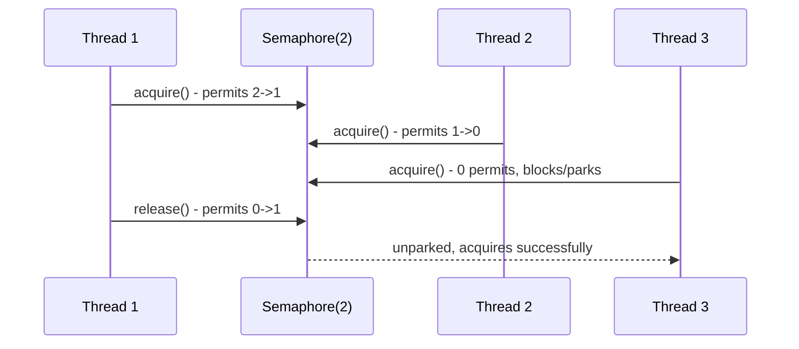

**JVM Behaviour**: Same park/unpark AQS-backed mechanics as other `j.u.c` synchronizers — blocked threads consume no CPU while waiting; because permits can be released by a different thread than the one that acquired them, `Semaphore` doesn't track "ownership" the way `ReentrantLock` tracks a recursion count for its owning thread, so there's no reentrancy concept and no `IllegalMonitorStateException`-style ownership checks.

#### Interview Questions
**Basic**
1. What does a `Semaphore` with 1 permit behave like?
2. What's the difference between `acquire()` and `tryAcquire()`?

**Intermediate**
1. Can a different thread release a permit than the one that acquired it? Why might that be useful?
2. What's the difference between fair and non-fair semaphores?

**Advanced**
1. How would you use a `Semaphore` to limit concurrent outbound calls to a rate-limited third-party API to, say, 5 at a time?
2. What bugs can arise from mismatched acquire/release calls, and how would you defend against them?

**Scenario-based**
1. Your service has a connection pool of 20 database connections; you want any code path needing a connection to block if all 20 are in use, and safely release the slot when done, even on exception. Design this with `Semaphore`.

#### Detailed Answers
1. **Semaphore(1) behavior**: It behaves like a binary semaphore/mutual-exclusion lock — only one thread can `acquire()` successfully at a time until `release()` is called, functionally similar to a lock but without reentrancy or ownership tracking (any thread can call `release()`, not just the one that acquired).
2. **acquire() vs tryAcquire()**: `acquire()` blocks indefinitely (interruptibly) until a permit becomes available; `tryAcquire()` returns immediately with `true`/`false` depending on whether a permit was available at that instant (or `tryAcquire(timeout, unit)` for a bounded wait), letting the caller apply a non-blocking or timeout-based strategy instead of waiting forever.
3. **Cross-thread release**: Yes — `Semaphore` has no ownership concept, so any thread can call `release()` regardless of which thread called `acquire()`; this enables useful patterns like a producer thread "releasing" permits to signal availability of work items for consumer threads to "acquire", effectively using the semaphore as a counting signal mechanism rather than strictly a mutual-exclusion device.
4. **Fair vs non-fair**: Fair semaphores grant permits to threads in the exact order they requested them (FIFO, avoiding starvation but with higher overhead due to guaranteed context switches to wake the specific next-in-line thread); non-fair (default) semaphores allow a newly arriving thread to "barge" ahead of already-waiting threads if a permit happens to be available at that instant, generally yielding higher throughput at the cost of potential (bounded) unfairness.
5. **Rate-limiting outbound calls**: Create `new Semaphore(5)`; before making an outbound call, call `semaphore.acquire()` (blocking until one of the 5 "slots" is free), make the call, then `semaphore.release()` in a `finally` block — this guarantees at most 5 concurrent in-flight calls to the rate-limited API regardless of how many threads attempt to call it simultaneously.
6. **Mismatched acquire/release bugs**: Forgetting to `release()` (e.g., an exception skips the release call) permanently shrinks the effective permit pool, eventually starving all callers; calling `release()` without a matching `acquire()` (a logic bug) inflates the pool beyond its intended capacity, silently violating the concurrency limit you meant to enforce. Defense: always wrap the acquire/release pair in try/finally (`acquire()` before the try block, `release()` in the finally), and consider using a wrapper/try-with-resources-style utility to make the pattern less error-prone.
7. **Connection pool scenario**: Use `Semaphore(20)` alongside the actual connection pool data structure; any code needing a connection calls `semaphore.acquire()` (blocking if all 20 slots are in use) then takes a connection from the pool, and in a `finally` block returns the connection to the pool and calls `semaphore.release()` — ensuring the release always happens even if the code using the connection throws an exception, thus never leaking a "slot" permanently.

#### Code Examples
```java
import java.util.concurrent.Semaphore;

public class RateLimitedApiClient {
    private final Semaphore concurrencyLimit = new Semaphore(5); // max 5 in-flight calls

    public String callExternalApi(String request) throws InterruptedException {
        concurrencyLimit.acquire(); // blocks if 5 calls are already in flight
        try {
            return performHttpCall(request);
        } finally {
            concurrencyLimit.release(); // always release, even on exception
        }
    }

    private String performHttpCall(String request) {
        return "response-for-" + request; // simulated external call
    }
}
```

### Exchanger

#### Theory
**Core Concepts**: `Exchanger<V>` provides a synchronization point at which exactly two threads can swap (exchange) objects — each thread calls `exchange(myObject)` and blocks until the other thread arrives with its own object, at which point each returns with the OTHER thread's object. It's a specialized, highly efficient two-party rendezvous, distinct from the N-party coordination of `CyclicBarrier`/`Phaser`.

**Internal Working**: Internally uses a small array of "slots" (to reduce contention when used by many pairs concurrently) where the first arriving thread publishes its item and waits (spins briefly, then parks), and the second arriving thread picks it up, publishes its own item in exchange, and wakes the first.

**When to Use It**: Pipeline designs where two threads need to periodically swap buffers (e.g., a producer filling one buffer while a consumer drains a previously-filled buffer, then swapping roles/buffers each cycle) — the classic "double buffering" hand-off pattern.

**Advantages**: More efficient and purpose-built for exactly two-party data exchange than manually coordinating with a `BlockingQueue` in both directions; the exchange is truly symmetric and simultaneous (neither thread proceeds until both have handed off their data).

**Limitations**: Only supports exactly two parties — not a general N-thread barrier; if one party never calls `exchange()`, the other blocks forever (unless using the timed `exchange(item, timeout, unit)` overload); relatively niche/rarely used compared to other synchronizers, so less commonly understood.

#### Internal Working
**Step-by-Step Explanation**: 1) Thread A calls `exchange(itemA)`; finding no other thread currently waiting, it publishes `itemA` into a shared slot and waits (briefly spinning, since exchanges are expected to complete quickly, then parking if the wait extends). 2) Thread B calls `exchange(itemB)`; it finds Thread A's published item in the slot, atomically claims it (CAS), places `itemB` into the slot in its place, and returns `itemA` to its own caller. 3) The CAS success also serves as the signal that wakes Thread A (if it had parked), which then reads `itemB` from the slot and returns it to its own caller. 4) To reduce contention when many thread-pairs use the same `Exchanger` concurrently, the implementation uses multiple slots (an array), assigning different pairs to different slots to avoid unnecessary contention/failed CAS retries between unrelated pairs.

**Memory Layout**: A small `Node[]` array of exchange slots lives on the heap; each `Node` holds the currently offered item and a reference to the waiting thread (for parking/unparking), manipulated via CAS — no traditional lock object is used, favoring a lock-free design similar in spirit to `ConcurrentLinkedQueue`'s approach.

**Diagrams**:
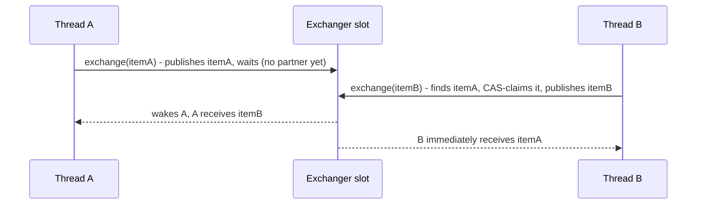

**JVM Behaviour**: Uses brief adaptive spinning before parking (since an exchange partner is often expected to arrive very soon, spinning avoids the cost of a full park/unpark cycle for the common case), falling back to `LockSupport.park()` if the wait extends — a hybrid strategy tuned for the typical low-latency, short-wait nature of exchange rendezvous.

#### Interview Questions
**Basic**
1. What does `Exchanger.exchange()` do, and how many threads can participate in a single exchange?
2. What happens if only one thread ever calls `exchange()` on a given `Exchanger` instance?

**Intermediate**
1. Give a practical use case for `Exchanger` (e.g., a buffer-swapping pattern).
2. How does `Exchanger` differ from using a `SynchronousQueue` in both directions to achieve a similar hand-off?

**Advanced**
1. How does `Exchanger`'s internal implementation reduce contention when many independent thread-pairs use the same `Exchanger` instance concurrently?
2. Why does `Exchanger` use adaptive spinning before parking, and when would that be a wrong trade-off?

**Scenario-based**
1. You have a producer thread filling a data buffer and a consumer thread processing a previously filled buffer; when the producer finishes filling and the consumer finishes processing, they should swap buffers so each continues working, without any data copying. Design this with `Exchanger`.

#### Detailed Answers
1. **exchange() behavior**: Each of exactly two threads calls `exchange(myItem)`; the method blocks until the OTHER thread also calls `exchange()`, at which point both calls return simultaneously, each yielding the object the OTHER thread supplied — it's strictly a two-party construct, not usable for three or more threads directly.
2. **Only one thread ever calls exchange()**: That thread blocks forever waiting for a partner (unless you use the timed overload `exchange(item, timeout, unit)`, which throws `TimeoutException` after the specified duration instead of waiting indefinitely).
3. **Practical use case**: Double-buffering between a producer and consumer — the producer fills buffer A while the consumer processes a previously-filled buffer B; once both finish their respective work for the current cycle, they call `exchange()` to swap buffer references (producer now fills what was buffer B, consumer now processes what was buffer A), avoiding any data copying between them.
4. **vs SynchronousQueue in both directions**: You could approximate an exchange using two `SynchronousQueue`s (one for each direction), but `Exchanger` is purpose-built and more efficient for this exact symmetric hand-off — it avoids the overhead of two separate queue objects and their associated bookkeeping, and its API directly expresses the intent ("swap items") more clearly than composing two queues would.
5. **Reducing contention across many pairs**: `Exchanger` internally maintains an array of multiple exchange "slots" rather than one single shared slot; when many independent thread-pairs use the same `Exchanger` concurrently, they can be spread across different slots (assigned based on a hashed/randomized index, with retry-and-rehash on contention), reducing the chance that unrelated pairs interfere with each other's CAS attempts on the same slot.
6. **Adaptive spinning trade-off**: Since exchange partners are often expected to arrive very soon (both threads are typically actively working toward the rendezvous point), briefly spinning avoids the relatively higher latency/overhead cost of a full thread park and subsequent OS-level unpark wake-up for what's expected to be a short wait; this becomes the wrong trade-off if exchange partners might legitimately take a long time to arrive (e.g., unpredictable, occasionally slow processing), in which case spinning would waste CPU cycles that could have been used productively elsewhere — for such cases, a `SynchronousQueue`-based or blocking-based hand-off with no spinning assumption might be more appropriate.
7. **Buffer-swap scenario**: Both producer and consumer threads hold a reference to a shared `Exchanger<DataBuffer>`; producer fills its current buffer completely, then calls `exchanger.exchange(filledBuffer)`, receiving back the buffer the consumer just finished processing (now empty/ready to refill); consumer processes its current buffer completely, then calls `exchanger.exchange(processedBuffer)`, receiving the newly filled buffer to process next — both calls rendezvous and swap simultaneously each cycle, with zero data copying since only references are exchanged.

#### Code Examples
```java
import java.util.concurrent.Exchanger;

public class DoubleBufferPipeline {
    private final Exchanger<StringBuilder> exchanger = new Exchanger<>();

    public void startProducer() {
        new Thread(() -> {
            StringBuilder buffer = new StringBuilder();
            try {
                while (true) {
                    fillBuffer(buffer); // producer fills its current buffer
                    buffer = exchanger.exchange(buffer); // swap for consumer's emptied buffer
                }
            } catch (InterruptedException e) {
                Thread.currentThread().interrupt();
            }
        }).start();
    }

    public void startConsumer() {
        new Thread(() -> {
            StringBuilder buffer = new StringBuilder();
            try {
                while (true) {
                    buffer = exchanger.exchange(buffer); // receive producer's filled buffer
                    processBuffer(buffer); // consumer processes it, then clears for reuse
                    buffer.setLength(0);
                }
            } catch (InterruptedException e) {
                Thread.currentThread().interrupt();
            }
        }).start();
    }

    private void fillBuffer(StringBuilder buffer) { buffer.append("data"); }
    private void processBuffer(StringBuilder buffer) { System.out.println("Processing: " + buffer); }
}
```

## `ThreadLocal` *(new)*

#### Theory
**Core Concepts**: `ThreadLocal<T>` provides a variable that has an independent, isolated value PER THREAD — each thread accessing a given `ThreadLocal` instance sees its own separately initialized copy, invisible to other threads. It's commonly used to avoid passing context (e.g., a database connection, a security/user context, a `SimpleDateFormat` instance) through every method signature in a call chain, or to give each thread its own mutable scratch state without synchronization.

**Internal Working**: Each `Thread` object has its own private `ThreadLocalMap` (a specialized hash map); calling `threadLocal.get()/set()` looks up/stores the value keyed by the `ThreadLocal` instance itself within the CURRENT thread's map — there's no shared/central storage at all.

**When to Use It**: Per-thread caching of non-thread-safe objects (e.g., `SimpleDateFormat`/`DateTimeFormatter` instances, though modern `DateTimeFormatter` is actually thread-safe so this is less needed now), request-scoped context propagation in frameworks (e.g., transaction context, logging MDC/correlation IDs), avoiding "parameter drilling" through many layers of unrelated method calls.

**Advantages**: No synchronization needed at all (each thread only ever touches its own copy — there's no shared mutable state to protect); avoids threading non-thread-safe objects through call stacks explicitly.

**Limitations**: Major memory leak risk in thread-pooled environments (e.g., application servers) if not removed via `remove()` — since pooled threads live indefinitely, a `ThreadLocal` value set and forgotten persists for the thread's entire lifetime, potentially leaking large objects or (worse) classloaders in web app redeployment scenarios; makes code harder to test/reason about since it introduces implicit, non-obvious state; doesn't automatically propagate to child threads (though `InheritableThreadLocal` addresses that specific case) and is fundamentally incompatible with the "cheap, numerous" nature of virtual threads if used carelessly at scale (millions of virtual threads each carrying a ThreadLocal map entry).

#### Internal Working
**Step-by-Step Explanation**: 1) Each `Thread` object has a package-private field `threadLocals` of type `ThreadLocal.ThreadLocalMap` (lazily created on first use). 2) `threadLocal.set(value)` computes `Thread.currentThread().threadLocals` (creating the map if absent) and stores an entry keyed by the `ThreadLocal` instance itself (using a `WeakReference` to the `ThreadLocal` as the key, to allow garbage collection of the `ThreadLocal` object itself if nothing else references it). 3) `threadLocal.get()` looks up the entry in the CURRENT thread's map; if absent, calls `initialValue()` (or the `Supplier` passed to `withInitial()`) to lazily compute and store a default. 4) `threadLocal.remove()` explicitly deletes the entry from the current thread's map, which is critical in pooled-thread environments to prevent leaking the value (and, since the map uses weak references to `ThreadLocal` keys but STRONG references to the values, a forgotten value can keep large objects alive indefinitely as long as the thread itself lives).

**Memory Layout**: The value lives inside the specific `Thread` object's own `ThreadLocalMap` (an array of `Entry` objects using open addressing/linear probing, similar in design to `HashMap` but specialized), NOT on the heap in some globally shared location keyed only by the `ThreadLocal` — conceptually, think of it as "a hidden field appended to each Thread object", meaning the value's lifetime is tied to the thread's lifetime unless explicitly removed.

**Diagrams**:
```
Thread A: threadLocals -> { [WeakRef(tl1)] -> "contextForA", [WeakRef(tl2)] -> connA }
Thread B: threadLocals -> { [WeakRef(tl1)] -> "contextForB", [WeakRef(tl2)] -> connB }

tl1.get() called from Thread A -> looks in Thread A's own map -> "contextForA"
tl1.get() called from Thread B -> looks in Thread B's own map -> "contextForB"
(completely independent, no synchronization needed between A and B)
```

**JVM Behaviour**: Because each thread only ever reads/writes its own `ThreadLocalMap`, there is zero cross-thread contention or need for volatile/CAS/locking on the value itself; the JVM's thread-pool reuse (in `ExecutorService`) means a `ThreadLocalMap` entry set by one submitted task can silently "leak" into a completely unrelated subsequent task run on the same pooled thread if not explicitly removed — a frequent source of subtle production bugs (stale security context, wrong tenant ID, etc. bleeding across requests).

#### Interview Questions
**Basic**
1. What problem does `ThreadLocal` solve?
2. Why is calling `remove()` important when using `ThreadLocal` with a thread pool?

**Intermediate**
1. Where is a `ThreadLocal`'s value actually stored internally?
2. What is `InheritableThreadLocal` and what limitation of plain `ThreadLocal` does it address?

**Advanced**
1. Explain the memory leak risk of `ThreadLocal` in application-server/thread-pool environments in detail, including why `WeakReference` keys alone don't fully solve it.
2. Why is heavy `ThreadLocal` usage potentially problematic in a virtual-threads-based application design (Project Loom)?

**Scenario-based**
1. A web application uses a `ThreadLocal<User>` to store the currently authenticated user for the duration of a request, set in a servlet filter. What must the filter do to avoid leaking user context between requests, given the underlying thread pool reuses threads?

#### Detailed Answers
1. **Problem it solves**: It gives each thread its own independent copy of a variable without needing synchronization, avoiding the need to pass context objects (e.g., current user, transaction, non-thread-safe formatter) through every method call in a chain — essentially a form of implicit, thread-scoped "global" storage.
2. **Why remove() matters in pools**: Pooled threads are long-lived and reused across many different tasks/requests; if you `set()` a value and never `remove()` it, that value remains attached to the underlying `Thread` object indefinitely (as long as the thread lives), meaning the NEXT unrelated task run on that same pooled thread could inadvertently see stale data from a previous task, and the object itself (and anything it references, potentially large graphs or entire classloaders) is never eligible for garbage collection until the thread terminates or the value is explicitly removed.
3. **Where the value is stored**: In a `ThreadLocalMap` instance that is itself a private field ON the `Thread` object (`Thread.threadLocals`), not in some shared structure indexed by the `ThreadLocal`; the map's entries use `WeakReference<ThreadLocal<?>>` as keys (so the `ThreadLocal` object itself can be GC'd if nothing else holds a strong reference to it) but STRONG references for the stored values.
4. **InheritableThreadLocal**: A subclass of `ThreadLocal` where a value set in a parent thread is automatically copied (via `childValue()`, which can be overridden) into any child thread created (via `new Thread()`) after that point, at the moment of the child thread's creation; this addresses the limitation that plain `ThreadLocal` values do NOT propagate to newly spawned child threads by default (each thread's map is entirely independent), useful for e.g. propagating a request ID into worker threads spawned to handle sub-tasks (though it does NOT work automatically with thread-pool-based executors, since pool threads are created once upfront, not per-task).
5. **Memory leak risk in detail**: Even though the map's KEYS are weak references (allowing the `ThreadLocal` object itself to be collected once no other strong references remain, at which point the entry becomes a "stale entry" eligible for cleanup on the NEXT map operation), the corresponding VALUE is still strongly referenced until that stale-entry cleanup actually happens — and cleanup only occurs opportunistically during subsequent `get()`/`set()`/`remove()` calls on that same map (via `expungeStaleEntry`), which may never happen again if the thread simply sits idle in a pool without further `ThreadLocal` activity; so weak keys alone don't guarantee timely value cleanup, they only prevent the `ThreadLocal` instance itself (not necessarily its stored value) from being permanently unreclaimable.
6. **Problem with virtual threads**: Project Loom's virtual threads are designed to be extremely cheap and numerous (potentially millions concurrently), but each virtual thread still carries its own full `ThreadLocalMap` if it uses `ThreadLocal` — at massive scale, this multiplies memory overhead across millions of thread instances in a way that undermines the lightweight design goal of virtual threads; this is a primary motivation behind the newer `ScopedValue` API (Java 20+ incubating/preview, stabilizing in later versions), which is designed to avoid this per-thread-map overhead and support structured, immutable context sharing more efficiently, especially with very high thread counts.
7. **Servlet filter scenario**: The filter must set the `ThreadLocal<User>` value at the start of request processing and then, critically, call `remove()` in a `finally` block that always executes after the request completes (regardless of whether the request handling succeeded or threw an exception) — this guarantees the pooled thread's `ThreadLocalMap` entry is cleared before that thread is returned to the pool and potentially reused for a completely different (and possibly differently-authenticated) subsequent request, preventing user-context leakage across requests.

#### Code Examples
```java
public class RequestContextFilter {
    private static final ThreadLocal<String> currentUser = new ThreadLocal<>();

    public static void handleRequest(String userId, Runnable requestHandler) {
        currentUser.set(userId); // set context for this thread, for this request only
        try {
            requestHandler.run(); // downstream code can call currentUser.get() freely
        } finally {
            currentUser.remove(); // CRITICAL: prevents leaking context to the next
                                   // request handled by this pooled thread
        }
    }

    public static String getCurrentUser() {
        return currentUser.get();
    }
}
```

## Virtual Threads (Project Loom) *(new)*

#### Theory
**Core Concepts**: Virtual threads (finalized in Java 21 via JEP 444, part of Project Loom) are lightweight, JVM-managed threads that dramatically reduce the cost of "one thread per task/request" programming. Unlike platform threads (each a thin wrapper around one dedicated OS thread), virtual threads are scheduled by the JVM onto a small pool of underlying OS "carrier" threads, allowing millions of virtual threads to exist simultaneously, most of them idle/blocked on I/O.

**Internal Working**: When a virtual thread performs a blocking operation (I/O, `Thread.sleep`, most `java.util.concurrent` blocking calls), the JVM automatically "unmounts" it from its carrier OS thread (freeing that OS thread to run a different virtual thread) and later "mounts" it back onto a (possibly different) carrier thread once the blocking operation completes — all transparently, without changing the blocking-style code you write.

**When to Use It**: High-throughput, I/O-bound server applications (web servers, microservices making many blocking downstream calls) that traditionally scaled thread count with concurrent requests — virtual threads let you keep the simple "one thread per request", synchronous, blocking coding style while achieving the scalability previously requiring complex asynchronous/reactive programming.

**Advantages**: Massive scalability for I/O-bound workloads (can support far more concurrent blocking operations than platform threads, whose OS-level cost limits practical counts to thousands); preserves familiar synchronous/blocking code style (no need for `CompletableFuture` chains or reactive operators just for scalability); integrates with existing `Thread`/`ExecutorService` APIs (`Executors.newVirtualThreadPerTaskExecutor()`).

**Limitations**: NOT faster for CPU-bound work (virtual threads don't add more CPU parallelism — the number of CPU cores is still the hard limit for compute-bound tasks); `synchronized` blocks/methods historically "pin" a virtual thread to its carrier thread during blocking operations inside them (a virtual thread executing a blocking call while holding a monitor cannot unmount, defeating the scalability benefit) — this was significantly improved in newer JDK versions but was a major early caveat; heavy `ThreadLocal` usage across millions of virtual threads multiplies memory overhead; thread-pool-sizing tuning knowledge from platform threads mostly doesn't apply (virtual threads are meant to be created lavishly, one per task, never pooled).

#### Internal Working
**Step-by-Step Explanation**: 1) `Thread.ofVirtual().start(task)` (or `Executors.newVirtualThreadPerTaskExecutor().submit(task)`) creates a virtual thread; creation is extremely cheap (no OS thread allocated up front, just a small JVM-level object). 2) The JVM's built-in scheduler (a `ForkJoinPool` in FIFO/work-stealing mode, by default sized to `availableProcessors()`) assigns the virtual thread to run on an available carrier (platform) thread. 3) When the virtual thread's code calls a blocking operation that has been made "Loom-aware" (most JDK blocking I/O, `Thread.sleep`, `java.util.concurrent` locks/queues), the runtime captures the virtual thread's continuation (its execution state) and unmounts it from the carrier thread, which is then free to run a different virtual thread. 4) Once the blocking operation's condition is satisfied (data arrives, timer elapses), the virtual thread is re-queued for scheduling and eventually remounted onto SOME available carrier thread (not necessarily the same one) to continue execution exactly where it left off.

**Memory Layout**: A virtual thread's stack is NOT a fixed, pre-allocated large OS thread stack (typically ~512KB-1MB for platform threads) — instead, its call stack is represented as a growable/shrinkable heap-allocated data structure (a "continuation", conceptually similar to how coroutines represent suspended execution state), allowing the JVM to store potentially millions of them with much smaller per-thread memory footprint than platform threads would require.

**Diagrams**:
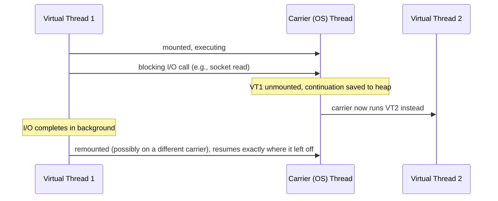

**JVM Behaviour**: The scheduler underlying virtual threads is a specialized `ForkJoinPool` (in FIFO scheduling mode rather than the default LIFO work-stealing mode used for `ForkJoinTask`s, to ensure fairness for many small tasks); `synchronized` blocks historically prevented unmounting ("pinning") because releasing/reacquiring a monitor across an unmount/remount cycle wasn't originally supported — JEP 444-era JDKs improved this substantially (much of `synchronized`'s pinning behavior was addressed in JDK 24, JEP 491), but developers should still prefer `java.util.concurrent.locks.ReentrantLock` over `synchronized` in virtual-thread-heavy code for guaranteed non-pinning behavior on older JDKs.

#### Interview Questions
**Basic**
1. What is the core difference between a virtual thread and a platform thread?
2. Do virtual threads make CPU-bound code run faster?

**Intermediate**
1. What does it mean for a virtual thread to be "unmounted" from its carrier thread, and when does this happen?
2. How do you create and use virtual threads in modern Java?

**Advanced**
1. Explain "thread pinning" in the context of virtual threads and why `synchronized` historically caused it.
2. Why is heavy use of a fixed-size, tuned `ThreadPoolExecutor` an anti-pattern to simply replace 1:1 with virtual threads?

**Scenario-based**
1. Your microservice currently uses a `ThreadPoolExecutor` with 200 threads to handle concurrent requests, each of which makes several blocking downstream HTTP/database calls, and you're hitting thread-count limits under load. How would migrating to virtual threads help, and what must you check/change in the code?

#### Detailed Answers
1. **Core difference**: A platform thread is a thin, 1:1 wrapper directly around a native OS thread (expensive to create, limited in practical count to thousands due to OS/memory constraints, fixed-size stack); a virtual thread is a JVM-managed, lightweight construct that's multiplexed onto a small pool of carrier (platform) OS threads by the JVM's own scheduler, allowing millions to exist concurrently since most are unmounted (not consuming an OS thread) while blocked.
2. **CPU-bound speedup?**: No — virtual threads don't add more CPU cores or increase raw compute parallelism; for genuinely CPU-bound work, the number of concurrently RUNNING (mounted) virtual threads is still bounded by the number of available carrier threads/CPU cores, so virtual threads provide no benefit (and add slight overhead) for compute-heavy workloads — their benefit is specifically for I/O-bound/blocking-heavy concurrency.
3. **Unmounting**: When a virtual thread's code invokes a blocking operation that the JVM has made "virtual-thread-aware" (most I/O, `Thread.sleep`, java.util.concurrent locking primitives), instead of blocking the underlying OS carrier thread, the JVM saves the virtual thread's execution state (its continuation) and detaches it from the carrier thread, freeing that carrier thread to execute a different ready virtual thread — this happens transparently without any special code from the developer.
4. **Creating/using virtual threads**: `Thread.ofVirtual().start(runnable)` creates and starts one directly; more commonly for application code, `Executors.newVirtualThreadPerTaskExecutor()` returns an `ExecutorService` that creates a brand-new virtual thread for every submitted task (rather than pooling/reusing threads, since virtual threads are meant to be cheap and disposable) — existing code using `ExecutorService.submit()`/`Future` works unchanged, just swap the executor implementation.
5. **Thread pinning**: "Pinning" occurs when a virtual thread cannot be unmounted from its carrier during a blocking operation, forcing the carrier (a real OS thread) to sit blocked too — defeating the scalability benefit for that duration. Historically, executing a blocking operation WHILE holding a `synchronized` monitor caused pinning, because the JVM's original implementation of unmounting couldn't safely suspend/resume a thread that held a native monitor lock across the unmount boundary; this was significantly mitigated in later JDK releases (JEP 491 in JDK 24 removed most synchronized-related pinning), but code targeting earlier Loom-era JDKs should prefer `ReentrantLock` over `synchronized` around blocking calls to avoid pinning.
6. **Why not just replace ThreadPoolExecutor with virtual threads**: Traditional pool tuning (sizing `corePoolSize`/`maximumPoolSize` to balance OS thread cost against concurrency) is based on the assumption that OS threads are an expensive, scarce resource requiring careful reuse; virtual threads are explicitly designed to be cheap and disposable, so "pooling" them (reusing a fixed small number of virtual threads across many tasks) actually works against their design — the idiomatic pattern is to create a new virtual thread PER TASK/request via `newVirtualThreadPerTaskExecutor()`, letting the JVM's own scheduler handle multiplexing onto a much smaller, appropriately-sized carrier thread pool automatically.
7. **Migration scenario**: Switching to `Executors.newVirtualThreadPerTaskExecutor()` would allow the service to handle far more concurrent in-flight requests without being limited by platform-thread-count/OS-thread memory overhead, since each request gets its own cheap virtual thread that unmounts during blocking downstream calls, freeing the small set of carrier threads to service other requests during those blocking waits. Before migrating, you must audit the codebase for: (a) any `synchronized` blocks wrapping blocking I/O calls (potential pinning on older JDKs — consider `ReentrantLock` instead), (b) heavy reliance on `ThreadLocal` (multiplied across potentially many more concurrent virtual threads, increasing memory pressure), and (c) any code that assumes a small, fixed thread count (e.g., thread-count-based capacity calculations) which would need rethinking under the new model.

#### Code Examples
```java
import java.util.concurrent.ExecutorService;
import java.util.concurrent.Executors;
import java.util.concurrent.Future;
import java.util.List;
import java.util.ArrayList;

public class VirtualThreadServer {
    public static void main(String[] args) throws InterruptedException {
        // One virtual thread PER TASK - cheap and disposable, not pooled
        try (ExecutorService executor = Executors.newVirtualThreadPerTaskExecutor()) {
            List<Future<String>> futures = new ArrayList<>();
            for (int i = 0; i < 10_000; i++) { // 10,000 concurrent "requests"
                int requestId = i;
                futures.add(executor.submit(() -> handleRequest(requestId)));
            }
            for (Future<String> f : futures) {
                try {
                    f.get();
                } catch (Exception e) {
                    System.err.println("Request failed: " + e);
                }
            }
        } // executor.close() waits for all tasks, called automatically here
    }

    private static String handleRequest(int requestId) throws InterruptedException {
        Thread.sleep(50); // simulates a blocking downstream call - unmounts the virtual thread
        return "response-" + requestId;
    }
}
```

## Structured Concurrency *(new)*

#### Theory
**Core Concepts**: Structured concurrency (`java.util.concurrent.StructuredTaskScope`, a JDK preview/incubating API evolving through JEP 428/437/453/499 across Java 19-24+) enforces that a group of related concurrent subtasks launched together must ALL complete (or be cancelled) before the enclosing scope/block exits — mirroring how structured programming ensures a method's control flow can't "leak" past its braces. This eliminates the common bugs of orphaned/leaked threads and makes cancellation and error propagation across a fork of subtasks automatic and reliable.

**Internal Working**: A `StructuredTaskScope` is used in a try-with-resources block; subtasks are `fork()`-ed within it (each running on its own virtual thread by default), and `scope.join()` waits for the configured completion policy (e.g., "all succeed" or "first success/failure") before the block exits — the scope's `close()` (called automatically by try-with-resources) guarantees no subtask outlives the scope, cancelling any still-running ones.

**When to Use It**: Fanning out to multiple concurrent subtasks that logically belong to one parent operation (e.g., calling several downstream services to compose one response) where you want automatic "if one fails, cancel the rest" semantics and a guarantee that no subtask leaks beyond the parent's lifetime, replacing more error-prone manual `CompletableFuture`/`ExecutorService` fan-out/fan-in code.

**Advantages**: Guarantees no leaked/orphaned threads (unlike manually spawned threads or unmanaged `CompletableFuture` chains, where a "forgotten" subtask can keep running after its logical parent operation has already returned); automatic propagation of cancellation (if the parent is cancelled/fails, all child subtasks are cancelled too) and clearer error handling (exceptions from subtasks surface coherently at the join point); makes concurrent code's structure mirror sequential code's call-stack-like nesting, improving readability and observability (e.g., thread dumps show the parent-child task relationship clearly).

**Limitations**: Still a preview/incubating API as of several recent JDK versions (subject to API changes between releases — always check the exact JDK version's finalized shape); requires structuring code around the scope's try-with-resources pattern, a mental model shift from ad-hoc thread/executor usage; designed to compose with virtual threads, so full benefit requires adopting that model too.

#### Internal Working
**Step-by-Step Explanation**: 1) Open a scope with a specific completion policy, e.g. `try (var scope = new StructuredTaskScope.ShutdownOnFailure()) { ... }` (cancel all remaining subtasks as soon as any one fails) or `ShutdownOnSuccess` (cancel the rest once any one succeeds, useful for redundant/racing calls). 2) Call `scope.fork(() -> callServiceA())`, `scope.fork(() -> callServiceB())` — each runs on its own (typically virtual) thread, tracked as a child of this scope. 3) Call `scope.join()` — blocks until either all subtasks complete, or the completion policy's cancellation trigger fires (e.g., first failure), at which point still-running subtasks are interrupted/cancelled. 4) On scope exit (end of try-with-resources block, i.e., `close()`), the scope verifies NO subtask is still running — it forcibly waits for/cancels any stragglers, guaranteeing the scope's lifetime strictly bounds all its children's lifetimes, so nothing can outlive the enclosing block.

**Memory Layout**: Each forked subtask runs on its own (typically virtual) thread with its own stack/continuation (heap-allocated for virtual threads, as discussed under Virtual Threads); the scope object itself tracks child task handles/results in a heap-allocated internal structure, establishing an explicit parent-child relationship absent from ad-hoc thread creation.

**Diagrams**:
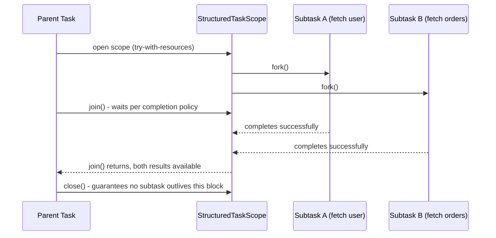

**JVM Behaviour**: Designed to pair naturally with virtual threads — forking a subtask typically starts a new virtual thread, so fanning out to even hundreds of subtasks is cheap; the scope's enforced lifetime bounding means thread dumps/observability tools can present a clear task hierarchy (parent scope and its children), unlike unstructured thread pools where correlating "which threads belong to which logical operation" is often impossible.

#### Interview Questions
**Basic**
1. What problem does structured concurrency solve compared to manually spawning threads or using `CompletableFuture` fan-out?
2. What does it mean for subtasks to not "outlive" their enclosing scope?

**Intermediate**
1. What's the difference between `ShutdownOnFailure` and `ShutdownOnSuccess` completion policies?
2. How does structured concurrency improve error propagation compared to unmanaged `CompletableFuture` chains?

**Advanced**
1. Explain how structured concurrency guarantees no orphaned threads, using the try-with-resources/scope-close mechanism.
2. How does structured concurrency relate to and typically compose with virtual threads?

**Scenario-based**
1. You need to call three independent services to build one API response; if any one of them fails, you want to immediately cancel the other two in-flight calls and propagate the failure. Design this with `StructuredTaskScope`.

#### Detailed Answers
1. **Problem solved**: Manually spawned threads or ad-hoc `CompletableFuture` fan-out provide no structural guarantee that all related subtasks are properly waited-for, cancelled together on failure, or cleaned up — it's easy to "fire and forget" a subtask that keeps running after its logical parent has already returned/failed (an orphaned/leaked thread), and error handling across multiple independent futures requires manual, error-prone coordination. Structured concurrency enforces, at the API/language level, that a scope's subtasks are all captured, waited-for, and cancelled together as a single unit, closing off this class of bugs.
2. **Not outliving the scope**: The scope's `close()` (invoked automatically at the end of the try-with-resources block) blocks until every forked subtask has either completed or been definitively cancelled/interrupted — it is impossible for a subtask to still be running after the enclosing block exits, unlike a raw `Thread.start()` or an unawaited `CompletableFuture`, which can keep executing indefinitely detached from any enclosing code block.
3. **ShutdownOnFailure vs ShutdownOnSuccess**: `ShutdownOnFailure` cancels all other still-running subtasks as soon as ANY one subtask fails (appropriate when you need ALL subtasks to succeed for the overall operation to be meaningful, e.g., composing a response from several required service calls); `ShutdownOnSuccess` cancels the remaining subtasks as soon as ANY one subtask succeeds (appropriate for redundant/racing calls where you only need the first successful result, e.g., querying multiple mirrored/replica services and taking whichever responds first).
4. **Improved error propagation**: With unmanaged `CompletableFuture` fan-out, each future's exception is captured independently and easily forgotten/unobserved if you don't explicitly check every one; `StructuredTaskScope.join()` combined with the chosen completion policy surfaces failures coherently at a single, well-defined point (e.g., `scope.throwIfFailed()` in `ShutdownOnFailure` re-throws the first subtask's exception), and crucially also ensures the OTHER subtasks are properly cancelled rather than continuing to run wastefully or produce results nobody will use.
5. **Guarantee against orphaned threads mechanism**: Because forking subtasks is only possible within an open scope, and the scope is used via try-with-resources, the Java language's own guarantee that `close()` runs when the block exits (normally or via exception) is leveraged to ensure the scope always gets a chance to wait-for/cancel its children; the scope's `close()` implementation explicitly blocks until all forked subtasks reach a terminal state (completed or cancelled), so control simply cannot proceed past the block while any child task is still active — turning "don't leak threads" from a manual discipline into a structurally enforced guarantee.
6. **Relationship to virtual threads**: Structured concurrency and virtual threads are designed as complementary Project Loom features — `StructuredTaskScope.fork()` typically launches each subtask on its own virtual thread, making it cheap to fan out to many subtasks; virtual threads provide the lightweight execution vehicle, while structured concurrency provides the discipline/guarantees around how groups of those (or any) threads are coordinated, cancelled, and cleaned up as a unit.
7. **Three-service fan-out scenario**: Use `try (var scope = new StructuredTaskScope.ShutdownOnFailure()) { var userTask = scope.fork(this::callUserService); var orderTask = scope.fork(this::callOrderService); var inventoryTask = scope.fork(this::callInventoryService); scope.join().throwIfFailed(); return combine(userTask.get(), orderTask.get(), inventoryTask.get()); }` — if any of the three calls throws, `ShutdownOnFailure` automatically cancels the other in-flight calls, and `throwIfFailed()` propagates the first failure to the caller, all while the try-with-resources block guarantees no subtask survives past this method's return.

#### Code Examples
```java
import java.util.concurrent.StructuredTaskScope;
import java.util.concurrent.ExecutionException;

public class FanOutWithStructuredConcurrency {
    public String getCombinedResult() throws InterruptedException, ExecutionException {
        try (var scope = new StructuredTaskScope.ShutdownOnFailure()) {
            var userTask = scope.fork(this::callUserService);
            var orderTask = scope.fork(this::callOrderService);
            var inventoryTask = scope.fork(this::callInventoryService);

            scope.join();           // waits for all, or cancels remaining on first failure
            scope.throwIfFailed();  // propagates the first failure, if any, as ExecutionException

            // safe to call .get() - join() guarantees completion
            return userTask.get() + "|" + orderTask.get() + "|" + inventoryTask.get();
        } // scope.close() here guarantees no subtask outlives this method call
    }

    private String callUserService() { return "user-data"; }
    private String callOrderService() { return "order-data"; }
    private String callInventoryService() { return "inventory-data"; }
}
```

## Scoped Values *(new)*

#### Theory
**Core Concepts**: `ScopedValue<T>` (JEP 429/446/464/481, preview across Java 20-24+) is a modern alternative to `ThreadLocal` for sharing immutable, context-like data within a bounded dynamic scope (a specific call chain), designed specifically to work efficiently with structured concurrency and huge numbers of virtual threads. A scoped value is bound to a value only for the duration of a specific `run()`/`call()` invocation and is automatically and deterministically un-bound when that invocation completes \u2014 there is no `set()`/`remove()` pair to forget, unlike `ThreadLocal`.

**Internal Working**: Binding is done via `ScopedValue.where(VALUE, data).run(() -> { ... })`; inside that lambda (and anything it calls, including forked structured-concurrency subtasks), `VALUE.get()` retrieves the bound value efficiently, often without any per-thread mutable map lookup at all \u2014 implementations can use stack-based/frame-local storage since the binding is lexically and temporally scoped.

**When to Use It**: Any context-propagation use case previously served by `ThreadLocal` \u2014 request-scoped user/tenant context, tracing/correlation IDs, security context \u2014 especially in codebases adopting virtual threads and structured concurrency at scale, where `ThreadLocal`'s per-thread mutable map overhead and leak risk become more problematic.

**Advantages**: Immutable by design (no accidental mutation of shared context mid-flight); automatically and reliably un-bound at the end of the scope (impossible to "forget to remove", eliminating the classic `ThreadLocal` leak-in-a-thread-pool bug class entirely); cheaper for the JVM to implement efficiently at massive virtual-thread scale since bindings are naturally scoped to a call's lifetime rather than needing a mutable, GC-tracked map per thread; safely and automatically inherited by structured-concurrency child subtasks forked within the bound scope.

**Limitations**: Immutability means you cannot simply "update" a scoped value in place the way you might mutate a `ThreadLocal`-held object \u2014 you must re-bind (`ScopedValue.where(...).run(...)`) a new scope for a changed value, which is a different (more disciplined, but less flexible) usage pattern; still a preview API in several recent JDK versions, so API shape may still evolve; requires restructuring code around the `where(...).run(...)` lambda-based binding style rather than imperative `set()`/`get()`/`remove()`.

#### Internal Working
**Step-by-Step Explanation**: 1) Declare a `static final ScopedValue<T> VALUE = ScopedValue.newInstance();` as a shared, typically static, handle (analogous to declaring a `ThreadLocal` field). 2) To bind a value for a specific call chain, call `ScopedValue.where(VALUE, someData).run(() -> { /* code here, and anything it calls, sees VALUE.get() == someData */ });`. 3) Inside that lambda, any code (including code many method calls deep, or running in structured-concurrency-forked subtasks started within this scope) can call `VALUE.get()` to retrieve `someData` efficiently. 4) When `run()` returns (normally or via exception), the binding is automatically and immediately removed \u2014 `VALUE.get()` called afterward (outside the lambda) throws `NoSuchElementException` (or you use `VALUE.isBound()` to check), guaranteeing no lingering state survives past the scope, unlike a forgotten `ThreadLocal.remove()`.

**Memory Layout**: Rather than requiring a mutable, heap-allocated, per-thread hash map (as `ThreadLocal` does), scoped-value bindings can be represented more like an immutable linked structure of bindings tied to the current call's stack frame(s) \u2014 conceptually closer to how a functional language implements dynamically-scoped variables, allowing the JVM to avoid the GC/memory overhead of a mutable map per thread, which matters enormously when there can be millions of concurrent virtual threads.

**Diagrams**:
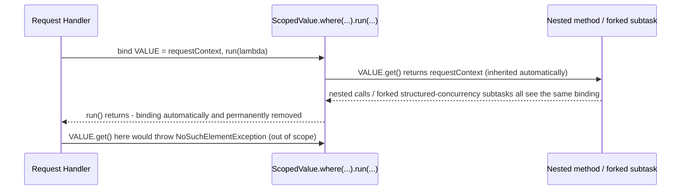

**JVM Behaviour**: Because bindings are immutable and lexically/temporally scoped to a specific `run()`/`call()` invocation, the JVM can potentially implement lookups more cheaply than `ThreadLocal`'s per-thread mutable map traversal, and critically avoids per-thread memory retention concerns for virtual threads at scale; scoped values are also explicitly designed to be inherited automatically by subtasks forked within a `StructuredTaskScope` opened inside the bound region, making the two Loom-era features (structured concurrency + scoped values) work together coherently for context propagation across fan-out subtasks.

#### Interview Questions
**Basic**
1. What is `ScopedValue` and what problem with `ThreadLocal` does it aim to fix?
2. How do you bind and later read a `ScopedValue`?

**Intermediate**
1. Why can't you simply "update" a `ScopedValue`'s bound data the way you might mutate a `ThreadLocal`'s value?
2. What happens if you call `.get()` on a `ScopedValue` outside of any bound scope?

**Advanced**
1. Why is `ScopedValue` considered more efficient/appropriate than `ThreadLocal` for use with virtual threads and structured concurrency at scale?
2. How does `ScopedValue` binding interact with subtasks forked via `StructuredTaskScope`?

**Scenario-based**
1. You're migrating a `ThreadLocal<TenantContext>` used for multi-tenant request routing to `ScopedValue`, in a codebase also adopting virtual threads and structured concurrency for fan-out to downstream services. Describe the refactor and why it improves safety.

#### Detailed Answers
1. **What it is / problem fixed**: `ScopedValue<T>` provides immutable, automatically-scoped context propagation for a specific call chain, fixing `ThreadLocal`'s two biggest issues: the need to remember to call `remove()` (forgetting it leaks data across pooled-thread reuse) and the per-thread mutable-map memory overhead that becomes significant at virtual-thread scale (potentially millions of threads).
2. **Bind and read**: Bind with `ScopedValue.where(MY_VALUE, data).run(() -> { /* code that can call MY_VALUE.get() */ });` (or `.call(...)` for code that returns a result) \u2014 any code executed within that lambda's dynamic extent, including deeply nested method calls, can read the value via `MY_VALUE.get()`.
3. **Why not mutate in place**: `ScopedValue` is deliberately immutable per binding to guarantee that once you're inside a `run()` block, the context value cannot change unexpectedly underneath you (removing a whole class of visibility/consistency bugs that mutable shared context can introduce); if you need a "changed" value for some nested portion of code, you create a NEW nested binding via another `ScopedValue.where(...).run(...)` call, which shadows the outer binding only for that nested scope and automatically reverts once that nested `run()` returns.
4. **get() outside a bound scope**: It throws `NoSuchElementException` (you can guard with `isBound()` first if the value might legitimately be optional in some call paths) \u2014 this fail-fast behavior is intentional, surfacing programming errors (using a context value where none was ever established) immediately rather than silently returning `null` or some stale value.
5. **Why more efficient/appropriate for virtual threads**: `ThreadLocal` requires each thread (virtual or platform) to maintain its own mutable `ThreadLocalMap`, which at virtual-thread scale (potentially millions of concurrent threads) multiplies memory overhead significantly; `ScopedValue` bindings are immutable and tied to the lexical/temporal extent of a specific call, which the JVM can implement without needing a persistent, growable, per-thread data structure that must be manually cleaned up \u2014 it aligns naturally with how virtual threads are meant to be created and discarded cheaply and frequently.
6. **Interaction with StructuredTaskScope**: Scoped value bindings established before opening a `StructuredTaskScope` are automatically visible to and inherited by subtasks forked within that scope (each forked subtask, even though running on its own virtual thread, sees the same bound values as the forking code), giving you reliable, safe context propagation across a fan-out of concurrent subtasks without manually threading the context through each task's parameters \u2014 and because both structured concurrency and scoped values enforce strict, deterministic lifetime bounds, there's no risk of a subtask outliving (or leaking beyond) the context it was given.
7. **Migration scenario**: Replace `tenantContext.set(tenant); try { ... } finally { tenantContext.remove(); }` with `ScopedValue.where(TENANT_CONTEXT, tenant).run(() -> { /* request handling, including forking downstream calls via StructuredTaskScope */ });` \u2014 this removes the risk of forgetting to call `remove()` (impossible to forget now, since un-binding is automatic when `run()` returns), and guarantees that ALL subtasks forked via `StructuredTaskScope` within that `run()` block correctly and safely see the same tenant context without any manual propagation code, improving both correctness (no leaked/stale tenant context across pooled virtual threads) and code clarity.

#### Code Examples
```java
import java.util.concurrent.StructuredTaskScope;

public class ScopedTenantContext {
    private static final ScopedValue<String> TENANT_ID = ScopedValue.newInstance();

    public String handleRequest(String tenant) throws InterruptedException {
        // Binding is automatically and reliably removed when run() returns - no remove() to forget
        return ScopedValue.where(TENANT_ID, tenant).call(() -> {
            try (var scope = new StructuredTaskScope.ShutdownOnFailure()) {
                // Forked subtasks automatically inherit the TENANT_ID binding
                var userTask = scope.fork(this::fetchUserForCurrentTenant);
                var orderTask = scope.fork(this::fetchOrdersForCurrentTenant);
                scope.join();
                return userTask.get() + "|" + orderTask.get();
            } catch (Exception e) {
                throw new RuntimeException(e);
            }
        });
    }

    private String fetchUserForCurrentTenant() {
        return "user-for-tenant-" + TENANT_ID.get(); // reads the inherited binding
    }

    private String fetchOrdersForCurrentTenant() {
        return "orders-for-tenant-" + TENANT_ID.get();
    }
}
```
