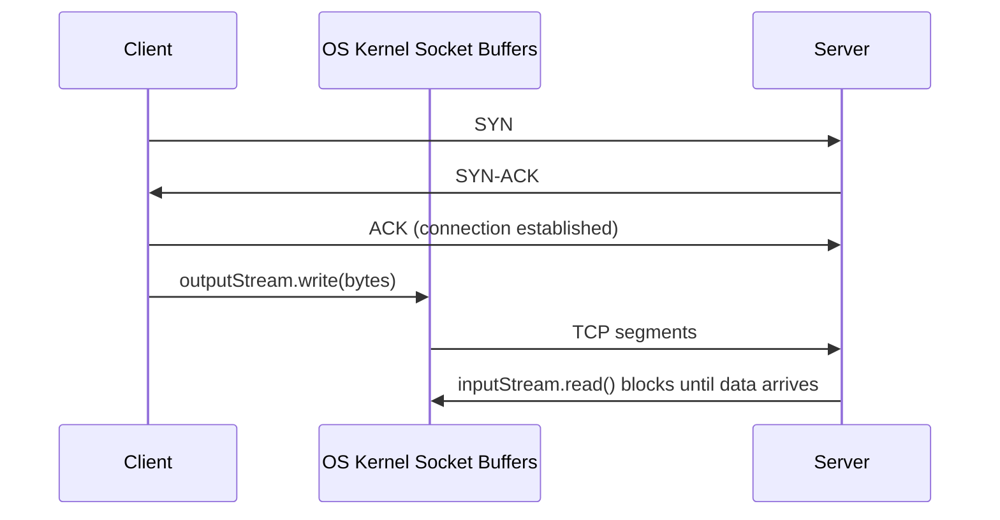
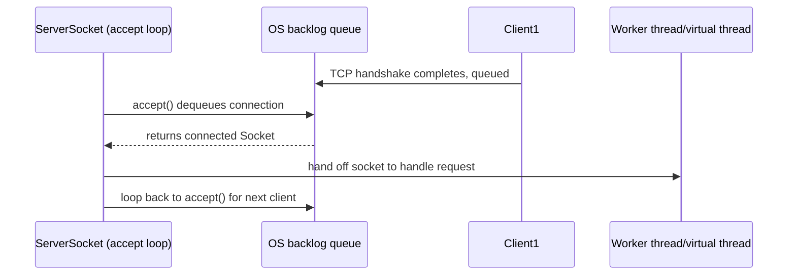
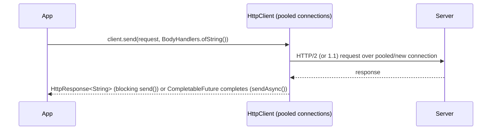
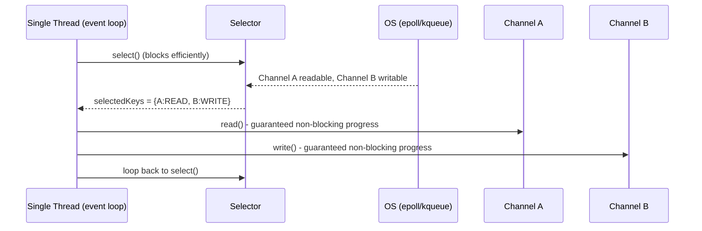

# 24. Networking

## Socket

### Theory
- **Core Concepts** - `java.net.Socket` represents one endpoint of a bidirectional TCP connection between a client and server, exposing `InputStream`/`OutputStream` for byte-level communication once connected.
- **Internal Working** - Wraps an underlying OS socket file descriptor; `connect()` performs the TCP three-way handshake; reads/writes are blocking by default, delegating to native socket syscalls (`recv`/`send`) via the JVM's platform-specific socket implementation.
- **When to Use It** - Use for low-level, custom TCP protocols (proprietary binary protocols, simple client-server tools) where a higher-level abstraction (HTTP client, message queue) isn't needed.
- **Advantages** - Direct control over the raw byte stream and protocol framing; minimal overhead compared to higher-level abstractions.
- **Limitations** - Blocking I/O by default means one thread is tied up per connection (doesn't scale to huge numbers of concurrent connections without a thread-per-connection model or NIO); no built-in protocol framing/parsing - you must implement message boundaries yourself.

### Internal Working
- **Step-by-Step Explanation** - `new Socket(host, port)` resolves the hostname, opens a native socket, and performs the TCP handshake (SYN, SYN-ACK, ACK) synchronously, blocking the calling thread until the connection is established or times out; subsequent `getInputStream()`/`getOutputStream()` reads/writes block the calling thread until data is available/the OS send buffer accepts it, delegating to blocking native `read()`/`write()` syscalls under the hood.
- **Memory Layout** - The `Socket` object itself is a small heap object wrapping a native file descriptor (via an internal `SocketImpl`/`FileDescriptor`); actual buffered data resides in OS-managed kernel socket buffers (send/receive buffers), not directly visible in the Java heap.
- **Diagrams**

- **JVM Behaviour** - Each blocking `read()`/`write()` call parks the calling Java thread (mapped to an OS thread) until the underlying syscall returns, meaning the JVM thread is genuinely blocked at the OS level - platform threads consumed this way don't run other work, motivating either a thread-per-connection model (fine with virtual threads since Java 21) or NIO for high concurrency.

### Interview Questions
**Basic**
1. What does `java.net.Socket` represent?
2. Is `Socket` I/O blocking or non-blocking by default?

**Intermediate**
1. What happens at the TCP level when you call `new Socket(host, port)`?
2. Why doesn't the thread-per-connection model using blocking sockets scale to tens of thousands of connections with platform threads?

**Advanced**
1. How do virtual threads (Project Loom, Java 21+) change the calculus around blocking socket I/O?

**Scenario-based**
1. A simple TCP client needs to send a request and read a line-delimited response - walk through the code and potential pitfalls (partial reads, buffering).

### Detailed Answers
1. **Q: What does `Socket` represent?** A: One endpoint of a TCP connection, providing streams for reading/writing bytes to the connected peer.
2. **Q: Blocking or non-blocking?** A: Blocking by default - `connect()`, and stream reads/writes all block the calling thread until the operation completes (or times out/fails).
3. **Q: TCP handshake on `new Socket()`?** A: The constructor resolves the address and performs the standard TCP three-way handshake (SYN, SYN-ACK, ACK) synchronously before returning, blocking the calling thread until the connection is established or a connection timeout/refusal occurs.
4. **Q: Why doesn't thread-per-connection scale with platform threads?** A: Each platform thread consumes significant OS resources (a large fixed stack, kernel scheduling overhead) and blocking I/O ties up that thread for the connection's entire lifetime; tens of thousands of concurrent connections would require tens of thousands of OS threads, exceeding practical memory/scheduling limits.
5. **Q: Virtual threads' impact?** A: Virtual threads (JEP 444) let blocking calls like socket I/O "park" the lightweight virtual thread without blocking the underlying OS carrier thread, so a thread-per-connection style using blocking `Socket` I/O can now scale to huge numbers of concurrent connections cheaply, without needing NIO's more complex non-blocking/callback style.
6. **Q: Line-delimited TCP client pitfalls?** A: Must handle partial reads (`InputStream.read()` may return fewer bytes than expected, or a "line" may span multiple `read()` calls) - typically wrap the stream in a `BufferedReader`/`BufferedInputStream` and use `readLine()` or a length-prefixed/delimiter-based framing protocol; also must flush the output stream to ensure data is actually sent, and handle connection reset/timeout exceptions.

### Code Examples
```java
import java.io.*;
import java.net.Socket;

public class SocketClientDemo {
    public static void main(String[] args) throws IOException {
        try (Socket socket = new Socket("example.com", 80)) {
            socket.setSoTimeout(5000); // avoid blocking forever on read()
            PrintWriter out = new PrintWriter(socket.getOutputStream(), true);
            BufferedReader in = new BufferedReader(new InputStreamReader(socket.getInputStream()));

            out.print("GET / HTTP/1.1\r\nHost: example.com\r\nConnection: close\r\n\r\n");
            out.flush(); // ensure the request is actually sent

            String line;
            while ((line = in.readLine()) != null) {
                System.out.println(line); // blocks per line until data/EOF arrives
            }
        }
    }
}
```

## ServerSocket

### Theory
- **Core Concepts** - `java.net.ServerSocket` listens on a TCP port and accepts incoming client connections, returning a new `Socket` for each accepted connection while continuing to listen for further clients.
- **Internal Working** - `bind()` associates the socket with a port and starts listening (OS-level `listen()` syscall with a backlog queue); `accept()` blocks until a pending connection is available, dequeuing it and returning a connected `Socket`.
- **When to Use It** - Use to build custom TCP servers (protocol servers, simple internal services) that need low-level control over connection handling, typically paired with a thread-per-connection or thread-pool model (or virtual threads for scale).
- **Advantages** - Simple, direct API for accepting TCP connections; full control over per-connection handling logic.
- **Limitations** - `accept()` is blocking (one thread needed to accept, plus typically one thread per active connection with the classic model); no built-in protocol/session management - must be built manually or via a higher-level framework (Netty, Spring, etc.) for production use.

### Internal Working
- **Step-by-Step Explanation** - `new ServerSocket(port)` binds to the port and begins listening with a connection backlog queue (pending, not-yet-accepted TCP connections that completed their handshake); `accept()` blocks the calling thread until a connection is available in that queue, then dequeues it, completes the Java-level `Socket` object wrapping the accepted native connection, and returns it - typically the accepting thread then hands off the returned socket to a worker thread (or virtual thread) to handle the actual request/response, looping back to call `accept()` again immediately for the next client.
- **Memory Layout** - The `ServerSocket` itself is a small heap object; the OS maintains the connection backlog queue and per-connection kernel buffers, not directly part of the Java heap.
- **Diagrams**

- **JVM Behaviour** - Each `accept()` call blocks the calling (platform or virtual) thread at the OS level until a connection arrives; a typical scalable design uses one dedicated "acceptor" thread looping on `accept()` and dispatches each accepted `Socket` to a thread pool (or, with Java 21+, spawns a new virtual thread per connection cheaply) rather than processing requests on the acceptor thread itself.

### Interview Questions
**Basic**
1. What does `ServerSocket.accept()` do?
2. What is a connection backlog?

**Intermediate**
1. Why is it a bad idea to process each client's request directly on the thread calling `accept()` in a loop?
2. What common threading models exist for handling multiple simultaneous clients with `ServerSocket`?

**Advanced**
1. How do virtual threads change the recommended design for a simple `ServerSocket`-based server?

**Scenario-based**
1. A simple echo server built with `ServerSocket` works fine with a few clients but becomes unresponsive under many concurrent connections using the naive "handle then accept again" loop - diagnose and redesign.

### Detailed Answers
1. **Q: What does `accept()` do?** A: Blocks until an incoming client connection completes its TCP handshake and is available in the backlog queue, then returns a connected `Socket` representing that specific client connection.
2. **Q: Connection backlog?** A: The OS-maintained queue of TCP connections that have completed the handshake but haven't yet been `accept()`ed by the application; its size is configurable via the `ServerSocket` constructor's backlog parameter.
3. **Q: Why not process requests on the accept loop thread?** A: While handling one client's request (potentially slow/blocking I/O), the thread cannot call `accept()` again, so new clients queue up (or are rejected once the backlog fills) - starving all other clients of timely connection acceptance; requests should be dispatched to separate worker threads.
4. **Q: Common threading models?** A: Thread-per-connection (simple, doesn't scale well with platform threads), fixed-size thread pool (bounded concurrency, may queue/reject under load), and NIO-based selector/event-loop models (single or few threads handling many connections via non-blocking I/O and readiness selection).
5. **Q: Virtual threads' impact on design?** A: With Java 21+ virtual threads, you can go back to the simple thread-per-connection model (spawn a new virtual thread per accepted socket) without the traditional platform-thread scalability concerns, since virtual threads are extremely lightweight and blocking I/O within them doesn't tie up an OS thread - simplifying server design considerably compared to NIO-based event loops.
6. **Q: Unresponsive echo server fix?** A: The naive loop calls `accept()`, then processes the client fully (blocking on that client's I/O) before looping back to `accept()` again, so only one client is served at a time and others queue/timeout; redesign by dispatching each accepted socket to a thread pool (`executor.submit(() -> handle(socket))`) or spawning a virtual thread per connection (`Thread.startVirtualThread(() -> handle(socket))`), so the acceptor loop returns to `accept()` immediately after each dispatch.

### Code Examples
```java
import java.io.*;
import java.net.ServerSocket;
import java.net.Socket;
import java.util.concurrent.Executors;
import java.util.concurrent.ExecutorService;

public class ServerSocketDemo {
    public static void main(String[] args) throws IOException {
        try (ServerSocket serverSocket = new ServerSocket(8080)) {
            ExecutorService pool = Executors.newFixedThreadPool(10); // bounded concurrency
            System.out.println("Listening on 8080...");
            while (true) {
                Socket client = serverSocket.accept(); // blocks until a client connects
                pool.submit(() -> handleClient(client)); // dispatch, loop back to accept() immediately
            }
        }
    }
    private static void handleClient(Socket client) {
        try (client; BufferedReader in = new BufferedReader(new InputStreamReader(client.getInputStream()));
             PrintWriter out = new PrintWriter(client.getOutputStream(), true)) {
            String line = in.readLine();
            out.println("Echo: " + line);
        } catch (IOException e) { e.printStackTrace(); }
    }
}
```

## HTTP Client (`java.net.http.HttpClient`) *(new)*

### Theory
- **Core Concepts** - `java.net.http.HttpClient` (introduced in Java 11, JEP 321) is the modern standard HTTP client supporting HTTP/1.1 and HTTP/2, both synchronous (`send()`) and asynchronous (`sendAsync()`, returning `CompletableFuture`) request execution, replacing the legacy `HttpURLConnection`.
- **Internal Working** - Built on a reusable, connection-pooling `HttpClient` instance; requests are immutable `HttpRequest` objects; `send()` blocks the calling thread, while `sendAsync()` executes on an internal/default executor and completes the returned `CompletableFuture` when the response arrives.
- **When to Use It** - Use for any modern HTTP client needs (calling REST APIs, webhooks) instead of `HttpURLConnection` or pulling in a third-party library for simple cases; supports HTTP/2 multiplexing for efficiency.
- **Advantages** - Native HTTP/2 support (multiplexed streams over one connection), clean fluent builder API, built-in async support via `CompletableFuture`, connection pooling/reuse handled automatically by a shared `HttpClient` instance.
- **Limitations** - No built-in retry/circuit-breaker/backoff logic (must be added manually or via a library); the `HttpClient` instance should be reused/shared (creating a new one per request loses connection pooling benefits) which requires careful lifecycle management in an application.

### Internal Working
- **Step-by-Step Explanation** - `HttpClient.newHttpClient()` (or `newBuilder()...build()`) creates a client managing a pool of connections; `client.send(request, bodyHandler)` selects/creates a connection (upgrading to HTTP/2 via ALPN negotiation during TLS handshake if supported by the server), writes the request, and blocks until the full response (per the given `BodyHandler`, e.g., `ofString()`) is received; `sendAsync()` performs the same work on a background thread pool, immediately returning a `CompletableFuture<HttpResponse<T>>` that completes later.
- **Memory Layout** - The `HttpClient` instance holds pooled connection objects (sockets/HTTP2 streams) as regular heap objects for its lifetime; request/response bodies are typically buffered heap byte arrays or streamed depending on the chosen `BodyHandler`/`BodyPublisher`.
- **Diagrams**

- **JVM Behaviour** - `sendAsync()` uses an internal default executor (a cached thread pool, or a custom one supplied via `HttpClient.Builder.executor()`) to perform I/O and complete futures without blocking the calling thread; HTTP/2 multiplexes many logical request/response streams over a single TCP connection, reducing the connection-per-request overhead typical of HTTP/1.1.

### Interview Questions
**Basic**
1. What Java version introduced `java.net.http.HttpClient`, and what does it replace?
2. What's the difference between `send()` and `sendAsync()`?

**Intermediate**
1. Why should you reuse a single `HttpClient` instance instead of creating one per request?
2. What HTTP protocol version does it support in addition to HTTP/1.1, and what's the benefit?

**Advanced**
1. How does `BodyHandler`/`BodyPublisher` control how request/response bodies are processed?

**Scenario-based**
1. A service making thousands of outbound API calls per second creates a `new HttpClient()` per call and shows poor performance and connection exhaustion - diagnose and fix.

### Detailed Answers
1. **Q: Introduced when, replaces what?** A: Java 11 (JEP 321, incubated in Java 9); it replaces the older, more cumbersome `java.net.HttpURLConnection` as the standard synchronous/asynchronous HTTP client.
2. **Q: `send()` vs `sendAsync()`?** A: `send()` blocks the calling thread until the full response is received, returning `HttpResponse<T>` directly; `sendAsync()` returns immediately with a `CompletableFuture<HttpResponse<T>>` that completes once the response arrives, executed on a background executor.
3. **Q: Why reuse a single `HttpClient`?** A: An `HttpClient` instance manages a pool of reusable connections (including HTTP/2 connection multiplexing); creating a new instance per request discards this pooling, forcing a new TCP/TLS handshake for every request, drastically hurting latency and resource usage.
4. **Q: Additional protocol support and benefit?** A: HTTP/2, negotiated automatically via ALPN during the TLS handshake if the server supports it; its main benefit is multiplexing multiple concurrent request/response streams over a single underlying TCP connection, reducing connection overhead and head-of-line blocking compared to HTTP/1.1's one-request-per-connection (or pipelining) model.
5. **Q: `BodyHandler`/`BodyPublisher` role?** A: `BodyPublisher` (on the request side) controls how the request body is supplied/streamed to the server (e.g., `ofString()`, `ofFile()`, `ofInputStream()`); `BodyHandler` (on the response side) controls how the response body is consumed/converted (e.g., `ofString()`, `ofByteArray()`, `ofInputStream()` for streaming large responses without buffering everything in memory).
6. **Q: Per-call `new HttpClient()` fix?** A: Create a single shared, application-scoped `HttpClient` instance (built once, ideally configured with an appropriate executor and connection timeout) and reuse it for all outbound calls, allowing connection pooling and HTTP/2 multiplexing to actually take effect instead of paying full handshake cost per call.

### Code Examples
```java
import java.net.URI;
import java.net.http.HttpClient;
import java.net.http.HttpRequest;
import java.net.http.HttpResponse;
import java.net.http.HttpResponse.BodyHandlers;
import java.time.Duration;
import java.util.concurrent.CompletableFuture;

public class HttpClientDemo {
    // Shared, reused client - enables connection pooling and HTTP/2 multiplexing
    private static final HttpClient CLIENT = HttpClient.newBuilder()
            .connectTimeout(Duration.ofSeconds(5))
            .version(HttpClient.Version.HTTP_2)
            .build();

    public static void main(String[] args) throws Exception {
        HttpRequest request = HttpRequest.newBuilder()
                .uri(URI.create("https://api.github.com/repos/openjdk/jdk"))
                .header("Accept", "application/json")
                .GET()
                .build();

        // Synchronous
        HttpResponse<String> response = CLIENT.send(request, BodyHandlers.ofString());
        System.out.println("Status: " + response.statusCode());

        // Asynchronous
        CompletableFuture<HttpResponse<String>> future = CLIENT.sendAsync(request, BodyHandlers.ofString());
        future.thenAccept(r -> System.out.println("Async status: " + r.statusCode())).join();
    }
}
```

## URL

### Theory
- **Core Concepts** - `java.net.URL` represents a Uniform Resource Locator - a reference to a network resource that also historically provided direct access methods (`openConnection()`, `openStream()`) to fetch that resource, tightly coupling naming with resolution/access.
- **Internal Working** - Parsing a `URL` (especially with non-standard/custom protocols) can trigger classloading and even network/DNS activity (e.g., its `equals()`/`hashCode()` infamously perform DNS resolution to compare hosts), and its protocol handling is pluggable via `URLStreamHandler`.
- **When to Use It** - Use mainly to interoperate with legacy APIs requiring `URL` objects, or genuinely to open a direct connection/stream to a resource for simple one-off reads; for general URI parsing/manipulation, prefer `URI` (see below) and convert to `URL` only when actually connecting.
- **Advantages** - Convenient one-step resource access (`url.openStream()`); understood/accepted by many older APIs.
- **Limitations** - `equals()`/`hashCode()` perform a blocking DNS lookup to resolve hostnames for comparison - a notorious performance/correctness footgun (two URLs with hostnames resolving to the same IP are considered "equal" even if textually different, and vice versa if DNS is unavailable); no validation of general URI syntax rules the way `URI` provides; effectively superseded by `URI` for parsing/representation purposes, per Effective Java's guidance.

### Internal Working
- **Step-by-Step Explanation** - Constructing a `new URL(spec)` parses the string into protocol/host/port/path/query components using a `URLStreamHandler` looked up for that protocol (built-in for `http`/`https`/`file`/`jar`, pluggable for custom schemes); calling `openConnection()` obtains a `URLConnection` (e.g., `HttpURLConnection`) which performs the actual network I/O when its stream is read; calling `.equals()`/`.hashCode()` triggers a DNS resolution of the host component(s) being compared as part of determining equality.
- **Memory Layout** - Not directly applicable - `URL` is an ordinary heap object storing string components; any network activity (DNS lookups, actual connections) happens outside the JVM heap via OS networking calls.
- **Diagrams**
```
new URL("https://example.com/path?q=1")
  -> protocol=https, host=example.com, port=443(default), path=/path, query=q=1

url1.equals(url2) --> triggers DNS resolution of both hosts (SLOW, surprising side effect)
```
- **JVM Behaviour** - The blocking DNS lookup inside `equals()`/`hashCode()` means putting `URL` objects in a `HashSet`/`HashMap` (or comparing them) can silently perform network I/O and block the calling thread - a well-documented Java API design flaw, which is one of the primary reasons `URI` is now the recommended type for representing/comparing web addresses.

### Interview Questions
**Basic**
1. What does `URL.openStream()` do?
2. What network activity can `URL.equals()` trigger, unexpectedly?

**Intermediate**
1. Why is `URI` generally recommended over `URL` for parsing/representing addresses?
2. How is protocol handling for schemes like `http`/`file`/`jar` implemented under the hood?

**Advanced**
1. Why is triggering DNS resolution inside `equals()`/`hashCode()` considered a serious API design flaw?

**Scenario-based**
1. A `HashSet<URL>` used to deduplicate URLs performs poorly and occasionally hangs under network issues - diagnose and fix using `URI` instead.

### Detailed Answers
1. **Q: `openStream()`?** A: Opens a connection to the resource the URL refers to and returns an `InputStream` for reading its content directly - a convenience combining `openConnection()` and `getInputStream()`.
2. **Q: DNS side effect of `equals()`?** A: `URL.equals()` resolves the hostname(s) of both URLs to IP addresses via DNS as part of determining equality - meaning simply comparing two `URL` objects (or inserting them into a `HashSet`) can perform blocking network I/O.
3. **Q: Why prefer `URI`?** A: `URI` is a pure syntactic representation (no network I/O, no DNS resolution for equality/hashing) that correctly validates general URI syntax per RFC 3986, making it safe and fast for parsing, comparing, and manipulating identifiers without unintended side effects; convert to `URL` only when you actually need to open a connection.
4. **Q: Protocol handling implementation?** A: Each protocol (`http`, `https`, `file`, `jar`, etc.) is backed by a `URLStreamHandler` implementation, looked up via a pluggable `URLStreamHandlerFactory` mechanism, which knows how to parse that protocol's specific address format and how to open a `URLConnection` for it.
5. **Q: Why is DNS-in-equals a flaw?** A: Equality/hashing are expected to be fast, pure, side-effect-free operations usable freely in hot paths and collections; silently performing network I/O (with associated latency, and even failure modes if DNS is unreachable) violates that expectation, causing hard-to-diagnose performance issues and potential hangs, and is explicitly called out as a mistake in Effective Java.
6. **Q: `HashSet<URL>` fix?** A: Switch to `HashSet<URI>` (parsing strings into `URI` objects instead of `URL`) for storage/deduplication/comparison purposes, converting to `URL` only at the point of actually opening a connection (`uri.toURL().openStream()`), avoiding the DNS-resolution-based equality entirely.

### Code Examples
```java
import java.net.URL;
import java.io.BufferedReader;
import java.io.InputStreamReader;

public class UrlDemo {
    public static void main(String[] args) throws Exception {
        URL url = new URL("https://www.example.com/");
        System.out.println("Host: " + url.getHost() + ", Protocol: " + url.getProtocol());

        try (BufferedReader in = new BufferedReader(new InputStreamReader(url.openStream()))) {
            System.out.println("First line: " + in.readLine());
        }
        // Note: avoid url1.equals(url2) or HashSet<URL> - triggers DNS resolution; use URI instead.
    }
}
```

## URI

### Theory
- **Core Concepts** - `java.net.URI` represents a Uniform Resource Identifier per RFC 3986 as a pure syntactic construct (scheme, authority, path, query, fragment) with no network-access capability - it's purely for parsing, validating, and manipulating identifiers.
- **Internal Working** - Parsing performs strict RFC 3986 syntax validation (throwing `URISyntaxException` for malformed input); `equals()`/`hashCode()` are purely string/component-based comparisons with no I/O whatsoever.
- **When to Use It** - Use as the default type for representing, parsing, validating, comparing, and manipulating URIs/URLs throughout your codebase; convert to `URL` (`uri.toURL()`) only at the point you need to actually open a network connection.
- **Advantages** - Fast, side-effect-free equality/hashing (safe for collections); strict, standards-compliant syntax validation; supports relative URI resolution (`resolve()`) and normalization (`normalize()`).
- **Limitations** - Cannot directly open a connection/stream itself (must convert to `URL` first for that); being purely syntactic means it doesn't validate that a resource actually exists or is reachable.

### Internal Working
- **Step-by-Step Explanation** - `new URI(string)` parses the input strictly against RFC 3986 grammar, decomposing it into scheme, scheme-specific-part/authority, host, port, path, query, and fragment components, throwing `URISyntaxException` immediately for any syntax violation; `resolve(URI)` combines a base URI with a relative reference per the RFC's resolution algorithm; `normalize()` removes redundant `.`/`..` path segments; none of these operations perform any network access.
- **Memory Layout** - Ordinary heap object storing parsed string components (often cached substrings of the original input); no native/OS resources involved.
- **Diagrams**
```
new URI("https://user@host:8080/path/../a?q=1#frag")
  -> scheme=https, userInfo=user, host=host, port=8080, path=/path/../a, query=q=1, fragment=frag
.normalize() -> path becomes /a  (no network access anywhere)
```
- **JVM Behaviour** - Purely CPU-bound string parsing/manipulation - no blocking calls, no DNS resolution, making `URI` fast and safe to use in hot paths, equality checks, and hash-based collections, unlike `URL`.

### Interview Questions
**Basic**
1. What's the fundamental difference in capability between `URI` and `URL`?
2. Does creating/comparing `URI` objects ever perform network I/O?

**Intermediate**
1. How do you convert a `URI` to a `URL` when you actually need to connect?
2. What does `URI.resolve()` do, and give an example.

**Advanced**
1. Why does `URI` validate syntax strictly per RFC 3986 while `URL` is more lenient/protocol-specific?

**Scenario-based**
1. You're building a web crawler that needs to deduplicate millions of discovered links and resolve relative links found on each page - which type(s) would you use and how?

### Detailed Answers
1. **Q: Fundamental difference?** A: `URI` is purely a syntactic identifier representation with no ability to open a connection; `URL` additionally knows how to actually locate/access the resource (`openConnection()`/`openStream()`) for a specific protocol.
2. **Q: Network I/O for `URI`?** A: No - all `URI` operations (parsing, `equals()`, `hashCode()`, `resolve()`, `normalize()`) are pure in-memory string/component operations with zero network access.
3. **Q: Converting `URI` to `URL`?** A: Call `uri.toURL()`, which requires the URI to be absolute and to have a protocol handler available; do this conversion only at the point you actually need to open a connection.
4. **Q: `resolve()` behaviour and example?** A: Combines a base URI with a (possibly relative) reference per RFC 3986's resolution algorithm - e.g., `new URI("https://example.com/a/b/").resolve("../c")` yields `https://example.com/a/c`, correctly handling relative path navigation the same way a browser resolves links found on a page.
5. **Q: Why stricter syntax validation?** A: `URI` is designed as a general-purpose, standards-compliant identifier syntax checker independent of any specific protocol's semantics, so it enforces RFC 3986's grammar uniformly; `URL` delegates parsing to protocol-specific `URLStreamHandler`s, which historically have been more lenient/inconsistent since their primary job is enabling a working connection, not strict standards conformance.
6. **Q: Web crawler design?** A: Use `URI` for storing/deduplicating discovered links (fast, side-effect-free equality/hashing in a `HashSet<URI>`) and for resolving relative links found on each page via `pageBaseUri.resolve(relativeLink)`; convert to `URL` (`uri.toURL().openStream()` or via `HttpClient`) only at the moment of actually fetching a page's content.

### Code Examples
```java
import java.net.URI;
import java.net.URISyntaxException;
import java.util.HashSet;
import java.util.Set;

public class UriDemo {
    public static void main(String[] args) throws URISyntaxException {
        URI base = new URI("https://example.com/docs/guide/");
        URI resolved = base.resolve("../api/index.html"); // relative link resolution, no network access
        System.out.println(resolved); // https://example.com/docs/api/index.html

        // Safe, fast deduplication - no DNS resolution involved (unlike URL)
        Set<URI> discovered = new HashSet<>();
        discovered.add(new URI("https://example.com/a"));
        discovered.add(new URI("https://example.com/a")); // duplicate, correctly deduplicated
        System.out.println(discovered.size()); // 1
    }
}
```

## Non-Blocking I/O with NIO Channels/Selectors *(new)*

### Theory
- **Core Concepts** - `java.nio` provides non-blocking, buffer-oriented, selector-based I/O: `Channel`s (e.g., `SocketChannel`, `ServerSocketChannel`) can operate in non-blocking mode, and a single `Selector` can monitor readiness (read/write/accept/connect) across many channels simultaneously, enabling one thread to handle thousands of connections (the reactor/event-loop pattern).
- **Internal Working** - Non-blocking channels return immediately from I/O operations that would otherwise block, indicating how much progress was made; a `Selector` uses the OS's efficient event-notification facility (epoll on Linux, kqueue on macOS/BSD, IOCP-backed on Windows) to report which registered channels are ready for the operations they were registered for, without polling each one individually.
- **When to Use It** - Use when building high-concurrency servers/proxies needing to handle very large numbers of simultaneous connections with a small, fixed number of threads (before virtual threads existed, this was the primary scalability technique; still valuable for genuinely I/O-multiplexed designs like proxies/load balancers).
- **Advantages** - Scales to huge connection counts with minimal thread count (avoiding thread-per-connection memory/scheduling overhead); efficient OS-level readiness notification avoids busy-polling.
- **Limitations** - Significantly more complex programming model than blocking I/O (manual state machines per connection, careful buffer management, harder to debug); with Java 21+ virtual threads, much of NIO's traditional scalability advantage can be achieved with simpler blocking-style code instead.

### Internal Working
- **Step-by-Step Explanation** - (1) Create channels (`SocketChannel.open()`/`ServerSocketChannel.open()`) and set them non-blocking (`configureBlocking(false)`); (2) create a `Selector` and register each channel with it, specifying interested operations (`OP_ACCEPT`, `OP_READ`, `OP_WRITE`, `OP_CONNECT`); (3) call `selector.select()`, which blocks (efficiently, via the OS's event mechanism) until at least one registered channel is ready for one of its interested operations; (4) iterate the returned `selectedKeys()`, handling each ready channel (accepting new connections, reading available bytes into a `ByteBuffer`, writing pending data) without blocking, since the channel is guaranteed ready for that specific operation; (5) loop back to `select()`.
- **Memory Layout** - `ByteBuffer`s used with NIO channels can be heap-allocated (`allocate()`, backed by a Java byte array) or direct (`allocateDirect()`, backed by native off-heap memory, avoiding an extra copy between JVM heap and OS buffers during actual I/O syscalls - beneficial for large/frequent transfers but with allocation/deallocation cost and less GC visibility).
- **Diagrams**

- **JVM Behaviour** - The `Selector`'s `select()` implementation delegates to the OS's native scalable event-notification API (epoll/kqueue/IOCP) rather than looping and checking each channel individually, which is what makes it efficient at monitoring thousands of channels with a single call; NIO channel reads/writes map to non-blocking native syscalls that return immediately with however many bytes were actually transferable at that moment.

### Interview Questions
**Basic**
1. What is the role of a `Selector` in Java NIO?
2. What does `configureBlocking(false)` do to a channel?

**Intermediate**
1. Why can a single thread handle many connections using NIO, unlike classic blocking `Socket`/`ServerSocket` code?
2. What's the difference between a heap `ByteBuffer` and a direct `ByteBuffer`?

**Advanced**
1. How does `Selector.select()` avoid busy-polling thousands of channels individually?

**Scenario-based**
1. Given that Java 21 introduced cheap virtual threads, when would you still choose NIO selectors over a simple thread-per-connection (virtual thread) design?

### Detailed Answers
1. **Q: `Selector` role?** A: It monitors multiple registered channels for readiness on specific operations (accept/read/write/connect), letting one thread efficiently wait for and react to whichever channels have work ready, instead of dedicating a thread per connection.
2. **Q: `configureBlocking(false)`?** A: Switches the channel into non-blocking mode, so I/O operations on it return immediately (indicating partial progress or that no data was available/writable) instead of blocking the calling thread until completion.
3. **Q: Why can one thread handle many connections?** A: Because the thread never blocks waiting on any single connection's I/O - it uses `select()` to efficiently learn which of many registered channels are currently ready, and only performs (guaranteed non-blocking, immediately-completable) I/O on those specific ready channels before looping back, rather than dedicating a thread to wait on each connection individually.
4. **Q: Heap vs direct `ByteBuffer`?** A: A heap buffer is backed by a regular Java byte array on the garbage-collected heap; a direct buffer is backed by native (off-heap) memory allocated outside the GC-managed heap, avoiding an extra buffer copy when the JVM hands data to/from OS-level I/O syscalls - beneficial for high-throughput I/O, at the cost of slower allocation and manual/GC-triggered native memory cleanup.
5. **Q: How does `select()` avoid busy-polling?** A: It delegates to the operating system's efficient, scalable event-notification mechanism (epoll on Linux, kqueue on macOS/BSD) which the OS kernel itself uses to track readiness across many file descriptors, allowing `select()` to block efficiently (without CPU spinning) until the OS reports at least one channel is ready, rather than the JVM looping and checking each channel's status repeatedly.
6. **Q: NIO selectors vs virtual threads?** A: Choose NIO selectors when you need true I/O multiplexing semantics as a first-class design concern (e.g., a proxy/load balancer explicitly reasoning about many streams' readiness together, extremely fine-grained control over buffer/backpressure management, or interoperating with existing NIO-based frameworks like Netty); for typical "handle one client's full request/response" server logic, virtual threads with simple blocking-style code are usually simpler to write/maintain while achieving comparable scalability.

### Code Examples
```java
import java.io.IOException;
import java.net.InetSocketAddress;
import java.nio.ByteBuffer;
import java.nio.channels.*;
import java.util.Iterator;

public class NioSelectorDemo {
    public static void main(String[] args) throws IOException {
        ServerSocketChannel serverChannel = ServerSocketChannel.open();
        serverChannel.bind(new InetSocketAddress(8080));
        serverChannel.configureBlocking(false); // non-blocking mode required for selector registration

        Selector selector = Selector.open();
        serverChannel.register(selector, SelectionKey.OP_ACCEPT);

        while (true) {
            selector.select(); // blocks efficiently (OS event notification) until something is ready
            Iterator<SelectionKey> keys = selector.selectedKeys().iterator();
            while (keys.hasNext()) {
                SelectionKey key = keys.next();
                keys.remove();
                if (key.isAcceptable()) {
                    SocketChannel client = serverChannel.accept();
                    client.configureBlocking(false);
                    client.register(selector, SelectionKey.OP_READ); // now watch this client for readability
                } else if (key.isReadable()) {
                    SocketChannel client = (SocketChannel) key.channel();
                    ByteBuffer buffer = ByteBuffer.allocate(256);
                    int read = client.read(buffer); // guaranteed non-blocking, ready per the selector
                    if (read == -1) { client.close(); } else { buffer.flip(); client.write(buffer); } // echo
                }
            }
        }
    }
}
```

## Additional Resources

### Frameworks

#### Armeria

- [JOTB19 - Armeria: The Only Thrift/gRPC/REST Microservice Framework You'll Need by Trustin H. Lee](https://www.youtube.com/watch?v=hLlctum1pIA)
- [Trustin Lee — Armeria: A microservice framework well-suited everywhere](https://www.youtube.com/watch?v=Vr-0GKUmzo8)
- [Armeria docs](https://armeria.dev/docs)
- [Armeria tutorials](https://armeria.dev/tutorials)
- [Annotated services](https://armeria.dev/docs/server-annotated-service)
- [Adding additional parameters in controller](https://javadoc.io/doc/com.linecorp.armeria/armeria-javadoc/latest/com/linecorp/armeria/server/annotation/RequestConverter.html)
- [Add DependencyInjector to inject dependencies in annotations](https://github.com/line/armeria/pull/4202)
- [armeria-examples](https://github.com/line/armeria-examples)
- [Let's Play with Reactive Streams on Armeria - Part 1](https://engineering.linecorp.com/en/blog/reactive-streams-armeria-1)
- [Let's Play with Reactive Streams on Armeria - Part 2](https://engineering.linecorp.com/en/blog/reactive-streams-armeria-2)

#### Helidon Níma

- [Helidon Níma](https://helidon.io/nima) — the first Java microservices framework based on virtual threads
- [Helidon - Microservices on Modern Java](https://www.youtube.com/watch?v=diUvR6gqHVY)

#### Micronaut

- [micronaut](https://micronaut.io/)
- [Building High Performance Microservices for Java with Micronaut & GraalVM](https://www.youtube.com/watch?v=0PN3KeLNC5U)
- [Creating a Rest application with Micronaut](https://medium.com/danieldiasjava/creating-a-rest-application-with-micronaut-30a001b3c38b)
- [Expose a WebSocket Server in a Micronaut Application](https://guides.micronaut.io/latest/micronaut-websocket-maven-java.html)

#### Quarkus

- [hendisantika/quarkus-simple-rest-api](https://github.com/hendisantika/quarkus-simple-rest-api)
- [Creating Your First Application](https://quarkus.io/guides/getting-started)
- [Writing REST Services with Quarkus REST](https://quarkus.io/guides/rest)
- [Writing JSON REST Services](https://quarkus.io/guides/rest-json)
- [rest-client](https://quarkus.io/guides/rest-client)
- [mongodb](https://quarkus.io/guides/mongodb)
- [Contexts and Dependency Injection](https://quarkus.io/guides/cdi-reference)
- [quarkusio/quarkus-quickstarts](https://github.com/quarkusio/quarkus-quickstarts)
- [How to build a quarkus docker image with JDK 19 and Virtual Thread support](https://stackoverflow.com/questions/75673145/how-to-build-a-quarkus-docker-image-with-jdk-19-and-virtual-thread-support)
- [Creating a Reactive CRUD blog app with MongoDB, Quarkus and Panache](https://medium.com/geekculture/creating-a-reactive-crud-blog-app-with-mongodb-quarkus-and-panache-54d659cf8dcb) — [dvddhln/quarkus-crud-reactive-mongodb](https://github.com/dvddhln/quarkus-crud-reactive-mongodb)
- [Quarkus — JVM vs GraalVM: Hello world case](https://medium.com/deno-the-complete-reference/quarkus-jvm-vs-graalvm-hello-world-case-37f4ab401e22)

#### Spring

> See the Spring Boot helper repo for Spring-specific framework notes.

### Courses

- [Distributed Systems & Cloud Computing with Java](https://thoughtworks.udemy.com/course/distributed-systems-cloud-computing-with-java/)

### Sample Projects

- [Building an HTTP Server in Java: From Basics to File Serving](https://www.youtube.com/playlist?list=PLnUreBIx5Q8gXVjr04vYzhTlXmyjK8zCB) — [gouthampradhan/simple-http-server](https://github.com/gouthampradhan/simple-http-server)
- [Create a Simple HTTP Server in Java Tutorial](https://www.youtube.com/playlist?list=PLAuGQNR28pW56GigraPdiI0oKwcs8gglW) — [CoderFromScratch/simple-java-http-server](https://github.com/CoderFromScratch/simple-java-http-server)

### Articles

- [Optimizing Spring Boot for INSANE Traffic: The 1M RPS Guide](https://medium.com/@kanishksinghpujari/optimizing-spring-boot-for-insane-traffic-the-1m-rps-guide-8b2a54cd711d)
