# 25. Design Patterns in Java

## Creational

### Singleton

#### Theory
**Core Concepts**: The Singleton pattern ensures a class has exactly one instance and provides a single global access point to it. In Java, it's typically implemented via a private constructor, a static field holding the sole instance, and a static accessor method — used for shared resources like configuration managers, connection pools, or caches where having multiple instances would be wasteful or incorrect.

**Internal Working**: The class controls its own instantiation entirely internally; the JVM's class-loading guarantees (for the enum/holder-class approaches) or explicit synchronization (for lazy double-checked-locking) ensure only one instance is ever created even under concurrent access.

**When to Use It**: Shared, stateless or centrally-coordinated resources — logging frameworks, thread pools, configuration registries, caches — where global, single-point access is a genuine architectural requirement, not just convenience.

**Advantages**: Guarantees a single instance, controlled global access point, can implement lazy initialization to defer expensive setup until first use.

**Limitations**: Frequently overused as a substitute for proper dependency injection, making unit testing hard (global mutable state, difficult to substitute test doubles); introduces hidden coupling between unrelated classes that all reach into the same global instance; naive implementations are not thread-safe or leak subtly under classloading/serialization edge cases; widely considered an anti-pattern when used as a glorified global variable rather than a genuine architectural necessity.

#### Internal Working
**Step-by-Step Explanation**: 1) The class declares a private static field of its own type and a private constructor, preventing external instantiation via `new`. 2) A public static accessor (`getInstance()`) either returns an eagerly-created instance (created at class-loading time) or lazily creates it on first call. 3) For lazy creation under concurrency, double-checked locking (checking a `volatile` reference twice, synchronizing only around the actual creation) avoids paying synchronization cost on every call while remaining thread-safe. 4) The best modern approaches sidestep manual synchronization entirely: the "initialization-on-demand holder" idiom relies on the JVM's guarantee that a class is initialized lazily and exactly once (thread-safely, by the classloader) the first time it's referenced; an `enum` singleton relies on the JVM's guarantee that enum constants are instantiated exactly once, and also gets serialization-safety and reflection-attack resistance for free.

**Memory Layout**: The single instance lives on the heap; the static reference to it lives in the class's static area (part of the Metaspace-adjacent per-class data, referencing the heap object) — exactly one object graph rooted at that static reference for the lifetime of the classloader that loaded the class.

**Diagrams**:
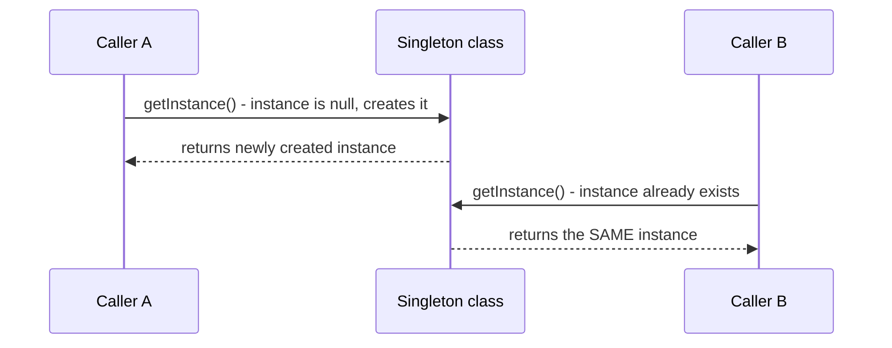

**JVM Behaviour**: Class initialization (used by the holder idiom) is guaranteed by the JVM specification to be thread-safe and to happen at most once per classloader, effectively giving you a free, JIT-friendly, lock-free singleton without any explicit synchronization in your code; `enum`-based singletons additionally get protection against reflection-based instantiation (the JVM forbids reflectively invoking an enum constructor) and against breaking the singleton property via deserialization (enum deserialization reuses the existing constant rather than creating a new instance).

#### Interview Questions
**Basic**
1. What problem does the Singleton pattern solve?
2. Name three ways to implement a Singleton in Java.

**Intermediate**
1. Why is naive lazy initialization (`if (instance == null) instance = new Singleton();`) not thread-safe?
2. Why is `enum` considered the most robust way to implement a Singleton in Java?

**Advanced**
1. Explain the "initialization-on-demand holder" idiom and why it doesn't need explicit synchronization.
2. How can reflection and serialization break a naive Singleton, and how do you defend against each?

**Scenario-based**
1. A code reviewer flags your team's heavy use of Singletons for configuration access as a testability problem. What's the concern, and how would you address it while retaining a single source of configuration truth?

#### Detailed Answers
1. **Problem solved**: Ensures a class has exactly one instance across the entire application (within a classloader) and provides a well-known global access point to it, useful when exactly-one-instance is a genuine invariant (e.g., a single hardware resource manager) rather than just convenient shared state.
2. **Three implementations**: (a) Eager initialization — `private static final Singleton INSTANCE = new Singleton();` created at class load time; (b) Lazy initialization with double-checked locking using a `volatile` field; (c) `enum` singleton — `enum Singleton { INSTANCE; ... }`, leveraging JVM guarantees for both thread-safety and serialization/reflection robustness.
3. **Why naive lazy init is unsafe**: Two threads can both observe `instance == null` simultaneously (a classic check-then-act race), both proceed to construct a new `Singleton()`, and both assign to the field — resulting in two distinct instances existing (violating the singleton invariant) and potentially causing one thread to overwrite the other's reference, leading to unpredictable behavior depending on timing.
4. **Why enum is most robust**: The JVM inherently guarantees enum constants are instantiated exactly once in a thread-safe manner during class initialization; additionally, the JVM specifically prevents reflection from invoking an enum's constructor (`Constructor.newInstance()` throws `IllegalArgumentException` for enum types), and Java's built-in serialization mechanism for enums deserializes to the existing constant by name rather than invoking a constructor, so you get thread-safety, reflection-attack resistance, and serialization-safety all without writing any extra code.
5. **Holder idiom explanation**: A private static inner class holds the singleton instance as a static final field; because the JVM only initializes a class the first time it's actively referenced, and class initialization is specified to be thread-safe and to happen at most once (enforced via an internal per-class initialization lock the JVM manages transparently), the singleton instance is lazily created (only when `getInstance()` is first called, triggering the inner class's initialization) with no explicit synchronization code needed in application code at all — the JVM's classloading machinery does the safety work for you.
6. **Reflection/serialization attacks and defenses**: Reflection can call `Constructor.setAccessible(true)` on a private constructor and invoke it directly, creating a second instance — defend by throwing an exception from the constructor if the instance field is already set, or by using an `enum` (immune by design). Serialization can create a new instance during deserialization unless you implement `readResolve()` to return the existing singleton instance instead of a freshly deserialized one — again, `enum` singletons handle this automatically.
7. **Testability concern and fix**: Singletons accessed via static methods (`Config.getInstance()`) are effectively global mutable state, making it hard to substitute a test double/mock configuration in unit tests without resorting to reflection or static-mocking libraries, and can cause test pollution if state persists across tests. Fix: keep the single-instance guarantee at the composition-root/framework level (e.g., a dependency-injection container configuring one bean instance) rather than hardcoding a static `getInstance()` accessor throughout the codebase — inject the configuration object as a dependency into classes that need it, preserving "one instance in production" while allowing tests to substitute a different instance freely.

#### Code Examples
```java
public class ConnectionPoolManager {
    // Initialization-on-demand holder idiom: lazy, thread-safe, no explicit locking
    private static class Holder {
        private static final ConnectionPoolManager INSTANCE = new ConnectionPoolManager();
    }

    private final java.util.concurrent.BlockingQueue<String> pool =
            new java.util.concurrent.LinkedBlockingQueue<>();

    private ConnectionPoolManager() {
        for (int i = 0; i < 10; i++) {
            pool.offer("connection-" + i);
        }
    }

    public static ConnectionPoolManager getInstance() {
        return Holder.INSTANCE; // triggers Holder class init on first call, thread-safe
    }

    public String borrowConnection() throws InterruptedException {
        return pool.take();
    }

    public void returnConnection(String connection) {
        pool.offer(connection);
    }
}

// Enum singleton: robust against reflection and serialization attacks
enum AppConfigRegistry {
    INSTANCE;
    private final java.util.Map<String, String> settings = new java.util.concurrent.ConcurrentHashMap<>();

    public String get(String key) { return settings.get(key); }
    public void set(String key, String value) { settings.put(key, value); }
}
```

### Factory

#### Theory
**Core Concepts**: The Factory Method pattern defines an interface (or abstract method) for creating an object, but lets subclasses (or a dedicated factory class/method) decide which concrete class to instantiate — decoupling client code from concrete constructors. It's distinct from the Abstract Factory pattern (which creates families of related objects) and from a plain "static factory method" (a simple creational helper, often just a naming/API convenience, e.g., `List.of(...)`).

**Internal Working**: Client code depends only on an abstract product type and calls a factory method; the factory (via inheritance, a configuration/registry lookup, or a switch on input) determines and instantiates the concrete subclass, returning it upcast to the abstract type.

**When to Use It**: When object creation logic is complex, conditional, or likely to vary/expand (adding new product types) and you want that variability isolated from the many places that need to create/use the product, following the Open/Closed Principle.

**Advantages**: Decouples client code from concrete classes (client only depends on the abstract product interface); centralizes and encapsulates creation logic, making it easy to introduce new product types without modifying client code; supports polymorphic creation based on runtime parameters.

**Limitations**: Adds a layer of indirection/abstraction that can be overkill for simple object creation (a plain constructor or builder may suffice); can lead to a proliferation of small factory/creator classes if overused; a naive switch-based factory implementation can itself become a maintenance burden (violating Open/Closed if you must edit the switch every time a new product is added, rather than using a pluggable registry).

#### Internal Working
**Step-by-Step Explanation**: 1) Define an abstract product interface/class (e.g., `PaymentProcessor`). 2) Define concrete implementations (e.g., `CreditCardProcessor`, `PayPalProcessor`). 3) Define a factory (either an abstract `createProcessor()` method overridden by subclasses of a creator class, or a standalone factory class/method) that, given some input (a type enum, configuration, or runtime parameter), decides which concrete class to instantiate. 4) Client code calls the factory method and receives back an object typed as the abstract product, remaining entirely unaware of which concrete class was actually instantiated, and thus unaffected if new product types are added later (as long as the factory's dispatch logic is updated, ideally in a way that doesn't require modifying client code).

**Memory Layout**: Not directly applicable beyond ordinary object allocation — the factory itself may hold a registry (e.g., a `Map<String, Supplier<PaymentProcessor>>`) on the heap mapping type keys to creation logic, avoiding a long if/else or switch chain that would need editing for every new product type.

**Diagrams**:
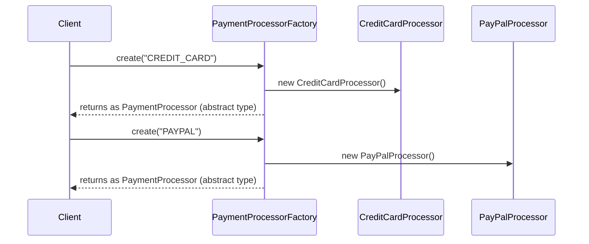

**JVM Behaviour**: No special JVM-level mechanics beyond ordinary virtual dispatch (`invokevirtual`/`invokeinterface`) on the returned abstract-typed reference — the JIT can still inline/devirtualize calls on the returned object if profile-guided optimization determines a dominant concrete type at a given call site (monomorphic call-site optimization), though a factory returning many different concrete types at one call site may prevent this optimization (megamorphic call site).

#### Interview Questions
**Basic**
1. What problem does the Factory Method pattern solve?
2. What's the difference between a Factory Method and just calling `new` directly?

**Intermediate**
1. How does a registry-based factory (a `Map` of type-to-supplier) avoid violating the Open/Closed Principle compared to a switch-based factory?
2. What's the difference between Factory Method and Abstract Factory?

**Advanced**
1. How can overuse of factories in a codebase actually hurt readability/maintainability, and how do you strike the right balance?
2. Explain how the JIT's call-site inline caching interacts with factories that return many different concrete implementations.

**Scenario-based**
1. Your payment system needs to support an increasing number of payment providers, added periodically by different teams, without requiring changes to a central switch statement each time. Design a factory that scales cleanly.

#### Detailed Answers
1. **Problem solved**: It decouples the code that NEEDS an object from the code that KNOWS HOW to create that specific kind of object, letting creation logic vary (which concrete class gets instantiated) independently of the code using the resulting abstract-typed object — critical when creation logic is non-trivial or needs to change/extend over time.
2. **Factory Method vs new**: Calling `new ConcreteClass()` directly hardcodes a compile-time dependency on that specific concrete class into the calling code, meaning every call site must be updated if the concrete class changes or if you want to conditionally create a different implementation; a Factory Method centralizes that decision in one place, so calling code only depends on the abstract product type and remains unaffected by changes to which concrete class actually gets created.
3. **Registry vs switch-based factory**: A switch/if-else based factory requires modifying the factory's own source code (adding a new case) every time a new product type is introduced, which — while centralizing the change to one class — still means that class isn't "closed for modification"; a registry-based factory (a `Map<String, Supplier<Product>>` populated via configuration, service-loader discovery, or explicit registration calls) allows new product types to be added by simply registering a new entry (potentially from an entirely separate module/plugin) without ever touching the factory's own code, more fully honoring the Open/Closed Principle.
4. **Factory Method vs Abstract Factory**: Factory Method creates ONE product via a single creation method (often overridden by subclasses to vary which concrete product is made); Abstract Factory creates FAMILIES of related products together (e.g., a `GUIFactory` producing a matching `Button`, `Checkbox`, and `Window` all styled consistently for a given look-and-feel), ensuring the products created together are compatible with each other — Abstract Factory is often implemented internally using multiple Factory Methods, one per product type in the family.
5. **Overuse downsides**: Wrapping every single simple object construction in its own factory class/interface adds indirection and boilerplate without corresponding benefit when the object being created is simple, has a stable concrete type, and creation logic will not vary — this bloats the codebase with trivial classes/interfaces that obscure rather than clarify intent. Balance: reserve factories for genuinely variable/complex creation logic (multiple implementations, configuration-driven selection, non-trivial setup), and use plain constructors or simple static factory methods (like `Optional.of(...)`) for straightforward cases.
6. **JIT call-site inlining interaction**: When a call site (e.g., `processor.process(payment)`) is monomorphic (always sees the same concrete type at runtime), the JIT can inline the method body directly, eliminating virtual dispatch overhead; if a factory returns many different concrete implementations interchangeably at the SAME call site (megamorphic), the JIT cannot reliably inline/devirtualize and falls back to a full virtual method table lookup on every call — a subtle performance consideration in extremely hot code paths, though rarely significant enough to override the design benefits of the pattern in typical application code.
7. **Scalable payment factory scenario**: Implement a registry-based factory where each payment provider module self-registers its creation function (e.g., via a static initializer calling `PaymentProcessorFactory.register("STRIPE", StripeProcessor::new)`, or via Java's `ServiceLoader` mechanism scanning `META-INF/services` for provider implementations); the central factory class then never needs modification when a new provider is added — new provider modules simply register themselves, achieving true Open/Closed compliance and letting different teams add providers independently without touching shared factory code.

#### Code Examples
```java
import java.util.Map;
import java.util.concurrent.ConcurrentHashMap;
import java.util.function.Supplier;

public interface PaymentProcessor {
    void process(double amount);
}

class CreditCardProcessor implements PaymentProcessor {
    public void process(double amount) { System.out.println("Charging credit card: " + amount); }
}

class PayPalProcessor implements PaymentProcessor {
    public void process(double amount) { System.out.println("Charging PayPal: " + amount); }
}

// Registry-based factory - new providers self-register without modifying this class
public class PaymentProcessorFactory {
    private static final Map<String, Supplier<PaymentProcessor>> REGISTRY = new ConcurrentHashMap<>();

    static {
        register("CREDIT_CARD", CreditCardProcessor::new);
        register("PAYPAL", PayPalProcessor::new);
    }

    public static void register(String type, Supplier<PaymentProcessor> supplier) {
        REGISTRY.put(type, supplier);
    }

    public static PaymentProcessor create(String type) {
        Supplier<PaymentProcessor> supplier = REGISTRY.get(type);
        if (supplier == null) {
            throw new IllegalArgumentException("Unknown payment type: " + type);
        }
        return supplier.get();
    }
}
```

### Builder

#### Theory
**Core Concepts**: The Builder pattern separates the construction of a complex object from its representation, allowing the same construction process to create different representations, and (in its most common Java form) providing a fluent, step-by-step API for constructing an immutable object with many optional fields — avoiding both unwieldy "telescoping constructors" (many overloaded constructors for different combinations of optional parameters) and error-prone JavaBean-style setter chains on mutable objects.

**Internal Working**: A separate `Builder` class (often a static nested class) accumulates configuration via chained setter-like methods (each returning `this`), then a terminal `build()` method validates the accumulated state and constructs a single, fully-formed (often immutable) target object in one step.

**When to Use It**: Objects with many constructor parameters (especially many optional ones), objects that should be immutable once constructed, or construction processes involving multiple steps/validation that shouldn't be scattered across a mutable object's lifecycle.

**Advantages**: Highly readable, self-documenting client code (`Pizza.builder().size(LARGE).addTopping(CHEESE).build()` vs. a constructor call with 8 positional boolean/int parameters); enables enforcing invariants/validation atomically at `build()` time; supports optional parameters cleanly without overloaded-constructor explosion; the resulting object can be fully immutable (all fields `final`, no setters) even though construction is multi-step.

**Limitations**: More boilerplate than a plain constructor (a builder class mirroring every field); can be overkill for simple objects with few fields; if not careful, a mutable builder shared across threads before `build()` is called introduces its own concurrency concerns (though the built product itself is typically safely immutable).

#### Internal Working
**Step-by-Step Explanation**: 1) The target class exposes a private (or package-private) constructor accepting the builder itself, and a static `builder()` method returning a new `Builder` instance. 2) Each fluent setter method on the `Builder` (e.g., `.size(...)`) mutates the builder's own internal fields and returns `this`, enabling method chaining. 3) The terminal `.build()` method performs any final validation (e.g., checking required fields were set, cross-field invariants) and then constructs the immutable target object, copying the builder's accumulated field values into the target's `final` fields. 4) Once built, the target object is handed to the caller as a fully-formed, typically immutable instance — the builder itself can be discarded or reused for further configuration (depending on design) without affecting already-built instances.

**Memory Layout**: The builder instance (heap-allocated, short-lived, mutable) exists only during construction; the final product (heap-allocated, `final` fields) is a separate, independent object — no lingering reference from the product back to its builder is needed, so the builder becomes garbage once construction completes and no other references remain.

**Diagrams**:
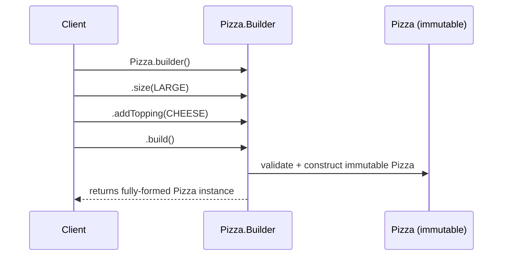

**JVM Behaviour**: No special JVM mechanics — ordinary object allocation and method calls; because each fluent method returns `this`, the JIT can often inline the entire chain at a monomorphic call site (a single, fixed builder type), and because the resulting product is typically immutable (`final` fields), it's safely publishable across threads once fully constructed (subject to the same safe-publication rules discussed under the Java Memory Model, provided the reference itself is published safely, e.g., via a final field or a properly synchronized handoff).

#### Interview Questions
**Basic**
1. What problem does the Builder pattern solve compared to a large constructor with many parameters?
2. Is the object built by a Builder typically mutable or immutable?

**Intermediate**
1. How does a Builder help enforce validation/invariants compared to exposing public setters on a mutable object?
2. What is the "telescoping constructor" anti-pattern, and how does Builder avoid it?

**Advanced**
1. How would you implement required (mandatory) vs. optional parameters cleanly within a Builder's API design?
2. Is a Builder instance itself thread-safe to share across threads before calling `build()`? What are the implications?

**Scenario-based**
1. You're designing an immutable `HttpRequest` class with 3 required fields (method, url, one required header) and 6 optional fields (timeout, retries, custom headers map, body, etc). Design the Builder API for this.

#### Detailed Answers
1. **Problem solved vs large constructor**: A constructor with many parameters (especially several optional ones of the same type, e.g., multiple `int`/`boolean` parameters) is error-prone (easy to pass arguments in the wrong order, especially with same-typed parameters) and unreadable at call sites; a Builder replaces this with named, chained method calls (`.timeout(30).retries(3)`) that are self-documenting and order-independent for optional parameters.
2. **Mutable or immutable product**: Typically immutable — the whole point of accumulating configuration in a separate, temporary, mutable Builder object is so the final PRODUCT can be constructed once, fully-formed, and never mutated again (all fields `final`), giving you the ergonomic benefits of step-by-step construction without sacrificing the safety benefits of immutability in the resulting object.
3. **Validation/invariants vs public setters**: With public setters on a mutable object, invalid or inconsistent intermediate states are always possible (e.g., an object with `startDate` set but not yet `endDate`, momentarily violating `startDate < endDate`) and nothing prevents client code from using the object in that inconsistent state; a Builder centralizes all cross-field/invariant validation in the single `build()` method, which runs only once all configuration is accumulated, guaranteeing the returned product is NEVER observed in an invalid state by any client code.
4. **Telescoping constructor anti-pattern**: This is when a class provides many overloaded constructors to cover different combinations of optional parameters (e.g., `Pizza(size)`, `Pizza(size, cheese)`, `Pizza(size, cheese, pepperoni)`, ...) — the number of overloads grows combinatorially and becomes unreadable/error-prone at call sites (hard to tell which boolean/int corresponds to which overload). A Builder avoids this entirely by using named chained methods for each optional parameter instead of positional constructor overloads.
5. **Required vs optional parameters in Builder design**: A common approach is to accept required parameters directly in the `builder(...)` factory method's own arguments (or the Builder's constructor), forcing them to be supplied up front, while optional parameters are set via individually named fluent methods with sensible defaults if omitted; `build()` can additionally assert that any semantically-required-but-not-constructor-enforced fields were actually set, throwing an `IllegalStateException` if not.
6. **Builder thread-safety**: Generally, a Builder instance is NOT designed to be thread-safe — it's meant to be used by a single thread during a short-lived construction sequence, then discarded (or, if reused, that reuse is also typically single-threaded); sharing a mutable Builder across multiple threads before calling `build()` would require external synchronization to avoid races on its internal fields, which defeats the simplicity the pattern is meant to provide — the safety guarantee is meant to apply to the finished PRODUCT, not the in-progress Builder.
7. **HttpRequest Builder design**: Make `method`, `url`, and the one required header parameters of a static factory method `HttpRequest.builder(method, url, requiredHeaderValue)` (or the `Builder`'s own constructor), forcing them to be supplied immediately and preventing a client from forgetting them; expose the 6 optional fields as individually named fluent setter methods (`.timeout(30)`, `.retries(3)`, `.header(key, value)`, `.body(payload)`) each with sensible defaults if never called; `build()` performs final cross-field validation (e.g., ensuring `retries >= 0`) and constructs the immutable `HttpRequest`.

#### Code Examples
```java
import java.util.Collections;
import java.util.HashMap;
import java.util.Map;

public final class HttpRequest {
    private final String method, url;
    private final int timeoutSeconds, retries;
    private final Map<String, String> headers;
    private final String body;

    private HttpRequest(Builder b) {
        this.method = b.method;
        this.url = b.url;
        this.timeoutSeconds = b.timeoutSeconds;
        this.retries = b.retries;
        this.headers = Collections.unmodifiableMap(new HashMap<>(b.headers));
        this.body = b.body;
    }

    public static Builder builder(String method, String url, String requiredHeaderValue) {
        return new Builder(method, url, requiredHeaderValue);
    }

    public static final class Builder {
        private final String method, url;
        private int timeoutSeconds = 30; // sensible default
        private int retries = 0;
        private final Map<String, String> headers = new HashMap<>();
        private String body;

        private Builder(String method, String url, String requiredHeaderValue) {
            this.method = method;
            this.url = url;
            this.headers.put("X-Required", requiredHeaderValue); // required, enforced up front
        }

        public Builder timeout(int seconds) { this.timeoutSeconds = seconds; return this; }
        public Builder retries(int retries) { this.retries = retries; return this; }
        public Builder header(String key, String value) { this.headers.put(key, value); return this; }
        public Builder body(String body) { this.body = body; return this; }

        public HttpRequest build() {
            if (retries < 0) throw new IllegalStateException("retries must be >= 0");
            return new HttpRequest(this);
        }
    }
}
```

### Prototype

#### Theory
**Core Concepts**: The Prototype pattern creates new objects by cloning an existing, fully-configured instance (the prototype) rather than instantiating from scratch via a constructor — useful when object creation is expensive (heavy initialization, resource acquisition) or when you need a new instance that's a variation of an existing configured object without knowing its concrete class ahead of time. In Java, it's typically implemented via `Cloneable`/`clone()` or, more safely, via a copy constructor or dedicated `copy()` method.

**Internal Working**: A `clone()` implementation creates a new object and copies the prototype's field values into it — a SHALLOW clone (Java's default `Object.clone()`) copies primitive fields and reference fields as-is (sharing referenced objects with the original), while a DEEP clone recursively clones referenced mutable objects too, to ensure full independence between the original and the copy.

**When to Use It**: Object creation that's expensive relative to copying (e.g., objects built from a costly database query or heavy computation, where you want variations of a template object); when you need to create objects of an unknown concrete type at runtime based on an existing instance, without coupling to its constructor.

**Advantages**: Avoids repeating expensive initialization logic for each new instance; can create copies without knowing the concrete class in advance (relying on polymorphic `clone()`); useful for maintaining a registry of "template" prototype objects that get cloned and customized per use.

**Limitations**: Java's built-in `Cloneable`/`Object.clone()` mechanism is widely considered poorly designed (it's a marker interface with no methods, `clone()` is `protected` on `Object` requiring override+visibility changes, default behavior is a fragile shallow copy, and it interacts awkwardly with `final` fields and constructors being bypassed) — many experienced Java engineers (including Joshua Bloch in *Effective Java*) recommend a copy constructor or static factory `copy()` method instead of implementing `Cloneable`.

#### Internal Working
**Step-by-Step Explanation**: 1) A prototype object is fully configured (all fields set) and kept as a template. 2) To create a variation, call `clone()` (or a copy constructor/`copy()` method) on the prototype instead of a fresh constructor call plus manual re-configuration. 3) For a shallow copy (Java's default `Object.clone()`), the new object's fields are bitwise-copied from the original — primitive fields become independent copies, but reference fields (e.g., a `List` field) still point to the SAME underlying object as the original, meaning mutations through one instance's reference field can affect the other. 4) For a deep copy, the `clone()`/`copy()` implementation must explicitly also clone/copy each mutable referenced object (recursively, as needed) so the two instances share no mutable state at all.

**Memory Layout**: A shallow clone creates one new object header/field-block on the heap, but any reference fields point to the SAME heap objects as the original (shared sub-graphs); a deep clone creates entirely separate heap object graphs for the copy, at the cost of additional allocation and copying work proportional to the object graph's size.

**Diagrams**:
```
Shallow clone:
  original: [name="Report", tags-> [heap List @0x100]]
  clone:    [name="Report", tags-> [heap List @0x100]]   <- SAME list reference! Mutating one affects both.

Deep clone:
  original: [name="Report", tags-> [heap List @0x100]]
  clone:    [name="Report", tags-> [heap List @0x200]]   <- independent copy of the list
```

**JVM Behaviour**: `Object.clone()` is a native method that performs a raw, field-by-field bitwise copy of the object's memory layout (bypassing any constructor entirely, which is part of why it's considered fragile — invariants normally established in a constructor are NOT re-run), requiring the class to implement the empty `Cloneable` marker interface or it throws `CloneNotSupportedException`; a copy-constructor-based approach avoids this native bypass entirely, running through normal constructor logic and thus preserving any validation/invariant-establishing code.

#### Interview Questions
**Basic**
1. What problem does the Prototype pattern solve?
2. What's the difference between a shallow copy and a deep copy?

**Intermediate**
1. Why is Java's built-in `Cloneable`/`clone()` mechanism often considered poorly designed?
2. How would you implement a deep copy for a class containing a `List<Address>` field where `Address` is itself mutable?

**Advanced**
1. Why does `Object.clone()` bypass the class's constructor, and what problems can this cause for classes with invariants or `final` fields?
2. What's a recommended alternative to implementing `Cloneable`, and why is it generally preferred?

**Scenario-based**
1. You maintain a registry of expensive-to-build `ReportTemplate` objects (each requiring a costly database schema lookup to construct) and need to produce many customized variations of each template efficiently. Design this using the Prototype pattern, being careful about shared mutable state.

#### Detailed Answers
1. **Problem solved**: Avoids repeating expensive or complex initialization logic every time a new, similar object is needed — instead of constructing from scratch, you copy (clone) an already fully-configured prototype instance and then customize the copy, which can be far cheaper and also allows creating instances of an unknown concrete type polymorphically via `clone()`.
2. **Shallow vs deep copy**: A shallow copy duplicates the object itself (its own primitive fields and reference VALUES) but does NOT duplicate objects referenced by those reference fields — both the original and the copy end up pointing to the SAME underlying mutable objects (e.g., the same `List` instance), so mutating that shared object through either reference affects both. A deep copy additionally recursively duplicates every referenced mutable object (and further nested references), giving the copy a completely independent object graph with no shared mutable state.
3. **Why Cloneable/clone() is poorly designed**: `Cloneable` is a marker interface with no methods of its own (it just flags to `Object.clone()` that cloning is permitted, an unusual and confusing design); `Object.clone()` itself is `protected`, so classes must override it and widen visibility to use it externally; the default implementation performs only a shallow, field-by-field bitwise copy (dangerous for classes with mutable reference fields, requiring manual deep-copy overrides); and critically it constructs the new object WITHOUT running any constructor, bypassing constructor-enforced invariants and causing subtle issues with `final` fields (which must still somehow be "set" despite no constructor running) — the combination of these issues leads many experienced engineers to avoid `Cloneable` entirely.
4. **Deep copy for a List<Address> field**: In the copy constructor/`copy()` method, don't just copy the list reference — create a NEW `List` and populate it with deep copies of each `Address` element (each `Address` itself needs its own copy constructor/`copy()` method if it has further mutable fields), e.g., `this.addresses = original.addresses.stream().map(Address::copy).collect(toList());` — ensuring no shared mutable `Address` objects or shared `List` instance between the original and the copy.
5. **Why clone() bypasses the constructor**: `Object.clone()` is implemented as a native method that directly duplicates the object's raw memory representation rather than invoking `new` and running through constructor code — this design choice was originally meant to make cloning "fast" and generic (works for any `Cloneable` class without needing to know its constructor signature), but it means any invariant-establishing logic, defensive copying, or validation normally performed in a constructor simply never runs for a cloned object, and `final` fields technically get set via this bypass mechanism in a way that's inconsistent with how `final` is meant to interact with constructors, causing confusion and subtle bugs especially in inheritance hierarchies.
6. **Recommended alternative**: Use a copy constructor (`public Report(Report other) { this.name = other.name; this.tags = new ArrayList<>(other.tags); }`) or a static factory method (`public static Report copy(Report other) { ... }`) instead of implementing `Cloneable`; this approach runs through ordinary constructor logic (preserving validation/invariants), makes deep-vs-shallow copying an explicit, visible decision in the copy constructor's body, doesn't require implementing an awkward marker interface, and doesn't risk `CloneNotSupportedException`-related checked-exception handling that `clone()` imposes.
7. **Expensive ReportTemplate registry scenario**: Build each `ReportTemplate` prototype once (paying the costly schema-lookup construction cost a single time) and store it in a registry (e.g., `Map<String, ReportTemplate>`); to produce a customized variation, call a deep-copy `copy()` method on the retrieved prototype (ensuring any mutable fields like a list of columns or filters are independently duplicated, not shared) and then apply customizations to the resulting copy — this avoids re-running the expensive schema lookup for every variation while guaranteeing customizations to one copy never leak into the shared prototype or other copies.

#### Code Examples
```java
import java.util.ArrayList;
import java.util.List;
import java.util.Map;
import java.util.concurrent.ConcurrentHashMap;

public final class ReportTemplate {
    private final String schemaName;
    private final List<String> columns; // mutable - must be deep-copied

    public ReportTemplate(String schemaName, List<String> columns) {
        this.schemaName = schemaName;
        this.columns = new ArrayList<>(columns); // defensive copy on construction
    }

    // Copy constructor performs a DEEP copy - safer and clearer than Cloneable/clone()
    public ReportTemplate copy() {
        return new ReportTemplate(this.schemaName, this.columns);
    }

    public void addColumn(String column) { columns.add(column); }
    public List<String> getColumns() { return List.copyOf(columns); }
}

public class ReportTemplateRegistry {
    private final Map<String, ReportTemplate> prototypes = new ConcurrentHashMap<>();

    public void registerPrototype(String key, ReportTemplate expensivelyBuiltTemplate) {
        prototypes.put(key, expensivelyBuiltTemplate); // built once, expensive schema lookup already paid
    }

    public ReportTemplate createCustomizedReport(String key) {
        ReportTemplate base = prototypes.get(key);
        if (base == null) throw new IllegalArgumentException("Unknown template: " + key);
        return base.copy(); // cheap deep copy, no repeated schema lookup, independent of original
    }
}
```

## Structural

### Adapter

#### Theory
**Core Concepts**: The Adapter pattern converts the interface of an existing class into another interface clients expect, letting otherwise-incompatible classes work together without modifying either the client or the adaptee's source code. In Java, this is implemented either via object composition (the adapter holds a reference to the adaptee and translates calls, a.k.a. the "object adapter") or via multiple inheritance simulation through interfaces ("class adapter", less common in Java since it lacks multiple class inheritance).

**Internal Working**: The adapter implements the target interface the client expects, and internally translates each target-interface method call into one or more calls on the wrapped adaptee's actual (incompatible) interface, handling any necessary data/format conversion in between.

**When to Use It**: Integrating a third-party library or legacy code whose interface doesn't match what your application code expects, without modifying the third-party/legacy code (which you may not be able to change at all).

**Advantages**: Enables reuse of existing, working (but interface-incompatible) code without modification; decouples client code from the specific third-party/legacy API shape, isolating that dependency to the adapter class alone.

**Limitations**: Adds a layer of indirection (an extra translation step per call); if the adaptee's semantics don't map cleanly onto the target interface's semantics (e.g., different error-handling models, different threading assumptions), the adapter can become a leaky, awkward abstraction that hides subtle behavioral mismatches.

#### Internal Working
**Step-by-Step Explanation**: 1) Define (or already have) a target interface that client code depends on (e.g., `ModernLogger`). 2) Identify the adaptee — an existing, incompatible class (e.g., a legacy `OldFileLogger` with a completely different method signature). 3) Create an Adapter class implementing the target interface, holding a reference to an instance of the adaptee. 4) Each method in the Adapter's implementation of the target interface internally calls the appropriate method(s) on the wrapped adaptee, translating parameters/return values/exceptions as needed to bridge the semantic gap. 5) Client code depends only on the target interface and is completely unaware an adapter (and the legacy adaptee behind it) is involved at all.

**Memory Layout**: The adapter object (heap) holds a reference to the adaptee object (also heap) — simple object composition, no special memory considerations beyond ordinary object graphs.

**Diagrams**:
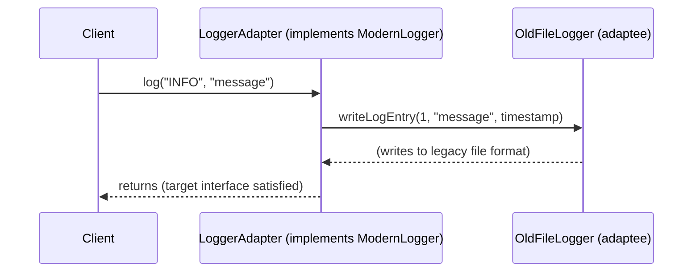

**JVM Behaviour**: No special JVM mechanics — ordinary interface dispatch (`invokeinterface`) on the adapter, which then makes ordinary calls into the adaptee; the JIT treats this like any other layer of delegation, potentially inlining both the adapter call and the delegated adaptee call if the call site is monomorphic and the methods are small enough.

#### Interview Questions
**Basic**
1. What problem does the Adapter pattern solve?
2. What's the difference between an "object adapter" and a "class adapter"?

**Intermediate**
1. How does Adapter differ from Facade, since both wrap existing code behind a new interface?
2. Give a concrete example of when you'd need an Adapter when integrating a third-party library.

**Advanced**
1. What happens when the adaptee's exception model or threading assumptions don't map cleanly onto the target interface — how would you handle this in the adapter?
2. Can an Adapter adapt multiple different adaptees to the same target interface? How would you design that?

**Scenario-based**
1. Your application defines a `PaymentGateway` interface, but you must integrate a third-party SDK whose client class uses a completely different method signature style (callback-based instead of return-value-based) and throws checked, SDK-specific exceptions. Design the adapter.

#### Detailed Answers
1. **Problem solved**: Allows client code written against one (target) interface to work with an existing class whose interface is incompatible, without modifying either the client or the existing class — essential when integrating third-party or legacy code you cannot or should not change.
2. **Object adapter vs class adapter**: An object adapter uses composition — the adapter holds a reference to an adaptee instance and delegates/translates calls to it (works with any adaptee subclass, and is the standard approach in Java); a class adapter uses inheritance — the adapter extends the adaptee class directly and also implements the target interface, gaining access to adaptee internals via inheritance, but Java's single-class-inheritance restriction makes this approach far less flexible/common than in languages with multiple inheritance.
3. **Adapter vs Facade**: Both wrap existing code, but with different intents — Adapter's purpose is to make an INCOMPATIBLE existing interface match a specific target interface the client already expects (a 1:1 translation, focused on interface compatibility); Facade's purpose is to simplify a complex subsystem of MULTIPLE classes/interactions behind one simpler, higher-level interface (focused on reducing complexity/coupling to a whole subsystem, not necessarily interface incompatibility).
4. **Concrete third-party integration example**: A logging framework interface expects a `log(Level level, String message)` method, but a legacy/third-party library only exposes `writeEntry(int severityCode, String text, long epochMillis)` with different parameter types/ordering and no shared enum — an adapter implementing your logging interface translates `Level` to the legacy integer severity code and supplies the current timestamp, letting the rest of your application use the clean, modern logging interface unaware of the legacy library underneath.
5. **Mismatched exception/threading models**: The adapter must explicitly translate the adaptee's checked/SDK-specific exceptions into whatever exception model the target interface expects (e.g., catching the adaptee's checked exception and re-throwing as an unchecked exception type defined by the target interface, preserving the original as the cause); for threading mismatches (e.g., adaptee is callback-based/asynchronous but the target interface is expected to be synchronous), the adapter may need to bridge using a blocking mechanism (e.g., a `CompletableFuture` or `CountDownLatch` to convert a callback into a blocking return value), being careful about deadlock risk if the callback might run on the same thread that's waiting.
6. **Adapting multiple adaptees to one target**: Yes — create multiple adapter classes, each implementing the SAME target interface but wrapping a DIFFERENT adaptee, and each translating that specific adaptee's incompatible interface into the shared target interface; client code can then use any of them interchangeably purely through the common target interface, without knowing (or caring) which underlying adaptee/library is actually being used — this combines naturally with the Factory pattern to select the appropriate adapter at runtime.
7. **Callback-based SDK adapter scenario**: Implement `PaymentGateway` with a `ThirdPartyPaymentAdapter` class holding a reference to the SDK client; inside the adapter's `charge(amount)` method (expected to be synchronous, returning a result), invoke the SDK's callback-based API and use a `CompletableFuture`/`CountDownLatch` to convert the asynchronous callback completion into a blocking return value, and wrap any SDK-specific checked exceptions thrown inside the callback into your own unchecked `PaymentException`, preserving the original as the cause via `initCause`/exception chaining.

#### Code Examples
```java
// Target interface the application code expects
public interface PaymentGateway {
    PaymentResult charge(double amount);
}

// Adaptee: third-party SDK with an incompatible, callback-based API
class ThirdPartySdkClient {
    interface ChargeCallback {
        void onSuccess(String transactionId);
        void onFailure(Exception sdkException);
    }
    void chargeAsync(int amountCents, ChargeCallback callback) {
        // simulated async SDK call
        callback.onSuccess("txn-123");
    }
}

public record PaymentResult(boolean success, String transactionId) {}

// Adapter: bridges the async, callback-based SDK to the synchronous target interface
public class ThirdPartyPaymentAdapter implements PaymentGateway {
    private final ThirdPartySdkClient sdkClient = new ThirdPartySdkClient();

    @Override
    public PaymentResult charge(double amount) {
        java.util.concurrent.CompletableFuture<PaymentResult> future = new java.util.concurrent.CompletableFuture<>();
        int amountCents = (int) Math.round(amount * 100);
        sdkClient.chargeAsync(amountCents, new ThirdPartySdkClient.ChargeCallback() {
            @Override public void onSuccess(String transactionId) {
                future.complete(new PaymentResult(true, transactionId));
            }
            @Override public void onFailure(Exception sdkException) {
                future.completeExceptionally(new RuntimeException("Payment failed", sdkException));
            }
        });
        return future.join(); // bridges async callback into a synchronous return value
    }
}
```

### Bridge

#### Theory
**Core Concepts**: The Bridge pattern decouples an abstraction from its implementation so the two can vary independently, avoiding a combinatorial explosion of subclasses when a class hierarchy has two (or more) orthogonal dimensions of variation (e.g., shape TYPE crossed with rendering ENGINE). Instead of subclassing `Shape` into `VectorCircle`, `RasterCircle`, `VectorSquare`, `RasterSquare`, ... Bridge splits it into an abstraction hierarchy (`Shape`) that HOLDS a reference to a separate implementation hierarchy (`Renderer`), composing the two rather than multiplying subclasses.

**Internal Working**: The abstraction class delegates the implementation-specific work to an implementor object it holds a reference to (composition, not inheritance) — both the abstraction and the implementor can each have their own independent subclass hierarchies that can be mixed and matched freely at runtime or construction time.

**When to Use It**: When a class has two or more independent dimensions of variation that would otherwise require a subclass for every COMBINATION (an N×M explosion); when you want to switch implementations at runtime without affecting client code depending on the abstraction.

**Advantages**: Avoids exponential subclass proliferation (N+M classes instead of N×M); abstraction and implementation can evolve/extend independently; implementation can be swapped at runtime by changing which implementor object the abstraction holds.

**Limitations**: Adds an extra layer of indirection/abstraction that can be overkill if there's genuinely only one dimension of variation; increases the number of moving parts (two hierarchies plus the composition link) which can make the design harder to follow for developers unfamiliar with the pattern.

#### Internal Working
**Step-by-Step Explanation**: 1) Define an implementor interface (e.g., `Renderer`) representing the varying "how" dimension, with concrete implementations (`VectorRenderer`, `RasterRenderer`). 2) Define an abstraction class (e.g., `Shape`) representing the varying "what" dimension, holding a reference to a `Renderer` (composition) rather than being tied to a specific rendering approach via inheritance. 3) The abstraction's methods (e.g., `Shape.draw()`) delegate the implementation-specific portion of the work to the held `Renderer` reference (e.g., calling `renderer.renderCircle(...)`), while handling the abstraction-level logic (e.g., shape-specific parameters like radius) itself. 4) Concrete abstraction subclasses (`Circle`, `Square`) each work with ANY `Renderer` implementation interchangeably, since the composition link is to the `Renderer` INTERFACE, not a specific implementation — giving you N shape types × M renderer types worth of combinations using only N+M classes.

**Memory Layout**: The abstraction object (heap) holds a reference field to its implementor object (also heap) — ordinary object composition; no special memory considerations beyond the fact that this reference can be reassigned at runtime to swap implementations dynamically if the abstraction exposes a setter for it.

**Diagrams**:
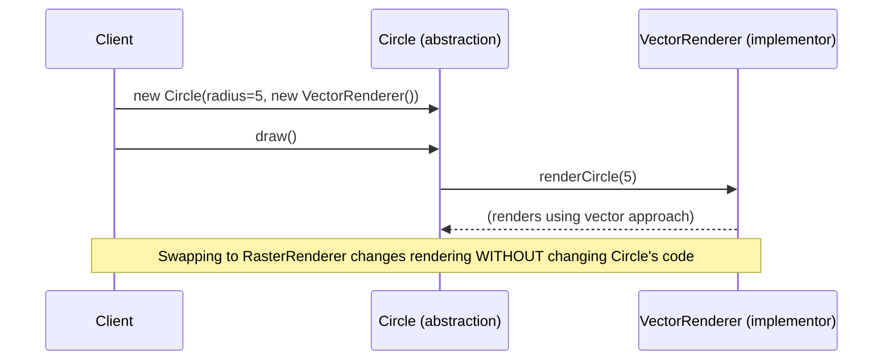

**JVM Behaviour**: Ordinary interface dispatch (`invokeinterface`) from the abstraction to the implementor — no special JVM mechanics; the JIT can still optimize/inline the delegation if the call site profile is monomorphic (e.g., in a context where only one `Renderer` implementation is ever actually used at a given call site).

#### Interview Questions
**Basic**
1. What problem does the Bridge pattern solve?
2. How does Bridge use composition instead of inheritance to solve this problem?

**Intermediate**
1. Give an example of the "subclass explosion" problem that Bridge is designed to avoid.
2. How does Bridge allow swapping an implementation at runtime, and why can't a purely inheritance-based design do this?

**Advanced**
1. How is Bridge similar to and different from the Strategy pattern, given both use composition to delegate behavior?
2. When would introducing a Bridge be overkill, and what's a simpler alternative in that case?

**Scenario-based**
1. You have a `Notification` abstraction (Email, SMS, Push) that must work across multiple delivery backends (AWS SES, Twilio, Firebase), and you expect both dimensions to grow independently over time. Design this using Bridge.

#### Detailed Answers
1. **Problem solved**: Avoids a combinatorial explosion of subclasses when a class hierarchy has two (or more) independent dimensions of variation — without Bridge, expressing every combination via inheritance alone requires N×M subclasses (one per combination); Bridge splits the two dimensions into separate hierarchies connected by composition, needing only N+M classes total.
2. **Composition instead of inheritance**: Rather than the abstraction (e.g., `Shape`) inheriting from or being tightly coupled to a specific implementation approach, it HOLDS a reference to a separate implementor object (e.g., `Renderer`) through an interface, and delegates implementation-specific work to that held object — this decouples "what varies in the abstraction" from "what varies in the implementation", letting either vary independently since they're connected only through an interface reference, not a class hierarchy.
3. **Subclass explosion example**: Modeling shapes (`Circle`, `Square`, `Triangle` — 3 types) that can each be rendered via different engines (`Vector`, `Raster` — 2 engines) using pure inheritance would require 6 subclasses (`VectorCircle`, `RasterCircle`, `VectorSquare`, `RasterSquare`, `VectorTriangle`, `RasterTriangle`), and adding one more shape type or one more renderer multiplies the required subclasses further (3×3=9, 4×2=8, etc.) — Bridge instead needs only 3 shape classes + 2 renderer classes = 5 total, regardless of how many combinations are actually used.
4. **Runtime implementation swapping**: Because the abstraction holds its implementor via an interface REFERENCE (not baked in via inheritance at compile time), that reference can be reassigned or passed in differently at construction/runtime (e.g., `shape.setRenderer(new RasterRenderer())`), immediately changing the shape's rendering behavior without altering the `Shape` class's code at all; a purely inheritance-based design would require creating an entirely different subclass instance (a different compiled type) to change implementation, which cannot be done to an already-existing object at runtime.
5. **Bridge vs Strategy similarity/difference**: Both patterns use composition to delegate varying behavior to a separate object via an interface, and structurally they can look almost identical in code. The conceptual difference is intent/scope: Strategy is about making ONE algorithm/behavior interchangeable within a single class (a tactical, often single-method-focused substitution, chosen per use or per call); Bridge is a broader structural/architectural decision made explicitly to decouple TWO ENTIRE hierarchies (abstraction and implementation) that are each expected to grow and vary independently over the lifetime of the system, often established early in a design rather than swapped casually per call.
6. **When Bridge is overkill**: If there's genuinely only ONE dimension of variation (e.g., you'll only ever have different shape types, never different rendering engines), introducing a full Bridge with a separate implementor hierarchy adds unnecessary indirection/classes for no real benefit — a simpler single inheritance hierarchy (or no pattern at all) suffices; only introduce Bridge once you have genuine evidence of two independently-varying dimensions.
7. **Notification/delivery-backend scenario**: Define an implementor interface `DeliveryChannel` with methods like `send(String recipient, String content)`, implemented by `SesDeliveryChannel`, `TwilioDeliveryChannel`, `FirebaseDeliveryChannel`; define an abstraction hierarchy `Notification` (abstract, holding a `DeliveryChannel` reference) with subclasses `EmailNotification`, `SmsNotification`, `PushNotification`, each formatting content appropriately for its notification type before delegating actual transmission to the held `DeliveryChannel`. Adding a new notification type (e.g., `SlackNotification`) or a new delivery backend (e.g., `SendGridDeliveryChannel`) each requires only ONE new class, and any notification type can be paired with any delivery backend at construction time.

#### Code Examples
```java
// Implementor hierarchy: the "how" dimension
public interface DeliveryChannel {
    void send(String recipient, String content);
}

class SesDeliveryChannel implements DeliveryChannel {
    public void send(String recipient, String content) {
        System.out.println("[SES] to " + recipient + ": " + content);
    }
}

class TwilioDeliveryChannel implements DeliveryChannel {
    public void send(String recipient, String content) {
        System.out.println("[Twilio SMS] to " + recipient + ": " + content);
    }
}

// Abstraction hierarchy: the "what" dimension, bridged to DeliveryChannel via composition
public abstract class Notification {
    protected final DeliveryChannel channel; // the "bridge" to the implementation

    protected Notification(DeliveryChannel channel) {
        this.channel = channel;
    }

    public abstract void notify(String recipient, String message);
}

class EmailNotification extends Notification {
    public EmailNotification(DeliveryChannel channel) { super(channel); }
    public void notify(String recipient, String message) {
        channel.send(recipient, "Subject: Notification\n\n" + message); // email-specific formatting
    }
}

class SmsNotification extends Notification {
    public SmsNotification(DeliveryChannel channel) { super(channel); }
    public void notify(String recipient, String message) {
        channel.send(recipient, message.length() > 140 ? message.substring(0, 140) : message);
    }
}
```

### Composite

#### Theory
**Core Concepts**: The Composite pattern lets you compose objects into tree structures representing part-whole hierarchies, and treat individual objects ("leaves") and compositions of objects ("composites"/branches) uniformly through a common interface — client code can call the same operation on a single leaf or an entire subtree without needing to distinguish between them. Classic examples: a file system (files vs. directories), a GUI component tree (buttons vs. panels containing buttons), an org chart.

**Internal Working**: A common `Component` interface declares operations meaningful to both leaves and composites; `Leaf` classes implement the operation directly; `Composite` classes implement the operation by iterating over their children (which are also `Component`s) and recursively invoking the same operation on each, aggregating/delegating as appropriate.

**When to Use It**: Representing hierarchical, recursive tree-like structures (file systems, UI component trees, organizational structures, nested menus) where client code should be able to operate on individual elements and groups of elements interchangeably.

**Advantages**: Simplifies client code dramatically (no need for type-checking/casting to distinguish leaves from composites — just call the common interface method); makes it easy to add new component types (new kinds of leaves or composites) without changing client code; naturally recursive, mirroring the recursive nature of the tree structures being modeled.

**Limitations**: Can make the design overly general — it may be tempting to add operations to the `Component` interface that only make sense for composites (e.g., `addChild()`) or only for leaves, forcing leaf implementations to throw `UnsupportedOperationException` for composite-only operations (a violation of the Liskov Substitution Principle if not carefully designed); can make it harder to restrict what types of children a particular composite may contain if the type system doesn't enforce it.

#### Internal Working
**Step-by-Step Explanation**: 1) Define a `Component` interface with operations meaningful across the hierarchy (e.g., `getSize()`, `print(indent)`). 2) `Leaf` classes (e.g., `File`) implement these operations directly based on their own simple state. 3) `Composite` classes (e.g., `Directory`) maintain a collection of child `Component` references (which may themselves be leaves or further composites) and implement the SAME operations by iterating over children, recursively invoking each child's implementation and combining/aggregating the results (e.g., summing child sizes, or delegating a print call to each child with increased indentation). 4) Client code holds a `Component` reference (regardless of whether it's actually a leaf or a composite under the hood) and calls the common operation, with the recursive tree traversal happening transparently underneath via polymorphic dispatch.

**Memory Layout**: A composite tree is a standard heap-allocated object graph — each `Composite` node holds a `List<Component>` of child references (which may point to `Leaf` nodes or further nested `Composite` nodes), forming an arbitrarily deep tree; recursive operations use the JVM call stack proportional to tree depth (very deep trees risk `StackOverflowError` for naive recursive implementations, though this is rarely an issue for typical hierarchies).

**Diagrams**:
```
Component (interface)
  |-- File (Leaf)          getSize() returns own size directly
  |-- Directory (Composite) getSize() = sum of all children's getSize() (recursive)
         |-- File
         |-- Directory
               |-- File
               |-- File
```

**JVM Behaviour**: Each recursive call into a child's operation is an ordinary virtual method dispatch (`invokeinterface`), consuming one stack frame per level of tree depth; the JIT can inline/optimize individual dispatch calls based on call-site profiling, but deep composite trees fundamentally rely on the JVM's call stack for traversal unless explicitly rewritten with an iterative approach (e.g., using an explicit `Deque` as a stack) for very large/deep hierarchies.

#### Interview Questions
**Basic**
1. What problem does the Composite pattern solve?
2. Give a real-world example of a Composite structure.

**Intermediate**
1. How does the Composite pattern let client code avoid `instanceof` checks/casting when working with a tree of mixed leaf and composite nodes?
2. What's a common design tension in the `Component` interface regarding operations that only make sense for composites (like `addChild()`)?

**Advanced**
1. How would you handle very deep composite trees where naive recursive traversal risks a `StackOverflowError`?
2. How does Composite relate to the Visitor pattern when you need to perform multiple different operations across a composite structure without polluting the `Component` interface?

**Scenario-based**
1. Design a file system model using Composite where you need to compute total disk usage and also print a formatted tree listing, without adding numerous unrelated methods to a single `Component` interface as new operations are needed over time.

#### Detailed Answers
1. **Problem solved**: Lets client code treat individual objects and groups/hierarchies of objects uniformly through a shared interface, avoiding special-case logic to distinguish "is this a single item or a collection of items" — essential for representing and operating on recursive, tree-shaped part-whole structures cleanly.
2. **Real-world example**: A file system, where a `Directory` (composite) can contain both `File` objects (leaves) and other `Directory` objects (nested composites); calling `getSize()` on either a single file or an entire directory tree works identically from the caller's perspective, with the directory's implementation recursively summing its children's sizes.
3. **Avoiding instanceof/casting**: Because both `Leaf` and `Composite` implement the SAME `Component` interface, client code holding a `Component` reference simply calls the interface method polymorphically — the JVM's virtual dispatch mechanism automatically invokes the correct (leaf's direct or composite's recursive) implementation, with no need for the client to check `if (component instanceof Composite)` and branch its logic accordingly.
4. **Design tension with composite-only operations**: If you add methods like `addChild(Component c)` to the shared `Component` interface (so client code can add children generically), `Leaf` implementations have no meaningful way to implement it — they either throw `UnsupportedOperationException` (violating the Liskov Substitution Principle, since callers can no longer safely assume all `Component`s support all `Component` operations) or silently no-op (masking a likely programming error). Some designs accept this trade-off for simplicity; more careful designs keep child-management operations only on the `Composite` type, requiring an explicit (safe) downcast or a separate visitor/double-dispatch mechanism when child-management is genuinely needed.
5. **Handling very deep trees**: Rewrite the recursive traversal as an explicit iterative algorithm using your own heap-allocated stack (e.g., a `Deque<Component>` you push/pop children onto/from manually) instead of relying on the JVM's call stack, which has a bounded (though configurable via `-Xss`) size — this avoids `StackOverflowError` for pathologically deep hierarchies, at the cost of more verbose traversal code compared to natural recursion.
6. **Relation to Visitor**: When you need to add many DIFFERENT operations over time (compute size, print listing, validate permissions, export to XML, ...) without repeatedly modifying the `Component` interface (and thus every leaf/composite implementation) for each new operation, the Visitor pattern lets you define each new operation as a separate `Visitor` implementation that's "accepted" by each component (double dispatch), keeping the `Component` interface itself stable (just `accept(Visitor)`) while new operations are added purely by creating new `Visitor` classes — Composite and Visitor are frequently combined precisely for this reason.
7. **File system scenario**: Keep `Component` minimal (e.g., just `accept(FileSystemVisitor visitor)` for double dispatch, or a small stable set of universally meaningful operations like `getName()`); implement "compute total disk usage" and "print formatted tree listing" as SEPARATE `FileSystemVisitor` implementations (`SizeCalculatorVisitor`, `TreePrinterVisitor`) rather than as additional methods baked directly into `Component`/`File`/`Directory` — this way, adding a third operation later (e.g., a `PermissionAuditVisitor`) requires zero changes to the existing `File`/`Directory` classes, only a new visitor class.

#### Code Examples
```java
import java.util.ArrayList;
import java.util.List;

public interface FileSystemComponent {
    long getSize();
    void print(String indent);
}

class FileLeaf implements FileSystemComponent {
    private final String name;
    private final long sizeBytes;
    FileLeaf(String name, long sizeBytes) { this.name = name; this.sizeBytes = sizeBytes; }

    public long getSize() { return sizeBytes; }
    public void print(String indent) { System.out.println(indent + "- " + name + " (" + sizeBytes + " bytes)"); }
}

class DirectoryComposite implements FileSystemComponent {
    private final String name;
    private final List<FileSystemComponent> children = new ArrayList<>();
    DirectoryComposite(String name) { this.name = name; }

    public void add(FileSystemComponent child) { children.add(child); }

    public long getSize() {
        long total = 0;
        for (FileSystemComponent child : children) total += child.getSize(); // recursive
        return total;
    }

    public void print(String indent) {
        System.out.println(indent + "+ " + name + "/");
        for (FileSystemComponent child : children) child.print(indent + "  "); // recursive
    }
}
```

### Decorator

#### Theory
**Core Concepts**: The Decorator pattern attaches additional responsibilities/behavior to an object dynamically by wrapping it in one or more decorator objects that implement the same interface as the wrapped object, providing a flexible alternative to subclassing for extending functionality. Java's `java.io` stream classes (`BufferedInputStream` wrapping a `FileInputStream`, further wrapped by `GZIPInputStream`, etc.) are the canonical real-world example.

**Internal Working**: Each decorator implements the same component interface as the object it wraps, holds a reference to the wrapped component, and its methods typically call through to the wrapped component's corresponding method while adding behavior before/after/around that call — decorators can be layered/stacked arbitrarily deep, each adding one incremental behavior.

**When to Use It**: Adding optional, combinable behaviors/responsibilities to objects at runtime (e.g., adding compression, encryption, buffering, or logging to a stream in any combination) where subclassing for every combination would cause the same N×M explosion problem Bridge addresses, but here specifically for layered/stackable cross-cutting behavior rather than two fixed orthogonal dimensions.

**Advantages**: Behaviors can be mixed and matched at runtime by composing decorators in different combinations/orders, avoiding a combinatorial subclass explosion; adheres to the Open/Closed Principle — new decorators can be added without modifying existing component or decorator classes; more flexible than inheritance since behavior can be added/removed/reordered dynamically per instance rather than being fixed at compile time for an entire subclass.

**Limitations**: Can result in a large number of small wrapper classes and, at runtime, a deeply nested chain of wrapped objects that can be harder to debug (stack traces become deep and layered); the ORDER in which decorators are applied can matter and produce subtly different behavior, which can be a source of bugs if not well understood; identity-based operations (`==`, `instanceof` checks against the original concrete type) can behave unexpectedly since the object at hand is actually a decorator wrapper, not the original.

#### Internal Working
**Step-by-Step Explanation**: 1) Define a component interface (e.g., `DataSource` with a `write(String data)`/`read()` method). 2) Implement a concrete base component (e.g., `FileDataSource`). 3) Implement an abstract (or simply implementing the same interface) `Decorator` base class that also implements the component interface and holds a reference to a wrapped `DataSource` component, with its methods delegating to the wrapped instance by default. 4) Concrete decorators (e.g., `CompressionDecorator`, `EncryptionDecorator`) extend/implement this pattern, overriding methods to add behavior BEFORE and/or AFTER delegating to the wrapped component's method (e.g., encrypt the data, THEN call the wrapped component's `write()` to persist the now-encrypted data). 5) Client code constructs a chain by nesting decorators around a base component (e.g., `new CompressionDecorator(new EncryptionDecorator(new FileDataSource(path)))`), and calls the outermost decorator's method, triggering a chain of delegated calls flowing inward through each layer.

**Memory Layout**: Each decorator instance (heap) holds a reference to the component it wraps (heap) — a linked chain of objects, each layer adding one heap allocation; method calls on the outer decorator cascade through this reference chain, with each layer's stack frame present simultaneously during a single call (stack depth proportional to decorator chain length).

**Diagrams**:
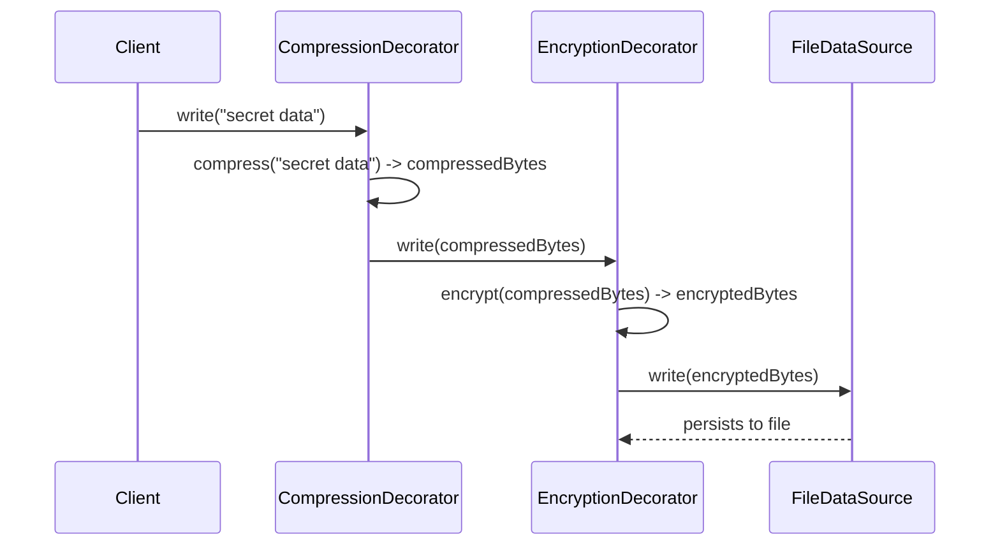

**JVM Behaviour**: Each layer of decoration is an ordinary virtual/interface method call (`invokeinterface`), so a chain of N decorators results in N nested method calls (N stack frames) per outer call — the JIT can potentially inline shallow, monomorphic decorator chains, but very deep or polymorphic (varying decorator composition per call site) chains reduce inlining opportunities; this mirrors exactly how Java's `java.io` stream wrapper classes behave, where reading through several layers of `BufferedInputStream`/`GZIPInputStream`/etc. involves a call chain proportional to the number of wrapping layers.

#### Interview Questions
**Basic**
1. What problem does the Decorator pattern solve compared to using subclassing for every feature combination?
2. Give a real-world Java standard-library example of the Decorator pattern.

**Intermediate**
1. Why can the ORDER of applying decorators matter, and give an example where reordering changes behavior?
2. How does a Decorator differ structurally from a Proxy, given both wrap an object behind the same interface?

**Advanced**
1. What debugging challenges arise from deeply nested decorator chains, and how would you mitigate them?
2. How does Decorator relate to and differ from Bridge, since both use composition to add flexibility?

**Scenario-based**
1. Design a `DataSource` abstraction supporting optional, independently combinable compression and encryption when writing/reading data, applied in different orders depending on the use case, without creating a separate subclass for every combination.

#### Detailed Answers
1. **Problem solved vs subclassing**: If you need to support every COMBINATION of several optional behaviors (e.g., compression, encryption, buffering — 3 independent toggle-able behaviors) via subclassing, you'd need up to 2^3=8 subclasses to cover all combinations; Decorator instead lets you compose any subset of behaviors at runtime by wrapping the base object in whichever decorators are needed, needing only one class per behavior (3 classes total) regardless of how many combinations are actually used.
2. **Standard-library example**: `java.io`'s stream classes — `new BufferedInputStream(new FileInputStream("data.txt"))` wraps a raw file stream with buffering behavior, and you could further wrap that in a `GZIPInputStream` for decompression — each wrapper implements the same `InputStream` interface and adds one incremental behavior around the wrapped stream.
3. **Why order matters**: Each decorator's added behavior happens either before or after (or around) delegating to the wrapped component, so applying `EncryptionDecorator` then `CompressionDecorator` (compress THEN encrypt) produces different bytes on disk than applying them in the reverse order (encrypt THEN compress) — compressing encrypted data is typically far less effective (encrypted data has high entropy, resists compression) than compressing plaintext first and then encrypting the compressed result, so the correct order here is compress-then-encrypt for both correctness of behavior expectations and efficiency.
4. **Decorator vs Proxy structurally**: Both wrap an object behind the same interface using composition, but their INTENT differs: Decorator's purpose is to ADD new behavior/responsibilities to the wrapped object (the wrapped object still does its normal job, decorator adds to it); Proxy's purpose is to CONTROL ACCESS to the wrapped object (e.g., lazy loading, access control, remote call marshaling) without necessarily adding new behavior to what the object does — structurally near-identical, but conceptually distinct in why you're wrapping.
5. **Debugging challenges with deep chains**: Stack traces through many layers of decorators become long and repetitive (each layer's frame appears), making it harder to identify where in the "real" logic (versus decoration plumbing) an issue originates; also, `instanceof`/type checks against the base concrete class fail unexpectedly since the object at hand is actually an outer decorator, not the base type. Mitigation: give each decorator a clear, descriptive class name/toString() reflecting its role, keep chains as shallow as practically possible, and consider centralizing decorator composition logic (e.g., a builder or factory constructing a standard chain) so the composition itself is easy to reason about even if the resulting call chain is deep.
6. **Decorator vs Bridge**: Both use composition, but Bridge is about decoupling TWO INDEPENDENT DIMENSIONS of a class hierarchy (abstraction vs implementation) that are each fixed once composed for a given object's lifetime, addressing a combinatorial explosion across those two dimensions; Decorator is about DYNAMICALLY, INCREMENTALLY layering additional behavior onto a single object, often nested arbitrarily deep and changeable at construction time per instance, addressing a combinatorial explosion of OPTIONAL, STACKABLE behaviors rather than two fixed structural dimensions.
7. **Combinable compression/encryption scenario**: Define `DataSource` with `write(byte[])`/`read()`; implement `FileDataSource` as the base concrete component; implement `CompressionDecorator` and `EncryptionDecorator`, each implementing `DataSource`, each holding a wrapped `DataSource`, each adding its transformation before delegating to the wrapped instance on write (and reversing it after delegating on read); client code composes the desired chain explicitly, e.g. `new EncryptionDecorator(new CompressionDecorator(new FileDataSource(path)))` for compress-then-encrypt, or reorder the wrapping for the opposite order — no subclass is needed for any particular combination.

#### Code Examples
```java
public interface DataSource {
    void write(byte[] data);
    byte[] read();
}

class FileDataSource implements DataSource {
    private byte[] storage = new byte[0];
    public void write(byte[] data) { storage = data; /* simulated file write */ }
    public byte[] read() { return storage; }
}

abstract class DataSourceDecorator implements DataSource {
    protected final DataSource wrapped;
    protected DataSourceDecorator(DataSource wrapped) { this.wrapped = wrapped; }
}

class CompressionDecorator extends DataSourceDecorator {
    CompressionDecorator(DataSource wrapped) { super(wrapped); }
    public void write(byte[] data) { wrapped.write(compress(data)); }
    public byte[] read() { return decompress(wrapped.read()); }
    private byte[] compress(byte[] d) { System.out.println("compressing"); return d; }
    private byte[] decompress(byte[] d) { System.out.println("decompressing"); return d; }
}

class EncryptionDecorator extends DataSourceDecorator {
    EncryptionDecorator(DataSource wrapped) { super(wrapped); }
    public void write(byte[] data) { wrapped.write(encrypt(data)); }
    public byte[] read() { return decrypt(wrapped.read()); }
    private byte[] encrypt(byte[] d) { System.out.println("encrypting"); return d; }
    private byte[] decrypt(byte[] d) { System.out.println("decrypting"); return d; }
}

// Usage: compress THEN encrypt on write (correct order - compress plaintext before encrypting)
// DataSource pipeline = new EncryptionDecorator(new CompressionDecorator(new FileDataSource("file.dat")));
```

### Facade

#### Theory
**Core Concepts**: The Facade pattern provides a simplified, unified, higher-level interface to a complex subsystem consisting of many classes/interactions, reducing the coupling between client code and the subsystem's internal complexity. Unlike Adapter (which makes an incompatible interface compatible) or Decorator (which adds behavior), Facade's purpose is purely to REDUCE COMPLEXITY exposed to callers by hiding a tangle of subsystem interactions behind one clean entry point.

**Internal Working**: The facade class holds references to (or creates) the various subsystem components and coordinates calls across them internally, exposing only a small number of high-level operations that internally orchestrate the necessary lower-level calls in the correct sequence.

**When to Use It**: Simplifying client interaction with a complex subsystem (e.g., a multi-step video conversion pipeline involving codec selection, format validation, compression, and metadata tagging) so most callers only need to call one or two high-level methods instead of understanding/orchestrating the whole subsystem themselves.

**Advantages**: Reduces coupling between client code and subsystem internals (clients depend only on the facade, not on numerous subsystem classes directly); makes the subsystem easier to use for the common case while NOT preventing advanced users from bypassing the facade and using subsystem classes directly for less common needs; can serve as a natural layering boundary (e.g., between application layers or module boundaries).

**Limitations**: If overused or grown carelessly, a facade itself can become a "god object" accumulating too many responsibilities; a facade doesn't prevent misuse of the underlying subsystem by code that bypasses it; can hide too much, making it harder for advanced users to access needed lower-level control if the facade doesn't also expose subsystem access for those cases.

#### Internal Working
**Step-by-Step Explanation**: 1) Identify a complex subsystem consisting of multiple classes that typically need to be used together in a specific sequence for common tasks (e.g., `VideoDecoder`, `AudioMixer`, `CompressionCodec`, `MetadataWriter`). 2) Create a `Facade` class that holds references to (or constructs) instances of these subsystem components. 3) Expose one or a few high-level methods on the facade (e.g., `convertVideo(inputFile, outputFormat)`) that internally call the necessary subsystem methods in the correct order, handling coordination, error propagation, and common configuration choices on the caller's behalf. 4) Typical client code calls only the facade's high-level method(s), remaining unaware of (and decoupled from) the individual subsystem classes and their required call sequence/coordination logic.

**Memory Layout**: The facade object (heap) holds references to the various subsystem component objects (also heap) it coordinates — ordinary object composition; no special memory considerations beyond typical object graphs.

**Diagrams**:
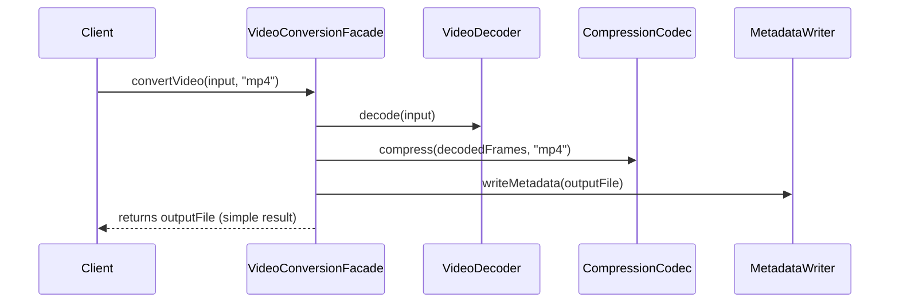

**JVM Behaviour**: No special JVM mechanics — the facade's method is an ordinary method that internally makes several sequential (or, if designed for it, parallel via an `ExecutorService`) calls into subsystem objects; from a JIT perspective, this is simply a method with a larger call graph than typical client-facing methods, with no unique optimization or runtime behavior distinct from any other coordinating method.

#### Interview Questions
**Basic**
1. What problem does the Facade pattern solve?
2. Does using a Facade prevent client code from accessing the subsystem classes directly?

**Intermediate**
1. How does Facade differ from Adapter, since both present a different interface in front of existing code?
2. What's the risk of a facade becoming a "god object", and how would you avoid it?

**Advanced**
1. How would you design a facade that supports both a simple "common case" high-level API and still allows advanced callers to access subsystem-level control when needed?
2. How does Facade relate to architectural layering (e.g., a service layer facade in front of multiple internal repositories/clients)?

**Scenario-based**
1. Your application's checkout process involves inventory validation, payment processing, shipping calculation, and order persistence — four separate subsystems each with several methods. Design a facade for the checkout flow, and explain what you would and wouldn't expose through it.

#### Detailed Answers
1. **Problem solved**: Reduces the complexity and coupling exposed to client code when working with a subsystem made up of many classes/interactions that typically need to be used together in a specific coordinated way — instead of every caller needing to understand and correctly orchestrate the whole subsystem, they call one simple, well-defined facade method.
2. **Does it prevent direct access?**: No — Facade is an ADDITIONAL, simplified entry point; it doesn't remove or hide the subsystem classes' own public APIs (unless you deliberately make them package-private/non-public), so advanced callers who need finer-grained control can still bypass the facade and use subsystem classes directly if the facade doesn't cover their specific need.
3. **Facade vs Adapter**: Both present client code with a different interface than what already exists underneath, but their PURPOSE differs — Adapter's job is to make an INCOMPATIBLE interface match a specific interface the client already expects (a like-for-like translation, typically 1:1 with the adaptee, focused on interface compatibility); Facade's job is to SIMPLIFY a genuinely complex, multi-class subsystem into fewer, higher-level operations (focused on reducing complexity/coupling, not necessarily working around interface incompatibility).
4. **God object risk**: If a facade keeps accumulating unrelated responsibilities/methods over time (becoming the single class everyone calls for everything, regardless of whether the underlying operations are actually related), it becomes a maintenance bottleneck and violates single-responsibility — avoid this by keeping each facade scoped to one cohesive area of subsystem functionality, splitting into multiple, more focused facades if the responsibilities genuinely diverge, and resisting the urge to add every new operation to an existing, already-large facade just for convenience.
5. **Supporting both simple and advanced access**: Expose the small set of common, high-level operations as the facade's primary API for typical callers, while also providing (clearly documented) accessor methods returning references to the underlying subsystem components (e.g., `facade.getVideoDecoder()`) for advanced callers who need lower-level control — this lets the facade serve the 90% common case simply while not blocking the 10% advanced case that genuinely needs subsystem-level access.
6. **Relation to architectural layering**: A "service layer" in a layered architecture is essentially a Facade at the module/layer boundary — it presents a simplified, use-case-oriented API (e.g., `OrderService.placeOrder(...)`) to callers (e.g., a web controller layer), internally coordinating multiple lower-level repositories, external clients, and domain objects, so upper layers depend only on the service layer's stable, simplified interface rather than directly coupling to numerous internal persistence/integration details.
7. **Checkout facade scenario**: Create a `CheckoutFacade` exposing one primary method, `placeOrder(cartItems, paymentDetails, shippingAddress)`, which internally calls `InventoryService.reserve(...)`, `PaymentProcessor.charge(...)`, `ShippingCalculator.calculateCost(...)`, and `OrderRepository.save(...)` in the correct sequence, handling rollback/compensation logic if a later step fails (e.g., releasing the inventory reservation if payment fails). Expose only this high-level method (and perhaps a `cancelOrder(orderId)` counterpart) through the facade for typical callers (e.g., the web/API layer); do NOT expose the individual subsystem classes (`InventoryService`, `PaymentProcessor`, etc.) through the facade's public API, keeping the coordination/sequencing/error-handling logic fully encapsulated and consistent regardless of which caller invokes checkout.

#### Code Examples
```java
public class CheckoutFacade {
    private final InventoryService inventoryService = new InventoryService();
    private final PaymentProcessor paymentProcessor = new PaymentProcessor();
    private final ShippingCalculator shippingCalculator = new ShippingCalculator();
    private final OrderRepository orderRepository = new OrderRepository();

    // Single high-level entry point coordinating four subsystems in the correct order
    public String placeOrder(java.util.List<String> items, double amount, String address) {
        String reservationId = inventoryService.reserve(items);
        try {
            paymentProcessor.charge(amount);
            double shippingCost = shippingCalculator.calculate(address);
            return orderRepository.save(items, amount + shippingCost, address);
        } catch (RuntimeException e) {
            inventoryService.release(reservationId); // compensating action on failure
            throw e;
        }
    }
}

class InventoryService {
    String reserve(java.util.List<String> items) { return "reservation-1"; }
    void release(String reservationId) { System.out.println("Released: " + reservationId); }
}
class PaymentProcessor { void charge(double amount) { System.out.println("Charged: " + amount); } }
class ShippingCalculator { double calculate(String address) { return 5.99; } }
class OrderRepository {
    String save(java.util.List<String> items, double total, String address) { return "order-42"; }
}
```

### Proxy

#### Theory
**Core Concepts**: The Proxy pattern provides a surrogate/placeholder object implementing the same interface as a real subject, controlling access to it — common variants include virtual proxy (lazy-loads an expensive real object only when actually needed), protection proxy (adds access-control checks), remote proxy (represents an object living in a different address space/process, marshaling calls over the network), and caching/logging proxies (add cross-cutting behavior around access). Java's dynamic proxies (`java.lang.reflect.Proxy`) and many frameworks (Spring AOP, Hibernate lazy-loading entities) implement this pattern extensively at runtime.

**Internal Working**: The proxy implements the same interface as the real subject and holds a reference to (or the means to create) the real subject; each proxy method either delegates directly to the real subject (possibly after performing pre/post logic like access checks, logging, or lazy initialization) or short-circuits without delegating at all (e.g., denying access).

**When to Use It**: Deferring expensive object creation until actually needed (virtual proxy), adding access control without modifying the real subject (protection proxy), representing remote objects transparently (remote proxy/RPC stubs), or adding cross-cutting concerns (caching, logging, transaction management) around existing objects without modifying their code (commonly done via dynamic proxies in frameworks like Spring).

**Advantages**: Controls access/adds behavior transparently to callers who just see the common interface; enables lazy initialization of expensive resources; can be generated dynamically at runtime (via `java.lang.reflect.Proxy` or bytecode-generation libraries like CGLIB/ByteBuddy) without writing a hand-written proxy class per interface, which is how many DI/AOP frameworks implement declarative transactions, security, and caching.

**Limitations**: Adds a layer of indirection (extra method call overhead per invocation, more so for dynamic/reflection-based proxies than hand-written ones); can make debugging harder since stack traces show proxy-generated classes/methods rather than directly the real subject; dynamic proxies via `java.lang.reflect.Proxy` only work for interfaces (not concrete classes) unless using a bytecode-generation library that can subclass concrete classes.

#### Internal Working
**Step-by-Step Explanation**: 1) Define a common interface implemented by both the real subject and the proxy. 2) The proxy holds a reference to the real subject (or the information needed to create one lazily) and implements the same interface. 3) For a virtual proxy: the real subject isn't created until the proxy's method is first called, at which point the proxy lazily instantiates it and delegates. 4) For a protection proxy: the proxy checks caller permissions/context before delegating, throwing an exception or returning early if unauthorized. 5) For a JDK dynamic proxy: `Proxy.newProxyInstance(classLoader, interfaces, invocationHandler)` generates a proxy class implementing the given interfaces at runtime; every method call on the resulting proxy instance is routed through the supplied `InvocationHandler.invoke(proxy, method, args)`, which decides how to handle it (e.g., delegate to a real object, add logging, throw an exception).

**Memory Layout**: A hand-written proxy is an ordinary heap object holding a reference to the real subject (or null until lazily created); a JDK dynamic proxy is an actual dynamically-generated class (created and loaded by the JVM at runtime, cached per interface-set+classloader combination) whose instances are ordinary heap objects delegating every call to the associated `InvocationHandler`.

**Diagrams**:
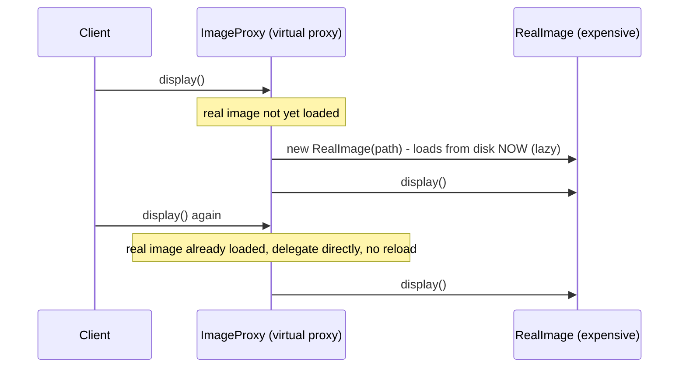

**JVM Behaviour**: JDK dynamic proxies generate an actual new class at runtime (via `sun.reflect.Proxy`'s bytecode generation), incurring a one-time class-generation cost on first use per interface combination (cached thereafter); every call through a dynamic proxy goes through `InvocationHandler.invoke()` via reflection (`Method.invoke()`), which is inherently slower than a direct virtual call, though modern JVMs optimize reflective calls reasonably well after JIT warm-up — this overhead is usually negligible compared to the actual work being proxied (e.g., a database call or business logic), which is why frameworks use this technique pervasively for cross-cutting concerns.

#### Interview Questions
**Basic**
1. What problem does the Proxy pattern solve, and name two common proxy variants.
2. How does a Proxy differ from a Decorator in intent, given both wrap an object behind the same interface?

**Intermediate**
1. How does a JDK dynamic proxy work, and what's the role of `InvocationHandler`?
2. What's a limitation of `java.lang.reflect.Proxy` regarding what it can proxy?

**Advanced**
1. How do frameworks like Spring use proxies to implement declarative transactions (`@Transactional`) without modifying your business logic classes?
2. What performance/debugging trade-offs come with heavy use of dynamic proxies?

**Scenario-based**
1. You want to add caching around an expensive `ProductCatalogService.getProduct(id)` call without modifying its existing implementation or any of its callers. Design this using a dynamic proxy.

#### Detailed Answers
1. **Problem solved / two variants**: Proxy controls access to an object by interposing a surrogate implementing the same interface — common variants: virtual proxy (defers/lazy-loads expensive object creation until actually needed) and protection proxy (adds access-control checks before allowing calls through to the real subject); other variants include remote proxy (represents an object in a different process/machine) and caching proxy.
2. **Proxy vs Decorator intent**: Structurally near-identical (both wrap an object behind a shared interface via composition), but the INTENT differs — Decorator's purpose is to ADD new behavior/responsibilities to what the wrapped object does (the wrapped object still fully does its job, decorator enriches it); Proxy's purpose is to CONTROL ACCESS to the wrapped object (deciding whether/when/how a call actually reaches the real subject at all), which may include NOT delegating in some cases (e.g., a protection proxy denying access) rather than always adding to the delegated behavior.
3. **JDK dynamic proxy mechanics**: `Proxy.newProxyInstance(classLoader, interfaces, invocationHandler)` dynamically generates (at runtime, via bytecode generation) a new class implementing the specified interfaces, where every method call on an instance of that generated class is routed to the supplied `InvocationHandler`'s `invoke(Object proxy, Method method, Object[] args)` method; the handler's implementation decides what to actually do — typically delegating to a real underlying object (obtained via reflection or held as a field), possibly adding logic before/after that delegation.
4. **Limitation of java.lang.reflect.Proxy**: It can only create proxies implementing INTERFACES, not proxies subclassing concrete classes (since Java doesn't support dynamic multiple inheritance of implementation) — to proxy a concrete class without an interface, you need a bytecode-generation library like CGLIB or ByteBuddy (which Spring uses internally for exactly this case) that generates an actual subclass overriding the target's methods.
5. **Spring @Transactional via proxies**: When a bean method is annotated `@Transactional`, Spring wraps the actual bean in a dynamically-generated proxy (JDK dynamic proxy if the bean implements an interface, or a CGLIB subclass proxy otherwise) whose `InvocationHandler`/method interceptor begins a transaction before delegating to the real method, and commits/rolls back the transaction after the real method returns/throws — your business logic class itself contains no transaction-management code at all; the proxy transparently adds this cross-cutting behavior around every call that goes through Spring's managed bean reference (calls made internally within the same class, bypassing the proxy, notably do NOT get this behavior — a common "self-invocation" gotcha).
6. **Performance/debugging trade-offs**: Dynamic proxies add reflective method-invocation overhead (`Method.invoke()`) on every call compared to a direct virtual call, plus a one-time class-generation cost per interface combination (usually negligible after warm-up and amortized against the actual work being done); debugging is harder because stack traces show proxy-generated class names/frames (e.g., `$Proxy42`, CGLIB-enhanced class names) rather than directly your business logic, and IDE "go to implementation" navigation can be confused by the dynamically-generated intermediary.
7. **Caching proxy scenario**: Define/use the existing `ProductCatalogService` interface; implement an `InvocationHandler` (or, more simply, a hand-written proxy class implementing the same interface) that checks an internal cache (`Map<Long, Product>`) before delegating — on a cache hit, return the cached value directly without calling the real service; on a miss, delegate to the real `ProductCatalogService` instance, store the result in the cache, then return it. Construct the proxy via `Proxy.newProxyInstance(...)` (or manual wrapping) and have callers use the proxy instance in place of the real service, requiring zero changes to the real service's implementation or to caller code (which only depends on the shared interface).

#### Code Examples
```java
import java.lang.reflect.InvocationHandler;
import java.lang.reflect.Method;
import java.lang.reflect.Proxy;
import java.util.Map;
import java.util.concurrent.ConcurrentHashMap;

public interface ProductCatalogService {
    String getProduct(long id);
}

class RealProductCatalogService implements ProductCatalogService {
    public String getProduct(long id) {
        System.out.println("Expensive DB lookup for product " + id);
        return "Product-" + id;
    }
}

// Caching proxy implemented via JDK dynamic proxy - no changes to real service or callers
class CachingInvocationHandler implements InvocationHandler {
    private final ProductCatalogService realService;
    private final Map<Object, Object> cache = new ConcurrentHashMap<>();

    CachingInvocationHandler(ProductCatalogService realService) { this.realService = realService; }

    @Override
    public Object invoke(Object proxy, Method method, Object[] args) throws Throwable {
        Object key = args[0];
        return cache.computeIfAbsent(key, k -> {
            try { return method.invoke(realService, args); }
            catch (Exception e) { throw new RuntimeException(e); }
        });
    }

    static ProductCatalogService createProxy(ProductCatalogService realService) {
        return (ProductCatalogService) Proxy.newProxyInstance(
                ProductCatalogService.class.getClassLoader(),
                new Class<?>[]{ProductCatalogService.class},
                new CachingInvocationHandler(realService));
    }
}
```

## Behavioural

### Strategy

#### Theory
**Core Concepts**: The Strategy pattern defines a family of interchangeable algorithms, encapsulates each one behind a common interface, and makes them interchangeable at runtime — letting the algorithm vary independently from the client code that uses it. Instead of a large conditional (`if/else`/`switch`) selecting behavior inline, each variant is its own class implementing a shared interface, and the client is configured with (or selects) a specific strategy instance.

**Internal Working**: A context class holds a reference to a `Strategy` interface and delegates the algorithm-specific work to whichever concrete strategy it currently holds; swapping strategies is as simple as changing which concrete instance the context references.

**When to Use It**: Multiple interchangeable ways to perform a specific task/algorithm that may need to be selected at runtime (e.g., different sorting algorithms, different pricing/discount rules, different compression algorithms) where you want to avoid sprawling conditional logic and want each variant independently testable/extensible.

**Advantages**: Eliminates large conditional blocks selecting behavior, replacing them with polymorphic dispatch; each strategy is independently testable and can be added without modifying existing strategies or the context (Open/Closed Principle); strategies can be composed/injected (e.g., via dependency injection) making the system highly configurable.

**Limitations**: Increases the number of classes (one per strategy), which can be overkill for a small, stable set of simple variants; clients must be aware of the different strategies to select an appropriate one (unless a factory/default is provided); with modern Java, simple strategies are often better expressed as lambdas implementing a functional interface rather than full classes, reducing (but not eliminating) this pattern's ceremony.

#### Internal Working
**Step-by-Step Explanation**: 1) Define a `Strategy` interface with a method representing the varying algorithm (e.g., `applyDiscount(order)`). 2) Implement concrete strategies (e.g., `PercentageDiscountStrategy`, `FlatDiscountStrategy`, `NoDiscountStrategy`), each implementing the interface differently. 3) A `context` class (e.g., `Order` or a `PricingEngine`) holds a reference to a `Strategy` (often injected via constructor or setter) and delegates the actual computation to it whenever needed, rather than implementing the algorithm itself. 4) Client code selects/constructs the appropriate strategy (based on configuration, user choice, or business rules) and supplies it to the context; switching strategies at runtime is just reassigning the context's strategy reference to a different implementation, with no changes needed to the context's own code.

**Memory Layout**: The context object (heap) holds a reference field to its current `Strategy` implementation (also heap) — ordinary composition; swapping strategies is just reassigning that reference, an O(1) operation with no object copying involved.

**Diagrams**:
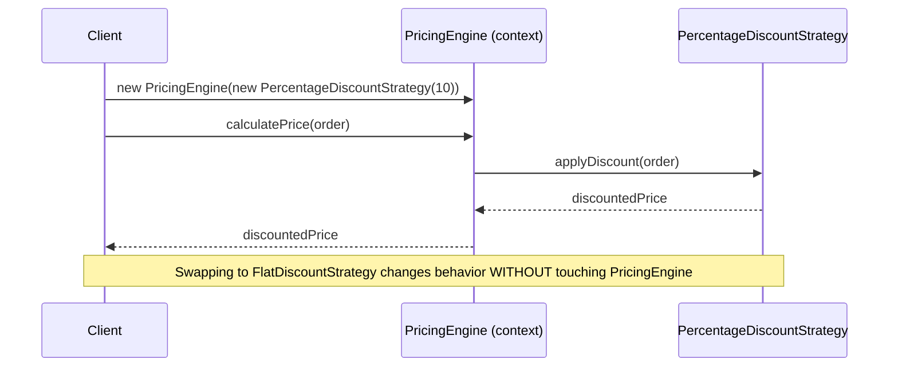

**JVM Behaviour**: Ordinary interface/virtual dispatch (`invokeinterface`) from context to strategy; if the concrete strategy varies frequently at a given call site (megamorphic), the JIT cannot devirtualize/inline effectively, though this is rarely a meaningful performance concern relative to the flexibility gained; when strategies are simple stateless functions, using lambdas (which compile to `invokedynamic` with a synthetically generated implementation class per distinct lambda) is functionally equivalent to a full Strategy class implementation but with less source-code boilerplate.

#### Interview Questions
**Basic**
1. What problem does the Strategy pattern solve compared to a large if/else or switch statement?
2. How does the context interact with a strategy?

**Intermediate**
1. How can lambdas/functional interfaces in modern Java reduce the boilerplate typically associated with Strategy?
2. How would a client select the appropriate strategy at runtime — what are common approaches?

**Advanced**
1. How does Strategy relate to and differ from the State pattern, given both involve a context delegating to a swappable, interface-implementing object?
2. What are the performance implications of using many different strategy implementations interchangeably at the same call site?

**Scenario-based**
1. An e-commerce system needs to support multiple, independently evolving discount rules (percentage-off, buy-one-get-one, loyalty-tier-based) that can be combined or swapped per promotion campaign without modifying the core order-pricing logic. Design this with Strategy.

#### Detailed Answers
1. **Problem solved vs conditionals**: A large `if/else`/`switch` selecting behavior inline hardcodes all variants into one method, making it harder to extend (adding a new variant requires modifying that method, risking regressions to existing branches) and harder to test each variant in isolation; Strategy replaces this with one class per variant behind a shared interface, so adding a new variant means adding a new class (not modifying existing code), and each variant can be unit-tested independently.
2. **Context-strategy interaction**: The context holds a reference to a `Strategy` interface (set via constructor injection, a setter, or passed per-call) and, whenever it needs to perform the varying behavior, simply calls the interface method on whichever concrete strategy it currently holds — the context itself contains no knowledge of which specific algorithm is running, only that SOME implementation of the interface will handle it.
3. **Lambdas reducing boilerplate**: If a strategy interface has a single abstract method (a functional interface, e.g., `Comparator<T>` or a custom `DiscountStrategy` with one method), modern Java lets you pass a lambda expression directly wherever a `Strategy` instance is expected (`new PricingEngine(order -> order.getTotal() * 0.9)`), eliminating the need to write a full named class for simple, stateless strategies while still achieving the same runtime interchangeability — named classes remain useful for strategies with more complex state or multiple methods.
4. **Runtime strategy selection approaches**: Common approaches include a factory/registry mapping a configuration key (e.g., a discount-type enum or string from a database) to the appropriate strategy instance, dependency injection frameworks wiring a specific strategy bean based on configuration/profile, or simply constructing/passing the desired strategy directly at the call site when the caller already knows which variant it needs (e.g., a specific promotional campaign explicitly choosing `BuyOneGetOneStrategy`).
5. **Strategy vs State pattern**: Structurally nearly identical (context delegates to a swappable interface implementation), but the INTENT and TRANSITION OWNERSHIP differ — in Strategy, the CLIENT typically chooses/injects which algorithm to use, and strategies are usually unaware of each other and don't transition between themselves; in State, the STATE OBJECTS THEMSELVES often trigger transitions to other states as part of their own behavior (e.g., a `LockedState` object, upon a valid unlock action, tells the context to transition to `UnlockedState`), modeling an object's behavior changing based on its internal lifecycle rather than a caller-selected algorithm choice.
6. **Performance implications of many strategies at one call site**: If a single call site (e.g., `context.strategy.apply(...)`) sees many different concrete strategy types across different context instances or over time (a megamorphic call site), the JVM's inline caching cannot settle on a single implementation to speculatively inline, falling back to a full virtual dispatch (vtable/itable lookup) on every call — in the vast majority of applications this overhead is utterly negligible compared to whatever real work the strategy performs (e.g., pricing calculation, I/O), so this is rarely a practical concern outside of extremely hot, low-level code paths.
7. **E-commerce discount scenario**: Define a `DiscountStrategy` interface with `applyDiscount(Order order)`; implement `PercentageDiscountStrategy`, `BuyOneGetOneStrategy`, `LoyaltyTierDiscountStrategy` as independent classes, each fully self-contained and independently testable; the core `PricingEngine` (context) accepts a `List<DiscountStrategy>` (to support combining several active promotions) or a single `DiscountStrategy` (for exclusive campaigns) via constructor injection, applying whichever strategies are configured for the current promotional campaign — adding a new discount type (e.g., a future `FlashSaleDiscountStrategy`) requires zero changes to `PricingEngine` or existing strategy classes.

#### Code Examples
```java
import java.util.List;

public interface DiscountStrategy {
    double applyDiscount(double originalPrice);
}

class PercentageDiscountStrategy implements DiscountStrategy {
    private final double percentage;
    PercentageDiscountStrategy(double percentage) { this.percentage = percentage; }
    public double applyDiscount(double originalPrice) { return originalPrice * (1 - percentage / 100); }
}

class FlatDiscountStrategy implements DiscountStrategy {
    private final double flatAmount;
    FlatDiscountStrategy(double flatAmount) { this.flatAmount = flatAmount; }
    public double applyDiscount(double originalPrice) { return Math.max(0, originalPrice - flatAmount); }
}

// Context: unaware of which specific discount logic is being applied
public class PricingEngine {
    private final List<DiscountStrategy> activeStrategies;
    public PricingEngine(List<DiscountStrategy> activeStrategies) { this.activeStrategies = activeStrategies; }

    public double calculateFinalPrice(double basePrice) {
        double price = basePrice;
        for (DiscountStrategy strategy : activeStrategies) {
            price = strategy.applyDiscount(price); // polymorphic dispatch, no if/else needed
        }
        return price;
    }

    public static void main(String[] args) {
        PricingEngine engine = new PricingEngine(List.of(
                new PercentageDiscountStrategy(10),
                order -> order - 5 // lambda: a simple, ad-hoc DiscountStrategy for a flat $5 promo
        ));
        System.out.println(engine.calculateFinalPrice(100.0)); // 100 -> 90 -> 85
    }
}
```

### Observer

#### Theory
**Core Concepts**: The Observer pattern defines a one-to-many dependency between a subject (publisher) and its observers (subscribers), so that when the subject's state changes, all registered observers are automatically notified and updated — the foundation of event-driven programming, GUI event listeners, and reactive/pub-sub systems. Java historically provided `java.util.Observable`/`Observer` (deprecated since Java 9 due to design flaws — not thread-safe, `Observable` being a class rather than an interface forcing inheritance), superseded in practice by custom listener interfaces, `PropertyChangeListener`, or reactive streams (`java.util.concurrent.Flow`, RxJava, Project Reactor).

**Internal Working**: The subject maintains a collection of registered observer references (implementing a common `Observer`/`Listener` interface); when a relevant state change occurs, the subject iterates its observer collection and calls each one's notification method, passing relevant event data.

**When to Use It**: Any scenario where multiple, potentially unrelated/unknown-in-advance parts of a system need to react to an event/state change in another part — GUI event handling, model-view synchronization (MVC), domain event publishing, cache invalidation notifications.

**Advantages**: Decouples the subject from its observers (the subject only depends on a generic `Observer` interface, unaware of concrete observer types or how many exist); supports dynamic registration/deregistration of observers at runtime; naturally models one-to-many broadcast communication.

**Limitations**: Notification order among multiple observers is often unspecified/implementation-dependent, which can hide subtle ordering-dependent bugs; if an observer's notification method throws an exception, it can disrupt notifying subsequent observers unless the subject defensively catches exceptions per observer; memory leaks are common if observers register but never deregister (the subject holds a strong reference, keeping the observer — and anything it references — alive indefinitely, the classic "lapsed listener" problem); synchronous notification can create unexpected re-entrancy/performance issues if an observer's handling is slow or itself triggers further subject state changes.

#### Internal Working
**Step-by-Step Explanation**: 1) Define an `Observer` interface with an update method (e.g., `onPriceChanged(newPrice)`). 2) The subject maintains a collection (often a `List` or `CopyOnWriteArrayList` for thread-safe iteration, discussed under Concurrency) of registered `Observer` references, with `addObserver()`/`removeObserver()` methods for registration management. 3) Whenever the subject's relevant state changes, it iterates its observer collection and calls each observer's update method, typically passing the new state or a description of what changed. 4) Each concrete observer implements the interface to react however it needs to (updating a UI element, logging, triggering a downstream process) — the subject has no knowledge of or dependency on what any specific observer actually does with the notification.

**Memory Layout**: The subject (heap) holds a collection of observer references (heap) — this is precisely the "lapsed listener" memory-leak risk: as long as the subject's observer collection retains a reference to an observer, that observer (and its own referenced object graph) cannot be garbage collected, even if no other part of the application still needs it, unless explicitly removed or the subject uses weak references.

**Diagrams**:
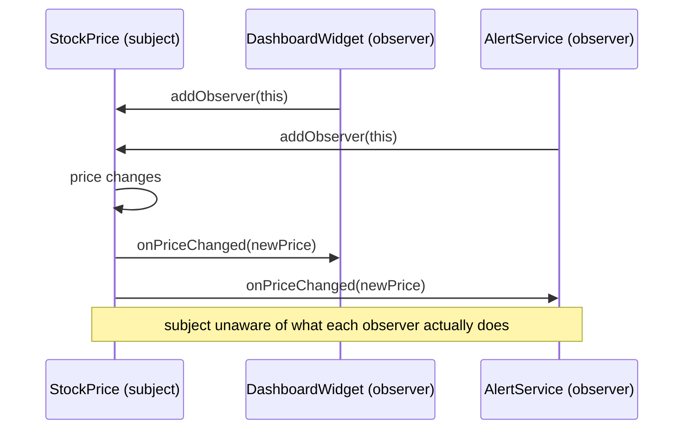

**JVM Behaviour**: Iterating and notifying observers is ordinary polymorphic dispatch over a collection; if observers register/deregister concurrently with notification (multi-threaded subject), using `CopyOnWriteArrayList` (discussed under Concurrent Collections) avoids `ConcurrentModificationException` during iteration at the cost of O(n) registration; if the subject's notification is synchronous and an observer's handling is slow, the notifying thread is blocked for the duration — a common reason to dispatch notifications asynchronously (e.g., via an `ExecutorService` or `CompletableFuture`) in performance-sensitive event systems.

#### Interview Questions
**Basic**
1. What problem does the Observer pattern solve?
2. Why was `java.util.Observable`/`Observer` deprecated, and what's typically used instead in modern Java?

**Intermediate**
1. What is the "lapsed listener" problem, and how would you mitigate it?
2. What thread-safety concerns arise if a subject's observer list can be modified concurrently with notification?

**Advanced**
1. How would you handle an exception thrown by one observer during notification so it doesn't prevent other observers from being notified?
2. Compare synchronous push-based Observer notification with a reactive-streams (`Flow.Publisher`/`Flow.Subscriber`) approach — what problem does reactive streams additionally solve?

**Scenario-based**
1. A stock-price ticker needs to notify a dashboard UI, a persistent audit logger, and an alerting service whenever the price changes, with the requirement that a slow or failing alerting service must not delay or break UI updates. Design this.

#### Detailed Answers
1. **Problem solved**: Establishes a one-to-many notification relationship where a subject automatically informs all registered observers whenever its state changes, decoupling the subject (which doesn't need to know what observers do or even how many exist) from the observers (which don't need to poll the subject for changes).
2. **Why Observable/Observer deprecated**: `java.util.Observable` is a CLASS (not an interface), forcing subjects to extend it and preventing them from extending any other class (Java's single-inheritance limitation); it's also not thread-safe (its internal `changed` flag and observer list aren't properly synchronized for concurrent use) and its API is generally considered poorly designed; modern Java code typically uses custom listener interfaces (a simple `interface Observer { void update(...); }` defined per use case), `java.beans.PropertyChangeListener` for JavaBean property change notification, or reactive-streams-based APIs (`java.util.concurrent.Flow`, RxJava, Project Reactor) for more sophisticated backpressure-aware event streams.
3. **Lapsed listener problem**: If an observer registers with a subject but the code that registered it forgets to explicitly deregister it once the observer is no longer needed (e.g., a UI widget that's been closed/disposed but never called `removeObserver()`), the subject's strong reference to that observer keeps it (and its entire referenced object graph) alive indefinitely, even though nothing else in the application still needs it — a memory leak. Mitigation: ensure deregistration happens reliably (e.g., in a `close()`/`dispose()` method, ideally via try-with-resources or a lifecycle framework), or have the subject hold observers via `WeakReference` so they can be garbage collected even if explicit deregistration is forgotten (at the cost of some added complexity in cleanup logic).
4. **Thread-safety concerns**: If observers can register/deregister on one thread while the subject is iterating the observer collection to notify on another thread, using a plain `ArrayList` risks `ConcurrentModificationException` (fail-fast iterator detecting structural modification) or, worse, silent corruption; using `CopyOnWriteArrayList` (see Concurrent Collections) solves this cleanly — iteration during notification always sees a consistent snapshot and never throws, at the cost of O(n) registration/deregistration, which is an acceptable trade-off given registration is typically much rarer than notification.
5. **Handling a failing observer during notification**: Wrap each individual observer's notification call in its own try/catch within the subject's notification loop (rather than one try/catch around the whole loop), logging or otherwise handling any exception from that specific observer, then CONTINUING to notify the remaining observers — this ensures one misbehaving/failing observer cannot prevent others from receiving the notification, isolating failures per-observer.
6. **Synchronous Observer vs reactive streams**: Classic synchronous Observer notification directly calls each observer's method on the notifying thread with no flow-control mechanism — if an observer is slow, or if there are many rapid state changes, observers can be overwhelmed with no way to signal "slow down" back to the subject (no backpressure). Reactive Streams (`Flow.Publisher`/`Flow.Subscriber`/`Subscription`) additionally solve the BACKPRESSURE problem — subscribers explicitly request a bounded number of items via `Subscription.request(n)`, letting a slow subscriber control its own consumption rate without being overwhelmed or without the publisher needing to buffer unboundedly, a capability the classic Observer pattern doesn't address at all.
7. **Stock ticker scenario**: The subject notifies each observer within its own isolated try/catch so a failing `AlertingService` observer doesn't prevent the `DashboardUI`/`AuditLogger` observers from being notified; to prevent a SLOW observer (even if not failing) from delaying others, dispatch each observer's notification asynchronously (e.g., submit each observer's `update()` call as a task to an `ExecutorService`, or wrap slow observers individually in `CompletableFuture.runAsync(...)`), so a slow alerting service's processing time doesn't block the dashboard UI's timely update — combining per-observer exception isolation with asynchronous dispatch for any observer whose latency profile is a concern.

#### Code Examples
```java
import java.util.List;
import java.util.concurrent.CopyOnWriteArrayList;
import java.util.concurrent.ExecutorService;
import java.util.concurrent.Executors;

public interface PriceObserver {
    void onPriceChanged(double newPrice);
}

public class StockPriceSubject {
    private final List<PriceObserver> observers = new CopyOnWriteArrayList<>(); // thread-safe iteration
    private final ExecutorService asyncNotifier = Executors.newCachedThreadPool();
    private double price;

    public void addObserver(PriceObserver observer) { observers.add(observer); }
    public void removeObserver(PriceObserver observer) { observers.remove(observer); }

    public void setPrice(double newPrice) {
        this.price = newPrice;
        for (PriceObserver observer : observers) {
            asyncNotifier.submit(() -> {
                try {
                    observer.onPriceChanged(newPrice); // isolated per-observer
                } catch (RuntimeException e) {
                    System.err.println("Observer failed, others unaffected: " + e);
                }
            });
        }
    }
}
```

### Chain of Responsibility

#### Theory
**Core Concepts**: Chain of Responsibility lets you pass a request along a chain of potential handlers, where each handler decides either to process the request itself or pass it to the next handler in the chain, decoupling the sender of a request from the specific handler(s) that ultimately process it. Classic examples: servlet filter chains, exception-handling middleware pipelines, logging frameworks with a chain of appenders/levels, GUI event bubbling.

**Internal Working**: Each handler holds a reference to the next handler in the chain; a handler's method checks whether it can handle the request, and if so processes it (optionally still passing it along, depending on design), otherwise delegates to the next handler by calling its handle method.

**When to Use It**: Request processing that may need to pass through a variable, dynamically configurable sequence of handlers, where the sender shouldn't need to know which specific handler(s) will ultimately process the request, or how many there are (e.g., HTTP middleware/filter pipelines, validation pipelines with multiple independent rule-checkers).

**Advantages**: Decouples request senders from specific handlers; chain composition can be configured/reordered dynamically without modifying sender code or handler implementations; new handlers can be added to the chain without changing existing handlers (Open/Closed Principle).

**Limitations**: No guarantee a request will actually be handled by ANY handler in the chain unless a default/catch-all terminal handler is included; debugging can be harder since tracing which handler(s) actually processed a request requires stepping through the whole chain; if handlers aren't carefully designed, a chain can become long and hard to reason about, with subtle ordering dependencies between handlers.

#### Internal Working
**Step-by-Step Explanation**: 1) Define a `Handler` interface/abstract class with a `handle(request)` method and typically a reference to the "next" handler in the chain (`setNext(handler)`). 2) Each concrete handler implements `handle()` to check if it's able/responsible for processing the given request; if so, it processes it (and may or may not continue passing it along, depending on whether multiple handlers should react); if not (or after processing, if the design allows pass-through), it delegates to `next.handle(request)` if a next handler exists. 3) The chain is assembled by linking handler instances together in a specific order (`handlerA.setNext(handlerB); handlerB.setNext(handlerC);`). 4) The client submits the request only to the FIRST handler in the chain, remaining unaware of the chain's internal structure, length, or which handler(s) ultimately process it.

**Memory Layout**: Each handler (heap) holds a reference to the next handler (also heap) — a singly-linked list of handler objects; processing a request that traverses N handlers uses N stack frames (one nested call per handler in the chain), similar in shape to the Decorator pattern's call-chain structure but with each link independently deciding whether to continue the chain at all.

**Diagrams**:
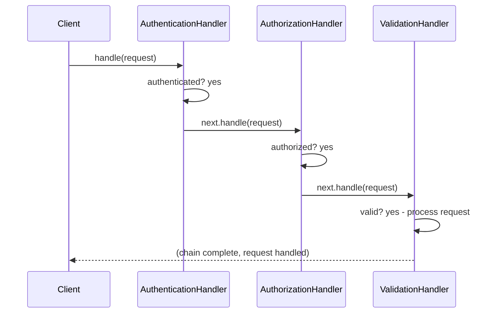

**JVM Behaviour**: Ordinary sequential/recursive method calls down the chain (`invokevirtual`/`invokeinterface`), one stack frame per handler traversed; no special JVM mechanics, though very long chains contribute proportionally to stack depth for a single request's processing, same consideration as any other deeply nested delegation pattern (Decorator, recursive Composite traversal).

#### Interview Questions
**Basic**
1. What problem does Chain of Responsibility solve?
2. Give a real-world example of this pattern (e.g., in web frameworks).

**Intermediate**
1. What happens if no handler in the chain is able to process a given request, and how do you defend against this?
2. Can multiple handlers in the chain process the SAME request? How would you design for that vs. stopping at the first handler that processes it?

**Advanced**
1. How would you make the chain's composition configurable/reorderable at runtime rather than hardcoded?
2. Compare Chain of Responsibility to Decorator — both involve a linked sequence of objects, so what's the key structural/behavioral difference?

**Scenario-based**
1. Design an HTTP request-processing pipeline with authentication, rate-limiting, and request-validation handlers, where any handler can short-circuit the chain and return an error response immediately, and the order of handlers must be easily reconfigurable.

#### Detailed Answers
1. **Problem solved**: Decouples the sender of a request from the specific handler(s) that process it, allowing a request to be passed along a chain of potential handlers where each independently decides whether to process it and/or pass it further — the sender doesn't need to know or care which handler(s) exist or which one(s) will ultimately act on the request.
2. **Real-world example**: Servlet filter chains in Java web frameworks (each `Filter` can inspect/modify the request, decide to short-circuit with a response, or call `chain.doFilter()` to pass control to the next filter); similarly, middleware pipelines in frameworks like Express.js or ASP.NET Core follow the identical conceptual pattern.
3. **No handler processes the request**: The request simply falls through the end of the chain unprocessed, silently or via whatever default behavior the design specifies — a common defensive measure is to always terminate the chain with a default/catch-all handler (e.g., a final handler that logs "unhandled request" or returns a generic error response) to guarantee every request receives SOME resolution rather than silently vanishing.
4. **Multiple handlers processing one request**: Yes, if designed for it — a handler can process the request AND still call `next.handle(request)` to let subsequent handlers also act on it (useful for cross-cutting concerns like logging or metrics that shouldn't prevent further processing); alternatively, a handler can process the request and NOT call next (short-circuiting the chain), appropriate when a definitive decision has been made (e.g., an authentication failure that should immediately reject the request without further processing) — the choice depends entirely on whether the use case wants "first responsible handler wins" or "all interested handlers react".
5. **Configurable/reorderable chain composition**: Rather than hardcoding `handlerA.setNext(handlerB)` calls inline in application startup code, build the chain from an externally configurable ordered list (e.g., read handler class names/order from a configuration file or a DSL, or use a builder that accepts handlers in a specified sequence and wires the `next` references programmatically) — this lets the chain's composition be changed (reordered, handlers added/removed) via configuration rather than requiring code changes/recompilation.
6. **Chain of Responsibility vs Decorator**: Both involve a linked sequence of objects each implementing a common interface and delegating to the next. The key difference: EVERY decorator in a Decorator chain unconditionally participates (each one always adds its behavior and always delegates onward, by design), while in Chain of Responsibility, EACH HANDLER INDEPENDENTLY DECIDES whether to process the request and/or whether to continue passing it along at all — a chain-of-responsibility handler can legitimately stop the chain entirely (no further handlers run), which isn't a typical/intended behavior for a Decorator chain (which is meant to always flow through all layers by default).
7. **HTTP pipeline scenario**: Define a `RequestHandler` interface with `handle(request)` returning either a processed response or delegating to `next.handle(request)`; implement `AuthenticationHandler`, `RateLimitHandler`, `ValidationHandler`, each capable of immediately returning an error response (short-circuiting) if its specific check fails, or calling `next.handle(request)` to continue if its check passes; assemble the chain via a configurable ordered list at application startup (e.g., reading handler order from configuration), wiring each handler's `next` reference according to that list, so reordering (e.g., moving rate-limiting before authentication) requires only a configuration change, not code changes to the handlers themselves.

#### Code Examples
```java
public abstract class RequestHandler {
    protected RequestHandler next;
    public RequestHandler setNext(RequestHandler next) { this.next = next; return next; }
    public abstract String handle(Request request);

    protected String passToNext(Request request) {
        return (next != null) ? next.handle(request) : "200 OK (end of chain, no handler rejected)";
    }
}

record Request(String authToken, String clientIp, String body) {}

class AuthenticationHandler extends RequestHandler {
    public String handle(Request request) {
        if (request.authToken() == null) return "401 Unauthorized"; // short-circuits the chain
        return passToNext(request);
    }
}

class RateLimitHandler extends RequestHandler {
    public String handle(Request request) {
        if (isRateLimited(request.clientIp())) return "429 Too Many Requests"; // short-circuits
        return passToNext(request);
    }
    private boolean isRateLimited(String ip) { return false; }
}

class ValidationHandler extends RequestHandler {
    public String handle(Request request) {
        if (request.body() == null || request.body().isEmpty()) return "400 Bad Request";
        return passToNext(request);
    }
}

// Chain assembly - order easily reconfigurable
// RequestHandler chain = new AuthenticationHandler();
// chain.setNext(new RateLimitHandler()).setNext(new ValidationHandler());
```

### Command

### State

### Template Method

### Visitor *(new)*

### Mediator *(new)*
