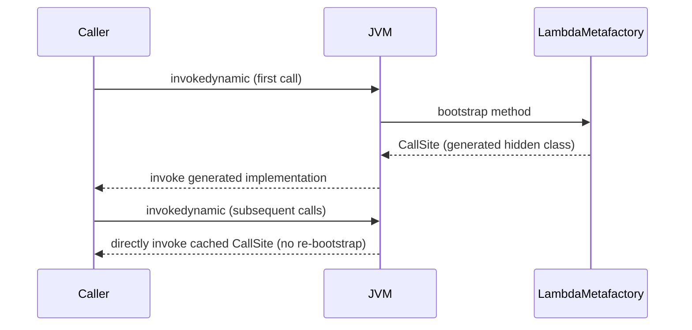
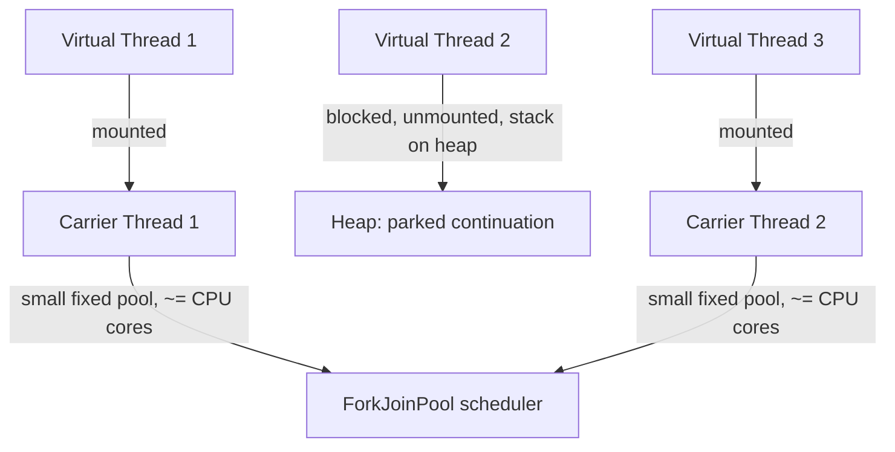

# 26. Modern Java Language Features *(new)*

The evolution of Java from Java 7 to Java 25 (LTS) marks a transformation from a verbose
object-oriented language to a modern, expressive, low-latency ecosystem featuring functional
paradigms, lightweight concurrency, pattern matching, and minimal boilerplate. Below is a
version-by-version breakdown of the major features introduced across every release.

## Java 7 *(2011)*

Focus: developer productivity (Project Coin) and dynamic JVM updates.

### Try-with-Resources

**Theory**

- **Core Concepts**: Try-with-resources automatically closes resources implementing `AutoCloseable` at the end of the block, in the reverse order they were declared — even if an exception is thrown. This replaces error-prone manual `finally` blocks and correctly surfaces any exception thrown while closing as a *suppressed* exception rather than hiding the original one.
- **Internal Working**: The compiler desugars the construct into a nested try/finally structure that calls `close()` on each resource and, if both the main body and a `close()` call throw, attaches the closing exception to the primary one via `addSuppressed()` instead of letting it replace it.
- **When to Use It**: Any time working with `AutoCloseable`/`Closeable` resources — files, sockets, JDBC connections/statements/result sets — replacing manual `finally`-based closing entirely.
- **Advantages**: Eliminates the classic bug where a `finally`-block `close()` call silently discards the original exception; drastically less boilerplate; correctly handles multiple resources in proper reverse order.
- **Limitations**: Only works with `AutoCloseable` types; resources declared in the header are implicitly final/effectively final and scoped only to the try block.

```java
try (BufferedReader br = new BufferedReader(new FileReader("file.txt"))) {
    System.out.println(br.readLine());
} // Auto-closed here
```

Multiple resources can be declared in one block, separated by `;`:

```java
try (var in = new FileInputStream("in.txt");
     var out = new FileOutputStream("out.txt")) {
    in.transferTo(out);
} // 'out' closed first, then 'in'
```

**Internal Working**

- **Step-by-Step Explanation**: (1) Compiler evaluates each resource initializer and assigns it to a compiler-managed local. (2) It wraps the body in a try/finally calling `close()` on each resource in reverse declaration order. (3) If the main body throws `E1` and a subsequent `close()` throws `E2`, the generated code catches `E2` and calls `E1.addSuppressed(E2)`, then rethrows `E1` carrying `E2` as suppressed. (4) The resulting bytecode uses ordinary exception-table entries — no new JVM instructions were introduced for this Java 7 feature.
- **Memory Layout**: Not directly applicable — a compile-time desugaring feature; suppressed exceptions are stored in a lazily-allocated list field on `Throwable`, adding negligible memory only when suppression actually occurs.
- **Diagrams**:
```text
try (var in = new FileInputStream("a"); var out = new FileOutputStream("b")) {
    in.transferTo(out);
}
// Desugars to:
var in = new FileInputStream("a");
try {
    var out = new FileOutputStream("b");
    try { in.transferTo(out); } finally { out.close(); }  // closed first
} finally { in.close(); }                                   // closed second
```
- **JVM Behaviour**: No JVM-level changes — the entire feature is `javac` desugaring into ordinary try/catch/finally bytecode; `Throwable.addSuppressed()`/`getSuppressed()` are plain library methods with no intrinsic support.

**Interview Questions**

*Basic*
1. What interface must a resource implement to be used in try-with-resources?
2. In what order are multiple resources closed?

*Intermediate*
3. What happens to a `close()` exception if the main block also threw one?
4. Can try-with-resources be used with no `catch`/`finally` at all?

*Advanced*
5. How does try-with-resources differ from a manual `finally`-based `close()` in terms of preserved diagnostic information?
6. Since Java 9, how can you use an already-declared effectively-final variable in the header without redeclaring it?

*Scenario-based*
7. You have a legacy class with a `close()` method that doesn't implement `AutoCloseable`. How do you adapt it for try-with-resources?

**Detailed Answers**

1. `java.lang.AutoCloseable` (or its stricter subtype `Closeable`, which narrows `close()` to throw only `IOException`).
2. In the reverse of their declaration order — the last-declared resource is closed first.
3. It is not discarded — it's attached to the primary exception via `addSuppressed()` and retrievable via `getSuppressed()`, shown in printed stack traces under "Suppressed:".
4. Yes — `try (Resource r = ...) { ... }` alone is valid; `catch`/`finally` remain optional additions.
5. A manual `finally { resource.close(); }`, if `close()` throws, lets that exception *replace* whatever the try block threw, losing the original entirely; try-with-resources instead preserves both via suppression.
6. Java 9 allows `Resource r = open(); try (r) { ... }` — using the existing effectively-final variable directly in the header without a redundant redeclaration.
7. Wrap it in a small adapter class implementing `AutoCloseable` whose `close()` delegates to the legacy object's cleanup method, then use the adapter in the try-with-resources header.

**Code Examples**

```java
public class FileCopier {
    public void copy(String source, String dest) throws java.io.IOException {
        try (var in = new java.io.FileInputStream(source);
             var out = new java.io.FileOutputStream(dest)) {
            in.transferTo(out);
        } // suppressed exceptions preserved automatically if close() also fails
    }
}
```

### Diamond Operator (`<>`)

**Theory**

- **Core Concepts**: Type inference for generic instance creation. The compiler infers the type argument from the target context (the variable's declared type, a method parameter, or a return type), so it no longer needs to be repeated on the right-hand side.
- **Internal Working**: `javac` performs target-type inference at the `new` expression, examining the assignment/parameter/return context to determine the type argument, then treats `new ArrayList<>()` exactly as if `new ArrayList<String>()` had been written explicitly — a purely syntactic, compile-time convenience with zero runtime difference.
- **When to Use It**: Any generic instantiation where the type argument is already evident from context — the default, idiomatic style in modern Java.
- **Advantages**: Removes redundant, easily-inconsistent type argument repetition; improves readability, especially for deeply nested generic types.
- **Limitations**: Cannot be used for anonymous inner classes prior to Java 9 (Java 9 lifted this restriction); inference can occasionally fall back to `Object` in ambiguous contexts with no clear target type (e.g., passing directly to a raw-typed variable).

```java
// Pre-Java 7:
List<String> list = new ArrayList<String>();

// Java 7+:
List<String> list = new ArrayList<>();

// Also works when passing to a method or returning from one:
Map<String, List<Integer>> scores = new HashMap<>();
process(new ArrayList<>()); // inferred from process(List<String>)
```

**Internal Working**

- **Step-by-Step Explanation**: (1) Compiler encounters `new ArrayList<>()`. (2) It examines the surrounding context (declared variable type, method parameter type, or expected return type) to determine the concrete type argument(s). (3) It substitutes that inferred type exactly as if written explicitly, performing all the same generic type-checking as before. (4) Since generics are erased anyway, the resulting bytecode is identical to what an explicit type argument would have produced.
- **Memory Layout**: Not directly applicable — purely a source-level inference convenience with zero effect on the generated bytecode or object layout.
- **Diagrams**:
```text
List<String> list = new ArrayList<>();
                          ^ compiler infers <String> from the declared variable type
```
- **JVM Behaviour**: No difference whatsoever from writing the type argument explicitly — erasure means both compile to identical bytecode.

**Interview Questions**

*Basic*
1. What problem does the diamond operator solve?
2. Does the diamond operator change runtime behavior in any way?

*Intermediate*
3. From what sources can the compiler infer the type argument for `new ArrayList<>()`?
4. What changed regarding diamond operator support for anonymous inner classes in Java 9?

*Advanced*
5. What happens if you assign `var list = new ArrayList<>();` — what type does `list` get?
6. Can the diamond operator infer types in a chained/nested generic construction like `Map<String, List<Integer>> m = new HashMap<>();`?

*Scenario-based*
7. A teammate writes `List list = new ArrayList<>();` (raw-typed left side). What type argument does the diamond operator infer, and what's the risk?

**Detailed Answers**

1. It eliminates the need to repeat the generic type argument on both sides of a generic object creation (`new ArrayList<String>()` becoming `new ArrayList<>()`), reducing redundancy and potential inconsistency between the two sides.
2. No — it's purely a compile-time inference convenience; since generics are erased, the resulting bytecode is identical regardless of whether the diamond or an explicit type argument was used.
3. The declared type of the variable being assigned to, the expected parameter type at a method call site, or the expected return type of an enclosing method — any of Java's generic target-typing contexts.
4. Prior to Java 9, the diamond operator could not be used when instantiating an anonymous inner class body (e.g., `new Comparator<>() { ... }` was illegal); Java 9 (JEP 213) lifted this restriction, allowing diamond inference even when a class body follows.
5. Since `var` itself infers from the initializer expression, and the initializer `new ArrayList<>()` has no target type to infer *from* other than `var` itself, the compiler falls back to inferring `ArrayList<Object>` — a common pitfall combining `var` with the diamond operator with no other context.
6. Yes — the compiler can infer nested/parameterized type arguments fully, e.g., `new HashMap<>()` assigned to `Map<String, List<Integer>>` correctly infers `HashMap<String, List<Integer>>`.
7. Since the left-hand side is a raw type (`List`, no type argument), there's no target type information to infer from, so the compiler infers `ArrayList<Object>` for the diamond — but because the variable itself is raw-typed, all generic type-checking is disabled anyway, risking heap pollution if incompatible elements are added.

**Code Examples**

```java
import java.util.*;

public class DiamondDemo {
    public static void main(String[] args) {
        Map<String, List<Integer>> scores = new HashMap<>(); // inferred from declared type
        scores.put("Alice", new ArrayList<>());               // inferred from put()'s parameter type
        scores.get("Alice").add(95);
    }
}
```

### `String` in `switch` Statements

**Theory**

- **Core Concepts**: Before Java 7, branching on a `String` required a chain of `if`/`else if` calling `.equals()`. Java 7 lets `switch` compare `String` values directly (internally it still uses `.equals()` and `hashCode()` under the hood), improving readability for multi-branch string dispatch.
- **Internal Working**: The compiler desugars a `String` switch into a two-stage lookup: first a `switch` on `hashCode()` (using `lookupswitch`/`tableswitch` bytecode), then an `equals()` verification within each hash bucket to guard against collisions, before jumping to the actual matched case body.
- **When to Use It**: Multi-way branching on a fixed, known set of string constants (e.g., command dispatch, day-of-week logic) instead of a long `if`/`else if` chain.
- **Advantages**: More readable than an `if`/`else if` chain; the compiler-generated hash-based dispatch is typically faster than a linear sequence of `.equals()` calls for many cases.
- **Limitations**: Case labels must be compile-time constant strings (no variables); a `null` switch subject throws `NullPointerException` (pre-Java 21 pattern-matching switch); switching on `String` cannot express range or type-based matching the way modern pattern-matching `switch` can.

```java
String day = "MONDAY";
switch (day) {
    case "MONDAY":
        System.out.println("Start of week");
        break;
    default:
        System.out.println("Midweek");
}
```

**Internal Working**

- **Step-by-Step Explanation**: (1) Compiler computes `.hashCode()` of the switch subject at runtime. (2) It emits a `lookupswitch`/`tableswitch` over the possible case label hash codes. (3) Within the matched hash bucket, it emits an `.equals()` call to confirm the actual string content matches (guarding against hash collisions between different case labels). (4) Only after `.equals()` confirms the match does control jump to that case's body; otherwise it falls through to `default` (or the next colliding candidate, if any).
- **Memory Layout**: Not directly applicable — string switch dispatch is purely a control-flow/bytecode structuring concern, no special memory layout involved.
- **Diagrams**:
```text
switch(day) {
  case "MONDAY": ...
  case "FRIDAY": ...
}
// Desugars conceptually to:
switch (day.hashCode()) {
  case 234576916:                 // hashCode of "MONDAY"
    if (day.equals("MONDAY")) { ... }
    break;
  case -1948300346:                // hashCode of "FRIDAY"
    if (day.equals("FRIDAY")) { ... }
    break;
}
```
- **JVM Behaviour**: Uses ordinary `lookupswitch`/`tableswitch` bytecode instructions (the same used for `int`/`enum` switches) plus `invokevirtual` calls to `hashCode()`/`equals()` — no new bytecode instructions were introduced for this feature; the JIT can optimize the hash dispatch as efficiently as any other switch once hot.

**Interview Questions**

*Basic*
1. What methods does the compiler use under the hood to implement a `String` switch?
2. What happens if the switch subject is `null`?

*Intermediate*
3. Why does the compiler switch on `hashCode()` first instead of directly comparing strings in sequence?
4. Can switch case labels be non-constant `String` variables?

*Advanced*
5. What happens if two different case label strings happen to have the same `hashCode()`?
6. What bytecode instructions implement a `String` switch, and are they special to strings?

*Scenario-based*
7. You have a switch with 50 string cases in a hot path. Is a `String` switch meaningfully faster than 50 sequential `if (s.equals(...))` checks?

**Detailed Answers**

1. `hashCode()` (for the initial dispatch) and `equals()` (to verify the actual match within a hash bucket, guarding against collisions).
2. `switch (day)` throws a `NullPointerException` immediately if `day` is `null`, since `.hashCode()` is called on it — this is unchanged even in modern pattern-matching `switch` unless a `case null` label is explicitly present (Java 21+).
3. Comparing hash codes first turns dispatch into an O(1)-ish jump-table lookup (`lookupswitch`) rather than a linear sequence of potentially expensive `.equals()` string-content comparisons; `.equals()` is only invoked once, within the matched bucket, purely to confirm the match and rule out hash collisions.
4. No — case labels must be compile-time constant expressions (string literals or `static final` constant strings), since the compiler needs to know all possible hash codes and values at compile time to build the dispatch table.
5. The compiler generates an `equals()` check chain within that shared hash bucket, testing each colliding candidate in sequence until one matches (or falling through to `default` if none do) — collisions don't break correctness, they just mean more than one `equals()` check may occur for that particular hash value.
6. `lookupswitch` (or `tableswitch` for dense integer ranges) — the exact same instructions used for `int` and `enum` switches; there's nothing string-specific about the bytecode itself, only the compiler-generated preprocessing (`hashCode()` + `equals()`) that maps a `String` down to the `int` these instructions require.
7. Yes, generally — the hash-based `lookupswitch` dispatch is close to O(1) (a jump table lookup) versus O(n) sequential `.equals()` calls in the worst case for an `if`/`else if` chain, though the actual difference depends on hash distribution and JIT optimization; for very few cases the difference is negligible, but it scales much better as the number of cases grows.

**Code Examples**

```java
public class CommandDispatcher {
    public String handle(String command) {
        return switch (command) { // combined with Java 14+ switch expression for brevity
            case "START" -> "Starting service...";
            case "STOP" -> "Stopping service...";
            case "STATUS" -> "Service is running";
            default -> "Unknown command: " + command;
        };
    }
}
```

### Multi-Catch Block

**Theory**

- **Core Concepts**: Catches multiple unrelated exceptions in a single block instead of duplicating the same handler code for each exception type. The caught variable (`e` below) is implicitly `final` and its static type is the least upper bound of the alternatives, so calling shared methods like `Exception.getMessage()` works, but type-specific methods do not.
- **Internal Working**: The compiler generates exception-table entries for each listed type pointing to the same handler bytecode; combined with Java 7's "more precise rethrow" analysis, a simple rethrow of the caught variable lets the enclosing method's `throws` clause list only the originally-caught specific types.
- **When to Use It**: When multiple distinct exception types genuinely warrant identical handling logic (logging, wrapping, rethrowing) — avoiding copy-pasted catch blocks.
- **Advantages**: Eliminates duplicated handler code; keeps the caught variable's usable API honest (only common-supertype methods); enables precise `throws` declarations via more-precise-rethrow analysis.
- **Limitations**: The caught variable's static type is only as specific as the common supertype, so type-specific methods require an explicit cast; listed types must not be subtypes of one another (compile error).

```java
try {
    // Operations
} catch (IOException | SQLException e) {
    logger.error(e);
}
```

**Internal Working**

- **Step-by-Step Explanation**: (1) Compiler verifies none of the listed alternative types is a subtype of another (redundancy check). (2) It computes the caught variable's static type as the least upper bound of all alternatives. (3) It emits one exception-table entry per listed type, all pointing to the same handler code. (4) Because the variable is implicitly final, "more precise rethrow" analysis lets a bare `throw e;` propagate only the originally-listed specific types for `throws`-clause purposes.
- **Memory Layout**: Not directly applicable — purely a compile-time/bytecode-structuring feature.
- **Diagrams**:
```text
catch (IOException | SQLException e) { ... }
// Exception table: [IOException -> handlerPC], [SQLException -> handlerPC]  (same handler)
```
- **JVM Behaviour**: No new bytecode — multiple exception-table entries pointing at one handler location, fully supported by the pre-existing per-type exception dispatch mechanism.

**Interview Questions**

*Basic*
1. What syntax catches multiple exception types in one block?
2. What is the static type of the caught variable?

*Intermediate*
3. Why can't you list a type and its supertype together in a multi-catch clause?
4. Is the caught variable reassignable within the block?

*Advanced*
5. What is "more precise rethrow," and how does it benefit multi-catch blocks specifically?
6. Does multi-catch introduce new bytecode instructions?

*Scenario-based*
7. You have three checked exceptions handled identically by logging and wrapping. Show the multi-catch refactor.

**Detailed Answers**

1. The pipe `|` between exception type names inside one `catch` clause's parentheses.
2. The least upper bound (most specific common supertype) of the listed alternatives.
3. It's redundant — the supertype alone already covers every case the subtype would match, so the compiler rejects the duplication as an error.
4. No — it's implicitly final; reassigning it is a compile error.
5. Java 7's more precise rethrow tracks the actual possible types a rethrown caught variable can be (based on what the try block can really throw), letting the enclosing method declare only those specific types in `throws` rather than the broader common-supertype type.
6. No — it compiles to ordinary multiple exception-table entries pointing at the same handler, using the pre-existing per-type dispatch mechanism.
7. Replace three separate `catch` blocks with `catch (IOException | ParseException | SQLException e) { log.error(e); throw new DataException(e); }`, removing duplicated logic.

**Code Examples**

```java
public class FileImporter {
    public void importFile(String path) {
        try {
            parseAndStore(path);
        } catch (java.io.IOException | java.text.ParseException e) {
            throw new RuntimeException("Import failed for " + path, e); // one shared handler
        }
    }
    private void parseAndStore(String path) throws java.io.IOException, java.text.ParseException {}
}
```

### Underscores in Numeric Literals & Binary Literals

**Theory**

- **Core Concepts**: Underscores act purely as visual separators (ignored by the compiler) to make long numeric literals easier to read, and the `0b`/`0B` prefix allows writing literals directly in binary.
- **Internal Working**: `javac`'s lexer strips underscores during tokenization of numeric literals before parsing the numeric value itself — they carry zero semantic meaning and leave no trace in the compiled bytecode's constant pool (which stores only the final numeric value).
- **When to Use It**: Long numeric constants where grouping (thousands, bytes, nibbles) improves readability — monetary amounts, bit masks, credit-card-like numbers, binary flag literals.
- **Advantages**: Improves readability of large literals with zero runtime cost; binary literals make bitmask/flag constants self-documenting compared to hex/decimal equivalents.
- **Limitations**: Underscores cannot appear adjacent to the decimal point, at the very start/end of a literal, or adjacent to a type suffix (`L`, `F`, `D`) — only strictly between digits.

```java
int million = 1_000_000;
long creditCardNumber = 1234_5678_9012_3456L;
int binary = 0b101010;      // 42
int hex = 0x2A;             // 42 (hex literals existed before Java 7)
```

**Internal Working**

- **Step-by-Step Explanation**: (1) `javac`'s lexer scans a numeric literal token, encountering underscores between digit groups. (2) It validates underscore placement rules (must be between two digits, not adjacent to a decimal point/prefix/suffix). (3) It strips all underscores, parsing the remaining digit sequence as the actual numeric value. (4) The resulting constant is stored in the classfile's constant pool exactly as if no underscores had been written — completely indistinguishable at the bytecode level.
- **Memory Layout**: Not directly applicable — a purely lexical, compile-time convenience with zero effect on the stored constant's representation.
- **Diagrams**:
```text
1_000_000  --lexer strips underscores-->  1000000  --stored in constant pool as int 1000000
```
- **JVM Behaviour**: No effect whatsoever — the classfile constant pool entry is identical whether or not underscores were used in the source literal.

**Interview Questions**

*Basic*
1. What is the purpose of underscores in numeric literals?
2. What prefix introduces a binary literal?

*Intermediate*
3. Where are underscores disallowed within a numeric literal?
4. Do underscores affect the runtime value or performance in any way?

*Advanced*
5. At what compilation phase are underscores processed and removed?
6. Can underscores be used in floating-point literals, and are there additional restrictions there?

*Scenario-based*
7. You're defining a set of bitmask flag constants for a permissions system. How would binary literals with underscores improve this code's readability over hex?

**Detailed Answers**

1. Purely visual grouping to make long numeric literals (thousands separators, byte/nibble groupings) easier for humans to read in source code, with the compiler ignoring them entirely.
2. `0b` or `0B`, e.g., `0b101010` for the decimal value 42.
3. Adjacent to the decimal point (`3_.14` and `3._14` are both illegal), immediately before/after a type suffix (`100_L` illegal), and at the very beginning or end of the digit sequence (`_100` or `100_` illegal) — only strictly between two digits is allowed.
4. No effect whatsoever — they're stripped entirely during lexing before any value parsing or bytecode generation occurs; the compiled constant is identical either way.
5. During lexical analysis (tokenization), the earliest phase of compilation — before parsing constructs the abstract syntax tree, the lexer has already validated and removed underscores from the numeric token.
6. Yes — e.g., `3.14_159` is valid, but the same adjacency restrictions apply: no underscore directly next to the decimal point, exponent marker (`e`/`E`), or type suffix (`f`/`F`/`d`/`D`).
7. Binary literals like `0b0000_0001`, `0b0000_0010`, `0b0000_0100` directly show which bit position each flag occupies, which is far more immediately readable than the equivalent hex (`0x01`, `0x02`, `0x04`) for anyone reasoning about individual bit positions, and the underscores let you visually group nibbles for even longer bit patterns.

**Code Examples**

```java
public class Permissions {
    static final int READ    = 0b0000_0001;
    static final int WRITE   = 0b0000_0010;
    static final int EXECUTE = 0b0000_0100;
    static final int ADMIN   = 0b1000_0000;

    public static void main(String[] args) {
        int userPerms = READ | WRITE;
        System.out.println((userPerms & WRITE) != 0); // true
        long maxTransactionCents = 1_000_000_00L; // $1,000,000.00 in cents, readable grouping
    }
}
```

## Java 8 — LTS *(2014)*

Focus: the functional programming revolution and modern API design.

### Lambda Expressions & Functional Interfaces

**Theory**

- **Core Concepts**: A lambda is an anonymous implementation of a *functional interface* — an interface with exactly one abstract method (optionally annotated `@FunctionalInterface`). This enables treating behavior as data, passed around like any other value.
- **Internal Working**: The compiler does *not* desugar a lambda into an anonymous inner class; it instead emits an `invokedynamic` instruction whose bootstrap method (`LambdaMetafactory`) generates the implementing class at *runtime*, on first invocation, using `MethodHandle`s.
- **When to Use It**: Any place a single-method callback/strategy is needed — event handlers, comparators, stream pipeline operations, custom functional interfaces for dependency injection of behavior.
- **Advantages**: Far less boilerplate than anonymous inner classes; no separate `.class` file generated at compile time (reduces JAR size and classloading at startup for unused lambdas); captures enclosing effectively-final local variables without an explicit constructor.
- **Limitations**: Can only implement interfaces with exactly one abstract method; captured local variables must be effectively final; checked exceptions can't be thrown from a lambda unless the functional interface's method declares them; overuse can hurt readability/debuggability (lambda stack frames are less descriptive than named methods).

```java
List<String> names = List.of("Alice", "Bob", "Charlie");
names.forEach(name -> System.out.println(name));

// Method reference shorthand for the same lambda
names.forEach(System.out::println);

// Defining and using a custom functional interface
@FunctionalInterface
interface Calculator {
    int apply(int a, int b);
}

Calculator add = (a, b) -> a + b;
System.out.println(add.apply(2, 3)); // 5
```

**Internal Working**

- **Step-by-Step Explanation**: (1) Compiler encounters a lambda expression and compiles its *body* into a private synthetic method on the enclosing class (not a separate class). (2) At the lambda's use site, it emits an `invokedynamic` instruction referencing the `LambdaMetafactory.metafactory` bootstrap method. (3) On first execution of that `invokedynamic` call site, the JVM invokes the bootstrap method, which uses `MethodHandle`s and (by default) a hidden class generated via `ASM`-style bytecode spinning to produce a lightweight implementation of the target functional interface, wired to call the synthetic method. (4) The `CallSite` produced is cached, so subsequent executions of that same lambda expression skip bootstrap and directly invoke the already-linked implementation — very fast after the first call.
- **Memory Layout**: The lambda's generated implementation class is typically a "hidden class" (not stored in the permanent classpath-visible namespace), loaded once per lambda expression site and eligible for unloading with its defining classloader — unlike one `.class` file per anonymous inner class generated at compile time for the old-style approach.
- **Diagrams**:

- **JVM Behaviour**: Deferring class generation to runtime via `invokedynamic` avoids the cost of a compile-time-generated `.class` file per lambda (smaller JARs, faster classloading at startup for lambdas never actually executed); the JIT can inline the generated implementation like any other method once hot, and after warm-up lambda call overhead is comparable to a direct virtual method call.

**Interview Questions**

*Basic*
1. What is a functional interface, and how many abstract methods can it have?
2. How is a lambda different from an anonymous inner class at the source level?

*Intermediate*
3. What bytecode instruction implements a lambda expression, and why not a compile-time-generated inner class?
4. Can a lambda capture and modify a local variable from its enclosing scope?

*Advanced*
5. Explain the role of `LambdaMetafactory` and `invokedynamic` in lambda implementation.
6. Why can lambdas generally not throw checked exceptions freely, and how can you work around it?

*Scenario-based*
7. You need a `Comparator<Person>` that sorts by last name then first name. Show this using lambdas versus an equivalent anonymous inner class, and explain the practical differences.

**Detailed Answers**

1. A functional interface has exactly one abstract method (it may have any number of `default`/`static`/`private` methods, and it may redeclare `Object` methods like `equals`/`toString` without counting against the "one abstract method" rule); `@FunctionalInterface` is an optional but recommended compiler-checked annotation enforcing this constraint.
2. Syntactically, a lambda has no boilerplate (`(params) -> body` versus `new Interface() { public ReturnType method(params) { body } }`); semantically, a lambda captures `this` from the *enclosing* context (lexical scoping) while an anonymous inner class's `this` refers to the anonymous class instance itself — a subtle but important difference when the body references `this`.
3. `invokedynamic`, bootstrapped via `LambdaMetafactory`, generates the implementing class lazily at runtime on first invocation rather than at compile time; this avoids generating and loading one `.class` file per lambda expression up front, reducing JAR size/startup classloading cost, especially valuable given how pervasively lambdas are used in modern codebases.
4. No — a lambda can only capture *effectively final* local variables (those never reassigned after initialization); attempting to reassign a captured variable is a compile error, since the underlying implementation captures a copy/reference that must remain stable for the lifetime of the lambda instance.
5. `LambdaMetafactory` is the JDK-provided bootstrap method class that `invokedynamic` call sites for lambdas are linked against; at the first execution of a given lambda's call site, the JVM invokes `LambdaMetafactory.metafactory(...)`, passing `MethodHandle`s describing the target functional interface method and the compiler-generated implementation method, and it returns a `CallSite` wrapping a dynamically-generated hidden class implementing that interface — subsequent invocations of the same call site reuse this cached `CallSite` directly.
6. The functional interface's single abstract method signature determines what exceptions a lambda implementing it may throw (via that method's own `throws` clause, if any) — if the interface (e.g., `Function<T,R>`) declares no checked exceptions, a lambda body cannot let one escape uncaught. Workarounds: catch and wrap the checked exception in an unchecked one inside the lambda, or define/obtain a custom functional interface variant whose method does declare the checked exception, with an adapter converting it before use in checked-exception-averse APIs like `Stream`.
7. `Comparator<Person> byName = Comparator.comparing(Person::getLastName).thenComparing(Person::getFirstName);` — concise, composed from method references. The equivalent anonymous inner class requires an explicit `compare(Person a, Person b)` method body with manual multi-field comparison logic; practically, the lambda/method-reference version is shorter, avoids an extra generated `.class` file at compile time, and composes more naturally with `Comparator`'s default methods (`thenComparing`, `reversed`), while behaving identically at runtime once JIT-warmed.

**Code Examples**

```java
import java.util.*;
import java.util.function.*;

public class LambdaDemo {
    public static void main(String[] args) {
        List<Person> people = List.of(new Person("Alice", "Zephyr"), new Person("Bob", "Adams"));

        // Composed comparator built entirely from method references/lambdas
        Comparator<Person> byLastThenFirst = Comparator
            .comparing(Person::lastName)
            .thenComparing(Person::firstName);

        people.stream().sorted(byLastThenFirst).forEach(System.out::println);

        // Custom functional interface capturing an effectively-final local variable
        int taxRatePercent = 18;
        Function<Double, Double> applyTax = amount -> amount * (1 + taxRatePercent / 100.0);
        System.out.println(applyTax.apply(100.0)); // 118.0
    }

    record Person(String firstName, String lastName) {}
}
```

### Stream API

**Theory**

- **Core Concepts**: A declarative, lazily-evaluated pipeline of intermediate operations (`filter`, `map`, `sorted`, ...) followed by a single terminal operation (`toList`, `collect`, `reduce`, ...) that triggers execution. Streams don't store data and are consumed only once.
- **Internal Working**: Each intermediate operation wraps the source `Spliterator` in a new stage describing the operation (not executing it); only the terminal operation actually drives iteration, pulling elements through the entire chain of stages one at a time (or in bulk for parallel streams), fusing operations to avoid materializing intermediate collections.
- **When to Use It**: Bulk, declarative transformations over collections/arrays/I/O sources — filtering, mapping, grouping, reducing — especially where a fluent, composable pipeline is clearer than nested loops.
- **Advantages**: Concise, composable, and often more readable than imperative loops; built-in support for parallel execution (`.parallel()`) leveraging the common `ForkJoinPool`; encourages side-effect-free, easily-testable transformation logic.
- **Limitations**: A stream can only be consumed once (a second terminal operation throws `IllegalStateException`); debugging a long fluent chain can be harder than stepping through an imperative loop; naive parallel streams on small datasets or I/O-bound sources can perform *worse* than sequential due to fork/join overhead and shared-pool contention.

```java
List<String> filtered = names.stream()
    .filter(s -> s.startsWith("A"))
    .map(String::toUpperCase)
    .toList();

// reduce() combines elements into a single result
int totalLength = names.stream()
    .reduce(0, (sum, name) -> sum + name.length(), Integer::sum);

// collect() with a Collector builds arbitrary result containers
Map<Character, List<String>> byFirstLetter = names.stream()
    .collect(Collectors.groupingBy(name -> name.charAt(0)));
```

**Internal Working**

- **Step-by-Step Explanation**: (1) `.stream()` wraps the source in a `Spliterator`-backed `ReferencePipeline` head stage. (2) Each intermediate operation (`.filter()`, `.map()`) appends a new stage describing that transformation as a lambda, without touching any data yet (laziness). (3) The terminal operation (`.toList()`, `.collect()`) walks the pipeline, and internally drives a single pass: for each source element, it pushes it through every stage's function in sequence (filter/map/etc. fused into one traversal) before accumulating into the result — this avoids allocating intermediate lists between each `.filter()`/`.map()` call. (4) For `.parallel()` streams, the `Spliterator` recursively splits the source into chunks processed by the common `ForkJoinPool`, with results combined via the collector's/reduction's combiner function.
- **Memory Layout**: Sequential streams typically process one element at a time through the whole fused pipeline (low, constant intermediate memory overhead, no intermediate list allocation); parallel streams additionally allocate per-task overhead (`ForkJoinTask` objects) and combiner-buffer structures on the heap proportional to the degree of splitting.
- **Diagrams**:
```text
source.stream()
  │
  ▼ (lazy: no execution yet)
.filter(p1) ──▶ stage 1
  │
  ▼
.map(f1) ──▶ stage 2
  │
  ▼
.collect(...) ──▶ TERMINAL: drives iteration, pulling elements through
                    stage1 -> stage2 -> accumulator, one element at a time
```
- **JVM Behaviour**: Lambda-based stream operations compile to `invokedynamic` call sites (see Lambda Expressions above) resolved once and then invoked repeatedly per element; the JIT aggressively inlines short lambda bodies within hot stream pipelines once warmed up, often achieving performance close to a hand-written loop; parallel streams route work through the shared, JVM-wide common `ForkJoinPool` (sized to `Runtime.availableProcessors() - 1` by default), meaning unrelated parallel-stream usages across an application can contend for the same pool.

**Interview Questions**

*Basic*
1. What is the difference between an intermediate and a terminal operation?
2. Can a stream be reused for a second terminal operation?

*Intermediate*
3. Why are streams described as "lazy," and what triggers actual execution?
4. What does "fusion" of stream stages mean, and why does it matter for performance?

*Advanced*
5. How does a parallel stream split and combine work, and what pool executes it by default?
6. When can a parallel stream perform *worse* than a sequential one?

*Scenario-based*
7. You need to process a list of 10 million numbers, filtering and summing them. Would you reach for `.parallel()` by default? What would you check first?

**Detailed Answers**

1. Intermediate operations (`filter`, `map`, `sorted`, `distinct`) return a new `Stream` and are lazy — they only describe a transformation without executing it; a terminal operation (`collect`, `reduce`, `forEach`, `toList`, `count`) actually triggers traversal of the source data through the whole pipeline and produces a non-stream result (or a side effect), after which the stream is considered consumed.
2. No — attempting a second terminal operation (or any operation at all) on an already-consumed stream throws `IllegalStateException("stream has already been operated upon or closed")`; a new stream must be created from the source if the same data needs to be processed again.
3. Intermediate operations only build up a description of the pipeline (a chain of stages) without touching any actual data; nothing executes until a terminal operation is invoked, which is what actually pulls elements from the source spliterator and pushes them through every stage — this laziness allows the JVM to potentially short-circuit (e.g., `findFirst()` can stop after one match) and avoid unnecessary work.
4. Fusion means that instead of fully materializing an intermediate list after each operation (e.g., a full filtered list, then a full mapped list), the terminal operation processes each source element through the *entire* chain of stage functions in one pass before moving to the next element — this avoids allocating and traversing intermediate collections between stages, significantly reducing memory churn and improving cache locality for long pipelines.
5. A parallel stream's underlying `Spliterator` recursively splits the source into roughly balanced sub-ranges (`trySplit()`) until chunks are small enough or a splitting heuristic threshold is reached; each chunk is processed as a `ForkJoinTask` submitted to the JVM-wide common `ForkJoinPool` (default size `availableProcessors() - 1`), and results are merged using the terminal operation's associative combiner function (e.g., `Integer::sum` for a sum reduction).
6. When the dataset is small (fork/join and task-scheduling overhead outweighs the work being parallelized), when the source doesn't split efficiently (e.g., `LinkedList`'s spliterator splits poorly compared to `ArrayList`'s), when the operation involves blocking I/O (starving the shared common pool for unrelated concurrent work elsewhere in the application), or when there's significant per-element synchronization/contention in the combining step.
7. Not by default — first measure: check the data source's splitting characteristics (an `ArrayList`/array splits efficiently, a `LinkedList` doesn't), confirm the per-element work is CPU-bound and stateless/associative (no shared mutable state, no I/O), and benchmark sequential vs. parallel on realistic data sizes; 10 million numbers in an array-backed structure with a purely CPU-bound filter+sum is a reasonable parallel candidate, but the decision should be based on profiling, not assumption, since the common `ForkJoinPool` is shared application-wide.

**Code Examples**

```java
import java.util.*;
import java.util.stream.*;

public class StreamDemo {
    public static void main(String[] args) {
        List<String> names = List.of("Alice", "Bob", "Anna", "Charlie", "Amy");

        // Fused pipeline: one pass computes filter + map + collect, no intermediate lists
        List<String> aNames = names.stream()
            .filter(n -> n.startsWith("A"))
            .map(String::toUpperCase)
            .sorted()
            .toList();
        System.out.println(aNames); // [ALICE, AMY, ANNA]

        // Parallel stream for a genuinely CPU-bound, array-backed, large workload
        long total = IntStream.rangeClosed(1, 10_000_000)
            .parallel()
            .filter(n -> n % 3 == 0)
            .mapToLong(n -> n)
            .sum();
        System.out.println(total);
    }
}
```

### Default & Static Methods in Interfaces

**Theory**

- **Core Concepts**: Allows adding new capabilities to interfaces without breaking existing implementing classes (they inherit the default implementation automatically). Static methods provide utility functions scoped to the interface itself, without needing a separate helper class.
- **Internal Working**: Default methods are compiled directly into the interface's `.class` file as concrete methods (not abstract); the JVM resolves which implementation to invoke through interface method resolution rules that prefer a class's own override, then the *most specific* superinterface's default (resolved at compile time for diamond conflicts, forcing an explicit override if genuinely ambiguous).
- **When to Use It**: Evolving a widely-implemented interface (like `Comparator` gaining `thenComparing`, or `Collection` gaining `removeIf`) without breaking every existing implementer; grouping small utility/factory logic directly with the interface it serves.
- **Advantages**: Enables true, source-and-binary-compatible interface evolution (the core motivation, needed for retrofitting `forEach`/stream methods onto `Collection` without breaking the JDK ecosystem); reduces need for separate "Utils" companion classes.
- **Limitations**: Multiple inheritance of default method implementations from unrelated interfaces can create ambiguity, forcing an explicit override (`ClassName.super.method()`syntax to disambiguate); overuse can blur the line between an interface (a contract) and a class (behavior + state), inviting design confusion.

```java
public interface Vehicle {
    void drive();

    default void honk() {
        System.out.println("Honk!");
    }

    static Vehicle basic() {
        return () -> System.out.println("Driving...");
    }
}

Vehicle car = Vehicle.basic();
car.drive();
car.honk(); // Uses the inherited default implementation
```

**Internal Working**

- **Step-by-Step Explanation**: (1) Compiler emits the default method as an ordinary concrete method in the interface's classfile (marked neither `abstract` nor `static`), invocable via `invokeinterface`. (2) When a class implements the interface without overriding the default method, the JVM's method resolution (during `invokeinterface` dispatch) finds no class-level override and falls back to the interface's default implementation. (3) If a class implements two interfaces with *conflicting* default methods of the same signature, the compiler requires the class to explicitly override the method (calling `InterfaceA.super.method()` if one of the originals should be reused) — this ambiguity is a compile-time error, never silently resolved at runtime. (4) `static` interface methods compile to ordinary static methods in the interface's classfile, invoked via `invokestatic InterfaceName.method` and never inherited by implementing classes (must be called via the interface name).
- **Memory Layout**: Not directly applicable — default/static methods add method-table/classfile entries but no per-instance memory; a class implementing an interface with default methods incurs zero extra per-object memory versus one without.
- **Diagrams**:
```text
interface Vehicle {
    void drive();          // abstract
    default void honk();    // concrete: inherited unless overridden
    static Vehicle basic(); // concrete, called via Vehicle.basic(), never inherited
}
class Car implements Vehicle {
    public void drive() { ... }
    // honk() not overridden -> uses Vehicle's default at call time
}
```
- **JVM Behaviour**: `invokeinterface` bytecode dispatch was extended (Java 8) to correctly resolve to a default method when no class override exists, using the same virtual-dispatch-like mechanism; the JIT treats a called default method like any other virtual/interface call once resolved and hot, with no additional runtime cost versus a class-declared instance method.

**Interview Questions**

*Basic*
1. Why were default methods added to interfaces in Java 8?
2. Can a static interface method be called on an implementing instance (`car.basic()`)?

*Intermediate*
3. What happens if a class implements two interfaces that both declare a conflicting default method with the same signature?
4. Can a default method be overridden by an implementing class?

*Advanced*
5. What syntax lets an overriding class explicitly invoke a specific superinterface's default method?
6. Why couldn't Java simply add new abstract methods to existing collection interfaces like `Collection` instead of introducing default methods?

*Scenario-based*
7. The JDK added `Comparator.thenComparing(...)` as a default method rather than requiring every existing `Comparator` implementation to add it. Explain why this was necessary and how it preserves backward compatibility.

**Detailed Answers**

1. Primarily to enable retrofitting new methods (like `Collection.stream()`, `List.forEach()`, `Comparator.thenComparing()`) onto widely-implemented existing interfaces without breaking every class across the entire ecosystem that already implements them — before Java 8, adding any new abstract method to a published interface would be a source- and binary-breaking change for every implementer.
2. No — static interface methods are not inherited by implementing classes at all and must be called via the interface name (`Vehicle.basic()`), never through an instance reference, to keep static-method resolution unambiguous and separate from instance-level polymorphism.
3. It's a compile-time error ("class X inherits unrelated defaults for method() from types A and B") — Java does not pick one automatically to avoid silently ambiguous behavior; the implementing class must explicitly override the method, optionally delegating to a specific one via `InterfaceA.super.method()`.
4. Yes — a default method behaves like any other inherited method with respect to overriding: an implementing class (or an intermediate interface) can provide its own implementation, which then takes precedence over the interface's default at that point in the hierarchy.
5. `InterfaceName.super.methodName(args)` — this explicit syntax (introduced alongside default methods) lets an overriding class or interface invoke a particular superinterface's default implementation directly, used to resolve diamond conflicts or to extend (rather than fully replace) the inherited default's behavior.
6. Adding a new abstract method to an interface obligates every single implementing class to provide an implementation immediately, or the code fails to compile/link — for interfaces implemented pervasively across the JDK and countless third-party libraries (like `Collection`), this would have broken essentially all existing code upon upgrading; default methods let the JDK add new behavior with an automatic, backward-compatible fallback implementation inherited by every pre-existing implementer with zero changes required.
7. Making `thenComparing` a default method meant every existing `Comparator` implementation (whether a lambda, an anonymous class, or a named class written years before Java 8) automatically gained this new capability the moment the codebase was recompiled/run against Java 8, without any code changes to those implementations; had it been added as a plain abstract method, every one of those pre-existing implementations would have failed to compile until updated — default methods are precisely the mechanism that made this kind of large-scale, non-breaking interface evolution possible.

**Code Examples**

```java
interface Flyable {
    default String move() { return "Flying"; }
}
interface Swimmable {
    default String move() { return "Swimming"; }
}

// Diamond conflict: must explicitly override and disambiguate
class Duck implements Flyable, Swimmable {
    @Override
    public String move() {
        return Flyable.super.move() + " and " + Swimmable.super.move();
    }
}

public class DefaultMethodDemo {
    public static void main(String[] args) {
        System.out.println(new Duck().move()); // "Flying and Swimming"
    }
}
```

### `Optional<T>`

**Theory**

- **Core Concepts**: A type-safe container that explicitly models the presence or absence of a value, making the possibility of "no value" visible in the method signature instead of relying on an implicit, easily forgotten `null` check.
- **Internal Working**: `Optional<T>` is a final, immutable wrapper class holding either a non-null reference or a sentinel "empty" state (backed by a single shared `Optional.EMPTY` instance for `empty()`); its methods (`map`, `filter`, `orElse`) implement monadic-style chaining, short-circuiting to the empty state once emptiness is reached.
- **When to Use It**: As a *return type* for methods where "no result" is a normal, expected outcome (e.g., a repository lookup that might not find a record) — explicitly not recommended for fields, method parameters, or collection elements.
- **Advantages**: Forces callers to consciously handle the absent case (via `map`/`orElse`/`ifPresent`, or explicitly calling the unsafe `get()`), rather than silently risking a `NullPointerException` deep in unrelated code; supports fluent, null-check-free transformation chains.
- **Limitations**: `Optional` is not serializable in a way intended for general use, isn't meant for fields/parameters (adds an extra allocation/indirection with no corresponding benefit there), and `Optional.of(null)` throws `NullPointerException` immediately (must use `ofNullable` for possibly-null sources).

```java
Optional<String> name = Optional.ofNullable(getName());
String result = name.orElse("Default");

// Chaining transformations without manual null checks
int length = name
    .map(String::trim)
    .filter(n -> !n.isEmpty())
    .map(String::length)
    .orElse(0);

name.ifPresentOrElse(
    n -> System.out.println("Hello, " + n),
    () -> System.out.println("No name provided")
);
```

**Internal Working**

- **Step-by-Step Explanation**: (1) `Optional.ofNullable(value)` checks if `value` is `null`; if so, it returns the shared empty singleton (`Optional.empty()`), otherwise it wraps `value` in a new `Optional` instance holding a non-null reference. (2) Each chained method (`map`, `filter`) checks internally whether the current `Optional` is empty; if so, it short-circuits and returns the empty singleton without invoking the supplied function at all; if present, it applies the function and wraps the result (itself null-checked, since `map`'s function is disallowed from being used to smuggle `null` back in via `Optional.of`). (3) A terminal operation (`orElse`, `orElseThrow`, `get()`) resolves the final value or throws/falls back accordingly.
- **Memory Layout**: A present `Optional<T>` is a small heap object with a single reference field pointing to the wrapped value; the empty case reuses one shared static singleton instance (`Optional.EMPTY`), so calling `Optional.empty()` repeatedly does not allocate a new object each time.
- **Diagrams**:
```text
Optional.ofNullable(null)   -> returns shared EMPTY singleton
Optional.ofNullable("hi")   -> new Optional { value = "hi" }

name.map(String::trim)        -- if empty, short-circuits, returns EMPTY
    .filter(s -> !s.isEmpty()) -- if predicate false, returns EMPTY
    .map(String::length)        -- applied only if still present
    .orElse(0)                   -- resolves final int value
```
- **JVM Behaviour**: Each `Optional` instance is an ordinary small heap-allocated object; the JIT's escape analysis can sometimes scalar-replace short-lived `Optional` chains entirely (avoiding actual heap allocation) when a method's `Optional` usage doesn't escape, though this is opportunistic and not guaranteed — a key reason `Optional` is discouraged for extremely hot-path, allocation-sensitive code paths without profiling first.

**Interview Questions**

*Basic*
1. What problem does `Optional<T>` solve?
2. What's the difference between `Optional.of(value)` and `Optional.ofNullable(value)`?

*Intermediate*
3. Why is it discouraged to use `Optional` as a field type or method parameter type?
4. What does `orElseGet(Supplier)` offer over `orElse(T)`?

*Advanced*
5. How does `Optional.empty()` avoid allocating a new object on every call?
6. Can calling `.get()` on an empty `Optional` still throw an exception like a raw `null` dereference would? What's the practical difference?

*Scenario-based*
7. A repository method `findById(String id)` might not find a record. Design its return type using `Optional` and show how a caller consumes it idiomatically without ever calling `.get()` unsafely.

**Detailed Answers**

1. It makes the possibility of "no value" an explicit, compiler-visible part of a method's return type, forcing callers to consciously handle absence (via `map`/`orElse`/`ifPresent`) rather than relying on an implicit `null` that's easy to forget to check, which is a leading cause of `NullPointerException`s in Java codebases.
2. `Optional.of(value)` throws `NullPointerException` immediately if `value` is `null` (used when the value is guaranteed non-null and you want to fail fast on a violated invariant); `Optional.ofNullable(value)` gracefully returns an empty `Optional` if `value` is `null` (used when the source may legitimately be absent).
3. As a field, it adds an extra allocation/indirection layer with none of `Optional`'s intended benefit (it's not serializable in the conventional sense, complicates equals/hashCode, and doesn't prevent someone from still assigning `null` to the field itself); as a parameter, it pushes the burden of wrapping onto every caller and typically indicates the method should instead be overloaded (with and without the parameter) — `Optional`'s designed use case is specifically as a *return type* signaling "this call might not produce a value."
4. `orElseGet(Supplier<? extends T>)` only invokes the supplier lazily, if and when the `Optional` is actually empty; `orElse(T)` always evaluates its argument eagerly regardless of whether the `Optional` is present or empty, which matters if computing the default value is expensive (e.g., a database call) — `orElseGet` avoids that unnecessary computation when a value is already present.
5. `Optional.empty()` returns a reference to one pre-allocated, shared `static final Optional<?> EMPTY` singleton instance (unchecked-cast to the requested type parameter, safe because the empty instance holds no value of any specific type), so no new object is ever allocated for the empty case — only the "present" case allocates a fresh wrapper object.
6. Yes — calling `.get()` on an empty `Optional` throws `NoSuchElementException` (not `NullPointerException`), a deliberate, explicit, and clearly-named signal that "no value was present," as opposed to a raw `null` dereference's often confusing and disconnected NPE stack trace; practically, this makes the failure mode more discoverable and intentional, though `.get()` on an `Optional` is still discouraged in favor of `orElseThrow()`/`orElse()`/`map()` for expressing intent more clearly.
7. `public Optional<User> findById(String id) { return Optional.ofNullable(database.lookup(id)); }` and the caller consumes it via `findById(id).map(User::getName).orElse("Unknown")` or `findById(id).ifPresentOrElse(this::process, () -> log.warn("User not found: {}", id))` — never calling `.get()` directly, instead always going through a combinator that handles both the present and absent cases explicitly.

**Code Examples**

```java
import java.util.Optional;
import java.util.Map;

public class UserRepository {
    private final Map<String, String> users = Map.of("1", "Alice", "2", "Bob");

    public Optional<String> findNameById(String id) {
        return Optional.ofNullable(users.get(id)); // absence modeled explicitly
    }

    public static void main(String[] args) {
        UserRepository repo = new UserRepository();

        String greeting = repo.findNameById("1")
            .map(name -> "Hello, " + name)
            .orElse("User not found");
        System.out.println(greeting);

        repo.findNameById("99").ifPresentOrElse(
            name -> System.out.println("Found: " + name),
            () -> System.out.println("No user with that id")
        );
    }
}
```

### Date and Time API (`java.time`)

**Theory**

- **Core Concepts**: Immutable, thread-safe date/time model (inspired by Joda-Time) replacing the mutable, poorly designed legacy `Date` and `Calendar` classes. Every mutating-looking method (`plusWeeks`, `withYear`, ...) actually returns a *new* instance.
- **Internal Working**: Core types (`LocalDate`, `LocalDateTime`, `Instant`, `Duration`, `Period`) are immutable value classes internally storing simple numeric fields (year/month/day, or epoch seconds+nanos); every "modification" method computes a new set of field values and constructs a fresh instance, never mutating the receiver.
- **When to Use It**: All new date/time handling in modern Java — human-facing calendar dates (`LocalDate`), timestamps (`Instant`), durations/periods, timezone-aware scheduling (`ZonedDateTime`) — universally preferred over legacy `java.util.Date`/`Calendar`.
- **Advantages**: Thread-safe by construction (immutability eliminates a whole class of concurrency bugs that plagued mutable `Calendar`); a much clearer, richer, and more correct API (explicit `LocalDate` vs `LocalTime` vs `LocalDateTime` vs `ZonedDateTime` distinctions, ISO-8601 by default); fluent, chainable computation methods.
- **Limitations**: A completely different, non-interoperable API from legacy `Date`/`Calendar` (requiring conversion utilities like `Date.toInstant()` at legacy integration boundaries); the richness of the type hierarchy (`LocalDate` vs `LocalDateTime` vs `ZonedDateTime` vs `OffsetDateTime` vs `Instant`) has a learning curve for choosing the right type for a given use case.

```java
LocalDate today = LocalDate.now();
LocalDate nextWeek = today.plusWeeks(1);

LocalDateTime meeting = LocalDateTime.of(2026, 8, 1, 14, 30);
Duration untilMeeting = Duration.between(LocalDateTime.now(), meeting);
Period age = Period.between(LocalDate.of(1990, 1, 1), today);

DateTimeFormatter fmt = DateTimeFormatter.ofPattern("dd-MM-yyyy");
System.out.println(today.format(fmt)); // e.g. "26-07-2026"
```

**Internal Working**

- **Step-by-Step Explanation**: (1) `LocalDate.now()` reads the system clock (`Clock.systemDefaultZone()` by default, itself pluggable/mockable via the `Clock` abstraction) and computes year/month/day fields, constructing an immutable `LocalDate`. (2) `today.plusWeeks(1)` internally converts to an epoch-day representation, adds `7` days' worth, and reconstructs a brand-new `LocalDate` from the resulting epoch-day value — the original `today` instance is entirely untouched. (3) `Duration.between(...)`/`Period.between(...)` compute the numeric difference between two temporal points, returning a new immutable `Duration` (exact time-based, in seconds+nanos) or `Period` (calendar-based, in years/months/days) value object. (4) `DateTimeFormatter` is itself immutable and thread-safe (unlike legacy `SimpleDateFormat`, which is famously not thread-safe due to a shared mutable internal `Calendar`), so a single formatter instance can safely be reused/shared across threads.
- **Memory Layout**: Each `java.time` value class is a small immutable object holding only primitive numeric fields (e.g., `LocalDate` holds `int year`, `short month`, `short day`); since instances are immutable, the JIT can freely apply escape analysis/scalar replacement for short-lived intermediate computations, and instances can be safely cached/shared across threads without any defensive copying.
- **Diagrams**:
```text
LocalDate today = LocalDate.now();      // today: {year=2026, month=7, day=26}
LocalDate nextWeek = today.plusWeeks(1); // NEW instance: {year=2026, month=8, day=2}
                                          // 'today' is unchanged, still {2026,7,26}
```
- **JVM Behaviour**: Immutability of `java.time` types means no synchronization is ever needed to safely share instances across threads (unlike legacy mutable `Calendar`, which required external synchronization or per-thread instances); the JIT can treat these value-like objects very efficiently, and because equals()/hashCode() are based purely on field values, they work correctly and predictably as `HashMap` keys or in sets without the subtle mutable-key bugs legacy `Date`/`Calendar` were prone to.

**Interview Questions**

*Basic*
1. Why did Java 8 introduce a completely new date/time API instead of fixing `Date`/`Calendar`?
2. What does calling `today.plusWeeks(1)` do to the `today` instance itself?

*Intermediate*
3. What is the key difference between `LocalDateTime` and `ZonedDateTime`?
4. Is `DateTimeFormatter` thread-safe? How does this compare to the legacy `SimpleDateFormat`?

*Advanced*
5. What is the `Clock` abstraction, and why does it matter for testing code that depends on "now"?
6. What's the difference between `Duration` and `Period`, and when would you choose one over the other?

*Scenario-based*
7. You need to schedule a meeting reminder that correctly accounts for daylight saving time transitions across a user's local timezone. Which `java.time` type should you use, and why?

**Detailed Answers**

1. `java.util.Date` and `Calendar` had deep, hard-to-fix design flaws: `Date` was mutable and had a confusing API (0-indexed months, year offset from 1900), `Calendar` was mutable and not thread-safe (a shared instance required external synchronization), and neither cleanly distinguished a "date," "time," "date+time," or "instant" concept — retrofitting immutability and a cleaner type hierarchy onto these classes without breaking a huge amount of existing code was impractical, so Java 8 introduced an entirely new, immutable `java.time` API (based on the proven Joda-Time library) instead, leaving the old classes in place only for backward compatibility.
2. Nothing — `LocalDate` (like all `java.time` types) is immutable, so `plusWeeks(1)` computes and returns a brand-new `LocalDate` instance representing one week later; the original `today` reference still points to its original, unchanged value, so the result must be captured in a new variable (or reassigned) to actually use the updated value.
3. `LocalDateTime` represents a date and time with no timezone or offset information at all (e.g., "2026-08-01T14:30" with no indication of *which* timezone that refers to) — useful for timezone-agnostic scheduling like "every day at 9am, wherever the server happens to run." `ZonedDateTime` additionally carries a full timezone (`ZoneId`, e.g., `America/New_York`) and correctly accounts for that zone's UTC offset and daylight-saving-time rules at any given moment, making it the correct choice whenever timezone-aware, real-world scheduling or display is required.
4. Yes, `DateTimeFormatter` is immutable and thread-safe, and can be safely shared as a `static final` instance across an entire application; this is a deliberate improvement over the legacy `SimpleDateFormat`, which holds internal mutable state (an internal `Calendar` instance used during parsing/formatting) and is explicitly documented as *not* thread-safe — sharing a single `SimpleDateFormat` instance across threads without external synchronization is a classic legacy-Java concurrency bug.
5. `Clock` is an abstract class representing the current instant, timezone, and system clock in a pluggable way; `java.time` methods like `LocalDate.now()` internally accept an optional `Clock` parameter (defaulting to `Clock.systemDefaultZone()`), so test code can inject a `Clock.fixed(...)` instance representing a specific, controlled point in time — this makes date/time-dependent business logic fully deterministic and unit-testable without needing to mock static method calls or manipulate the actual system clock.
6. `Duration` measures an exact, machine-precision amount of time in seconds and nanoseconds (time-based, appropriate for measuring elapsed wall-clock/instant time, e.g., "2 hours 15 minutes"); `Period` measures a calendar-based amount in years, months, and days (date-based, appropriate for human-calendar concepts like "3 months" that can vary in actual elapsed time depending on which months are involved, e.g., February versus March). Use `Duration` for `Instant`/`LocalDateTime` time-span calculations; use `Period` for `LocalDate` calendar-span calculations like age or subscription renewal periods.
7. Use `ZonedDateTime` (constructed with the user's actual `ZoneId`, e.g., `ZonedDateTime.of(localDateTime, ZoneId.of("America/New_York"))`) rather than `LocalDateTime` or a raw offset — `ZonedDateTime` correctly resolves the appropriate UTC offset for that specific zone and instant, automatically handling daylight-saving-time transitions (including the ambiguous/overlapping and non-existent/gap times that occur at DST boundaries), which a plain `LocalDateTime` (having no timezone concept at all) or a fixed `OffsetDateTime` (whose offset doesn't automatically adjust for DST rule changes) cannot handle correctly.

**Code Examples**

```java
import java.time.*;
import java.time.format.DateTimeFormatter;

public class DateTimeDemo {
    public static void main(String[] args) {
        LocalDate today = LocalDate.now();
        LocalDate nextWeek = today.plusWeeks(1); // new instance; 'today' unchanged

        // Timezone-aware scheduling correctly handles DST transitions
        ZonedDateTime meeting = ZonedDateTime.of(
            LocalDateTime.of(2026, 8, 1, 14, 30), ZoneId.of("America/New_York"));
        ZonedDateTime meetingInTokyo = meeting.withZoneSameInstant(ZoneId.of("Asia/Tokyo"));

        System.out.println(meeting.format(DateTimeFormatter.ISO_ZONED_DATE_TIME));
        System.out.println(meetingInTokyo);

        Period age = Period.between(LocalDate.of(1990, 1, 1), today);
        System.out.println(age.getYears() + " years old");
    }
}
```

## Java 9 *(2017)*

Focus: modularization and developer tools.

### Java Platform Module System (Project Jigsaw)

Enforces strong encapsulation across modular JARs via `module-info.java`. Modules declare
exactly what they `require` (dependencies) and `export` (public API); anything not exported
remains inaccessible to other modules even if the package is `public`, replacing the
all-or-nothing visibility of the classpath with reliable configuration.

```java
module com.example.service {
    requires java.sql;
    exports com.example.service.api;
    // com.example.service.internal is NOT exported — inaccessible outside this module
}
```

#### Theory

- **Core Concepts**: The Java Platform Module System (JPMS, Project Jigsaw) introduces a new unit of encapsulation, the *module*, described by a `module-info.java` at the root of a set of packages. A module explicitly declares its dependencies (`requires`), the packages it makes visible to others (`exports`), and optionally which modules may access internal packages (`exports ... to`) or reflectively access it (`opens`). It also modularized the JDK itself, splitting the monolithic `rt.jar` into ~70 platform modules (`java.base`, `java.sql`, `java.desktop`, etc.).
- **Internal Working**: At compile/launch time the JVM builds a *module graph* by resolving `requires` clauses transitively, verifying that every dependency is satisfiable and that there are no split packages (the same package in two modules) or cyclic module dependencies (readability is fine to be reflexive/transitive but the resolver forbids two different modules from exporting the identical package name to the same reader).
- **When to Use It**: Building large, layered applications or libraries where you need genuine API/implementation separation stronger than `public`/package-private; creating custom minimal runtime images with `jlink`.
- **Advantages**: Reliable configuration (fails fast at startup instead of `NoClassDefFoundError` deep at runtime); strong encapsulation beyond what access modifiers alone provide; smaller custom runtimes via `jlink`; explicit, self-documenting dependency graphs.
- **Limitations**: Significant migration cost for pre-modular ("classpath") code and libraries using reflection-heavy frameworks (fixed largely via the *unnamed module* and *automatic modules* for classpath JARs); split packages across dependencies are outright errors; deep reflection into non-`opens`ed packages is blocked at runtime.

#### Internal Working

- **Step-by-Step Explanation**: (1) `javac`/`java` locate the `module-info.class` for each module on the module path. (2) The module resolver starts from root modules (e.g. the one containing `main`) and transitively follows `requires` edges to build the readability graph. (3) It validates no two modules in the graph export the same package to a common reader (no split packages) and there are no unresolved dependencies. (4) At class-load time, the module system additionally enforces `exports`/`opens` boundaries — even a `public` class in a non-exported package throws `IllegalAccessError`esque failures when accessed from outside its module, and non-`opens`ed packages reject deep reflection (`setAccessible(true)` fails).
- **Memory Layout**: Not directly applicable — this is a class-loading/linkage-time construct, not a runtime memory-layout feature, though it does allow smaller custom runtime images (`jlink`) with a reduced permanent/metaspace footprint from unused platform modules.
- **Diagrams**:
```text
module com.example.app  ---requires--->  com.example.service  ---requires--->  java.sql
      (root)                                  |
                                          exports com.example.service.api  (visible to app)
                                          com.example.service.internal     (NOT exported, hidden)
```
- **JVM Behaviour**: The JVM maintains a `java.lang.Module` object per loaded module (queryable via `Class.getModule()`), and enforces read/export/open checks during linkage and reflective access — this is genuine JVM-level access control, not just a `javac` compile-time check, so even bytecode manipulation or reflection cannot bypass it without an explicit `opens`/`--add-opens`.

#### Interview Questions

*Basic*
1. What are the three main declarations that can appear in a `module-info.java`?
2. What is a "split package" and why is it forbidden?

*Intermediate*
3. What's the difference between the unnamed module and an automatic module?
4. How does `exports ... to` differ from a plain `exports`?

*Advanced*
5. Why does deep reflection (`setAccessible(true)`) fail on a package that is `exports`ed but not `opens`ed?
6. How would you use `jlink` to build a minimal custom runtime image for a modular app?

*Scenario-based*
7. You're migrating a large classpath-based legacy application to JPMS incrementally — what strategy minimizes risk?

#### Detailed Answers

1. `requires` (declares a dependency on another module), `exports` (makes a package's public types accessible to all/qualified reader modules), and `opens` (grants runtime reflective access, with or without a `to` qualifier); `provides`/`uses` for the `ServiceLoader` mechanism are additional, service-related declarations.
2. A split package occurs when the same package name is present in two different modules read by the same consumer — the module system refuses to resolve such a configuration because it cannot deterministically decide which module "owns" that package, unlike the classpath where the first JAR found silently wins.
3. All classpath JARs are combined into one *unnamed module* that reads every other module and exports all its packages, but nothing can `requires` it by name; an *automatic module* is a genuine named module (name derived from the JAR's filename or `Automatic-Module-Name` manifest entry) placed on the *module path*, which other modules CAN `requires` by name, and it implicitly `requires` and `exports` everything, acting as a bridge during incremental migration.
4. Plain `exports pkg` makes the package's public API visible to every module that reads this one; `exports pkg to moduleA, moduleB` restricts that visibility to only the named reader modules, keeping the API hidden from everyone else — useful for internal SPI packages shared between a small set of trusted modules.
5. `exports` only grants *compile-time and runtime type accessibility* for normal linkage (calling public methods, extending public classes); it does NOT grant permission for reflective bypass of access checks (`setAccessible(true)`). Only `opens` (or `opens ... to`) explicitly grants that deep-reflection permission, which frameworks like Spring/Hibernate/Jackson require for injecting into or serializing private fields.
6. Run `jlink --module-path $JAVA_HOME/jmods:mods --add-modules com.example.app --output custom-runtime --strip-debug --no-header-files --no-man-pages` — this resolves the app module's full transitive dependency graph and produces a self-contained, minimal Java runtime image containing only the required platform + application modules.
7. Keep the legacy app entirely on the classpath first (it becomes the unnamed module, `requires` everything, `exports` everything), then convert dependencies one at a time bottom-up into either explicit modules or automatic modules on the module path, verifying no split packages appear at each step, before finally modularizing the application's own top-level module last.

#### Code Examples

```java
// service/src/main/java/module-info.java
module com.example.service {
    requires java.sql;
    exports com.example.service.api;                 // public API
    exports com.example.service.spi to com.example.plugins; // restricted, qualified export
    opens com.example.service.internal;               // reflective access (e.g. for Jackson)
}

// app/src/main/java/module-info.java
module com.example.app {
    requires com.example.service;
    requires java.net.http;
}
```

### Factory Methods for Collections

Creates unmodifiable collections concisely, without needing `Collections.unmodifiableList(new ArrayList<>(...))`
boilerplate. Any attempt to mutate the result throws `UnsupportedOperationException`.

```java
List<String> list = List.of("A", "B", "C");
Map<String, Integer> map = Map.of("One", 1, "Two", 2);

list.add("D"); // throws UnsupportedOperationException
```

#### Theory

- **Core Concepts**: `List.of(...)`, `Set.of(...)`, and `Map.of(...)`/`Map.ofEntries(...)` are static factory methods that produce genuinely immutable collections — not just "unmodifiable views" wrapping a mutable backing collection like `Collections.unmodifiableList()`, but dedicated immutable implementation classes.
- **Internal Working**: Depending on the number of elements, the JDK picks specialized implementation classes (e.g. `ImmutableCollections.List0/List1/List2/ListN`) to minimize per-instance memory overhead for the very common 0/1/2-element cases, rather than always allocating a generic array-backed structure.
- **When to Use It**: Any time a collection is a fixed set of constant values — configuration lookups, default parameter sets, DTO fields — that should never be mutated after creation.
- **Advantages**: Concise syntax; genuinely immutable (throws immediately on any mutation attempt, including `set()`, not just `add()`); rejects `null` elements/keys/values eagerly (fails fast rather than allowing latent NPEs); memory-efficient specialized implementations for small sizes.
- **Limitations**: Completely immutable — no `add`/`remove`/`set`, unlike `Collections.unmodifiableList()` wrapping a still-mutable backing list (which can change out from under the view); `null` elements throw `NullPointerException` immediately at creation; `Map.of()` has no varargs overload beyond 10 key-value pairs (use `Map.ofEntries()` for more).

#### Internal Working

- **Step-by-Step Explanation**: (1) `List.of()` dispatches to a size-specific package-private implementation class under `java.util.ImmutableCollections`. (2) Each implementation stores elements directly (e.g., in fields for 1–2 elements, or a plain `Object[]` for `ListN`) with no extra mutability bookkeeping like `modCount`. (3) Every mutator method (`add`, `remove`, `set`, `sort`) is overridden to unconditionally throw `UnsupportedOperationException`. (4) Constructors iterate the input eagerly to null-check every element before the object is considered constructed, so a `NullPointerException` is thrown immediately at creation time, not on later access.
- **Memory Layout**: Not directly applicable in a heap-layout sense, but note the JDK's *size-specialized* classes: `List12` stores 1–2 elements in dedicated fields (avoiding an `Object[]` allocation entirely for a 1-element list), whereas `ListN` falls back to a backing array for 3+ elements — a small but real memory/GC optimization for very common tiny lists.
- **Diagrams**:
```text
List.of("A")            -> List12  (e0="A", e1=null)          — no array allocated
List.of("A","B")        -> List12  (e0="A", e1="B")
List.of("A","B","C")    -> ListN   (elements=["A","B","C"])   — backed by Object[]
```
- **JVM Behaviour**: No special JVM support — ordinary final classes and arrays; the immutability guarantee is purely a library-level contract enforced by throwing `UnsupportedOperationException`, not JVM-level read-only memory protection.

#### Interview Questions

*Basic*
1. How does `List.of()` differ from `Collections.unmodifiableList(new ArrayList<>(...))`?
2. What happens if you pass `null` to `List.of()`?

*Intermediate*
3. Can you call `.sort()` or `Collections.sort()` on a `List.of()` result?
4. What's the maximum number of key-value pair arguments `Map.of()` supports directly, and what do you use beyond that?

*Advanced*
5. Why does the JDK use different specialized classes (`List12` vs `ListN`) instead of one general implementation?
6. Does `List.of()` guarantee iteration order? Does `Set.of()`/`Map.of()`?

*Scenario-based*
7. You need an immutable list from an existing mutable `ArrayList` that might still be referenced/mutated elsewhere — is `List.of(existingList.toArray())` or `List.copyOf(existingList)` the right approach, and why?

#### Detailed Answers

1. `Collections.unmodifiableList()` wraps a still-mutable backing list — external code holding a reference to the *original* list can still mutate it, which is reflected through the "unmodifiable" view; `List.of()` copies the elements into a dedicated, permanently immutable implementation with no backing mutable collection at all, so there's no such leakage.
2. It throws `NullPointerException` immediately at construction time (eager validation), rather than allowing a `null` to sit in the list and fail later at an unrelated call site.
3. No — any mutator, including `sort()`, `set()`, `removeIf()`, throws `UnsupportedOperationException` since the underlying implementation overrides every mutating method to fail.
4. Up to 10 key-value pairs via the varargs-free fixed-arity overloads (`Map.of(k1,v1,...,k10,v10)`); beyond that, use `Map.ofEntries(Map.entry(k1,v1), ...)`, which accepts an arbitrary number of `Map.Entry` varargs.
5. To reduce per-instance memory footprint for the extremely common 0/1/2-element case — allocating a backing `Object[]` for every tiny list would waste memory and add an extra indirection; dedicated fields in `List12` avoid that allocation entirely.
6. `List.of()` preserves insertion order (it's a `List`). `Set.of()` and `Map.of()` make **no** iteration-order guarantee at all — and deliberately randomize iteration order per JVM run specifically to prevent code from accidentally depending on an unspecified order (unlike `HashSet`, which is consistent within a single run).
7. `List.copyOf(existingList)` is correct — it's an idiomatic, null-safe copy method that also short-circuits (returns the same instance) if the argument is already an immutable `List.of(...)`-style list, avoiding a redundant copy; manually calling `.toArray()` into `List.of(...)` is more verbose and doesn't get that optimization.

#### Code Examples

```java
import java.util.List;
import java.util.Map;
import java.util.Set;

public class ImmutableConfig {
    static final List<String> ROLES = List.of("ADMIN", "USER", "GUEST");
    static final Set<String> ALLOWED_EXTENSIONS = Set.of(".png", ".jpg", ".gif");
    static final Map<String, Integer> RETRY_LIMITS = Map.ofEntries(
        Map.entry("connect", 3),
        Map.entry("read", 5)
    );

    public static void main(String[] args) {
        System.out.println(ROLES.contains("ADMIN"));       // true
        // ROLES.add("SUPERADMIN");                        // throws UnsupportedOperationException
        List<String> copy = List.copyOf(ROLES);              // defensive, cheap copy (same instance if already immutable)
    }
}
```

### Private Methods in Interfaces

Reduces code duplication inside interface default methods by factoring out shared logic that
shouldn't be part of the public API. Private methods can be instance-level (usable from other
default methods) or `private static` (usable from both default and static methods).

```java
public interface Logger {
    default void logInfo(String msg) {
        log("INFO: " + msg);
    }

    default void logError(String msg) {
        log("ERROR: " + msg);
    }

    private void log(String msg) {
        System.out.println(msg);
    }
}
```

#### Theory

- **Core Concepts**: Java 9 allows interfaces to declare `private` (instance) and `private static` methods, completing the interface-evolution story started by Java 8's `default`/`static` methods. Private methods are never part of the interface's public contract and cannot be overridden or called from outside the interface's own default/static method bodies.
- **Internal Working**: They compile to ordinary private methods on the interface's generated class file; the compiler enforces that they're only invocable from within the same interface, and — unlike `default` methods — never appear in an implementing class's inherited member list at all.
- **When to Use It**: Sharing common validation/formatting/helper logic between two or more `default` methods (or between `default` and `static` methods) in the same interface, without exposing that helper as part of the public API surface.
- **Advantages**: Avoids duplicating logic across multiple `default` methods; keeps helper logic properly encapsulated (can't be called or overridden externally, unlike a `protected` or public default method used only internally); improves interface readability by separating "public contract" from "implementation detail".
- **Limitations**: Cannot be `abstract` (must have a body); a non-static private method can only be called from default (instance) methods, not from static contexts, and vice versa a `private static` method can be called from both default and static methods but never holds instance state.

#### Internal Working

- **Step-by-Step Explanation**: (1) The compiler parses `private`/`private static` interface methods and validates access is restricted to same-interface default/static method bodies only. (2) It emits them as ordinary `private` methods in the interface's class file (interfaces already supported private members in bytecode since forever — Java 9 simply allowed the *source* syntax). (3) Because they're `private`, they are excluded entirely from the interface's `invokeinterface`-callable public method set, so implementing classes never see or inherit them.
- **Memory Layout**: Not directly applicable — ordinary method dispatch, no runtime state associated purely with the private method declaration itself.
- **Diagrams**:
```text
interface Logger {
    default logInfo()  ----calls---->  private log()
    default logError() ----calls---->  private log()   <-- shared, hidden from implementors
}
```
- **JVM Behaviour**: Uses standard `invokespecial` dispatch (the same instruction used for private/constructor calls in classes) rather than `invokeinterface`, since private interface methods are resolved statically at compile time, not polymorphically — consistent with how private methods have always worked on regular classes.

#### Interview Questions

*Basic*
1. Can a private interface method be `abstract`?
2. Can a class implementing the interface call or override its private methods?

*Intermediate*
3. What's the difference between a `private` and a `private static` interface method in terms of what can call them?
4. Why were private interface methods needed given `default` methods already existed since Java 8?

*Advanced*
5. What JVM invocation instruction is used for private interface methods, and why not `invokeinterface`?

*Scenario-based*
6. You have three `default` methods in an interface all repeating the same three lines of validation logic — how do you refactor using this feature?

#### Detailed Answers

1. No — it must have a concrete body; there's no notion of an "abstract private" method since private methods are never meant to be implemented/overridden by anyone.
2. No — private interface methods are invisible to implementing classes entirely; they exist purely to be called from within other default/static methods of the *same* interface.
3. A plain `private` (instance) method can be called from `default` methods (which have an instance context, `this`) but not from `static` methods; a `private static` method can be called from both `default` and `static` methods since it needs no instance state.
4. Before Java 9, sharing logic between multiple `default` methods required either duplicating code or exposing a helper as another `default`/`static` method — inadvertently making it part of the public API and overridable/callable by any implementor, which defeats proper encapsulation.
5. `invokespecial` — the same non-virtual dispatch instruction used for private methods and constructors, because the exact target method is resolvable at compile time; there is no need (or ability) for dynamic dispatch since private methods can't be overridden.
6. Extract the shared three lines into a `private void validate(...)` method in the interface, and have all three `default` methods call it — the logic is now defined once, remains fully hidden from implementing classes, and any future change only needs to happen in one place.

#### Code Examples

```java
public interface OrderValidator {
    default boolean validateAndLogSuccess(Order order) {
        if (!isValid(order)) {
            return false;
        }
        log("Order " + order.id() + " validated successfully");
        return true;
    }

    default boolean validateAndLogFailure(Order order, String reason) {
        if (isValid(order)) {
            return false;
        }
        log("Order " + order.id() + " failed: " + reason);
        return false;
    }

    // Shared instance-level helper, invisible outside this interface
    private void log(String message) {
        System.out.println("[OrderValidator] " + message);
    }

    // Shared static helper usable from static AND default methods
    static boolean isPositiveAmount(double amount) {
        return checkRange(amount, 0, Double.MAX_VALUE);
    }

    private static boolean checkRange(double value, double min, double max) {
        return value >= min && value <= max;
    }

    boolean isValid(Order order);

    record Order(String id, double amount) {}
}
```

## Java 10 *(2018)*

Focus: local type inference.

### Local Variable Type Inference (`var`)

Infers local variable types at compile time from the initializer expression — `var` is not
dynamic typing, the variable still has a fixed, strong static type, just written implicitly.
It's restricted to local variables with an initializer (not fields, method parameters, or
return types) and cannot infer type from `null` alone.

```java
var message = "Hello, Java!"; // Inferred as String
var map = new HashMap<String, List<Integer>>();

for (var entry : map.entrySet()) { // Inferred as Map.Entry<String, List<Integer>>
    System.out.println(entry.getKey());
}
```

#### Theory

- **Core Concepts**: `var` is *reserved type name*, not a keyword (it remains valid as an identifier), that instructs the compiler to infer a local variable's static type from its initializer expression at compile time. It's syntactic sugar over static typing — the compiled bytecode is identical to explicitly writing the inferred type; there is zero runtime cost or type-safety loss.
- **Internal Working**: The compiler resolves the initializer expression's type first, then substitutes it as the variable's declared type in the symbol table before proceeding with normal type-checking — meaning `var` never appears in the generated `.class` file at all, only the concrete resolved type does.
- **When to Use It**: Local variables (including for-loop and try-with-resources variables) where the type is obvious from the right-hand side or would be needlessly verbose (e.g. `var list = new ArrayList<Map.Entry<String, List<Integer>>>();`), improving readability by reducing redundant type repetition.
- **Advantages**: Reduces boilerplate/duplication, especially with long generic types; makes refactoring the right-hand side's type simpler in some cases (no need to also change the left-hand declared type); aligns variable naming importance with intent rather than verbose type declarations.
- **Limitations**: Only for local variables with an initializer — not fields, parameters, or return types; cannot be used with `null` alone (no type to infer) or array initializer shorthand (`var arr = {1, 2, 3};` is illegal, must use `new int[]{...}`); overuse can hurt readability when the inferred type isn't obvious from context (e.g. `var result = compute();`).

#### Internal Working

- **Step-by-Step Explanation**: (1) Parser recognizes `var` in a local variable declaration context. (2) Compiler performs target-type inference on the initializer expression to determine its most specific type. (3) That concrete type replaces `var` in the compiler's internal AST/symbol table before bytecode generation. (4) The emitted bytecode's `LocalVariableTable` records the actual resolved type (e.g. `Ljava/lang/String;`), completely indistinguishable from code that had written the type explicitly.
- **Memory Layout**: Not directly applicable — purely a compile-time inference feature with no runtime representation or overhead; a `var` local occupies exactly the same JVM local variable slot as if the type were spelled out.
- **Diagrams**:
```text
Source:   var list = new ArrayList<String>();
Compiler: infer initializer type -> ArrayList<String>
Bytecode: identical to  ArrayList<String> list = new ArrayList<String>();
```
- **JVM Behaviour**: No JVM changes whatsoever — `var` is exclusively a `javac` source-level feature; class files compiled with `var` are indistinguishable from those using explicit types, and reflection/`javap` always shows the concrete inferred type.

#### Interview Questions

*Basic*
1. Is `var` a Java keyword?
2. Can `var` be used for method parameters or return types?

*Intermediate*
3. Why does `var x = null;` fail to compile?
4. Does using `var` make Java dynamically typed?

*Advanced*
5. What's the difference between `var list = new ArrayList<String>();` and `var list = new ArrayList<>();` in terms of inferred type — is there any difference at all?
6. Why is `var arr = {1, 2, 3};` illegal, and what's the correct alternative?

*Scenario-based*
7. A teammate insists on using `var` everywhere including `var result = process(input);` where `process`'s return type isn't obvious from the call site — what's your code-review guidance?

#### Detailed Answers

1. No — `var` is a *reserved type name*, introduced in a backward-compatible way so that existing code using `var` as a variable/method/package name still compiles; it only has special meaning in local variable type-inference position.
2. No — `var` is restricted to local variables (including enhanced-for loop and try-with-resources variables) with an initializer; it cannot be used for fields, method parameters, or method return types.
3. `null` carries no type information on its own for the compiler to infer from — there's no "most specific type" to assign, so the compiler rejects it (you'd need an explicit type, e.g. `String x = null;`).
4. No — the variable's type is fixed and fully static at compile time, indistinguishable from explicit typing in the generated bytecode; `var` is purely local-declaration-site syntactic sugar, unlike genuinely dynamically-typed languages where a variable's type can change at runtime.
5. No difference — in both cases the compiler infers `ArrayList<String>` (the diamond operator `<>` still infers its type argument from the declared/inferred left-hand type context, so `var` and diamond inference cooperate correctly here).
6. Because array initializer shorthand (`{1, 2, 3}`) has no standalone type of its own — it only works when the target array type is already explicitly known (e.g., from an explicit `int[]` declaration) for the compiler to interpret the braces against; since `var` provides no target type up front, the correct alternative is `var arr = new int[]{1, 2, 3};`.
7. Recommend against it — the readability benefit of `var` depends entirely on the type being obvious from the right-hand side (e.g., `new ArrayList<>()`, a well-named factory method); when the return type of a method isn't self-evident from its name, `var` hides useful information from the reader and should be replaced with an explicit type or a clearer variable name.

#### Code Examples

```java
import java.util.ArrayList;
import java.util.HashMap;
import java.util.List;
import java.util.Map;

public class VarDemo {
    public static void main(String[] args) {
        var name = "Java";                       // String
        var count = 10;                          // int
        var scores = new HashMap<String, List<Integer>>(); // HashMap<String, List<Integer>>
        scores.put("Alice", new ArrayList<>(List.of(90, 85)));

        for (var entry : scores.entrySet()) {    // Map.Entry<String, List<Integer>>
            System.out.println(entry.getKey() + " -> " + entry.getValue());
        }

        try (var scanner = new java.util.Scanner(System.in)) { // Scanner
            // var works in try-with-resources too
        }
    }
}
```

## Java 11 — LTS *(2018)*

Focus: production stability and modern HTTP protocols.

### Standardized HTTP Client (`HttpClient`)

Native, non-blocking HTTP/1.1 and HTTP/2 client with WebSocket support, replacing the clunky
legacy `HttpURLConnection` and removing the need for third-party libraries in simple cases.
It supports both blocking (`send`) and asynchronous, `CompletableFuture`-based (`sendAsync`)
calls.

```java
HttpClient client = HttpClient.newHttpClient();
HttpRequest request = HttpRequest.newBuilder()
    .uri(URI.create("https://api.github.com"))
    .GET()
    .build();

// Blocking call
HttpResponse<String> response = client.send(request, HttpResponse.BodyHandlers.ofString());

// Non-blocking, asynchronous call
client.sendAsync(request, HttpResponse.BodyHandlers.ofString())
    .thenApply(HttpResponse::body)
    .thenAccept(System.out::println);
```

#### Theory

- **Core Concepts**: `java.net.http.HttpClient` (incubated in Java 9, standardized in Java 11) is a modern, fluent-builder HTTP client supporting HTTP/1.1 and HTTP/2 (with automatic upgrade negotiation via ALPN), synchronous and asynchronous request execution, and native WebSocket support — replacing the low-level, stream-based `HttpURLConnection` API from Java 1.1.
- **Internal Working**: `HttpClient` instances are immutable and thread-safe/reusable (built once via `HttpClient.newBuilder()...build()` or `newHttpClient()`), internally multiplexing multiple requests over a pool of connections and, for HTTP/2, multiple logical streams over a single physical TCP connection.
- **When to Use It**: Any outbound HTTP calls from a Java application/service — REST client calls, webhook delivery, health checks — without pulling in Apache HttpClient/OkHttp for basic needs.
- **Advantages**: Built into the JDK (no extra dependency); genuine HTTP/2 multiplexing support; `sendAsync` integrates naturally with `CompletableFuture` pipelines; supports WebSockets natively via `HttpClient.newWebSocketBuilder()`.
- **Limitations**: No built-in automatic retry/circuit-breaker policies (must be layered on manually or via a resilience library); response body must fit the chosen `BodyHandler` strategy (e.g., `ofString()` buffers the whole body in memory — large payloads need `ofInputStream()`/`ofFile()`).

#### Internal Working

- **Step-by-Step Explanation**: (1) `HttpClient.newBuilder()` configures version preference, connection timeout, redirect policy, executor, and proxy, then `build()` produces an immutable, reusable client. (2) `HttpRequest.newBuilder(uri)` builds an immutable request (method, headers, body publisher). (3) `send()`/`sendAsync()` selects (or opens) a pooled connection, negotiates HTTP/2 via ALPN if both ends support it, and writes the request. (4) The response body is consumed according to the supplied `BodyHandler` (e.g., collecting into a `String`, streaming to a file, or exposing an `InputStream`) as bytes arrive.
- **Memory Layout**: Not directly applicable at the JVM heap-layout level, but note that `BodyHandlers.ofString()`/`ofByteArray()` fully buffer the response in heap memory — for large responses prefer `ofInputStream()` or `ofFile()` to avoid excessive heap pressure.
- **Diagrams**:
```text
HttpClient (pooled connections)
   └── send(request, BodyHandler) ──► TCP/TLS (HTTP/1.1 or negotiated HTTP/2)
                                          └──► HttpResponse<T>  (T from BodyHandler)
```
- **JVM Behaviour**: Asynchronous operations (`sendAsync`) run on an internal or client-supplied `Executor`; by default this uses a cached thread pool distinct from the common `ForkJoinPool` used by parallel streams, so blocking work inside `thenApply`/`thenAccept` callbacks doesn't starve unrelated parallel-stream computations (but can still starve other HTTP client callbacks if not offloaded).

#### Interview Questions

*Basic*
1. What package is `HttpClient` located in, and since which Java version is it standardized (non-incubating)?
2. What's the difference between `send()` and `sendAsync()`?

*Intermediate*
3. How does `HttpClient` decide whether to use HTTP/1.1 or HTTP/2?
4. Name two different `BodyHandlers` and when you'd choose one over the other.

*Advanced*
5. Is an `HttpClient` instance safe to share and reuse across many concurrent requests, or should you create a new one per request?
6. How would you set a custom `Executor` for asynchronous callbacks, and why might you want to?

*Scenario-based*
7. Your service needs to stream a large file download without buffering the whole response in memory — which API calls do you use?

#### Detailed Answers

1. `java.net.http`; standardized (moved out of incubator/module `jdk.incubator.httpclient`) in Java 11.
2. `send()` blocks the calling thread until the full response is received and returns `HttpResponse<T>` directly; `sendAsync()` returns immediately with a `CompletableFuture<HttpResponse<T>>`, letting the caller compose non-blocking continuations (`thenApply`, `thenAccept`, etc.).
3. Via the request/client's configured `HttpClient.Version` preference (`HTTP_2` by default) combined with ALPN protocol negotiation during the TLS handshake; if the server doesn't support HTTP/2, the client transparently falls back to HTTP/1.1.
4. `BodyHandlers.ofString()` buffers the entire response into a `String` (fine for small JSON/text payloads); `BodyHandlers.ofFile(path)` streams the response body directly to disk without buffering it all in heap memory (appropriate for large downloads).
5. Yes — `HttpClient` instances are immutable and explicitly documented as thread-safe, designed to be built once (expensive to construct, involving connection pool/executor setup) and reused across many concurrent `send`/`sendAsync` calls rather than recreated per request.
6. Pass a custom `Executor` via `HttpClient.newBuilder().executor(myExecutor).build()` — useful to isolate async HTTP callback work onto a dedicated thread pool (e.g., a virtual-thread-per-task executor) instead of the client's default cached thread pool, for better resource isolation/monitoring.
7. Use `client.send(request, HttpResponse.BodyHandlers.ofFile(Path.of("output.bin")))` (or `sendAsync` with the same handler) — this streams response bytes directly to disk as they arrive instead of buffering the entire body in a `byte[]`/`String` in heap memory.

#### Code Examples

```java
import java.net.URI;
import java.net.http.HttpClient;
import java.net.http.HttpRequest;
import java.net.http.HttpResponse;
import java.time.Duration;
import java.util.concurrent.CompletableFuture;

public class HttpClientDemo {
    private static final HttpClient CLIENT = HttpClient.newBuilder()
        .version(HttpClient.Version.HTTP_2)
        .connectTimeout(Duration.ofSeconds(10))
        .build();

    public static void main(String[] args) throws Exception {
        HttpRequest request = HttpRequest.newBuilder()
            .uri(URI.create("https://api.github.com/repos/openjdk/jdk"))
            .header("Accept", "application/json")
            .GET()
            .build();

        // Blocking call
        HttpResponse<String> response = CLIENT.send(request, HttpResponse.BodyHandlers.ofString());
        System.out.println("Status: " + response.statusCode());

        // Non-blocking pipeline
        CompletableFuture<Void> future = CLIENT.sendAsync(request, HttpResponse.BodyHandlers.ofString())
            .thenApply(HttpResponse::body)
            .thenAccept(body -> System.out.println("Body length: " + body.length()));
        future.join();
    }
}
```

### `var` in Lambda Parameters

Since the parameter type in a lambda is already inferred from the target functional
interface, the practical benefit of writing `var` explicitly is that it gives annotations
(like nullability or validation annotations) a place to attach, which bare inferred
parameters (`(x, y) -> ...`) don't allow.

```java
BiFunction<Integer, Integer, Integer> adder = (@Nonnull var x, @Nonnull var y) -> x + y;
```

#### Theory

- **Core Concepts**: Java 11 extends `var` to lambda expression formal parameters (`(var x, var y) -> ...`), purely for syntactic consistency with local variables — the actual type is still inferred from the functional interface's abstract method signature, identically to bare implicit parameters (`(x, y) -> ...`).
- **Internal Working**: All lambda parameters in a single lambda must uniformly use either `var` for all of them, explicit types for all of them, or no type at all for all of them — mixing styles (e.g. `(var x, y) -> ...`) is a compile error.
- **When to Use It**: Almost exclusively to attach annotations (e.g., `@NonNull`, custom validation annotations from a static-analysis tool) to lambda parameters, which bare implicit parameter syntax has no room for.
- **Advantages**: Enables annotating lambda parameters without falling back to fully explicit (verbose) parameter types; keeps consistent style with local-variable `var` usage.
- **Limitations**: Provides no type-inference benefit over already-implicit lambda parameters (`(x, y) -> ...` already infers the same type); all-or-nothing rule across parameters in the same lambda; rarely used in practice outside annotation scenarios.

#### Internal Working

- **Step-by-Step Explanation**: (1) Parser accepts `var` as a valid parameter-type token specifically inside a lambda's formal parameter list. (2) Type inference proceeds exactly as with implicit (untyped) lambda parameters — deriving each parameter's type from the target functional interface's single abstract method (SAM) signature. (3) The compiler validates the "all `var`, all explicit, or all implicit" consistency rule across the parameter list. (4) Any annotations attached to a `var` parameter are retained in the compiled lambda's parameter metadata exactly as they would be for an explicitly-typed parameter.
- **Memory Layout**: Not directly applicable — purely a compile-time parsing/inference nicety with the identical resulting bytecode as implicit-typed lambda parameters.
- **Diagrams**:
```text
BiFunction<Integer,Integer,Integer> adder = (var x, var y) -> x + y;
                                             ^ inferred from BiFunction<Integer,Integer,Integer>.apply(Integer,Integer)
```
- **JVM Behaviour**: No JVM-level difference at all from implicit-parameter lambdas — same `invokedynamic`-based lambda metafactory bootstrap is used regardless of whether parameters were written as `var`, explicit types, or bare identifiers.

#### Interview Questions

*Basic*
1. What is the main motivation for allowing `var` in lambda parameters, given types are already inferred?
2. Is `(var x, y) -> x + y` legal?

*Intermediate*
3. Does using `var` for lambda parameters change the inferred type compared to `(x, y) -> ...`?

*Advanced*
4. Why must all parameters in a lambda's parameter list use a consistent style (all `var`, all explicit, or all implicit)?

*Scenario-based*
5. You want to apply a static-analysis `@NonNull` annotation to a lambda's parameters — how do you do it, given implicit parameters can't carry annotations?

#### Detailed Answers

1. It's purely to allow annotations to be attached to lambda parameters — bare implicit parameters (`x, y`) have no syntactic slot for annotations, and writing the fully explicit type just to add an annotation is unnecessarily verbose; `var` bridges that gap.
2. No — mixing `var` with an implicit (untyped) parameter in the same parameter list is a compile-time error; the list must be uniformly `var`, uniformly explicit types, or uniformly implicit.
3. No difference whatsoever — both are inferred identically from the target functional interface's abstract method signature; `var` here is purely syntactic, not a distinct inference mechanism.
4. Consistency avoids ambiguity in how the compiler should treat the parameter list as a whole, and keeps parsing rules simple — allowing an arbitrary mix would complicate both the grammar and readability with no compensating benefit.
5. Rewrite the implicit parameters as `var` parameters and attach the annotation directly: `(@NonNull var x, @NonNull var y) -> x + y` — this is syntactically legal and preserves type inference while giving the annotation a place to attach.

#### Code Examples

```java
import java.util.function.BiFunction;

public class VarLambdaDemo {
    public static void main(String[] args) {
        // 'var' purely enables attaching annotations to lambda parameters
        BiFunction<Integer, Integer, Integer> adder = (var x, var y) -> x + y;
        System.out.println(adder.apply(3, 4)); // 7
    }
}
```

### String Utility Enhancements

Small but frequently used convenience methods added directly to `String`, removing the need
for `StringUtils` helpers from libraries like Apache Commons or Guava for common checks.

```java
" ".isBlank();          // true  — whitespace-only check (unlike isEmpty())
"Line1\nLine2".lines(); // Stream of lines, split on line terminators
" Java ".strip();       // "Java" — Unicode-aware trim() replacement
"Hi".repeat(3);         // "HiHiHi"
```

#### Theory

- **Core Concepts**: Java 11 added `isBlank()`, `lines()`, `strip()`/`stripLeading()`/`stripTrailing()`, and `repeat(int)` directly to `java.lang.String`, covering the most common gaps that previously required third-party utility libraries (Apache Commons Lang `StringUtils`, Guava).
- **Internal Working**: `strip*()` methods use `Character.isWhitespace()` (Unicode-aware) rather than `trim()`'s legacy check of "any char <= U+0020", correctly handling Unicode whitespace characters like non-breaking space variants that `trim()` mishandles; `lines()` returns a lazily-split `Stream<String>` using a dedicated line-terminator scanner (recognizing `\n`, `\r`, and `\r\n`).
- **When to Use It**: Any string-blank check, Unicode-correct trimming, line-by-line processing, or simple string repetition — replacing manual loops or third-party utility imports for these common cases.
- **Advantages**: No external dependency needed for these common operations; Unicode-correct whitespace handling (`strip()` vs. legacy `trim()`); `lines()` integrates naturally with the Stream API for line-based processing.
- **Limitations**: `isBlank()` still allocates nothing extra but iterates the whole string checking for non-whitespace; `repeat(0)` returns `""`, `repeat(negative)` throws `IllegalArgumentException`; these are convenience methods only, not a full replacement for locale-aware or regex-heavy string manipulation.

#### Internal Working

- **Step-by-Step Explanation**: (1) `isBlank()` scans the string checking every character via `Character.isWhitespace()`, returning `true` only if all characters qualify (or the string is empty). (2) `strip()` computes the first and last non-whitespace-character indices (again via `Character.isWhitespace()`, Unicode-aware) and returns a substring between them, unlike `trim()`'s legacy `<= '\u0020'` check. (3) `lines()` uses an internal iterator that scans for `\n`/`\r`/`\r\n` boundaries and lazily emits each line as a stream element without pre-splitting the whole string into an array up front. (4) `repeat(n)` allocates a single new backing array sized `n × length` and performs `n` array copies of the original characters, rather than using naive string concatenation in a loop (which would be quadratic).
- **Memory Layout**: Not directly applicable beyond ordinary `String`/`char[]`(or Java 9+ compact-string `byte[]`) allocation; `repeat()` performs one efficient bulk allocation and copy rather than repeated intermediate string concatenations.
- **Diagrams**:
```text
" Java ".strip()   -> scans Unicode whitespace from both ends -> "Java"
"a\nb\r\nc".lines() -> lazy Stream: "a", "b", "c"   (terminator-agnostic)
```
- **JVM Behaviour**: No JVM-level changes — ordinary library methods; `lines()`'s stream benefits from the same lazy, short-circuiting Stream API machinery as any other stream (e.g., `.lines().findFirst()` stops after the first line without splitting the rest).

#### Interview Questions

*Basic*
1. What's the difference between `isBlank()` and `isEmpty()`?
2. What does `"Hi".repeat(3)` return?

*Intermediate*
3. Why is `strip()` preferred over the legacy `trim()`?
4. What does `lines()` return, and how does it determine line boundaries?

*Advanced*
5. What happens if you call `.repeat(-1)`?

*Scenario-based*
6. You need to count non-blank lines in a large text block efficiently — which Java 11 String methods combine naturally to do this?

#### Detailed Answers

1. `isEmpty()` returns `true` only for a zero-length string (`""`); `isBlank()` returns `true` for a zero-length string OR a string containing only whitespace characters (e.g., `"   "`), which `isEmpty()` would report as non-empty.
2. `"HiHiHi"` — the string repeated 3 times contiguously with no separator.
3. `trim()` uses a legacy definition of whitespace (any character with code point `<= U+0020`), which misses various Unicode whitespace characters and also strips certain non-whitespace control characters; `strip()` uses `Character.isWhitespace()`, which is the correct, Unicode-aware definition.
4. It returns a `Stream<String>`, one element per line, splitting on `\n`, `\r`, or `\r\n` line terminators (whichever is present), without including the terminator characters themselves in the emitted strings.
5. It throws `IllegalArgumentException` — `repeat()` requires a non-negative count (`repeat(0)` is legal and returns `""`).
6. `text.lines().filter(line -> !line.isBlank()).count()` — `lines()` lazily splits into a stream of lines, `isBlank()` correctly filters out whitespace-only lines (unlike `isEmpty()`), and `count()` is a short, idiomatic terminal operation.

#### Code Examples

```java
public class StringUtilDemo {
    public static void main(String[] args) {
        String text = "  Line 1  \n\n  Line 2  \n   \nLine 3";

        long nonBlankLines = text.lines()
            .filter(line -> !line.isBlank())
            .peek(line -> System.out.println("[" + line.strip() + "]"))
            .count();

        System.out.println("Non-blank lines: " + nonBlankLines);
        System.out.println("-".repeat(20));
    }
}
```

## Java 12 to Java 16 *(2019 – 2021)*

Rapid six-month releases introducing modern core language features.

| Version | Feature | Description / Example |
|---|---|---|
| Java 12 | `Collectors.teeing()` | Merges the results of two collectors into one. |
| Java 13 | Text Blocks (Preview) | Multi-line string literals with smart indenting. |
| Java 14 | Switch Expressions (Standard) | Arrow syntax yielding values directly from `switch`. |
| Java 14 | Helpful NullPointerExceptions | Identifies the exact variable causing an NPE in stack traces. |
| Java 15 | Text Blocks (Standard) | Standardized multi-line string support. |
| Java 16 | Records (Standard) | Unmodifiable data transfer objects: `record Point(int x, int y) {}`. |
| Java 16 | Pattern Matching for `instanceof` | Eliminates redundant explicit casts. |

### `Collectors.teeing()` *(Java 12)*

`teeing()` runs two independent downstream collectors over the *same* stream and then merges
their results with a `BiFunction`, avoiding the need for two separate passes or manual
accumulation.

```java
double average = Stream.of(1, 2, 3, 4, 5)
    .collect(Collectors.teeing(
        Collectors.summingInt(Integer::intValue),
        Collectors.counting(),
        (sum, count) -> sum / (double) count
    ));
```

#### Theory

- **Core Concepts**: `Collectors.teeing(downstream1, downstream2, merger)` is a composite `Collector` that forks a single stream traversal into two independent downstream collectors, accumulating both in a single pass, then combines their final results with a `BiFunction` into one output value.
- **Internal Working**: Internally implemented as a `Collector` whose accumulator feeds every incoming element into *both* downstream collectors' accumulators, and whose `finisher` calls each downstream's own finisher before applying the merge function — the stream elements themselves are only traversed once, not twice.
- **When to Use It**: Any time you need two different aggregate views of the same data (e.g., sum and count for an average, min and max, or matching/non-matching partitions merged into a summary) without either running the stream twice or writing manual mutable accumulator logic.
- **Advantages**: Single traversal (important for expensive-to-produce or one-shot streams, e.g. from an `Iterator` or I/O source); composes cleanly with existing collectors (`summingInt`, `counting`, `toList`, etc.); avoids ad hoc mutable local accumulator variables.
- **Limitations**: Both downstream collectors still each build their own intermediate state fully (no fusion of their internal logic beyond sharing the input traversal); readability suffers if overused for more than two aggregates (nesting `teeing()` for 3+ results gets unwieldy — a manual reduction or custom collector may be clearer).

#### Internal Working

- **Step-by-Step Explanation**: (1) `teeing()` builds a `Collector` combining the two given downstream collectors' supplier/accumulator/combiner functions into one composite accumulator that, for each stream element, calls both downstreams' accumulators in turn. (2) As elements are consumed (single pass), both downstream accumulator states are updated together. (3) At the end of the stream, each downstream's `finisher` is applied to produce its own final result (e.g., a `Long` sum and a `Long` count). (4) The supplied `BiFunction` merger combines those two finished results into the single final output value.
- **Memory Layout**: Not directly applicable — ordinary object references to two downstream collector states held alongside each other during traversal; no special memory optimization beyond avoiding a second traversal/materialization of the source data.
- **Diagrams**:
```text
Stream elements ──┬──► Collector A (summingInt)  ──► sum
                   └──► Collector B (counting)     ──► count
                                                       │
                                             merger(sum, count) ──► average
```
- **JVM Behaviour**: No special JVM support — ordinary `Collector` interface composition; for parallel streams, `teeing()`'s combined collector correctly implements the `combiner` function so partial results from different stream segments merge correctly under the fork/join parallel-stream machinery.

#### Interview Questions

*Basic*
1. What are the three arguments to `Collectors.teeing()`?
2. Does `teeing()` traverse the stream once or twice?

*Intermediate*
3. Give an example use case where `teeing()` is preferable to manually tracking a sum and count in local variables during a loop.

*Advanced*
4. How does `teeing()` behave correctly under a parallel stream, given it produces two separate intermediate results?

*Scenario-based*
5. You need the minimum and maximum of a stream of integers in one pass — how would you use `teeing()` to compute both?

#### Detailed Answers

1. Two downstream `Collector` instances and a `BiFunction<R1, R2, R>` merger that combines their two finished results into the final result type `R`.
2. Once — both downstream collectors' accumulators are invoked for every element during a single traversal, which is the whole point versus calling `.collect()` twice (which would traverse twice, or fail entirely for a non-repeatable stream source).
3. Computing an average (sum and count in one pass, as shown above), or computing a "pass/fail summary" (e.g., counting matches and non-matches together) without manual mutable counters or two separate stream pipelines.
4. Because `teeing()`'s generated `Collector` correctly implements a `combiner` function that merges partial (sum, count) pairs from different parallel segments before applying the final `BiFunction`, exactly like any other well-formed parallel-safe collector (`Collectors.summingInt`, etc., which it wraps).
5. `Collectors.teeing(Collectors.minBy(Comparator.naturalOrder()), Collectors.maxBy(Comparator.naturalOrder()), (min, max) -> new int[]{min.get(), max.get()})` — or more idiomatically, wrap the two `Optional<Integer>` results in a small record for clarity.

#### Code Examples

```java
import java.util.stream.Collectors;
import java.util.stream.Stream;

public class TeeingDemo {
    record MinMax(int min, int max) {}

    public static void main(String[] args) {
        double average = Stream.of(1, 2, 3, 4, 5)
            .collect(Collectors.teeing(
                Collectors.summingInt(Integer::intValue),
                Collectors.counting(),
                (sum, count) -> sum / (double) count
            ));
        System.out.println("Average: " + average); // 3.0

        MinMax minMax = Stream.of(7, 2, 9, 4, 1)
            .collect(Collectors.teeing(
                Collectors.minBy(Integer::compareTo),
                Collectors.maxBy(Integer::compareTo),
                (min, max) -> new MinMax(min.orElseThrow(), max.orElseThrow())
            ));
        System.out.println(minMax); // MinMax[min=1, max=9]
    }
}
```

### Helpful NullPointerExceptions *(Java 14)*

Enabled by default since Java 15 (`-XX:+ShowCodeDetailsInExceptionMessages` in Java 14), the
JVM analyzes bytecode to pinpoint exactly which variable in a chained expression was `null`,
instead of just reporting the line number.

```java
class Address { String city; }
class Person { Address address; }

Person person = new Person();
System.out.println(person.address.city);
```

```text
Exception in thread "main" java.lang.NullPointerException:
    Cannot read field "city" because "person.address" is null
```

#### Theory

- **Core Concepts**: Helpful NullPointerExceptions ("HNPE") make the JVM generate a precise, human-readable diagnostic message describing exactly which reference in a chained expression (`a.b.c`, `arr[i].method()`, etc.) was `null`, instead of the old bare `NullPointerException` with only a line number.
- **Internal Working**: When an NPE is thrown, the JVM decompiles/analyzes the relevant bytecode instructions around the failure point (the `getfield`, `invokevirtual`, `arraylength`, etc.) to reconstruct which source-level sub-expression the null dereference corresponds to, then synthesizes a message like `Cannot invoke "String.toUpperCase()" because "person.address" is null`.
- **When to Use It**: Always relevant — it's a JVM diagnostics feature, not something you invoke explicitly; simply ensure it's enabled to get useful production stack traces.
- **Advantages**: Dramatically speeds up debugging of NPEs in long method-chain expressions (`a.getB().getC().getD()`) by pinpointing exactly which call in the chain returned `null`, instead of manually adding debug logging or breakpoints.
- **Limitations**: Adds a (typically negligible) analysis cost only at the moment an NPE is actually thrown (not on every method call); message content depends on debug/variable-name information availability but works even without `-g` full debug info by describing the field/method reference itself; was opt-in via `-XX:+ShowCodeDetailsInExceptionMessages` in Java 14, then enabled by default starting Java 15.

#### Internal Working

- **Step-by-Step Explanation**: (1) The JVM detects a `null` dereference at one of several bytecode instructions (`getfield`, `putfield`, `invokevirtual`/`invokeinterface`/`invokespecial`, `arraylength`, array load/store, or unboxing). (2) On throwing the `NullPointerException`, the JVM's helpful-NPE machinery walks back through the method's bytecode to identify which specific sub-expression (field access, method call, or array reference) evaluated to `null`. (3) It renders this into a message describing the exact expression, e.g., `Cannot read field "city" because "person.address" is null`, using local variable/field names available from the class file's metadata. (4) This message is attached to the exception exactly as any other message would be, with zero API changes — existing `catch (NullPointerException e)` code sees richer `e.getMessage()` output for free.
- **Memory Layout**: Not directly applicable — the analysis happens lazily only at throw-time, not maintaining any persistent extra memory structure during normal execution.
- **Diagrams**:
```text
person.address.city
         │        └── getfield city  -> triggers analysis: "person.address" was null
         └── getfield address -> succeeded (person was not null)
```
- **JVM Behaviour**: Purely a JVM runtime diagnostics enhancement — no changes to bytecode generation by `javac`; the analysis happens in the JVM's exception-message-construction routine only at the point an NPE is actually about to be thrown, so it has no steady-state performance cost on the happy path.

#### Interview Questions

*Basic*
1. Since which Java version are Helpful NullPointerExceptions enabled by default?
2. What flag enabled this feature before it became the default?

*Intermediate*
3. Does this feature change how/when a `NullPointerException` is thrown, or only its message?

*Advanced*
4. Is there any runtime performance cost to this feature on the happy path (no exception thrown)?

*Scenario-based*
5. You see `Cannot invoke "String.length()" because the return value of "com.example.Foo.getName()" is null` in a production log — what does this tell you precisely, versus a bare NPE with just a line number?

#### Detailed Answers

1. Java 15 (it was introduced as an opt-in feature in Java 14).
2. `-XX:+ShowCodeDetailsInExceptionMessages`.
3. Only the message — the exact same `NullPointerException` is thrown at the exact same point in execution as before; this feature purely enriches the diagnostic message describing which sub-expression was null, with zero change to control flow or exception type.
4. No — the bytecode analysis to construct the detailed message only runs at the moment the JVM is constructing the exception to actually throw it, so there is no added overhead during normal (non-exceptional) execution.
5. It tells you precisely that `getName()`'s *return value* was null (not `Foo` itself, and not some other part of the chain) when `.length()` was called on it — pinpointing the exact failing sub-expression in the chain without needing to add temporary debug logging or reproduce the issue with a debugger attached.

#### Code Examples

```java
public class HelpfulNpeDemo {
    static class Address { String city; }
    static class Person { Address address; }

    public static void main(String[] args) {
        Person person = new Person(); // address left null
        System.out.println(person.address.city);
        // NullPointerException:
        //   Cannot read field "city" because "person.address" is null
    }
}
```

### Text Blocks *(Java 13 preview, Java 15 standard)*

Multi-line string literals with smart, automatic indentation handling: the compiler strips the
common leading whitespace (based on the closing `"""` position) and normalizes line endings,
so embedded JSON, SQL, or HTML no longer needs escaped `\n` and `+` concatenation.

```java
String json = """
    {
        "name": "Java",
        "version": 21
    }
    """;

// Escapes and .formatted() still work as with regular strings
String query = """
    SELECT * FROM users
    WHERE name = '%s'""".formatted("Alice");
```

#### Theory

- **Core Concepts**: A text block is a multi-line string literal delimited by `"""` (three double quotes) followed by a line terminator, whose content spans multiple source lines without requiring `\n` escapes or `+` concatenation, while still producing an ordinary `java.lang.String` at compile time.
- **Internal Working**: The compiler applies "incidental whitespace" stripping based on the minimum common leading whitespace across all non-blank content lines *and* the closing delimiter's own indentation, then normalizes all line terminators to `\n` (regardless of the platform/source file's actual line-ending style), and finally applies any explicit escape sequences (`\"""`, `\n`, `\`  line-continuation, etc.).
- **When to Use It**: Embedding multi-line JSON, SQL, HTML, or other structured text literally in source code without ugly line-by-line concatenation or escaped quotes/newlines.
- **Advantages**: Vastly improved readability for embedded structured text; automatic, predictable indentation stripping tied to the closing `"""` position; still supports `String` methods, `String.format`/`.formatted()`, and explicit escapes when precise control is needed.
- **Limitations**: Indentation is significant — accidentally indenting the closing `"""` differently changes the stripped-whitespace calculation for the whole block; trailing whitespace on a line is stripped unless explicitly escaped with `\s`; still ultimately just a `String` (no separate multi-line-aware type), so it doesn't validate the embedded content (e.g., JSON syntax) at compile time.

#### Internal Working

- **Step-by-Step Explanation**: (1) The compiler collects each line's leading whitespace count (ignoring blank lines) plus the closing delimiter line's own indentation. (2) It computes the minimum of these as the "incidental whitespace" to strip from every line. (3) It strips trailing whitespace from every line (unless escaped with `\s` to preserve intentional trailing spaces). (4) It normalizes all line terminators to `\n`. (5) It processes any remaining escape sequences (`\n`, `\"""`, `\\`, line-continuation `\` at end of line) exactly like a normal string literal. (6) The final result is compiled as an ordinary constant `String`, indistinguishable at the bytecode/`String` pool level from an equivalent traditional literal.
- **Memory Layout**: Not directly applicable — text blocks compile to ordinary interned `String` constants in the constant pool, identical in memory representation to a regular double-quoted literal with the same content.
- **Diagrams**:
```text
    """
    {                     <- common leading whitespace (4 spaces) computed from
        "name": "Java"       all content lines + closing """ indentation
    }
    """                   <- closing delimiter's indentation sets the baseline
```
- **JVM Behaviour**: Purely a `javac` compile-time feature — the resulting `.class` file contains an ordinary `String` constant; there is no bytecode or JVM-level distinction between a text block and a traditional string literal with identical content.

#### Interview Questions

*Basic*
1. What delimiter starts and ends a text block?
2. Does a text block support `String.format`/`.formatted()`?

*Intermediate*
3. How does the compiler decide how much leading whitespace to strip from each line?
4. How do you preserve trailing whitespace on a line within a text block?

*Advanced*
5. If you indent the closing `"""` further to the right than some content lines, what happens to the incidental-whitespace calculation?

*Scenario-based*
6. You need a text block whose lines have *zero* stripped leading whitespace despite the source code being indented for readability — how would you write the closing delimiter to achieve that?

#### Detailed Answers

1. Three double quotes `"""` immediately followed by a line terminator (content cannot start on the same line as the opening `"""`); the block ends at the next `"""`.
2. Yes — a text block produces an ordinary `String`, so all `String` instance methods, including `.formatted(args...)` and the static `String.format(...)`, work identically on it.
3. It takes the minimum leading-whitespace count across every non-blank content line *and* the closing `"""` delimiter's own line, then strips that many leading whitespace characters from every line uniformly.
4. Append `\s` (an explicit escape for a single space) at the end of the line — plain trailing whitespace is otherwise automatically stripped from every line.
5. The calculation only ever strips the *minimum* common indentation across all lines (content + closing delimiter) — indenting the closing delimiter further right than some content lines means those less-indented content lines set the (smaller) stripping baseline, so the closing delimiter's extra indentation has no additional effect beyond that minimum.
6. Place the closing `"""` at column 0 (no leading whitespace at all) — since the stripped amount is the minimum indentation across all lines including the closing delimiter, an unindented closing delimiter forces zero characters to be stripped from every content line, preserving the source's exact original indentation as literal content.

#### Code Examples

```java
public class TextBlockDemo {
    public static void main(String[] args) {
        String json = """
            {
                "name": "%s",
                "age": %d
            }
            """.formatted("Alice", 30);
        System.out.println(json);

        String htmlRow = """
            <tr>
                <td>%s</td>
            </tr>""".formatted("Java 21");
        System.out.println(htmlRow);
    }
}
```

### Switch Expressions & Enhanced `switch` *(Java 14)*

Arrow syntax yielding values directly from `switch`, without fall-through and without needing
a `break` in every branch. Multiple labels can share one case, and a block body uses `yield`
to produce the resulting value.

```java
String day = "MONDAY";
String result = switch (day) {
    case "MONDAY" -> "Start of week";
    default -> "Midweek";
};

// Multiple labels per case, and a block body with yield
int numLetters = switch (day) {
    case "MONDAY", "FRIDAY", "SUNDAY" -> 6;
    case "TUESDAY" -> 7;
    default -> {
        int length = day.length();
        yield length;
    }
};
```

#### Theory

- **Core Concepts**: Switch expressions (arrow-labeled `case L ->`) let `switch` produce a value directly as an expression, in addition to the traditional statement form; they eliminate fall-through by default (each arm ends implicitly, no `break` needed) and support multiple case labels sharing one arm (`case A, B ->`).
- **Internal Working**: The compiler enforces *exhaustiveness* for switch expressions — every possible input value must be covered (a `default` branch, or for enums/sealed types, all constants/subtypes) — otherwise it's a compile error, since an expression must always produce a value.
- **When to Use It**: Replacing traditional fall-through-prone `switch` statements, especially when the result of the switch is immediately assigned to a variable or returned, or when several case labels should share identical logic.
- **Advantages**: No accidental fall-through bugs; `yield` in block bodies makes it explicit which value a branch contributes; multiple labels per arm reduce duplicated logic; exhaustiveness checking catches missing cases at compile time.
- **Limitations**: Requires either full exhaustiveness (covering every possible enum constant/sealed subtype) or a `default` branch; a block-body arm must use `yield` rather than `return` to produce its value (yield` only exits the switch expression, not the enclosing method); traditional colon-style `case X:` fall-through switches are still fully legal and unaffected by this feature.

#### Internal Working

- **Step-by-Step Explanation**: (1) `javac` parses the arrow-form switch and validates exhaustiveness against the type of the selector expression (all `enum` constants, all `sealed` permitted subtypes plus pattern completeness, or an explicit `default`). (2) Each `case L ->` arm compiles either a single expression (implicitly yielded) or a block ending in an explicit `yield value;` statement. (3) Unlike a colon-style `switch`, there is no fall-through bytecode path between arms — each arm's compiled code branches directly to the end of the switch after producing its value. (4) At the bytecode level, the same `tableswitch`/`lookupswitch` dispatch instructions are used as with traditional switches (based on the same criteria — dense vs. sparse case values, or an internal string-hash + equals sequence for `String` switches).
- **Memory Layout**: Not directly applicable — a control-flow/expression-evaluation feature with no distinct runtime memory representation.
- **Diagrams**:
```text
switch (day) {
    case "MONDAY", "FRIDAY" -> 6;   // no fall-through: each arm jumps to end after evaluating
    case "TUESDAY" -> 7;
    default -> {
        int len = day.length();
        yield len;                  // yield produces the switch expression's value
    }
}
```
- **JVM Behaviour**: No new JVM instructions — compiles to the same `tableswitch`/`lookupswitch` bytecode family as traditional switch statements; the "expression" nature and exhaustiveness/fall-through rules are entirely enforced by `javac`, not the JVM.

#### Interview Questions

*Basic*
1. How do you produce a value from a multi-statement `case` block in a switch expression?
2. Does an arrow-form `case` fall through to the next case?

*Intermediate*
3. Why must a switch *expression* be exhaustive, unlike a switch *statement*?
4. Can traditional colon-style `case X:` labels still be used in Java 14+?

*Advanced*
5. What happens if you use `return` instead of `yield` inside a block-bodied switch expression arm?

*Scenario-based*
6. You have a switch expression over an `enum` with 4 constants and no `default` — you later add a 5th constant to the enum. What happens to the existing switch expression at compile time?

#### Detailed Answers

1. With an explicit `yield value;` statement as the last statement of the block — this produces the switch expression's overall value for that arm without needing `break` or exiting the enclosing method.
2. No — each arrow-form arm is self-contained; execution never falls through into the next case's code, unlike traditional colon-style switches.
3. Because an expression must always evaluate to some value for every possible input, whereas a statement is allowed to simply do nothing (or nothing extra) for unmatched cases; the compiler therefore requires either full coverage of all possible selector values or an explicit `default` for expressions.
4. Yes — the traditional colon-style `switch` (statement or as part of an expression via `case X: yield value;`) remains fully supported; arrow syntax is an additional, non-breaking alternative form.
5. It's a compile-time error — `yield` is required to produce a value from a switch expression block; `return` would attempt to exit the *enclosing method* entirely, which is not permitted directly inside a switch expression's block arm in that way (the compiler flags this as invalid).
6. It fails to compile — because the switch expression previously relied on exhaustiveness over exactly 4 enum constants, adding a 5th constant makes the existing switch non-exhaustive, and since there's no `default`, the compiler reports a missing case for the new constant (a deliberate safety net for enum evolution).

#### Code Examples

```java
public class SwitchExpressionDemo {
    enum Day { MONDAY, TUESDAY, WEDNESDAY, THURSDAY, FRIDAY, SATURDAY, SUNDAY }

    static int numLetters(Day day) {
        return switch (day) {
            case MONDAY, FRIDAY, SUNDAY -> 6;
            case TUESDAY -> 7;
            case THURSDAY, SATURDAY -> 8;
            case WEDNESDAY -> {
                int length = "WEDNESDAY".length();
                yield length; // block body must use yield
            }
        }; // exhaustive: every Day enum constant is covered, no default needed
    }

    public static void main(String[] args) {
        System.out.println(numLetters(Day.WEDNESDAY)); // 9
    }
}
```

### Records *(Java 16)*

A concise, immutable data-carrier type. The compiler generates a canonical constructor,
private final fields, public accessors (`username()`, not `getUsername()`), `equals()`,
`hashCode()`, and `toString()` — while still allowing custom methods and a *compact
constructor* for validation.

```java
public record UserDTO(String username, String email) {
    // Compact constructor: validate without repeating the parameter list
    public UserDTO {
        if (!email.contains("@")) {
            throw new IllegalArgumentException("Invalid email");
        }
    }

    // Records can still declare additional methods
    public String maskedEmail() {
        return email.replaceAll("(?<=.).(?=[^@]*@)", "*");
    }
}
// Generates constructor, getters, equals(), hashCode(), and toString() automatically
```

#### Theory

- **Core Concepts**: A `record` is a restricted form of class specifically for modeling immutable data aggregates, declared via its *state description* (the header component list). The compiler automatically generates a canonical constructor, one `private final` field and public accessor per component (named after the component, e.g., `username()`, not `getUsername()`), plus `equals()`, `hashCode()`, and `toString()` based on all components.
- **Internal Working**: All generated accessors and the canonical constructor can be explicitly overridden by the programmer; a *compact constructor* (no parameter list repeated) lets you add validation/normalization logic that runs before the implicit field assignments, without having to restate every parameter and manually assign every field.
- **When to Use It**: DTOs, value objects, immutable API responses, tuple-like intermediate computation results, or any class whose sole purpose is to transparently carry a fixed set of immutable data with structural `equals`/`hashCode`.
- **Advantages**: Drastically less boilerplate than a manual immutable class; `equals()`/`hashCode()` are automatically consistent with all components; combines naturally with pattern matching / record patterns for destructuring; can still implement interfaces and declare additional methods.
- **Limitations**: Cannot extend any other class (implicitly extends `java.lang.Record`); all instance fields are implicitly `private final` — no mutable fields allowed; cannot declare additional instance fields beyond the state description components; is implicitly `final` (cannot be subclassed).

#### Internal Working

- **Step-by-Step Explanation**: (1) The compiler reads the record header's component list (e.g., `(String username, String email)`) and generates one `private final` field per component. (2) It generates a canonical constructor assigning each parameter to its corresponding field, UNLESS a compact constructor is explicitly declared, in which case the compact constructor's body runs first (for validation/normalization of the parameters), and the compiler still appends the implicit field assignments afterward automatically. (3) It generates a public accessor method per component, named identically to the component (not `getX()`). (4) It generates `equals()`/`hashCode()` based on all components' values, and `toString()` in a standard `RecordName[component1=value1, component2=value2]` format — all of which can be manually overridden if custom behavior is needed.
- **Memory Layout**: Records use ordinary object header + field layout identical to a regular final class with private final fields — there's no special compact runtime representation; the memory savings (if any) come only from the fact that a hand-written equivalent class often ends up with similar layout anyway.
- **Diagrams**:
```text
record UserDTO(String username, String email)
   generates:
     private final String username;
     private final String email;
     public UserDTO(String username, String email) { ... } // canonical constructor
     public String username() { return username; }
     public String email() { return email; }
     equals(), hashCode(), toString()  <- based on both components
```
- **JVM Behaviour**: Records compile to an ordinary `final class` extending `java.lang.Record` (an abstract class added specifically for records), plus a `Record` attribute in the class file listing the components — this attribute is what reflection (`Class.getRecordComponents()`) and record deconstruction patterns use to introspect the record's structure at runtime.

#### Interview Questions

*Basic*
1. What methods does the compiler automatically generate for a record?
2. What's the accessor method name for a component called `email`?

*Intermediate*
3. What is a compact constructor, and why would you use one instead of a full canonical constructor?
4. Can a record extend another class?

*Advanced*
5. How does the compiler know a class is a record at runtime, e.g., for `Class.getRecordComponents()` or record pattern deconstruction?

*Scenario-based*
6. You need a record where the `email` field should be stored lower-cased regardless of the input casing — how do you implement that cleanly?

#### Detailed Answers

1. A canonical constructor, one public accessor method per component, `equals()`, `hashCode()`, and `toString()` — all derived from the record's declared components, unless explicitly overridden.
2. `email()` — a bare accessor named after the component, not `getEmail()`.
3. A compact constructor omits repeating the parameter list (it's implicitly the same as the record header) and lets you add validation or value normalization logic; the compiler still appends the implicit `this.field = param;` assignments after the compact constructor's body runs, so you only need to write the extra logic, not the boilerplate assignments.
4. No — a record implicitly extends `java.lang.Record` and cannot extend any other class (Java has no multiple class inheritance); it can, however, implement any number of interfaces.
5. The compiler emits a `Record` attribute in the generated `.class` file listing each component's name and type — reflection APIs (`Class.isRecord()`, `Class.getRecordComponents()`) and the record-pattern deconstruction machinery both read this attribute at runtime to discover the record's structure.
6. Use a compact constructor to normalize the parameter before the implicit field assignment happens: `public record UserDTO(String username, String email) { public UserDTO { email = email.toLowerCase(); } }` — the reassigned local parameter value is what gets assigned to the field.

#### Code Examples

```java
public record UserDTO(String username, String email) {
    // Compact constructor: validates and normalizes before implicit field assignment
    public UserDTO {
        if (!email.contains("@")) {
            throw new IllegalArgumentException("Invalid email: " + email);
        }
        email = email.toLowerCase(); // normalize before the field is set
    }

    public String maskedEmail() {
        return email.replaceAll("(?<=.).(?=[^@]*@)", "*");
    }

    public static void main(String[] args) {
        UserDTO user = new UserDTO("alice", "Alice@Example.COM");
        System.out.println(user.email());        // alice@example.com
        System.out.println(user);                 // UserDTO[username=alice, email=alice@example.com]
        System.out.println(user.maskedEmail());   // a****@example.com
    }
}
```

### Pattern Matching for `instanceof` *(Java 16)*

Eliminates redundant explicit casts by binding a pattern variable directly in the `instanceof`
check; the variable is only in scope where the compiler can prove the check succeeded
(including in negated conditions with early `return`/`continue`).

```java
if (obj instanceof String s) {
    System.out.println(s.toUpperCase()); // 's' is automatically cast
}

// Negated pattern: 's' is in scope in the code AFTER the if, since
// reaching that point proves the instanceof check was true.
if (!(obj instanceof String s)) {
    return;
}
System.out.println(s.toUpperCase());
```

#### Theory

- **Core Concepts**: Pattern matching for `instanceof` lets you bind a *pattern variable* directly within the `instanceof` test (`obj instanceof String s`), eliminating the separate explicit cast (`String s = (String) obj;`) previously required immediately afterward.
- **Internal Working**: The compiler performs *flow-scoping* (definite-assignment/flow analysis) — the pattern variable `s` is only considered "definitely in scope" in the branches/code paths where the compiler can statically prove the `instanceof` check succeeded, including in negated forms combined with unconditional early exit (`return`/`continue`/`throw`).
- **When to Use It**: Any `instanceof` check immediately followed by casting to use the narrowed type — collapsing the classic two-statement idiom (`if (x instanceof T) { T t = (T) x; ... }`) into one.
- **Advantages**: Removes redundant, error-prone explicit casts; the flow-scoping rules extend the pattern variable's usefulness into negated/early-exit code paths, not just the positive `if` branch; reduces boilerplate significantly in type-checking-heavy code (e.g., `equals()` implementations).
- **Limitations**: The pattern variable's type is fixed to the tested type (no further narrowing beyond that single type check); can't be combined with an arbitrary compound boolean expression in a way that breaks the compiler's flow-scoping proof (e.g., `if (obj instanceof String s || obj instanceof Integer i)` — `s` isn't provably assigned on the `Integer` branch, so it can't be used after the `||`).

#### Internal Working

- **Step-by-Step Explanation**: (1) The compiler evaluates the `instanceof` pattern match, generating the same bytecode `instanceof` check as before, but additionally introduces a local variable slot for the pattern variable. (2) A conditional cast (`checkcast`) assigns the pattern variable only in code reachable from a successful match. (3) The compiler's definite-assignment analysis extends normal control-flow reasoning to recognize patterns like `if (!(x instanceof T t)) return; // use t here` — since the only way to reach the code after the `if` is via the negated branch NOT executing its early return, which only happens when the `instanceof` succeeded. (4) Using the pattern variable outside a provably-matched scope is a compile-time "variable might not be initialized" error, not a runtime concern.
- **Memory Layout**: Not directly applicable — a compile-time flow-analysis and bytecode-generation feature; the pattern variable occupies an ordinary local variable slot exactly as a manually cast variable would.
- **Diagrams**:
```text
if (!(obj instanceof String s)) {
    return;              // only reached when instanceof FAILED — 's' not assigned here
}
// only reachable when instanceof SUCCEEDED -> 's' is definitely assigned
System.out.println(s.toUpperCase());
```
- **JVM Behaviour**: No new JVM bytecode instructions — compiles to the same `instanceof` + `checkcast` sequence a manual cast would use; the pattern-variable flow-scoping rules are entirely a `javac` compile-time analysis with no runtime representation or cost beyond the equivalent manual cast.

#### Interview Questions

*Basic*
1. What problem does pattern matching for `instanceof` solve compared to traditional `instanceof` + cast?
2. In `if (obj instanceof String s) { ... }`, where is `s` in scope?

*Intermediate*
3. Explain why `s` is usable *after* `if (!(obj instanceof String s)) { return; }`.

*Advanced*
4. Why doesn't `if (obj instanceof String s || obj instanceof Integer i)` allow using `s` or `i` after the `||`?

*Scenario-based*
5. Rewrite a classic `equals()` override using this feature to eliminate the manual cast.

#### Detailed Answers

1. It removes the need for a separate, redundant explicit cast statement immediately after a successful `instanceof` check — collapsing "check type, then cast" into a single expression.
2. Inside the `if` block's body (the branch where the check is known to have succeeded); the compiler's flow-scoping also extends its visibility to any subsequent code where it can prove the check succeeded, such as after a negated check with an unconditional early exit.
3. The only way execution reaches the code after the `if` block is if the `instanceof` check succeeded (because the negated branch's `return` unconditionally exits when the check fails) — the compiler's definite-assignment analysis recognizes this control-flow guarantee and treats `s` as definitely assigned in the code following the `if`.
4. Because on the right-hand alternative of `||` (where `obj instanceof Integer i` is being evaluated), the compiler cannot prove `obj instanceof String s` succeeded — short-circuit `||` evaluation means either alternative could be the one that made the overall expression true, so neither pattern variable is provably assigned in code after the expression.
5. 
```java
@Override
public boolean equals(Object o) {
    return o instanceof Point p && this.x == p.x && this.y == p.y;
}
```
instead of the older `if (!(o instanceof Point)) return false; Point p = (Point) o; return ...;` idiom.

#### Code Examples

```java
public class InstanceofPatternDemo {
    record Point(int x, int y) {}

    static boolean isOrigin(Object obj) {
        // Negated pattern with early return; 's' usage below is legal via flow-scoping
        if (!(obj instanceof Point p)) {
            return false;
        }
        return p.x() == 0 && p.y() == 0;
    }

    public static void main(String[] args) {
        Object obj = new Point(0, 0);
        if (obj instanceof Point p) {
            System.out.println("Point: " + p.x() + ", " + p.y());
        }
        System.out.println(isOrigin(obj)); // true
    }
}
```

## Java 17 — LTS *(2021)*

Focus: object-oriented hierarchy restrictions.

### Sealed Classes / Interfaces

Restricts which classes or interfaces can extend or implement them via `sealed` and `permits`,
giving explicit, compile-time-checked control over a type hierarchy (unlike `final`, which
allows no subtypes at all). This makes `switch` over the hierarchy *exhaustive* — the compiler
knows every possible subtype, so no `default` branch is required.

```java
public sealed interface Shape permits Circle, Square {}

public final class Circle implements Shape {}
public final class Square implements Shape {}

// Exhaustive switch: compiler verifies every permitted subtype is handled
static double area(Shape shape) {
    return switch (shape) {
        case Circle c -> Math.PI; // example only
        case Square s -> 1.0;    // no default needed — all subtypes covered
    };
}
```

#### Theory

- **Core Concepts**: `sealed` restricts a class or interface hierarchy to an explicit, closed set of permitted direct subtypes, listed via `permits` (or inferred if all subtypes are in the same source file). Each permitted subtype must itself be declared `final`, `sealed` (continuing the restriction further down), or `non-sealed` (reopening that specific branch to unrestricted extension).
- **Internal Working**: The compiler records the permitted subtypes list in the class file (a `PermittedSubclasses` attribute) and uses it both to validate `permits` declarations at compile time and to enable *exhaustiveness checking* for pattern-matching `switch` over the sealed hierarchy — since the full subtype set is statically known, a `switch` covering every permitted subtype needs no `default`.
- **When to Use It**: Modeling closed, fixed sets of alternatives — algebraic-data-type-style hierarchies (`Shape` = `Circle` | `Square`; `Result` = `Success` | `Failure`), API design where you want to explicitly control who can extend a type, and hierarchies intended to pair with exhaustive `switch` pattern matching.
- **Advantages**: Compile-time exhaustiveness checking (adding a new permitted subtype without updating a `switch` over it is a compile error, not a silent runtime `default` fallthrough bug); explicit, intentional API extension control finer-grained than `final` (all-or-nothing) or open inheritance; documents the full hierarchy directly in the type declaration.
- **Limitations**: All permitted subtypes must currently be known/declared (typically in the same module, or same package if unnamed); each subtype must resolve its own openness (`final`/`sealed`/`non-sealed`) explicitly — you cannot leave a permitted subtype's extensibility unspecified; changes to the hierarchy (removing/renaming permitted subtypes) are a breaking, compile-checked change for all switches over it (which is often a feature, not a bug).

#### Internal Working

- **Step-by-Step Explanation**: (1) The compiler parses `sealed ... permits A, B, C` and validates that each of `A`, `B`, `C` directly extends/implements this type. (2) It requires each permitted subtype to declare exactly one of `final`, `sealed`, or `non-sealed` — enforcing that the "openness" of every branch of the hierarchy is explicit, not implicit. (3) It emits a `PermittedSubclasses` attribute in the sealed type's class file listing the permitted subtypes by binary name. (4) When compiling a pattern-matching `switch` over a sealed type, the compiler reads this attribute (across all levels of the sealed hierarchy) to determine whether every possible subtype is covered by the switch's cases, allowing the `default` branch to be omitted if so.
- **Memory Layout**: Not directly applicable — a compile-time and class-file-metadata restriction on type hierarchies; sealed classes/interfaces have no different runtime object layout than ordinary classes/interfaces.
- **Diagrams**:
```text
sealed interface Shape permits Circle, Square
        │
        ├── final class Circle implements Shape       (closed: no further subtypes)
        └── final class Square implements Shape       (closed: no further subtypes)

switch (shape) {
   case Circle c -> ...
   case Square s -> ...
}  // exhaustive: compiler knows Shape has exactly these 2 permitted subtypes
```
- **JVM Behaviour**: The JVM verifies at class-loading time that a class extending/implementing a sealed type is actually listed in that type's `PermittedSubclasses` attribute (and that the sealed type is in the same module/package-and-classloader context as required) — this is enforced by the verifier, not just `javac`, so bytecode-level attempts to bypass `permits` (e.g., via bytecode manipulation) are rejected at class-load time with a `VerifyError`/`IncompatibleClassChangeError`-class failure.

#### Interview Questions

*Basic*
1. What keyword lists the allowed direct subtypes of a sealed class/interface?
2. What are the three options a permitted subtype must choose between?

*Intermediate*
3. How does `sealed` differ from simply declaring the superclass `final`?
4. Why can a `switch` expression over a sealed type omit the `default` branch?

*Advanced*
5. Is the `permits` restriction enforced only by `javac`, or also by the JVM at class-loading time?

*Scenario-based*
6. You add a new permitted subtype to an existing sealed interface used throughout the codebase in exhaustive switches — what happens at compile time everywhere that interface is switched over?

#### Detailed Answers

1. `permits`, following the `sealed` modifier on the class/interface declaration (e.g., `sealed interface Shape permits Circle, Square`); it can be omitted if all permitted subtypes are declared in the same source file/compilation unit, in which case the compiler infers the list automatically.
2. `final` (no further subtyping allowed), `sealed` (continues restricting further, with its own `permits` list), or `non-sealed` (reopens that specific branch of the hierarchy to unrestricted, ordinary open extension).
3. `final` forbids *any* subtypes at all; `sealed` allows a specific, explicitly enumerated set of subtypes while still forbidding anything outside that list — giving controlled extensibility rather than none at all.
4. Because the compiler knows, via the `PermittedSubclasses` attribute chain, the complete and closed set of possible runtime types for a sealed type — if the switch's cases cover every permitted subtype, there is provably no other possible value, making a `default` branch redundant (and its absence is itself compiler-verified, not just a stylistic choice).
5. Both — `javac` validates it at compile time, but the JVM's class verifier independently re-checks at class-loading time that any class claiming to extend/implement a sealed type is actually present in that type's `PermittedSubclasses` attribute, preventing bypass via directly crafted or modified bytecode.
6. It's a compile-time error at every exhaustive switch site over that interface that lacks a `default` branch — the compiler now recognizes an uncovered permitted subtype and forces you to either add a case for it or add a `default`, which is a deliberate safety mechanism to catch every place in the codebase that needs updating for the new variant.

#### Code Examples

```java
public sealed interface Shape permits Circle, Square, Triangle {}

public record Circle(double radius) implements Shape {}
public record Square(double side) implements Shape {}
public final class Triangle implements Shape {
    // A sealed interface's permitted subtype could itself be sealed/non-sealed further
}

public class ShapeCalculator {
    static double area(Shape shape) {
        return switch (shape) {
            case Circle c -> Math.PI * c.radius() * c.radius();
            case Square s -> s.side() * s.side();
            case Triangle t -> 0.0; // placeholder
            // no default needed — Circle, Square, Triangle are the only permitted subtypes
        };
    }
}
```

## Java 18 & Java 19 *(2022)*

Focus: previewing Project Loom and platform standards.

### UTF-8 by Default *(Java 18)*

`Charset.defaultCharset()` now returns `UTF-8` on every platform (previously it followed the
OS/locale, e.g. `Windows-1252` on some Windows locales), making file/stream I/O deterministic
across environments without explicitly passing a charset.

```java
System.out.println(Charset.defaultCharset()); // UTF-8, regardless of OS locale
```

#### Theory

- **Core Concepts**: JEP 400 makes UTF-8 the standard default charset for the `java.base` module's APIs (`FileReader`, `InputStreamReader`, `String.getBytes()`, `Files.readString()`, etc.) across every platform, rather than deriving the default from the OS's native encoding/locale (e.g., `Windows-1252` on some Windows locales, `Shift-JIS` on some Japanese Windows locales).
- **Internal Working**: `Charset.defaultCharset()` (backed by the `file.encoding` system property) is now fixed to `UTF-8` regardless of platform locale, while a separate `native.encoding` system property still exposes the OS's actual native encoding for the rare code that genuinely needs it (e.g., interop with console/terminal I/O in some cases).
- **When to Use It**: It applies automatically — any code relying on the platform default charset (by not explicitly specifying one) now behaves consistently across Windows/Linux/macOS, avoiding a historically common class of "works on my machine" encoding bugs.
- **Advantages**: Deterministic, portable behavior for file/stream I/O that omits an explicit charset; eliminates a whole class of mojibake/garbled-text bugs when moving code between platforms with different native encodings; aligns Java with the near-universal adoption of UTF-8 as the web/file-format standard encoding.
- **Limitations**: Code that was implicitly (and perhaps unintentionally) relying on the *old* platform-native default charset behavior for correctness may need explicit review; best practice both before and after this change remains to always specify a charset explicitly (`StandardCharsets.UTF_8`) for any I/O rather than relying on any default.

#### Internal Working

- **Step-by-Step Explanation**: (1) Historically, `Charset.defaultCharset()` derived its value from the `file.encoding` system property, which the JVM initialized from the OS's locale/native encoding at startup. (2) Java 18 changes the JVM's default initialization of `file.encoding` to always be `UTF-8`, irrespective of locale. (3) A new `native.encoding` system property is introduced specifically to still expose the actual OS-native encoding for the narrow set of use cases that need it (e.g., some console interactions). (4) All APIs that implicitly used the platform default charset (constructors of `FileReader`/`FileWriter` without an explicit charset, `String(byte[])`, etc.) now consistently resolve to UTF-8 unless a charset is explicitly passed.
- **Memory Layout**: Not directly applicable — a JVM startup configuration/default-value change affecting text encoding/decoding behavior, not object memory layout.
- **Diagrams**:
```text
Before Java 18: file.encoding = OS/locale-derived (e.g., Windows-1252, Shift-JIS, UTF-8...)
Java 18+:       file.encoding = UTF-8 (always)
                native.encoding = OS/locale-derived (new property, for rare native-interop needs)
```
- **JVM Behaviour**: Purely a JVM startup default-property change plus corresponding library behavior; no bytecode or runtime execution model changes — the effect is entirely in how the default `Charset` used by I/O APIs resolves when no explicit charset argument is given.

#### Interview Questions

*Basic*
1. What is the default charset for `java.base` APIs since Java 18?
2. What system property still exposes the OS's actual native encoding?

*Intermediate*
3. Why was this change made, given the platform-default behavior existed since Java's inception?

*Advanced*
4. Does this change affect code that explicitly specifies `StandardCharsets.UTF_8` (or any other explicit charset) for its I/O operations?

*Scenario-based*
5. Your application reads text files using `new FileReader(path)` (no explicit charset) and was tested only on Linux (which already defaulted to UTF-8) — could this JEP change behavior when deploying to a specific older Windows locale, and in which direction?

#### Detailed Answers

1. UTF-8 — deterministically, on every platform.
2. `native.encoding` — introduced alongside this change specifically to still expose the OS/locale-native encoding for code paths that genuinely need it.
3. To eliminate a longstanding class of encoding-inconsistency bugs where identical code produced different (and sometimes silently corrupted/mojibake) text results depending solely on which OS/locale it ran on, given UTF-8's near-universal adoption made the old locale-dependent default an outdated source of surprise rather than a useful convenience.
4. No — code that explicitly specifies a charset is completely unaffected; this JEP only changes what happens when no charset is specified at all (i.e., which charset the *default* resolves to).
5. Yes, and in a beneficial/corrective direction — before Java 18, that same code on certain non-UTF-8-default Windows locales could have silently misread non-ASCII characters (since the platform default there wasn't UTF-8); after Java 18, the default is UTF-8 everywhere, so behavior becomes consistent with what was already happening on Linux, fixing the platform-dependent discrepancy (though any file that was actually encoded in the *old* locale-specific charset would need explicit handling either way).

#### Code Examples

```java
import java.nio.charset.Charset;

public class Utf8DefaultDemo {
    public static void main(String[] args) {
        System.out.println("Default charset: " + Charset.defaultCharset()); // UTF-8, any OS
        System.out.println("Native encoding: " + System.getProperty("native.encoding"));
    }
}
```

### Simple Web Server (`jwebserver`) *(Java 18)*

A minimal, zero-dependency static file server for prototyping and testing, launched directly
from the JDK without any external tooling.

```bash
# Serves the current directory on http://localhost:8000
jwebserver
```

#### Theory

- **Core Concepts**: `jwebserver` (backed by the `com.sun.net.httpserver` API already present in the JDK since Java 6) is a minimal command-line static-file HTTP server bundled with the JDK, intended for quick local prototyping, ad hoc file sharing, and testing — not production deployment.
- **Internal Working**: It's a thin CLI wrapper around `com.sun.net.httpserver.SimpleFileServer`, a small new API class also introduced in Java 18 that can be embedded programmatically in any Java application to serve static files without pulling in a servlet container or third-party HTTP server library.
- **When to Use It**: Quickly serving a directory of static files (HTML/CSS/JS prototypes, documentation output, test fixtures) during local development, or embedding a minimal file server inside test harnesses without adding a dependency.
- **Advantages**: Zero setup, zero dependencies (built into the JDK); simple single-command invocation; the underlying `SimpleFileServer` API can be embedded directly in Java code for programmatic control (custom port, directory, logging level).
- **Limitations**: Static file serving only — no dynamic content, templating, authentication, or HTTPS support; explicitly documented as not intended for production use; limited configurability compared to a full web server/reverse proxy.

#### Internal Working

- **Step-by-Step Explanation**: (1) `jwebserver` parses CLI options (`-p` port, `-d` directory, `-b` bind address, `-o` output level). (2) It constructs a `com.sun.net.httpserver.HttpServer` configured with a `SimpleFileServer`-provided `HttpHandler` that maps request paths to files under the served directory. (3) For each incoming GET/HEAD request, the handler resolves the file path (guarding against path traversal outside the served root), determines a MIME type, and streams the file content back as the response body. (4) Directory requests without an `index.html` present are served as an auto-generated directory listing.
- **Memory Layout**: Not directly applicable — files are streamed from disk per request rather than held resident in memory.
- **Diagrams**:
```text
$ jwebserver -p 9000 -d ./public
Client GET /index.html ──► SimpleFileServer handler ──► reads ./public/index.html ──► HTTP response
```
- **JVM Behaviour**: Runs as an ordinary JVM process using the standard `com.sun.net.httpserver` implementation (built on Java's basic HTTP server support, not `HttpClient`/Netty/etc.) — no special JVM runtime behavior beyond typical thread-per-request or executor-based request handling.

#### Interview Questions

*Basic*
1. What underlying JDK API does `jwebserver` wrap?
2. Is `jwebserver` intended for production deployment?

*Intermediate*
3. How would you serve a specific directory on a custom port instead of the default?

*Advanced*
4. How can you embed the same file-serving capability directly inside a Java test harness rather than shelling out to the `jwebserver` CLI?

*Scenario-based*
5. You need to quickly share a folder of build artifacts with a teammate on the local network during a demo — what's the fastest built-in JDK way to do it?

#### Detailed Answers

1. `com.sun.net.httpserver.SimpleFileServer` (built on the pre-existing `com.sun.net.httpserver.HttpServer` API).
2. No — it's explicitly documented as a tool for prototyping, testing, and ad hoc local file sharing, not a production-grade web server (no HTTPS, dynamic content, or authentication support).
3. `jwebserver -p 9000 -d /path/to/directory` — `-p` sets the port, `-d` sets the directory to serve.
4. Use `SimpleFileServer.createFileServer(InetSocketAddress, Path, OutputLevel)` programmatically to obtain an `HttpServer` instance configured to serve a directory, then call `.start()` on it directly from test setup code, avoiding any external process/CLI invocation.
5. Run `jwebserver` (optionally with `-b 0.0.0.0` to bind on all network interfaces and `-d` pointing at the artifacts folder) from a terminal in that directory — no build tooling, dependencies, or configuration files needed.

#### Code Examples

```java
import com.sun.net.httpserver.HttpServer;
import com.sun.net.httpserver.SimpleFileServer;
import java.net.InetSocketAddress;
import java.nio.file.Path;

public class EmbeddedFileServerDemo {
    public static void main(String[] args) throws Exception {
        HttpServer server = SimpleFileServer.createFileServer(
            new InetSocketAddress(8080),
            Path.of("./public"),
            SimpleFileServer.OutputLevel.VERBOSE
        );
        server.start();
        System.out.println("Serving ./public on http://localhost:8080");
    }
}
```

### Preview Features *(Java 19)*

Java 19 previewed three features that later became standard in Java 21: Virtual Threads
(`Thread.ofVirtual()`), Record Patterns (destructuring in `switch`), and Pattern Matching for
`switch`. See the dedicated [Java 21](#java-21--lts-2023) section below for full examples.

#### Theory

- **Core Concepts**: Java's *preview feature* mechanism (JEP 12) lets fully-implemented but not-yet-permanently-committed language/API features ship in a JDK release for real-world feedback, requiring explicit opt-in (`--enable-preview` at both compile and run time) and carrying no backward-compatibility guarantee — a preview feature may change or be dropped entirely in a later release based on feedback.
- **Internal Working**: Preview-compiled class files are marked with a special minor version flag (`0xFFFF`) that only a JVM of the *exact same major version* with `--enable-preview` will accept — a class file compiled with Java 19 preview features cannot run on Java 20+ without recompiling against that version's own (possibly changed) preview implementation.
- **When to Use It**: Language/API teams and early adopters wanting to experiment with and give feedback on upcoming features (Virtual Threads, Record Patterns, Pattern Matching for `switch` were all previewed in Java 19/20 before standardizing in Java 21); not recommended for production code, since preview APIs can change incompatibly between releases.
- **Advantages**: Allows the JDK to gather real usage feedback and refine a feature's design before permanently locking in its syntax/semantics; makes experimental features available immediately rather than waiting years for finalization.
- **Limitations**: Requires `--enable-preview` on both `javac` and `java` (adds friction, and preview bytecode can't run on a differently-versioned JVM even with the flag); no compatibility guarantee across releases — code written against a Java 19 preview feature may need changes to compile against the same feature's Java 20 preview (or its eventual Java 21 standardized form).

#### Internal Working

- **Step-by-Step Explanation**: (1) A feature is implemented fully but flagged as "preview" in the JDK's JEP process, requiring explicit `--enable-preview` and `--release`/`--source` matching to compile. (2) `javac --enable-preview` emits a class file with its minor version field set to `0xFFFF`, marking it as containing preview-dependent bytecode/API usage tied to that exact major version. (3) The JVM's class-loading verification step checks this marker and refuses to run such a class file unless launched with `java --enable-preview` on the *same* major JDK version that compiled it. (4) After one or more preview iterations (each JDK release potentially refining the feature based on feedback), the JEP process either finalizes the feature as a standard, non-preview feature (dropping the flag requirement) or, rarely, withdraws it.
- **Memory Layout**: Not directly applicable — a compilation/versioning/tooling gate, not a runtime memory feature.
- **Diagrams**:
```text
javac --release 19 --enable-preview Foo.java   -> Foo.class (minor version = 0xFFFF, tied to JDK 19)
java  --enable-preview Foo                      -> runs only on JDK 19 with --enable-preview
java  Foo  (without flag, or on JDK 20)         -> refuses to run: "class file has wrong version"
```
- **JVM Behaviour**: The JVM's class-file parser explicitly checks for the preview minor-version marker and enforces both the `--enable-preview` runtime flag and an exact major-version match before permitting the class to load and run — this is a deliberate, hard compatibility fence preventing accidental production reliance on features that might still change.

#### Interview Questions

*Basic*
1. What compiler and runtime flag is required to use a preview feature?
2. Which three Java 21 features were first previewed in Java 19?

*Intermediate*
3. What happens if you try to run a class file compiled with `--enable-preview` on Java 19 using a Java 20 JVM?

*Advanced*
4. How does the JVM distinguish a preview-enabled class file from a normal one?

*Scenario-based*
5. Should a production service depend on a preview feature? Why or why not?

#### Detailed Answers

1. `--enable-preview`, required on both `javac` (compile time) and `java` (run time), typically paired with `--release <N>` to pin the exact feature-set version being targeted.
2. Virtual Threads (`Thread.ofVirtual()`), Record Patterns (destructuring patterns in `instanceof`/`switch`), and Pattern Matching for `switch`.
3. It fails to run — even with `--enable-preview` supplied, the JVM enforces an exact major-version match between the compiling and running JDK for preview class files; a Java 19-preview-compiled class file is rejected by a Java 20 JVM (it would need recompiling against Java 20's own preview implementation of the feature, which may itself have changed).
4. Via the class file's minor version field, set to the special sentinel value `0xFFFF` by `javac --enable-preview` — ordinary (non-preview) class files never use this value.
5. No — preview features explicitly carry no backward/forward compatibility guarantee and may change or be removed in the next release; production code should wait until a feature is standardized (no longer requiring `--enable-preview`) to avoid being forced into disruptive rework when upgrading the JDK.

#### Code Examples

```bash
# Compiling and running a Java 19 preview feature (illustrative)
javac --release 19 --enable-preview Main.java
java --enable-preview Main
```

## Java 21 — LTS *(2023)*

Focus: high-concurrency throughput and structural pattern matching.

### Virtual Threads

Lightweight JVM-managed threads (Project Loom) allowing millions of concurrent tasks. Unlike
platform threads (thin wrappers around OS threads, expensive to create and limited to
thousands per process), Virtual Threads are scheduled by the JVM onto a small pool of carrier
threads and automatically "unmount" while blocked on I/O, making blocking code cheap again
without rewriting it in a reactive style.

```java
try (var executor = Executors.newVirtualThreadPerTaskExecutor()) {
    IntStream.range(0, 10_000).forEach(i ->
        executor.submit(() -> {
            Thread.sleep(1000);
            return i;
        })
    );
} // executor.close() waits for all submitted tasks to finish

// Creating a single virtual thread directly
Thread.ofVirtual().name("worker").start(() -> System.out.println("Running on a virtual thread"));
```

#### Theory

- **Core Concepts**: Virtual Threads (Project Loom, JEP 444) are lightweight, JVM-managed threads that implement `java.lang.Thread` just like platform threads but are not 1:1 backed by an OS thread. They're created and blocked cheaply (millions can coexist), and are scheduled M:N onto a small, fixed-size pool of *carrier threads* (ordinary platform threads, sized by default to available processors) via a `ForkJoinPool` in FIFO mode.
- **Internal Working**: When a virtual thread performs a blocking operation recognized by the JDK's I/O/concurrency APIs (socket I/O, `Thread.sleep`, `java.util.concurrent` locks, etc.), the JVM *unmounts* it from its carrier thread — parking its continuation's stack state on the heap — freeing the carrier to run another virtual thread; when the blocking operation completes, the virtual thread is *remounted* onto some available carrier to resume.
- **When to Use It**: High-throughput, I/O-bound server workloads (handling many concurrent requests/connections) written in simple, sequential blocking style — replacing either thread-pool-per-request patterns (which don't scale past thousands of threads) or complex reactive/async code, without changing the blocking programming model.
- **Advantages**: Massive concurrency scalability (millions of virtual threads vs. thousands of platform threads) with the same familiar synchronous, blocking code style; drastically reduces the need for reactive frameworks purely for scalability reasons; cheap creation (~a few hundred bytes vs. ~megabyte-scale stacks for platform threads) and cheap blocking.
- **Limitations**: Not faster for CPU-bound work (virtual threads don't add parallelism beyond available carrier threads/cores); *pinning* can occur (until Java 24) when blocking inside a `synchronized` block or during certain native calls, preventing the carrier thread from being freed; thread-local-heavy code can perform worse if used carelessly at massive scale (favor `ScopedValue` for cheap scoped context).

#### Internal Working

- **Step-by-Step Explanation**: (1) `Thread.ofVirtual().start(task)` or `Executors.newVirtualThreadPerTaskExecutor().submit(task)` creates a `VirtualThread` object without allocating a dedicated OS thread. (2) The JVM's scheduler (a `ForkJoinPool` operating in FIFO/work-stealing mode, sized to `Runtime.availableProcessors()` by default) mounts the virtual thread onto an available carrier platform thread to begin execution. (3) When the virtual thread calls a blocking operation implemented with Loom-aware, non-blocking-under-the-hood machinery (e.g., `Thread.sleep`, blocking `Socket`/`SocketChannel` I/O, `ReentrantLock.lock()`), the runtime captures the virtual thread's continuation (its call stack) onto the heap and unmounts it, immediately freeing the carrier thread to run a different virtual thread. (4) When the blocking condition resolves (timer elapses, data arrives, lock acquired), the virtual thread is re-queued and eventually remounted onto *some* available carrier thread (not necessarily the same one) to continue exactly where it left off.
- **Memory Layout**: Each virtual thread's stack is represented as a *stack chunk* object on the Java heap (growable/shrinkable, starting very small — a few hundred bytes) rather than a fixed, OS-allocated stack (typically ~1 MB per platform thread) — this is what makes millions of concurrent virtual threads memory-feasible.
- **Diagrams**:

- **JVM Behaviour**: Virtual threads are a genuine JVM/`java.base` runtime feature (not merely a library-level green-thread emulation) — the JIT and the class libraries (`java.io`, `java.net`, `java.util.concurrent` locks) were retrofitted to recognize blocking points and cooperate with the continuation-unmounting mechanism; `synchronized` blocks/methods historically *pinned* the carrier thread during Java 21–23 (fixed in Java 24, see the dedicated feature below), and certain native/JNI frames on the stack still force pinning.

#### Interview Questions

*Basic*
1. What class represents both a virtual thread and a platform thread in the API?
2. How do you create an `ExecutorService` that runs each submitted task on its own virtual thread?

*Intermediate*
3. What is a "carrier thread", and how many typically exist in a JVM running virtual threads?
4. Do virtual threads make CPU-bound computation faster?

*Advanced*
5. What does "pinning" mean for a virtual thread, and what commonly caused it before Java 24?

*Scenario-based*
6. You migrate a REST API's thread-per-request model from platform threads to virtual threads, but the app still shows poor throughput under load because most handler methods synchronize on a shared object during a slow DB call — what's happening, and what would fix it (Java 21–23 vs. Java 24+)?

#### Detailed Answers

1. `java.lang.Thread` — virtual threads are ordinary `Thread` instances created via `Thread.ofVirtual()` (or `Thread.startVirtualThread(task)`), not a separate type; all existing `Thread`-based APIs work transparently with them.
2. `Executors.newVirtualThreadPerTaskExecutor()` — returns an `ExecutorService` that starts a brand-new virtual thread for every submitted task rather than reusing a fixed pool of worker threads.
3. A carrier thread is an ordinary platform (OS-backed) thread that a virtual thread is temporarily mounted onto while actually executing; the JVM maintains a relatively small pool of them (default size = `Runtime.availableProcessors()`), since only a limited number of virtual threads can be *actively running* CPU instructions at once regardless of how many are blocked/parked.
4. No — virtual threads don't add parallelism; CPU-bound work is still ultimately bounded by the number of carrier threads (roughly the CPU core count). Their benefit is exclusively for I/O-bound/blocking-heavy concurrency, where many virtual threads can be simultaneously *waiting* cheaply.
5. Pinning is when a virtual thread cannot be unmounted from its carrier thread while blocked, forcing the carrier thread itself to sit idle/blocked (defeating the scalability benefit); before Java 24, entering a `synchronized` block/method while blocking inside it (e.g., calling blocking I/O within a `synchronized` section) was a common cause, along with certain native/JNI call frames still on the stack.
6. The `synchronized` blocks around the slow DB call are pinning virtual threads to their carrier threads for the full duration of each blocking call, so the small fixed carrier-thread pool gets saturated exactly like a thread-pool-per-request platform-thread model would, negating the scalability benefit; on Java 21–23 the fix is to replace `synchronized` with a `java.util.concurrent.locks.ReentrantLock` (which is Loom-aware and doesn't pin), while on Java 24+ this specific pinning cause is eliminated entirely (see "Synchronize Virtual Threads without Pinning").

#### Code Examples

```java
import java.time.Duration;
import java.util.concurrent.Executors;
import java.util.stream.IntStream;

public class VirtualThreadDemo {
    public static void main(String[] args) throws InterruptedException {
        // Millions of concurrent tasks, each on its own virtual thread
        try (var executor = Executors.newVirtualThreadPerTaskExecutor()) {
            IntStream.range(0, 10_000).forEach(i ->
                executor.submit(() -> {
                    Thread.sleep(Duration.ofMillis(100)); // cheap to block on a virtual thread
                    return i;
                })
            );
        } // executor.close() blocks until all submitted tasks complete

        // Direct virtual thread creation
        Thread vt = Thread.ofVirtual().name("worker-1").start(() ->
            System.out.println("Running on: " + Thread.currentThread())
        );
        vt.join();
    }
}
```

### Sequenced Collections

Unified interface for collections with a defined encounter order (`getFirst()`, `getLast()`,
`reversed()`), retrofitted onto `List`, `Deque`, `LinkedHashSet`, and `LinkedHashMap` so
first/last access no longer needs collection-specific idioms like `list.get(list.size() - 1)`.

```java
SequencedCollection<String> list = new ArrayList<>(List.of("a", "b", "c"));
String first = list.getFirst(); // "a"
String last = list.getLast();   // "c"
List<String> reversed = list.reversed();

// SequencedMap works the same way for ordered maps
SequencedMap<String, Integer> map = new LinkedHashMap<>();
map.put("one", 1);
map.put("two", 2);
Map.Entry<String, Integer> firstEntry = map.firstEntry(); // "one"=1
```

#### Theory

- **Core Concepts**: `SequencedCollection<E>`, `SequencedSet<E>`, and `SequencedMap<K,V>` (JEP 431) are new interfaces retrofitted into the collections hierarchy for any collection type with a well-defined *encounter order*, providing uniform `getFirst()`/`getLast()`/`addFirst()`/`addLast()`/`reversed()` operations without needing collection-specific idioms.
- **Internal Working**: These are *interfaces* inserted into the existing hierarchy without breaking backward compatibility — `List` now extends `SequencedCollection`, `Deque` already had first/last operations and now formally implements the interface, `LinkedHashSet` implements `SequencedSet`, and `LinkedHashMap`/`TreeMap` implement `SequencedMap`; `reversed()` returns a *live view* (not a copy) that reflects subsequent changes to the original collection.
- **When to Use It**: Any code that previously used awkward idioms like `list.get(list.size() - 1)` for "last element", or manual reverse-iteration loops, or lacked a common abstraction across `List`/`LinkedHashSet`/`LinkedHashMap` for ordered first/last access.
- **Advantages**: One consistent API across previously inconsistent collection types; `reversed()` gives an efficient live view rather than requiring a manual copy-and-reverse; clearer, more expressive code than index-arithmetic idioms; unsupported operations (e.g., `addFirst()` on an immutable `List.of()` result) throw `UnsupportedOperationException` consistently.
- **Limitations**: Unordered collections (plain `HashSet`, `HashMap`) do NOT implement these interfaces (no defined encounter order to expose); the "live view" nature of `reversed()` means mutating the reversed view mutates the original, which can surprise code expecting an independent copy.

#### Internal Working

- **Step-by-Step Explanation**: (1) `SequencedCollection` defines `addFirst`, `addLast`, `getFirst`, `getLast`, `removeFirst`, `removeLast`, and `reversed()`; `List` and `Deque` now formally extend/implement it, inheriting these operations (with `List`'s existing `add(0, e)`/`get(size()-1)` semantics wired to the new named methods). (2) `SequencedSet` extends both `SequencedCollection` and `Set`, implemented by `LinkedHashSet` (which already tracked insertion order internally) and the view returned by `Collections.newSetFromMap` etc. (3) `SequencedMap` adds `putFirst`, `putLast`, `firstEntry`, `lastEntry`, `sequencedKeySet`, `sequencedValues`, `sequencedEntrySet`, and `reversed()`, implemented by `LinkedHashMap` and `TreeMap`. (4) `reversed()` on each of these returns a view object wrapping the original collection with iteration/insertion semantics flipped, rather than eagerly copying elements into a new reversed collection.
- **Memory Layout**: Not directly applicable beyond the fact that `reversed()` views typically add only a thin wrapper object (referencing the original collection) rather than duplicating element storage.
- **Diagrams**:
```text
List (insertion order: a, b, c)
  .getFirst() -> "a"
  .getLast()  -> "c"
  .reversed() -> live view: c, b, a  (mutating this view mutates the original list)
```
- **JVM Behaviour**: Purely a library/API-level addition (new interfaces + retrofitted implementations) — no JVM bytecode or execution-model changes; existing collection implementations gained new interface methods via default/overridden implementations without altering their internal data structures.

#### Interview Questions

*Basic*
1. Name three of the new methods `SequencedCollection` adds.
2. Which existing collection types were retrofitted to implement `SequencedCollection`/`SequencedSet`/`SequencedMap`?

*Intermediate*
3. Does `HashMap` implement `SequencedMap`? Why or why not?
4. Is `list.reversed()` a copy or a live view of the original list?

*Advanced*
5. What happens if you call `.addFirst()` on a list produced by `List.of(...)`?

*Scenario-based*
6. You need to iterate a `LinkedHashMap` from most-recently-inserted to least-recently-inserted — how do the sequenced-collection methods make this simple?

#### Detailed Answers

1. `getFirst()`, `getLast()`, `addFirst(e)`, `addLast(e)`, `removeFirst()`, `removeLast()`, and `reversed()` (any three of these).
2. `List` (all implementations, e.g., `ArrayList`, `LinkedList`), `Deque` (e.g., `ArrayDeque`), `LinkedHashSet` (implements `SequencedSet`), and `LinkedHashMap`/`TreeMap` (implement `SequencedMap`).
3. No — plain `HashMap` (and `HashSet`) have no defined, stable encounter/iteration order (iteration order is an unspecified implementation detail that can even change between runs), so exposing `SequencedMap`'s ordered first/last operations would be meaningless/misleading for them.
4. A live view — the returned `SequencedCollection` (or `List`) reflects subsequent modifications to (and from) the original collection; it's not an independent snapshot copy.
5. It throws `UnsupportedOperationException` — `List.of(...)` produces a fully immutable list, and `addFirst()` is a mutating operation just like `add()`.
6. Call `linkedHashMap.reversed()` (or `.sequencedEntrySet().reversed()`) to get a live, most-recent-first ordered view, then iterate it directly — no manual reverse-order iteration logic or converting to a `List` and calling `Collections.reverse()` is needed.

#### Code Examples

```java
import java.util.ArrayList;
import java.util.LinkedHashMap;
import java.util.List;
import java.util.SequencedCollection;
import java.util.SequencedMap;

public class SequencedCollectionsDemo {
    public static void main(String[] args) {
        SequencedCollection<String> list = new ArrayList<>(List.of("a", "b", "c"));
        System.out.println(list.getFirst()); // a
        System.out.println(list.getLast());  // c

        List<String> reversedView = list.reversed();
        System.out.println(reversedView);    // [c, b, a]
        list.addLast("d");
        System.out.println(reversedView);    // [d, c, b, a] — live view reflects the change

        SequencedMap<String, Integer> map = new LinkedHashMap<>();
        map.put("one", 1);
        map.put("two", 2);
        map.putFirst("zero", 0);
        System.out.println(map.firstEntry()); // zero=0
        System.out.println(map.reversed());   // {two=2, one=1, zero=0}
    }
}
```

### Pattern Matching for `switch`

Extends `switch` to match against types and record patterns (not just constants), removing
the `instanceof` + cast chains that pattern matching for `instanceof` still required for
multi-way branching. `case null` can be handled explicitly instead of throwing an NPE.

```java
record Point(int x, int y) {}

Object obj = new Point(10, 20);

String result = switch (obj) {
    case null -> "No value";
    case Point(int x, int y) -> "Point at (%d, %d)".formatted(x, y);
    case String s -> "String: " + s;
    default -> "Unknown";
};
```

#### Theory

- **Core Concepts**: Pattern matching for `switch` (JEP 441) extends `switch` selector matching beyond constants (numbers, strings, enum constants) to *type patterns* (`case Point p ->`) and *record patterns* (`case Point(int x, int y) ->`), with optional `when` guard clauses for further refining a match, and explicit `case null` handling instead of the traditional implicit `NullPointerException` on a null selector.
- **Internal Working**: The compiler generates a chain of `instanceof`-pattern tests (falling back to an efficient dispatch strategy — hashing for dense constant cases, sequential type checks for pattern cases) and enforces *exhaustiveness* when switching over a sealed type hierarchy or otherwise requires a `default`; `when` guards are evaluated only after the type pattern itself matches, in source order.
- **When to Use It**: Multi-way branching based on an object's runtime type (and, optionally, its component values via record patterns) — replacing long `if (x instanceof A a) {...} else if (x instanceof B b) {...} else ...` chains with a single, exhaustive, readable `switch`.
- **Advantages**: Combines type-checking, casting, and (for records) destructuring in one construct; explicit `case null` avoids an implicit NPE and documents null-handling intent; exhaustiveness checking against sealed hierarchies catches missing cases at compile time; `when` guards allow expressing conditions without nesting further `if`s inside each arm.
- **Limitations**: Case pattern order matters — a more general pattern earlier can make a later, more specific one unreachable (compile error); without `case null` explicitly present, a `null` selector still throws `NullPointerException` (preserving traditional switch's default behavior for backward compatibility); combining several pattern types with shared logic requires either separate cases or a common supertype pattern.

#### Internal Working

- **Step-by-Step Explanation**: (1) The compiler validates pattern-case ordering, rejecting cases that would be unreachable due to an earlier, more general pattern already covering them. (2) If any pattern case exists, `case null` must be handled explicitly or the compiler retains an implicit "throw NPE on null selector" — unless a pattern case would itself match null (only `case null` can). (3) For a `switch` over a sealed type using patterns, the compiler checks exhaustiveness across the full permitted-subtype hierarchy, allowing `default` to be omitted if every subtype is covered by some case. (4) At runtime, each pattern case compiles to an `instanceof`-style type check (plus, for record patterns, calls to the record's accessor methods to extract components) evaluated top-to-bottom in source order, short-circuiting on the first successful match, then evaluating any `when` guard before finalizing that arm.
- **Memory Layout**: Not directly applicable — a control-flow/expression-evaluation feature with no distinct runtime memory representation beyond ordinary local variable bindings for extracted pattern variables.
- **Diagrams**:
```text
switch (obj) {
    case null -> ...              // explicit null handling
    case Point(int x, int y) -> ... // type + destructure in one step
    case String s -> ...
    default -> ...
}
// Evaluated top-to-bottom: null check, then Point pattern, then String pattern, then default
```
- **JVM Behaviour**: No new fundamental bytecode instructions beyond `instanceof`/`checkcast`-family checks chained together (with an efficient hashed pre-dispatch for cases mixing constant and type patterns where applicable); the JEP introduced supporting `invokedynamic`-based bootstrap methods (`SwitchBootstraps.typeSwitch`) used by `javac` to implement the type-pattern matching dispatch efficiently and consistently across compilers.

#### Interview Questions

*Basic*
1. How do you explicitly handle a `null` selector value in a pattern-matching `switch`?
2. What happens if a `switch` on patterns has no `case null` and the selector is `null`?

*Intermediate*
3. What is a `when` guard, and where is it evaluated relative to the pattern match itself?

*Advanced*
4. Why must more specific patterns be ordered before more general ones in the same switch?

*Scenario-based*
5. You're switching over a sealed interface `Shape` with permitted subtypes `Circle`, `Square` using type patterns — can you omit the `default` branch, and under what condition would the compiler still require one?

#### Detailed Answers

1. Add an explicit `case null ->` arm — this lets you define custom behavior for a null selector instead of the switch throwing an NPE.
2. It throws a `NullPointerException` at the switch, exactly like traditional switch statements/expressions have always done — pattern matching didn't change this default, it only added the *option* to opt into explicit null handling via `case null`.
3. A `when` clause (`case Point p when p.x() > 0 ->`) is an additional boolean condition evaluated only after the type/record pattern itself has already successfully matched and bound its pattern variables — if the pattern matches but the `when` condition is false, evaluation falls through to try the next case, not the `default`.
4. Because `switch` evaluates cases in source order and stops at the first match; if a more general pattern (e.g., `case Object o`) appeared before a more specific one (e.g., `case String s`), the specific case would be unreachable (always shadowed by the general one first), which the compiler flags as a compile-time error to prevent dead code.
5. Yes, `default` can be omitted if `case Circle c -> ...` and `case Square s -> ...` together cover every permitted subtype of the sealed `Shape` interface — the compiler still requires a `default` (or an explicit `case null`) only if the switch selector's static type could be `null` and no `case null` handles it, or if the sealed hierarchy's permitted subtypes aren't fully covered by the given cases.

#### Code Examples

```java
public class SwitchPatternDemo {
    sealed interface Shape permits Circle, Square {}
    record Circle(double radius) implements Shape {}
    record Square(double side) implements Shape {}

    static String describe(Object obj) {
        return switch (obj) {
            case null -> "No value provided";
            case Circle c when c.radius() > 10 -> "Large circle";
            case Circle c -> "Circle radius=" + c.radius();
            case Square s -> "Square side=" + s.side();
            case String s -> "String: " + s;
            default -> "Unknown type";
        };
    }

    public static void main(String[] args) {
        System.out.println(describe(new Circle(15))); // Large circle
        System.out.println(describe(null));            // No value provided
    }
}
```

### Record Patterns

Destructures record values directly in `instanceof` and `switch`, extracting components into
local variables in a single step instead of calling accessor methods manually. Patterns can be
nested for composite records, and combined with `when` guards for extra conditions.

```java
record Point(int x, int y) {}
record Line(Point start, Point end) {}

Object obj = new Line(new Point(0, 0), new Point(3, 4));

// instanceof with nested record pattern
if (obj instanceof Line(Point(var x1, var y1), Point(var x2, var y2))) {
    System.out.println("Line from (%d,%d) to (%d,%d)".formatted(x1, y1, x2, y2));
}

// switch with nested pattern + guard clause
String description = switch (obj) {
    case Line(Point(var x1, var y1), Point(var x2, var y2)) when x1 == x2 ->
        "Vertical line";
    case Line l -> "Line: " + l;
    default -> "Unknown shape";
};
```

#### Theory

- **Core Concepts**: Record patterns (JEP 440) let `instanceof` and `switch` *deconstruct* a record value directly in the pattern itself (`Point(var x, var y)`), binding its components to new local variables in one step, rather than first testing the type and then calling accessor methods manually. Patterns can nest arbitrarily deep for records containing other records.
- **Internal Working**: The compiler reads the target record's `Record` class-file attribute (component names/types) to validate the pattern's structure against the record's actual declaration, generates the equivalent `instanceof` type check plus a sequence of accessor-method calls (`.x()`, `.y()`, etc.) whose results are bound to the pattern's declared local variables, and recurses for nested record sub-patterns.
- **When to Use It**: Working with record-based data models (especially nested/composite ones, like a `Line` made of two `Point`s) where you need to extract several components at once — replacing chains of `.start().x()`-style accessor calls with a single destructuring pattern.
- **Advantages**: Eliminates repetitive accessor-method chains; nested patterns destructure composite records in one expression; combines naturally with `when` guards for conditional logic on extracted components; `var` can be used per-component to avoid restating each component's type.
- **Limitations**: Only works with records (not arbitrary classes, since deconstruction relies on the compiler-known canonical accessor structure); a nested pattern that doesn't match at any level (including a `null` nested component) simply fails the whole pattern match (falls to the next case) rather than throwing; adding/removing/reordering record components is a source-breaking change for existing record patterns that destructure them.

#### Internal Working

- **Step-by-Step Explanation**: (1) The compiler resolves the pattern `Line(Point(var x1, var y1), Point(var x2, var y2))` against the `Record` attribute of `Line` and `Point` to validate component counts/types match. (2) It first performs an `instanceof Line` check; if it succeeds, it calls `Line.start()` and `Line.end()` to obtain the two `Point` components. (3) For each nested `Point` sub-pattern, it again performs an `instanceof Point` check (trivially true here since the accessor's static return type is already `Point`) then calls `.x()`/`.y()` to extract and bind `x1`, `y1`, `x2`, `y2` as new local variables. (4) If any nested component is `null` (e.g., `line.start()` returns `null`), the pattern match fails gracefully at that point rather than throwing an NPE — the overall `instanceof`/`switch` case simply doesn't match, and evaluation proceeds to the next case/`else` branch.
- **Memory Layout**: Not directly applicable — pattern variables are ordinary local variables bound via accessor-method call results, with no additional object allocation beyond what the accessor methods themselves already do (typically none, since record accessors just return existing field values).
- **Diagrams**:
```text
obj instanceof Line(Point(var x1, var y1), Point(var x2, var y2))
   1. instanceof Line?              -> yes
   2. Line.start() -> Point, Line.end() -> Point
   3. instanceof Point (each)?      -> yes
   4. Point.x(), Point.y() for each -> bind x1,y1,x2,y2
```
- **JVM Behaviour**: Compiles to a sequence of `instanceof`/`checkcast` checks and `invokevirtual` accessor calls exactly as manual destructuring code would — no new JVM bytecode instructions; like type-pattern switches, the JEP leverages `invokedynamic`-based bootstrap support for consistent, efficient dispatch when record patterns are used inside `switch`.

#### Interview Questions

*Basic*
1. What can be used in place of an explicit component type inside a record pattern?
2. Can record patterns be nested?

*Intermediate*
3. What happens if a nested component being destructured is `null`?

*Advanced*
4. How does the compiler validate that a record pattern's structure is correct against the target record type?

*Scenario-based*
5. You have `record Address(String city, String zip) {}` and `record Person(String name, Address address) {}` — write an `instanceof` record pattern that extracts a person's `name` and `city` directly, and explain what happens if `address` is `null`.

#### Detailed Answers

1. `var` — e.g., `Point(var x, var y)` infers each component's type from the record's declared component types, avoiding the need to restate them explicitly.
2. Yes — a record pattern's components can themselves be record patterns (recursively), enabling destructuring of arbitrarily nested composite record structures in a single expression.
3. The pattern match fails at that point (does not throw) — since deconstruction requires calling accessor methods and matching nested `instanceof` checks, a `null` component simply means "no match here", causing the whole `instanceof`/switch-case to be considered non-matching, falling through to `else`/the next case.
4. It reads the target type's `Record` class-file attribute, which lists each component's name and declared type; the pattern's component count and (explicit or `var`-inferred) types must be compatible with that declaration, or the compiler reports an error at compile time.
5. `if (obj instanceof Person(String name, Address(String city, String zip))) { ... }` — extracts `name` and `city` (and `zip`, unused here) in one step; if `address` is `null` for a given `Person` instance, the nested `Address(...)` sub-pattern fails to match (since `null instanceof Address` is false), so the whole outer pattern doesn't match and execution falls to the `else`/next case rather than throwing an NPE.

#### Code Examples

```java
public class RecordPatternDemo {
    record Point(int x, int y) {}
    record Line(Point start, Point end) {}

    static String classify(Object obj) {
        return switch (obj) {
            case Line(Point(var x1, var y1), Point(var x2, var y2)) when x1 == x2 ->
                "Vertical line at x=" + x1;
            case Line(Point(var x1, var y1), Point(var x2, var y2)) when y1 == y2 ->
                "Horizontal line at y=" + y1;
            case Line l -> "Diagonal or general line: " + l;
            default -> "Not a line";
        };
    }

    public static void main(String[] args) {
        System.out.println(classify(new Line(new Point(0, 0), new Point(0, 5)))); // Vertical line at x=0
        System.out.println(classify(new Line(new Point(1, 2), new Point(3, 4)))); // Diagonal or general line
    }
}
```

## Java 22 *(2024)*

Focus: safe native interoperability and code ergonomics.

### Unnamed Variables & Patterns (`_`)

Ignores unused variables using an underscore, signaling intent clearly to both the compiler
and readers that a value is intentionally discarded. Useful in `catch` blocks, lambda
parameters, and pattern matching where a component isn't needed.

```java
try {
    int value = Integer.parseInt(str);
} catch (NumberFormatException _) { // Unused exception variable
    System.err.println("Invalid number format");
}

// Unused loop variable
for (var _ : List.of(1, 2, 3)) {
    triggerSomething();
}

// Unused component in a record pattern
if (obj instanceof Point(var x, var _)) {
    System.out.println("x = " + x);
}
```

#### Theory

- **Core Concepts**: The unnamed variable pattern `_` (JEP 456) lets a local variable, `catch` parameter, lambda parameter, or a record-pattern component be declared as intentionally unused, without inventing a throwaway name. Unlike a normal identifier, `_` is not a usable variable — any attempt to reference it as a value is a compile error, and multiple `_` can appear in the same scope without a "duplicate variable" conflict.
- **Internal Working**: The compiler recognizes `_` in specific declaration contexts (local variable declarations with an initializer that's discarded, `catch` parameters, enhanced-for loop variables, lambda parameters, and pattern-match component bindings) and simply omits generating a genuinely referenceable binding — it still allocates whatever the language semantics require (e.g., a caught exception object still exists) but the name is unavailable to code.
- **When to Use It**: Discarding an exception in a `catch` block used only for control flow; an unused loop counter/index in a `for`/enhanced-for loop; unused lambda parameters (e.g., a `BiConsumer` where only one argument matters); unused components in a record pattern destructure.
- **Advantages**: Removes the need for meaningless placeholder names (`e`, `ignored`, `unused1`); multiple `_` can coexist in the same scope (unlike normal variables, which would clash); communicates unmistakably to readers and static analysis tools that a value is deliberately discarded.
- **Limitations**: `_` cannot be read/referenced as a value anywhere — it exists purely as a "no binding" marker; not usable for fields or method parameters in a normal declaration (only in the specific contexts JEP 456 defines: locals, catch, lambda params, patterns, and enhanced-for).

#### Internal Working

- **Step-by-Step Explanation**: (1) The parser recognizes `_` as a special unnamed-variable token in the supported declaration contexts (not as a normal identifier). (2) During compilation, no accessible local-variable-table entry/name binding is created for `_` — the underlying value (e.g., the loop element, the caught exception, the lambda argument, or the destructured record component) is still computed/exists at the bytecode level exactly as it would with a named variable, since the *value* itself is still required by the surrounding construct's semantics, only its *name* is suppressed. (3) The compiler rejects any code that tries to reference `_` as a value, since no symbol table entry exists for it to resolve against. (4) Multiple `_` declarations are permitted in the same scope without triggering "variable already defined" errors, since they don't create colliding named bindings.
- **Memory Layout**: Not directly applicable — purely a naming/symbol-table feature; whatever underlying value would exist regardless (exception object, loop element, lambda argument) still occupies the same bytecode-level local variable slot as it would with an explicit name.
- **Diagrams**:
```text
catch (NumberFormatException _) { ... }     // exception object still exists, just unnamed
for (var _ : list) { ... }                  // loop element still iterated, just unnamed
(x, _) -> x * 2                             // second lambda param still passed, just unnamed
Point(var x, var _)                         // y component still extracted, just unnamed
```
- **JVM Behaviour**: No JVM/bytecode changes — this is purely a `javac` naming-suppression feature; the generated bytecode for a construct using `_` is essentially identical to the same construct with an explicitly (if unused) named variable, aside from the local variable table simply not exposing a debug name for that slot.

#### Interview Questions

*Basic*
1. Can you read/use the value bound to `_`?
2. Name two contexts where `_` can be used.

*Intermediate*
3. Can you declare `_` twice in the same scope?

*Advanced*
4. Does using `_` change the underlying bytecode compared to using an actual (unused) variable name?

*Scenario-based*
5. You have a `BiConsumer<String, Exception>` callback where only the `String` matters — how would you use `_` to express that clearly?

#### Detailed Answers

1. No — `_` is not a referenceable symbol; the compiler rejects any attempt to read it as a value, since it deliberately creates no accessible binding.
2. Any two of: `catch` block parameters, enhanced-for loop variables, lambda parameters, unused components in record patterns (or `instanceof`/`switch` patterns), and unnamed local variables with a discarded initializer.
3. Yes — unlike normal identifiers, multiple `_` declarations can coexist in the same scope without a "variable already defined" compile error, since each is just a "no binding" marker rather than a genuinely distinct named symbol.
4. No meaningful difference — the same underlying value still needs to be computed and occupy a bytecode-level local variable slot (e.g., the caught exception object, the loop element); `_` only suppresses the debug-visible name for that slot, it doesn't eliminate the value's existence or slot allocation.
5. `(message, _) -> System.out.println(message)` — the second lambda parameter (`Exception`) is bound to `_`, making it immediately clear to readers that only the `String message` parameter is actually used.

#### Code Examples

```java
import java.util.List;
import java.util.function.BiConsumer;

public class UnnamedVariablesDemo {
    record Point(int x, int y) {}

    public static void main(String[] args) {
        try {
            Integer.parseInt("not-a-number");
        } catch (NumberFormatException _) {
            System.out.println("Invalid number, ignoring details");
        }

        for (var _ : List.of("a", "b", "c")) {
            System.out.println("tick"); // don't care about the element itself
        }

        BiConsumer<String, Exception> logger = (message, _) -> System.out.println("LOG: " + message);
        logger.accept("Started", null);

        Object obj = new Point(3, 4);
        if (obj instanceof Point(var x, var _)) {
            System.out.println("x = " + x); // y intentionally discarded
        }
    }
}
```

### Foreign Function & Memory (FFM) API (Standard)

Safely invokes native functions (C/C++) and accesses off-heap memory without JNI overhead or
unsafe manual memory management. `Arena` controls the lifetime of allocated memory, and
`MemorySegment` provides bounds-checked access, preventing the memory-safety bugs (buffer
overflows, use-after-free) common with raw JNI/`sun.misc.Unsafe` code.

```java
try (Arena arena = Arena.ofConfined()) {
    MemorySegment cString = arena.allocateFrom("Hello Native Memory!");
    // Interoperate with C libraries safely
} // Memory is deterministically freed when the arena closes
```

#### Theory

- **Core Concepts**: The Foreign Function & Memory API (JEP 454) replaces JNI and `sun.misc.Unsafe` for calling native code and manipulating off-heap memory, built around three core abstractions: `MemorySegment` (a bounds-checked, typed view over a contiguous region of memory, on- or off-heap), `MemoryLayout` (describes the structure/size/alignment of that memory, similar to a C `struct` definition), and `Arena` (controls the lifetime/scope of allocated native memory and its deterministic deallocation).
- **Internal Working**: `Linker.nativeLinker()` provides access to the platform C linker, enabling calls to native functions in shared libraries via a `MethodHandle` built from a `FunctionDescriptor` (describing the C function's parameter/return `MemoryLayout`s) — entirely without hand-written JNI glue code (no `native` keyword, no C stub compilation).
- **When to Use It**: Interfacing with native C libraries (e.g., for performance-critical numerics, OS/hardware bindings, or leveraging existing native libraries) or manipulating large off-heap buffers (e.g., memory-mapped files, GPU-adjacent buffers) with memory-safety guarantees the JVM traditionally couldn't offer for off-heap access.
- **Advantages**: No JNI boilerplate/compiled native glue code required; `MemorySegment` accesses are bounds-checked (out-of-bounds reads/writes throw `IndexOutOfBoundsException` rather than corrupting memory); `Arena`-scoped lifetimes make deallocation deterministic and prevent use-after-free by invalidating segments once their arena closes; significantly safer and often faster than `sun.misc.Unsafe`.
- **Limitations**: Native calls are still inherently `@Restricted`/require enabling native access (`--enable-native-access` flag) since incorrect native library usage can still crash the JVM (safety is bounded to the Java-side memory model, not to bugs in the native code itself); requires describing native function signatures manually via `FunctionDescriptor`/`MemoryLayout`, which has a learning curve compared to calling ordinary Java methods.

#### Internal Working

- **Step-by-Step Explanation**: (1) An `Arena` is created (`Arena.ofConfined()` for single-thread-confined lifetime, `Arena.ofShared()` for multi-thread-shared, or `Arena.ofAuto()` for GC-managed lifetime) to own the lifetime of subsequently allocated native memory. (2) `arena.allocate(...)`/`arena.allocateFrom(...)` reserves off-heap memory and returns a `MemorySegment` scoped to that arena. (3) Reads/writes go through `MemorySegment.get/set(ValueLayout, offset)`, which perform bounds and (for confined arenas) thread-confinement checks before touching memory. (4) For native calls, `Linker.nativeLinker().downcallHandle(symbolAddress, FunctionDescriptor.of(...))` produces a `MethodHandle` that marshals Java arguments to the native calling convention and back. (5) When a confined/shared `Arena` is closed (`try`-with-resources or explicit `close()`), all `MemorySegment`s allocated from it become invalid — any subsequent access throws `IllegalStateException`, preventing use-after-free.
- **Memory Layout**: `MemorySegment`s represent contiguous off-heap (or, for heap segments, on-heap array-backed) memory regions with explicit size and, via `MemoryLayout`, explicit field offsets/alignment/padding — directly analogous to describing a C `struct`'s binary layout, giving predictable, low-level control absent from ordinary Java objects.
- **Diagrams**:
```text
Arena (confined, try-with-resources scope)
   └── MemorySegment (off-heap, bounds-checked)
          ├── get(JAVA_INT, offset)   -> bounds-checked read
          └── set(JAVA_INT, offset, v) -> bounds-checked write
Arena.close() -> all segments from this arena become invalid (use-after-free prevented)
```
- **JVM Behaviour**: The JVM enforces `MemorySegment` bounds/liveness/thread-confinement checks at each access (a modest but bounded runtime cost, largely optimized away by the JIT for hot loops via intrinsics); native downcalls transition the JVM into "native" thread state (like JNI calls) and require the module/application to run with `--enable-native-access=<module>` (or `ALL-UNNAMED`) to avoid a runtime warning/restriction, reflecting that native code itself is unverified and can still crash the process.

#### Interview Questions

*Basic*
1. What are the three core abstractions of the FFM API?
2. What replaces JNI for calling native functions?

*Intermediate*
3. What's the difference between `Arena.ofConfined()`, `Arena.ofShared()`, and `Arena.ofAuto()`?

*Advanced*
4. How does the FFM API prevent use-after-free bugs that were common with raw JNI/`Unsafe` code?

*Scenario-based*
5. You need to call a native C function `int add(int, int)` from a shared library — outline the steps using `Linker`/`FunctionDescriptor`/`MethodHandle`.

#### Detailed Answers

1. `MemorySegment` (bounds-checked memory view), `MemoryLayout` (structural description of memory, like a C struct), and `Arena` (lifetime/scope management for allocated memory).
2. `java.lang.foreign.Linker` (via `Linker.nativeLinker()`), which builds `MethodHandle`s that call native functions directly, without hand-written JNI glue code or a compiled native stub library.
3. `Arena.ofConfined()` restricts both allocation and access to a single owning thread (fastest, most restrictive, deterministic close); `Arena.ofShared()` allows access/closing from multiple threads (some extra synchronization overhead); `Arena.ofAuto()` ties the memory's lifetime to normal Java garbage collection rather than an explicit close, trading determinism for convenience.
4. Every `MemorySegment` is tied to an `Arena`'s lifetime; once that arena is closed, the JVM marks all segments derived from it as invalid, so any further access throws `IllegalStateException` immediately rather than silently reading/writing freed memory (unlike raw pointers in C or unchecked JNI/`Unsafe` access, which have no such liveness tracking).
5. Obtain the library's symbol lookup (e.g., `SymbolLookup.libraryLookup("libm.so", arena)`), find the `add` symbol's `MemorySegment` address, describe its signature with `FunctionDescriptor.of(ValueLayout.JAVA_INT, ValueLayout.JAVA_INT, ValueLayout.JAVA_INT)`, obtain a `MethodHandle` via `Linker.nativeLinker().downcallHandle(address, descriptor)`, then invoke it like any other `MethodHandle` (`(int) handle.invoke(2, 3)`).

#### Code Examples

```java
import java.lang.foreign.*;
import java.lang.invoke.MethodHandle;

public class FfmApiDemo {
    public static void main(String[] args) throws Throwable {
        try (Arena arena = Arena.ofConfined()) {
            // Off-heap memory allocation and safe, bounds-checked access
            MemorySegment segment = arena.allocate(ValueLayout.JAVA_INT, 10); // array-like buffer of 10 ints
            for (int i = 0; i < 10; i++) {
                segment.setAtIndex(ValueLayout.JAVA_INT, i, i * i);
            }
            System.out.println(segment.getAtIndex(ValueLayout.JAVA_INT, 5)); // 25

            // Calling a native C function: int abs(int)
            Linker linker = Linker.nativeLinker();
            MemorySegment absAddr = linker.defaultLookup().find("abs").orElseThrow();
            MethodHandle abs = linker.downcallHandle(
                absAddr,
                FunctionDescriptor.of(ValueLayout.JAVA_INT, ValueLayout.JAVA_INT)
            );
            int result = (int) abs.invoke(-42);
            System.out.println(result); // 42
        } // arena.close() invalidates 'segment' — later access would throw IllegalStateException
    }
}
```

## Java 23 *(2024)*

Focus: tooling and doc formatting.

### Markdown Documentation Comments

Write JavaDoc using Markdown syntax (`///`) instead of legacy HTML tags. Each `///` line
contributes one line of the doc comment, rendered through a standard Markdown processor by
the JavaDoc tool — making it far more readable in source form than escaped `<p>`, `<code>`,
and `<ul>` HTML tags.

```java
/// ### Calculate Total
/// Calculates total price given base cost and tax.
/// - **cost**: base price
/// - **returns**: calculated total
public double calculateTotal(double cost) {
    return cost * 1.18;
}
```

#### Theory

- **Core Concepts**: Markdown documentation comments (JEP 467) introduce a `///` line-comment-style doc comment syntax as an alternative to the traditional `/** ... */` block form, where each `///`-prefixed line contributes one line of the doc comment's content, written in standard (CommonMark-based) Markdown rather than embedded HTML.
- **Internal Working**: `javadoc` renders `///` comment content by first processing it as Markdown (headings, lists, bold/italic, code spans, links) and then translating the result into the equivalent HTML for the generated documentation site, plus continuing to support the existing `{@code}`/`{@link}` family of inline JavaDoc tags within the Markdown text.
- **When to Use It**: Any new or refactored JavaDoc comment, especially ones that would otherwise need HTML tags (`<p>`, `<ul>`/`<li>`, `<code>`) for structure/formatting — Markdown syntax is generally more readable directly in source form.
- **Advantages**: Cleaner, more readable doc comments in raw source form (no `<p>`/`<ul>` HTML noise); familiar Markdown syntax to most developers; each line is independently prefixed with `///`, avoiding the block-comment `* ` continuation-line convention; fully interoperable with existing JavaDoc tags.
- **Limitations**: Requires a `///` on every line of the comment (slightly more repetitive per-line than a single `/**`/`*/` pair, though many IDEs auto-continue it); mixing extensive custom HTML within a Markdown doc comment can be more awkward than in a traditional HTML-based one; existing `/** */` comments are unaffected and don't need migrating (this is purely an additional, non-breaking alternative syntax).

#### Internal Working

- **Step-by-Step Explanation**: (1) The compiler/`javadoc` tool recognizes a `///` prefix on consecutive lines immediately preceding a declaration as a single Markdown-based doc comment (distinct from `//` ordinary line comments). (2) The content across all consecutive `///` lines is concatenated (each contributing one logical line) and parsed as CommonMark-flavored Markdown. (3) Within that Markdown, JavaDoc's existing inline tags (`{@code ...}`, `{@link ...}`, `{@inheritDoc}`) are still recognized and processed exactly as in traditional block comments. (4) The parsed Markdown (headings, lists, emphasis, code spans/blocks) is translated into the corresponding HTML markup for the final generated API documentation, functionally equivalent to what hand-written HTML in a `/** */` comment would have produced.
- **Memory Layout**: Not directly applicable — a documentation-comment syntax/tooling feature processed entirely by `javadoc`/the compiler's comment-attachment phase, with zero runtime or bytecode representation.
- **Diagrams**:
```text
/// ### Calculate Total
/// - **cost**: base price
public double calculateTotal(double cost) { ... }
        │
        ▼ (javadoc: parse as Markdown, render to HTML)
<h3>Calculate Total</h3>
<ul><li><b>cost</b>: base price</li></ul>
```
- **JVM Behaviour**: No JVM involvement whatsoever — purely a source-level/documentation-tooling feature affecting `javac`'s comment attachment and the `javadoc` tool's rendering pipeline; compiled `.class` files are entirely unaffected by which doc-comment style was used.

#### Interview Questions

*Basic*
1. What comment prefix introduces a Markdown documentation comment?
2. Do existing `/** */` JavaDoc comments still work in Java 23+?

*Intermediate*
3. Are `{@code}`/`{@link}` JavaDoc tags still usable inside `///` comments?

*Advanced*
4. What Markdown flavor does `javadoc` use to interpret `///` comment content?

*Scenario-based*
5. You're writing a doc comment that needs a bullet list and an inline code reference — show it using `///` Markdown syntax instead of the traditional HTML-based approach.

#### Detailed Answers

1. `///` (three forward slashes) at the start of each doc-comment line, distinct from the ordinary `//` line-comment prefix.
2. Yes — `///` is purely an additional, non-breaking alternative syntax; traditional `/** ... */` block comments remain fully supported and don't need any migration.
3. Yes — all existing inline JavaDoc tags (`{@code}`, `{@link}`, `{@inheritDoc}`, etc.) continue to work exactly as before within `///` Markdown comments.
4. CommonMark-based Markdown (the same well-established, widely adopted Markdown specification used by many other tools), extended with continued support for JavaDoc's own inline tag syntax.
5. 
```java
/// Validates the given order.
/// - Checks that `order` is non-null
/// - Checks that {@link Order#total()} is positive
public boolean validate(Order order) { ... }
```

#### Code Examples

```java
public class MarkdownDocDemo {
    /// ### Calculate Total
    /// Calculates the total price given a base cost, applying a fixed 18% tax rate.
    ///
    /// - **cost**: the base price before tax
    /// - **returns**: the total price including tax
    ///
    /// Example: `calculateTotal(100.0)` returns `118.0`.
    public double calculateTotal(double cost) {
        return cost * 1.18;
    }
}
```

## Java 24 *(2025)*

Focus: stream pipeline extensibility, startup time, and concurrency performance.

### Stream Gatherers (Standard) *(new, Java 22+ preview, Java 24 standard)*

Extends intermediate stream operations to support custom windowing, folding, and
transformation strategies that built-in operations like `map`/`filter` can't express —
Gatherers can look at multiple elements at once, maintain state across elements, and even
emit a different number of outputs than inputs.

```java
List<Integer> numbers = List.of(1, 2, 3, 4, 5, 6);

// Fixed-window gatherer
List<List<Integer>> windows = numbers.stream()
    .gather(Gatherers.windowFixed(3))
    .toList(); // [[1, 2, 3], [4, 5, 6]]

// Sliding window gatherer
List<List<Integer>> sliding = numbers.stream()
    .gather(Gatherers.windowSliding(2))
    .toList(); // [[1, 2], [2, 3], [3, 4], [4, 5], [5, 6]]

// Running fold, similar to reduce() but can emit intermediate results
List<Integer> runningSum = numbers.stream()
    .gather(Gatherers.scan(() -> 0, Integer::sum))
    .toList(); // [1, 3, 6, 10, 15, 21]
```

#### Theory

- **Core Concepts**: `Stream.gather(Gatherer)` (JEP 485) adds a general-purpose custom intermediate stream operation, complementing the fixed built-in set (`map`, `filter`, `flatMap`, etc.). A `Gatherer` can maintain mutable state across elements, look at multiple input elements together (windowing), and emit zero, one, or many output elements per input — capabilities the existing intermediate operations fundamentally cannot express since they're strictly one-input-to-zero-or-one-output (`filter`/`map`) or one-input-to-many-outputs-independently (`flatMap`).
- **Internal Working**: A `Gatherer<T, A, R>` is defined by an *initializer* (creates per-invocation mutable state `A`), an *integrator* (consumes each input `T`, updates state, and optionally pushes output `R` values downstream, returning whether to continue), a *combiner* (merges state from two parallel segments, if the stream is parallel), and a *finisher* (emits any final trailing output once the input is exhausted, e.g., a partial last window).
- **When to Use It**: Custom windowing (fixed/sliding), running folds/scans that need intermediate results (not just a final `reduce()` value), de-duplication with custom logic, rate-limiting/sampling, or any transformation needing to see multiple elements or maintain state that `map`/`filter`/`flatMap`/`peek` cannot express.
- **Advantages**: First custom, user-definable intermediate stream operation — previously such logic required collecting to a `List` first and post-processing outside the stream pipeline; composes naturally with the rest of the Stream API (further `map`/`filter`/`collect` afterward); ships with useful built-in `Gatherers` (`windowFixed`, `windowSliding`, `scan`, `fold`, `mapConcurrent`).
- **Limitations**: More complex to implement correctly than `map`/`filter` for custom gatherers (must handle state, combiner logic for parallel correctness, and finisher edge cases); stateful gatherers can complicate reasoning about a stream's laziness/short-circuiting behavior compared to purely stateless operations.

#### Internal Working

- **Step-by-Step Explanation**: (1) `stream.gather(gatherer)` inserts the gatherer as a new stage in the stream pipeline, exactly like any built-in intermediate operation, keeping the pipeline lazy overall. (2) For each upstream element, the gatherer's *integrator* function runs, given the current state object and a `Downstream` sink to optionally push zero or more output elements. (3) The integrator can signal early termination (returning `false`) to support short-circuiting, just like `takeWhile`. (4) Once the upstream is exhausted, the gatherer's *finisher* runs once more to flush any buffered/pending output (e.g., `windowFixed`'s last partial window). (5) For parallel streams, the *combiner* merges the states accumulated by two independently processed segments before continuing — built-in gatherers like `windowFixed`/`scan` correctly implement this, though some inherently sequential gatherers (e.g., `scan`) may force sequential-like processing for correctness.
- **Memory Layout**: Not directly applicable at the JVM level — a gatherer's mutable state object `A` is an ordinary heap object (e.g., a growing buffer for windowing) whose size/complexity is entirely defined by the gatherer's own implementation.
- **Diagrams**:
```text
Stream: 1,2,3,4,5,6
  .gather(windowFixed(3))
     integrator buffers elements; once buffer reaches size 3, emits [1,2,3] downstream, resets buffer
     ... continues with 4,5,6 -> emits [4,5,6]
     finisher: nothing left to flush (buffer exactly divided evenly)
```
- **JVM Behaviour**: Implemented entirely on top of the existing Stream API's `Spliterator`/pipeline-stage machinery — no new JVM bytecode; parallel execution still relies on the common `ForkJoinPool` used by parallel streams generally, with gatherer combiners plugging into the existing fork/join merge step.

#### Interview Questions

*Basic*
1. What method introduces a `Gatherer` into a stream pipeline?
2. Name two built-in `Gatherers` factory methods.

*Intermediate*
3. Why can't `map()` or `filter()` express a "group every 3 elements into a list" operation, but a `Gatherer` can?

*Advanced*
4. What are the four functional components that define a `Gatherer`?

*Scenario-based*
5. You need a stream operation that emits a running maximum (the largest value seen so far at each step) — which built-in `Gatherers` factory would you reach for, or would you write a custom `Gatherer`?

#### Detailed Answers

1. `Stream.gather(Gatherer<? super T, ?, R> gatherer)`.
2. Any two of: `Gatherers.windowFixed(size)`, `Gatherers.windowSliding(size)`, `Gatherers.scan(initial, accumulator)`, `Gatherers.fold(initial, accumulator)`, `Gatherers.mapConcurrent(maxConcurrency, mapper)`.
3. `map()` is strictly one-input-to-one-output and stateless, and `filter()` is one-input-to-zero-or-one-output with no cross-element memory — neither can accumulate multiple elements into a group nor decide when to emit an accumulated group; a `Gatherer` can hold mutable state across elements (a buffer) and choose exactly when to push an output (once the buffer reaches the target window size), which requires the more general integrator/state model gatherers provide.
4. An *initializer* (creates the per-run mutable state), an *integrator* (processes each element, updates state, optionally emits output, and returns whether to continue), a *combiner* (merges two states for parallel execution), and a *finisher* (flushes any remaining buffered output at the end of the stream).
5. `Gatherers.scan(() -> Integer.MIN_VALUE, Math::max)` — `scan` is exactly this "running fold that emits every intermediate result" shape, so no custom `Gatherer` implementation is needed for a running maximum.

#### Code Examples

```java
import java.util.List;
import java.util.stream.Gatherers;

public class StreamGatherersDemo {
    public static void main(String[] args) {
        List<Integer> numbers = List.of(1, 2, 3, 4, 5, 6, 7);

        // Group into fixed-size windows
        List<List<Integer>> windows = numbers.stream()
            .gather(Gatherers.windowFixed(3))
            .toList();
        System.out.println(windows); // [[1, 2, 3], [4, 5, 6], [7]]

        // Running maximum via scan
        List<Integer> runningMax = numbers.stream()
            .gather(Gatherers.scan(() -> Integer.MIN_VALUE, Math::max))
            .toList();
        System.out.println(runningMax); // [1, 2, 3, 4, 5, 6, 7]
    }
}
```

### Synchronize Virtual Threads without Pinning

Before Java 24, a Virtual Thread that entered a `synchronized` block/method was *pinned* to its
underlying OS carrier thread for the entire duration of the block — blocking operations inside
it (like I/O) would block the whole carrier thread, defeating the purpose of Virtual Threads.
Java 24 removes this restriction, so the code below now scales to millions of concurrent
Virtual Threads without pinning:

```java
private final Object lock = new Object();

void handleRequest() throws InterruptedException {
    synchronized (lock) {
        // Previously pinned the carrier thread here; now the virtual thread
        // can safely unmount while blocked, e.g. on network I/O.
        Thread.sleep(Duration.ofMillis(100));
    }
}

// Run 100,000 concurrent requests cheaply on Virtual Threads
try (var executor = Executors.newVirtualThreadPerTaskExecutor()) {
    IntStream.range(0, 100_000).forEach(i -> executor.submit(this::handleRequest));
}
```

#### Theory

- **Core Concepts**: JEP 491 removes the long-standing limitation (JEP 444 era) where a virtual thread blocking *inside* a `synchronized` block/method was *pinned* to its carrier thread — the carrier could not be freed to run other virtual threads for the entire duration of that blocking operation, negating Virtual Threads' core scalability benefit whenever legacy `synchronized`-based code performed blocking I/O or waits.
- **Internal Working**: Java 24 reimplements monitor (intrinsic lock) acquisition/release for virtual threads so that entering a `synchronized` block no longer requires holding the carrier thread hostage during a subsequent blocking operation — the JVM can now unmount the virtual thread's continuation from its carrier even while logically "inside" a monitor, then remount it later to continue, without violating the monitor's mutual-exclusion semantics.
- **When to Use It**: Applies automatically and transparently to all existing `synchronized`-based code once running on Java 24+ — no code changes needed to benefit; particularly impactful for legacy codebases (or libraries) that use `synchronized` around I/O calls and were previously advised to migrate to `java.util.concurrent.locks.ReentrantLock` specifically to avoid pinning.
- **Advantages**: Existing `synchronized`-based code (including third-party libraries you don't control) now scales correctly with Virtual Threads without any source changes; removes a major migration blocker/gotcha that previously forced teams to rewrite `synchronized` blocks as `ReentrantLock` purely for Loom-friendliness.
- **Limitations**: Pinning can still occur for other reasons on Java 24 (e.g., certain native/JNI frames still on the call stack, or specific low-level JVM operations) — this fix specifically addresses the `synchronized`-block pinning case, not every possible pinning cause; extremely high-contention `synchronized` blocks can still serialize virtual threads through the monitor itself (that's inherent mutual exclusion, not a pinning artifact).

#### Internal Working

- **Step-by-Step Explanation**: (1) Before Java 24, entering `synchronized (lock) { ... }` on a virtual thread associated the JVM's internal monitor state directly with the carrier thread's OS-level thread object, so unmounting mid-block would have broken that association's assumptions — the JVM's safety net was to simply disallow unmounting (pin) instead. (2) Java 24 changes the monitor implementation so a virtual thread's ownership of a monitor is tracked independently of which specific carrier thread it happens to be mounted on at any given moment. (3) When a pinned-in-the-old-sense virtual thread now blocks inside a `synchronized` section (e.g., calling `Thread.sleep`, blocking I/O, or acquiring another lock), the JVM can still unmount its continuation from the current carrier, freeing that carrier for other virtual threads, while correctly remembering that this virtual thread still logically holds the monitor. (4) When the blocking operation completes, the virtual thread is remounted (possibly onto a different carrier) and continues holding the same monitor exactly as before, preserving `synchronized`'s mutual-exclusion guarantees throughout.
- **Memory Layout**: Not directly applicable — an internal JVM monitor-implementation and scheduler change; no new object layout or memory structures visible to application code.
- **Diagrams**:
```text
Before Java 24:
  VT enters synchronized -> blocks on I/O -> carrier PINNED (idle, wasted) until I/O completes

Java 24+:
  VT enters synchronized -> blocks on I/O -> VT unmounted, carrier freed for other VTs
                          -> I/O completes -> VT remounted (same or different carrier), still holds monitor
```
- **JVM Behaviour**: A pure JVM/HotSpot internal implementation change to the monitor (intrinsic lock) subsystem's interaction with virtual thread scheduling — no changes to `javac`, bytecode (`monitorenter`/`monitorexit` are unchanged), or any public API; existing compiled class files automatically benefit simply by running on a Java 24+ JVM.

#### Interview Questions

*Basic*
1. What did "pinning" mean for a virtual thread before Java 24, specifically regarding `synchronized`?
2. Does this fix require recompiling or changing existing `synchronized`-based code?

*Intermediate*
3. Before Java 24, what was the commonly recommended workaround for pinning caused by `synchronized`?

*Advanced*
4. Does Java 24 eliminate every possible cause of virtual thread pinning?

*Scenario-based*
5. A team previously migrated all their `synchronized` blocks to `ReentrantLock` specifically to avoid pinning under Java 21. After upgrading to Java 24, is that migration still necessary for new code?

#### Detailed Answers

1. A virtual thread inside a `synchronized` block/method that then performed a blocking operation could not be unmounted from its carrier thread — the carrier remained tied up (pinned) for the entire blocking duration, since the JVM's monitor implementation at the time associated the virtual thread's lock ownership directly with its currently mounted carrier thread.
2. No — it's purely an internal JVM/monitor-implementation improvement; existing compiled `.class` files using `synchronized` automatically benefit simply by being run on a Java 24+ JVM, with zero source or bytecode changes required.
3. Replace `synchronized` blocks/methods with `java.util.concurrent.locks.ReentrantLock` (and its `lock()`/`unlock()` calls), since `ReentrantLock` was already implemented in a Loom-aware way that didn't pin the carrier thread during blocking operations.
4. No — other pinning causes remain, most notably certain native/JNI call frames still present on the virtual thread's stack (native code the JVM cannot safely unmount through) and some specific internal JVM operations; this JEP specifically eliminates the `synchronized`-block pinning cause, which was by far the most commonly encountered one in ordinary application code.
5. Not strictly necessary for this specific reason anymore — since `synchronized` no longer pins on Java 24+, new code can use `synchronized` without the same scalability concern; however, `ReentrantLock` still offers other capabilities `synchronized` lacks (tryLock with timeout, fairness policies, interruptible lock acquisition), so its use may still be justified on those separate grounds.

#### Code Examples

```java
import java.time.Duration;
import java.util.concurrent.Executors;
import java.util.stream.IntStream;

public class SynchronizedNoPinningDemo {
    private final Object lock = new Object();

    void handleRequest() throws InterruptedException {
        synchronized (lock) {
            // On Java 24+, this no longer pins the carrier thread while blocked
            Thread.sleep(Duration.ofMillis(50));
        }
    }

    public static void main(String[] args) {
        var demo = new SynchronizedNoPinningDemo();
        try (var executor = Executors.newVirtualThreadPerTaskExecutor()) {
            IntStream.range(0, 100_000).forEach(i -> executor.submit(demo::handleRequest));
        } // scales cleanly even though every task synchronizes on the same lock
    }
}
```

### Ahead-of-Time (AOT) Class Loading & Linking

Traditionally the JVM parses, verifies, and links every class from scratch on each startup.
Java 24's AOT cache records the classes loaded and linked during a training run, then reuses
that cached state on subsequent runs — cutting startup time significantly for short-lived
processes like serverless functions or CLI tools.

```bash
# 1. Training run: record classes used while the app runs
java -XX:AOTMode=record -XX:AOTConfiguration=app.aotconf -jar app.jar

# 2. Create the AOT cache from the recorded configuration
java -XX:AOTMode=create -XX:AOTConfiguration=app.aotconf -XX:AOTCache=app.aot -jar app.jar

# 3. Subsequent runs load classes directly from the AOT cache
java -XX:AOTCache=app.aot -jar app.jar
```

#### Theory

- **Core Concepts**: JEP 483 (AOT Class Loading & Linking, building on the earlier AppCDS/Class Data Sharing mechanism) lets the JVM record the fully parsed, verified, and linked state of the classes used during a representative "training run," then reuse that pre-processed state directly on subsequent JVM startups — skipping the repeated cost of class-file parsing, bytecode verification, and linking on every launch.
- **Internal Working**: A three-phase workflow — *record* (run the app normally with `-XX:AOTMode=record`, capturing which classes get loaded/linked), *create* (`-XX:AOTMode=create` processes that recorded configuration into a serialized AOT cache file containing pre-parsed/pre-linked class metadata), and *use* (`-XX:AOTCache=app.aot` on later runs, where the JVM memory-maps the cache and reconstructs class metadata directly instead of re-parsing `.class` files from scratch).
- **When to Use It**: Short-lived JVM processes where startup time dominates (serverless/FaaS functions, CLI tools, container-based microservices with fast-scaling requirements) where repeated cold-start class-loading overhead is a significant fraction of total runtime.
- **Advantages**: Meaningfully reduced startup time (avoiding repeated parsing/verification/linking work across every process launch); builds on the proven, previously JDK-internal-only AppCDS mechanism, now with an explicit and more automatable workflow; no application code changes required — purely a deployment/launch configuration concern.
- **Limitations**: Requires an explicit training run per application/classpath configuration (the AOT cache is tied to the specific set of classes/classpath used during recording — significant classpath/dependency changes invalidate it); adds an extra build/deployment step (record + create phases) compared to simply running the JAR directly; primarily benefits short-lived processes — long-running services see proportionally less benefit since the one-time startup cost is amortized over a long runtime anyway.

#### Internal Working

- **Step-by-Step Explanation**: (1) `-XX:AOTMode=record -XX:AOTConfiguration=app.aotconf` runs the application normally while the JVM logs which classes were loaded/linked and other AOT-relevant runtime information into `app.aotconf`. (2) `-XX:AOTMode=create -XX:AOTConfiguration=app.aotconf -XX:AOTCache=app.aot` performs a separate offline processing step reading that configuration, pre-parsing/pre-verifying/pre-linking the recorded classes, and serializing the result into the `app.aot` cache file. (3) On subsequent runs, `-XX:AOTCache=app.aot` causes the JVM to memory-map this cache file at startup and reconstruct class metadata (constant pools, method bytecode references, linked symbolic references) directly from it, bypassing the usual `.class` file parsing/verification pipeline for cached classes. (4) Classes not present in the cache (e.g., ones not exercised during the training run) still fall back to normal parsing/loading/linking as usual.
- **Memory Layout**: The AOT cache is memory-mapped (similar in spirit to CDS/AppCDS shared archives) allowing the OS to share the same physical memory pages for the cached class metadata across multiple JVM processes running the same cache file, in addition to the per-process startup-time savings.
- **Diagrams**:
```text
Training run  -> app.aotconf (recorded class usage)
Create step   -> app.aotconf -> app.aot (pre-parsed/verified/linked cache)
Later runs    -> java -XX:AOTCache=app.aot -jar app.jar
                    └── classes in cache: loaded directly from pre-linked metadata (fast)
                    └── classes not in cache: normal parse/verify/link path (fallback)
```
- **JVM Behaviour**: Purely a JVM startup/class-loading optimization — no changes to the bytecode semantics or execution model of the classes themselves; it primarily reduces class-loading-phase CPU work (parsing/verification/linking), not JIT warm-up time (though reduced startup contention can indirectly help early JIT compilation scheduling too).

#### Interview Questions

*Basic*
1. What are the three JVM flags/phases involved in using the AOT cache?
2. What kind of workload benefits most from this feature?

*Intermediate*
3. What happens if a class is requested at runtime that wasn't included in the AOT cache?

*Advanced*
4. What earlier JDK mechanism does JEP 483's AOT cache build upon?

*Scenario-based*
5. Your team ships a CLI tool that's invoked thousands of times per day as short-lived processes (each running for under a second) — how would you apply AOT class loading & linking to reduce aggregate startup overhead, and what would invalidate the benefit?

#### Detailed Answers

1. `-XX:AOTMode=record` (capture class-usage info from a training run into a configuration file), `-XX:AOTMode=create` (process that configuration into a serialized AOT cache file), and running with `-XX:AOTCache=<file>` (use the cache on subsequent launches).
2. Short-lived JVM processes where startup/class-loading time is a significant fraction of total execution time — serverless functions, CLI tools, and container workloads that scale up/down frequently with fresh JVM instances.
3. It falls back to the normal class-loading pipeline (parsing, verification, linking from the `.class` file itself) exactly as if no AOT cache were in use — the AOT cache is purely an optional fast-path for classes it actually contains.
4. Application Class Data Sharing (AppCDS), the pre-existing mechanism for sharing pre-parsed class metadata (originally focused on the JDK's own core classes, later extended to application classes) across JVM runs/processes; JEP 483 builds a more streamlined, explicit record/create/use workflow on top of that foundation.
5. Run the CLI tool once (or during a build/release step) with `-XX:AOTMode=record` against a representative invocation to capture `app.aotconf`, then generate `app.aot` via `-XX:AOTMode=create`, and ship `app.aot` alongside the tool, launching all subsequent invocations with `-XX:AOTCache=app.aot`; the benefit would be invalidated (or reduced) if the tool's classpath/dependencies change significantly between the recorded training run and later invocations, since the cache is tied to that specific recorded class-usage configuration.

#### Code Examples

```bash
# 1. Training run — capture which classes are loaded/linked for a representative invocation
java -XX:AOTMode=record -XX:AOTConfiguration=app.aotconf -jar app.jar --sample-input

# 2. Create the AOT cache from the recorded configuration
java -XX:AOTMode=create -XX:AOTConfiguration=app.aotconf -XX:AOTCache=app.aot -jar app.jar

# 3. All subsequent short-lived invocations load classes from the pre-linked cache
java -XX:AOTCache=app.aot -jar app.jar --real-input
```

## Java 25 — LTS *(2025)*

Focus: simplifying entry points, Project Loom contextual storage, and object memory optimization.

### Compact Source Files & Instance Main Methods (Standard)

Eliminates ceremony for scripts, utilities, and beginner applications: no `public class`, no
`static`, no `String[] args`, and common `java.base` types/`IO` helpers are implicitly
available, so a runnable program can be a single method in a plain `.java` file.

```java
// Complete, standalone runnable Java file (no explicit class or static modifier needed)
void main() {
    IO.println("Hello World from Java 25!");
}
```

Run it directly with the source launcher, no separate compile step needed:

```bash
java Hello.java
```

#### Theory

- **Core Concepts**: Compact source files & instance main methods (JEP 512, evolving JEP 445/463 previews) remove the traditional ceremony required for a minimal runnable Java program — no `public class` wrapper, no `static` modifier on `main`, no `String[] args` parameter, and automatic access to commonly used `java.base` types and the new `IO` convenience class, all while remaining ordinary, fully compatible Java under the hood.
- **Internal Working**: When a source file has no top-level class declaration, the compiler implicitly wraps its content in an unnamed top-level class; an unmodified `void main()` (no `static`, no parameters) is recognized as a valid *instance* main method entry point, for which the launcher implicitly instantiates the enclosing class (using its no-arg constructor) and invokes `main()` on that instance.
- **When to Use It**: Teaching/learning contexts, quick scripts, one-off utilities, and small CLI tools where the class/`static`/`args` boilerplate would otherwise be pure ceremony unrelated to the program's actual logic.
- **Advantages**: Drastically reduces the barrier to writing a first, or a quick throwaway, Java program; fully upward-compatible — such a file can be grown into a conventional multi-class application incrementally without a rewrite; still ordinary compiled Java (same bytecode semantics), not a separate scripting mode.
- **Limitations**: Intended for simple, single-file programs — as soon as multiple top-level classes or more elaborate structure is needed, the traditional `public class`/`static void main(String[] args)` form is still the appropriate choice; an *instance* `main` method still requires the class to be instantiable via a no-arg constructor (implicit or explicit).

#### Internal Working

- **Step-by-Step Explanation**: (1) The source launcher (`java Hello.java`) or `javac` detects a source file without an explicit top-level class/interface/enum/record declaration and treats its top-level members (fields, methods) as belonging to an implicitly declared, unnamed class. (2) It looks for a `main` method with no parameters (or the traditional `String[] args`), accepting either a `static` or non-`static` (instance) form as a valid entry point — a change from the pre-existing strict requirement of `public static void main(String[] args)`. (3) For a non-static `main()`, the launcher instantiates the implicit class via its default no-arg constructor, then invokes `main()` on that instance. (4) `IO.println`/`IO.readln` and select "candidate" `java.base` types become implicitly available without explicit imports (via an implicit universal import for these launch-convenience purposes) specifically to further reduce ceremony in this compact-source-file context.
- **Memory Layout**: Not directly applicable — a compile-time/launcher convenience feature; the compiled class and its `main` method occupy the identical structures as a conventionally declared class with a manually written `main`.
- **Diagrams**:
```text
Hello.java:
    void main() { IO.println("Hi"); }
        │
        ▼ (compiler/launcher)
implicit class Hello {
    void main() { System.out.println("Hi"); } // IO.println delegates to System.out
}
launcher: new Hello().main();  // instance main method invocation
```
- **JVM Behaviour**: Ultimately compiles to an ordinary class file with an ordinary (possibly instance, possibly static) `main` method — no new bytecode instructions; the source launcher (`java SomeFile.java`, in-memory compile-and-run without a separate `.class` output step) and `javac`'s relaxed entry-point recognition are what changed, not the JVM's class execution model itself.

#### Interview Questions

*Basic*
1. What ceremony does an instance `void main()` in a compact source file eliminate compared to traditional `public static void main(String[] args)`?
2. What command runs a `.java` file directly without a separate compile step?

*Intermediate*
3. How does the launcher invoke a non-static `main()` method, given `main` traditionally had to be `static`?

*Advanced*
4. What happens to code originally written as a compact source file when it later grows to need multiple top-level classes?

*Scenario-based*
5. A student writes `void main() { IO.println("Hi"); }` with no class or import statements at all — explain, at a conceptual level, what the compiler/launcher does to make this a fully valid, runnable Java program.

#### Detailed Answers

1. `public class Wrapper { }`, the `static` modifier, and the `String[] args` parameter — all can be omitted; the program can be just a bare `void main() { ... }` at the top level of the file.
2. `java SomeFile.java` — the *source launcher* mode, which compiles the file in-memory and runs it immediately without producing a separate persisted `.class` file.
3. The launcher recognizes the implicit (or explicit) enclosing class, instantiates it via its no-arg constructor (default or explicit), and then calls the instance `main()` method on that newly created object — effectively equivalent to `new EnclosingClass().main()`.
4. It remains fully valid, ordinary Java — the file can be given an explicit `public class` declaration wrapping its members (converting the implicit class into an explicit one), and additional top-level classes/files can be added incrementally; there's no special "compact mode" marker that needs to be removed, it's simply a superset of ordinary class-declaration syntax.
5. The compiler recognizes there's no top-level type declaration and implicitly wraps the file's content in an unnamed class; it recognizes the parameterless `main()` as a valid (instance) entry point and, since some common `java.base` types/the `IO` helper class are implicitly available in this context, `IO.println` resolves without an explicit import; at launch, the source launcher instantiates the implicit class and invokes `main()` on it.

#### Code Examples

```java
// Hello.java — complete, runnable program with zero ceremony
void main() {
    IO.println("Hello World from Java 25!");
    var name = IO.readln("Enter your name: ");
    IO.println("Hi, " + name + "!");
}
```

```bash
java Hello.java
```

### Flexible Constructor Bodies (Standard)

Allows validation or computation statements before calling `super()` or `this()`, as long as
those statements don't yet reference `this` (the instance isn't fully initialized until the
superclass constructor runs). This removes the old workaround of pushing validation into
private static helper methods just to run code before `super(...)`.

```java
public class Customer extends Person {
    private final String email;

    public Customer(String email) {
        // Validate prior to super constructor call
        if (!email.contains("@")) {
            throw new IllegalArgumentException("Invalid email");
        }
        super(email);
        this.email = email; // 'this' field assignment only allowed after super()
    }
}
```

#### Theory

- **Core Concepts**: Flexible constructor bodies (JEP 513, formerly "statements before super()") allow a constructor to contain ordinary statements — argument validation, logging, computed value preparation — *before* the explicit `super(...)`/`this(...)` call, as long as none of those preceding statements reference the not-yet-initialized instance (`this`, instance methods, or instance fields).
- **Internal Working**: The compiler enforces a strict "no `this` reference before the superclass constructor completes" rule for the *prologue* portion of the constructor (everything before `super()`/`this()`), since the object's superclass state — and therefore the object's basic identity/invariants — genuinely doesn't exist until that call returns; anything referencing `this` (explicitly or implicitly, including calling an instance method or reading a field) before that point remains illegal exactly as before this JEP.
- **When to Use It**: Validating constructor arguments and throwing before any superclass state is created (avoiding wasted superclass construction work for invalid input); computing a derived value needed as an argument to `super(...)` without a private static helper method purely for that purpose.
- **Advantages**: Eliminates the previously required workaround of extracting validation/computation into `private static` helper methods just to run code before `super(...)`; fail-fast validation avoids unnecessarily constructing superclass state for invalid arguments; keeps validation logic co-located directly in the constructor instead of scattered into helper methods.
- **Limitations**: Still cannot reference `this` (or any instance member) in the prologue before `super()`/`this()` — this JEP doesn't relax that fundamental safety rule, it only allows more statement *kinds* (not just a single static-helper-method-style expression) in the already-existing "before super()" region; must still eventually call `super(...)` or `this(...)` exactly once.

#### Internal Working

- **Step-by-Step Explanation**: (1) The compiler parses the constructor body, dividing it conceptually into a *prologue* (statements before the explicit `super(...)`/`this(...)` call) and an *epilogue* (statements after it). (2) It performs flow analysis over the prologue to reject any reference to `this`, instance methods, or instance fields (since the object isn't yet an initialized instance of its declared type from the JVM's perspective). (3) Static methods/fields, local variables, and constructor parameters remain fully usable in the prologue, enabling validation and value computation. (4) After the `super(...)`/`this(...)` call executes, the epilogue proceeds exactly as constructors always have, now with full access to `this` and instance state. (5) The generated bytecode still issues the superclass/this-constructor `invokespecial` call at the appropriate point, simply with additional bytecode for the prologue's statements emitted beforehand — the JVM's fundamental initialization ordering (superclass constructor must run before the subclass instance is considered initialized) is unchanged.
- **Memory Layout**: Not directly applicable — the object's memory is allocated (by `new`) before the constructor runs at all (as has always been true), but the JVM still considers the object's construction "incomplete" until the superclass constructor chain finishes; this JEP doesn't change that memory allocation timing, only what code is permitted to run beforehand.
- **Diagrams**:
```text
Customer(String email) {
    // PROLOGUE (before super()): no 'this' access allowed
    if (!email.contains("@")) throw new IllegalArgumentException(...);
    super(email);
    // EPILOGUE (after super()): full 'this' access allowed
    this.email = email;
}
```
- **JVM Behaviour**: No JVM-level changes — the superclass constructor `invokespecial` call still must occur, and the JVM's verifier still ensures no use of `this` (via `aload_0` referencing the uninitialized object, in verifier terms an "uninitializedThis" type) occurs before that call; `javac` simply now permits a richer set of statements (not just a single expression) to precede it, all still respecting that same underlying verifier constraint.

#### Interview Questions

*Basic*
1. What could you NOT do in a constructor's prologue (before `super()`/`this()`) even with this new feature?
2. What was the common pre-Java-25 workaround for running validation logic before `super(...)`?

*Intermediate*
3. Why does the JVM/compiler forbid referencing `this` before the superclass constructor completes?

*Advanced*
4. Can the prologue call an instance method inherited from the (not-yet-constructed) superclass?

*Scenario-based*
5. Rewrite a constructor that previously used a `private static String validate(String email)` helper purely to check the email before calling `super(email)`, using flexible constructor bodies instead.

#### Detailed Answers

1. Reference `this`, call any instance method, or read/write any instance field — the object isn't yet considered a fully constructed instance of its type until the superclass constructor (or `this(...)` redirect) completes, so anything requiring an initialized instance remains forbidden in the prologue.
2. Extracting the validation/computation logic into a `private static` helper method (which has no implicit `this` and can therefore be called before `super(...)`), then calling that static helper as (part of) the argument expression to `super(...)`.
3. Because the superclass's fields/invariants haven't been established yet — allowing arbitrary instance-state access before that point could observe a genuinely uninitialized object (default field values, broken invariants), which the JVM verifier and language design specifically prevent for memory-safety and correctness reasons.
4. No — any instance method call, whether inherited from the superclass or declared locally, implicitly requires `this` to be already initialized, which remains disallowed in the prologue exactly as before this JEP.
5. 
```java
public class Customer extends Person {
    private final String email;
    public Customer(String email) {
        if (!email.contains("@")) {
            throw new IllegalArgumentException("Invalid email: " + email);
        }
        super(email);
        this.email = email;
    }
}
```
— the separate `private static String validate(String email)` helper is no longer needed; the validation logic moves directly into the constructor's prologue.

#### Code Examples

```java
public class Customer extends Person {
    private final String email;

    public Customer(String rawEmail) {
        // Prologue: validation and normalization, no 'this' access yet
        String email = rawEmail.trim().toLowerCase();
        if (!email.contains("@")) {
            throw new IllegalArgumentException("Invalid email: " + rawEmail);
        }
        super(email); // superclass constructor call
        // Epilogue: full instance access
        this.email = email;
    }
}
```

### Scoped Values (Standard)

Safe, efficient, immutable context sharing across threads, replacing heavyweight
`ThreadLocal` variables. Unlike `ThreadLocal`, a `ScopedValue` is write-once for the duration
of `run()`/`call()`, automatically cleaned up when that scope exits, and is inherited
efficiently by child Virtual Threads via structured concurrency — avoiding the memory-leak
risk of forgotten `ThreadLocal.remove()` calls.

```java
public static final ScopedValue<User> CURRENT_USER = ScopedValue.newInstance();

// Bind user context for execution duration
ScopedValue.where(CURRENT_USER, loggedInUser).run(() -> {
    processOrder(); // Reads CURRENT_USER.get() cleanly without explicit passing
});

// Outside the run() call, CURRENT_USER.get() throws NoSuchElementException
```

#### Theory

- **Core Concepts**: `ScopedValue<T>` (JEP 506, standardized after several preview rounds) provides immutable, dynamically-scoped context sharing — a value is bound for the exact dynamic extent of a `ScopedValue.where(...).run(...)`/`.call(...)` invocation, automatically and reliably unbound the instant that call returns (including via exception), unlike `ThreadLocal`'s indefinite, manually-managed lifetime.
- **Internal Working**: Binding is implemented as a stack-like structure of "carrier" frames associated with the current thread — `get()` walks this structure to find the innermost active binding for a given `ScopedValue`; when used with virtual threads and structured concurrency (`StructuredTaskScope`), child threads spawned within the bound scope inherit the parent's bindings efficiently without copying the value into every child thread's own storage.
- **When to Use It**: Passing request-scoped context (current user, transaction ID, trace/span ID) implicitly through deeply nested call chains without threading an explicit parameter through every method signature, especially in virtual-thread-per-task server code and structured-concurrency task trees.
- **Advantages**: Guaranteed automatic cleanup when the bound scope exits — no `ThreadLocal.remove()` to forget, eliminating a common source of memory leaks in thread-pool-reused environments; immutability (write-once per scope) removes an entire class of bugs from mutable shared context; typically lower overhead than `ThreadLocal`/`InheritableThreadLocal`, especially with virtual threads at scale; child-thread inheritance is efficient and automatic under structured concurrency.
- **Limitations**: A `ScopedValue` cannot be reassigned within the same dynamic scope (it's write-once for that `run`/`call` invocation) — if you need genuinely mutable, freely-rebindable context, `ThreadLocal` (or explicit parameter passing) is still the right tool; accessing `.get()` outside any active binding throws `NoSuchElementException` (must guard with `.isBound()` or supply a default via `.orElse(...)` where appropriate).

#### Internal Working

- **Step-by-Step Explanation**: (1) `ScopedValue.newInstance()` creates a new, distinct scoped-value key (analogous to `ThreadLocal.withInitial`, but with no stored default state of its own). (2) `ScopedValue.where(KEY, value).run(() -> { ... })` establishes a binding of `KEY` to `value` for the dynamic extent of the lambda's execution, pushing this binding onto an internal per-thread (or per-carrier, for virtual threads) binding structure. (3) Inside that dynamic extent, `KEY.get()` looks up the innermost active binding, returning `value` immediately (an O(1)-ish stack lookup, not a hash-map traversal like typical `ThreadLocal` implementations). (4) When the `run`/`call` lambda returns (normally or via exception), the binding is automatically popped/unbound — no explicit cleanup call is needed or possible to forget. (5) When a virtual thread spawns further virtual threads inside a `StructuredTaskScope` within an active scoped-value binding, those child threads see the same bindings without any additional propagation code, since the binding structure is designed to be cheaply shared/inherited across such structured thread hierarchies.
- **Memory Layout**: Bindings are typically represented as a small, immutable linked structure of (key, value, parent-binding) frames — allocated cheaply per `where().run()` call and requiring no per-thread mutable map the way `ThreadLocalMap` does, which also avoids `ThreadLocal`'s classic "leftover reference keeps large objects alive after use" memory-leak pattern in reused thread-pool threads.
- **Diagrams**:
```text
ScopedValue.where(CURRENT_USER, alice).run(() -> {
     CURRENT_USER.get()  -> alice        (inside the dynamic scope)
     // spawn child virtual threads here -> they also see CURRENT_USER = alice
});
CURRENT_USER.get()  -> throws NoSuchElementException   (outside the scope)
```
- **JVM Behaviour**: Deliberately designed to integrate efficiently with virtual threads and `StructuredTaskScope` — since virtual threads can be extremely numerous and short-lived, `ScopedValue`'s stack-based, automatically-unwound binding model avoids the per-thread bookkeeping overhead and leak risk that would come from naively extending `ThreadLocal`/`InheritableThreadLocal` semantics to millions of virtual threads.

#### Interview Questions

*Basic*
1. How do you bind a value to a `ScopedValue` for a block of code?
2. What happens if you call `.get()` outside any active binding?

*Intermediate*
3. What is the key lifecycle difference between `ScopedValue` and `ThreadLocal`?

*Advanced*
4. Why is `ScopedValue` considered more suitable than `ThreadLocal` for virtual-thread-heavy, structured-concurrency code?

*Scenario-based*
5. You have request-handling code running on a virtual-thread-per-task executor and want every log statement in the call chain to automatically include the current request ID without passing it as a parameter everywhere — how would `ScopedValue` solve this?

#### Detailed Answers

1. `ScopedValue.where(KEY, value).run(() -> { ... })` (or `.call(() -> { ... })` for a value-returning lambda) — the binding is active only for the dynamic extent of that lambda's execution.
2. It throws `NoSuchElementException` — there is no binding to return a value from; you can guard with `KEY.isBound()` first, or use `.orElse(default)`/`.orElseThrow(...)` for controlled fallback behavior.
3. `ThreadLocal` bindings are mutable and persist indefinitely on a thread until explicitly removed (`.remove()`), risking memory leaks (especially in reused thread-pool threads) if forgotten; `ScopedValue` bindings are immutable for their dynamic scope and are automatically and reliably unbound the instant the `run()`/`call()` invocation returns, with no manual cleanup possible to forget.
4. Because virtual threads can number in the millions and are frequently very short-lived — `ThreadLocal`'s per-thread mutable map storage and manual cleanup requirement scale poorly and are leak-prone at that volume, whereas `ScopedValue`'s automatically-unwound, cheaply-inherited binding model (integrating with `StructuredTaskScope` child-thread propagation) is specifically designed for this high-concurrency, structured lifetime pattern.
5. Declare `static final ScopedValue<String> REQUEST_ID = ScopedValue.newInstance();`, then at the start of handling each request call `ScopedValue.where(REQUEST_ID, generatedId).run(() -> handleRequest(...))`; any logging code anywhere in the call chain (including in child virtual threads spawned via structured concurrency) can call `REQUEST_ID.get()` to retrieve the current request's ID without it being threaded through every method signature.

#### Code Examples

```java
import java.util.NoSuchElementException;

public class ScopedValueDemo {
    record User(String name) {}

    static final ScopedValue<User> CURRENT_USER = ScopedValue.newInstance();

    static void processOrder() {
        User user = CURRENT_USER.get(); // reads the currently bound user
        System.out.println("Processing order for: " + user.name());
    }

    public static void main(String[] args) {
        User alice = new User("Alice");

        ScopedValue.where(CURRENT_USER, alice).run(ScopedValueDemo::processOrder);

        try {
            CURRENT_USER.get(); // outside any binding
        } catch (NoSuchElementException e) {
            System.out.println("No user bound here, as expected.");
        }
    }
}
```

### Module Import Declarations

Imports all exported packages of an entire module in a single line, reducing the boilerplate
of listing dozens of individual `import` statements when working extensively with a module's
API (particularly useful in simple/compact source files).

```java
import module java.base; // Imports java.util, java.io, java.net, etc., simultaneously

void main() {
    List<String> names = new ArrayList<>(); // No explicit java.util.* imports needed
    names.add("Java 25");
}
```

#### Theory

- **Core Concepts**: Module import declarations (JEP 511) let a single `import module M;` statement bring every package that module `M` *exports* into scope, instead of writing individual `import pkg.*;`/`import pkg.Type;` statements for each package/type needed from that module.
- **Internal Working**: The compiler resolves `import module M` by consulting `M`'s module descriptor to enumerate its exported packages (unqualified exports only — packages exported only to specific modules via `exports ... to` are not included unless the importing code is itself one of those qualified targets), then treats each of those packages as if a wildcard `import pkg.*;` had been written for it.
- **When to Use It**: Compact source files/scripts and quick utilities that use many types across a module's API (classic example: `import module java.base;` for general-purpose code using `java.util`, `java.io`, `java.net`, etc., together) where enumerating dozens of individual package imports is pure ceremony.
- **Advantages**: Drastically reduces import boilerplate for module-API-heavy code; particularly synergistic with compact source files/instance main methods, both aimed at reducing ceremony for small programs; still fully resolves to explicit, unambiguous package/type imports under the hood — no dynamic/reflective lookup involved.
- **Limitations**: Only imports a module's *exported* packages (not internal, unexported ones) — it doesn't bypass the module system's encapsulation; for large, full-scale applications with many explicit dependencies, individual imports (or IDE-managed import lists) may still be clearer/more precise about exactly what's being used; potential for naming collisions increases as more packages are wildcard-imported simultaneously (resolved by Java's normal "explicit type import wins over wildcard" and "ambiguous simple name" compile-error rules).

#### Internal Working

- **Step-by-Step Explanation**: (1) The compiler parses `import module M;` and resolves module `M`'s descriptor (`module-info.class`), reading its list of unqualified `exports` declarations. (2) For each exported package, the compiler behaves as though a corresponding `import pkg.*;` were present, making every public top-level type in those packages available by simple name. (3) Ordinary Java import-resolution rules still apply: an explicit single-type import or a type declared in the same compilation unit takes precedence over any wildcard-imported (including module-imported) candidate; if two module-imported packages both export a same-named type and neither is disambiguated by an explicit import, using that simple name is a compile-time ambiguity error. (4) This is a purely a compile-time convenience — the resulting bytecode is identical to whichever explicit imports would have been needed to reference the same types.
- **Memory Layout**: Not directly applicable — a compile-time import-resolution feature with zero runtime or bytecode representation.
- **Diagrams**:
```text
import module java.base;
   -> effectively: import java.util.*; import java.io.*; import java.net.*; ... (every java.base exported package)
```
- **JVM Behaviour**: No JVM/bytecode changes — purely a `javac` import-resolution convenience; the compiled class file references fully-qualified type names exactly as it would with equivalent explicit package imports.

#### Interview Questions

*Basic*
1. What does `import module java.base;` do?
2. Does a module import include packages that are only exported to specific other modules (`exports ... to`)?

*Intermediate*
3. What happens if two modules imported via `import module` both export a type with the same simple name, and you reference that simple name without qualification?

*Advanced*
4. Does `import module M;` grant access to `M`'s non-exported (internal) packages?

*Scenario-based*
5. You're writing a small utility script using types from `java.util`, `java.io`, and `java.time` — how does `import module java.base;` simplify this compared to listing individual imports?

#### Detailed Answers

1. It imports every package that the `java.base` module unconditionally (unqualified) `exports`, making all their public types available by simple name without individual `import` statements for each package.
2. No — only unqualified `exports` (visible to all readers) are included; packages exported only `to` specific named modules remain inaccessible via a plain `import module`, consistent with the module system's encapsulation rules, unless the importing code's own module is one of those specifically qualified targets.
3. It's a compile-time ambiguity error when that simple name is used unqualified — exactly as with any two conflicting wildcard imports; you'd need to add an explicit single-type import (which takes precedence) or use the type's fully-qualified name to disambiguate.
4. No — `import module M` only ever makes `M`'s exported packages available; it provides zero additional access beyond what the module system's `exports` declarations already permit, it's purely an import-statement convenience, not an encapsulation bypass.
5. Instead of writing `import java.util.List; import java.util.ArrayList; import java.io.IOException; import java.time.LocalDate; ...` (potentially many lines), a single `import module java.base;` makes all of `java.base`'s exported packages' public types available at once, since `java.util`, `java.io`, and `java.time` are all exported by `java.base`.

#### Code Examples

```java
import module java.base; // brings in java.util, java.io, java.net, java.time, etc.

void main() {
    List<String> names = new ArrayList<>(List.of("Ada", "Grace"));
    LocalDate today = LocalDate.now();
    IO.println(names + " as of " + today);
}
```

### Compact Object Headers (Product Option)

Every object on the heap carries a header (mark word + class pointer) used by the JVM for
locking, hashing, and GC bookkeeping. On 64-bit JVMs this header normally takes 12–16 bytes
per object; Java 25 can compress it down to 8 bytes, which — across millions of small objects
in typical applications — reduces overall heap usage by roughly 10%–20% and improves cache
locality. It is opt-in via a JVM flag:

```bash
java -XX:+UnlockExperimentalVMOptions -XX:+UseCompactObjectHeaders -jar app.jar
```

#### Theory

- **Core Concepts**: Every Java object on the heap carries an internal header consisting of a *mark word* (storing identity hash code, GC age/state, and lock/monitor information) and a *class pointer* (identifying the object's runtime class, i.e., a pointer to its `Klass` metadata) — on a typical 64-bit JVM with compressed class pointers, this totals 12–16 bytes per object; Compact Object Headers (JEP 519, graduating from experimental to a supported product feature) compresses this down to 8 bytes by more tightly encoding mark-word and class-pointer information together.
- **Internal Working**: The compaction is achieved by narrowing the class pointer's encoding (leveraging the same compressed-oop-style techniques already used elsewhere in HotSpot) and repacking the mark word's various sub-fields (hash code, GC age, lock state) into fewer bits, while preserving the ability to reconstruct full class/lock/GC information from the compacted representation whenever the JVM needs it.
- **When to Use It**: Applications with very large numbers of small objects (common in typical enterprise/microservice workloads — many short-lived DTOs, wrapper objects, collection nodes) where the aggregate per-object header overhead is a meaningful fraction of total heap usage; enabling it is a simple JVM flag change requiring no application code modifications.
- **Advantages**: Meaningfully reduces per-object memory overhead (roughly 4–8 bytes saved per object), which compounds significantly across millions of objects — reported to reduce overall heap usage by roughly 10–20% for typical object-heavy workloads; improves CPU cache locality (more objects fit in the same cache line/page), which can also modestly improve throughput; zero source-code changes required.
- **Limitations**: Opt-in via a JVM flag (`-XX:+UseCompactObjectHeaders`, plus `-XX:+UnlockExperimentalVMOptions` on JDKs where it's still gated as experimental) rather than default-on, since it changes low-level object layout assumptions some tools/agents relying on the exact traditional header format could be sensitive to; benefit magnitude is workload-dependent — applications with relatively few, large objects see proportionally less benefit than ones with vast numbers of small objects.

#### Internal Working

- **Step-by-Step Explanation**: (1) Normally, a 64-bit HotSpot object header consists of an 8-byte mark word plus a 4-byte (with compressed class pointers, `-XX:+UseCompressedClassPointers`, default on) or 8-byte class pointer, plus padding for alignment — typically 12–16 bytes total. (2) With compact object headers enabled, HotSpot repacks the mark word's sub-fields (identity hash, GC age bits, lock-state bits) and the class pointer into a single, more tightly encoded 8-byte word. (3) Whenever the JVM needs the full class metadata pointer, GC age, or lock state (e.g., during a `synchronized` operation, a GC cycle, or `Object.hashCode()`), it decodes these fields from the compact representation rather than reading them as separate, independently-addressed header words. (4) This changes the constant per-object memory overhead uniformly across the heap, without altering object *instance field* layout or semantics in any way visible to application code.
- **Memory Layout**: Directly applicable — this feature IS a memory-layout optimization: reducing the object header from 12–16 bytes to 8 bytes per object; for a heap with, say, 50 million small objects, this alone can save several hundred megabytes of otherwise "invisible" header overhead, and denser headers also mean more useful data fits per CPU cache line.
- **Diagrams**:
```text
Traditional header (64-bit, compressed class ptr):  [ mark word: 8 bytes ][ class ptr: 4 bytes ][ padding: 4 bytes ]  = 16 bytes
Compact object header (Java 25):                    [ compacted mark word + class ptr: 8 bytes ]                    = 8 bytes
```
- **JVM Behaviour**: A HotSpot-internal object-layout change affecting every object allocation, GC scan, monitor (lock) operation, and `hashCode()`/`getClass()` resolution — since it changes a fundamental, pervasive internal representation, it's shipped as an explicit opt-in product option rather than a silent default change, letting teams validate compatibility (e.g., with native agents or tools that might inspect raw object headers) before adopting it broadly.

#### Interview Questions

*Basic*
1. What two pieces of information does a traditional Java object header encode?
2. How much heap space can compact object headers save per object?

*Intermediate*
3. What JVM flag enables compact object headers?

*Advanced*
4. Why is this feature opt-in rather than enabled by default?

*Scenario-based*
5. A microservice handles millions of short-lived, small DTO objects per second and is memory-constrained — how might enabling compact object headers help, and what would you do before rolling it out broadly in production?

#### Detailed Answers

1. The *mark word* (identity hash code, GC age, and lock/monitor state) and the *class pointer* (identifying the object's runtime class/`Klass` metadata).
2. Roughly 4–8 bytes per object (compressing the typical 12–16 byte header down to 8 bytes), which across millions of objects in a typical application has been reported to reduce overall heap usage by roughly 10–20%.
3. `-XX:+UseCompactObjectHeaders` (potentially alongside `-XX:+UnlockExperimentalVMOptions` depending on the exact JDK build/version it's still gated in).
4. Because it changes a fundamental, low-level, pervasive internal object representation that some external tools, native agents, or advanced diagnostics relying on the traditional header layout could be sensitive to — shipping it as an explicit opt-in lets teams validate compatibility with their specific toolchain before adopting it, rather than risking a surprising default-on behavior change.
5. It could meaningfully reduce the aggregate heap footprint from per-object header overhead (since the workload involves vast numbers of small objects, exactly the scenario this feature targets) and potentially improve cache locality/throughput; before broad production rollout, the team should validate the flag in a staging/canary environment, particularly checking any monitoring/profiling/native-agent tooling that might depend on the exact traditional object header layout, and measure actual heap/GC-behavior improvement under realistic load.

#### Code Examples

```bash
# Enable compact object headers (flag availability/gating may vary by exact JDK 25 build)
java -XX:+UnlockExperimentalVMOptions -XX:+UseCompactObjectHeaders -jar app.jar

# Compare heap usage before/after using standard JVM heap histogram tooling
jcmd <pid> GC.heap_info
```

## Java Version Evolution Summary Matrix

| Java Version | Release Type | Key Milestone Feature |
|---|---|---|
| Java 7 | Feature | Try-with-Resources, Diamond Operator |
| Java 8 | LTS | Lambdas, Streams, Optional, Date/Time API |
| Java 9 | Feature | Module System (Jigsaw), `List.of()` Factories |
| Java 10 | Feature | Local Variable Type Inference (`var`) |
| Java 11 | LTS | `HttpClient`, Single-file source execution |
| Java 16 | Feature | Records, Pattern Matching for `instanceof` |
| Java 17 | LTS | Sealed Classes |
| Java 21 | LTS | Virtual Threads, Sequenced Collections |
| Java 22 | Feature | Unnamed Variables (`_`), FFM API |
| Java 24 | Feature | Stream Gatherers, Pinning-free Virtual Threads |
| Java 25 | LTS | Instance Main Methods, Scoped Values, Flexible Constructors |
