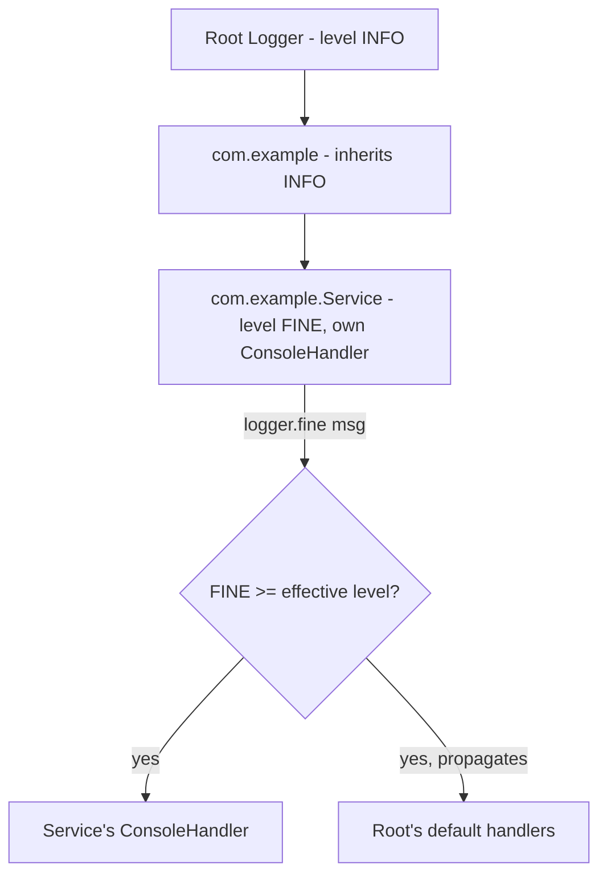
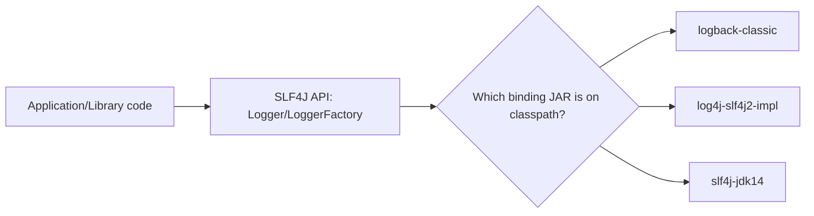

# 29. Logging *(new)*

## `java.util.logging`

### Theory
- **Core Concepts** - `java.util.logging` (JUL) is the JDK's built-in logging framework (`java.util.logging.Logger`), providing hierarchical named loggers, configurable levels, handlers (output destinations), and formatters, with zero external dependencies required.
- **Internal Working** - Loggers form a hierarchy by dot-separated name (mirroring package names), each optionally configuring its own level/handlers, with unset properties inherited from parent loggers up to the root logger; log calls are dispatched to the logger's (and ancestors', if configured) handlers if the message's level meets the effective threshold.
- **When to Use It** - Use directly for simple applications/libraries wanting zero-dependency logging, or understand it because many JDK-internal components and older libraries use it; in most modern application code, prefer a facade like SLF4J over a concrete backend (often Logback) instead of coding directly against JUL.
- **Advantages** - No external dependency (ships with the JDK); integrates automatically with JDK-internal logging (e.g., some `java.net`/security-related diagnostics).
- **Limitations** - Widely considered clunkier/less ergonomic than alternatives (Logback, Log4j2) - more verbose configuration, fewer built-in appenders/formatters out of the box, weaker performance tuning options (e.g., no built-in async appenders), and its API/config style feels dated compared to modern facades.

### Internal Working
- **Step-by-Step Explanation** - `Logger.getLogger("com.example.Service")` returns (creating if necessary) a named logger; calling `logger.info("message")` checks the logger's *effective* level (its own level if set, else walking up parent loggers until one has an explicit level, ultimately the root logger's default) - if the message level is at or above that threshold, it's wrapped in a `LogRecord` and passed to the logger's own `Handler`s, and (unless `setUseParentHandlers(false)`) also propagated up to ancestor loggers' handlers, each of which may apply its own level filter and a `Formatter` before writing output.
- **Memory Layout** - Loggers are typically held as `static final` fields (one heap object per named logger, cached internally by the `LogManager`); `LogRecord` objects are short-lived, created per log call and typically collected quickly after being formatted/written.
- **Diagrams**

- **JVM Behaviour** - Logging calls are ordinary method invocations with no special JVM support; performance-sensitive code should guard expensive log-message construction with `logger.isLoggable(Level.FINE)` checks to avoid unnecessary string concatenation/formatting work when the level wouldn't be logged anyway.

### Interview Questions
**Basic**
1. What class do you use to obtain a logger in `java.util.logging`?
2. Does JUL require any external dependency?

**Intermediate**
1. How does the logger hierarchy determine a logger's "effective level" if it has none set explicitly?
2. Why should you guard expensive log statements with `isLoggable()`?

**Advanced**
1. Why do most modern Java applications avoid coding directly against `java.util.logging` even though it's built into the JDK?

**Scenario-based**
1. A library you depend on logs via `java.util.logging`, but your application uses SLF4J+Logback - how do you unify these into one logging pipeline?

### Detailed Answers
1. **Q: How to obtain a logger?** A: `Logger.getLogger("some.logger.name")` (conventionally the fully-qualified class name via `getClass().getName()` or a `static final` constant).
2. **Q: External dependency needed?** A: No - it's part of the JDK standard library (`java.util.logging` package), available with zero additional dependencies.
3. **Q: Effective level determination?** A: If a logger has no explicitly set level, it walks up its parent chain (based on dot-separated name hierarchy) until it finds an ancestor with an explicit level set, ultimately falling back to the root logger's configured default level.
4. **Q: Why guard with `isLoggable()`?** A: Constructing a log message (especially with string concatenation or expensive `toString()` calls on arguments) has a real CPU cost even if the message is ultimately discarded because its level is below the threshold; checking `if (logger.isLoggable(Level.FINE)) { logger.fine(expensiveMessage()); }` avoids that wasted work entirely when the level wouldn't be logged.
5. **Q: Why avoid coding directly against JUL?** A: JUL is generally considered less feature-rich and ergonomic than alternatives (fewer appender types, weaker performance/async options, more verbose configuration); the broader ecosystem convention is to code against a facade (SLF4J) so the application/library isn't tied to any specific concrete logging implementation, letting the end application choose/swap the actual backend.
6. **Q: Unifying JUL with SLF4J+Logback?** A: Use the `jul-to-slf4j` bridge (`org.slf4j:jul-to-slf4j`) which installs a `SLF4JBridgeHandler` on the JUL root logger, redirecting all JUL log records into the SLF4J API (and thus into your Logback backend), giving one unified logging pipeline/configuration for both your code and the dependent library's JUL-based logging.

### Code Examples
```java
import java.util.logging.Level;
import java.util.logging.Logger;

public class JulDemo {
    private static final Logger LOGGER = Logger.getLogger(JulDemo.class.getName());

    public static void main(String[] args) {
        LOGGER.info("Application starting");

        // Guard expensive message construction with isLoggable()
        if (LOGGER.isLoggable(Level.FINE)) {
            LOGGER.fine("Detailed state: " + computeExpensiveDebugInfo());
        }

        try {
            riskyOperation();
        } catch (Exception e) {
            LOGGER.log(Level.SEVERE, "Operation failed", e); // logs exception with stack trace
        }
    }
    private static String computeExpensiveDebugInfo() { return "expensive-to-build-details"; }
    private static void riskyOperation() throws Exception { throw new Exception("simulated failure"); }
}
```

## Logging Levels

### Theory
- **Core Concepts** - Logging levels express the relative severity/verbosity of a log message, letting operators filter output at runtime without changing code; JUL defines (highest to lowest): `SEVERE`, `WARNING`, `INFO`, `CONFIG`, `FINE`, `FINER`, `FINEST` (plus `OFF`/`ALL` sentinels), while SLF4J/Log4j2 use the more common `ERROR`, `WARN`, `INFO`, `DEBUG`, `TRACE`.
- **Internal Working** - Each logger/handler has a configured minimum level threshold; a log call's level is compared against the effective threshold, and the message is emitted only if it meets or exceeds that threshold - purely an integer comparison under the hood (each level wraps an int severity value).
- **When to Use It** - Use `ERROR`/`SEVERE` for failures needing attention, `WARN`/`WARNING` for recoverable/unexpected situations, `INFO` for high-level operational events (startup, shutdown, major state transitions), `DEBUG`/`FINE` for detailed diagnostic information useful during development/troubleshooting, `TRACE`/`FINEST` for extremely verbose step-by-step tracing.
- **Advantages** - Enables adjusting verbosity per environment (verbose in dev/staging, minimal in production) without code changes, and per-component (turn on DEBUG for just the module you're investigating) via configuration.
- **Limitations** - Overusing high-severity levels (logging routine events as `ERROR`) causes "alert fatigue"/noisy logs that obscure real problems; inconsistent level usage across a codebase/team makes log-based monitoring/alerting unreliable.

### Internal Working
- **Step-by-Step Explanation** - Each `Level` (JUL) or level enum (SLF4J backends) wraps an integer severity value; a logging call like `logger.warn(msg)` is effectively "is WARN's integer >= the configured threshold's integer for this logger context? If yes, format and emit; if no, discard immediately (ideally without even evaluating message arguments, motivating parameterized logging like `logger.debug("value={}", expensiveCall())`- style APIs that defer argument evaluation).
- **Memory Layout** - Not directly applicable - levels are lightweight enum-like singleton objects, not per-call allocations.
- **Diagrams**
```
Severity (JUL):     SEVERE > WARNING > INFO > CONFIG > FINE > FINER > FINEST
Severity (SLF4J):   ERROR  > WARN    > INFO >         DEBUG              > TRACE

Threshold = INFO -> DEBUG/TRACE calls are discarded; INFO/WARN/ERROR calls are emitted
```
- **JVM Behaviour** - Level comparison is a cheap integer comparison; the real performance concern is ensuring message argument evaluation (string building, `toString()` calls) is deferred/skipped when the level check fails - modern facades (SLF4J) support parameterized logging (`log.debug("x={}", x)`) specifically so the JIT/runtime doesn't need to eagerly concatenate strings before the level check happens.

### Interview Questions
**Basic**
1. List the standard SLF4J logging levels from highest to lowest severity.
2. What's the purpose of having multiple logging levels?

**Intermediate**
1. Why is parameterized logging (`log.debug("x={}", x)`) preferred over string concatenation (`log.debug("x=" + x)`)?
2. What's the practical difference between `WARN` and `ERROR`?

**Advanced**
1. How does a logging framework decide whether to actually format/emit a message versus discard it, and where's the performance-critical path?

**Scenario-based**
1. Production logs are so noisy with `INFO`-level messages that real `ERROR`s get lost/ignored by the on-call team - how would you address this using levels and configuration?

### Detailed Answers
1. **Q: SLF4J levels, highest to lowest?** A: `ERROR` > `WARN` > `INFO` > `DEBUG` > `TRACE`.
2. **Q: Purpose of multiple levels?** A: To allow filtering log verbosity at runtime/per-environment/per-component without code changes - e.g., running production at `INFO` (or `WARN`) to reduce noise/overhead while allowing `DEBUG`/`TRACE` to be enabled temporarily and selectively when troubleshooting a specific issue.
3. **Q: Why parameterized logging?** A: `log.debug("x=" + x)` ALWAYS performs the string concatenation (and any `toString()` calls) regardless of whether DEBUG is enabled, wasting CPU when it's disabled; `log.debug("x={}", x)` defers formatting - the framework only builds the final string if the DEBUG level check passes, avoiding wasted work when logging is disabled at that level.
4. **Q: `WARN` vs `ERROR` distinction?** A: `WARN` indicates something unexpected or potentially problematic that the application recovered from or can continue despite (e.g., a retried operation, a deprecated API usage, a fallback path taken); `ERROR` indicates an actual failure requiring attention (an operation that failed and could not complete/recover, likely impacting functionality).
5. **Q: Performance-critical decision path?** A: The framework first performs a cheap integer-level comparison (`isEnabled(level)`) before doing ANY message construction; the critical practice is ensuring that comparison happens BEFORE expensive argument evaluation/string building - achieved via parameterized/lazy logging APIs or explicit `isDebugEnabled()`-style guards around costly message construction.
6. **Q: Noisy `INFO` logs burying `ERROR`s?** A: Audit and reduce excessive `INFO`-level logging (demote truly routine/high-volume events to `DEBUG`), configure production log level appropriately (often `INFO` or `WARN` as the baseline, with `DEBUG` reserved for targeted troubleshooting), and set up log-based alerting/dashboards that specifically filter and highlight `ERROR`/`WARN` entries so they're not visually lost among high-volume `INFO` noise, rather than relying on humans scrolling through raw logs.

### Code Examples
```java
import org.slf4j.Logger;
import org.slf4j.LoggerFactory;

public class LoggingLevelsDemo {
    private static final Logger log = LoggerFactory.getLogger(LoggingLevelsDemo.class);

    public static void main(String[] args) {
        log.error("Payment processing failed for order {}", "ORD-123"); // needs attention
        log.warn("Retrying connection to {} (attempt {})", "db-primary", 2); // recoverable
        log.info("Order {} placed successfully", "ORD-124"); // high-level operational event
        log.debug("Computed discount={} for order={}", 0.15, "ORD-124"); // detailed diagnostic
        log.trace("Entering calculateDiscount() with rawTotal={}", 199.99); // very verbose tracing
        // Note: argument formatting for debug()/trace() is deferred - no cost if disabled.
    }
}
```

## Handlers & Formatters

### Theory
- **Core Concepts** - In `java.util.logging`, a `Handler` determines WHERE log records go (console, file, network socket, memory buffer), while a `Formatter` determines HOW a `LogRecord` is rendered into text (or another format) before the handler writes it - a separation of "destination" from "presentation" mirrored by "appenders"/"layouts" in Logback/Log4j2.
- **Internal Working** - A logger can have zero or more handlers attached; each handler has its own level threshold (independent of the logger's) and its own formatter; when a `LogRecord` reaches a handler, the handler checks its own level filter, then calls its formatter's `format(record)` to produce the final string/bytes, then writes them to its destination.
- **When to Use It** - Attach a `ConsoleHandler` for local/dev visibility, a `FileHandler` for persistent logs, and custom handlers/formatters for structured (JSON) output feeding into log aggregation systems (ELK, Splunk); customize formatters when the default `SimpleFormatter`'s plain-text output doesn't fit your log-processing pipeline's needs.
- **Advantages** - Clean separation of concerns lets you reuse the same formatter across different handlers (or vice versa), and lets a single log call fan out to multiple destinations (console AND file AND remote) each with independent formatting/filtering.
- **Limitations** - JUL's built-in handlers/formatters are relatively basic (no built-in JSON formatter, no built-in async/buffered file rotation policies as sophisticated as Logback's) - production systems typically need custom or third-party handlers/formatters, or simply use a more capable framework (Logback/Log4j2) instead.

### Internal Working
- **Step-by-Step Explanation** - `logger.info(msg)` creates a `LogRecord` and passes it to each attached `Handler` (plus, if `useParentHandlers` is true, ancestor loggers' handlers too); each `Handler.publish(record)` first checks its own level filter (independent from the logger's level - a handler can further restrict what it actually outputs), then calls its `Formatter.format(record)` to produce a `String`, then writes that string to its underlying destination (`System.out`/`System.err` for `ConsoleHandler`, a rotating file for `FileHandler`, etc.), typically flushing based on the handler's configuration.
- **Memory Layout** - `Handler`/`Formatter` instances are ordinary long-lived heap objects configured once at startup; `FileHandler` internally manages file I/O buffers and rotation state (current file index, byte count) as part of its own object state.
- **Diagrams**
```
LogRecord --> Handler.publish()
                |-- checks handler's own level
                |-- Formatter.format(record) -> String
                \-- writes to destination (console/file/socket)

One logger can fan out to MULTIPLE handlers: ConsoleHandler + FileHandler + CustomJsonHandler
```
- **JVM Behaviour** - No special JVM behaviour - handlers perform ordinary I/O (console/file/network writes), which can block the calling thread unless the handler is explicitly asynchronous/buffered; a slow handler (e.g., writing over a flaky network) can become a bottleneck for any thread that logs through it, since JUL's built-in handlers are largely synchronous by default.

### Interview Questions
**Basic**
1. What's the difference between a `Handler` and a `Formatter` in `java.util.logging`?
2. Name two built-in JUL handlers.

**Intermediate**
1. Can a handler have a different (more restrictive) level than its logger? What's the effect?
2. How does a single log call end up in both console output and a file?

**Advanced**
1. Why can synchronous file/network handlers become a performance bottleneck, and how would you mitigate this?

**Scenario-based**
1. You need production logs emitted as structured JSON for ingestion into an ELK stack, but JUL's default `SimpleFormatter` produces plain text - how would you address this?

### Detailed Answers
1. **Q: Handler vs Formatter?** A: A `Handler` decides the output destination (console, file, network) and manages the actual I/O; a `Formatter` decides how a `LogRecord`'s data (message, level, timestamp, exception) is rendered into the text/bytes the handler writes - destination versus presentation.
2. **Q: Two built-in JUL handlers?** A: `ConsoleHandler` (writes to `System.err` by default) and `FileHandler` (writes to a rotating set of files).
3. **Q: Handler with stricter level than logger?** A: Yes - a handler's level acts as an additional filter on top of whatever passed the logger's own level check; e.g., a logger at `FINE` might still have a `ConsoleHandler` configured at `INFO`, so `FINE`/`FINER` messages reach the handler but are further filtered out there, never appearing on console (useful for having verbose file logs but a quieter console).
4. **Q: One call, multiple destinations?** A: Attach multiple handlers to the same logger (e.g., `logger.addHandler(consoleHandler); logger.addHandler(fileHandler);`) - each `LogRecord` is dispatched to every attached handler (and ancestor handlers, if `useParentHandlers` is true), each independently formatting and writing it to its own destination.
5. **Q: Why can synchronous handlers bottleneck?** A: If a handler performs a blocking I/O operation (writing to a slow disk, or especially a network socket) synchronously as part of `publish()`, the calling application thread is blocked for that duration on every log call; mitigate by using (or writing) an asynchronous handler that hands the `LogRecord` off to a background thread/queue for actual writing, decoupling the application's logging call from the I/O latency.
6. **Q: JSON logging for ELK?** A: Implement a custom `Formatter` subclass overriding `format(LogRecord)` to produce a JSON string (timestamp, level, logger name, message, exception details) instead of plain text, and attach it to your handlers (`handler.setFormatter(new JsonFormatter())`); alternatively, migrate to a framework with built-in structured-logging support (e.g., Logback with `logstash-logback-encoder`), which is the more common production choice.

### Code Examples
```java
import java.util.logging.*;
import java.io.IOException;

public class HandlersFormattersDemo {
    public static void main(String[] args) throws IOException {
        Logger logger = Logger.getLogger("com.example.app");
        logger.setUseParentHandlers(false); // don't also use the default root console handler
        logger.setLevel(Level.FINE);

        ConsoleHandler console = new ConsoleHandler();
        console.setLevel(Level.INFO); // console only shows INFO and above, even though logger allows FINE
        console.setFormatter(new SimpleFormatter());

        FileHandler file = new FileHandler("app.log", true); // append mode
        file.setLevel(Level.FINE); // file captures more detail than console
        file.setFormatter(new SimpleFormatter());

        logger.addHandler(console);
        logger.addHandler(file);

        logger.info("Visible on console AND in file");
        logger.fine("Only in file, filtered out of console by its handler-level");
    }
}
```

## Logging Facades (SLF4J) & Best Practices

### Theory
- **Core Concepts** - SLF4J (Simple Logging Facade for Java) is an abstraction layer providing a single logging API (`Logger`/`LoggerFactory`) that decouples application/library code from any specific concrete logging implementation (Logback, Log4j2, JUL), with the actual backend selected at deployment time via which binding JAR is on the classpath.
- **Internal Working** - Application code calls `LoggerFactory.getLogger(...)`, which at runtime discovers and delegates to whichever concrete SLF4J binding is present on the classpath (e.g., `logback-classic`, or a bridge like `log4j-over-slf4j`); this indirection means library authors can log via SLF4J without forcing a specific backend choice on consumers.
- **When to Use It** - Use SLF4J as the logging API in virtually all new application AND library code; choose a concrete backend (commonly Logback or Log4j2) only at the final application's deployment, wiring in the appropriate binding dependency.
- **Advantages** - Decouples logging API from implementation (swap backends without code changes), supports parameterized/lazy logging (`log.debug("x={}", x)`), is the de facto ecosystem standard so libraries interoperate cleanly, and offers bridges to unify logs from libraries using other frameworks (JUL, Log4j 1.x, Commons Logging) into one pipeline.
- **Limitations** - Adds one layer of indirection (a facade call must still resolve to a concrete implementation, occasionally causing "multiple bindings on classpath" warnings/conflicts if dependency management isn't careful); doesn't itself provide advanced features (async appenders, rolling file policies) - those come from the chosen concrete backend.

### Internal Working
- **Step-by-Step Explanation** - At class-load time, `LoggerFactory` locates the SLF4J binding on the classpath (a `StaticLoggerBinder`/`ServiceLoader`-based mechanism depending on SLF4J version) and delegates all subsequent `Logger` creation/log calls to that binding's actual implementation (e.g., Logback's `Logger`), which then handles level filtering, formatting, and appender dispatch exactly as it would if used directly - SLF4J itself contains no logging implementation, purely the API plus a thin discovery/delegation layer.
- **Memory Layout** - Not directly applicable - a thin API layer with negligible additional per-log-call overhead beyond a normal method call delegating to the real backend's logger.
- **Diagrams**

- **JVM Behaviour** - No special JVM behaviour beyond normal class loading/delegation; the binding resolution happens once at startup (or first use), after which all logging calls go directly to the resolved concrete implementation with no ongoing per-call resolution overhead.

### Interview Questions
**Basic**
1. What is SLF4J, and what problem does it solve?
2. Does SLF4J itself write log output anywhere?

**Intermediate**
1. Why should library authors log against SLF4J instead of a concrete framework like Logback directly?
2. What causes the classic "multiple SLF4J bindings" warning, and how do you fix it?

**Advanced**
1. How do bridge libraries (e.g., `jul-to-slf4j`, `log4j-over-slf4j`) unify logging from dependencies using different frameworks?

**Scenario-based**
1. You're building a shared library used by many different applications, some using Logback, others using Log4j2 - what logging approach should the library use, and why?

### Detailed Answers
1. **Q: What is SLF4J and what problem does it solve?** A: A logging facade/API that decouples calling code from any specific concrete logging implementation, solving the problem of applications and their many dependencies each potentially wanting a different logging framework - by coding against one common API, the actual backend can be chosen once, application-wide.
2. **Q: Does SLF4J write output itself?** A: No - it's purely an API; actual log formatting/writing is performed by whichever concrete binding (Logback, Log4j2, JUL bridge, etc.) is present on the classpath at runtime.
3. **Q: Why should libraries use SLF4J, not a concrete framework?** A: If a library logged directly via, say, Logback, every consuming application would be forced to have Logback on its classpath (and potentially conflict with the application's own chosen framework); logging via SLF4J lets the library remain implementation-agnostic, with the final application deciding which concrete backend to wire in.
4. **Q: "Multiple bindings" warning cause/fix?** A: Occurs when more than one SLF4J binding JAR (e.g., both `logback-classic` and `slf4j-log4j12`) is present on the classpath simultaneously, making it ambiguous which one should handle logging; fix by auditing your dependency tree (e.g., `mvn dependency:tree`) and excluding the unwanted/duplicate binding(s), keeping exactly one concrete binding on the classpath.
5. **Q: How do bridge libraries unify logging?** A: They replace the OTHER framework's logging implementation with a thin shim that redirects calls into SLF4J instead (e.g., `jul-to-slf4j` installs a custom JUL `Handler` on the root JUL logger that forwards every `LogRecord` into the SLF4J API; `log4j-over-slf4j` provides a `log4j-over-slf4j.jar` that mimics the Log4j 1.x API but delegates calls to SLF4J) - so ALL logging, regardless of which API a given dependency was originally written against, ultimately flows through one real backend and its configuration.
6. **Q: Shared library's logging approach?** A: Use SLF4J exclusively for all logging calls within the library, and do NOT bundle/depend on any concrete backend (Logback/Log4j2) as a compile-time dependency (at most as an optional/test-scope dependency) - this lets each consuming application supply whichever concrete SLF4J binding matches its own logging setup, without forcing a specific choice or risking classpath conflicts.

### Code Examples
```java
import org.slf4j.Logger;
import org.slf4j.LoggerFactory;

public class Slf4jBestPracticesDemo {
    // Library/application code depends only on the SLF4J API, never a concrete backend directly
    private static final Logger log = LoggerFactory.getLogger(Slf4jBestPracticesDemo.class);

    public void processOrder(String orderId, double amount) {
        log.info("Processing order {} for amount {}", orderId, amount); // parameterized, lazy formatting
        try {
            if (amount < 0) throw new IllegalArgumentException("Negative amount");
            log.debug("Order {} validated successfully", orderId);
        } catch (IllegalArgumentException e) {
            log.error("Failed to process order {}", orderId, e); // logs message + full stack trace
            throw e;
        }
    }
    public static void main(String[] args) {
        new Slf4jBestPracticesDemo().processOrder("ORD-1", 99.99);
    }
}
```
