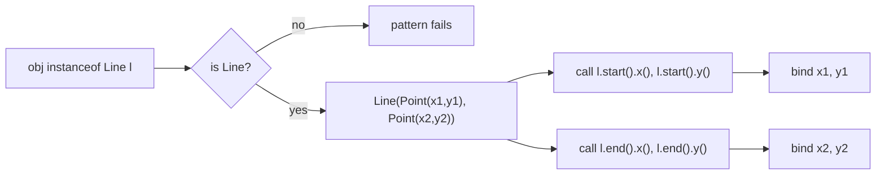

# 3. Classes

## Nested Classes

### Static Nested Classes

#### Theory

- **Core Concepts**: A static nested class is a class declared `static` inside another class (the enclosing class). It behaves like a top-level class that has simply been namespaced inside another class for packaging/organizational purposes. It does **not** hold an implicit reference to an instance of the enclosing class.
- **Internal Working**: The compiler generates a separate `.class` file named `Outer$Nested.class`; there is no synthetic outer-instance field because the nested class is static.
- **When to Use It**: When a helper class is logically grouped with its enclosing class but does not need access to the enclosing instance's state (e.g. `Map.Entry`, builder classes, node classes for a linked structure).
- **Advantages**: Improves encapsulation/namespacing, avoids polluting the top-level namespace, can be instantiated without an enclosing instance, slightly cheaper (no hidden reference, no memory-leak risk tied to outer instance).
- **Limitations**: Cannot access non-static members of the enclosing class directly; still tied to the enclosing class's visibility/compilation unit.

#### Internal Working

- **Step-by-Step Explanation**: (1) Compiler encounters `static class Nested` inside `Outer`. (2) It emits a distinct class file `Outer$Nested.class` implementing/extending whatever is declared. (3) No synthetic constructor parameter for an outer reference is added (contrast with inner classes). (4) Access to `Outer`'s private static members from `Nested` (and vice versa) is done via synthetic bridge accessor methods (`access$xxx`) if needed, because JVM-level access control is per-class, not per-source-file.
- **Memory Layout**: An instance of a static nested class lives on the heap exactly like a top-level class instance — no extra outer-instance pointer, so no additional retention/memory-leak risk through the enclosing instance.
- **Diagrams**:
```
+----------------+        +------------------------+
|   Outer.class  |        | Outer$Nested.class     |
|----------------|        |------------------------|
| static members |<------ | (no outer reference)   |
+----------------+        +------------------------+
```
- **JVM Behaviour**: At the bytecode level a static nested class is indistinguishable from any other top-level class except for the `$` naming convention and an `InnerClasses` attribute in the class file that records the nesting relationship for reflection (`getEnclosingClass()`, `getDeclaringClass()`).

#### Interview Questions

**Basic**
1. What is a static nested class and how does it differ from a regular top-level class?
2. Can a static nested class access instance members of its enclosing class?

**Intermediate**
3. How does the JVM represent a static nested class at the bytecode/class-file level?
4. Why can static nested classes be instantiated without an instance of the outer class?

**Advanced**
5. How do private members shared between a static nested class and its enclosing class get compiled, given JVM access control is per-class?

**Scenario-based**
6. You are designing a `LinkedList` implementation — would you make the `Node` class static nested or non-static inner, and why?

#### Detailed Answers

1. A static nested class is declared with the `static` modifier inside another class. Unlike a top-level class, it is scoped under the enclosing class's namespace (`Outer.Nested`) but it compiles to its own class file and, crucially, does not carry an implicit reference to an enclosing instance — it behaves exactly like an independent top-level class that happens to be nested for organizational/namespacing purposes.
2. No. Because it holds no reference to an enclosing instance, a static nested class can only access `static` members (fields, methods) of the enclosing class directly. To interact with instance members it would need an explicit `Outer` reference passed in, e.g. via a constructor parameter.
3. The compiler emits `Outer$Nested.class` as a fully independent class file. It carries an `InnerClasses` attribute (metadata only, used by reflection and the compiler, not by the verifier/loader for behaviour) recording that `Nested` is a member of `Outer` and that it is `static`. No synthetic outer-instance field or constructor parameter is generated, unlike non-static inner classes.
4. Because there's no synthetic outer-instance field to initialize, the compiler does not require (and does not generate) an implicit `Outer.this` parameter in `Nested`'s constructors. You can therefore write `new Outer.Nested()` directly without first having an `Outer` instance, exactly as with `new SomeTopLevelClass()`.
5. Private members accessed across the static nested class/enclosing class boundary are handled through synthetic package-private (or now, with nestmates in Java 11+, true nest-based) access. Prior to Java 11, the compiler generated synthetic bridge methods like `access$000` so that JVM-level private access checks (enforced per-class file, not per outer Java source construct) would succeed. Since Java 11 (JEP 181, nestmates), classes compiled from the same top-level source file belong to the same "nest" and the JVM natively permits private member access between nestmates without synthetic bridge methods, reducing class-file bloat and closing a reflection loophole.
6. `Node` should be a `private static` nested class. Each node only needs references to its own `data`/`next`/`prev` fields, never to the enclosing `LinkedList` instance, so making it static avoids an unnecessary hidden reference to the list on every single node — at scale (millions of nodes) this materially reduces memory footprint and eliminates an unintended path that would otherwise keep the whole list instance reachable through any single leaked node reference.

#### Code Examples

```java
public class CacheEntryStore {

    // Static nested class: groups Entry with CacheEntryStore but needs no outer reference
    public static class Entry<K, V> {
        private final K key;
        private final V value;
        private final long expiresAtMillis;

        public Entry(K key, V value, long ttlMillis) {
            this.key = key;
            this.value = value;
            this.expiresAtMillis = System.currentTimeMillis() + ttlMillis;
        }

        public boolean isExpired() {
            return System.currentTimeMillis() > expiresAtMillis;
        }

        public V getValue() {
            return value;
        }
    }

    public static void main(String[] args) throws InterruptedException {
        // Instantiated without any CacheEntryStore instance
        Entry<String, Integer> entry = new CacheEntryStore.Entry<>("hits", 42, 50);
        System.out.println(entry.getValue() + " expired=" + entry.isExpired());
        Thread.sleep(60);
        System.out.println("after sleep, expired=" + entry.isExpired());
    }
}
```

### Inner Classes

#### Theory

- **Core Concepts**: A (non-static) inner class is a class defined inside another class without the `static` modifier. Every inner class instance is implicitly bound to an instance of its enclosing class and can freely access all of the enclosing instance's members, including `private` ones.
- **Internal Working**: The compiler adds a synthetic field (conventionally `this$0`) to the inner class holding a reference to the enclosing instance, and a synthetic parameter to every inner-class constructor to initialize it.
- **When to Use It**: When the nested class conceptually cannot exist independently of an instance of the outer class, e.g. an `Iterator` implementation tied to a specific collection instance, or a GUI event listener that must mutate outer state.
- **Advantages**: Direct, natural access to enclosing instance state without passing it explicitly; expresses a strong logical "belongs to an instance" relationship.
- **Limitations**: Implicit outer reference can cause memory leaks if an inner-class instance outlives the intended lifetime of the outer instance (e.g. registered listeners); historically could not declare `static` members (except constant `static final` fields), a restriction relaxed since Java 16.

#### Internal Working

- **Step-by-Step Explanation**: (1) Source declares `class Inner` nested without `static` inside `Outer`. (2) Compiler synthesizes field `Outer this$0;` in `Inner`. (3) Every constructor of `Inner` gets a synthetic leading parameter of type `Outer`, populated automatically at each `outer.new Inner()` call site. (4) Any reference to an enclosing member from within `Inner` is rewritten to go through `this$0`.
- **Memory Layout**: Each `Inner` instance on the heap carries an extra reference-sized field pointing back to its `Outer` instance. As long as any `Inner` instance is reachable (e.g. stored in a static collection, or registered as a callback), the `Outer` instance it points to cannot be garbage collected - a classic source of memory leaks in long-lived listener registries.
- **Diagrams**:
```
Outer instance (heap)              Inner instance (heap)
+------------------+                +----------------------+
| fields...        | <------------- | this$0 -> Outer       |
+------------------+                | own fields...         |
                                     +----------------------+
```
- **JVM Behaviour**: `Outer$Inner.class` is compiled as a distinct class file carrying an `InnerClasses` attribute; the synthetic `this$0` field and constructor parameter are ordinary bytecode-level constructs, invisible in source but visible via reflection (`getDeclaredFields()` shows `this$0`).

#### Interview Questions

**Basic**
1. What is the key structural difference between a static nested class and a non-static inner class?
2. How do you instantiate an inner class from outside the enclosing class?

**Intermediate**
3. Why can inner class instances cause memory leaks, and how would you avoid it?
4. What does the compiler generate under the hood to give an inner class access to the enclosing instance?

**Advanced**
5. Prior to relaxed rules in modern Java, why couldn't inner classes declare `static` members?

**Scenario-based**
6. You have a Swing/Android-style `Button` that holds an inner-class `ClickListener`, registered globally. What memory issue could arise, and what's the fix?

#### Detailed Answers

1. A static nested class has no reference to an enclosing instance and can be instantiated independently; a non-static inner class always holds an implicit reference (`this$0`) to the specific enclosing instance that created it and cannot exist without one.
2. Via `outerInstance.new Inner()`, e.g. `Outer o = new Outer(); Outer.Inner i = o.new Inner();`. This explicit syntax makes the dependency on an enclosing instance visible at the call site.
3. Because every inner-class instance retains a strong reference to its enclosing instance, if the inner instance is stored somewhere with a longer lifetime than intended (a static list of listeners, a cache, a long-lived thread), the enclosing instance becomes unreachable-but-referenced and cannot be GC'd, causing a leak. The fix is to prefer a static nested class that takes only the specific data it needs (or a `WeakReference` to the outer instance), rather than an implicit full back-reference.
4. The compiler adds a synthetic field `Outer this$0` to the inner class and a synthetic first constructor parameter of type `Outer`; every implicit reference to an outer member inside the inner class is desugared to `this$0.member`.
5. Historically the JVM specification tied static members to a single top-level class-loading/initialization context, and since an inner class instance is intrinsically bound to an enclosing instance rather than being a standalone type, allowing genuinely `static` (per-class, not per-instance) state was considered conceptually inconsistent with "requires an instance to exist." This restriction was relaxed starting with Java 16 (JEP 395-related cleanup extended general static member support to inner classes), but many codebases and interviewers still reference the classical restriction.
6. Registering an inner-class `ClickListener` globally (e.g. in a static event bus) keeps a `this$0` reference to the enclosing `Button`/`Activity` alive for as long as the listener is registered, even after the `Button` should have been destroyed - a classic Android `Activity` leak. The fix: use a `static` nested listener class holding only a `WeakReference<Button>`, or explicitly unregister the listener in a lifecycle callback (`onDestroy`/`dispose`).

#### Code Examples

```java
public class OrderProcessor {
    private final java.util.List<String> auditLog = new java.util.ArrayList<>();
    private String currentUser;

    // Non-static inner class: needs access to enclosing instance's auditLog/currentUser
    class Transaction {
        private final double amount;

        Transaction(double amount) {
            this.amount = amount;
        }

        void commit() {
            // Implicitly uses OrderProcessor.this.auditLog and currentUser
            auditLog.add(currentUser + " committed $" + amount);
        }
    }

    void setCurrentUser(String user) {
        this.currentUser = user;
    }

    java.util.List<String> getAuditLog() {
        return auditLog;
    }

    public static void main(String[] args) {
        OrderProcessor processor = new OrderProcessor();
        processor.setCurrentUser("alice");
        OrderProcessor.Transaction tx = processor.new Transaction(129.99);
        tx.commit();
        System.out.println(processor.getAuditLog());
    }
}
```

### Anonymous Classes

#### Theory

- **Core Concepts**: An anonymous class is an inner class with no name, declared and instantiated in a single expression via `new SuperTypeOrInterface(args) { ...body... }`. It either extends a class or implements a single interface, providing an ad-hoc, one-off implementation.
- **Internal Working**: The compiler assigns it a synthetic name like `Outer$1` and compiles it like a non-static inner class (if declared in an instance context), capturing an implicit outer reference plus copies of any captured effectively-final local variables.
- **When to Use It**: Quick, single-use implementations of an interface/abstract class where a full named class (or, in modern Java, a lambda) would be overkill - e.g. a one-off `Comparator`, a callback overriding several methods, or instance-initializer-style setup blocks.
- **Advantages**: Keeps a small, single-use implementation localized right where it's used; captures enclosing scope naturally.
- **Limitations**: Cannot have an explicit constructor (only instance initializer blocks); verbose compared to lambdas for functional interfaces; each captured local variable must be effectively final; creates one new class file per anonymous class, increasing classfile count.

#### Internal Working

- **Step-by-Step Explanation**: (1) Compiler encounters `new Comparator<String>() { public int compare(...) {...} }`. (2) It generates a class file `Outer$N.class` (N = sequential integer) implementing `Comparator<String>`. (3) If declared inside an instance method, the generated class gets `this$0` like any inner class. (4) Any captured local variables from the enclosing method become synthetic final fields, copied at construction time (this is why they must be effectively final - the anonymous class works on its own copy, not a live reference to the stack variable).
- **Memory Layout**: The anonymous class instance lives on the heap; captured local primitives/references are duplicated as fields on that instance, decoupled from the enclosing method's stack frame (which may have already returned by the time the anonymous instance is invoked, e.g. an async callback).
- **Diagrams**:
```
method frame (stack)          Anonymous instance (heap, Outer$1)
+-------------------+         +--------------------------+
| local var x = 5   | --copy->| final int val$x = 5      |
+-------------------+         | this$0 -> Outer (if any) |
                               +--------------------------+
```
- **JVM Behaviour**: Each anonymous class produces its own compiled `.class` file at compile time (`Outer$1.class`, `Outer$2.class`, ...); there is no special JVM runtime concept of "anonymous" - it is ordinary class loading, just with a compiler-generated name absent from source.

#### Interview Questions

**Basic**
1. How do you declare and instantiate an anonymous class?
2. Can an anonymous class implement more than one interface?

**Intermediate**
3. Why must local variables captured by an anonymous class be effectively final?
4. How do anonymous classes differ from lambda expressions at the bytecode level?

**Advanced**
5. What is "double-brace initialization" and why is it considered an anti-pattern?

**Scenario-based**
6. You need a one-off `Runnable` that captures a loop variable inside a `for` loop to submit to an `ExecutorService`. What must you ensure, and why?

#### Detailed Answers

1. `new SuperclassOrInterface(constructorArgsIfAny) { // overriding method bodies here }`, e.g. `Runnable r = new Runnable() { public void run() { System.out.println("go"); } };`. This single expression both defines the unnamed class and creates one instance of it.
2. No. An anonymous class can extend exactly one class (implementing zero or more of its abstract methods) or implement exactly one interface - never both, and never multiple interfaces, because there is no `class X extends A implements B, C {}`-style header available for an unnamed type.
3. Because the anonymous class instance may outlive the stack frame of the enclosing method (e.g. it's stored, returned, or invoked asynchronously later), the compiler captures local variables by copying their values into synthetic final fields at construction time rather than sharing the live stack slot. If the source variable could still change after capture, the copied field would silently diverge from it, producing confusing bugs - so Java requires the variable be (effectively) final to guarantee the copy always reflects the "true" value.
4. An anonymous class compiles to a full, separate named `.class` file with its own vtable, an instance allocated normally via `new`, and (if capturing an instance context) a `this$0` back-reference. A lambda targeting a functional interface, by contrast, is compiled using the `invokedynamic` instruction with `LambdaMetafactory`, deferring actual class generation to runtime (often producing a hidden class), which is typically more memory- and startup-efficient and avoids one `.class` file per lambda at compile time.
5. Double-brace initialization creates an anonymous subclass of a collection and uses an instance initializer block to add elements, e.g. `new ArrayList<String>() {{ add("a"); add("b"); }}`. It's an anti-pattern because it silently creates a new named subclass (with a hidden outer-instance reference if used in an instance context, risking memory leaks), adds classloading overhead, breaks `equals`/serialization assumptions tied to the exact runtime class, and offers no readability benefit over `List.of("a", "b")`.
6. You must ensure the loop variable used inside the `Runnable`'s body is effectively final at the point of anonymous class capture - in a classic `for (int i = 0; ...)` loop this requires copying `i` into a new local variable inside the loop body (`final int taskId = i;`) before referencing it in the anonymous class, since the loop counter itself is mutated and cannot be captured directly; each anonymous instance then correctly captures its own distinct snapshot rather than everyone referencing the same final loop value.

#### Code Examples

```java
import java.util.*;
import java.util.concurrent.*;

public class ReportScheduler {
    public static void main(String[] args) throws InterruptedException {
        List<String> reportNames = List.of("sales", "inventory", "payroll");

        // Anonymous class implementing Comparator, sorting by length then alpha
        List<String> sorted = new ArrayList<>(reportNames);
        sorted.sort(new Comparator<String>() {
            @Override
            public int compare(String a, String b) {
                int lenCompare = Integer.compare(a.length(), b.length());
                return lenCompare != 0 ? lenCompare : a.compareTo(b);
            }
        });
        System.out.println(sorted);

        ExecutorService pool = Executors.newFixedThreadPool(3);
        for (int i = 0; i < reportNames.size(); i++) {
            final int taskId = i; // captured copy, safe for the anonymous Runnable
            pool.submit(new Runnable() {
                @Override
                public void run() {
                    System.out.println("Generating report #" + taskId + ": " + reportNames.get(taskId));
                }
            });
        }
        pool.shutdown();
        pool.awaitTermination(5, TimeUnit.SECONDS);
    }
}
```

### Local Classes

#### Theory

- **Core Concepts**: A local class is a named class declared inside a method body, constructor, or block. It is visible only within that block, but unlike an anonymous class it has a name and can be instantiated multiple times, declare its own constructors, and implement multiple interfaces/extend a class via a normal class header.
- **Internal Working**: Compiled to `Outer$1LocalClassName.class` (a numeric prefix disambiguates local classes with the same simple name declared in different methods); captures enclosing effectively-final locals exactly like an anonymous class, and an outer instance reference if declared in an instance context.
- **When to Use It**: When you need a named, multi-method type that's still only relevant to a single method's implementation - e.g. a small helper class used inside a complex algorithm, or when you need multiple instances of the same ad-hoc type (something an anonymous class can't provide, since each `new X(){}` site is a distinct type).
- **Advantages**: Full class capabilities (multiple methods, constructors, static final constants) while staying scoped to the method, keeping it out of the class's public API; can be instantiated multiple times unlike an anonymous class.
- **Limitations**: Historically could not be declared `static` (relaxed after Java 16); scope-limited so it can't be reused across methods; still subject to effectively-final capture rules for local variables.

#### Internal Working

- **Step-by-Step Explanation**: (1) Compiler sees `class Helper { ... }` nested in a method body. (2) It compiles it to `Outer$1Helper.class`. (3) Same capture mechanism as anonymous classes: effectively-final locals become synthetic final fields, populated via constructor. (4) If in an instance method, `this$0` links back to the enclosing instance the same way as a normal inner class.
- **Memory Layout**: Identical to inner/anonymous classes on the heap - an object with captured-variable fields and possibly an outer-instance reference; local classes carry no special JVM memory behaviour beyond standard inner-class mechanics.
- **Diagrams**:
```
Method body                                Local class instance (heap)
+---------------------------+              +-----------------------------+
| class Validator {...}     |  new Validator()  final <captured fields>  |
| Validator v = new ...     | -----------> | this$0 (if instance method) |
+---------------------------+              +-----------------------------+
```
- **JVM Behaviour**: Exactly like other inner classes - separate class file, `InnerClasses`/`EnclosingMethod` attributes recorded so reflection APIs (`getEnclosingMethod()`) can report which method declared the local class.

#### Interview Questions

**Basic**
1. What distinguishes a local class from an anonymous class?
2. Where can a local class be declared?

**Intermediate**
3. Can a local class be instantiated more than once, and why might that matter compared to an anonymous class?
4. Can local classes have static members?

**Advanced**
5. How does the compiler disambiguate two local classes with the same simple name declared in two different methods of the same enclosing class?

**Scenario-based**
6. Inside a long validation method you need a small class with three cooperating methods, used twice with different constructor arguments to validate two different sub-objects. Would you use a local class or an anonymous class, and why?

#### Detailed Answers

1. A local class has an explicit name and a full class declaration (constructors, multiple methods, `implements`/`extends` clauses as usual) confined to a method/block scope; an anonymous class has no name, is declared and instantiated in one expression, and is limited to extending one class or implementing one interface with no explicit constructor.
2. Inside any block: a method body, constructor body, static/instance initializer block, or even inside a `for`/`if` block - anywhere a local variable could be declared.
3. Yes, because it has a name and a normal constructor, you can call `new Validator(a)` and `new Validator(b)` multiple times to get distinct instances of the *same* type, useful for reuse within the method; an anonymous class expression `new SomeInterface(){...}` instead defines a brand-new one-off type at each syntactic occurrence, so two such blocks are two different types even with identical bodies.
4. Since Java 16, yes - local classes (like inner classes generally) may declare `static` members; prior to that, only `static final` compile-time constants were allowed, due to the historical restriction tying static members to classes loadable independent of an enclosing instance.
5. The compiler prefixes the local class's binary name with a synthetic numeric discriminator based on declaration order within the enclosing top-level class, e.g. `Outer$1Validator` and `Outer$2Validator` for two different methods each declaring a `class Validator`, ensuring unique binary class names even though the simple source name collides.
6. A local class is the better fit: it needs a name (reused twice), multiple constructors/methods, and is only relevant to this one method's implementation. An anonymous class would force duplicating the whole implementation twice (once per `new` expression) since each anonymous instantiation defines a distinct type, which is wasteful and harder to maintain; a local class lets you write the logic once and instantiate it twice with different arguments.

#### Code Examples

```java
public class OrderValidator {

    boolean validateOrder(String customerId, double amount, java.util.List<String> items) {
        // Local class: named, multi-method, reusable within this method
        class FieldCheck {
            private final String fieldName;
            private final boolean valid;

            FieldCheck(String fieldName, boolean valid) {
                this.fieldName = fieldName;
                this.valid = valid;
            }

            void reportIfInvalid() {
                if (!valid) {
                    System.out.println("Invalid field: " + fieldName);
                }
            }
        }

        FieldCheck customerCheck = new FieldCheck("customerId", customerId != null && !customerId.isBlank());
        FieldCheck amountCheck = new FieldCheck("amount", amount > 0);
        FieldCheck itemsCheck = new FieldCheck("items", items != null && !items.isEmpty());

        customerCheck.reportIfInvalid();
        amountCheck.reportIfInvalid();
        itemsCheck.reportIfInvalid();

        return customerCheck.valid && amountCheck.valid && itemsCheck.valid;
    }

    public static void main(String[] args) {
        OrderValidator validator = new OrderValidator();
        System.out.println(validator.validateOrder("C-100", 49.99, java.util.List.of("sku-1")));
        System.out.println(validator.validateOrder("", -5, java.util.List.of()));
    }
}
```

## Records

### Record Patterns *(new, Java 21)*

#### Theory

- **Core Concepts**: Record patterns (JEP 440, finalized Java 21) allow deconstructing a record instance directly in a pattern-matching context (`instanceof` or `switch`), binding its component values to new variables in one step, and can be nested to deconstruct records-of-records.
- **Internal Working**: The compiler recognizes a pattern like `Point(int x, int y)` in `instanceof`/`switch`, generates the equivalent `instanceof` type check plus calls to each accessor method (`x()`, `y()`) to populate the bound variables, and (for nested patterns) recursively repeats this for embedded records.
- **When to Use It**: When working with `record`-based data models (e.g. a `Point`, `Line(Point start, Point end)`) and you want to extract nested fields without manual accessor chains, especially combined with `switch` for exhaustive, type-safe handling of sealed hierarchies of records.
- **Advantages**: Removes boilerplate accessor calls, enables nested destructuring, integrates with `switch` pattern matching (including guarded patterns `when`) for very expressive, exhaustive data-oriented code.
- **Limitations**: Only applicable to `record` types (not arbitrary classes); nested pattern readability can degrade if over-nested; still requires the target to actually be an instance of the record type (a runtime check), so it doesn't replace all validation.

#### Internal Working

- **Step-by-Step Explanation**: (1) At `case Point(int x, int y):` (or `if (obj instanceof Point(int x, int y))`), compiler first emits an `instanceof Point` check. (2) On success, it invokes `((Point) obj).x()` and `.y()` accessor methods, storing results into the new local bindings `x`/`y`. (3) For nested patterns like `Line(Point(int x1, int y1), Point(int x2, int y2))`, this process repeats recursively per component. (4) In `switch`, the compiler also verifies exhaustiveness against sealed type hierarchies at compile time.
- **Memory Layout**: Not directly applicable beyond ordinary record instance layout (records are plain final classes with private final fields); pattern matching introduces no additional heap allocation - it only reads existing accessor values into local variables/stack slots.
- **Diagrams**:

- **JVM Behaviour**: Desugars to ordinary `checkcast`/`invokevirtual` bytecode calling the record's accessor methods; the JVM has no special "pattern" bytecode - all pattern matching is compile-time sugar over standard instance checks and method calls, with `switch` exhaustiveness enforced by `javac`, not the JVM at runtime.

#### Interview Questions

**Basic**
1. What problem do record patterns solve compared to manually calling accessor methods?
2. Give the syntax for deconstructing a `record Point(int x, int y)` inside an `instanceof`.

**Intermediate**
3. Can record patterns be nested? Give an example use case.
4. How do record patterns interact with `switch` exhaustiveness checking over sealed types?

**Advanced**
5. What bytecode does a record pattern match actually desugar to?

**Scenario-based**
6. You have `sealed interface Shape permits Circle, Rectangle` with records `Circle(Point center, double radius)` and `Rectangle(Point topLeft, Point bottomRight)`. Write a switch that computes area using record patterns, and explain why the compiler can guarantee exhaustiveness without a `default` branch.

#### Detailed Answers

1. Without record patterns, extracting nested data requires chains like `line.start().x()`, `line.start().y()`, repeated per component, cluttering code and hurting readability. Record patterns let you write `case Line(Point(var x1, var y1), Point(var x2, var y2))` and get all four values bound directly, in one declarative expression, with the compiler generating the accessor calls for you.
2. `if (obj instanceof Point(int x, int y)) { System.out.println(x + y); }` - this both checks that `obj` is a `Point` and binds `x`/`y` from its components, scoped to the following block.
3. Yes - a record pattern can contain other record patterns (or type patterns/`var`) as its component patterns, arbitrarily deep, e.g. `case Line(Point(var x1, var y1), Point(var x2, var y2))` deconstructs a `Line` composed of two `Point`s in a single pattern, useful for geometry, AST processing, or any composite record-of-records domain model.
4. When a `switch` operates over a sealed interface's permitted record subtypes and every permitted subtype is covered by a `case` record pattern, `javac` can statically prove the switch is exhaustive (every possible runtime type is handled), allowing the `default` branch to be omitted entirely while still guaranteeing the switch is a total function over the sealed hierarchy - the compiler rejects the code if a permitted subtype is missing.
5. It desugars to a sequence of `instanceof`/`checkcast` bytecode instructions to verify the runtime type, followed by `invokevirtual` calls to each nested record's accessor methods (`x()`, `y()`, etc.), storing results into local variable slots - functionally identical to what you'd write by hand, just generated by the compiler.
6. 
```java
sealed interface Shape permits Circle, Rectangle {}
record Point(double x, double y) {}
record Circle(Point center, double radius) implements Shape {}
record Rectangle(Point topLeft, Point bottomRight) implements Shape {}

double area(Shape shape) {
    return switch (shape) {
        case Circle(Point c, double r) -> Math.PI * r * r;
        case Rectangle(Point(var x1, var y1), Point(var x2, var y2)) ->
            Math.abs(x2 - x1) * Math.abs(y2 - y1);
    };
}
```
The compiler can omit `default` because `Shape` is `sealed` with exactly two permitted implementations, `Circle` and `Rectangle`, both of which are handled by a `case`; since no other type can ever implement `Shape` (enforced at compile time by the `permits` clause), the switch is provably total, so the compiler both allows and, since Java 21, arguably prefers omitting `default` for future-proofing (adding a new permitted type would then produce a compile error at every switch that needs updating).

#### Code Examples

```java
public class GeometryDemo {
    record Point(double x, double y) {}
    record Line(Point start, Point end) {}

    static String describe(Object obj) {
        // Nested record pattern with instanceof
        if (obj instanceof Line(Point(var x1, var y1), Point(var x2, var y2))) {
            double length = Math.hypot(x2 - x1, y2 - y1);
            return "Line of length " + length;
        }
        if (obj instanceof Point(var x, var y)) {
            return "Point at (" + x + ", " + y + ")";
        }
        return "Unknown shape";
    }

    public static void main(String[] args) {
        System.out.println(describe(new Point(1, 2)));
        System.out.println(describe(new Line(new Point(0, 0), new Point(3, 4))));
    }
}
```

## Sealed Classes

### Sealed Interfaces *(new)*

#### Theory

- **Core Concepts**: A sealed interface (JEP 409, Java 17) restricts which classes/interfaces may implement it, via a `permits` clause. Only the explicitly named types (or types in the same file/module, if `permits` is elided and all implementers are in the same compilation unit) can implement the sealed interface.
- **Internal Working**: The compiler records the permitted subtypes in a `PermittedSubclasses` class-file attribute; both the compiler and JVM verifier check that no other class attempts to implement/extend a sealed type.
- **When to Use It**: Modeling closed, finite type hierarchies where you want exhaustive `switch` handling and compile-time guarantees that no unexpected implementer exists - e.g. an ADT-style `Shape`, `JsonValue`, or `Result<T>` hierarchy.
- **Advantages**: Enables compiler-checked exhaustive pattern matching (no `default` needed), documents and enforces a closed set of implementations, improves API design intent versus an open interface anyone can implement.
- **Limitations**: Adds a maintenance requirement - adding a new implementer requires updating the `permits` clause and (deliberately) breaks every exhaustive `switch` until updated; less flexible for genuinely open extension points (plugins, SPI).

#### Internal Working

- **Step-by-Step Explanation**: (1) Interface declared as `sealed interface Shape permits Circle, Square {}`. (2) Compiler validates that `Circle` and `Square` are non-sealed, `sealed`, or `final` and directly implement `Shape`, and that they are accessible to the sealed interface (same module, or same package if unnamed module). (3) Compiler embeds `PermittedSubclasses` attribute in `Shape.class`. (4) At any switch over `Shape` covering all permitted subtypes, exhaustiveness is proven without `default`.
- **Memory Layout**: Not directly applicable - sealing is a compile-time/class-file metadata concept; it doesn't change instance layout, only which types are legal implementers.
- **Diagrams**:
```
sealed interface Shape permits Circle, Square
        |                    |
   implements            implements
        |                    |
   final Circle          non-sealed Square (or final)
```
- **JVM Behaviour**: The `PermittedSubclasses` attribute is checked by the class loader/verifier at link time for classes claiming to implement a sealed type - if a class not listed in `permits` attempts to implement the sealed interface, class loading fails with an `IncompatibleClassChangeError`. This makes sealing a runtime-enforced guarantee, not just a compile-time convention.

#### Interview Questions

**Basic**
1. What does the `permits` clause do on a sealed interface?
2. What modifiers must a direct implementer of a sealed interface use?

**Intermediate**
3. Why does the JVM enforce sealing at class-load time rather than leaving it purely as a compiler check?
4. How does sealing interact with exhaustive `switch` expressions?

**Advanced**
5. Can a sealed interface's permitted implementations live in different packages? What's required?

**Scenario-based**
6. Your team wants a `PaymentMethod` interface with exactly `CreditCard`, `BankTransfer`, and `Wallet` as implementations, and wants the compiler to force every payment-processing `switch` to be updated if a new payment method is ever added. How would you design this, and what happens when someone tries to add a fourth implementer without editing the interface?

#### Detailed Answers

1. `permits` explicitly lists the only classes/interfaces allowed to directly implement/extend the sealed type. If omitted, all permitted implementers must be declared in the same source file (implicit permits), which the compiler infers automatically.
2. Each direct implementer must itself be declared `final` (no further subclassing), `sealed` (further restricts its own subclasses via its own `permits`), or `non-sealed` (reopens the hierarchy to unrestricted subclassing from that point down). This is mandatory - Java forces you to state your intention for further extensibility explicitly.
3. If sealing were purely a compile-time check, code compiled against an older version of the sealed interface (before a new illicit implementer was added) could still be combined at runtime with a maliciously or accidentally compiled class implementing the sealed type outside its `permits` list (e.g. via separate compilation units or classpath manipulation), silently violating the closed-hierarchy guarantee. Enforcing it via the `PermittedSubclasses` attribute at class-load time closes this loophole and gives the same integrity guarantee the JVM provides for `final` classes.
4. When a `switch`'s selector type is a sealed type and every permitted direct subtype (transitively, until reaching `final`/enum-like leaves) is handled by a `case`, `javac` can prove the switch handles every possible runtime value, so a `default` clause becomes optional (and its absence is intentional/desirable for future-proofing); if a case is missing, compilation fails with a "not exhaustive" error rather than risking a runtime `MatchException` or silent fallthrough.
5. Yes, but each permitted implementer must be explicitly named in the sealed interface's `permits` clause (implicit permits via "same file" only works when all implementers are in one source file), and, per the Java Language Specification, the sealed type and all of its permitted direct subtypes must belong to the same module (or, in the unnamed module case, the same package), since sealing is enforced within a single module's boundary for accessibility/verification reasons.
6. 
```java
public sealed interface PaymentMethod permits CreditCard, BankTransfer, Wallet {}
public final class CreditCard implements PaymentMethod { /* ... */ }
public final class BankTransfer implements PaymentMethod { /* ... */ }
public final class Wallet implements PaymentMethod { /* ... */ }

String process(PaymentMethod method) {
    return switch (method) {
        case CreditCard c -> "charging card";
        case BankTransfer b -> "initiating transfer";
        case Wallet w -> "debiting wallet";
    };
}
```
If a developer writes `public final class Crypto implements PaymentMethod {}` in another file without adding `Crypto` to the `permits` clause, the compiler immediately rejects it with an error such as "class Crypto is not allowed to extend sealed interface PaymentMethod" - forcing the developer to consciously update the `permits` list, at which point every exhaustive `switch` (like the one above) will then fail to compile until a `case Crypto` branch is added, guaranteeing no payment path is silently left unhandled.

#### Code Examples

```java
public class BillingDemo {
    sealed interface Shape permits Circle, Square {}
    record Circle(double radius) implements Shape {}
    record Square(double side) implements Shape {}

    static double area(Shape shape) {
        // Exhaustive switch - no default required, compiler proves completeness
        return switch (shape) {
            case Circle c -> Math.PI * c.radius() * c.radius();
            case Square s -> s.side() * s.side();
        };
    }

    public static void main(String[] args) {
        System.out.println(area(new Circle(2.0)));
        System.out.println(area(new Square(3.0)));
    }
}
```

## Enums

### Enums with Abstract Methods *(new)*

#### Theory

- **Core Concepts**: A Java `enum` may declare an abstract method in its body; each enum constant then supplies its own implementation via a constant-specific class body (`CONST { @Override method() {...} }`). This turns the enum into a compact strategy-pattern implementation where each constant carries distinct behaviour.
- **Internal Working**: For every constant with a body, the compiler generates an anonymous-style subclass of the enum (e.g. `Operation$1`) extending the enum class and overriding the abstract method; constants without a body use the enum class itself.
- **When to Use It**: Replacing a `switch`-on-enum-then-dispatch pattern with per-constant polymorphic behaviour - classic examples are arithmetic operators (`PLUS`, `MINUS` each defining `apply(a, b)`), state machines, or day-of-week-specific business rules.
- **Advantages**: Eliminates fragile `switch` statements that must be kept in sync when new constants are added (adding a constant forces you to supply its method body, a compile error otherwise); keeps behaviour colocated with the constant it belongs to.
- **Limitations**: Can make the enum declaration visually heavier with many constant bodies; shared logic across constants must be factored into a common protected helper method or the abstract method itself, since constant bodies can't easily share code without such a helper.

#### Internal Working

- **Step-by-Step Explanation**: (1) `enum Operation { PLUS { public double apply(double a,double b){return a+b;} }, MINUS {...}; public abstract double apply(double a, double b); }`. (2) Compiler generates a separate synthetic subclass per constant with a body, each extending `Operation` and implementing `apply`. (3) Constants are instantiated via calls to the appropriate constructor (of the synthetic subclass, or the base enum class for bodyless constants) inside the enum's static initializer. (4) The `values()` array and ordinal assignment work exactly as with any other enum, regardless of per-constant subclassing.
- **Memory Layout**: Enum constants are singleton instances created once during class initialization (in the Metaspace/heap - the `Operation` class metadata lives in Metaspace, the constant instances themselves live on the heap exactly like any other object, referenced by `static final` fields).
- **Diagrams**:
```
enum Operation (abstract apply())
   |--- PLUS   -> Operation$1 (apply = a+b)
   |--- MINUS  -> Operation$2 (apply = a-b)
   |--- TIMES  -> Operation$3 (apply = a*b)
```
- **JVM Behaviour**: Each constant-specific body becomes its own class file extending the enum's base class file, loaded like any class; `Operation.values()` returns instances of these different synthetic subclasses stored in a single `Operation[]` array, so a call to `op.apply(a, b)` is an ordinary virtual dispatch (`invokevirtual`) resolved per-instance, not a `switch`.

#### Interview Questions

**Basic**
1. How do you give different enum constants different behaviour for the same method?
2. Why must the abstract method be declared in the enum body itself?

**Intermediate**
3. What does the compiler generate for a constant that has a body overriding an abstract method?
4. What's the advantage of this pattern over a single method with a `switch` on `this`?

**Advanced**
5. Can constant-specific bodies share common code, and how would you factor it?

**Scenario-based**
6. You maintain a `enum Operation { PLUS, MINUS, TIMES }` using a `switch` in a shared `apply` method. A new team member wants to add `DIVIDE` and often forgets to update the switch elsewhere in the code. How would enum-with-abstract-method prevent this class of bug?

#### Detailed Answers

1. Declare an `abstract` method in the enum's body, then for each constant that needs custom behaviour supply a constant-specific class body immediately after the constant name: `RED { @Override String hex() { return "#F00"; } }`. Each such constant compiles to its own anonymous-like subclass implementing the abstract method.
2. Because enum constants are instances of the enum type (or of per-constant subclasses of it); for constant-specific bodies to be *required* to implement a method, that method must be declared abstract on the common enum type so the compiler can enforce every constant body/subclass provides an implementation, exactly as with any abstract class contract.
3. The compiler generates a synthetic subclass of the enum (e.g. `Operation$1` for the first constant with a body) that extends the base enum class and provides a concrete override of the abstract method; the constant's static field is initialized to an instance of this synthetic subclass rather than the base enum class.
4. It scales better and is safer: adding a new constant with a body requires implementing the abstract method right there or the code fails to compile, so it's impossible to forget updating behaviour when adding constants. A `switch`-based approach on `this` compiles fine even if you forget to add a case for a new constant, silently falling into `default` (a runtime bug) rather than a compile-time error.
5. Yes - you can define a `protected`/package-private helper method on the base enum (or a second, non-abstract method that constant bodies call), and have each constant-specific `apply` implementation delegate shared logic to it, e.g. a shared `validate(a, b)` guard invoked from each override, or use the Template Method pattern: a `final` method on the enum calls an abstract "hook" method that only the per-constant subclass overrides, with common pre/post logic living in the `final` method.
6. Refactoring to `enum Operation { PLUS { public double apply(double a,double b){return a+b;} }, MINUS {...}, TIMES {...}; public abstract double apply(double a, double b); }` means the moment `DIVIDE` is added as `DIVIDE { ... }` it *must* supply an `apply` override, or the code fails to compile - there is no separate `switch` elsewhere in the codebase to remember to update, because every call site simply invokes `operation.apply(a, b)` polymorphically. This converts a class of "forgot to update the switch" runtime bugs into a compile-time-enforced guarantee.

#### Code Examples

```java
public class OperationDemo {
    enum Operation {
        PLUS("+") {
            @Override public double apply(double a, double b) { return a + b; }
        },
        MINUS("-") {
            @Override public double apply(double a, double b) { return a - b; }
        },
        TIMES("*") {
            @Override public double apply(double a, double b) { return a * b; }
        },
        DIVIDE("/") {
            @Override public double apply(double a, double b) {
                if (b == 0) throw new ArithmeticException("divide by zero");
                return a / b;
            }
        };

        private final String symbol;

        Operation(String symbol) {
            this.symbol = symbol;
        }

        public abstract double apply(double a, double b);

        @Override
        public String toString() {
            return symbol;
        }
    }

    public static void main(String[] args) {
        double a = 10, b = 4;
        for (Operation op : Operation.values()) {
            System.out.printf("%.1f %s %.1f = %.2f%n", a, op, b, op.apply(a, b));
        }
    }
}
```

### `EnumMap` / `EnumSet` *(new, cross-reference Collections)*

#### Theory

- **Core Concepts**: `EnumMap<K extends Enum<K>, V>` and `EnumSet<E extends Enum<E>>` are specialized `Map`/`Set` implementations restricted to enum keys/elements. Both exploit the fact that an enum's constants have a fixed, known `ordinal()` to use a compact array-backed representation instead of hashing.
- **Internal Working**: Internally, `EnumMap` stores values in an `Object[]` array indexed by `ordinal()`, and `EnumSet` (via its package-private implementations `RegularEnumSet`/`JumboEnumSet`) stores membership as bits in a `long` (or `long[]` for >64 constants) bitmask indexed by ordinal.
- **When to Use It**: Whenever keys/elements are enum constants - e.g. `EnumMap<DayOfWeek, Schedule>`, `EnumSet<Permission>` for a fixed permission set - preferred over `HashMap`/`HashSet` for both performance and natural iteration order.
- **Advantages**: Extremely fast (array/bitmask operations, no hashing/boxing of keys, no collision handling), memory-compact, iterates in the enum's natural (declaration/ordinal) order automatically, `EnumSet` operations (`of`, `range`, `complementOf`, bitwise-style `addAll`/`removeAll`) are very efficient.
- **Limitations**: Only usable with enum types (not general objects); `null` keys are not permitted in `EnumMap`, `null` elements not permitted in `EnumSet`; not part of the "general purpose" collection family so less familiar to some developers.

#### Internal Working

- **Step-by-Step Explanation (EnumMap)**: (1) Constructed with the enum's `Class` object (or copy-constructed from another map), used to obtain `values()` for internal array sizing. (2) `put(key, value)` computes `key.ordinal()` and stores `value` at that array index (boxed in an internal `Object[]`, with a sentinel for "absent"). (3) Iteration walks the array in ordinal order, skipping absent slots.
- **Step-by-Step Explanation (EnumSet)**: (1) `noneOf(EnumType.class)` picks `RegularEnumSet` (<=64 constants, single `long` bitmask) or `JumboEnumSet` (`long[]`) based on the enum's constant count. (2) `add(e)` sets bit `e.ordinal()`. (3) Set operations (`union`, `intersection` via `addAll`/`retainAll`) become simple bitwise OR/AND on the underlying long(s), making them extremely fast versus general hash-based set operations.
- **Memory Layout**: `EnumMap` uses one small `Object[]` sized to `values().length` plus a couple of int fields (size, key-universe reference) - dramatically smaller than a `HashMap`'s array of buckets/nodes. `EnumSet`'s `RegularEnumSet` needs only a single primitive `long` field (8 bytes) regardless of how many of the (up to 64) constants are present, versus a `HashSet<Enum>` which would allocate a full hash table plus a `Node` per element.
- **Diagrams**:
```
EnumMap<Day,V> backing array (ordinal-indexed):
index: 0=MON 1=TUE 2=WED 3=THU 4=FRI 5=SAT 6=SUN
value: [A]  [B]  [null][C]  [null][null][D]

EnumSet<Day> bitmask (RegularEnumSet, single long):
bit:    6 5 4 3 2 1 0
day:  SUN SAT FRI THU WED TUE MON
value:  1 0 0 1 0 0  1   -> {MON, THU, SUN}
```
- **JVM Behaviour**: Both classes are ordinary library classes (`java.util.EnumMap`, `java.util.EnumSet`) with no special JVM support; their performance advantage comes purely from algorithmic design (array/bitmask indexing via `ordinal()`) rather than any JIT- or JVM-level enum-specific optimization, though the JIT can trivially inline the small array/bit operations given their simplicity.

#### Interview Questions

**Basic**
1. Why would you choose `EnumMap`/`EnumSet` over `HashMap`/`HashSet` for enum keys?
2. What determines the iteration order of an `EnumMap` or `EnumSet`?

**Intermediate**
3. How does `EnumSet` implement set operations so efficiently internally?
4. Can `EnumMap` or `EnumSet` contain `null` keys/elements?

**Advanced**
5. What is the difference between `RegularEnumSet` and `JumboEnumSet`, and when does the JDK pick one over the other?

**Scenario-based**
6. You need to represent a `Set<Permission>` where `Permission` has 6 constants, checked extremely frequently in a hot authorization path. Would `EnumSet` or `HashSet<Permission>` perform better, and why?

#### Detailed Answers

1. Because keys/elements are enum constants with a known, dense `ordinal()` range, `EnumMap`/`EnumSet` can use direct array indexing / bitmasking instead of hashing, giving O(1) access with no collision handling, no boxing overhead for hash codes, lower memory footprint, and free natural (declaration) ordering during iteration - strictly better than `HashMap`/`HashSet` whenever the key/element type is known to be an enum.
2. Both iterate in the natural order of the enum constants as declared (i.e., ascending `ordinal()`), not insertion order, because the underlying storage is indexed by ordinal rather than by insertion sequence or hash bucket.
3. `EnumSet`'s primary implementation (`RegularEnumSet`) represents the whole set as a single `long` bitmask where bit `i` corresponds to the enum constant with ordinal `i`. Set operations like union, intersection, and complement become simple bitwise OR, AND, and NOT operations on that one `long` (or an array of `long`s in `JumboEnumSet` for enums with more than 64 constants), which is dramatically faster than iterating and hashing individual elements as a general-purpose `HashSet` would.
4. No - `EnumMap` throws `NullPointerException` on `put(null, value)` (null keys are disallowed, though null *values* are allowed), and `EnumSet` throws `NullPointerException` if you attempt to add a `null` element, since both rely on calling `.ordinal()` on the key/element, which would fail on `null`.
5. `RegularEnumSet` is used when the enum type has 64 or fewer constants, storing membership in a single primitive `long` field for maximum speed and minimal memory. `JumboEnumSet` is used automatically when the enum has more than 64 constants, storing membership across a `long[]` array instead, since a single `long` cannot address that many ordinals - the choice is made transparently by `EnumSet.noneOf()`/`allOf()` factory methods based on `enumType.getEnumConstants().length`, invisible to the caller.
6. `EnumSet` would perform substantially better: with only 6 constants it uses `RegularEnumSet` backed by one `long`, so `contains()`/`add()`/`remove()` reduce to a bitmask test/set on a single primitive field with no hashing, no object allocation for buckets, and excellent CPU cache locality - ideal for a hot authorization check invoked on every request. A `HashSet<Permission>` would incur hash computation (even though cheap for enums, since `Enum.hashCode()` is identity-based), bucket traversal, and additional object/array overhead for comparatively no benefit given the enum's small, fixed domain.

#### Code Examples

```java
import java.util.*;

public class SchedulingDemo {
    enum Day { MON, TUE, WED, THU, FRI, SAT, SUN }
    enum Permission { READ, WRITE, DELETE, ADMIN, EXECUTE, SHARE }

    public static void main(String[] args) {
        // EnumMap: ordinal-indexed, iterates in declaration order automatically
        EnumMap<Day, String> schedule = new EnumMap<>(Day.class);
        schedule.put(Day.MON, \"Standup\");
        schedule.put(Day.THU, \"Sprint review\");
        schedule.put(Day.SUN, \"Off\");
        for (Map.Entry<Day, String> e : schedule.entrySet()) {
            System.out.println(e.getKey() + \" -> \" + e.getValue());
        }

        // EnumSet: bitmask-backed, very fast membership tests / set algebra
        EnumSet<Permission> userPerms = EnumSet.of(Permission.READ, Permission.WRITE);
        EnumSet<Permission> adminOnly = EnumSet.complementOf(userPerms);
        System.out.println(\"User has: \" + userPerms);
        System.out.println(\"Missing (admin-only): \" + adminOnly);
        System.out.println(\"Can delete? \" + userPerms.contains(Permission.DELETE));
    }
}
```

## Utility Classes

### Theory

- **Core Concepts**: A utility class is a class that groups a set of related `static` helper methods/constants and is never meant to be instantiated (e.g. `java.util.Collections`, `java.lang.Math`, `java.util.Objects`). Convention dictates a `private` constructor (or, since Java records/`final` classes, simply making the class `final` with a private no-arg constructor that throws) to prevent instantiation and subclassing.
- **Internal Working**: Since all members are `static`, they are resolved at compile time to direct references on the class itself (`ClassName.method()`), with no instance ever created; the class's own initialization still triggers the JVM's class-initialization sequence (running static initializers) on first active use.
- **When to Use It**: Stateless helper/utility logic that doesn't logically belong to any one domain object - string manipulation helpers, math helpers, null-safety helpers, collection factory helpers.
- **Advantages**: Clear intent (no instance state, no accidental instantiation), avoids unnecessary object allocation, straightforward static imports for readability (`import static java.util.Objects.requireNonNull;`).
- **Limitations**: Cannot be mocked/subclassed for testing (by design, though this can hinder testability if overused for business logic instead of pure helpers), encourages a procedural style if overused, cannot implement interfaces meaningfully (no instance to satisfy instance methods) though it can still be `final` with static methods used to implement functional interfaces via method references.

### Internal Working

- **Step-by-Step Explanation**: (1) Class declared `public final class StringUtils { private StringUtils() { throw new AssertionError("no instances"); } ... static methods ... }`. (2) The `final` modifier prevents subclassing; the `private` throwing constructor prevents instantiation even via reflection tricks (though `setAccessible(true)` can still bypass this without the throw). (3) On first active use (first static method call, or first access to a static field not a compile-time constant), the JVM runs the class's `<clinit>` static initializer exactly once, thread-safely.
- **Memory Layout**: No instances are created, so no per-instance heap objects exist; only the class metadata (Metaspace) and any `static` fields (which live as part of the class's storage, referencing heap objects for non-primitive statics) are allocated once for the class's lifetime.
- **Diagrams**:
```
Caller code                     StringUtils.class (Metaspace)
StringUtils.isBlank(s)  ------->  static isBlank(String) method
                                   (no instance ever created)
```
- **JVM Behaviour**: Calls to utility methods compile to `invokestatic` bytecode (no receiver object, no virtual dispatch lookup needed), which the JIT can often inline aggressively since there's no polymorphism to resolve - one reason well-designed utility methods are cheap to call.

### Interview Questions

**Basic**
1. Why do utility classes typically have a private constructor?
2. Give an example of a JDK utility class and how its methods are invoked.

**Intermediate**
3. Why is `final` also recommended on a utility class in addition to a private constructor?
4. What bytecode instruction is used to invoke a static utility method, and how does that differ from an instance method call?

**Advanced**
5. Can reflection bypass the private constructor of a utility class, and how would you fully prevent instantiation?

**Scenario-based**
6. A teammate proposes adding mutable static state (a cache) to a "utility" class of pure functions. What concerns would you raise?

### Detailed Answers

1. A private constructor prevents any code (outside the class itself) from calling `new UtilityClass()`, since the class's static methods provide all the functionality and an instance would be meaningless (no state, no behaviour tied to `this`). It documents and enforces the "static-only, non-instantiable" design intent at compile time.
2. `java.util.Collections` provides static helpers like `Collections.unmodifiableList(list)` or `Collections.emptyList()`; you call them directly on the class name, e.g. `List<String> empty = Collections.emptyList();`, without ever constructing a `Collections` instance (indeed its constructor is private).
3. Without `final`, a subclass could still be created (`class Sub extends UtilityClass {}`) and, depending on constructor visibility, might find a loophole to instantiate itself while inheriting the static members (though static members aren't truly "inherited" in a meaningful polymorphic sense) - `final` closes off any subclassing possibility entirely, reinforcing that the class is a fixed, non-extensible bag of static functionality.
4. Static utility methods compile to `invokestatic`, which resolves the target method directly against the class at compile/link time with no runtime receiver-type lookup. Instance methods use `invokevirtual` (or `invokeinterface`), which involves a vtable (or itable) lookup based on the actual runtime type of the receiver object to support polymorphism - `invokestatic` avoids this overhead entirely since there's no dynamic dispatch to perform.
5. Yes - via `Constructor.setAccessible(true)`, reflection can invoke even a `private` constructor, bypassing normal access control (unless running under a `SecurityManager` with a policy denying it, though `SecurityManager` is deprecated for removal as of Java 17+). The idiomatic mitigation is to have the private constructor explicitly `throw new AssertionError()` (or `UnsupportedOperationException`) so that even a reflective instantiation attempt fails immediately with a clear signal that instantiation is unsupported, rather than silently succeeding.
6. Adding mutable static state turns what should be a stateless, thread-safe, side-effect-free helper class into a piece of global mutable state - this reintroduces classic problems: thread-safety hazards (concurrent mutation without synchronization), hidden coupling between unrelated call sites through shared state, difficulty in unit testing (global state must be reset between tests, tests can't run in parallel safely), and violates the principle of least surprise for anyone calling what looks like a pure utility function. If caching is genuinely needed, it should live in an explicitly instantiated, dependency-injected component with a clear lifecycle, not bolted onto a static utility class.

### Code Examples

```java
public final class StringUtils {

    // Private constructor prevents instantiation; throws to defeat reflection misuse
    private StringUtils() {
        throw new AssertionError("StringUtils is not instantiable");
    }

    public static boolean isBlank(String s) {
        return s == null || s.trim().isEmpty();
    }

    public static String defaultIfBlank(String s, String fallback) {
        return isBlank(s) ? fallback : s;
    }

    public static String truncate(String s, int maxLength) {
        if (s == null || s.length() <= maxLength) {
            return s;
        }
        return s.substring(0, maxLength) + "...";
    }

    public static void main(String[] args) {
        System.out.println(isBlank("   "));
        System.out.println(defaultIfBlank(null, "N/A"));
        System.out.println(truncate("Quarterly financial report draft", 10));
    }
}
```

## Varargs *(new)*

### Theory

- **Core Concepts**: Varargs (variable-length arguments), introduced in Java 5, let a method accept zero or more arguments of a declared type using the `Type... name` syntax, which the compiler treats internally as an array parameter (`Type[] name`).
- **Internal Working**: At each call site, the compiler either passes an existing array directly, or (if individual arguments are passed) allocates a new array sized to the number of arguments and populates it, then invokes the method with that single array argument.
- **When to Use It**: APIs where the number of arguments is naturally variable and typically small - `String.format(fmt, Object...)`, `List.of(E...)`, logging methods, or utility methods accepting an arbitrary number of homogeneous values.
- **Advantages**: Cleaner call-site syntax (`sum(1,2,3)` instead of `sum(new int[]{1,2,3})`), backward compatible with overload resolution, integrates naturally with generics (`List.of()`/`Set.of()` factory methods).
- **Limitations**: Only one varargs parameter allowed, and it must be the last parameter; each call (when arguments aren't already an array) allocates a new array, adding overhead in hot paths; can cause ambiguous overload resolution against other overloads; mixing varargs with generics risks heap pollution (`unchecked generic array creation` warnings).

### Internal Working

- **Step-by-Step Explanation**: (1) Method declared `static int sum(int... nums)`. (2) Compiler rewrites the parameter, internally, to `int[] nums`. (3) At each call site `sum(1, 2, 3)`, compiler generates bytecode to allocate a new `int[3]`, store the three literal values into it, then call `sum` passing that array. (4) If the caller already has an array (`sum(existingArray)`), no new array is allocated - the existing reference is passed directly, since it already matches the parameter type.
- **Memory Layout**: Each vararg invocation not already passing an array allocates a new array object on the heap (or stack-allocated via escape analysis/scalar replacement if the JIT proves the array never escapes the callee) - a potential source of avoidable garbage in performance-critical, frequently-invoked code paths.
- **Diagrams**:
```
Source:  sum(1, 2, 3)
Compiled call site:
    new int[]{1, 2, 3}   <- allocated array
    invokestatic sum(int[])
```
- **JVM Behaviour**: No special bytecode exists for varargs - it's purely a compiler-level feature marked with the `ACC_VARARGS` flag on the method (visible via reflection as `Method.isVarArgs()`), signalling to the compiler (and to reflective callers/dynamic invocation frameworks) that the last array parameter may be called using the variadic call syntax; the JVM executes it as an ordinary method taking an array.

### Interview Questions

**Basic**
1. What is the actual parameter type of a varargs parameter `String... args` under the hood?
2. Where must a varargs parameter appear in a method's parameter list?

**Intermediate**
3. What happens, performance-wise, when you call a varargs method with individual literal arguments versus passing an existing array?
4. Can you have two overloaded methods, one taking `int...` and another taking `int, int`? What issue can arise?

**Advanced**
5. What is "heap pollution" in the context of generic varargs, and how does `@SafeVarargs` address compiler warnings about it?

**Scenario-based**
6. You're designing a logging method `log(String format, Object... args)` called millions of times per second in a hot path. What performance concern should you flag, and how might you mitigate it?

### Detailed Answers

1. It is exactly `String[] args` - varargs is purely syntactic sugar at the call site; internally the method has an array-typed parameter, and reflection reports its type as `String[]`.
2. It must be the last parameter in the method's parameter list, and a method can have at most one varargs parameter (e.g. `void foo(int id, String... tags)` is valid; `void foo(String... tags, int id)` is not).
3. Calling with individual literal/expression arguments (e.g. `sum(1, 2, 3)`) causes the compiler to allocate a brand-new array at every call site to hold those arguments, which is extra allocation/GC pressure in a hot loop. Calling with an already-existing array (`sum(existingIntArray)`) passes that reference directly with zero extra allocation, since it already satisfies the array-typed parameter.
4. Yes, you can overload `sum(int... nums)` alongside `sum(int a, int b)`; when calling `sum(1, 2)`, the compiler prefers the more specific fixed-arity overload (`sum(int,int)`) over the varargs one, following Java's overload resolution phases (exact match without boxing/varargs first, then boxing, then varargs as the last resort) - this can be surprising if you expect the varargs version to be invoked uniformly, and can lead to maintenance confusion if the two overloads have subtly different behaviour.
5. Heap pollution occurs because generic varargs (`<T> void addAll(T... elements)`) are implemented by creating an array of the generic component type, but arrays and generics don't mix safely at runtime (arrays are reified, generics are erased) - the JVM actually creates an `Object[]` at runtime cast to `T[]`, so if a caller supplies mismatched types with unsafe casts, a `ClassCastException` can surface later at a confusing location rather than at the actual unsafe call site. `@SafeVarargs` is an annotation you put on a `final`, `static`, or `private` method (or constructor) to assert to the compiler that the method does not perform any unsafe operations on the varargs array (like storing non-`T` elements into it or exposing the array reference), suppressing the "unchecked generic array creation" warning at call sites - it's a promise from the method author, not a JVM-enforced guarantee.
6. The main concern is that every call not already passing an array will allocate a new `Object[]` for the `args` varargs parameter, which for millions of calls per second becomes significant needless garbage-collector pressure, especially problematic if logging calls happen even when the log level is disabled (paying allocation cost for a message that's discarded). Mitigations: guard the call site with a level check before invoking (`if (logger.isDebugEnabled()) logger.debug(fmt, args)`), rely on the JIT's escape analysis (which can scalar-replace/stack-allocate the varargs array if it can prove it never escapes the callee, avoiding heap allocation entirely in optimized, non-escaping call patterns), or provide non-varargs overloads (`log(String, Object)`, `log(String, Object, Object)`) for the most common small arities to avoid array allocation altogether in the hottest paths.

### Code Examples

```java
import java.util.Arrays;

public class VarargsDemo {

    // Simple varargs summation
    static int sum(int... nums) {
        int total = 0;
        for (int n : nums) {
            total += n;
        }
        return total;
    }

    // Overload resolution: fixed-arity preferred over varargs when both match
    static void describe(int a, int b) {
        System.out.println("fixed-arity overload: " + a + ", " + b);
    }

    static void describe(int... nums) {
        System.out.println("varargs overload: " + Arrays.toString(nums));
    }

    @SafeVarargs
    static <T> java.util.List<T> listOfNonNull(T... items) {
        java.util.List<T> result = new java.util.ArrayList<>();
        for (T item : items) {
            if (item != null) {
                result.add(item);
            }
        }
        return result;
    }

    public static void main(String[] args) {
        System.out.println(sum(1, 2, 3, 4));
        int[] existing = {10, 20, 30};
        System.out.println(sum(existing)); // no new array allocated, passed directly

        describe(1, 2);       // resolves to fixed-arity overload
        describe(1, 2, 3);    // resolves to varargs overload

        System.out.println(listOfNonNull("a", null, "b", null, "c"));
    }
}
```
