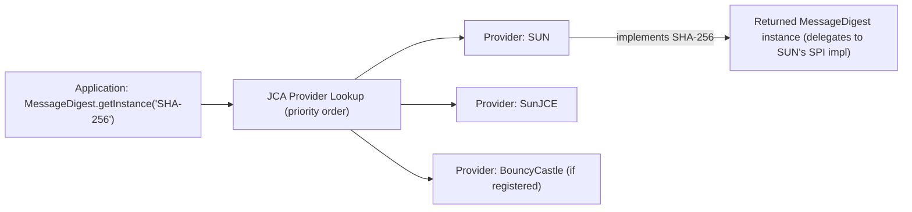
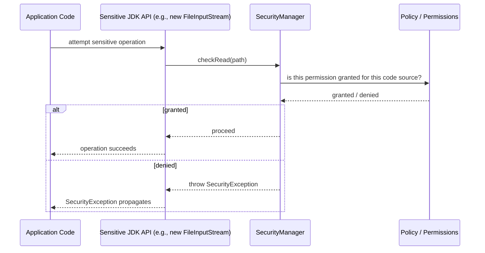

# 30. Security Basics *(new)*

## Java Cryptography Architecture (JCA/JCE)

### Theory

**Core Concepts**: The Java Cryptography Architecture (JCA) is Java's pluggable framework for cryptographic services (message digests, digital signatures, key generation, certificates), designed around a provider-based model where actual algorithm implementations are supplied by pluggable `Provider` classes (e.g., the built-in `SUN`, `SunJCE`, `SunEC` providers, or third-party ones like Bouncy Castle) rather than being hardcoded into the JDK. The Java Cryptography Extension (JCE) originally shipped as a separate, US-export-controlled extension providing encryption/decryption (`Cipher`), key agreement, and MAC algorithms; JCE has been fully merged into the core JDK since Java 1.4, though the JCA/JCE naming split persists in documentation and API package names (`javax.crypto` for JCE-originated APIs, `java.security` for JCA-originated ones).

**Internal Working**: Application code requests a cryptographic service by algorithm name (e.g., `MessageDigest.getInstance("SHA-256")`), and the JCA framework consults its registered, priority-ordered list of `Provider`s to find one implementing that algorithm, returning an engine-class instance (`MessageDigest`, `Cipher`, `Signature`, `KeyPairGenerator`, etc.) backed by that provider's concrete implementation — this indirection lets algorithm implementations be swapped, upgraded, or replaced (e.g., for FIPS compliance or hardware-acceleration) without any change to application code.

**When to Use It**: Any Java application needing cryptographic primitives — hashing, encryption/decryption, digital signatures, secure random number generation, key management — should use the JCA/JCE APIs rather than hand-rolling cryptography or depending directly on a specific provider's implementation classes.

**Advantages**: Provider abstraction allows algorithm agility (upgrading to stronger algorithms/providers without application code changes), a consistent standard API surface across very different underlying algorithm families, and supports pluggable hardware security module (HSM) or PKCS#11-backed providers transparently.

**Limitations**: The provider precedence/lookup mechanism can surprise developers if multiple providers register the same algorithm name with different behavior/security properties; algorithm name strings are loosely standardized (documented in the "Java Security Standard Algorithm Names" reference) and easy to typo, generally only caught at runtime (`NoSuchAlgorithmException`) rather than compile time; historical export-control restrictions (the old "unlimited strength jurisdiction policy files," required for AES-256 and similar strong algorithms pre-Java 9) are largely obsolete now (removed as a default restriction since Java 8u161/Java 9), but this history still surfaces in older documentation and legacy deployment guidance.

### Internal Working

**Step-by-Step Explanation**:
1. The JVM maintains an ordered list of registered `Provider` instances (configured via `java.security` policy file entries, or programmatically via `Security.addProvider()`), each advertising which algorithms/engine classes it implements.
2. `EngineClass.getInstance("AlgorithmName")` (the general JCA pattern used by `MessageDigest`, `Cipher`, `Signature`, `KeyPairGenerator`, `KeyStore`, `SecureRandom`, etc.) iterates providers in their configured priority order, returning the first one advertising support for the requested algorithm — or throwing `NoSuchAlgorithmException` if none do.
3. The returned engine object is a "front" object delegating to the selected provider's actual `SPI` (Service Provider Interface) implementation class (e.g., `MessageDigestSpi`) — application code interacts only with the standard engine class API, remaining unaware of which concrete provider/implementation is actually doing the work underneath.
4. An overload — `getInstance("AlgorithmName", "ProviderName")` — lets callers explicitly pin a specific provider rather than relying on priority-order lookup, important for reproducibility/compliance-sensitive code that must guarantee a specific, audited implementation is used.

**Memory Layout**: Not directly applicable — this is a service-discovery/API-design architecture concern, not a memory-layout one; provider registration data and loaded provider classes reside in ordinary heap/Metaspace like any other Java objects/classes.

**Diagrams**:


**JVM Behaviour**: Provider registration/lookup happens at the Java library level (not a special bytecode/JIT feature); however, some providers (notably ones wrapping native cryptographic libraries like OpenSSL via JNI, or hardware-accelerated providers) introduce native-code interaction, and modern JDKs also include JIT intrinsics for common cryptographic primitives (e.g., AES, SHA hashing) that can dramatically accelerate operations performed through the standard `Cipher`/`MessageDigest` APIs when backed by an intrinsic-eligible provider implementation, without requiring any application code changes.

### Interview Questions

**Basic**
1. What is the relationship between JCA and JCE in modern JDKs?
2. What design pattern underlies `MessageDigest.getInstance(...)`, `Cipher.getInstance(...)`, etc.?

**Intermediate**
1. What happens if two registered providers both implement the same algorithm name?
2. Why might you want to pin a specific provider explicitly rather than rely on default priority-based lookup?

**Advanced**
1. What were the old "unlimited strength jurisdiction policy" files, and why are they largely irrelevant on modern JDKs?

**Scenario-based**
1. Your application must be certified against a specific compliance standard requiring only FIPS-140-validated cryptographic implementations. How would you use the JCA provider model to enforce this?

### Detailed Answers

1. **JCA/JCE relationship today**: JCA is the overall pluggable cryptography framework (provider model, engine classes like `MessageDigest`/`Signature`/`KeyPairGenerator`). JCE originally referred specifically to the encryption/decryption/key-agreement/MAC portion (`Cipher`, `KeyAgreement`, `Mac` — `javax.crypto` package), historically distributed separately due to US export-control regulations on cryptographic software. Since Java 1.4, JCE has been fully bundled into the standard JDK, so in practice today "JCA/JCE" refers to one unified, integrated cryptography framework, with the naming distinction mostly a historical/package-naming artifact rather than a meaningful current architectural separation.

2. **Underlying design pattern**: The Abstract Factory / Service Provider pattern — `getInstance(algorithmName)` is a factory method that returns an appropriately-configured engine class instance without the caller needing to know or specify which concrete provider/implementation class is actually doing the work, exactly analogous to how `DriverManager.getConnection()` in JDBC abstracts over pluggable database drivers.

3. **Multiple providers, same algorithm**: The JCA consults providers in their configured priority order (as registered in the `java.security` configuration file or via `Security.insertProviderAt`/`addProvider`) and returns the implementation from the *first* provider in that order advertising support for the requested algorithm — later, lower-priority providers offering the same algorithm are simply not selected unless the higher-priority one is removed/unregistered or the caller explicitly requests a specific provider by name.

4. **Why explicitly pin a provider**: For compliance/audit reasons (e.g., needing a guaranteed FIPS-140-validated implementation rather than whatever happens to win default priority-ordering), for consistency across different JVM/deployment environments where provider registration order might differ, or to deliberately use a specific third-party provider (like Bouncy Castle) offering an algorithm or feature not present in the default JDK providers — `getInstance(algorithm, providerName)` (or the `Provider`-object overload) makes the choice explicit and independent of ambient configuration.

5. **Unlimited strength jurisdiction policy files (historical)**: Prior to Java 8u161 (and unconditionally from Java 9 onward), the JDK shipped with default cryptographic strength restrictions (e.g., capping AES key length effectively to 128 bits) due to US export-control regulations at the time the JDK was originally designed, requiring administrators to manually download and install separate "unlimited strength" policy jar files to enable full-strength algorithms like AES-256. This restriction was removed as the default (in favor of unlimited strength being the out-of-the-box default, with an opt-in mechanism to restrict if needed for regulatory reasons) once export-control rules relaxed sufficiently, making the old jurisdiction policy file installation step obsolete for modern JDK versions, though the history still appears in older tutorials/Stack Overflow answers that can mislead developers into unnecessary legacy workarounds.

6. **FIPS compliance scenario**: You would configure the JVM's provider list to include only FIPS-140-validated provider implementations (e.g., a FIPS-certified provider module, positioned at the top of the provider priority list, or exclusively registered while removing/not-registering non-validated providers), and additionally have application code explicitly request algorithms via the two-argument `getInstance(algorithm, providerName)` form pinned to that specific validated provider — combined with configuration-level enforcement (restricting `java.security` provider registration to only the approved provider) to prevent any accidental fallback to a non-compliant default provider, and with build/deployment-time verification (e.g., automated tests asserting `getInstance` calls resolve to the expected provider) to catch configuration drift.

### Code Examples

```java
import java.security.MessageDigest;
import java.security.NoSuchAlgorithmException;
import java.security.NoSuchProviderException;
import java.security.Provider;
import java.security.Security;

public class JcaProviderDemo {
    public static void main(String[] args) throws NoSuchAlgorithmException, NoSuchProviderException {
        // Inspect registered providers and their priority order
        for (Provider provider : Security.getProviders()) {
            System.out.println("Provider: " + provider.getName() + " v" + provider.getVersionStr());
        }

        // Default lookup: resolved via provider priority order
        MessageDigest defaultImpl = MessageDigest.getInstance("SHA-256");
        System.out.println("Resolved provider: " + defaultImpl.getProvider().getName());

        // Explicitly pinning a specific provider (useful for compliance/reproducibility)
        MessageDigest pinnedImpl = MessageDigest.getInstance("SHA-256", "SUN");
        System.out.println("Pinned provider: " + pinnedImpl.getProvider().getName());
    }
}
```

## `MessageDigest`, `Cipher`, `KeyPairGenerator`

### Theory

**Core Concepts**: These three JCA/JCE engine classes cover the three fundamental cryptographic primitive categories used in most applications: `MessageDigest` (one-way cryptographic hashing — SHA-256, SHA-3, etc.), `Cipher` (symmetric/asymmetric encryption and decryption — AES, RSA), and `KeyPairGenerator` (asymmetric key pair generation — RSA, EC, Ed25519). Each follows the same `getInstance(algorithm[, provider])` factory pattern described under JCA/JCE.

**Internal Working**: `MessageDigest.digest(bytes)` processes input through the algorithm's internal compression function (e.g., SHA-256's Merkle-Damgard construction) producing a fixed-length hash regardless of input size. `Cipher.init(mode, key[, params])` followed by `doFinal(bytes)` performs the actual encryption/decryption, requiring correct mode (`ENCRYPT_MODE`/`DECRYPT_MODE`), a properly-generated/derived `Key`, and (for most modern modes) an `AlgorithmParameterSpec` supplying an IV/nonce. `KeyPairGenerator.generateKeyPair()` produces a `PublicKey`/`PrivateKey` pair using the configured algorithm and key size/parameters, backed by a `SecureRandom` source of randomness.

**When to Use It**: `MessageDigest` for integrity verification (checksums, deduplication keys) — never for password storage (see Secure Coding Practices); `Cipher` for confidentiality of data at rest or in transit when a higher-level protocol (TLS) isn't already handling it; `KeyPairGenerator` for generating keys for asymmetric encryption, digital signatures, or key exchange (e.g., generating a service's TLS certificate key pair, or per-session ephemeral keys for forward secrecy).

**Advantages**: Standardized, well-audited implementations of complex cryptographic algorithms that would be extremely risky to hand-implement; consistent API shape across wildly different underlying algorithms, easing algorithm migration.

**Limitations**: `MessageDigest` alone (e.g., raw SHA-256) is unsuitable for password hashing since it's deliberately fast (vulnerable to brute-force/rainbow-table attacks) — dedicated slow, salted KDFs (bcrypt, scrypt, Argon2, PBKDF2) are required instead; `Cipher` usage is a major footgun source — using ECB mode, static/predictable IVs, or unauthenticated encryption modes (plain CBC without a MAC) are all common, serious real-world vulnerabilities; `KeyPairGenerator` requires careful, algorithm-appropriate key-size selection (e.g., RSA keys below 2048 bits are considered weak by modern standards) and a properly-seeded `SecureRandom`.

### Internal Working

**Step-by-Step Explanation**:
1. `MessageDigest md = MessageDigest.getInstance("SHA-256"); byte[] hash = md.digest(input);` — internally, the digest algorithm processes the input in fixed-size blocks through its compression function, maintaining and updating internal state, finally producing a fixed-length output (32 bytes for SHA-256) regardless of input length — a core property (fixed-length output, computationally infeasible to invert or find collisions) that makes it suitable for integrity checks but not confidentiality.
2. `Cipher cipher = Cipher.getInstance("AES/GCM/NoPadding"); cipher.init(Cipher.ENCRYPT_MODE, secretKey, gcmParameterSpec); byte[] ciphertext = cipher.doFinal(plaintext);` — the transformation string (`Algorithm/Mode/Padding`) determines the exact cryptographic construction used; GCM mode specifically provides authenticated encryption (confidentiality plus integrity/tamper-detection via an authentication tag appended to the ciphertext), a modern best-practice choice over legacy unauthenticated modes like plain CBC.
3. `KeyPairGenerator kpg = KeyPairGenerator.getInstance("RSA"); kpg.initialize(2048); KeyPair pair = kpg.generateKeyPair();` — internally generates two large primes (for RSA) satisfying the algorithm's mathematical requirements, deriving the public/private key components from them, using the JVM's configured `SecureRandom` implementation as its entropy source (critical: a weak/predictable random source would catastrophically compromise the generated keys' security).
4. All three ultimately delegate to the selected provider's concrete `SPI` implementation (e.g., `MessageDigestSpi`, `CipherSpi`, `KeyPairGeneratorSpi`), which does the actual algorithmic computation, potentially leveraging JIT intrinsics or native/hardware acceleration (AES-NI CPU instructions, for example) transparently.

**Memory Layout**: Not directly applicable at the JVM memory-layout level beyond ordinary object/array allocation for keys, IVs, and buffers; however, a genuine security concern is that sensitive byte arrays (keys, plaintext) remain in heap memory for an indeterminate duration until garbage collected/overwritten, motivating explicit zeroing of sensitive arrays (e.g., via `Arrays.fill`) as soon as they're no longer needed, similar to the password-`char[]` guidance discussed under Strings/Immutability.

**Diagrams**:
```
MessageDigest:  input (any length) -> [compression function, fixed rounds] -> fixed-length hash (e.g., 32 bytes)

Cipher (AES/GCM):  plaintext + key + IV -> [AES-GCM authenticated encryption] -> ciphertext + auth tag

KeyPairGenerator (RSA): SecureRandom entropy -> [prime generation + key derivation] -> (PublicKey, PrivateKey)
```

**JVM Behaviour**: Modern JVMs (via HotSpot intrinsics) recognize and specially optimize common cryptographic primitives — AES encryption/decryption (leveraging AES-NI hardware instructions when available), SHA-family hashing, and certain big-integer/modular-exponentiation operations underlying RSA — meaning these `javax.crypto`/`java.security` API calls can execute dramatically faster than a naive JIT-compiled pure-Java implementation of the same algorithm would, without any application-level code changes required to benefit.

### Interview Questions

**Basic**
1. What's the fundamental difference between `MessageDigest` and `Cipher`?
2. Why shouldn't you use raw `MessageDigest` (e.g., plain SHA-256) to store user passwords?

**Intermediate**
1. Why is AES/GCM generally preferred over AES/CBC for new applications?
2. What role does `SecureRandom` play in `KeyPairGenerator`, and why does its quality matter so much?

**Advanced**
1. What specific vulnerability arises from reusing the same IV/nonce with the same key in AES/GCM, and why is it so severe?

**Scenario-based**
1. A code review finds `Cipher.getInstance("AES/ECB/PKCS5Padding")` being used to encrypt user records. Explain why this is a serious vulnerability and what to use instead.

### Detailed Answers

1. **`MessageDigest` vs `Cipher`**: `MessageDigest` is a one-way, non-invertible transformation producing a fixed-length fingerprint of arbitrary input, used for integrity verification (detecting tampering/corruption) — there is no way to recover the original input from the digest. `Cipher` performs reversible encryption/decryption, transforming plaintext into ciphertext (and back, given the correct key) to provide confidentiality — fundamentally different security properties for fundamentally different purposes, and neither is a substitute for the other.

2. **Why not raw SHA-256 for passwords**: General-purpose cryptographic hash functions like SHA-256 are deliberately designed to be *fast* (a design goal for their intended integrity-check use cases), which is precisely the wrong property for password storage — an attacker with access to leaked hashes can perform billions of guesses per second against fast hashes using commodity GPU hardware, making brute-force/dictionary/rainbow-table attacks highly effective. Purpose-built password hashing functions (bcrypt, scrypt, Argon2, or at minimum salted PBKDF2 with a high iteration count) are deliberately slow and often memory-hard, making large-scale brute-force attacks computationally and financially impractical even against leaked hash databases.

3. **Why AES/GCM over AES/CBC**: GCM (Galois/Counter Mode) provides *authenticated* encryption — it produces an authentication tag alongside the ciphertext that lets the receiver cryptographically verify the ciphertext hasn't been tampered with, detecting any modification before decryption even proceeds. Plain CBC mode provides confidentiality only, with no built-in integrity/authenticity check — an attacker can flip bits in CBC ciphertext to predictably corrupt/manipulate the decrypted plaintext (a padding-oracle or bit-flipping attack vector), and applications using unauthenticated CBC must manually add a separate MAC (correctly, in an encrypt-then-MAC construction) to achieve equivalent security, which is easy to get wrong — GCM bundles this correctly and efficiently by design, making it the modern recommended default for symmetric encryption.

4. **`SecureRandom`'s role and importance**: `KeyPairGenerator` relies on `SecureRandom` as its entropy source for generating the random values (e.g., candidate primes for RSA) underlying key generation — if the random source is weak, predictable, or insufficiently seeded (a `java.util.Random` instance, for instance, uses a simple linear congruential generator entirely unsuitable for cryptographic use, and even a poorly-seeded `SecureRandom` can be dangerous on certain platforms/environments with limited entropy, like some embedded/container environments at boot time), an attacker who can predict or narrow down the randomness used could feasibly reconstruct the generated private key, completely compromising the cryptography regardless of how strong the chosen algorithm/key-size otherwise is — this is a real, historically-exploited class of vulnerability (e.g., the widely-cited Debian OpenSSL weak-randomness incident, and various embedded-device key-generation weaknesses).

5. **IV/nonce reuse vulnerability in AES/GCM**: Reusing the same (key, IV) pair for two different plaintexts in GCM catastrophically breaks its security guarantees — GCM's authentication mechanism relies on a keystream derived deterministically from the key and IV; if the same keystream is reused for two messages, an attacker can XOR the two ciphertexts together to cancel out the keystream and recover the XOR of the two plaintexts (from which, with any partial knowledge of one plaintext, the other can often be substantially or fully recovered), and worse, IV reuse in GCM specifically can allow an attacker to forge the authentication tag for *other* messages under that same key, completely defeating the integrity guarantee as well — this makes IV/nonce management (always generating a fresh, non-repeating IV per encryption operation with a given key, per algorithm-specific guidance) one of the single most critical correctness requirements when using GCM.

6. **AES/ECB code review scenario**: ECB (Electronic Codebook) mode encrypts each fixed-size block of plaintext completely independently with no chaining/randomization between blocks — this means identical plaintext blocks always produce identical ciphertext blocks, which visibly leaks structural patterns in the underlying data (the classic illustrative example being an ECB-encrypted bitmap image where the outline of the original image remains visibly discernible in the "encrypted" output) and, more generally, exposes any repeated-block structure in arbitrary encrypted data (e.g., repeated field values across records), which is a serious confidentiality vulnerability. The fix is to replace it with an authenticated mode like AES/GCM (with a properly-managed, unique IV per encryption), which chains/randomizes block encryption so identical plaintext blocks produce different ciphertext, while also providing integrity/authenticity guarantees ECB entirely lacks.

### Code Examples

```java
import javax.crypto.Cipher;
import javax.crypto.KeyGenerator;
import javax.crypto.SecretKey;
import javax.crypto.spec.GCMParameterSpec;
import java.security.KeyPair;
import java.security.KeyPairGenerator;
import java.security.MessageDigest;
import java.security.SecureRandom;

public class CryptoPrimitivesDemo {
    public static void main(String[] args) throws Exception {
        // MessageDigest: integrity checksum, NOT suitable for password storage
        MessageDigest sha256 = MessageDigest.getInstance("SHA-256");
        byte[] checksum = sha256.digest("important-document-contents".getBytes());
        System.out.println("SHA-256 checksum length: " + checksum.length + " bytes");

        // Cipher: authenticated symmetric encryption with AES/GCM
        KeyGenerator keyGen = KeyGenerator.getInstance("AES");
        keyGen.init(256);
        SecretKey secretKey = keyGen.generateKey();

        byte[] iv = new byte[12]; // 96-bit IV, standard for GCM
        SecureRandom.getInstanceStrong().nextBytes(iv); // fresh IV per encryption — never reuse with same key

        Cipher cipher = Cipher.getInstance("AES/GCM/NoPadding");
        cipher.init(Cipher.ENCRYPT_MODE, secretKey, new GCMParameterSpec(128, iv));
        byte[] ciphertext = cipher.doFinal("sensitive account data".getBytes());
        System.out.println("Ciphertext length (includes auth tag): " + ciphertext.length);

        // Decrypt using the same key and IV
        Cipher decryptCipher = Cipher.getInstance("AES/GCM/NoPadding");
        decryptCipher.init(Cipher.DECRYPT_MODE, secretKey, new GCMParameterSpec(128, iv));
        byte[] decrypted = decryptCipher.doFinal(ciphertext);
        System.out.println("Decrypted: " + new String(decrypted));

        // KeyPairGenerator: asymmetric key generation with adequate key size
        KeyPairGenerator rsaGen = KeyPairGenerator.getInstance("RSA");
        rsaGen.initialize(2048); // 2048-bit minimum for modern RSA security
        KeyPair keyPair = rsaGen.generateKeyPair();
        System.out.println("Generated RSA key pair, public key algorithm: "
                + keyPair.getPublic().getAlgorithm());
    }
}
```

## Secure Coding Practices (OWASP Top 10 for Java)

### Theory

**Core Concepts**: Secure coding practices apply the OWASP Top 10 (a regularly-updated industry-standard list of the most critical web application security risks) specifically to Java application development — covering injection flaws (SQL, LDAP, OS command), broken access control, cryptographic failures, insecure deserialization, security misconfiguration, vulnerable/outdated dependencies, and insufficient logging/monitoring, among others.

**Internal Working**: Most of these vulnerability classes stem from trusting or directly interpolating untrusted input into a context where it can alter intended program behavior (SQL query structure, OS command structure, deserialization object-graph construction, template rendering) — Java-specific mitigations rely heavily on the standard library's parameterized/safe APIs (`PreparedStatement`, `ProcessBuilder` with explicit argument arrays, allow-list-based deserialization filters) to structurally prevent the untrusted input from being interpreted as code/control-structure rather than pure data.

**When to Use It**: Every Java application handling any external input — HTTP request parameters, file uploads, database content originally sourced externally, deserialized objects from any not-fully-trusted source, third-party library dependencies — should apply these practices as standard, non-optional engineering discipline, not an optional "hardening" afterthought.

**Advantages**: Systematically eliminates entire vulnerability classes rather than attempting to sanitize/blacklist dangerous input patterns (an approach with a long history of being incomplete/bypassable); aligns application security posture with a widely recognized, regularly updated industry standard, useful for audits/compliance and shared vocabulary across security teams.

**Limitations**: Secure coding practices reduce but don't eliminate all risk (defense-in-depth, including network segmentation, WAFs, and monitoring, remains necessary); some mitigations have real performance or development-friction costs (e.g., deserialization allow-listing requires upfront design and ongoing maintenance as the set of legitimately-deserializable types evolves); staying current requires ongoing attention since both the OWASP list and the broader threat landscape evolve over time (e.g., insecure deserialization's prominence rose sharply following widespread real-world exploitation of Java deserialization gadget chains).

### Internal Working

**Step-by-Step Explanation** (illustrating core mitigation patterns per major risk category):
1. **SQL Injection**: Untrusted input concatenated directly into a SQL query string lets an attacker alter the query's actual structure (e.g., appending `' OR '1'='1`). The mitigation is `PreparedStatement` with parameterized placeholders (`?`), which sends the query structure and the parameter values to the database *separately* — the database driver never re-parses parameter values as SQL syntax, structurally preventing injection regardless of what characters the input contains.
2. **Insecure Deserialization**: Java's native serialization (`ObjectInputStream.readObject()`) reconstructs arbitrary object graphs purely from the byte stream's embedded class names and field data — if an attacker controls this byte stream, they can potentially instantiate arbitrary classes present on the classpath, and certain "gadget chain" combinations of otherwise-innocuous classes' `readObject`/finalizer/other methods can be chained to achieve remote code execution purely through the deserialization process itself, without the attacker exploiting any traditional bug at all. Mitigation: avoid deserializing untrusted data entirely where possible (prefer safer, less powerful data formats like JSON with a schema-validated, non-polymorphic deserializer); where native serialization of untrusted data is unavoidable, use `ObjectInputFilter` (Java 9+, retrofitted to 8u121+) to enforce an explicit allow-list of permitted classes, rejecting deserialization of anything not on the list before object construction proceeds.
3. **OS Command Injection**: Building a shell command string by concatenating untrusted input (e.g., `Runtime.exec("ping " + userInput)`) lets an attacker inject shell metacharacters to execute arbitrary additional commands. Mitigation: use `ProcessBuilder` with an explicit `String...` argument array (never a single shell-interpreted command string), which passes each argument directly to the OS process-creation call without any shell interpretation step, so metacharacters in the input are treated as literal argument content, not command syntax.
4. **Broken Access Control**: Failing to enforce authorization checks consistently (e.g., checking authorization only in a UI layer, not the underlying API/service layer, or relying on a client-supplied/unverified identifier to select which resource to return) lets attackers access or modify resources they shouldn't. Mitigation: enforce authorization checks at the actual data/service access layer (not just the presentation layer), using server-side session/context-derived identity (never trusting client-supplied user/role identifiers directly).

**Memory Layout**: Not directly applicable — these are input-validation/API-usage-pattern concerns rather than memory-layout concerns, though insecure deserialization specifically does interact with the JVM's object-construction and classloading machinery in ways relevant to the "Dynamic Object Creation"/reflection topics covered elsewhere.

**Diagrams**:
```
SQL Injection prevention:
  Vulnerable:  "SELECT * FROM users WHERE name = '" + input + "'"   <- input can alter query structure
  Safe:        "SELECT * FROM users WHERE name = ?"  + PreparedStatement.setString(1, input)
                                                          ^ value sent separately, never reparsed as SQL

Deserialization allow-list:
  ObjectInputStream -> ObjectInputFilter (checks each class against allow-list) -> reject or proceed
```

**JVM Behaviour**: `ObjectInputFilter` hooks directly into `ObjectInputStream`'s class-resolution process during deserialization, intercepting each candidate class *before* the JVM proceeds to instantiate/populate it — meaning a properly configured filter can reject a malicious gadget-chain class before any of its potentially-dangerous `readObject`/constructor logic ever executes, cutting off the attack at the earliest possible point in the object-reconstruction process.

### Interview Questions

**Basic**
1. Why does `PreparedStatement` prevent SQL injection while string concatenation doesn't?
2. What Java API should you use instead of `Runtime.exec(String)` with concatenated user input to avoid command injection?

**Intermediate**
1. What is a Java deserialization "gadget chain," and why is it dangerous even without any traditional memory-corruption-style bug?
2. What is `ObjectInputFilter`, and how does it mitigate insecure deserialization risk?

**Advanced**
1. Why is "broken access control" often considered more dangerous in practice than injection flaws, despite injection historically receiving more attention?

**Scenario-based**
1. Your application deserializes session data (using Java native serialization) originally created by the same application, but the session store is a shared Redis instance also writable by other, less-trusted internal services. What's the risk, and how would you mitigate it?

### Detailed Answers

1. **Why `PreparedStatement` prevents injection**: It separates the SQL query's structure (sent to the database once, with placeholder markers) from the parameter values (sent separately, out-of-band from the query text) — the database driver/engine never re-parses the supplied parameter values as SQL syntax at all, so no matter what characters (quotes, semicolons, SQL keywords) an attacker includes in the input, they're always treated purely as literal data for that parameter, structurally incapable of altering the query's logic; string concatenation, by contrast, builds the entire query text (structure and data mixed together) before the database ever sees it, so malicious syntax embedded in the input becomes indistinguishable from the developer's intended query structure.

2. **Command injection mitigation**: `ProcessBuilder`, constructed with an explicit list/array of separate argument strings (`new ProcessBuilder("ping", userInput)`) rather than one single shell-command string — this passes each argument directly to the OS's process-creation system call without any shell parsing/interpretation step in between, so shell metacharacters (`;`, `|`, `` ` ``, `&&`) embedded in `userInput` are passed through as literal argument content rather than being interpreted as command-chaining/piping syntax.

3. **Gadget chains explained**: A "gadget chain" is a sequence of otherwise entirely legitimate, unrelated classes already present on an application's classpath (often from common third-party libraries) whose `readObject`, `finalize`, `hashCode`, or other methods — when triggered in a specific combination and order purely as a side effect of deserializing a specially crafted object graph — can be chained together to ultimately achieve an attacker's goal (commonly, arbitrary remote code execution), without any of the individual classes containing a traditional "bug" in isolation. This is dangerous precisely because it doesn't require exploiting any memory-corruption-style vulnerability at all — it exploits the inherent power and flexibility of Java's native deserialization mechanism (which can reconstruct arbitrary object graphs and invoke arbitrary constructors/methods as part of that reconstruction) against an application that naively deserializes untrusted byte streams, even if every individual library involved is otherwise perfectly well-written and bug-free in normal usage.

4. **`ObjectInputFilter` mechanism**: Introduced in Java 9 (and backported to 8u121+), it lets an application register a filter function invoked by `ObjectInputStream` for every class encountered during deserialization, *before* that class is actually instantiated/populated — the filter can inspect the candidate class (and other context like array length, graph depth, reference counts) and explicitly allow or reject it. By configuring an allow-list of only the specific, expected classes the application legitimately needs to deserialize (rejecting everything else by default), this closes off the gadget-chain attack surface at its root, since a malicious gadget class not on the allow-list is rejected before any of its potentially-dangerous logic can execute during the deserialization process.

5. **Why broken access control is often more dangerous in practice**: While injection flaws are well-understood and increasingly mitigated by mature frameworks/ORMs that default to safe, parameterized query construction, access control logic is inherently application-specific business logic that frameworks generally cannot fully automate or verify — every application has a unique set of authorization rules that must be correctly and consistently implemented and enforced at every relevant access point (not just a subset), making it structurally easier to have gaps/inconsistencies (an endpoint that forgets an authorization check, a client-controllable ID parameter naively trusted without ownership verification) than for well-established injection defenses to be entirely missing. This has led OWASP's own data-driven Top 10 rankings to increasingly rank broken access control as the most prevalent/impactful real-world vulnerability category in recent years, ahead of classic injection.

6. **Shared Redis deserialization scenario**: The risk is that any less-trusted internal service with write access to the same Redis instance could inject a malicious serialized byte stream into a key the application later reads and deserializes via `ObjectInputStream.readObject()` — if that malicious payload constitutes (or references) a known gadget chain reachable from the application's classpath, deserializing it could lead to remote code execution entirely within the trusted application's process, even though the application's own code and the session data it originally wrote were never compromised. Mitigations include: switching to a safer serialization format not vulnerable to gadget-chain attacks (e.g., JSON with a schema/type-restricted deserializer, or a binary format like Protocol Buffers that doesn't support arbitrary polymorphic object reconstruction); if native Java serialization must be retained, configuring a strict `ObjectInputFilter` allow-list scoped to exactly the expected session-data classes; and, as defense-in-depth, restricting the shared Redis instance's access controls so other internal services cannot write to keys/namespaces the trusted application deserializes from.

### Code Examples

```java
import java.io.*;
import java.sql.Connection;
import java.sql.PreparedStatement;
import java.sql.SQLException;

public class SecureCodingDemo {

    // SQL injection prevention via PreparedStatement (never string-concatenate user input into SQL)
    static void findUserSafely(Connection conn, String username) throws SQLException {
        String sql = "SELECT id, email FROM users WHERE username = ?";
        try (PreparedStatement stmt = conn.prepareStatement(sql)) {
            stmt.setString(1, username); // value sent separately, never reparsed as SQL syntax
            stmt.executeQuery();
        }
    }

    // Command injection prevention via ProcessBuilder with a separate argument array
    static void pingHostSafely(String host) throws IOException {
        // Never build a single shell string like "ping " + host — pass arguments separately
        ProcessBuilder pb = new ProcessBuilder("ping", "-c", "1", host);
        pb.start();
    }

    // Deserialization allow-listing via ObjectInputFilter (Java 9+)
    static Object deserializeWithAllowList(byte[] data) throws IOException, ClassNotFoundException {
        try (ObjectInputStream ois = new ObjectInputStream(new ByteArrayInputStream(data))) {
            ois.setObjectInputFilter(filterInfo -> {
                Class<?> clazz = filterInfo.serialClass();
                if (clazz == null || clazz == java.util.HashMap.class || clazz == String.class) {
                    return ObjectInputFilter.Status.ALLOWED;
                }
                return ObjectInputFilter.Status.REJECTED; // reject anything not explicitly allow-listed
            });
            return ois.readObject();
        }
    }
}
```

## Deprecated Security Manager

### Theory

**Core Concepts**: The Java Security Manager (`java.lang.SecurityManager`, together with the policy-file-based permission model) was Java's original built-in sandboxing mechanism, allowing fine-grained, code-source-based restriction of sensitive operations (file I/O, network access, reflection, system property access, `System.exit`, etc.) — historically central to the Java applet/Web Start sandboxing model. It was formally deprecated for removal in Java 17 (JEP 411) and is a strong candidate for actual removal in a future JDK release, reflecting both its declining real-world usage and its inherent design/performance limitations.

**Internal Working**: When enabled (via `-Djava.security.manager` or programmatically installing a `SecurityManager`), every security-sensitive JDK API call (file access, socket creation, `Class.forName`, etc.) invokes a corresponding `checkXxx()` method on the installed `SecurityManager`, which consults the active `Policy` (typically driven by policy files granting `Permission`s based on code source/signer) to allow or throw `SecurityException` — this check happens on essentially every sensitive operation throughout the call stack, walking the call stack to determine the full chain of code sources involved (`AccessController.doPrivileged` sections notwithstanding).

**When to Use It (historically)**: Sandboxing untrusted or semi-trusted code within the same JVM process as trusted code (browser applets, plugin systems, multi-tenant script execution) — a use case that has largely evaporated with the death of applets/Web Start and the shift toward process-level or container-level isolation for untrusted code instead.

**Advantages (historically)**: Fine-grained, in-process permission control without needing separate OS processes; flexible, code-source-based (not just user-based) permission granting.

**Limitations (which drove its deprecation)**: Substantial per-call performance overhead (the pervasive `checkXxx()`/stack-walking checks on security-sensitive operations measurably slow down affected code paths); the JEP 411 deprecation rationale specifically notes it's rarely used for its original sandboxing purpose today (untrusted-code-in-JVM scenarios are rare — most isolation happens at the OS/container/process level now) while still being maintained/used by some applications purely as a general-purpose "permission check" mechanism unrelated to true sandboxing, a role better served by dedicated authorization frameworks; its complexity (policy files, permission classes, protection domains) creates a large, hard-to-fully-secure attack surface for relatively little remaining real-world sandboxing benefit; several other JDK features and third-party tools depended on the Security Manager in ways that complicate its removal, leading to its "deprecated for removal" (rather than immediately removed) status starting in Java 17, giving the ecosystem time to migrate away.

### Internal Working

**Step-by-Step Explanation**:
1. `System.setSecurityManager(new SecurityManager())` (or the `-Djava.security.manager` launch flag) installs an active security manager for the JVM.
2. Every security-sensitive JDK method (e.g., `FileInputStream`'s constructor, `Socket`'s constructor, `System.exit`) internally calls a corresponding check (e.g., `SecurityManager.checkRead`, `checkConnect`, `checkExit`) before proceeding with the actual operation.
3. The installed `SecurityManager` consults the currently active `Policy` object, which maps code sources (and optionally, code signers) to granted `Permission`s, as configured in policy files (or, since Java 9's default sandboxing changes, JDK-internal defaults) — if the required permission isn't granted for the calling code's protection domain, `checkXxx()` throws `SecurityException`, aborting the operation before it takes effect.
4. This check inherently requires walking the call stack (to determine the full chain of code sources involved in the current operation, since a privileged, trusted class might be calling on behalf of a less-trusted caller, requiring `AccessController.doPrivileged` blocks to explicitly and deliberately narrow the check to just the immediately privileged code's permissions) — this stack-walking is the primary source of the mechanism's runtime performance overhead.

**Memory Layout**: Not directly applicable — this is a security-check/API-design mechanism, not a memory-layout concern, though the stack-walking involved in permission checks does have real (if typically modest per-call) CPU overhead proportional to call-stack depth.

**Diagrams**:


**JVM Behaviour**: With no `SecurityManager` installed (the overwhelmingly common case in modern applications, and the only supported state going forward per JEP 411's deprecation), all these `checkXxx()` call sites are effectively no-ops (a quick null-check on the installed manager), so the deprecation/eventual removal primarily affects applications that actively installed and relied on a custom `SecurityManager`/policy configuration — for the vast majority of applications that never used it, its deprecation has no practical runtime impact at all.

### Interview Questions

**Basic**
1. What was the original primary use case for the Java Security Manager?
2. What JEP formally deprecated the Security Manager for removal, and in which Java version?

**Intermediate**
1. Why did the Security Manager's real-world usage decline so significantly over time?
2. What's the performance concern associated with having a Security Manager installed and active?

**Advanced**
1. What are applications that still rely on the Security Manager (for reasons other than true sandboxing) generally expected to migrate to instead?

**Scenario-based**
1. Your legacy enterprise application installs a custom `SecurityManager` purely to prevent certain internal modules from calling `System.exit()` accidentally. Given the deprecation, what alternative approach would you recommend?

### Detailed Answers

1. **Original primary use case**: Sandboxing untrusted or partially-trusted code running within the same JVM process as trusted code — most famously, Java applets running in a web browser, where the browser's JVM needed to prevent applet code from performing dangerous operations (arbitrary file access, opening arbitrary network connections, etc.) while still allowing the applet to run application logic within tightly controlled bounds, all enforced in-process via the Security Manager's permission-check mechanism.

2. **Deprecation JEP and version**: JEP 411 ("Deprecate the Security Manager for Removal"), part of Java 17 — it marked the Security Manager and its supporting APIs as deprecated for removal, signaling intent to remove the feature entirely in a future release, while giving the ecosystem an extended transition period to migrate away from dependence on it.

3. **Why usage declined**: The applet/Web Start ecosystem that was the Security Manager's primary original use case has essentially disappeared (browsers dropped plugin/applet support entirely); modern approaches to running untrusted code favor OS-level or container-level isolation (separate processes, containers, VMs) rather than in-process JVM sandboxing, which is both simpler to reason about and doesn't carry the same performance overhead; and many remaining Security Manager users were actually using it for general-purpose permission/authorization checks unrelated to genuine sandboxing of untrusted code, a use case better served by dedicated, purpose-built authorization frameworks rather than repurposing a security-sandboxing mechanism.

4. **Performance concern**: Every security-sensitive JDK operation, when a Security Manager is installed, incurs the overhead of a permission check, often requiring a stack walk to determine the full chain of code sources/protection domains involved in the current call — this adds measurable per-call latency to operations like file I/O, network access, and reflection throughout the application (and any libraries it uses), a cost that scales with how frequently such sensitive operations occur and how deep the relevant call stacks are, motivating many performance-sensitive applications to avoid installing a Security Manager even when it was still fully supported.

5. **Migration expectations for non-sandboxing usage**: Applications using the Security Manager purely for general permission/authorization enforcement (not genuine untrusted-code sandboxing) are generally expected to migrate to purpose-built application-level authorization frameworks/libraries (e.g., role-based or attribute-based access control implemented at the application/service layer) that directly express and enforce the specific business authorization rules needed, rather than continuing to repurpose a JVM-wide, code-source-based sandboxing mechanism that was never designed for that use case and is being phased out.

6. **Legacy `System.exit()` prevention scenario**: Since the actual need here isn't genuine sandboxing of untrusted code but simply preventing an internal accidental/unauthorized call to `System.exit()`, a reasonable modern alternative is to enforce this at the application-architecture level instead — for instance, wrapping any legitimate shutdown logic behind a dedicated, explicitly-authorized application service/method that the few sanctioned call sites use (with code review/static analysis, such as a custom ArchUnit rule or similar, enforcing that no other code calls `System.exit()` directly), rather than relying on a deprecated, soon-to-be-removed JVM-wide security mechanism for what is fundamentally an internal code-discipline/architecture concern rather than a true security boundary against untrusted code.

### Code Examples

```java
public class SecurityManagerDemo {
    // Illustrative only: SecurityManager is deprecated for removal since Java 17 (JEP 411)
    // and should not be relied upon in new code. Shown here purely for historical understanding.

    @SuppressWarnings("removal") // acknowledges use of a deprecated-for-removal API
    public static void main(String[] args) {
        // Historical pattern: install a custom SecurityManager to restrict operations
        // System.setSecurityManager(new SecurityManager()); // deprecated, avoid in new code

        // Modern alternative for preventing unauthorized System.exit() calls:
        // enforce via application architecture / code review rather than a JVM-wide sandbox.
        ShutdownGuard.requestShutdown("scheduled-maintenance");
    }

    static class ShutdownGuard {
        // Single, sanctioned entry point for shutdown — enforced via code convention/review
        // (e.g., an architecture test asserting no other code calls System.exit directly).
        static void requestShutdown(String reason) {
            System.out.println("Authorized shutdown requested: " + reason);
            // In real code: perform graceful shutdown hooks/cleanup here before exiting.
        }
    }
}
```
