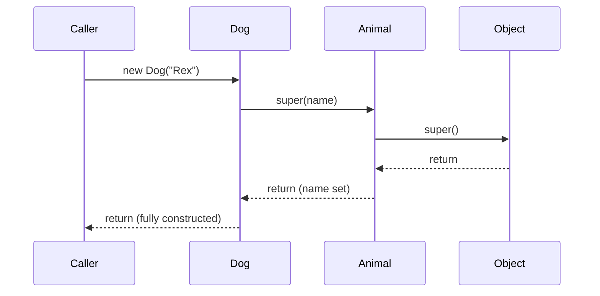

# 4. Constructors

## Default Constructor

**Theory**

- **Core Concepts**: A default constructor is a no-argument constructor automatically synthesized by the Java compiler *only if* the class defines no constructors at all. It contains a single implicit statement: a call to the no-arg superclass constructor (`super()`), followed by nothing else — it does not initialize fields beyond their default zero/null values (which happens independently during instance creation).
- **Internal Working**: Inserted by `javac` at compile time directly into the generated `.class` file's constant pool/method table if and only if the source declares zero constructors; the moment you add any constructor (even a parameterized one), the compiler stops auto-generating this default, and you must add a no-arg one yourself if still needed.
- **When to Use It**: Simple data classes, POJOs, or framework-driven classes (e.g., JavaBeans, JPA entities) that require a no-arg constructor for reflective instantiation, and where no explicit constructor logic is needed.
- **Advantages**: Zero boilerplate; guarantees every class is at least trivially instantiable; ensures the superclass chain's no-arg constructor always runs.
- **Limitations**: Only generated when there are no other constructors; provides no way to enforce mandatory field initialization or validation; silently disappears as soon as any other constructor is added, a common source of "no default constructor found" compile errors when frameworks expect one.

**Internal Working**

- **Step-by-Step Explanation**: (1) `javac` scans the class body for constructor declarations. (2) If none exist, it synthesizes a public (or same-access-as-class) no-arg constructor with access matching the class's own access level. (3) That constructor's body is exactly `super();` — delegating to the direct superclass's no-arg constructor (compile error if the superclass has no accessible no-arg constructor and doesn't declare one implicitly either). (4) At the bytecode level this appears as an `<init>()V` method containing `aload_0`, `invokespecial Object.<init>` (or the actual superclass), then `return`.
- **Memory Layout**: Object allocation happens on the heap before any constructor runs (`new` bytecode instruction allocates zeroed memory sized per the object's header + field layout); the default constructor itself performs no additional field initialization beyond the JVM's automatic zeroing (numeric fields to `0`/`0.0`, booleans to `false`, references to `null`) that occurs for every object regardless of constructor.
- **Diagrams**:
```text
new Foo()
   │
   ▼
[JVM: allocate zeroed memory on heap, size = header + fields]
   │
   ▼
[Foo.<init>()V executes: aload_0; invokespecial Object.<init>; return]
   │
   ▼
[reference to fully constructed object returned to caller]
```
- **JVM Behaviour**: The `new` bytecode instruction allocates and zeroes memory; the following `invokespecial <init>` call actually runs constructor logic. Since the default constructor body is trivial (just `super()`), the JIT can inline/eliminate it entirely in hot allocation paths once escape analysis proves the object doesn't escape (enabling scalar replacement).

**Interview Questions**

*Basic*
1. When does the Java compiler generate a default constructor?
2. What access modifier does the compiler give the default constructor?

*Intermediate*
3. If you add a parameterized constructor to a class, does the default no-arg constructor still exist? What's the practical consequence?
4. What does the default constructor's body actually contain?

*Advanced*
5. What happens if a superclass has no accessible no-arg constructor and a subclass relies on the compiler-generated default constructor?
6. How do frameworks like Hibernate/JPA rely on a no-arg constructor, and why might they require it to be `protected` rather than `private`?

*Scenario-based*
7. You added a constructor taking a `String` parameter to a class, and now a serialization/reflection-based framework fails with "no default constructor." How do you fix it correctly?

**Detailed Answers**

1. Only when the class declares *no* constructors whatsoever — the moment even one explicit constructor (of any arity) is present, the compiler does not add a default one.
2. It matches the access level of the class itself: a `public class` gets a `public` default constructor, a package-private class gets a package-private one, etc. (Note: enums are a special case — their implicit/default constructors are always `private`.)
3. No, it disappears — the compiler's default constructor synthesis rule is strictly "generate one only if zero are declared." Practically, any code (or framework) relying on `new Foo()` will now fail to compile/run unless you explicitly add a no-arg constructor yourself alongside the parameterized one.
4. Exactly one statement: an implicit call to the superclass's no-argument constructor, `super()` (or `Object`'s constructor if there's no explicit superclass). It does not set any field values beyond the JVM's automatic default zeroing of all fields during allocation.
5. Compile error — "there is no default constructor available in [Superclass]" — because the compiler cannot insert an implicit `super()` call if the superclass doesn't have a matching no-arg constructor (and hasn't defined one, whether default or explicit). The subclass must then explicitly call an existing superclass constructor via `super(args...)` in its own constructor.
6. ORMs like Hibernate instantiate entities via reflection (often bypassing normal `new` semantics using `Unsafe`/constructor reflection) to build proxies and populate fields directly, so they require a no-arg constructor to exist for that instantiation step. It's often recommended `protected` rather than `public` so that application code doesn't accidentally use the framework-only no-arg constructor to create invalid, uninitialized entities directly, while reflection (which can access non-public constructors via `setAccessible(true)`) still works.
7. Explicitly declare a no-arg constructor alongside the `String`-parameter one (constructor overloading) — e.g., `public Foo() {}` — restoring the no-arg entry point the framework needs, while keeping the parameterized constructor for normal application use; if full field validity must be preserved, mark it `protected` and ensure any framework-set fields have sensible defaults.

**Code Examples**

```java
public class Point {
    private int x; // defaults to 0
    private int y; // defaults to 0
    // No constructor declared -> compiler generates: public Point() { super(); }
}

public class Main {
    public static void main(String[] args) {
        Point origin = new Point(); // uses compiler-generated default constructor
        System.out.println(origin); // fields are 0 by default
    }
}
```

```java
// JPA-style entity needing a no-arg constructor for reflective instantiation
public class UserEntity {
    private String username;

    protected UserEntity() {} // required by frameworks; discourages misuse by app code

    public UserEntity(String username) {
        this.username = username;
    }
}
```

## Parameterized Constructor

**Theory**

- **Core Concepts**: A parameterized constructor accepts one or more arguments used to initialize an object's state at creation time, letting a class guarantee that instances start in a valid, fully-initialized state rather than requiring separate setter calls afterward.
- **Internal Working**: Compiled to an `<init>(paramTypes)V` method in the classfile; when the constructor executes, arguments are pushed onto the operand stack/local variable table, field assignments (`putfield`) store them into the newly allocated object's memory, after the mandatory implicit or explicit `super(...)` call completes first.
- **When to Use It**: Whenever a class has required state that must be present for the object to be valid (e.g., a `Point(int x, int y)`, an immutable `Money(BigDecimal amount, Currency currency)`), enforcing "constructor injection" of mandatory dependencies/data rather than optional post-construction mutation.
- **Advantages**: Enforces mandatory initialization at compile time (you cannot call `new Foo(...)` without supplying required arguments); enables immutability (final fields can only be set in a constructor); documents required state directly in the type's public API.
- **Limitations**: Many parameters lead to poor readability and error-prone positional argument passing (mitigated by Builder pattern or static factory methods with named-parameter-like clarity); adding a new parameter is a breaking change for every caller unless overloaded constructors are kept for compatibility.

**Internal Working**

- **Step-by-Step Explanation**: (1) `new ClassName(args)` bytecode allocates zeroed memory then invokes `invokespecial ClassName.<init>` with the arguments. (2) The constructor body's first statement (explicit or implicit) is a call to `super(...)` or `this(...)`, run before any of the constructor's own field assignments. (3) Remaining statements execute in textual order, typically `this.field = param;` assignments, becoming `aload_0; aload_N; putfield` bytecode. (4) Once the constructor body finishes, the fully initialized object reference is returned to the caller of `new`.
- **Memory Layout**: Fields assigned in the constructor occupy the same fixed offsets within the object's instance data (determined at class-loading time) as any other field; `final` fields assigned only in constructors get special JVM Memory Model guarantees — once the constructor completes without leaking `this`, any thread that later sees a reference to the object is guaranteed to see the correctly initialized value of that final field (via the JMM's freeze/final-field semantics), without needing explicit synchronization.
- **Diagrams**:
```text
new Point(3, 4)
  │
  ▼
[allocate zeroed Point on heap]
  │
  ▼
[Point.<init>(II)V: super(); this.x = 3; this.y = 4; return]
  │
  ▼
[reference to fully initialized Point returned]
```
- **JVM Behaviour**: The JIT can often scalar-replace (stack-allocate) short-lived objects constructed and immediately consumed within a method if escape analysis proves the reference never leaves the method, avoiding heap allocation altogether; the JVM's final-field "freeze" semantics at constructor exit provide a happens-before guarantee critical for safely publishing immutable objects across threads without extra locking.

**Interview Questions**

*Basic*
1. What is the main purpose of a parameterized constructor?
2. Can a class have both a default and a parameterized constructor at the same time?

*Intermediate*
3. Why are parameterized constructors essential for creating immutable classes with `final` fields?
4. What compile error occurs if a `final` field is not assigned in every constructor path?

*Advanced*
5. How does the JVM Memory Model guarantee safe publication of an object's `final` fields set in a parameterized constructor across threads, without explicit synchronization?
6. What issue arises from having a constructor with many parameters, and what patterns mitigate it?

*Scenario-based*
7. You need to construct an immutable `Order` object with 8 required fields. What design would you use instead of one giant parameterized constructor, and why?

**Detailed Answers**

1. It lets the caller supply the values needed to put a new object directly into a valid, fully-initialized state at the moment of creation, rather than relying on a no-arg constructor plus a sequence of setter calls that could leave the object temporarily (or permanently) invalid.
2. Yes — this is constructor overloading; as long as their parameter lists differ (arity or types), a class can declare a no-arg constructor and any number of parameterized ones side by side, often with the no-arg one delegating to a parameterized one via `this(...)` with sensible defaults.
3. `final` fields can only be assigned exactly once, and that assignment must happen no later than the end of the constructor in which the field is definitely assigned (verified by definite-assignment analysis at compile time) — a parameterized constructor is the natural (and often only) place to assign required immutable state derived from caller-supplied arguments, since there's no other legal place (setters can't touch `final` fields after construction).
4. "variable might not have been initialized" — the compiler performs definite assignment analysis across every constructor and every control-flow path within it (including all branches of `if`/`else`, loops, etc.), and fails compilation if any path exits the constructor without assigning the `final` field exactly once.
5. The JLS/JMM specifies that when a constructor finishes, all `final` fields it set are "frozen," and any thread that subsequently obtains a reference to the object (through any means, as long as the reference wasn't leaked before construction completed) is guaranteed to see the correctly initialized values of those final fields, due to a memory barrier inserted at constructor exit — this is what makes immutable objects (like `String`) safe to share across threads without synchronization, provided the constructor doesn't let `this` escape before finishing (e.g., by registering a listener or starting a thread from within the constructor).
6. This is the "telescoping constructor" anti-pattern — numerous overloaded constructors or one constructor with many positional parameters becomes hard to read and error-prone (easy to swap two same-typed arguments by accident). It's typically mitigated with the Builder pattern (fluent, named setter-like calls before a final `build()`), static factory methods with descriptive names, or (in modern Java) records/named parameter-like patterns combined with compact constructors for validation.
7. Use the Builder pattern: a nested static `Order.Builder` class with fluent setter-style methods for each of the 8 fields (or a subset marked required, validated in `build()`), culminating in an immutable `Order` instance built via a single private parameterized constructor invoked only by the builder. This avoids error-prone 8-argument positional calls, allows optional fields with defaults, and still yields a fully immutable, validated final object.

**Code Examples**

```java
public final class Point {
    private final int x;
    private final int y;

    public Point(int x, int y) { // parameterized constructor enforces mandatory state
        this.x = x;
        this.y = y;
    }

    public int getX() { return x; }
    public int getY() { return y; }
}
```

```java
// Builder pattern mitigating a telescoping-constructor problem
public final class Order {
    private final String id;
    private final String customer;
    private final double total;

    private Order(Builder b) {
        this.id = b.id;
        this.customer = b.customer;
        this.total = b.total;
    }

    public static class Builder {
        private String id;
        private String customer;
        private double total;

        public Builder id(String id) { this.id = id; return this; }
        public Builder customer(String customer) { this.customer = customer; return this; }
        public Builder total(double total) { this.total = total; return this; }
        public Order build() { return new Order(this); }
    }
}

// Usage: new Order.Builder().id("1").customer("Alice").total(99.99).build();
```

## Constructor Chaining

### `this()`

**Theory**

- **Core Concepts**: `this(...)` invokes another constructor of the *same* class, used to delegate shared initialization logic to a single "master" constructor instead of duplicating it across overloads — a form of intra-class constructor chaining.
- **Internal Working**: Must be the first statement in the calling constructor (enforced by the compiler); compiles to an `invokespecial` call targeting the current class's other `<init>` overload, and the chain must eventually terminate in a constructor that calls `super(...)` (explicitly or implicitly) — you cannot have two constructors calling `this()` on each other (compile error: recursive constructor invocation).
- **When to Use It**: Providing convenience overloads with default values that funnel into one canonical, fully-parameterized constructor containing the real validation/initialization logic, avoiding duplicated logic across overloads.
- **Advantages**: Eliminates duplicated initialization/validation code across constructor overloads (DRY principle); centralizes invariant enforcement in one place, reducing bugs from divergent logic between overloads.
- **Limitations**: Must be the very first statement (cannot run any code, even validation, before delegating) unless using Java 25's flexible constructor bodies preview/standard feature which relaxes this for statements not referencing `this`; overuse can create a chain that's hard to trace across many overloads.

**Internal Working**

- **Step-by-Step Explanation**: (1) Compiler verifies `this(...)` appears as the first statement. (2) It resolves which overload to call by normal overload resolution rules (matching argument types). (3) Bytecode emits `aload_0`, loads arguments, then `invokespecial ClassName.<init>(matchingSignature)`. (4) Control transfers entirely into that other constructor (running its own `super(...)`/`this(...)` chain and body) before returning to execute any remaining statements in the original (delegating) constructor.
- **Memory Layout**: Not directly applicable beyond ordinary constructor field-assignment semantics; no extra memory overhead — it's purely a control-flow delegation mechanism at the bytecode level.
- **Diagrams**:
```text
new Box(5)
  │
  ▼
Box(int size) { this(size, size, size); ... }
  │  (this() must be first statement)
  ▼
Box(int l, int w, int h) { super(); this.l=l; this.w=w; this.h=h; }
  │
  ▼
[control returns to Box(int size) for any remaining statements, then object is ready]
```
- **JVM Behaviour**: Each link in a `this(...)` chain is a distinct `invokespecial` call; the JIT can inline short delegating constructors once hot, effectively flattening the chain's overhead to near-zero in optimized code.

**Interview Questions**

*Basic*
1. What rule governs where `this(...)` must appear in a constructor?
2. Can two constructors call `this()` on each other, forming a cycle?

*Intermediate*
3. What is the benefit of using `this(...)` chaining versus duplicating field-assignment code across overloaded constructors?
4. Can you run validation code before calling `this(...)`?

*Advanced*
5. How does the compiler detect and reject recursive constructor invocation via `this()`?
6. How does Java 25's flexible constructor bodies feature change what's allowed before a `this(...)`/`super(...)` call?

*Scenario-based*
7. You have a class with 3 overloaded constructors, each duplicating the same 5 lines of field validation. How would you refactor using `this()` chaining?

**Detailed Answers**

1. It must be the *first* statement in the constructor body — no other code (not even a `null` check) can precede it in standard Java (pre-Java 25), because the compiler must guarantee that any `this(...)`/`super(...)` delegation happens before the object's fields are touched by the delegating constructor itself.
2. No — the compiler statically detects any cycle among `this(...)` calls within a class (e.g., constructor A calls `this()` targeting B, and B calls `this()` targeting A) and rejects it at compile time with "recursive constructor invocation."
3. It centralizes the real initialization/validation logic in one canonical constructor; the other overloads become thin wrappers supplying default values, so a bug fix or new validation rule only needs to be written once, and all overloads automatically stay consistent — directly supporting the DRY principle and reducing the chance of divergent behavior between overloads.
4. Not in the traditional model — `this(...)` must be the first statement, so no code (including validation) can run before it. Java 25's flexible constructor bodies (JEP 513) relax this: statements that don't reference `this` (e.g., validating raw constructor arguments before delegating) may now appear before the `this(...)`/`super(...)` call.
5. The compiler builds a call graph of `this(...)` delegations among a class's constructors and performs a cycle-detection traversal (conceptually similar to detecting cycles in a directed graph); if the traversal revisits a constructor already on the current path, it reports a compile-time error, since an infinite `this()`-only chain (with no eventual `super()` call) could never actually construct an object.
6. Prior to Java 25, absolutely no statement could precede an explicit `this(...)`/`super(...)` call, forcing pre-super validation logic into ugly static helper methods. Java 25's flexible constructor bodies (finalized JEP) let a constructor contain "prologue" statements before the `this(...)`/`super(...)` call, as long as those statements don't read or write instance state via `this` (e.g., simple argument validation using only the parameters is fine), making constructors more expressive without static-helper workarounds.
7. Identify the most complete overload (or create a new canonical one) containing the full 5 lines of validation/assignment logic, then rewrite the other overloads to compute/derive whatever extra defaults they need and delegate via `this(...)` to the canonical constructor as their *only* statement, removing the duplicated validation from all but that one constructor.

**Code Examples**

```java
public class Box {
    private final int length, width, height;

    public Box(int size) {
        this(size, size, size); // delegates to the canonical constructor (cube)
    }

    public Box(int length, int width, int height) { // canonical constructor: real logic lives here
        if (length <= 0 || width <= 0 || height <= 0) {
            throw new IllegalArgumentException("Dimensions must be positive");
        }
        this.length = length;
        this.width = width;
        this.height = height;
    }
}
```

### `super()`

**Theory**

- **Core Concepts**: `super(...)` invokes a constructor of the direct *superclass*, ensuring the parent's state is fully initialized before the subclass's own constructor body runs — the core mechanism behind constructor chaining up an inheritance hierarchy.
- **Internal Working**: If not written explicitly, the compiler inserts an implicit `super()` (no-arg) as the very first statement of every constructor that doesn't already start with `this(...)` or an explicit `super(...)`; compiles to `aload_0; invokespecial Superclass.<init>`.
- **When to Use It**: Whenever a subclass needs to pass constructor arguments up to initialize inherited state, or whenever the superclass has no accessible no-arg constructor (making the implicit call impossible, forcing an explicit one).
- **Advantages**: Guarantees the entire class hierarchy is initialized top-down (Object -> ... -> immediate superclass -> current class), so by the time a subclass constructor body executes, all inherited fields are already validly set up.
- **Limitations**: Must be the first statement (pre-Java 25) meaning no subclass-side computation/validation can happen before it in older Java versions; tightly couples subclass construction to the exact constructor signatures the superclass chooses to expose.

**Internal Working**

- **Step-by-Step Explanation**: (1) Subclass constructor begins; compiler ensures the first statement is either an explicit `super(args)`/`this(args)` or inserts an implicit `super()`. (2) That invocation runs the superclass constructor completely (which itself may chain further up to *its* superclass, all the way to `Object`'s constructor). (3) Only after the entire super-chain completes does control return to execute the remaining statements in the subclass constructor, including its own field initializers and instance initializer blocks (which the compiler actually weaves in right after the `super()`/`this()` call, before any explicit code you wrote). (4) The object is only considered fully constructed once the outermost (most-derived) constructor finishes.
- **Memory Layout**: The JVM allocates one contiguous block of memory for the *entire* object (all fields from every class in the hierarchy) in a single `new` operation; there's no per-class sub-allocation — constructors merely populate different offset ranges within that single memory block, superclass fields being initialized first, followed by subclass fields.
- **Diagrams**:
```text
new Dog("Rex")
  │
  ▼
Dog(String name) { super(name); ... }
  │ (super() must run first)
  ▼
Animal(String name) { super(); this.name = name; }
  │ (implicit super() to Object)
  ▼
Object() { /* no-op */ }
  │
  ▼  (unwind back up)
Animal's remaining statements run -> Dog's remaining statements run -> object ready
```

- **JVM Behaviour**: The chain of `invokespecial <init>` calls up the hierarchy happens before any subclass-specific instance initializer blocks or field initializers execute (the compiler inserts those right after the `super()`/`this()` call in the generated bytecode); the JIT typically inlines trivial constructor chains once warmed up, and constructor call overhead is negligible compared to the actual field-initialization work performed.

**Interview Questions**

*Basic*
1. What does `super(...)` do, and where must it appear in a constructor?
2. What happens if you don't write `super(...)` explicitly?

*Intermediate*
3. What compile error occurs if a superclass has only parameterized constructors and the subclass doesn't call `super(...)` explicitly?
4. In what order do instance initializer blocks and field initializers run relative to `super(...)`?

*Advanced*
5. Why can calling an overridable method from within a superclass constructor (before `super()`'s subclass counterpart finishes) be dangerous?
6. How does the full super-constructor chain relate to the guarantee that `Object`'s constructor always eventually runs?

*Scenario-based*
7. You're designing a class hierarchy `Vehicle -> Car -> SportsCar`, each adding required constructor parameters. Show how `super()` chaining threads these together correctly.

**Detailed Answers**

1. It invokes a constructor of the direct superclass, ensuring inherited state is initialized before the subclass's own logic runs; it must be the first statement of the constructor (in standard, pre-Java-25 semantics) if written explicitly.
2. The compiler automatically inserts an implicit no-argument `super()` call as the first statement, *provided* the superclass actually has an accessible no-arg constructor; if it doesn't, this results in a compile-time error requiring an explicit `super(args)` call instead.
3. Compile error: "constructor Superclass in class Superclass cannot be applied to given types" or "there is no default constructor available" — since the compiler cannot insert an implicit no-arg `super()` when no such constructor exists, the subclass constructor(s) must explicitly call one of the superclass's parameterized constructors via `super(args)`.
4. Field initializers and instance initializer blocks run in textual order immediately after the `super(...)`/`this(...)` call completes, but before the remaining explicit statements in the constructor body — the compiler effectively splices them in right after the super/this delegation, regardless of where they're textually written relative to the constructor.
5. If a superclass constructor calls an overridable (non-private, non-final) instance method, and a subclass overrides that method, the *subclass's* override executes — but at that point the subclass's own constructor (and any field initializers) haven't run yet, so the override may operate on not-yet-initialized subclass fields (seeing default `0`/`null` values), leading to subtle bugs; this is a well-known reason to avoid calling overridable methods from constructors.
6. Every class's constructor (explicitly or implicitly) chains to its superclass's constructor via `super(...)`, and this chain necessarily terminates at `Object`, the root of the class hierarchy, whose own no-arg constructor is trivial. This guarantees every object, no matter how deep its inheritance hierarchy, has `Object`'s constructor run first (topmost), followed by each subclass constructor down to the most-derived class, in strict top-down order.
7. Each class declares a constructor accepting its own additional parameters and calls `super(...)` passing along the parameters relevant to the parent: `Vehicle(String make)` sets `make`; `Car(String make, int doors)` calls `super(make)` then sets `doors`; `SportsCar(String make, int doors, int topSpeed)` calls `super(make, doors)` then sets `topSpeed`. This ensures `new SportsCar("Ferrari", 2, 340)` initializes `Vehicle`'s state first, then `Car`'s, then `SportsCar`'s, each layer only responsible for its own added fields.

**Code Examples**

```java
class Vehicle {
    protected final String make;
    Vehicle(String make) { this.make = make; }
}

class Car extends Vehicle {
    protected final int doors;
    Car(String make, int doors) {
        super(make); // must run first: initializes Vehicle's state
        this.doors = doors;
    }
}

class SportsCar extends Car {
    private final int topSpeedKmh;
    SportsCar(String make, int doors, int topSpeedKmh) {
        super(make, doors); // chains all the way up to Vehicle
        this.topSpeedKmh = topSpeedKmh;
    }
}
```

## Private Constructors

**Theory**

- **Core Concepts**: A `private` constructor prevents a class from being instantiated directly via `new` from outside the class itself, used to enforce controlled object creation — singletons, utility/static-only classes, or factory-method-driven creation patterns.
- **Internal Working**: The compiler marks the `<init>` method with `ACC_PRIVATE`; any `new ClassName()` call from outside the declaring top-level class (or its nestmates, per JEP 181 Nestmates rules) fails to compile with a "has private access" error.
- **When to Use It**: Utility classes with only static members (preventing any instantiation), Singleton pattern implementations, classes exposing only static factory methods (`of`, `valueOf`, `getInstance`) as the sole creation path, and enum-like constant-holder classes.
- **Advantages**: Enforces a single controlled instantiation path (factory methods can validate, cache, or return pre-built instances); prevents accidental/meaningless instantiation of stateless utility classes; supports encapsulated singleton logic.
- **Limitations**: Reflection can still invoke a private constructor via `Constructor.setAccessible(true)` unless guarded against (e.g., throwing from within the constructor if already-instantiated, or relying on module `opens` restrictions); subclassing becomes impossible if *all* constructors are private (since a subclass constructor's implicit/explicit `super()` call needs an accessible superclass constructor) — which is often exactly the intended effect (making the class effectively non-extendable), like classic Singletons.

**Internal Working**

- **Step-by-Step Explanation**: (1) Declare the constructor `private`. (2) The compiler emits `ACC_PRIVATE` on the `<init>` method in the classfile. (3) Any external `new ClassName(...)` call is rejected at compile time. (4) Internally, static factory methods within the same class *can* call the private constructor freely (same-class access), so class-controlled instantiation still works — e.g., a `getInstance()` method or a static factory. (5) At the bytecode level, `invokespecial` is still used exactly as with any other constructor, but the JVM verifier confirms the caller is within the same class/nest, matching the access flag.
- **Memory Layout**: Not directly applicable beyond normal object layout — access modifier doesn't change how memory for the object is laid out; it purely gates who may trigger the `new`+`<init>` sequence.
- **Diagrams**:
```text
public final class Singleton {
  private static final Singleton INSTANCE = new Singleton(); // internal creation OK
  private Singleton() {}                                     // external `new` blocked
  public static Singleton getInstance() { return INSTANCE; }
}

External code: new Singleton();     // COMPILE ERROR
External code: Singleton.getInstance(); // OK, controlled access
```
- **JVM Behaviour**: No special runtime behavior beyond ordinary private-member access checking (`invokespecial` + `ACC_PRIVATE` verification at link/resolve time); reflection with `setAccessible(true)` bypasses the language-level check unless blocked by JPMS `opens` restrictions, so truly bulletproof singleton enforcement sometimes adds a defensive check inside the constructor itself (e.g., throwing if the static instance field is already set).

**Interview Questions**

*Basic*
1. What is the effect of declaring a constructor `private`?
2. Name two common design patterns that rely on private constructors.

*Intermediate*
3. If all constructors of a class are private, can that class be subclassed? Why or why not?
4. How does a utility class (only static methods) typically use a private constructor?

*Advanced*
5. Can reflection bypass a private constructor, and how would you defensively guard a Singleton against that?
6. How do private constructors interact with nested (inner) classes under the Java 11+ Nestmates feature?

*Scenario-based*
7. You're implementing a thread-safe Singleton and want to prevent both direct instantiation and reflective/serialization-based bypass. How would you design the class?

**Detailed Answers**

1. It restricts constructor invocation to code within the same top-level class (and its nestmates), preventing any `new ClassName()` call from outside that boundary — the class can then only be instantiated through whatever controlled mechanism (static factory method, singleton accessor) the class itself provides internally.
2. The Singleton pattern (a single private static instance created once, exposed via a public static accessor) and Utility/Helper classes with only static members (e.g., `java.util.Collections`, `Math`), where a private constructor prevents any instance from being created at all since none is ever meaningful.
3. No — a subclass constructor must call some accessible superclass constructor via an explicit or implicit `super(...)`; if every constructor of the superclass is private, no subclass (outside the same nest) can satisfy that requirement, so the class is effectively non-extendable. This is often intentional (e.g., classic Singleton or a `final` utility class), reinforcing that the class's instantiation is fully controlled internally.
4. It declares a single `private` no-arg constructor with an empty body (sometimes throwing an `AssertionError` if somehow invoked via reflection) purely to prevent any instance from being created, since the class only exposes `static` members and instantiation would be meaningless; the class itself is also typically marked `final` to prevent subclassing as a secondary safeguard.
5. Yes — `Constructor.setAccessible(true)` disables the language-level private-access check, allowing reflective instantiation of an otherwise private constructor (unless blocked by JPMS module `opens` rules). A defensive Singleton adds a runtime guard inside the constructor itself, e.g., checking a static flag or the existing singleton reference and throwing an `IllegalStateException` if a second instance is attempted, so even a reflective bypass attempt fails at runtime rather than silently creating a second instance.
6. Nestmates (JEP 181, Java 11+) let a private constructor of an outer class be called directly by its nested classes (and vice versa) without the compiler needing to generate synthetic package-private bridge/accessor methods, since the JVM itself recognizes classes sharing the same nest host and permits private-level access between them — this makes private-constructor-based patterns (like a private static nested Builder invoking a private outer constructor) cleaner and slightly more efficient in generated bytecode.
7. Use an `enum` singleton (the JLS/JVM guarantees enums cannot be instantiated via reflection or reconstructed via serialization other than through their defined constants), or, if a class-based Singleton is required, mark the constructor `private`, add a defensive check throwing if the static instance already exists, implement `readResolve()` to return the existing instance during deserialization (preventing a new instance via `ObjectInputStream`), and rely on a `static final` field initialized eagerly (or a double-checked-locking/holder-class pattern) for thread-safe lazy initialization.

**Code Examples**

```java
public final class MathUtils { // utility class: no instances should ever exist
    private MathUtils() {
        throw new AssertionError("No instances allowed"); // guards against reflection
    }

    public static int square(int x) { return x * x; }
}
```

```java
public final class ConfigManager { // classic thread-safe Singleton via private constructor
    private static final ConfigManager INSTANCE = new ConfigManager();

    private ConfigManager() {
        if (INSTANCE != null) { // defensive guard against reflective double-instantiation
            throw new IllegalStateException("Instance already created");
        }
    }

    public static ConfigManager getInstance() {
        return INSTANCE;
    }
}
```

## Constructor Overloading *(new)*

**Theory**

- **Core Concepts**: Constructor overloading is defining multiple constructors in the same class that differ in parameter list (number, order, or types of parameters), giving callers multiple convenient ways to construct an object while (ideally) funneling shared logic through `this(...)` chaining.
- **Internal Working**: Each overload compiles to a distinct `<init>` method with a distinct descriptor (e.g., `<init>(I)V` vs `<init>(Ljava/lang/String;)V`); the compiler resolves which overload a given `new` call targets at compile time using standard overload resolution (exact match, then widening, then autoboxing, then varargs, in that phase order).
- **When to Use It**: Providing sensible default values for optional parameters, supporting multiple natural ways to build the same kind of object (e.g., `Color(int r, int g, int b)` vs `Color(String hexCode)`), or offering copy-constructor-style convenience (`Point(Point other)`).
- **Advantages**: Improves API ergonomics/readability by matching how callers naturally think about constructing the object in different contexts; combined with `this()` chaining, avoids duplicating initialization logic.
- **Limitations**: Overloads with ambiguous or easily-confused signatures (e.g., two constructors differing only in the order of two `int` parameters) are error-prone and hard to distinguish at call sites; unlike named-parameter languages, Java overload resolution is purely positional/type-based, so excessive overloading can create genuine ambiguity errors when autoboxing/varargs make more than one overload equally applicable.

**Internal Working**

- **Step-by-Step Explanation**: (1) Compiler collects every constructor declared in the class along with its erased parameter signature. (2) At each `new ClassName(args)` call site, the compiler performs three-phase overload resolution: phase 1 looks for a match without boxing/unboxing or varargs; phase 2 allows boxing/unboxing conversions; phase 3 allows varargs. (3) The most specific applicable overload (per JLS §15.12.2) is chosen and bound at compile time (constructors are never selected dynamically/polymorphically — there's no constructor "overriding"). (4) The resulting call compiles to `invokespecial` targeting that exact `<init>(descriptor)` method.
- **Memory Layout**: Not directly applicable — the chosen overload only affects which initialization code runs; the resulting object's memory layout is identical regardless of which overload constructed it, since layout is determined purely by the class's field declarations, not the constructor used.
- **Diagrams**:
```text
new Color(255, 0, 0)      -> resolves to Color(int r, int g, int b)
new Color("#FF0000")      -> resolves to Color(String hex)
new Color(existingColor)  -> resolves to Color(Color other)  (copy constructor)
```
- **JVM Behaviour**: Each overload is a wholly separate method in the classfile with its own bytecode; there is no runtime dispatch cost for "choosing" an overload since resolution is fully static/compile-time — the emitted `invokespecial` already targets the exact resolved method, so overloading itself has zero runtime overhead beyond the constructor body's own work.

**Interview Questions**

*Basic*
1. What is constructor overloading, and how does the compiler distinguish between overloads?
2. Can two constructors differ only in return type? Why or why not?

*Intermediate*
3. What are the three phases of overload resolution the compiler uses when multiple constructors could apply?
4. Is constructor overload resolution performed at compile time or run time, and why does that matter for constructors (unlike overridden instance methods)?

*Advanced*
5. Give an example where adding a varargs constructor overload could introduce ambiguity with an existing fixed-arity overload.
6. How does autoboxing complicate constructor overload resolution, and what's a concrete pitfall?

*Scenario-based*
7. You want to add a copy constructor `Point(Point other)` to a class that already has `Point(int x, int y)`. What should the copy constructor do internally, and how can `this()` chaining help?

**Detailed Answers**

1. It's declaring multiple constructors with different parameter lists (differing in number, order, or types — not return type, since constructors have none) in the same class; the compiler distinguishes them purely by their parameter signatures and picks the applicable one at each call site via standard overload resolution.
2. No — constructors don't have a return type at all (not even `void`), so return type can never be a distinguishing factor; overloading is based solely on the parameter list's arity and types. Two constructors with identical parameter lists would be a duplicate-method compile error regardless of any other difference.
3. Phase 1: find an applicable constructor by strict invocation (no boxing/unboxing/varargs, only subtyping/widening reference conversions). Phase 2: if none found, allow loose invocation (boxing/unboxing conversions, e.g., `int` to `Integer`). Phase 3: if still none found, allow variable-arity (varargs) invocation. The compiler stops at the first phase that yields exactly one most-specific applicable constructor; ambiguity within a phase is a compile error.
4. Entirely at compile time — unlike instance methods, constructors are never subject to dynamic/virtual dispatch because there is no such thing as "overriding" a constructor (each class's constructors are entirely its own, not inherited or polymorphic); the compiler binds a `new` expression to one specific `<init>(descriptor)` method based purely on the static types of the arguments at the call site.
5. Given `Foo(int a, int b)` and `Foo(int... nums)`, a call `new Foo(1, 2)` is ambiguous in intent but resolved deterministically by phase ordering: phase 1 (strict, non-varargs) finds `Foo(int, int)` as an exact match and stops there, so `Foo(int, int)` wins and the varargs overload is never even considered for that call — but this can surprise developers expecting the varargs version, and adding the fixed-arity overload later can silently change behavior for existing `new Foo(1, 2)` call sites that previously hit the varargs constructor.
6. Autoboxing means `int` and `Integer` (and similarly for other primitive/wrapper pairs) can both satisfy a parameter slot, but the compiler prefers a strict (phase 1) match over a boxing (phase 2) match even if the boxing match seems "closer" in spirit; a classic pitfall: `Foo(long x)` and `Foo(Integer x)` given `new Foo(5)` (an `int` literal) — phase 1 finds `Foo(long)` applicable via primitive widening (`int`->`long`) without boxing, so it's chosen over `Foo(Integer)` even though the literal itself looks like it "is" an int wanting to box to `Integer`, which can surprise developers unfamiliar with the phase ordering.
7. The copy constructor should read all relevant fields from `other` and pass them along, ideally delegating to the canonical constructor via `this(other.x, other.y);` as its only statement — this reuses any validation logic already present in `Point(int x, int y)` rather than duplicating field-copy logic, and automatically stays correct if the canonical constructor's validation rules change later.

**Code Examples**

```java
public final class Point {
    private final int x, y;

    public Point(int x, int y) { // canonical constructor
        this.x = x;
        this.y = y;
    }

    public Point() { // overload: default to origin
        this(0, 0);
    }

    public Point(Point other) { // copy-constructor overload, delegates to canonical
        this(other.x, other.y);
    }
}
```

```java
public final class Color {
    private final int r, g, b;

    public Color(int r, int g, int b) { // RGB overload
        this.r = r; this.g = g; this.b = b;
    }

    public Color(String hexCode) { // parse-from-string overload, delegates to RGB overload
        this(Integer.parseInt(hexCode.substring(1, 3), 16),
             Integer.parseInt(hexCode.substring(3, 5), 16),
             Integer.parseInt(hexCode.substring(5, 7), 16));
    }
}
```
