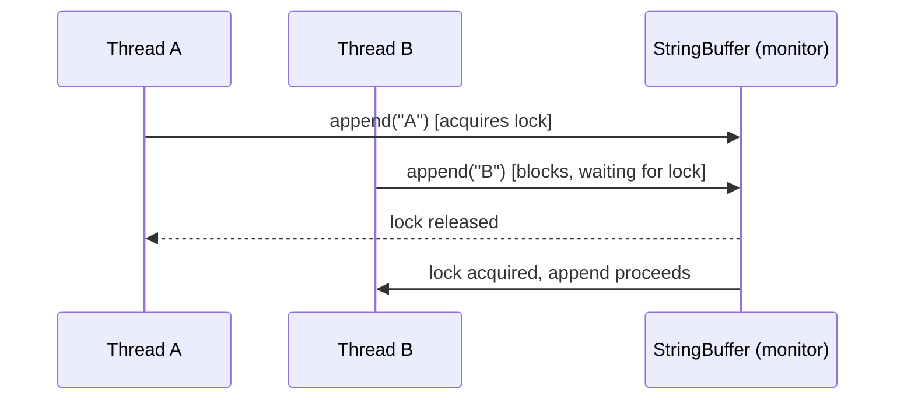

# 7. Strings

## String

### Theory

**Core Concepts**: `java.lang.String` is a final class representing an immutable sequence of characters. Internally (Java 9+, JEP 254 "Compact Strings"), a `String` is backed by a `byte[] value` field plus a `byte coder` field indicating encoding (`LATIN1` = 0 or `UTF16` = 1), rather than the pre-Java-9 `char[]`. This halves memory for strings whose content is entirely Latin-1 representable. `String` implements `CharSequence`, `Comparable<String>`, and `Serializable`.

**Internal Working**: Every `String` object stores its byte array, a coder byte, and a lazily computed `hash` field (with `hashCode() == 0` used as a sentinel for "not yet computed", except for the empty string edge case handled explicitly since JDK 8u/14+). String literals are interned automatically into the string pool inside the heap (moved from PermGen to heap in Java 7).

**When to Use It**: Any time you need textual data that will not be mutated in place — configuration values, keys in maps, identifiers, DTO fields, log messages. Prefer `String` over `StringBuilder` for storage, and reserve `StringBuilder` for construction.

**Advantages**: Immutability gives thread safety without synchronization, safe use as `HashMap` keys (hash is stable and cached), safe sharing/interning to reduce memory footprint, and predictable `equals`/`hashCode` semantics.

**Limitations**: Every mutating-looking operation (`concat`, `replace`, `substring`, `+`) allocates a new object, which can cause excessive garbage in loops. Pre-Java 7u6, `substring()` shared the backing `char[]` of the parent string, causing memory leaks when a small substring kept a huge backing array alive; this was fixed by always copying in Java 7u6+.

### Internal Working

**Step-by-Step Explanation**:
1. Compiler encounters a string literal `"abc"` in source code.
2. At class-load/link time, the literal is stored in the class file's constant pool as a `CONSTANT_Utf8` entry referenced by a `CONSTANT_String` entry.
3. On first execution reaching that literal, the JVM interns it: it looks up (or inserts) the corresponding `String` object in the runtime string pool (an internal, JVM-managed hash table living in the heap).
4. Concatenation of literals known at compile time (`"a" + "b"`) is folded by the compiler into `"ab"` — a single interned literal, not a runtime concatenation.
5. Concatenation involving a variable (`s1 + s2`) is compiled (Java 9+) into an `invokedynamic` call to `StringConcatFactory.makeConcatWithConstants`, which the JIT can specialize into efficient bytecode (no longer always `StringBuilder` chains as in Java 8).

**Memory Layout**: The `String` object header (12/16 bytes with/without compressed oops) is followed by `byte coder`, `int hash`, and a reference to the `byte[] value` array, which itself is a separate heap object with its own header + length + raw bytes. Interned strings live in the heap-resident string pool table (a native `StringTable` structure whose bucket count is tunable via `-XX:StringTableSize`).

**Diagrams**:
```
Stack frame                Heap
+------------+          +----------------------+
| s (ref)    |--------->| String object         |
+------------+          |  coder: 0 (LATIN1)    |
                         |  hash: 92909918       |
                         |  value: ref ---+      |
                         +----------------|------+
                                          |
                                          v
                                 +------------------+
                                 | byte[] value      |
                                 | 'a','b','c'        |
                                 +------------------+
```

**JVM Behaviour**: String literals participate in constant-pool resolution during class linking. The `String.intern()` native method consults (and potentially populates) the JVM's internal `StringTable`. Because `String` is immutable, the JIT can freely hoist/eliminate redundant loads of `String` fields and safely share references across threads without memory-barrier concerns tied to mutation.

### Interview Questions

**Basic**
1. Why is `String` immutable in Java?
2. What is the difference between `String s = "abc"` and `String s = new String("abc")`?
3. Why does `String` override `equals()` and `hashCode()`?

**Intermediate**
1. How does Java 9's Compact Strings feature change the internal representation of `String`?
2. What was the `substring()` memory leak issue prior to Java 7u6, and how was it fixed?
3. How is string concatenation with `+` compiled differently in Java 8 vs Java 9+?

**Advanced**
1. Walk through what happens at the bytecode/constant-pool level when the JVM loads a class containing string literals.
2. How does `String.intern()` interact with the compact string table, and what are the performance implications of interning at scale?

**Scenario-based**
1. You have a service that parses huge log files and repeatedly calls `substring()` to extract fields, keeping millions of small substrings alive for the app's lifetime. What memory behavior would you expect on modern JDKs, and would this differ from JDK 6?

### Detailed Answers

1. **Why is `String` immutable?** Immutability provides thread-safety without synchronization (safe to share across threads), enables safe use as a `HashMap`/`HashSet` key since its hash code never changes after insertion, allows the JVM to safely intern/share literal instances (reducing memory), and prevents security vulnerabilities where a mutable string passed to a security-sensitive API (like a file path or class name) could be altered after validation but before use (TOCTOU-style attack).

2. **`"abc"` vs `new String("abc")`**: The literal form causes the compiler to reference (or create) an interned entry in the constant pool / string pool — no new object is allocated if `"abc"` is already interned. `new String("abc")` always allocates a brand-new `String` object on the heap with its own identity, even though it wraps character data equal to the pooled instance; `==` comparison between the two returns `false` while `.equals()` returns `true`.

3. **Why override `equals`/`hashCode`?** Default `Object.equals` is reference equality, which is unsuitable for value-like types such as text. `String` overrides `equals` to compare contents byte-by-byte (with a length check first for a fast exit) and caches a computed `hashCode` (lazily, using the polynomial `s[0]*31^(n-1) + ... + s[n-1]`) so repeated calls (e.g., in hash-based collections) are O(1) after the first computation.

4. **Compact Strings (Java 9, JEP 254)**: Prior to Java 9, every `String` stored a `char[]` (2 bytes/char) regardless of content. JEP 254 changed the internal storage to `byte[]` plus a `coder` flag: if all characters fit in Latin-1 (0x00-0xFF), 1 byte/char is used (`LATIN1` coder); otherwise the full `UTF16` 2-byte encoding is used. This is transparent to the public API (`charAt`, `length`, etc., are adjusted internally) and reduces heap footprint for the common case of ASCII/Latin-1 heavy applications by roughly 40-50%.

5. **`substring()` memory leak (pre-7u6)**: Historically, `String.substring()` created a new `String` object that shared the same backing `char[]` as the original, just with different `offset`/`count` fields. This made substring O(1) but meant a tiny substring of a huge string kept the entire original character array reachable, leaking memory. Java 7u6 changed `substring()` to always copy the relevant character range into a new array, trading O(1) substring for eliminating the leak; it also removed the `offset`/`count` fields entirely, simplifying the `String` class.

6. **`+` concatenation compilation**: In Java 8 and earlier, `javac` translated `s1 + s2` into `new StringBuilder().append(s1).append(s2).toString()`. In Java 9+ (JEP 280), the compiler instead emits an `invokedynamic` instruction bound to `StringConcatFactory.makeConcatWithConstants`, deferring the concrete concatenation strategy to the bootstrap method at link time, which can choose more efficient strategies (e.g., direct byte-array sizing) and is more amenable to future optimization without recompiling application bytecode.

7. **Constant pool / class loading walkthrough**: When `javac` compiles a class containing `"abc"`, it emits a `CONSTANT_Utf8_info` entry with the raw bytes and a `CONSTANT_String_info` entry pointing to it; bytecode uses `ldc`/`ldc_w` to push that constant. At class-link time (specifically during "resolution" of the constant pool entry, which can be lazy), the JVM's `intern()` logic is invoked on that literal, returning the canonical shared instance from the `StringTable`. Subsequent classes referencing an identical literal resolve to the same object.

8. **`intern()` and StringTable at scale**: `intern()` hashes the string and does a lookup and possible insert in the native `StringTable`, a fixed-bucket hash table (size tunable via `-XX:StringTableSize`, default sized for typical workloads). Calling `intern()` on a huge number of distinct dynamically-built strings can bloat the table and cause GC pressure (interned entries are strong roots until the classloader/table entry is cleared during GC), plus lookup cost grows with poor bucket sizing/collisions; it should be used only when there's a genuine expectation of high duplication (e.g., deduplicating repeated tokens from a large corpus).

9. **Substring memory scenario**: On JDK 7u6+ and later, `substring()` copies only the needed bytes into a new array, so millions of small substrings only retain the small extracted content — the original large log line buffers become eligible for GC once no longer referenced. On JDK 6 (or JDK 7 before 7u6), those same substrings would each still reference the full original backing array, meaning the entire raw log line (potentially KBs) would remain reachable for as long as any tiny substring survives — a classic unbounded memory growth pattern in log-processing pipelines.

### Code Examples

```java
public class StringInternalsDemo {
    public static void main(String[] args) {
        // Literal vs new String() — identity vs equality
        String a = "config-key";
        String b = "config-key";
        String c = new String("config-key");

        System.out.println(a == b);          // true: both reference the pooled literal
        System.out.println(a == c);           // false: c is a distinct heap object
        System.out.println(a.equals(c));       // true: content is equal
        System.out.println(a == c.intern());   // true: intern() returns the pooled instance

        // Compile-time constant folding vs runtime concatenation
        final String prefix = "user-";
        String compileTimeConst = prefix + "id"; // folded to "user-id" literal (prefix is a compile-time constant)
        String runtimeVar = new StringBuilder(prefix).append("id").toString();
        System.out.println(compileTimeConst == "user-id"); // true
        System.out.println(compileTimeConst == runtimeVar); // false — runtimeVar not interned
    }
}
```

## StringBuilder

### Theory

**Core Concepts**: `StringBuilder` is a mutable, non-thread-safe sequence of characters used for efficient string construction, particularly inside loops or when building large text incrementally. It extends `AbstractStringBuilder`, which maintains a resizable `byte[] value` (compact-string-aware since Java 9) and a `count` field tracking the logical length.

**Internal Working**: Appends write directly into the backing array; when capacity is exceeded, a new array roughly `2*oldCapacity + 2` in size is allocated and the old contents copied (`Arrays.copyOf`), an amortized O(1) append strategy similar to `ArrayList` growth.

**When to Use It**: Any single-threaded scenario building strings via multiple concatenations, especially inside loops, JSON/SQL builders, or when the compiler's own `+` folding (single expression) isn't applicable across control flow (loops, conditionals).

**Advantages**: Avoids the O(n²) cost of repeated `String` concatenation in loops (each `+=` on a plain `String` in a loop creates a new object and copies all prior content). Provides a rich fluent API (`append`, `insert`, `delete`, `reverse`, `replace`) and direct `capacity()` control via constructor sizing to avoid resize churn.

**Limitations**: Not thread-safe — concurrent mutation from multiple threads causes race conditions and inconsistent state (unlike `StringBuffer`). Must call `toString()` to obtain an immutable `String` snapshot, which incurs one additional copy.

### Internal Working

**Step-by-Step Explanation**:
1. Constructing `new StringBuilder()` allocates an internal array with default capacity 16 (or `str.length() + 16` when seeded with a string).
2. Each `append(...)` checks if `count + additionalLength > value.length`; if so, `ensureCapacityInternal` grows the array via `Arrays.copyOf(value, newCapacity)` where `newCapacity = max(oldCapacity*2 + 2, requiredLength)`.
3. Characters are written into the array (compact string logic chooses byte-per-char or 2-bytes-per-char storage based on content).
4. `toString()` produces a new `String` by copying the current valid range of the array (Java 9+ no longer shares the backing array with the builder for safety/compaction reasons — every `toString()` call copies).

**Memory Layout**: One growable `byte[]` backing array on the heap owned by the `StringBuilder` object; intermediate over-allocated capacity is wasted space until `trimToSize()` is called or the builder is discarded.

**Diagrams**:
```
capacity=16                    after growth (capacity=34)
+----------------+             +--------------------------------+
| a b c _ _ ...  |  append 20  | a b c ... (34 slots)            |
+----------------+  chars  ->  +--------------------------------+
count=3                        count=23
```

**JVM Behaviour**: `StringBuilder` methods are frequently inlined by the JIT (C2) when the escape analysis proves the builder instance doesn't escape the method — in that case scalar replacement can eliminate the object allocation entirely, turning builder-based concatenation into direct register/stack operations. This is also exactly what happens automatically for compiler-generated `StringBuilder` chains from Java 8 `+` concatenation.

### Interview Questions

**Basic**
1. Why is `StringBuilder` preferred over `String` concatenation inside loops?
2. What is the default initial capacity of a `StringBuilder`?

**Intermediate**
1. How does `StringBuilder`'s capacity growth algorithm work, and what is its amortized complexity?
2. What happens internally when you call `toString()` on a `StringBuilder`?

**Advanced**
1. How can escape analysis and scalar replacement affect `StringBuilder` usage performance?
2. When would pre-sizing a `StringBuilder` with an explicit capacity meaningfully improve performance, and how would you measure that?

**Scenario-based**
1. You're building a very large JSON payload (megabytes) inside a hot method called millions of times. What `StringBuilder` practices would you apply to minimize GC pressure?

### Detailed Answers

1. **Why prefer `StringBuilder` in loops?** `String` concatenation with `+=` inside a loop of `n` iterations creates `n` new intermediate `String` objects, each copying all previously accumulated characters — an O(n²) total cost. `StringBuilder` mutates a single backing array in place with amortized O(1) per append (O(n) total), avoiding both the excessive allocations and the copy overhead, and dramatically reducing GC churn.

2. **Default initial capacity**: 16 characters when constructed with `new StringBuilder()`; when constructed from a `String`, capacity is `str.length() + 16`.

3. **Capacity growth algorithm**: When an append would exceed current capacity, `ensureCapacityInternal` computes `newCapacity = Math.max(oldCapacity * 2 + 2, minimumRequiredCapacity)`, then reallocates via `Arrays.copyOf`. Because capacity roughly doubles each time, the total cost of `n` appends remains O(n) amortized, the same principle as dynamic array growth in `ArrayList`.

4. **`toString()` internals**: It allocates a new `String`, copying exactly `count` characters/bytes from the builder's backing array using the compact-string-aware constructor. Since Java 9, the builder no longer shares its array with the produced `String` (this design avoids aliasing bugs where mutating the builder after `toString()` could corrupt an already-returned string, a defensive stance also improving compaction correctness).

5. **Escape analysis / scalar replacement**: If the JIT compiler (C2) proves via escape analysis that a `StringBuilder` instance never escapes the enclosing method or thread (i.e., it's not stored in a field, returned, or passed to an un-inlined call), it can perform scalar replacement — decomposing the object into its constituent fields (or eliminating the backing array copies through append call inlining) and avoiding heap allocation altogether, turning what looks like object-oriented code into effectively imperative buffer manipulation with zero allocation.

6. **Pre-sizing benefit**: If you know (or can estimate) the final length up front — e.g., building a fixed-format record — constructing `new StringBuilder(expectedLength)` avoids one or more intermediate resize-and-copy operations. You'd measure this with a microbenchmark (JMH) comparing default vs pre-sized builders under realistic append patterns, since JIT/escape-analysis effects can otherwise mask allocation costs in naive `System.nanoTime()` benchmarks.

7. **Large JSON payload scenario**: Pre-size the `StringBuilder` with a reasonable capacity estimate to avoid repeated doubling/copying; reuse a `ThreadLocal<StringBuilder>` (calling `setLength(0)` between uses) if the method runs on a fixed thread pool to avoid re-allocating the backing array on every invocation; avoid unnecessary intermediate `String` creation (e.g., avoid `sb.append(a + b)`, use `sb.append(a).append(b)`); and consider streaming output (e.g., writing directly to an `OutputStream`/`Writer`) instead of building the full string in memory if the payload is extremely large.

### Code Examples

```java
public class StringBuilderDemo {
    public static void main(String[] args) {
        // Pre-sized builder to avoid resize churn when length is predictable
        int rows = 10_000;
        StringBuilder csv = new StringBuilder(rows * 20); // rough estimate per row
        for (int i = 0; i < rows; i++) {
            csv.append(i).append(',').append("user-").append(i).append('\n');
        }
        String output = csv.toString();
        System.out.println("Generated CSV length: " + output.length());

        // Demonstrating O(n^2) pitfall vs StringBuilder (commented cost illustration)
        long start = System.nanoTime();
        StringBuilder sb = new StringBuilder();
        for (int i = 0; i < 50_000; i++) {
            sb.append(i);
        }
        long elapsedBuilder = System.nanoTime() - start;
        System.out.println("StringBuilder elapsed ns: " + elapsedBuilder);
    }
}
```

## StringBuffer

### Theory

**Core Concepts**: `StringBuffer` is the thread-safe, synchronized counterpart to `StringBuilder`, sharing the same `AbstractStringBuilder` base and API surface. It predates `StringBuilder` (introduced in Java 1.0, whereas `StringBuilder` was added in Java 5 as an unsynchronized alternative).

**Internal Working**: Nearly every public method (`append`, `insert`, `delete`, `toString`, etc.) is declared `synchronized`, locking on the `StringBuffer` instance itself, serializing access across threads at the cost of lock acquisition overhead on every call.

**When to Use It**: Legacy codebases already using it, or genuinely rare cases where a single mutable character buffer must be safely appended to from multiple threads without external synchronization — though in modern code, per-thread `StringBuilder` instances combined at the end are usually a better design.

**Advantages**: Built-in thread safety removes the need for manual synchronization when multiple threads share one buffer instance; drop-in API compatibility with `StringBuilder`.

**Limitations**: Synchronization overhead applies even in single-threaded contexts (the JIT can sometimes elide uncontended locks via biased/lightweight locking, but this isn't guaranteed), so `StringBuffer` is typically slower than `StringBuilder` for the overwhelmingly common single-threaded use case. It also doesn't provide atomicity across multiple method calls (a `length()` check followed by an `append()` is not atomic as a whole), so it doesn't fully solve compound thread-safety problems anyway.

### Internal Working

**Step-by-Step Explanation**:
1. `StringBuffer` extends the same `AbstractStringBuilder` as `StringBuilder`, inheriting the growable `byte[]`/`count` storage model.
2. Each mutating/reading method wraps the inherited logic with `synchronized`, acquiring the intrinsic lock (monitor) on the `StringBuffer` object before proceeding.
3. On uncontended access, the JVM can apply lock elision optimizations (biased locking historically, or lightweight/lock coarsening under the newer synchronization implementations), reducing but not eliminating overhead.
4. Because it's a monitor per call, compound operations (e.g., check-then-append) are not atomic unless the caller synchronizes externally on the same object across the whole sequence.

**Memory Layout**: Identical to `StringBuilder` — one resizable backing array; the only structural difference is the synchronization wrapper, not the data layout.

**Diagrams**:


**JVM Behaviour**: The `synchronized` methods generate `monitorenter`/`monitorexit` bytecode pairs (or are marked with the `ACC_SYNCHRONIZED` method flag for the whole-method case). Under contention, threads block via the OS-level monitor mechanism; under no contention, modern JVMs use fast-path lightweight locking (CAS on the object header's mark word) to minimize cost, though this is still strictly more expensive than the zero-synchronization `StringBuilder` path.

### Interview Questions

**Basic**
1. What is the main difference between `StringBuilder` and `StringBuffer`?
2. Is `StringBuffer` fully thread-safe for all use cases?

**Intermediate**
1. Why was `StringBuilder` introduced in Java 5 if `StringBuffer` already existed?
2. Does synchronization on `StringBuffer` guarantee atomicity for compound operations like "check length then append"?

**Advanced**
1. How does the JVM optimize uncontended synchronized access on a `StringBuffer`, and why doesn't this make it as fast as `StringBuilder`?

**Scenario-based**
1. A legacy codebase uses `StringBuffer` everywhere, including single-threaded request-handling code. Would you recommend migrating to `StringBuilder`, and how would you justify the change?

### Detailed Answers

1. **Main difference**: Both share identical APIs and the same underlying mutable character buffer implementation, but `StringBuffer`'s methods are `synchronized` (thread-safe, slower), while `StringBuilder`'s are not (not thread-safe, faster). Functionally, in single-threaded code, they behave identically.

2. **Full thread safety?** No. While individual method calls are atomic (each is synchronized), sequences of multiple calls are not atomic as a whole — e.g., `if (buf.length() < 100) buf.append(x);` can still race between the `length()` check and the `append()` call if another thread mutates `buf` in between, requiring the caller to hold an external lock on `buf` for true compound atomicity.

3. **Why introduce `StringBuilder`?** Profiling and real-world usage showed the overwhelming majority of string-building happens within a single thread (e.g., compiler-generated concatenation, local loop-based building) where synchronization is pure overhead. `StringBuilder` was added as an API-compatible, drop-in unsynchronized replacement so developers (and the compiler itself, from Java 5 onward for `+` concatenation) could opt out of unnecessary locking cost.

4. **Atomicity of compound ops**: No — see answer 2. Synchronization is per-method-call, not per logical operation sequence, so higher-level invariants spanning multiple calls require the caller to synchronize explicitly on the `StringBuffer` instance for the entire critical section.

5. **JIT optimization of uncontended locks**: The JVM uses lightweight/biased locking techniques (a fast CAS-based path on the object's mark word) so that an uncontended `synchronized` block avoids a full OS mutex round-trip. However, this still involves a memory barrier and CAS operation per call, which is inherently more expensive than `StringBuilder`'s zero-synchronization code path — and if the JIT cannot fully eliminate the lock (e.g., no reliable escape analysis proving no other thread can see the object), the overhead remains on every invocation, unlike `StringBuilder` where no such cost exists at all.

6. **Legacy migration scenario**: Yes, migrating `StringBuffer` to `StringBuilder` in confirmed single-threaded contexts (e.g., per-request local variables never shared across threads) is a safe, low-risk performance win — it's a mechanical rename since the API is identical, and eliminates needless synchronization overhead. The justification is measurable (reduced CPU under lock acquisition, especially significant in hot paths called at high frequency) with essentially zero behavioral risk, provided a static/code-review check confirms the instance never actually escapes to another thread.

### Code Examples

```java
public class StringBufferDemo {
    // Multiple threads safely appending to a shared StringBuffer (legitimate use case)
    public static void main(String[] args) throws InterruptedException {
        StringBuffer sharedLog = new StringBuffer();
        Runnable writer = () -> {
            for (int i = 0; i < 1000; i++) {
                sharedLog.append(Thread.currentThread().getName()).append(':').append(i).append(';');
            }
        };

        Thread t1 = new Thread(writer, "worker-1");
        Thread t2 = new Thread(writer, "worker-2");
        t1.start();
        t2.start();
        t1.join();
        t2.join();

        // Length is deterministic because each append() call is atomic and thread-safe
        System.out.println("Final combined length: " + sharedLog.length());
    }
}
```

## String Pool

### Theory

**Core Concepts**: The String Pool (a.k.a. String Constant Pool at runtime, not to be confused with the per-class-file "constant pool") is a special JVM-managed cache of `String` instances that ensures textually identical strings can share a single object instance. It's implemented natively as `StringTable`, a fixed-bucket hash table.

**Internal Working**: When a string literal is encountered, or when `String.intern()` is explicitly called, the JVM checks the pool for an existing equal entry; if found, that reference is reused, otherwise the new string is added to the pool.

**When to Use It**: Implicitly used for all string literals and compile-time constant expressions automatically; explicitly leveraged via `intern()` when you expect significant duplication among dynamically created strings (e.g., deduplicating repeated tokens parsed from a large file) and want to trade some CPU/lookup cost for reduced memory footprint.

**Advantages**: Reduces memory consumption when the same literal text appears many times across a codebase or dataset; enables fast `==` reference comparison for pooled/interned strings (though `.equals()` should still be preferred for correctness).

**Limitations**: The pool itself consumes memory and, historically (pre-Java 7), lived in PermGen with a fixed, hard-to-resize capacity — a common cause of `PermGen space` OutOfMemoryError from excessive interning. Even after moving to the heap (Java 7+), aggressive/unbounded `intern()` calls on many unique strings can still bloat memory and slow lookups if the internal table isn't sized appropriately (`-XX:StringTableSize`).

### Internal Working

**Step-by-Step Explanation**:
1. JVM starts with an internal, native `StringTable` — essentially a hash set of `String` object references.
2. Class loading processes constant pool entries; string literals referenced by `ldc` instructions are resolved and interned into the `StringTable` the first time they're encountered.
3. `String.intern()` is a native method: it computes the string's hash, looks it up in the `StringTable`; if an equal entry exists, it returns that canonical reference, otherwise it inserts the current string (or an equivalent copy) and returns it.
4. Because entries are ordinary heap objects reachable from the table, they are subject to garbage collection when the table itself drops its reference (this happens during specific GC phases that clean up the string table, keyed off reachability from other roots for the interned copy semantics in HotSpot).

**Memory Layout**: In modern JVMs (Java 7+), the pool lives in the ordinary Java heap, so pooled strings are GC'd like any other object once unreferenced by the table (the table holds weak-like/managed references so it does not itself prevent collection indefinitely, though implementation details are JVM-version-specific). Pre-Java 7, it lived in PermGen with a static, class-metadata-adjacent memory region.

**Diagrams**:
```
                 StringTable (native hash table, lives on heap since Java 7)
                 +----------------------------------------------------+
                 | "config" -> String@0x1A2B                          |
                 | "user"   -> String@0x1C4D                          |
                 | "id"     -> String@0x1E9F                          |
                 +----------------------------------------------------+
literal "config" in ClassA  ---> resolves to String@0x1A2B
literal "config" in ClassB  ---> resolves to SAME String@0x1A2B
```

**JVM Behaviour**: `-XX:StringTableSize=N` tunes the number of buckets (default varies by JVM version, commonly in the tens of thousands) to reduce collision chains under heavy interning. `-Xlog:stringtable` (or `-XX:+PrintStringTableStatistics` on some versions) can print load-factor and bucket statistics for diagnosing interning-heavy applications like large-scale text/log processors.

### Interview Questions

**Basic**
1. What is the String Pool and why does the JVM maintain one?
2. Where does the String Pool live in memory — PermGen, Metaspace, or heap?

**Intermediate**
1. How did the location and behavior of the String Pool change between Java 6 and Java 7/8?
2. What's the risk of interning a huge number of unique dynamic strings?

**Advanced**
1. How would you tune or diagnose String Pool related memory issues in a production JVM?

**Scenario-based**
1. Your application ingests millions of small JSON messages, each containing a handful of repeated field-name strings but effectively unique values. Would using `intern()` on the field names help, and would it help for the values too?

### Detailed Answers

1. **What is the String Pool?** It's a JVM-managed deduplication cache for `String` objects, implemented as a native hash table (`StringTable`), that guarantees all string literals (and interned strings) with equal content share a single canonical object instance — saving memory and enabling `==` reference-equality checks for known-pooled strings.

2. **Where does it live?** Since Java 7 (JEP-less internal change, part of the PermGen removal effort culminating in Java 8's Metaspace), the pool lives in the regular garbage-collected heap. Before Java 7, it resided in PermGen, a fixed-size, separate memory region primarily used for class metadata, which made the pool prone to `OutOfMemoryError: PermGen space` under heavy interning since PermGen didn't grow dynamically like the heap.

3. **Change between Java 6 and 7/8**: Moving the pool to the heap (Java 7) meant its size became bound only by heap capacity (not the fixed PermGen size), drastically reducing OOM risk from interning. Java 8 subsequently removed PermGen entirely in favor of Metaspace for class metadata (unrelated to strings directly, but part of the same broader memory-model overhaul), reinforcing that class metadata and string pooling are managed separately today.

4. **Risk of unbounded interning**: Interning many unique dynamic strings defeats the purpose of pooling (no sharing benefit since each is unique) while still paying the cost of hashing, locking/synchronization inside the native table, and permanently retaining every interned string for as long as the table entry lives — potentially causing sustained heap growth and longer GC pauses due to more live objects to trace, effectively creating a self-inflicted memory leak.

5. **Tuning/diagnosing**: Use `-XX:StringTableSize=N` to increase bucket count for workloads with heavy legitimate interning, reducing hash collision chain length. Use heap dumps (e.g., via `jmap`/Eclipse MAT) to inspect the count and retained size of `String`/`char[]`/`byte[]` instances, and correlate spikes with code paths calling `intern()`. JFR (Java Flight Recorder) can also help correlate GC pause increases with allocation-heavy string processing.

6. **JSON ingestion scenario**: Interning field names (a small, bounded, repeating set like `"userId"`, `"timestamp"`) is beneficial — it collapses potentially millions of duplicate field-name string instances (one per parsed message) down to a handful of shared instances, meaningfully reducing memory. Interning the values, however, would likely be counterproductive if they're effectively unique per message — you'd pay hashing/table-insertion overhead for every value with no deduplication benefit, growing the pool unnecessarily; values should only be interned if profiling shows real duplication (e.g., an enum-like status field with few distinct values).

### Code Examples

```java
public class StringPoolDemo {
    public static void main(String[] args) {
        // Demonstrating pooling behavior and manual interning of dynamic strings
        String literal = "status-active";
        String dynamic = new String("status-active");
        String internedDynamic = dynamic.intern();

        System.out.println(literal == dynamic);            // false
        System.out.println(literal == internedDynamic);      // true — same pooled instance

        // Simulating field-name deduplication for parsed records
        java.util.Map<String, String> internedFieldNames = new java.util.HashMap<>();
        String[] rawFieldNamesFromParser = {"userId", "userId", "timestamp", "userId"};
        for (String raw : rawFieldNamesFromParser) {
            // Reuse a canonical instance instead of keeping N duplicate objects
            internedFieldNames.computeIfAbsent(raw, String::intern);
        }
        System.out.println("Distinct canonical field names retained: " + internedFieldNames.size());
    }
}
```

## String Interning

### Theory

**Core Concepts**: String interning is the explicit or implicit act of registering a `String` in the JVM's string pool such that all equal strings share one canonical object. It's invoked implicitly for literals/compile-time constants and explicitly via the `String.intern()` instance method.

**Internal Working**: `intern()` is a native method that performs a lookup-or-insert into the `StringTable`; if the exact same object (by reference) is already the canonical pooled entry, it's returned as-is with no extra copy.

**When to Use It**: When you have strong evidence of high duplication among strings constructed at runtime (parsed from I/O, network payloads, or user input) and want to reduce memory footprint at the cost of some CPU during interning and slightly slower first-touch performance.

**Advantages**: Can substantially cut memory usage for workloads with highly repetitive string content (e.g., parsing large files with a small vocabulary of repeated tokens); enables safe `==` comparisons when you can guarantee both operands are interned.

**Limitations**: Adds CPU overhead per `intern()` call (hashing + synchronized-like table access); can increase pool size/memory if misapplied to non-duplicated data; relying on `==` for interned strings is fragile and considered poor practice outside of tightly controlled contexts, since any code path that forgets to intern silently breaks the comparison.

### Internal Working

**Step-by-Step Explanation**:
1. Caller invokes `someString.intern()`.
2. JVM computes/reuses the string's hash code.
3. It searches the native `StringTable` for an entry with equal content.
4. If found, the existing canonical reference is returned (the argument `someString` object itself, if it wasn't already equal-and-pooled, becomes eligible for GC once other references drop).
5. If not found, the table stores a reference for future lookups (in HotSpot, it stores the actual argument string, not a copy) and returns it.

**Memory Layout**: No new character data is duplicated on a successful interning; only the pool's internal reference table grows by one entry (per JVM-implementation, e.g., a bucket/node overhead) when a new unique string is added.

**Diagrams**:
```
before intern():                     after intern():
dynamicStr -> String@X ("abc")       dynamicStr -> String@X ("abc")
StringTable: { "abc" -> String@X }   StringTable: { "abc" -> String@X }  (unchanged, already canonical)

anotherDynamicStr -> String@Y ("abc")   after anotherDynamicStr.intern():
                                          returns String@X (existing canonical), String@Y becomes unreferenced/GC-eligible
```

**JVM Behaviour**: The `StringTable` implementation uses internal locking/striping to remain correct under concurrent `intern()` calls from multiple threads; contention here can become a bottleneck in highly parallel string-heavy workloads, which is one reason unnecessary interning should be avoided in hot paths.

### Interview Questions

**Basic**
1. What does `String.intern()` do?
2. Does calling `intern()` always create a new pool entry?

**Intermediate**
1. What's the performance trade-off of calling `intern()` versus not interning?
2. Can two interned strings safely be compared with `==`?

**Advanced**
1. How does concurrent access to the string pool affect `intern()` performance under multi-threaded load?

**Scenario-based**
1. You're deduplicating country-code strings (`"US"`, `"UK"`, `"IN"`, etc. — a small fixed vocabulary of ~200 values) parsed from millions of incoming records. Would you use `intern()`, and are there simpler alternatives?

### Detailed Answers

1. **What does `intern()` do?** It returns a canonical representative `String` for a given content: if an equal string is already present in the JVM's string pool, that shared instance is returned; otherwise the current string (or an equivalent) is added to the pool and returned, guaranteeing all subsequently interned equal strings resolve to that same reference.

2. **Always creates a new entry?** No — only when no equal entry already exists. If the exact content is already pooled (e.g., it matches an existing literal or a previously interned string), `intern()` simply returns the existing reference with no new entry added.

3. **Performance trade-off**: Interning costs a hash computation plus a table lookup (and possibly an insert) on every call, which is overhead compared to just keeping the object as-is. The benefit is realized only when many logically-equal strings would otherwise exist as separate objects — the memory saved from deduplication must outweigh the per-call CPU cost, which is workload-dependent and should be validated with profiling rather than assumed.

4. **`==` on interned strings**: Yes, if — and only if — both operands are guaranteed to have gone through `intern()` (or are compile-time literals, which are automatically interned). This guarantee is fragile in practice: it requires disciplined code review to ensure every code path producing that string interns it, so `.equals()` remains the safe, idiomatic default; `==` on strings is a common bug source when this invariant is silently violated by a refactor.

5. **Concurrent access impact**: Because the `StringTable` is a shared, JVM-wide native structure, concurrent `intern()` calls from many threads must synchronize (via internal locking mechanisms) to maintain a consistent table — this can become a contention point in highly parallel, string-processing-heavy applications (e.g., massively parallel text parsers), showing up as unexpected thread contention/hot native frames in profiler output.

6. **Country-code scenario**: Yes, interning is appropriate here since the vocabulary is small (~200 distinct values) and reused across potentially millions of records — the deduplication benefit vastly outweighs the interning overhead. A simpler and often better alternative for a known, bounded, static vocabulary is to maintain your own `Map<String, String>` (or even an `enum`) canonicalization cache populated once at startup, avoiding repeated calls into the JVM-wide native pool and giving you control over the cache's lifecycle without depending on the shared global table.

### Code Examples

```java
import java.util.Map;
import java.util.concurrent.ConcurrentHashMap;

public class StringInterningDemo {
    // Custom lightweight canonicalization cache — often preferable to JVM intern() for known,
    // bounded vocabularies since it avoids contention on the global native StringTable.
    private static final Map<String, String> COUNTRY_CODE_CACHE = new ConcurrentHashMap<>();

    static String canonicalizeCountryCode(String rawCode) {
        return COUNTRY_CODE_CACHE.computeIfAbsent(rawCode, String::intern);
    }

    public static void main(String[] args) {
        String parsed1 = new String("US");
        String parsed2 = new String("US");

        String canon1 = canonicalizeCountryCode(parsed1);
        String canon2 = canonicalizeCountryCode(parsed2);

        System.out.println(canon1 == canon2); // true: both resolve to the same cached/interned instance
        System.out.println(COUNTRY_CODE_CACHE.size()); // 1 distinct code cached
    }
}
```

## Immutability

### Theory

**Core Concepts**: `String` immutability means once constructed, a `String` object's character content, coder, and hash can never change through its public API — every apparent mutation (`concat`, `replace`, `toUpperCase`, `substring`) returns a new `String` instance rather than modifying the original in place.

**Internal Working**: The class is declared `final` (preventing subclasses from breaking the invariant), and its backing `byte[] value` field is also `final` and never exposed or mutated after construction (aside from JVM-internal, controlled paths like compact-string encoding done once at creation).

**When to Use It**: Immutability is inherent to `String` and cannot be opted out of — but understanding it informs API design: prefer returning `String` (not exposing mutable backing arrays) for value-like textual data in your own classes, mirroring the same pattern for safety.

**Advantages**: Thread-safety without locks (safe publication is sufficient, no defensive copying needed when passing strings between threads); safe use as hash-based collection keys since the hash cannot change after insertion; enables safe sharing/pooling (interning) since no consumer can corrupt a shared instance; simplifies reasoning about code correctness since a `String` reference can never "change under you."

**Limitations**: Every transformation operation allocates a new object, which can be wasteful for heavy text manipulation (mitigated by using `StringBuilder`/`StringBuffer`); cannot be used for scenarios genuinely requiring in-place mutable character buffers (e.g., sensitive data like passwords, where some security guidance recommends `char[]` specifically so the data can be explicitly zeroed out after use — immutable `String` cannot be reliably cleared from memory before GC).

### Internal Working

**Step-by-Step Explanation**:
1. `String` is declared `public final class String`, so no subclass can override methods to break the immutability contract.
2. The backing `byte[] value` (and `coder`) fields are `private final` and set only once, in constructors.
3. Methods that appear to "modify" a string (`toUpperCase()`, `trim()`, `replace()`, `concat()`) internally allocate a new `byte[]`, populate it with the transformed content, and wrap it in a brand-new `String` instance, leaving the original object entirely untouched.
4. Because no method exposes a mutable reference to the internal array (no getter returns the raw backing array), external code cannot reach in and mutate the string's state via reflection-free means; reflection can technically bypass this (via `setAccessible(true)`), but that's an explicit, unsupported violation of the class's contract, not a normal usage path.

**Memory Layout**: Not directly applicable beyond what's covered for `String` above — each "modification" simply produces an additional heap-allocated `String` + backing array pair, with the original remaining allocated until unreferenced.

**Diagrams**:
```
String original = "hello";
String upper = original.toUpperCase();

original --> String@A { value: [h,e,l,l,o] }   (unchanged)
upper    --> String@B { value: [H,E,L,L,O] }   (new object)
```

**JVM Behaviour**: Because the JIT can prove a `String`'s fields never change after construction (given `final` fields and no exposed mutators), it can safely cache/hoist reads of `length()`/`hashCode()`/backing array references across loop iterations and even across threads without needing volatile-style re-reads, enabling aggressive optimization that would be unsafe for a genuinely mutable type.

### Interview Questions

**Basic**
1. What does it mean for `String` to be immutable, and how is that enforced at the class level?
2. Does `str.toUpperCase()` change `str` itself?

**Intermediate**
1. Why is immutability important for `String`'s use as a `HashMap` key?
2. Why might `char[]` be recommended over `String` for storing passwords?

**Advanced**
1. Can reflection be used to break `String` immutability, and what does that imply about relying on "true" immutability guarantees in the JVM?

**Scenario-based**
1. A code reviewer flags a method that does `password = password.trim();` where `password` is a `String` read from user input, suggesting it should have used `char[]` from the start. Explain the security reasoning.

### Detailed Answers

1. **What does immutability mean here?** Once a `String` object is constructed, none of its publicly observable state (character content, length, hash code) can ever change; it is enforced by declaring the class `final` (no subclassing to add mutator behavior) and all backing fields `private final`, with every "transformation" method returning a new instance instead of mutating `this`.

2. **Does `toUpperCase()` mutate?** No — it returns a new `String` object with the transformed content; the original `str` reference still points to the unchanged original object unless you explicitly reassign `str = str.toUpperCase()`.

3. **Why immutability matters for `HashMap` keys**: `HashMap` relies on a key's `hashCode()` remaining constant for the key's entire lifetime in the map to locate it in the correct bucket; if a key's hash could change after insertion (as with a mutable object), the entry could become permanently "lost" (unreachable via `get()` even though it's still in the map's internal array) because the bucket computed at lookup time would differ from the bucket used at insertion time.

4. **Why `char[]` for passwords?** A `String` is immutable and its backing data may be interned or retained in memory for an indeterminate duration beyond the programmer's control (you cannot forcibly overwrite/clear a `String`'s content), and it might also linger in memory dumps, swap files, or GC-copied regions longer than intended. A `char[]` is explicitly mutable, allowing the program to overwrite the array with zeros (`Arrays.fill(passwordChars, '0')`) immediately after use, minimizing the window during which sensitive data resides in memory in cleartext.

5. **Reflection breaking immutability**: Yes — using `Field.setAccessible(true)` (where permitted by the module system / security manager, increasingly restricted in modern JDKs via strong encapsulation of JDK internals) it is technically possible to reach into a `String`'s private backing array and mutate its bytes directly, since the "immutability" is a language/API-level contract, not a hardware-enforced guarantee. This implies immutability in Java is a design and access-control convention enforced by the type system and encapsulation, not an absolute physical property of memory — production code should never rely on defeating it, and doing so is explicitly unsupported and can corrupt interned/shared instances used elsewhere in the JVM.

6. **Password handling scenario**: The reviewer's point is that `String password = readInput();` places the password's cleartext bytes into an object that (a) cannot be explicitly wiped by the application, (b) may be interned or retained by the pool, (c) may persist in heap dumps/swap for an unpredictable duration governed entirely by GC timing rather than programmer intent, and (d) every "trim"/transformation creates yet another copy of the sensitive data floating in memory. Using `char[]` from the start (e.g., via `Console.readPassword()` which returns `char[]`) lets the application explicitly overwrite the array's contents immediately after the password is used/hashed, meaningfully shrinking the exposure window — an established secure-coding practice (e.g., referenced in OWASP guidance) even though it doesn't provide absolute protection against all memory-inspection attack vectors.

### Code Examples

```java
import java.util.Arrays;

public class StringImmutabilityDemo {
    public static void main(String[] args) {
        String original = "hello";
        String upper = original.toUpperCase();
        System.out.println(original); // "hello" — unchanged
        System.out.println(upper);    // "HELLO" — new instance

        // Preferred pattern for sensitive data: mutable char[] that can be explicitly cleared
        char[] passwordChars = {'S', 'e', 'c', 'r', '3', 't'};
        try {
            authenticate(passwordChars);
        } finally {
            Arrays.fill(passwordChars, '0'); // explicitly wipe sensitive data from memory
        }
        System.out.println(Arrays.toString(passwordChars)); // all zeros, no residual secret
    }

    static void authenticate(char[] password) {
        // In real code: hash password (e.g., via a KDF like Argon2/bcrypt) and compare to stored hash
        System.out.println("Authenticating with " + password.length + "-char credential");
    }
}
```

## UTF-8

### Theory

**Core Concepts**: UTF-8 is a variable-width character encoding (1-4 bytes per code point) that is backward-compatible with ASCII for the first 128 code points. In Java, UTF-8 is relevant both as the JVM's default charset for I/O since Java 18 (JEP 400, "UTF-8 by Default") and as the encoding of `.java` source files and `.properties`/text resources by convention.

**Internal Working**: Java's internal `String` representation (compact strings) is *not* UTF-8 — it's Latin-1 or UTF-16 depending on content. UTF-8 comes into play at the I/O boundary: `String.getBytes(StandardCharsets.UTF_8)` / `new String(bytes, StandardCharsets.UTF_8)` perform the actual conversion between Java's internal representation and the UTF-8 byte encoding used for files, network protocols, and most modern text formats (JSON, HTML5, etc.).

**When to Use It**: Anytime you read/write text to files, sockets, HTTP bodies, or any external system — UTF-8 is the de facto universal interchange encoding for text on the modern web and in most APIs/databases.

**Advantages**: Compact for ASCII-heavy text (1 byte per character for English/Latin content), self-synchronizing (you can detect byte-sequence boundaries without decoding from the start), and can represent every Unicode code point, making it a safe universal default.

**Limitations**: Non-ASCII characters take multiple bytes (e.g., most CJK characters take 3 bytes in UTF-8 vs 2 in UTF-16 internally), so UTF-8 isn't always the most memory-efficient choice for non-Latin-heavy text; naive byte-length-based buffer sizing can be wrong since character count and byte count diverge for non-ASCII content.

### Internal Working

**Step-by-Step Explanation**:
1. A Java `String` is decoded from UTF-8 bytes via `new String(byteArray, StandardCharsets.UTF_8)`, which invokes the UTF-8 `CharsetDecoder`, translating variable-length byte sequences into UTF-16 code units (which `String`'s compact-string machinery may further re-encode as Latin-1 internally if all resulting chars fit in one byte).
2. Conversely, `str.getBytes(StandardCharsets.UTF_8)` invokes the UTF-8 `CharsetEncoder`, converting the string's internal representation (regardless of whether it's stored as Latin-1 or UTF-16 internally) into a UTF-8 byte array.
3. Since JEP 400 (Java 18), `Charset.defaultCharset()` is UTF-8 on all platforms by default (previously it was platform-dependent, e.g., `Cp1252` on some Windows locales, `US-ASCII`/`ANSI_X3.4-1968`in certain minimal Linux/Docker containers), removing an entire historical class of "works on my machine" encoding bugs for APIs like `FileReader` or `new String(bytes)` that used to rely on the platform default charset implicitly.

**Memory Layout**: Not directly applicable to `String`'s internal storage; UTF-8 byte layout only matters for the transient `byte[]` produced during encode/decode operations at I/O boundaries.

**Diagrams**:
```
Code point U+00E9 (é):
UTF-8 encoding:  0xC3 0xA9              (2 bytes)
UTF-16 encoding: 0x00E9                  (1 code unit, 2 bytes)

Code point U+1F600 (😀, outside BMP):
UTF-8 encoding:  0xF0 0x9F 0x98 0x80    (4 bytes)
UTF-16 encoding: 0xD83D 0xDE00          (surrogate pair, 2 code units, 4 bytes)
```

**JVM Behaviour**: `Charset` encoders/decoders (`sun.nio.cs.UTF_8`) are highly optimized native/intrinsic code paths in modern JDKs; `String.getBytes(UTF_8)` and the UTF-8 constructor benefit from JIT intrinsics and, for ASCII-only fast paths, can be significantly faster than general multi-byte-aware decoding loops.

### Interview Questions

**Basic**
1. What did JEP 400 (Java 18) change regarding default charset behavior?
2. Is a Java `String` stored internally as UTF-8?

**Intermediate**
1. Why could `new String(bytes)` (no explicit charset) behave differently on different machines before Java 18?
2. How many bytes does UTF-8 use to encode an emoji outside the Basic Multilingual Plane, and how does that compare to UTF-16?

**Advanced**
1. What subtle bugs can arise from assuming `byte[].length == String.length()` when working with UTF-8-encoded text?

**Scenario-based**
1. Your REST API reads request bodies with `new String(requestBytes)` (no explicit charset) and has been failing intermittently to parse non-English characters correctly only on certain deployment environments. Diagnose the likely cause and the fix.

### Detailed Answers

1. **JEP 400 change**: Prior to Java 18, `Charset.defaultCharset()` (used implicitly by APIs like `new String(byte[])`, `FileReader`, `PrintStream` without explicit charset arguments) was derived from the OS/JVM locale settings, varying across platforms (e.g., `windows-1252` on some Windows configurations, `US-ASCII` in stripped-down Linux containers). JEP 400 made UTF-8 the guaranteed default on every platform, making charset-sensitive code behave consistently regardless of deployment environment, and strongly encouraged (though didn't strictly require) explicit charset usage for any remaining platform-dependent behavior.

2. **Is `String` stored as UTF-8 internally?** No — since Java 9's Compact Strings (JEP 254), `String` is stored as either Latin-1 (1 byte/char, for content limited to the Latin-1 range) or UTF-16 (2 bytes/char, for anything requiring characters beyond Latin-1), never UTF-8 directly. UTF-8 is purely an external/interchange encoding used at serialization boundaries (`getBytes`, decoding constructors).

3. **Pre-Java 18 default charset variance**: Because `new String(bytes)` without an explicit `Charset` argument delegated to `Charset.defaultCharset()`, and that default was platform/locale dependent, the exact same byte array could decode to correct text on one machine (say, a UTF-8-locale Linux dev box) and garbled/incorrect text on another (say, a Windows machine defaulting to `windows-1252`), a classic "works on my machine" encoding bug class largely eliminated by JEP 400's UTF-8-always-default guarantee.

4. **Emoji byte-length comparison**: An emoji like 😀 (U+1F600, outside the Basic Multilingual Plane) requires 4 bytes in UTF-8, and requires a UTF-16 surrogate pair (2 code units, 4 bytes total) internally — so both encodings need the same total byte count for this character, but the "character count" from Java's perspective (`String.length()`, which counts UTF-16 code units) reports 2 for a single emoji, not 1, since it doesn't account for surrogate pairs without explicit code-point-aware iteration (`codePointCount`).

5. **`byte[].length` vs `String.length()` bug**: For non-ASCII text, the number of bytes produced by `getBytes(UTF_8)` almost always exceeds `String.length()` (which counts UTF-16 code units, not bytes or even necessarily "characters" for supplementary code points). Code that allocates a fixed-size byte buffer based on `String.length()` (assuming 1 byte per char) will silently truncate or corrupt multi-byte UTF-8 content — buffer sizing for I/O should always be based on the actual encoded byte length (`getBytes(charset).length` or a safe multiplier) rather than character count.

6. **Intermittent REST parsing bug scenario**: The root cause is almost certainly that `new String(requestBytes)` relies on the JVM's platform default charset, which differs between the developer's machine, CI, and various deployment environments (especially pre-Java 18, or even post-18 if some JVM/system property overrides the default). The fix is to always specify the charset explicitly and match what the client actually sends (typically declared via the `Content-Type: ...; charset=utf-8` header) — i.e., `new String(requestBytes, StandardCharsets.UTF_8)` — removing any dependency on ambient platform configuration.

### Code Examples

```java
import java.nio.charset.StandardCharsets;
import java.util.Arrays;

public class Utf8Demo {
    public static void main(String[] args) {
        String text = "café \uD83D\uDE00"; // "café " + grinning-face emoji (surrogate pair)

        byte[] utf8Bytes = text.getBytes(StandardCharsets.UTF_8);
        System.out.println("Char count (UTF-16 code units): " + text.length());
        System.out.println("UTF-8 byte length: " + utf8Bytes.length);
        System.out.println("Actual Unicode code point count: " + text.codePointCount(0, text.length()));

        // Always decode with an explicit, known charset — never rely on the platform default
        String roundTripped = new String(utf8Bytes, StandardCharsets.UTF_8);
        System.out.println("Round-trip equal: " + text.equals(roundTripped));

        System.out.println(Arrays.toString(utf8Bytes)); // shows multi-byte sequences for é and emoji
    }
}
```

## Unicode

### Theory

**Core Concepts**: Unicode is a universal character set standard assigning a unique numeric "code point" (e.g., U+0041 for 'A', U+1F600 for 😀) to essentially every character used in human writing systems, from 0 to 0x10FFFF (over 1.1 million possible code points). Java's `char` and `String` are fundamentally built around Unicode, historically via UTF-16.

**Internal Working**: A Java `char` is a 16-bit unsigned value representing a single UTF-16 code unit — for code points in the Basic Multilingual Plane (U+0000-U+FFFF) this is one `char` per code point, but for supplementary characters (U+10000-U+10FFFF, including most emoji and many CJK extension characters) it takes a *surrogate pair* of two `char`s to represent one code point.

**When to Use It**: Understanding Unicode/UTF-16 semantics is essential anytime you process text that might contain non-BMP characters (emoji, some historic/rare scripts, mathematical symbols) — naive per-`char` iteration (`charAt`, `for` loop over indices) can split a surrogate pair and corrupt such characters.

**Advantages**: Universal representation avoids the encoding-mismatch chaos of legacy multi-codepage systems (Latin-1, Shift-JIS, etc.); Java's native `char`/`String` Unicode support makes internationalized text handling a first-class citizen without extra libraries for the common cases.

**Limitations**: `String.length()` and `charAt()` operate on UTF-16 *code units*, not Unicode code points or user-perceived "characters" (grapheme clusters) — combining characters, emoji with modifiers (skin tone, ZWJ sequences), and supplementary-plane characters all require code-point- or grapheme-aware APIs (`codePoints()`, `BreakIterator`) for correct handling.

### Internal Working

**Step-by-Step Explanation**:
1. Every Unicode code point maps to one or two `char` values in Java's UTF-16-based representation: BMP code points (U+0000-U+FFFF) map 1:1 to a single `char`; supplementary code points (U+10000+) map to a *high surrogate* (0xD800-0xDBFF) followed by a *low surrogate* (0xDC00-0xDFFF).
2. APIs like `charAt(int index)` and `length()` operate purely at the `char` (UTF-16 code unit) level, oblivious to surrogate pairing — calling `charAt()` on the index of a lone surrogate half returns a meaningless/invalid isolated surrogate value.
3. Code-point-aware APIs — `codePointAt(int index)`, `String.codePoints()` (returns an `IntStream`), `Character.isSurrogatePair`, `Character.toChars(codePoint)` — correctly interpret and construct surrogate pairs as single logical units.
4. For even higher-level correctness (e.g., counting "characters" as a human perceives them, including combining accents or flag emoji made of two code points), `java.text.BreakIterator.getCharacterInstance()` segments text into grapheme clusters, which is the correct granularity for cursor movement/truncation in user-facing text editors.

**Memory Layout**: Not directly applicable; this is a logical encoding concern layered atop `String`'s already-discussed physical byte storage (Latin-1/UTF-16 compact representation).

**Diagrams**:
```
Code point U+1F600 (😀) stored as a surrogate pair in a Java String:
index:    0        1
char:   0xD83D   0xDE00
        (high     (low
         surrogate) surrogate)

str.length()        -> 2   (counts UTF-16 code units, NOT 1 logical character)
str.codePointCount() -> 1   (correctly counts 1 Unicode code point)
```

**JVM Behaviour**: There is no special JIT/GC interaction beyond ordinary `char[]`/`byte[]` handling already discussed for `String`; the surrogate-pair semantics are purely a library-level (java.lang.Character/String) concern implemented in ordinary Java code within the JDK, not a bytecode-level feature.

### Interview Questions

**Basic**
1. What is a Unicode code point, and how does it relate to a Java `char`?
2. What is a surrogate pair?

**Intermediate**
1. Why can `str.length()` give a misleading count for strings containing emoji?
2. What's the difference between `charAt()` and `codePointAt()`?

**Advanced**
1. How would you correctly reverse a `String` that may contain supplementary-plane characters (e.g., emoji) without corrupting them?

**Scenario-based**
1. A user-facing text field enforces a "280 character" limit using `str.length() > 280`. A user reports that a message with only ~140 emoji is being rejected as too long. Explain the bug and the fix.

### Detailed Answers

1. **Unicode code point vs `char`**: A Unicode code point is an abstract numeric identifier (0 to 0x10FFFF) for a character in the Unicode standard. A Java `char` is a concrete 16-bit UTF-16 *code unit* — for the vast majority of common characters (Basic Multilingual Plane) one `char` equals one code point, but this is not universally true, which is the core subtlety interviewers probe for.

2. **What is a surrogate pair?** It's a pair of two 16-bit `char` values — a high surrogate (0xD800-0xDBFF) followed by a low surrogate (0xDC00-0xDFFF) — used together to represent a single Unicode code point in the supplementary planes (U+10000 and above), since those code points don't fit in a single 16-bit UTF-16 code unit.

3. **Misleading `length()` for emoji**: Most modern emoji (and many other supplementary characters) require a surrogate pair — two `char`s — to represent one visually-perceived character. `String.length()` counts UTF-16 code units, so a string with 10 such emoji reports `length() == 20`, not 10, misleading any code that equates "length" with "number of displayed characters."

4. **`charAt()` vs `codePointAt()`**: `charAt(index)` returns the raw UTF-16 code unit at that index — for a supplementary character, this returns just one half of a surrogate pair, which is meaningless on its own. `codePointAt(index)` is surrogate-aware: if the `char` at `index` is a high surrogate followed by a valid low surrogate, it combines them and returns the full, correct code point as an `int`; otherwise it returns the single `char`'s value, making it the correct choice whenever you need the true Unicode meaning of a position.

5. **Reversing a string safely**: You must iterate and reverse by *code point*, not by `char`, otherwise a naive `char`-by-char reversal will split surrogate pairs and each half will render as a broken/invalid glyph (usually shown as a replacement character). The correct approach uses `str.codePoints().boxed().collect(toList())` (or manual iteration via `codePointAt`/`charCount`), reverses that list of code points, and reconstructs the string via `StringBuilder.appendCodePoint(cp)` for each, preserving each surrogate pair intact and in the correct relative order.

6. **280-character limit scenario**: The bug is that the validation uses `String.length()`, which counts UTF-16 code units, not user-perceived characters — each supplementary-plane emoji contributes 2 to `length()`, so ~140 emoji already consume ~280 "length units," triggering the limit at half the intended character count. The fix is to count using `str.codePointCount(0, str.length())` (or, for full correctness including combining marks/flag sequences, a `BreakIterator`-based grapheme count) so the limit reflects actual user-perceived character count rather than raw UTF-16 code unit count.

### Code Examples

```java
public class UnicodeDemo {
    public static void main(String[] args) {
        String textWithEmoji = "Great job! \uD83D\uDE00\uD83C\uDF89"; // grinning face + party popper

        System.out.println("UTF-16 code unit length: " + textWithEmoji.length());
        System.out.println("True code point count: " + textWithEmoji.codePointCount(0, textWithEmoji.length()));

        // Correctly reversing a string containing supplementary-plane characters
        String reversed = reverseByCodePoint(textWithEmoji);
        System.out.println("Reversed (emoji intact): " + reversed);
    }

    static String reverseByCodePoint(String input) {
        int[] codePoints = input.codePoints().toArray();
        StringBuilder result = new StringBuilder(input.length());
        for (int i = codePoints.length - 1; i >= 0; i--) {
            result.appendCodePoint(codePoints[i]);
        }
        return result.toString();
    }
}
```

## Text Blocks *(new, Java 15+)*

### Theory

**Core Concepts**: Text blocks (JEP 378, standardized in Java 15) are a multi-line string literal syntax delimited by triple double-quotes (`"""`) that let you embed formatted, multi-line text (JSON, SQL, HTML) directly in source code without explicit `\n` escapes or concatenation, while the compiler automatically manages "incidental" indentation.

**Internal Working**: At compile time, `javac` strips a computed common leading whitespace ("incidental whitespace") from each line based on the closing delimiter's indentation, normalizes line terminators to `\n`, and then produces an ordinary compile-time constant `String` (or, if it contains `\` escapes, a value assembled from escape processing) — at the bytecode level, a text block is indistinguishable from an equivalent regular string literal; there is no separate "text block" runtime type.

**When to Use It**: Embedding SQL queries, JSON payloads, HTML fragments, or any multi-line templated text directly in code where readability of the natural formatting matters, replacing verbose concatenation with `+` or dense `\n`-escaped single-line strings.

**Advantages**: Dramatically improves readability of embedded multi-line content; automatic incidental-indentation stripping lets you indent the text block to match surrounding code without polluting the actual string content; supports the same escape sequences as regular strings plus new ones (`\<line-terminator>` to suppress a newline, `\s` for an explicit trailing space that survives trailing-whitespace stripping).

**Limitations**: Still a compile-time literal — no runtime templating/interpolation is built in (until the separate, later-preview String Templates feature, which is distinct from text blocks); trailing whitespace on each line is stripped by default unless explicitly preserved with `\s`, which can surprise developers expecting exact whitespace preservation; the closing `"""` placement directly affects the computed indentation stripping, which can be a subtle source of formatting bugs if misplaced.

### Internal Working

**Step-by-Step Explanation**:
1. `javac` parses the raw content between the opening `"""` (which must be immediately followed by a line terminator) and the closing `"""`.
2. It determines the "minimal indentation" across all non-blank lines plus the closing delimiter's own indentation, then strips exactly that many leading whitespace characters from every line (this is the "incidental whitespace" removal algorithm, specified precisely in JEP 378).
3. Trailing whitespace on each line is stripped (unless escaped with `\s` at the position to preserve it).
4. Line terminators are normalized to `\n` regardless of the source file's actual line-ending style (CRLF vs LF), ensuring platform-independent, reproducible string content.
5. Standard escape processing (`\n`, `\t`, `\"""`, `\\`, and the new `\<LF>` line-continuation escape) is applied to produce the final `String` constant, which is then treated by the compiler exactly like a normal string literal (eligible for constant folding, interning, `ldc` bytecode, etc.).

**Memory Layout**: Not directly applicable — text blocks produce ordinary `String` instances with the same compact-string, pooling/interning behavior as any other literal; there is zero runtime-level distinction from a regular string literal once compiled.

**Diagrams**:
```
Source:
    String json = """
            {
              "name": "Ada"
            }
            """;

Incidental indentation stripped based on closing """ column ->

Resulting String content:
{
  "name": "Ada"
}
```

**JVM Behaviour**: Because text blocks compile down to ordinary `CONSTANT_String`/`CONSTANT_Utf8` constant-pool entries (assuming no embedded runtime expressions, which text blocks alone never have), there is zero bytecode or JIT difference versus writing the equivalent content as a single escaped string literal — all the complexity is resolved entirely at compile time, with no runtime cost.

### Interview Questions

**Basic**
1. What syntax introduces a text block, and what problem does it solve?
2. Are text blocks a new runtime type distinct from `String`?

**Intermediate**
1. How does the compiler decide how much leading whitespace to strip from a text block ("incidental whitespace")?
2. How do you preserve intentional trailing whitespace in a text block line?

**Advanced**
1. How does the placement of the closing `"""` delimiter affect the final string content, and what subtle bug can this cause?

**Scenario-based**
1. You migrate a multi-line SQL query from string concatenation to a text block and notice the query still contains unexpected leading spaces on each line inside your database logs. What's the likely cause?

### Detailed Answers

1. **Syntax and purpose**: A text block starts with `"""` immediately followed by a line terminator, contains arbitrary multi-line content, and ends with a closing `"""`. It solves the readability problem of embedding multi-line text (SQL, JSON, HTML) in Java source without resorting to `+`-concatenated lines or dense `\n`-escaped single lines that obscure the actual structure of the embedded content.

2. **New runtime type?** No — a text block is purely compile-time syntax sugar; the compiler emits an ordinary `java.lang.String` constant, indistinguishable at the bytecode/runtime level from a string literal written the traditional way. There is no `TextBlock` class or special marker at runtime.

3. **Incidental whitespace algorithm**: The compiler examines every non-blank line's leading whitespace, plus the leading whitespace before the closing `"""` delimiter (even if that line is otherwise blank), takes the *minimum* of these leading-whitespace amounts, and strips exactly that many leading whitespace characters from every line. This means the closing delimiter's column position directly participates in determining how much "shared" indentation is considered purely structural (for source-code alignment) versus part of the actual string content.

4. **Preserving trailing whitespace**: By default, the compiler strips all trailing whitespace from every line in a text block. To intentionally keep trailing spaces (e.g., for fixed-width text formatting), you insert the new `\s` escape sequence at the position where the space should be preserved — `\s` represents a single space character that is exempt from the trailing-whitespace-stripping pass.

5. **Closing delimiter placement bug**: If the closing `"""` is placed at a lesser indentation than intended (e.g., flush against the left margin, column 0) while the content lines are indented to match surrounding code, the minimal-indentation calculation becomes 0 (since the closing delimiter's column counts), so *no* leading whitespace gets stripped from the content lines — the resulting string ends up containing all that source-code indentation as literal leading whitespace, which is the exact bug in the scenario question below.

6. **SQL query leading-space scenario**: The most likely cause is that the closing `"""` was placed at a lower indentation (e.g., column 0 or less indented than the query's content lines) than intended, so the compiler's incidental-whitespace stripping computed a smaller (or zero) common indentation, leaving the source file's structural indentation baked into the actual SQL string. The fix is to align the closing `"""` with (or to the right of) the least-indented content line so the intended shared indentation is correctly recognized and stripped.

### Code Examples

```java
public class TextBlockDemo {
    public static void main(String[] args) {
        // Multi-line JSON literal — indentation aligned with surrounding code,
        // but the closing delimiter's column controls how much gets stripped.
        String json = """
                {
                  "id": 42,
                  "name": "Ada Lovelace",
                  "roles": ["admin", "engineer"]
                }
                """;
        System.out.println(json);

        // \s preserves an intentional trailing space that would otherwise be stripped
        String fixedWidthRow = """
                NAME \s
                AGE  \s
                """;
        System.out.println("[" + fixedWidthRow.lines().findFirst().orElse("") + "]");

        // Embedding a SQL query without concatenation noise
        String query = """
                SELECT id, name
                FROM users
                WHERE active = true
                ORDER BY name""";
        System.out.println(query);
    }
}
```

## Common String Methods *(new)*

### Theory

**Core Concepts**: Beyond construction and comparison, `String` provides a rich standard-library toolkit for common text-processing tasks: splitting (`split`), joining (`join`/`String.join`), formatted output (`format`/`formatted`), whitespace-aware trimming (`strip`/`stripLeading`/`stripTrailing` vs the legacy `trim`), and repetition (`repeat`). These are staples of everyday Java code and frequent interview territory for subtle Unicode/locale/regex pitfalls.

**Internal Working**: `split(regex)` compiles the argument as a `Pattern` (with a fast-path optimization for simple single-character non-regex-metacharacter delimiters, bypassing full regex compilation) and applies `Matcher.find()` repeatedly to partition the string. `strip()` (Java 11+) uses `Character.isWhitespace` per the Unicode standard, whereas legacy `trim()` only strips characters `<= U+0020`. `format`/`formatted` delegate to `java.util.Formatter`, parsing a format string with `%`-conversion specifiers. `repeat(n)` allocates a single backing array of the correct final size upfront and fills it with `n` copies, avoiding a loop of individual concatenations.

**When to Use It**: `split`/`join` for CSV-like parsing/building (with the caveat that `split` is regex-based, so literal `.` or `|` delimiters must be escaped or use `Pattern.quote`); `strip*` over `trim()` in any Unicode-aware text processing (Java 11+ codebases); `formatted`/`format` for locale-sensitive or structured output; `repeat` for quick fixed-pattern generation (padding, separators).

**Advantages**: These methods eliminate huge amounts of manual character-array bookkeeping that pre-Java-8 code required, and are highly optimized (JIT intrinsics for common cases, single-allocation strategies) compared to naive hand-rolled equivalents.

**Limitations**: `split` with an empty-string-producing pattern or trailing empty strings has surprising default behavior (trailing empty strings are removed unless you pass a negative `limit`); `String.format`/`formatted` incur reflection-free but still non-trivial parsing overhead per call, which matters in hot loops; `trim()` vs `strip()` differ subtly for Unicode whitespace (e.g., non-breaking space U+00A0 is NOT stripped by either by default — only `isWhitespace`-classified characters are stripped by `strip()`, and non-breaking space is explicitly excluded from `Character.isWhitespace` by design).

### Internal Working

**Step-by-Step Explanation**:
1. `split(String regex)` first checks a fast-path: if the regex is a single character that isn't a regex metacharacter (or a two-char escape of a metacharacter), it performs a direct indexOf-based split without invoking the full `Pattern`/`Matcher` regex engine — a significant performance optimization added to the JDK.
2. Otherwise, it compiles `Pattern.compile(regex)` and repeatedly calls `matcher.find()` to locate delimiter boundaries, collecting the substrings between matches into a `String[]`.
3. `String.join(delimiter, elements)` uses a `StringJoiner` internally, pre-scanning to compute total needed capacity where feasible, then building the joined result in a single pass.
4. `strip()`/`stripLeading()`/`stripTrailing()` scan from the start/end using `Character.isWhitespace(codePoint)` (a full Unicode-aware definition), advancing/retreating with `codePointAt`/`codePointBefore` so multi-`char` code points aren't split.
5. `repeat(int count)` validates `count >= 0`, computes the exact final byte-array length up front (`count * originalLength`, accounting for compact-string coder), allocates once, and uses efficient bulk array-copy operations (`System.arraycopy`-style) to fill it — never using a naive per-iteration `StringBuilder.append` loop internally.

**Memory Layout**: Each of these methods returns a new `String` (immutability preserved); `split` additionally allocates an array object plus one `String` per resulting segment.

**Diagrams**:
```
"a,b,,c".split(",")          -> ["a", "b", "", "c"]           (embedded empty kept)
"a,b,,".split(",")           -> ["a", "b"]                    (trailing empties dropped, default limit=0)
"a,b,,".split(",", -1)       -> ["a", "b", "", ""]            (negative limit keeps trailing empties)
```

**JVM Behaviour**: `String.format`/`Formatter` parsing is not specially JIT-intrinsified beyond ordinary method inlining, so it is measurably slower than direct `StringBuilder` concatenation in hot paths — a common micro-optimization interview topic is recognizing when `String.format` overhead matters (rarely, outside tight loops) versus when clarity should win.

### Interview Questions

**Basic**
1. What's the difference between `String.trim()` and `String.strip()`?
2. What does `String.join(",", list)` do?

**Intermediate**
1. Why does `"a,b,,".split(",")` return `["a", "b"]` instead of `["a", "b", "", ""]`?
2. When does `split()` avoid invoking the full regex engine?

**Advanced**
1. Why might `String.format` be a poor choice inside a performance-critical hot loop, and what would you use instead?

**Scenario-based**
1. You're parsing user-supplied CSV-like text and splitting on `.` (period) as the delimiter using `str.split(".")`. It returns an empty array. Explain why and how to fix it.

### Detailed Answers

1. **`trim()` vs `strip()`**: `trim()` (pre-Java 11) removes leading/trailing characters with code points `<= U+0020` (a narrow, ASCII-control-character-oriented definition predating full Unicode awareness). `strip()` (Java 11+) uses `Character.isWhitespace()`, the proper Unicode-aware whitespace definition, correctly handling a broader range of Unicode whitespace characters that `trim()` would miss or mishandle.

2. **`String.join`**: `String.join(delimiter, elements...)` concatenates the given `CharSequence` elements, inserting `delimiter` between each pair, using an internal `StringJoiner` for efficient single-pass construction — equivalent to, but far more convenient and efficient than, manually looping and appending with conditional delimiter insertion.

3. **Trailing empty strings dropped**: By default, `split(regex)` is equivalent to `split(regex, 0)`, and a `limit` of zero instructs the implementation to discard trailing empty strings from the result (this is documented `Pattern.split` behavior). Embedded empty strings (like the one between consecutive delimiters in the middle of the input) are preserved regardless — only *trailing* empties are removed under the default limit.

4. **Regex engine bypass**: The JDK's `String.split` implementation special-cases patterns that are exactly one character long and not a regex metacharacter (or are a two-character escape like `\.` for a literal single metacharacter) — in these common cases it performs simple `indexOf`-based scanning instead of compiling and running a full `Pattern`/`Matcher`, which is significantly faster for typical single-character delimiters like `,` or `|` (when properly escaped) or literal `.`.

5. **`String.format` in hot loops**: `String.format` parses the format string (interpreting `%s`, `%d`, conversion flags, width/precision specifiers, and locale-sensitive formatting) on every single call — this parsing and the underlying `Formatter`/`Locale` machinery carries non-trivial overhead compared to direct `StringBuilder` concatenation or precomputed templates. In a hot loop, prefer explicit `StringBuilder.append(...)` chains, or if formatting must be reused, consider caching parsed components or restructuring to minimize call frequency.

6. **`.` delimiter scenario**: `split(".")` interprets `.` as the regex "match any character" metacharacter, not a literal period — so effectively every position in the string is treated as a delimiter, and (combined with default trailing-empty removal) the entire string is consumed as delimiters, yielding an empty array. The fix is to escape the period so it's treated literally: `str.split("\\.")` (regex escape) or, more robustly and readably, `str.split(Pattern.quote("."))`, which quotes the entire delimiter as a literal string regardless of any special characters it might contain.

### Code Examples

```java
import java.util.List;
import java.util.regex.Pattern;

public class CommonStringMethodsDemo {
    public static void main(String[] args) {
        // split() regex pitfall and fix
        String csvLike = "192.168.0.1";
        System.out.println(csvLike.split("\\.").length); // 4 — correctly split on literal '.'
        System.out.println(java.util.Arrays.toString(csvLike.split(Pattern.quote(".")))); // safer alternative

        // join() building a delimited string from a collection
        List<String> roles = List.of("admin", "engineer", "reviewer");
        String joined = String.join(", ", roles);
        System.out.println(joined); // "admin, engineer, reviewer"

        // strip() vs trim() with Unicode whitespace (U+2003 EM SPACE)
        String withUnicodeSpace = "\u2003hello\u2003";
        System.out.println("[" + withUnicodeSpace.trim() + "]");  // EM SPACE not stripped by trim()
        System.out.println("[" + withUnicodeSpace.strip() + "]"); // correctly stripped by strip()

        // formatted() (instance-style String.format, Java 15+) and repeat()
        String row = "%-10s | %5d".formatted("widgets", 42);
        System.out.println(row);
        System.out.println("-".repeat(20));
    }
}
```

## Regular Expressions Integration (`Pattern`, `Matcher`) *(new)*

### Theory

**Core Concepts**: Java's regex support is layered on top of `String` through `java.util.regex.Pattern` (a compiled, reusable representation of a regular expression) and `java.util.regex.Matcher` (a stateful engine that applies a `Pattern` against a specific input `CharSequence`). Many convenience `String` methods (`matches`, `split`, `replaceAll`, `replaceFirst`) are thin wrappers that internally compile a `Pattern` on every call.

**Internal Working**: `Pattern.compile(regex)` parses the regex syntax into an internal tree of `Node` objects (a backtracking NFA-style matching engine, not a DFA), which `Matcher` then walks against input text using methods like `find()`, `matches()`, and `lookingAt()`, maintaining match-state (region bounds, group boundaries, last-match position) across calls.

**When to Use It**: Any validation, extraction, or substitution task involving pattern-based text matching — input validation (emails, phone formats), log parsing, tokenization, and search-and-replace beyond simple literal substring operations (`String.replace` for literal text is preferable when no actual pattern matching is needed).

**Advantages**: Extremely expressive and standardized (largely Perl-compatible regex syntax) matching language; `Pattern` objects are immutable and thread-safe once compiled, so a single compiled pattern can be safely reused/cached across many `Matcher` instances and threads.

**Limitations**: Compiling a `Pattern` is relatively expensive (parsing regex syntax into the internal node graph) — doing so repeatedly inside a hot loop (e.g., via `String.matches()` called per-iteration) is a common, easily fixed performance anti-pattern; `Matcher` instances themselves are *not* thread-safe (each thread needs its own `Matcher`, though they can share the same compiled `Pattern`); poorly constructed regexes (especially with nested quantifiers) can trigger catastrophic backtracking, causing exponential-time matching on adversarial input (ReDoS — a real security concern for regexes built from or exposed to untrusted input).

### Internal Working

**Step-by-Step Explanation**:
1. `Pattern.compile(regex)` parses the regex string into an internal linked structure of matching nodes (roughly analogous to an AST for the pattern), including handling for groups, quantifiers, character classes, and backreferences.
2. `pattern.matcher(input)` creates a `Matcher` bound to that specific input sequence, with its own internal state (current position, group start/end arrays) — cheap relative to pattern compilation.
3. `matcher.find()` attempts to locate the next match starting from the current search position, using the backtracking engine: it tries matching greedily/reluctantly per quantifier semantics, backtracking (trying alternative paths) when a subsequent part of the pattern fails to match, which is the root cause of potential exponential blowup for pathological patterns.
4. `String.matches()`, `replaceAll()`, `split()` each internally call `Pattern.compile(this_regex).matcher(this).<operation>()` — meaning **every single call recompiles the pattern from scratch** unless you manually pre-compile and reuse a `Pattern` instance yourself.

**Memory Layout**: A compiled `Pattern` holds its parsed node graph on the heap once, reusable across many `Matcher`s; each `Matcher` holds its own small state (group boundary `int[]` arrays sized to the pattern's group count, position markers) — cheap compared to re-parsing the regex text.

**Diagrams**:
```mermaid
flowchart LR
    A["regex string"] -->|Pattern.compile| B["Pattern (compiled, immutable, reusable, thread-safe)"]
    B -->|pattern.matcher(input)| C["Matcher (stateful, NOT thread-safe, one per input/thread)"]
    C -->|find/matches/group| D["Match results"]
```

**JVM Behaviour**: The regex engine is pure Java (`java.util.regex`), so its performance is subject to normal JIT inlining/optimization of the matching loop, but there's no special bytecode-level regex support — all backtracking complexity is algorithmic, meaning a pathological pattern's cost is a genuine CPU-bound hazard the JIT cannot "optimize away."

### Interview Questions

**Basic**
1. What's the difference between `Pattern` and `Matcher`?
2. Why is `String.matches(regex)` inefficient when called repeatedly in a loop?

**Intermediate**
1. Is a compiled `Pattern` thread-safe? Is a `Matcher`?
2. What's the difference between `Matcher.find()` and `Matcher.matches()`?

**Advanced**
1. What is "catastrophic backtracking" / ReDoS, and how can a regex be vulnerable to it?

**Scenario-based**
1. Your public-facing API validates email addresses using a regex built dynamically to include user-configurable domain patterns, and under certain crafted inputs the validation call hangs the request thread. Diagnose and propose a fix.

### Detailed Answers

1. **`Pattern` vs `Matcher`**: `Pattern` represents a compiled regular expression — immutable, thread-safe, and reusable, produced via `Pattern.compile(regex)`. `Matcher` is the stateful engine that applies a specific `Pattern` to a specific input sequence, tracking match position and captured groups; you obtain one via `pattern.matcher(input)` and it is not safe to share across threads.

2. **Why `String.matches()` in a loop is inefficient**: Each call to `String.matches(regex)` internally does `Pattern.compile(regex).matcher(this).matches()` — meaning the regex is fully re-parsed into its internal node structure on every single invocation. In a loop, this repeats expensive compilation work that could instead be done once, up front, by manually compiling a `Pattern` and reusing it for every iteration.

3. **Thread-safety**: A compiled `Pattern` is immutable and safe to share and use concurrently across any number of threads. A `Matcher`, however, carries mutable internal state (current position, group boundaries) and must not be shared between threads without external synchronization — the idiomatic approach is for each thread (or each matching operation) to call `pattern.matcher(input)` to get its own private `Matcher` instance from the shared, thread-safe `Pattern`.

4. **`find()` vs `matches()`**: `matches()` requires the *entire* input sequence to match the pattern from start to end (implicitly anchored both ends). `find()` searches for the next subsequence anywhere in the input that matches the pattern (not requiring the whole input to match), and can be called repeatedly to iterate over multiple non-overlapping matches, advancing its internal position each time.

5. **Catastrophic backtracking / ReDoS**: This occurs with regex patterns containing ambiguous nested or overlapping quantifiers (e.g., `(a+)+b` or `(a|aa)+b`) where, for input that ultimately fails to match, the backtracking engine must explore an exponential number of ways to partition the repeated group before concluding failure — for adversarially crafted input (e.g., many `a`s with no trailing `b`), matching time grows exponentially with input length, effectively causing a denial-of-service if such a regex is applied to untrusted input (this is the "ReDoS" — Regular Expression Denial of Service — vulnerability class, listed under injection/DoS concerns in secure coding guidance).

6. **Email validation hang scenario**: The likely root cause is a regex (possibly dynamically assembled from configurable domain fragments) containing a vulnerable nested-quantifier structure that triggers catastrophic backtracking on specific crafted input, consuming the request-handling thread's CPU indefinitely (or for a very long time) — a classic ReDoS denial-of-service. The fix involves: (a) auditing/rewriting the regex to eliminate ambiguous nested quantifiers (e.g., using possessive quantifiers `a++` or atomic groups `(?>...)` to prevent backtracking, or switching to a simpler, provably linear-time validation approach), (b) enforcing an input length cap before validation, and (c) considering a regex engine or library with built-in backtracking limits/timeouts, or a non-backtracking (DFA-based) matching approach for security-sensitive validation of untrusted input, plus general defense-in-depth like running validation with a bounded timeout/thread interruption.

> See [27-regular-expressions.md](27-regular-expressions.md) for the full deep-dive into regex syntax, capturing groups, and advanced `Pattern`/`Matcher` API usage.

### Code Examples

```java
import java.util.regex.Matcher;
import java.util.regex.Pattern;

public class RegexIntegrationDemo {
    // Pre-compiled, reusable, thread-safe Pattern — compiled once, not per validation call
    private static final Pattern EMAIL_PATTERN =
            Pattern.compile("^[\\w.+-]+@[\\w-]+\\.[a-zA-Z]{2,}$");

    static boolean isValidEmail(String candidate) {
        // Each call gets its own Matcher from the shared, immutable, thread-safe Pattern
        Matcher matcher = EMAIL_PATTERN.matcher(candidate);
        return matcher.matches();
    }

    public static void main(String[] args) {
        System.out.println(isValidEmail("ada.lovelace@example.com")); // true
        System.out.println(isValidEmail("not-an-email"));              // false

        // find() iterating over multiple matches in a larger text
        Pattern wordPattern = Pattern.compile("\\b[A-Z][a-z]*\\b");
        Matcher wordMatcher = wordPattern.matcher("The Quick Brown fox jumps");
        while (wordMatcher.find()) {
            System.out.println("Capitalized word: " + wordMatcher.group());
        }
    }
}
```
