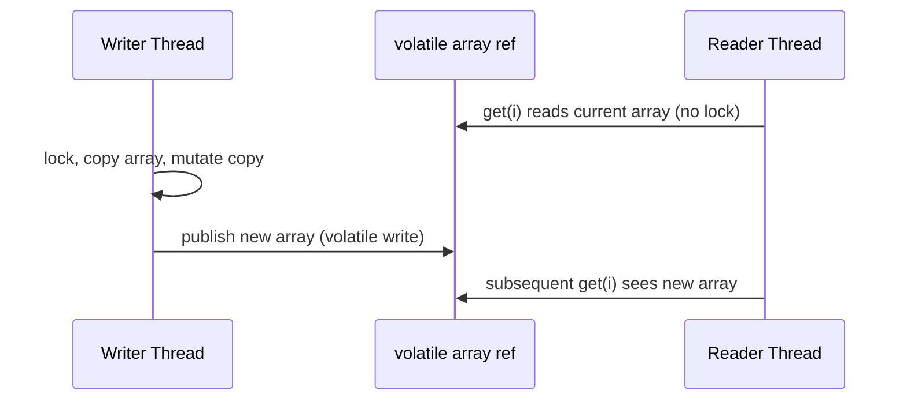
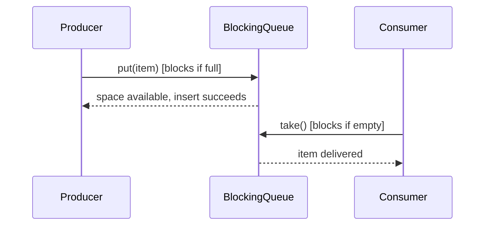
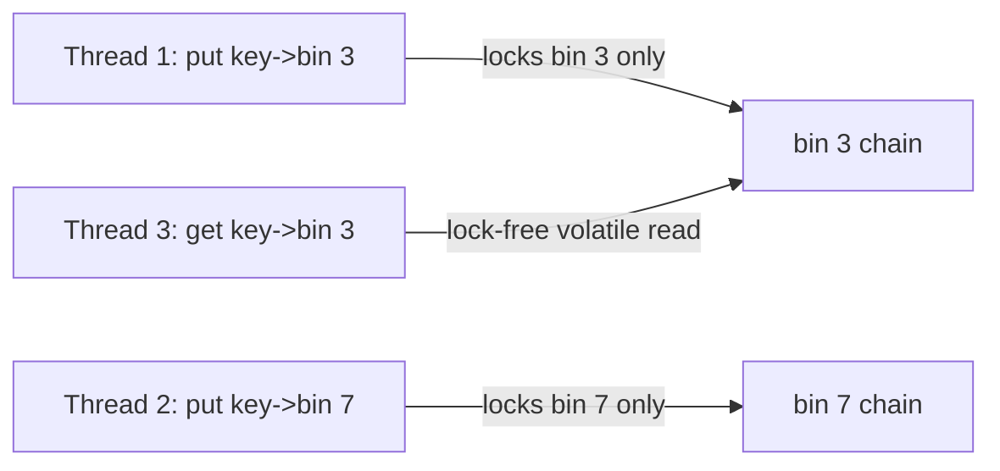
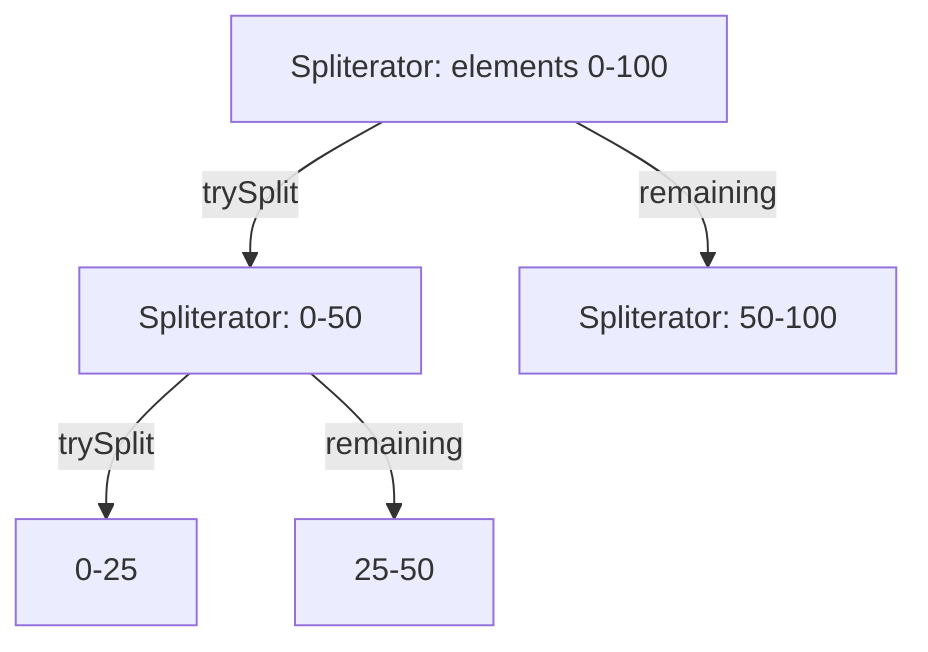

# 9. Collections Framework

## Collection Hierarchy

Complete hierarchy of the Java Collections Framework.

### List

#### ArrayList

##### Theory

- **Core Concepts**: `ArrayList<E>` is a resizable-array implementation of the `List` interface. It stores elements in a contiguous backing `Object[]` array and provides constant-time positional access via index.
- **Internal Working**: Backed by an `Object[] elementData`; grows by allocating a new, larger array and copying elements when capacity is exceeded (see Internal Working section for the growth formula).
- **When to Use It**: Default choice for a `List` when random access (`get(i)`) and iteration dominate and insert/remove happen mostly at the tail.
- **Advantages**: O(1) amortized `add` at the end, O(1) `get`/`set` by index, low per-element memory overhead compared to linked structures, cache-friendly due to contiguous memory.
- **Limitations**: O(n) insertion/removal in the middle or front (requires shifting), not thread-safe, resizing causes temporary 2x memory usage and copy cost, wastes some capacity (unused slots) until trimmed.

##### Internal Working

- **Step-by-Step Explanation**:
  1. Default no-arg constructor initializes `elementData` to a shared empty array (`DEFAULTCAPACITY_EMPTY_ELEMENTDATA`); actual array of size 10 is only allocated on the first `add`.
  2. `add(e)` places the element at `elementData[size]` then increments `size`, after calling `ensureCapacityInternal`.
  3. When `size == elementData.length`, `grow()` computes `newCapacity = oldCapacity + (oldCapacity >> 1)` (1.5x growth) and copies via `Arrays.copyOf`.
  4. `add(index, e)` and `remove(index)` use `System.arraycopy` to shift subsequent elements by one slot.
  5. `remove(Object)` scans linearly (using `equals`) to find the element, then shifts.
- **Memory Layout**: The `ArrayList` object itself lives on the heap with fields `elementData` (reference to an `Object[]` on the heap), `size` (int), and `modCount` (int, inherited from `AbstractList`). The backing array is a separate heap allocation; growth allocates a new array and lets the old one become garbage.
- **Diagrams**:

```
elementData: [ A | B | C | _ | _ | _ | _ | _ | _ | _ ]   size=3, capacity=10
add(D)   -> [ A | B | C | D | _ | _ | _ | _ | _ | _ ]   size=4
remove(1)-> [ A | C | D | _ | _ | _ | _ | _ | _ | _ ]   size=3 (B removed, C,D shifted left)
```

- **JVM Behaviour**: `add`/`get` compile to simple field access and array-index bytecode (`aaload`/`aastore`), which the JIT can inline and, in tight loops, vectorize or eliminate bounds checks (loop unrolling / range-check elimination). Growth triggers allocation on the young generation heap; frequently resized large lists can generate GC pressure and array-copy overhead. `modCount` is used for fail-fast iterator checks.

##### Interview Questions

- **Basic**: What is the default initial capacity of `ArrayList`? How does `ArrayList` differ from an array?
- **Intermediate**: Why is removing from the middle of an `ArrayList` O(n)? How does `ArrayList` grow internally?
- **Advanced**: How would you safely remove multiple elements while iterating an `ArrayList`? What's the cost of `ArrayList.subList()`?
- **Scenario-based**: You need a list that will hold 1,000,000 elements and only be appended to at the end—would you pre-size it, and why?

##### Detailed Answers

- **What is the default initial capacity of `ArrayList`? How does `ArrayList` differ from an array?** The default capacity is 10, but it's lazily allocated on the first insertion, not at construction. Unlike a raw array, `ArrayList` is resizable, stores only object references (autoboxing primitives), and exposes the `List` API (`add`, `remove`, iterators, etc.) with automatic capacity management.
- **Why is removing from the middle of an `ArrayList` O(n)? How does `ArrayList` grow internally?** Removing at index `i` requires shifting all elements after `i` one position left via `System.arraycopy`, an O(n) operation in the worst case. Growth occurs via `grow()`, which allocates a new array 1.5x the old capacity and copies all elements—also O(n), but amortized O(1) per `add` across many insertions.
- **How would you safely remove multiple elements while iterating an `ArrayList`? What's the cost of `ArrayList.subList()`?** Use an explicit `Iterator`/`ListIterator` and call `iterator.remove()`, or use `removeIf(predicate)` which handles this internally; iterating with a for-each loop and calling `list.remove()` directly throws `ConcurrentModificationException`. `subList()` returns a view (not a copy) backed by the same array, so structural changes are O(n) same as the parent, and it shares `modCount`, so concurrent structural changes to the parent invalidate the sublist view.
- **You need a list that will hold 1,000,000 elements and only be appended to at the end—would you pre-size it, and why?** Yes—use `new ArrayList<>(1_000_000)` to avoid repeated reallocation/copying during growth (which would otherwise trigger ~20 resize-and-copy cycles following the 1.5x growth curve), trading a single large upfront allocation for avoiding O(n) copy operations multiple times.

##### Code Examples

```java
import java.util.ArrayList;
import java.util.List;

public class ArrayListDemo {
    public static void main(String[] args) {
        // Pre-sizing avoids repeated internal array growth/copy cycles
        List<String> orders = new ArrayList<>(1_000);
        orders.add("ORD-1001");
        orders.add("ORD-1002");
        orders.add(1, "ORD-1050"); // O(n) shift

        // Safe removal during iteration using removeIf (avoids ConcurrentModificationException)
        orders.removeIf(id -> id.endsWith("1050"));

        // subList is a live view, not a copy
        List<String> view = orders.subList(0, orders.size());
        view.clear(); // also clears backing 'orders' list
        System.out.println(orders.isEmpty()); // true
    }
}
```

#### LinkedList

##### Theory

- **Core Concepts**: `LinkedList<E>` implements both `List` and `Deque` using a doubly-linked list of `Node<E>` objects, each holding references to the previous and next node plus the element.
- **Internal Working**: Maintains `first`/`last` node references; insertion/removal at known nodes is O(1), but positional access requires O(n) traversal from whichever end is closer.
- **When to Use It**: When the access pattern is dominated by insertions/removals at the head, tail, or via an iterator (not by index), or when used as a `Deque`/queue/stack.
- **Advantages**: O(1) insert/remove at both ends, implements `Deque` (usable as stack or queue), no resizing/copy cost, no wasted capacity.
- **Limitations**: O(n) random access (`get(i)` walks the list), higher per-element memory overhead (each `Node` has 2 references + object header vs. a plain array slot), poor cache locality due to scattered heap allocations.

##### Internal Working

- **Step-by-Step Explanation**:
  1. Each element is wrapped in a private static `Node<E>` with fields `item`, `next`, `prev`.
  2. `addFirst`/`addLast` update `first`/`last` pointers and link the new node in O(1).
  3. `get(index)` calls `node(index)` which decides to traverse from `first` or `last` depending on whether `index < size/2`, still O(n) worst case.
  4. `remove(Node<E> x)` unlinks by rewiring `x.prev.next` and `x.next.prev`, then nulls out fields on `x` to assist GC.
- **Memory Layout**: Each `Node` is a separate heap object (object header ~12-16 bytes + 2 references + 1 element reference), so a `LinkedList` of `n` elements costs significantly more heap memory than an `ArrayList` of the same size, and nodes are typically scattered across the heap, hurting CPU cache prefetching.
- **Diagrams**:

```
null <- [prev|A|next] <-> [prev|B|next] <-> [prev|C|next] -> null
         ^first                                ^last
```

- **JVM Behaviour**: Node allocation happens on every insert, increasing young-gen allocation rate and minor GC frequency under heavy churn compared to `ArrayList`'s batched array allocations. Pointer-chasing during traversal defeats CPU cache prefetching, making `LinkedList` iteration noticeably slower in practice despite equal Big-O for sequential traversal.

##### Interview Questions

- **Basic**: What interfaces does `LinkedList` implement? Why is `get(index)` slow on `LinkedList`?
- **Intermediate**: How does `LinkedList` implement `Deque` semantics (push/pop, offer/poll)?
- **Advanced**: Why does `LinkedList` typically perform worse than `ArrayDeque` even for queue-like usage?
- **Scenario-based**: You're implementing an LRU cache—would you use `LinkedList` or another structure, and why?

##### Detailed Answers

- **What interfaces does `LinkedList` implement? Why is `get(index)` slow on `LinkedList`?** It implements `List`, `Deque` (and transitively `Queue`), and `Cloneable`/`Serializable`. `get(index)` is slow because there's no array to index into directly—the implementation must traverse node-by-node from the nearer end, giving O(n) in the worst case (e.g., middle-of-list access).
- **How does `LinkedList` implement `Deque` semantics (push/pop, offer/poll)?** `push`/`pop` operate on the head (LIFO stack semantics, delegating to `addFirst`/`removeFirst`), while `offer`/`poll` operate on the tail/head for FIFO queue semantics (`offer` = `addLast`, `poll` = `removeFirst`). All are O(1) since they only touch the `first`/`last` node pointers.
- **Why does `LinkedList` typically perform worse than `ArrayDeque` even for queue-like usage?** `ArrayDeque` uses a circular array internally, giving better cache locality and no per-element object/node allocation overhead, whereas `LinkedList` allocates a `Node` object per element (extra header + pointers) and suffers cache misses from pointer chasing. The JDK docs explicitly recommend `ArrayDeque` over `LinkedList` for stack/queue use cases.
- **You're implementing an LRU cache—would you use `LinkedList` or another structure, and why?** Prefer `LinkedHashMap` with `accessOrder=true` (overriding `removeEldestEntry`), since it combines O(1) hash lookup with an internal doubly-linked list for eviction ordering in a single structure; a hand-rolled `LinkedList` + `HashMap` combo replicates this but with more code and no real performance advantage.

##### Code Examples

```java
import java.util.LinkedList;
import java.util.Deque;

public class LinkedListDemo {
    public static void main(String[] args) {
        // Using LinkedList as a Deque (stack + queue behavior)
        Deque<Integer> deque = new LinkedList<>();
        deque.addFirst(1); // [1]
        deque.addLast(2);  // [1, 2]
        deque.push(0);     // [0, 1, 2] - push adds at head
        System.out.println(deque.pollFirst()); // 0 - O(1)
        System.out.println(deque.pollLast());  // 2 - O(1)

        // get(index) requires O(n) traversal - avoid in hot loops
        LinkedList<String> list = new LinkedList<>(java.util.List.of("a", "b", "c", "d"));
        System.out.println(list.get(2)); // traverses from nearer end
    }
}
```

#### Vector

##### Theory

- **Core Concepts**: `Vector<E>` is a legacy (JDK 1.0) resizable-array `List` implementation, functionally similar to `ArrayList` but with every public method declared `synchronized`.
- **Internal Working**: Same array-based growth strategy as `ArrayList`, except default growth doubles capacity (100%) rather than 1.5x, and every mutating/accessing method acquires the object's intrinsic lock.
- **When to Use It**: Essentially never in new code; retained for legacy API compatibility (e.g., older APIs that still expose `Vector`/`Enumeration`).
- **Advantages**: Built-in thread-safety for simple single-method operations without extra synchronization code.
- **Limitations**: Coarse-grained per-method locking causes high contention and poor scalability under concurrency; compound operations (check-then-act) are still not atomic; `Enumeration` is a legacy, slower iteration API; superseded by `Collections.synchronizedList` or (preferably) `CopyOnWriteArrayList`/`ConcurrentHashMap`-based structures.

##### Internal Working

- **Step-by-Step Explanation**:
  1. Backing `Object[] elementData`, `elementCount` field (analogous to `size`).
  2. Every method (`add`, `get`, `size`, etc.) is `synchronized`, using the `Vector` instance itself as the monitor.
  3. Growth: if `capacityIncrement > 0`, grows by that fixed amount; otherwise doubles current capacity.
  4. Iteration via legacy `Enumeration` or modern `Iterator` (the latter is still fail-fast via `modCount`).
- **Memory Layout**: Identical array-based layout to `ArrayList` on the heap; the only structural difference is the intrinsic lock overhead (object header's mark word used for synchronization, potential lock inflation under contention).
- **Diagrams**:

```
Thread A ---> synchronized method ---> [lock acquired] ---> elementData[] ---> [lock released]
Thread B ---> blocked waiting for lock  ---------------------------------------->
```

- **JVM Behaviour**: Uninflated/uncontended locks use fast biased/thin locking, but under real contention the JVM inflates to heavyweight monitors, causing thread parking/unparking via OS calls—significantly slower than lock-free or striped-lock alternatives like `ConcurrentHashMap`.

##### Interview Questions

- **Basic**: How does `Vector` differ from `ArrayList`?
- **Intermediate**: Is `Vector` fully thread-safe for compound operations like "check size then add"?
- **Advanced**: Why is `Vector` considered obsolete compared to `Collections.synchronizedList` or `CopyOnWriteArrayList`?

##### Detailed Answers

- **How does `Vector` differ from `ArrayList`?** Functionally both are array-backed `List`s, but `Vector`'s methods are all `synchronized` (thread-safe but slower under contention) and it defaults to doubling capacity on growth versus `ArrayList`'s 1.5x. `Vector` also predates the Collections Framework and implements the legacy `Enumeration`.
- **Is `Vector` fully thread-safe for compound operations like "check size then add"?** No—individual methods are atomic, but compound sequences like `if (!v.contains(x)) v.add(x)` are not atomic as a whole; another thread can interleave between the two calls, so external synchronization (`synchronized(v) { ... }`) is still required for such compound actions.
- **Why is `Vector` considered obsolete compared to `Collections.synchronizedList` or `CopyOnWriteArrayList`?** `Vector` bakes synchronization into the class itself (inflexible, always pays the locking cost even single-threaded), whereas `Collections.synchronizedList` lets you wrap only when needed, and `CopyOnWriteArrayList` offers lock-free reads for read-heavy concurrent workloads—both are generally preferred idioms in modern code, with `Vector` kept mainly for backward compatibility.

##### Code Examples

```java
import java.util.Vector;

public class VectorDemo {
    public static void main(String[] args) {
        Vector<Integer> v = new Vector<>();
        v.add(1);
        v.add(2);

        // Individual methods are synchronized, but compound actions need explicit locking
        synchronized (v) {
            if (!v.contains(3)) {
                v.add(3);
            }
        }
        System.out.println(v); // [1, 2, 3]
    }
}
```

#### Stack

##### Theory

- **Core Concepts**: `java.util.Stack<E>` is a legacy class extending `Vector` that adds LIFO stack operations (`push`, `pop`, `peek`, `search`).
- **Internal Working**: Inherits `Vector`'s synchronized array-backed storage; `push` delegates to `addElement`, `pop`/`peek` access the last index.
- **When to Use It**: Avoid in new code; use `ArrayDeque` (via `push`/`pop`) for a non-synchronized, more efficient stack, or `ConcurrentLinkedDeque` for concurrent use.
- **Advantages**: Simple, familiar stack API; inherited thread-safety from `Vector` for individual operations.
- **Limitations**: Extending `Vector` is a design flaw—exposes the full `List` API (e.g., `insertElementAt` in the middle), breaking strict stack semantics; inherits `Vector`'s synchronization overhead even in single-threaded use; the JDK docs explicitly recommend `Deque` implementations instead.

##### Internal Working

- **Step-by-Step Explanation**:
  1. `push(item)` calls `addElement(item)` (inherited from `Vector`), appending to the backing array.
  2. `pop()` reads and removes the last element (`elementCount - 1`), throwing `EmptyStackException` if empty.
  3. `peek()` returns the last element without removing it.
  4. `search(o)` scans from the top down and returns 1-based distance from the top, or -1 if absent.
- **Memory Layout**: Same as `Vector`—contiguous `Object[]` on the heap, growth by doubling.
- **Diagrams**:

```
top -> [ C ]
       [ B ]
       [ A ]   (bottom, index 0)
push(D): [ D, C, B, A ] conceptually; physically appended at elementData[size]
```

- **JVM Behaviour**: Same locking overhead considerations as `Vector`, since every operation is synchronized at the method level.

##### Interview Questions

- **Basic**: What does `java.util.Stack` extend, and why is that considered a design mistake?
- **Intermediate**: What does `ArrayDeque` offer over `Stack` for stack semantics?

##### Detailed Answers

- **What does `java.util.Stack` extend, and why is that considered a design mistake?** It extends `Vector`, which means a `Stack` instance exposes arbitrary `List` operations like `add(index, e)` or `remove(index)` that can violate LIFO ordering—callers can insert/remove at arbitrary positions, breaking the stack invariant, which is a classic "favor composition over inheritance" violation.
- **What does `ArrayDeque` offer over `Stack` for stack semantics?** `ArrayDeque` is not synchronized (faster in single-threaded contexts), uses a circular array (no legacy baggage), doesn't expose arbitrary positional mutation, and is explicitly recommended by the JDK documentation as a faster stack implementation via its `push`/`pop`/`peek` methods.

##### Code Examples

```java
import java.util.Stack;
import java.util.ArrayDeque;
import java.util.Deque;

public class StackDemo {
    public static void main(String[] args) {
        Stack<Integer> legacyStack = new Stack<>();
        legacyStack.push(1);
        legacyStack.push(2);
        System.out.println(legacyStack.pop()); // 2

        // Preferred modern replacement - faster, no synchronization overhead
        Deque<Integer> modernStack = new ArrayDeque<>();
        modernStack.push(1);
        modernStack.push(2);
        System.out.println(modernStack.pop()); // 2
    }
}
```

#### CopyOnWriteArrayList

##### Theory

- **Core Concepts**: `CopyOnWriteArrayList<E>` is a thread-safe `List` where every mutating operation (`add`, `set`, `remove`) creates a fresh copy of the underlying array rather than modifying it in place.
- **Internal Working**: Holds a `volatile Object[] array`; writes synchronize on an internal lock, clone the array, mutate the clone, and then publish it by replacing the `volatile` reference.
- **When to Use It**: Read-heavy, write-rare concurrent scenarios (e.g., listener/observer lists, configuration snapshots read by many threads).
- **Advantages**: Lock-free, wait-free reads (no synchronization needed to read); iterators never throw `ConcurrentModificationException` (they iterate a stable snapshot); safe for concurrent iteration while another thread mutates.
- **Limitations**: Every write is O(n) (full array copy), so it's unsuitable for write-heavy workloads; memory spikes during writes (old + new array coexist momentarily); iterators reflect a snapshot at creation time, not subsequent modifications (weakly consistent, not "live").

##### Internal Working

- **Step-by-Step Explanation**:
  1. Reads (`get(i)`) directly index into the current `volatile array` reference with no locking—always see a consistent, complete snapshot.
  2. Writes acquire a `ReentrantLock`, read the current array, `Arrays.copyOf` it (or copy with the added/removed element), then assign the new array back to the `volatile` field.
  3. Because assignment to a `volatile` field is atomic and establishes happens-before, readers either see the whole old array or the whole new array, never a partial update.
  4. Iterators created via `iterator()` capture the array reference at creation time and iterate over it without ever calling `next()` against a moving target.
- **Memory Layout**: Two full backing arrays can exist simultaneously during a write (old snapshot still referenced by in-flight iterators, new array just published), leading to temporary 2x memory usage proportional to list size—costly for large lists under frequent writes.
- **Diagrams**:



- **JVM Behaviour**: The `volatile` field enforces a memory barrier ensuring visibility across threads without requiring readers to synchronize; the JIT cannot cache/reorder across this barrier. Frequent writes generate heavy allocation and garbage (discarded old arrays), increasing GC churn.

##### Interview Questions

- **Basic**: What guarantee does `CopyOnWriteArrayList` provide for iterators?
- **Intermediate**: Why is `CopyOnWriteArrayList` a poor choice for write-heavy workloads?
- **Advanced**: How does `CopyOnWriteArrayList` achieve thread-safe reads without locking?
- **Scenario-based**: You have a list of event listeners rarely added/removed but frequently iterated to fire events from multiple threads—would you choose `CopyOnWriteArrayList`?

##### Detailed Answers

- **What guarantee does `CopyOnWriteArrayList` provide for iterators?** Iterators operate over a fixed snapshot of the array taken at iterator-creation time; they never throw `ConcurrentModificationException` and will not reflect additions/removals made after the iterator was created (weakly consistent semantics), unlike `ArrayList`'s fail-fast iterators.
- **Why is `CopyOnWriteArrayList` a poor choice for write-heavy workloads?** Every single mutation copies the entire backing array (O(n) time and temporary O(n) extra memory), so under frequent writes on large lists, both CPU and GC overhead grow linearly with list size per write, making throughput far worse than `ArrayList` with external locking or `ConcurrentLinkedDeque`-style structures for write-heavy cases.
- **How does `CopyOnWriteArrayList` achieve thread-safe reads without locking?** Reads simply dereference a `volatile` array field; since writes always publish a fully-formed new array atomically via that `volatile` reference (never mutating shared state in place), readers can safely access the array without synchronization—visibility is guaranteed by the volatile happens-before relationship, and there's never a partially-updated array visible.
- **You have a list of event listeners rarely added/removed but frequently iterated to fire events from multiple threads—would you choose `CopyOnWriteArrayList`?** Yes, this is the canonical use case: reads (iteration to fire events) vastly outnumber writes (listener registration/removal), so the O(n) write cost is amortized rarely while reads remain fast and lock-free with no risk of `ConcurrentModificationException` during concurrent firing.

##### Code Examples

```java
import java.util.List;
import java.util.concurrent.CopyOnWriteArrayList;

public class CopyOnWriteArrayListDemo {
    interface Listener { void onEvent(String event); }

    public static void main(String[] args) {
        List<Listener> listeners = new CopyOnWriteArrayList<>();
        listeners.add(e -> System.out.println("Listener1 got: " + e));

        // Safe to iterate while another thread mutates the list concurrently
        Thread firer = new Thread(() -> {
            for (Listener l : listeners) { // snapshot iteration, no CME
                l.onEvent("OrderPlaced");
            }
        });
        Thread registrar = new Thread(() ->
            listeners.add(e -> System.out.println("Listener2 got: " + e)));

        firer.start();
        registrar.start();
    }
}
```

### Queue

#### Queue

##### Theory

- **Core Concepts**: `Queue<E>` is an interface representing a FIFO (typically) collection designed for holding elements prior to processing, extending `Collection` with insertion, removal, and inspection operations that come in two flavors: throwing-exception (`add`, `remove`, `element`) and returning-special-value (`offer`, `poll`, `peek`).
- **Internal Working**: An abstraction implemented by `LinkedList`, `ArrayDeque`, `PriorityQueue`, and the `java.util.concurrent` blocking queues—each with different ordering and concurrency semantics.
- **When to Use It**: Anytime you need producer/consumer style processing, task scheduling, or breadth-first traversal buffers.
- **Advantages**: Well-defined, minimal API contract; multiple implementations let you choose the right ordering/concurrency trade-off without changing calling code.
- **Limitations**: The interface itself makes no ordering guarantee beyond "FIFO-like"—`PriorityQueue` breaks strict FIFO by ordering via `Comparable`/`Comparator`, which can surprise callers who assume insertion order.

##### Internal Working

- **Step-by-Step Explanation**:
  1. `offer(e)` attempts to insert, returning `false` on capacity-bounded failure (vs `add` which throws `IllegalStateException`).
  2. `poll()` removes and returns the head, or `null` if empty (vs `remove()` which throws `NoSuchElementException`).
  3. `peek()` inspects the head without removing it, returning `null` if empty (vs `element()` which throws).
- **Memory Layout**: Not directly applicable—`Queue` is an interface; memory characteristics depend entirely on the concrete implementation chosen.
- **Diagrams**:

```
enqueue (offer) ---> [ tail ... head ] ---> dequeue (poll)
```

- **JVM Behaviour**: As an interface, `Queue` itself has no runtime behavior; calls are dispatched virtually (invokeinterface) to the concrete implementation's methods.

##### Interview Questions

- **Basic**: What's the difference between `add`/`offer` and `remove`/`poll` in the `Queue` interface?
- **Intermediate**: Name three implementations of `Queue` and how their ordering differs.

##### Detailed Answers

- **What's the difference between `add`/`offer` and `remove`/`poll` in the `Queue` interface?** `add`/`remove`/`element` throw exceptions (`IllegalStateException`/`NoSuchElementException`) on failure (e.g., full/empty queue), while `offer`/`poll`/`peek` return a special value (`false`/`null`) instead—the latter is generally preferred for capacity-bounded queues where failure is a normal condition, not exceptional.
- **Name three implementations of `Queue` and how their ordering differs.** `LinkedList` provides FIFO ordering via a doubly-linked list; `ArrayDeque` provides FIFO (or LIFO when used as a stack) via a circular array; `PriorityQueue` orders elements by natural ordering or a supplied `Comparator` rather than insertion order, always exposing the smallest (or highest-priority) element at the head.

##### Code Examples

```java
import java.util.Queue;
import java.util.LinkedList;

public class QueueDemo {
    public static void main(String[] args) {
        Queue<String> tasks = new LinkedList<>();
        tasks.offer("task1");
        tasks.offer("task2");
        System.out.println(tasks.poll()); // task1 (FIFO)
        System.out.println(tasks.peek()); // task2, not removed
    }
}
```

#### Deque

##### Theory

- **Core Concepts**: `Deque<E>` ("double-ended queue") extends `Queue` to support insertion, removal, and inspection at both ends, and can serve as either a FIFO queue or a LIFO stack.
- **Internal Working**: Adds `addFirst`/`addLast`, `removeFirst`/`removeLast`, `peekFirst`/`peekLast`, plus `push`/`pop` (stack aliases for `addFirst`/`removeFirst`).
- **When to Use It**: Sliding-window algorithms, undo/redo stacks, work-stealing deques, or whenever both head and tail access are needed.
- **Advantages**: Single interface serving both stack and queue use cases; implementations (`ArrayDeque`) are generally faster than `Stack`/`LinkedList` for these roles.
- **Limitations**: Richer API surface can be misused (e.g., calling both queue and stack methods on the same deque, creating ambiguous ordering semantics in code); `null` elements are prohibited (used internally as a sentinel for "empty").

##### Internal Working

- **Step-by-Step Explanation**:
  1. `push(e)` = `addFirst(e)`; `pop()` = `removeFirst()`—gives LIFO stack behavior.
  2. `offer(e)` = `offerLast(e)`; `poll()` = `pollFirst()`—gives FIFO queue behavior.
  3. Both ends support O(1) operations in efficient implementations like `ArrayDeque`.
- **Memory Layout**: Not directly applicable at the interface level; see `ArrayDeque` for concrete layout.
- **Diagrams**:

```
addFirst <- [ head ... tail ] -> addLast
removeFirst <- [ head ... tail ] -> removeLast
```

- **JVM Behaviour**: Interface dispatch only; runtime characteristics depend on implementation (`ArrayDeque`, `LinkedList`, `ConcurrentLinkedDeque`).

##### Interview Questions

- **Basic**: How does `Deque` differ from `Queue`?
- **Intermediate**: How can `Deque` be used to implement both a stack and a queue with the same object?

##### Detailed Answers

- **How does `Deque` differ from `Queue`?** `Queue` only exposes single-ended (tail-insert, head-remove) operations, while `Deque` exposes operations at both ends (`First`/`Last` variants), making it strictly more capable—any `Queue` usage can be expressed via `Deque`, but not vice versa.
- **How can `Deque` be used to implement both a stack and a queue with the same object?** Using `push`/`pop` (which operate on the head) gives LIFO stack semantics, while using `offer`/`poll` (tail-insert, head-remove) gives FIFO queue semantics—the same `ArrayDeque` instance can serve either role depending on which method pair the caller uses, though mixing both in the same code path is discouraged for clarity.

##### Code Examples

```java
import java.util.Deque;
import java.util.ArrayDeque;

public class DequeDemo {
    public static void main(String[] args) {
        Deque<Integer> deque = new ArrayDeque<>();
        deque.addFirst(1);
        deque.addLast(2);
        deque.addFirst(0);
        System.out.println(deque); // [0, 1, 2]
        System.out.println(deque.pollFirst()); // 0
        System.out.println(deque.pollLast());  // 2
    }
}
```

#### ArrayDeque

##### Theory

- **Core Concepts**: `ArrayDeque<E>` is a resizable circular-array implementation of `Deque`, offering O(1) amortized insertion/removal at both ends without any node allocation.
- **Internal Working**: Uses a circular buffer (`Object[] elements`) with `head` and `tail` indices that wrap around using bitmasking (`(index + 1) & (elements.length - 1)`); capacity is always a power of two to make the modulo-via-mask trick work.
- **When to Use It**: Recommended by the JDK as the default choice for both stack and queue use cases, replacing `Stack` and `LinkedList` in those roles.
- **Advantages**: Faster than `Stack`/`LinkedList` for stack/queue operations (no per-element object allocation, better cache locality), O(1) at both ends, lower memory overhead per element than `LinkedList`.
- **Limitations**: Does not support `null` elements (used internally as "slot empty" sentinel); not thread-safe; as a `List`-like random-access structure it's unsuitable (no index-based `get`).

##### Internal Working

- **Step-by-Step Explanation**:
  1. Backing array size is always a power of 2 (starts at 16 by default), enabling `index & (length - 1)` instead of the slower `%` operator for wraparound.
  2. `addFirst(e)` decrements `head` (wrapping via mask) and stores at the new `head`; `addLast(e)` stores at `tail` then increments `tail`.
  3. When `head == tail` after an add (array full), `doubleCapacity()` allocates a new array of 2x size and copies elements so they're contiguous starting at index 0.
  4. Removal nulls out the vacated slot (to avoid memory leaks / stale references) and advances the corresponding index.
- **Memory Layout**: Single contiguous `Object[]` on the heap, similar to `ArrayList` but treated as circular; no per-element wrapper objects, giving better cache locality than `LinkedList`.
- **Diagrams**:

```
index:   0    1    2    3    4    5    6    7
array: [ _ , tail=E, F, _ , _ , _ , head=C, D ]  (wraps around from 7 back to 0)
logical order from head: C, D, E, F
```

- **JVM Behaviour**: Bitmask-based index wraparound compiles to a simple AND instruction, cheaper than modulo; doubling capacity triggers a young-gen array allocation and `System.arraycopy`, same GC considerations as `ArrayList` growth.

##### Interview Questions

- **Basic**: Why does `ArrayDeque` not allow `null` elements?
- **Intermediate**: Why is capacity always a power of two in `ArrayDeque`?
- **Advanced**: Why does the JDK recommend `ArrayDeque` over both `Stack` and `LinkedList`?

##### Detailed Answers

- **Why does `ArrayDeque` not allow `null` elements?** `null` is used internally as a sentinel to indicate an empty slot/absence of an element (e.g., `poll()` returning `null` to signal an empty deque); allowing `null` elements would make it impossible to distinguish "empty deque" from "deque containing a null".
- **Why is capacity always a power of two in `ArrayDeque`?** So that wraparound arithmetic can use fast bitwise AND (`index & (capacity - 1)`) instead of the more expensive modulo operator, and so `doubleCapacity()` cleanly doubles without fragmentation.
- **Why does the JDK recommend `ArrayDeque` over both `Stack` and `LinkedList`?** Versus `Stack`, it avoids `Vector`'s synchronization overhead and exposes a cleaner API without arbitrary positional mutation. Versus `LinkedList`, it avoids per-element `Node` allocation and pointer-chasing, giving better cache locality and typically faster real-world performance for stack/queue workloads, despite both being O(1) at the ends in Big-O terms.

##### Code Examples

```java
import java.util.ArrayDeque;
import java.util.Deque;

public class ArrayDequeDemo {
    public static void main(String[] args) {
        Deque<Integer> stack = new ArrayDeque<>();
        stack.push(1);
        stack.push(2);
        stack.push(3);
        System.out.println(stack.pop()); // 3 - LIFO

        Deque<Integer> queue = new ArrayDeque<>();
        queue.offer(1);
        queue.offer(2);
        queue.offer(3);
        System.out.println(queue.poll()); // 1 - FIFO
    }
}
```

#### PriorityQueue

##### Theory

- **Core Concepts**: `PriorityQueue<E>` is an unbounded priority heap-based queue where elements are ordered by natural ordering (`Comparable`) or a supplied `Comparator`, and the head is always the smallest (or highest-priority) element.
- **Internal Working**: Backed by a binary min-heap stored in a resizable array, maintaining the heap invariant via sift-up (on insert) and sift-down (on remove) operations.
- **When to Use It**: Task scheduling by priority, Dijkstra's/Prim's algorithms, top-K element selection, event-driven simulations.
- **Advantages**: O(log n) insertion and removal of the minimum, O(1) peek at the minimum, more memory-efficient than a sorted list for this access pattern.
- **Limitations**: Not thread-safe (use `PriorityBlockingQueue` for concurrent access); iteration order is NOT sorted order (only the head is guaranteed smallest); no `null` elements allowed; not stable for equal-priority elements.

##### Internal Working

- **Step-by-Step Explanation**:
  1. Elements are stored in an array representing a complete binary tree: for index `i`, children are at `2i+1` and `2i+2`, parent at `(i-1)/2`.
  2. `offer(e)` appends at the end of the array then "sifts up": repeatedly swaps with its parent while smaller than the parent, until the heap property holds.
  3. `poll()` saves the root (index 0, the minimum), moves the last element to the root, then "sifts down": swaps with the smaller child repeatedly until the heap property is restored.
  4. Comparisons use the natural `Comparable` ordering or the supplied `Comparator` passed at construction.
- **Memory Layout**: Single backing `Object[]` array on the heap (grows similarly to `ArrayList`, doubling for small arrays, growing by 50% for larger ones); no separate node objects—the tree structure is implicit via array indices, giving good cache locality.
- **Diagrams**:

```
Heap (min at root):        Array representation:
        1                  [1, 3, 2, 5, 4, 8]
       / \                  index: 0  1  2  3  4  5
      3   2                 parent(i) = (i-1)/2
     / \ /                  left(i)=2i+1, right(i)=2i+2
    5  4 8
```

- **JVM Behaviour**: Sift-up/sift-down are tight loops over an array with comparator calls—the JIT can inline small `Comparator.compare` implementations effectively; heap operations don't require pointer-chasing, unlike a tree-based priority structure, so they benefit from array cache locality.

##### Interview Questions

- **Basic**: What ordering does iterating over a `PriorityQueue` give you?
- **Intermediate**: What is the time complexity of `offer` and `poll` on a `PriorityQueue`, and why?
- **Advanced**: How would you get elements out of a `PriorityQueue` in fully sorted order?
- **Scenario-based**: You need the top 10 highest-scoring items from a stream of a million scores—how would you use `PriorityQueue` efficiently?

##### Detailed Answers

- **What ordering does iterating over a `PriorityQueue` give you?** No ordering guarantee at all—the iterator traverses the internal array in heap storage order, not sorted order; only `peek()`/`poll()` are guaranteed to return the minimum (or comparator-defined "first") element.
- **What is the time complexity of `offer` and `poll` on a `PriorityQueue`, and why?** Both are O(log n) because they require sift-up or sift-down operations that traverse at most the height of the binary heap (log n levels); `peek()` is O(1) since the minimum is always at the root/array index 0.
- **How would you get elements out of a `PriorityQueue` in fully sorted order?** Repeatedly call `poll()` until the queue is empty—this yields elements in ascending (or comparator-defined) order, effectively performing heap sort; alternatively, copy to a list and call `Collections.sort()` if you don't need to preserve the queue.
- **You need the top 10 highest-scoring items from a stream of a million scores—how would you use `PriorityQueue` efficiently?** Maintain a min-heap `PriorityQueue` of bounded size 10: for each new score, if the heap has fewer than 10 elements, offer it; otherwise compare to `peek()` (the current smallest of the top-10) and, if the new score is larger, `poll()` the smallest and `offer()` the new one. This keeps memory at O(10) and total time at O(n log 10) instead of sorting all million elements.

##### Code Examples

```java
import java.util.PriorityQueue;
import java.util.Comparator;

public class PriorityQueueDemo {
    record Task(String name, int priority) {}

    public static void main(String[] args) {
        // Min-heap by priority (lower number = higher priority)
        PriorityQueue<Task> pq = new PriorityQueue<>(Comparator.comparingInt(Task::priority));
        pq.offer(new Task("low", 3));
        pq.offer(new Task("urgent", 1));
        pq.offer(new Task("medium", 2));

        while (!pq.isEmpty()) {
            System.out.println(pq.poll()); // urgent(1), medium(2), low(3) - sorted via repeated poll
        }

        // Bounded top-K pattern: keep only the 2 highest scores seen
        PriorityQueue<Integer> topK = new PriorityQueue<>(); // min-heap
        int k = 2;
        for (int score : new int[]{5, 1, 9, 3, 7}) {
            topK.offer(score);
            if (topK.size() > k) topK.poll(); // evict current smallest
        }
        System.out.println(topK); // contains the 2 highest scores: 7 and 9 (heap order)
    }
}
```

#### BlockingQueue

##### Theory

- **Core Concepts**: `BlockingQueue<E>` (in `java.util.concurrent`) extends `Queue` with operations that block the calling thread until space becomes available (for inserts) or an element becomes available (for removals), forming the backbone of producer-consumer patterns.
- **Internal Working**: Implementations like `ArrayBlockingQueue`, `LinkedBlockingQueue`, `PriorityBlockingQueue`, and `SynchronousQueue` use locks/condition variables (or CAS) internally to coordinate blocking `put`/`take` calls between producer and consumer threads.
- **When to Use It**: Building thread pools' work queues, producer-consumer pipelines, bounded buffering between stages of a pipeline.
- **Advantages**: Built-in thread coordination (no manual `wait`/`notify`), supports bounded capacity for backpressure, offers both blocking (`put`/`take`) and timed (`offer(e, timeout, unit)`) variants.
- **Limitations**: Blocking calls can deadlock or hang if not paired with proper interrupt handling; unbounded queues (e.g., default `LinkedBlockingQueue`) can hide memory leaks by growing indefinitely if consumers stall.

##### Internal Working

- **Step-by-Step Explanation**:
  1. `put(e)` blocks the producer thread if the queue is at capacity, waiting on a "not full" condition variable until a consumer makes room.
  2. `take()` blocks the consumer thread if the queue is empty, waiting on a "not empty" condition until a producer inserts an element.
  3. `ArrayBlockingQueue` uses a single `ReentrantLock` with two `Condition`s (`notFull`, `notEmpty`) guarding a circular array.
  4. `LinkedBlockingQueue` uses two separate locks (one for `put`, one for `take`) to allow concurrent enqueue/dequeue, improving throughput over a single-lock design.
- **Memory Layout**: `ArrayBlockingQueue` uses a fixed-size circular array allocated once (bounded memory); `LinkedBlockingQueue` uses linked nodes allocated per element (unbounded by default, memory grows with backlog).
- **Diagrams**:



- **JVM Behaviour**: Blocked threads via `Condition.await()` are parked (`LockSupport.park`) by the JVM, releasing the CPU rather than busy-waiting; the underlying lock/condition mechanism relies on `AbstractQueuedSynchronizer` (AQS) machinery shared with other `java.util.concurrent` primitives.

##### Interview Questions

- **Basic**: What is the core difference between `BlockingQueue` and a plain `Queue`?
- **Intermediate**: How does `ArrayBlockingQueue` differ from `LinkedBlockingQueue` in terms of capacity and locking?
- **Advanced**: How would you build a simple thread pool's task queue using `BlockingQueue`?
- **Scenario-based**: A producer is much faster than the consumer—how does a bounded `BlockingQueue` prevent memory exhaustion?

##### Detailed Answers

- **What is the core difference between `BlockingQueue` and a plain `Queue`?** `Queue` methods either throw or return a sentinel on failure (full/empty), whereas `BlockingQueue` adds `put`/`take` methods that block the calling thread until the operation can succeed, plus timed variants (`offer(e, time, unit)`/`poll(time, unit)`)—making it suitable for direct producer-consumer coordination without manual wait/notify code.
- **How does `ArrayBlockingQueue` differ from `LinkedBlockingQueue` in terms of capacity and locking?** `ArrayBlockingQueue` is always bounded (fixed capacity set at construction) and uses a single lock for both put and take, potentially limiting throughput under high contention. `LinkedBlockingQueue` can be bounded or unbounded (defaults to `Integer.MAX_VALUE`) and uses two separate locks for put and take, allowing producers and consumers to proceed concurrently for better throughput.
- **How would you build a simple thread pool's task queue using `BlockingQueue`?** Worker threads loop calling `queue.take()` to block until a task is available, execute it, then loop again; the pool's `submit()` method calls `queue.put(task)` (or `offer` with a timeout to reject when saturated), exactly mirroring how `ThreadPoolExecutor` uses its internal `BlockingQueue<Runnable>` work queue.
- **A producer is much faster than the consumer—how does a bounded `BlockingQueue` prevent memory exhaustion?** Once the queue reaches its configured capacity, `put()` blocks the producer thread until the consumer drains an element, naturally applying backpressure that caps the memory used by queued elements at `capacity × element size`, rather than allowing an unbounded backlog to accumulate and exhaust heap memory.

##### Code Examples

```java
import java.util.concurrent.ArrayBlockingQueue;
import java.util.concurrent.BlockingQueue;

public class BlockingQueueDemo {
    public static void main(String[] args) throws InterruptedException {
        BlockingQueue<Integer> queue = new ArrayBlockingQueue<>(2); // bounded capacity applies backpressure

        Thread producer = new Thread(() -> {
            try {
                for (int i = 0; i < 5; i++) {
                    queue.put(i); // blocks when queue is full
                    System.out.println("Produced: " + i);
                }
            } catch (InterruptedException e) {
                Thread.currentThread().interrupt();
            }
        });

        Thread consumer = new Thread(() -> {
            try {
                for (int i = 0; i < 5; i++) {
                    int item = queue.take(); // blocks when queue is empty
                    System.out.println("Consumed: " + item);
                }
            } catch (InterruptedException e) {
                Thread.currentThread().interrupt();
            }
        });

        producer.start();
        consumer.start();
        producer.join();
        consumer.join();
    }
}
```

### Set

#### HashSet

##### Theory

- **Core Concepts**: `HashSet<E>` implements `Set` (no duplicate elements, no defined iteration order) by internally delegating to a `HashMap<E, Object>`, storing each element as a key mapped to a shared dummy value.
- **Internal Working**: `add(e)` is implemented as `map.put(e, PRESENT)` where `PRESENT` is a static sentinel `Object`; uniqueness and O(1) average lookup come directly from `HashMap`'s hashing/bucket mechanics.
- **When to Use It**: Default choice for a `Set` when you need fast membership testing/deduplication and don't care about iteration order.
- **Advantages**: O(1) average-time `add`/`remove`/`contains`; no ordering overhead.
- **Limitations**: No guaranteed iteration order (order can change across JDK versions or after rehash); requires well-implemented `hashCode()`/`equals()` on elements; not thread-safe.

##### Internal Working

- **Step-by-Step Explanation**:
  1. Construction creates an internal `HashMap` (same default capacity 16, load factor 0.75).
  2. `add(e)`: computes `e.hashCode()`, spreads it, locates the bucket, and calls `put` on the backing map—returns `true` only if no equal key existed before (i.e., `map.put` returned `null`).
  3. `contains(e)` and `remove(e)` delegate directly to `map.containsKey(e)`/`map.remove(e)`.
  4. Iteration order follows the backing `HashMap`'s bucket traversal order, which depends on hash codes and table size, not insertion order.
- **Memory Layout**: Each element effectively costs one `HashMap.Node` (hash, key, value=PRESENT constant, next pointer) on the heap—slightly more overhead per element than a raw array-based structure since PRESENT is shared, but each entry object is still individually allocated.
- **Diagrams**:

```
HashSet.add("x")  --->  backingMap.put("x", PRESENT)
buckets: [0]->null  [1]->("x",PRESENT)  [2]->("y",PRESENT)->("z",PRESENT)
```

- **JVM Behaviour**: Identical to `HashMap`'s (hash spreading, bucket indexing, treeification of long bins into red-black trees under heavy collision)—see the HashMap Internal Implementation sections for bytecode/JIT specifics.

##### Interview Questions

- **Basic**: What backing structure does `HashSet` use internally?
- **Intermediate**: Why must elements placed in a `HashSet` have consistent `hashCode()`/`equals()` implementations?
- **Advanced**: What happens if you mutate an object's fields (used in `hashCode()`) after inserting it into a `HashSet`?

##### Detailed Answers

- **What backing structure does `HashSet` use internally?** A `HashMap<E, Object>`, where each set element becomes a map key and all values point to a single shared static sentinel object (`PRESENT`); this reuses `HashMap`'s hashing, bucketing, and resizing logic entirely.
- **Why must elements placed in a `HashSet` have consistent `hashCode()`/`equals()` implementations?** `HashSet` relies on `hashCode()` to locate the correct bucket and `equals()` to detect duplicates within that bucket; if two "equal" objects (per business logic) return different hash codes, they may land in different buckets and both be added, violating the no-duplicates contract of `Set`, and vice versa broken equals could cause incorrect deduplication.
- **What happens if you mutate an object's fields (used in `hashCode()`) after inserting it into a `HashSet`?** The element becomes "lost": its bucket location was computed and fixed at insertion time based on the old hash code, but `contains()`/`remove()` will recompute the hash from the now-mutated object and look in the wrong bucket, so the object can no longer be found, effectively causing a silent bug/memory leak of unreachable entries.

##### Code Examples

```java
import java.util.HashSet;
import java.util.Set;

public class HashSetDemo {
    record Point(int x, int y) {} // records auto-generate consistent equals/hashCode

    public static void main(String[] args) {
        Set<Point> visited = new HashSet<>();
        visited.add(new Point(1, 2));
        visited.add(new Point(1, 2)); // duplicate, ignored
        System.out.println(visited.size()); // 1
        System.out.println(visited.contains(new Point(1, 2))); // true - relies on equals/hashCode
    }
}
```

#### LinkedHashSet

##### Theory

- **Core Concepts**: `LinkedHashSet<E>` extends `HashSet` and additionally maintains a doubly-linked list running through all entries, preserving insertion order during iteration.
- **Internal Working**: Backed by `LinkedHashMap<E, Object>` instead of plain `HashMap`, inheriting `LinkedHashMap`'s linked-entry mechanism.
- **When to Use It**: When you need `Set` semantics (uniqueness, fast lookup) but also predictable, insertion-ordered iteration (e.g., preserving the order users added tags, deduplicating while keeping first-seen order).
- **Advantages**: O(1) average add/remove/contains like `HashSet`, plus predictable iteration order; more efficient than sorting a `HashSet` after the fact.
- **Limitations**: Slightly higher memory overhead per entry (extra `before`/`after` pointers) and marginally slower insertion than `HashSet` due to linked-list maintenance; still not thread-safe.

##### Internal Working

- **Step-by-Step Explanation**:
  1. Uses `LinkedHashMap` as backing map, where each `Entry` extends `HashMap.Node` with additional `before`/`after` references forming a doubly-linked list in insertion order.
  2. `add(e)` inserts into the hash table (for O(1) lookup) and appends to the tail of the linked list (for ordered iteration).
  3. Iteration traverses the linked list (insertion order) rather than bucket array order, unlike plain `HashSet`.
- **Memory Layout**: Each entry carries the standard hash-node fields plus two extra references (`before`, `after`), increasing per-element heap overhead versus `HashSet`.
- **Diagrams**:

```
Hash buckets (for O(1) lookup):      Linked list (for ordered iteration):
[0]->C   [2]->A   [5]->B             head -> A <-> B <-> C <- tail (insertion order)
```

- **JVM Behaviour**: Same hashing mechanics as `HashMap`/`HashSet` for lookup; the extra linked-list pointer updates add negligible CPU cost per insertion but do not affect Big-O complexity.

##### Interview Questions

- **Basic**: What ordering guarantee does `LinkedHashSet` provide that `HashSet` does not?
- **Intermediate**: What is the performance trade-off of `LinkedHashSet` versus `HashSet`?

##### Detailed Answers

- **What ordering guarantee does `LinkedHashSet` provide that `HashSet` does not?** `LinkedHashSet` iterates elements in the order they were inserted (insertion order), which is stable and predictable, whereas `HashSet` provides no ordering guarantee at all and its iteration order can change based on hashing and internal table resizing.
- **What is the performance trade-off of `LinkedHashSet` versus `HashSet`?** `LinkedHashSet` incurs slightly higher memory per element (extra `before`/`after` pointers) and marginally more work per insertion (updating the linked list), but both remain O(1) average for add/remove/contains—the trade-off is a small constant-factor cost in exchange for predictable iteration order.

##### Code Examples

```java
import java.util.LinkedHashSet;
import java.util.Set;

public class LinkedHashSetDemo {
    public static void main(String[] args) {
        Set<String> tags = new LinkedHashSet<>();
        tags.add("urgent");
        tags.add("billing");
        tags.add("urgent"); // duplicate ignored
        tags.add("vip");
        System.out.println(tags); // [urgent, billing, vip] - insertion order preserved
    }
}
```

#### TreeSet

##### Theory

- **Core Concepts**: `TreeSet<E>` implements `NavigableSet`, storing elements in sorted order (natural ordering via `Comparable`, or a supplied `Comparator`), backed internally by a `TreeMap`.
- **Internal Working**: Delegates to a `TreeMap<E, Object>` red-black tree, using the same sentinel-value trick as `HashSet`/`HashMap`.
- **When to Use It**: When you need elements maintained in sorted order at all times, or need range queries (`headSet`, `tailSet`, `subSet`, `floor`, `ceiling`).
- **Advantages**: O(log n) add/remove/contains with guaranteed sorted iteration; rich navigation API (`first`, `last`, `higher`, `lower`, `ceiling`, `floor`).
- **Limitations**: Slower than `HashSet` (O(log n) vs O(1) average) since maintaining order requires tree balancing; elements must be mutually comparable (via `Comparable` or supplied `Comparator`), otherwise `ClassCastException` at insertion; not thread-safe.

##### Internal Working

- **Step-by-Step Explanation**:
  1. Backed by `TreeMap`, a red-black (self-balancing binary search) tree, where each set element is a map key.
  2. `add(e)` compares `e` against existing keys using `compareTo`/`Comparator.compare` to find its correct position, then performs standard BST insertion followed by red-black rebalancing (rotations + recoloring) to maintain O(log n) height.
  3. Iteration performs an in-order traversal of the tree, yielding elements in sorted order.
  4. Navigation methods (`ceiling`, `floor`, `higher`, `lower`) exploit the BST structure to find nearest neighbors in O(log n) without scanning.
- **Memory Layout**: Each element is stored in a `TreeMap.Entry` node on the heap containing key, value(PRESENT), left/right child references, parent reference, and a color bit—higher per-element overhead than a hash-based structure.
- **Diagrams**:

```
        (M, black)
       /          \
   (D, red)     (T, red)
   /     \           \
(A,blk) (G,blk)    (Z,blk)
```

- **JVM Behaviour**: Comparator/`compareTo` calls happen on every insertion path traversal (O(log n) calls per insert); the JIT can inline small comparator implementations, but comparator megamorphism (many different comparator types used polymorphically) can hurt inlining.

##### Interview Questions

- **Basic**: What ordering does `TreeSet` maintain, and how does it decide that ordering?
- **Intermediate**: What happens if you insert elements that aren't mutually comparable into a `TreeSet`?
- **Advanced**: How would you get all elements in a `TreeSet` within a given range efficiently?

##### Detailed Answers

- **What ordering does `TreeSet` maintain, and how does it decide that ordering?** It maintains ascending sorted order, determined by the elements' natural ordering (`Comparable.compareTo`) by default, or by a `Comparator` explicitly supplied at construction time—the comparator/compareTo result entirely determines both sort order and equality (two elements comparing as 0 are treated as duplicates, even if `equals()` would say otherwise).
- **What happens if you insert elements that aren't mutually comparable into a `TreeSet`?** A `ClassCastException` is thrown at insertion time when the tree attempts to call `compareTo` on incompatible types, since `TreeSet`/`TreeMap` require all elements to be mutually comparable to determine their position in the tree.
- **How would you get all elements in a `TreeSet` within a given range efficiently?** Use `subSet(fromElement, toElement)` (or the inclusive-bound overload) which returns a view covering just that range in O(log n) to locate the boundaries, without scanning the entire set—far more efficient than filtering a full iteration.

##### Code Examples

```java
import java.util.TreeSet;
import java.util.NavigableSet;

public class TreeSetDemo {
    public static void main(String[] args) {
        NavigableSet<Integer> scores = new TreeSet<>();
        scores.add(85);
        scores.add(42);
        scores.add(99);
        scores.add(67);
        System.out.println(scores); // [42, 67, 85, 99] - always sorted

        System.out.println(scores.ceiling(70)); // 85 - smallest element >= 70
        System.out.println(scores.floor(70));   // 67 - largest element <= 70
        System.out.println(scores.subSet(50, 90)); // [67, 85] - range view
    }
}
```

#### EnumSet

##### Theory

- **Core Concepts**: `EnumSet<E extends Enum<E>>` is a specialized, high-performance `Set` implementation exclusively for enum types, represented internally as a bit vector.
- **Internal Working**: For enums with ≤ 64 constants, uses `RegularEnumSet` backed by a single `long` bitmask where each bit represents membership of the enum constant at that ordinal; larger enums use `JumboEnumSet` with a `long[]`.
- **When to Use It**: Any time you need a `Set` of enum constants—flags, state combinations, permission sets over a fixed enum.
- **Advantages**: Extremely compact (a single `long` for up to 64 constants) and extremely fast (bitwise operations for add/remove/contains/union/intersection are O(1)); iteration follows the enum's natural (declaration) order.
- **Limitations**: Only works with enum types (not general objects); not thread-safe (though externally synchronizable); abstract class with no public constructor—must be created via static factories (`of`, `range`, `allOf`, `noneOf`).

##### Internal Working

- **Step-by-Step Explanation**:
  1. Each enum constant's `ordinal()` maps to a specific bit position in the underlying `long` (or `long[]` for >64 constants).
  2. `add(e)` sets the bit at `1L << e.ordinal()` via bitwise OR.
  3. `contains(e)` checks the bit via bitwise AND.
  4. Set operations like union (`addAll`) and intersection (`retainAll`) become simple bitwise OR/AND across the whole bit vector at once, rather than per-element iteration.
- **Memory Layout**: A `RegularEnumSet` instance holds just a single primitive `long` field (8 bytes) regardless of how many of the up-to-64 constants are present—dramatically more compact than a `HashSet<Enum>` which would allocate a hash node per element.
- **Diagrams**:

```
Enum Day { MON, TUE, WED, THU, FRI, SAT, SUN }
EnumSet.of(MON, WED, FRI) -> bits: 0b0010101 (bit0=MON,bit2=WED,bit4=FRI set)
```

- **JVM Behaviour**: Add/remove/contains compile down to simple long bitwise instructions (`lor`, `land`), which the JIT executes essentially at native CPU speed—no hashing, no object allocation per element, negligible GC impact.

##### Interview Questions

- **Basic**: How is `EnumSet` represented internally, and why is that efficient?
- **Intermediate**: How does `EnumSet`'s iteration order compare to `HashSet<Enum>`'s?
- **Advanced**: Why can't you `new EnumSet<>()` directly?

##### Detailed Answers

- **How is `EnumSet` represented internally, and why is that efficient?** It's represented as a bit vector (a `long` for enums with ≤ 64 constants, or a `long[]` otherwise), where each enum constant corresponds to exactly one bit indexed by its ordinal; this makes membership tests, insertion, removal, and set-algebra operations (union/intersection/difference) simple, extremely fast bitwise operations rather than hash computations or tree traversals.
- **How does `EnumSet`'s iteration order compare to `HashSet<Enum>`'s?** `EnumSet` always iterates in the natural order of the enum (declaration/ordinal order), which is deterministic and consistent, whereas a `HashSet<Enum>` would iterate in hash-bucket order (technically enums hash based on identity by default, so order is still unspecified and not guaranteed to match declaration order).
- **Why can't you `new EnumSet<>()` directly?** `EnumSet` is an abstract class with no public constructor by design; you must use its static factory methods (`EnumSet.of(...)`, `EnumSet.allOf(Class)`, `EnumSet.noneOf(Class)`, `EnumSet.range(from, to)`) which internally choose the optimal implementation (`RegularEnumSet` vs `JumboEnumSet`) based on the enum's size.

##### Code Examples

```java
import java.util.EnumSet;

public class EnumSetDemo {
    enum Permission { READ, WRITE, EXECUTE, DELETE }

    public static void main(String[] args) {
        EnumSet<Permission> readWrite = EnumSet.of(Permission.READ, Permission.WRITE);
        EnumSet<Permission> all = EnumSet.allOf(Permission.class);

        System.out.println(readWrite); // [READ, WRITE] - natural (declaration) order
        System.out.println(all.containsAll(readWrite)); // true

        EnumSet<Permission> readOnly = EnumSet.complementOf(readWrite); // [EXECUTE, DELETE]
        System.out.println(readOnly);
    }
}
```

#### CopyOnWriteArraySet

##### Theory

- **Core Concepts**: `CopyOnWriteArraySet<E>` is a thread-safe `Set` backed internally by a `CopyOnWriteArrayList`, using `equals()` linear scans to enforce uniqueness on insertion.
- **Internal Working**: `add(e)` first scans the internal copy-on-write array for an equal element (O(n)); if absent, it copies the array with the new element appended and publishes it atomically, mirroring `CopyOnWriteArrayList`'s write mechanics.
- **When to Use It**: Small, rarely-modified sets that are read/iterated frequently and concurrently, such as a set of registered listeners or observers where order/uniqueness both matter.
- **Advantages**: Lock-free, snapshot-consistent iteration (no `ConcurrentModificationException`), thread-safe without external synchronization.
- **Limitations**: `add`/`contains`/`remove` are all O(n) (linear scan, unlike `HashSet`'s O(1)), and every write copies the entire backing array—entirely unsuitable for large sets or write-heavy/lookup-heavy workloads.

##### Internal Working

- **Step-by-Step Explanation**:
  1. Internally wraps a `CopyOnWriteArrayList<E>` and delegates most operations to it.
  2. `add(e)`: under an internal lock, linearly scans the current snapshot array for an element `equals()` to `e`; if found, returns `false` (no duplicate added); otherwise builds a new array with `e` appended and publishes it via the `volatile` array reference.
  3. `contains(e)` and iteration read directly from the current (or snapshot) array without any lock.
- **Memory Layout**: Same as `CopyOnWriteArrayList`—a single contiguous array replaced wholesale on each write, with up to 2x memory during the copy.
- **Diagrams**:

```
add(x): scan array for equals(x) [O(n)] -> not found -> copy array + append -> publish (volatile write)
```

- **JVM Behaviour**: Identical volatile-publish semantics to `CopyOnWriteArrayList`; the linear `equals()` scan on every `add`/`contains` prevents the O(1) average-case behavior a hash-based `Set` would offer.

##### Interview Questions

- **Basic**: What is `CopyOnWriteArraySet` backed by internally?
- **Intermediate**: Why is `add`/`contains` O(n) on `CopyOnWriteArraySet` when it's O(1) on `HashSet`?
- **Advanced**: When would you choose `CopyOnWriteArraySet` over `ConcurrentHashMap.newKeySet()`?

##### Detailed Answers

- **What is `CopyOnWriteArraySet` backed by internally?** A `CopyOnWriteArrayList`; uniqueness is enforced manually on each `add()` by linearly scanning for an existing equal element before appending, rather than relying on hashing.
- **Why is `add`/`contains` O(n) on `CopyOnWriteArraySet` when it's O(1) on `HashSet`?** Because the backing structure is a plain array with no hash index—determining whether an element is already present (for `add`'s uniqueness check, or for `contains`) requires scanning every element and calling `equals()`, whereas `HashSet` jumps directly to the relevant bucket via the element's hash code.
- **When would you choose `CopyOnWriteArraySet` over `ConcurrentHashMap.newKeySet()`?** Rarely for large sets—`ConcurrentHashMap.newKeySet()` offers O(1) average operations with good concurrent write throughput via lock striping. `CopyOnWriteArraySet` is preferable only for very small, read-dominated, write-rare sets where you specifically want lock-free, snapshot-consistent iteration (e.g., a small set of registered listeners), since its O(n) writes and O(n) lookups don't scale.

##### Code Examples

```java
import java.util.Set;
import java.util.concurrent.CopyOnWriteArraySet;

public class CopyOnWriteArraySetDemo {
    public static void main(String[] args) {
        Set<String> activeSessions = new CopyOnWriteArraySet<>();
        activeSessions.add("session-1");
        activeSessions.add("session-1"); // duplicate rejected after O(n) scan
        System.out.println(activeSessions.size()); // 1

        // Safe concurrent iteration while another thread might add/remove
        for (String s : activeSessions) {
            System.out.println("Active: " + s);
        }
    }
}
```

### Map

#### HashMap

##### Theory

- **Core Concepts**: `HashMap<K,V>` is the primary unordered, hash-table-based implementation of the `Map` interface, storing key-value pairs and providing average O(1) `get`/`put`/`remove` by index-computing a bucket from the key's hash code.
- **Internal Working**: An array of buckets (`Node<K,V>[] table`); each bucket holds a linked list (or, since Java 8, a red-black tree once a bucket grows large) of entries with the same bucket index. Full mechanics (hash spreading, collision handling, load factor, treeification, resizing) are covered in depth in the "Internal Implementations → HashMap" section below.
- **When to Use It**: The default `Map` choice whenever key order doesn't matter and you need fast lookups by key.
- **Advantages**: O(1) average time complexity for core operations; permits one `null` key and multiple `null` values; flexible initial capacity/load-factor tuning.
- **Limitations**: No ordering guarantee (iteration order can change across resizes); not thread-safe (concurrent structural modification can corrupt the internal linked list, historically even causing infinite loops pre-Java 8); performance degrades to O(n) or O(log n) (post-treeification) under many hash collisions.

##### Internal Working

- **Step-by-Step Explanation**: See the dedicated "Internal Implementations → HashMap" section for the full breakdown of hash spreading, bucket indexing, collision chains, load factor/resize triggers, and treeification thresholds.
- **Memory Layout**: The `HashMap` object holds `table` (reference to a `Node[]` array on the heap), `size`, `threshold`, `loadFactor`, and `modCount`; each `Node` is a separate heap object with `hash`, `key`, `value`, `next` fields (or `TreeNode` fields when treeified).
- **Diagrams**:

```
table: [0]->null  [1]->(k1,v1)->(k2,v2)  [2]->null  [3]->(k3,v3)
```

- **JVM Behaviour**: `hashCode()`/`equals()` calls are virtual dispatches (megamorphic if many key types are used polymorphically); resize operations allocate a new array and rehash/relink entries, generating garbage from the old table on the heap.

##### Interview Questions

- **Basic**: What is the default capacity and load factor of `HashMap`?
- **Intermediate**: What happens when two different keys produce the same hash code?
- **Advanced**: Why is `HashMap` not thread-safe, and what could go wrong under concurrent modification?
- **Scenario-based**: You need a cache keyed by a custom class—what must you ensure about that class before using it as a `HashMap` key?

##### Detailed Answers

- **What is the default capacity and load factor of `HashMap`?** Default initial capacity is 16 buckets, and default load factor is 0.75, meaning the map resizes (doubles) once the number of entries exceeds `capacity × loadFactor` (12 entries for the default 16-bucket table).
- **What happens when two different keys produce the same hash code?** They land in the same bucket (a "collision"); the bucket stores multiple entries as a linked list (or a red-black tree if the bucket grows past the treeification threshold of 8 entries and the table has ≥ 64 buckets), and `equals()` is used to distinguish between them during lookup.
- **Why is `HashMap` not thread-safe, and what could go wrong under concurrent modification?** Multiple threads mutating the internal bucket array/linked lists without synchronization can corrupt internal pointers; in Java 7 and earlier, concurrent resizing could even create a circular linked list, causing an infinite loop (100% CPU) on `get()`. Modern `HashMap` avoids the infinite loop but is still not safe for concurrent structural modification—use `ConcurrentHashMap` instead.
- **You need a cache keyed by a custom class—what must you ensure about that class before using it as a `HashMap` key?** The class must implement a consistent `hashCode()`/`equals()` pair (equal objects must have equal hash codes), and ideally the key should be effectively immutable (fields used in `hashCode()`/`equals()` should not change after insertion), since mutating them afterward makes the entry unfindable in its original bucket.

##### Code Examples

```java
import java.util.HashMap;
import java.util.Map;

public class HashMapDemo {
    public static void main(String[] args) {
        Map<String, Integer> inventory = new HashMap<>();
        inventory.put("sku-1", 50);
        inventory.put("sku-2", 30);
        inventory.merge("sku-1", 10, Integer::sum); // atomic-ish update pattern: sku-1 -> 60
        System.out.println(inventory.getOrDefault("sku-3", 0)); // 0, key absent
        System.out.println(inventory); // order not guaranteed
    }
}
```

#### LinkedHashMap

##### Theory

- **Core Concepts**: `LinkedHashMap<K,V>` extends `HashMap`, adding a doubly-linked list threading through all entries to provide predictable iteration order—either insertion order (default) or access order (LRU-style, when configured).
- **Internal Working**: Each entry (`LinkedHashMap.Entry`) extends `HashMap.Node` with extra `before`/`after` fields; `afterNodeAccess`/`afterNodeInsertion` hooks (overridden from `HashMap`) maintain the linked list and can evict the eldest entry.
- **When to Use It**: When you need `Map` semantics plus deterministic iteration order, or to build an LRU cache via `accessOrder=true` + overriding `removeEldestEntry`.
- **Advantages**: Predictable iteration order (insertion or access), O(1) average operations like `HashMap`, built-in LRU eviction support.
- **Limitations**: Slightly higher per-entry memory (two extra pointers) and small constant-factor overhead maintaining the list; not thread-safe.

##### Internal Working

- **Step-by-Step Explanation**:
  1. On construction, choose `accessOrder` (`false` = insertion order, `true` = access order for LRU).
  2. `put`/`get` call `afterNodeAccess` (moves the accessed node to the tail if `accessOrder=true`) and `afterNodeInsertion` (can evict the eldest/head entry if `removeEldestEntry` is overridden to return `true`).
  3. Iteration walks the linked list from `head` to `tail`, not the bucket array.
- **Memory Layout**: Same bucket-array + node structure as `HashMap`, plus `before`/`after` reference fields per entry, forming a parallel doubly-linked list over the same node objects.
- **Diagrams**:

```
Hash buckets: same as HashMap (for O(1) lookup)
Linked list:  head(oldest) <-> ... <-> tail(newest)  [insertion or access order]
```

- **JVM Behaviour**: Identical hashing mechanics to `HashMap`; the linked-list maintenance adds a small constant overhead per `get`/`put` call but preserves the same asymptotic complexity.

##### Interview Questions

- **Basic**: What ordering modes does `LinkedHashMap` support?
- **Intermediate**: How would you implement a simple LRU cache using `LinkedHashMap`?

##### Detailed Answers

- **What ordering modes does `LinkedHashMap` support?** Insertion order (default, entries iterate in the order they were first put) and access order (set via the `accessOrder=true` constructor flag, where `get`/`put` move the accessed entry to the end, most useful for LRU semantics).
- **How would you implement a simple LRU cache using `LinkedHashMap`?** Construct with `accessOrder=true` and override `removeEldestEntry(Map.Entry eldest)` to return `true` once `size() > maxCapacity`; every `get`/`put` moves the touched entry to the tail, and the least-recently-used entry (at the head) is automatically evicted once the size threshold is exceeded.

##### Code Examples

```java
import java.util.LinkedHashMap;
import java.util.Map;

public class LinkedHashMapDemo {
    public static void main(String[] args) {
        // LRU cache: evicts least-recently-used entry once size exceeds 3
        Map<String, String> lruCache = new LinkedHashMap<>(16, 0.75f, true) {
            @Override
            protected boolean removeEldestEntry(Map.Entry<String, String> eldest) {
                return size() > 3;
            }
        };
        lruCache.put("a", "1");
        lruCache.put("b", "2");
        lruCache.put("c", "3");
        lruCache.get("a"); // 'a' becomes most-recently-used
        lruCache.put("d", "4"); // evicts 'b' (least recently used)
        System.out.println(lruCache.keySet()); // [c, a, d]
    }
}
```

#### TreeMap

##### Theory

- **Core Concepts**: `TreeMap<K,V>` implements `NavigableMap`, storing entries in sorted key order using a red-black tree, guaranteeing O(log n) operations and sorted iteration.
- **Internal Working**: Each entry is a node in a self-balancing binary search tree, ordered via `Comparable` keys or a supplied `Comparator`; insertions/deletions trigger rotations and recoloring to keep the tree balanced.
- **When to Use It**: When you need keys maintained in sorted order, range queries, or nearest-neighbor lookups (`floorKey`, `ceilingKey`, `firstKey`, `lastKey`).
- **Advantages**: Guaranteed O(log n) worst-case for get/put/remove (unlike `HashMap`'s average-case O(1) with worst-case degradation); sorted iteration; rich navigation API.
- **Limitations**: Slower than `HashMap` for simple lookups; keys must be mutually comparable (or `ClassCastException`); does not allow `null` keys (throws `NullPointerException`, since natural ordering can't compare against `null`); not thread-safe.

##### Internal Working

- **Step-by-Step Explanation**:
  1. `put(k,v)` traverses the tree comparing `k` against node keys via `compareTo`/`Comparator.compare` to find the correct leaf position, inserts as a red node, then rebalances (rotations + recoloring) to restore red-black invariants.
  2. `get(k)` performs a standard BST search, O(log n) comparisons.
  3. In-order traversal yields keys in ascending sorted order.
  4. Navigation methods exploit tree structure: `firstKey`/`lastKey` follow leftmost/rightmost paths; `floorKey`/`ceilingKey` use BST search logic tracking the closest candidate seen.
- **Memory Layout**: Each entry is a heap-allocated node with key, value, left/right child references, parent reference, and a color bit—more per-entry overhead than `HashMap`'s node (which only has a `next` pointer).
- **Diagrams**:

```
          (50,black)
         /          \
     (20,red)     (70,red)
     /    \             \
 (10,blk)(30,blk)     (90,blk)
```

- **JVM Behaviour**: Comparator/`compareTo` invocations dominate CPU cost per operation (O(log n) calls); rebalancing rotations are pointer manipulations with no allocation, so GC impact is limited to node creation on insert and node collection on removal.

##### Interview Questions

- **Basic**: What tree structure underlies `TreeMap`, and what complexity does it guarantee?
- **Intermediate**: Why does `TreeMap` disallow `null` keys while `HashMap` allows one?
- **Advanced**: How would you efficiently find all entries with keys between two bounds in a `TreeMap`?

##### Detailed Answers

- **What tree structure underlies `TreeMap`, and what complexity does it guarantee?** A red-black tree (a self-balancing binary search tree); it guarantees O(log n) worst-case time for `get`, `put`, and `remove`, since the tree height is kept within a factor of 2 of the minimum possible height through rotations and recoloring.
- **Why does `TreeMap` disallow `null` keys while `HashMap` allows one?** `TreeMap` must compare keys to determine their position in the sorted tree (via `compareTo` or a `Comparator`), and comparing against `null` is undefined/throws `NullPointerException`; `HashMap` only needs a hash code and equality check for `null` (hash of `null` is defined as 0 internally), so it can special-case a single `null` key without needing to order it relative to others.
- **How would you efficiently find all entries with keys between two bounds in a `TreeMap`?** Use `subMap(fromKey, toKey)` (or the four-argument overload for inclusive/exclusive bounds), which returns a live view spanning that range in O(log n) to locate the boundaries, avoiding a full O(n) scan-and-filter.

##### Code Examples

```java
import java.util.TreeMap;
import java.util.NavigableMap;

public class TreeMapDemo {
    public static void main(String[] args) {
        NavigableMap<Integer, String> schedule = new TreeMap<>();
        schedule.put(900, "Standup");
        schedule.put(1300, "Lunch");
        schedule.put(1500, "Review");

        System.out.println(schedule.firstKey()); // 900
        System.out.println(schedule.ceilingKey(1000)); // 1300 - next event at/after 10:00
        System.out.println(schedule.subMap(900, 1500)); // {900=Standup, 1300=Lunch}
    }
}
```

#### Hashtable

##### Theory

- **Core Concepts**: `Hashtable<K,V>` is a legacy (JDK 1.0) synchronized hash-table `Map` implementation, predating the Collections Framework, retrofitted to implement `Map` in Java 2.
- **Internal Working**: Similar array-of-buckets structure to `HashMap`, but every public method is `synchronized`, and it uses a different (older) hashing scheme without the modern hash-spreading or treeification optimizations.
- **When to Use It**: Essentially never in new code; retained for legacy compatibility.
- **Advantages**: Built-in thread-safety for individual operations without extra code.
- **Limitations**: Coarse method-level locking causes poor concurrent scalability (single lock for the whole table, unlike `ConcurrentHashMap`'s striped locking); disallows both `null` keys and `null` values (throws `NullPointerException`); legacy `Enumeration` API; effectively superseded by `ConcurrentHashMap`.

##### Internal Working

- **Step-by-Step Explanation**:
  1. Backing `Entry<K,V>[] table` with linked-list collision chaining (no treeification).
  2. Every method (`get`, `put`, `remove`, `size`, etc.) is declared `synchronized`, locking on the `Hashtable` instance itself.
  3. Rejects `null` keys and values outright at the API boundary, throwing `NullPointerException` immediately.
- **Memory Layout**: Similar bucket-and-node heap layout to `HashMap`, without the red-black tree fallback for heavily collided buckets.
- **Diagrams**:

```
Thread A -> synchronized get/put -> [exclusive lock on entire table] -> Thread B blocked
```

- **JVM Behaviour**: Same monitor/lock-inflation considerations as `Vector`—uncontended access is cheap, but contention causes threads to block/park, hurting throughput compared to `ConcurrentHashMap`'s finer-grained (segment/bin-level) synchronization.

##### Interview Questions

- **Basic**: How does `Hashtable` differ from `HashMap` regarding `null` keys/values?
- **Intermediate**: Why is `ConcurrentHashMap` preferred over `Hashtable` in modern concurrent code?

##### Detailed Answers

- **How does `Hashtable` differ from `HashMap` regarding `null` keys/values?** `Hashtable` disallows both `null` keys and `null` values entirely (throwing `NullPointerException` immediately), whereas `HashMap` permits one `null` key and any number of `null` values.
- **Why is `ConcurrentHashMap` preferred over `Hashtable` in modern concurrent code?** `Hashtable` synchronizes the entire table on every operation via a single lock, serializing all access even for unrelated keys, while `ConcurrentHashMap` uses fine-grained locking (per-bin synchronization since Java 8) plus CAS operations for many read paths, giving far better throughput under concurrent load while still providing full thread-safety.

##### Code Examples

```java
import java.util.Hashtable;
import java.util.Map;

public class HashtableDemo {
    public static void main(String[] args) {
        Map<String, Integer> legacyMap = new Hashtable<>();
        legacyMap.put("key1", 1);
        try {
            legacyMap.put(null, 2); // throws immediately
        } catch (NullPointerException e) {
            System.out.println("Hashtable rejects null keys/values");
        }
    }
}
```

#### ConcurrentHashMap

##### Theory

- **Core Concepts**: `ConcurrentHashMap<K,V>` is a highly concurrent, thread-safe `Map` implementation that avoids locking the entire table, offering strong scalability for multi-threaded reads and writes.
- **Internal Working**: Since Java 8, uses the same bucket-array-plus-node/tree structure as `HashMap`, but synchronizes only at the level of individual bins (using `synchronized` blocks on the first node of a bin plus CAS operations via `Unsafe`/`VarHandle`), rather than locking the whole map.
- **When to Use It**: Any concurrent, multi-threaded scenario needing a shared mutable map—caches, counters, registries accessed by multiple threads.
- **Advantages**: Excellent concurrent read/write throughput (reads are largely lock-free via `volatile` reads; writes lock only the affected bin); atomic compound operations (`computeIfAbsent`, `merge`, `compute`); no `ConcurrentModificationException` during iteration (weakly consistent iterators).
- **Limitations**: Disallows `null` keys and values (to avoid ambiguity between "absent" and "mapped to null" in a concurrent context); iteration reflects a weakly consistent snapshot (may or may not show concurrent updates); `size()` is an approximation under heavy concurrent modification (though it's exact in the absence of concurrent updates).

##### Internal Working

- **Step-by-Step Explanation**:
  1. `get(k)` is largely lock-free: reads the `volatile` bin head and traverses the (possibly still-being-modified) chain/tree without acquiring any lock, relying on volatile visibility.
  2. `put(k,v)`: computes bucket index; if the bin is empty, attempts a lock-free CAS to insert the first node; if occupied, synchronizes only on that bin's first node while inserting/updating, then treeifies if the bin exceeds the threshold.
  3. Resizing is cooperative: multiple threads can help transfer entries from the old table to the new one concurrently (via `ForwardingNode` markers), rather than one thread blocking everyone else.
  4. Aggregate operations like `size()` sum per-segment/per-bin counters (`baseCount` plus `CounterCell[]` for high-contention increment striping) rather than locking the whole map to count.
- **Memory Layout**: Same bucket-array-of-nodes heap layout as `HashMap`, plus additional `CounterCell[]` array for striped size counting under contention, reducing cache-line contention (false sharing) versus a single shared counter.
- **Diagrams**:



- **JVM Behaviour**: Uses `Unsafe`/`VarHandle` compare-and-swap intrinsics (compiled to native CAS/LOCK CMPXCHG instructions) for lock-free bin-head insertion; per-bin `synchronized` blocks are typically uncontended (different threads usually hit different bins), so biased/thin locking keeps overhead low; concurrent resize transfer uses `volatile` markers to coordinate without a global stop-the-world pause.

##### Interview Questions

- **Basic**: Why does `ConcurrentHashMap` disallow `null` keys and values?
- **Intermediate**: How did `ConcurrentHashMap`'s internal locking strategy change between Java 7 and Java 8?
- **Advanced**: How does `ConcurrentHashMap` achieve accurate-enough `size()` without a global lock?
- **Scenario-based**: You need to atomically increment a counter per key in a highly concurrent map—what method would you use and why?

##### Detailed Answers

- **Why does `ConcurrentHashMap` disallow `null` keys and values?** In a concurrent context, `map.get(k) == null` cannot distinguish between "key absent" and "key mapped to null" without an additional `containsKey` check—but that check-then-act sequence isn't atomic under concurrent modification, so Doug Lea's design simply disallows `null` to eliminate this ambiguity and race entirely.
- **How did `ConcurrentHashMap`'s internal locking strategy change between Java 7 and Java 8?** Java 7 used lock striping via a fixed set of `Segment` objects (each an independently lockable sub-hashtable, default concurrency level 16), so operations locked one segment. Java 8 removed segments entirely and instead synchronizes at the granularity of individual bin's first node, combined with CAS for empty-bin insertion, giving finer-grained concurrency (as many effective "lock stripes" as there are non-empty bins) and adding red-black tree bins for long collision chains.
- **How does `ConcurrentHashMap` achieve accurate-enough `size()` without a global lock?** It maintains a `baseCount` field updated via CAS plus an array of `CounterCell`s that different threads can increment independently under contention (similar to `LongAdder`'s striped-counter technique), then `size()`/`mappingCount()` sums these values; this avoids a single hot counter becoming a bottleneck while still producing an accurate count when there's no concurrent modification in progress.
- **You need to atomically increment a counter per key in a highly concurrent map—what method would you use and why?** `map.merge(key, 1L, Long::sum)` (or `compute`), since these methods perform the read-modify-write atomically per-key (locking only that key's bin internally), avoiding the classic "read then write" race that a manual `get` + `put` sequence would have under concurrent access.

##### Code Examples

```java
import java.util.concurrent.ConcurrentHashMap;
import java.util.Map;

public class ConcurrentHashMapDemo {
    public static void main(String[] args) throws InterruptedException {
        Map<String, Long> hitCounts = new ConcurrentHashMap<>();

        Runnable task = () -> {
            for (int i = 0; i < 1000; i++) {
                // Atomic per-key increment - safe under concurrent access, unlike get+put
                hitCounts.merge("/home", 1L, Long::sum);
            }
        };

        Thread t1 = new Thread(task);
        Thread t2 = new Thread(task);
        t1.start(); t2.start();
        t1.join(); t2.join();

        System.out.println(hitCounts.get("/home")); // 2000, no lost updates
    }
}
```

#### WeakHashMap

##### Theory

- **Core Concepts**: `WeakHashMap<K,V>` is a `Map` implementation where keys are held via `WeakReference`s, allowing entries to be automatically garbage-collected once their key is no longer strongly referenced elsewhere.
- **Internal Working**: Each key is wrapped in a `WeakReference` registered with a `ReferenceQueue`; when the GC clears a weak reference (because the key became unreachable), the corresponding entry is lazily removed from the map on subsequent operations by polling the reference queue.
- **When to Use It**: Building caches or metadata maps keyed by objects whose lifecycle you don't control, where you want entries to disappear automatically once the key is no longer used elsewhere (e.g., class-metadata caches keyed by `Class<?>`).
- **Advantages**: Prevents memory leaks from stale keys without manual cleanup; automatically reclaims entries as part of normal GC cycles.
- **Limitations**: Only keys are weakly referenced (values are strongly referenced, so a value referencing its own key back can prevent collection); entries can silently disappear at any GC, making behavior non-deterministic and unsuitable when you need guaranteed entry retention; not thread-safe.

##### Internal Working

- **Step-by-Step Explanation**:
  1. Each key is wrapped in a custom `WeakReference` subclass that also stores the precomputed hash code (since the key may be cleared before the entry is removed, but the hash is still needed to find its bucket).
  2. When the GC determines a key is only weakly reachable, it clears the reference and enqueues it on the map's internal `ReferenceQueue`.
  3. On subsequent map operations (`get`, `put`, `size`, etc.), `expungeStaleEntries()` polls the reference queue and removes any entries whose key references have been cleared.
  4. Until such an operation occurs, a "dead" entry may transiently still appear to occupy a slot.
- **Memory Layout**: Similar bucket/node array to `HashMap`, but each key slot holds a `WeakReference` object (extra indirection) rather than a direct reference to the key; the referenced key object itself lives wherever it was allocated and becomes eligible for collection once no strong references remain.
- **Diagrams**:

```
key (strongly referenced elsewhere) --regular ref--> WeakHashMap entry (safe, retained)
key (no other strong refs)          --weak ref only--> [GC clears it] --> entry auto-removed
```

- **JVM Behaviour**: Relies on the JVM's reference-processing phase during GC (weak references are cleared before finalization/phantom processing); the map itself does no active scanning—cleanup is opportunistic and piggybacks on regular map method calls after a GC has already run.

##### Interview Questions

- **Basic**: What is held weakly in a `WeakHashMap`—keys, values, or both?
- **Intermediate**: When are stale entries actually removed from a `WeakHashMap`?
- **Advanced**: Why might a `WeakHashMap` entry fail to be collected even though you expect its key to be unreachable?

##### Detailed Answers

- **What is held weakly in a `WeakHashMap`—keys, values, or both?** Only keys are held via `WeakReference`; values are held with ordinary strong references, so if a value (directly or transitively) references its own key, that creates a strong reference cycle back to the key, preventing garbage collection of the entry.
- **When are stale entries actually removed from a `WeakHashMap`?** Lazily—when the GC clears a key's weak reference, it's enqueued on an internal `ReferenceQueue`, but actual removal from the map's bucket array only happens the next time a map operation like `get`, `put`, `remove`, or `size` runs and internally calls `expungeStaleEntries()`; there's no background thread proactively cleaning it.
- **Why might a `WeakHashMap` entry fail to be collected even though you expect its key to be unreachable?** If the associated value strongly references the key (directly, or indirectly through a chain of objects), that creates a strong path back to the key, keeping it reachable and preventing the weak reference from ever being cleared—a common pitfall when using `WeakHashMap` for caches whose values embed a reference back to the key object.

##### Code Examples

```java
import java.util.WeakHashMap;
import java.util.Map;

public class WeakHashMapDemo {
    public static void main(String[] args) {
        Map<Object, String> metadataCache = new WeakHashMap<>();
        Object key = new Object();
        metadataCache.put(key, "metadata for key");
        System.out.println(metadataCache.size()); // 1

        key = null; // remove the only strong reference to the key
        System.gc(); // request GC (not guaranteed, but illustrative)
        // After GC runs and a map operation triggers cleanup, the entry may be gone:
        metadataCache.size(); // triggers expungeStaleEntries()
        System.out.println("Size after GC (may be 0): " + metadataCache.size());
    }
}
```

#### IdentityHashMap

##### Theory

- **Core Concepts**: `IdentityHashMap<K,V>` is a specialized `Map` that uses reference equality (`==`) and `System.identityHashCode()` instead of `equals()`/`hashCode()` to compare keys (and optionally values), intentionally violating the general `Map` contract.
- **Internal Working**: Uses open addressing (a single flat `Object[]` array storing alternating keys and values) with linear probing, rather than separate chaining, and compares keys via reference identity.
- **When to Use It**: Topology-preserving object graph traversals (e.g., serialization frameworks, deep-copy/clone utilities detecting cycles), or any scenario needing "is this the exact same object instance" semantics rather than logical equality.
- **Advantages**: Extremely fast identity comparison (no `equals()` invocation needed); useful for exact-instance tracking where overridden `equals()`/`hashCode()` would give wrong results (e.g., tracking visited nodes in a mutable object graph).
- **Limitations**: Violates the general `Map` contract (explicitly documented as such), so it's unsuitable as a drop-in `Map` replacement; two distinct-but-equal objects are treated as different keys; not thread-safe.

##### Internal Working

- **Step-by-Step Explanation**:
  1. Backing storage is a single `Object[] table` where keys and values are interleaved at even/odd indices (open addressing, not chaining).
  2. Bucket index is derived from `System.identityHashCode(key)` (a JVM-provided identity hash, typically derived from the object's memory address/state at first call), then spread and masked to the table size.
  3. On collision (identity-hash collision or occupied slot), linear probing scans forward to the next free slot.
  4. Lookup compares candidate keys using `==` rather than `.equals()`.
- **Memory Layout**: A single flat array (no separate `Node` objects per entry), giving good cache locality and lower per-entry overhead than chained hash maps, at the cost of needing to resize/rehash the whole probe sequence on growth.
- **Diagrams**:

```
table: [k0, v0, k1, v1, null, null, k3, v3, ...]  (keys/values interleaved, open addressing)
lookup(key): identityHashCode(key) -> index -> if table[index] != key (by ==), probe next slot
```

- **JVM Behaviour**: `System.identityHashCode()` is typically a JVM intrinsic (fast native call, often derived from the object header's hash bits); avoiding virtual `equals()`/`hashCode()` dispatch makes lookups fast and immune to malicious/expensive overridden implementations.

##### Interview Questions

- **Basic**: How does `IdentityHashMap` determine key equality, and how does that differ from `HashMap`?
- **Intermediate**: Give a real use case where `IdentityHashMap` is preferable to `HashMap`.

##### Detailed Answers

- **How does `IdentityHashMap` determine key equality, and how does that differ from `HashMap`?** It uses reference identity (`k1 == k2`) and `System.identityHashCode()` instead of `k1.equals(k2)` and `k1.hashCode()`; this means two distinct objects that are logically "equal" per an overridden `equals()` are still treated as different keys, unlike `HashMap` which respects the overridden `equals()`/`hashCode()` contract.
- **Give a real use case where `IdentityHashMap` is preferable to `HashMap`.** Cycle detection during deep object-graph traversal (e.g., a custom serializer or deep-clone utility) needs to track "have I already visited this exact object instance" regardless of whether the object's `equals()` is overridden or even correctly implemented; using a regular `HashMap` could incorrectly merge distinct instances that happen to be `equals()`, or throw if `hashCode()`/`equals()` are broken/recursive, whereas `IdentityHashMap` sidesteps both issues.

##### Code Examples

```java
import java.util.IdentityHashMap;
import java.util.Map;

public class IdentityHashMapDemo {
    public static void main(String[] args) {
        String a = new String("key"); // distinct instance
        String b = new String("key"); // distinct instance, but equals(a) == true

        Map<String, Integer> regular = new java.util.HashMap<>();
        regular.put(a, 1);
        regular.put(b, 2); // overwrites 'a' entry since a.equals(b)
        System.out.println(regular.size()); // 1

        Map<String, Integer> identity = new IdentityHashMap<>();
        identity.put(a, 1);
        identity.put(b, 2); // distinct entry, since a != b by reference
        System.out.println(identity.size()); // 2
    }
}
```

#### EnumMap

##### Theory

- **Core Concepts**: `EnumMap<K extends Enum<K>, V>` is a specialized, high-performance `Map` implementation for enum-typed keys, internally represented as a simple array indexed by the enum constant's ordinal.
- **Internal Working**: Stores values in an `Object[] vals` array sized to the enum's constant count, where `vals[key.ordinal()]` holds the mapped value (or a sentinel for absent entries).
- **When to Use It**: Any `Map` keyed by an enum type—configuration flags, state-machine transition tables, per-day-of-week schedules.
- **Advantages**: Extremely fast (array index access, no hashing needed) and compact (single array, no per-entry node objects); iterates in natural enum (ordinal) order.
- **Limitations**: Only works for a single enum type as the key (not general objects); not thread-safe (use `Collections.synchronizedMap` if needed); disallows `null` keys.

##### Internal Working

- **Step-by-Step Explanation**:
  1. Constructed with the enum's `Class` object, allowing it to precompute `keyUniverse = enumType.getEnumConstants()` and allocate a `vals` array of exactly that length.
  2. `put(key, value)` stores directly at `vals[key.ordinal()]`, O(1) with no hashing or collision handling needed.
  3. `get(key)` reads `vals[key.ordinal()]` directly.
  4. Iteration walks the array in ordinal order, always yielding entries in the enum's declared constant order.
- **Memory Layout**: A single `Object[]` sized to the number of enum constants (fixed, small, contiguous)—dramatically less overhead than `HashMap<Enum,V>`'s per-entry node allocations, and better cache locality.
- **Diagrams**:

```
enum Day { MON, TUE, WED, THU, FRI, SAT, SUN }
vals: [MonVal, TueVal, null, ThuVal, null, null, SunVal]  (index = ordinal)
```

- **JVM Behaviour**: Direct array indexing compiles to simple bytecode (`aaload`/`aastore`) with no hash computation or virtual `equals()`/`hashCode()` calls, making `EnumMap` operations essentially as fast as raw array access.

##### Interview Questions

- **Basic**: How is `EnumMap` represented internally, and why is that more efficient than `HashMap<Enum,V>`?
- **Intermediate**: What iteration order does `EnumMap` guarantee?

##### Detailed Answers

- **How is `EnumMap` represented internally, and why is that more efficient than `HashMap<Enum,V>`?** It's backed by a plain array indexed directly by each enum constant's `ordinal()` value, so `get`/`put` are simple O(1) array accesses with zero hashing, collision handling, or per-entry object allocation—substantially faster and more memory-compact than a general-purpose `HashMap` keyed by enum values.
- **What iteration order does `EnumMap` guarantee?** Natural order of the keys, i.e., the order in which the enum constants are declared (their ordinal order), regardless of insertion order—this is a deterministic, documented guarantee unlike `HashMap`'s unspecified order.

##### Code Examples

```java
import java.util.EnumMap;
import java.util.Map;

public class EnumMapDemo {
    enum Day { MON, TUE, WED, THU, FRI, SAT, SUN }

    public static void main(String[] args) {
        Map<Day, String> schedule = new EnumMap<>(Day.class);
        schedule.put(Day.WED, "Team sync");
        schedule.put(Day.MON, "Planning");
        schedule.put(Day.FRI, "Retro");

        // Always iterates in enum declaration order, regardless of insertion order
        System.out.println(schedule); // {MON=Planning, WED=Team sync, FRI=Retro}
    }
}
```

## Iterators

### Iterator

#### Theory

- **Core Concepts**: `Iterator<E>` is the standard interface for traversing a collection sequentially, exposing `hasNext()`, `next()`, and `remove()`, without exposing the collection's internal structure.
- **Internal Working**: Concrete iterators (e.g., `ArrayList`'s inner `Itr` class) track a cursor position and a snapshot of the collection's `modCount` to detect concurrent structural modification.
- **When to Use It**: Any time you need to traverse a collection generically (across `List`, `Set`, etc.) or need to remove elements safely during traversal.
- **Advantages**: Uniform traversal API across all `Collection` types; supports safe removal via `Iterator.remove()`; decouples traversal logic from the underlying data structure.
- **Limitations**: Single-direction traversal only (no going backward—use `ListIterator` for that); most implementations are fail-fast, meaning any external structural modification during iteration throws `ConcurrentModificationException`.

#### Internal Working

- **Step-by-Step Explanation**:
  1. `iterator()` returns a fresh iterator object capturing the collection's current `modCount` (a change-counter field incremented on every structural modification).
  2. `hasNext()` checks whether the cursor has reached the end of the backing structure.
  3. `next()` first calls `checkForComodification()` (comparing the iterator's saved `modCount` against the collection's live `modCount`); if they differ, throws `ConcurrentModificationException`; otherwise advances the cursor and returns the element.
  4. `remove()` deletes the current element via the backing collection's internal removal logic, then re-synchronizes the iterator's saved `modCount` with the collection's new one, so the iterator itself doesn't trigger its own comodification check.
- **Memory Layout**: Not directly applicable—the iterator itself is a small, typically short-lived heap object holding a cursor index/pointer and an expected `modCount` value.
- **Diagrams**:

```
collection.iterator() -> Iterator{cursor=0, expectedModCount=5}
next() -> checks expectedModCount==collection.modCount -> returns element, cursor++
external list.add(x) -> collection.modCount becomes 6 -> next() throws ConcurrentModificationException
```

- **JVM Behaviour**: The `modCount` check is a simple integer comparison inlined by the JIT into the hot iteration loop; it adds negligible overhead but is not a hard concurrency guarantee (best-effort detection only, per the Javadoc).

#### Interview Questions

- **Basic**: What three methods does `Iterator` define?
- **Intermediate**: Why does calling `list.remove(x)` directly during a for-each loop throw `ConcurrentModificationException`, but `iterator.remove()` does not?
- **Advanced**: Is `ConcurrentModificationException` guaranteed to be thrown on every concurrent structural modification?

#### Detailed Answers

- **What three methods does `Iterator` define?** `hasNext()` (checks if more elements remain), `next()` (returns the next element and advances the cursor), and `remove()` (removes the last element returned by `next()`, an optional operation not all iterators support).
- **Why does calling `list.remove(x)` directly during a for-each loop throw `ConcurrentModificationException`, but `iterator.remove()` does not?** A for-each loop desugars to using an `Iterator` under the hood; calling `list.remove(x)` bypasses that iterator and increments the collection's `modCount` directly, so the next call to the loop's hidden `iterator.next()` detects the mismatch and throws. `iterator.remove()` goes through the iterator itself, which updates its own saved `expectedModCount` to match after the removal, avoiding the mismatch.
- **Is `ConcurrentModificationException` guaranteed to be thrown on every concurrent structural modification?** No—the Javadoc explicitly states fail-fast behavior is "best-effort" and should never be relied upon for correctness; it's designed to detect bugs early, not to provide guaranteed concurrent-safety semantics (e.g., certain modification patterns can go undetected).

#### Code Examples

```java
import java.util.ArrayList;
import java.util.Iterator;
import java.util.List;

public class IteratorDemo {
    public static void main(String[] args) {
        List<Integer> numbers = new ArrayList<>(List.of(1, 2, 3, 4, 5, 6));

        // Safe removal during traversal using the iterator's own remove()
        Iterator<Integer> it = numbers.iterator();
        while (it.hasNext()) {
            if (it.next() % 2 == 0) {
                it.remove(); // legal - keeps modCount in sync
            }
        }
        System.out.println(numbers); // [1, 3, 5]

        // This would throw ConcurrentModificationException:
        // for (Integer n : numbers) { if (n == 3) numbers.remove(n); }
    }
}
```

### ListIterator

#### Theory

- **Core Concepts**: `ListIterator<E>` extends `Iterator` for `List` implementations, adding bidirectional traversal (`hasPrevious()`/`previous()`), index inspection (`nextIndex()`/`previousIndex()`), and in-place modification (`set()`, `add()`).
- **Internal Working**: Maintains a cursor position that can move both forward and backward through the list, plus a "last returned" element reference to support `set()`/`remove()`.
- **When to Use It**: When you need to traverse a `List` in both directions, insert elements mid-iteration, or replace elements in place without a separate indexed loop.
- **Advantages**: Bidirectional traversal in one object; supports safe in-place mutation (`set`, `add`) during iteration, unlike plain `Iterator`.
- **Limitations**: Only available for `List` (not `Set`/`Map`/`Queue`); still fail-fast (subject to `ConcurrentModificationException` from external modification); more complex API than plain `Iterator`.

#### Internal Working

- **Step-by-Step Explanation**:
  1. `listIterator()` (or `listIterator(int index)`) returns a cursor positioned before a given index (default 0).
  2. `next()`/`previous()` move the cursor forward/backward, each returning the element just passed and updating an internal "last returned index" for use by `set()`/`remove()`.
  3. `set(e)` replaces the last element returned by `next()`/`previous()` in place—does not affect `modCount` (not a structural modification) so it doesn't invalidate other iterators watching that count.
  4. `add(e)` inserts before the implicit next element and increments both the cursor and `modCount` (structural modification).
- **Memory Layout**: Not directly applicable—iterator itself is a small heap object with cursor/lastRet index fields.
- **Diagrams**:

```
list: [A, B, C]
cursor positions:  ^0   ^1   ^2   ^3
                 before A    between   after C
previous()/next() move the cursor across these gaps, returning the element just crossed
```

- **JVM Behaviour**: Same fail-fast `modCount` checking mechanism as `Iterator`; `set()` deliberately avoids bumping `modCount` since it's a non-structural (in-place) change.

#### Interview Questions

- **Basic**: What extra capabilities does `ListIterator` provide over `Iterator`?
- **Intermediate**: Why doesn't `ListIterator.set()` trigger `ConcurrentModificationException` for other iterators, while `add()` does?

#### Detailed Answers

- **What extra capabilities does `ListIterator` provide over `Iterator`?** Backward traversal (`hasPrevious`/`previous`), positional awareness (`nextIndex`/`previousIndex`), in-place element replacement (`set(e)`), and mid-traversal insertion (`add(e)`)—capabilities only meaningful for an ordered, indexable structure like `List`.
- **Why doesn't `ListIterator.set()` trigger `ConcurrentModificationException` for other iterators, while `add()` does?** `set()` merely replaces an existing element's value without changing the list's size or structure, so it doesn't increment `modCount`; `add()` inserts a new element, changing the list's size/structure, which does increment `modCount` and would invalidate any other iterator whose expected count no longer matches.

#### Code Examples

```java
import java.util.ArrayList;
import java.util.List;
import java.util.ListIterator;

public class ListIteratorDemo {
    public static void main(String[] args) {
        List<String> names = new ArrayList<>(List.of("alice", "bob", "carol"));
        ListIterator<String> it = names.listIterator();
        while (it.hasNext()) {
            String name = it.next();
            it.set(name.toUpperCase()); // in-place replace, no structural modification
        }
        System.out.println(names); // [ALICE, BOB, CAROL]

        // Traverse backward
        while (it.hasPrevious()) {
            System.out.println(it.previous());
        }
    }
}
```

### Spliterator

#### Theory

- **Core Concepts**: `Spliterator<T>` ("splitable iterator", Java 8+) supports both sequential element traversal and decomposition (`trySplit()`) into sub-parts for parallel processing, forming the foundation for the Streams API's parallel execution.
- **Internal Working**: Exposes `tryAdvance()` (single-element sequential step), `forEachRemaining()` (bulk sequential traversal), `trySplit()` (attempts to partition the remaining elements into two roughly-equal spliterators for divide-and-conquer parallelism), and `characteristics()` (a bitmask describing properties like `ORDERED`, `SIZED`, `DISTINCT`, `SORTED`, `IMMUTABLE`, `CONCURRENT`).
- **When to Use It**: Implicitly used by `Stream.spliterator()`/parallel streams; directly implemented when building a custom `Spliterator` for a custom data source to support efficient parallel stream processing.
- **Advantages**: Enables efficient, low-overhead parallel decomposition of data sources without requiring random access (unlike naive index-based splitting); reports characteristics that let stream operations skip unnecessary work (e.g., skip sorting if `SORTED` is already reported).
- **Limitations**: Implementing an efficient, correctly-balanced custom `Spliterator` (with good `trySplit()` behavior) is nontrivial; not all data sources split evenly, which can undermine parallel speedup.

#### Internal Working

- **Step-by-Step Explanation**:
  1. `tryAdvance(action)` processes one element (if any remain) and returns `true`/`false` indicating whether an element was processed.
  2. `trySplit()` attempts to carve off a prefix of elements into a new `Spliterator`, returning `null` if the remaining data is too small or unsplittable, enabling a fork-join style recursive partitioning.
  3. `estimateSize()` gives a (possibly approximate) count of remaining elements, guiding the fork-join framework's decision on whether further splitting is worthwhile.
  4. `characteristics()` reports a bitmask (e.g., `Spliterator.SIZED | Spliterator.ORDERED`) that stream operations use to apply optimizations (e.g., skip a `distinct()` pass if `DISTINCT` is already set).
- **Memory Layout**: Not directly applicable—characteristics depend on the underlying data source; array-backed spliterators (e.g., `ArrayList.spliterator()`) split cheaply by index range, while linked/tree-based sources may need to materialize boundaries.
- **Diagrams**:



- **JVM Behaviour**: Parallel streams submit split spliterators as tasks to the common `ForkJoinPool`; splitting/merging overhead must be smaller than the per-element work saved, otherwise parallel overhead (task scheduling, thread coordination) outweighs the benefit—a key reason small collections shouldn't use `parallelStream()`.

#### Interview Questions

- **Basic**: What does `Spliterator` add on top of the classic `Iterator`?
- **Intermediate**: What role do `characteristics()` play in stream optimization?
- **Advanced**: Why might a `LinkedList`'s `Spliterator` perform worse in parallel than an `ArrayList`'s?

#### Detailed Answers

- **What does `Spliterator` add on top of the classic `Iterator`?** The ability to split its remaining elements into two spliterators via `trySplit()`, enabling divide-and-conquer parallel traversal, plus `estimateSize()` and `characteristics()` metadata that stream pipelines use to decide how and whether to parallelize/optimize processing.
- **What role do `characteristics()` play in stream optimization?** They're a bitmask (`SIZED`, `SUBSIZED`, `ORDERED`, `DISTINCT`, `SORTED`, `NONNULL`, `IMMUTABLE`, `CONCURRENT`) that stream operations inspect to skip redundant work—for example, `distinct()` can skip building a dedup set if `DISTINCT` is already reported, and `sorted()` can be a no-op if `SORTED` is already true.
- **Why might a `LinkedList`'s `Spliterator` perform worse in parallel than an `ArrayList`'s?** `ArrayList`'s spliterator can split cheaply by computing a midpoint index (O(1) split, since positions are directly addressable in the backing array), while `LinkedList` must traverse node-by-node to find a split point (O(n) to locate the midpoint), and it doesn't report `SUBSIZED`/efficient splitting characteristics as cleanly, making parallel decomposition less efficient and sometimes not worthwhile at all.

#### Code Examples

```java
import java.util.List;
import java.util.Spliterator;

public class SpliteratorDemo {
    public static void main(String[] args) {
        List<Integer> data = List.of(1, 2, 3, 4, 5, 6, 7, 8);
        Spliterator<Integer> spliterator = data.spliterator();

        System.out.println(spliterator.characteristics() & Spliterator.SIZED); // non-zero: SIZED
        System.out.println(spliterator.estimateSize()); // 8

        Spliterator<Integer> firstHalf = spliterator.trySplit(); // splits off a prefix
        firstHalf.forEachRemaining(x -> System.out.println("first half: " + x));
        spliterator.forEachRemaining(x -> System.out.println("second half: " + x));
    }
}
```

### Fail-Fast vs. Fail-Safe Iterators *(new)*

#### Theory

- **Core Concepts**: Fail-fast iterators (e.g., `ArrayList`, `HashMap`) detect concurrent structural modification via a `modCount` check and throw `ConcurrentModificationException`; fail-safe iterators (e.g., `CopyOnWriteArrayList`, `ConcurrentHashMap`) operate on a stable snapshot or a structure designed for concurrent access, never throwing that exception.
- **Internal Working**: Fail-fast relies on comparing a captured `modCount` against the live collection's counter on every `next()` call. Fail-safe either iterates a frozen array snapshot (copy-on-write structures) or tolerates concurrent structural changes by design (lock-striped/CAS-based structures like `ConcurrentHashMap`, whose iterators are "weakly consistent").
- **When to Use It**: Use fail-fast (default) collections for single-threaded or externally-synchronized code where early bug detection is valuable; use fail-safe collections when concurrent iteration during modification is a normal, expected part of the design.
- **Advantages**: Fail-fast gives early, loud detection of unsafe concurrent use (helps catch bugs, though not a full guarantee). Fail-safe allows uninterrupted iteration even while the collection is being modified concurrently, which is essential for genuinely concurrent workloads.
- **Limitations**: Fail-fast is only "best-effort" (not a hard guarantee) and can't be relied upon for correctness. Fail-safe iterators may not reflect the most up-to-date state (weakly consistent—may miss recent additions or see removed elements, depending on the structure), which is unacceptable when strict consistency during iteration is required.

#### Internal Working

- **Step-by-Step Explanation**:
  1. Fail-fast: iterator captures `expectedModCount = collection.modCount` at creation; every `next()`/`remove()` call verifies equality before proceeding, throwing `ConcurrentModificationException` on mismatch.
  2. Fail-safe via copy-on-write (`CopyOnWriteArrayList`): iterator captures a reference to the current backing array at creation time and iterates that fixed array only, oblivious to any subsequent replacement of the live array by writers.
  3. Fail-safe via lock-striped/CAS structures (`ConcurrentHashMap`): iterators traverse the live bins directly using volatile reads; they may or may not observe concurrent inserts/removals happening in bins not yet visited, but never throw and never corrupt state ("weakly consistent").
- **Memory Layout**: Copy-on-write fail-safe iteration briefly retains a reference to an "old" array (kept alive as long as an iterator holds it, potentially delaying GC of that array); `ConcurrentHashMap`'s weakly consistent iteration requires no extra snapshot memory since it walks the live structure.
- **Diagrams**:

```
Fail-Fast:  iterator.expectedModCount=N  vs  collection.modCount -> mismatch => throw
Fail-Safe (COW): iterator holds array snapshot A; writer publishes new array B; iterator keeps using A
Fail-Safe (CHM): iterator walks live bins; concurrent put/remove may or may not be observed, no exception
```

- **JVM Behaviour**: Fail-fast checks are a cheap inlined int comparison per `next()` call. Fail-safe copy-on-write retains an extra array reference on the stack/heap for the iterator's lifetime, delaying collection of stale arrays; weakly consistent structures rely on `volatile`/CAS memory semantics rather than any snapshotting.

#### Interview Questions

- **Basic**: Give one example each of a fail-fast and a fail-safe collection.
- **Intermediate**: Why can't fail-fast behavior be relied upon as a correctness guarantee?
- **Advanced**: What does "weakly consistent" mean for `ConcurrentHashMap`'s iterator, and how does it differ from a true snapshot?

#### Detailed Answers

- **Give one example each of a fail-fast and a fail-safe collection.** Fail-fast: `ArrayList` (and most `java.util` collections like `HashMap`, `HashSet`) throw `ConcurrentModificationException` on detected concurrent structural change. Fail-safe: `CopyOnWriteArrayList` iterates a fixed array snapshot and never throws; `ConcurrentHashMap` provides weakly consistent iterators that also never throw.
- **Why can't fail-fast behavior be relied upon as a correctness guarantee?** The Javadoc explicitly documents it as "best-effort"—the `modCount` check can miss certain interleavings (e.g., a remove followed by an add that happens to leave the count matching by coincidence), so an application must not depend on `ConcurrentModificationException` for correctness; it's a debugging aid, not a concurrency control mechanism.
- **What does "weakly consistent" mean for `ConcurrentHashMap`'s iterator, and how does it differ from a true snapshot?** Weakly consistent means the iterator is guaranteed not to throw `ConcurrentModificationException` and will reflect the state of the map at some point during the iteration, but it may (or may not) reflect insertions/removals made after iteration began—unlike `CopyOnWriteArrayList`'s iterator, which is a true fixed point-in-time snapshot that never reflects any post-creation modification at all.

#### Code Examples

```java
import java.util.ArrayList;
import java.util.List;
import java.util.concurrent.CopyOnWriteArrayList;

public class FailFastVsFailSafeDemo {
    public static void main(String[] args) {
        // Fail-fast: throws ConcurrentModificationException
        List<Integer> arrayList = new ArrayList<>(List.of(1, 2, 3));
        try {
            for (Integer n : arrayList) {
                arrayList.add(99); // structural modification during iteration
            }
        } catch (java.util.ConcurrentModificationException e) {
            System.out.println("ArrayList: fail-fast triggered");
        }

        // Fail-safe: iterates a snapshot, never throws
        List<Integer> cowList = new CopyOnWriteArrayList<>(List.of(1, 2, 3));
        for (Integer n : cowList) {
            cowList.add(99); // safe - iterator uses the original snapshot array
        }
        System.out.println("CopyOnWriteArrayList size after: " + cowList.size()); // grows, no exception
    }
}
```

## Collections Utility

### `Collections`

#### Theory

- **Core Concepts**: `java.util.Collections` is a final utility class of static methods operating on or returning `Collection`s—sorting, searching, shuffling, wrapping for synchronization/immutability, and providing constants like `Collections.emptyList()`.
- **Internal Working**: Most algorithms (`sort`, `binarySearch`, `reverse`, `shuffle`) operate generically against the `List`/`Collection` interfaces, often internally dumping to an array, applying an algorithm, and writing back for non-`RandomAccess` lists to avoid O(n²) behavior.
- **When to Use It**: General-purpose collection algorithms and wrapper factories without writing custom loops (e.g., `Collections.max`, `Collections.unmodifiableList`, `Collections.synchronizedMap`).
- **Advantages**: Well-tested, optimized implementations (e.g., `sort` picks an appropriate algorithm and handles `RandomAccess` vs. sequential-access lists differently); reduces boilerplate.
- **Limitations**: Static-method utility style (not object-oriented); some methods create wrapper objects with each call (allocation overhead if called excessively in hot loops); wrapper collections (`unmodifiableX`, `synchronizedX`) are views, not deep copies, so the underlying data can still change if the source is mutated directly.

#### Internal Working

- **Step-by-Step Explanation**:
  1. `Collections.sort(list)` delegates to `List.sort(null)`, which for most implementations copies elements to an array, sorts with a dual-pivot quicksort (primitives) or TimSort (objects), and writes back into the list.
  2. `Collections.binarySearch(list, key)` checks if the list implements `RandomAccess`; if so, performs a standard index-based binary search; otherwise, it iterates to approximate binary search on a linked structure to avoid true O(n) per comparison.
  3. `Collections.unmodifiableX(collection)`/`synchronizedX(collection)` return a thin wrapper object delegating all calls to the underlying collection, adding either an `UnsupportedOperationException` on mutators or a `synchronized` block around every method respectively.
- **Memory Layout**: Not directly applicable—wrapper objects (e.g., `UnmodifiableList`) are small heap objects holding just a reference to the wrapped collection.
- **Diagrams**:

```
Collections.unmodifiableList(list) -> UnmodifiableList{list} -> mutator calls throw UnsupportedOperationException
Collections.synchronizedList(list) -> SynchronizedList{list, mutex} -> every call wrapped in synchronized(mutex)
```

- **JVM Behaviour**: Sorting algorithms are tuned to avoid excessive allocation (in-place where possible) and leverage `Arrays.sort`'s dual-pivot quicksort/TimSort implementations, which the JIT can optimize well due to their iterative, array-based nature.

#### Interview Questions

- **Basic**: What does `Collections.unmodifiableList()` actually protect against?
- **Intermediate**: How does `Collections.synchronizedList()` differ from using `CopyOnWriteArrayList`?
- **Advanced**: Why must you manually synchronize when iterating a `Collections.synchronizedList()`?

#### Detailed Answers

- **What does `Collections.unmodifiableList()` actually protect against?** It returns a view that throws `UnsupportedOperationException` on any mutator call (`add`, `remove`, `set`, etc.) made through that view, preventing callers holding the wrapper from modifying the collection; however, it does NOT protect against the original underlying list being mutated directly by whoever holds a reference to it—the wrapper is not a deep copy.
- **How does `Collections.synchronizedList()` differ from using `CopyOnWriteArrayList`?** `synchronizedList()` wraps an existing list and synchronizes every method call on a shared lock (both reads and writes contend for the same lock), while `CopyOnWriteArrayList` allows lock-free concurrent reads and only pays a copying cost on writes—better for read-heavy workloads, whereas `synchronizedList` may be preferable when writes are frequent and you don't want the O(n) copy cost per write.
- **Why must you manually synchronize when iterating a `Collections.synchronizedList()`?** Each individual method call is synchronized atomically, but iteration involves multiple calls (`hasNext`/`next` repeatedly), and without holding the lock across the entire iteration, another thread could structurally modify the list between calls, causing a `ConcurrentModificationException` or inconsistent traversal—the Javadoc explicitly requires wrapping iteration in `synchronized(list) { ... }`.

#### Code Examples

```java
import java.util.*;

public class CollectionsUtilDemo {
    public static void main(String[] args) {
        List<Integer> nums = new ArrayList<>(List.of(5, 3, 8, 1));
        Collections.sort(nums);
        System.out.println(nums); // [1, 3, 5, 8]
        System.out.println(Collections.binarySearch(nums, 5)); // 2

        List<Integer> synced = Collections.synchronizedList(nums);
        synchronized (synced) { // required for safe iteration
            for (int n : synced) {
                System.out.println(n);
            }
        }
    }
}
```

### `Arrays`

#### Theory

- **Core Concepts**: `java.util.Arrays` is a utility class providing static methods for array manipulation—sorting, searching, filling, comparing, converting to `List` (`Arrays.asList`), and streaming (`Arrays.stream`).
- **Internal Working**: `Arrays.sort` uses a dual-pivot quicksort for primitive arrays (O(n log n) average, not stable, and can degrade to O(n²) in rare adversarial cases) and a modified TimSort for object arrays (stable, O(n log n) worst case, exploits pre-sorted runs).
- **When to Use It**: Any time you're working directly with raw arrays rather than `Collection` types—sorting, binary search, bulk fill/copy, or bridging to the Streams API.
- **Advantages**: Highly optimized, JIT-friendly implementations; `Arrays.asList` provides a lightweight fixed-size `List` view over an existing array without copying.
- **Limitations**: `Arrays.asList()` returns a fixed-size list backed directly by the array—`add`/`remove` throw `UnsupportedOperationException`, and `set()` mutates the original array; primitive array sorting isn't stable (doesn't matter for primitives since there's no notion of "equal but distinguishable" elements, but worth knowing).

#### Internal Working

- **Step-by-Step Explanation**:
  1. `Arrays.sort(int[])` uses dual-pivot quicksort (`DualPivotQuicksort`), partitioning around two pivots for better average performance than classic single-pivot quicksort.
  2. `Arrays.sort(Object[])` uses TimSort, which detects existing ascending/descending runs in the data and merges them, giving O(n) for already-sorted or nearly-sorted input and guaranteed O(n log n) worst case, while remaining stable (important since object equality doesn't imply identity).
  3. `Arrays.asList(array)` wraps the array directly (no copy) in a `java.util.Arrays.ArrayList` view—writes through `set()` propagate to the original array, and structural changes are unsupported.
  4. `Arrays.binarySearch` requires the array to already be sorted; behavior is undefined (not exceptional, just incorrect results) otherwise.
- **Memory Layout**: Primitive array sorting can operate largely in-place (dual-pivot quicksort uses O(log n) stack space for recursion); TimSort for objects requires a temporary auxiliary array (up to half the array size) for merging runs.
- **Diagrams**:

```
Arrays.asList(arr) -> view object wrapping arr directly (no copy)
  view.set(0, x) -> mutates arr[0] directly
  view.add(x)    -> throws UnsupportedOperationException (fixed-size)
```

- **JVM Behaviour**: Primitive sorts avoid boxing entirely (operate on raw `int[]`/`long[]`/etc., very JIT-friendly, often auto-vectorized); object sorts involve virtual `compareTo`/`Comparator.compare` calls per comparison, which are harder to inline than primitive comparisons.

#### Interview Questions

- **Basic**: What's the difference between `Arrays.asList(array)` and creating a real `ArrayList` from an array?
- **Intermediate**: Why does `Arrays.sort` use different algorithms for primitive arrays versus object arrays?

#### Detailed Answers

- **What's the difference between `Arrays.asList(array)` and creating a real `ArrayList` from an array?** `Arrays.asList(array)` returns a fixed-size list view directly backed by the given array (no copying)—mutating elements via `set()` changes the original array, and `add`/`remove` throw `UnsupportedOperationException`. Wrapping it in `new ArrayList<>(Arrays.asList(array))` (or using `List.copyOf`) creates an independent, fully resizable copy decoupled from the original array.
- **Why does `Arrays.sort` use different algorithms for primitive arrays versus object arrays?** Primitive arrays have no notion of object identity/stability concerns (two equal `int`s are indistinguishable), so a fast, in-place dual-pivot quicksort (which is not stable) is acceptable and performs excellently on primitives. Object arrays may contain elements that compare as "equal" but are actually distinguishable instances where relative order matters to callers, so a stable algorithm (TimSort, a hybrid merge/insertion sort) is used to preserve the original relative order of equal elements.

#### Code Examples

```java
import java.util.Arrays;
import java.util.List;

public class ArraysUtilDemo {
    public static void main(String[] args) {
        int[] primitives = {5, 3, 8, 1};
        Arrays.sort(primitives); // dual-pivot quicksort
        System.out.println(Arrays.toString(primitives)); // [1, 3, 5, 8]

        String[] words = {"banana", "apple", "cherry"};
        List<String> fixedView = Arrays.asList(words); // no copy, backed by 'words'
        fixedView.set(0, "BANANA"); // mutates the original array too
        System.out.println(words[0]); // BANANA
    }
}
```

### Immutable / Unmodifiable Collections *(new)*

`List.of`, `Map.of`, `Collections.unmodifiableX`

#### Theory

- **Core Concepts**: Java offers two related but distinct notions: truly immutable collections created via factory methods (`List.of`, `Set.of`, `Map.of`, Java 9+) that reject `null` elements and cannot be modified at all, versus unmodifiable *views* (`Collections.unmodifiableList`, etc.) which merely block mutation through that specific view while the backing collection may still change.
- **Internal Working**: `List.of()` returns specialized, size-optimized immutable implementations (e.g., `ImmutableCollections.List0`/`List1`/`ListN`) that store elements in a plain array with no mutation support and precomputed hash codes in some cases. `Collections.unmodifiableList` wraps an existing mutable list and throws `UnsupportedOperationException` on mutator calls while delegating reads.
- **When to Use It**: Use `List.of`/`Map.of`/`Set.of` for genuinely constant data (defensive API return values, config constants). Use `Collections.unmodifiableX` when you need a read-only view over a list that legitimately still needs to be mutated by its owner elsewhere.
- **Advantages**: Prevents accidental mutation bugs; `List.of`-style immutable collections are more memory-efficient (compact, specialized implementations) and thread-safe by construction (no synchronization needed since state never changes); communicates intent clearly in APIs.
- **Limitations**: `List.of()` collections reject `null` elements (throw `NullPointerException`) unlike `Arrays.asList` or regular `ArrayList`; `Collections.unmodifiableX` views can still change if the underlying source collection is mutated directly by code holding a reference to it, which can surprise callers who assume full immutability.

#### Internal Working

- **Step-by-Step Explanation**:
  1. `List.of(a, b, c)` selects an implementation based on the argument count (`List12` for 0-2 elements avoiding array allocation overhead, `ListN` backed by an `Object[]` for more), all elements are eagerly null-checked and copied into an internal array at creation.
  2. Any mutator method (`add`, `set`, `remove`) on these classes unconditionally throws `UnsupportedOperationException`.
  3. `Collections.unmodifiableList(list)` instead wraps the original mutable `list` reference; `get(i)` delegates straight through to `list.get(i)`, so if `list` is mutated externally, the wrapper's subsequent reads reflect that change.
- **Memory Layout**: `List.of()` implementations avoid wasted capacity (exact-size array, no growth slack) and skip fields like `modCount` since no structural change is ever possible; `Collections.unmodifiableList` is a thin wrapper object (a few bytes) holding just a reference to the delegate list.
- **Diagrams**:

```
List.of(a,b,c)          -> ImmutableCollections.ListN[a,b,c]  (fully immutable, fixed array)
Collections.unmodifiableList(mutableList) -> View{delegate=mutableList}
   mutableList.add(x) -> View now also shows x (view is NOT independently immutable)
```

- **JVM Behaviour**: Since `List.of()` collections never mutate, the JIT can more aggressively assume their contents are stable across calls in a method (though this isn't a formal guarantee at the bytecode level); no synchronization is ever needed for concurrent reads since there's no possible concurrent writer.

#### Interview Questions

- **Basic**: What is the key difference between `List.of(...)` and `Collections.unmodifiableList(list)`?
- **Intermediate**: Why does `List.of(1, null, 3)` throw an exception while `Arrays.asList(1, null, 3)` does not?
- **Advanced**: Can a `Collections.unmodifiableList` view ever appear to change after creation? Why?

#### Detailed Answers

- **What is the key difference between `List.of(...)` and `Collections.unmodifiableList(list)`?** `List.of(...)` produces a genuinely immutable collection with its own independent, permanently fixed backing storage; `Collections.unmodifiableList(list)` produces a read-only *view* over an existing mutable list—mutation through the view is blocked, but the underlying list can still be changed by other code holding a direct reference, and those changes are visible through the view.
- **Why does `List.of(1, null, 3)` throw an exception while `Arrays.asList(1, null, 3)` does not?** `List.of()` factories explicitly and eagerly null-check every element at construction time (by design, to prevent `NullPointerException` surprises later during use, per JEP 269), throwing immediately if any argument is `null`. `Arrays.asList()` predates this design decision and simply wraps the array as-is, permitting `null` elements just like a normal array would.
- **Can a `Collections.unmodifiableList` view ever appear to change after creation? Why?** Yes—because it's just a wrapper delegating reads to the original backing list; if the code that created the wrapper (or any other code with a reference to the original mutable list) adds/removes/sets elements on that original list, those changes are immediately visible through the unmodifiable view on the next read, since the view has no independent storage of its own.

#### Code Examples

```java
import java.util.*;

public class ImmutableCollectionsDemo {
    public static void main(String[] args) {
        List<String> trulyImmutable = List.of("a", "b", "c");
        try {
            trulyImmutable.add("d"); // always throws
        } catch (UnsupportedOperationException e) {
            System.out.println("List.of() is fully immutable");
        }

        List<String> mutable = new ArrayList<>(List.of("x", "y"));
        List<String> view = Collections.unmodifiableList(mutable);
        mutable.add("z"); // mutating the SOURCE list
        System.out.println(view); // [x, y, z] - view reflects the underlying change!
    }
}
```

### Synchronized Wrappers (`Collections.synchronizedX`) *(new)*

#### Theory

- **Core Concepts**: `Collections.synchronizedList/Map/Set/Collection(...)` wraps a non-thread-safe collection in a decorator that synchronizes every method call on a single intrinsic lock (either the wrapper itself or an explicitly provided mutex object), retrofitting coarse-grained thread-safety onto ordinary collections.
- **Internal Working**: Each wrapper method body is `synchronized(mutex) { delegate.method(...); }`, where `mutex` defaults to the wrapper instance itself unless a shared mutex is passed explicitly.
- **When to Use It**: Quick retrofits of existing single-threaded collection code for correctness in a lightly-concurrent context, where the performance/scalability of `ConcurrentHashMap`/`CopyOnWriteArrayList` isn't specifically needed.
- **Advantages**: Simple, mechanical way to add full thread-safety (including compound operations, if you synchronize externally on the same mutex) to any `Collection` implementation.
- **Limitations**: Every operation (read or write) contends for the same single lock, so it does not scale under concurrent load like `ConcurrentHashMap`'s striped locking; iteration still requires manual external synchronization on the same mutex to avoid `ConcurrentModificationException`; compound actions (check-then-act) still require explicit synchronized blocks around multiple calls.

#### Internal Working

- **Step-by-Step Explanation**:
  1. `Collections.synchronizedMap(map)` returns a `SynchronizedMap` wrapping `map`, with a `mutex` field defaulting to the wrapper (`this`) unless a specific mutex object is supplied via the internal package-private constructor (used by `synchronizedMap` variants that share a mutex across related views, like `keySet()`).
  2. Every public method wraps the delegate call: `public V get(Object key) { synchronized(mutex) { return m.get(key); } }`.
  3. Views returned by the wrapper (e.g., `keySet()`, `entrySet()`) are themselves wrapped to share the same mutex, so locking one locks logically related views too.
  4. Iteration is NOT automatically synchronized across the whole loop—callers must wrap the entire iteration in `synchronized(map) { for (...) {...} }` per the Javadoc.
- **Memory Layout**: Not directly applicable—wrapper adds a small constant overhead (a mutex reference field) per wrapped collection/view.
- **Diagrams**:

```
Thread A: synchronized(mutex) { map.put(k1,v1) }
Thread B: synchronized(mutex) { map.get(k2) }      <- blocks until Thread A's block exits
```

- **JVM Behaviour**: Same intrinsic-lock (monitor) mechanics as any `synchronized` block—uncontended locking is cheap (biased/thin locking), but contention causes lock inflation to a heavyweight monitor with OS-level thread parking, serializing all access regardless of whether operations actually conflict logically.

#### Interview Questions

- **Basic**: What must you do differently when iterating a `Collections.synchronizedList()` compared to a plain `ArrayList`?
- **Intermediate**: Why doesn't `Collections.synchronizedMap()` scale as well as `ConcurrentHashMap` under high concurrency?

#### Detailed Answers

- **What must you do differently when iterating a `Collections.synchronizedList()` compared to a plain `ArrayList`?** You must manually wrap the entire iteration in a `synchronized` block on the same mutex the wrapper uses (typically the list itself), e.g., `synchronized(list) { for (Object o : list) {...} }`, because individual method calls are synchronized but the sequence of `hasNext`/`next` calls across an iteration is not atomic as a whole without that explicit external lock.
- **Why doesn't `Collections.synchronizedMap()` scale as well as `ConcurrentHashMap` under high concurrency?** It uses a single lock for the entire map, so all operations—even `get` calls on unrelated keys from different threads—serialize against each other, creating a bottleneck under contention. `ConcurrentHashMap` synchronizes at the granularity of individual bins (post-Java 8) and allows largely lock-free reads via volatile access, so unrelated keys can be accessed concurrently without contention.

#### Code Examples

```java
import java.util.*;

public class SynchronizedWrapperDemo {
    public static void main(String[] args) {
        List<Integer> syncList = Collections.synchronizedList(new ArrayList<>(List.of(1, 2, 3)));

        // Individual calls are thread-safe automatically
        syncList.add(4);

        // But iteration requires an explicit external lock on the same mutex
        synchronized (syncList) {
            for (int n : syncList) {
                System.out.println(n);
            }
        }
    }
}
```

### Sequenced Collections (`SequencedCollection`, `SequencedMap`, `SequencedSet`) *(new, Java 21)*

#### Theory

- **Core Concepts**: Java 21 (JEP 431) introduced `SequencedCollection`, `SequencedSet`, and `SequencedMap` interfaces that retrofit a uniform, well-defined encounter order concept onto existing ordered collections, adding standard methods like `getFirst()`, `getLast()`, `addFirst()`, `addLast()`, `reversed()`.
- **Internal Working**: These are new interfaces slotted into the existing collection hierarchy (`List`, `Deque`, `LinkedHashSet`, `LinkedHashMap`, `TreeMap`, `TreeSet` now implement them) without changing their underlying storage—they primarily add default/bridge methods and a `reversed()` view.
- **When to Use It**: Whenever you need uniform first/last element access or a reversed view across different ordered collection types without type-specific code (e.g., generic code that needs `getFirst()` regardless of whether it receives a `List`, `LinkedHashSet`, or `TreeSet`).
- **Advantages**: Removes inconsistencies where `List` had `get(0)`/`get(size()-1)` but `LinkedHashSet`/`TreeSet` had no standard equivalent; `reversed()` provides an O(1) reversed view (not a copy) for supporting implementations.
- **Limitations**: Only available from Java 21 onward; not all collections can implement it meaningfully (e.g., `HashSet`/`HashMap` have no defined order, so they don't implement these interfaces); `reversed()` view semantics/performance depend on the underlying implementation.

#### Internal Working

- **Step-by-Step Explanation**:
  1. `SequencedCollection<E>` extends `Collection<E>`, adding `addFirst`, `addLast`, `getFirst`, `getLast`, `removeFirst`, `removeLast`, and `reversed()`.
  2. `List`, `Deque`, and `LinkedHashSet` (via `SequencedSet`) implement it directly using their existing head/tail-aware storage (array or linked list).
  3. `SequencedMap` similarly adds `firstEntry`/`lastEntry`/`putFirst`/`putLast`/`reversed()`, implemented by `LinkedHashMap` and `TreeMap`.
  4. `reversed()` typically returns a view backed by the same data (not a copy), so mutations through the reversed view affect the original collection, and vice versa.
- **Memory Layout**: Not directly applicable—no new storage structures are introduced; these interfaces are implemented atop existing internal structures (arrays, linked lists, red-black trees).
- **Diagrams**:

```
LinkedHashMap implements SequencedMap:
  map.putFirst(k,v) -> inserts at head of internal linked list of entries
  map.reversed()    -> view iterating tail-to-head without copying
```

- **JVM Behaviour**: Default interface methods are resolved via `invokeinterface`/`invokevirtual` as usual; `reversed()` views typically wrap iteration logic rather than materializing new storage, so there's no extra allocation proportional to collection size.

#### Interview Questions

- **Basic**: What problem do `SequencedCollection`/`SequencedMap`/`SequencedSet` solve?
- **Intermediate**: Which existing collection classes were retrofitted to implement these new interfaces in Java 21?

#### Detailed Answers

- **What problem do `SequencedCollection`/`SequencedMap`/`SequencedSet` solve?** Prior to Java 21, there was no uniform way to get the first/last element or a reversed view across ordered collection types—`List` had index-based access, `Deque` had its own first/last methods, and `LinkedHashSet`/`LinkedHashMap`/`TreeMap`/`TreeSet` had no standard equivalent at all despite having a well-defined order; these new interfaces unify that capability with a consistent API (`getFirst`, `getLast`, `addFirst`, `addLast`, `reversed()`).
- **Which existing collection classes were retrofitted to implement these new interfaces in Java 21?** `List` and `Deque` now extend `SequencedCollection`; `LinkedHashSet` and `TreeSet` implement `SequencedSet`; `LinkedHashMap` and `TreeMap` implement `SequencedMap`—all without changing their internal storage, just adding the new standard methods/default implementations and a `reversed()` view.

#### Code Examples

```java
import java.util.*;

public class SequencedCollectionsDemo {
    public static void main(String[] args) {
        LinkedHashSet<String> visited = new LinkedHashSet<>(List.of("home", "cart", "checkout"));
        System.out.println(visited.getFirst()); // home
        System.out.println(visited.getLast());  // checkout
        System.out.println(visited.reversed());  // [checkout, cart, home] - view, no copy

        LinkedHashMap<String, Integer> scores = new LinkedHashMap<>();
        scores.put("alice", 90);
        scores.put("bob", 85);
        scores.putFirst("admin", 100); // insert at the head
        System.out.println(scores); // {admin=100, alice=90, bob=85}
    }
}
```

## Comparison

### `Comparable`

#### Theory

- **Core Concepts**: `Comparable<T>` is a single-method interface (`compareTo(T o)`) that defines a class's *natural ordering*—implemented directly by the class whose instances need to be sortable.
- **Internal Working**: `compareTo` must return negative/zero/positive to indicate less-than/equal-to/greater-than, and is consumed by sorting/ordering utilities (`Collections.sort`, `TreeSet`, `TreeMap`, `Arrays.sort`) whenever no explicit `Comparator` is supplied.
- **When to Use It**: When a class has one single, obvious, intrinsic ordering (e.g., `Integer` by numeric value, `String` by lexicographic order, `LocalDate` by chronological order).
- **Advantages**: Enables direct use with `Collections.sort()`, `TreeSet`/`TreeMap` without extra code; expresses ordering as an intrinsic property of the type itself.
- **Limitations**: Only one natural ordering per class (can't express multiple orderings without external `Comparator`s); must be implemented consistently with `equals()` (recommended, not enforced) or subtle bugs arise in sorted collections that treat `compareTo() == 0` as equality.

#### Internal Working

- **Step-by-Step Explanation**:
  1. A class implements `Comparable<T>` and overrides `compareTo(T other)`, typically comparing fields in priority order (e.g., compare last name, then first name).
  2. Sorting algorithms (`Arrays.sort`, `Collections.sort`, TimSort internally) call `compareTo` repeatedly to determine relative order during merge/insertion steps.
  3. `TreeMap`/`TreeSet` call `compareTo` on every insertion to locate the correct tree position, and treat two elements with `compareTo() == 0` as duplicates (even if `equals()` disagrees)—this is the well-known "consistent with equals" caveat.
- **Memory Layout**: Not directly applicable—`compareTo` is a plain instance method; no special memory structures involved.
- **Diagrams**:

```
class Employee implements Comparable<Employee> {
    compareTo(other) -> compare salary fields -> used by Collections.sort(employees)
}
```

- **JVM Behaviour**: `compareTo` calls are ordinary virtual method dispatches (`invokeinterface`); the JIT can inline them well when the concrete type is monomorphic (e.g., sorting a `List<Integer>` repeatedly hits `Integer.compareTo`), but megamorphic call sites (sorting mixed types via a common interface) inline less effectively.

#### Interview Questions

- **Basic**: What must `compareTo()` return, and what do the return value ranges signify?
- **Intermediate**: Why is it recommended (though not required) that `compareTo` be "consistent with equals"?
- **Advanced**: What breaks if a `TreeSet` uses a `Comparable` implementation inconsistent with `equals()`?

#### Detailed Answers

- **What must `compareTo()` return, and what do the return value ranges signify?** A negative integer if `this < other`, zero if `this == other` (in ordering terms), and a positive integer if `this > other`; the exact magnitude doesn't matter, only the sign, though by convention it's common to return the difference for numeric fields.
- **Why is it recommended (though not required) that `compareTo` be "consistent with equals"?** Because sorted collections (`TreeSet`, `TreeMap`) use `compareTo() == 0` as their notion of "duplicate"/equality, not `equals()`; if the two disagree, a `TreeSet` might silently reject an element as a "duplicate" (per compareTo) even though `equals()` says it's distinct, or vice versa, leading to surprising behavior that violates the general `Set`/`Map` contract expectations.
- **What breaks if a `TreeSet` uses a `Comparable` implementation inconsistent with `equals()`?** `size()` and `contains()` may disagree with what a naive reading of the elements suggests—e.g., adding two objects that are `compareTo() == 0` but `!equals()` will silently keep only the first one (the second `add()` returns `false` and is discarded), producing a set that appears to be "missing" elements a caller expected to be present based on `equals()` semantics.

#### Code Examples

```java
import java.util.*;

public class ComparableDemo {
    record Employee(String name, double salary) implements Comparable<Employee> {
        @Override
        public int compareTo(Employee other) {
            return Double.compare(this.salary, other.salary); // natural order: by salary ascending
        }
    }

    public static void main(String[] args) {
        List<Employee> employees = new ArrayList<>(List.of(
            new Employee("Alice", 75000),
            new Employee("Bob", 62000),
            new Employee("Carol", 88000)
        ));
        Collections.sort(employees); // uses natural ordering (compareTo)
        System.out.println(employees); // sorted by salary ascending
    }
}
```

### `Comparator` *(new)*

#### Theory

- **Core Concepts**: `Comparator<T>` is a functional interface (`compare(T a, T b)`) representing an *external*, pluggable ordering strategy, independent of the compared type's own implementation.
- **Internal Working**: Since Java 8, `Comparator` provides default/static combinator methods (`comparing`, `thenComparing`, `reversed`, `naturalOrder`, `nullsFirst`) that allow building complex, composable orderings via lambda expressions and method references without writing anonymous classes.
- **When to Use It**: When you need multiple different orderings for the same type, an ordering for a type that doesn't implement `Comparable`, or a one-off custom sort at a call site.
- **Advantages**: Multiple orderings can coexist without modifying the target class; highly composable (`thenComparing` for tie-breaking, `reversed()` for descending order); works seamlessly with method references for concise code.
- **Limitations**: Slightly more verbose than relying on natural ordering for the single obvious case; comparator composition chains, if long, can be harder to read/debug than a straightforward `compareTo` implementation.

#### Internal Working

- **Step-by-Step Explanation**:
  1. `Comparator.comparing(keyExtractor)` builds a comparator that extracts a `Comparable` key from each element and compares those keys.
  2. `thenComparing(secondComparator)` chains a secondary comparator invoked only when the primary comparator returns 0 (a tie), enabling multi-level sort keys.
  3. `reversed()` returns a new comparator that negates the result of the original, without re-implementing comparison logic.
  4. Sorting algorithms (`Collections.sort(list, comparator)`, `list.sort(comparator)`) call `comparator.compare(a, b)` in place of `a.compareTo(b)`.
- **Memory Layout**: Not directly applicable—composed comparators are lightweight lambda/method-reference-backed objects, sometimes chained (each wrapping the previous), forming a small call chain evaluated per comparison.
- **Diagrams**:

```
Comparator.comparing(Employee::department)
          .thenComparing(Employee::salary, Comparator.reverseOrder())
-> compares department first; if equal, compares salary descending as tiebreaker
```

- **JVM Behaviour**: Lambda-based comparators are compiled via `invokedynamic` and a synthetically generated class at first use (bootstrapped by `LambdaMetafactory`), then cached and reused just like any other object—subsequent invocations are regular virtual calls the JIT can inline once warmed up.

#### Interview Questions

- **Basic**: How does `Comparator` differ from `Comparable` in terms of where the ordering logic lives?
- **Intermediate**: How would you sort a list of objects by one field ascending and, for ties, by a second field descending?
- **Advanced**: What's the benefit of `Comparator.comparing(keyExtractor)` over manually implementing `compare()`?

#### Detailed Answers

- **How does `Comparator` differ from `Comparable` in terms of where the ordering logic lives?** `Comparable` embeds a single natural ordering inside the class being compared (`compareTo` is a method on the class itself); `Comparator` defines ordering logic externally and independently of the class, so you can define arbitrarily many different orderings (by different fields, ascending/descending) for types you may not even control (can't modify to add `Comparable`).
- **How would you sort a list of objects by one field ascending and, for ties, by a second field descending?** `list.sort(Comparator.comparing(Obj::fieldA).thenComparing(Comparator.comparing(Obj::fieldB).reversed()))`—the primary comparator establishes ascending order by `fieldA`, and `thenComparing` only kicks in to break ties (when `fieldA` values are equal), applying the reversed comparator on `fieldB` for descending order among ties.
- **What's the benefit of `Comparator.comparing(keyExtractor)` over manually implementing `compare()`?** It avoids manual, error-prone comparison logic (e.g., subtracting `int`s which can overflow, or forgetting null-handling) by delegating to the natural ordering of the extracted key type (which typically already implements `Comparable` correctly, like `String` or boxed numerics), and composes cleanly with `thenComparing`/`reversed` for multi-key sorts, all while being far more concise and readable than a hand-written `compare` method.

#### Code Examples

```java
import java.util.*;

public class ComparatorDemo {
    record Employee(String department, String name, double salary) {}

    public static void main(String[] args) {
        List<Employee> employees = new ArrayList<>(List.of(
            new Employee("Eng", "Alice", 90000),
            new Employee("Eng", "Bob", 95000),
            new Employee("Sales", "Carol", 70000)
        ));

        // Sort by department ascending, then salary descending as tiebreaker
        employees.sort(
            Comparator.comparing(Employee::department)
                      .thenComparing(Comparator.comparingDouble(Employee::salary).reversed())
        );
        employees.forEach(System.out::println);
        // Eng/Bob(95000), Eng/Alice(90000), Sales/Carol(70000)
    }
}
```

## Internal Implementations

### HashMap

#### Hash Function

##### Theory

- **Core Concepts**: `HashMap` does not use a key's raw `hashCode()` directly to index into the bucket array; it applies a supplemental hash-spreading function to reduce collisions caused by poor-quality or low-entropy hash codes.
- **Internal Working**: The spreading function is `static final int hash(Object key) { int h; return (key == null) ? 0 : (h = key.hashCode()) ^ (h >>> 16); }`—it XORs the hash code with its own upper 16 bits shifted down, then the bucket index is computed as `hash & (table.length - 1)`.
- **When to Use It**: Understood implicitly whenever using `HashMap`/`HashSet`; relevant knowledge when designing custom `hashCode()` implementations for objects that will be used as map keys.
- **Advantages**: Cheaply (one XOR, one shift) improves bit distribution across the table by folding high-order bits into low-order bits, which matters because the bucket index only uses the low bits of the hash (via masking, not modulo).
- **Limitations**: Cannot fully compensate for a badly designed `hashCode()` that returns constant or near-constant values (e.g., `return 1;`)—that will still funnel all entries into one bucket regardless of spreading.

##### Internal Working

- **Step-by-Step Explanation**:
  1. Call `key.hashCode()` to get the raw 32-bit hash `h`.
  2. Compute `h ^ (h >>> 16)`—this XORs the top 16 bits down into the bottom 16 bits, so that differences in high-order bits (which the masking step below would otherwise ignore) still influence the low-order bits used for indexing.
  3. The bucket index is then `spreadHash & (table.length - 1)`, exploiting the fact that `table.length` is always a power of two, so masking with `length - 1` is equivalent to (and faster than) `% length`.
  4. This mixing step specifically matters for table sizes smaller than $2^{16}$, since without it, hash codes that only differ in high bits (e.g., typical for some `Object.hashCode()` or poorly designed custom hash functions) would collide when masked to a small table's low bits.
- **Memory Layout**: Not directly applicable—the spreading function is a pure computation, not a stored structure.
- **Diagrams**:

```
hashCode() = 0x1234ABCD  (binary: 0001 0010 0011 0100 1010 1011 1100 1101)
h >>> 16   = 0x00001234
h ^ (h>>>16) = 0x1234ABCD ^ 0x00001234 = 0x1234B9F9  (high bits folded into low bits)
bucket index (table.length=16) = spreadHash & 0xF
```

- **JVM Behaviour**: Compiles to a handful of simple integer bytecode instructions (`ixor`, `iushr`, `iand`)—trivial for the JIT to inline and execute at native speed; the cost is dwarfed by the virtual `hashCode()` call itself if the key's `hashCode()` is expensive (e.g., recomputes over a large string each time, though `String.hashCode()` caches its result).

##### Interview Questions

- **Basic**: What is the exact formula `HashMap` uses to spread a key's hash code?
- **Intermediate**: Why does `HashMap` use `hash & (length - 1)` instead of `hash % length`?
- **Advanced**: Why is the high-bits-XOR-into-low-bits step necessary given that table lengths are powers of two?

##### Detailed Answers

- **What is the exact formula `HashMap` uses to spread a key's hash code?** `(h = key.hashCode()) ^ (h >>> 16)`—take the key's hash code, unsigned-right-shift it by 16 bits, and XOR the result with the original hash code, folding the high 16 bits into the low 16 bits.
- **Why does `HashMap` use `hash & (length - 1)` instead of `hash % length`?** Because `table.length` is always maintained as a power of two, `hash & (length - 1)` produces exactly the same result as `hash % length` but as a single fast bitwise AND instruction rather than a (historically slower) integer division/modulo operation—this is only valid because of the power-of-two invariant.
- **Why is the high-bits-XOR-into-low-bits step necessary given that table lengths are powers of two?** Because masking with `length - 1` only looks at the lowest `log2(length)` bits of the hash; if two keys' hash codes differ only in their high-order bits (common for certain hash implementations, e.g., `Object.hashCode()` derived from memory addresses on some JVMs, or `HashMap` composite hashes), those differences would be invisible after masking with a small table's low-bit mask, causing avoidable clustering/collisions in small tables. XOR-folding the high bits down ensures high-bit entropy still influences the final bucket choice.

##### Code Examples

```java
public class HashSpreadingDemo {
    // Reimplementation of HashMap's internal spread function for illustration
    static int spread(int h) {
        return h ^ (h >>> 16);
    }

    public static void main(String[] args) {
        int h1 = "apple".hashCode();
        int h2 = "applf".hashCode(); // hash codes that might only differ in high bits

        System.out.println(Integer.toBinaryString(h1));
        System.out.println(Integer.toBinaryString(spread(h1) & 15)); // bucket index for table.length=16
        System.out.println(Integer.toBinaryString(spread(h2) & 15));
    }
}
```

#### Buckets

##### Theory

- **Core Concepts**: A "bucket" is a single slot in `HashMap`'s internal `Node<K,V>[] table` array; all keys whose spread hash maps to the same index share that bucket, stored as either a singly-linked list or (after treeification) a red-black tree rooted at that slot.
- **Internal Working**: `table[index]` holds a reference to the first `Node` in that bucket's chain; subsequent entries are linked via each `Node`'s `next` field.
- **When to Use It**: Understood implicitly; relevant when reasoning about `HashMap` performance characteristics and worst-case behavior.
- **Advantages**: Buckets allow O(1) average access by directly indexing the array, only needing to scan within a bucket (ideally very short) to resolve collisions.
- **Limitations**: If many keys hash to the same bucket (poor hash distribution or adversarial input), that bucket's chain grows long, degrading lookup within it toward O(n) (or O(log n) after treeification kicks in).

##### Internal Working

- **Step-by-Step Explanation**:
  1. `table` is lazily initialized (default size 16) on the first `put`.
  2. `put(k,v)` computes the bucket index via the spread hash function, then checks `table[index]`: if `null`, creates a new `Node` there directly (O(1), no collision).
  3. If occupied, traverses the existing chain (or tree) comparing hash and then `equals()` against each existing key to detect an update-vs-insert; if no match, appends a new `Node` at the end of the chain (Java 8+ appends at tail, not head, unlike Java 7).
  4. `get(k)` recomputes the bucket index and scans the chain/tree the same way, short-circuiting on the first `equals()` match.
- **Memory Layout**: The `table` array itself is one contiguous heap allocation of references; each bucket's `Node` objects are separate heap allocations linked via `next`, so a heavily populated single bucket effectively becomes its own small linked list scattered across the heap.
- **Diagrams**:

```
table (length=16):
[0] -> null
[1] -> Node(k="a",v=1) -> Node(k="q",v=2) -> null   (2 keys collided into bucket 1)
[2] -> Node(k="b",v=3) -> null
...
```

- **JVM Behaviour**: Array access (`table[index]`) compiles to `aaload`, a cheap bytecode; chain traversal is a tight pointer-following loop that the JIT can optimize but which suffers cache misses since `Node` objects aren't contiguous in memory (unlike, say, open-addressing schemes).

##### Interview Questions

- **Basic**: What data structure represents a single bucket before and after treeification?
- **Intermediate**: Why did Java 8 change bucket insertion from head-insertion to tail-insertion?

##### Detailed Answers

- **What data structure represents a single bucket before and after treeification?** Before treeification, a bucket is a singly-linked list of `Node<K,V>` objects; once a bucket accumulates enough entries (default threshold 8) and the table itself is large enough (default ≥ 64 buckets), that bucket is converted ("treeified") into a red-black tree of `TreeNode<K,V>` objects for that bucket only, improving worst-case lookup from O(n) to O(log n) within that bucket.
- **Why did Java 8 change bucket insertion from head-insertion to tail-insertion?** Java 7's head-insertion during a resize/rehash could reverse a bucket's chain order across multiple threads performing concurrent resizes, which was the root cause of the infamous infinite-loop bug under concurrent modification; Java 8's tail-insertion (and generally revised resize logic that preserves relative order, splitting each old bucket into two new "lo"/"hi" chains) avoids that specific reversal pattern, though `HashMap` is still officially not thread-safe.

##### Code Examples

```java
import java.util.HashMap;

public class BucketDemo {
    // Demonstrates forcing multiple keys into the same bucket via a poor hashCode
    static class BadKey {
        final int id;
        BadKey(int id) { this.id = id; }
        @Override public int hashCode() { return 1; } // forces all keys into one bucket
        @Override public boolean equals(Object o) {
            return o instanceof BadKey b && b.id == id;
        }
    }

    public static void main(String[] args) {
        HashMap<BadKey, Integer> map = new HashMap<>();
        for (int i = 0; i < 20; i++) {
            map.put(new BadKey(i), i); // all 20 entries collide into the same bucket
        }
        System.out.println(map.size()); // 20, but lookups now degrade toward O(n)/O(log n)
    }
}
```

#### Collision

##### Theory

- **Core Concepts**: A hash collision occurs when two distinct keys produce the same bucket index (either due to identical spread hash values, or different hashes masking to the same index), requiring the map to disambiguate them within the shared bucket.
- **Internal Working**: `HashMap` resolves collisions via separate chaining (a linked list, or a red-black tree once treeified) within the affected bucket, using `equals()` to distinguish between colliding keys.
- **When to Use It**: Understood implicitly; important when analyzing worst-case time complexity or when designing `hashCode()` for custom key types.
- **Advantages**: Chaining is simple to implement and degrades gracefully (still functionally correct even under heavy collisions, "just" slower); treeification bounds worst-case degradation to O(log n) instead of true O(n).
- **Limitations**: Excessive collisions (e.g., from a poor `hashCode()`, or maliciously crafted keys designed to collide—a known DoS vector against naive hash-based servers) can degrade performance significantly if treeification isn't applicable (e.g., keys not `Comparable`, falling back to identity-hash tie-breaking) or the table hasn't grown enough to enable it (needs ≥ 64 buckets).

##### Internal Working

- **Step-by-Step Explanation**:
  1. On `put`, if `table[index]` is occupied, the existing chain is scanned entry by entry, comparing `hash` (cheap int comparison) first, then `equals()` (potentially expensive) only when hashes match, to find whether the key already exists.
  2. If no match is found after scanning the whole bucket, a new node is appended at the tail of the chain.
  3. If the bucket has ≥ `TREEIFY_THRESHOLD` (8) entries AND the overall table has ≥ `MIN_TREEIFY_CAPACITY` (64) buckets, the chain is converted to a red-black tree, ordering entries first by hash, then by `compareTo` if keys implement `Comparable` with the same runtime class, and finally by a tie-breaking identity-based comparison if neither hash nor natural ordering can distinguish them.
  4. If the table is still small (< 64 buckets) but a bucket has many entries, `HashMap` instead resizes the whole table (doubling capacity) rather than treeifying, since a bigger table alone may resolve the clustering.
- **Memory Layout**: Collided entries within a bucket are separate heap-allocated `Node` (or `TreeNode`) objects linked together, rather than stored contiguously—this scattering is the main reason heavily collided `HashMap`s suffer worse cache performance than the average-case O(1) big-O suggests.
- **Diagrams**:

```
Collision at bucket 3: table[3] -> Node(k1) -> Node(k2) -> Node(k3) -> null
Lookup for k3: compare hash+equals against k1 (miss), k2 (miss), k3 (match) -> O(3) for this bucket
```

- **JVM Behaviour**: `equals()` calls during collision resolution are virtual dispatches; if `equals()` itself is expensive (e.g., deep object comparison), heavily collided buckets amplify that cost per lookup, on top of the chain traversal itself.

##### Interview Questions

- **Basic**: How does `HashMap` resolve a collision when two keys hash to the same bucket?
- **Intermediate**: What's the difference between a hash collision and a bucket-index collision?
- **Advanced**: How can a malicious client exploit predictable hash collisions to degrade a server's `HashMap`-based performance, and how does the JDK mitigate this?

##### Detailed Answers

- **How does `HashMap` resolve a collision when two keys hash to the same bucket?** It stores both entries in the same bucket as a chain (linked list, or red-black tree once treeified), and on lookup compares the target key's hash first (cheap) and then `equals()` (only on hash match) against each entry in the bucket until a match is found or the bucket is exhausted.
- **What's the difference between a hash collision and a bucket-index collision?** A hash collision is when two keys produce the exact same 32-bit hash code (relatively rare for good hash functions); a bucket-index collision is when two keys' (possibly different) hash codes happen to map to the same array index after masking with `table.length - 1` (much more common, especially in small tables), which is the practically relevant kind of collision `HashMap` must handle.
- **How can a malicious client exploit predictable hash collisions to degrade a server's `HashMap`-based performance, and how does the JDK mitigate this?** If an attacker can predict/control input keys (e.g., HTTP form field names parsed into a `HashMap`) and craft many values whose hash codes collide into the same bucket(s), they can force O(n) chains for every operation, causing algorithmic-complexity denial-of-service. The JDK mitigates this at the language level via treeification (bounding worst-case bucket lookup to O(log n) once a bucket has ≥ 8 entries in a ≥ 64-bucket table) and, for `String` keys specifically, some ecosystems additionally recommend/ use randomized hash seeding at the application layer for untrusted input.

##### Code Examples

```java
import java.util.HashMap;

public class CollisionDemo {
    public static void main(String[] args) {
        // Integers -127 and 1 can be engineered to collide in small tables depending on spreading,
        // but here we simulate collision explicitly via a custom key with identical hashCode.
        record CollidingKey(int id, int fixedHash) {
            @Override public int hashCode() { return fixedHash; }
        }

        HashMap<CollidingKey, String> map = new HashMap<>();
        map.put(new CollidingKey(1, 42), "first");
        map.put(new CollidingKey(2, 42), "second"); // same hash, different key -> chained in same bucket

        System.out.println(map.size()); // 2 - both retained, disambiguated via equals()
    }
}
```

#### Load Factor

##### Theory

- **Core Concepts**: The load factor is a float threshold (default 0.75) controlling how full `HashMap`'s table can get (`size / capacity`) before it triggers a resize, balancing memory usage against lookup/insertion speed.
- **Internal Working**: `threshold = capacity * loadFactor` is recomputed whenever the table resizes; once `size` exceeds `threshold` after an insertion, `resize()` is triggered.
- **When to Use It**: Relevant when tuning a `HashMap` for a known workload—e.g., specifying a custom load factor or initial capacity via `new HashMap<>(initialCapacity, loadFactor)` to reduce resize frequency for large, known-size maps.
- **Advantages**: 0.75 is empirically a good time/space trade-off (per the JDK Javadoc); lower load factors reduce collision probability (faster lookups) at the cost of more wasted/allocated table space; higher load factors save memory at the cost of longer collision chains.
- **Limitations**: Setting the load factor too high increases collision frequency and degrades performance; setting it too low wastes memory on largely-empty table slots; changing it doesn't retroactively fix an already-undersized map—still subject to resize cost when exceeded.

##### Internal Working

- **Step-by-Step Explanation**:
  1. On construction, `threshold` is computed as the next power-of-two capacity (from `initialCapacity`, default 16) multiplied by `loadFactor` (default 0.75), e.g., default: `16 * 0.75 = 12`.
  2. Every `put` that adds a new (not updating an existing) entry increments `size`; after insertion, if `size > threshold`, `resize()` is called.
  3. `resize()` doubles the table capacity and recomputes `threshold = newCapacity * loadFactor`.
  4. The Javadoc explicitly documents that a load factor around 0.75 offers "a good tradeoff between time and space costs," based on the average collision chain length this yields for typical hash distributions.
- **Memory Layout**: A lower load factor means the backing array is proportionally larger relative to the number of entries it holds (more `null` slots reserved), increasing baseline memory footprint but reducing the average chain length per bucket.
- **Diagrams**:

```
capacity=16, loadFactor=0.75 -> threshold=12
size reaches 13 on next put -> resize() triggered -> capacity=32, threshold=24
```

- **JVM Behaviour**: The threshold check (`if (++size > threshold) resize();`) is a simple integer comparison inline in the hot `put` path; the actual `resize()` call is comparatively expensive (full rehash/redistribution) but amortizes to O(1) per insertion across the map's lifetime.

##### Interview Questions

- **Basic**: What is the default load factor for `HashMap`, and what does it represent?
- **Intermediate**: How would you tune `HashMap` construction if you know upfront you'll store exactly 1000 entries?
- **Advanced**: What's the trade-off of choosing a very low (e.g., 0.25) versus very high (e.g., 0.95) load factor?

##### Detailed Answers

- **What is the default load factor for `HashMap`, and what does it represent?** 0.75; it represents the fraction of the table's capacity that can be filled before a resize is triggered—e.g., a 16-bucket table resizes once it holds more than 12 entries (16 × 0.75).
- **How would you tune `HashMap` construction if you know upfront you'll store exactly 1000 entries?** Pre-size the map with `new HashMap<>((int)(1000 / 0.75) + 1)` (or simply a comfortably larger initial capacity like 1536, rounded up to the next power of two internally) to avoid multiple resize-and-rehash cycles as the map grows from the default 16 up through several doublings to reach 1000+ entries.
- **What's the trade-off of choosing a very low (e.g., 0.25) versus very high (e.g., 0.95) load factor?** A low load factor (0.25) keeps buckets sparser (shorter chains, faster average lookups) but wastes significant memory on mostly-empty array slots relative to the number of entries stored. A high load factor (0.95) packs the table tighter (better memory utilization) but increases the average collision chain length, degrading average lookup/insertion speed and increasing pressure toward treeification in heavily loaded buckets.

##### Code Examples

```java
import java.util.HashMap;

public class LoadFactorDemo {
    public static void main(String[] args) {
        // Pre-sized to avoid multiple resizes when inserting ~1000 known entries
        HashMap<Integer, String> preSized = new HashMap<>(1024, 0.75f);
        for (int i = 0; i < 1000; i++) {
            preSized.put(i, "value" + i);
        }
        System.out.println(preSized.size()); // 1000, few or no resizes triggered

        // Default map would resize multiple times: 16 -> 32 -> 64 -> ... -> 2048
        HashMap<Integer, String> defaultSized = new HashMap<>();
        for (int i = 0; i < 1000; i++) {
            defaultSized.put(i, "value" + i);
        }
        System.out.println(defaultSized.size()); // 1000, same result, more internal resize churn
    }
}
```

#### Treeification

##### Theory

- **Core Concepts**: Treeification (introduced in Java 8) converts an individual bucket's linked list into a red-black tree once that bucket becomes overpopulated, bounding worst-case per-bucket lookup from O(n) to O(log n).
- **Internal Working**: Triggered when a bucket reaches `TREEIFY_THRESHOLD` (8) entries during insertion, but only actually converts if the overall table capacity is at least `MIN_TREEIFY_CAPACITY` (64); otherwise the table is resized instead, since a bigger table might reduce collisions without the added complexity of a tree.
- **When to Use It**: An automatic internal optimization—not something you configure directly, but important to understand for reasoning about `HashMap`'s worst-case behavior guarantees.
- **Advantages**: Caps worst-case lookup/insertion time within a single bucket at O(log n) instead of O(n), providing resilience against both accidental and adversarial (hash-flooding) worst-case scenarios.
- **Limitations**: Tree nodes (`TreeNode`) are larger than plain `Node`s (extra parent/left/right/color fields), so treeified buckets use more memory per entry; treeification requires keys to be at least partially orderable (falls back to class name comparison and finally identity hash comparison as tie-breakers if keys aren't mutually `Comparable`), adding complexity; the reverse operation, "untreeify," occurs if the bucket shrinks back below `UNTREEIFY_THRESHOLD` (6) during resizing.

##### Internal Working

- **Step-by-Step Explanation**:
  1. After appending a new node during `put`, if the resulting bucket chain length reaches 8 (`TREEIFY_THRESHOLD`), `treeifyBin()` is invoked.
  2. `treeifyBin()` checks `table.length >= MIN_TREEIFY_CAPACITY` (64); if the table is smaller, it calls `resize()` instead of treeifying (since the table is likely just too small overall, and growing it may naturally spread entries into different buckets).
  3. If large enough, the linked list is converted into a doubly-linked list of `TreeNode`s first (preserving order for iteration), then organized into a red-black tree ordered by hash value, then (for same-hash entries) by `compareTo` if keys share a common `Comparable` type, and finally by a tie-breaking method (`tieBreakOrder`, using class name and, if needed, `System.identityHashCode`) if no other ordering is determinable.
  4. During a later resize, if a treeified bin's entry count drops to ≤ `UNTREEIFY_THRESHOLD` (6), it's converted back to a plain linked list, since the tree's overhead is no longer justified for such a small bucket.
- **Memory Layout**: `TreeNode<K,V>` extends `LinkedHashMap.Entry` (itself extending `HashMap.Node`), adding `parent`, `left`, `right`, `prev` references and a boolean `red` color flag—substantially larger per-entry heap footprint than a plain 4-field `Node` used in non-treeified buckets.
- **Diagrams**:

```
Before treeification (bucket with 8 collided entries):
[bucket] -> N1 -> N2 -> N3 -> N4 -> N5 -> N6 -> N7 -> N8 -> null   (O(8) worst case)

After treeification (same bucket, table.length >= 64):
[bucket] -> red-black tree rooted at some TreeNode, ordered by hash/compareTo   (O(log 8) worst case)
```

- **JVM Behaviour**: Tree operations (rotation, recoloring during insert/delete) are more CPU-instruction-heavy per operation than simple linked-list traversal, but the O(log n) bound they guarantee pays off decisively once bucket sizes grow large; the JIT treats these as regular method calls with no special-casing beyond normal inlining/escape-analysis opportunities.

##### Interview Questions

- **Basic**: At what bucket size does `HashMap` treeify a bucket, and what condition must also be true?
- **Intermediate**: Why does `HashMap` prefer resizing over treeifying when the table itself is still small?
- **Advanced**: What ordering is used within a treeified bucket if the keys don't implement `Comparable`?

##### Detailed Answers

- **At what bucket size does `HashMap` treeify a bucket, and what condition must also be true?** A bucket treeifies once it reaches 8 entries (`TREEIFY_THRESHOLD`), but only if the overall table has at least 64 buckets (`MIN_TREEIFY_CAPACITY`); if the table is smaller than that, `HashMap` resizes the whole table instead of treeifying that one bucket.
- **Why does `HashMap` prefer resizing over treeifying when the table itself is still small?** Because in a small table, an overloaded bucket is often simply a symptom of insufficient overall capacity (too few buckets for the number of entries) rather than a genuinely pathological hash distribution; doubling the table's capacity is likely to redistribute entries across more buckets and resolve the clustering naturally, avoiding the extra memory and complexity overhead of maintaining a red-black tree for what might be a transient, easily-fixed imbalance.
- **What ordering is used within a treeified bucket if the keys don't implement `Comparable`?** `HashMap` first orders by the (already matching, since they're in the same bucket) hash value; for keys with equal hashes, it checks if they share a common class that implements `Comparable`, using `compareTo` if so; if that's not possible, it falls back to a deterministic tie-breaking comparison (`tieBreakOrder`) based on the class names and, as a last resort, `System.identityHashCode()`—ensuring a stable total order can always be established for tree placement even without natural ordering.

##### Code Examples

```java
import java.util.HashMap;

public class TreeificationDemo {
    // Keys sharing a fixed hashCode force them into the same bucket, triggering treeification
    // once the table is large enough and the bucket has >= 8 entries.
    record CollidingKey(int id) implements Comparable<CollidingKey> {
        @Override public int hashCode() { return 100; } // fixed hash forces collisions
        @Override public int compareTo(CollidingKey o) { return Integer.compare(id, o.id); }
    }

    public static void main(String[] args) {
        HashMap<CollidingKey, Integer> map = new HashMap<>(128); // ensure table >= MIN_TREEIFY_CAPACITY (64)
        for (int i = 0; i < 10; i++) {
            map.put(new CollidingKey(i), i); // all collide into the same bucket -> treeifies after 8
        }
        System.out.println(map.size()); // 10 - correctness preserved, lookup now O(log n) within the bucket
    }
}
```

#### Resizing

##### Theory

- **Core Concepts**: Resizing doubles `HashMap`'s internal table capacity and redistributes all existing entries into the new, larger table once the entry count exceeds the current threshold (`capacity × loadFactor`).
- **Internal Working**: `resize()` allocates a new `Node[]` array of twice the previous capacity, then for each old bucket, splits its entries into two new buckets ("lo" and "hi") based on one additional bit of the hash, preserving relative order without needing to recompute full hashes.
- **When to Use It**: An automatic internal process; understanding it matters for reasoning about amortized complexity and for pre-sizing maps to avoid repeated resize costs.
- **Advantages**: The power-of-two doubling plus the "lo/hi split" technique means resizing is O(n) total per resize but happens only O(log n) times overall, giving amortized O(1) cost per insertion across the map's lifetime; splitting avoids fully recomputing hash codes for every entry.
- **Limitations**: A single resize is a full O(n) stop-the-world operation from the calling thread's perspective (temporarily doubling memory usage during the copy); frequent resizes (from not pre-sizing a map with a known large final size) add up to real, avoidable overhead.

##### Internal Working

- **Step-by-Step Explanation**:
  1. `resize()` is triggered when `++size > threshold` after an insertion (or explicitly during initial lazy table allocation).
  2. A new table of double the old capacity is allocated (`newCap = oldCap << 1`), and `threshold` is doubled accordingly.
  3. For each old bucket, `HashMap` doesn't recompute the full hash for every entry; instead, it checks a single new bit of each entry's stored hash (`hash & oldCap`) to decide whether the entry stays at the same index in the new table ("lo" list, bit is 0) or moves to `index + oldCap` ("hi" list, bit is 1)—this exploits the doubling to a power of two so only one new bit distinguishes the split.
  4. The two split chains ("lo" and "hi") are attached at their respective indices in the new table, preserving each chain's relative internal order (Java 8+ preserves order, unlike Java 7 which could reverse it, a critical fix for the concurrent infinite-loop bug).
- **Memory Layout**: During resize, both the old table array and the new (larger) table array exist simultaneously on the heap momentarily, doubling peak memory usage for the table structure itself until the old array becomes garbage after the method returns.
- **Diagrams**:

```
Old table (cap=16): bucket[3] -> A(hash=...0011) -> B(hash=...10011) -> C(hash=...0011)
Resize to cap=32: check bit 4 (value 16) of each hash
  New bucket[3]  (bit=0, "lo") -> A -> C
  New bucket[19] (bit=1, "hi") -> B
```

- **JVM Behaviour**: `resize()` allocates a large new array (young-gen heap allocation, potentially promoted if the map is long-lived and survives multiple GC cycles) and performs a full O(n) traversal/relink of existing nodes—this is the dominant cost that pre-sizing (`new HashMap<>(expectedSize)`) is specifically meant to avoid for maps with a known large final size.

##### Interview Questions

- **Basic**: What triggers a `HashMap` resize, and by what factor does capacity grow?
- **Intermediate**: How does `HashMap` avoid recomputing full hash codes for every entry during a resize?
- **Advanced**: Why was the resize/split logic specifically redesigned in Java 8, and what concurrency bug did the old design cause?

##### Detailed Answers

- **What triggers a `HashMap` resize, and by what factor does capacity grow?** A resize triggers when, after inserting a new entry, `size` exceeds `threshold` (`capacity × loadFactor`, default 0.75); capacity always doubles (`newCap = oldCap * 2`), maintaining the power-of-two invariant needed for the fast bitmask-based bucket indexing.
- **How does `HashMap` avoid recomputing full hash codes for every entry during a resize?** Since capacity always doubles, the new table's index for any entry differs from its old index by at most one additional bit (the bit at position `log2(oldCapacity)`); `HashMap` stores each node's already-computed hash and simply checks that one bit (`hash & oldCapacity`) to decide whether the entry stays at the same index ("lo" bucket) or moves to `oldIndex + oldCapacity` ("hi" bucket), avoiding a full hash recomputation or full `equals()`-based rehash.
- **Why was the resize/split logic specifically redesigned in Java 8, and what concurrency bug did the old design cause?** In Java 7, resizing rebuilt each bucket's chain via head-insertion into the new table, which could reverse a chain's order; if two threads concurrently triggered a resize, this reversal could create a circular reference between nodes, causing `get()` to loop forever (100% CPU, effectively a hang) on subsequent access. Java 8's lo/hi split preserves each chain's relative order during the split and uses tail-insertion, which eliminates that specific reversal-induced cycle (though `HashMap` remains officially not thread-safe for other reasons, such as lost updates or corrupted `size` counts under concurrent structural modification).

##### Code Examples

```java
import java.util.HashMap;

public class ResizingDemo {
    public static void main(String[] args) {
        // Without pre-sizing: triggers ~7 resizes (16->32->64->...->2048) while inserting 1500 entries
        HashMap<Integer, Integer> grown = new HashMap<>();
        for (int i = 0; i < 1500; i++) {
            grown.put(i, i);
        }

        // Pre-sized to avoid repeated O(n) resize-and-rehash cycles
        HashMap<Integer, Integer> preSized = new HashMap<>((int) (1500 / 0.75) + 1);
        for (int i = 0; i < 1500; i++) {
            preSized.put(i, i);
        }

        System.out.println(grown.size() == preSized.size()); // true - same result, different resize cost
    }
}
```

### ConcurrentHashMap

#### Theory

- **Core Concepts**: This section focuses specifically on the internal synchronization/data-structure mechanics of `ConcurrentHashMap` beyond its general usage (already covered under "Map → ConcurrentHashMap")—namely how it evolved from Java 7's segment-locking design to Java 8's bin-level CAS/synchronized design.
- **Internal Working**: Java 7 partitioned the table into a fixed array of `Segment`s (each essentially its own mini `HashMap` with its own lock, default concurrency level 16); Java 8 eliminated segments, synchronizing instead on the first node of each individual bin, combined with `Unsafe`/`VarHandle` CAS for lock-free empty-bin insertion.
- **When to Use It**: Understanding this evolution matters for explaining why modern `ConcurrentHashMap` scales far better than the segment-based design under high thread counts and skewed key distributions.
- **Advantages**: Per-bin granularity means concurrency scales with the number of populated bins rather than a fixed segment count (Java 7 was capped at effectively `concurrencyLevel` simultaneous writers).
- **Limitations**: The Java 8 redesign is significantly more complex internally (handling in-progress resize via `ForwardingNode`, treeified bins, counter cells) though this complexity is entirely encapsulated from API users.

#### Internal Working

- **Step-by-Step Explanation**:
  1. Java 7: `put` hashes to a `Segment` first (via a separate segment-mask), then locks only that segment before doing the usual bucket insertion within it—two puts landing in different segments can proceed fully in parallel.
  2. Java 8: `put` hashes directly to a bin in the single shared table; if the bin is empty, a lock-free CAS installs the first node; if occupied, a `synchronized` block on that bin's head node guards the chain/tree insertion.
  3. During a resize, threads can cooperatively help migrate bins from the old table to the new one (each migrated bin is marked with a `ForwardingNode` sentinel so concurrent readers/writers know to look in the new table), avoiding a single-threaded stop-the-world rehash.
  4. Size tracking uses a striped `CounterCell[]` (conceptually similar to `LongAdder`) so concurrent increments from many threads don't all contend on one shared counter field.
- **Memory Layout**: Java 7's per-segment design duplicated `HashEntry` array overhead per segment (fixed 16 segments minimum, each with its own small table) even under low concurrency; Java 8's unified table plus small `CounterCell[]` array is more memory-efficient overall.
- **Diagrams**:

```
Java 7: table -> [Segment0(lock0), Segment1(lock1), ..., Segment15(lock15)] each with own bucket array
Java 8: table -> single bucket array; lock granularity = one synchronized block per occupied bin
```

- **JVM Behaviour**: Java 8's bin-level locks are typically uncontended in practice (different threads usually target different bins), so the JVM's biased/thin locking keeps overhead minimal; CAS operations for empty-bin insertion compile to native compare-and-swap instructions via `Unsafe`/`VarHandle` intrinsics, avoiding OS-level blocking entirely in the common case.

#### Interview Questions

- **Basic**: What was the unit of locking in Java 7's `ConcurrentHashMap`, and what replaced it in Java 8?
- **Intermediate**: How does `ConcurrentHashMap` handle a `get()` call on a bin that's actively being migrated during a concurrent resize?

#### Detailed Answers

- **What was the unit of locking in Java 7's `ConcurrentHashMap`, and what replaced it in Java 8?** Java 7 locked at the `Segment` level (a fixed set, default 16, of independently-lockable mini hash tables); Java 8 replaced this with per-bin synchronization (locking only the head node of the specific bin being modified) plus CAS for lock-free insertion into empty bins, giving finer-grained, more scalable concurrency.
- **How does `ConcurrentHashMap` handle a `get()` call on a bin that's actively being migrated during a concurrent resize?** A bin being migrated is marked with a special `ForwardingNode` whose `find()` method redirects the lookup to the new table; `get()` is lock-free and volatile-read-based throughout, so it can safely follow this forwarding pointer to find the correct, up-to-date location without blocking on the resize itself.

#### Code Examples

```java
import java.util.concurrent.ConcurrentHashMap;

public class ConcurrentHashMapInternalsDemo {
    public static void main(String[] args) {
        ConcurrentHashMap<String, Integer> map = new ConcurrentHashMap<>(16, 0.75f, 8);
        // The third constructor argument (concurrencyLevel) is a legacy hint from the
        // Java 7 segment-based design; Java 8+ uses it only as an initial sizing hint,
        // not as an actual fixed number of lock stripes.
        map.put("a", 1);
        map.computeIfAbsent("b", k -> 2); // atomic per-bin operation
        System.out.println(map);
    }
}
```

### TreeMap

#### Theory

- **Core Concepts**: This section focuses on the red-black tree balancing mechanics underlying `TreeMap` (general usage covered under "Map → TreeMap")—specifically the rotation and recoloring operations that preserve O(log n) height.
- **Internal Working**: Red-black tree invariants: (1) every node is red or black, (2) the root is black, (3) red nodes cannot have red children, (4) every path from a node to its descendant null leaves passes through the same number of black nodes—these invariants bound the tree height to at most `2*log2(n+1)`.
- **When to Use It**: Understanding this matters for explaining why `TreeMap` guarantees O(log n) worst-case (unlike a naive unbalanced BST, which degrades to O(n) on sorted input).
- **Advantages**: Guaranteed logarithmic height regardless of insertion order, unlike a plain BST which can degenerate into a linked list under sorted insertion.
- **Limitations**: Rebalancing (rotations + recoloring) adds constant-factor overhead to every insert/delete compared to an unbalanced BST insert, though this is a worthwhile trade for the worst-case guarantee.

#### Internal Working

- **Step-by-Step Explanation**:
  1. Insertion always adds the new node as red (to avoid immediately violating the black-height invariant) at its correct BST position.
  2. If the new red node's parent is also red (invariant 3 violated), `fixAfterInsertion` applies a sequence of recolorings and up to 2 rotations (left/right rotate) depending on the "uncle" node's color and the tree's shape, propagating the fix up toward the root if necessary.
  3. Deletion is more involved: removing a black node can violate the black-height invariant (4), requiring `fixAfterDeletion` to handle up to 4 distinct sibling-color/nephew-color cases via rotations and recoloring to restore balance.
  4. Both fixups are bounded to O(log n) work since they only need to propagate up a single root-to-leaf path.
- **Memory Layout**: Each `TreeMap.Entry` node stores `key`, `value`, `left`, `right`, `parent` references, and a `boolean color` field—parent pointers (absent in a simple BST) are needed to efficiently implement rotations and to support `predecessor()`/`successor()` navigation without recursion.
- **Diagrams**:

```
Left rotation around node X (right child Y becomes new subtree root):
     X                Y
    / \              / \
   a   Y     -->    X   c
      / \          / \
     b   c        a   b
```

- **JVM Behaviour**: Rotation operations are pure pointer reassignments (no allocation), so they're cheap in terms of GC but do add extra memory-write instructions per insert/delete versus an unbalanced tree; the JIT handles these straight-line pointer manipulations efficiently.

#### Interview Questions

- **Basic**: What color is a newly inserted node in a red-black tree, and why?
- **Advanced**: Why does `TreeMap` need parent pointers on each node, unlike a textbook simple BST?

#### Detailed Answers

- **What color is a newly inserted node in a red-black tree, and why?** Red—because inserting a black node would immediately change the black-height along that path (violating invariant 4, which is expensive/complex to fix), whereas inserting a red node only risks violating the "no two consecutive red nodes" rule (invariant 3), which can be resolved with a bounded number of local recolorings/rotations.
- **Why does `TreeMap` need parent pointers on each node, unlike a textbook simple BST?** Parent pointers let rotation and rebalancing operations (which need to reconnect a node's grandparent to its new subtree root after a rotation) run in O(1) per step without needing to re-traverse from the root; they also enable efficient O(log n) `predecessor()`/`successor()` navigation (used by `TreeMap.higherKey`/`lowerKey`/etc.) without maintaining an explicit stack during traversal.

#### Code Examples

```java
import java.util.TreeMap;

public class TreeMapInternalsDemo {
    public static void main(String[] args) {
        TreeMap<Integer, String> map = new TreeMap<>();
        // Inserting in sorted order would degrade a naive unbalanced BST to O(n) height,
        // but TreeMap's red-black rebalancing keeps height at O(log n) regardless.
        for (int i = 0; i < 1000; i++) {
            map.put(i, "v" + i);
        }
        System.out.println(map.firstKey() + " to " + map.lastKey()); // 0 to 999, O(log n) height maintained
    }
}
```

### PriorityQueue

#### Theory

- **Core Concepts**: This section focuses on the binary-heap array encoding underlying `PriorityQueue` (general usage covered under "Queue → PriorityQueue")—specifically how sift-up/sift-down maintain the heap invariant using purely index arithmetic, with no explicit tree/node objects.
- **Internal Working**: The heap invariant (`queue[parent] <= queue[child]` for a min-heap) is maintained implicitly via array indices, avoiding the pointer overhead of an explicit tree structure.
- **When to Use It**: Understanding the array encoding matters for reasoning about `PriorityQueue`'s cache-friendliness compared to a pointer-based heap or balanced tree.
- **Advantages**: Array-based encoding gives excellent cache locality (parent/child indices are close together for the upper levels) and avoids per-node object overhead (no left/right/parent reference fields).
- **Limitations**: Growing the array (via `grow()`, similar to `ArrayList`'s growth) requires a full copy; arbitrary-element removal (`remove(Object)`) is O(n) since it requires a linear scan to first locate the element before sifting to repair the heap.

#### Internal Working

- **Step-by-Step Explanation**:
  1. For an element at array index `i` (0-based), its parent is at `(i - 1) / 2`, left child at `2*i + 1`, right child at `2*i + 2`—pure arithmetic, no stored pointers.
  2. `siftUp(k, x)`: starting at index `k` (the newly added last slot), repeatedly compares `x` against `queue[parent]`; while `x` is smaller (min-heap), moves the parent down into `k`'s slot and continues upward until `x`'s correct position is found, then places `x` there.
  3. `siftDown(k, x)`: starting at the root (index 0, after swapping in the last element during `poll()`), repeatedly compares `x` against the smaller of its two children; if a child is smaller, moves that child up into `k`'s slot and continues downward until `x` is not larger than either remaining child.
  4. `grow()` (invoked when the backing array is full) doubles capacity for small heaps and grows by 50% for larger ones, mirroring `ArrayList`'s amortized growth strategy.
- **Memory Layout**: A single `Object[] queue` array holds all elements; the tree structure exists only conceptually via the index arithmetic above—no separate node objects or pointer fields are allocated per element, unlike `TreeMap`.
- **Diagrams**:

```
Array: [1, 3, 2, 7, 4, 8, 9]  (0-indexed)
Implicit tree:
           1(idx0)
         /        \
      3(idx1)    2(idx2)
      /    \      /
  7(idx3) 4(idx4) 8(idx5)
```

- **JVM Behaviour**: Sift operations are tight loops performing array reads/writes and `Comparator.compare`/`compareTo` calls; being array-based (not pointer-chasing between heap-scattered node objects), they benefit from CPU cache locality far more than an equivalent pointer-based tree structure would.

#### Interview Questions

- **Basic**: How is a parent/child relationship represented in `PriorityQueue`'s internal array, without any explicit node objects?
- **Advanced**: Why is `PriorityQueue.remove(Object)` O(n) even though `poll()` is O(log n)?

#### Detailed Answers

- **How is a parent/child relationship represented in `PriorityQueue`'s internal array, without any explicit node objects?** Purely through index arithmetic: for an element at index `i`, its children are at `2i+1` and `2i+2`, and its parent is at `(i-1)/2`; this "implicit tree in an array" (a standard binary heap encoding) requires no stored pointers at all, unlike `TreeMap`'s explicit left/right/parent reference fields.
- **Why is `PriorityQueue.remove(Object)` O(n) even though `poll()` is O(log n)?** `poll()` always removes the root (a known, fixed location, index 0), so it only needs one O(log n) sift-down to repair the heap. `remove(Object)` must first find the target element's index via a linear O(n) scan (since the heap only guarantees the root is the minimum—arbitrary elements aren't indexed by value), and only after locating it can it perform the O(log n) removal/sift repair, making the overall operation O(n).

#### Code Examples

```java
import java.util.PriorityQueue;

public class PriorityQueueInternalsDemo {
    public static void main(String[] args) {
        PriorityQueue<Integer> heap = new PriorityQueue<>();
        int[] values = {5, 3, 8, 1, 9, 2};
        for (int v : values) {
            heap.offer(v); // each offer performs an O(log n) siftUp using index arithmetic
        }
        // remove(Object) requires a linear scan to locate the element first - O(n)
        heap.remove(8);
        System.out.println(heap.poll()); // 1 - root is always the current minimum, O(log n) siftDown
    }
}
```

### ArrayList

#### Theory

- **Core Concepts**: This section focuses on `ArrayList`'s specific growth-factor arithmetic and resize mechanics at the bytecode/JVM level (general usage covered under "List → ArrayList")—specifically the exact 1.5x growth formula and its interaction with `Arrays.copyOf`.
- **Internal Working**: `grow(minCapacity)` computes `newCapacity = oldCapacity + (oldCapacity >> 1)` (equivalent to `oldCapacity * 1.5`, using a bit-shift instead of multiplication/division for speed), then clamps to `minCapacity` if that formula would still be too small, and finally to `MAX_ARRAY_SIZE` if it would overflow.
- **When to Use It**: Understanding the exact growth math matters for precisely reasoning about how many resize operations a given number of insertions will trigger, and why 1.5x (versus `Vector`'s 2x) was chosen as a memory/time trade-off.
- **Advantages**: 1.5x growth wastes less memory on average than 2x growth (Vector's strategy) while still achieving the same amortized O(1) `add` complexity.
- **Limitations**: Each resize is still a full O(n) array copy; the exact growth sequence (10, 15, 22, 33, 49, ...) means the final allocated capacity is rarely an exact fit for the actual data size, always leaving some slack.

#### Internal Working

- **Step-by-Step Explanation**:
  1. `add(e)` calls `add(e, elementData, size)`, which checks if `size == elementData.length`; if so, calls `grow()` before placing the element.
  2. `grow()` (no-arg) calls `grow(size + 1)`.
  3. `grow(minCapacity)`: computes `oldCapacity = elementData.length`; `newCapacity = oldCapacity + (oldCapacity >> 1)`; if `newCapacity < minCapacity`, uses `minCapacity` instead; if `newCapacity` exceeds `MAX_ARRAY_SIZE` (`Integer.MAX_VALUE - 8`), uses `hugeCapacity(minCapacity)` to handle the edge case.
  4. The new array is allocated via `Arrays.copyOf(elementData, newCapacity)`, which internally uses `System.arraycopy` (an intrinsic, highly optimized by the JIT, often compiled to a single memory-copy instruction sequence).
- **Memory Layout**: During the copy, both the old (smaller) and new (larger) arrays briefly coexist on the heap; the old array becomes eligible for garbage collection immediately after the reference reassignment (`elementData = newArray`) inside `grow()`.
- **Diagrams**:

```
Growth sequence starting from default capacity 10:
10 -> 15 -> 22 -> 33 -> 49 -> 73 -> 109 -> 163 -> ...  (each step: cap + cap/2, integer division truncates)
```

- **JVM Behaviour**: `System.arraycopy` is a JVM intrinsic recognized directly by the JIT compiler, typically compiled down to an optimized native memory-copy routine (far faster than an element-by-element Java loop); repeated growth on a long-lived list produces garbage (discarded old arrays) that the young-generation GC must collect, so pre-sizing avoids this churn entirely.

#### Interview Questions

- **Basic**: What is the exact growth factor `ArrayList` uses when resizing, expressed as a formula?
- **Advanced**: Why does `ArrayList` use 1.5x growth instead of `Vector`'s 2x growth?

#### Detailed Answers

- **What is the exact growth factor `ArrayList` uses when resizing, expressed as a formula?** `newCapacity = oldCapacity + (oldCapacity >> 1)`, i.e., the old capacity plus half of it (integer division truncates), equivalent to approximately 1.5x growth, clamped upward to at least the requested minimum capacity and downward to `MAX_ARRAY_SIZE` to avoid overflow.
- **Why does `ArrayList` use 1.5x growth instead of `Vector`'s 2x growth?** A smaller growth factor leaves less unused (wasted) capacity on average after each resize, trading slightly more frequent resizes for reduced peak/average memory overhead; this was a deliberate design choice when `ArrayList` was introduced in Java 1.2 as a lower-overhead alternative to the legacy `Vector`.

#### Code Examples

```java
import java.util.ArrayList;

public class ArrayListInternalsDemo {
    public static void main(String[] args) {
        ArrayList<Integer> list = new ArrayList<>();
        // Triggers repeated grow() calls following the 1.5x formula: 10 -> 15 -> 22 -> 33 -> ...
        for (int i = 0; i < 50; i++) {
            list.add(i);
        }
        System.out.println(list.size()); // 50, backing array capacity is >= 50 but not an exact fit
    }
}
```

### LinkedList

#### Theory

- **Core Concepts**: This section focuses on `LinkedList`'s node-splicing mechanics at the pointer level (general usage covered under "List → LinkedList")—specifically how `linkFirst`/`linkLast`/`unlink` manipulate the doubly-linked `Node<E>` chain directly.
- **Internal Working**: Each `Node<E>` holds exactly three fields—`item`, `prev`, `next`—and all structural operations are constant-time pointer reassignments once the target node is known.
- **When to Use It**: Understanding the exact splicing operations matters for explaining precisely why insertion/removal at a known position (e.g., via a `ListIterator`) is O(1), while insertion/removal by index is O(n) (dominated by the traversal to find the node, not the splice itself).
- **Advantages**: Splicing a node in/out is a small, fixed number of pointer reassignments regardless of list size, with no shifting of other elements (unlike `ArrayList`).
- **Limitations**: Finding the node to splice (by index or by value) still requires O(n) traversal in the general case; each node carries object-header overhead (typically 12-16 bytes) plus two reference fields, multiplying per-element memory cost versus a plain array slot.

#### Internal Working

- **Step-by-Step Explanation**:
  1. `linkLast(e)`: creates `newNode = new Node<>(last, e, null)`; if `last == null` (empty list) sets `first = newNode`, otherwise sets `last.next = newNode`; finally `last = newNode`—exactly 2-3 pointer writes, O(1).
  2. `unlink(Node<E> x)`: captures `x.next` and `x.prev`; rewires `x.prev.next = x.next` (or updates `first` if `x` was first) and `x.next.prev = x.prev` (or updates `last` if `x` was last); then nulls out `x.item`, `x.next`, `x.prev` to help the GC reclaim `x` and avoid accidentally keeping neighboring nodes reachable through a stale reference.
  3. `node(int index)`: decides whether to traverse from `first` or `last` based on whether `index < (size >> 1)`, halving the average traversal distance compared to always starting from one end.
- **Memory Layout**: Each `Node<E>` is an independent heap allocation; nodes are typically scattered non-contiguously across the heap (allocated at different times), so sequential traversal incurs pointer-chasing cache misses that a contiguous `ArrayList` traversal does not.
- **Diagrams**:

```
unlink(B) where list is A <-> B <-> C:
Before: A.next=B, B.prev=A, B.next=C, C.prev=B
After:  A.next=C, C.prev=A   (B's fields nulled out for GC)
```

- **JVM Behaviour**: Node allocation on every insertion increases young-generation allocation rate compared to `ArrayList`'s batched array growth; explicitly nulling out a removed node's fields in `unlink()` is a deliberate defensive measure to prevent lingering references from delaying garbage collection of the removed node and its neighbors.

#### Interview Questions

- **Basic**: What three fields does each `LinkedList.Node` hold?
- **Advanced**: Why does `unlink()` explicitly null out the removed node's fields instead of just leaving it to be garbage collected as-is?

#### Detailed Answers

- **What three fields does each `LinkedList.Node` hold?** `item` (the stored element), `prev` (reference to the previous node), and `next` (reference to the next node)—forming the doubly-linked structure that allows O(1) traversal in either direction from a given node.
- **Why does `unlink()` explicitly null out the removed node's fields instead of just leaving it to be garbage collected as-is?** Once a node is spliced out of the chain, nothing else in the list references it, so it would normally become garbage on its own; however, explicitly nulling `item`/`next`/`prev` is defensive housekeeping that (a) helps the GC by eliminating any possibility of the removed node accidentally being kept reachable through some other lingering reference (e.g., an external iterator that hasn't advanced yet), and (b) avoids the removed node inadvertently keeping its former neighbors reachable through its own `next`/`prev` pointers if something else did hold a reference to it.

#### Code Examples

```java
import java.util.LinkedList;

public class LinkedListInternalsDemo {
    public static void main(String[] args) {
        LinkedList<String> list = new LinkedList<>();
        list.addLast("A"); // O(1) - linkLast, simple pointer append
        list.addLast("B");
        list.addLast("C");

        list.remove("B"); // O(n) to find "B" via traversal, then O(1) unlink/splice
        System.out.println(list); // [A, C]
    }
}
```
